# Lecture 26: Complex Matrices; Fast Fourier Transform

📊 **Progress:** `29` Notes | `32` Screenshots

---
<a id="node-942"></a>

<p align="center"><kbd>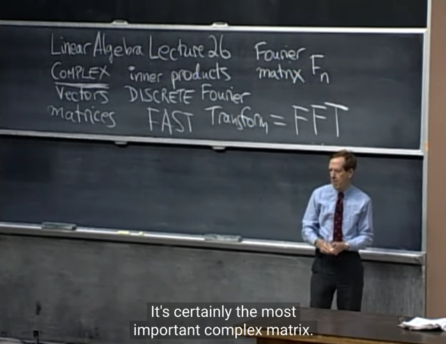</kbd></p>

> [!NOTE]
> Bài này ta sẽ **làm việc với complex matrix**
> và sẽ thấy có một số thay đổi khi so với real matrix

<br>

<a id="node-943"></a>

<p align="center"><kbd>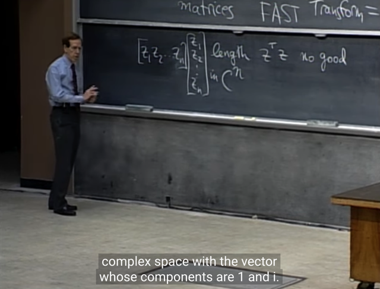</kbd></p>

> [!NOTE]
> Rồi, đầu tiên, là nếu ta deal với vector trong **C^n** (tức là
> không gian vector có **n dimension** nhưng các**giá trị là
> complex**, thay vì chỉ là số thực R)
>
> Đại khái là ta sẽ cần **điều chỉnh chút xíu** khi nói về
> **length** **của vector**. Như có thể thấy,**nếu là R^n**,
> length của vector là **dot product của vector với chính nó
> uTu**.
>
> Tuy nhiên v**ới C^n vector**, điều này không đúng. Đơn
> cử một ví dụ trong C^2, vector u `=` [1, i] tức là hai phần tử
> ```text
> của nó là 1 + 0*i và 0 + 1*i. Khi đó uTu sẽ là 1*1 + i*i = 1 +
> ```
> ```text
> -1 (vì i^2 = -1) Khi đó uTu = 0, dù rằng rõ ràng chiều dài
> ```
> vector hoàn toàn không phải là bằng 0.
>
> Do đó,**cần phải thay đổ**i, và như bữa trước ta đã gặp,
> bằng **cách dùng conjugate**(**số phức liên hợp)**

<br>

<a id="node-944"></a>

<p align="center"><kbd>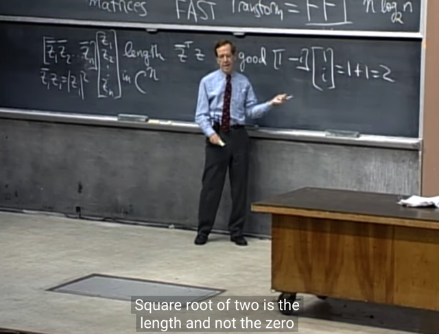</kbd></p>

> [!NOTE]
> **Khi định nghĩa length** bằng **z_bar.Tz**, thì nó trở thành 
> đúng ví dụ **u_barTu** `=` 1*1 `-` i*i `=` 1 `+` 1 `=` 2

<br>

<a id="node-945"></a>

<p align="center"><kbd>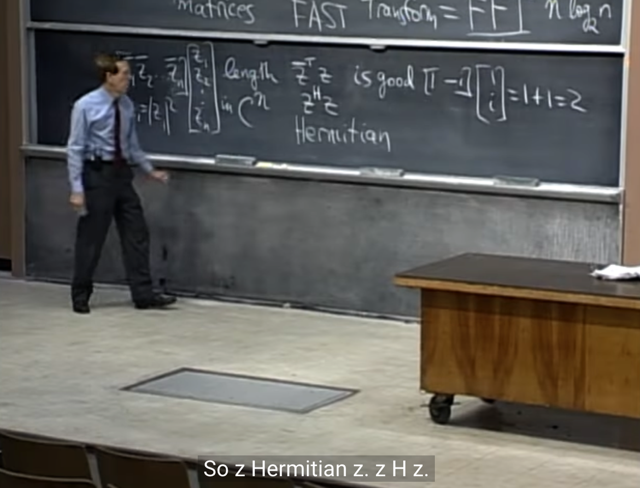</kbd></p>

> [!NOTE]
> Và ta gọi việc **transpose** đồng thời **conjugate** `z_bar.T` là
> **Hermitian** z^H

<br>

<a id="node-946"></a>

<p align="center"><kbd>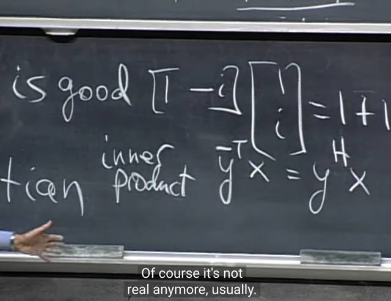</kbd></p>

> [!NOTE]
> Và tương tự với**inner product giữa hai vector khác nhau**
> cũng vậy, **với real value vector thì nó là yTx**, nhưng với
> complex vector thì như đã nói, ta sẽ dùng conjugate. Và
> **inner product giữa y và x** sẽ là: **y_barTx**, hay **yHx**
> (đọc là `"y_Hermit"` `=` vừa transpose vừa lấy conjugate)

<br>

<a id="node-947"></a>

<p align="center"><kbd>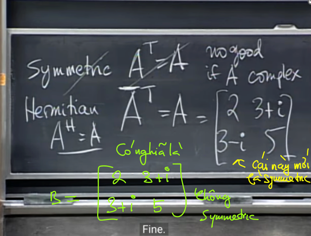</kbd></p>

> [!NOTE]
> Thế thì tương tự, **với complex matri**x, tính chất
> symmetric không còn chỉ thể hiện bởi **AT `=` A**, mà phải
> là **vừa transpose vừa conjugate**. Tức `A_bar.T` hay
> **A_barT `=` `A_hermit` `=` A**.
>
> Ví dụ với matrix này. Có thể thấy khi "hermite", hai
> số trên đường chéo vẫn giữ nguyên, vì phần ảo của
> chúng bằng 0, nên conjugate của chúng cũng vẫn
> là chúng thôi. Còn `3+i,` khi hermite, để chuyển
> xuống dưới đường chéo thì nó sẽ thành  `3-i.` Ngược
> lại `3-i` sẽ thành `3+i.`
>
> Nói chung, với **complex matrix thì đây mới là
> symmetric**chứ không phải là [[2 `3+i][3+i` 5]]

<br>

<a id="node-948"></a>

<p align="center"><kbd>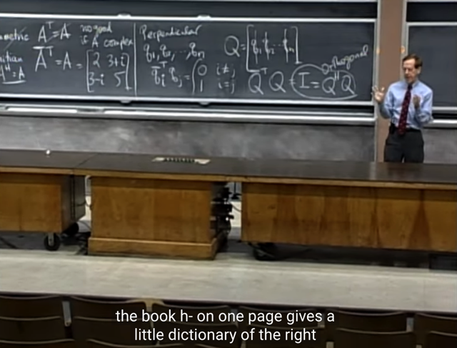</kbd></p>

> [!NOTE]
> Tương tự, với **perpendicular** cũng vậy, trong complex vector
> `/` matrix. **Thay vì nói rằng qTq `=` 0** thì chúng perpendicular,
> thì nay sẽ là **qHq `=` 0**
>
> Và với orthogonal matrix Q mang giá trị complex thì ta sẽ có
> **Q_hermitQ `=` I thay vì QTQ `=` I**.
>
> Nói chung đây chỉ là **những thay đổi chút xíu khi ta deal với
> complex vector `/` matrix** thay vì real vector matrix

<br>

<a id="node-949"></a>

<p align="center"><kbd>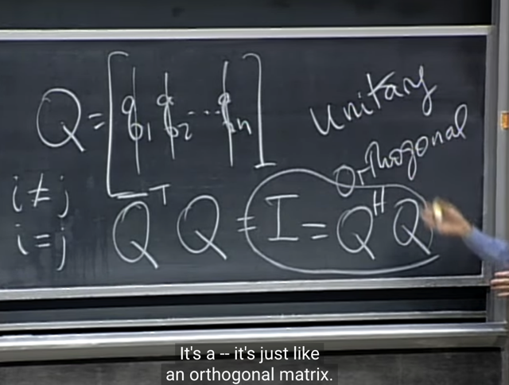</kbd></p>

> [!NOTE]
> Và người ta thường dùng từ khác, thay cho orthogonal
> trong trường hợp complex matrix: **Unitary**

<br>

<a id="node-950"></a>

<p align="center"><kbd>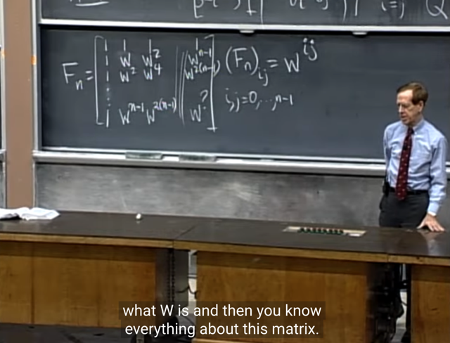</kbd></p>

> [!NOTE]
> Tiếp theo ta sẽ tìm hiểu qua **một complex matrix quan
> trọng** nhất: **Fourier matrix**.
>
> Dạng tổng quát của nó là thế này: phần tử thứ i, j là
> **w^(i*j)** với **i, j bắt đầu từ 0 đến n-1**Ví dụ cột 1 (với `j=0,` i `=` 0,1,...) đương nhiên i*j `=` 0, thành
> ra mọi component của cột 1 đều là w^0 `=` 1
>
> Tương tự hàng 1 cũng vậy `(i=0,` `j=0,1,2...)`
>
> ```text
> Cột 2: j=1, i=0,1,2... => cột 2 sẽ là w^0=1, w^1=w, w^2, w^3...
> ```
>
> ```text
> Cột 3: j=2, i=0,1,2... => cột 3 sẽ là w^0=1, w^2, w^4...
> ```
>
> Cột 4: `j=3,` `i=0,1,2...` `=>` cột 4 sẽ là 1, w^3, w^6

<br>

<a id="node-951"></a>

<p align="center"><kbd>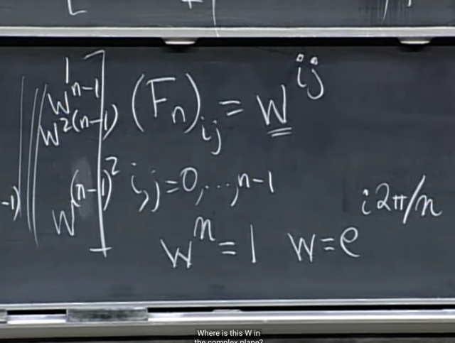</kbd></p>

> [!NOTE]
> Và trong đó w là một con số đặc biệt: **w^n `=` 1**, và
> vì vậy w sẽ là**e^i*2π/n**. Note sau sẽ giải thích vì sao.

<br>

<a id="node-952"></a>

<p align="center"><kbd>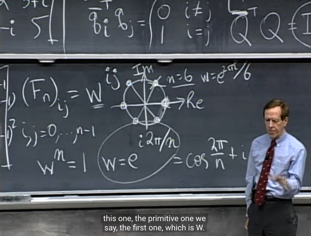</kbd></p>

> [!NOTE]
> Thế thì với complex number ta nhớ là **có thể biểu diễn w
> theo công thức Euler**: w `=` **e^iθ** và cũng bằng **cos(θ) `+`
> i*sin(θ)** (Cần bổ sung kiến thức về complex number)
>
> Vậy thì**w là số mà w^n `=` 1**,
>
> `<=>` **(e^iθ)^n `=` 1** `<=>` **e^iθn `=` 1**
>
> Đặt `α` `=` `θn` thì
>
> e^i**θn** `=` 1 `<=>` e^i**α** `=` 1
>
> ```text
> <=> cos(α) + i*sin(α) = 1
> ```
>
> `=>` `α` `=` `2π` `=>` **θ `=` 2π/n**
>
> Vậy **w `=` `e^i*2π/n` là công thức tổng quát của w**
>
> Và v**ới các n khác nhau thì nó sẽ là các điểm trên unit
> circle**

> [!NOTE]
> Cần bổ sung kiến thức về
> complex number

<br>

<a id="node-953"></a>

<p align="center"><kbd>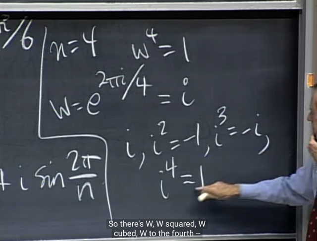</kbd></p>

> [!NOTE]
> Ví dụ, n `=` 4, thì w là số complex sao cho w^4 `=` 1, từ đó
> ta sẽ tìm cụ thể w là số mấy khi n `=` 4 như sau.
>
> Từ dạng khái quát của complex number w:
>
>  khi n `=` 4 thì
>
> w `=` `e^i*2π/n=` `e^i*2π/4` `=` **e^i*(π/2)** 
>
> ```text
> Và lắp vào công thức e^i*θ = cosθ + i*sinθ ta có:
> ```
>
> `e^i*(π/2)` `=` `cos(π/2)` `+` `i*sin(π/2)` `=` 0 `+` i*1 `=` **i**
>
> **Tức là với n `=` 4 thì w chính là i. 
>
> để rồi ta thử check lại xem có phải w^4 `=` 1 không.**thì rõ ràng i^2 `=` `-1,` i^3 `=` i*i^2 `=` `i(-1)` `=` `-i,` i^4 `=` i*i^3 `=` `i*(-i)` 
> `=` `-i^2` `=` `-(-1)` `=` **1
>
> Vậy là đúng.**

<br>

<a id="node-954"></a>

<p align="center"><kbd>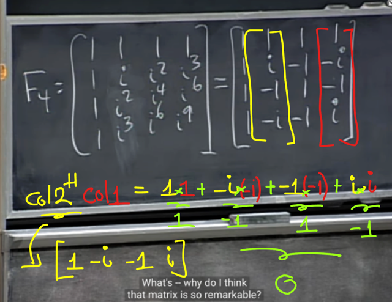</kbd></p>

> [!NOTE]
> Từ đó ta có F4 (khi n `=` 4, như mới nói, w `=` i)
>
> Nên hàng 1, cột 1 bằng 1 hết biết rồi, vì đều bằng w^0 `=` 1
>
> Còn cột 1 sẽ là: i^0 `=` **1**, i^1 `=` **i**, i^2 `=` **-1**, i^3 `=` i*i^2 `=` **-i, 
> i^4 `=` i^2*i^2 `=` `(-1)(-1)` `=` 1...**
>
> Nên cột 1 sẽ là **0, i, `-1,` `-i,` 1...**
>
> Cột 2 sẽ là: i^0=**1**, `i^2=` **-1**, `i^4=` **1, i^6 `=` -1,...**
>
> Và gs cho biết matrix này có **các ORTHOGONAL COLUMNS**:
>
> Ví dụ lấy cột 2 inner product với cột 4, nhớ rằng ta
> **đang làm việc với complex vector** nên **inner product
> thật ra là [cột 2]_ hermit.[cột 4]** 
>
> Tức là **transpose** cột 2  và **conjugate (đổi dấu phẩn ảo**) rồi 
> nhân với cột 4
>
> Kết quả sẽ là 0

<br>

<a id="node-955"></a>

<p align="center"><kbd>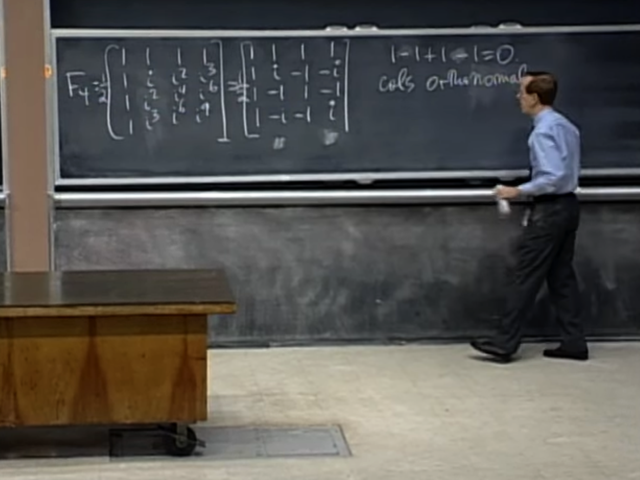</kbd></p>

> [!NOTE]
> Và ta có thể**chia cho 2 để có các ORTHONORMAL
> columns**, khi đó matrix là **ORTHOGONAL MATRIX
> (vì square matrix có các column orthonormal)**

<br>

<a id="node-956"></a>

<p align="center"><kbd>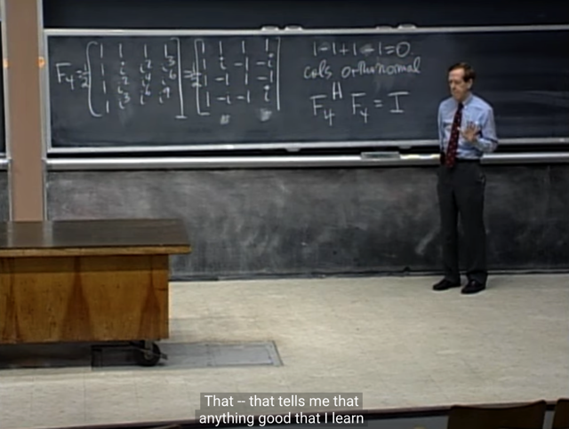</kbd></p>

> [!NOTE]
> Và ta như đã biết với orthogonal matrix Q, QTQ `=` I.
> Nên **F4_hermit.F4 `=` I**

<br>

<a id="node-957"></a>

<p align="center"><kbd>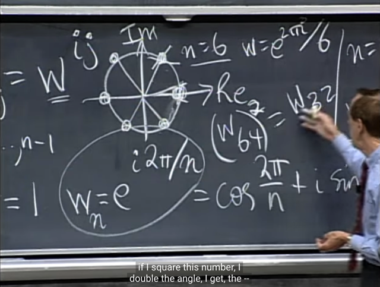</kbd></p>

> [!NOTE]
> đại khái là gs bắt đầu nói về cái hay ho của **Fourier**
> matrix. Đó là **(w64)^2 sẽ chính là w32**
>
> với w64 chính là phần tử của matrix F64 (đương nhiên
> là một 64x64 matrix). 
>
> Còn w32 là phần tử của F32 `-` là một 32x32 matrix.
>
> Và đây cho ta **connection** giữa hai matrix **F64 và F32**

<br>

<a id="node-958"></a>

<p align="center"><kbd>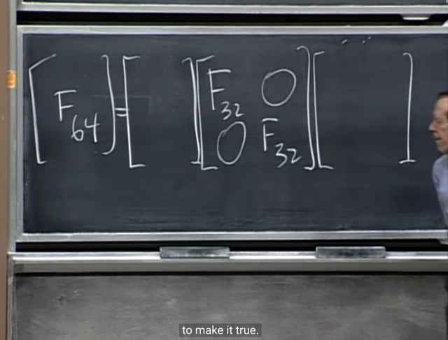</kbd></p>

> [!NOTE]
> Và đây là connection: Đại khái là, **F64 có thể được phân
> tách thành một product của 3 matrix**. Trong đó matrix ở
> giữa **cấu thành bởi 2 F32 matrix**.
>
> Ý tưởng chính đó là, giả sử khi ta phải **nhân với một
> matrix F64**, thì ta **cần 64^2 phép tính multiplication**.
>
> (Ví dụ nhân matrix A với vector x, dễ thấy mỗi phần tử của
> vector kết quả sẽ là dot product của c với một hàng của
> matrix A, bao gồm 64 phép nhân, và có 64 hàng nên tổng
> cộng là 64^2 phép nhân
>
> Thì, **bằng cách phân tách** này, ta sẽ **chỉ tốn ít hơn**
> thay vì 64^2 phép tính mà thôi, vì matrix ở giữa tạm hiểu
> là có 1 nửa là zero rồi.
>
> Điều này dễ thấy, dùng lại matrix A nói trên, vì đã phân
> tách thành BCD với Bê Đê chưa biết sẽ nói sau, còn C thì
> có dạng gồm hai matrix F32 như vậy thì có nghĩa là mỗi
> hàng của nó chỉ có một nửa là khác 0, một nửa là bằng 0.
> Nên dễ hiểu khi nhân với vector x, đại khái là sẽ giảm một
> nửa phép tính (đương nhiên còn phải xét đến hai matrix
> Bê Đê nhưng đại khái là vậy)

<br>

<a id="node-959"></a>

<p align="center"><kbd>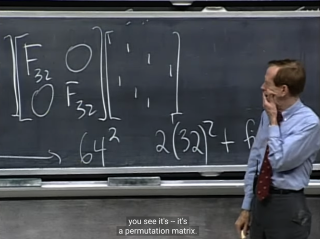</kbd></p>

> [!NOTE]
> Ở bên phải **sẽ là một Permutation matrix**, nó làm nhiệm
> vụ là **sắp xếp lại các phần tử của x** (ý là khi nhân F4x
> thì sẽ bằng nhân {tích của 3 cái matrix này} cho x, thì đầu
> tiên đương nhiên x sẽ được **"tiếp xúc" với Permutation
> matrix trước**Ôn lại lại Permutation matrix, ta đã biết nó cơ bản là
> matrix I được đổi chỗ các row, và ko liên quan nhưng nói
> luôn, nó sẽ có det `=` `+` hoặc `-1` tùy số lần switch row là chẵn
> hay lẻ (dựa vào tính chất của determinant, là khi switch
> row thì det đổi dấu)

<br>

<a id="node-960"></a>

<p align="center"><kbd>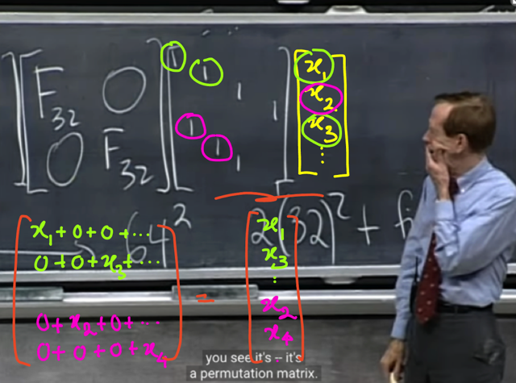</kbd></p>

> [!NOTE]
> Và cụ thể P sẽ **xếp các component ở vị trí lẻ của x lên
> trên**, và những component ở**vị trí chẵn xuống dưới**Để dễ hiểu ta sẽ dùng "góc nhìn row" khi nhân P với x, đó
> là ta coi x như matrix có 1 cột, n hàng. Thì khi nhân Px mỗi
> hàng của P, ví dụ hàng 1, p1 khi nhân với x sẽ tạo một linear
> combination của các hàng của x, với coefficient là các
> component của p1.
>
> Thành ra, nếu P có giá trị như hiện tại, p1x sẽ `=` 1*x1 `+` 0*x2
> `+..` 0*xn và kết qủa là x1, mang ý nghĩa là "P giữ nguyên,
> không động tới x1"
>
> Nhưng qua hàng 2 của P, gọi là p2, nó có giá trị theo thầy
> đang viết chính là (0,0,1,0,...0). Khi đó nhân với x, nó sẽ cho
> ra x3 Và như vậy P khi nhân với x, nó đã thay x2 (trong
> vector x) bằng x3 (trong vector Px)
>
> Tiếp tục như vậy, thì đến nửa sau, ví dụ hàng 10 của P là (0,
> 1,0,..0) thì nhân với x mới cho ra x2.
>
> Vậy có nghĩa là, khi nhân với P, nó đã đảo vị trí của các
> phần tử của x, để x1, x3, x5... nằm trên, rồi mới tới x2, x4, ...
> .
>
> Do đó mới nói P sắp xếp lại để xếp các component ở vị trí lẻ
> của x lên trên, và những component ở vị trí chẵn xuống
> dưới

<br>

<a id="node-961"></a>

<p align="center"><kbd>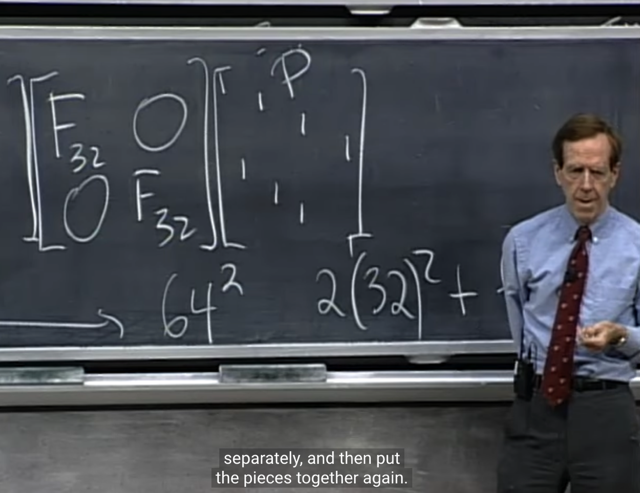</kbd></p>

> [!NOTE]
> sau đó kiểu như nó sẽ **apply mỗi F32 với mỗi phần
> riêng biệt**. Và cuối cùng bỏ vào lại.
>
> Là sao? Có nghĩa là sau khi Px (nhắc lại, matrix A ban
> đầu, là một F64 matrix) được phân tách thành BCD.
>
> Nên nhân A cho x: Ax sẽ `=` BCDx `=` BC(Dx)
>
> Rồi, BCD là đặt tên vậy thôi, chứ D là một Permutation
> matrix, gs gọi nó là P. Vậy Ax `=` BCPx.
>
> Để tính phép nhân này, đương nhiên ta sẽ tính Px trước,
> sau đó nhân kết quả Px (là vector có giá trị y như x, chỉ
> có cái là đổi chỗ, xếp mấy thằng lẻ lên đầu, mấy thằng
> chẵn xuống dưới: để từ (x1,x2,x3...) .thành (x1,x3,....x2,x4..)
>
> Thế thì khi nhân Px cho C, mà C có dạng là matrix có 2 cái
> cục F32 như nãy đã nói, thì đương nhiên, nhìn theo góc nhìn
> row khi nhân matrix cho vector ta cũng sẽ thấy cái cục F32
> ở trên sẽ apply cho một nửa trên của x, tức là các entries số
> lẻ. và cái cục F32 ở dưới sẽ apply cho nửa dưới của x, là
> các entries số chẵn.

<br>

<a id="node-962"></a>

<p align="center"><kbd>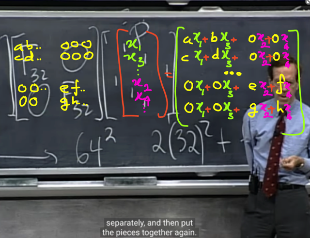</kbd></p>

> [!NOTE]
> có thể hiểu điều này, rõ ràng là **F32 ở "trên"** sẽ **chỉ
> "apply" với nửa trên của x** (x này là kết qủa sau khi
> đã được xắp xếp lại bởi P). Và **F32 ở dưới** sẽ chỉ
> **"apply" với nửa dưới cuả x** ứng với các item có index
> chẵn trong x ban đầu

<br>

<a id="node-963"></a>

<p align="center"><kbd>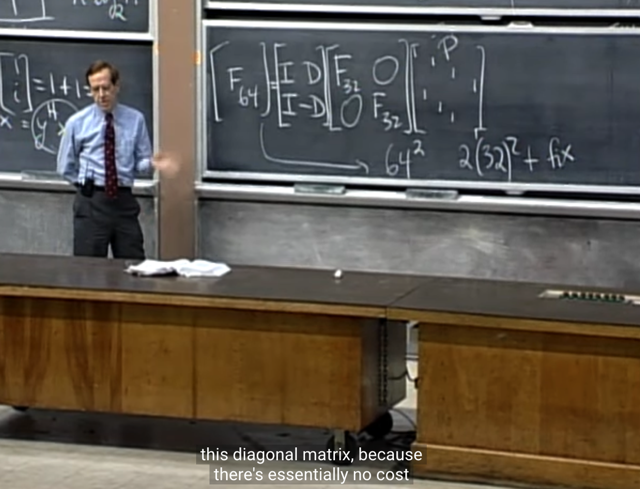</kbd></p>

> [!NOTE]
> Và **matrix bên trái** bao gồm các **Identity** và
> **D** (là diagonal matrix) sẽ **làm nhiệm vụ "Sắp xếp lại"**

<br>

<a id="node-964"></a>

<p align="center"><kbd>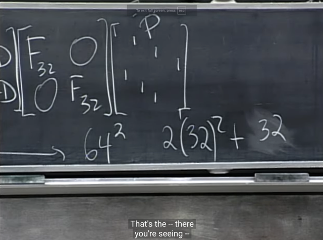</kbd></p>

> [!NOTE]
> và ta sẽ thấy việc **nhân với P hay các I matrix không "
> tốn"**, thành ra tốn kém các phép tính toán sẽ c**hỉ rơi
> vào khi ta tính với F32**, (2 cái, mỗi cái tốn 32^2 phép
> tính).
>
> Và khi nhân với Diagonal matrix chỉ tốn có 32 (?)
>
> Chỗ này chưa hiểu lắm tại sao là 32, nhưng có thể không
> quan trọng
>
> Có thể thấy khi nhân với P, vì mỗi hàng của P chỉ có mỗi
> một vị trí khác 0, nên nếu tính phép nhân thì chỉ tốn có 1
> phép nhân cho mỗi hàng, thành ra tổng cộng có 64  phép
> nhân. Nói chung chỗ này có thể không quan trọng lắm, vì
> dù là 64 hay vài ngàn thì nó cũng rất nhỏ so với 64^2.
>
> Cái chính là so với 64^2, việc chuyển thành 3 matrix
> khiến số phép tính chỉ ~ 2*(32^2) `=` **2048** nhỏ hơn một
> nửa so với 64^2 `=` **4096**

<br>

<a id="node-965"></a>

<p align="center"><kbd>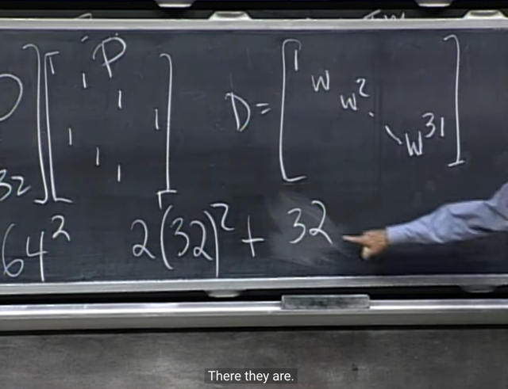</kbd></p>

<br>

<a id="node-966"></a>

<p align="center"><kbd>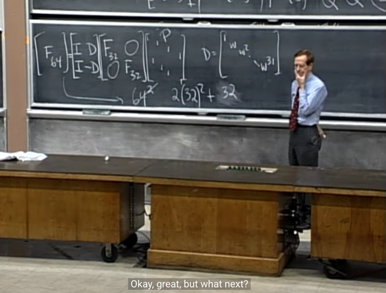</kbd></p>

> [!NOTE]
> Đó **chính là Fast Fourier transform**. ý tưởng chính là
> **thay vì tốn 64^2 phép tính** thì ta sẽ **giảm đi rất nhiều**

<br>

<a id="node-967"></a>

<p align="center"><kbd>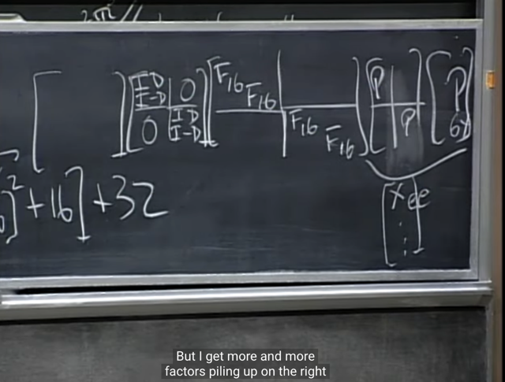</kbd></p>

<p align="center"><kbd>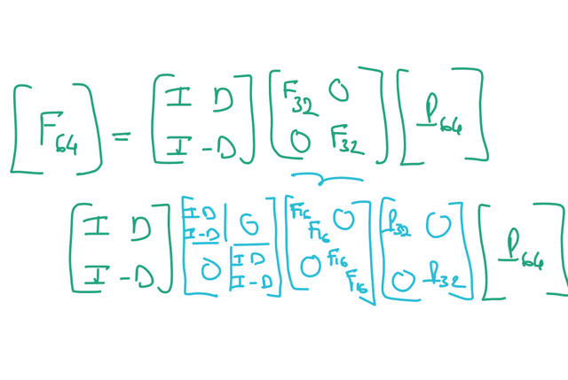</kbd></p>

<p align="center"><kbd></kbd></p>

<p align="center"><kbd></kbd></p>

<p align="center"><kbd>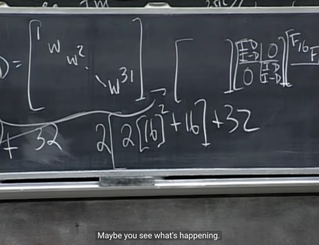</kbd></p>

> [!NOTE]
> và điều này giúp ta tiếp tục thay vì tốn
> 32^2 thì sẽ là 2*16^2 `+` 16

> [!NOTE]
> Tiếp tục áp dụng cách làm tương tự để factor
> F32 ra nữa

<br>

<a id="node-968"></a>

<p align="center"><kbd>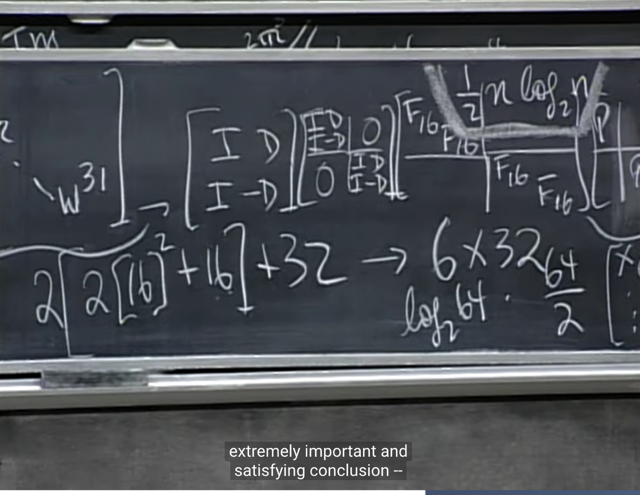</kbd></p>

> [!NOTE]
> Từ đó **thay vì n^2**ta sẽ chỉ tốn
> **(1/2)nlog(n)** phép tính

<br>

<a id="node-969"></a>

<p align="center"><kbd>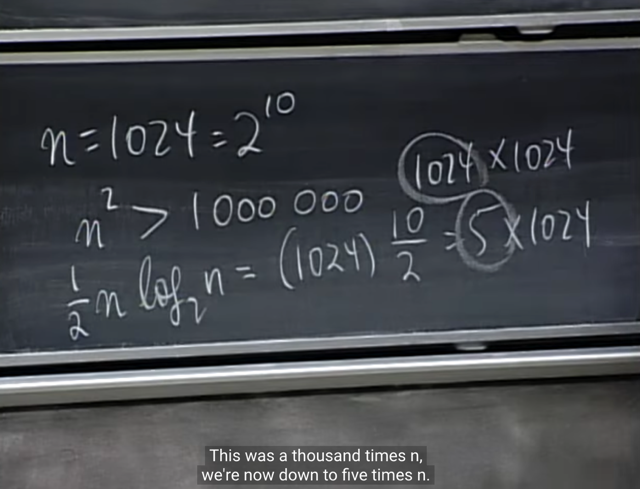</kbd></p>

> [!NOTE]
> Ví dụ với n `=` 1024 thì việc factoring đã giảm số tính
> toán từ n**^2 (> 1 triệu)** xuống **chỉ còn 5*1024**, tức **giảm
> gần 200 lần**

<br>

