# Lecture 27: Positive Definite Matrices And Minima

📊 **Progress:** `39` Notes | `41` Screenshots

---

<kbd></kbd>

> [!NOTE]
> Bài này ta sẽ **tiếp tục thảo luận về Positive Definite
> (Symmetric)** matrix, trong đó ta **gom lại mọi thứ** đã
> học từ đầu tới giờ: **pivot**, **determinant**,
> **eigenvector**... Và có thêm một người bạn mới đó là
> **xTAx (quadratic form)
>
> CHÚ Ý, POSITIVE DEFINITE là nói về SYMMETRIC thỏa
> mãn  các tính chất như mọi eigenvalue đều dương, ...
>
> Đồng nghĩa khi nói về positive definite matrix, đương
> nhiên đang nói về symmetric matrix**

 

<kbd>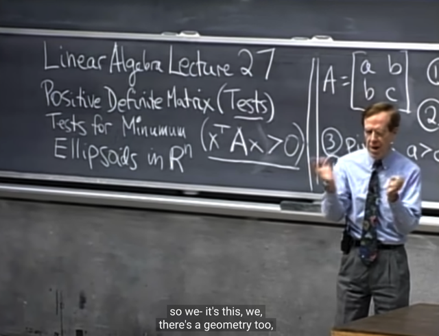</kbd>

> [!NOTE]
> Và ta sẽ trả lời câu hỏi, khi nào thì matrix là **POSITIVE
> DEFINITE**. Rồi, việc dùng nó cho **bài toán tìm cực tiểu.**

 

<kbd></kbd>

> [!NOTE]
> Vậy thì như bài trước ta đã biết **3 phép thử** cần pass để
> một matrix là **POSITIVE DEFINITE matrix**:
>
> **(CHỈ CẦN PASS MỘT TRONG SỐ CHÚNG)**
>
> i) **Mọi EIGENVALUES đều DƯƠNG** (bằng 0 thì nó thành
> singular rồi)
>
> ii) **Mọi DETERMINANTS của các sub-matrix đều DƯƠNG**
> (các submatrix là các matrix từ nhỏ đến to dần đi từ góc trái
> bên trên)
>
> ii) **Mọi PIVOT đều dương**

 

<kbd>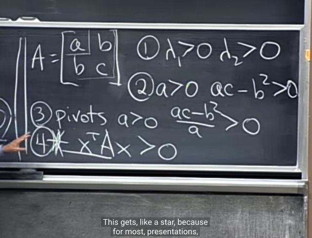</kbd>

> [!NOTE]
> Và ta sẽ có **thêm một phép thử quan trọng** nữa đó là
> **4) QUADRATIC FORM xTAx >= 0**, và **CHỈ BẰNG 0 KHI x = 0**

 

<kbd>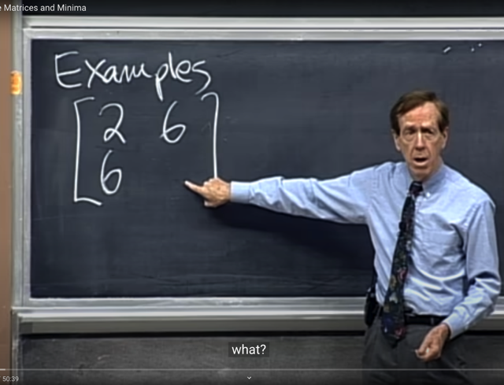</kbd>

> [!NOTE]
> gs: ví dụ matrix này, ta sẽ**cần điều kiện gì** cho con số này
> để **matrix P.D (positive definite)**?
>
> me: ta có thể **dùng điều kiện det** của matrix 2x2 **dương**
> (submatrix [2] thì đã có det dương rồi) -> như vậy phải
> **lớn hơn 18**

 

<kbd>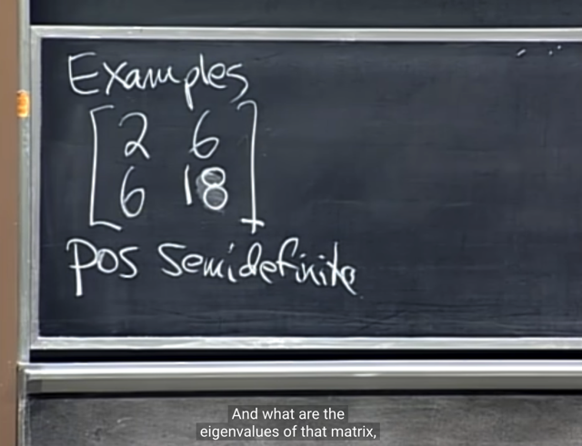</kbd>

> [!NOTE]
> gs: correct, thế thì **với con số 18**, ta sẽ có **det = 0**, và
> ta như đang ở **RANH GIỚI** của việc Positive Definite (nhỏ
> hơn 18, det âm)
>
> Và ta gọi trạng thái ranh giới đó là **POSITIVE SEMI
> DEFINITE
>
> Eigenvalue bằng mấy?**me: vì det = 0 nên **một eigenvalue = 0**, từ **trace** **suy ra
> cái kia là 20**

> [!NOTE]
> **SYMMETRIC** MATRIX CÓ EIGENVALUE **DƯƠNG**
> HOẶC **BẰNG 0**, THÌ GỌI LÀ **POSITIVE SEMI
> DEFINITE**

 

<kbd>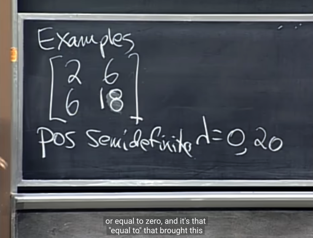</kbd>

> [!NOTE]
> gs: correct, và vì eigenvalue có thể bằng 0, nên ta có tính
> chất của **Positive Semi Definite** là **eigenvalue**
> **KHÔNG ÂM**Pivot bằng mấy?
>
> Me: 2 và 0 (có nghĩa là, sẽ chỉ có một pivot bằng 2, chứ
> nói pivot kia = 0 thì ko đúng, nhưng ý là vị trí thứ 2 trên
> đường chéo của U) 
>
> Có thể**tính ra 0** nhờ nhẩm tính việc
> elimination: Pivot đầu tiên đương nhiên = 2 (vị trí khác 0
> ở đầu cột 1). Để eliminate vị trí a21, ta trừ hàng 2 cho 3 
> lần hàng 1, để có hàng 2 là [0, 0], vậy vị trí thứ 2 trên 
> đường chéo bằng 0)  
>
> Nhưng cũng có thể l**ập luận thế nà**y:
>
> Ta đã biết dựa trên các tính chất của determinant như khi
> cộng row cho multiple của row kia thì det không đổi, hay
> switch row thì  chỉ đổi dấu của det elimination không làm
> thay đổi giá trị tuyệt đối của det, nên det U = +/- det A. Mà
> det A = 0 vì nó singular nên det U cũng bằng 0.
>
> Mà  ta cũng biết với triangular matrix det =**tích các
> component trên đường chéo** **phải có một cái =
> 0**, nên cái đầu bằng 2 (vì rõ ràng vị trí 1,1 khác ko thì 
> chính là pivot đầu tiên) rồi thì cái kia phải bằng 0.
>
> Như vậy nó **không pass pivot test** (nhắc lại để
> **positive definite thì pivot phải > 0)**====
> ****Một cách khác cũng gần với cách 1, đó là ta thấy hàng
> 2 = 3*hàng 1, tức là, nó depend hàng 1. Vậy kết luận
> ngay khi elimination, hàng 2 sẽ bị biến thành 0. => vị
> trí thứ 2 của đường chéo = 0

 

<kbd>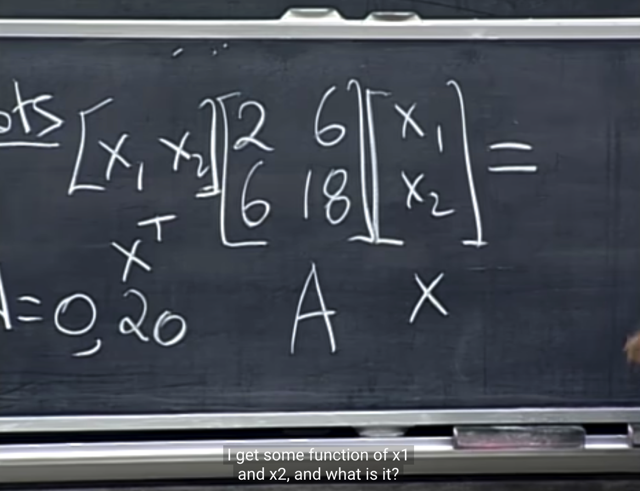</kbd>

> [!NOTE]
> Ta sẽ thử tính **xTAx**

 

<kbd>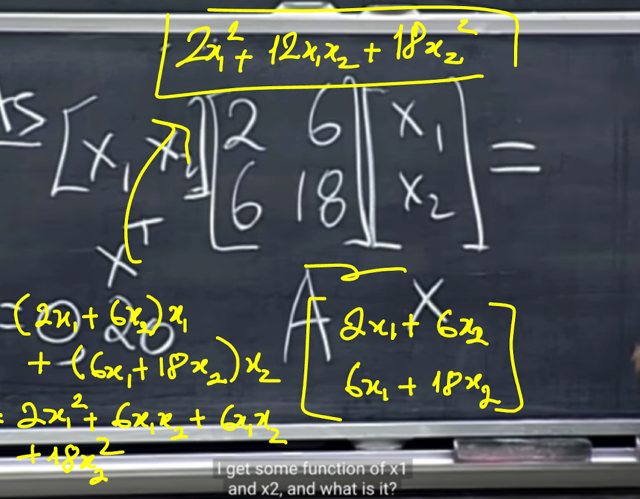</kbd>

 

<kbd>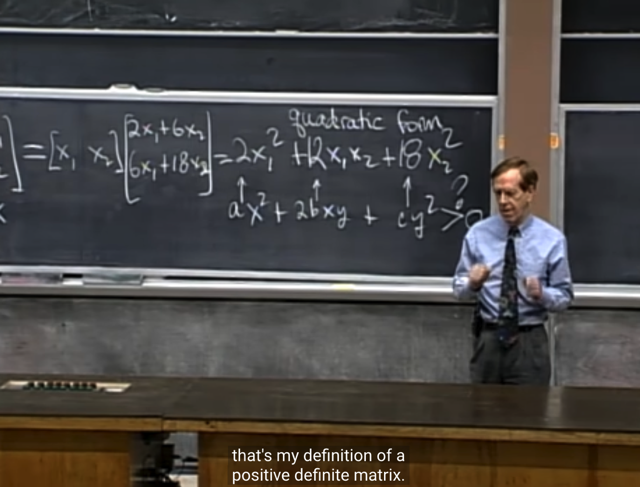</kbd>

> [!NOTE]
> Và đây được gọi là **QUADRATIC FORM**, tức là, mọi biểu
> thức **đều là bậc 2**. 
>
> Và nếu nó **luôn DƯƠNG với MỌI x** thì matrix **A chắc chắn
> là Positive Definite matrix**

> [!NOTE]
> Nếu **QUADRATIC** FORM xTAx luôn **DƯƠNG** với **MỌI x**
> thì matrix A chắc chắn là **POSITIVE** **DEFINITE**

 

<kbd>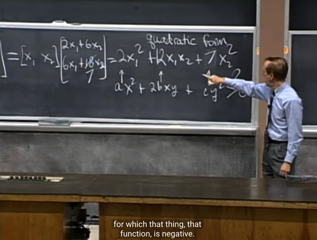</kbd>

> [!NOTE]
> đại khái là gs lấy giá trị khác, ví dụ bằng 7 thay vì 18, để
> ta xét trường hợp mà matrix **chắc chắn không positive
> definite**. (bởi lẽ **det bây giờ âm**)
>
> Mục đích là ta sẽ **tìm ra một x khiến quadratic form âm**

 

<kbd>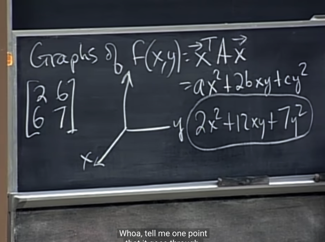</kbd>

> [!NOTE]
> và ta sẽ **vẽ đồ thị của quadratic function** (2 biến x, y) này

 

<kbd>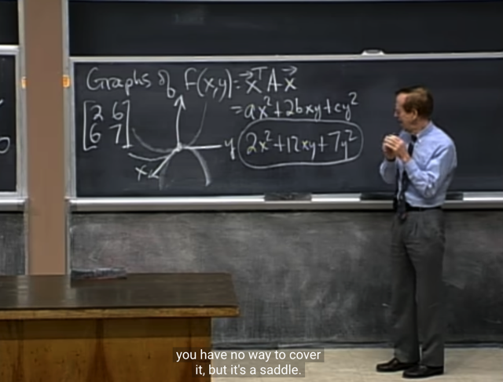</kbd>

> [!NOTE]
> Và đại khái là đây là trường hợp mà ta sẽ có một **SADDLE
> POINT** - **HÌNH YÊN NGỰA** - khi function **tăng ở một số
> direction này** và **giảm ở direction khác**Bởi vì đây, như đã biết, nó không phải là Positive Definite
> **Nếu nó là Positive Definite**, ta sẽ có dạng đồ thị là **cái tô
> khi function tăng ở mọi direction.**

 

<kbd>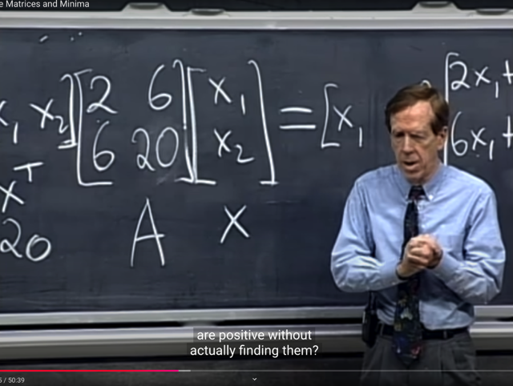</kbd>

> [!NOTE]
> rồi, bây giờ ta sẽ thay 7 bằng **20** (> 18, để có **det > 0**), và
> xem thử ta có một Positive Definite không. Đầu tiên gs cho
> rằng **điều kiện pivot đã thỏa**, khi chắc chắn hai pivot dương.
>
> Tiếp theo ta sẽ kiểm tra **điều kiện của eigenvalue**. gs hỏi
> **làm sao ta biết chúng dương** hay không mà không cần
> tính?
>
> me: Vì ta có**det dương** tức là **tích các eigenvalue dương**,
> và **trace là tổng các eigenvalue cũng dương** suy ra các
> eigenvalue dương

 

<kbd>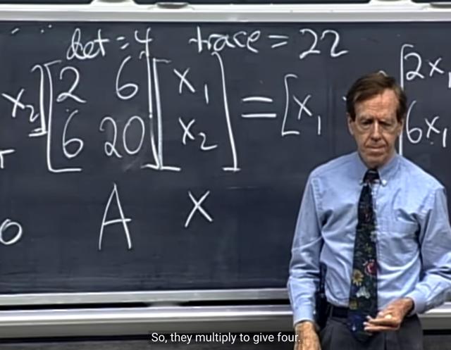</kbd>

> [!NOTE]
> gs: Correct

 

<kbd>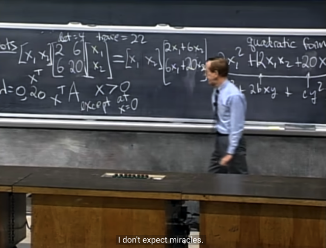</kbd>

> [!NOTE]
> **và điều kiện các "sub det" dương hết cũng thỏa**, gs cho
> rằng ta sẽ expect **xTAx sẽ DƯƠNG VỚI MỌI X KHÁC 0**,
> VÀ **BẰNG 0 = MINIMUM TẠI X = 0**

 

<kbd>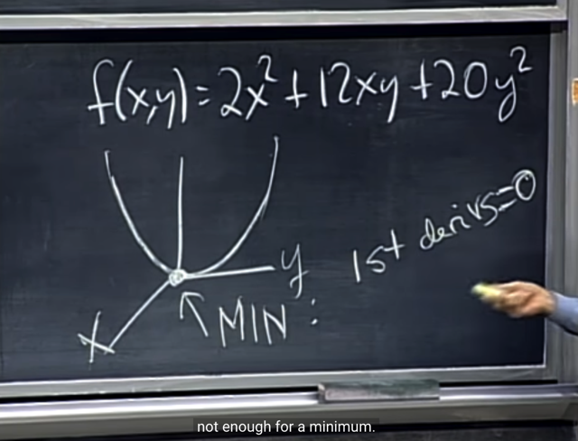</kbd>

> [!NOTE]
> Và đồ thị của **nó sẽ là cái tô** như nãy nói, với **min tại
> 0**, thế thì ta sẽ có **1st derivative tại đó sẽ = 0**Đã học từ 1801,1802. Đây là **CRITICAL POINT**, nơi
> mà độ dốc của tiếp tuyến của f = 0 (derivative, hoặc đúng
> hơn partial derivative ∂f/∂x, ∂f/∂y = 0)

 

<kbd>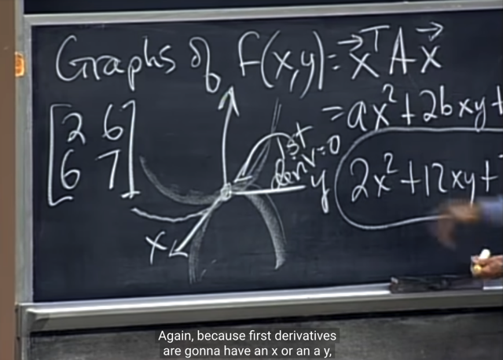</kbd>

> [!NOTE]
> Tuy nhiên gs nhắc nhở rằng chỉ dựa vào 1st derivative = 0
> thì **không đủ kết luận đó là M**, vì **SADDLE POINT
> CŨNG CÓ 1ST DERIVATIVE = 0 TẠI 0**
>
> Cái này thì liên hệ với 1801, 1802 đã học, critical point có
> thể  là minimum, maximum, hoặc saddle point (1801 thì gọi
> là ko phải min cũng ko phải max, nhưng không nói về
> saddle point, 1802 mới nhắc đến saddle point)
>
> Và **2ND DERIVATIVE** MỚI **GIÚP TA BIẾT** **CÓ PHẢI
> LÀ MINIMUM HAY KHÔNG**Theo 1801, ta sẽ xác định bằng cách kiểm tra giá trị của
> function tại biên (**endpoint)**Và qua**1802 ta có SECOND
> DERIVATIVE TEST**

 

<kbd>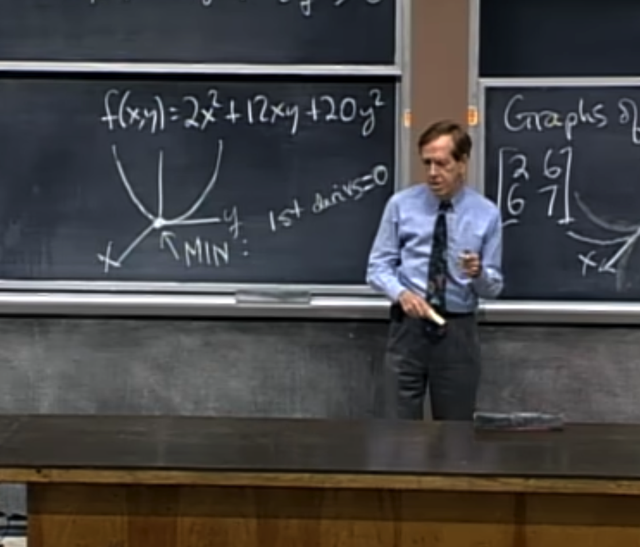</kbd>

> [!NOTE]
> Theo gs thì **trong calculus** ta đã biết, để biết một điểm
> function có đạt cực trị không ta sẽ **xem 1st derivative có
> bằng 0 không**. Nhưng đ**ể biết nó là minimum hay
> maximum, ta phải xét 2nd derivative**.
>
> Và nếu 2nd derivative dương, tức là**độ dốc của độ dốc**
> dương - **độ dốc của hàm số đang tăng lên**. Thì có
> nghĩa là tại đó là MINIMUM.
>
> Và **2nd derivative cũng sẽ là một matrix**, chứa các **2nd
> derivative của hàm số w.r.t các variable**. và ta sẽ xét xem 
> matrix đó có **positive definite không**

 

<kbd>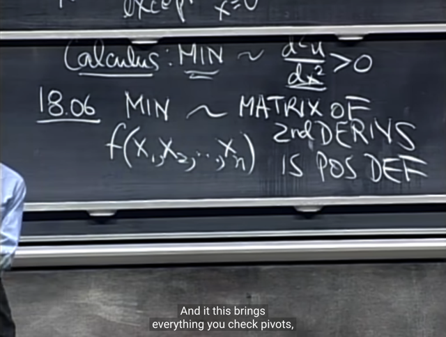</kbd>

> [!NOTE]
> đại ý là gs liên hệ từ **calculus**, ta sẽ xác định minimum của
> hàm số bởi hai điều kiện là **tại đó**: 
>
> i) **First derivative bằng 0** (để có CRITICAL POINT)
>
> ii) **Second derivative test: f_xx dương và (fxx*fyy - fxy^2) > 0**
>
> Còn **với 18.06**, điều kiện đó được chuyển thành **matrix
> 2nd derivative có tính chất POSITIVE DEFINITE**

 

<kbd>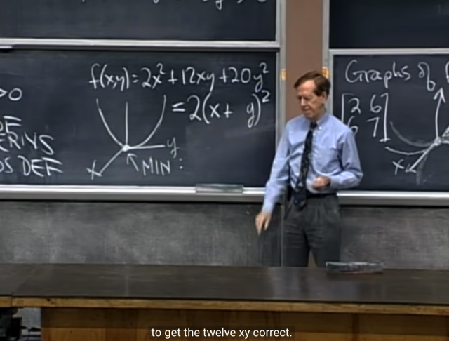</kbd>

> [!NOTE]
> gs hỏi rằng, **làm sao biết function này luôn dương**?
>
> Thế thì **nếu có thể biểu diễn hàm số này dưới dạng
> square hoặc tổng square** của nhiều cái gì đó thì ta sẽ
> trả lời được câu hỏi trên.

 

<kbd>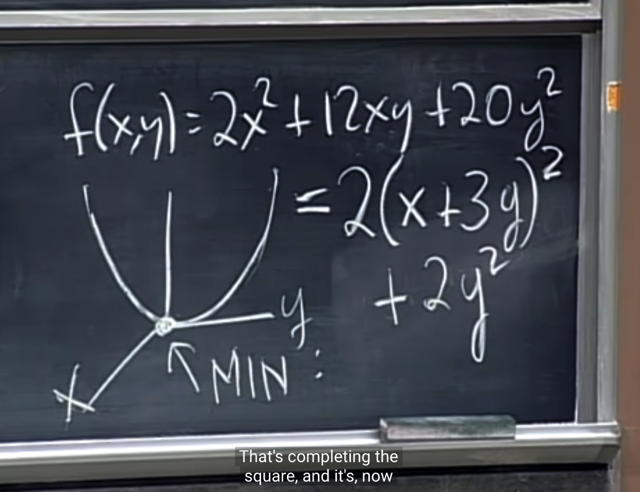</kbd>

> [!NOTE]
> và **sự thật**hàm số này **có thể được biểu diễn thành
> tổng của hai cái "square"** này (gs gọi là **COMPLETE
> THE SQUARE)**

 

<kbd>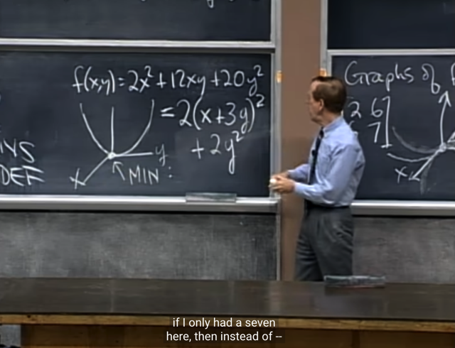</kbd>

> [!NOTE]
> Thế thì lướt lại nếu **như ta có 18y^2 thay vì 20** (mà hồi nãy
> nói là đây là **marginal** case) thì có thể thấy khi đó ta sẽ có
> **2(x+3y)^2 + 0y^2**, **vẫn đảm bảo function luôn ko âm**.
>
> Nhưng **dưới mức đó** (cái mức mà ta xác định cho d để
> matrix [[a b][c d]] có det dương), ví dụ như 17y^2, thì nó sẽ
> thành ra 2(x+3y)^2 **- y^2,** rõ ràng **dấu (-) không giúp đảm
> bảo function luôn không âm**

 

<kbd>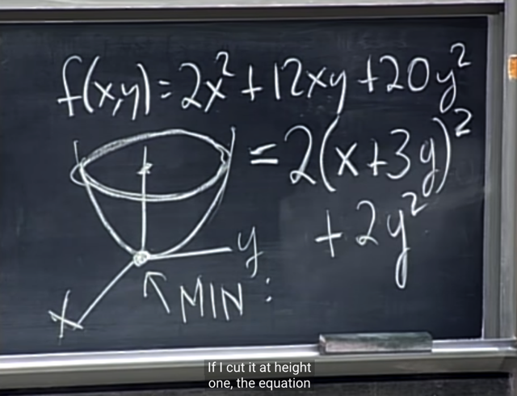</kbd>

> [!NOTE]
> Và sự thật ta có **đồ thị của function sẽ có dạng cái tô**,
> hướng lên trên, **đáy tô ở (0,0)** và nếu cắt cái tô bởi
> mặt phẳng z = 1 thì ta sẽ có đường elipe của equation:
> 2x^2 + 12xy + 20y^2 = 1

 

<kbd>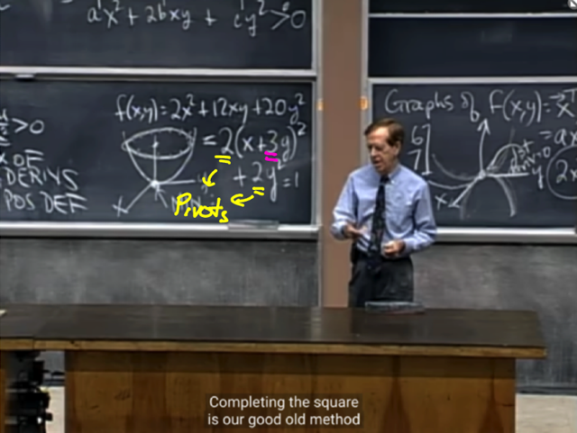</kbd>

> [!NOTE]
> Và gs cho biết các con số**2,3,2** ở trong kết quả của
> "completing the square" **thật ra chính là kết qủa của
> elimination**

 

<kbd>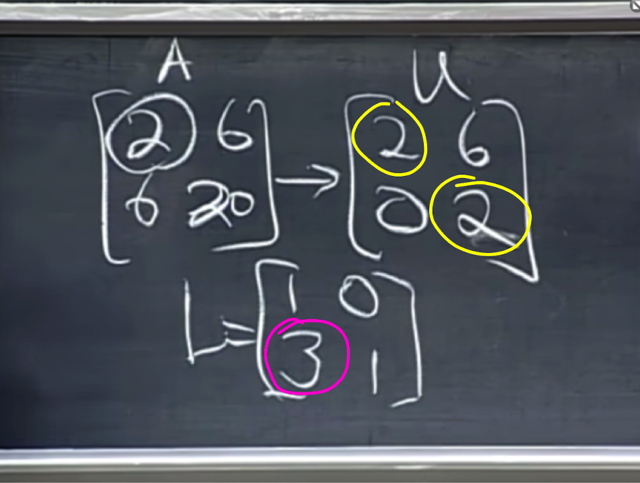</kbd>

> [!NOTE]
> Hai hệ số gắn với **square term chính là 2 pivot**, và số
> **3** chính là của **L matrix**(thể hiện ở bước trừ hàng 2
> cho 3 hàng 1 để khử a22 = 6)

 

<kbd>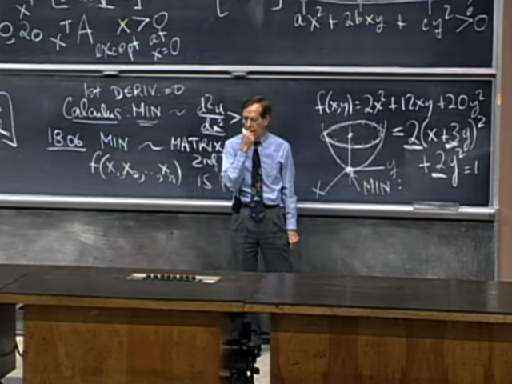</kbd>

> [!NOTE]
> Và đại khái là gs cho rằng từ đó **ta có thể thấy mọi thứ
> liên hệ với nhau**.
>
> Khi **elimination cho ta tìm ra các pivot**, và nó **cũng
> chính là các hệ số của square term** khi ta làm động tác "
> completing the square",
>
> bởi vậy **NẾU MỌI PIVOT ĐỀU DƯƠNG** thì ta sẽ có
> quadratic function với **TỔNG CÁC SQUARE CÓ HỆ  SỐ
> DƯƠNG** -> QUADRATIC FUNCTION LUÔN DƯƠNG
> HOẶC  BẰNG 0 TẠI ORIGIN

 

<kbd>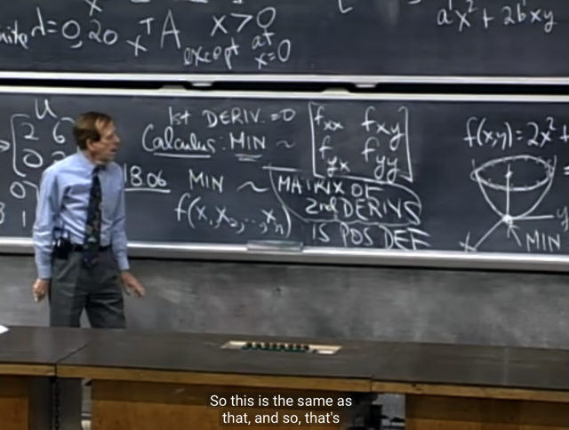</kbd>

> [!NOTE]
> Thế thì với 2 variable, **matrix of 2nd derivative** sẽ là matrix
> này.
>
> Và gs nói đại khái là **nếu như ta học 18.02** về bài
> minimum sẽ thấy**điều kiện để có minimum là fxx > 0, và
> fxx*fyy-fxy*fyx lớn hơn 0**.
>
> Đó **chính là điều kiện của determinant dương** để rồi ở đây
> 18.06 ta biết đó**chính là để MATRIX OF 2ND DERIVATIVE
> chất POSITIVE DEFINITE**.
>
> (có nghĩa là cùng một vấn đề, chẳng qua phát biểu theo
> 1802 là Calculus còn ở đây là theo 1806 Linear Algebra)

> [!NOTE]
> Sau khi học 1802, quả thật có thể confirm chỗ này. Trong
> 1802, ở phần second derivative test (giúp kiểm tra xem
> critical point là Minimum/ Maximum hay Saddle point.
>
> Ta đã thấy, (trong lớp đó gs xét function 2 biến f(x,y)) ta
> sẽ tính các second partial derivative của f với x, y:
>
> Cụ thể gs gọi: 
>
> A là f_xx(x0,y0), kí hiệu khác là ∂^2f/∂x^2
> (tất nhiên evaluate tại critical point x0,y0)
>
> B = f_xy(x0,y0) (và nó cũng bằng f_yx(x0,y0), hay ∂^2f/∂x∂y
>
> C = f_yy(x0,y0) hay ∂^f/∂y^2
>
> Khi đó ta sẽ kết luận dựa vào các trường hợp sau:
>
> 1) Nếu AC-B^2 > 0, khi đó nếu A dương thì kết luận (critical
> point) là MINIMUM. Nếu A âm thì là MAXIMUM
>
> 2) Nếu AC-B^2 < 0, kết luận critical point là SADDLE POINT
>
> 3) Nếu AC-B^2 = 0: Ko kết luận được.
>
> ====
>
> Vậy có thể thấy, với ma trận đạo hàm cấp 2 (matrix of second
> partial derivative): [f_xx, f_xy; f_yx f_yy] thì AC-B^2 CHÍNH LÀ
> DETERMINANT CỦA NÓ 
>
> (Công thức det của matrix 2x2: [a b; c d] là ad - bc)
>
> Vậy nếu A > 0 (mà A là set của sub matrix 1x1) và  AC-B^2 > 0
> thì CHÍNH LÀ ĐỦ ĐỂ KẾT LUẬN MATRIX ĐẠO HÀM CẤP
> 2 LÀ MỘT **POSITIVE DEFINITE SYMMETRIC MATRIX
>
> Nói thêm, nếu A < 0, và AC-B^2 > 0 Hessian là NEGATIVE
> DEFINITE MATRIX, và tại critical point là Maximum**

 

<kbd></kbd>

> [!NOTE]
> Ta sẽ xem xét matrix 3x3 này để trả lời các câu hỏi:
>
> i) Có **Positive Definite không**
>
> ii) **Quadratic form xTAx** của nó là gì
>
> iii)**Function có minimum tại origin không** và thậm chí là cả
> hình học của function là ntn

 

<kbd>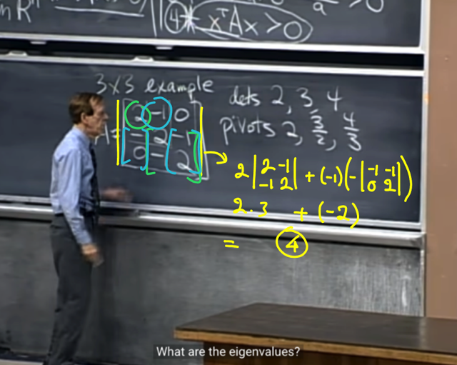</kbd>

<kbd></kbd>

<kbd>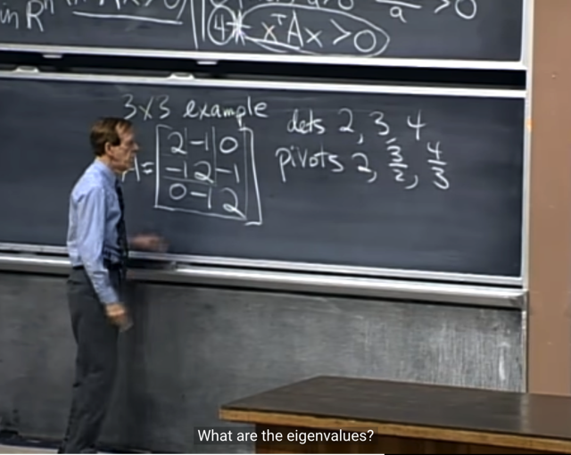</kbd>

> [!NOTE]
> Rồi, ta sẽ **lần lượt xét các bài test** cho một matrix đủ
> điều kiện để là Positive Definite.
>
> Đầu tiên là các "**sub-determinant**" dễ thấy nó sẽ là 2,
> và 3 với hai matrix 1x1, 2x2. Còn với matrix 3x3 thì tính
> theo cofactor  dễ thấy sẽ là 4. Vậy **mọi det đều dương.**Chú ý là một cái này thôi cũng đã đủ kết luận matrix
> Positive Definite

 

<kbd>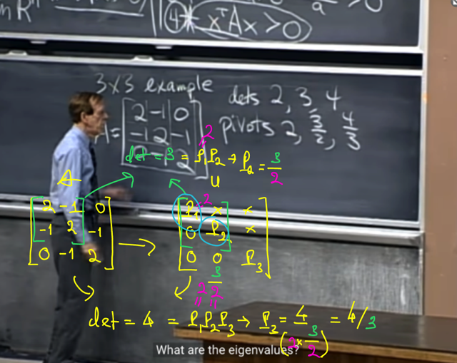</kbd>

<kbd></kbd>

<kbd>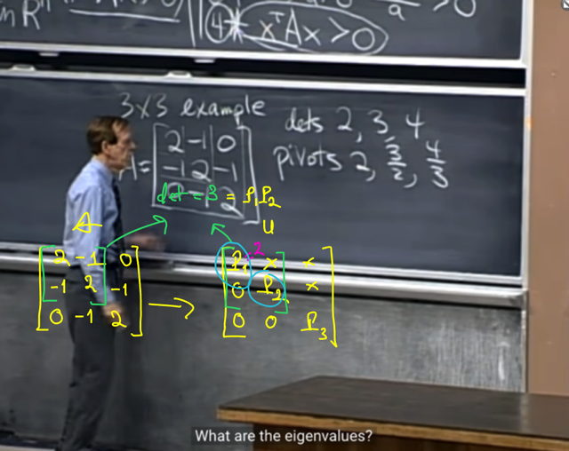</kbd>

> [!NOTE]
> Tiếp theo là các pivot,**pivot đầu là 2**. 
>
> Pivot thứ hai sẽ là **3/2** 
>
> Vì sao? Quá trình elimination ko đổi (trị tuyệt đối) của
> det và cái matrix 2x2 sẽ trở thành matrix 2x2 của U
> (đường chéo là pivot #1 và pivot #2)
>
> Thế thì rõ ràng, det của matrix 2x2 của U cũng sẽ có det là
> 3, vậy mà det của nó (là một triangular matrix) chính  là
> tích các eigenvalue = tích các pivot, Vậy một cái bằng 2 thì
> cái kia là **det / 2 = 3/2**
>
> Tương tự như vậy, pivot thứ 3 sẽ là 4/ (pivot #1 * pivot #2)
> =**4/3
>
> Vậy là cả 3 pivot đều dương**

 

<kbd>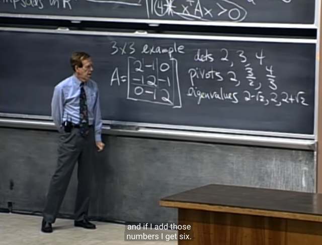</kbd>

> [!NOTE]
> còn **eigenvalue** thì gs nói rằng ta sẽ **phải solve một
> characteristic equation bậc 3**. Ông nó**i ông nhớ giá trị là
> thế này**. Và ta có thể **bỏ qua bước giải equation** tìm
> eigenvalue, nhưng **ít nhất nên check lại trace và det** xem
> có đúng không.
>
> **Trace** phải là**tổng eigenvalue = tổng đường chéo** =
> 2+2+2 = 6 và tổng 3 eigenvalue này bằng 6 cho thấy
> đúng.
>
> **Det là 4, phải bằng tích các eigenvalue**, ta thấy cũng
> đúng.

 

<kbd></kbd>

> [!NOTE]
> Và **quadratic form xTAx** là như thế này: Và ở đây ta
> sẽ **tin rằng nó dương** (vì gs **đang cho một Positive
> Definite matrix**mà các bài test về det của sub matrix
> đã giúp kết luận)
>
> Và sự thật nếu triển khai tính xTAx, và COMPLETE
> THE SQUARE ta sẽ thấy nó luôn > 0 với x khác 0
>
> Để rồi đồ thị của quadratic function f(x1,x2,x3) này
> **trong không gian 4 chiều** (3 chiều của 3 variable và
> 1 chiều của f) sẽ là một hình dạng của **Paraboloid -
> khối chảo parabol**)

 

<kbd>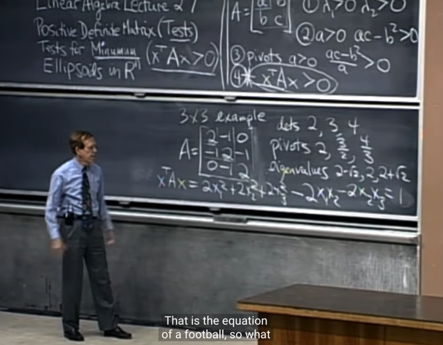</kbd>

> [!NOTE]
> để rồi nếu **cắt nó tại f = 1**, thì ta sẽ có một **Ellipsoid** giống
> như**trái bóng bầu dục** (chú ý là trong bài toán 3D hồi
> nãy thì hình dạng là cái tô Paraboloid trong không gian 3
> chiều, thì ta dễ hình dung, và khi cắt nó với mặt phẳng
> f = 1, ta có **hình elipse**, còn ở đây là cái Paraboloid trong
> không gian 4 chiều)

 

<kbd></kbd>

> [!NOTE]
> đại khái là xem xét cái Ellipsoid này, thì nó **chính là ứng
> với một matrix mà có hai eigenvalue bằng nhau** (theo
> hai trục mà bề dài bề rộng của quả bóng bầu dục bằng
> nhau), và **eigenvalue còn lại thì có giá trị lớn hơn (ứng
> với trục dọc của quả bóng)**
>
> Còn nếu là **hình cầu (sphere)**, như quả banh thì ta có
> **Identity matrix** khi **mọi trục đều là eigenvector** với**eigenvalue bằng nhau hết và bằng 1**

 

<kbd>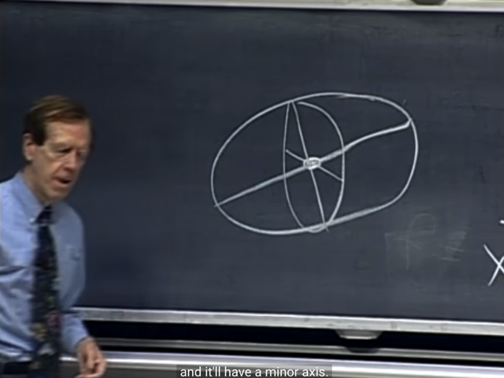</kbd>

> [!NOTE]
> Còn với matrix này khi ta có **3 eigenvalue có giá trị khác
> nhau**, thì quả bóng này sẽ kiểu như có **một axis dài**,
> một **axis nhỏ hơn** và **axis còn lại thì nhỏ nhất**
>
> Tức là nó không giống như quả bóng bầu dục (mà bị méo)
>
> Và như đã nói, **hướng của 3 trục chính đó ứng với 3
> eigenvectors** và **độ lớn thì ứng với 3 giá trị eigenvalue**
> như đã nói

 

<kbd>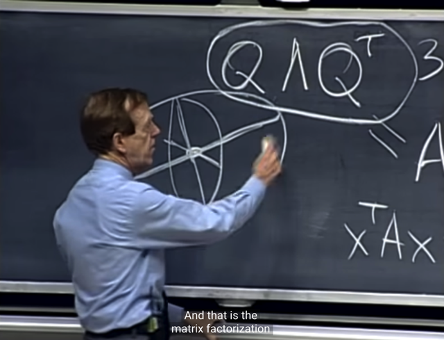</kbd>

> [!NOTE]
> Gs: và ta có thể phát biểu, diễn đạt ý tưởng vừa rồi
> chính là bằng factorization: **A = QΛQT**
>
> Trong đó Q cho ta các eigenvectors, Λ là matrix các
> eigenvalues
>
> Và đây là matrix symmetric nên thay vì Qinv ta có thể
> dùng Q.T (matrix symmetric nên nó có các eigenvector
> orthonormal, thành ra S trở thành Q, và Sinv chính là
> Qinv mà cũng là Q.T)

 

