# Lecture 28: Similar Matrices And Jordan Form

📊 **Progress:** `38` Notes | `32` Screenshots

---
<a id="node-1009"></a>

<p align="center"><kbd></kbd></p>

> [!NOTE]
> bài này ta sẽ thảo luận về **similar matrix**. Tiếp tục về
> positive definite matrix mà một **ví dụ quan trọng chính** là
> gặp lại **người bạn cũ ATA**. Ta cũng nhớ lại về**các phép
> thử**để kiểm tra matrix có Positive Definite không: pivots,
> eigenvalues và determinants (mặc dù định nghĩa của nó là
> quadratic form xTAx dương với mọi x trừ zero)

<br>

<a id="node-1010"></a>

<p align="center"><kbd></kbd></p>

> [!NOTE]
> gs: nếu **matrix A positive definite** (và ông nói thêm, khi nhắc
> đến positive definite, ta sẽ **luôn ngầm hiểu** là **symmetric**
> positive definite) thì**inverse của nó có symmetric positive
> definite không?**
>
> Ta có thể thấy để trả lời câu hỏi này, đầu tiên ta biết gì về
> pivots của nó `->` không nhiều. Nhưng ta biết eigenvalue của
> nó. Vì như bài trước,**eigenvalue của Ainv sẽ là `1/eigenvalue`
> của A** (1) 
>
> Và **vì A positive definite** nên **eigenvalue của
> chúng dương**, **nên eigenvalue của Ainv cũng dương**,
>
> Nên gs nói rằng,**nếu biết A symmetric positive definite thì ta
> có thể kết luận Ainv cũng vậy**
>
> (\~chỗ này có thể hơi thắc mắc là, chỉ nội dựa vào việc  các
> eigenvalue dương thì chưa đủ, vì như ta đã học ở bài trước,
> phải xét các pivot, và các 'sub determinant' nữa. Nhưng để
> xem tí nữa gs có giải thích thêm không)\~ `=>` Đã rõ, vì thật ra
> TA KHÔNG CẦN CHECK TOÀN BỘ, MÀ CHỈ MỘT TRONG
> CÁC PHÉP THỬ ĐÓ ĐÃ ĐỦ KẾT LUẬN POSITIVE DEFINITE
> RỒI. 
>
> Nên nếu mọi eigenvalue đều dương, kết luận matrix sẽ
> Positive definite và từ đó suy ra các pivots cũng sẽ dương,
> quadratic form cũng dương (với x khác 0), các submatrix det
> hay leading principal cũng dương,
>
> (1) Ta chứng minh lại nhanh thôi: lbd, x là eigenvalue và e.vector
> của A: Ax `=` λx. Nhân hai vế cho Ainv: AinvAx `=` Ainvλx
>
> ```text
> <=> x = Ainvλx <=> x / λ = Ainvx và từ đó đủ kết luận x cũng
> ```
> là eigenvector của Ainv với eigenvalue tương ứng là 1 `/` λ

> [!NOTE]
> Nếu A POSITIVE DEFINITE, THÌ Ainv CŨNG VẬY

<br>

<a id="node-1011"></a>

<p align="center"><kbd>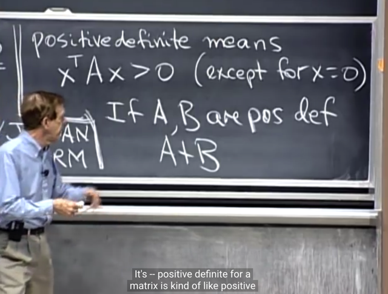</kbd></p>

> [!NOTE]
> Thế thì một câu hỏi khác là**nếu A và B đều symmetric
> positive definite** thì **A+B có vậy ko**?
>
> Gs cho rằng nếu dựa vào các phép thử pivot, eigenvalue
> hay det thì ta sẽ không biết. Vì như bài trước đã học, **det
> `A+B` không bằng det A `+` det B.**

<br>

<a id="node-1012"></a>

<p align="center"><kbd>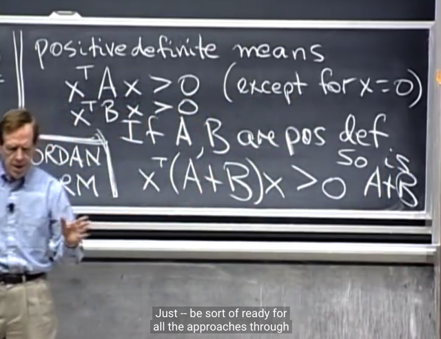</kbd></p>

> [!NOTE]
> Tuy nhiên n**hờ vụ quadratic function**, ta có xTAx > 0 và
> xTBx > 0 với mọi x nên ta **dễ dàng suy ra `xT(A+B)x` > 0
> với mọi x từ đó kết luận `A+B` cũng sẽ positive definite**

> [!NOTE]
> Nếu A, B đều POSITIVE DEFINITE,
> THÌ `A+B` CŨNG VẬY

<br>

<a id="node-1013"></a>

<p align="center"><kbd></kbd></p>

> [!NOTE]
> thế thì ta sẽ xem xét matrix A (m, n), tức là, bữa giờ, ta quan
> tâm đến matrix A **SQUARE** để bàn đến **determinant**,
> **eigenvalue** và **eigenvector** và sau đó là square &
> **SYMMETRIC**, và **POSITIVE DEFINITE**Nay ta **quay lại matrix (m, n)**. Và ta đã biết **dù A
> không square, nhưng ATA sẽ square và symmetric.**
>
> (Chứng minh ATA symmetric rất dễ: (ATA)T `=` AT(ATT) `=` ATA
> `=>` Symmetric.
>
> Và ta sẽ xem xét xem ATA có **positive definite** hay không.

<br>

<a id="node-1014"></a>

<p align="center"><kbd></kbd></p>

> [!NOTE]
> thế thì gs cho rằng, ta **không biết pivots** của nó, **không biết
> eigenvalue** cũng như det. Nhưng ta **có thể tiếp cận theo
> cách xem xét quadratic form: xT(ATA)x**.
>
> Vậy thì tại sao ta biết **ATA POSITIVE DEFINITE**?
>
> Me: Là bởi vì xTATAx `=` (Ax)T(Ax) `=` uTu với u `=` Ax. Thì có
> nghĩa là **quadratic form của ATA** CHÍNH LÀ**SQUARE
> LENGTH** CỦA **u `=` Ax**. \~Và vì vậy **đương nhiên nó luôn
> không âm**, và chỉ bằng 0 khi u `=` Ax `=` 0.
>
> \~Chỗ này phải **cẩn thận**, **tuy uTu luôn KHÔNG ÂM**
> nhưng cái (điều kiện để matrix là positive definite) ta cần là
> xTATAx luôn  **DƯƠNG** với **MỌI X KHÁC 0** và **CHỈ
> BẰNG 0 KHI X `=` 0** kìa.
>
> Do đó **chưa chắc (Ax)TAx đã đảm bảo điều này**.
>
> Thành ra phải có điều kiện với A, đó là nó **full-column-rank**,
> tức mọi columns độc lập, khi đó Ax `=` 0 chỉ khi x `=` 0
> (**nullspace chỉ có mỗi zero**). Dẫn đến **(Ax)T(Ax) `=` 0 chỉ khi
> x `=` 0, và dương với x khác 0.**
>
> Tóm lại **khi A FULL COLUMN RANK thì ATA POSITIVE
> DEFINITE**

<br>

<a id="node-1015"></a>

<p align="center"><kbd>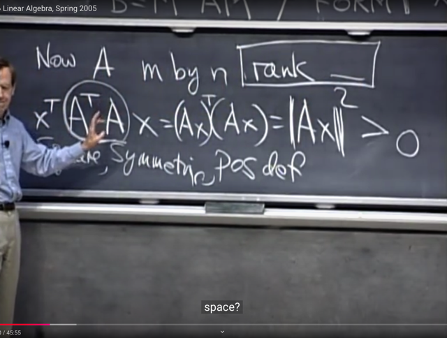</kbd></p>

> [!NOTE]
> gs: Correct, thế thì câu hỏi là **khi nào thì ta biết length của
> Ax**, tức (Ax)T(Ax) **LUÔN DƯƠNG**. Hay nói cách khác
> khi nào thì Ax **LUÔN KHÁC 0** với x khác 0 và chỉ bằng 0
> khi Ax `=` 0
>
> me: Thì đó là **khi Ax `=` 0 không có solution nào**, **ngoài
> zero**, hay **nullspace của A chỉ chứa độc mỗi vector
> zero**, hoặc nói cách khác **basis của nullspace rỗng**,
> hoặc nói cách khác nữa Ax `=` 0 **không có special solution**
> nào, hoặc nói cách khác nữa **A không có free columns
> nào**, hay, **mọi column của A đều là pivot columns.**
>
> Và điều này xảy ra, nếu nói về rank của A, thì đó là khi
> **rank của A `=` n** (**mọi column của A đều là pivot**, hay
> đều là basis vector, khi đó dim của C(A) `=` n, gọi là**full
> column rank**)

<br>

<a id="node-1016"></a>

<p align="center"><kbd>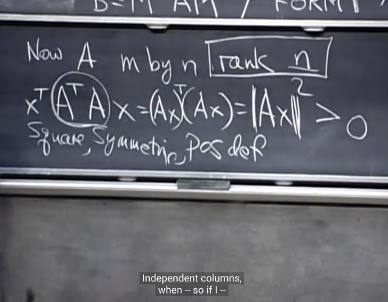</kbd></p>

> [!NOTE]
> Gs: Correct, và như vậy KHI **A CÓ INDEPENDENT
> COLUMNS**, QUADRATIC FORM CỦA ATA **LUÔN
> DƯƠNG VỚI X KHÁC 0**, và chỉ bằng 0 tại x `=` 0.
>
> Thì như vậy **ATA là POSITIVE DEFINITE**

<br>

<a id="node-1017"></a>

<p align="center"><kbd>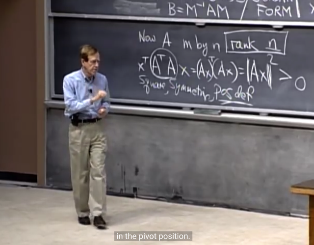</kbd></p>

> [!NOTE]
> Và gs cho biết thêm đó là với positive definite matrix thì
> **ta không bao giờ phải row exchange** trong quá trình
> elimination. **Mọi pivot sẽ xuất hiện trên đường chéo**Điều này dễ hiểu, bởi dễ thấy rằng một matrix positive
> definite đương nhiên sẽ full rank, vì nó square và mọi
> eigenvalue đều dương, hoặc det dương, nói nói quá
> đủ để thấy nó full rank Mà đã full rank thì dĩ nhiên khi
> chuyển thành U (bởi elimination) không có row nào bị
> biến thành 0 vì mọi row đều độc lập

<br>

<a id="node-1018"></a>

<p align="center"><kbd></kbd></p>

> [!NOTE]
> gs nói qua khái niệm **SIMILAR** matrix. Hai matrix A và
> B **được cho là similar** nếu **tồn tại matrix M** (invertible)
> sao đó mà **B `=` M_invAM**

> [!NOTE]
> A SẼ SIMILAR VỚI B nếu tồn tại matrix M (invertible)
> sao đó mà B `=` `M_invAM`

<br>

<a id="node-1019"></a>

<p align="center"><kbd>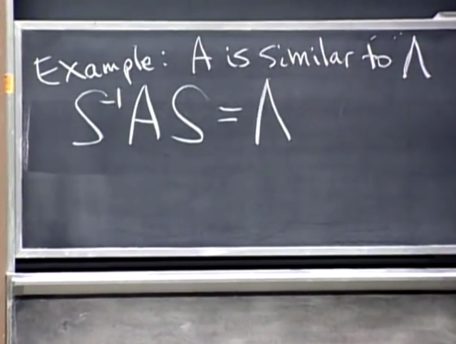</kbd></p>

> [!NOTE]
> Và trong cách nói đó thì ta đã **gặp một cặp similar
> matrix**:
>
> **A và Λ**, bởi vì ta đã biết **S_invAS** **= Λ**
>
> (Đương nhiên phải có điều kiện A có **full set các
> independent eigenvectors**)

<br>

<a id="node-1020"></a>

<p align="center"><kbd>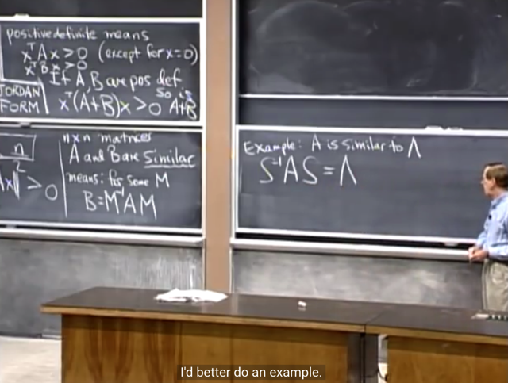</kbd></p>

> [!NOTE]
> Và nếu ta thay S bằng M thì ta sẽ có B thay vì Λ, để rồi, gs cho
> rằng ta sẽ có **một family các SIMILAR MATRIX với A thông
> qua matrix M** khác nhau
>
> Mà trong family đó **Λ là cái nổi bật**nhất, tốt nhất

<br>

<a id="node-1021"></a>

<p align="center"><kbd>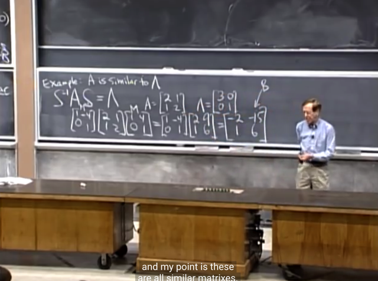</kbd></p>

> [!NOTE]
> rồi, gs lấy ví dụ matrix A, và Λ (eigenvalues của nó) 
>
> Thế thì gs cho một matrix M, và từ đó tính ra B
>
> Gs cho rằng **các matrix A, B, Λ đều có một điểm
> chung**. Đó là gì?
>
> Me: Đoán rằng, chúng đều**CÓ CÙNG EIGENVALUES**

<br>

<a id="node-1022"></a>

<p align="center"><kbd></kbd></p>

> [!NOTE]
> Gs: Chính xác, chúng đều **có chung eigenvalues,** và như đã nói Λ là**thành viên đặc biệt nhất**
> trong gia đình các matrix giống với A, và dễ hiểu
> bởi vì **nó (đường chéo) chính là eigenvalues**
>
> (T**riangular** matrix hay đặc biệt hơn là
> **diagonal** matrix mà triangular matrix như đã biết
> có **eigenvalues nằm ngay trên đường chéo**)

<br>

<a id="node-1023"></a>

<p align="center"><kbd>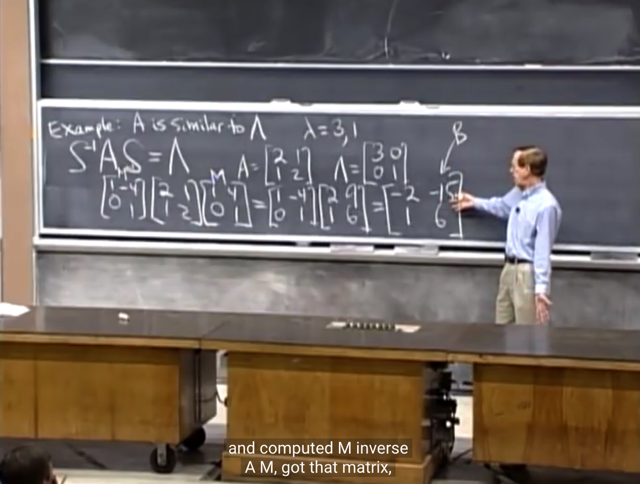</kbd></p>

> [!NOTE]
> kiểm tra lại thì A và B đúng là đều
> có eigenvalue là 3 và 1

<br>

<a id="node-1024"></a>

<p align="center"><kbd>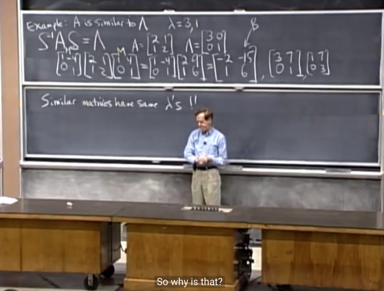</kbd></p>

> [!NOTE]
> Và các matrix khác như [3 7; 0 1] hay [1 7; 0 3]
>
> (đều có eigenvalues `=` 1, 3) đều nằm trong family này.
> có nghĩa là như đã nói ta **luôn có thể tìm được matrix
> M** giúp **connect chúng với A.**
>
> Câu hỏi là, tại sao MinvAM lại có cùng eigenvalue với A?

<br>

<a id="node-1025"></a>

<p align="center"><kbd>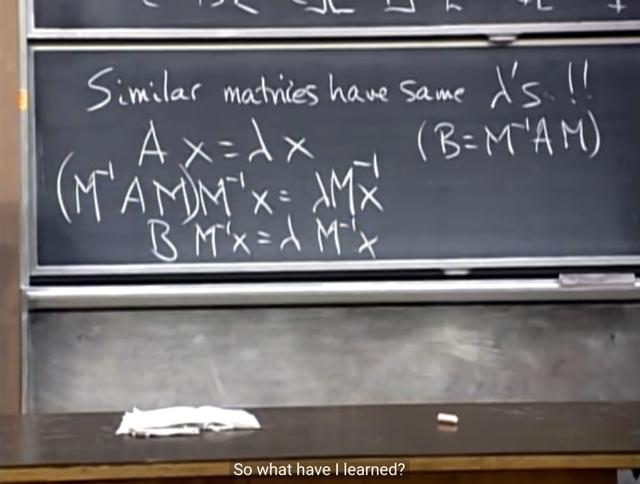</kbd></p>

> [!NOTE]
> Rất dễ hiểu, bắt đầu với việc vì λ là eigenvalues của A nên
> **Ax `=` λx**. 
>
> `<=>` AIx `=` λx
>
> A(MMinv)x `=` λx `<=>` | tiếp, ta sẽ nhân hai vế cho `M_inv`
>
> **Minv**AMMinvx `=` **Minv**λx `<=>`
>
> (MinvAM)Minvx `=` λMinvx `<=>`
>
> (B)Minvx `=` λMinvx `<=>`
>
> B**Minvx** `=` λ**Minvx**
>
> Và equation trên cho thấy **λ CŨNG LÀ EIGENVALUE
> CỦA B** `=` MinvAM
>
> Với**eigenvectors là Minvx** (có nghĩa là eigenvector thay 
> đổi bởi Minv)

> [!NOTE]
> Chứng minh MinvAM lại có cùng
> eigenvalue với A

<br>

<a id="node-1026"></a>

<p align="center"><kbd>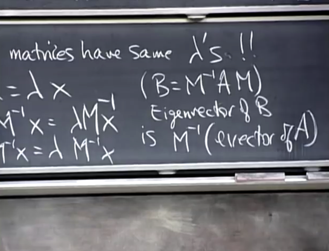</kbd></p>

> [!NOTE]
> SIMILAR MATRICES sẽ có **CÙNG EIGENVALUES** và
> **eigenvectors move around** (eigenvector khác nhau)

<br>

<a id="node-1027"></a>

<p align="center"><kbd>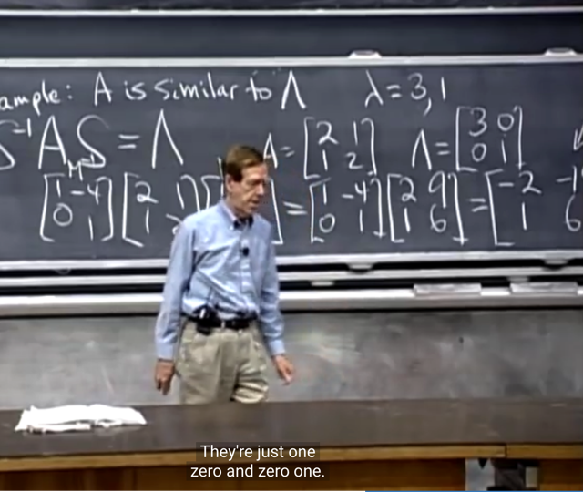</kbd></p>

> [!NOTE]
> với **Λ** thì như đã nói eigenvalue (cũng là của A)  là 3, 1.
>
> Và **eigenvector của nó là [1 0] và [0 1]**

<br>

<a id="node-1028"></a>

<p align="center"><kbd>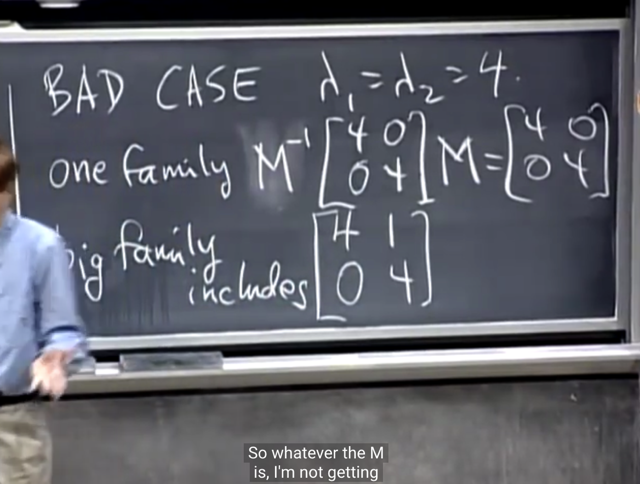</kbd></p>

> [!NOTE]
> Đại khái là gs nói qua "**BAD** case" khi ta có **REPEAT** **EIGENVALUES**
>
> Thì **CÓ THỂ** có tình trạng **KHÔNG ĐỦ N INDEPENDENT EIGENVECTORS**, 
> từ đó **không thể diagonalizable**Ví dụ như matrix này: Λ `=` [4 0; 0 4] và J `=` [4 1; 0 4]. Thì gs cho biết rằng
> dù hai matrix này **đều có chung eigenvalues là 4, 4 nhưng chúng lại
> KHÔNG CHUNG nhà**. Mà là thuộc hai family khác nhau.
>
> Trong đó cái [4 0; 0 4]**thuộc một family chỉ có mình nó**.
>
> Và [4 1;0 4] thì **thuộc một family có nhiều thành viên hơn.**
>
> `====`
>
> Thế thì cái Λ `=` [4 0; 0 4] ở trong family chỉ có mình nó, nó chỉ có quan hệ
> similar với chính nó. Chứng minh như sau:
>
> ```text
> Lấy invertible M BẤT KÌ, thì MinvΛM = Minv(4I)M = 4MinIM = 4 = 4I = Λ
> ```
>
> Và chú ý là đây là matrix dù có **REPEAT** **EIGENVALUE** nhưng **mọi
> vector đều là eigenvectors** do đó đương nhiên là sẽ **luôn có đủ 2 vector
> độc lập.**Vì với eigenvalue `=` 4, **A `-` λI** `=` **[0 0; 0 0]**. Thì, matrix này **KHÔNG
> CÓ COLUMN NÀO ĐỘC LẬP**. Có nghĩa là **CẢ HAI COLUMN  ĐỀU LÀ
> FREE COLUMNS**.
>
> Do đó **NULLSPACE LÀ TOÀN BỘ R^2** để rồi **BẤT KÌ CẶP VECTOR
> NÀO INDEPENDENT ĐỀU LÀ BASIS CỦA NULLSPACE** và cùng **đều
> là eigenvectors của A**

<br>

<a id="node-1029"></a>

<p align="center"><kbd>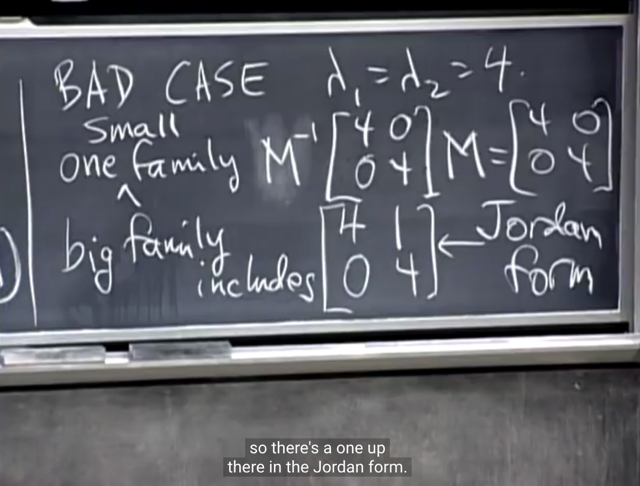</kbd></p>

> [!NOTE]
> Còn với J `=` [4 1; 0 4], nó sẽ **chỉ có một eigenvector.**
>
> Như đã nói, nó không ở chung family với Λ `=` [4 0; 0 4], mà ở
> trong một family khác có nhiều thành viên hơn (với các
> invertible matrix M khác nhau thì sẽ tạo MinvBM có chung
> eigenvalue với B, còn Λ chỉ có một mình, do với mọi invertible
> M thì đều MinvΛM `=` Λ)
>
> Và những cái similar với B đều cũng như B, không
> diagonalizable.
>
> Chứng minh matrix Λ `=` 4I là cái duy nhất có mọi eigenvalue
> đều bằng 4 là cái có thể diagonalizable:
>
> Giả sử C có mọi eigenvalue bằng 4 và diagonalizable, khi đó
> C `=` SΛSinv, với S là matrix of eigenvectors. Thì ngay lập tức
> C phải bằng Λ vì như khi ta chứng minh Λ chỉ similar với chính
> nó.
>
> `====`
>
> Thế thì trong các matrix similar với J, cái **gần với diagonal
> matrix nhất** với Λ là cái**[4 1; 0 4]**.  Và đó đượcgọi là
> **Jordan form.**(*) Dù cái này c**hỉ khác [4 0; 0 4] ở chỗ** **có một phần tử
> ngoài đường chéo khác 0** (số 1) nhưng nó khiến **[A -λ*I]**
> **TRỞ NÊN CÓ MỘT PIVOT**, thành ra **CHỈ CÒN 1 FREE
> COLUMN**.
>
> Dẫn đến basis của nullspace `A-λI` chỉ có 1 vector. Và **chỉ có 1
> eigen-vectors**

<br>

<a id="node-1030"></a>

<p align="center"><kbd>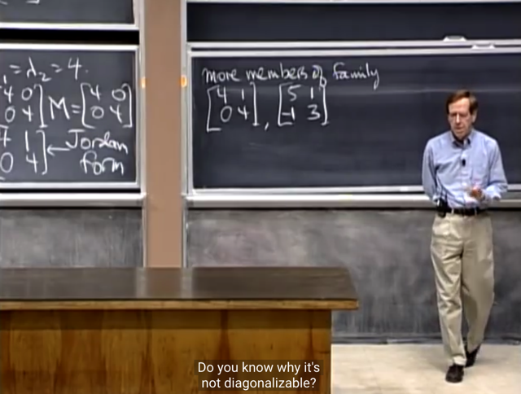</kbd></p>

> [!NOTE]
> Gs lấy thêm một matrix này [5 1; `-1` 3], cũng là **có hai
> eigenvalues là (4, 4)** (trace `=` 8 và det `=` 16)
>
> Và gs cho rằng ta biết nó sẽ **không thể diagonalizable**vì sao?
>
> Vì **nếu diagonalizable** thì nó **sẽ có dạng S_invΛS**
> nhưng như ta **đã thấy bên kia**, **với mọi M, thì `M_inv`
> [4 0; 0 4] M luôn cho ra Λ `=` [4 0; 0 4]**
>
> Thành ra [5 1; `-1` 3] không thể tìm được matrix M nào
> khiến phân tách [5 1; `-1` 3] `=` Minv[4 0; 0 4]M bởi matrix 
> S nào được và cũng chính là không thể diagonalizable
> (vì diagonalizable có nghĩa là có thể factor matrix thành
> `S_invΛS` với Λ chính là [4 0; 0 4]

<br>

<a id="node-1031"></a>

<p align="center"><kbd>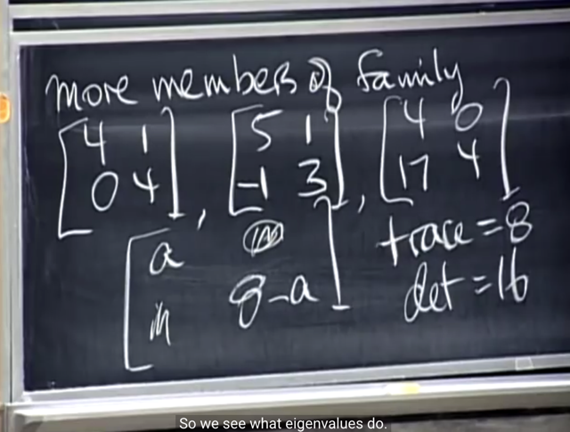</kbd></p>

> [!NOTE]
> Và ta có thể có rất nhiều matrix, **đều có eigenvalues
> là 4, 4** và **chỉ có 1 independent eigenvectors và không
> thể diagonalizable.**

> [!NOTE]
> Như vậy, có thể hiểu như vầy. Vì eigenvectors x của matrix A là vector được scale
> với eigenvalue khi nhân với A: **Ax `=` λx** nên điều này đồng nghĩa với việc x cũng
> là vector bị "biến thành 0" bởi matrix A `-` lambda*I, hay, nó chính là vector trong
> `null-space` của A `-` lambda*I
>
> Vậy, để tìm x thì ta sẽ tìm `null-space` của **A `-` λI**. Nhưng trước hết, vì matrix A
> luôn có eigenvector, tức là `non-zero` vector x được biến thành lambda*x nên **A `-`
> λI**cũng luôn có `non-zero` vector x trong `null-space.` Điều này cho thấy **A `-` λI** là
> singular matrix.
>
> Thế thì dựa vào tính chất này cho phép ta tìm lambda, bởi singular matrix có
> determinant bằng 0, từ đó việc thiết lập equation determinant  bằng 0 cho ta
> characteristic equation, giúp giải tìm lambda.
>
> Khi có lambda, thì như đã nói, ta sẽ lắp vào để có matrix [**A `-` λI**] và tìm
> `null-space` của nó, hay đúng hơn là là tìm basis của `null-space,`  đó chính là
> eigenvectors (của A)
>
> Vậy thì, giả sử ta có các eigenvalue khác nhau, thì đương nhiên ta có các matrix A
> `-` λI khác nhau. Và từ đó, các singular matrix A `-` λI khác nhau này cho
> các eigenvector khác nhau (! điểm này phải suy nghĩ thêm, ví dụ như có khi nào
> các matrix 2x2 khác nhau vẫn có cùng nullspace không?) Dẫn đến là ta luôn có
> các eigenvector độc lập khi các eigenvalue khác nhau.
>
> Nhưng nếu có eigenvalue trùng nhau (repeat eigenvalues) thì ta chỉ có một matrix
> **A `-` λI**.  Lấy ví dụ matrix 2x2, có hai eigenvalue 4,4. Thì như đã nói, ta chỉ có một
> matrix A `-` lambda*I, dẫn tới hai tình huống. Nếu matrix A `-` lambda*I có rank 1, tức
> là có một pivot variable, và từ đó ta chỉ có một free variable, hay, một vector (non
> zero) độc lập trong nullspace. Đây chính là vấn đề, gọi là defective matrix khi nó
> không có đủ n eigenvectors độc lập.
>
> Trường hợp thứ hai, đó là matrix đặc biệt mà khiến A `-` λI bằng matrix [0 0;
> 0 0], tức là A chính xác là [lambda 0; 0 lambda], thì khi đó A `-` λI là matrix
> rank `=` 0, và ta có 2 vectors trong basis của nullspace (hay dimension của
> nullspace bằng 2). Lúc này thì ta vẫn có đủ 2 eigenvector độc lập.
>
> Lập luận trên giúp ra hiểu rằng, giả sử ta có matrix [4 0; 0 4], thì việc có một  giá trị
> ngoài đường chéo khác 0, ví dụ bằng 1 để matrix trở thành [4 1; 0 4] thì lập tức
> tạo ra một pivot columns trong A `-` lambda*I, dẫn tới matrix không còn đủ hai free
> columns, và dẫn tới tình trạng defective. Thành ra chỉ có độc nhất matrix [4 0; 0 4]
> là matrix với repeat eigenvalues mà có 2 eigenvector độc lập. Còn lại tất cả các
> matrix khác đều defective.

> [!NOTE]
> Sự thật basis của nullspace của A `-` λI chính là eigenvectors của A. Do đó, **để
> matrix A nxn có n eigenvectors độc lập** thì:
>
> I) **Nếu MỌI EIGENVALUES ĐỀU KHÁC NHAU, A DIAGONALIZABLE**Proof: Giả sử tồn tại x1, x2 là eigenvectors ứng với λ1, λ2 khác nhau nhưng
> chúng không độc lập, tức `x1=kx2.`
>
> Thế thì từ Ax1 `=` λ1x1, thay x1 `=` kx2 vào vế trái, ta có Akx2 `=` kAx2 =**kλ2x2**(vì Ax2 `=` λ2x2).****Thay x1 `=` kx2 vào vế phải ta có λ1kx2 `=` **kλ1x2
>
> Vậy Ax1 `=` λ1x1 `<=>` kλ2x2 `=` λ1kx2 `<=>` λ2x2 `=` λ1x2 mâu thuẫn, vì λ1 khác λ2**Có thể hiểu như sau: Muốn mọi eigenvector độc lập thì các nullspace của A `-`
> λI  phải KHÁC NHAU, từ đó các `NULL-SPACE` KHÁC NHAU
>
> Chứng minh, không thể có hai matrix `A-λ1I` khác `A-λ2I` mà có chung nullspace:
> ```text
> Xét basis x1 của nullspace của A-λ1I: (A-λ1I)x1=0 <=> Ax1=λ1x1. Xét basis x2
> ```
> ```text
> của nullspace của A-λ2I: (A-λ1I)x = 0 <=> Ax2=λ2x2. Giả sử x1 trùng x2, tức
> ```
> `x1=kx2` Ngay lập tức quay lại phần chứng minh ở trên, để cho thấy mâu thuẫn.
> Vậy có thể kết luận:
>
> Nếu **λ1 KHÁC λ2** thì **NULLSPACE CỦA `(A-λ1*I` KHÁC NULLSPACE CỦA
> A-λ2I** dẫn đến **BASIS CỦA CHÚNG KHÁC NHAU**,
>
> Và từ đó **CHÍNH LÀ CÁC EIGENVECTOR  CỦA A ĐỘC LẬP**
>
> II)**Nếu MỌI EIGENVALUES ĐỀU BẰNG `=` λ**, thì để A **DIAGONALIZABLE**
> thì A phải `=` λI
>
> Proof: Cho A có mọi eigenvalues là λ, giả sử A diagonalizable thì `A=SΛSinv` `=`
> SλISinv `=` λ(SISinv) `=` λI Vậy, nếu muốn diagonalizable thì A phải là λI
>
> Lập luận rằng để A có đủ eigenvector độc lập, thì matrix A `-` λI (lúc bấy giờ chỉ
> có một matrix A `-` λI do mọi λ đều bằng nhau) phải là matrix với nullspace có dim
> `=` n, mà matrix nxn có dim of nullspace `=` n chỉ có thể là zero matrix Và như vậy
> ```text
> A - λI = 0 => A = λI
> ```
>
> III) Khái quát lên, nếu **CÓ S REPEATED EIGENVALUES**, để A có n
> eigenvectors độc lập thì matrix**A `-` λI** **PHẢI CÓ `NULL-SPACE` VỚI
> DIMENSION `=` S**, tức là nó phải có**rank `=` n `-` s.**
>
> Câu hỏi vẫn còn cần làm rõ để lập luận trên trở nên rõ ràng, đó là:
>
> i) Có phải bất cứ vị trí ngoài đường chéo nào khác 0 cũng khiến matrix trở
> thành có thiếu free columns để rồi trở thành thiếu eigenvectors độc lập không.
>
> ii) Gỉa sử xét matrix 3x3, có 2 eigenvalue lambda1 giống nhau, cái còn lại lmd2,
> thì khác.

<br>

<a id="node-1032"></a>

<p align="center"><kbd>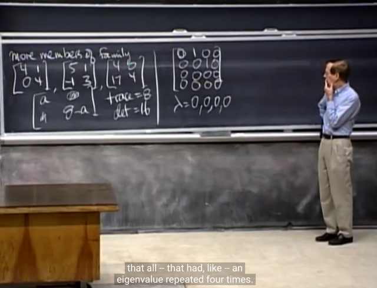</kbd></p>

> [!NOTE]
> Nhưng gs cho biết chỉ **mô tả các similar matrices**như vậy là
> chưa đủ. Lấy ví dụ này. Dễ thấy 4 eigenvalue của nó đều là
> 0 (solve characteristic equation)
>
> Gs: có bao nhiêu eigenvectors độc lập?
>
> ```text
> Me: 2: Solve (A-lambda*I)x = 0 <=> Ax = 0, và A có 2 pivot
> ```
> columns `=>` có 2 free columns `=` 2 special solutions `=` 2
> vector trong basis của nullspace `=` 2 (independent)
> eigenvectors

<br>

<a id="node-1033"></a>

<p align="center"><kbd>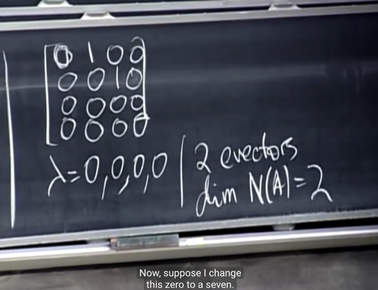</kbd></p>

> [!NOTE]
> gs: correct.

<br>

<a id="node-1034"></a>

<p align="center"><kbd>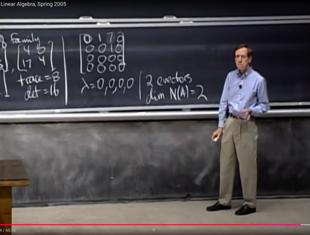</kbd></p>

> [!NOTE]
> Gs: vậy nếu đổi thành 7 ở đây thì sao.
>
> Me: Có thể thấy eigenvectors vẫn là trong nullspace của 
> A (vì λ vẫn bằng 0, bởi giải characteristic equation
> ```text
> det A = 0 <=> λ^4 = 0 <=> λ = 0, từ đó solve
> ```
> ```text
> equation (A-0*I)x=0 để tìm eigenvectors <=> Ax=0)
> ```
> Và A vẫn có 2 free columns `->` dim N(A) `=` 2 `->` 2 eigenvectors
>
> Gs: Đúng vậy, nó vẫn vậy, vẫn cùng eigenvalues và vẫn 2 
> independent eigenvectors.

<br>

<a id="node-1035"></a>

<p align="center"><kbd>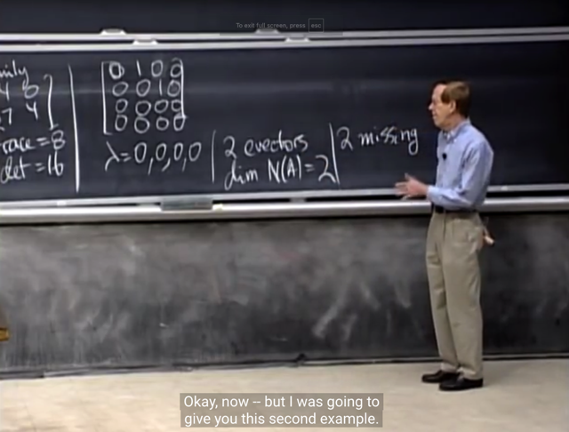</kbd></p>

> [!NOTE]
> Và đại khái là ta chỉ có 2 independent eigenvectors, và
> thiếu 2 eigenvectors

<br>

<a id="node-1036"></a>

<p align="center"><kbd>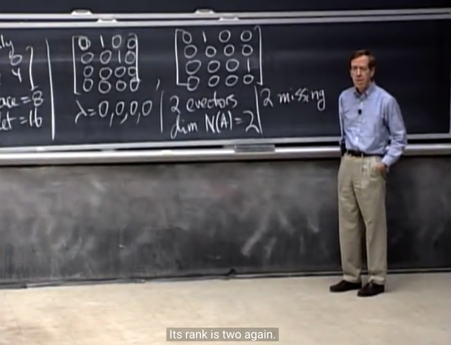</kbd></p>

> [!NOTE]
> Và gs cho matrix này, cũng có 4 eigenvalues `=` 0, và
> 2****independent eigenvectors

<br>

<a id="node-1037"></a>

<p align="center"><kbd>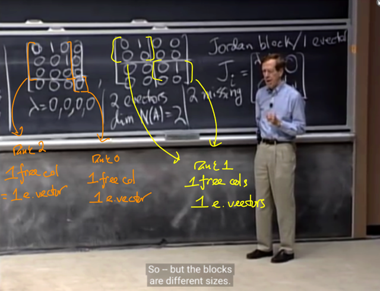</kbd></p>

> [!NOTE]
> Tuy nhiên chúng khác nhau ở kích
> thước của cái gọi là Jordan block

<br>

<a id="node-1038"></a>

<p align="center"><kbd>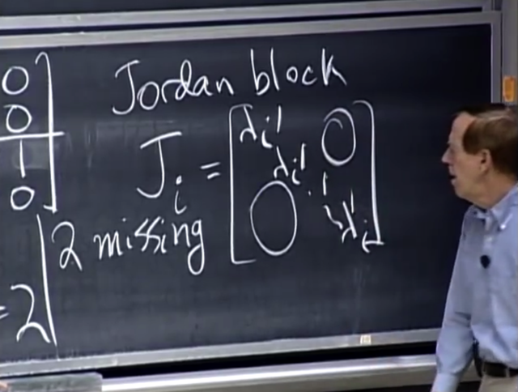</kbd></p>

> [!NOTE]
> Jordan blocks là cái mà trên đường chéo là các (repeat)
> eigenvalues, phía trên nó là 1, và còn lại là zero

<br>

<a id="node-1039"></a>

<p align="center"><kbd></kbd></p>

> [!NOTE]
> Do đó chúng
> không similar

<br>

<a id="node-1040"></a>

<p align="center"><kbd>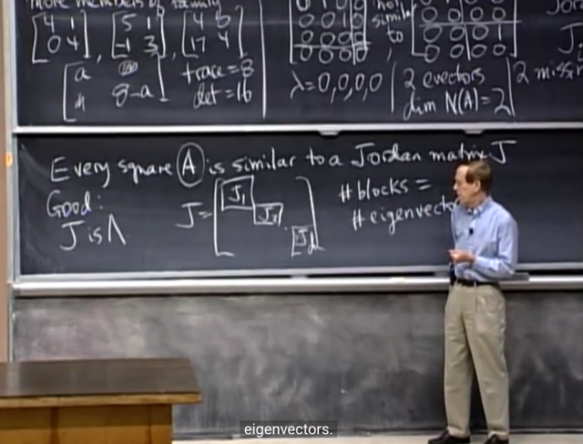</kbd></p>

> [!NOTE]
> Và **định lí Jordan** cho rằng mọi square matrix đều similar
> to một Jordan matrix J có dạng gồm các Jordan blocks.
> Và số block chính là số eigenvectors độc lập.
>
> Và trong trạng thái tốt nhất J chính là **LAMBDA**.

<br>

