# Lecture 29: Singular Value Decomposition

📊 **Progress:** `44` Notes | `40` Screenshots

---

<kbd>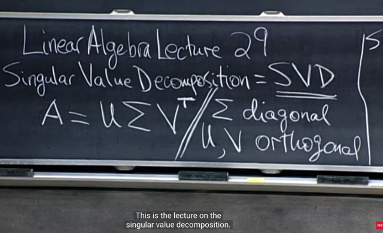</kbd>

> [!NOTE]
> gs cho rằng đây là bài về dạng matrix factorization hay
> nhất: **SINGULAR VALUE DECOMPOSITION**
>
> Và trong phép factorization này, sẽ cần dùng đến **hai
> orthogonal matrix** khác nhau **U, V** và một **diagonal
> matrix Σ**.
>
> Nhưng nó có thể **apply với MỌI MATRIX A**, thay vì chỉ áp
> dụng được với một square matrix A có đủ bộ
> eigenvectors độc lập như trong diagonalization A = SΛSinv

> [!NOTE]
> SVD: MỌI MATRIX A  ĐỀU CÓ THỂ PHÂN TÁCH THÀNH
> U∑VT
>
> Với U, V là ORTHOGONAL MATRIX, VÀ ∑ LÀ DIAGONAL
>
> (Mọi có nghĩa là không cần square hay không)

 

<kbd>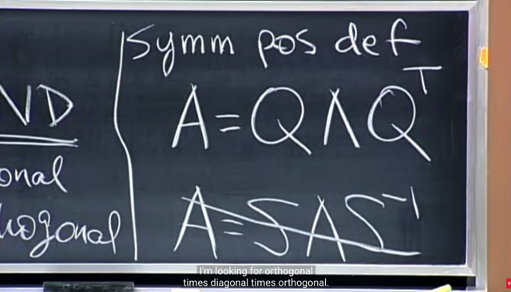</kbd>

> [!NOTE]
> Thế thì đầu tiên là ta đã học về diagonalization:
>
> Nếu **A SQUARE và có ĐỦ n INDEPENDENT
> eigenvectors**,  thì **A = SASinv**
>
> Và nếu A lại là **SYMMETRIC** matrix, thì như đã biết, khi đó
> các**eigenvectors sẽ ORTHOGONAL**, để rồi S sẽ trở thành
> **Q** - ORTHOGONAL MATRIX (thêm việc normalize vector
> về unit length). Và với orthogonal matrix Q, thì **Qinv = QT**
> nên**diagonalization với A sẽ là QΛQT**
>
> Thêm nữa nếu A cũng **POSITIVE DEFINITE** thì **Λ** sẽ là
> **POSITIVE Λ** (mọi eigenvalues, pivots, left determinant đều
> dương, quadratic function dương, chỉ bằng 0 khi x = 0)
>
> Thí ý quan trọng:
>
> Nếu A là SYMMETRIC matrix, thì: 
>
> **SINGULAR VALUE DECOMPOSITION** CŨNG CHÍNH LÀ
> **DIAGONALIZATION** **QΛQT** 
>
> mà trong đó **Q đóng vai trò của cả U và V**, **còn Λ là Σ**.
>
> Tuy nhiên chỉ khi A **SYMMETRIC** thì mới có**dạng đặc
> biệt** của singular value decomposition. Vì trong phép SVD
> này thì ta **CHỈ** tìm cách **tách matrix** thành một
> composition giữa các **ORTHOGONAL** và **DIAGONAL**
> matrices. 
>
> Điều đó có nghĩa là nếu A không symmetric, mà chỉ
> là A = SΛSinv thì ta sẽ không care, vì S không phải là
> **ORTHOGONAL** matrix

> [!NOTE]
> Nếu A là SYMMETRIC matrix, thì:
>
> SVD CŨNG CHÍNH LÀ DIAGONALIZATION QΛQT 
>
> mà trong đó Q đóng vai trò của cả U và V, còn Λ là Σ.

 

<kbd>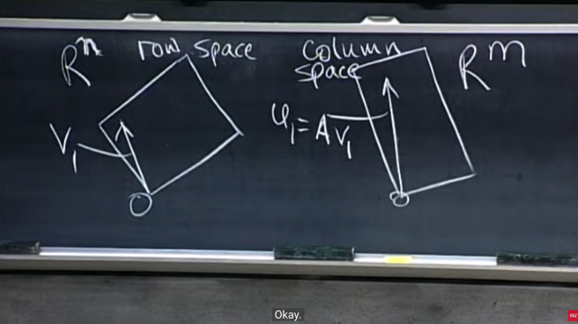</kbd>

> [!NOTE]
> Ta xét hình ảnh của row space và column space: **v1 thuộc
> row space**, và u1 = **Av1 thuộc column space**.
>
> Ở đây mình ôn lại chút xíu về **4 fundamental subspaces**,
> ta đã gặp cái vụ một vector**x thuộc Rn** sẽ phân tách thành
> hai vector: một cái nằm**x_null trong nullspace** của A, một cái
> **x_r nằm trong rowspace** của A. Để rồi **Ax = Ax_r + Ax_null**
>
> Và **Ax_null = 0** -> **Ax = Ax_r = b** mang ý nghĩa là, A sẽ
> map**vector trong nullspace x_null thành zero**. Và**map
> vector trong rowspace x_r**thành**vector trong columns 
> space** **Ax_r**
>
> Thành ra cũng có thể coi là **mọi vector trong Rn đều được
> map thành vector trong column space** (nếu nó nằm trong**nullspace thì đối xử đặc biệt, map nó với zero,**đương 
> nhiên**zero cũng thuộc column space**)

 

<kbd>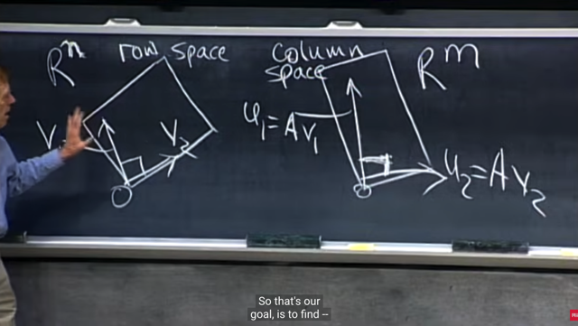</kbd>

> [!NOTE]
> thế thì gs cho rằng**mong muốn của ta** sẽ là: từ một
> **ORTHOGONAL BASIS** TRONG **ROWS-PACE**, map nó
> đến một **ORTHOGONAL BASIS** TRONG **COLUMNS
> SPACE**

> [!NOTE]
> Ý CHÍNH LÀ TA MUỐN TÌM MỘT BỘ ORTHOGONAL
> BASIS CỦA ROWSPACE MÀ ĐƯỢC MAP VỚI MỘT
> BỘ ORTHOGONAL BASIS CỦA COLUMN SPACE

 

<kbd></kbd>

> [!NOTE]
> Đại khái là để có **orthogonal basis** của **row-space** thì ta
> đã biết rằng, **GRAM-SMIDTH** sẽ giúp ta làm được cái này:
> **bắt đầu với một bộ INDEPENDENT vector** - tức là một
> **basis bình thường**, **Gram Smidth sẽ giúp ta tạo ra một bộ
> ORTHONORMAL basis vector**
>
> *Ôn lại tí xíu về Gram-Smith: Giả sử có a, b, c basis vectors
> của R3 (đương nhiên, đã nói basis thì nó independent, và đủ
> số lượng để span R3) có điều chưa phải là orthogonal Ta sẽ
> dùng quy trình G.S để tạo orthogonal basis A,B,C:
>
> A = a. B = phần dư khi project B xuống C(A): B = b - p = b -
> (aaT/aTa)b
>
> (Ôn nhanh project xuống vector a: p = ax = xa. e = b - p. aTe =
> 0 <=> aT(b-p) = 0 <=> aTb = aTp <=> aTb = aTax <=> x =
> aTb/aTa => p = ax = a(aTb/aTa) => e = b - p = b - a(aTb)/aTa)
>
> C = phần dư khi project C xuống span{A,B}, gọi A là matrix có
> columns space span bởi A, B (hoặc a, b cũng được vì chúng
> đều là basis) C = c - A(ATA)invATc
>
> Ôn nhanh project xuống C(A): p = Ax, ATe = 0 <=> AT(b-p) = 0
> <=> ATb = ATp <=> ATb = ATAx <=> x = (ATA)_invATb  => p =
> Ax = A(ATA)invATb => e = b - p = b - A(ATA)invATb
>
> Khi đó {A, B, C} sẽ là orthogonal basis. Normalize để có ortho
> normal
>
> ==== Quay lại đây
>
> Nhưng khi **nhân với A** cho**orthonormal  basis của rowspace**đó **THÌ CHƯA CHẮC vẫn tạo một orthogonal basis của columns 
> space**.
>
> Do đó ta sẽ**đi tìm một special set up (ý là một bộ orthonormal  
> basis của rowspace sao cho)** để làm được việc này.

> [!NOTE]
> để có orthogonal basis của row-space thì ta đã biết rằng,
> GRAM-SMIDTH sẽ giúp ta làm được cái này: bắt đầu với một
> bộ INDEPENDENT vector - tức là một basis bình thường,
> Gram Smidth sẽ giúp ta tạo ra một bộ ORTHONORMAL basis
> vector

 

<kbd>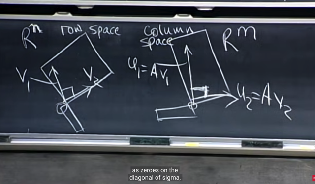</kbd>

> [!NOTE]
> Và ta sẽ thể hiện luôn **nullspace** và **left
> nullspace** (nullspace of AT) trong đây

 

<kbd></kbd>

> [!NOTE]
> Tiếp theo, coi như ta có các **orthonormal basis vector
> của row-space** {v1, v2, ....vr} (set có **r independent
> vector** vì **r là rank**), như đã nói ở đầu ở đây **A**
> **không nhất thiết phải full-rank** (rank = m = n)

 

<kbd>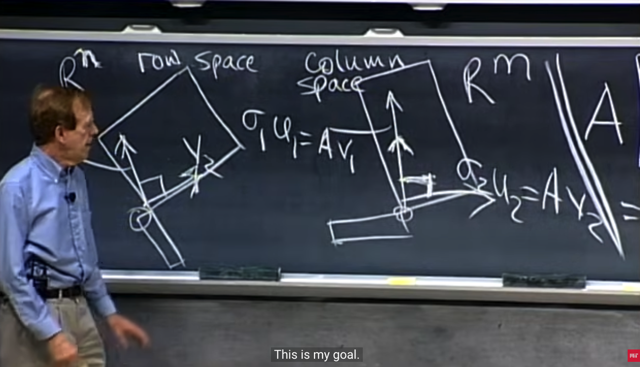</kbd>

> [!NOTE]
> như vậy ta sẽ muốn **tìm orthonormal basis của rowspace
> {v1, v2..}** sao cho khi nhân với A (tức Av1, Av2...) sẽ **tạo
> các orthogonal basis** trong **columns space** **{σ1u1,
> σ2u2...σmum}**
>
> Nên hiểu u1, u2...um là **orthonormal basis của column
> space**, và σ1, σ2 ...gọi là các**stretching factor.**

 

<kbd>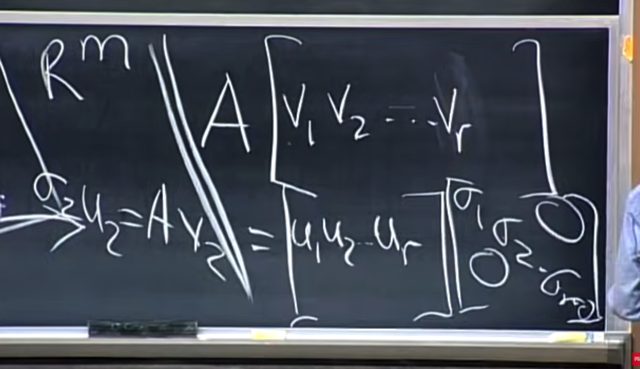</kbd>

> [!NOTE]
> Từ đó ta sẽ **thể hiện mong muốn nói ở trên thành dạng
> matrix** như sau:
>
> Vế trái là **matrix A nhân với (matrix các) orthonormal basis
> vector của row-space {v1, v2..}**
>
> Vế phải là **matrix các column-space orthonormal basis
> vectors** **{u1, u2,...}** nhân với **diagonal matrix các
> stretching factors**.
>
> Thì khi đó ta sẽ có cái ta muốn là:
>
> **Av1 = σ1u1**,**Av2 = σ2u2**,....
>
> Matrix A sẽ **map** một **basis vector của rowspace** với
> **một basis  vector của columns space** và **cả hai basis đều
> orthogonal**

 

<kbd>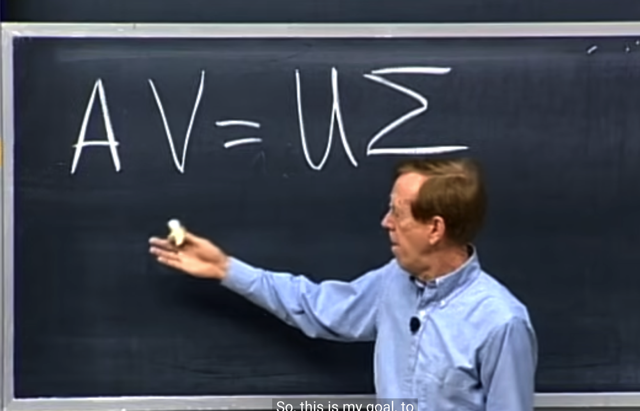</kbd>

> [!NOTE]
> Thể hiện goal: tìm được **orthonormal basis của
> rows-space V** và **orthonormal basis của columns
> space U** để **AV  = UΣ**
>
> Và khi nhớ về diagonalization **AS = SΛ** thì ta thấy rất
> giống: matrix Λ được convert thành **diagonal** matrix Σ

> [!NOTE]
> Ý TƯỞNG GỐC CỦA SVD:
>
> TÌM ORTHOGONAL BASIS CỦA ROWS-SPACE V,
> VÀ ORTHOGONAL BASIS CỦA COLUMNS SPACE
> U ĐỂ
>
> THÔNG QUA A, MỘT BASIS V1 ĐƯỢC MAP VỚI
> MỘT BASIS U1:
>
> Av1 = u1σ1, Av2 = u2σ2....
>
> AV = U∑

 

<kbd>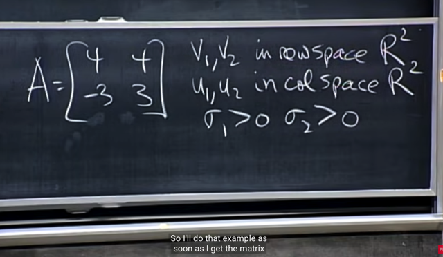</kbd>

> [!NOTE]
> Ví dụ như với matrix A (2, 2) này. Ta sẽ **tìm v1, v2 là
> orthonormal basis của row space** (và trong case này
> rowspace thật ra là **toàn bộ R2** vì **A full-rank** nên 2
> rows và 2 cols của nó đều independent,**span toàn bộ
> R2**) và **u1, u2 là orthonormal basis khác của R2**, cũng như
> hai **stretching factors σ1, σ2**

 

<kbd>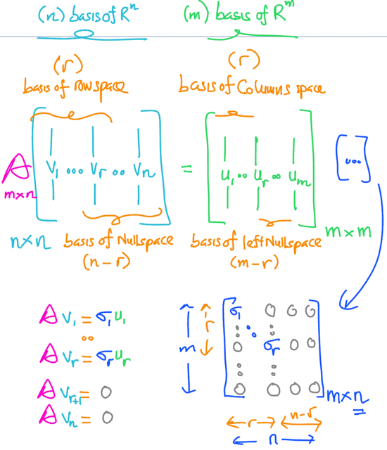</kbd>

> [!NOTE]
> Trong SVD **MỞ RỘNG AV = UΣ, đúng hơn thì U và V
> không chỉ chứa basis của column space và row space
> đâu**, mà là **cả left null-space và null-space nữa**
>
> Để rồi đúng hơn U chính là **CHỨA m ORTHONORMAL
> BASIS CỦA R^m**: r col đầu là basis của**column
> space**, m-r columns sau là basis của **left** **null-space**
>
> Và V CHÍNH LÀ CHỨA **n ORTHONORMAL BASIS**
> CỦA **R^n**: r col đầu là basis của **rows-space**, và n - r
> column sau là basis của **nullspace**.

 

<kbd>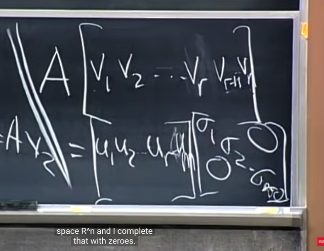</kbd>

> [!NOTE]
> Cái điểm quan trọng cần để ý là **COLUMN** **SPACE** và
> **ROW** **SPACE** CÓ **CÙNG** **DIMENSION** = r
>
> Nên **một** vector trong**basis của rows space** được **map**
> với **một** vector trong **basis của columns space**.
>
> SVD RÚT GỌN
>
> Nên nếu V c**hỉ chứ các basis của rows-space**:
>
> V có shape là **[n, r]** và U chỉ **chứa r basis của columns
> space** U có shape là **[m, r]**
>
> thì AV = UΣ chỉ phản ánh việc map giữa rows space basis và
> columns space basis và **∑ chỉ chứa các stretching factor** (r
> cái) có shape [r, r]:
>
> Shape của các matrix: [m,n][n,r] = [m,r][r,r]
>
> SVD FULL
>
> Nhưng nếu đưa **thêm (n-r) basis của nullspace vào V** để
> thành basis của Rn: V có shape **[n,n]** và đưa thêm **m-r
> basis của left-nullspace vào U** để thành basis của Rm: U  có
> shape **[m,m]**, lúc này ∑ có thêm stretching factor = 0  nữa.
>
> Shape của các matrix: [m,n][n,n] = [m,m][m,n]
>
> Lúc này, Av_r+1, Av_r+2 .. (có n-r cái như vậy) đều bằng 0  vì
> chúng là basis của nullspace.
>
> Còn ở vế phải, **∑ cũng có thêm n-r cột = 0**, để U∑ có thêm
> n-r cột zero **map với n-r cột zero của AV
>
> (Đã check với GPT & Grok)**

 

<kbd>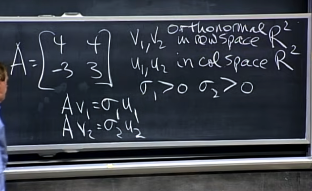</kbd>

 

<kbd>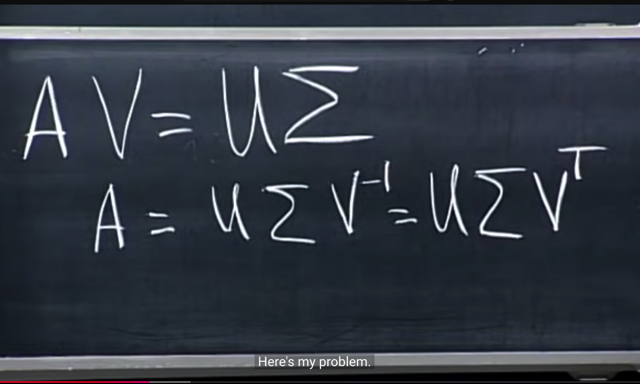</kbd>

> [!NOTE]
> Và ta có thể **nhân (vào bên phải) hai vế cho VT**(Dù full svd hay svd thu gọn thì VVT luôn = I, do
> các cột của V orthornormal)**** để ta có  **A = UΣVT**

 

<kbd>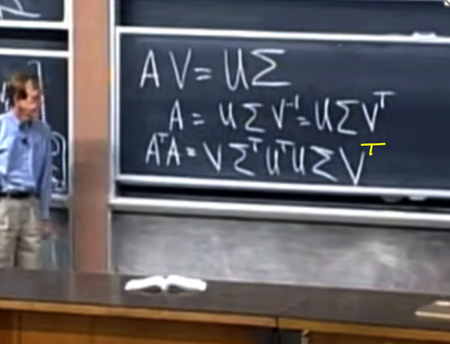</kbd>

> [!NOTE]
> Thế thì đại khái là ta có **2 orthogonal matrix U và V**, và
> ta sẽ **KHÔNG MUỐN TÌM CẢ HAI CÙNG LÚC**.
>
> Thành ra, ta sẽ tìm cách **khử đi một cái (là U) để tìm V
> trước**.
>
> Và ta sẽ mượn đến **ATA**:
>
> ATA = [UΣ(VT)]T UΣ(VT) = VΣT(**UT)U**Σ(VT)
>
> Và có thể thấy (UT)U = I, vì U là orthogonal matrix, ta đã
> biết các columns của chúng orthogonal, nên (UT)U = I
>
> Vậy **ATA = V(ΣT)Σ(VT)**

 

<kbd>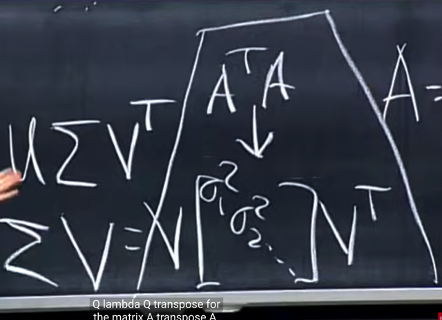</kbd>

> [!NOTE]
> Và **Σ là diagonal matrix** nên (ΣT)Σ **cũng là diagonal matrix**
> chứa **bình phương của các stretching factor {σ1^2, σ2^2...}**
>
> Và đây chính là eigen-decomposition **(diagonalization) đối với
> matrix ATA** (giống như A = SΛSinv) vậy. Hơn nữa việc
> factorization **có dạng của A = QΛQT** thay vì chỉ là SΛSinv càng
> cho thấy sự phù hợp với sự thật rằng **ATA là SYMMETRIC**matrix (thì mới có orthonormal eigenvectors để S trở thành Q (*)
> và Sinv trở thành Qinv = QT (**)
>
> ôn lại nhanh:
>
> (**): Vì là orthogonal matrix nên QTQ = I ⇨ QT=Qinv
>
> (*): Symmetric ⇨  A = AT: Giả sử x, y là eigenvector với e.values là
> µ1, µ2 với µ1 ≠ µ2 ⇨ Ax = µ1x, Ay = µ2y
>
> Ta có: 
>
> (Ax)Ty = xTAy ⇔ (µ1x)Ty = xTµ2y ⇔ µ1xTy = µ2xTy ⇔ (μ1 - μ2)xTy 
> ⇨ xTy = 0 (do μ1 khác μ2) ⇨ x vuông góc y
>
> Có nghĩa là thông qua việc có thể thể hiện ATA dưới dạng như
> vậy cho thấy (các cột của) **V CHÍNH LÀ EIGENVECTORS CỦA
> ATA**, các stretching factors bình phương **σ1^2, σ2^2**..chính
> là **EIGENVALUES** của ATA

> [!NOTE]
> **KHÔNG THỂ TÌM CẢ U VÀ V CÙNG LÚC**, TÌM V TRƯỚC:
> MƯỢN ATA
>
> ATA = (U∑VT)T(U∑VT) = V(∑T)(UT)U∑(VT) = V(∑T)∑VT
>
> = V∑^2(VT) => ĐÂY CHÍNH LÀ **DIAGONALIZATION** CỦA **ATA**
>
> => **V CHÍNH LÀ CÁC EIGENVECTOR CỦA  ATA**, VÀ **∑^2**
> CHÍNH LÀ **EIGENVALUES MATRIX CỦA ATA** (đồng nghĩa
> stretching factor chính là sqrt eigenvalues của ATA)

 

<kbd>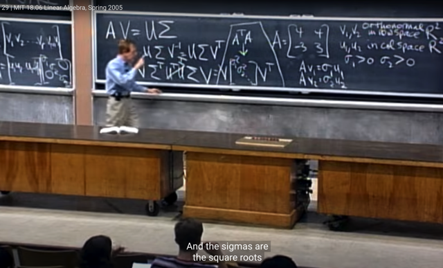</kbd>

> [!NOTE]
> Làm tương tự: AAT = (U∑VT)(U∑VT)T = (U∑VT)(V(∑T)UT =
> U∑∑TUT = U(∑^2)UT => Đây chính là diagonalization của AAT
>
> Do đó U CHÍNH LÀ MATRIX CÁC EIGENVECTOR CỦA AAT****Và EIGENVALUE CỦA AAT CŨNG LÀ BÌNH PHƯƠNG CỦA
> STRETCHING FACTOR****NHỚ RẰNG, MỤC TIÊU CỦA BÀI TOÁN LÀ **TÌM BỘ BASIS
> ORTHONORMAL BASIS CỦA ROW SPACE OF A (V)** VÀ
> **ORTHONORMAL BASIS CỦA COLUMN SPACE OF A (U)**.
> **SAO CHO AV = UΣ**
>
> (Có thể có rất nhiều bộ orthonormal basis của rowspace và
> columns space nhưng không thỏa)
>
> Tóm tắt lại:
>
> AV = UΣ, **DẪN TỚI ATA = V(ΣT)Σ(VT)**, VÀ ĐIỀU NÀY **CHO
> THẤY V CẦN TÌM ĐỂ THỎA AV = UΣ** THÌ NÓ**CHÍNH LÀ
> EIGENVECTORS CỦA ATA
>
> AV = UΣ dẫn tới AAT = UΣ(ΣT)(UT) CHO THẤY U CẦN TÌM
> CHÍNH LÀ EIGENVECTORS CỦA AAT**

> [!NOTE]
> MƯỢN AAT
>
> AAT = (U∑VT)(U∑VT)T = (U∑VT)(V(∑T)UT = U∑∑TUT 
>
> = U(∑^2)UT
>
> => ĐÂY CHÍNH LÀ **DIAGONALIZATION** CỦA **AAT**
>
> => **U CHÍNH LÀ CÁC EIGENVECTOR CỦA  AAT**, VÀ **∑^2**
> CHÍNH LÀ **EIGENVALUES MATRIX CỦA AAT** (đồng nghĩa
> stretching factor chính là sqrt eigenvalues của ATA)

> [!NOTE]
> Vậy chẳng lẽ eigenvalues của AAT cũng là eigenvalues của
> ATA vì như trên ta thấy AAT=U(Σ^2)UT và ATA = V(Σ^2)VT 
> cho thấy chúng đều là bình phương của stretching factor 
> trong phép SVD: A = UΣVT
>
> Thử chứng minh:
>
> Giả sử µ khác 0 là eigenvalue khác 0 của ATA, ATAx = µx, x
> là eigenvector đương nhiên là nonzero vector
>
> Xét y = Ax thì vì x khác 0 và là eigenvector của ATA nên nó
> ko thể là nullspace của A, vì khi đó ATAx cũng bằng 0. 
>
> Vậy y khác 0.
>
> Tính thử AATy = AATAx = Aµx = µAx = µy
>
> Vậy y là nonzero vector thỏa AATy = µy => y là eigenvector
> của AAT với eigenvalue là µ ⇨ µ đều là eigenvalue của ATA
> và AAT

 

<kbd>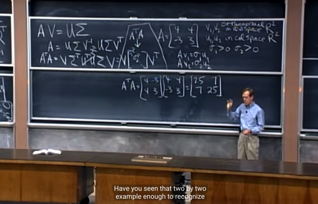</kbd>

> [!NOTE]
> gs lấy ví dụ matrix A này, và ta có matrix ATA.
>
> Ta sẽ **tìm eigenvectors ATA sẽ chính là V cần tìm**, và
> **eigenvalues của ATA sẽ là Σ^2, hay Σ chính là square
> root của (matrix of) eigenvalues của ATA**

 

<kbd>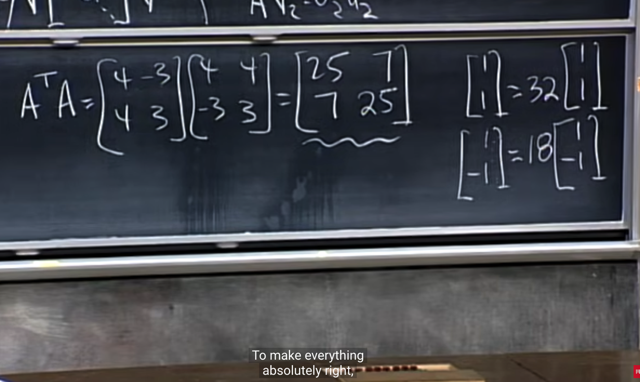</kbd>

> [!NOTE]
> Theo cách tìm eigenvalue và eigenvectors đã biết (solve
> characteristic equation để tìm eigenvalues) ta sẽ tìm được
> hai vectors này, ứng với eigenvalues = 32, 18

 

<kbd></kbd>

> [!NOTE]
> Ta có thể**normalize length** để có hai
> eigenvector có **unit norm**

 

<kbd>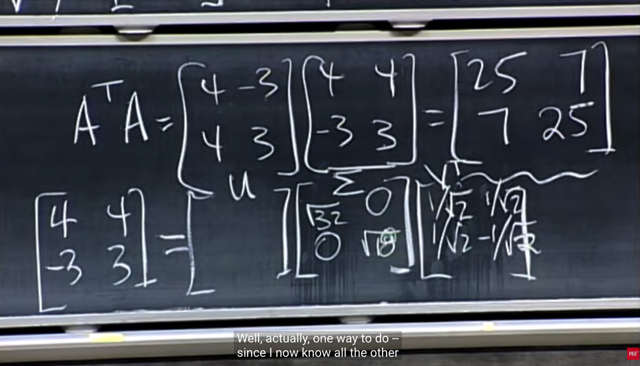</kbd>

> [!NOTE]
> Từ đó ta có **Σ** là square root của **ATA's eigenvalues**
> và **V** là **eigenvector của ATA**

 

<kbd>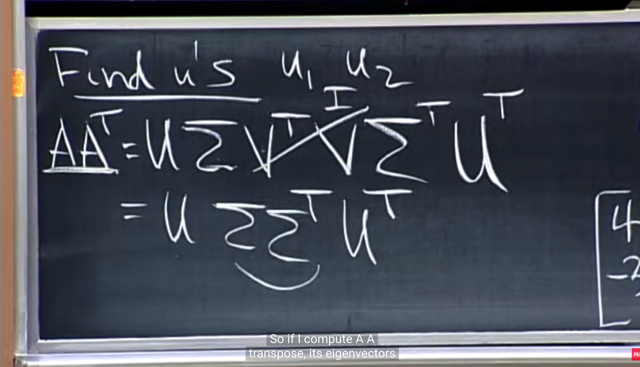</kbd>

> [!NOTE]
> còn U như đã nói là eigenvectors của AATVà như gs cho
> thấy ở đây AAT sẽ trở thành UΣ(ΣT)(UT)
>
> Đây chính là diagonalization của AAT.
>
> Từ đó cho thấy AAT cũng là một **symmetric** matrix, và
> khi factored như vậy nên **U chính là eigenvectors của
> AAT**, và**Σ(ΣT) là diagonal matrix chứa eigenvalues
> của AAT
>
> NHỚ RẰNG, TA ĐANG NÓI ĐẾN U LÀ ORTHONORMAL 
> BASIS CỦA COLUMN SPACE CỦA A.
>
> NHƯNG QUA VIỆC DIAGONALIZATION VỚI AAT, CHO
> THẤY U CŨNG SẼ LÀ EIGENVECTORS CỦA AAT**

 

<kbd>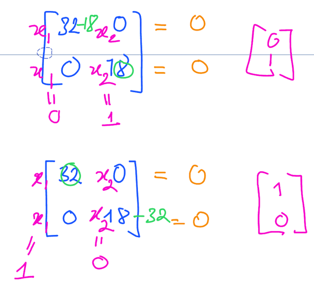</kbd>

<kbd></kbd>

<kbd>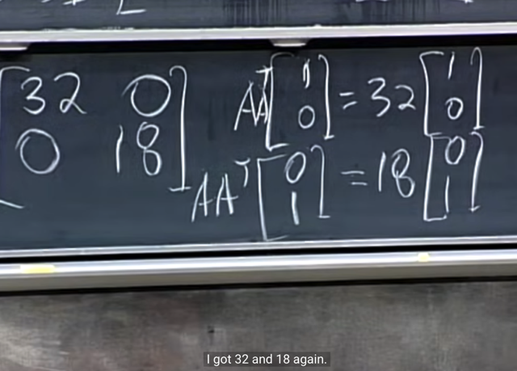</kbd>

> [!NOTE]
> rồi, xét matrix AAT **với ví dụ này** thì thấy nó **hóa ra là
> diagonal matrix**. Và như vậy**trên đường chéo của nó
> chính là eigenvalues**.
>
> Và eigenvectors là [1 0] và [0 1] (cái này thì có vẻ như là
> mẹo - đối với diagonal matrix nhưng cũng **có thể dễ
> dàng tìm ra với việc tìm nullspace của A-lambda*I = 0**
> thôi.)

 

<kbd>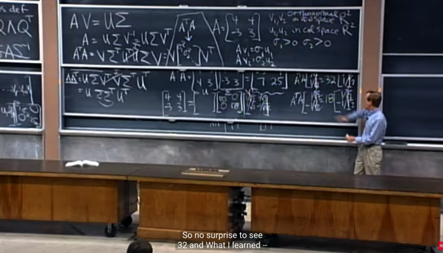</kbd>

> [!NOTE]
> và ta thấy hai con số 32 và 18 không phải ngẫu nhiên cũng
> là eigenvalue của ATA. Là **bởi hai matrix AB và BA có cùng
> eigenvalues**Trong bài giảng 4 của 18.065 gs có nói đại khái là chỉ cần
> cho BA = BA(BBinv) = **B(AB)Binv**Thì việc BA = B(AB)Binv 
> đã đủ để cho thấy BA và AB là **SIMILAR** **MATRICES**, do đó 
> chúng sẽ có cùng eigen values. 
>
> Tạm hiểu là vậy, tuy rằng việc lập luận như gs rõ ràng là đang
> assume B invertible.
>
> Và do đó ATA và AAT cũng có cùng non-zero eigenvalues

 

<kbd>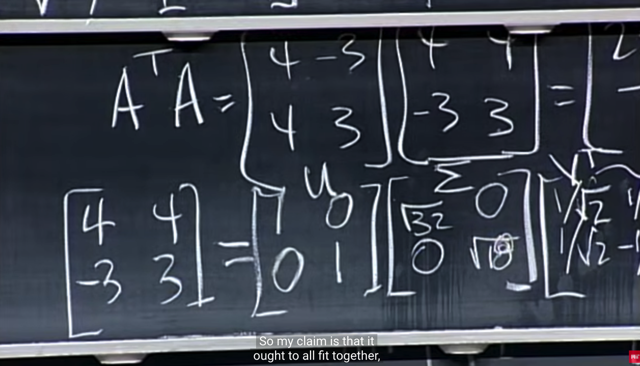</kbd>

> [!NOTE]
> Và với eigenvectors của AAT, ta có U. Tới đây khi lắp vào
> thì gs **kì vọng rằng ta sẽ có phương trình đúng**

 

<kbd>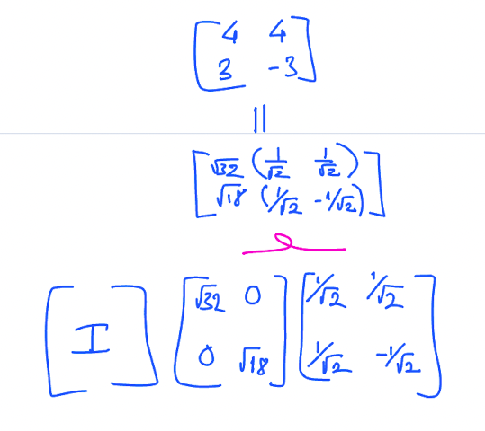</kbd>

> [!NOTE]
> Có điều nó lại **ra như vầy, sai dấu**. Vậy thì ở đây gs mắc một sai
> sót mà bên dưới **comment** có phản ánh cũng như qua bài
> review (bài 32) gs có nói lại.
>
> Đó là bởi vì, với **eigenvectors,** thì khi **ta nhân nó với -1**, để
> đổi ngược hướng của nó lại, thì **nó vẫn là eigenvectors**. Liên hệ
> với việc ta tìm eigenvector thông qua xác định special solution của
> A-λI = 0, hay basis của nullspace của A-λI thì trong đó ta xác định
> free columns / variables từ đó **có thể chọn giá trị TÙY Ý CHO
> CHÚNG**, dù thông thường ta chọn 1 cho free variable và 0 cho
> các free variable khác để back-substitute tìm ra pivot variable.
>
> Vậy giả sử như lúc tìm eigenvector của AAT, ta chọn -1 cho free
> variable thì cũng được, hay **nói cách khác, U không nhất thiết
> phải là [1 0; 0 1] mà hoàn toàn có thể là [1 0; 0 -1] hoặc [-1 0, 0
> -1]**.
>
> Tuy nhiên **khi muốn thỏa mãn AV = UΣ** thì**CÓ SỰ RÀNG
> BUỘC về dấu giữa V và U**.
>
> Thành ra, **khi ta tìm U một cách độc lập với V** thông qua AAT thì
> theo gs T**A CÓ 50% CHỌN ĐƯỢC DẤU ĐÚNG**. 
>
> Và trong trường hợp này **GS ĐÃ RƠI VÀO 50% CÒN LẠI, TỨC  
> LÀ CHỌN U SAI DẤU.**
>
> Do đó để tìm U chính xác khớp được với AV = UΣ thì **phải tìm nó
> trong quan hệ với V**, đương nhiên cách dễ nhất chính xác nhất là
> thông qua AV = UΣ <=> **AVΣinv = U**

 

<kbd>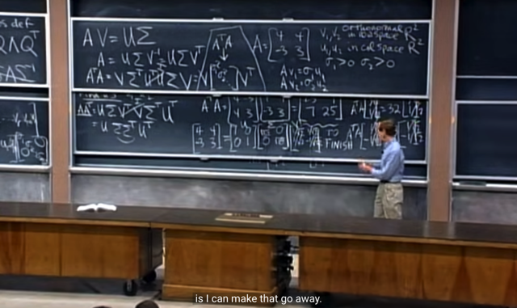</kbd>

🔗 **Related:** [LECTURE 32: QUIZ 3 REVIEW](untitled.md#node-1183)

> [!NOTE]
> Gs có giải thích lỗi này trong bài sau. Nhưng đại khái là
> ví dụ này cho thấy nếu ta tìm V và ∑ bằng cách tìm
> **eigenvectors và eigenvalues của ATA**, sau đó tìm U
> thông qua e**igenvectors của AAT**, và **ĐẢM BẢO**
> dấu của chúng phù hợp nhau thì ta sẽ thấy **qủa thật là
> A có thể được phân tách thành U∑VT**.
>
> Bởi lẽ **SVD quy định rằng mọi matrix A đều có thể làm
> được như vậy.**

 

<kbd></kbd>

> [!NOTE]
> Lấy ví dụ thứ 2, cho matrix A này, nó **rank 1** (dễ thấy chỉ
> có **1 independent col/row**) Và gs vẽ **row-space**  là một
> **line đi qua basis vector** và **nullspace là line vuông góc
> với rows-space**.
>
> tương tự với **columns space và left nullspace**
>
> Và ta cũng **chọn unit vector basis** của **row-space** và
> **column-space** (dùng basis của rows space - một trong
> hai row vector, cái nào cũng được, normalize để có unit
> norm, tương tự với columns)
>
> Và có thể dễ dàng nhẩm tính một vector vuông góc với
> một row, để có ngay basis của nullspace (vì đã biết
> dim N(A) = 1 nên chỉ cần 1 vector, và N(A) và C(AT) ortho
> gonal complement). Và nó sẽ tham gia vào làm các cột
> thứ r+1 đến n của V, trong trường hợp này, V sẽ chỉ có 2 
> cột, một cột là basis của rowspace, cái kia là basis của
> nullspace
>
> Tương tự, nhẩm tính một vector vuông góc với columns,
> để có ngay một basis của left-nullspace N(AT), và nó sẽ
> là cột thứ 2 của U (cột đầu của U là basis của C(A))

 

<kbd>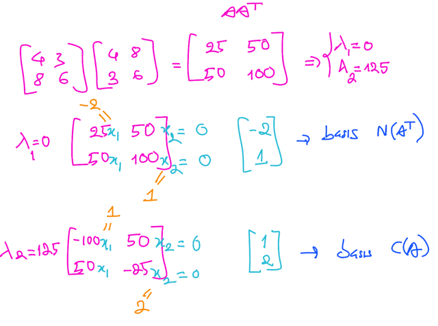</kbd>

<kbd></kbd>

<kbd>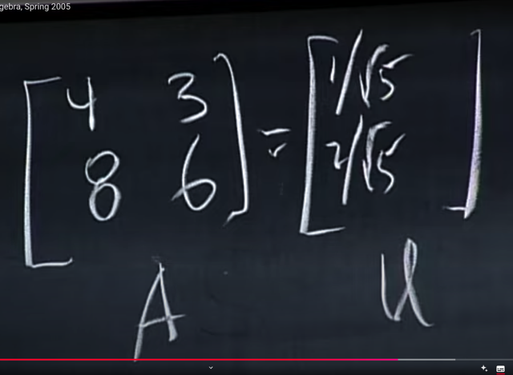</kbd>

> [!NOTE]
> Tới đây **gs điền u1 = unit basis của column space** vào
> đây (U). Vì ta nhớ rằng U là bộ orthonormal basis của
> columns space. Hồi nãy khi**A full rank**, **column space
> của nó span toàn bộ R^2**, thì khi đó **có vô số bộ
> basis** như vậy.
>
> Và tương tự với row-space V.
>
> Và ta**cần tìm bộ U, V sao cho thỏa  AV = UΣ.**Thì với
> vô số basis của C(A) và C(AT) thì biết tìm U, V như thế
> nào?
>
> Cho nên **phải dựa vào việc V chính là eigenvectors của
> ATA**cũng như U chính là eigenvectors của AAT và **Σ
> là square root  của ATA eigenvalues matrix.**
>
> Còn ở đây **vì A chỉ có rank = 1**, nên **column space và
> rowspace của A chỉ là một 1D line, và chọn một row /
> column bất kì là có ngay basis của row-space và
> column-space**
>
> (Vì chọn cái nào thì cũng là trên line đó thôi, khác với
> việc column-space  là **một plane** thì **các cặp basis
> vector có thể khác nhau hoàn toàn  về hướng để rồi phải
> tìm cặp basis của C(AT) và basis của C(A)  giúp thỏa AV
> = U∑**)
>
> ====
>
> Tóm lại ý là vầy, nếu A (2x2) full rank, thì đương nhiên
> có**vô số bộ orthonormal basis của column space C(A)
> và row space C(AT)**. Thành ra muốn có U, V sao cho
> AV = UΣ, ta **không thể chỉ lấy columns của nó làm U và
> row của nó làm V** được. Mà ta**phải tìm thông qua
> diagonalization đối với matrix ATA** và AAT
>
> Còn khi A rank 1 thì chỉ việc lấy một column bất kì, của
> nó ra làm U (sau khi normalize để có unit norm), tương
> tự với V
>
> Nhắc lại nếu các cột của U, V chỉ là basis của C(A) và
> C(AT) thì đó là phiên bản SVD thu gọn.
>
> Nếu đưa theo vào V các basis của nullspace, vào U các
> basis của left nullspace nữa thì ta có Full SVD

> [!NOTE]
> Có thể thấy ở đây nếu ta tìm U thông qua **tìm eigenvector của
> AAT,**thì kết quả cũng sẽ chứa **HAI** vector, trong đó:
>
> i)  **EIGENVECTOR của AAT ỨNG VỚI EIGENVALUE KHÁC 0**và đó **chính là basis của COLUMN SPACE của A** (1, 2), có
> thể thấy nó là scaled của các column (4, 8) (3, 6)
>
> ii) Còn **cái kia ứng với EIGENVALUE = 0**, **chính là basis của
> LEFT NULLSPACE**(-2 1). Có thể thấy nó vuông góc với [1 2]
> hoàn toàn đúng với sự thật rằng column space và left nullspace
> orthogonal
>
> Tóm lại,**eigenvectors của AAT** chính là U, trong đó một cái là
> **basis của C(A)** (1, 2), cái kia là **basis của left nullspace
> N(AT)** (-2, 1).
>
> Chẳng qua như đã nói trong case này A chỉ có mỗi hai cột, và
> **có một cột độc lập** dĩ nhiên là **lấy cột nào cũng là basis của
> C(A)**, và **nhẩm tính vector vuông góc với nó thì có basis của
> N(AT)**

 

<kbd></kbd>

> [!NOTE]
> để **tìm Σ**, như đã biết ta sẽ mượn đến sự thật rằng Σ
> chính là square root của eigenvalues của ATA. Gs tính ATA,
> và bữa trước, ta biết rằng chỉ khi nào A full column rank, tức
> là nó có n columns độc lập thì ATA mới full rank.
>
> (Lập luận lại để ôn như sau: Nếu ATA full rank tức là null
> space của nó chỉ chứa zero, hay, ATAx=0 chỉ có thể suy ra x
> = 0. Vậy thì ta sẽ lập luận rằng, **nếu A không full column
> rank**, tức **tồn tại free columns**. Thì **nullspace của A có
> chứa vector khác 0**. Khi đó đương nhiên **NÓ CŨNG LÀ
> SOLUTION KHÁC 0 CỦA CỦA ATAx = 0**.  Từ đó dẫn đến
> nullspace ATA không phải bằng zero  -> ATA không full-rank.
> Thành ra để ATA full rank thì bắt  buộc x = 0 là solution duy
> nhất của Ax = 0, tức là A phải  full column rank)
>
> Vậy vì A có 2 cột mà chỉ có rank 1 tức là **A KHÔNG FULL
> COLUMN RANK**, nên **ATA CHẮC CHẮN KHÔNG FULL
> RANK**, hay, **ATA LÀ NONINVERTIBLE / SINGULAR
> MATRIX**.
>
> Từ đó **NHẤT ĐỊNH CÓ ÍT NHẤT MỘT EIGENVALUE = 0**,
> cũng chính là có ít nhất một stretching factor = 0.
>
> Và eigenvector (của ATA) đó **CHÍNH LÀ BASIS CỦA
> NULLSPACE** của A (và sẽ l**àm thành các cột từ r+1 đến n
> của V**)
>
> Và từ trace (tổng đường chéo của ATA = 125, và cũng là tổng
> các eigenvalue)  ta suy ra eigenvalue còn lại là **125**. Vậy
> là ta đã xác định được **Σ = sqrt của ATA's eigenvalues là 0
> và 25**

 

<kbd>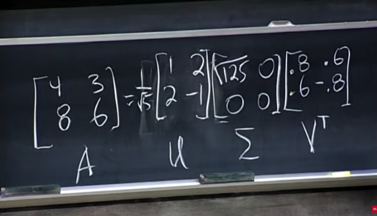</kbd>

> [!NOTE]
> Tóm tắt lại, với A = [4 3; 8 6]
>
> Việc ATA singular, không full-rank có nguyên
> do là các cols / rows của A không independent. Dẫn tới
> ATA có (ít nhất) một eigenvalue bằng 0. Và dẫn tới:
>
> Các eigenvector ứng với eigenvalue bằng 0 sẽ chính là
> basis của nullspace của A. (Mà điều hay ho là nó cũng là
> basis của nullspace của ATA luôn, phải không, vì ta biết
> eigen vector ứng với eigenvalue bằng 0 của matrix chính
> là vector nằm trong nullspace của matrix đó)
>
> Các eigenvector ứng với eigenvalue khác 0, sẽ chính là
> basis của rowspace của A.
>
> Thành ra trong ví dụ này ta có thể lắp ngay v1 (là basis
> vector của rowspace) và một vector trong đường vuông
> góc với nó (là nullspace) để có v2, tạo thành V. Nhưng
> nếu giải tìm eigevector của ATA thì cũng ra hai vector
> này (nên hiểu là ra hai cái vector nằm trên hai cái line
> này - hay, hai cái phương này còn giá trị cụ thể, hướng 
> thế nào thì do tùy chọn free variable)
>
> ====
>
> Tiếp tương tự như đã nói, ta có thể tìm eigenvectors của
> AAT để có U, và trong ví dụ matrix A 2x2 này, vì A không
> có trạng thái mọi column/row đều independent, thì sẽ dẫn
> tới ATA và AAT đều không fullrank, nên chúng đều có 
> ít nhất một eigenvalue = 0
>
> Nên khi tìm eigenvalue/eigenvector của AAT: Ta sẽ có:
>
> Một eigenvector ứng với eigenvalue = 0, đây chính là 
> basis vector của left nullspace của A, và tương tự như 
> trên, nó cũng là basis của nullspace của AAT
>
> Một eigenvector ứng với eigenvector khác 0, đây chính là
> một basis vector của columnspace của A.
>
> Và nhân vào thực sự sẽ ra A. (nếu có khác về dấu thì
> nhớ rằng chẳng qua là ta chọn vector cụ thể của basis
> là gì, ý là vector theo hướng nào, chứ nó cũng một line)

 

<kbd></kbd>

<kbd></kbd>

<kbd>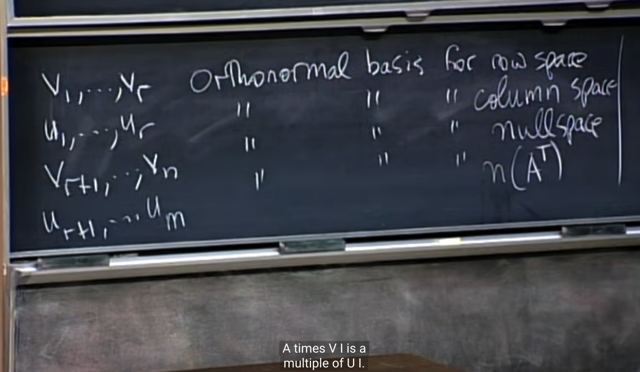</kbd>

> [!NOTE]
> Đây, chính là thầy nhắc lại rằng SVD thật ra **chính là việc
> CHỌN BỘ BASIS CỦA 4 FUNDAMENTAL SUBSPACE**

> [!NOTE]
> Phải nhắc lại rằng**trong AV = UΣ, đúng hơn thì U và V
> không chỉ chứa basis của column space và row space
> đâu**, mà là **cả left null-space và null-space nữa**
>
> Để rồi đúng hơn U chính là CHỨA M ORTHONORMAL
> BASIS CỦA**R^M**: **r cột đầu là basis của COLUMN
> SPACE**, **m-r col sau là basis của LEFT NULLSPACE**
>
> và V CHÍNH LÀ CHỨA N ORTHONORMAL  BASIS CỦA
> **R^N**: **r col đầu là basis của ROW-SPACE**, và **n - r
> column sau là basis của NULLSPACE.
>
> Và thông qua tìm eigenvector của ATA và AAT thì nó
> sẽ cho ra đầy đủ V [các basis của rowspace, các basis
> của nullspace] và U = [các basis của column space,
> các basis của left nullspace]**

> [!NOTE]
> BẢN CHẤT CỦA SVD THẬT RA LÀ**CHỌN BỘ
> BASIS CỦA 4 FUNDAMENTAL SUBSPACE**

 

<kbd>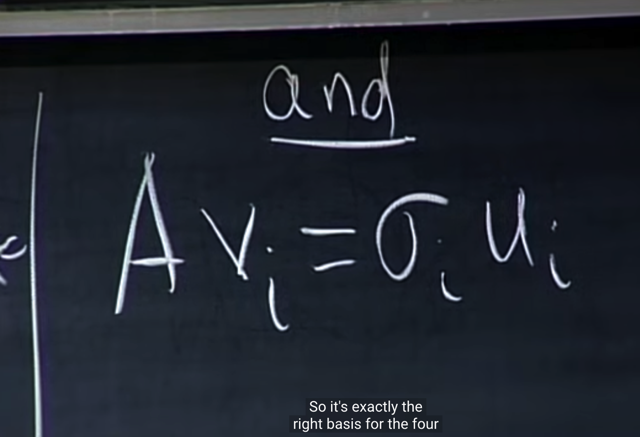</kbd>

> [!NOTE]
> chính là thầy nhắc lại rằng SVD thật ra chính là việc
> chọn bộ basis của 4 fundamental subspace... **sao cho
> thỏa equation này**

 

