# Lecture 2: Elimination With Matrices

📊 **Progress:** `30` Notes | `31` Screenshots

---

<kbd>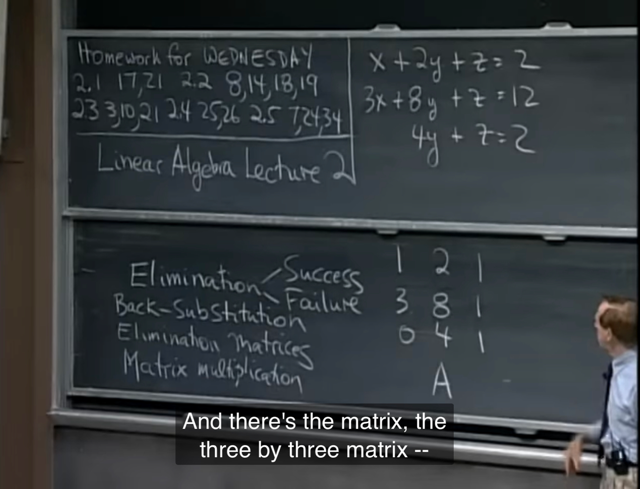</kbd>

> [!NOTE]
> Đại khái là bài này ta sẽ giải system of equation
> này với **phương pháp elimination.**

 

<kbd></kbd>

> [!NOTE]
> Đầu tiên ta nhận định**s**ố 1 (coefficient của
> x ở equation thứ 1: a11) gs gọi nó là **pivot đầu tiên**

 

<kbd>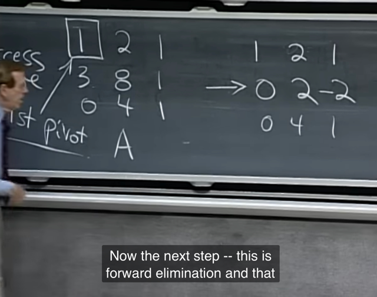</kbd>

> [!NOTE]
> Tiếp thep ta sẽ muốn loại bỏ a21 của equation 2, ta**trừ equation 2 cho equation 1 nhân cho 3 (hệ số của
> hàng 2 cột 3)**. Gọi đây là **bước (2,3)**

 

<kbd>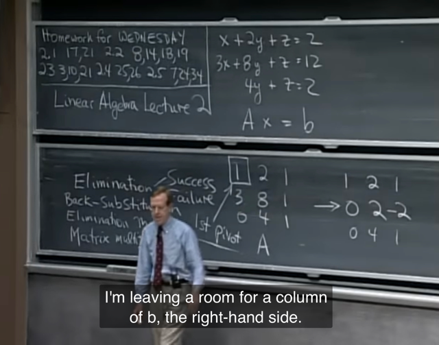</kbd>

> [!NOTE]
> Gs nói tạm thời đừng
> quan tâm vế bên phải

 

<kbd>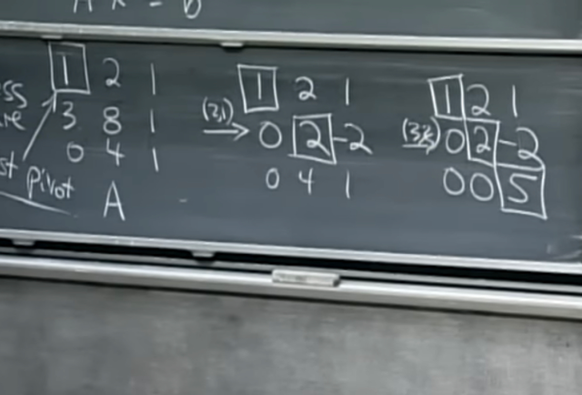</kbd>

> [!NOTE]
> Tiếp theo là **bước (3,1)** (ý là **hủy đi hệ số tại vị trí hàng
> 3, cột 1**. Nhưng vì **nó (a31) đã = 0 sẵn rồi.**
>
> Ta sẽ làm **bước (3,2): hủy a32 đang bằng 4** bằng cách
> trừ hàng 3 cho 2*hàng 2

 

<kbd>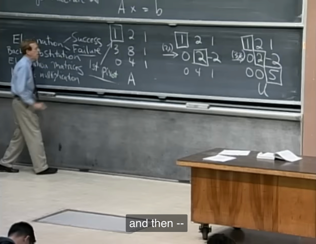</kbd>

🔗 **Related:** [LECTURE 18: PROPERTIES OF DETERMINANTS](untitled.md#node-590)

> [!NOTE]
> Gs cho biết **pivot phải khác 0**. Và ở đây **ta có một case
> rất tốt khi cả 3 pivot đều khác 0**.
>
> Và ở trường hợp này, để tính **determinant** chỉ việc
> **nhân các pivot lại với nhau,** ra bằng 10 
>
> (me: qua bài về determinant ta sẽ có chứng minh tại sao
> det của triangular matrix là tích các pivot)

 

<kbd>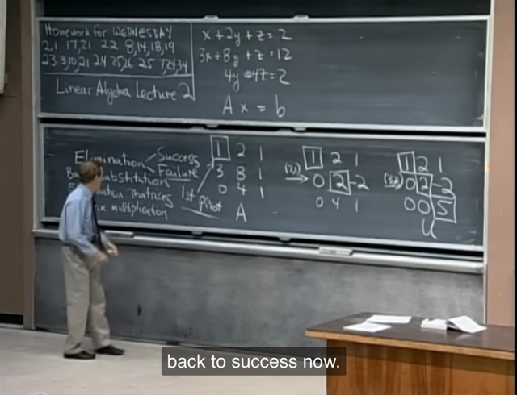</kbd>

> [!NOTE]
> Đại khái là gs nói về **case failure**. Thì có **temporary
> fail** khi ví dụ **như number tại 1,1 hoặc 2,2 bằng 0**. Thì
> **ta luôn có thể exchange/switch row để "thoát ra"**.
>
> Ví dụ 1,1 bằng 0 mà 2,1 hoặc 3,1 khác 0 thì ta **chỉ việc
> đổi vị trí các equation**. Rồi lại làm tiếp.
>
> Nhưng **nếu làm tới hàng 2 mà 2,2 và 3,2 đều bằng 0**
> hoặc**tới hàng 3 mà 3,3 = 0** thì sẽ **ko còn row nào mà
> đổi nữa**.
>
> **Khi đó sẽ là failure**, ta sẽ có **non-inversible matrix**

 

<kbd>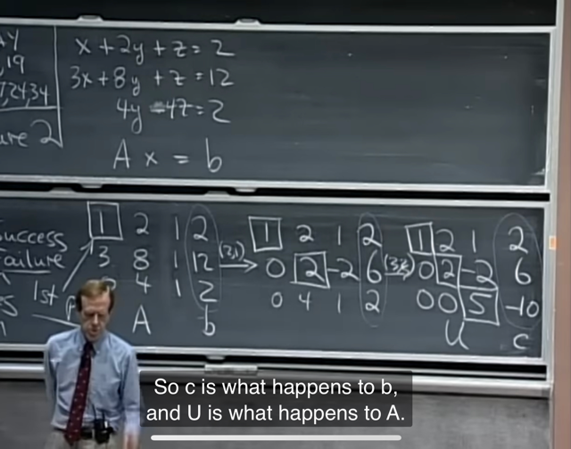</kbd>

> [!NOTE]
> Kế tiếp ta sẽ **làm lại những bước biến đổi (nãy giờ ở
> vế trái) đối với vế phải để thành vector c**

 

<kbd>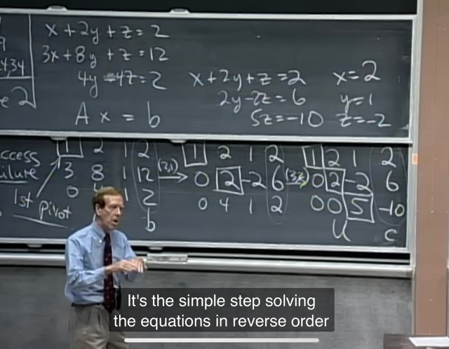</kbd>

> [!NOTE]
> Và đến đây, chỉ việc **viết lại equation system** gọi nó là **Ux=c**. 
>
> **Back substitution**: tính z, thay vào 2 tính y, thay vào 1 tính x

 

<kbd>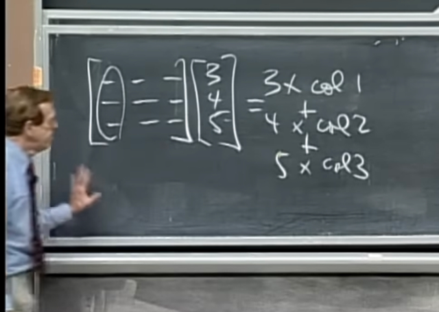</kbd>

> [!NOTE]
> Tiếp theo gs nhắc lại việc **nhân matrix cho vector**,
> như bài trước đã học ở **góc nhìn theo column** thì nó
> là**linear combination của các column** bởi các **coeff là
> các giá trị của vector**

 

<kbd>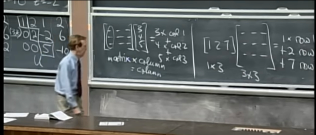</kbd>

🔗 **Related:** [LECTURE 7: SOLVING AX = 0: PIVOT VARIABLES, SPECIAL SOLUTIONS](untitled.md#node-183)

> [!NOTE]
> **matrix** A @ **col x** là **linear combination** của các
> matrix column, với **coeff là components của x** nên sẽ
> **được column**
>
> **row x @ matrix A** thì sẽ là **linear combination của các
> row của matrix A**với**coeff là components của x**, nên
> sẽ **được row.**

 

<kbd>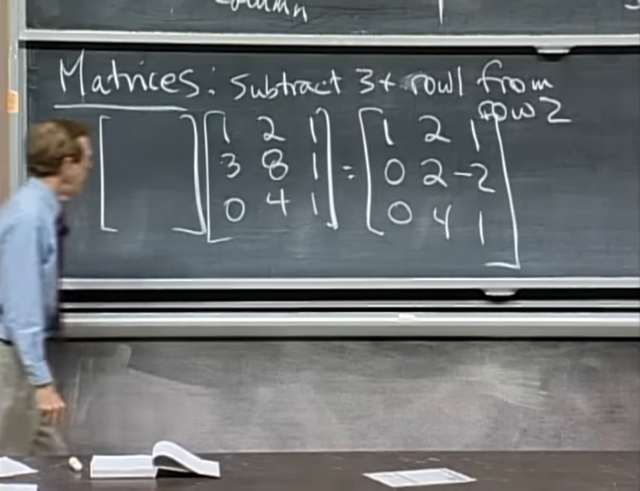</kbd>

> [!NOTE]
> Câu hỏi là **nhân matrix gì cho matrix A** **để tương đương
> với bước thứ nhất trong quá trình eliminating** hồi
> nãy: **trừ hàng 2 cho 3*hàng 1**

 

<kbd>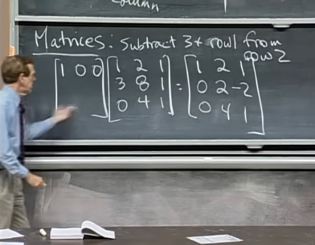</kbd>

> [!NOTE]
> Để trả lời ta sẽ đơn giản hiểu rằng **hàng thứ 1 của matrix
> cần tìm sẽ nhân với matrix A** để **ra hàng thứ 1 của
> matrix kết quả**.
>
> Vậy, vì như đã nói **row (row vector) nhân matrix** thì sẽ
> là**linear combination các matrix's row** nên **để hàng 1
> của matrix kết quả  bằng hàng 1 của A** thì**ta sẽ cần:
>
> 1** * row 1 của A + **0** * row 2 của A + **0** * row 3 của A
>
> Vậy **row 1 của**matrix cần tìm là **[1 0 0]**

 

<kbd>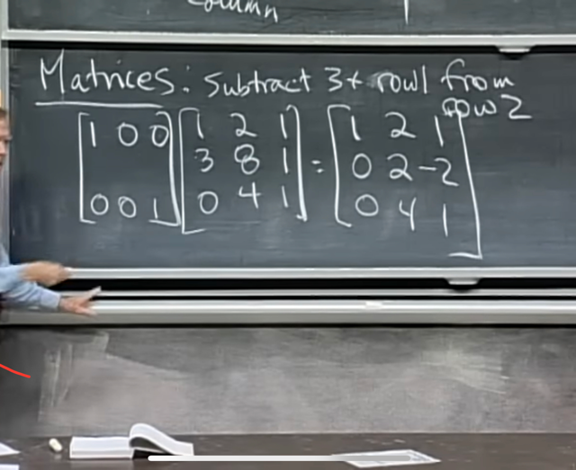</kbd>

> [!NOTE]
> Tương tự, hàng 3 của matrix cần tìm sẽ nhân A để vẫn
> ra kết qủa vẫn bằng hàng 3 của A nên **hàng 3 của matrix**
> cần tìm sẽ là **[0 0 1]**

 

<kbd>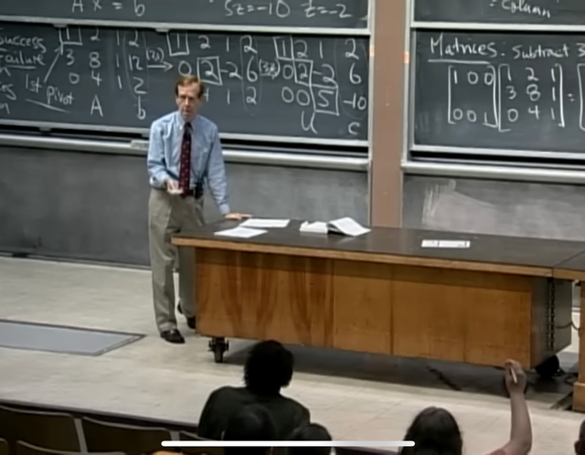</kbd>

> [!NOTE]
> Đến đây gs hỏi, **thế thì matrix gì sẽ ko thay đổi A**:
> dễ thấy nó sẽ là **Identity matrix**

 

<kbd>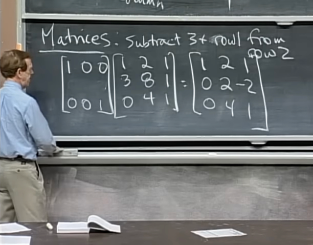</kbd>

> [!NOTE]
> Vậy **nhờ cách hiểu linear combination of A's row** nên ta
> dễ thấy ta cần **(-3)*row 1+ 1*row 2+ 0*row 3**. Nên **row thứ
> 2 của matrix cần tìm là [-3 1 0]**

 

<kbd>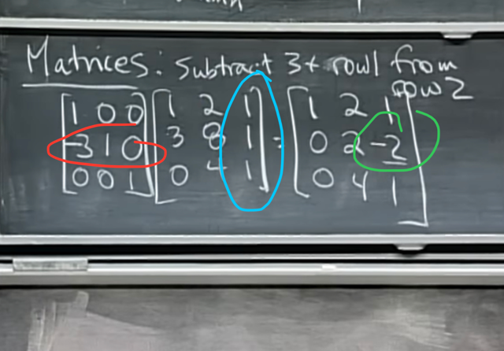</kbd>

> [!NOTE]
> Câu hỏi đặt ra là **làm sao để check một entry của matrix**
> **kết quả,** ví dụ **hàng 2, cột 3.**
>
> Là vầy: Hàng 2 của "matrix kết quả" sẽ đến từ**việc nhân
> hàng 2** của "matrix đầu" (ví dụ gọi là matrix M) cho matrix A.
> Tức **nó là linear combination của các row của matrix A**
> với coefficients là các component của hàng 2 của matrix M.
>
> Vậy vị trí đang nói chính là dot product của **hàng 2 matrix
> M** với **col 3 matrix A**

 

<kbd>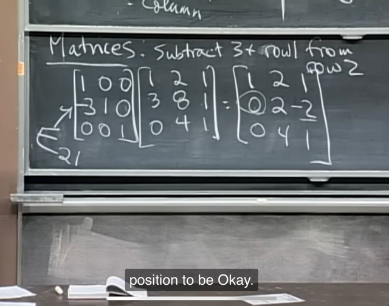</kbd>

> [!NOTE]
> Tạm gọi nó là matrix **E_21**, E là **eliminate,** 21 là
> vì nó giúp **eliminate vị trí hàng 2 cột 1 của matrix A**

 

<kbd>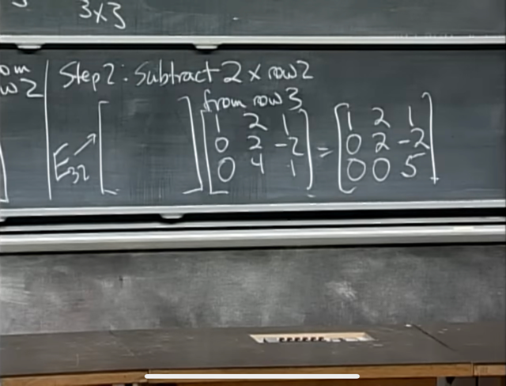</kbd>

> [!NOTE]
> Step 2, tương tự, ta sẽ **cần hàng 1 và 2 giữ nguyên** nên
> r**ow 1, 2 của E_32** sẽ là **[1 0 0], [0 1 0]**
>
> Còn **hàng 3 sẽ là [0 -2 1]**để nó "cộng hàng 3 của A với
> -2*hàng 1 của A" nhờ vậy sẽ khử đi A_32

 

<kbd>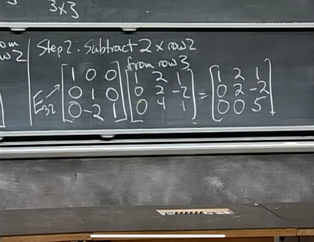</kbd>

 

<kbd>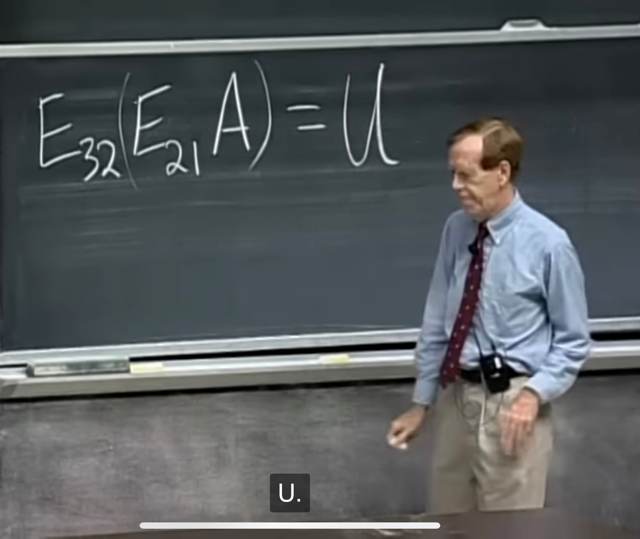</kbd>

> [!NOTE]
> Tóm gọn lại các **phép biến đổi** từ **A thành U
> nãy giờ chính là vầy**E21A để khử A21
>
> E32(E21A) để khử tiếp A32

 

<kbd>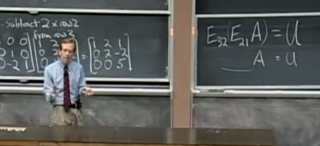</kbd>

> [!NOTE]
> Gs đặt câu hỏi là**matrix nào biến A
> thành U**

 

<kbd>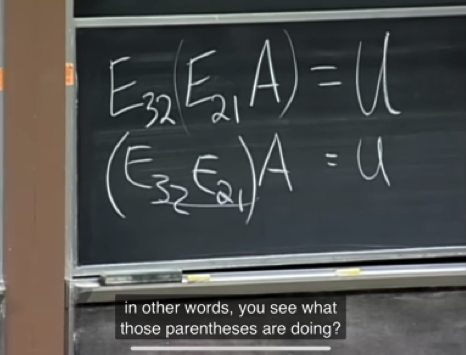</kbd>

> [!NOTE]
> Câu trả lời **đó là**: **ta có thể thay đổi vị trí dấu ngoặc**, tức là
> ta có thể t**ính E32*E21 trước**, rồi **nhân nó cho A**.
>
> Đây chính là **associated law (luật kết hợp)**

 

<kbd>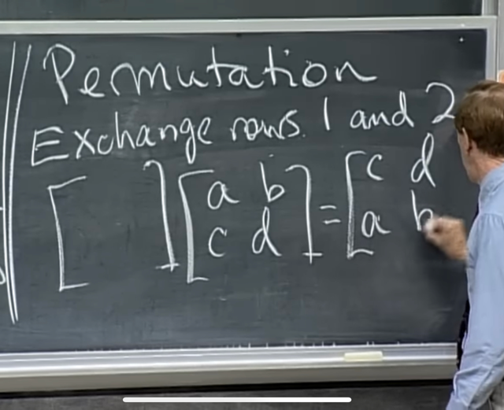</kbd>

> [!NOTE]
> Thử suy nghĩ **matrix nào sẽ giúp switch/exchange 2
> row của matrix thứ 2.**
>
> Để **dc hàng thứ 1** ra**[c d]**ta cần hàng thứ 1 của
> matrix abcd * 0 + hàng thứ 2 của abcd * 1 -> **row 1
> của matrix cần tìm là [0 1]**
>
> Tương tự, **dễ thấy row 2 của matrix cần tìm là [1 0]**

 

<kbd>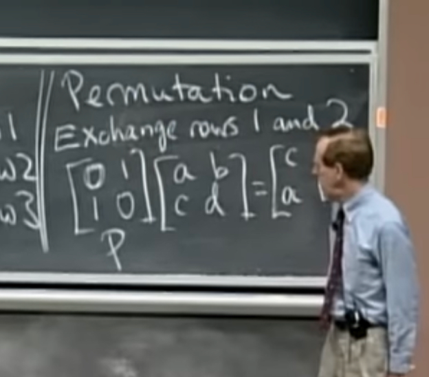</kbd>

> [!NOTE]
> Đó gọi là **permutations matrix**, **exchange các row của
> identity matrix** thì ta sẽ có **matrix giúp exchange row**

 

<kbd>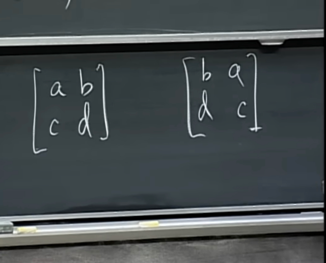</kbd>

> [!NOTE]
> Tiếp theo **matrix nào
> giúp switch column?**

 

<kbd>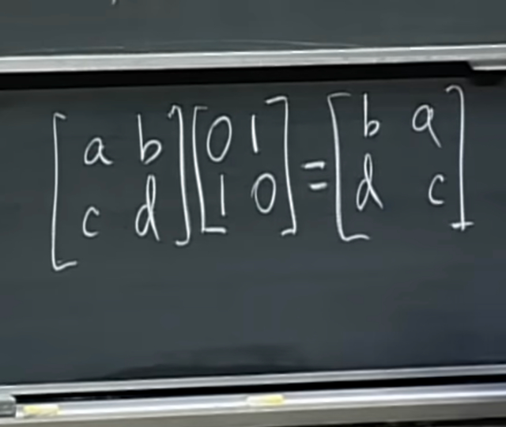</kbd>

> [!NOTE]
> Câu trả lời là **cũng P matrix nhưng để bên phải**Cụ thể: col 1 của AP sẽ là linear combination của A's columns
> với coefficients là col 1 của P. Nên để đổi chỗ hai columns của
> A thì col 1 của P sẽ là [0 1] và [1 0]

 

<kbd>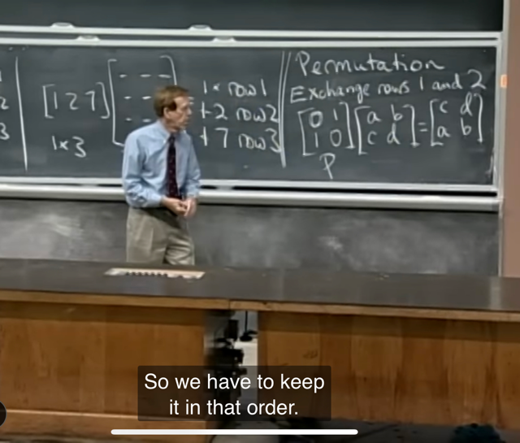</kbd>

> [!NOTE]
> Gs nhắc nhở rằng**nhân matrix phải theo thứ tự, A@B
> KHÔNG BẲNG B@A**
>
> hay **commutative law ko áp dụng**

 

<kbd></kbd>

> [!NOTE]
> Đoạn này gs muốn nói về **inverse**, và cho biết nãy
> giờ các matrix ví dụ đều là **invertible matrix**, b**ữa
> sau sẽ bàn đến failure case.**

 

<kbd>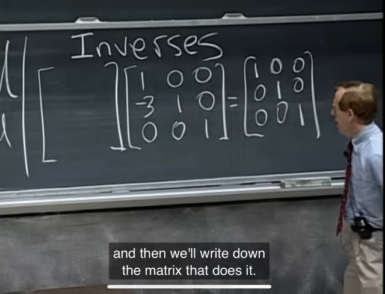</kbd>

> [!NOTE]
> Đại khái là, nếu **từ identity matrix**, ta **trừ hàng 2 cho 3 lần hàng 1**
> để được matrix mới (gọi là E đi) mà hàng 2 là [-3 1 0], hai hàng kia giữ
> nguyên [1 0 0] và [0 0 1].
>
> Thế thì, **matrix nào sẽ giúp đảo ngược quá trình đó**. Hay nói cách
> khác **matrix nào nhân A để cho ra lại I.**
>
> Thế thì đương nhiên quá trình đảo ngược sẽ là **cộng hàng 2 của A**
> **cho 3 lần hàng 1 của A**. Nên **hàng 2 của matrix cần tìm sẽ là [3 1
> 0]**.
>
> Còn hàng 1 và 3 của A và I như nhau nên hàng 1 và 3 của matrix cần
> tìm sẽ là [1 0 0] và [0 0 1]

 

<kbd>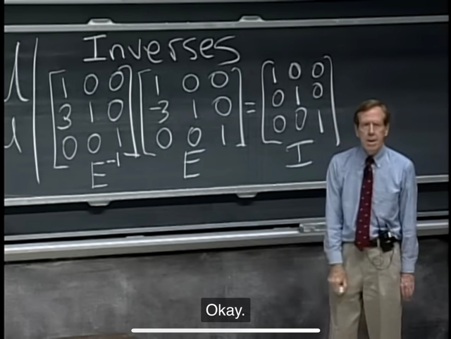</kbd>

> [!NOTE]
> Thế thì ta kí hiệu matrix này là là **E^-1**

 

