# Lecture 30: Linear Transformations And Their Matrices

📊 **Progress:** `52` Notes | `49` Screenshots

---
<a id="node-1077"></a>

<p align="center"><kbd>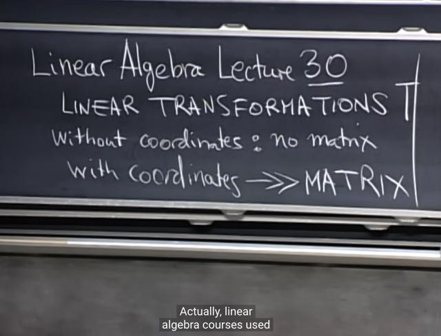</kbd></p>

> [!NOTE]
> đại khái mở đầu gs nói rằng mọi thứ ta học bữa giờ
> **đều liên quan đến LINEAR TRANSFORMATION**

<br>

<a id="node-1078"></a>

<p align="center"><kbd>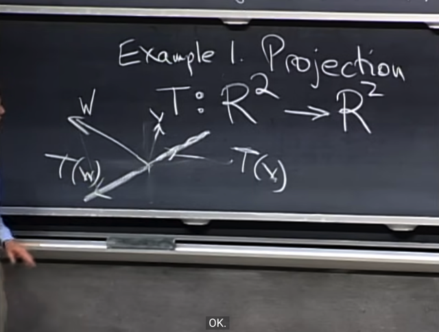</kbd></p>

> [!NOTE]
> Ví dụ như **PROJECTION** thực ra là một**LINEAR
> TRANSFORMATION**  hay ta hay dùng từ **mapping**
> (ánh xạ) chính là chỉ**một linear transformation giữa
> input và output.**
>
> Và **việc này không cần phải có matrix gì hết**

<br>

<a id="node-1079"></a>

<p align="center"><kbd>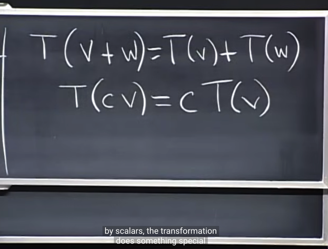</kbd></p>

> [!NOTE]
> Và gs cho rằng **có nhiều "loại" TRANSFORMATION**nhưng ta sẽ **chỉ quan tâm LINEAR TRANSFORMATION**,
> là cái thỏa hai tính chất sau: **CỘNG và NHÂN:
>
> Có thể viết gom lại thành `T(cv+dw)` `=` cT(v) `+` dT(w)**

<br>

<a id="node-1080"></a>

<p align="center"><kbd>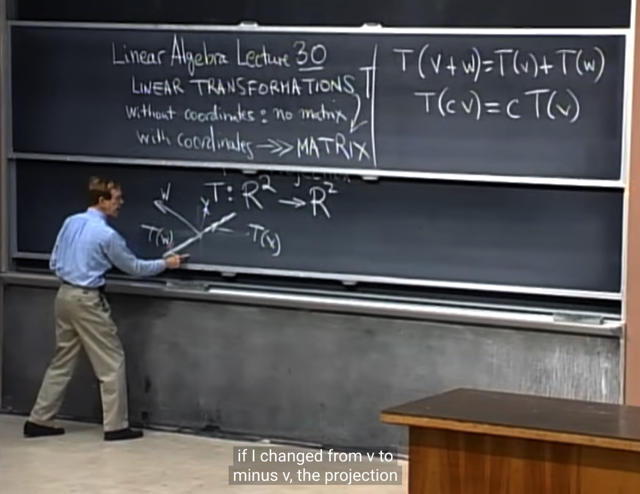</kbd></p>

> [!NOTE]
> Từ đó có thể **kiểm tra để thấy Projection thực chất là
> linear transformation** khi mỗi khi ta scale vector lên thì
> projection của nó cũng scale lên với cùng scalar.

<br>

<a id="node-1081"></a>

<p align="center"><kbd>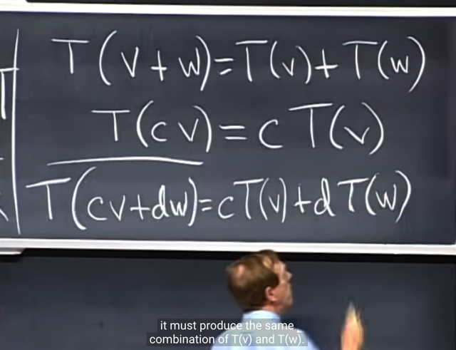</kbd></p>

> [!NOTE]
> Và ta có thể **combine hai cái lại để có điều kiện tổng
> quát của linear transformation
>
> `T(cv+dw)` `=` cT(v) `+` dT(w)**Ta nên hiểu sâu hơn ý nghĩa của nó chính là:
>
> Khi transform (một linear combination của v và w với bộ
> hệ số c, d)
>
> thì cũng y như
>
> linearly combine với cùng bộ hệ số (c, d) đó với các
> vector đã được transform
>
> Hay, n**ếu biết u là linear combination của v, w bởi coeffs
> c, d thì T(u) cũng chính là linear combination của T(v),
> T(w) với cùng coeffs c, d đó**

> [!NOTE]
> LINEAR TRANSFORMATION:
>
> `T(cv+dw)` `=` cT(v) `+` dT(w)

<br>

<a id="node-1082"></a>

<p align="center"><kbd>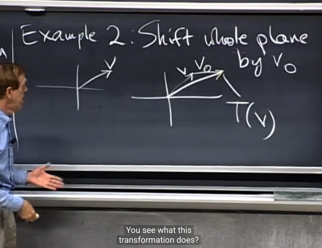</kbd></p>

> [!NOTE]
> Lấy ví dụ của transformation này:**shift toàn bộ space** bởi
> **v_0**, câu hỏi là đây **có phải là linear transformation**
> không?
>
> Me: thử lập luận như sau: `(u+v)+v0` không bằng `(u+v0)`
> ```text
> + (v+v0) thành ra ko thỏa yêu cầu T(cu+dv) = cT(u) +
> ```
> dT(v) ->**Không** phải linear transformation

<br>

<a id="node-1083"></a>

<p align="center"><kbd>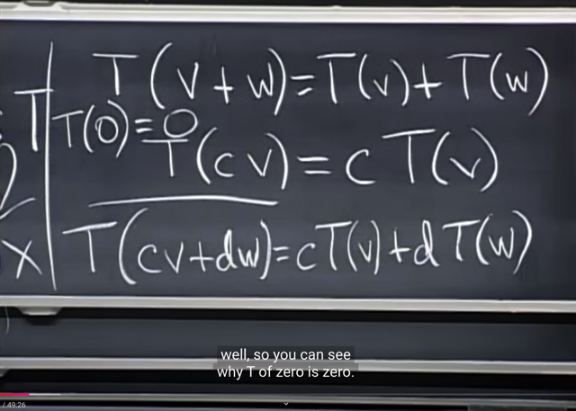</kbd></p>

> [!NOTE]
> Và gs **bổ sung T(0) phải bằng 0**. Vì sao?
>
> Vì **khi đó mới thỏa T(c*v) `=` cT(c)** VỚI MỌI c. Bởi vì khi v
> `=` 0, vế trái là T(c*0) `=` T(0), vế phải `=` c*T(0).
>
> Để **T(0) `=` c*T(0) với mọi c thì bắt buộc T(0) `=` 0**.
>
> ```text
> Hoặc xét điều kiện T(v+w) = T(v) + T(w) thì khi v = 0  thì
> ```
> ```text
> T(v+w) = T(0+w) = T(w), vế phải bằng T(0) + T(w) Để T(w) =
> ```
> T(0) `+` T(w) thì T(0) phải bằng 0

> [!NOTE]
> MỘT ĐIỀU KIỆN CHO LINEAR TRANSFORMATION
> THÌ ÍT NHẤT T(0) PHẢI BẰNG 0

<br>

<a id="node-1084"></a>

<p align="center"><kbd>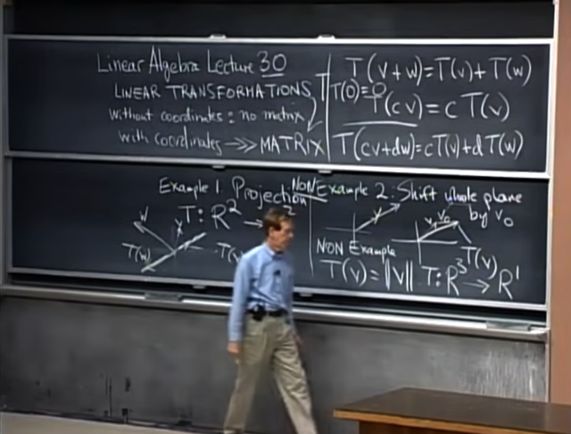</kbd></p>

> [!NOTE]
> Một (non) example nữa là một transformation map **R^3
> với R^1:
>
> T(v) `=` length of v**.
>
> Dễ thấy transformation này **thỏa T(0) `=` 0** vì length của
> zero vector `=` 0.
>
> Nhưng **không thỏa T(c*u) `=` c*T(u)**. Vì giả sử **nhân
> vector u cho -2** thì length của nó sẽ là 2*length u
> (tức là 2*T(u)) chứ **không phải là -2*T(u).**
>
> Hoạc `T(u+v)` không chắc là bằng T(u) `+` T(v) (length của
> `u+v` đâu phải lúc nào cũng bằng length u `+` length v đâu.
>
> Nên đây **không phải là linear transformation**

<br>

<a id="node-1085"></a>

<p align="center"><kbd>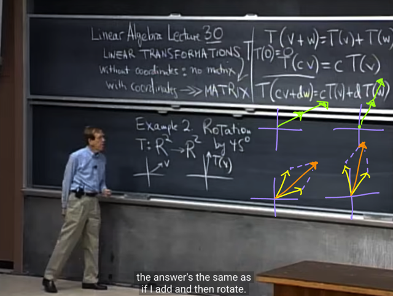</kbd></p>

> [!NOTE]
> một ví dụ của Linear Transformation là **ROTATION**.
>
> T(cv) `=` cT(v): nói bằng lời là: scale vector rồi xoay  thì
> cũng là xoay vector rồi scale.
>
> `T(v+w)` `=` T(v) `+` T(w): cộng hai vector rồi xoay vector kết
> quả thì cũng y như xoay hai vector rồi cộng chúng lại

> [!NOTE]
> ROTATION LÀ MỘT LINEAR
> TRANSFORMATION

<br>

<a id="node-1086"></a>

<p align="center"><kbd>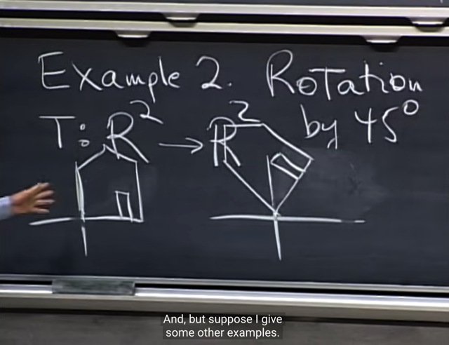</kbd></p>

> [!NOTE]
> ví dụ làm bìa cho version cũ của cuốn sách của gs chính
> là phép linear transformation (rotation) trong đó **mọi
> điểm của cái nhà đều được transform**

<br>

<a id="node-1087"></a>

<p align="center"><kbd>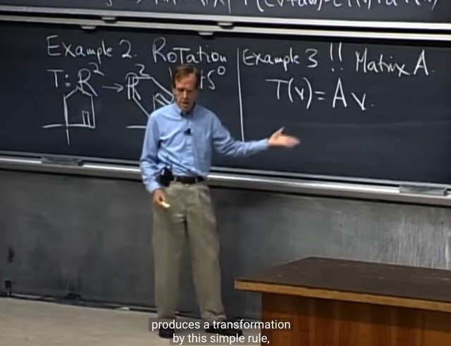</kbd></p>

> [!NOTE]
> Và một ví dụ thứ 3 của **linear transformation** mà ta gặp
> hòai từ đầu đến giờ chính là**phép nhân với matrix A.**Hay:**T(v) `=` Av là một linear transformation**

> [!NOTE]
> T(v) `=` Av LÀ MỘT LINEAR
> TRANSFORMATION

<br>

<a id="node-1088"></a>

<p align="center"><kbd>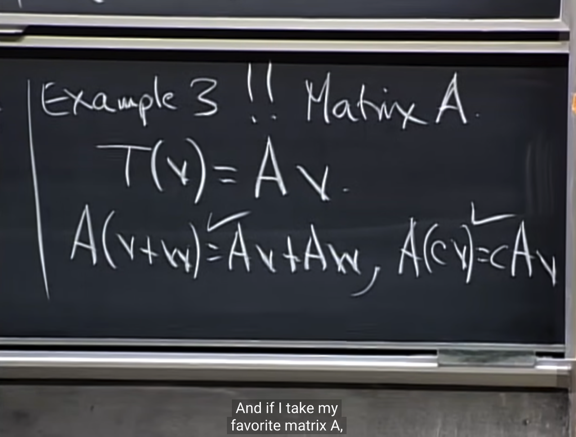</kbd></p>

> [!NOTE]
> Và **check hai điều kiện** T(c*u) `=` cT(u), và T(c*u
> `+` d*v) `=` c*T(u) `+` d*T(v) thì thấy nó thỏa:
>
> ```text
> T(cv+du) = A(c*v+d*u) = A*c*v + A*d*u = c*Av + d*Au
> ```
> và cái này chính là c*T(v) `+` d*T(u)
>
> Do đó, nhất định **T(v) `=` Av là một Linear
> transformation**
>
> để rồi đến bài này ta hiểu được**tại sao trong deep
> learning** **Wx là linear transformation.**
>
> Nhưng bài này cũng giúp mình hiểu rằng **T(v) `=` Av
> `+` b** **KHÔNG PHẢI LÀ LINEAR TRANSFORMATION**.
>
> Vì:
>
> `T(u+v)` `=` `A(u+v)` `+` b `=` Au `+` Av `+` **b 
>
> KHÁC VỚI** 
>
> T(u) `+` T(v) `=` (Au `+` b) `+` (Av `+` b) `=` Au `+` Av `+` **2b**
>
> Và ta biết nó có tên là **AFFINE transformation.**

> [!NOTE]
> Av `+` b KHÔNG PHẢI LÀ
> LINEAR TRANSFORMATION

<br>

<a id="node-1089"></a>

<p align="center"><kbd>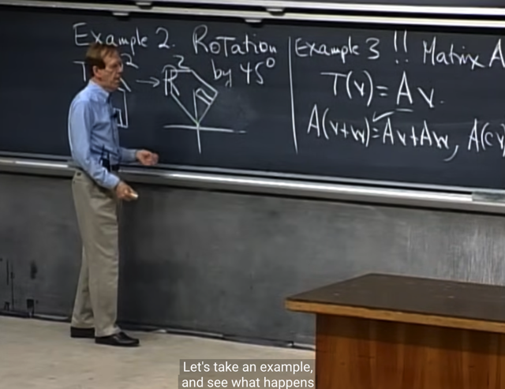</kbd></p>

> [!NOTE]
> Và ta sẽ xem xét việc **TRANSFORM
> TOÀN BỘ SPACE bởi matrix A**

<br>

<a id="node-1090"></a>

<p align="center"><kbd>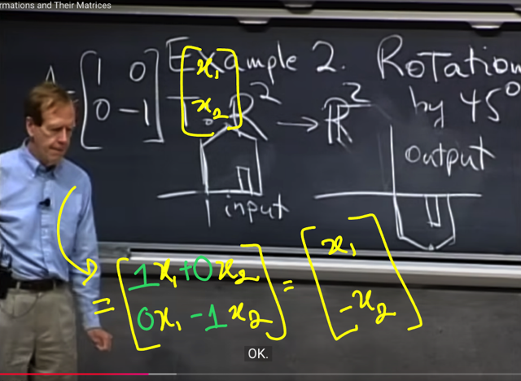</kbd></p>

<p align="center"><kbd></kbd></p>

<p align="center"><kbd>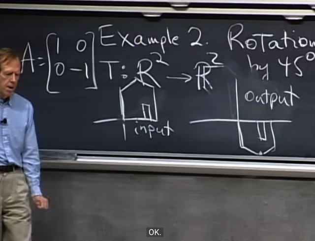</kbd></p>

> [!NOTE]
> gs cho matrix này, là**diagonal matrix**: [1 0; 0 `-1]`
>
> hàng 1 =**[1 0]** giúp **giữ nguyên component 1 của x:**
> Hãy**** nhìn phép nhân Ax theo row viewpoint, row 1 của A
> khi nhân với x, coi như là một row vector nhân một matrix x
> (có  một cột), thì sẽ là linear combination của các row của x
> với coefficients là các component của row 1 của A. Vậy, vì
> row 1 của A là [1 0], nên về cơ bản, nó chỉ lấy hàng 1 của x
> (tức là component 1 của x), đương nhiên kết quả này sẽ là
> component 1 của vector kết quả Ax. Do đó mới nói khi A
> nhân x, nó giữ nguyên component 1 của x.
>
> Và**hàng 2 `=` [0 -1]** giúp **đổi dấu component 2 của x**.
> Lập  luận tương tự, dễ thấy row 2 chỉ lấy hàng 2 của x,
> nhưng đổi dấu lại
>
> Vậy Ax làm cái việc: x1 thì giữ nguyên, x2 thì đổi dấu nên
> từ đó khi **linear transform** các điểm của ngôi nhà kết
> quả **là phép đối xứng qua trục x1**

<br>

<a id="node-1091"></a>

<p align="center"><kbd>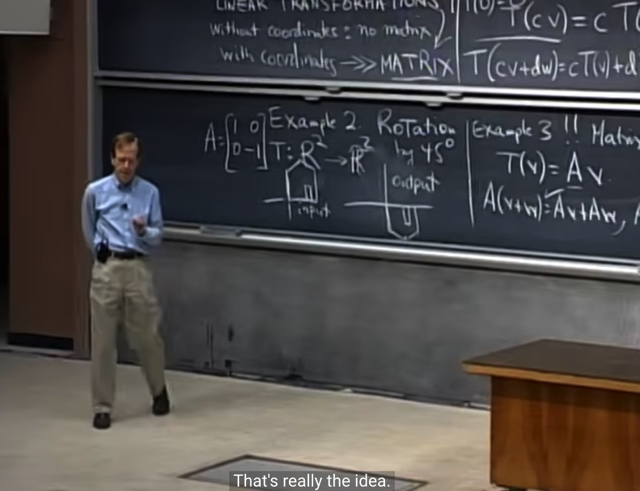</kbd></p>

> [!NOTE]
> Và mục tiêu ở đây là **HIỂU VỀ LINEAR
> TRANSFORMATION** và cụ thể là **TÌM MATRIX A
> ĐỨNG ĐẰNG SAU NÓ**

<br>

<a id="node-1092"></a>

<p align="center"><kbd>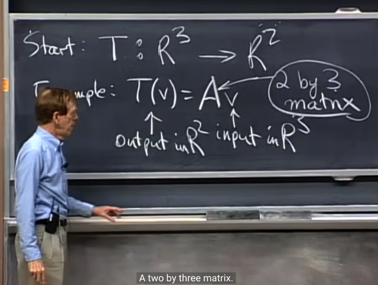</kbd></p>

> [!NOTE]
> Gs lấy ví dụ một linear transformation map **R^3
> input thành R^2** **output**. Thì **mọi matrix A có shape
> 2x3 đều làm được điều này.**Nói thêm vì việc biến R^3 vector thành R^2 vector: Sẽ dễ
> hình dung nếu ta nhìn theo `column-viewpoint` khi nhân A
> cho x để có Ax. 
>
> Khi đó, Ax là LINEAR COMBINATION của các A's columns
> với coefficients là components của x. Vậy, kết quả đương
> nhiên là vector trong column space của A. 
>
> Điều này cũng thể hiện bởi quan hệ giữa các fundamental
> subspace: A sẽ map một vector trong rowspace với một
> vector trong column space. 
>
> Vậy, để output là R^2 vector dĩ nhiên cột của A phải là
> R^2 vector, hay, A phải có 2 hàng. 
>
> Tiếp tục, vì Ax là linear combination của các columns của A
> với hệ số là các components của x, mà x có 3 components
> vậy A cần có 3 columns thì mới khớp được.
>
> Vậy A là matrix 2x3: Cách hiểu này giúp nhìn sâu vào bản
> chất phép nhân Ax, hơn là chỉ dựa trên việc tương thích
> kích thước [2x3][3x1] `=` [2x1]

<br>

<a id="node-1093"></a>

<p align="center"><kbd></kbd></p>

> [!NOTE]
> Gs đặt vấn đề đại khái là, **giả sử ta KHÔNG BIẾT T là
> gì**, (có nghĩa là **KHÔNG BIẾT MATRIX A đứng đằng
> sau T(v) `=` Av là gì**) thì
>
> **TA CẦN BAO NHIÊU THÔNG TIN ĐỂ CÓ THỂ TÍNH
> T(v) VỚI MỌI v?**

<br>

<a id="node-1094"></a>

<p align="center"><kbd>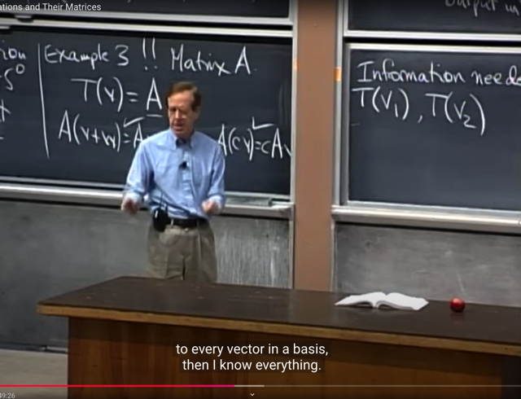</kbd></p>

> [!NOTE]
> Đại khái lập luận thế này, giả sử ta có **2 INDEPENDENT**
> **VECTOR v1, v2 span toàn bộ một plane R^2**.
>
> Thì **nếu như biết kết quả của phép linear transformation**
> trên **v1, v2** tức là **biết T(v1) và T(v2)** thì gs cho rằng ta
> **ĐÃ ĐỦ ĐỂ CÓ THỂ TÍNH T(v) VỚI MỌI v** trong plane đó.
>
> Bởi vì **v1, v2 là một basis** nên có thể express v bất kì dưới
> dạng linear combination của v1, v2: **v `=` c*v1 `+` d*v2**
>
> Và từ đó dựa theo tính chất của Linear Transformation ta sẽ
> có **T(v) `=` `T(c*v1+d*v2)` `=` c*T(v1) `+` d*T(v2) `=>` chỉ cần biết
> T(v1) và T(v2) là có thể biết T(v) với v bất kì**

> [!NOTE]
> NẾU BIẾT LINEAR TRANSFORMATION CỦA BASIS
> v1, v2: T(v1), T(v2)
>
> THÌ CÓ THỂ CÓ T(v) với v `=` cv1 `+` dv2 BẤT KÌ: T(v) `=`
> `T(cv1+dv2)` `=` cT(v1) `+` dT(v2)

<br>

<a id="node-1095"></a>

<p align="center"><kbd>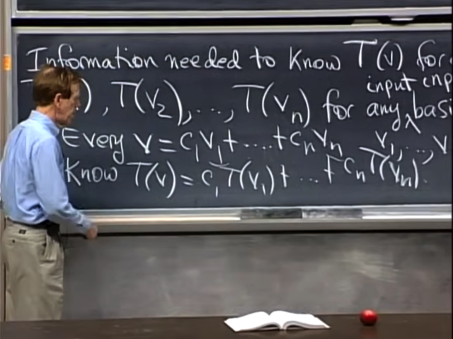</kbd></p>

> [!NOTE]
> Và khái quát lên input ở trong Rn thì **ta cần biết `T(v_i)` của
> MỌI BASIS VECTOR `v_i` CỦA Rn**. Khi đó **có thể tính T(v)
> cho v bất kì**Vì lập luận tương tự: Vì mọi Rn vector v đều có thể express
> bởi linear combination của các vector trong basis {v1,v2...vn}
>
> v `=` c1v1 `+` c2v2 `+` ...cnvn
>
> Theo tính chất của linear transformation thì:
>
> ```text
> T(v) = T(c1v1 + c2v2 + ...cnvn) = c1*T(v1) + c2*T(v2) + ...
> ```
> cn*T(vn)
>
> Nên c**hỉ cần biết T(v1), T(v2), ...T(vn) là có thể biết T(v)**

<br>

<a id="node-1096"></a>

<p align="center"><kbd>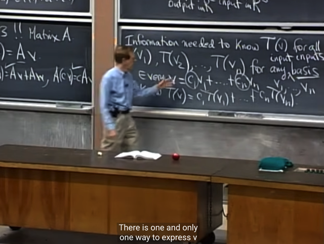</kbd></p>

> [!NOTE]
> Tiếp theo, đại khái là gs nói về **COORDINATES**,
>
> Và ông cho biết coordinates (của một vector, hay một điểm)
> **thực ra chính là các COEFFICIENTS trong LINEAR
> COMBINATION**CỦA CÁC BASIS VECTORS để tạo ra
> vector đó
>
> Ví dụ ta có một basis của R2: v1, v2 và một vector v `=`
> `cv1+dv2,` thì (c,d) là coordinates của v với basis v1, v2
>
> Hay nói cách khác, **KHI TA XÁC ĐỊNH MỘT BASIS**, thì
> **CÁC COFFICIENTS CỦA CÁC BASIS TẠO RA V CHÍNH
> LÀ COORDINATES CỦA V**

> [!NOTE]
> **COORDINATES** (của một vector, hay một điểm) thực ra
> chính là các **COEFFICIENTS** trong **LINEAR** **COMBINATION** 
> CỦA CÁC **BASIS VECTORS** để tạo ra vector đó

<br>

<a id="node-1097"></a>

<p align="center"><kbd>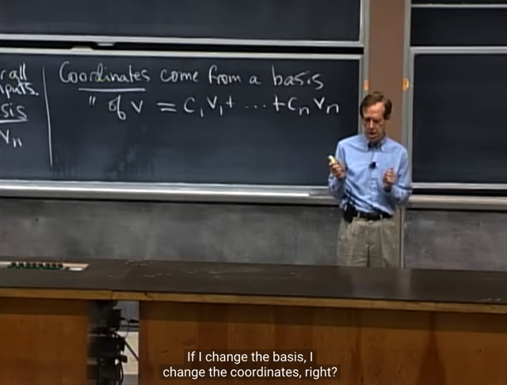</kbd></p>

> [!NOTE]
> Coordinate cho ta biết **ĐÓNG GÓP CỦA CÁC BASIS
> VECTOR** tạo nên **v**. Và khi ta **THAY ĐỔI BASIS, TA
> THAY ĐỔI COORDINATE**

<br>

<a id="node-1098"></a>

<p align="center"><kbd>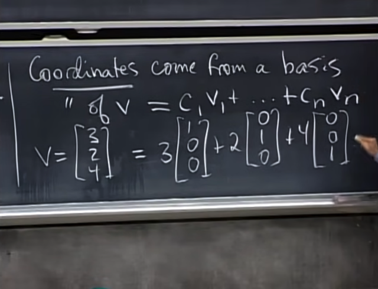</kbd></p>

> [!NOTE]
> Và đại khái là ta **thật ra đã luôn** **đang dùng**
> **STANDARD BASIS**.
>
> Ví dụ như vector v `=` (3 2 4) như vầy thì dễ thấy ta THẬT RA
> ĐANG THỂ HIỆN NÓ VỚI BỘ **STANDARD BASIS**:
>
> v `=` **3***(1 0 0) `+` **2***(0 1 0) `+` **4***(0 0 1) `=>` (**3, 2, 4**) là
> các **COEFFICIENTS**
>
> Nên: **NÓI COORDINATE CỦA V LÀ (3, 2, 4) THÌ NGẦM
> HIỂU ĐANG  DÙNG STANDARD BASIS.**

> [!NOTE]
> thật ra đã luôn đang dùng **STANDARD BASIS.**
>
> VÍ DỤ NÓI COORDINATE CỦA V LÀ (3, 2, 4) THÌ
> NGẦM HIỂU ĐANG  DÙNG STANDARD BASIS:
>
> V `=` 3*i^ `+` 2*j^ `+` 4*u^

<br>

<a id="node-1099"></a>

<p align="center"><kbd>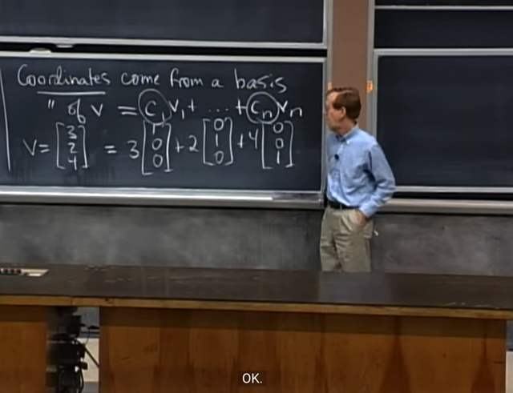</kbd></p>

> [!NOTE]
> hoặc là **ta có thể CHỌN MỘT BASIS KHÁC,** VÍ DỤ NHƯ
> DÙNG **EIGENVECTORS**chẳng hạn, khi đó **COEFFICIENTS
> KHÁC SẼ TẠO NÊN COORDINATE KHÁC**

> [!NOTE]
> **CHỌN MỘT BASIS** KHÁC, VÍ DỤ NHƯ DÙNG
> EIGENVECTORS chẳng hạn, khi đó **COEFFICIENTS**
> **KHÁC SẼ TẠO NÊN COORDINATE KHÁC**

<br>

<a id="node-1100"></a>

<p align="center"><kbd>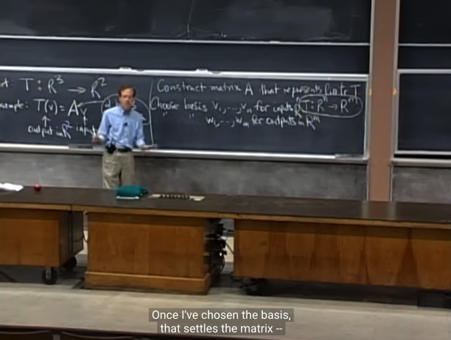</kbd></p>

> [!NOTE]
> Vậy thì **bài toán đặt ra** là: **XÂY DỰNG MỘT MATRIX A**
> ĐẠI DIỆN CHO MỘT **LINEAR TRASFORMATION** T(v):
> R^n `->` R^m
>
> Thì ta sẽ **cần:
>
> 1) CHỌN MỘT BASIS v1, v2....vn** **CHO** **INPUT** in R^n
> và**CHỌN MỘT  BASIS w1, w2...wm CHO OUTPUT** in
> R^m
>
> **2)** CHUẨN BỊ PHÉP **LINEAR TRANSFORMATION** CHO
> CÁC**INPUT BASIS VECTOR ĐÓ T(v1), T(v2)**...
>
> 3) **BIỂU DIỄN** **KẾT QUẢ T(v1), T(v2) THEO CÁC BASIS
> CỦA OUTPUT SPACE w1, w2... này**

<br>

<a id="node-1101"></a>

<p align="center"><kbd>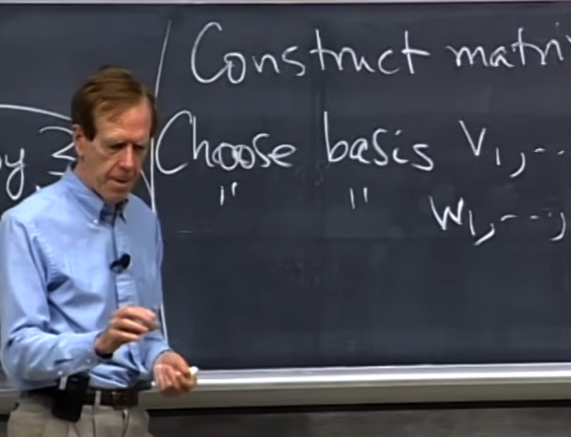</kbd></p>

<br>

<a id="node-1102"></a>

<p align="center"><kbd>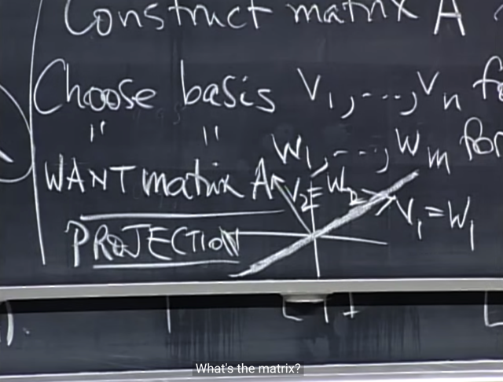</kbd></p>

> [!NOTE]
> Ví dụ bài toán projection này: **Project lên một line trong
> R2** này
>
> Đầu tiên gs **chọn basis vector của input và output đều
> là** là hai vector v 1,v2 này:
>
> **MỘT CÁI THEO LINE (v1)**,
>
> **MỘT CÁI VUÔNG GÓC VỚI LINE (v2)**.
>
> Câu hỏi là **matrix A là gì?**

<br>

<a id="node-1103"></a>

<p align="center"><kbd>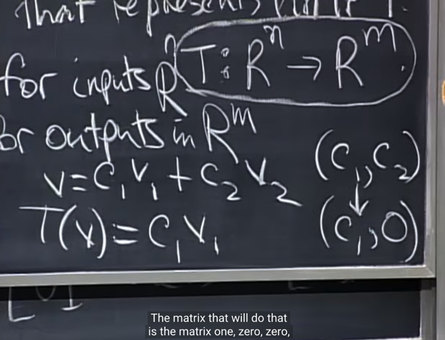</kbd></p>

> [!NOTE]
> Ta sẽ**làm theo mô tả** bằng lời ở trên:****Đầu tiên **thể hiện vector input v dưới basis của input
> (v1, v2)**, để ta có các **coefficients là (c1, c2).** Chính
> là **coordinate**.
>
> v `=` c1v1 `+` c2v2, thì coordinate của v là **(c1, c2)**
>
> Bây giờ, gs hỏi rằng **nếu project c1v1 lên line này** thì
> ta có gì? `->` vẫn là **c1v1**, vì **v1 đã nằm trong line như
> đã nói**
>
> Còn **c2v2? `->` sẽ trở thành 0, vì v2 vuông góc với line**
>
> Từ nhận định đó **T(v) `=` c1v1.**Thể hiện nó (tức T(v) `/`
> `=c1v1)` bằng linear combination của output basis (cũng
> đang dùng v1,v2), ta sẽ có:
>
> T(v) `=` c1v1 `=` **c1***v1 `+` **0***v2
>
> Như vậy, coordinate của T(v) là (c1, 0)
>
> Coordinates từ **(c1, c2) trở thành (c1, 0)**Vậy thì ta sẽ **tìm A sao cho: 
>
> A(c1v1) `=` c1v1 và A(c2v2) `=` 0**hay**A*[c1 c2]T `=` [c1 0]T
>
> Suy nghĩ: việc A(c1v1) `=` c1v1 gợi dấu hiệu cho thấy v1
> chính là eigenvector của matrix A cần xây dựng, và eigen
> value tương ứng dễ thấy là 1.
>
> Và tương tự A(c2v2) `=` 0 gợi ý v2 chính là vector trong
> nullspace của A, cũng là eigenvector ứng với eigenvalue
> `=` 0**

<br>

<a id="node-1104"></a>

<p align="center"><kbd>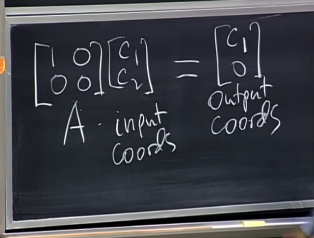</kbd></p>

🔗 **Related:** [LECTURE 30: LINEAR TRANSFORMATIONS AND THEIR MATRICES](untitled.md#node-1113)

> [!NOTE]
> Vậy thì dễ thấy**matrix A giúp biến (c1, c2) thành (c1, 0)
> là matrix này, lát nữa ta sẽ HỌC cách xây dựng matrix A 
>
> Nhận xét nó là diagonal matrix**

<br>

<a id="node-1105"></a>

<p align="center"><kbd>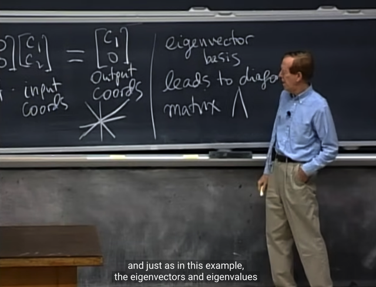</kbd></p>

🔗 **Related:** [LECTURE 31: CHANGE OF BASIS; IMAGE COMPRESSION](untitled.md#node-1155)

> [!NOTE]
> Và gs cho biết rằng trong ví dụ này **vì ta đã chọn basis là
> hai vector này**, một cái trên đường thẳng cần project
> xuống, một cái trên đường vuông góc với nó.
>
> Thì **KHI CHỌN HAI BASIS VECTOR NÀY KHIẾN CHO
> MATRIX A CẦN XÂY DỰNG SẼ CÓ EIGENVECTOR LÀ 2
> BASIS VECTORS NÀY**Hay nói cách khác ta đã **CHỌN BASIS SAO CHO
> MATRIX A CÓ MỘT EIGENVECTOR TRÙNG VỚI LINE**
> **(basis thứ 1)**, ỨNG VỚI **EIGENVALUE BẰNG 1.**Cho nên Av1 `=` 1*v1
>
> Và **EIGENVECTOR THỨ HAI VUÔNG GÓC VỚI LINE**
> (basis thứ 2) với **VỚI EIGENVALUE** **là 0**.
>
> Nên Av2 `=` 0*v2****Để rồi:
>
> **T(c1v1) `=` A(c1v1)** `=` c1Av1 `=` **c1*1*v1 `=` c1v1**
>
> và
>
> **T(c2v2) `=` A(c2v2)** `=` c2Av2 `=` **c2*0*v2** `=` **0** ****Và đây là good basis, vì **giúp cho matrix A cần xây
> dựng có dạng**là một **DIAGONAL matrix** với**eigenvalue
> nằm trên diagonal.**Và diagonal matrix với các eigenvalue
> nằm trên đường chéo chính là matrix Λ****Và như đã nói, vì ta đã xây dựng A giúp transform hai
> basis vector v1, v2 nên ta có thể transform mọi vector v
> bất kì, hay nói cách khác, ta có thể **yên tâm dùng A để
> project mọi điểm bất kì lên line vì A đã project đúng hai
> basis vector rồi.**

> [!NOTE]
> Và gs cho biết rằng trong ví dụ này **vì ta đã chọn basis là
> hai vector này**, một cái trên đường thẳng cần project
> xuống, một cái trên đường vuông góc với nó.
>
> Thì **KHI CHỌN HAI BASIS VECTOR NÀY KHIẾN CHO
> MATRIX A CẦN XÂY DỰNG SẼ CÓ EIGENVECTOR LÀ 2
> BASIS VECTORS NÀY**Hay nói cách khác ta đã **CHỌN BASIS SAO CHO
> MATRIX A CÓ MỘT EIGENVECTOR TRÙNG VỚI LINE**
> **(basis thứ 1)**, ỨNG VỚI **EIGENVALUE BẰNG 1.**Cho nên Av1 `=` 1*v1
>
> Và **EIGENVECTOR THỨ HAI VUÔNG GÓC VỚI LINE**
> (basis thứ 2) với **VỚI EIGENVALUE** **là 0**.
>
> Nên Av2 `=` 0*v2****Để rồi:
>
> **T(c1v1) `=` A(c1v1)** `=` c1Av1 `=` **c1*1*v1 `=` c1v1**
>
> và
>
> **T(c2v2) `=` A(c2v2)** `=` c2Av2 `=` **c2*0*v2** `=` **0** ****Và đây là good basis, vì **giúp cho matrix A cần xây
> dựng có dạng**là một **DIAGONAL matrix** với**eigenvalue
> nằm trên diagonal.**Và diagonal matrix với các eigenvalue
> nằm trên đường chéo chính là matrix Λ****Và như đã nói, vì ta đã xây dựng A giúp transform hai
> basis vector v1, v2 nên ta có thể transform mọi vector v
> bất kì, hay nói cách khác, ta có thể **yên tâm dùng A để
> project mọi điểm bất kì lên line vì A đã project đúng hai
> basis vector rồi.**

<br>

<a id="node-1106"></a>

<p align="center"><kbd>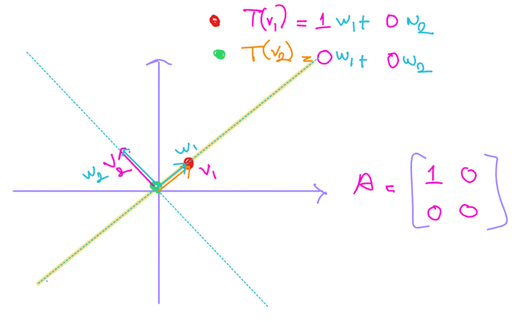</kbd></p>

> [!NOTE]
> Thế thì ta có thể**thử làm với projection** vừa rồi:
>
> Chọn v1, v2 là **eigenvectors**
>
> Và w1, w2 là **eigenvectors**
>
> Thì A là matrix này

<br>

<a id="node-1107"></a>

<p align="center"><kbd>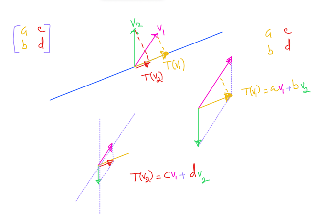</kbd></p>

> [!NOTE]
> Thử suy nghĩ tại sao muốn A có dạng diagonal thì v1 phải
> trên line, và v2 phải vuông góc line để thấy rằng chỉ có
> cách đó A mới DIAGONAL:
>
> Theo quy trình xây dựng A mà gs mô tả, cột 1 của A sẽ là
> hệ số trong linear combination thể hiện T(v1) bởi v1, và v2
> (tức là output basis nhưng ta đang chọn w1,w2 the same
> với v1, v2), gọi nó là a, b: T(v1) `=` av1 `+` bv2
>
> Theo đó dễ thấy muốn A diagonal thì b phải bằng 0, tức
> T(v1) `=` av1. Như vậy v1 phải chọn làm sao mà khi project
> nó lên line, tức T(v1) thì nó vẫn phải trùng hướng với v1.
> Thế thì dễ hiểu, chỉ có 2 khả năng khiến việc này khả thi:
>
> 1) v1 nằm sẵn trên line. Khi đó T(v1) là chính nó, T(v1) `=` v1
>
> 2) v1 vuông góc với line. Khi đó T(v1) `=` 0 thì 0 cũng vẫn
> nằm trên line đi qua v1.
>
> Và tình huống tương tự cho cột 2 của A, tức là T(v2) `=`
> `cv1+dv2` thì ta muốn c `=` 0 thì chỉ có thể T(v2) `=` v2.
>
> Vậy một cái phải nằm trên line, một cái phải vuông góc với
> line (không thể cùng nằm trên line, vì v1, v2 là basis, nên
> phải độc lập nhau)

<br>

<a id="node-1108"></a>

<p align="center"><kbd>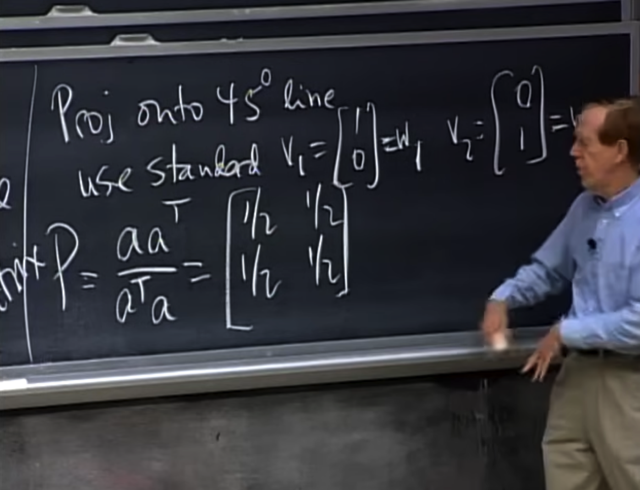</kbd></p>

> [!NOTE]
> Thế thì, gs cho rằng**nếu tôi không chọn good basis** là hai
> eigenvector nữa mà dùng**standard basis v1 `=` [1 0]** `=` w1
> (cũng chọn basis của output) và **v2 `=` [0 1] `=` w2**
>
> ```text
> Khi đó T(v1) = (1/2)v1 + (1/2)v2
> ```
>
> Thì ta sẽ có matrix chính là Projection matrix P mà ta tìm ra
> theo bài toán Projection bữa trước:**[0.5 0.5; 0.5 0.5]** (gs đang 
> giả sử cụ thể line là 45 độ, tức vector a `=` (1,1) 
>
> Kiểm tra ta có thể thấy đúng là nếu chọn basis là standard
> basis thì quả thật matrix A lúc này chính là P.
>
> ```text
> Ví dụ T(v1) = Pv1 = (0.5 0.5) và T(v2) = Pv2 = (0.5 0.5) là
> ```
> đúng
>
> Có điều **P không còn là diagonal matrix giống như khi ta 
> chọn basis là hai eigenvectors.**

<br>

<a id="node-1109"></a>

<p align="center"><kbd>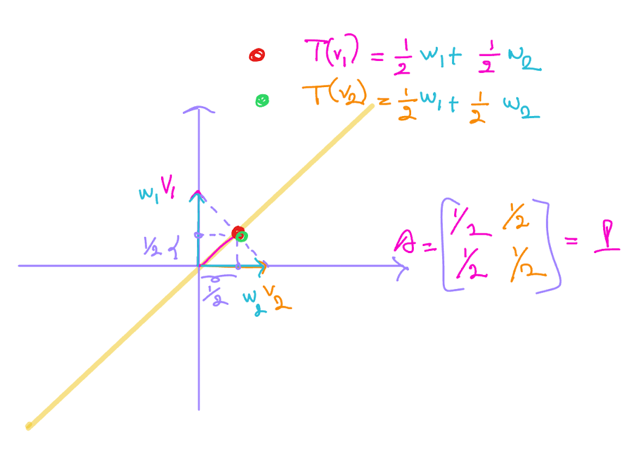</kbd></p>

> [!NOTE]
> Chọn v1, v2 là **standard basis**
>
> Và w1, w2 là **standard basis**
>
> Thì A là matrix này, chính là matrix P tính theo
> cách `aaT/aTa` (a `=` (1,1))

<br>

<a id="node-1110"></a>

<p align="center"><kbd>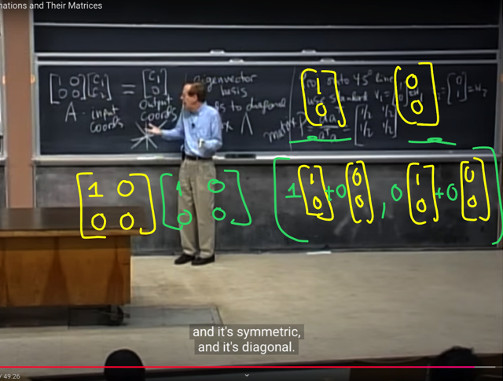</kbd></p>

<p align="center"><kbd></kbd></p>

<p align="center"><kbd>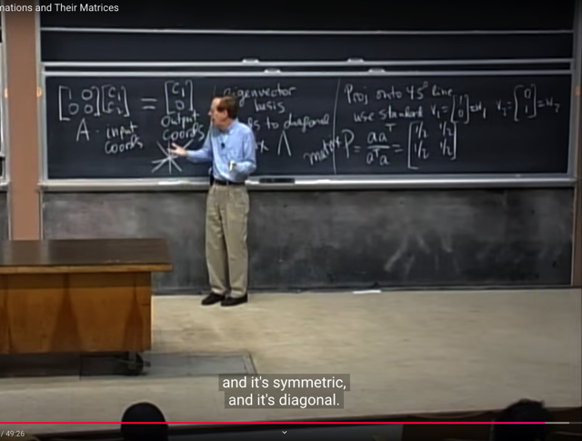</kbd></p>

> [!NOTE]
> vậy thì đại khái là gs nói **bữa giờ** **thực ra là ta đã đang
> luôn chọn một basis tiện nhất**, hay,**có sẵn** (handiest
> basis) và k**ết quả cho ra** matrix P **cũng không tệ**khi
> nó là **symmetric matrix**, c**ũng thỏa các tính chất như
> P^2 `=` P**
>
> **Nhưng với good basis** là hai vector trên line và vuông
> góc với line, **ta được (projection) matrix CŨNG
> SYMMETRIC, NHƯNG CÒN DIAGONAL**. Ngoài ra thì
> việc A^2 `=` A rất dễ thấy

<br>

<a id="node-1111"></a>

<p align="center"><kbd>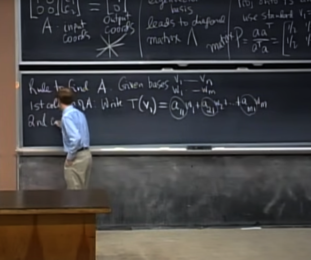</kbd></p>

🔗 **Related:** [LECTURE 31: CHANGE OF BASIS; IMAGE COMPRESSION](untitled.md#node-1153)

> [!NOTE]
> Từ đó ta sẽ có **rule** **để tìm A** một cách chính thức
> như sau: (Đương nhiên **đã có `/` chọn hai bộ basi**s của
> input và output)
>
> Thế thì diễn đạt bằng lời đó là:
>
> **Lấy basis vector thứ nhất** của input : **v1**.
>
> **Apply linear transformation lên nó T(v1)**.
>
> **Diễn đạt nó** dưới dạng **linear combination các basis
> của output** (u1, u2....): 
>
> T(v1) `=` a11u1 `+` a21u2 `+` ...
>
> Thì**coefficient đó chính là cột thứ nhất của A: [a11, a21..]**

<br>

<a id="node-1112"></a>

<p align="center"><kbd>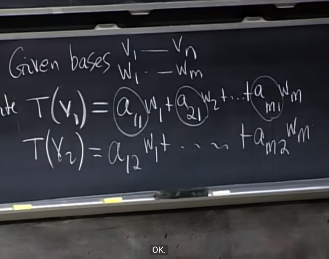</kbd></p>

> [!NOTE]
> Tiếp tục, lấy **input basis vector v2**, apply linear
> transformation **T(v2)** và**thể hiện nó dưới dạng linear
> combination của các output basis u1, u2....**
>
> T(v2) `=` a12u1 `+` a22u2 `+` ...
>
> Thì **coefficient chính là component của cột 2 của A**

<br>

<a id="node-1113"></a>

<p align="center"><kbd>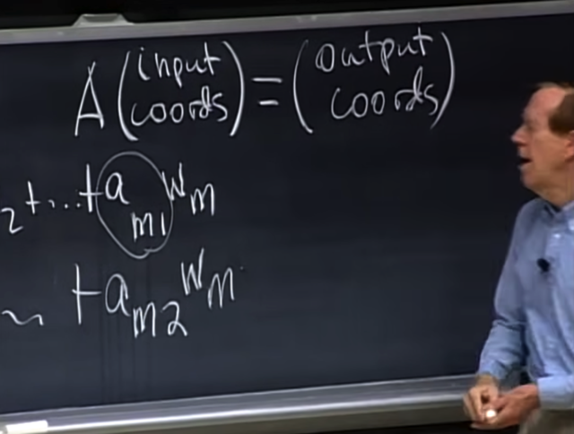</kbd></p>

🔗 **Related:** [LECTURE 30: LINEAR TRANSFORMATIONS AND THEIR MATRICES](untitled.md#node-1104)

> [!NOTE]
> Thì một**matrix A construct theo cách này** sẽ **đảm bảo
> rằng** nếu**dùng nó để transform (vector of) input
> coordinates** thì nó **sẽ cho ra (vector of) output
> coordinates.**Và ta sẽ dùng phương pháp này để thử xây dựng lại
> matrix A trong ví dụ projection lên line hồi nãy mà khi đó là
> ta chỉ đoán giá trị của A vì đây là trường hợp đơn giản

<br>

<a id="node-1114"></a>

<p align="center"><kbd>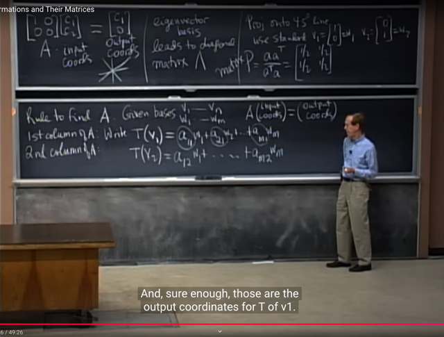</kbd></p>

<p align="center"><kbd></kbd></p>

<p align="center"><kbd>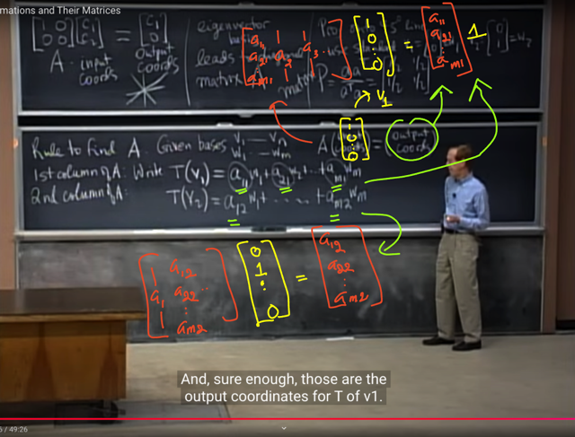</kbd></p>

> [!NOTE]
> Giải thích tại sao LẠI XÂY DỰNG MATRIX A NHƯ VẬY:
>
> Đầu tiên cần nhấn mạnh rằng ta đã hiểu tại sao nếu matrix A
> có thể transform được basis v1,v2, theo cách mong muốn thì
> A sẽ transform mọi vector trong input space.
>
> Nhắc lại ta đang xét phép linear transform R^2 vector `->` R^4
> vector.
>
> Để đơn giản hóa vấn đề, ta hoàn toàn có thể **CHỌN** **input** **basis**
> là **STANDARD BASIS**: v1 `=` (1 0) v2 `=` (0 1)
>
> Vậy giả sử ta đã biết kết quả khi transform v1: T(v1) và kết
> qủa này, đương nhiên thể hiện bởi coordinate của nó trong
> output space R4. Ví dụ T(v1) `=` (1, 3, 5, 7) với các con số này
> là COORDINATE của T(v1) mà như đã biết, coordinates sẽ tùy
> theo một basis cụ thể. Nên cứ gọi basis hiện tại của output
> đang chọn để thể hiện T(v1) là {u1, u2, u3, u4}. Vậy ta đang có
> ```text
> T(v1) = 1*u1 + 3*u2 + 5*u3 + 7*u4
> ```
>
> Tương tự giả sử kết quả apply linear transformation lên v2 là
> T(v2) là vector có coordinate là (7, 8, 9, 10), đồng nghĩa: T(v2)
> ```text
> = 7*u1 + 8*u2 + 9*u3 + 10*u4
> ```
>
> Thế thì, câu hỏi sẽ là, **A sẽ là gì** **để Av1 có kết quả bằng
> T(v1)**? và **Av2 `=` T(v2)**
>
> ```text
> Khi đó Av1 = T(v1) <=> [col1]*1+[col2]*0 = T(v1) <=> col1 =
> ```
> T(v1) Mà điều này mang ý nghĩa là, column vector 1 của A thể
> hiện trong basis của output cũng có cùng coordinate với T(v1),
> vậy col1 sẽ có coordinate (cũng là các component của nó) là
> (1, 3, 5, 7)
>
> ```text
> Tương tự Av2 = T(v2) => [col1]*0 + [col2]*1 = T(v2) <=> col2 =
> ```
> T(v2) Và, again, điều này đương nhiên có nghĩa là vector col2
> (column vector thứ 2 của A) có cùng coordinate với T(v2), vậy
> nó là (7, 8, 9, 10)
>
> Điều này giải thích vì sao có thể xây dựng A như vậy

<br>

<a id="node-1115"></a>

<p align="center"><kbd>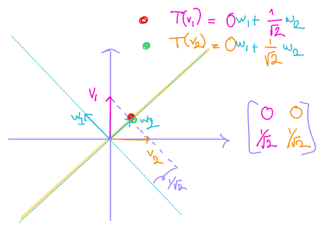</kbd></p>

> [!NOTE]
> Thế thì ta có thể**thử làm với projection** vừa rồi:
>
> Chọn v1, v2 là **standard basis**
>
> Và w1, w2 là **eigenvectors**
>
> Thì A là matrix này

<br>

<a id="node-1116"></a>

<p align="center"><kbd></kbd></p>

> [!NOTE]
> gs lấy ví dụ khác. cũng là một linear transformation: đó là
> phép **tính derivative w.r.t x**
>
> **input basis** là 3 vector (again, ta đã biết **function có thể
> đóng vai trò là vector**, hay khái niệm vector hay vector space
> không chỉ giới hạn trong vector thông thường mà còn mở
> rộng với function): {1, x, x^2} và **output basis là {1, x}**
>
> Để input có thể express là linear combination các input basis 
> c1 `+` c2x `+` c3x^2, tương tự như hồi nãy, ta có c1, c2, c3 là
> coordinates.
>
> Và output ta cũng thể hiện là linear combination của output
> basis c2 `+` 2c3x `->` coordinate là [c2, 2c3]
>
> Nên đây giống như là linear transformation `R3->` R2

<br>

<a id="node-1117"></a>

<p align="center"><kbd>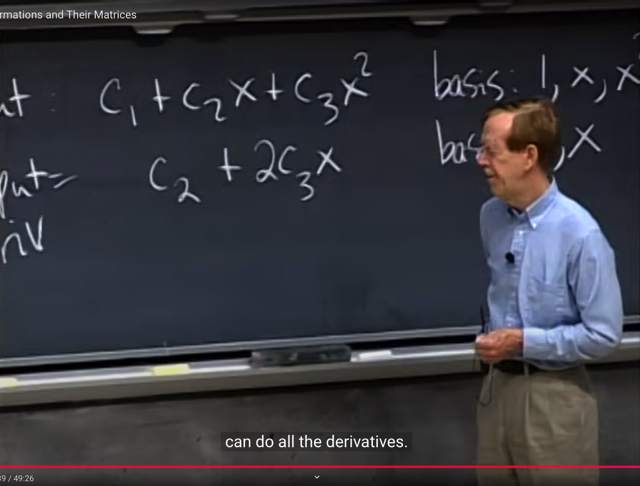</kbd></p>

> [!NOTE]
> Một ý rất hay đó là gs cho rằng ta sẽ hiểu rằng **lấy
> derivative là một linear transformation**. Vì vậy cho nên
> khi ta có thể tính T(v) với mọi basis "function" T(v1),
> T(v2). (tức là ta có cách tính đạo hàm w.r.t x của các
> basis function) ... thì ta **sẽ có thể tính derivative của mọi
> function v** là linear combination của các basis "function"
> v1,v2...v `=` c1v1 `+` c2v2... khác

<br>

<a id="node-1118"></a>

<p align="center"><kbd>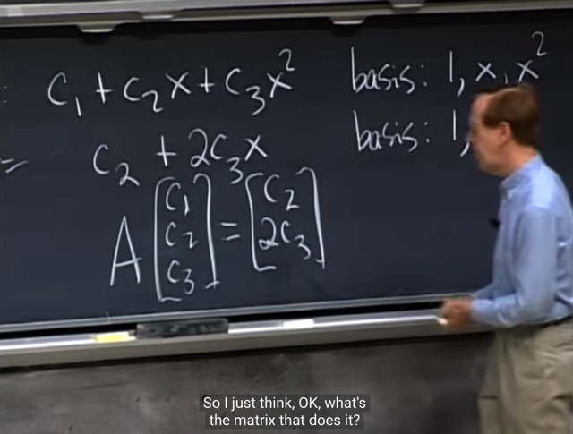</kbd></p>

> [!NOTE]
> Thế thì matrix A là gì?
>
> Thử trả lời trước, ta có thể tuân theo cái rule ở trên để 
> construct matrix A: tính `T(v_i),` tức là apply linear tranformation
> đối với input basis vector và thể hiện nó ở linear combination
> của các output basis vectors
>
> T(v1) `=`  `d(1)/dx` `=` 0 `=` **0***1 `+` **0***x `->` cột 1 của A là **[0 0]**
> T(v2) `=` `d(x)/dx` `=` 1 `=` **1***1 `+` **0***x `->` cột 2 của A là **[1 0]**
> T(v3) `=` `d(x^2)/dx` `=` 2x `=` **0***1 `+` **2***x `->` cột 3 của A là **[0 2]**
>
> Từ đó A là matrix (2,3): **[0 1 0; 0 0 2]**
>
> ```text
> Thử lại A [c1 c2 c3]T = c1*[0 0] + c2*[1 0] + c3*[0 2] =
> ```
>
> ```text
> [c1*0 + c2*1 + c3*0; c1*0 + c2*0 + c3*2] = [c2; 2c3]
> ```
>
> `->` Đúng

<br>

<a id="node-1119"></a>

<p align="center"><kbd>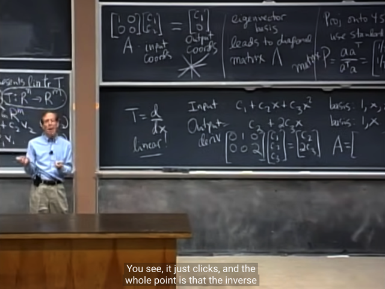</kbd></p>

> [!NOTE]
> Correct

<br>

