# Lecture 31: Change Of Basis; Image Compression

📊 **Progress:** `37` Notes | `36` Screenshots

---

<kbd>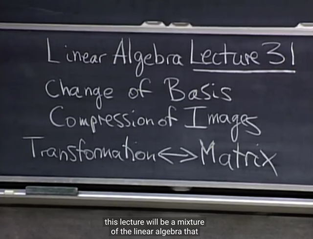</kbd>

 

<kbd>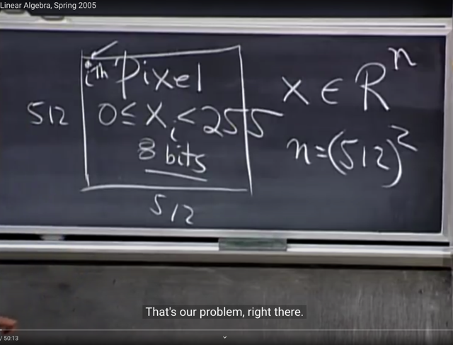</kbd>

> [!NOTE]
> Bài này gs sẽ nói về bài toán **image compression**,
> thực chất là **một ứng dụng của "change of basis"**
>
> Như đã biết image **cấu thành bởi các pixel**, mỗi cái
> chứa một gray-scale number trong range [0:255] chiếm
> 8 bits bộ nhớ. Và nếu xét image có kích thước 512x512
> thì ta có vector x chứa các giá trị của các pixel thì nó ở
> trong R^n với n = 512^2 = 262144

 

<kbd>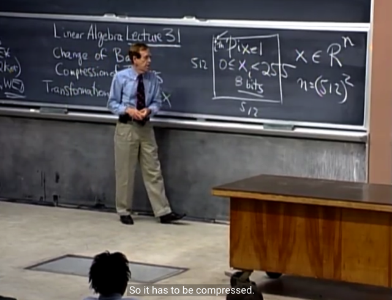</kbd>

> [!NOTE]
> Nếu là **color image** thì sẽ
> cần gấp 3 lần như vậy.

 

<kbd>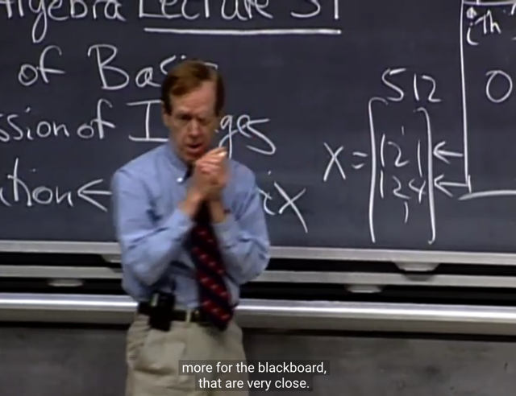</kbd>

> [!NOTE]
> đoạn này đại khái là vầy: ví dụ như **một image** mà ta
> đang nhìn thấy đi và cho rằng nó là **ảnh trắng đen** để
> giả sử nó cũng là 512x512, thì ta có thể **represent** nó
> thành một **vector có 512^2 = 262144 components**.
>
> Thế thì đại khái là sẽ **có nhiều pixel** có giá trị **liên
> quan** nhau (**correlate**) vì trong hình chúng ứng với
> cùng một thứ như cái áo sơ mi của gs hay cái bảng đen.
>
> Vậy kiểu như là, nhưng **sự liên quan này mang đến
> khả năng cho việc compression** (mà chỉ giảm chút ít,
> mất chút ít thông tin)

 

<kbd>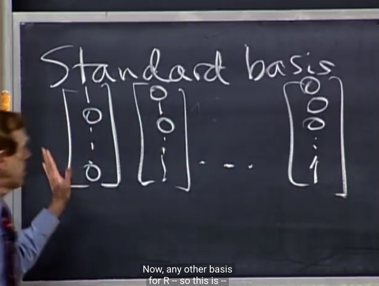</kbd>

> [!NOTE]
> Thế thì nếu trong hoàn cảnh này, ta dùng **standard**
> **basis** thì ta sẽ có**tới 512^2 = 262144 vector** (vì ta
> đang trong R^(262144), cũng như **R^2 thì có 2
> standard basis vậy)**

 

<kbd>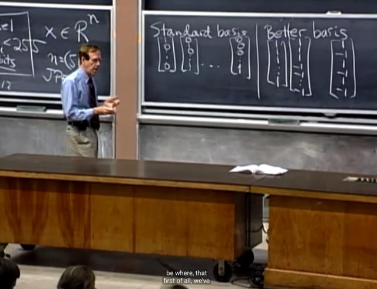</kbd>

> [!NOTE]
> Đại khái là, ta **có thể dùng basis vector khác** như **[1 1 ..
> 1]** để (theo gs, chỗ này chưa hiểu lắm) **thể hiện trạng thái
> solid** (ví dụ như khi **bức hình chỉ là tấm bảng màu đen**)
>
> Hoặc là một basis vector khác**[+1 -1 +1 -1...]** để khi bức
> hình chứa hình ảnh / pattern của **checker-board** thì basis
> vector này có thể chứa mọi thông tin.
>
> Hoặc là một basis vector **[1 1 1...0 0 0]** để khi bức hình có
> một **mảng màu này một mảng màu kia**
>
> Thì ý là, giả sử một bức hình **thể hiện tấm bảng đen** nhưng
> trên đó **có vùng lúc đậm lúc nhạt** như **checker board**, thì ta
> có thể **chỉ cần linear combination** của hai basis vector ở trên
> (với coefficient nào đó) để thể hiện được đầy đủ thông tin **thay
> vì phải dùng tới 262144 vector**.
>
> Và việc **chọn basis vector như thế nào là do mình**. Chọn
> basis tốt thì kiểu như sẽ **giúp represent thông tin trong bức
> ảnh một cách hiệu quả, ít tốn kém** hơn khi **chỉ cần dùng ít
> basis vector hơn**.
>
> Có thể hiểu nôm na thế này, giả sử bức hình có dạng checker
> board, thì nội **một basis vector có dạng [+1 -1 +1 -1 ...]** đã **đủ**
> **để thể hiện thông tin bức hình rồi**, nhưng nếu vẫn dùng
> **standard basis thì ta vẫn sẽ phải dùng 512^512 vector** (thể
> hiện giá trị của mỗi pixel)

 

<kbd>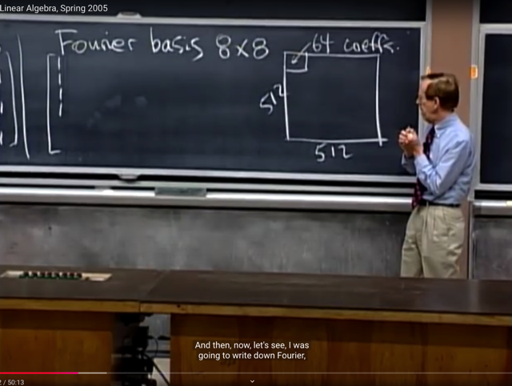</kbd>

> [!NOTE]
> Đại khái là với **JPEG**, người ta sẽ **chọn dùng Fourier
> basis** 8x8 - gs giải thích 8x8 có nghĩa là họ sẽ**chia image
> gốc** (ví dụ 512x512)**thành những block 8x8**, tức là **mỗi
> block có 64 pixels**

 

<kbd>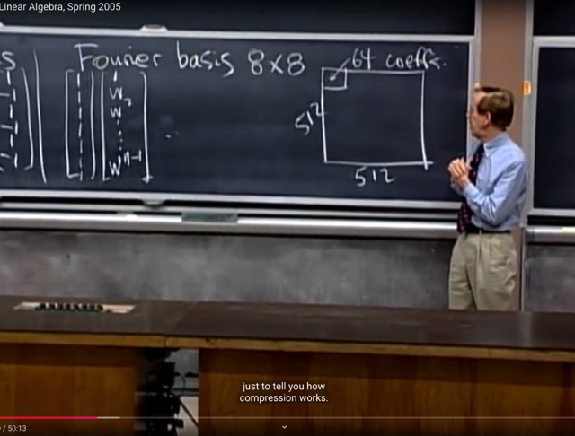</kbd>

> [!NOTE]
> Tức là, có **64 basis vectors**, trong không gian **R^64**
>
> Cho dễ hiểu đầu tiên hãy nghĩ về vector trong **R^2** (2D
> plane) thì đương nhiên R^2 với dimension bằng 2 thì sẽ có
> **2 vector độc lập** để **span R^2**. Cũng đồng nghĩa là**basis của R^2 sẽ có 2 vectors**. Mà standard basis là hai
> vector (1,0) và (0,1)
>
> Thế thì, bây giờ, ta sẽ chia thành block 8x8 để **chứa 64
> pixels**. Khi đó để thể hiện 64 pixels này ta cần 64 con số
>
> Hay, một vector có 64 phần tử
>
> Do đó **mỗi block sẽ đại diện bởi một vector trong R^64**
>
> Và dễ hiểu nó sẽ là **một linear combination của** **64
> basis vectors** với**64 coefficients**.
>
> (Mỗi standard basis vector ở đây sẽ có **64 phần tử** với
> một số 1 và 64 số 0)

> [!NOTE]
> "...each image of these lectures the it gets broken into 8
> by 8 blocks okay within each block we have**64
> coefficients** **64 basis vectors** 64 pixels and we change
> basis in **64 dimensional space**using these fourier
> vectors just know that was a lossless step let me let me
> emphasize in comes the sign.."

 

<kbd>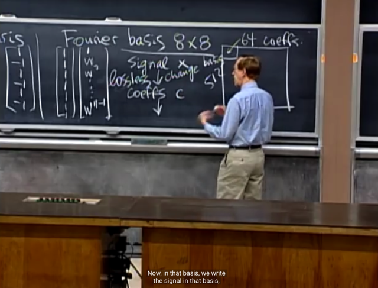</kbd>

> [!NOTE]
> Vậy thì, đại khái là trong không gian R^64 đó, **ta sẽ CHỌN
> MỘT BASIS KHÁC, thay vì STANDARD BASIS**. Và gs đề
> cập đến Fourier basis chính là basis khác này. Đương nhiên
> Fourier basis vector CŨNG CÓ 64 COMPONENTS, và basis
> cũng có 64 vectors (vì trong bất kì một vector trong Rn thì sẽ
> có**n components**, và một basis của Rn thì phải có**n vector
> độc lập**)
>
> Và thực hiện việc **tính ra coefficients theo basis mới này**.
> Bước này gs cho rằng **không có thông tin nào bị mất đi**
> (lossless). Bởi vì ta chỉ chuyển từ basis này sang basis
> khác, như đã biết, nó**chỉ thay đổi coefficients** của các basis
> vector trong linear combination.
>
> Nên ban đầu ta có 64 coefficients ứng với standard basis
> thì giờ ta vẫn có 64 coefficients ứng với new basis (kí hiệu c,
> là vector chứa 64 coefficients mới)

 

<kbd>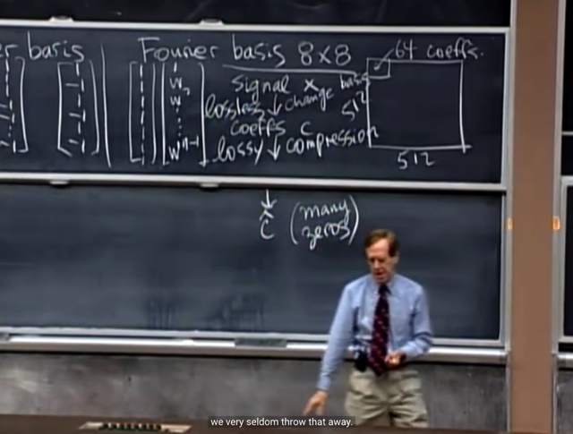</kbd>

> [!NOTE]
> Khi đó trong**bộ coefficients** thì có thể ta **sẽ thấy
> có nhiều giá trị nhỏ ~=0**. Gs nói đại khái là ví dụ như
> các coeff gắn với basis (1, 1,...1) thì rất lớn (ý nói là
> image có nhiều khoảng có solid color như vùng bảng
> đen chẳng hạn, nên cái vùng 8x8 cũng nhiều khả
> năng sẽ có một màu solid), nhưng coeff gắn với basis
> vector (1,-1,1,-1...) thì rất nhỏ vì trong image ít có
> pattern checker-board như vậy.
>
> Và ta sẽ **THROW AWAY / thresholding** các**coefficients nhỏ này**, chỉ **giữ lại các coefficients có
> giá trị lớn**, kí hiệu **c^**
>
> Điều này đồng nghĩa với với ta **bỏ đi các basis
> vector ứng với các dimensions có mức đóng góp ít**
> vào linear combination

 

<kbd>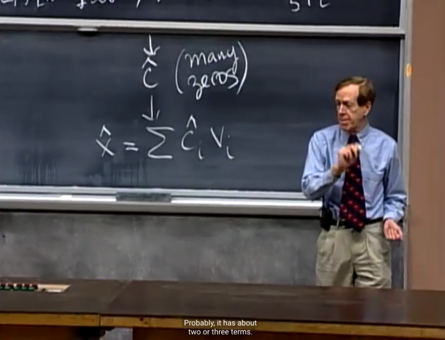</kbd>

> [!NOTE]
> Và ta sẽ tái tạo lại image block với chỉ basis vector còn giữ
> lại, ví dụ bây giờ từ 64 basis vectors ta sẽ **chỉ còn 2,3 basis
> vectors** có coefficient lớn mà thôi
>
> Và đó chính là**image compression**dựa trên**changing of
> basis**

 

<kbd>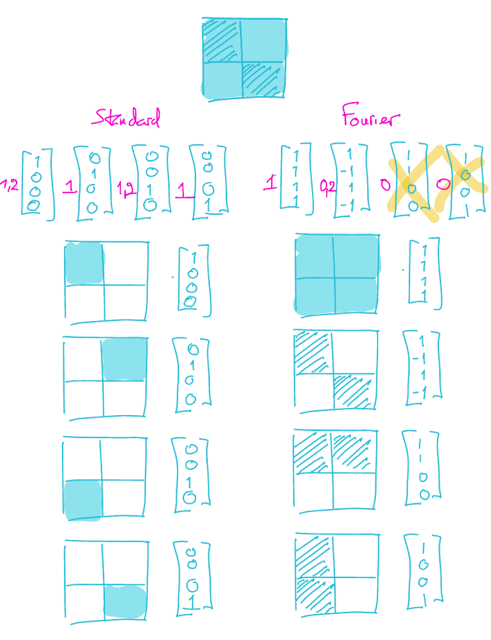</kbd>

> [!NOTE]
> cùng cái hình gốc có 4 pixel màu xanh, trong đó có
> pixel đậm hơn một chút. Thì nếu dùng standard basis
> để mô tả ta vẫn cần 4 coefficients 
>
> Tuy nhiên nếu dùng basis khác ta có thể thấy chỉ cần
> dùng hai vector với 2 coefficients thôi

 

<kbd>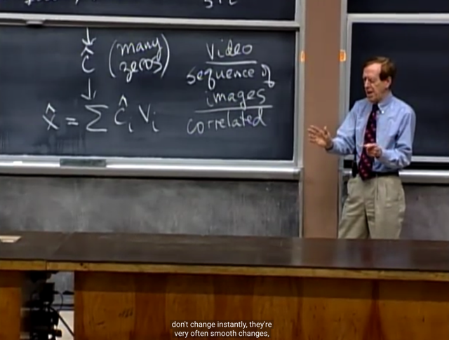</kbd>

> [!NOTE]
> gs nói thêm một chút về video, nơi mà ta có
> thể khai thác sự correlated giữa các khung
> hình. (nói chung gs chỉ nói sơ)

 

<kbd>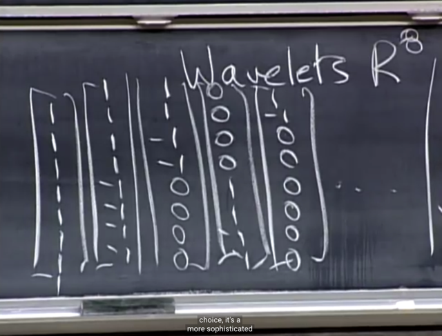</kbd>

> [!NOTE]
> gs nhắc đến một đối thủ cạnh tranh của **Fourier** basis,
> đó là **Wavelets** basis: 8 vectors, mỗi vector có 8 components
> như thế này
>
> đại khái là, giả sử ta có một vector [1,-1,1,-1...] của Fourier
> basis ở trên, ta có thể **represent nó bởi combination của
> các Wavelet basis vectors**. (cái này đương nhiên, và ta
> cũng hiểu là ngược lại, nếu muốn represent wavelets
> vectors bằng Fourier basis thì cũng được).
>
> Nói chung là đây chẳng qua là việc tìm, chọn basis vectors
> như thế nào thì lợi hơn thôi

 

<kbd>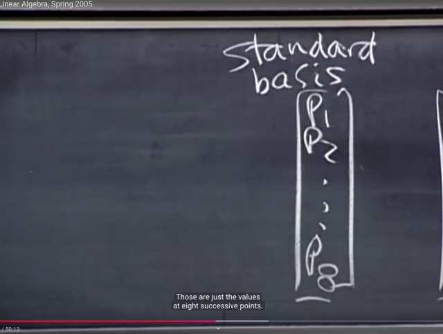</kbd>

> [!NOTE]
> Thế thì một cách khái quát giả sử ta có vector p mang giá trị
> của pixel values = [p1,p2..p8] (block có 8 pixels, ví dụ như
> **một hàng có 8 pixels**, thay vì chia thành các block 8x8
> như hồi nãy) câu hỏi là **làm sao có represent nó với
> wavelets basis**

 

<kbd>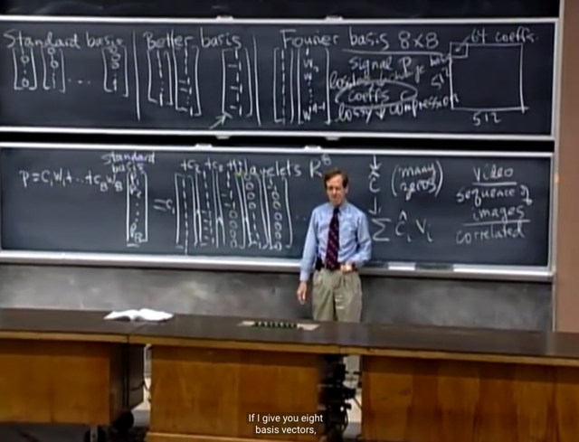</kbd>

> [!NOTE]
> Hay nói cách khác làm sao ta tìm c1,c2...c8
> khiến p = c1w1+c2w2...c8w2 với w1,w2..w8 là
> các Wavelets basis vectors này

 

<kbd>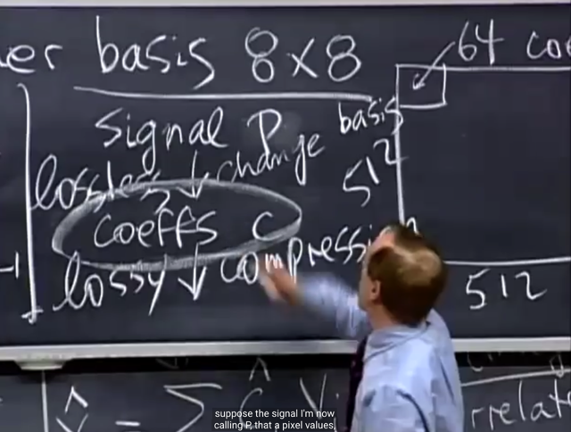</kbd>

> [!NOTE]
> Đây là bước Lossless step hồi nãy, ta chỉ là đổi từ linear
> combination của 8 standard basis vectors ([1,0..0], [0,1,0....
> 0]..[0,...0,1]) với coefficients là p1, p2...p8
>
> sang linear combination của 8 Wavelets basis vectors, với
> coefficients lúc này sẽ là c1, c2...c8

 

<kbd>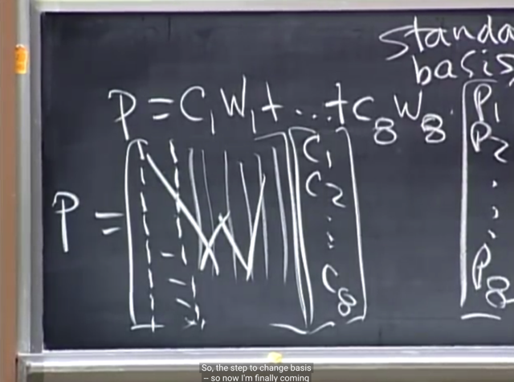</kbd>

> [!NOTE]
> Vậy đầu tiên ta **thể hiện dưới dạng matrix** quen thuộc:
> vector p chính là **nhân matrix W** (tạo bởi các col là
> Wavelet basis vector) với **coefficients vectors c: p = Wc**

 

<kbd>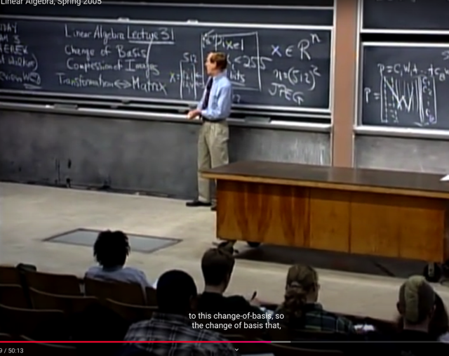</kbd>

> [!NOTE]
> Và đây là lúc gs nói về **Change of basis,**chú ý rằng bài
> trước ta chỉ học về **Choose basis**

 

<kbd>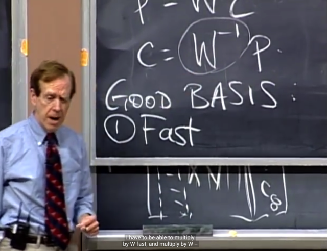</kbd>

> [!NOTE]
> thế thì ta có thể tính ra**c = W_inv p**. Và từ đó một **bộ basis tốt**(tức matrix W) là khi có thể **tính toán nhanh** khi tính**W*c** hoặc **W_inv*p**

 

<kbd>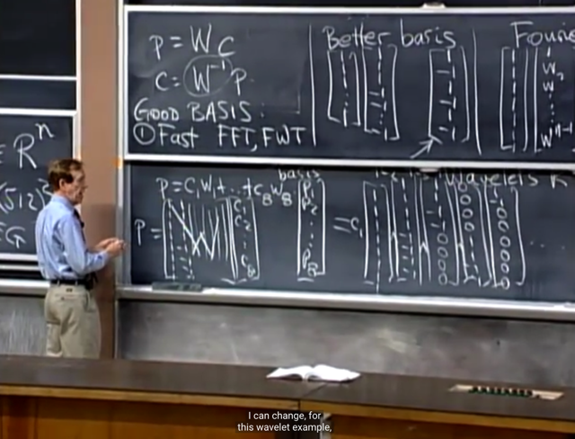</kbd>

> [!NOTE]
> Và **Fourier basis tốt chính là vì vậy** (tính nhanh), nhờ có
> **Fast Fourier Transform**. Và tương tự, với **Wavelet basis**,
> ta cũng có tính chất này, với **Fast Wavelet Transform.**

 

<kbd>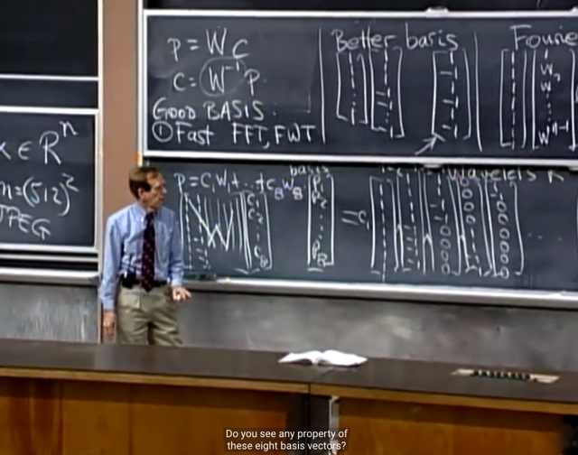</kbd>

> [!NOTE]
> Cụ thể hơn gs cho biết **tính inverse của Wavelet matrix rất
> dễ**. ông hỏi rằng ta có để ý Wavelet matrix có gì đặc biệt
> không?
>
> Đó là:
>
> **Chúng chỉ có 1, 0, -1**.
>
> Và các basis vector này **orthogonal** (dot product của
> chúng đều bằng 0)
>
> Tất nhiên là chúng c**hưa orthonormal**, nhưng gs cho rằng
> ta có thể **dễ dàng scale down để có unit length**.
>
> Me: Nhớ lạ**i orthogonal matrix**(nếu các cols orthonormal)
> thì ta sẽ có tính chất rất lợi đó là **Qinv = Q.T**

 

<kbd>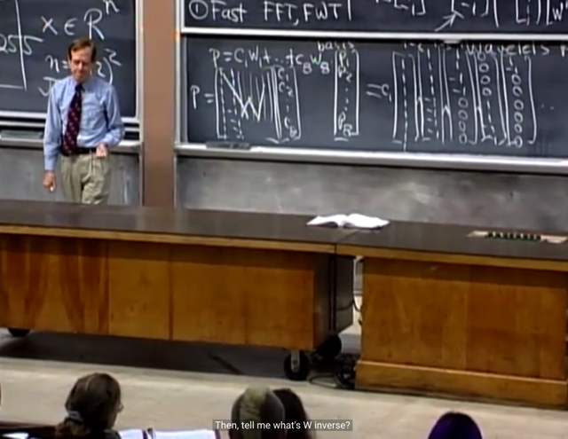</kbd>

> [!NOTE]
> Rồi gs hỏi: W inverse là gì?
>
> Me: mới nói luôn, vì **W là orthogonal matrix** (sau khi ta đã
> normalize các cols để có unit length) thì **Winv chính là W.T**

 

<kbd>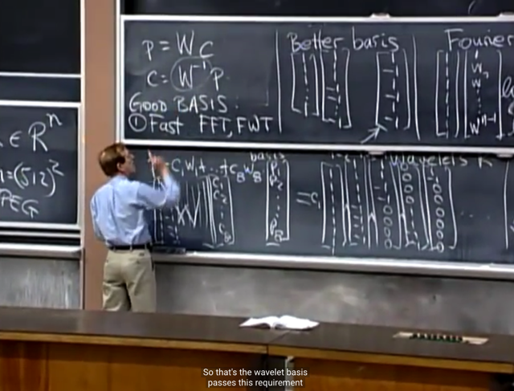</kbd>

> [!NOTE]
> Gs: Đúng vậy, nhờ đó**tính Winv rất nhan**h, nó giúp
> **Wavelets basis pass điều kiện (làm basis tốt) đầu tiên**

 

<kbd>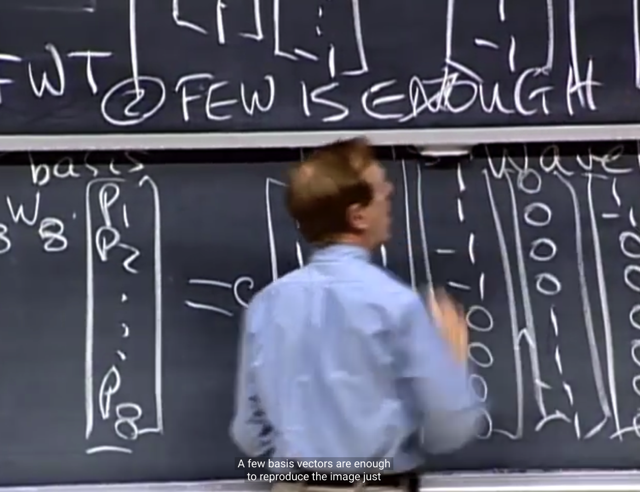</kbd>

> [!NOTE]
> Và điều kiện thứ hai, dễ hiểu thôi đó là làm sao đó**chỉ cần ít
> basis thôi vẫn đủ để capture thông tin**. Gs giải thích đại khái
> là nếu chỉ điều kiện 1 - Nhanh - thì Standard basis là đủ: theo
> ý nghĩa là ta KHÔNG LÀM GÌ HẾT LÀ NHANH NHẤT, nhưng
> khi đó nó sẽ không pass điều kiện 2, vì giả sử ta bỏ đi 6 trong
> 8 basis thì cái hình sẽ bị mất rất nhiều thông tin
>
> Còn **với Fourier basis, hay Wavelet basis, thì ta có thể bỏ đi
> 5, 6 cái basis ứng với coefficient nhỏ**, mà **không ảnh
> hưởng nhiều đến bức hình.**

 

<kbd>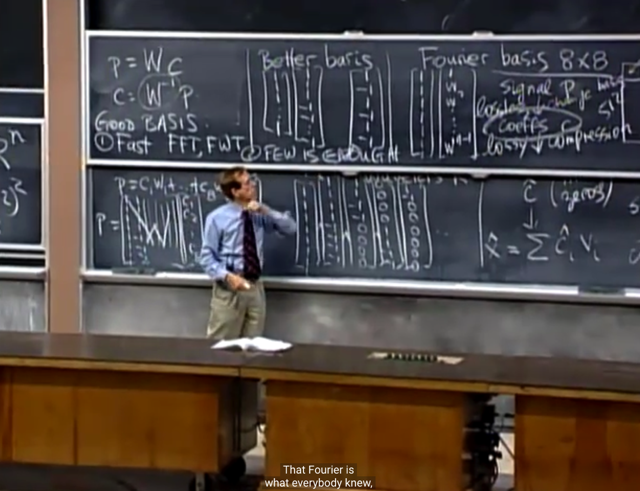</kbd>

> [!NOTE]
> Đại khái là gs cho biết **JPEG 2000** chính là dùng
> **Wavelets basis**, hay FBI khi compress image dấu vân
> tay cũng dùng cái này

 

<kbd>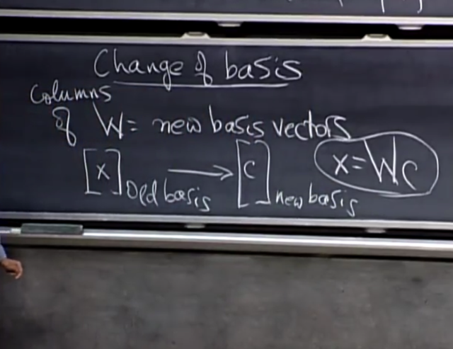</kbd>

> [!NOTE]
> đại khái là gs chính thức nói về change basis: với **matrix W
> chứa các cols LÀ CÁC BASIS VECTORS MỚI**, thì:
>
> QUAN HỆ GIỮA COEFFICIENTS / COORDINATE TRONG
> BASIS CŨ (vector x, hay p ở slide trước) VÀ COORDINATE
> TRONG BASIS MỚI (vector c) thể hiện qua: **x = Wc**

 

<kbd>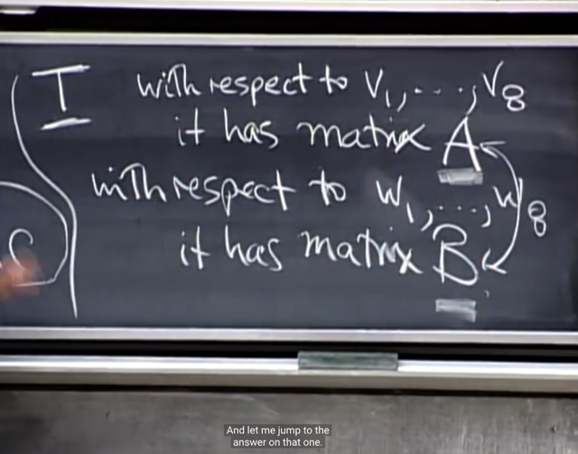</kbd>

> [!NOTE]
> tiếp gs nói về **linear transformation T**, như bài trước đã biết
> về khái niệm này, ví dụ như **projection**, hay **rotation** đều
> thuộc loại **linear transformation.**
>
> Vậy thì vấn đề đặt ra là,**giả sử ta có linear transformation T**
> nhưng kiểu như **express bởi 2 bộ basis khác nhau**.
>
> Một cái là {**v1,...v8}** - ứng với matrix **A**, một cái là **{w1...w8}** ứng 
> với matrix **B** thì ta sẽ xem thử **A và B quan hệ với nhau ra sao**

 

<kbd>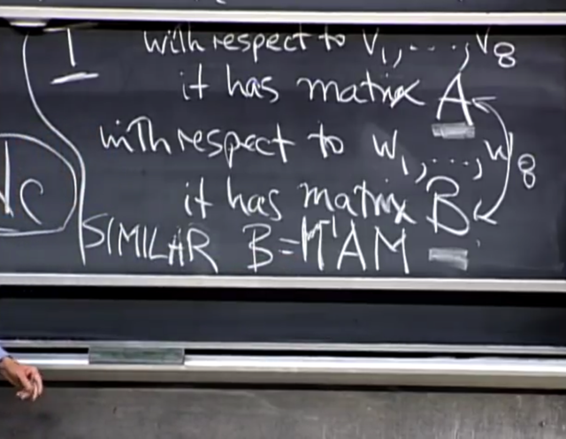</kbd>

> [!NOTE]
> Gs cho biết quan hệ đó chính là:**A và B sẽ là hai SIMILAR
> MATRICES**, ta đã học ở bài trước, hai matrix similar khi
> một matrix có thể **tồn tại một matrix M** để giúp phân tách
> thành matrix **B = M.A.Minv**
>
> Và matrix M lúc đó gọi là **CHANGE OF BASIS MATRIX**

 

<kbd></kbd>

> [!NOTE]
> gs: CÓ HAI THỨ XẢY RA KHI **CHANGE BASIS**:
>
> I) MỌI **VECTOR SẼ THAY ĐỔI COORDINATE**. Điều này thể hiện 
> bởi **x = Wc**
>
> II) MỌI **MATRIX ĐỨNG SAU MỘT LINEAR TRANSFORMATION** 
> (vector x, hay p ở slide trước) CŨNG SẼ THAY ĐỔI. Thể hiện bởi 
> **B = Minv A M**
>
> Gs nói M có thể chính là W, ý nói, chúng là change of basis matrix

 

<kbd>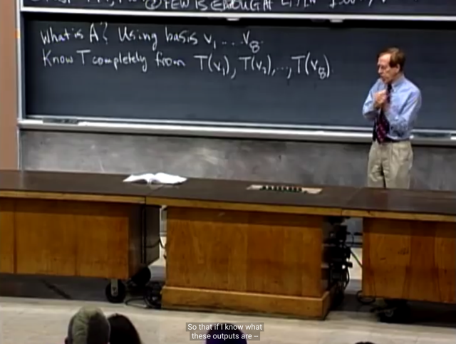</kbd>

> [!NOTE]
> Thế thì vừa rồi giống như conclusion mà ta muốn nói, bây
> giờ ta sẽ làm rõ "**A của linear transformation dùng basis v1,.
> ..v8 là sao**".
>
> Thì đầu tiên ta đã học ở bài trước về linear transformation,
> ở đây nhắc lại, đó là nếu ta BIẾT KẾT QUẢ LINEAR
> TRANSFORMATION CỦA CÁC BASIS VECTOR THÌ TA CÓ
> THỂ TÍNH LINEAR TRANSFORMATION CỦA MỌI
> VECTOR BẤT KÌ.

 

<kbd>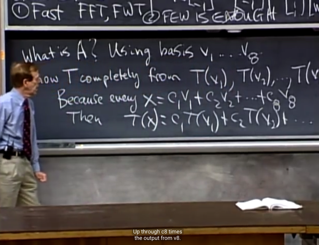</kbd>

> [!NOTE]
> Vì theo tính chất của linear transformation,
> T(c1*v1+c2*v2+...) = c1T(v1) + c2T(v2) + ...
>
> do đó ta có thể tính linear transformation với mọi vector x
> nên đó là 8 thứ đầu tiên ta cần biết T(v1)..T(v8)

 

<kbd>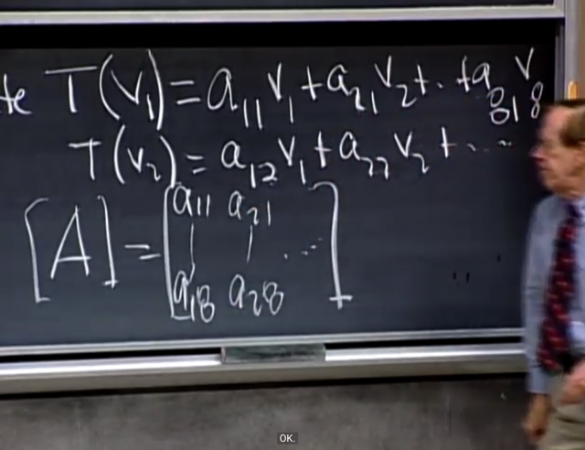</kbd>

🔗 **Related:** [LECTURE 30: LINEAR TRANSFORMATIONS AND THEIR MATRICES](untitled.md#node-1111)

> [!NOTE]
> Và như bài trước ta đã học rằng để construct matrix A đại
> diện cho linear transformation T, thì đầu tiên ta đã vừa
> nói, là ta cần biết các **kết quả linear transformation T(v)
> apply với các basis của input, ở đây là v1,v2..v8**, tức ta
> cần biết T(v1), T(v2)...T(v8) cái này đã nói vừa rồi, chỉ là
> lặp lại ở đây
>
> Tiếp, để xây dựng matrix A, ta cần biết rằng output basis
> là gì nữa. Giả sử output basis là w1, w2... Thì ta cần**thể
> hiện T(v1),... dưới dạng linear combination của các output
> basis**. Khi đó **coefficients của T(v1) chính là cột 1 của
> A**, coefficients của T(v2) chính là cột 2...
>
> Đây chỉ là ôn lại những gì ta học ở bài trước.
>
> Thế thì ở đây, **INPUT BASIS VÀ OUTPUT BASIS ĐỀU
> LÀ là v1, v2** nên ta sẽ t**hể hiện T(v1) dưới dạng linear
> combination của v1,v2...v8**. Khi đó các **coefficients
> chính là cột 1 của a.**
>
> Từ đó ta có A

 

<kbd>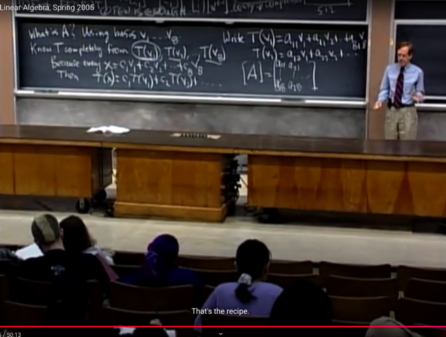</kbd>

> [!NOTE]
> gs tóm tắt lại: tôi cho các bạn một **bộ basis vectors**,
> một **linear transformation T**. Bạn sẽ**tính T(v1), T(v2)...
> và thể hiện nó theo các v1, v2..**.Từ đó bạn sẽ có matrix A

 

<kbd>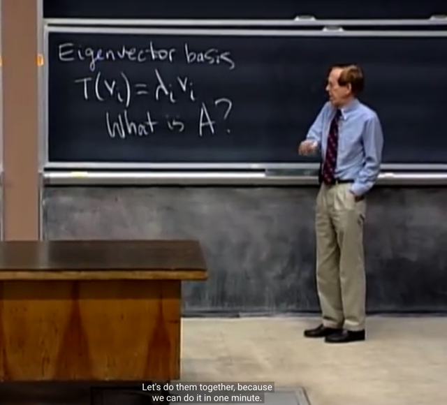</kbd>

🔗 **Related:** [LECTURE 30: LINEAR TRANSFORMATIONS AND THEIR MATRICES](untitled.md#node-1105)

> [!NOTE]
> Thế thì ví dụ ta dùng basis là một eigenvector basis của matrix
> A (ý là, ta muốn construct A (**của / đại diện / đứng sau linear
> transformation này T(v) = Av**) sao cho cái **basis {v1, v2...vn}
> ở đây chính là eigenvectors của A**)
>
> Khi đó, vì v_i là eigenvector của A nên Av_i = λ_i*v_
>
> Như vậy linear transformation apply lên các (input) basis vector
> là: T(v_i) = A*v_i= λ_i*v_i.
>
> Vậy thì **matrix A sẽ là gì?**
>
> me: Thử trả lời trước:
>
> Như quy trình nói rằng, đầu tiên ta sẽ**thể hiện T(v_1) là linear
> combination của các output basis (và cũng là input basis) 
> v_i** thì**coefficients chính là column 1 của A.**
>
> T(v_1) = **A*v_1**= **λ1*v1** ta sẽ thể hiện thành:
>
> **T(v_1) =  λ1*v1 = λ1***v1 + **0***v2 + ...**0***v8
>
> -> cột 1 của A là **[λ1, 0, ...0]**
>
> Tương tự
>
> **T(v_2)** = **λ2*v2** = **0***v1 + **λ2***v2 + ...**0***v8
>
> -> cột 2 của A là**[0, λ2, ...0]**
>
> ....
>
> Vậy matrix A là diagonal matrix **LAMBDA chứa các eigenvalues 
> của A**Như vậy với một linear transformation T(v) = Ax. Mà ta sử dụng
> basis vector là eigenvectors của A thì matrix sẽ chính là LAMBDA

 

<kbd>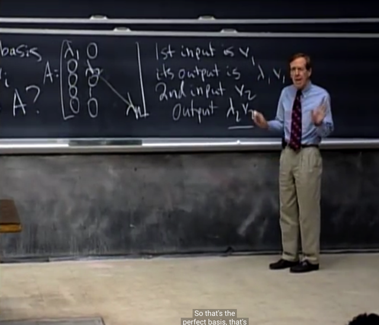</kbd>

> [!NOTE]
> gs: correct. Và gs nói rằng, dù Wavelet hay Fourier basis là
> tốt nhưng **tốt nhất vẫn là eigenvector basis**
>
> với image processing nó là **perfect basis**, tuy nhiên vì việc
> tìm eigenvectors đôi khi**tốn kém** nên người ta dùng những
> phương án ít tốt bằng như Fourier hay Wavelet
>
> Mình có thể hiểu là với tiêu chí #2 (hai tiêu chí cho good basis
> hồi nãy) thì eigenvectors basis là tốt nhất. Nhưng khi tính đến
> tiêu chí #1 tính nhanh thì không vì đôi khi tìm eigenvectors 
> mất thời gian. Thành ra các Fourier hay Wavelet tốt hơn khi cân
> nhắc đến cả hai tiêu chí

> [!NOTE]
> well you see what's coming that in that basis in the eigenvector
> basis the matrix is diagonal so that's the **perfect** basis that's
> the basis **we'd love to have for image processing**but to
> f**ind the eigenvectors of our pixel matrix would be too
> expensive** so we do something cheaper and close which is to
> choose a good basis like light wavelets

 

