# Lecture 33: Left And Right Inverse; Pseudoinverse

📊 **Progress:** `31` Notes | `34` Screenshots

---
<a id="node-1195"></a>

<p align="center"><kbd>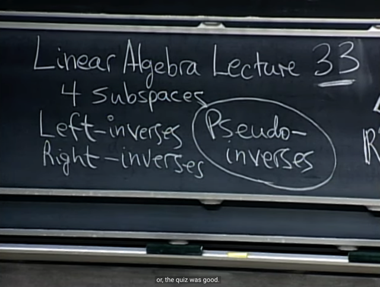</kbd></p>

<br>

<a id="node-1196"></a>

<p align="center"><kbd></kbd></p>

<br>

<a id="node-1197"></a>

<p align="center"><kbd>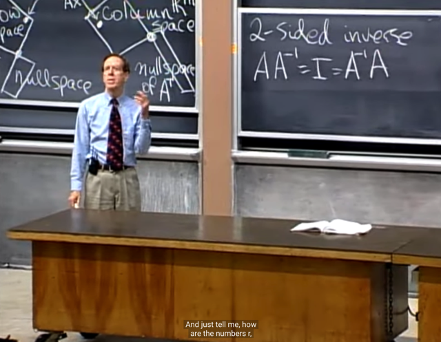</kbd></p>

> [!NOTE]
> đầu tiên, gs nói về **2-sided inverse**, mà ta đã dùng bữa giờ,
> với việc gọi nó là **inverse**. Thì với "loại inverse" này, thì **nhân
> nó vào bên trái hay phải gì của A cũng ra I: 
>
> `AA_inv` `=` `A_invA` `=` I**
>
> gs hỏi rằng quan **hệ giữa rank r, số row m, cố column n như
> thế nào?**
>
> me: Thì như bữa giờ đã học, nếu matrix **full-rank**, hay **invertible**
> hay **non-singular**. Thì nó sẽ **mọi columns đều independent**, 
> **mọi row cũng independent**, như vậy, nó sẽ phải **square** (vì nếu
> không square, như m > n, thì chắc chắn sẽ có dependent row)
>
> Tóm lại: với invertible matrix: **r `=` m `=` n**

<br>

<a id="node-1198"></a>

<p align="center"><kbd>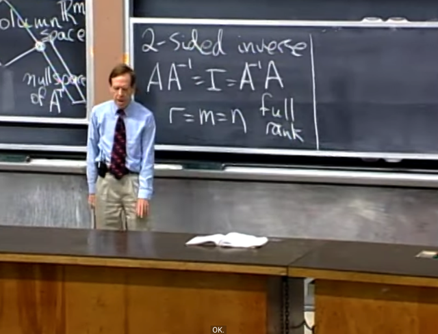</kbd></p>

> [!NOTE]
> gs: correct. Thế thì sau đó ta học về cái gọi là **full-column
> rank**, nó là cái gì?
>
> me: Nó là khi ta có **mọi column đều independent**, và nó
> có số hàng m nhiều hơn cột n (nếu m `=` n thì đương nhiên
> trở thành full rank, nhưng không thể m < n vì như vậy
> không thể có n cột independent vì khi đó max rank là m)
>
> tóm lại: r `=` n < m

<br>

<a id="node-1199"></a>

<p align="center"><kbd>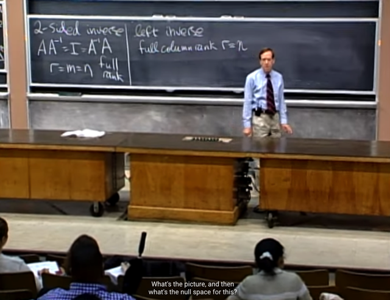</kbd></p>

> [!NOTE]
> Gs: correct. Thế thì nullspace ở trường hợp này ntn?
>
> me: vì mọi columns đều independent, nên không có free
> columns `->` không có special solutions. `->` không có vector
> nào trong basis của nullspace, hay nullspace chỉ có độc mỗi
> zero vector, dim cuả nullspace `=` 0
>
> Cũng có thể giải thích cách khác: Ta có n cols < m,  rồi thì
> row vector là vector trong R^n. Thế mà ta có n independent
> columns thì tức là cũng có n independent rows.
>
> THeo định lí `Rank-Nullity:` C(AT) và N(A) orthogonal
> complement, tổng dim của chúng bằng n mà dim C(AT) `=` n
> suy ra dim N(A) `=` 0
>
> Hoặc lập luận kiểu khác vì n independent R^n (row) vector
> này đã đủ span the whole space R^n. Vậy **mọi vector trong
> Rn** thì **cũng là trong rowspace** và ta biết mọi vector
> trong rowspace đều được map với vector trong columns
> space. Nên k**hông có (nonzero) vector nào bị map thành
> zero**: Đây chính là việc kết luận **nullspace chỉ có {0}**,
> dim N(A) `=` 0

<br>

<a id="node-1200"></a>

<p align="center"><kbd>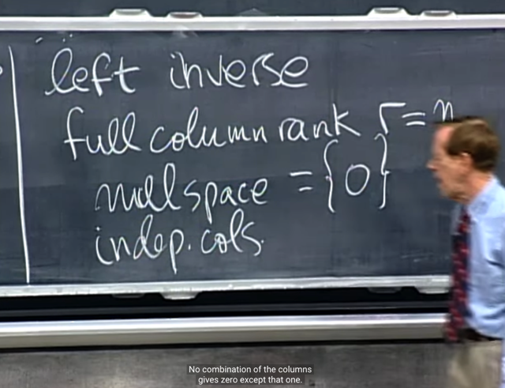</kbd></p>

> [!NOTE]
> gs: correct

<br>

<a id="node-1201"></a>

<p align="center"><kbd>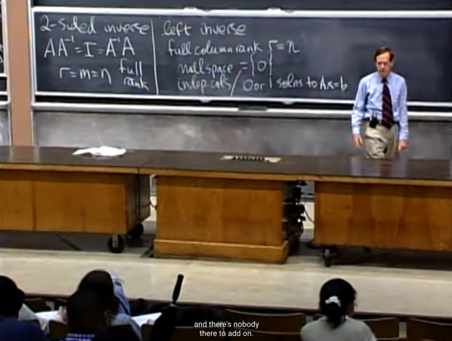</kbd></p>

> [!NOTE]
> và nói thêm là, như ta đã biết **Ax=b** sẽ có **general**
> **solution** là **x_particular** `+` **x_null**. Và vì nullspace
> empty, nên **nếu có x_particular**, (khi b thuộc column
> space của A thì sẽ tồn tại một linear combination các A's
> columns tạo ra b, và đó là `x_particular)` thì **Ax=b có
> nghiệm duy nhất**
>
> Nhưng **nếu b nằm ngoài columns space** (vì b trong
> Rm (matrix có m row, mà m > n) nên nó có thể nằm ngoài
> column space (với chỉ n independent columns, nó chỉ có
> thể span được một `n-D` subspace trong Rm, nên hoàn
> tòan có thể tồn tại b nằm ngoài subspace này) khi đó,
> **không thể có linear combination nào của các columns
> để tạo ra b** `->` không có `x_particular` `->` Ax `=` b **no
> solution.**

<br>

<a id="node-1202"></a>

<p align="center"><kbd>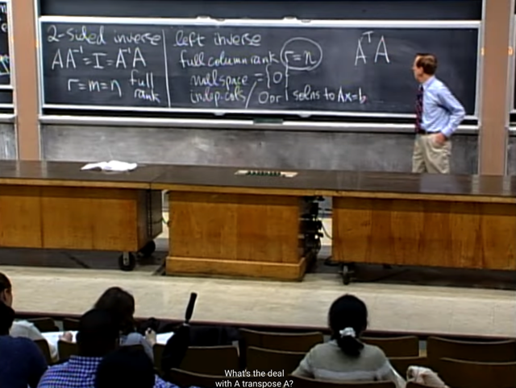</kbd></p>

> [!NOTE]
> ok, thế thì lúc này **ATA** như thế nào?
>
> me: Có thể nhớ rằng ta đã cùng nhau chứng minh rằng
> **khi A có `full-column` rank**, tức có **mọi column đều
> độc lập** thì khi đó, **ATA sẽ full-rank.**
>
> Có thể lập luận như sau: Xét ATAx `=` 0,**nhân  hai vế
> cho xT** ta có **xTATAx** `=` 0 `<=>` **(Ax)T(Ax)** `=` 0, mà
> vế trái là **square norm của vector u `=` Ax**. Nên nó
> **bằng 0 chỉ khi u `=` Ax `=` 0**.
>
> Thế mà, với điều kiện ban đầu rằng vì A `full-column` rank
> nên N(A) `=` {0} `=>` `Ax=0` chỉ có zero là solution duy nhất
> **nên x `=` 0 cũng là giá trị duy nhất khiến Ax `=` 0 và ATAx
> `=` 0**
>
> Vậy **ATAx `=` 0 chỉ có thể có một solution là x `=` 0**, nên
> ATA cũng full column rank. Mà ATA lại square. Nên ATA
> `full-rank.`

<br>

<a id="node-1203"></a>

<p align="center"><kbd>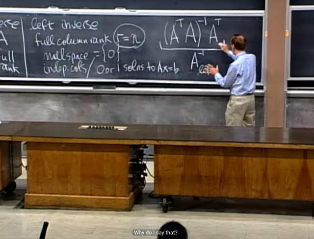</kbd></p>

> [!NOTE]
> Và từ đó ta có **(ATA)_invAT** được gọi là **left inverse** **của A.**
>
> gs hỏi thử tính nhân nó với A xem ra gì?
>
> (ATA)invATA đương nhiên ra [ATA)inv (ATA) `=` I

<br>

<a id="node-1204"></a>

<p align="center"><kbd>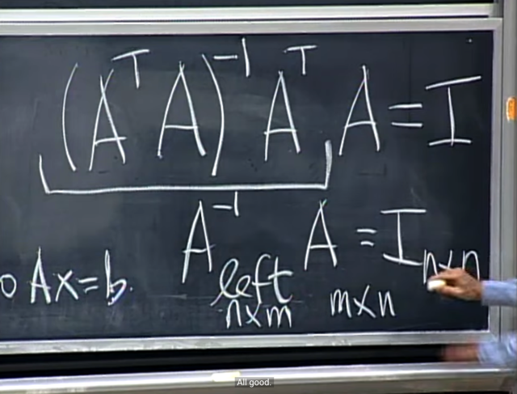</kbd></p>

> [!NOTE]
> Đúng vậy. Do đó nó gọi là
> left inverse (của A)

<br>

<a id="node-1205"></a>

<p align="center"><kbd>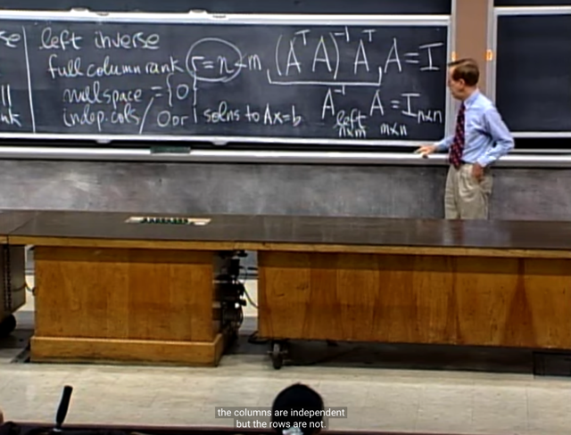</kbd></p>

> [!NOTE]
> Và như tên gọi, dễ hiểu rằng**nó chỉ có thể nhân với  A
> từ bên trái để ra I**, bỏ nó qua bên phải thì nó sẽ **vẫn 
> nhân được**, nhưng **không ra I**

<br>

<a id="node-1206"></a>

<p align="center"><kbd>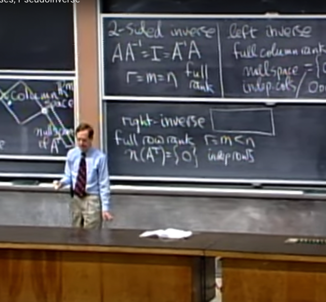</kbd></p>

> [!NOTE]
> gs nói qua trạng thái ngược lại, khi ta có matrix **full-row rank**.
> r `=` m < n, **mọi rows đều independent**. Dễ hiểu **left nullspace
> sẽ chỉ có zero vector**. Câu hỏi là solution của Ax `=` b sẽ như
> thế nào?
>
> me: Lập luận thế này, vì **r `=` m < n** nên **chắc chắn có  free
> columns** hay Ax `=` 0 có free variables, từ đó **có  special
> solutions** và **có vector trong basis** của nullspace Vậy
> **nullspace** **KHÔNG CHỈ CÓ ZERO** hay dim N(A) > 0
>
> Trong bối cảnh này, nếu tồn tại `x_particular,` tương đương với
> việc b nằm trong column space. Thế mà b thuộc R^m, mà
> ```text
> rank = r = m, có nghĩa là có r=m pivots row cũng là r=m
> ```
> pivots  column là các independent columns. Chúng sẽ span
> toàn bộ R^m. Do đó **b LUÔN NẰM TRONG COLUMN
> SPACE**.
>
> Vậy, cùng với việc nullspace KHÔNG CHỈ CÓ ZERO, nên ta
> sẽ có VÔ SỐ SOLUTION CỦA Ax `=` b

<br>

<a id="node-1207"></a>

<p align="center"><kbd>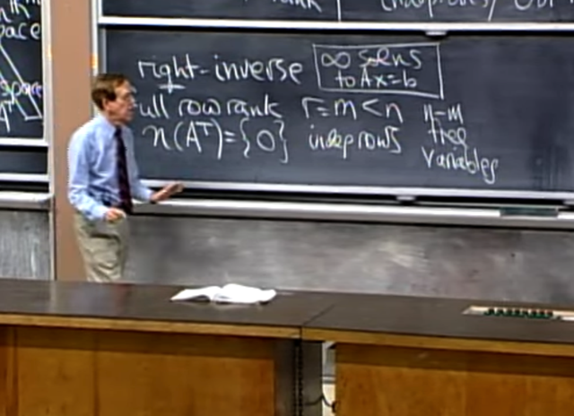</kbd></p>

> [!NOTE]
> gs: correct

<br>

<a id="node-1208"></a>

<p align="center"><kbd>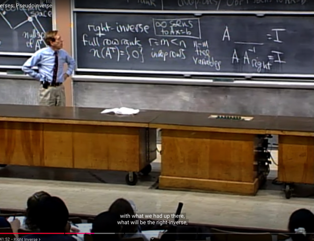</kbd></p>

> [!NOTE]
> gs đề nghị ta thử suy nghĩ xem `A_inv_right` là gì?
>
> me: **AT(AAT)_inv**
>
> có thể lập luận như sau:
>
> Với trạng thái full row rank thì cũng như ta có một matrix **B
> `=` AT có dạng `full-column` rank**.
>
> Nên BTB cũng full rank, invertible, tồn tại `BTB_inv`
>
> Vậy thì `(BTB)(BTB_inv)` `=` I
>
> Thay B bằng AT lại thì ta có:
>
> ((ATT)AT) [(ATT)AT]_inv `=` I `<=>`
>
> (A**AT)(AAT)_inv** `=` I `<=>`
>
> Vậy right inverse là **AT(AAT)_inv**

<br>

<a id="node-1209"></a>

<p align="center"><kbd>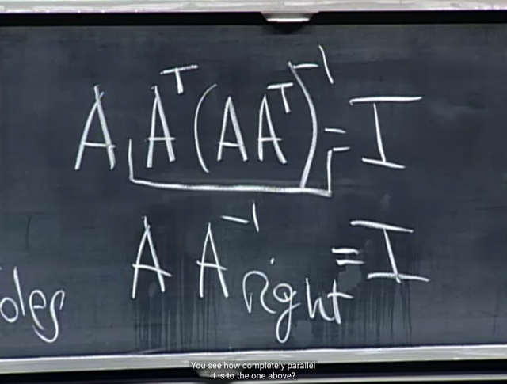</kbd></p>

> [!NOTE]
> gs: correct

<br>

<a id="node-1210"></a>

<p align="center"><kbd>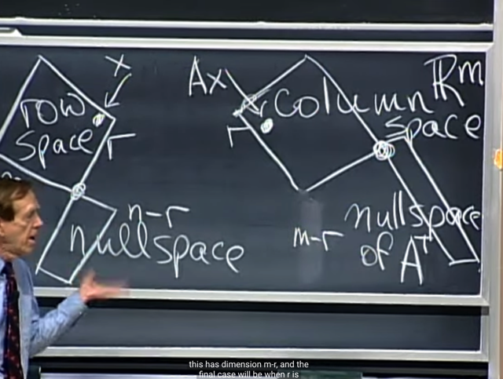</kbd></p>

> [!NOTE]
> và gs nói về nullspace trong 4 trường hợp:
>
> i) **full rank** m `=` n `=` r: cả **nullspace mất** (dim `=` n `-` r `=` 0) và
> **left nullspace mất**(dim `=` m `-` r `=` 0) (chỉ có zero)
>
> ii)**full column rank** n `=` r < m: **nullspace mất** (dim `=` n `-` r `=` 0),
> còn left nullspace (dim `=` `m-r` > 0)
>
> iii) **full row rank** m `=` r < n: **left nullspace mất** (dim `=` `m-r` `=` 0),
> còn nullspace (dim `=` n `-` r > 0)
>
> iv) k**hông có full rank gì** cả: r < m, r < n: **nullspace và left
> nullspace đều còn**

<br>

<a id="node-1211"></a>

<p align="center"><kbd>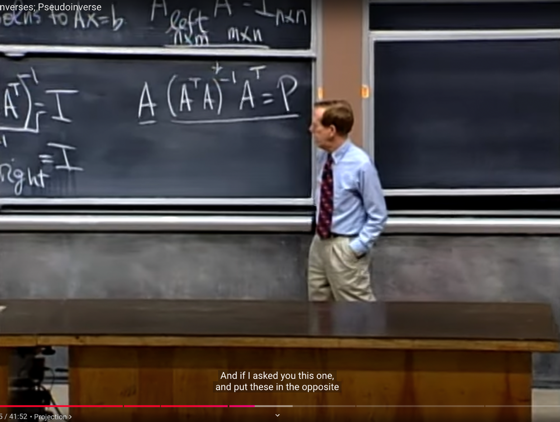</kbd></p>

> [!NOTE]
> đại khái là như hồi nãy nói, ta khôngthể có I khi đặt left
> inverse vào bên phải A, được. Nhưng vẫn nhân được,
> và matrix mà ta có **CHÍNH LÀ PROJECTION (ONTO
> C(A)) MATRIX**
>
> Gs gọi nó là "**try to be Identity"**Lập luận lại như sau:
>
> Project b on C(A), thành p, nên p thuộc C(A) `=>` có thể
> express p bởi linear combination of A's columns: p `=`
> ```text
> Ax^. e = b - p sẽ vuông góc với C(A) => ATe = 0 mang
> ```
> ý nghĩa e vuông góc với mọi row của AT, tức column
> của A (điều này cũng cho thấy e chính là thuộc left
> nullspace của A, như đã biết là solution của `ATy=0)`
>
> Vậy `AT(b-Ax^)` `=` 0  (Đây chính là NORMAL EQUATION)
>
> `<=>` ATb `=` ATAx^ 
>
> `<=>` x^ `=` (ATA)_invATb
>
> ```text
> và p = Ax^ = A(ATA)invATb => P = A(ATA)invAT là
> ```
> matrix giúp projection b lên C(A) để p `=` Pb thuộc C(A)
>
> Khi A invertible thì (ATA)inv sẽ bằng Ainv(AT)inv (dựa
> trên tính chất (AB)inv `=` BinvAinv) từ đó P `=` A(ATA)invAT
> `=` AAinv(AT)invAT `=` I.I `=` I tức là projection lên C(A) không
> cần làm gì. 
>
> Có thể hiểu lí do ra vậy là vì khi A invertible tức full rank,
> thì C(A) chính là toàn bộ R^m, nên b thuộc R^m thì nó đã
> thuộc C(A) rồi, dẫn đến projection lên C(A) chả phải làm gì
>
> Đó cũng chính là ý gs khi nói "try to be Identity"

<br>

<a id="node-1212"></a>

<p align="center"><kbd>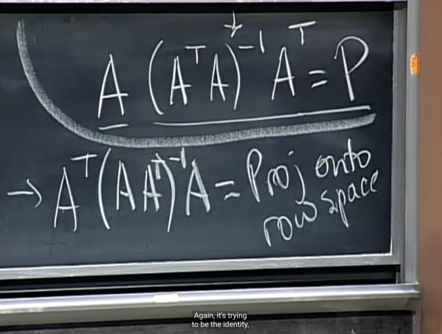</kbd></p>

> [!NOTE]
> và tương tự, nếu ta để right inverse bên trái
> A, thì ta sẽ có **PROJECTION ONTO ROW
> SPACE C(AT) MATRIX**

<br>

<a id="node-1213"></a>

<p align="center"><kbd>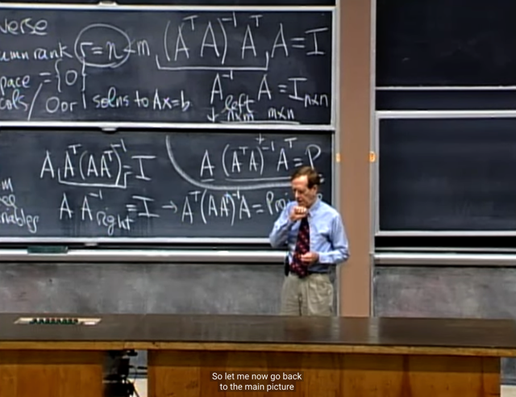</kbd></p>

> [!NOTE]
> Gs chia sẽ một chút về Linear Algebra là đối với ông nó
> không dễ nhưng nó sao đó trở nên rất đúng, khác với
> các mảng toán khác như tích phân.

<br>

<a id="node-1214"></a>

<p align="center"><kbd>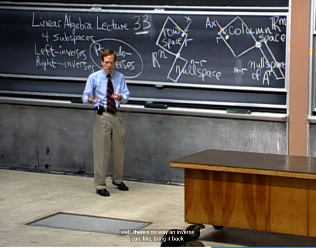</kbd></p>

> [!NOTE]
> gs đặt vấn đề là, ta có thể thấy với **trường hợp bình
> thường** khi ta **không có full `row/columns` rank** gì cả (r < n,
> r < m) thì ta có thể hiểu **sự tồn tại của nullspace và left
> nullspace cản trở sự tồn tại của inverse**.
>
> Vì **bản chất inverse** là khi ta có thể **đảo ngược lại quá
> trình transform bởi matrix A**, ví dụ với trạng thái A full rank:
>
> Thì **không có x khác 0 nào mà Ax `=` 0** cả, tức là Ax luôn
> khác 0 với mọi x khác 0. Và trong trạng thái này **luôn có thể
> khôi phục lại để từ Ax cho ra lại x** thông qua quy trình đảo
> ngược, thể hiện **bằng việc nhân với matrix A_inv**: `A_invAx`
> `=` x
>
> Hay khi A full column rank, thì cũng vậy, **không có x trong
> R^n (cũng là rows space**, vì đủ independent row để span
> R^n) khác 0 nào **bị biến thành 0**: Ax khác 0 với mọi x khác
> 0. Nên **luôn có thể đảo ngược lại quá trình từ Ax `->` x**, thể
> hiện qua việc dùng matrix **A_left inverse** `=` (ATA)invAT
>
> **A_left_inverse Ax `=` x: (ATA)invATAx `=` Ix `=` x**

<br>

<a id="node-1215"></a>

<p align="center"><kbd>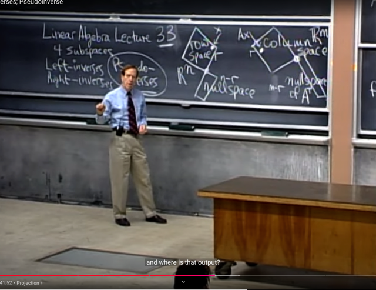</kbd></p>

> [!NOTE]
> gs: tôi lấy vector **x trong rowspace**, nhân
> với A (Ax) thì output tôi có gì?
>
> me: **Ax sẽ nằm trong column space C(A)**

<br>

<a id="node-1216"></a>

<p align="center"><kbd>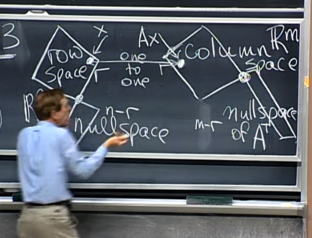</kbd></p>

> [!NOTE]
> đúng vậy, ta có một **quan hệ mapping 1-1**: **MỌI
> VECTOR TRONG ROWSPACE ĐỀU MAP VỚI MỘT
> VECTOR TRONG COLUMN SPACE**. Bởi lẽ rowspace và
> columnspace đều có dimension là rank r
>
> Hoàn toàn dễ hiểu điều này, vì có r pivot thì cũng là r pivot
> row `(=` r independent rows, r vector trong basis của
> rowspace `=` dimension của rowspace) và cũng là  r pivot
> columns ( `=` r independent columns, r vector trong basis
> của columns space `=` dimension của columns space)

<br>

<a id="node-1217"></a>

<p align="center"><kbd>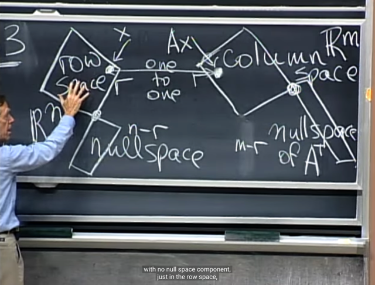</kbd></p>

> [!NOTE]
> gs: đại khái là với mọi vector trong **R^n**, ta có thể có 3 loại: 
>
> đám nằm t**rong rowspace**, như đã nói sẽ được **biến vào
> columns space.**
>
> đám nằm t**rong nullspace** sẽ được biến **thành zero**.
>
> và đám nằm**ngoài rowspace và nullspac**e thì A sẽ**triệt
> đi phần nằm trong nullspace của nó**, phần còn lại cũng
> đưa về columns space.

<br>

<a id="node-1218"></a>

<p align="center"><kbd>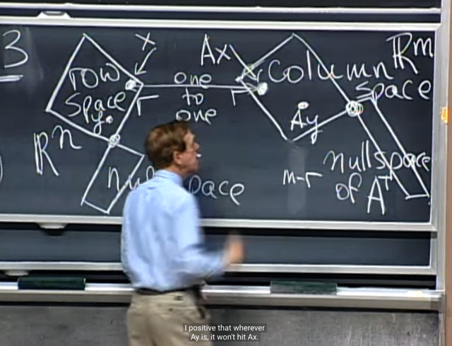</kbd></p>

> [!NOTE]
> và nếu ta **có y khác x nằm trong rowspace** thì gs cho
> rằng ta có thể tự tin rằng **Ay cũng nằm trong
> columnspace nhưng sẽ không trùng Ax.**
>
> me: Thử suy nghĩ xem tại sao: Là vì, **nếu tồn tại y khác x
> trong rowspace mà Ay `=` Ax** thì có nghĩa là **A(y-x) `=` 0**,
> điều này có nghĩa là**y-x nằm trong nullspace**, trong khi
> đó đã nói x**và y đều nằm trong rowspace** thì `y-x` **cũng
> nằm trong rowspace**, nó **chỉ có thể vừa nằm trong
> rowspace vừa nằm trong nullspace** nếu **nó là zero**, tức
> y `=` x, mà điều này ngược với điều kiện ban đầu

<br>

<a id="node-1219"></a>

<p align="center"><kbd>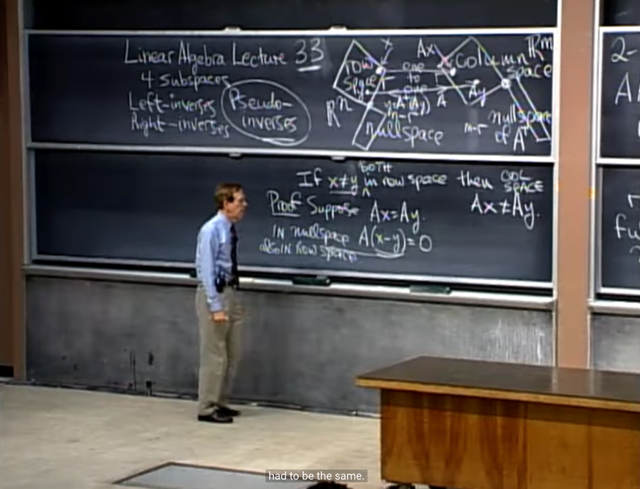</kbd></p>

> [!NOTE]
> gs: chính xác là như vậy, **chỉ khi nào `x-y` là zero** thì nó
> mới v**ừa nằm trong rowspace vừa nằm trong
> nullspace**. mà điều này không thể do đã nói x khác y

<br>

<a id="node-1220"></a>

<p align="center"><kbd>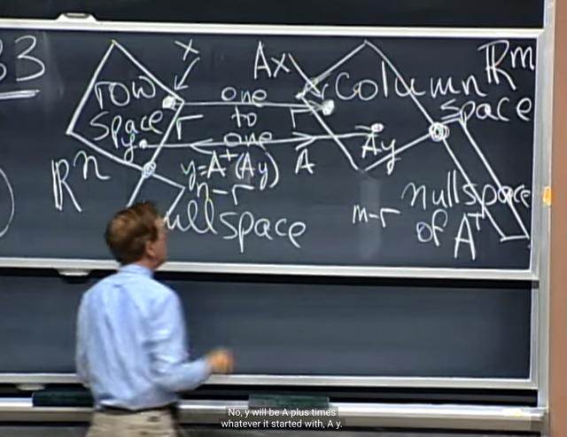</kbd></p>

> [!NOTE]
> gs: nếu ta C**HỈ XÉT TRONG PHẠM VI ROWSPACE  VÀ
> COLUMNSPACE**, thì ta có trạng thái mapping `1-1` hoàn
> hảo. mỗi vector trong rowspace đều được biến thành một
> vector trong columns space thông qua A, và Ax trong
> columnspace luôn có thể biến ngược lại thành x trong
> rowspace thông qua matrix gọi là **pseudo-inverse A+**Và ta sẽ thấy rằng: **matrix A sẽ CHỈ KILL NHỮNG VECTOR
> TRONG NULLSPACE**, cũng như **A+ SẼ CHỈ KILL NHỮNG
> VECTOR TRONG LEFT NULLSPACE**
>
> (Kill ý là map thành zero)

<br>

<a id="node-1221"></a>

<p align="center"><kbd>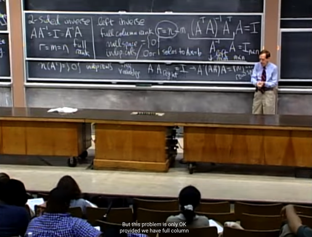</kbd></p>

> [!NOTE]
> đại khái là gs nói về lí do **tại sao `pseudo-inverse` quan trọng**.
> Là bởi vì những nhà statistician khi quan tâm đến việc giải
> bài toán linear regression thì khi giải bài toán với least
> square.
>
> Ôn lại tí về việc dùng Projection để solve least square
> ```text
> problem. Ax = b. b = p + e = Ax^ + e <=> e = b - Ax^ ATe = 0
> ```
> ```text
> <=> AT(b-Ax^) = 0 <=> ATb - ATAx^ = 0 <=> ATb = ATAx^
> ```
> ```text
> <=> x^ = (ATA)inv ATb -> đây là best solution to Ax = b. Và
> ```
> như vậy **x^** chính là **A_left_inverse*b**
>
> Thế thì đại khái là gs nói rằng, nhiều khi việc lặp lại các phép
> đo đạc khiến statistician có một**matrix A không full column
> rank**, tức **không có các column independent**. Mà như
> vậy thì **ATA  không invertible** như ta đã biết, khiến **không
> thể có ATA_inv** để mà có x^ `=` (ATA)inv ATb như trên được.

<br>

<a id="node-1222"></a>

<p align="center"><kbd>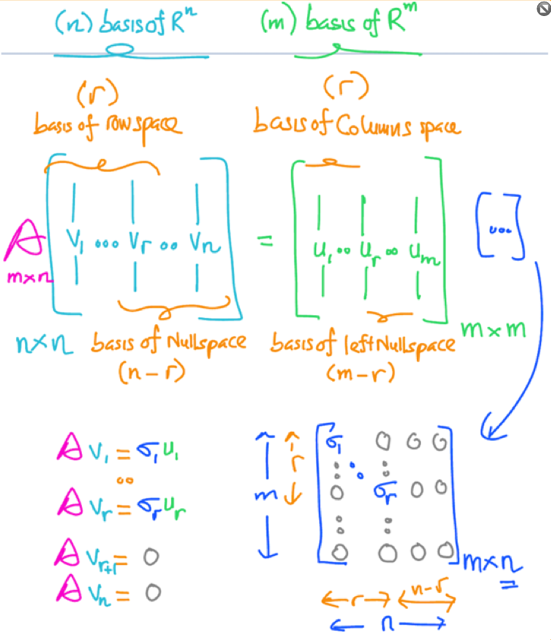</kbd></p>

<p align="center"><kbd></kbd></p>

<p align="center"><kbd>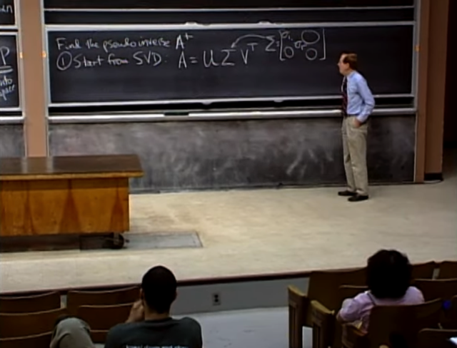</kbd></p>

> [!NOTE]
> gs nói qua việc tìm **pseudo inverse A+**. Thì **có nhiều cách**,
> cách thứ nhất là dùng SVD
>
> Bài trước ta biết A bất kì đều có thể factorized thành
> USigmaVT với U và V là orthogonal matrices, Sigma là
> diagonal matrix có các stretching factor như vầy,

> [!NOTE]
> Nhìn lại hình này, có thể hiểu matrix Sigma chính
> là như gs viết. Ông hỏi rank của nó là bao nhiêu?
>
> me: đương nhiên là r

<br>

<a id="node-1223"></a>

<p align="center"><kbd>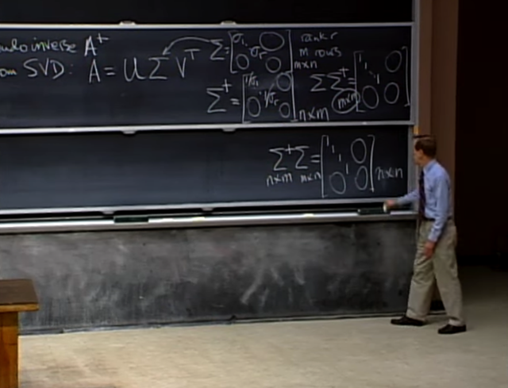</kbd></p>

> [!NOTE]
> ```text
> với Σ thì ta có pseudo-inverse của nó Σ+ là như vầy. Nhân
> ```
> vào bên trái của `Σ` thì được nxn matrix. Nhân vào bên phải
> thì được mxm matrix mà theo gs là ta được **dạng gần nhất
> với Identity**.
>
> Và như nãy có nói, `Σ` thuộc dạng **không full rank**, nên nó sẽ
> **kill nullspace** (map nullspace vector thành zero) và **map row
> space về column space**
>
> Ngược lại `Σ+` sẽ **map vector left nullspace thành zero**, và
> **map vector trong column space về row space**.

<br>

<a id="node-1224"></a>

<p align="center"><kbd>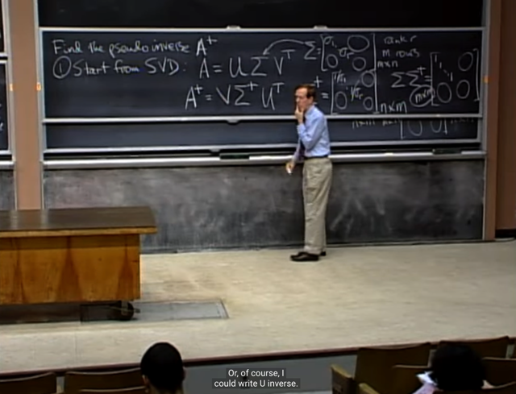</kbd></p>

🔗 **Related:** [LECTURE 17: ORTHOGONAL MATRICES AND GRAM-SCHMIDT](untitled.md#node-536)

> [!NOTE]
> và công thức của **pseudo inverse** of A: `A+` `=` `VΣ+UT`
>
> (nhớ rằng U và V là orthogonal matrix nên inverse chính là
> transpose `-` nhớ rằng orthogonal matrix là matrix square có
> các columns orthonormal, chứ chỉ orthonormal columns thôi
> thì chưa đủ, phải square nữa. Khi đó QTQ `=` I `=` QQT, nên
> QT chính là Qinv)

<br>

<a id="node-1225"></a>

<p align="center"><kbd>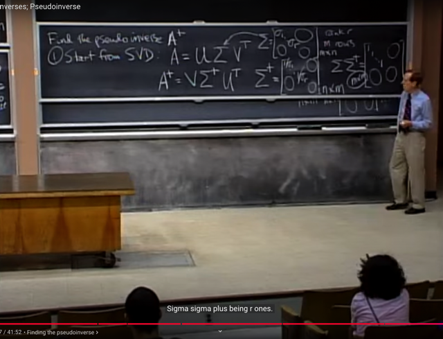</kbd></p>

> [!NOTE]
> và theo gs đại khái **đây là giải pháp khi least square fail** vì
> **ATA không full rank (khi các columns không independent)**

<br>

<a id="node-1226"></a>

<p align="center"><kbd>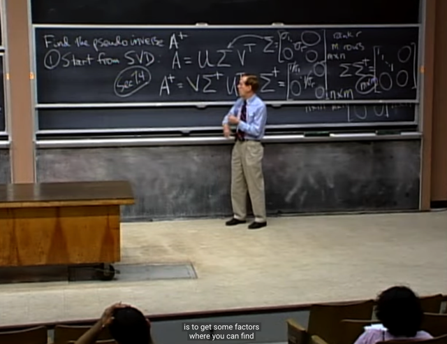</kbd></p>

> [!NOTE]
> gs đề nghị đọc thêm trong sách. Đây là một cách trong
> nhiều cách để tìm pseudo inverse `A+` và có thể coi là
> cách dễ nhất khi có thể dễ dàng phân tách A thành U
> Sigma V Nhờ ATA và AAT như bài trước đã biết, sau đó
> tính pseudo inverse của Sigma, U, V cũng dễ dàng luôn

<br>

