# Lecture 34: Final Course Review

📊 **Progress:** `32` Notes | `35` Screenshots

---
<a id="node-1228"></a>

<p align="center"><kbd>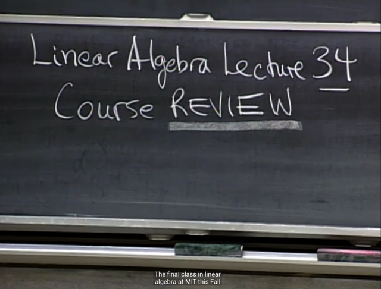</kbd></p>

<br>

<a id="node-1229"></a>

<p align="center"><kbd>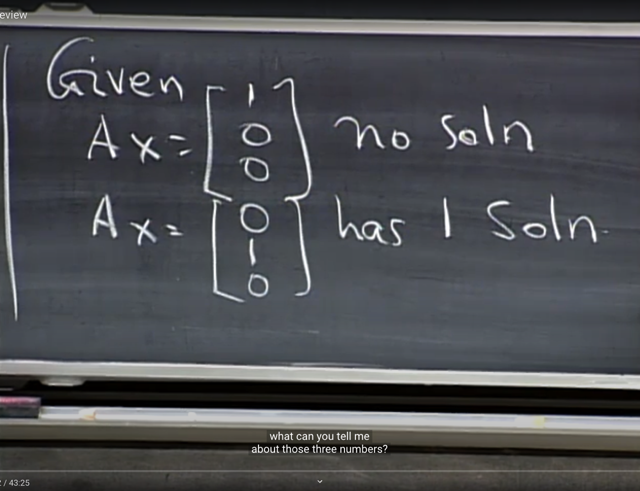</kbd></p>

> [!NOTE]
> Gs: Quan hệ của m, n, r như thế nào?
>
> Me: vì Ax `=` [1 0 0]T no solution `->` (1,0,0) nằm ngoài C(A). Và
> ngược lại vì Ax `=` (0 1 0) có 1 solution nên (0,1,0) nằm trong
> C(A).
>
> C(A) là subspace của **R^m `=` R^3**. Mà không span hết R^3
> chứng tỏ dim C(A) < 3 hay**r < m**,
>
> Tuy nhiên vì Ax `=` [0 1 0] chỉ có 1 solution. Chứng tỏ nullspace
> chỉ có {0} bởi lẽ solution của Ax `=` b có solution là `x_null` `+`
> `x_particular.` Và `x_null` thuộc nullspace.
>
> Vậy dim N(A) `=` 0, mà dim N(A) `+` dim C(AT) `=` n <=>**0 `+` r `=` n**
> Vậy ta có **r `=` n**
>
> Kết luận: r `=` n < m: Đây là matrix full column rank.

<br>

<a id="node-1230"></a>

<p align="center"><kbd>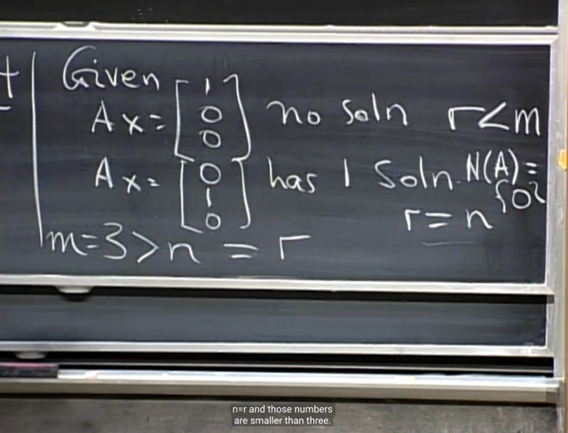</kbd></p>

> [!NOTE]
> gs: Correct

<br>

<a id="node-1231"></a>

<p align="center"><kbd></kbd></p>

> [!NOTE]
> gs đề nghị ta lấy ví dụ matrix A như vậy. gs vector nào ta sẽ
> muốn có trong C(A)?
>
> me: [0 1 0] vì đã nói nó phải ở trong C(A) thì equation 2 mới có
> solution

<br>

<a id="node-1232"></a>

<p align="center"><kbd></kbd></p>

> [!NOTE]
> gs: correct, và ông cho rằng ta có thể dừng ở đây để có
> matrix A là 1 column matrix hoàn toàn thỏa m `=` 3 > n `=` r. với
> [0 1 0] thuộc C(A) và [1 0 0] thì không

<br>

<a id="node-1233"></a>

<p align="center"><kbd></kbd></p>

> [!NOTE]
> Hoặc cũng có thể cho
> col2 là thế này

<br>

<a id="node-1234"></a>

<p align="center"><kbd>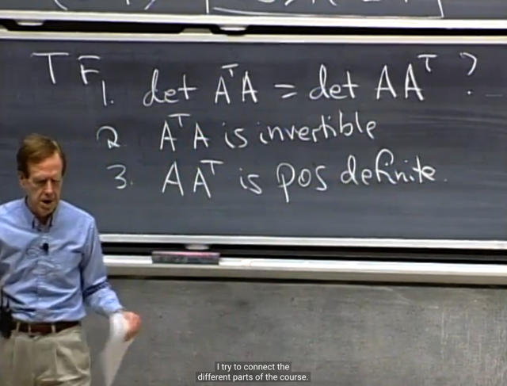</kbd></p>

> [!NOTE]
> Tiếp theo là 3 câu TF này. Thử trả lời câu 2 trước:
>
> Ta đã biết ATA invertible `/` `full-rank` nếu A `full-column`
> rank. Và điều này đã được chứng minh  nhiều lần
> trong các bài trước.
>
> Và ở case này ta đã có full column rank nên Yes, ATA
> full rank
>
> Chứng minh lại như sau: Giả sử A full column rank,
> tức nullspace của nó chỉ có {0}, hay các cols độc lập.
> Khi đó Ax `=` 0 không có nghiệm khác 0.
> Nhân hai vế cho AT ta cũng sẽ có ATAx `=` 0 không có
> nghiệm khác 0, tức, nullspace của ATA cũng chỉ có {0}
>
> Mà ATA square, nên suy ra ATA `full-rank.`

<br>

<a id="node-1235"></a>

<p align="center"><kbd>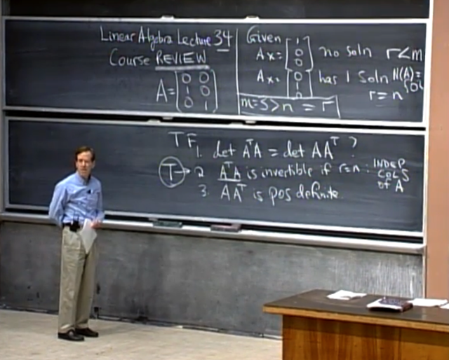</kbd></p>

> [!NOTE]
> Gs: Correct. Và ATA ở đây là gì?
>
> Me: Identity 2x2

<br>

<a id="node-1236"></a>

<p align="center"><kbd>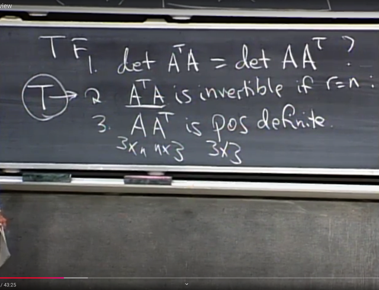</kbd></p>

> [!NOTE]
> Ý thứ 3: AAT có positive definite không?
>
> me: Thử lập luận như sau: ta sẽ check xem liệu quadratic form
> của nó tức xT(AAT)x có luôn dương với x khác 0 hay không?
> Nếu có thì kết luận là AAT positive definite mà khỏi cần biết pivot,
> eigenvalues hay subdet.
>
> Thế thì xTAATx `=` xT(ATT)(ATx) `=` (ATx)T(ATx). Đặt ATx là u thì
> quadratic form là length của u.
>
> Câu hỏi sẽ trở thànhlà ATx có luôn khác không với x khác 0 hay
> không, và điều này tương đương câu hỏi left nullspace của A có
> vector khác 0 nào không (vì nếu có, thì nó chính là `non-zero`
> solution của ATx `=` 0)
>
> Thế thì câu trả lời đã rõ, vì r < m, nên tồn tại non zero vector của
> Rm bị biến thành 0, và đó chính là vector trong left nullspace.
> Hay trả lời cách khác, vì r < m, nên tồn tại dependent row, nó
> cũng chính là dependent column của AT, tạo nên một special
> solution của ATy `=` 0 `->` 1 vector trong basis của N(AT)
>
> Vậy kết luận: Tồn tại vector khác 0 khiến ATx `=` 0 tức là tồn tại
> vector khác 0 khiến quadratic form của AAT bằng 0, suy ra nó
> **KHÔNG POSITIVE DEFINITE.**

<br>

<a id="node-1237"></a>

<p align="center"><kbd>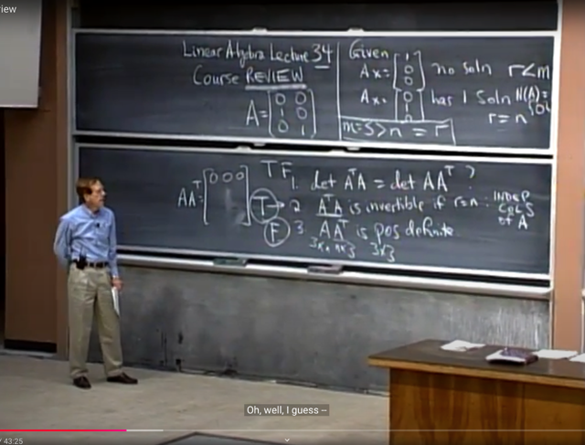</kbd></p>

> [!NOTE]
> gs: Đúng, nếu nó chỉ POSITIVE `SEMI-DEFINITE`
> (dễ hiểu vì quadratic form như đã thấy có thể chứng
> minh được là luôn không âm : uTu luôn không âm).
>
> gs ko nói rõ, nhưng chỉ nói là ta có thể tính thử AAT
> và thấy ngay trong ví dụ này AAT có 1 row là 0.
> Mà từ đó thì suy ra ngay det của nó bằng 0 (vì ta có
> tính chất matrix có row hay col bằng 0 thì det `=` 0)
> Và matrix có det `=` 0 thì không thể Positive definite.
> Vì det phải luôn dương mới được.
>
> Và từ đây ta trả lời ý 1: False. Vì **det AAT `=` 0** như mới
> nói, trong khi ATA full rank, nên nullspace chỉ có {0}
> dẫn đến không có eigenvalue nào bằng 0 khiến det
> khác 0 (có thể nói ngắn gọn là `non-singular` matrix 
> thì **det khác 0**)

<br>

<a id="node-1238"></a>

<p align="center"><kbd>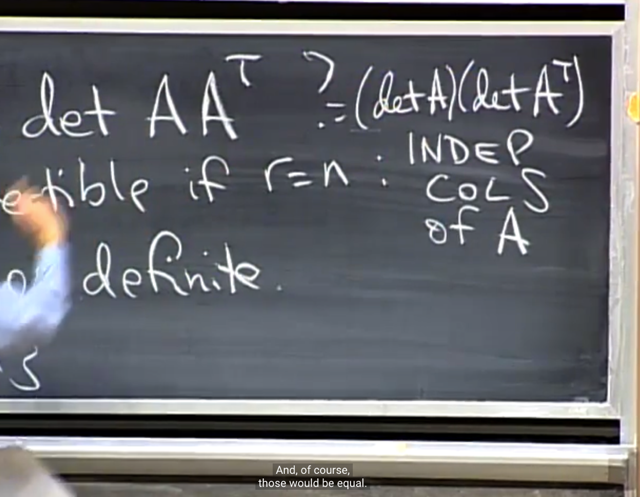</kbd></p>

> [!NOTE]
> Gs: Và đây là câu hỏi mà ta có thể trả lời ngay từ đầu,
> vì **det của AAT chỉ bằng det ATA khi A square.**
>
> Bởi lẽ ta có det AB `=` detA * detB nên chỉ khi A square
> thì det A và det AT mới tồn tại để det A * det AT `=` det
> AAT `=` det AT * det A `=` det ATA

<br>

<a id="node-1239"></a>

<p align="center"><kbd>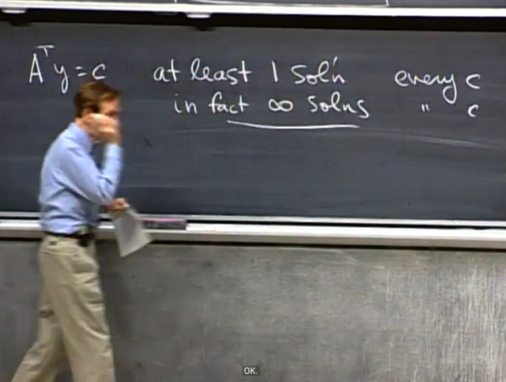</kbd></p>

> [!NOTE]
> me: Như đã nói, vì r < m, nên tồn tại dependent row (chỉ
> có r independent row `-` pivot row, mà có tới m row).  Thì ứng với
> mỗi row trong m `-` r dependent row, chính là ..(2 cách giải thích)
>
> i)...dependent `/` free column của AT, ứng với một special solution
> của ATy `=` 0 `->` ta có m `-` r vector trong basis của left nullspace N(AT)
>
> ii) tạo nên một bộ linear combination của các row cho ra zero,
> đó chính là một solution của ATy `=` 0 `->` Có m `-` r solution, tức left
> nullspace có **dim `=` m `-` r** > 0
>
> Thế thì đó là chứng minh cho thấy left nullspace có vector khác 0.
>
> Tiếp, xét matrix AT, có m columns là vector trong R^n, trong đó có r 
> columns độc lập. Thế mà ta có n `=` r, vậy r columns độc lập này 
> ĐÃ ĐỦ SPAN TOÀN BỘ R^n. Do đó bất kì vector c thuộc Rn nào 
> đương nhiên cũng thuộc column space C(AT), hay nói cách khác
> ATy `=` c luôn có solution particular với mọi c.
>
> Vậy đã đủ kết luận cả hai ý trên

<br>

<a id="node-1240"></a>

<p align="center"><kbd>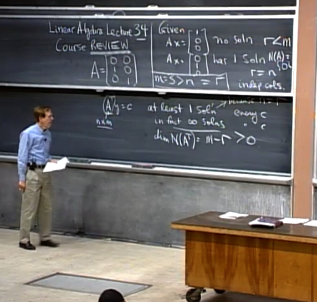</kbd></p>

> [!NOTE]
> gs: correct

<br>

<a id="node-1241"></a>

<p align="center"><kbd>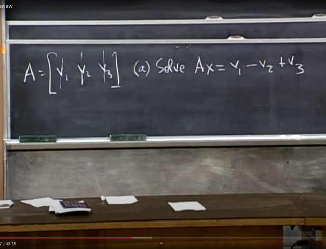</kbd></p>

> [!NOTE]
> Câu hỏi tiếp theo. Cho A với 3 cols v1, v2 , v3.
> Hỏi tìm x khiến Ax `=` như này
>
> Me: Đương nhiên x  `=` [1 `-1` 1] vì Ax là linear
> combination các columns của A

<br>

<a id="node-1242"></a>

<p align="center"><kbd>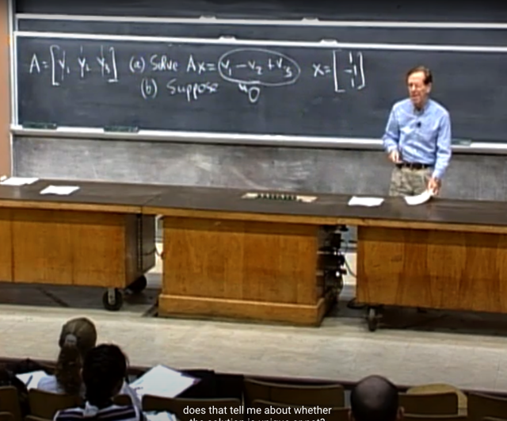</kbd></p>

> [!NOTE]
> Gs: Correct. Câu tiếp, giả sử v1 `-` v2 `+` v3 `=` 0 thì liệu
> solution (của Ax `=` 0) có unique không?
>
> me: Nếu v1 `-` v2 `+` v3 `=` 0, tức là các cols không independent
> và [1 `-1` 1] chính là basis của nullspace.
>
> Đương nhiên x `=` [1 `-1` 1]**không unique**, vì**mọi vector trong
> line này (nullspace) đều là solution của Ax `=` 0**

<br>

<a id="node-1243"></a>

<p align="center"><kbd>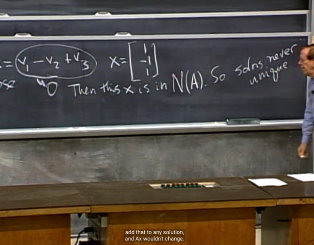</kbd></p>

> [!NOTE]
> Gs: correct

<br>

<a id="node-1244"></a>

<p align="center"><kbd>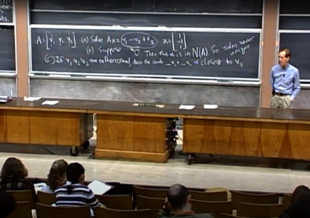</kbd></p>

> [!NOTE]
> gs: c) Nếu v1, v2, v3 orthonormal thì combination nào của v1,
> v2 gần nhất với v3
>
> Me: Lập luận như sau, linear combination của v1, v2 đương
> nhiên nằm trong subspace span bởi v1, v2, gọi  là S12.
>
> Nếu v3 cũng nằm trong subspace này, thì điểm S12 mà  gần
> nhất của v3 đương nhiên là chính nó. Nhưng v1,v2, v3
> orthogonal, do đó v3 perpendicular với hai basis của S12 `->`
> v3 không nằm trong S12, thậm chí, v3 perpendicular với S12.
>
> Thế thì khi v3 không thuộc S12 thì điểm trong S12 gần nhất
> với v3 đương nhiên là projection của v3 lên S12.
>
> Và như đã nói vì v3 vuông góc với S12 nên projection của nó
> lên S12 là zero.
>
> Vậy câu trả lời là linear combination của v1, v2 nào cho ra
> zero. Thì bởi vì v1, v2 là độc lập nhau, nên chỉ có [0, 0] là
> coefficients của combination giữa chúng mà cho ra zero thôi.
>
> Đáp áp: 0*v1 `+` 0*v2

<br>

<a id="node-1245"></a>

<p align="center"><kbd>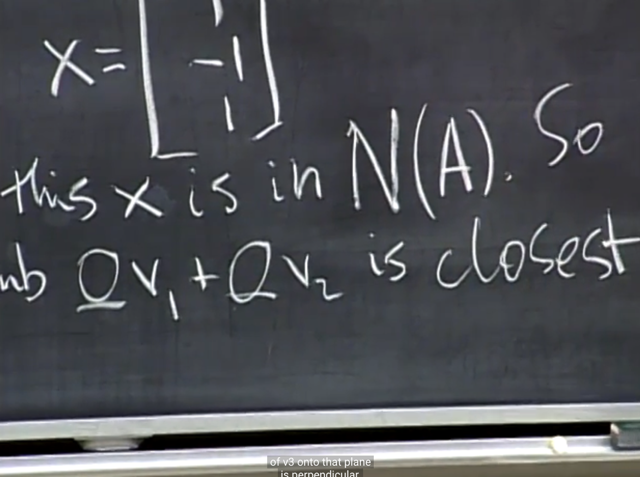</kbd></p>

> [!NOTE]
> gs: Chính xác

<br>

<a id="node-1246"></a>

<p align="center"><kbd>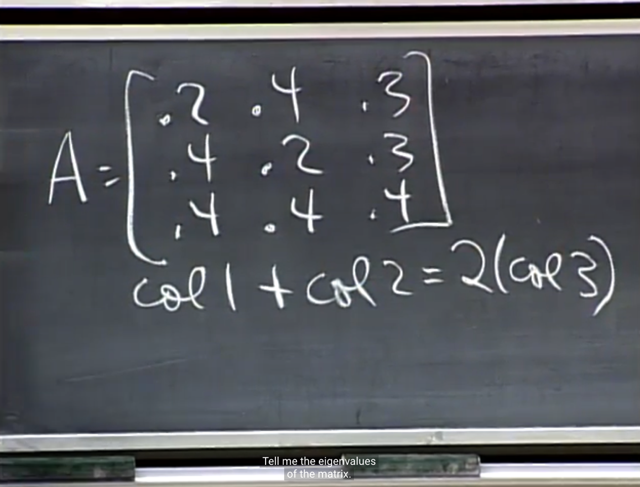</kbd></p>

> [!NOTE]
> Gs: Next. Cho Markov matrix này, eigenvalues là gì?
>
> me: Đầu tiên việc các cols dependent nhau cho ta kết luận ngay
> matrix này singular do đó có**ít nhất một eigenvalue `=` 0**(còn
> bao nhiêu thì phải xét dimension của nullspace)
>
> Điểm thứ hai, ta đã biết Markov matrix có tổng các row bằng 1 nên
> ```text
> row 1 + row 2 + row 3 = 1. Xét AT thì điều này đồng nghĩa col 1 +
> ```
> col 2 `+` col3 `=` 1
>
> Suy ra (AT)[1 1 1]T `=` [1 1 1]T
>
> Và equation trên đã đủ cho thấy **[1 1 1]T là eigenvector  của AT
> với eigenvalue là 1.**
>
> Và ta đã nghe nói ở đâu đó rằng **A và AT có cùng eigenvalues**.
> Có thể chứng minh lại như sau: Giả sử lbd là eigenvalue của A
>
> ```text
> Ax = lbd*x <=> (A-lbd*I)x = 0 có solution là eigenvector x khác 0
> ```
> nên `A-lbd*I` singular. Mà điều đó cũng suy ra `(A-lbd*I)T` cũng
> singular.
>
> ```text
> Nên ta sẽ có (A-lbd*I)Ty = (AT - lbd*I)y  = 0  cũng có non-zero
> ```
> solution
>
> mà điều này cũng tương đương ATy `=` lbd*y, tức là solution y chính
> là eigenvector của AT với eigenvalue lbd.
>
> Từ đó đã chứng minh A và AT có cùng eigenvalue.
>
> `====`
>
> Vậy ít nhất là biết 2 eigenvalue của A là **1 và 0**Và cái thứ 3 thì dựa vào trace `=` tổng entries trên đường chéo `=`
> 0.8 `=` tổng eigenvalues vậy lambda 3 `=` 0.8 `-` 1 `=` `-` **0.2**

<br>

<a id="node-1247"></a>

<p align="center"><kbd>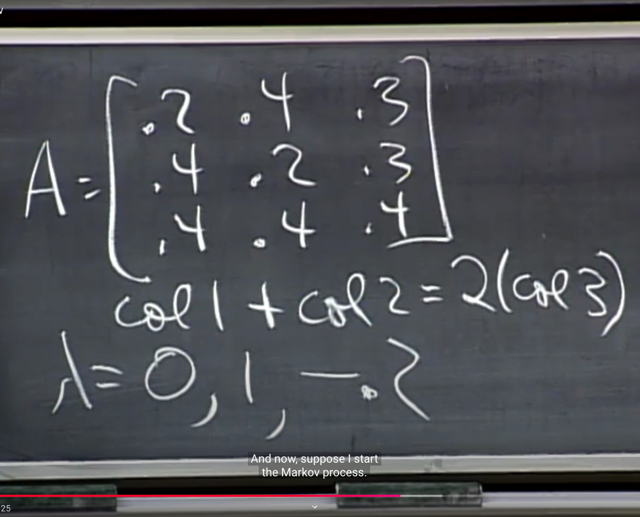</kbd></p>

> [!NOTE]
> Correct

<br>

<a id="node-1248"></a>

<p align="center"><kbd>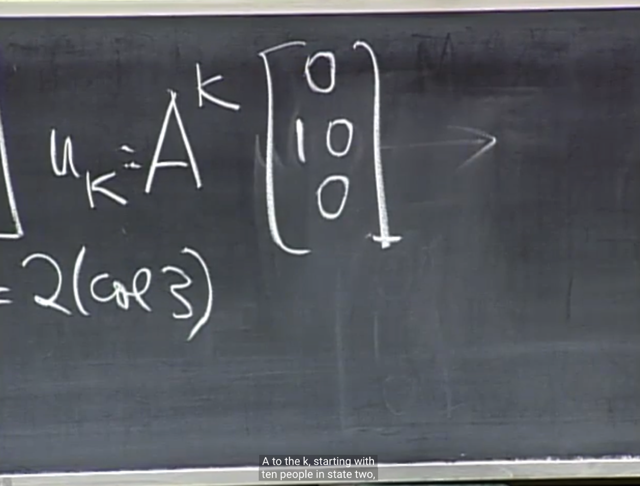</kbd></p>

> [!NOTE]
> gs: Giả sử `u_0` là như thế này, `u_k` sẽ có dạng ntn vào khi k
> lớn vô cùng thì sao
>
> Me: Có thể thấy ngay A đã có 3 independent eigenvectors vì 3
> eigenvalues khác nhau. Cho phép diagonalization:
>
> A `=` S.Λ.Sinv
>
> ```text
> => A^2 = AA = S.Λ.SinvS.Λ.Sinv  = S.Λ^2Sinv
> ```
>
> và A^k `=` S.Λ^k.Sinv
>
> ```text
> Với u_0  = u_0 = Sc (vì 3 eigenvectors của A độc lập, nên span
> ```
> toàn bộ R^3, cho phép luôn có thể tìm dc c để linear combination
> các eigenvectors cho ra `u_0)`
>
> Nên u `=` `A^ku_0` `=` S.Λ^k.Sinv Sc `=` **S.Λ^k*c**Gọi x1, x2, x3 là 3 eigenvector tương ứng thì ta có
>
> u `=` c1*λ1^k*x1 `+` c2*λ2^k*x2 `+` c3*λ3^k*x3
>
> `=` c1***0**^k*x1 `+` c2***1**^k*x2 `+` c3***-0.2**^k*x3
>
> Thế thì uk `=` c2*x2 `+` `c3*(-0.2^k)*x3`
>
> và **u_infinity `=` c2x2**

<br>

<a id="node-1249"></a>

<p align="center"><kbd>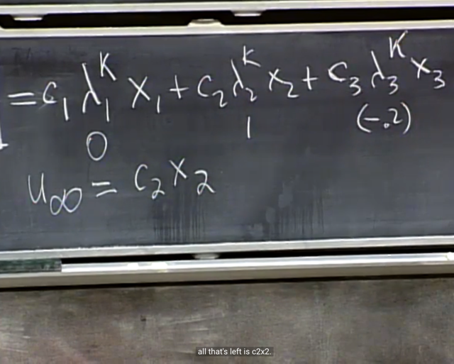</kbd></p>

> [!NOTE]
> gs: correct. Vậy thì ta sẽ cần tìm x2, c2. eigenvector gắn
> với eigenvalue `=` 1 là gì
>
> me: Ta sẽ giải characteristic equation thôi.

<br>

<a id="node-1250"></a>

<p align="center"><kbd>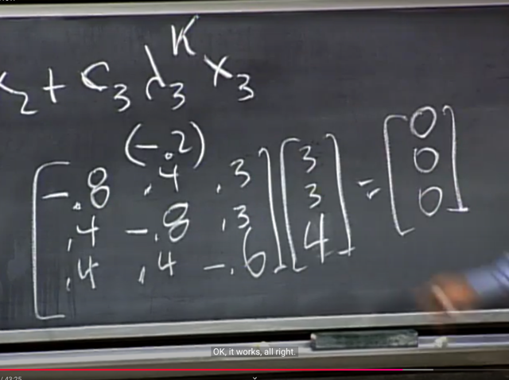</kbd></p>

> [!NOTE]
> Và ta thế eigenvalue vào A `-` lambda*I và giải equation (A `-`
> lambda*I)x `=` 0 (lambda `=` 1)
>
> Đoạn này gs mò đại hên quá ra đúng một solution. Chứ ko
> thì ta phải dùng elimination.
>
> Từ đó ta có x2

<br>

<a id="node-1251"></a>

<p align="center"><kbd>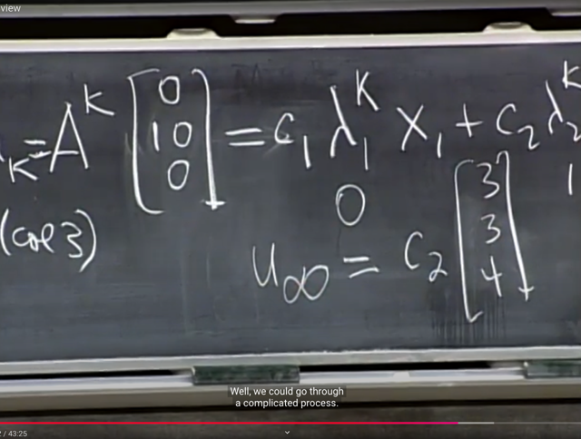</kbd></p>

> [!NOTE]
> Tiếp ta sẽ tìm c2 nhưng gs cho biết cái hay của Markov là
> nó bảo toàn tổng các cols bằng 1, nên vì [3 3 4] đã có tổng
> bằng 1 nên ông suy ra luôn c2 `=` 1

<br>

<a id="node-1252"></a>

<p align="center"><kbd></kbd></p>

> [!NOTE]
> Next quiz. Projection formula onto a?
>
> me: `aaT/aTa,` việc xây dựng công thức này tương đối
> dễ và đã làm nhiều lần nên khỏi lập luận lại

<br>

<a id="node-1253"></a>

<p align="center"><kbd>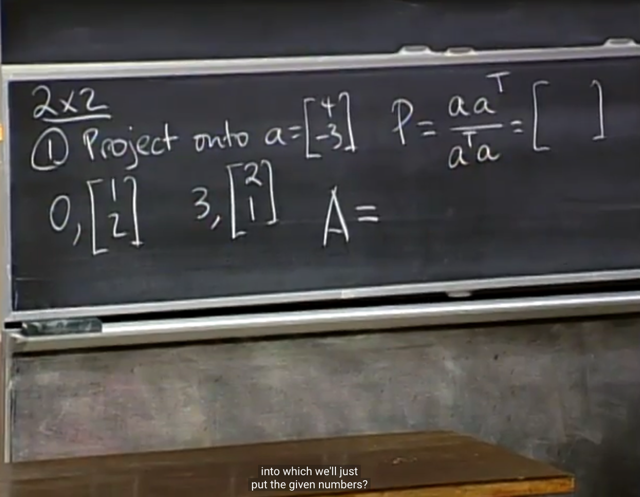</kbd></p>

> [!NOTE]
> A[2 1] `=` [6 3],
>
> A[1 2] `=` [0 0]

<br>

<a id="node-1254"></a>

<p align="center"><kbd>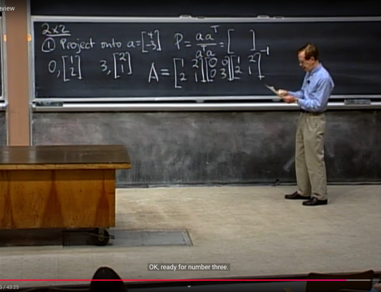</kbd></p>

> [!NOTE]
> rất dễ, chỉ cần lắp vào A `=` SΛSinv

<br>

<a id="node-1255"></a>

<p align="center"><kbd>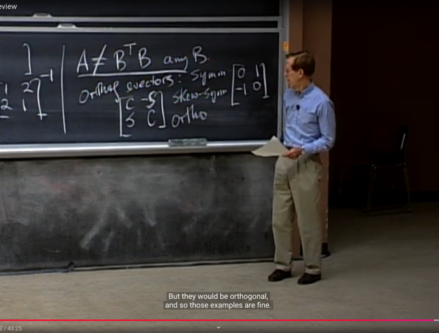</kbd></p>

> [!NOTE]
> đến mấy câu khá simple, đại khái là
>
> i) tìm matrix A sao cho nó khác BTB với mọi B, thì câu trả
> lời chỉ đơn giản là vì BTB có tính symmetric nên miễn là A
> không symmetric là được.
>
> ii) matrix có orthogonal eigenvector nhưng không
> symmetric thì đơn giản là `anti-symmetric` (là cái có A `=` `-AT)`
> hoặc orthogonal matrix *như đã biết đây là 3 nhóm tiêu
> biểu của loại matrix có tính chất AAT `=` ATA, và có
> eigenvector vuông góc

<br>

<a id="node-1256"></a>

<p align="center"><kbd>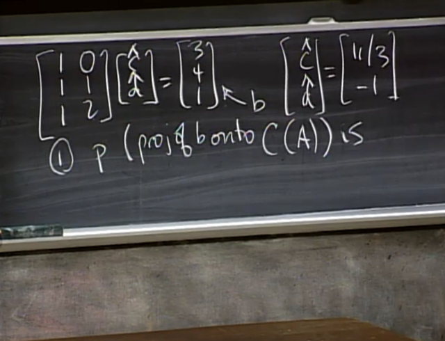</kbd></p>

> [!NOTE]
> Thử trả lời:
>
> ```text
> ATe = 0 <=> AT(b - Ax) = 0 <=> ATb = ATAx
> ```
>
> `<=>` x `=` (ATA inv)ATb
>
> p `=` Ax `=` A(ATA inv)ATb `=` Pb 
>
> **=> P `=` A(ATA inv)AT**

<br>

<a id="node-1257"></a>

<p align="center"><kbd>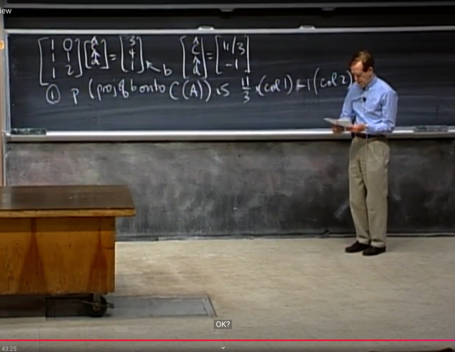</kbd></p>

> [!NOTE]
> thật ra câu hỏi là p `=` Ax^ thì có x^ (tức
> [c^, d^]) thì nhân với A thôi

<br>

<a id="node-1258"></a>

<p align="center"><kbd>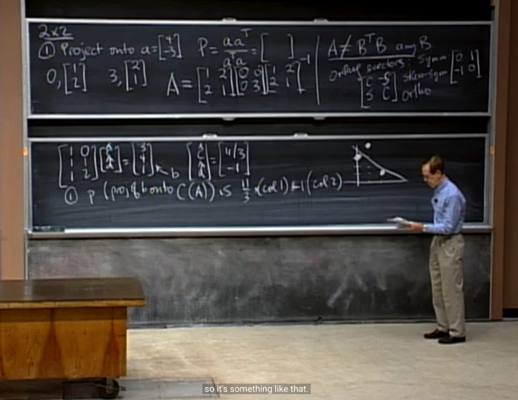</kbd></p>

> [!NOTE]
> câu tiếp theo chỉ yêu cầu vẽ
> ra, ko có gì đáng nói

<br>

<a id="node-1259"></a>

<p align="center"><kbd>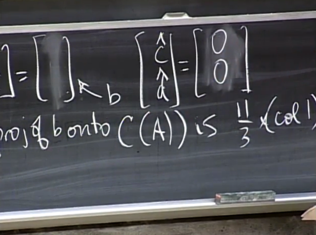</kbd></p>

> [!NOTE]
> câu cuối cùng của MIT1806: Tìm b để
> least square solution x^ `=` [0, 0]
>
> ```text
> me: Để x^ = [0 0] tức là p = 0. Như vậy b = e + p = e
> ```
> Mà ta biết ATe `=` 0, hay e là left nullspace của A, là subspace
> orthogonal complement với rows space of A.
>
> Vậy b nằm trên N(AT) là được.

<br>

<a id="node-1260"></a>

<p align="center"><kbd>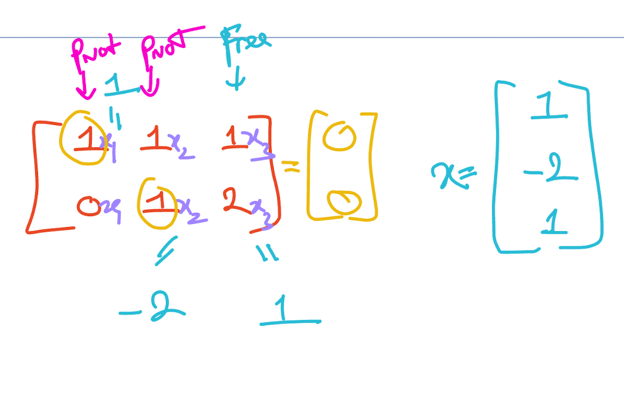</kbd></p>

<p align="center"><kbd></kbd></p>

<p align="center"><kbd>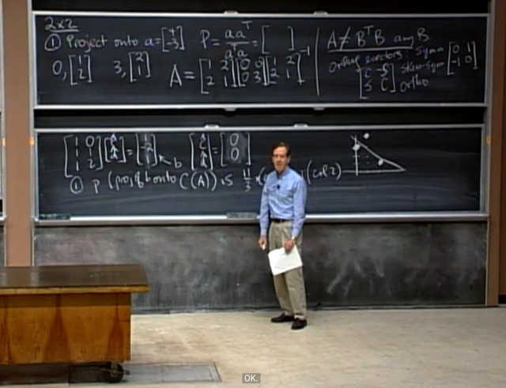</kbd></p>

> [!NOTE]
> gs: Correct, chỉ cần tìm
> basis của N(AT)

<br>

