# Lecture 3: Multiplication And Inverse Matrices

📊 **Progress:** `22` Notes | `25` Screenshots

---
<a id="node-56"></a>

<p align="center"><kbd>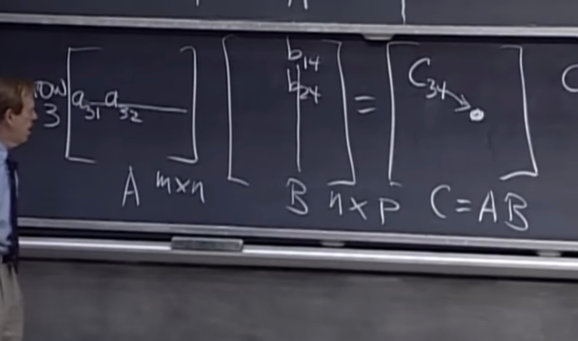</kbd></p>

> [!NOTE]
> Gs nói về cách nhìn thứ 1 khi hiểu về việc **nhân A cho B
> (ra C)**:
>
> Trước tiên phải nói để nhân được thì shape của hai matrix
> phải compatible: **số cột A bằng số hàng B**.
>
> Và theo cách nhìn thứ 1: mỗi entry của C sẽ là kết quả của 
> phép dot product giữa một hàng của A và một cột của B
>
> Ví dụ**C34** sẽ là **dot product** của **hàng 3 của A** và c**ột
> 4 của B**

<br>

<a id="node-57"></a>

<p align="center"><kbd>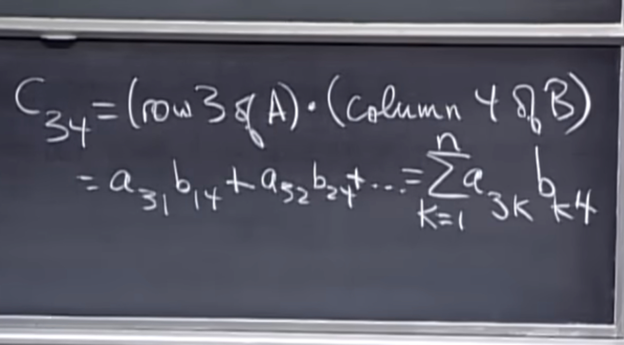</kbd></p>

<br>

<a id="node-58"></a>

<p align="center"><kbd>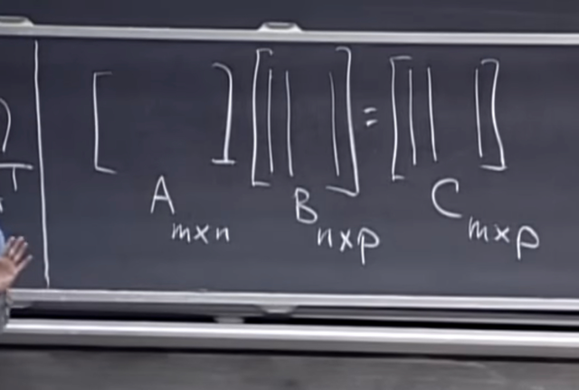</kbd></p>

> [!NOTE]
> Đại ý là gs nói về **một "kiểu" khác khi nghĩ về nhân A cho
> B**, đó là góc nhìn **THEO CỘT**:
>
> **Coi TỪNG CỘT của kết quả C** là kết quả của **phép
> nhân A cho TỪNG CỘT của B**.
>
> Lẽ dĩ nhiên **ta đã biết nhân matrix A cho col vector (một
> cột của B)** là **linear combination của các cột** của A với
> **coeffs là các component của col vector đó**Ví dụ cột 1 của C sẽ là linear combination các cột của A với
> coefficients là cột 1 của B

<br>

<a id="node-59"></a>

<p align="center"><kbd>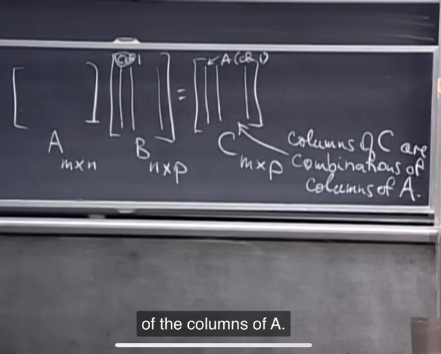</kbd></p>

> [!NOTE]
> Với cách nghĩ này, m**ỗi col của C đều là combination các
> col của A**, còn **coeff** thì là **col B tương ứng**

<br>

<a id="node-60"></a>

<p align="center"><kbd>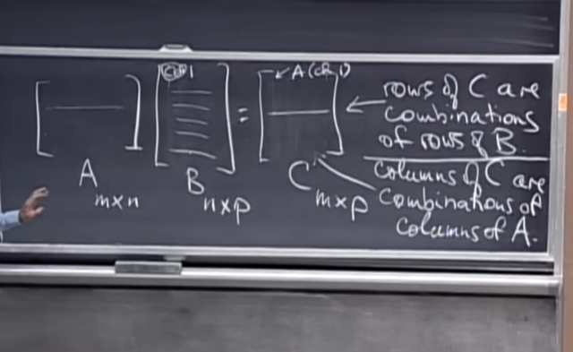</kbd></p>

> [!NOTE]
> Và cách nhìn thứ 3 của nhân A cho B đó là nhìn **THEO
> HÀNG**:**Mỗi row của C** là **linear combination** **các row của
> B** với **coefficients là row tương ứng của A**Ví dụ row 1 của C sẽ là linear combination các row
> của B với coefficients là các components của row 1
> của A

<br>

<a id="node-61"></a>

<p align="center"><kbd>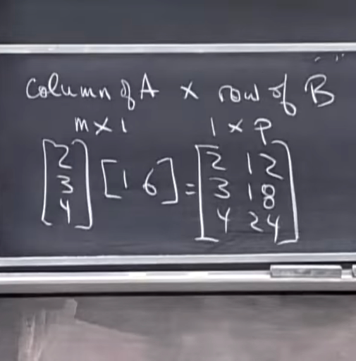</kbd></p>

> [!NOTE]
> Để dẫn dắt vào cách tiếp cận thứ 4, mà gs cho rằng nó
> sẽ là ngược với cách 1. Trong cách 1, mỗi entry của C
> (ví dụ C34) sẽ là dot product của một row của A (row 3)
> và một column của B (col 4)
>
> Thì trong cách nhìn thứ 4, ta sẽ coi phép nhân  matrix
> A và B sẽ là tổng của các matrix "con" được tạo  thành
> bởi việc nhân một CỘT của A với một HÀNG  của B
> (mà sau này ra biết chúng là những matrix có rank `=` 1)
>
> Ví dụ lấy cột 1 của A (shape `=` [m,1]) nhân với hàng 1
> của  B (shape `=` [1,p]), ta được matrix (rank 1, shape
> [m,p])
>
> Ta có thể thấy việc nhân một "cột" và một "hàng" sẽ
> có thể coi như là:
>
> 1) multiple cột với các component của hàng để ra các
> cột của matrix kết quả
>
> 2) multiply hàng với các component của cột để ra các
> hàng của matrix kết quả

<br>

<a id="node-62"></a>

<p align="center"><kbd>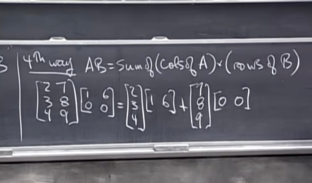</kbd></p>

> [!NOTE]
> Và theo góc nhìn thứ 4 của việc nhân matrix A với B sẽ là:
> **tổng của các matrix con** (rank 1 matrix) tạo bởi việc**[column_i of A nhân `row_i` của B]**

<br>

<a id="node-63"></a>

<p align="center"><kbd>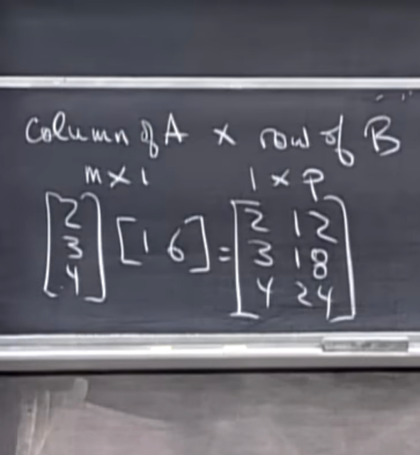</kbd></p>

> [!NOTE]
> Nhận xét chút chỗ này, **các row của matrix con này
> đều là những vector cùng `/` trùng nhau**, đều nằm
> trên đường thẳng của vector [1 6].
>
> Gs gọi nó là the **row space**của matrix này là **một
> line qua vector [1 6]**
>
> Và tương tự the **column space** của matrix này là
> **một line đi qua vector [2 3 4]**

<br>

<a id="node-64"></a>

<p align="center"><kbd>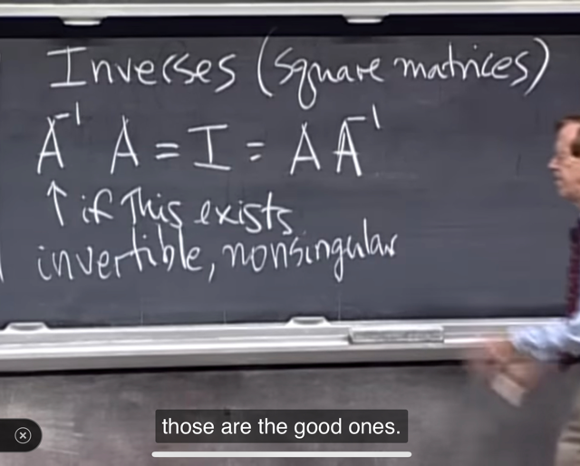</kbd></p>

> [!NOTE]
> Về **inverse matrix** của một matrix A, câu hỏi lớn sẽ là
> **nó tồn tại không**, vào nếu có thì **làm sao tìm được
> nó**.
>
> Với **square** matrix, gs cho biết **nếu `A_inv` tồn tại**
>
> thì **A_inv @ A `=` A @ `A_inv` `=` I**
>
> Với **rectangular matrix** thì **không tồn tại inverse**
>
> (Các bài sau ta sẽ thấy matrix square muốn invertible thì
> nó phải `full-rank,` `non-singular,` tức là `null-space` và left
> nullspace đều phải chỉ có zero vector. Và `non-square`
> matrix sẽ không thể `full-rank,` nên đương nhiên là
> `non-invertible`

<br>

<a id="node-65"></a>

<p align="center"><kbd></kbd></p>

> [!NOTE]
> Gs cho ví dụ về một **singular** (hay **non invertible**)
> matrix. Và đặt câu hỏi là thử suy nghĩ xem tại sao nó
> **non-invertible.**

<br>

<a id="node-66"></a>

<p align="center"><kbd>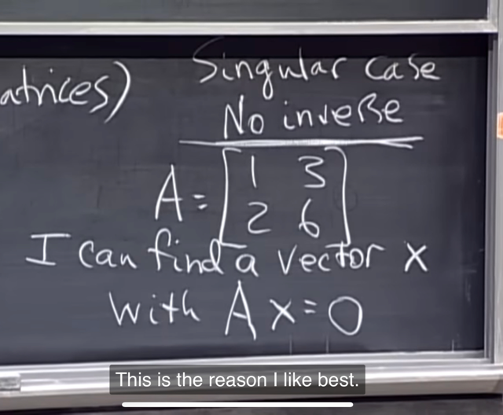</kbd></p>

> [!NOTE]
> Thì gs cho biết **có nhiều cách để trả lời câu hỏi này,**
> nhưng **cách quan trọng nhất** là ta**luôn có thể tìm được
> một `non-zero` vector x sao cho Ax `=` 0.**

<br>

<a id="node-67"></a>

<p align="center"><kbd>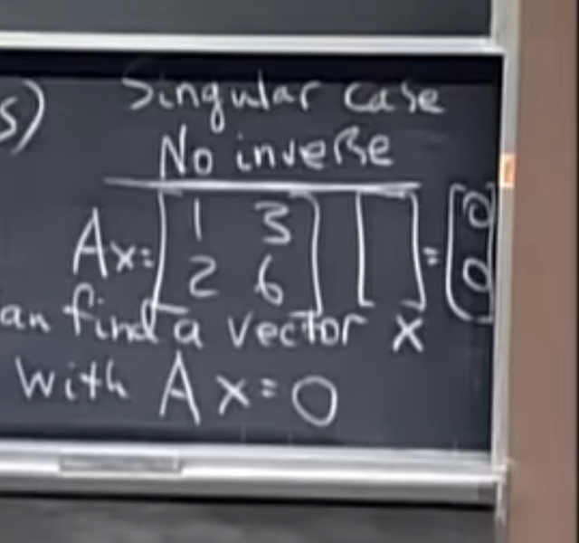</kbd></p>

> [!NOTE]
> Dễ thấy nó là `[-3,` 1], nhớ việc **nhân A với một col** là
> **linear combination của các col của A** với **coeff là
> unit của x**

<br>

<a id="node-68"></a>

<p align="center"><kbd>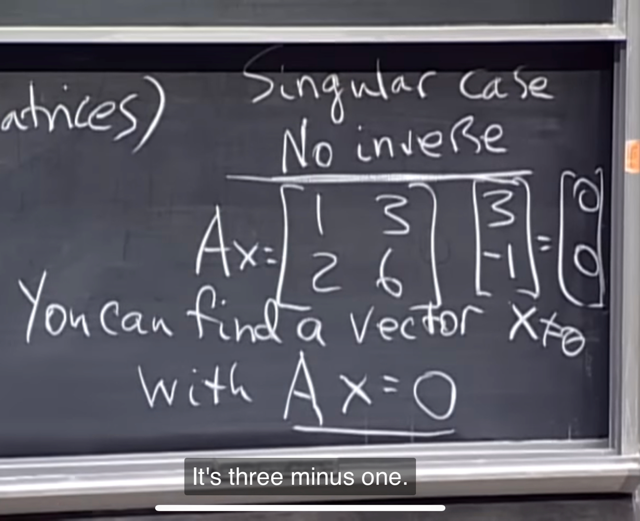</kbd></p>

> [!NOTE]
> Lí do **việc này suy ra A non-invertible** là vì **khi nhân hai
> vế cho A_inv** thì ta có **x `=` 0**, điều này **ko đúng** khi **rõ
> ràng x khác 0**Có nghĩa là ta sẽ chứng minh phản chứng rằng nếu tồn
> tại `non-zero` vector x khiến Ax `=` 0 thì sẽ không thể tồn tại
> `A_inv:` 
>
> Giả sử `A_inv` tồn tại, ta nhân nó vào hai vế của Ax `=` 0
> ta sẽ có `A_invAx` `=` Ainv.0 `=` 0
>
> ```text
> <=> I.x = 0 <=> x = 0 mà điều này mâu thuẫn với giả định
> ```
> ban đầu rằng x là `non-zero` vector. Từ đó suy ra không
> thể tồn tại `A_inv`

<br>

<a id="node-69"></a>

<p align="center"><kbd>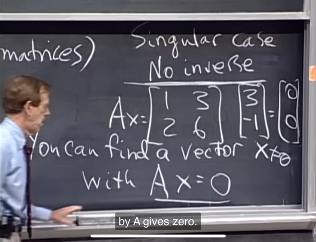</kbd></p>

> [!NOTE]
> Một ý rất quan trọng cần hiểu đó là, **equation Ax=0** thể
> hiện rằng **qua sự biến đổi với A, vector x đã thành 0**,
>
> và **không có các nào mà một matrix nào đó có thể đảo
> ngược chuyện đó bằng cách nhân với vector 0 để biến
> đổi nó thành lại ra x**. 
>
> Do đó, việc tồn tại x khiến **Ax=0** là **sự khẳng định cho
> A là `non-invertible` matrix**

<br>

<a id="node-70"></a>

<p align="center"><kbd>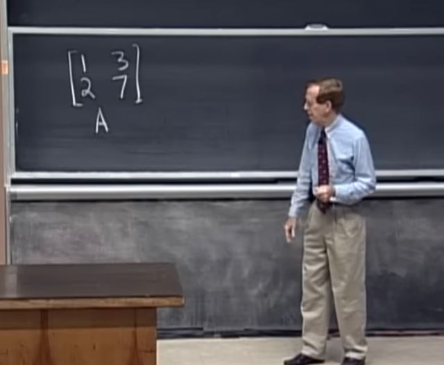</kbd></p>

> [!NOTE]
> Gs cho ví dụ của**invertible matrix**. Thì gs cho rằng, **có
> nhiều cách chứng minh nó invertible**, có người thích tính
> **determinant** thì tính và t**hấy nó khác 0 suy ra invertible.**
>
> Người thì **thích column** có thể lập luận rằng **các column
> của nó khác hướng** (sẽ liên quan đến independent và
> span sẽ học sau)

<br>

<a id="node-71"></a>

<p align="center"><kbd>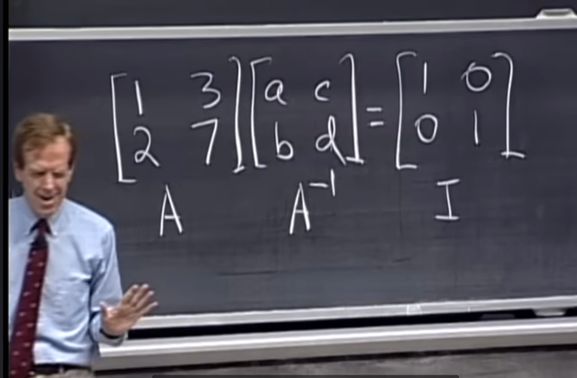</kbd></p>

> [!NOTE]
> Thế thì cho trước rằng A invertible tức `A_inv` tồn tại. Thì để
> ```text
> tìm A_inv tức là ta tìm matrix A_inv sao cho AA_inv = I
> ```
>
> Gọi hai col của nó là [a, b] và [c, d] thì điều trên đồng nghĩa:
>
> tìm col vector [a, b] sao cho nhân A@[a b] ra [1 0] và [c d]
> sao cho A@[c d] ra [0 1].
>
> Thì như vậy việc tìm **A_inv** là giải 2 **system of equation**

<br>

<a id="node-72"></a>

<p align="center"><kbd>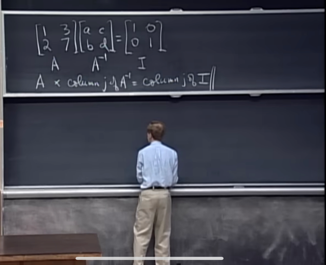</kbd></p>

> [!NOTE]
> Mỗi equation là: A nhân col của `A_inv` bằng cột tương
> ứng của I

<br>

<a id="node-73"></a>

<p align="center"><kbd>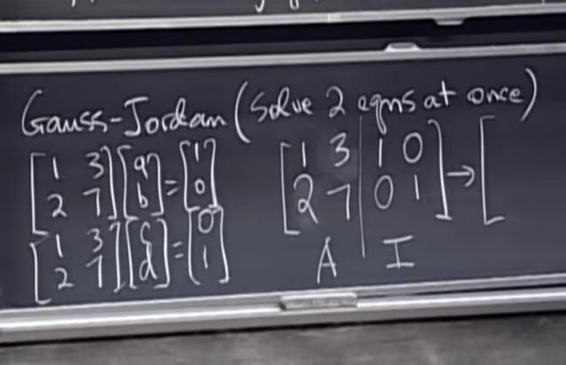</kbd></p>

🔗 **Related:** [LECTURE 10: THE FOUR FUNDAMENTAL SUBSPACES](untitled.md#node-283)

> [!NOTE]
> Đến đây gs nói về **Gauss-Jordan**, **giải hai system of
> equation cùng một lúc**.
>
> Thì ý tưởng ở đây đó là, ta ghi matrix A như vầy và thêm
> hai cột của I như hai cột extra.
>
> Ý tưởng sẽ là: ta sẽ **thực hiện quá trình elimination đối
> với A ở bên trái để biến nó thành I,  thì I sẽ trở thành
> `A_inv` ở bên phải**

<br>

<a id="node-74"></a>

<p align="center"><kbd>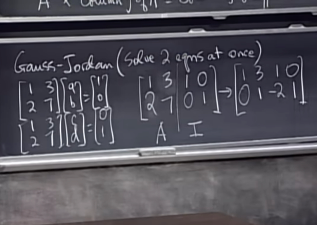</kbd></p>

> [!NOTE]
> Như đã biết, bước 1 sẽ là trừ hàng 2 cho 2*hàng 1 để
> khử số 2 của hàng 2. Bên kia cũng làm tương tự, trừ
> hàng 2 cho 2*hàng 1 ra dc `[-2` 1]

<br>

<a id="node-75"></a>

<p align="center"><kbd>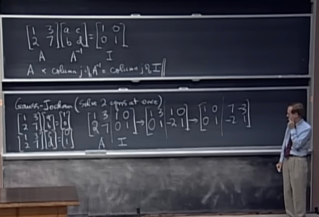</kbd></p>

> [!NOTE]
> Tới đây gs nói Gauss thì ok (ý nói đã đưa A về dạng U `-`
> upper triangular matrix `/` row echelon form) rồi thì nhưng
> Jordan thì làm tiếp tức là tiếp tục khử đi số 3 để đưa
> matrix bên trái thành I (reduced echelon form) bằng cách
> trừ hàng 1 cho 3*hàng 2.
>
> Matrix bên phải cũng làm như vậy

<br>

<a id="node-76"></a>

<p align="center"><kbd>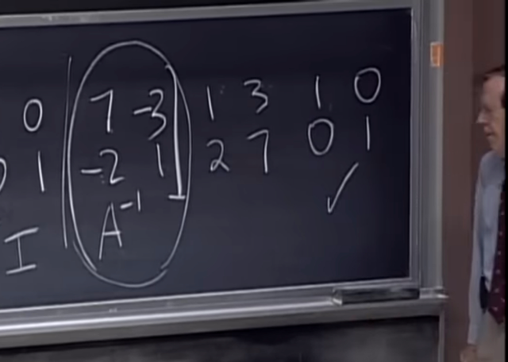</kbd></p>

<p align="center"><kbd></kbd></p>

<p align="center"><kbd>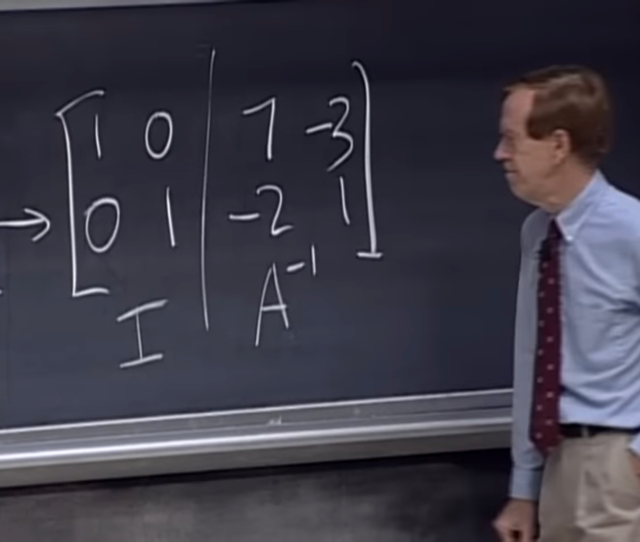</kbd></p>

> [!NOTE]
> Kết quả sau khi nhân lại với A ra I cho thấy đúng là nó
> là Ainv

<br>

<a id="node-77"></a>

<p align="center"><kbd>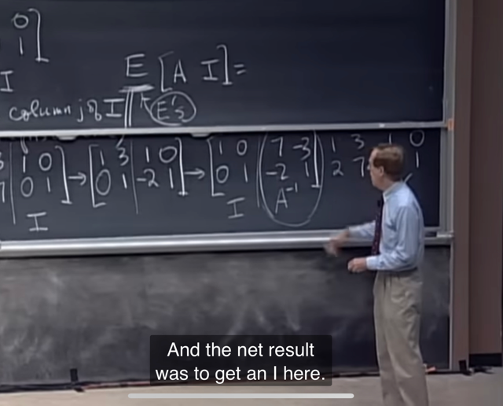</kbd></p>

> [!NOTE]
> Câu hỏi đặt ra là **tại sao việc này lại cho ra A_inv**
>
> Thế thì, gs cho thấy việc **thực hiện elimination để từ A ra
> I** thì như trên đã biết nó **chẳng qua là việc biến đổi A
> thông qua các matrix E**:
>
> **E1@A** ở bước 1 và **E2@(E1@A)** ở bước 2.
>
> Nên chung lại c**hẳng qua là nhân một matrix `E`
> `(=E2@E1)` với A thô**i.

<br>

<a id="node-78"></a>

<p align="center"><kbd>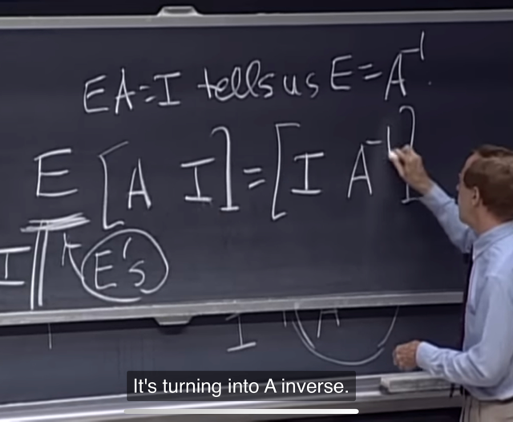</kbd></p>

> [!NOTE]
> Như vậy **E@A ra I nên có thể suy ra `E` chính là Ainv** và
> **vì apply các bước y chang cho I (ở bên phải),** nên bên
> phải nó sẽ là **E@I và cái này đương nhiên cũng vẫn là
> E** (nhân với identity matrix).
>
> Vậy phần bên phải sẽ trở thành `E,` và cũng là Ainv

<br>

