# Lecture 5: Transpose, Permutations, Spaces R^n

📊 **Progress:** `23` Notes | `24` Screenshots

---

<kbd>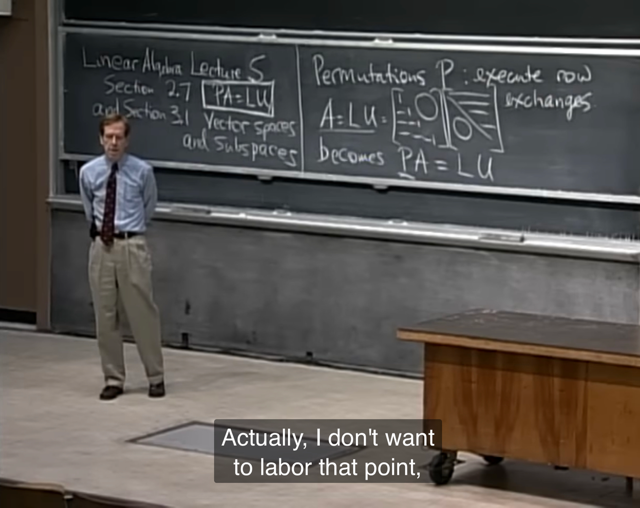</kbd>

> [!NOTE]
> Đại khái là, tóm tắt lại, là ta có **quá trình elimination** để **dần dần đưa
> A thành U**, và quá trình đó **đảo ngược lại bằng L (để biến U ngược lại
> thành A)**.
>
> Thế thì, gs nói đương nhiên để làm được vậy **A phải là good matrix**
> tức **invertible matrix**. Nhưng sẽ c**ó lúc ta cần row exchange**. Vậy
> thể hiện sự tham gia của row exchange vào chính là bằng **matrix P để
> ta có PA=LU**

 

<kbd>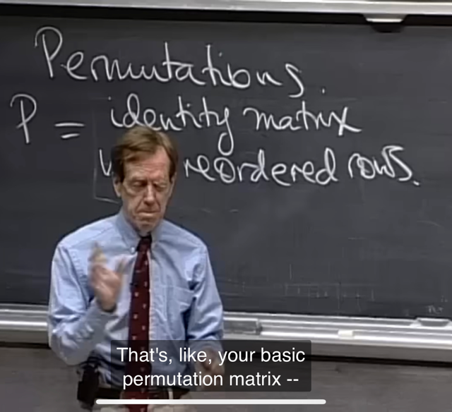</kbd>

> [!NOTE]
> Từ bài trước mình đã thấy **Permutation matrix là identity matrix nhưng
> thay đổi row**. Và có thể **coi** **I là basic permutation matrix**

 

<kbd>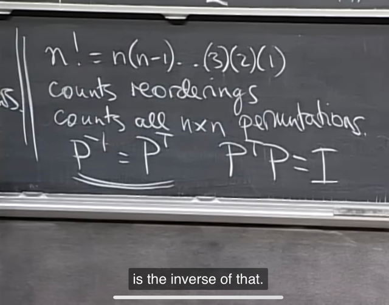</kbd>

> [!NOTE]
> **Số lượng các reordering khả dĩ là n giai thừa**. Và permutation matrix
> có tính chất đặc biệt là **P**_**inv chính là `P_transpose`
>
> `P_inv` `=` P.T**

 

<kbd>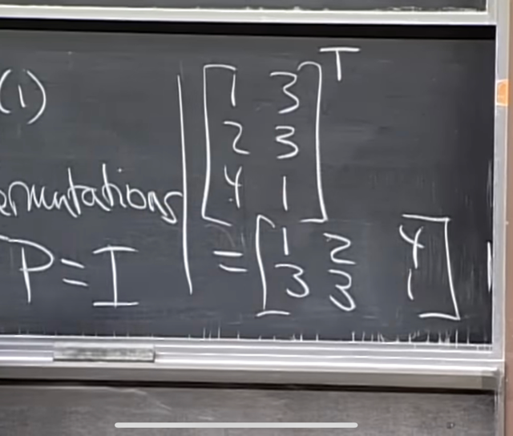</kbd>

 

<kbd>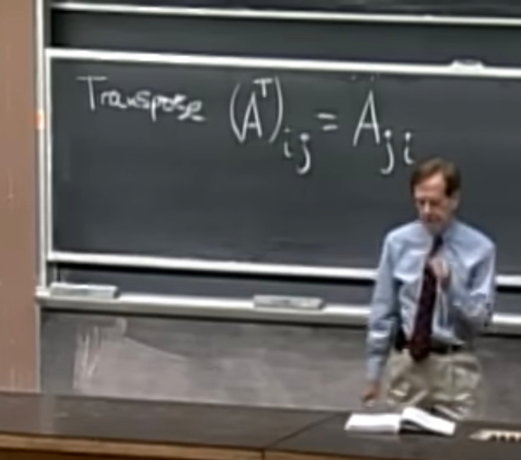</kbd>

> [!NOTE]
> Khái quát của transpose

 

<kbd>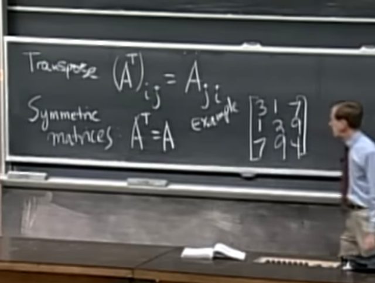</kbd>

> [!NOTE]
> **Symmetric matrix** là matrix
> transpose ko thay đổi gì

 

<kbd>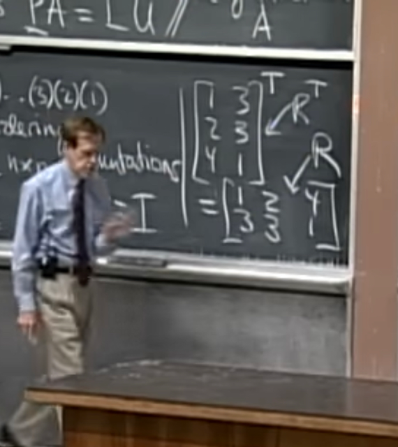</kbd>

> [!NOTE]
> Gs nói tôi nghĩ là **nếu lấy một rectangular matrix
> nhân với transpose của nó ta sẽ dc một symmetric
> matrix**

 

<kbd>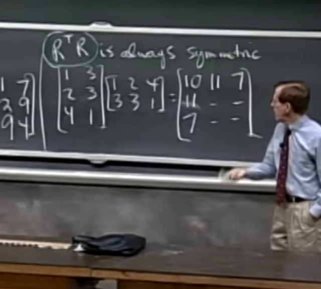</kbd>

> [!NOTE]
> Tính thử thì thấy nó đối xứng thật. Nhưng **ta cần
> chứng minh điều này theo cách chính thức hơn**

 

<kbd>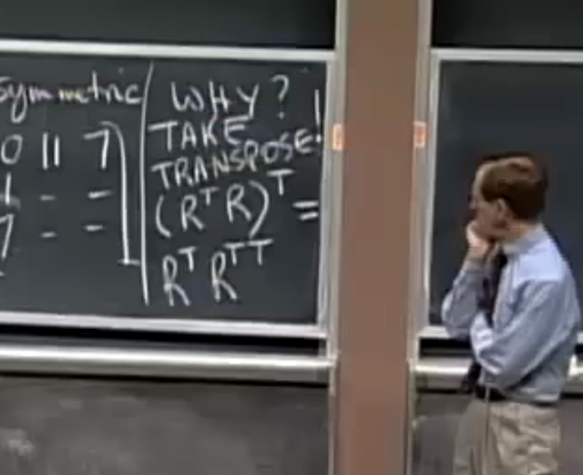</kbd>

> [!NOTE]
> Bằng cách **xem thử transpose của (RT)R có là chính nó hay ko**. Thế
> thì dựa vào luật giống như inverse: (AB)T `=` (BT)(AT) ta có ((**RT)R**)T ra
> dc lại (RT)((RT)T) là (**RT)R
>
> Như vậy (RT)R khi lấy transpose được chính nó suy ra nó là symmetric
> matrix**

 

<kbd>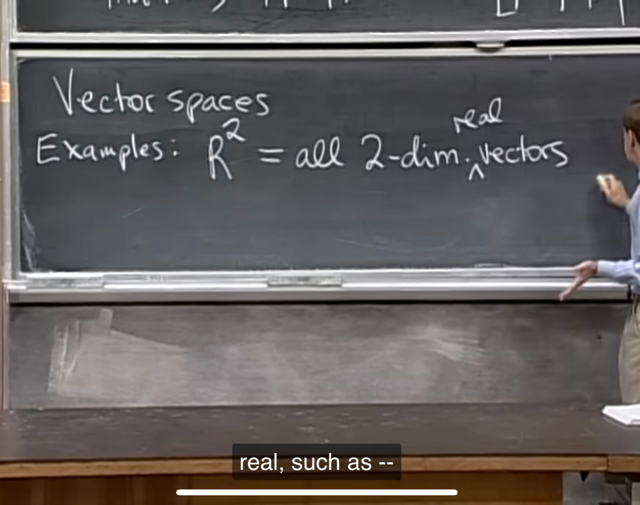</kbd>

> [!NOTE]
> Gs nói qua **VECTOR SPACE**. Thế thì đầu tiên gs cho rằng ta **có thể
> add hai vector**, **có thể nhân vector với một số (scalar)**. Vậy **vector
> space là một không gian vector** cho phép ta **thực hiện hai operations
> đó và một số rule.**
>
> Ta đã gặp khái niệm **linear combination** ở bài trước. Trong không
> gian vector **R2**, tức là **số thực (Real `-` R), 2 chiều**

 

<kbd>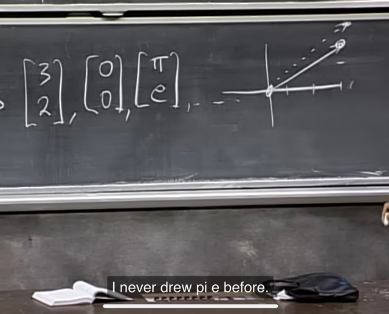</kbd>

> [!NOTE]
> Ví dụ một số vector

 

<kbd>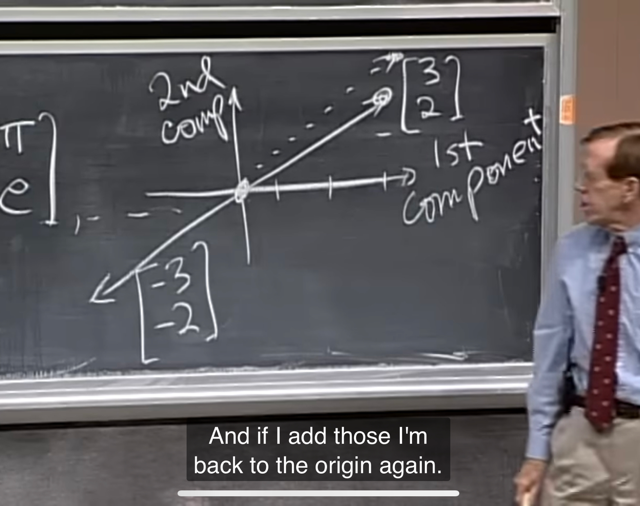</kbd>

> [!NOTE]
> Như đã biết ta có thể vẽ nó ra như vầy. Thế thì gs định nghĩa v**ector
> space R2 chính là toàn bộ mặt phẳng**.
>
> Ta có thể nói **toàn bộ** là bởi vì, **giả sử ta lấy đi vector [0,0]**, để có
> **kiểu như mặt phẳng nhưng thủng một lỗ** thì **ta sẽ không còn thỏa
> mãn yêu cầu,** là, **ví dụ vector [3 2] nhân với một scalar 0 sẽ dc một
> vector cũng trong vector space đó** hay khi cộng với vector `[-3` `-2]` thì dc
> vector cũng nằm trong vector space

 

<kbd>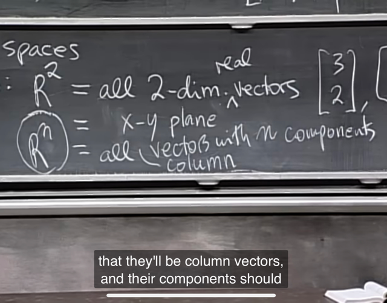</kbd>

> [!NOTE]
> Như vậy vector space **R^n** là **mọi vector có n** **component giá trị
> thực**. Thỏa quy định **cộng 2 vector hay nhân vector với scalar sẽ dc
> một vector vẫn nằm trong space**

 

<kbd>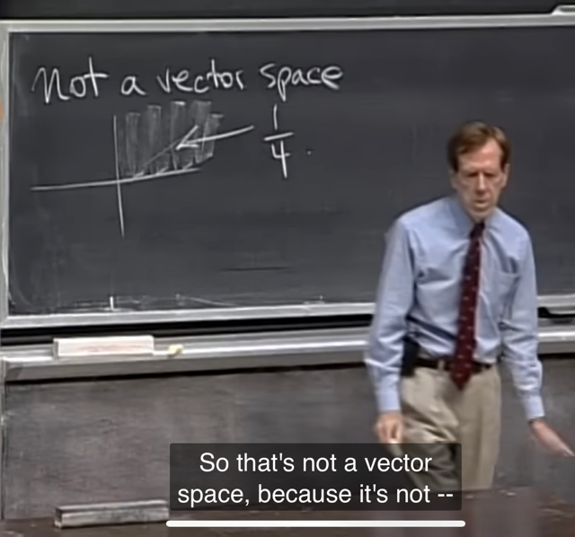</kbd>

> [!NOTE]
> Gs **ví dụ một cái ko phải là vector space**: **tập mọi vector ko âm**..
> thì cái này **thỏa mãn khi cộng hai vector nó vẫn nằm trong góc phần
> tư này**. Nhưng **ko thỏa yêu cầu nhân, vì nhân với số âm nó sẽ ko
> còn trong góc này nữa**

 

<kbd>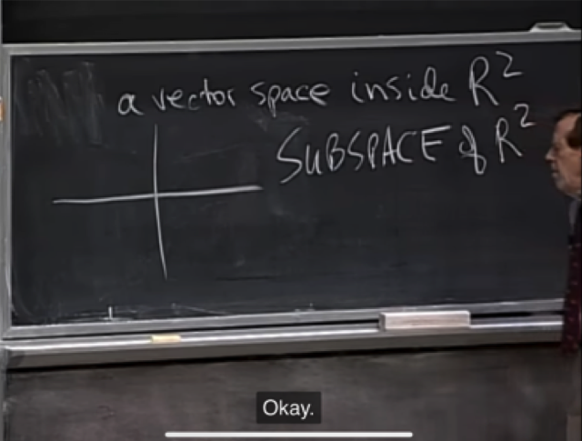</kbd>

> [!NOTE]
> Thế thì ta sẽ đi **tìm một "vùng" thỏa tính chất của vector
> space,** **nằm trong R2**. Nó dc gọi là **SUBSPACE của R2**

 

<kbd>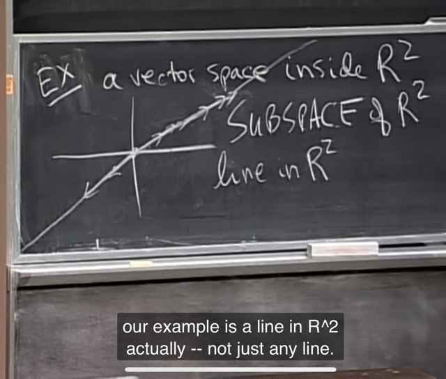</kbd>

> [!NOTE]
> Thế thì, thử check một line ta thấy rằng **khi nhân một
> vector trên line này với bất kì số nào** ta cũng **vẫn dc một
> vector nằm trên line đó**. Và **dễ thấy cộng cũng vậy**. Vậy
> nó**(line) là một subspace của R2**

 

<kbd>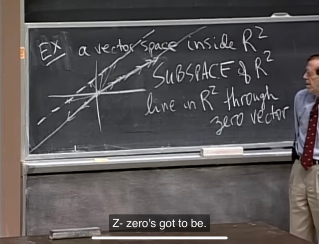</kbd>

🔗 **Related:** [LECTURE 6: COLUMN SPACE AND NULL SPACE](untitled.md#node-145)

🔗 **Related:** [LECTURE 6: COLUMN SPACE AND NULL SPACE](untitled.md#node-152)

> [!NOTE]
> Nhưng check **một line khác ko đi qua origin** thì thấy
> **ko thỏa luật**. À **như vậy line phải đi qua O thì mới là
> subspace.**
>
> Và **MỌI SUBSPACE PHẢI CHỨA GỐC 0**, vì **nó phải cho
> phép một vector nhân với 0** **để ra kết quả vẫn thuộc
> vector space.**

 

<kbd>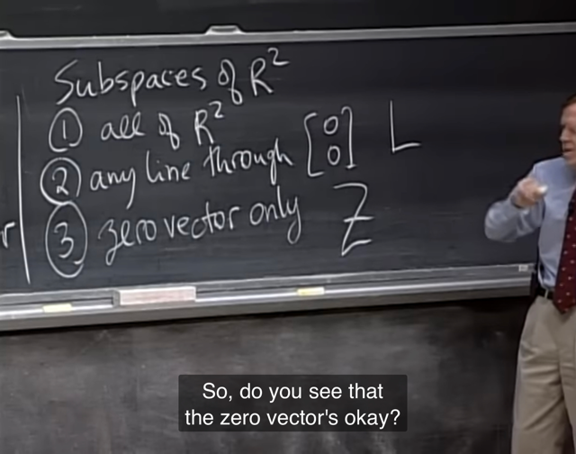</kbd>

> [!NOTE]
> Thử **list các subspace của R2**. Thì có
>
> 1. Là **bản thân R2**
>
> 2. Là **mọi line đi qua gốc 0**
>
> 3. Và một cái thú vị **chính là bản thân cái gốc 0** **cũng
> là một subspace** vì nó **cũng thỏa luật**. Lấy vector
> trong đó, đương nhiên chỉ có 1 vector là [0,0] đem nhân
> với mọi số đều ra [0,0] thuộc subspace và cộng [0,0] với
> [0,0] cũng ra [0,0] thuộc subspace

 

<kbd>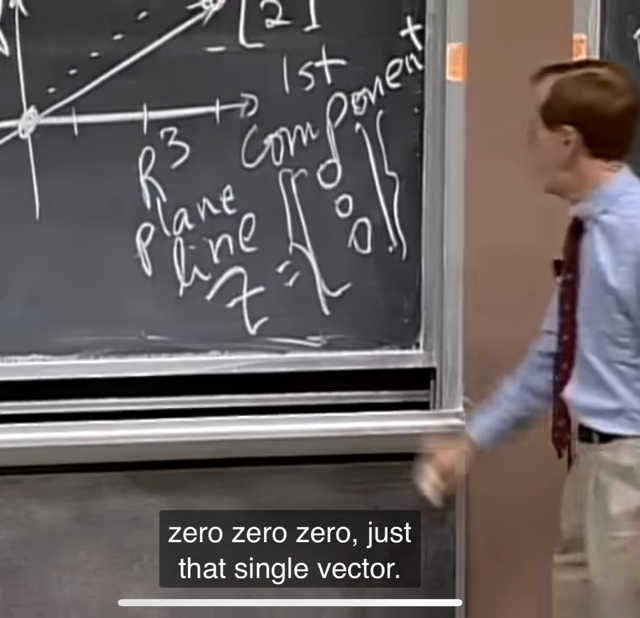</kbd>

> [!NOTE]
> Với R3 thì subspace của nó có thể là một line đi qua O,
> một plane đi qua O hoặc bản thân O

 

<kbd>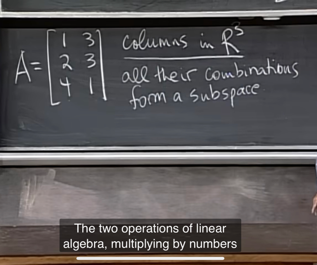</kbd>

🔗 **Related:** [LECTURE 9: INDEPENDECE, BASIS, AND DIMENSION](untitled.md#node-238)

> [!NOTE]
> Gs mới nói qua việc **tạo subspace từ các column của matrix.**vậy đương nhiên nó phải thỏa:
>
> 1. **Nhâ**n với column với **scalar bất kì** cũng được **vector
> thuộc vector space** và
>
> 2. **Cộng hai column vector** a với b cũng **vẫn thuộc vector
> space.**
>
> Vậy gs cho rằng **subspace này chính là mọi linear
> combination của hai column vector**Nói thêm chỗ này để hiểu rõ hơn một chút. Như ta đã biết
> định nghĩa của vector space, là phải thỏa điều kiện rằng khi
> cộng hai vector với nhau hoặc khi nhân vector với một scalar
> bất kì thì kết quả ta được một vector vẫn nằm trong tập hợp
> đó. Khi đó nó mới thỏa điều kiện là  vector space.
>
> Vậy thì, khi xét mọi linear combination của hai columns vector
> của một matrix, thì ta sẽ dễ thấy rằng, khi lấy hai vector (mà
> mỗi cái là một linear combination của hai cols vector) cộng với
> nhau, đương nhiên ta vẫn sẽ được một linear combination
> khác của hai cols vector, do đó vector kết quả này vẫn nằm
> trong tập hợp mọi linear combination của hai cols vector.
>
> Tương tự khi scale một linear combination của hai cols vector
> ta cũng có một linear combination khác của hai cols vector.
> Thành ra khi xét tập mọi linear combination của hai cols
> vector của một matrix, thì nó thỏa hai tính chất cần thiết của
> vector space. Vậy nó là một vector space. Và nó có tên là
> Column Space

 

<kbd>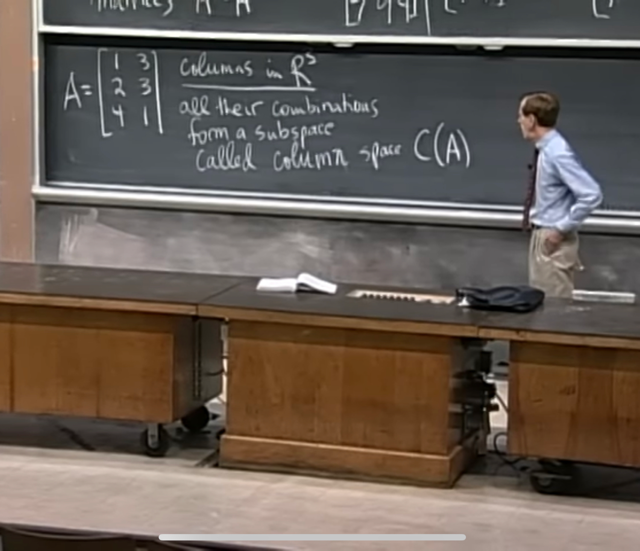</kbd>

> [!NOTE]
> Và nó có tên gọi là **Column Space** của **matrix A kí hiệu
> là C(A)**

 

<kbd>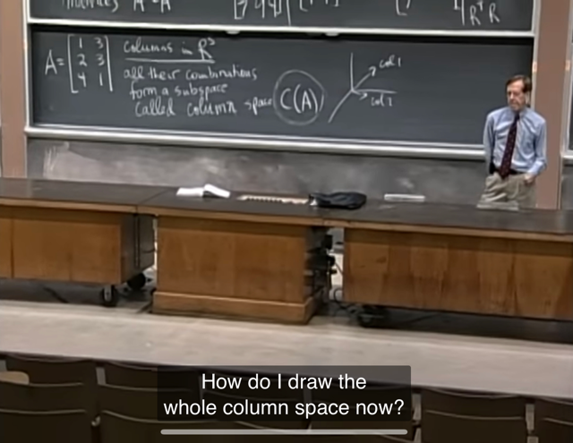</kbd>

> [!NOTE]
> Thế thì, nếu ta **vẽ col1 col2 ra thì Column space sẽ vầy.**
> Chính là **mặt phẳng tạo bởi hai col**

 

<kbd>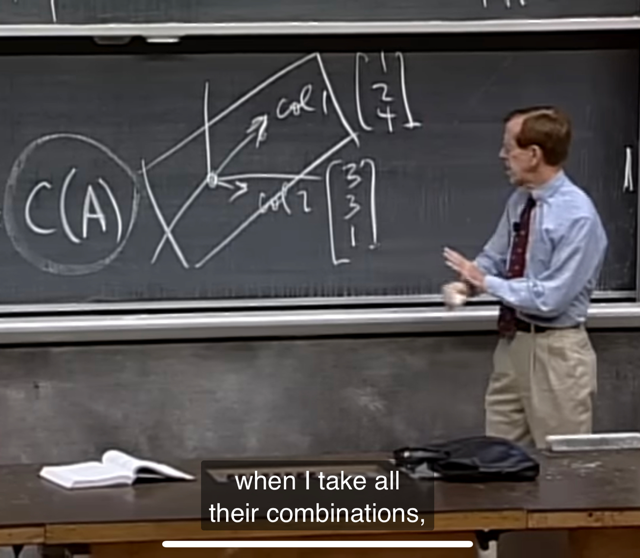</kbd>

> [!NOTE]
> Đúng là vậy, nó **chính là một plane đi qua hai column vector** và
> **đương nhiên qua gốc 0**.
>
> Gs cho rằng cái này **rất quan trọng**. Hình ảnh**lấy 2 vector trong
> R3  sẽ tạo một subspace của R3 là một không gian 2 chiều `-` plane**
> (chú ý là **ko phải R2 nhé, vì vector có 3 component**)
>
> Giúp ta**hình dung bài toán khác trong vector space R10**,**lấy
> combination của 5 vector** sẽ **tạo một subspace của R10** là
> **một không gian 5 chiều**. (ko phải R5, vì vector có 10 component)
>
> Tất nhiên **còn tùy 5 vector ntn**, **vì nếu chúng cùng trên 1 line thì
> subspace đó sẽ chỉ là 1 line đi qua gốc 0** như đã biết, nhưng "
> maximum" thì chúng nó sẽ tạo một không gian 5D trong R10 (giống
> như mặt phẳng 2D trong không gian 3D R3)

 

<kbd>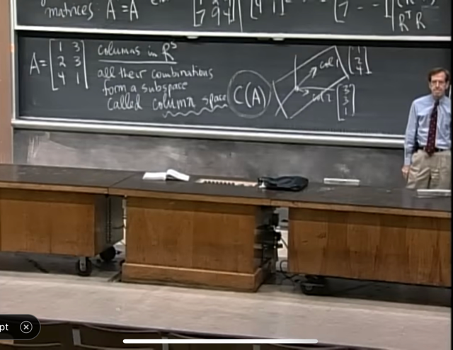</kbd>

> [!NOTE]
> Bài sau ta sẽ bắt đầu **nhìn nhận Ax=b** ở một cấp
> độ cao hơn với **vector space** và **subspace**

 

