# Lecture 6: Column Space And Null Space

📊 **Progress:** `24` Notes | `24` Screenshots

---
<a id="node-131"></a>

<p align="center"><kbd>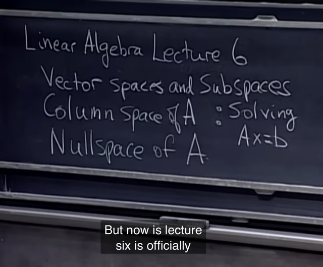</kbd></p>

> [!NOTE]
> Gs: đây (Vector space & subspace) là**trung tâm
> của linear algebra**

<br>

<a id="node-132"></a>

<p align="center"><kbd>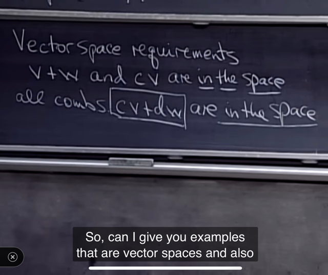</kbd></p>

> [!NOTE]
> Bài trước ta đã biết về **vector space**, có tính chất khi
> **cộng hai vector hay scale một vector ta đều dc vector
> nằm trong space**.
>
> Và kết hợp hai thứ đó thì có thể **nói chung là mọi Linear
> combination của hai vector đều nằm trong space**

<br>

<a id="node-133"></a>

<p align="center"><kbd>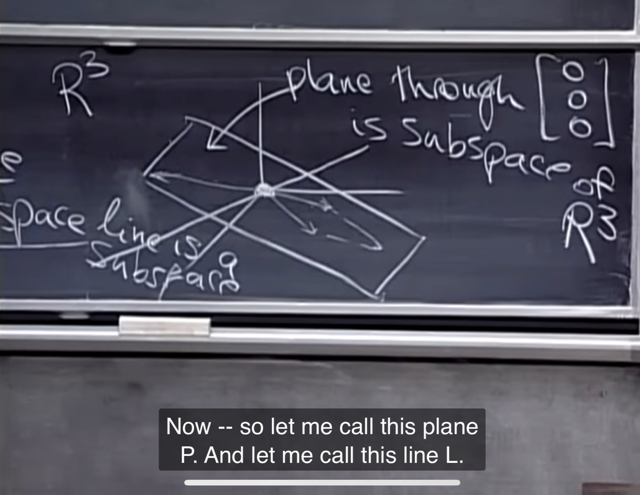</kbd></p>

> [!NOTE]
> Ôn lại về subspace. Là **vector space** trong **vector space**.
>
> Với **R3**, **bản thân nó là subspace của chính nó**.
>
> **Bất kì plane nào hay line nào đi qua gốc O** đều là
> subspace của R3

<br>

<a id="node-134"></a>

<p align="center"><kbd>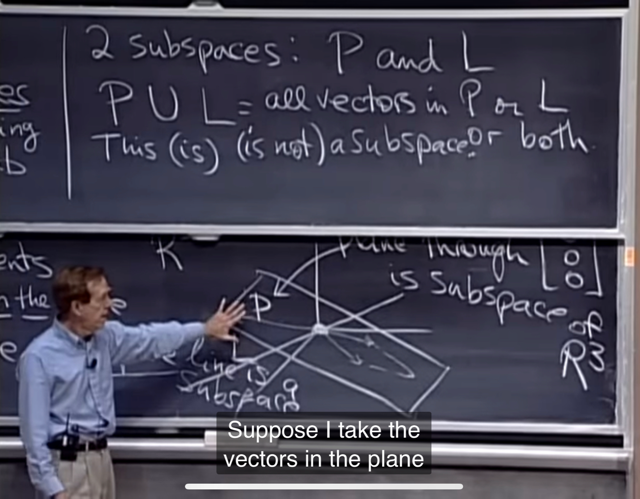</kbd></p>

> [!NOTE]
> Câu hỏi cho ta là **tập hợp của subspace P (plane)** hợp
> với (Union) **L (line) của R3 có phải là subspace của R3
> ko**.
>
> Dễ thấy là ko, vì dễ thấy không thỏa yêu cầu hai vector bất
> kì trong (P) U (L) cũng vẫn thuộc subspace:
>
> Ý là giả sử ta có một mặt phẳng đi qua gốc, thì nó là subspace
> rồi, rồi một cái đường thẳng đi qua gốc, cũng là một subspace.
> Thì giờ gộp hai thằng đó có là một subspace không. Thì dĩ
> nhiên là ko. Vì giả sử lấy 1 điểm (vector) trên line, rồi một điểm
> khác trên plane, thì cộng hai thằng đó có thể nó nằm ở ngoài
> cả plane lẫn line, như vậy nó hợp giữa line và plane không thỏa
> điều kiện tạo một subspace.

<br>

<a id="node-135"></a>

<p align="center"><kbd>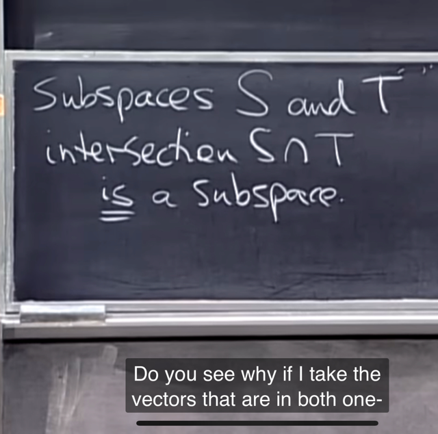</kbd></p>

> [!NOTE]
> Thế thì **intersection** giữa hai subspace S và T thì sao.
> Tại sao nó **cũng là subspace.**
>
> Xét điều kiện cộng vector,**giả sử u, v là hai vector thuộc
> tập intersection giữa S,T**. Thì đương nhiên**u v đều
> thuộc S** mà **S là subspace nên `u+v` cũng thuộc S**.
> Tương tự, **u v đều thuộc T**, nên **u+v cũng thuộc T** vì T
> là subspace. Vậy **u+v vừa thuộc S vừa thuộc T nên nó
> thuộc S intersect T**, vậy là thỏa điều kiện cộng vector
>
> Tương tự có thể **dễ thấy điều kiện nhân nó cũng thỏa.**
> Vậy i**ntersection của hai subspace là một subspace
> nhỏ hơn.**

<br>

<a id="node-136"></a>

<p align="center"><kbd>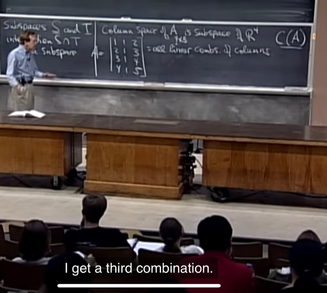</kbd></p>

> [!NOTE]
> Quay lại **column space của matrix A**. Là **vector space
> tạo bởi (mọi linear combination của) column vector của A**
>
> Nhớ lại, với ví dụ A như vầy, thì **column space của A là
> subspace của R4 (tại col của a có 4 component)** Gs hỏi
> **vậy trong column space của A có gì**, **ngoài 3 column
> của A**. Thì dĩ nhiên nó là **mọi linear combination của 3
> column vector**

<br>

<a id="node-137"></a>

<p align="center"><kbd>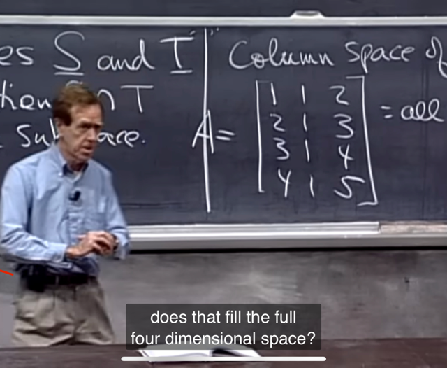</kbd></p>

> [!NOTE]
> Thế thì gs đặt câu hỏi là **column space của A "rộng" cỡ
> nào,** **có fill hết R4 không.**
>
> Thử trả lời: **ko**, vì**cũng như 2 cái 3D vector thì nhiều
> nhất chỉ tạo dc một plane** là một 2D subspace của R3
> (**chưa kể nếu chúng trùng nhau thì chỉ tạo 1D subspace 
> là một line**)
>
> thì đây cũng vậy, **3 vector 4D thì chỉ có thể nhiều làm
> thành (ý là với mọi linear combination) 3D subspace
> trong 4D space R4 thôi chứ không thể fill hết R4 được**

<br>

<a id="node-138"></a>

<p align="center"><kbd>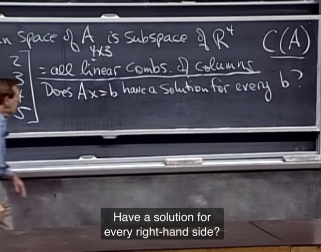</kbd></p>

> [!NOTE]
> Vậy **quay lại equation Ax `=` b**. Câu hỏi là
> **liệu nó có solution với mọi b không?**
>
> Câu trả lời là **không**. Vì sao?

<br>

<a id="node-139"></a>

<p align="center"><kbd>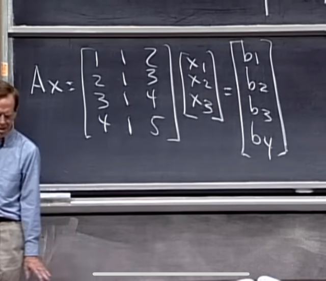</kbd></p>

> [!NOTE]
> Là vì, trước hết ta ghi lại **dạng triển khai của Ax=b**, như
> ta đã biết ở bài trước, cái mà ta đang tìm `-` tức là
> **solution x là coeff của một linear combination các
> column vector của A**sao cho nó **ra bằng vector b**.
>
> Thế thì **b là một vector trong R4**, mà như vừa mới nói
> **column space của A nhiều lắm chỉ có thể là một 3D**subspace của R4 **chứ** **ko thể fill hết R4** dc. Cho
> nên **luôn tồn tại một vector b không nằm trong subspace
> đó**.
>
> Vậy **không thể có solutions với mọi b dc.**
>
> Vậy câu hỏi là **b như thế nào thì equation có solution**

<br>

<a id="node-140"></a>

<p align="center"><kbd></kbd></p>

> [!NOTE]
> Thế thì, gs mới kêu **thử nghĩ vài specific vector b khiến
> `Ax=b` có solution.**
>
> Ta có thể thấy **b=[0,0,0,0]**, thì equation sẽ có nghiệm,
> là **x=0**.
>
> Rồi, nếu **b `=` [1 2 3 4] tức là bằng col 1**..thì sẽ dễ thấy
> equation có solution là **[1 0 0]** vì như đã nói, nghĩ theo
> column, b là linear combination của col A, coeff bởi x.
>
> Vậy gs mới nói, ta **có thể tìm b bằng cách chọn x
> trước**. À **khi đó câu trả lời cho câu hỏi b ntn thì
> equation có solution bỗng hiện ra rất rõ**.
>
> Đó là, **equation sẽ có solution NẾU b LÀ MỘT LINEAR
> COMBINATION CỦA CÁC COLUMNS CỦA**. 
>
> Đồng nghĩa **b THUỘC COLUMN SPACE CỦA A**

<br>

<a id="node-141"></a>

<p align="center"><kbd>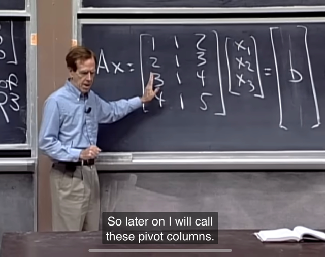</kbd></p>

> [!NOTE]
> Thế thì, gs hỏi tiếp là, **column space này lớn cỡ nào**?
>
> **3 col này có independent ko**?
>
> hay, **mỗi col vector có add thêm thông tin ko?**.
>
> Hay, **nếu có vector nào mà bỏ bớt đi vẫn dc subspace ko
> đổi ko**?
>
> Thế thì có thể thấy câu trả lời là **có**. Đó là **col 3**. Nó là
> **col `1+col` 2**. Như vậy nó là một **linear combination của
> col 1 và col 2**. Vậy nó **ko add thông tin gì thêm**, **vì col
> 1 và col 2 bản thân nó đã tạo một plane chứa col 3 rồi**.
>
> Đương nhiên **plane tạo bởi hai vector này sẽ có đi qua
> gốc 0** và **có thể nói column space của A là một 2D
> subspace của R4**

<br>

<a id="node-142"></a>

<p align="center"><kbd>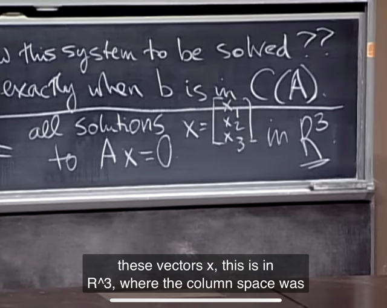</kbd></p>

> [!NOTE]
> Gs nói qua **NullSpace**, null ở đây **cứ hiểu là 0**. Thế thì nó
> dc định nghĩa là **mọi vector x mà khiến Ax=0**. Hay **mọi
> solution của Ax=0**
>
> Và vì x là 3D vector. Nên **NullSpace sẽ là một subspace
> của R3**Ta thử tự phân tích xem t**ại sao tập hợp mọi vector x khiến
> `Ax=0` lại là vector space** (có tên NullSpace): Đó là vì nếu x1
> và x2 là solution của `Ax=0,` tức `Ax1=0` và `Ax2=0` thì khi đó 
> ```text
> Ax1+Ax2 = A(x1+x2) cũng đương nhiên bằng 0. Do đó x1+x2
> ```
> cũng là nằm trong tập hợp này (tập hợp các vector khiến `Ax=0)`
> Và tương tự nếu A*c*x1 cũng bằng 0 với c bất kì, nên cx1 cũng
> thuộc tập hợp này.
>
> Từ đó "mọi vector x khiến `Ax=0,` hay cũng gọi là mọi solution
> của `Ax=0"` thỏa điều kiện là một vector space.

<br>

<a id="node-143"></a>

<p align="center"><kbd>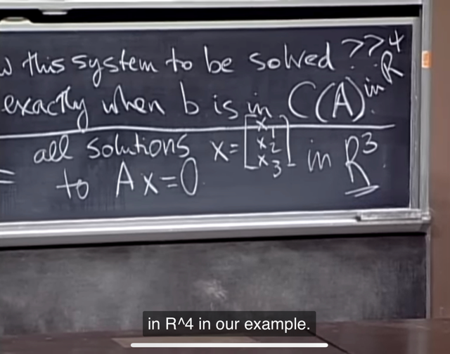</kbd></p>

> [!NOTE]
> 3 là **n**, là số col, nó cho ta biết ta **phải tìm 3 coeff để
> combine các col để ra b**. Còn 4 là số hàng, là **m**, là **kích
> thước col vector**, cho biết col **đang ở không gian R4**

<br>

<a id="node-144"></a>

<p align="center"><kbd>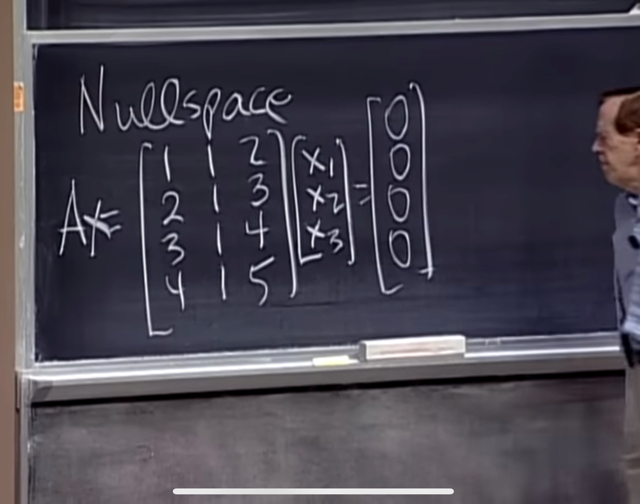</kbd></p>

> [!NOTE]
> Thử suy nghĩ xem **null space là gì, hay tập hợp
> mọi solutions của equation này là gì?**

<br>

<a id="node-145"></a>

<p align="center"><kbd>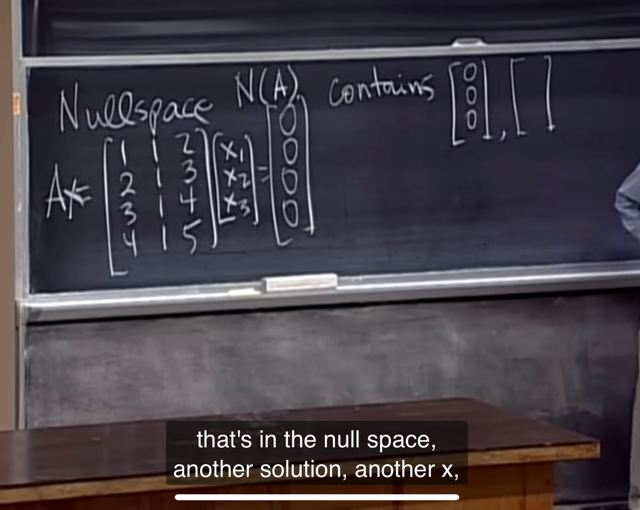</kbd></p>

🔗 **Related:** [LECTURE 5: TRANSPOSE, PERMUTATIONS, SPACES R^N](untitled.md#node-122)

> [!NOTE]
> Vậy **dễ thấy một solution sẽ là 0 vector**. Nên có thể
> **khẳng định null space của matrix A, kí hiệu là N(A) sẽ
> luôn chứa vector zero.**
>
> Gs cho rằng điều này **cho ta biết:** **nó có thể là một
> vector space, subspace của R3 (vì như đã kết luận,
> muốn là vector space thì nó đầu tiên phải chứa gốc O)**

<br>

<a id="node-146"></a>

<p align="center"><kbd>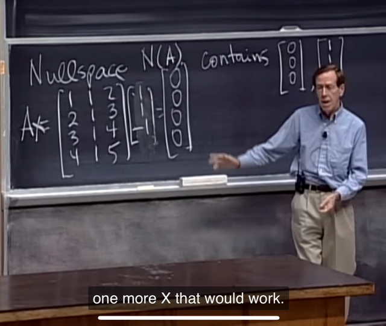</kbd></p>

> [!NOTE]
> Dễ thấy một solution nữa là [1 1 `-1].T`
>
> (vì 1*col1 `+` 1*col2 `-1*col3` `=` 0)

<br>

<a id="node-147"></a>

<p align="center"><kbd>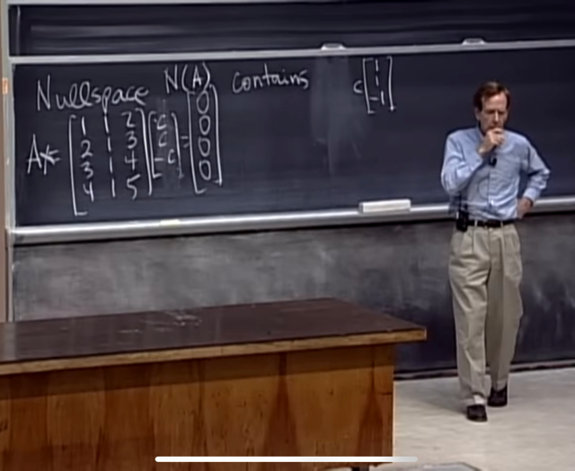</kbd></p>

> [!NOTE]
> Khái quát hơn ta sẽ thấy nó là **mọi vector c*[1 1 -1].T**
> Và cách thể hiện này sẽ**bao gồm cả zero vector (khi c=0)**

<br>

<a id="node-148"></a>

<p align="center"><kbd>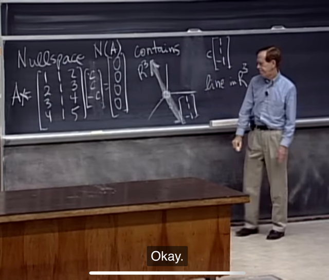</kbd></p>

> [!NOTE]
> Và **nó là một line đi qua 0**, theo**phương vector [1 1 -1]**
> Như đã biết, **nó là một 1D subspace của R3**

<br>

<a id="node-149"></a>

<p align="center"><kbd>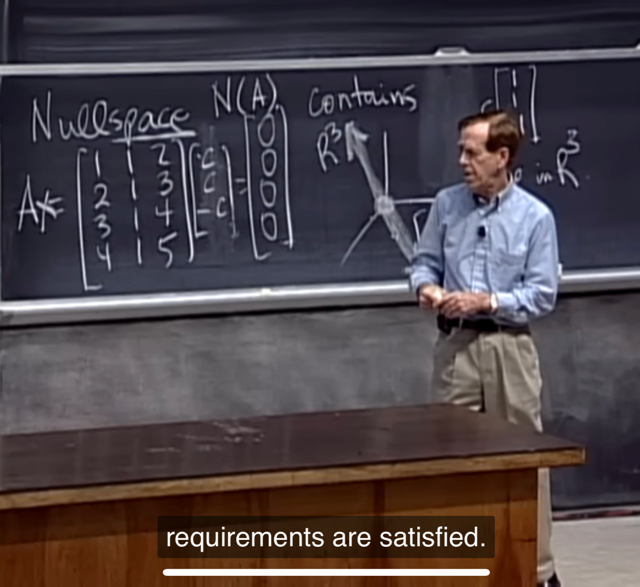</kbd></p>

> [!NOTE]
> Gs hỏi,**tại sao tôi biết nullspace là một subspace**, một
> vector space.
>
> **Thử** **trả lời**: là **bởi tập hợp các solution của Ax=0** sẽ thỏa
> hai điều kiện của một vector space:
>
> Nếu **Ax1=0, `Ax2=0,` thì `A(x1+x2)` đương nhiên cũng bằng 0**.
>
> Vậy thỏa mãn **quy tắc add** của vector space: cộng hai
> vector trong tập hợp solution cũng là một vector trong đó
>
> Tương tự, nếu **Ax1=0 thì mọi Ac*x1 cũng `=` 0**, tức scale bất
> kì vector trong tập solution thì vẫn dc một vector trong tập
> solution

<br>

<a id="node-150"></a>

<p align="center"><kbd>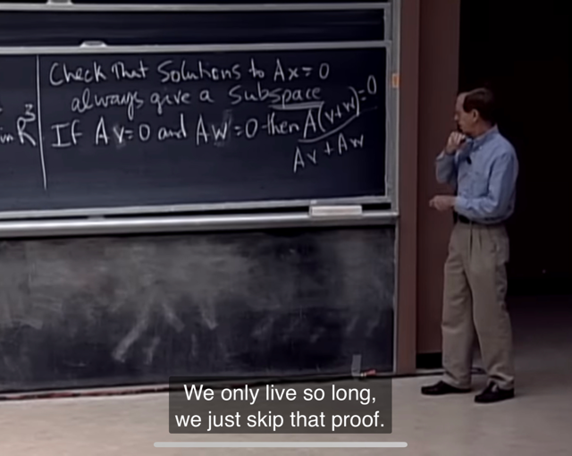</kbd></p>

> [!NOTE]
> Đúng là như vậy,**luật phân phối** của phép nhân
> (**distribute law**) matrix `A(w+v)` cho phép `=` Aw `+` Av từ
> đó giúp thỏa tính chất cộng của vector space

<br>

<a id="node-151"></a>

<p align="center"><kbd>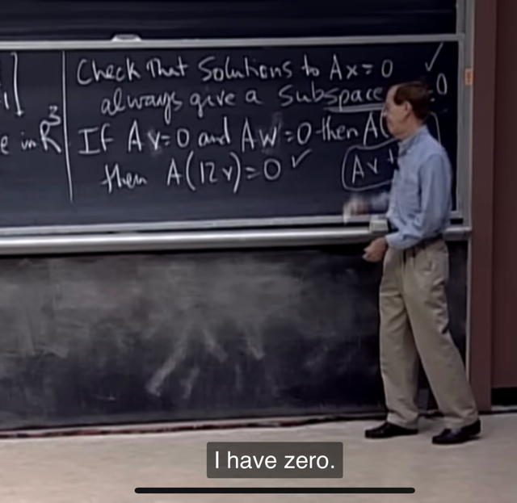</kbd></p>

> [!NOTE]
> Và dễ thấy **tính chất nhân scalar** cũng dc thỏa. Vậy đủ
> kết luận n**ullspace là vector space**

<br>

<a id="node-152"></a>

<p align="center"><kbd>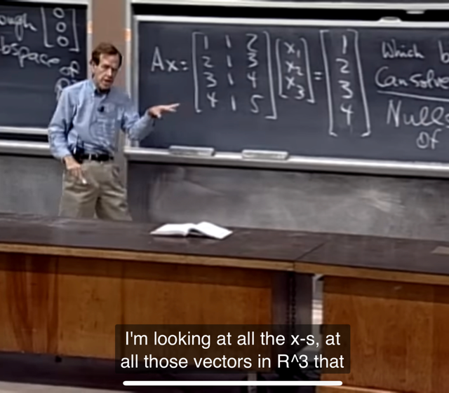</kbd></p>

🔗 **Related:** [LECTURE 5: TRANSPOSE, PERMUTATIONS, SPACES R^N](untitled.md#node-122)

> [!NOTE]
> Gs thay đổi b thành [1 2 3 4] , **câu hỏi là với equation
> system này, TẬP HỢP CÁC SOLUTION CÓ LÀM THÀNH
> MỘT VECTOR SPACE KHÔNG?** (nếu có solution, trong
> trường hợp này là có) (b đã khác 0 nên ta ko còn đang xét
> nullspace nữa)
>
> Thử trả lời: **KHÔNG**. Vì **[0 0 0] `-` gốc O `-` không phải là
> solution**, điều này có thể **ngay lập tức trả lời câu hỏi này
> là KHÔNG**.
>
> Vì **VECTOR SPACE PHẢI CHỨA ORIGIN** (nhớ lại vì nó
> phải thỏa mọi scalar kể cả 0, nhân vector v vẫn phải ra
> vector thuộc space, nên nếu 0 ko thuộc solution space thì
> một vector thuộc solution space * 0 sẽ dc kết quả nằm ngoài
> solution space `=>` solution space không thỏa điều kiện vector
> space)

<br>

<a id="node-153"></a>

<p align="center"><kbd>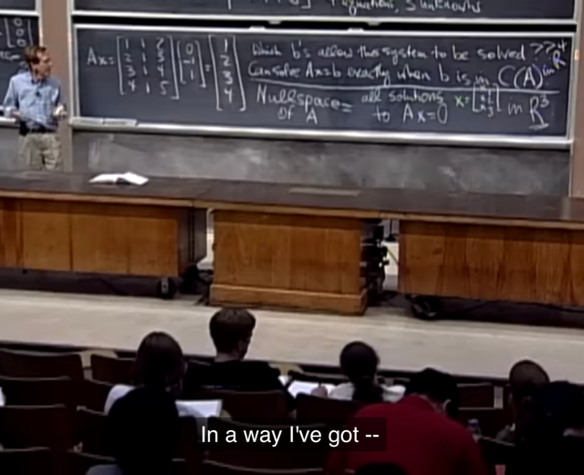</kbd></p>

> [!NOTE]
> Vậy nó (mọi solution của equasys này**không phải là
> subspace (của R3)**. Thế nhưng ta **dễ thấy ít nhất là
> hai solution: [1 0 0] và [0 `-1` 1]**.
>
> Nên gs nói nó **trông như có thể là một plane hoặc một
> line không đi qua gốc zero.**

<br>

<a id="node-154"></a>

<p align="center"><kbd>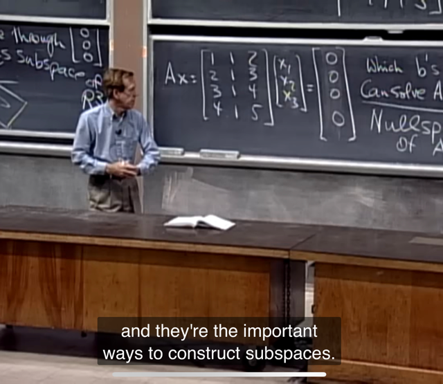</kbd></p>

> [!NOTE]
> Kết thúc lec 6, gs **tóm lại ý quan trọng cần nhớ** đó là sẽ
> có **2 cách để nói về định nghĩa về vector space.**
>
> Một là **giống như column space**, trong đó ta sẽ dc bảo là
> **hãy build vector space**, **fill in vector space từ các vector
> này** (ví dụ các col vector của matrix A). Thì ta nhớ ta sẽ
> mô tả nó là **mọi linear combination của các vector này**.
>
> Hai là `Ax=0` , **nullspace**, **mọi solution vector x solve
> equasys này**

<br>

