# Lecture 7: Solving Ax = 0: Pivot Variables, Special Solutions

📊 **Progress:** `33` Notes | `41` Screenshots

---

<kbd>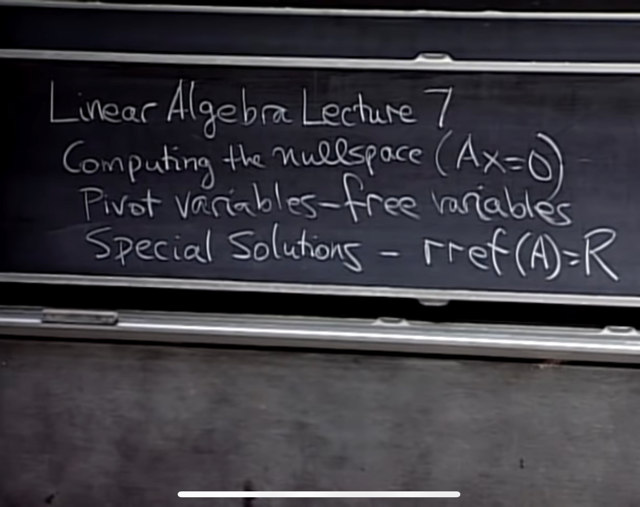</kbd>

> [!NOTE]
> Bài này ta sẽ chuyển từ việc đã biết về ý tưởng / định
> nghĩa của **null-space** và **column space** tiến tới việc tìm nó,
> describe nó, hay tạo một thuật toán / quy trình để tìm ra
> nó.

 

<kbd>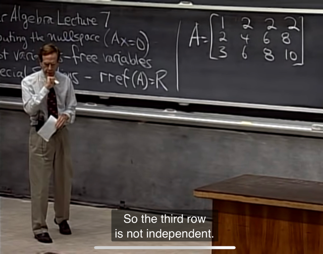</kbd>

> [!NOTE]
> Gs lấy ví dụ một rectangular matrix A, có col 2 = 2*col 1, tức
> là chúng **dependent** (không linear independent). Và **row 1 +
> row 2 = row 3**. Tức là**row 3 cũng ko independent với 2 row
> kia**
>
> Đại khái là, với lần này, ta sẽ làm **elimination** nhưng với một
> **rectangular matrix** (nhớ bài trước ta làm với square matrix).
> Và gs cho rằng ta sẽ **continue ngay cả khi gặp pivot bằng 0.**

 

<kbd></kbd>

> [!NOTE]
> Đại khái gs nói **khi ta làm elimination**, **ta không thay đổi
> nullspace** (tiếng việt gọi là **không gian vô hiệu** của ma
> trận) vì **quá trình elimination là quá trình legitimate để tìm
> solution**.
>
> Nhưng ta sẽ thấy elimination **làm thay đổi column space**
> của matrix A

 

<kbd>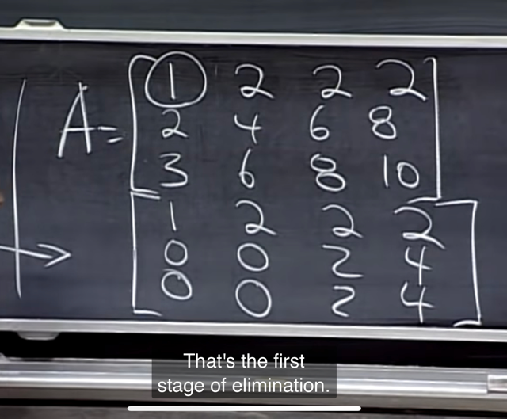</kbd>

> [!NOTE]
> Đầu tiên trừ hàng 2 cho 2*hàng 1, trừ hàng 3
> cho 3*hàng 1. Ta eliminate được a21 và a31

 

<kbd>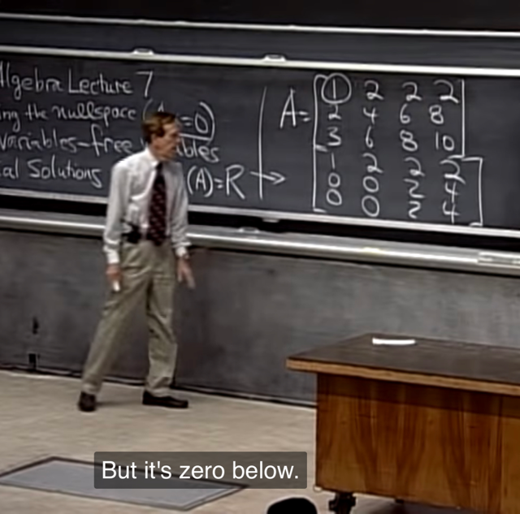</kbd>

> [!NOTE]
> Sau bước này col 1 đã ok, ta move qua col 2. Thì gs nói tôi
> thấy a22 = 0, nhìn xuống dưới a32 tôi hi vọng có thể thấy
> khác 0 để tôi có thể row exchange, nhưng nó cũng bằng 0
> nốt.**Tại đây tôi biết col 2 dependent on col 1** (là linear
> combination của col 1) (vì <2, 0, 0> = 2*<1, 0, 0>, ý chính
> là nếu vị trí a22 và a23 có một cái khác 0 thì ta sẽ không 
> thể thể hiện columns 2 bởi một scalar nào đó * column 1
> được, nhưng nếu chúng đều bằng 0 thì được)

 

<kbd>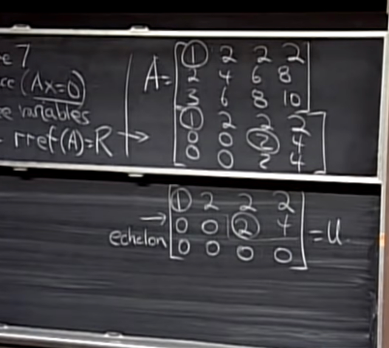</kbd>

> [!NOTE]
> Nói chung với col 2 như vậy, ta sẽ ko làm gì cả, nhìn
> qua col 3, thì a23 là một pivot thứ 2. Ta sẽ **khử đi a33**
> bằng cách **trừ row 3 cho row 2** thành ra  [0 0 0 0]
>
> Xong. Ta có được matrix U, ở dạng row **echelon**.
>
> Có nghĩa là "**bậc thang**"

 

<kbd>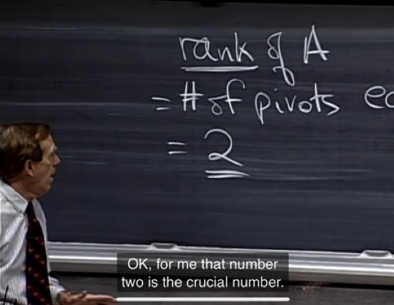</kbd>

> [!NOTE]
> Với **2 pivot**, gs nói tôi có **rank của A là
> bằng 2.**

 

<kbd>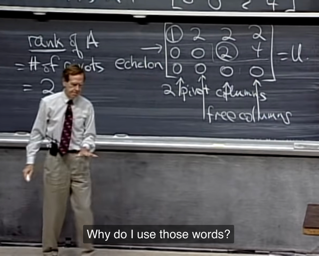</kbd>

> [!NOTE]
> Chú ý **vì bên phải luôn là 0** nên khi ta elimination thì chỉ
> ghi bên trái thôi. Rồi, **vậy nullspace của A cũng là
> nullspace của U** vì**solution của Ax=0 cũng chính là
> solution của Ux=0** (cái này ko có gì phải confuse cả, vì
> quá trình elimination **ko thay đổi nghiệm của hệ phương
> trình**)
>
> Mình có thể hiểu thêm rằng, quá trình elimination cho ta
> EA = U Thế thì nếu x là solution của Ax=0 thì đương nhiên
> điều này suy ra EAx = 0 và suy ra luôn Ux=0 => x cũng là
> solution của Ux=0. Vậy nullspace của A cũng là nullspace
> của U
>
> Ta sẽ gọi col có pivot là **pivot column**, còn lại là **free
> column**

 

<kbd>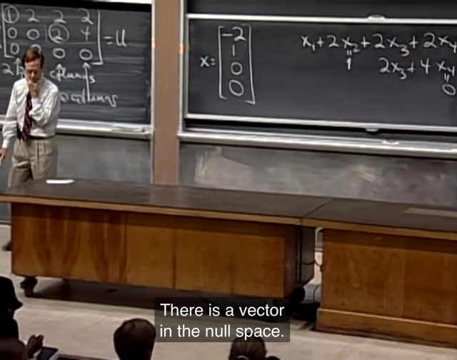</kbd>

🔗 **Related:** [LECTURE 7: SOLVING AX = 0: PIVOT VARIABLES, SPECIAL SOLUTIONS](untitled.md#node-181)

> [!NOTE]
> Gs cho biết **với free column, tôi có thể assign giá trị bất
> kì cho x tương ứng**, ở đây gs cho x2, x4 bằng 1, 0. Viết
> lại Ax = 0 ra (ở dạng hệ phương trình) dễ dàng tính ra x1, x3. 
>
> để có một solution đầu tiên x = [-2, 1, 0, 0].T
>
> **Để rồi ta có một vector khác 0 trong null-space.**
>
> Và đương nhiên scale nó với mọi scalar bất kì cũng được
> một solution, cũng được một vector thuộc nullspace.
>
>  -> x = c * [-2, 1, 0, 0].T

 

<kbd>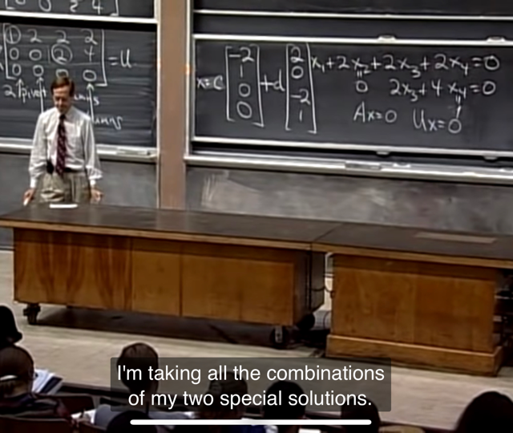</kbd>

> [!NOTE]
> Rồi, tiếp theo để tìm một solution khác, gs **assign x2 = 0, x4
> = 1** (như đã nói **với các free col là col 2, col 4, có thể gán
> bất kì giá trị nào cho x** tương ứng, tức x2 và x4).
>
> Thế vào giải ra x1 = 2, x3 = 1. Và đương nhiên mọi multiple của
> solution này cũng là solution.
>
> **x = d * [2, 0, 1, 1]**
>
> Để rồi ta có **null-space của A** là mọi linear combination
> của  hai vector solution này:
>
> **x = c * [-2, 1, 0, 0].T + d * [2, 0, 1, 1**]
>
> Ở đây gs nói rằng đây là algorithm của gs, assign các x gắn
> với free column lần lượt là 0, 1 và solve các x kia.
>
> Gs gọi các **solution tìm được theo cách thức này là
> SPECIAL SOLUTION.** Nhưng thật ra assign bao nhiêu đều
> được

 

<kbd></kbd>

🔗 **Related:** [LECTURE 8: SOLVING AX = B: ROW REDUCED FORM R](untitled.md#node-211)

🔗 **Related:** [LECTURE 9: INDEPENDECE, BASIS, AND DIMENSION](untitled.md#node-237)

> [!NOTE]
> Thế thì, gs cho biết luật chơi sẽ là:  **SỐ SPECIAL SOLUTION
> LÀ SỐ FREE COLUMN**
>
> Nếu matrix (m, n) có **rank r**, thì **số pivot column là r**, thì
> **số free column sẽ là n-r**.
>
> Và như đã nói **MỌI LINEAR COMBINATION CỦA SPECIAL
> SOLUTION LÀM THÀNH NULL-SPACE**

 

<kbd>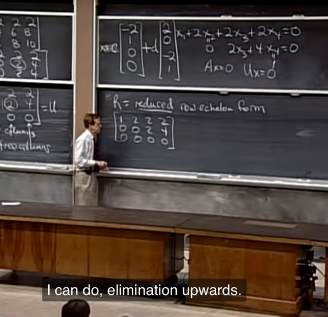</kbd>

> [!NOTE]
> Rồi, gs cho rằng **tôi muốn clean nó hơn nữa**. Để nói
> qua **Reduced Row Echelon form**.
>
> Trước đó gs bảo ta nên **để ý cái zero row**. **Nó từ đâu
> ra?**
>
> -> Nó là vì **row 3 = linear combination của row 1, 2** của
> matrix A và **quá trình elimination đã phát hiện ra và
> eliminate nó đi**

 

<kbd>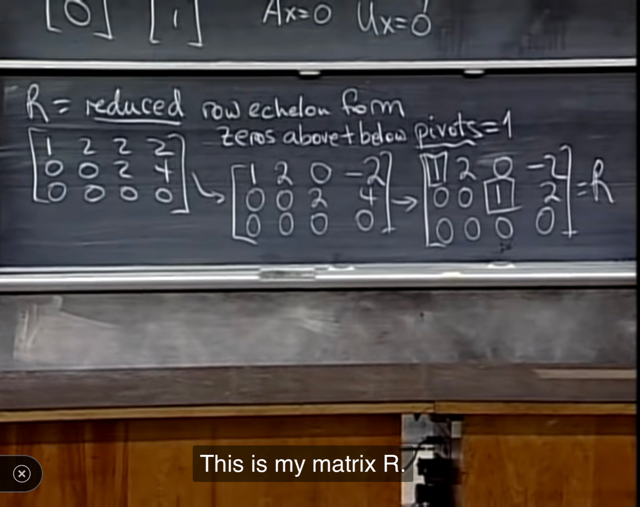</kbd>

🔗 **Related:** [LECTURE 7: SOLVING AX = 0: PIVOT VARIABLES, SPECIAL SOLUTIONS](untitled.md#node-186)

> [!NOTE]
> Để có dạng **REDUCE ROW ECHELON FORM**, ta
> **MUỐN CÁC VỊ TRÍ Ở TRÊN VÀ DƯỚI PIVOT ĐỀU
> BẰNG 0**. Vậy ta sẽ trừ row 1 cho row 2 để có điều này.
>
> Có thể tiếp tục clean hơn nữa: **CHO PIVOT BẰNG 1
> HẾT**. -> Chia row 2 cho pivot

 

<kbd>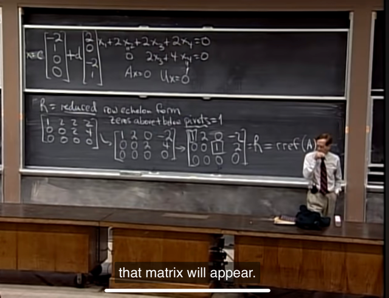</kbd>

> [!NOTE]
> Trong matlab, rref(A) sẽ cho
> ta matrix này của A

 

<kbd>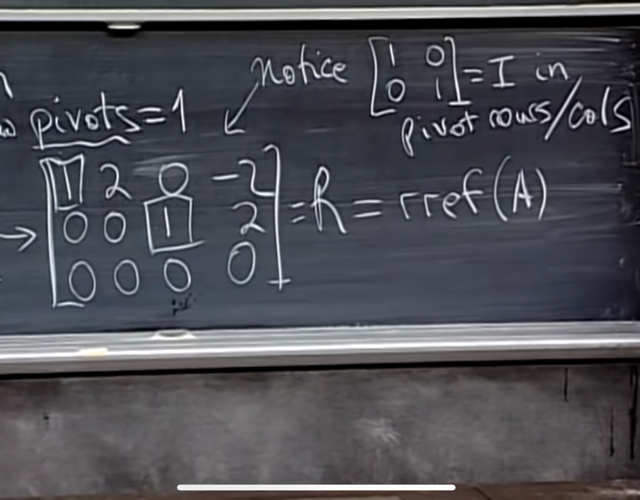</kbd>

> [!NOTE]
> Gs yêu cầu ta chú ý là **có một Identity matrix trong các
> pivot row và column**(điều này sẽ cho ta thấy các row /
> column này độc lập nhau, vì không thể nhân row này  hay
> column này với số gì mà cho ra row kia / column kia được.
> Ví dụ số 1 của pivot column 1 ứng với số 0 của pivot
> column 2 thì **không có cách gì nhân column 2 với số nào
> để từ 0 cho ra 1 được**. Ngược lại số 0 ở vị trí thứ 2 của
> column 1 cũng không thể nhân với cái gì để ra số 1 ở vị trí
> thứ 2 của column 2 được. Do đó hai column này độc lập.
> Với row cũng tương tự.
>
> Còn **row cuối cùng bằng 0** cho ta biết **trong matrix A
> ban đầu**, r**ow 3 là linear combination của hai row kia**,
> nên nó đã **bị eliminate trong quá trình elimination**

 

<kbd>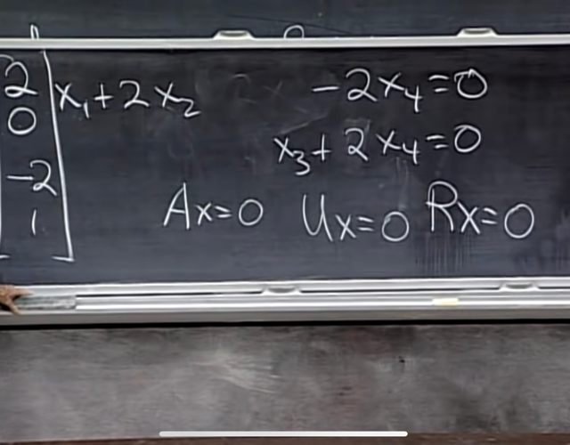</kbd>

> [!NOTE]
> Rồi quay lại lắp x vô dạng reduced row echelon form.
> Để có Rx=0. Gs nhấn mạnh phải hiểu rằng **solution
> của Ax=0,Ux=0 hay Rx=0 là như nhau**

 

<kbd>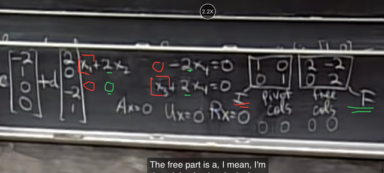</kbd>

<kbd>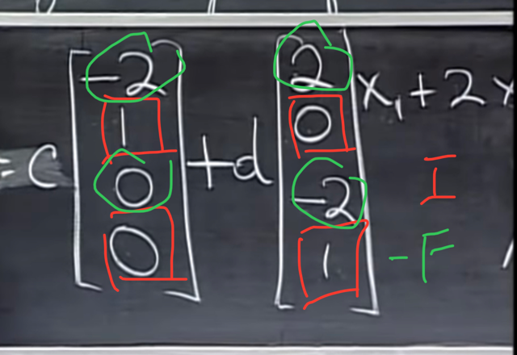</kbd>

<kbd></kbd>

<kbd></kbd>

<kbd>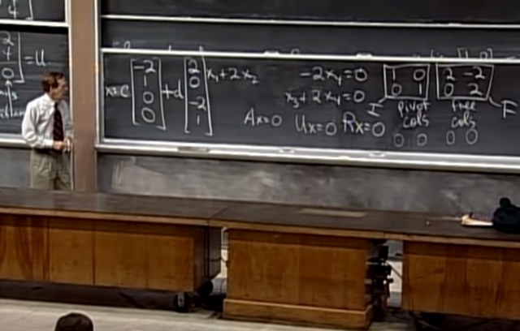</kbd>

> [!NOTE]
> Đại ý là gs chỉ ra rằng các pivot row và col (đương nhiên
> ko kể cái row 3 = 0 coi như bỏ) tạo một identity matrix I.
> Các free row và col tạo matrex gs đặt là F
>
> Thế thì, nhìn vào **special solution** hồi nãy, ta thấy rõ mồn
> một rằng, **nó được tạo bởi các giá trị của I và F** (F
> ngược dấu, khúc này gs nói gì đó ko rõ)

 

<kbd>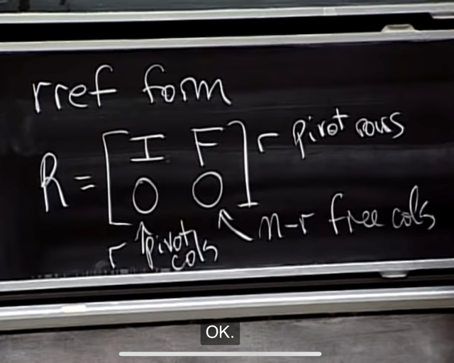</kbd>

> [!NOTE]
> Đại khái là gs sẽ cho thấy **điều mới nói (rằng special
> solution đương nhiên phải chứa I và F, ko phải magic)**
> mà dĩ nhiên nó phải thế và ta sẽ chứng minh
>
> Gs cho biết một dạng typical của RREF có thể khái quát
> như vầy. Các **pivot row và col "xuất hiện" trước**,
> **sau đó là các free row và col**

 

<kbd>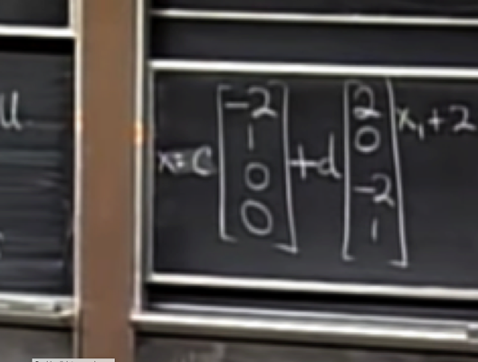</kbd>

<kbd></kbd>

<kbd>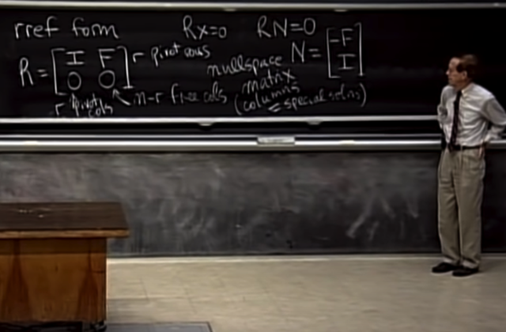</kbd>

> [!NOTE]
> Gs nói rằng với dạng typical này, tôi sẽ tìm mọi solution của
> Rx=0 "cùng một lúc" - tức là một dạng khái quát của solution
> luôn. Gs mới nói để làm vậy tôi sẽ tìm nullspace matrix của R
> - là matrix N khiến RN = 0 trong đó column của N sẽ là special
> solution.
>
> Vậy thì để RN=0 thì N sẽ có dạng như vầy [-F I ].T
>
> vì khi nhân vào ta sẽ có (cứ làm theo block):
>
> RN = -F * [I O].T + I * [F O].T (nhân matrix A với col b = linear
> combination của matrix A's col với coeff là các phần tử của
> b)
>
> = [-FI -FO].T + [IF + IO] = [(-FI + IF) (O + O)] = [O O]
>
> Và như vậy đã có thể c**hứng minh rằng special solution
> đương nhiên phải có dạng như hồi nãy** nói đó là bao gồm
> cột của I và cột của F. Ví dụ solution thứ 1 là [1 0 -2 0].T
> solution thứ 2 là [0 1 2 -2].T
>
> (Chú ý là đang xét **dạng điển hình**, thì **pivot cols/rows đứng
> trước free cols/rows**

 

<kbd>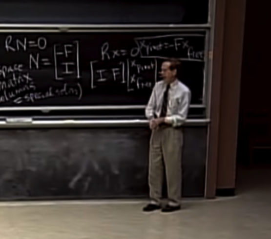</kbd>

<kbd></kbd>

<kbd>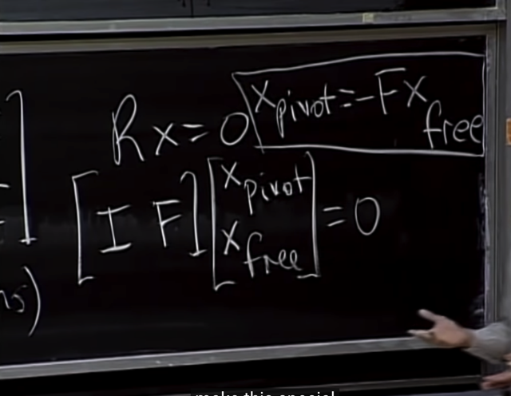</kbd>

> [!NOTE]
> đại khái là vì sao lại có thể có matrix nullspace N là như
> vậy thì đơn giản thôi, ta triển khai Rx = 0. Với R là [I F] (cột
> và hàng của I rồi tới F).
>
> x = [xpivot, xfree] (xpivot kiểu như xpivot là variable ứng
> với các col của pivot matrix)
>
> Thì từ công thức này, bằng cách chọn xfree đặc biệt = I,
> thì ta có xpivot = -F. Để rồi ta có N.
>
> Nói chung là sự **giải thích** cho việc ta **có thể có một quy
> trình để tìm Special Solution** cũng như nullspace

 

<kbd>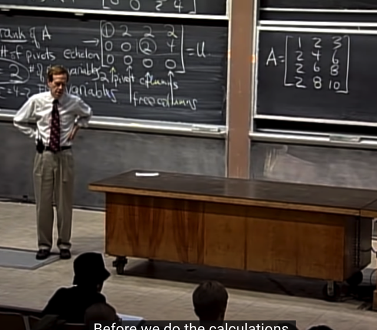</kbd>

> [!NOTE]
> Gs lấy một ví dụ khác và đặt câu hỏi là ta có thể nhận xét gì
> về matrix A này. Cụ thể là **có bao nhiêu pivot variable**?
>
> Ta thấy col 3 = col 1 + col 2 nên ta**chỉ có 2 col
> independence**. Do đó **rank r=2**, đồng nghĩa ta sẽ **chỉ có 2
> pivot variable** ứng với hai independence column. Và
> **n-r=3-2=1 free columns** hay free variable
>
> Và quá trình **elimination sẽ làm rõ cho ta thấy** điều đó, cũng
> như là nó cũng sẽ **vạch trần các dependence rows**, **bằng
> cách biến chúng thành 0.**

 

<kbd>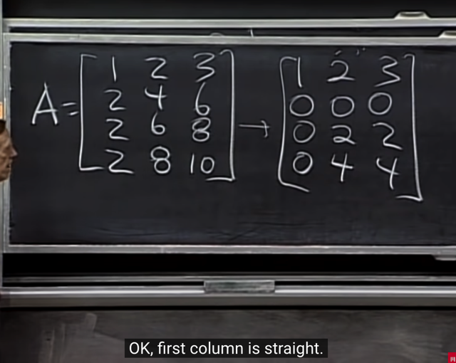</kbd>

> [!NOTE]
> Qua ví dụ khác
>
> Bắt đầu elimination: 
>
> Trừ hàng 2 cho 2*hàng 1. 
>
> Trừ hàng 3 cho 2* hàng 1. 
>
> Trừ hàng 4 cho 2*hàng 1

 

<kbd>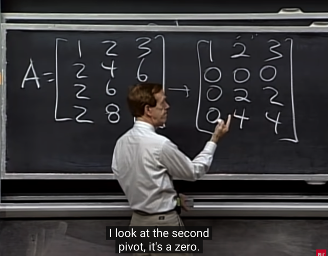</kbd>

> [!NOTE]
> Lúc này ta có vị trí pivot thứ 2 bằng 0, nhìn xuống dưới thấy 
> số 2 (khác 0) nên ta sẽ thực hiện **row exchange**. Đổi hàng 2
> cho hàng 3.

 

<kbd>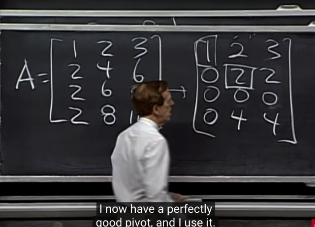</kbd>

> [!NOTE]
> Thế là ta có 2 pivot hợp lệ. Tiếp ta sẽ trừ hàng 4
> cho 2*hàng 2 để khử vị trí số 4.

 

<kbd>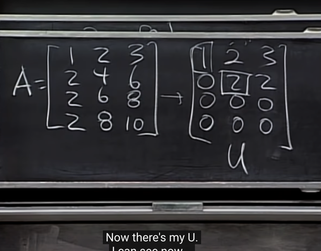</kbd>

🔗 **Related:** [LECTURE 4: FACTORIZATION INTO A = LU](untitled.md#node-89)

> [!NOTE]
> Thế là ta đã có matrix U - mà mình nhớ là viết tắt của
> **Upper triangular matrix** (số khác 0 ở trên đường chéo)

 

<kbd>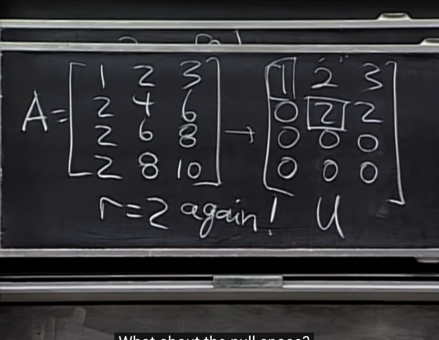</kbd>

🔗 **Related:** [LECTURE 7: SOLVING AX = 0: PIVOT VARIABLES, SPECIAL SOLUTIONS](untitled.md#node-164)

> [!NOTE]
> với col 3 thì vị trí pivot = 0, nhìn xuống dưới cũng 0, nên
> không làm gì được nữa. Vậy ta **có 2 pivot**. Đồng nghĩa
> **rank = 2**.
>
> Gs hỏi: Vậy nullspace thì sao, **có bao nhiêu special
> solution**?
>
> Thử trả lời: Vì có 3 col, mà 2 pivot cols tương đương với 2
> pivot variable x1 x2 và 1 free col tương  đương 1 free
> variable x3.
>
> Theo như hồi nãy thì ta sẽ set một giá trị tùy ý cho free
> variable rồi "thế vào lại" (back subtitution) tính ra pivot
> variable x1, x2.
>
> Có nghĩa là có 1 special solution ứng với 1 free columns

 

<kbd>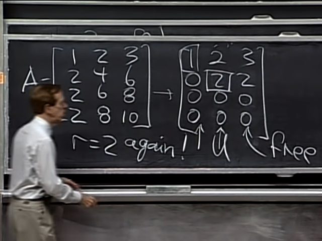</kbd>

 

<kbd>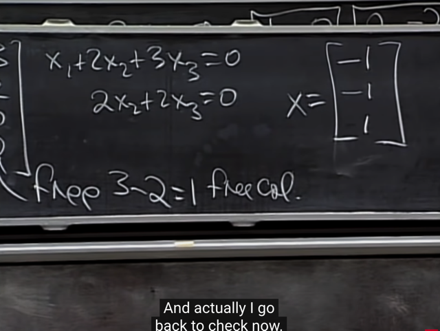</kbd>

🔗 **Related:** [LECTURE 2: ELIMINATION WITH MATRICES](untitled.md#node-34)

> [!NOTE]
> Và gs chọn x3 (free variable) = 1, thế vô hệ phương
> trình tính ra x2 = -1, x1 = -1. Vậy một solution tìm được
> là [-1 -1 1].T
>
> Và có thể nhận thấy solution tìm thấy sẽ **biểu thị sự
> phụ thuộc của col 3 với col 1 và col 2** khi  n**hìn nhận
> Ax theo column view là linear combination của các col
> của A với các coeff là giá trị của x**
>
> **-1** * col 1 **-1** * col 2 + **1** * col 3 = 0
>
> <-> **col 3 = col 1 + col 2**

 

<kbd>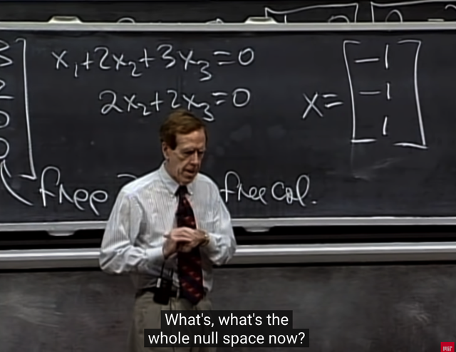</kbd>

> [!NOTE]
> Gs hỏi **vậy null space của A là g**ì.
>
> -> Thử trả lời: Đó là **mọi linear combination của
> special solution** mà chỉ có 1 special solution nên
> (mọi linear combination của nó) là một line trong 3D
> space.

 

<kbd>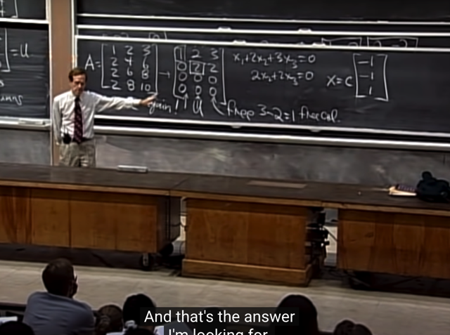</kbd>

> [!NOTE]
> Chính xác: multiple với với C, bất kì (cũng chính là
> linear combination của vector x) ta sẽ có nullspace, là
> một line.
>
> Và gs cho biết khi gặp **câu hỏi tìm null space của
> matrix**, mình sẽ làm tương tự đó là 
>
> i) elimination, để **xác định được pivot cols** và **free cols**. 
>
> ii) sau đó **chọn giá trị tùy ý cho free variable** và **back 
> substitution để tính ra pivot variable** -> **Special solutions**
> iii) có được special solution rồi thì **mọi linear combination
> của chúng chính là nullspace.**
>
> ===
>
> Ngoài ra nói thêm, nếu hỏi **basis của null space** thì nó
> chính là **vector special solution**

 

<kbd>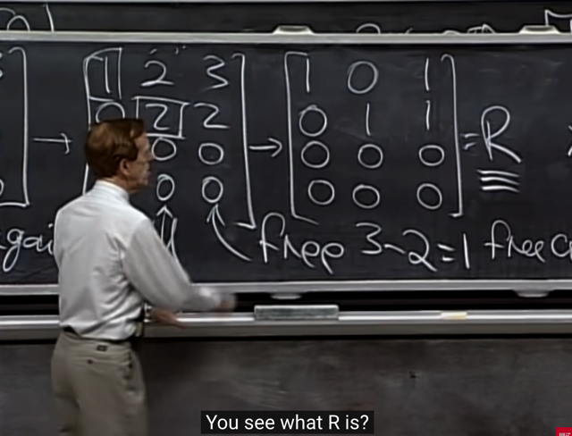</kbd>

🔗 **Related:** [LECTURE 7: SOLVING AX = 0: PIVOT VARIABLES, SPECIAL SOLUTIONS](untitled.md#node-168)

> [!NOTE]
> tiếp theo gs nói chúng ta sẽ làm tiếp, để đi đến dạng 
> REDUCED row echelone tức là tìm matrix R. 
>
> Như đã biết ở dạng Reduced Row Echelon thì mọi vị trí
> không phải pivot đều là 0 và pivot là 1. Nên ta sẽ:
>
> Trừ hàng 1 cho hàng 2, (để trong mỗi cột chỉ có pivot 
> là khác 0) và chia hàng 2 cho 1 để đưa các pivot thành 1

 

<kbd>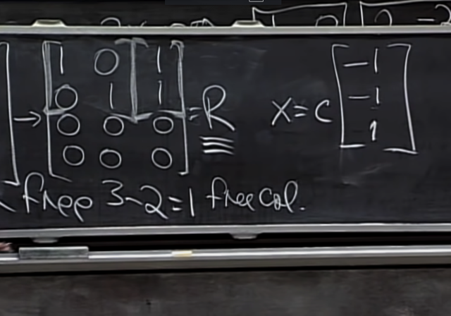</kbd>

> [!NOTE]
> và một lần nữa ta thấy:
>
> Hai pivot cols tạo nên một Identity matrix I
>
> Còn free cols tạo nên một Free matrix F (chỉ có một
> free cols nên F chỉ có 1 cols)

 

<kbd>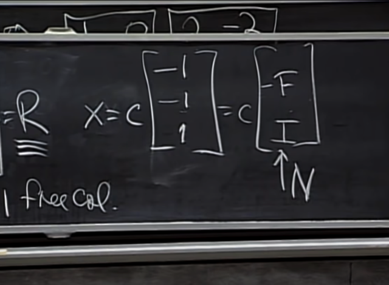</kbd>

> [!NOTE]
> Và khi soi chiếu với công thức của null space mà ta đã
> cùng nhau chứng minh hồi nãy: N = [-F I].T
>
> Chứng minh lại: Rx=0, R = [I F], x =[xpivot xfree]
>
> Rx=I*xpivot + F*xfree = 0 <=> xpivot = -F*xfree
>
> Chọn xfree = I thì xpivot = -F. Nên special solution là [-F I].T
>
> Thì nhìn vào special solution x = [-1 -1 1] mới tìm được thì
> đúng là **special solution chính là khi ta cho free variable
> bằng dạng đặc biệt, = I (tức là 1)** thì các pivot variable sẽ
> chính là = -F = [-1, -1]

> [!NOTE]
> **Nullspace matrix** là matrix mà **col chính là
> special solution**

 

