# Lecture 8: Solving Ax = B: Row Reduced Form R

📊 **Progress:** `38` Notes | `39` Screenshots

---

<kbd></kbd>

> [!NOTE]
> đây là lecture cuối mà ta sẽ finish việc giải một
> **linear equation system Ax = b**
>
> Để trả lời câu hỏi (như trong Ax=0 đã làm) là, nó **có
> solution không?** nếu có thì **nó là gì?**

 

<kbd>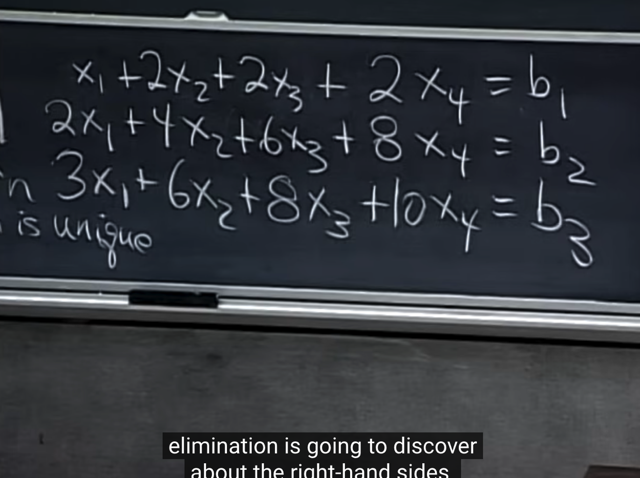</kbd>

> [!NOTE]
> đại khái gs nói, nhìn bên trái có thể thấy row 1 + row 2 =
> row 3
>
> Thế thì, ta có thể **đoán** được là,**muốn hệ phương
> trình có nghiệm** thì các giá trị của b **phải sao cho b1 +
> b2 phải bằng b3**. Tí nữa mình **sẽ** **xem elimination
> cho thấy điều đó**.
>
> Còn bây giờ, có thể hiểu được điều này là vì, **vì hàng 3
> không độc lập** nên như đã thấy ở những bài trước,**quá
> trình elimination sẽ biến nó thành [0 0 0].**
>
> Và với Ax=b thì ở **vế bên phải cũng áp dụng các bước
> của quá trình elimination** như bên trái, nên **nếu b3
> không bằng b1 + b2** thì sau khi elimination ở equation
> thứ 3, **bên trái bằng 0 nhưng bên phải khác 0** ->
> phương trình vô nghiệm

 

<kbd>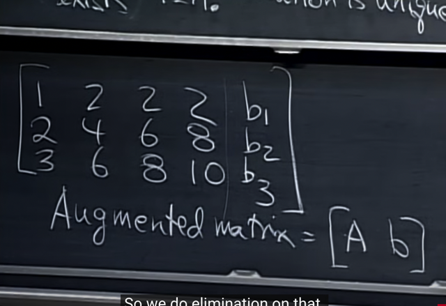</kbd>

> [!NOTE]
> Ta sẽ thực hiện quá trình elimination, và các bước này sẽ
> apply cho cả bên phải và trái. Do đó, ta sẽ **ghép cột b
> thành một cột của A** để có cái gọi là **Augmented matrix**[A b] và ta sẽ làm (elimination) trên nó.

 

<kbd>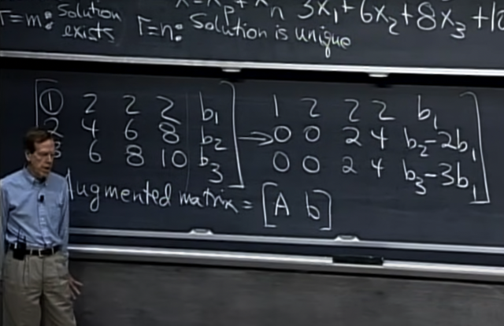</kbd>

> [!NOTE]
> Rồi, bắt đầu quá trình elimination: Đầu tiên ta đã có pivot
> đầu tiên ok rồi, nên ta sẽ khử A21, A31 - những vị trí dưới
> pivot (quá trình elimination là tạo ra dạng Row Echelon=
> dạng bậc thang, trong đó bên dưới pivot = 0)
>
> -Khử A22: Trừ hàng 2 cho 2*hàng 1 -> [0 0 2 4 b2-2b1]
> -Khử A32: Trừ hàng 3 cho 3*hàng 1 -> [0 0 2 4 b3-3b1]

 

<kbd></kbd>

<kbd></kbd>

<kbd>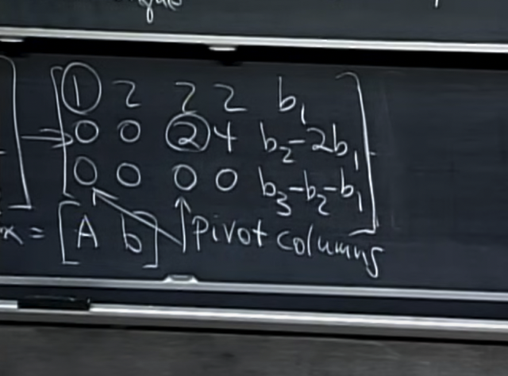</kbd>

> [!NOTE]
> vậy ta có **col 2 không có pivot**, nó là **free col**, col 3 có
> pivot là 2, nên nó là pivot column. Nếu có quên thì **pivot**
> là tuân theo rule sau:
>
> - Pivot (đương nhiên phải khác 0) của hàng dưới**luôn
> nằm  bên phải hàng trên.**
>
> - **Bên dưới pivot = 0**.
>
> - Ở dạng **Reduce** Row Echelon thì có thêm yêu cầu
> **chuyển  pivot = 1**, và**khử luôn các giá trị bên trên
> pivot** để trong pivot col **chỉ có pivot là khác 0**.
>
> Rồi, ta tiếp tục bước nữa, hủy A33 để finished col 3.
>
> Có thể thấy sau bước này, **row 4 đã bị set thành 0 hết.**

 

<kbd>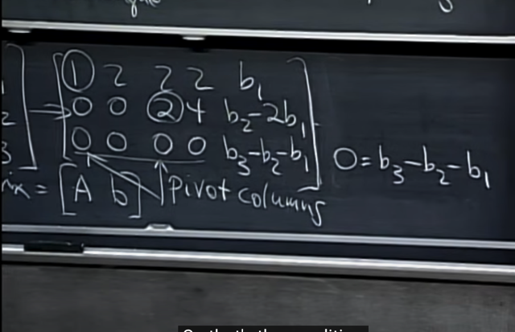</kbd>

> [!NOTE]
> đến đây ta **xác nhận lại được nhận định ban đầu** về điều
> kiện của b n**ếu muốn equation system có solution:** đó là
> **b3 phải bằng b1 + b2**

 

<kbd>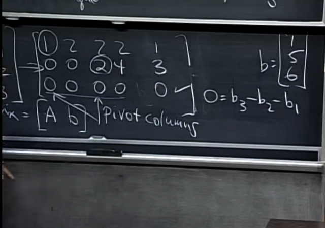</kbd>

> [!NOTE]
> Với nhận định này, **gs giả sử b là [1, 5, 6]**, (thế vào)
> để thấy **quá trình elimination** sẽ **biến phần bên phải
> thành [1 3 0]**

 

<kbd>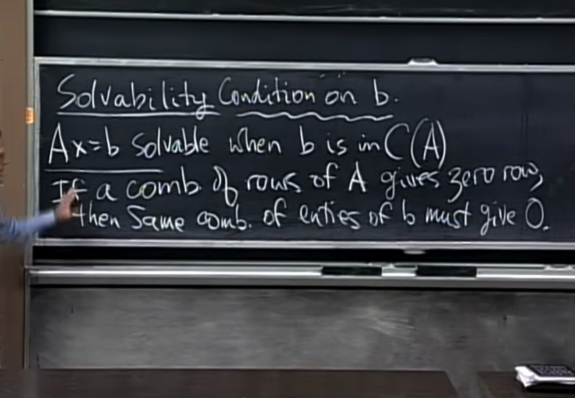</kbd>

> [!NOTE]
> Từ đó ta **có thể kết luận rằng**: **nếu có một linear
> combination giữa các row của A tạo ra kết qủa bằng
> 0-row** ... thì system equation chỉ khi có solution khi **cùng
> một linear combination đó của các component của b
> phải cho ra 0**
>
> Theo đó ta đã trả lời được câu hỏi đầu tiên - EquaSys
> có solution không?

 

<kbd>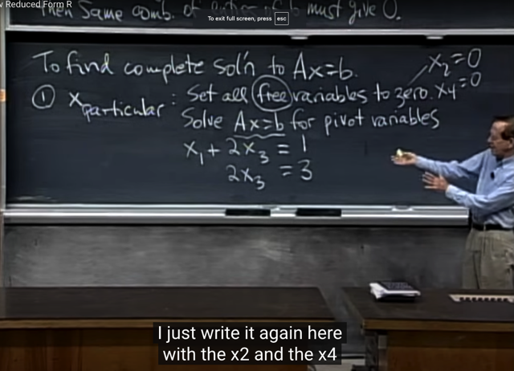</kbd>

> [!NOTE]
> Thế thì tiếp theo ta sẽ **tìm một quy trình để giải ra
> solution.** Đầu tiên gs nói trước rằng, ta có **4 variable**
> với **chỉ có 2 pivot** như vậy đồng nghĩa là **sẽ có vô số
> solution**.
>
> Vậy đầu tiên ta sẽ**tìm cách tìm một "particular"
> solution** bằng cách **cho các free variable bằng giá trị
> nào đó**, rồi**từ đó tìm pivot variable**. Vậy thì đơn giản
> nhất là **cho free variable = 0**. Hệ phương trình trở
> thành như vầy

 

<kbd>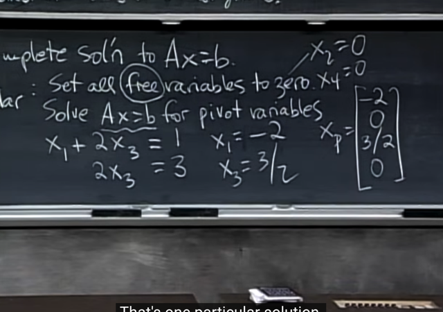</kbd>

> [!NOTE]
> **backsubstitution các free variable x2, x4 vào** giải ra x1,
> x3 và ta có **x_particular** (particular solution)
>
> Tuy nhiên, cái ta cần là**tìm ra mọi solution.**

 

<kbd>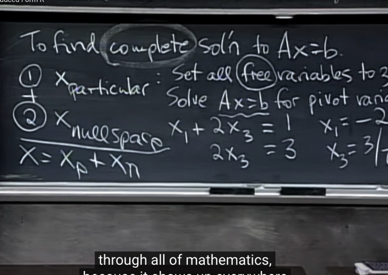</kbd>

🔗 **Related:** [LECTURE 13: QUIZ REVIEW](untitled.md#node-378)

> [!NOTE]
> Để có toàn bộ solution (complete solution), gs đề nghị ta tìm
> **nullspace - như đã biết ở bài trước là tập hợp các vector x thỏa
> Ax = 0.**
>
> Khi đó, bằng cách **kết hợp x_particular với bất kì vector x_null
> nào thuộc nullspace**, ta **đều có thêm một solution**.
>
> Hay nói cách khác **x_particular + nullspace** sẽ là **tập hợp
> toàn bộ solution của Ax=b**

 

<kbd>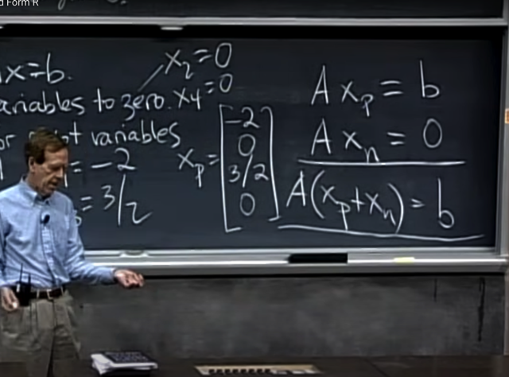</kbd>

> [!NOTE]
> Tại sao lại như vậy, tại sao một x trong nullspace cộng với
> x_particular cũng sẽ là một solution của Ax=b Để rồi dẫn
> đến nếu ta lấy mọi vector trong nullspace cộng với một
> x_particular thì ta sẽ được toàn bộ  solution của Ax = b?
>
> Thế thì gọi x_p là x_particular, ta có Ax_p = b
>
> và gọi x_null là vector trong nullspace của A, tức là ta có 
> Ax_null = 0
>
> Vậy cộng hai vế của hai equation lại ta có:
>
> Ax_p + Ax_null = b + 0 <=>
>
> A(x_p + x_null) = b 
>
> Và điều này có nghĩa là (x_p + x_null) cũng là solution của
> Ax = b

 

<kbd>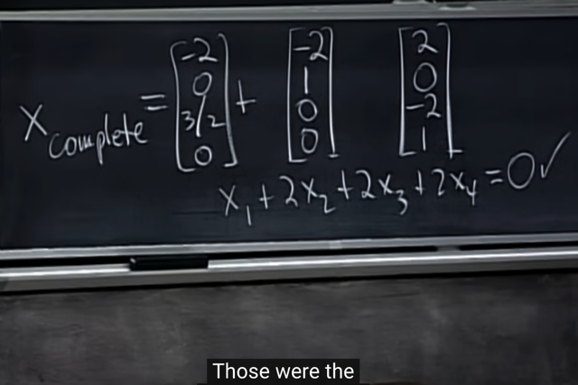</kbd>

<kbd></kbd>

<kbd>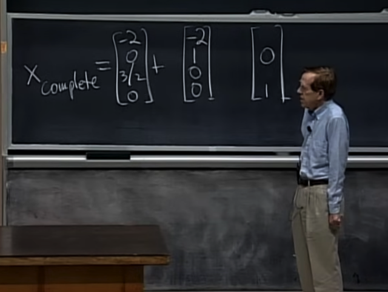</kbd>

> [!NOTE]
> Thế thì để tìm nullspace thì ta đã biết ở bài trước, nó **chính
> là mọi linear combination của các special solutions.**
>
> Special solutions là cái mà ta có khi cho free variable các 
> giá trị 1,0, và 0,1. Nên**đầu tiên ta sẽ tìm special solution**

 

<kbd>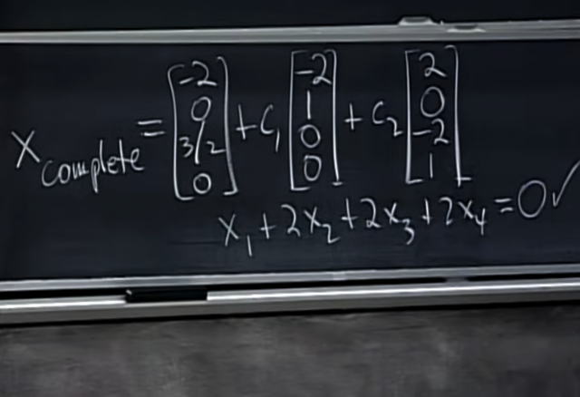</kbd>

> [!NOTE]
> và như vậy ta có **complete solution**

 

<kbd>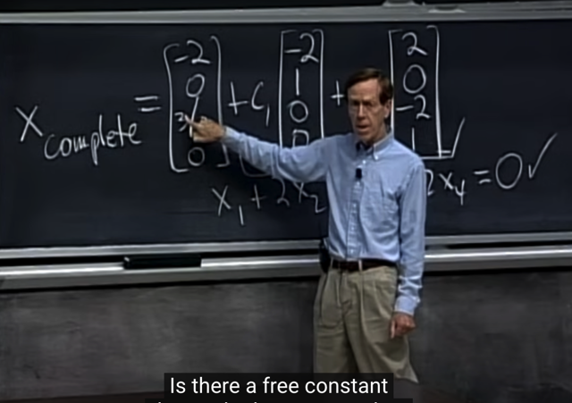</kbd>

> [!NOTE]
> Thầy hỏi là có thể nhân một constant vào x_particular
> không (tương tự như c với d của các special solution)?
>
> Me: Không, vì **tuy Ax=b thì A*constant *x chưa chắc
> bằng b**, nên **scale của x không phải là solution mới của
> Ax=b**

 

<kbd>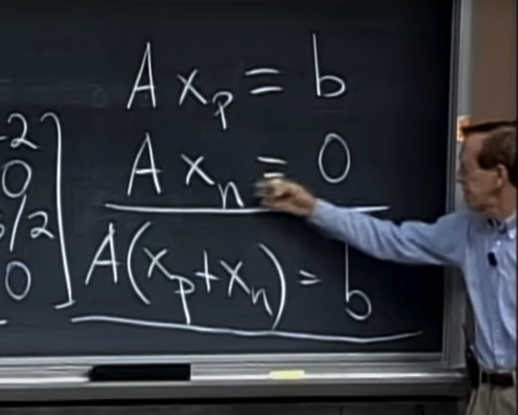</kbd>

> [!NOTE]
> Đúng rồi, vì x_particular là solution của Ax = b, scale
> xp thì nó không còn là solution. **Nhưng scale x_null
> thì nó vẫn là solution của Ax = 0**, tức nó vẫn là thuộc
> nullspace

 

<kbd>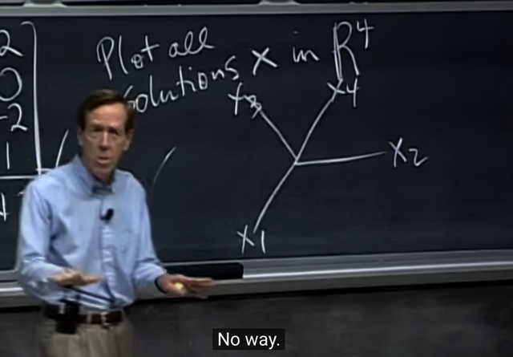</kbd>

> [!NOTE]
> tiếp gs nói chúng ta hãy **plot mọi solution** ra xem nó là cái
> gì, **nó có phải là một subspace không?**
>
> Thì đầu tiên là ta đang trong R4 (vì có 4 variable x1,x2,x3,
> x4)

 

<kbd>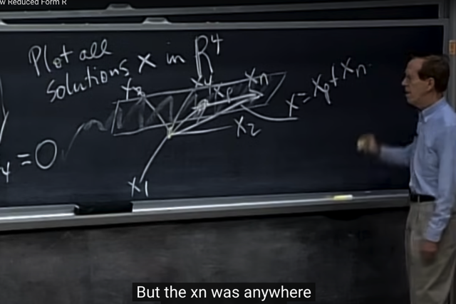</kbd>

> [!NOTE]
> Ok, thế thì như đã thấy tập hợp solution (**complete
> solution**) bao gồm **mọi vector trong nullspace** cộng với
> vector **x_particular.**
>
> Mà **mọi vector trong null-space** là mọi linear combination
> của hai vector special solution - thì nó **tạo thành một 2D
> plane trong không gian 4D**.
>
> Thành ra tập hợp mọi nghiệm sẽ là: vector (tức điểm) x_p
> + một vector bất kì của cái 2D plane của nullspace, thì sẽ
> thành ra là một **CÁI 2D PLANE CÓ ĐI QUA X_P:**Nói rõ
> hơn là, nullspace (mọi linear combination của special solution)
> là một 2D plane (đương nhiên có đi qua O) và x_p là một điểm
> nằm đâu đó (ngoài nullspace). Thế thì khi lấy mọi vector trong 
> nullspace plane + x_p ta sẽ được một plane khác, có đi qua 
> x_p nhưng không đi qua 0.
>
> V**à cái 2D plane này không phải là subspace**, vì nó
> **không đi qua gốc O**, mà như đã biết subspace thì phải đi
> qua gốc O

 

<kbd>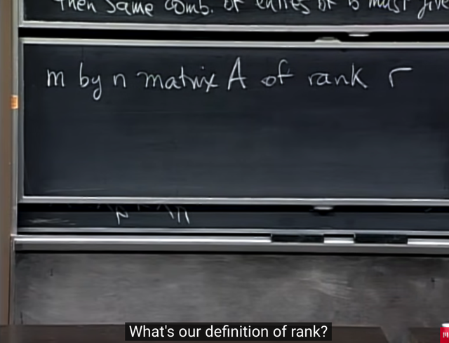</kbd>

> [!NOTE]
> Rồi, thế là ta đã có algorithm để **tìm mọi solution của
> Ax=b:** **Tìm particular solution**, rồi **tìm nullspace** bằng
> cách tìm **special solution** của để rồi tạo nên **complete** 
> solution:
>
> **x = x_particular + nullspace** (=linear combination của
> special solution)
>
> Tiếp gs đề nghị ta nghĩ rộng hơn, với matrix m,n có rank
> r, với định nghĩa hiện tại của rank là số pivot. thì gs đặt câu
> hỏi là **m, n quan hệ với rank r như thế nào?**

 

<kbd>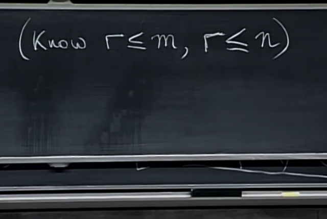</kbd>

> [!NOTE]
> nhớ lại rằng **nếu mọi chuyện đều tốt** thì ta sẽ có **mỗi hàng
> một pivot**, vậy **số pivot không thể lớn hơn số hàng**.
>
> Tương tự, **mỗi cột cùng lắm có một pivot** nên **số pivot cũng
> không thể lớn hơn số cột**.
>
> Vậy**r <= m**, và **r <= n**
>
> Vậy ở đây có thể thấy với một matrix m,n thì rank của nó
> có g**iá trị tối đa là cái nhỏ hơn trong hai cái m, n**Ví dụ matrix cao ốm 3x2 thì rank chỉ có thể bằng 2 trở xuống
> vì với 2 cột thì tối đa chỉ có 2 pivot

 

<kbd>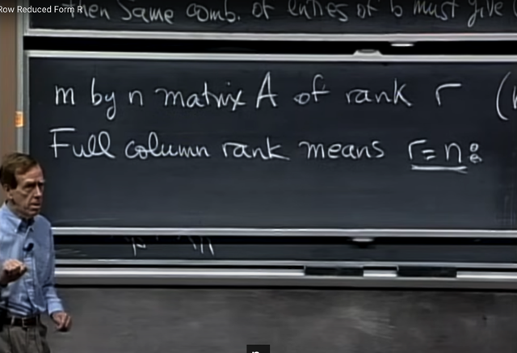</kbd>

> [!NOTE]
> Thầy nói giờ ta sẽ quan tâm đến**FULL RANK**, thế thì
> rõ ràng, **rank có maximum là thằng nhỏ nhất trong  m và
> n**. Ví dụ nếu 3 hàng 2 cột thì rank sẽ maximum là bằng
> 2.
>
> Vậy thầy đặt câu hỏi là **giả sử r = n** (tức rank = số cột)
> thì ta **có thể kết luận gì với Nullspace?**
>
> => Thử trả lời: r = n tức bằng số cột, có nghĩa là ta có
> trạng thái **mọi column đều là pivot column**, hay, ta có
> **n pivot** và **ko có free variable nào.**

 

<kbd>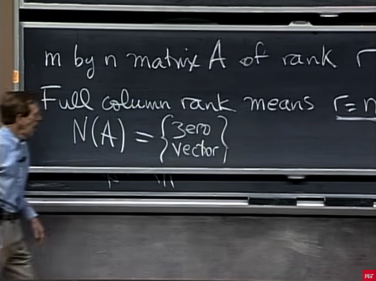</kbd>

🔗 **Related:** [LECTURE 7: SOLVING AX = 0: PIVOT VARIABLES, SPECIAL SOLUTIONS](untitled.md#node-166)

> [!NOTE]
> và vì **không có free variable nào**, mà ta đã được biết khi 
> tìm nullspace, ta sẽ xác định free column và pivot column
> để rồi với free variable, ta mới chọn giá trị tùy ý cho nó
> và thế vào lại (back-substitution) tính ra pivot variable, để
> thành ra special solution. 
>
> Và **SỐ SPECIAL SOLUTION CHÍNH LÀ SỐ FREE COLUMN** 
> (Theo đường dẫn), vậy suy ra trong trường hợp này ta**ko
> có special solution nào**, đương nhiên cũng không có linear
> combination nào của special solution. Dẫn đến **nullspace chỉ
> tồn tại vector 0**
>
> (Nó**ít nhất cũng có vector 0** vì**nullspace là subspace**, là một
> vector space, nên nó **phải ít nhất cũng chứa origin = vector 0**)

 

<kbd>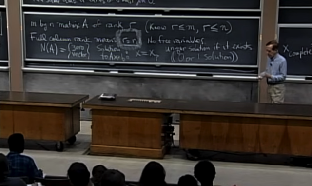</kbd>

> [!NOTE]
> Và hệ quả là đối với Ax = b, như đã biết, complete solution
> là bao gồm x_particular solution + nullspace, mà nullspace
> = 0 rồi, thành ra **complete solution của Ax=b chỉ còn là
> x_particular nếu có**. Còn nếu x_particular không có luôn thì
> Ax=b vô nghiệm
>
> Vậy Ax=b có thể VÔ NGHIỆM nếu x_particular không tồn tại
> hoặc CÓ MỘT NGHIỆM là x_particular nếu nó tồn tại.

 

<kbd>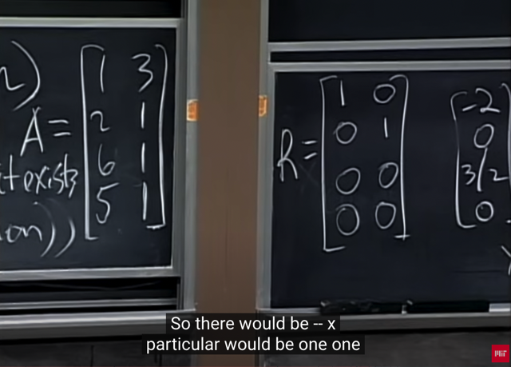</kbd>

> [!NOTE]
> Gs lấy ví dụ của một **full column rank.** matrix A này có
> 2 independent columns, (hai vector này sẽ chỉa ra hai
> hướng khác nhau), rank của nó sẽ = số Independence
> columns = 2.
>
> Và thầy nói khi ta dùng elimination đưa nó về Reduced
> Row****Echelon Form thì nó sẽ có dạng như vầy: hai hàng
> đầu tạo một Identity matrix, hai hàng dưới sẽ tạo Free
> matrix chỉ toàn số 0

 

<kbd>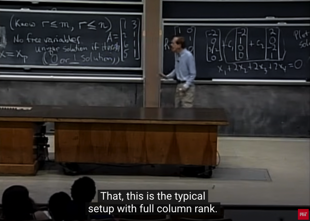</kbd>

> [!NOTE]
> Rồi như vậy đây là ví dụ của một full column rank ta sẽ có
> nullspace = 0:
>
> Thật vậy, ta có hai linear independent columns, nên không có
> cách nào ngoại trừ hai coefficient đều bằng 0 để tạo linear
> combination của hai vector column thành 0.
>
> Còn nếu xét Ax=b, thì có phải là nó sẽ luôn có solution
> không?
>
> Không, như đã nói nó sẽ nhiều nhất là chỉ có một solution,
> nếu x_particular tồn tại, đó là khi b là một linear combination
> của columns. Ví dụ b là 1*[col 1] + 1*[col 2] thì Ax=b sẽ chỉ
> có một solution là [1 1].

> [!NOTE]
> Full Column Rank: Ax=b chỉ có 1 solution nếu b là linear
> combination của A's columns

 

<kbd>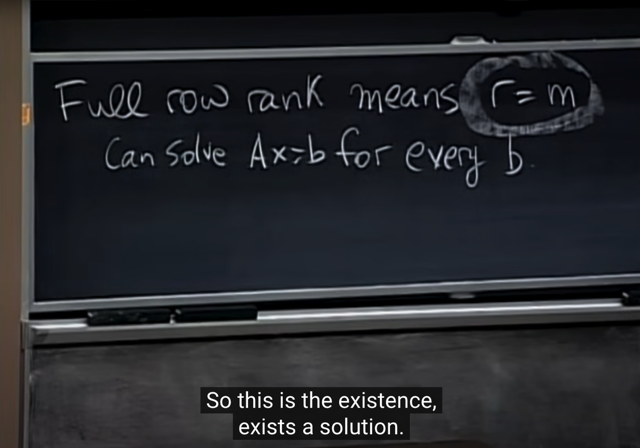</kbd>

> [!NOTE]
> Qua trường hợp **Full Row Rank** tức **r = m**. Có nghĩa **mỗi row
> đều có một pivot**. Thầy hỏi là xét điều kiện có nghiệm của
> Ax = b sẽ như thế nào?
>
> -> Mỗi hàng đều có một pivot, nên quá trình elimination sẽ
> **không biến hàng nào thành 0 hết**. Nhớ lại câu chuyện hồi
> nãy, nếu elimination biến một hàng thành 0, thì muốn  Ax=b
> có solution thì phải yêu cầu là cũng các bước elimination đó
> biến phần tử tương ứng của vector b thành 0. (Nếu không
> thỏa điều kiện này đương nhiên ta sẽ có một equation của
> Ux=0 có dạng {0 ..0} = {khác 0} -> không thể solve được ->
> equation system vô nghiệm)
>
> Mà **nguyên nhân gốc rễ** **một hàng bị eliminate thành 0** là do
> **nó bị phụ thuộc tuyến tính** với các hàng khác, thành ra
> muốn thỏa điều kiện trên thì phần tử tương ứng với hàng bị
> set thành 0 cũng phải phụ thuộc tuyến tính với các phần tử
> khác.
>
> Vậy quay lại đây, nếu elimination không tạo ra hàng 0 nào
> thì đồng nghĩa cũng k**hông có yêu cầu nào với b** => Luôn
> có solution với mọi b

> [!NOTE]
> Full Row Rank: Ax=b luôn có solutions với mọi b

 

<kbd>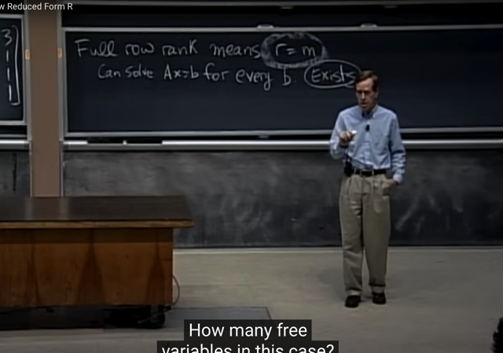</kbd>

> [!NOTE]
> Thầy: Có bao nhiêu free variable?
>
> -> Mọi hàng đều có pivot, mà ở đây đương nhiên m <= n,
> nên số pivot = m, số free variable sẽ là n - r = n - m

 

<kbd>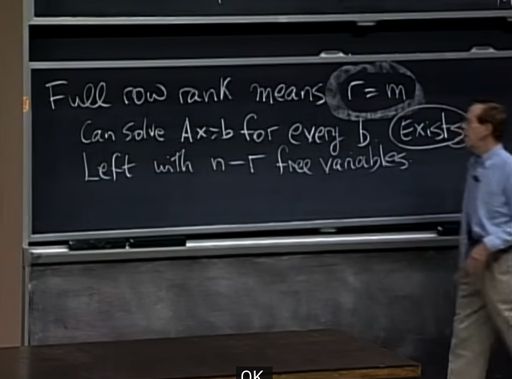</kbd>

> [!NOTE]
> Đúng vậy, ta có n-r = n-m free variable (vì đang xét Full
> Row Rank r = m)
>
> Và ta hiểu rằng như vậy thì sẽ tồn tại special solution (tìm
> bằng cách cho free variable các giá trị 1, 0 và gắn vào tìm
> pivot variable). Thì chúng cũng tạo nên basis của nullspace
> hay có thể kết luận nullspace có dim lớn hơn 0, hay, tồn tại
> non zero vector trong nullspace.
>
> Vậy khi xét complete solution của Ax=b thì như ta biết sẽ là
> x_complete = x_particular (vốn đã kết luận luôn tồn tại với
> mọi b khi A full row rank) + x_null. Và x_null thì có vô số
> (mọi linear combination của special solution / cũng là basis
> tạo nên một line). Do đó nếu A Full Row Rank thì Ax=b có
> vô số solution

> [!NOTE]
> Do đó nếu A Full Row Rank thì
> Ax=b có vô số solution

 

<kbd>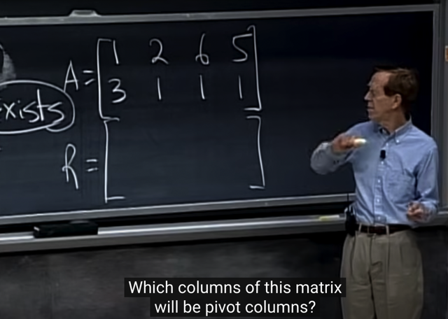</kbd>

> [!NOTE]
> Thầy lấy ví dụ của một full row rank, dùng luôn
> transpose của matrix full column rank hồi nãy. Gs hỏi:
> rank bằng mấy? Và col nào là pivot?
>
> -> Thử trả lời: Rank bằng 2, vì thầy đang ví dụ của
> full row rank, mà matrix này chỉ có 2 row, nên nhiều
> nhất là rank chỉ có thể bằng 2 thôi (again, vì sao - vì
> mỗi row chỉ có thể có một pivot, nên 2 row chỉ có thể
> có 2 pivot là maximum rồi)
>
> Cột 1 và 2 là pivot: Có thể nhẩm: cột một có A11 khác
> không thì đương nhiên là một pivot rồi.
> Nếu làm elimination, thì trừ hàng 2 cho 3*hàng 1 để
> khử A21, khi đó A22 sẽ thành (1-3*2) = -5, là giá trị
> khác không nên đây sẽ là pivot thứ 2. Vậy cột 1 và 2
> là hai pivot.

 

<kbd>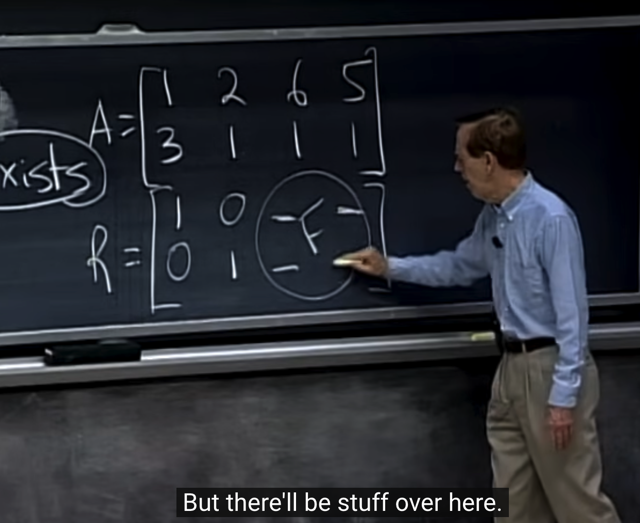</kbd>

> [!NOTE]
> Gs: Đúng vâỵ, nếu ta elimination và đưa nó về RREF thì 
> Ta sẽ thấy nó có dạng mà như thầy nói lúc trước - dạng 
> điển hình [I F]. Phần đầu (pivot cols) tạo thành một Identity
> matrix và phần sau các (free cols) tạo thành Free matrix

 

<kbd>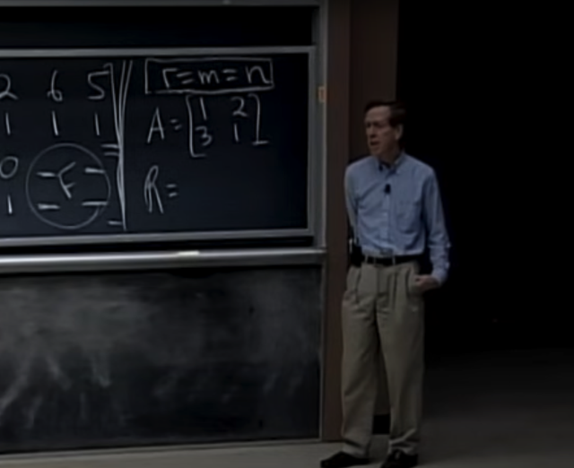</kbd>

🔗 **Related:** [LECTURE 9: INDEPENDECE, BASIS, AND DIMENSION](untitled.md#node-245)

> [!NOTE]
> Và case cuối cùng là r=m=n. Gs gọi nó là **FULL RANK.**
> Nó sẽ là square matrix (dĩ nhiên) và gs nói nó sẽ **INVERTIBLE**.
>
> R sẽ là gì?
>
> Me: Identity matrix, vậy A sau khi elimination sẽ thành I. Và vì 
> mình biết elimination apply với A chính là nhân A với matrix E
> thể hiện các bước elimination. Vậy EA = I. Điều này chứng tỏ
> E chính là A_inv, đồng nghĩa A là **INVERTIBLE** MATRIX

 

<kbd>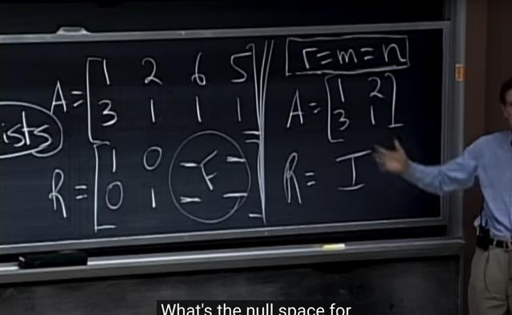</kbd>

> [!NOTE]
> Gs: NullSpace của A là gì?
>
> Me: Cũng giống như trường hợp Full Cols Rank, **các cols
> đều linear independent**, nên **linear combination duy
> nhất của các cols vector trở thành 0** **chỉ có thể khi các
> coeff = 0**.
>
> Vậy Ax=0 chỉ có một solution duy nhất đó là [0 0].T, cho
> nên **nullspace của A chỉ chứa zero vector**
>
> GS: Correct.

 

<kbd>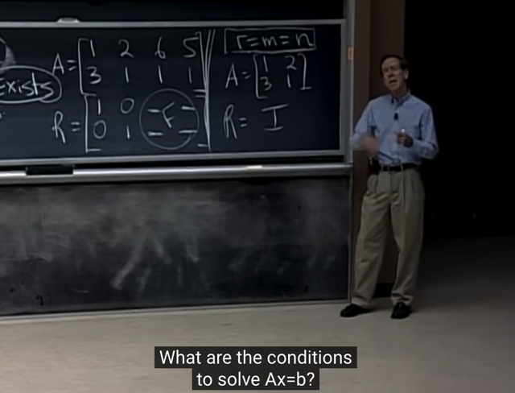</kbd>

> [!NOTE]
> Gs: Điều kiện nào để solve Ax=b?
>
> Me: Tương tự, vì A là matrix Full Rank, mọi row của nó đều
> linear independent, nên q**uá trình elimination không tạo 
> thành zero row nào**. 
>
> Do đó, **b cũng không cần phải có điều kiện gì**, hệ phương
> trình luôn có nghiệm với mọi b. Và nó **luôn chỉ có 1 solution
> duy nhất với mọi b.**Hoặc lập luận kiểu khác là vì mọi columns đều independent,
> và chúnng là các vector trong Rm (m=n=r). Nên ta có đủ n (=m)
> vector độc lập trong R^m. Do đó **CHÚNG SPAN TOÀN BỘ
> Rm** (cũng là Rn). Nên b (là vector trong Rm) dù có ở đâu (có giá
> trị bao nhiêu) thì **CŨNG LUÔN NẰM TRONG COLUMN SPACE 
> NÊN Ax=b LUÔN CÓ SOLUTION**. 
>
> Còn vì Nullspace chỉ chứa zero, nên không có trường hợp vô số
> nghiệm.

 

<kbd>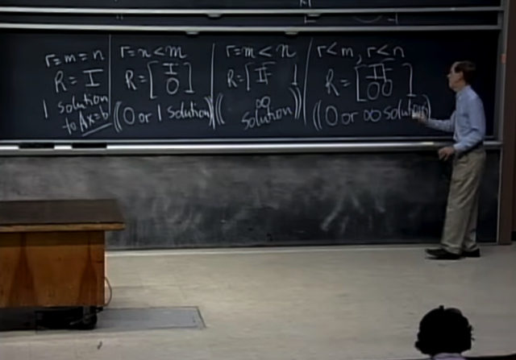</kbd>

> [!NOTE]
> Tóm lại:
>
> r=m=n: **FULL RANK**, R = I, và ta sẽ có **chính xác 1 solution với mọi b**.
>
> r=n<m: **FULL COLUMNS RANK**, matrix gầy, cao. R = [I O].T (thông cảm, note
> không ghi được thành cột nên đành ghi là [I O].T nhé)
>
> Vì elimination tạo các zero row ở dưới (cái chữ O ở trong R =[I O].T đó)
> nên **b phải có điều kiện nào đó** đã nói hồi nãy **thì hệ mới có nghiệm**. Vậy
> case này có **0 solution hoặc 1 solution** (nếu tồn tại x_particular). Không có
> dependent columns nên **không có free columns** / special solution / non-zero 
> vector  trong nullspace nên nếu có x_particular thì nó cũng là nghiệm duy nhất 
> chứ không có vụ kết hợp với x_null để ra vô số nghiệm.
>
> r=m<n: **FULL ROWS RANK**, matrix mập lùn, R =[I F] (khúc này gs nói thật
> ra không phải lúc nào các pivot cols cũng xếp ở trước các free cols, nên
> ghi R =[I F] không hẳn là đúng, mà I và F có thể đan xen nhau.
>
> Và vì r=m<n, nên**luôn có các free variable** (số pivot = r, số free variable
> sẽ là n-r, mà r < n nên r-n lớn hơn 0). Dẫn đến có thể chọn tùy ý
> free variable để thế vào tính ra pivot var. Nên có non-zero vector trong 
> nullspace cũng đồng nghĩa có vô số x_null (nên nhớ dù chỉ có một vector
> trong basis của nullspace thì có có vô số combination của nó để có các
> x_null, tạo thành nullspace là một line) 
>
> Còn xét Ax=b thì vì mọi row đều độc lập nên eliminate không cho ra row nào
> bằng 0 dẫn đến b có như thế nào thì vẫn luôn solve được. Nên luôn có solution.
> Hay giải thích cách khác là vì full row rank nên các column độc lập (có m=r cái)
> sẽ span toàn bộ Rm (m hàng, nên column là vector trong Rm). Dẫn đến b (cũng
> là Rm vector) ở đâu thì cũng luôn nằm trong C(A)
>
> Cho nên ở trường hợp này có **VÔ SỐ SOLUTION**
>
> Cuối cùng là r<m, r<n: Không full rank, R sẽ có dạng trong hình [[I F], [0 0]]
> nên có thể VÔ NGHIỆM (nếu b không tạo thành các hàng bằng 0 tương
> ứng với với các hàng bằng 0 của R khi apply elimination) còn nếu b thỏa
> điều kiện này thì ta có VÔ SỐ NGHIỆM do có thể chọn tùy ý các free var
> để thế vào tính pivot var.

 

<kbd></kbd>

> [!NOTE]
> Gs: Cái bảng này summarize bài học, và câu này
> summarize: Rank của matrix sẽ cho ta biết mọi thứ về
> solution

 

