# Lecture 9: Independece, Basis, And Dimension

📊 **Progress:** `35` Notes | `37` Screenshots

---

<kbd></kbd>

 

<kbd></kbd>

> [!NOTE]
> đầu tiên gs giả sử ta có matrix A với **số hàng ít hơn số
> cột**. Thì ta có thể kết luận rằng hệ phương trình **Ax=0
> SẼ CÓ SOLUTION KHÁC 0**. Câu hỏi là, vì sao ta có
> thể kết luận như vậy?

 

<kbd></kbd>

> [!NOTE]
> thế thì ta **có thể lập luận dựa trên những gì đã biết** về
> việc ta có một giải thuật **elimination** giúp đưa system
> of equation về dạng **Row Echelon**, 
>
> để từ đó, ta **xác định các pivot**, cũng như pivot column
> và nếu có **free column**, ta sẽ **assign giá trị tùy ý cho 
> free variable** để back-substitution, tính ra các **special 
> solution** (và nhờ free variable có thể chọn giá trị tùy
> ý nên đương nhiên special solution khác 0)
>
> Vậy nhìn lại đây, vì m < n, số hàng < số cột, nên**kiểu
> gì cũng chỉ có tối đa m pivot variable/column**, thành ra
> **luôn có n-m > 0 các free variable/column**.
>
> Vậy ta có thể kết luận Ax=0 **chắc chắn có solution khác 0**

 

<kbd></kbd>

> [!NOTE]
> Qua khái niệm **independence**, gs định nghĩa là, đám
> vector x1, x2....xn independence (có thể nói dài dòng là
> linearly independence) **NẾU KHÔNG CÓ LINEAR
> COMBINATION NÀO CỦA CHÚNG BẰNG 0**, **NGOẠI**
> **TRỪ** một trường hợp được phép, là khi **MỌI
> COEFFICIENT c_i ĐỀU BẰNG 0**
>
> Me: Suy nghĩ một chút có thể hiểu vì sao lại vậy, là bởi vì
> **nếu tồn tại một linear combination của chúng bằng 0**
> thì chuyển vế đổi dấu một vector một cái qua ta sẽ thấy
> ngay**vector đó là linear combination của các vector còn
> lại**, tức là nó **phụ thuộc tuyến tính với đám kia.**
>
> Như vậy thì **cả đám không độc lập tuyến tính nhau,**

 

<kbd></kbd>

> [!NOTE]
> Thầy lấy ví dụ v1 và v2 = 2v1. Đương nhiên ta biết nó
> dependence, chỉ là soi chiếu theo định nghĩa thì ta thấy có
> thể kiếm được một linear combination giữa chúng để tạo
> vector zero: 2v1 - v2 = 0

 

<kbd>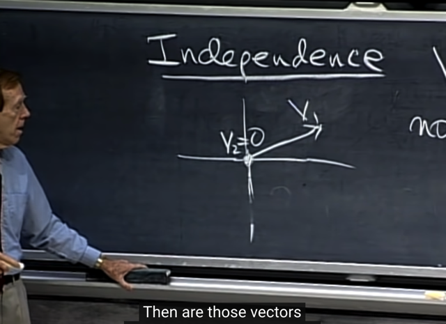</kbd>

> [!NOTE]
> Ví dụ khác, v1 và v2 = 0. Cũng là dependence. Vì có thể
> có 0*v1 + 100*v2 = 0 + 0 = 0. Vẫn thỏa điều kiện là **tồn tại
> bộ non-zero coefficients để tạo linear combination = zero**

 

<kbd></kbd>

> [!NOTE]
> đúng là như vậy, và ta có thể kết luân**NẾU TRONG
> SET CÁC VECTOR CÓ MỘT ZERO VECTOR**, thì coi
> như không có chuyện linear independence nữa

 

<kbd>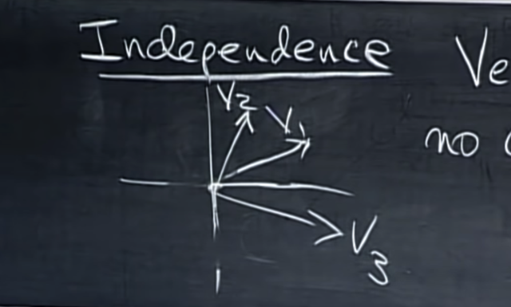</kbd>

> [!NOTE]
> tiếp, gs lấy ví dụ hai vector v1, v2 như thế này, rõ ràng,
> vì **khác phương**, nên **không thể nào có linear
> combination** giữa chúng **với coefficient không cùng
> bằng 0** **mà ra 0 được.**
>
> Thế thì, gs vẽ thêm v3, và hỏi rằng, nếu tôi vẽ v3 tùy
> tiện như vầy, thì 3 vector này có independence không?
>
> me: Không. Vì như đã biết, **vì v1, v2 independence**,
> **nên mọi linear combination của chúng đã tạo thành
> plane R^2**.
>
> Và **v3 nằm trong R^2**, nên**nó cũng là kết quả của
> một linear combination giữa v1 và v2**. Vậy ba vector
> này không independence.

 

<kbd></kbd>

 

<kbd>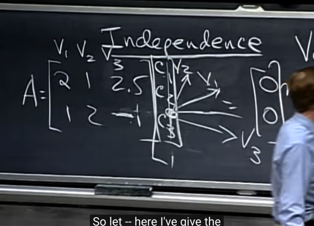</kbd>

> [!NOTE]
> gs: có thể giải thích vì sao tôi biết 3 vector này dependence
> là vì soi lại cái ta vừa nhận định: Nếu matrix A có **số hàng
> nhỏ hơn số cột** thì kiểu gì cũng sẽ **có solution khác 0** (như
> đã giải thích, vì số pivot lớn nhất **sẽ chỉ là m < n** nên sẽ
> **luôn có free column** / free variable -> nên chắc chắn có thể
> chọn giá trị khác không cho free variable và thế vào ta tính
> ra pivot variable để **có special solution khác 0**.
>
> Vậy nếu ta xét matrix A có 3 cột là 3 column vector v1,v2,v3
> thì đương nhiên ta có matrix A với m<n như vậy. Từ đó
> Ax=0 luôn có solution khác 0, gọi nó là [c1, c2, c3].T đi
>
> Thì như đã biết Ac=0 chính là linear combination của các
> cột với coefficient là các phần tử của c = 0 -> Dependence.

 

<kbd>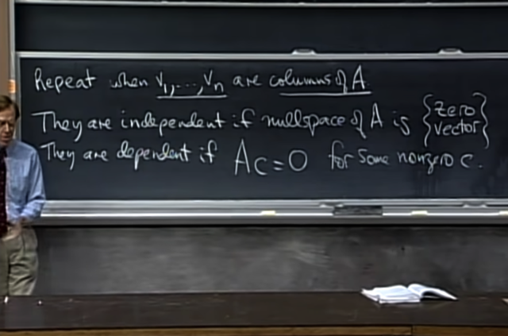</kbd>

> [!NOTE]
> vậy từ đó ta có thể đưa ra nhận định, với **v1,v2..vn là columns của
> A** thì:
>
> Chúng sẽ **independence** nếu **nullspace của A chỉ chứa zero**.
>
> Và **dependence** nếu nullspace của A **có vector khác ngoài
> zero**.
>
> ===
>
> Vì nullspace của A là mọi solution của Ax=0, hay, mọi vector x tạo ra
> linear combination của các A's column bằng 0. Vì nó là một vector
> space, nên nó nhất định, ít nhất thì cũng chứa vector zero (ôn lại
> tiếp, vì vector space có tính chất linear combination của hai vector
> đều tạo một véctơ cũng nằm trong space, nên vector space luôn
> phải có zero, vì nếu không 0*a = 0 sẽ không nằm trong space thì sẽ
> không thỏa điều kiện vừa nói)
>
> Vậy thì **nếu nullspace của A chỉ có mỗi zero vector**, thì có nghĩa là
> **ngoài bộ coeffs toàn 0**, thì **chẳng có bộ nào khác** tạo ra linear
> combination của A's column để**cho ra 0** -> nên các**column của
> A independence**
>
> Còn nếu nullspace của A **có vector khác zero vector**, thì có
> nghĩa là **có một coeff khác mà không** **phải là 0** hết có thể tạo linear
> combination của A's cols ra 0 -> **dependence.**

 

<kbd>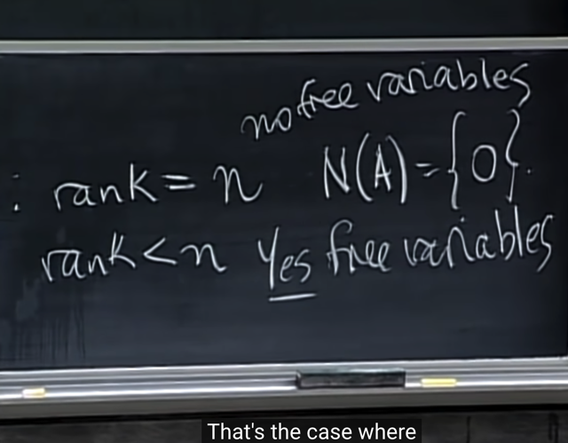</kbd>

🔗 **Related:** [LECTURE 7: SOLVING AX = 0: PIVOT VARIABLES, SPECIAL SOLUTIONS](untitled.md#node-166)

> [!NOTE]
> Vậy, với trường hợp **mọi cols của A đều independence**, thì
> chính là ta có **mỗi cột một pivot**, nên trường hợp này ta
> có n pivot -> **rank = n**. Nhớ lại, rank là số pivot
>
> Còn với trường hợp các cols của A **dependence**, thì ta có
> số **pivot < số cột**, đồng nghĩa có free columns , và rank < n

 

<kbd></kbd>

🔗 **Related:** [LECTURE 5: TRANSPOSE, PERMUTATIONS, SPACES R^N](untitled.md#node-125)

> [!NOTE]
> Gs nói qua khái niệm span: một đ**ám vector "span" một
> space** là sao
>
> thì ông cho biết mình đã thấy nó rồi, khi ta nhớ đã từng nói
> **vector space** tạo bởi **mọi linear combination của column
> của matrix A** được gọi là **columns spac**e của A. Thì đó
> cũng chính là nói rằng **CÁC COLUMNS CỦA A SPAN
> COLUMN SPACE C(A)**

 

<kbd>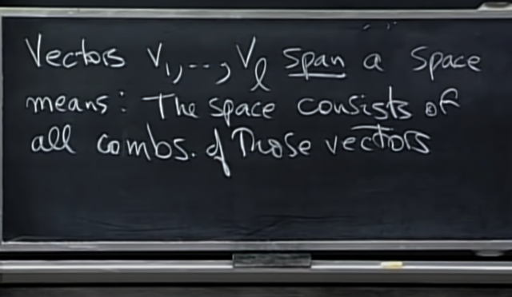</kbd>

> [!NOTE]
> vậy ta có định nghĩa của **span**: Ta nói rằng đám vector
> v1,v2...vl **span một vector space** nếu vector space
> được **tạo thành bởi mọi linear combination của các
> vector đó**

 

<kbd>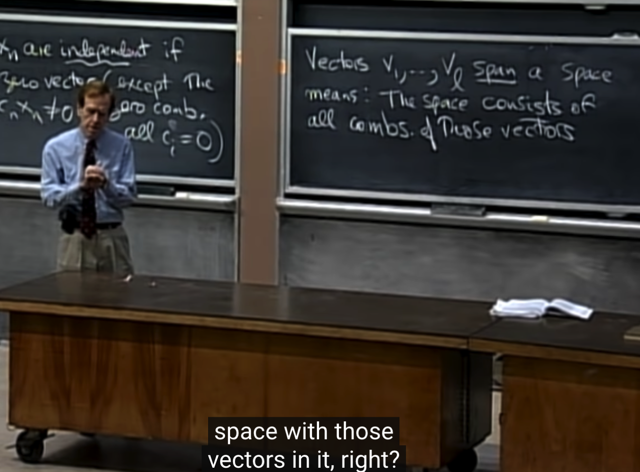</kbd>

> [!NOTE]
> gs: thay vì phải nói dài dòng là a..tôi **lấy mọi linear
> combination của các vector này và tạo thành một space**,
> thì bây giờ chỉ cần nói từ **các vector này "span" một
> space**
>
> ví dụ các columns của A span columns space của A
>
> Tiếp theo gs lập luận rằng, vậy ta có column space, và ta
> nói các **column span column space đó**.
>
> Thế thì ta cũng biết**các column** có thể **independence**
> hoặc **dependence** nhau.
>
> Dẫn ta đến khái niệm **BASIS**, mà bản thân từ basis đã
> mang một hàm nghĩa là**KHÔNG DƯ, KHÔNG THIẾU.**

 

<kbd>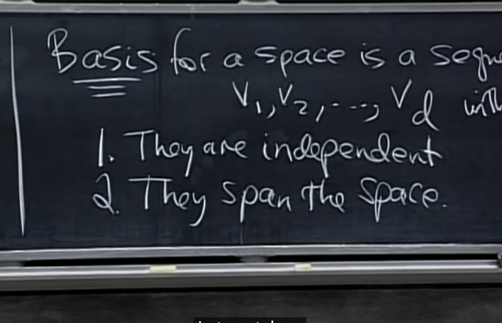</kbd>

> [!NOTE]
> thế thì gs định nghĩa **basis** của một space là bộ vector có hai
> tính chất:
>
> 1. Chúng **independence**
>
> 2. Chúng**span space đó.**

 

<kbd>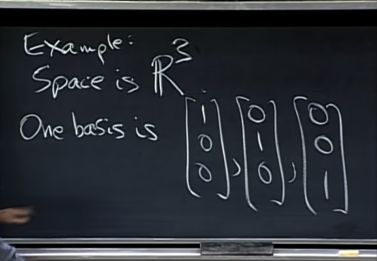</kbd>

> [!NOTE]
> Gs lấy ví dụ space là **R^3**. Thì một **basis** của nó là (1 0
> 0), (0 1 0), (0 0 1) (Đây gọi là **STANDARD** BASIS).
>
> Và chú ý rằng **nó không phải là basis duy nhất.** Để xem
> xét ba vector này **có phải basis không** thì ta xem **chúng
> có independence không** đã.
>
> Thì dễ thấy chúng là 3 vector **trùng với 3 trục của không
> gian R^3**, nên nếu **muốn c1*v1 + c2*v2 + c3*v3 = 0** thì
> **chỉ có một case là c1=c2=c3=0.**
>
> Hoặc có thể lập luận rằng ta **đặt nó làm cols của matrix A**,
> Thì dễ thấy ta sẽ có **matrix Identity I**. Sau đó ta **xem xét
> null space của I: Ix = 0**. Thì rõ ràng,**vector nào nhân với
> Identity matrix cũng bằng chính nó**, vậy **Ix = 0 KHI VÀ CHỈ
> KHI x = 0**.
>
> Vậy **nullspace của I chỉ có zero vector** => như hồi nãy đã
> biết, điều này có thể **kết luận các cols independence.**

 

<kbd>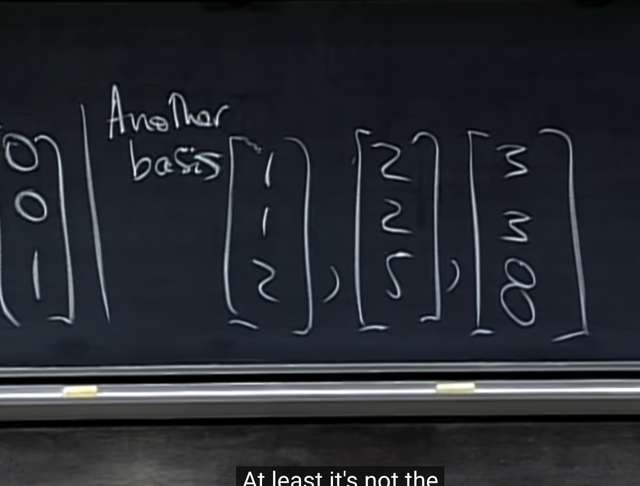</kbd>

> [!NOTE]
> và **một basis khác**, **miễn là** gồm **3 independent** vector là 
> được.
>
> Chỉ 2 vec được không? => Không, **vì 2 vector (independence)
> chỉ span được một 2D plane trong R3**

 

<kbd></kbd>

> [!NOTE]
> Vậy **làm sao để test 3 vector có phải là basis không?**
>
> Gs nói rằng thì như đã biết, chỉ việc **tạo matrix bởi 3
> vector** và **elimination về row echelon form** rồi **xem có
> free column** nào không.
>
> Nếu có **tức là các vector không independence.** Từ đó kết
> luận **Không phải basis**

 

<kbd></kbd>

🔗 **Related:** [LECTURE 8: SOLVING AX = B: ROW REDUCED FORM R](untitled.md#node-220)

> [!NOTE]
> vậy với **matrix vuông thì sao**. Hay gs yêu cầu ta suy
> nghĩ cho câu hỏi: **bộ n vector sẽ tạo basis** nếu **matrix
> (n,n**) với các cols tạo bởi các vector đó **có tính chất
> gì?**
>
> -> **Full rank, hay invertible**.
>
> Vì sao? Vì với matrix mxn, rank tối đa của nó là chính là m
> (=n), vì ta pivot thì tối đa mỗi hàng một cái và mỗi cột một
> cái, nói gọn hơn thì chỉ tối đa là 1 pivot trong mỗi hàng hay
> cột. Vậy nếu ít hàng hơn cột thì tối đa số pivot chỉ bằng số
> hàng, ngược lại nếu ít cột hơn hàng thì tối đa số pivot chỉ
> bằng số hàng.
>
> Vậy đang nói matrix vuông có các cols tạo bởi các vector
> independence thì có nghĩa là khi đưa matrix A về row
> echelon form, ta sẽ có **mỗi cột một pivot** (và vì số hàng
> bằng số cột) nên ta cũng có **mỗi hàng một pivot**. Và khi
> **số hàng bằng số cột bằng số pivot, ta gọi là Full Rank**Và reduced row  echelon form của A sẽ là I.
>
> Đồng nghĩa **EA = I** (E là elimination matrix). Từ đó suy
> ra **E chính là A_inv** đồng nghĩa **A là invertible matrix (vì
> tồn tại A_inv)**

 

<kbd>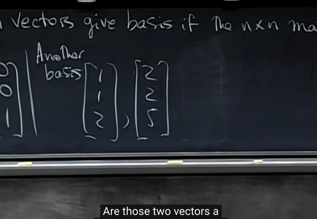</kbd>

> [!NOTE]
> thế thì gs hỏi rằng, nếu tôi x**óa đi một vector**, (3 3 8).T thì
> **hai vector còn lại** này **có là basis của một space nào ko**?

 

<kbd>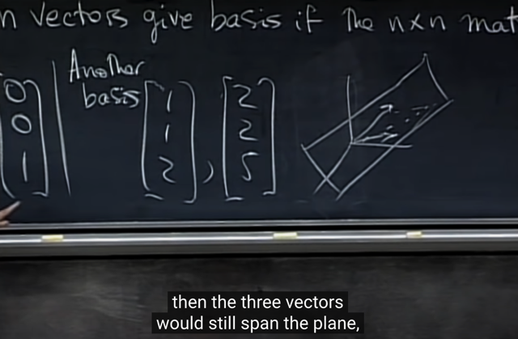</kbd>

> [!NOTE]
> có, **hai vector này độc lập tuyến tính**, vậy nó đã **thỏa  điều
> kiện thứ nhất**. Vậy nó sẽ là **basis của cái vector space mà
> chúng span** - là mọi linear combination của chúng. Và đó là
> **một 2D plane trong R3** (chú ý lại rằng ko phải là R2 nhé, vì
> vector có 3 phần tử, nó nằm trong R3)
>
> Vậy thì, gs nói rằng, nếu tôi **vẽ lại vector (3,3,8)** vì nó là một
> linear combination của hai vector kia nên **đương nhiên ta sẽ
> thấy nó trong plane này.**
>
> Tóm lại, **CHỈ XÉT 2 VECTOR**, thì nó **LÀ MỘT BASIS** một
> basis, của một plane trong R3. Nhưng nếu **XÉT CẢ 3** vector
> thì chúng lại **KHÔNG PHẢI LÀ MỘT BASIS**, bởi chúng **không
> independence.**

 

<kbd></kbd>

> [!NOTE]
> Gs nhắc lại lần nữa về một case mà ta có các **columns
> vector span the columns space**, mà chúng lại
> **independence**, cho nên các columns vector này là
> **basis của columns space**

 

<kbd></kbd>

> [!NOTE]
> kết luận đầu tiên đó là **CÓ RẤT NHIỀU BASIS**, bất kể
> khi nào ta lấy một **Invertible matrix 3x3**, thì **3 columns
> của nó sẽ tạo một basis của R^3** Vì sao phải 3x3, 4x3
> được không? Không vì lúc này các cols trong R^4 rồi,
> đang nói R^3 mà.
>
> Thế 3**x4** được không? Không, vì khi đó matrix A có các
> cột tạo bởi 4 cột của matrix này sẽ chắc chắn có free
> columns/variable, vì sao, vì ngay cả khi mỗi hàng có một
> pivot, thì nó c**ũng chỉ có 3 pivot**, cùng **đồng nghĩa là
> chỉ có 3 pivot columns** -> **dư một columns** là **free**
> columns => Ax=0 **có specials solution** cũng là **basis của
> nullspace** => nullspace không chỉ chứa zero vector => **có
> bộ non-zero coefficient tạo linear combination giữa các
> columns bằng 0** => c**ác cols không independence.**

 

<kbd></kbd>

> [!NOTE]
> gs nói rằng, thế thì ta có vô số basis, nhưng chúng
> đều có chung một điểm, mà hồi nãy tôi xóa đi một
> vector thì các bạn đã đúng khi bảo rằng đây không
> còn là basis của R3 nữa. Vì khi đó không đủ vector
>
> Vậy thì **điểm chung của các basis chính là chúng đều
> CÓ CHUNG SỐ LƯỢNG VECTOR**

 

<kbd></kbd>

> [!NOTE]
> Và số lượng vector của basis cuả một space
> chính là **DIMENSION CỦA SPACE đó**

 

<kbd>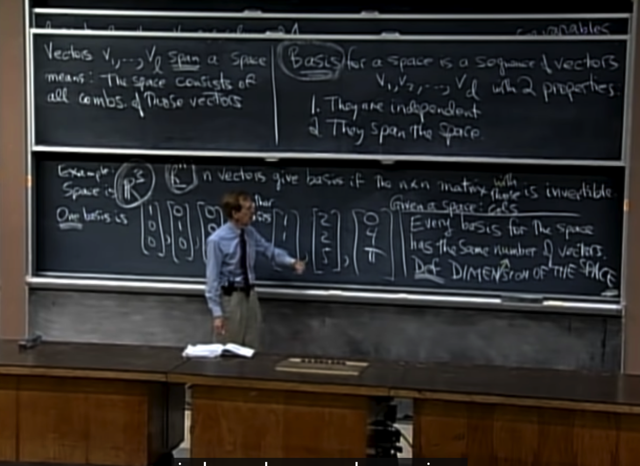</kbd>

> [!NOTE]
> lướt lại 4 định nghĩa trong bài này:
>
> Các**vector independence**: là khi **không có linear combination
> nào của chúng ra zero** (trừ khi mọi coeff bằng 0)
>
> **Span**: là một space tạo bởi **mọi linear combination của đám
> vector** (**không care** chúng **có độc lập hay không**)
>
> **Basis**, là bộ vector **independence** và **span** một space thì
> chúng là basis của space
>
> Và giờ là **Dimension**: là **số vector trong basis**của một space

 

<kbd>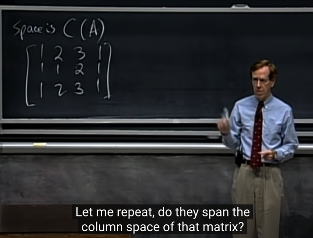</kbd>

> [!NOTE]
> rồi, gs cho ví dụ xét C(A) là columns space của matrix A
> như sau, thế thì các c**olumns này có span columns space
> không?**
>
> Me: Có, vì **dù chúng không independence**, thì **mọi linear 
> combination của chúng vẫn tạo nên columns space** của A,
> đơn giản vì **đó là định nghĩa của columns space**, và định
> nghĩa của span (space tạo bởi mọi linear combination)
>
> Correct, đơn giản vì **đó là định nghĩa của column space.**

 

<kbd>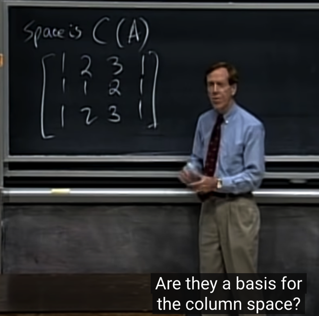</kbd>

> [!NOTE]
> Vậy thì chúng **có phải là basis của columns space
> không**?
>
> Me: **Không**, vì **chúng không independence**, cols 4 =
> cols 1 hay cols 4 là một linear combination của các cols
> khác với hệ số 1*col1 + 0*col2 + 0*col3

 

<kbd>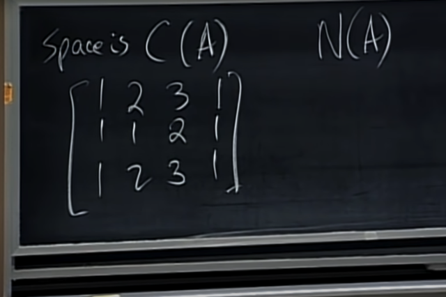</kbd>

> [!NOTE]
> Gs: Đúng vậy, thế thì hãy xét nullspace của A, hãy cho
> một vector khác zero nằm trong nullspace: 
>
> Me: như đã nói col4 = 1*col1 + 0*col2 + 0*col3
> nên **1***col1 + **0***col2 + **0***col3 **- 1***col4 = **0**
>
> => một vector khác 0 của nulls-pace: (**1 0 0 -1)**

 

<kbd>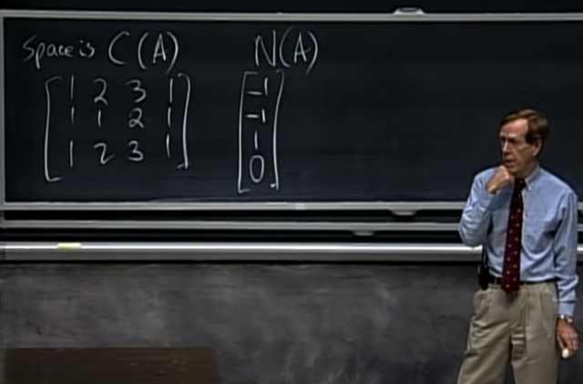</kbd>

> [!NOTE]
> hoặc là vector này cũng được, nó**cũng tạo linear
> combination của các cols ra 0.**
>
> Nói chung là **chứng tỏ các cols dependence**, nên
> **không phải là basis của columns space**

 

<kbd>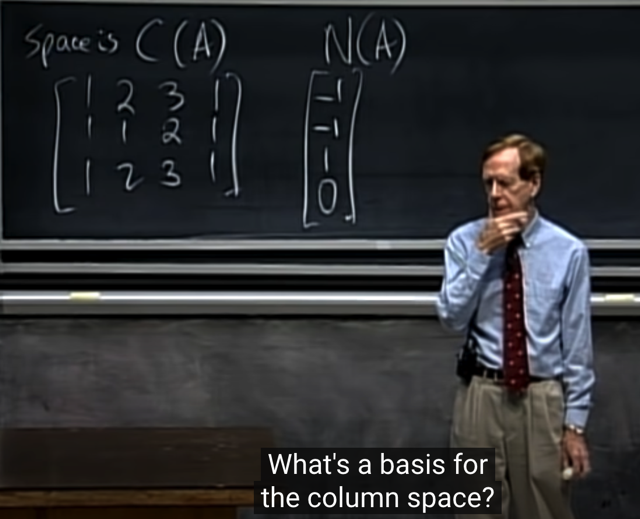</kbd>

> [!NOTE]
> Gs, ok, vậy hãy cho tôi một **basis của column space**?
>
> Me: **tìm các linear independence cols** trong mấy vector đó,
> thì nó là basis

 

<kbd></kbd>

> [!NOTE]
> Đúng vậy, ta chỉ việc tìm các pivot cols, cái đầu tiên nè,
> cái thứ hai cũng ok vì nó không dependence với cái đầu,
> cái thứ 3 không được, vì nó = col1 + col2, cái col4 cũng ko
> vì nó = col1.
>
> Vậy là nó có 2 independence cols. vậy rank bằng mấy?
>
> Me: 2
>
> Gs: correct

 

<kbd>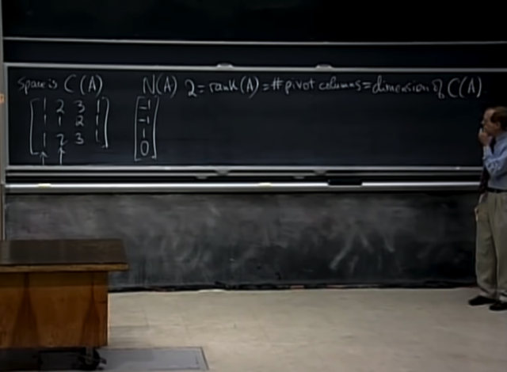</kbd>

> [!NOTE]
> thế thì tới đây ta có một kết luận quan trọng: Đó là
>
> RANK CỦA = SỐ PIVOT, cũng = SỐ INDEPENDENT
> COLS/ROWS = SỐ VECTOR TRONG BASIS CỦA
> COLUMN SPACE (VÀ CẢ ROW SPACE) = DIMENSION
> CỦA COLUMN SPACE

 

<kbd>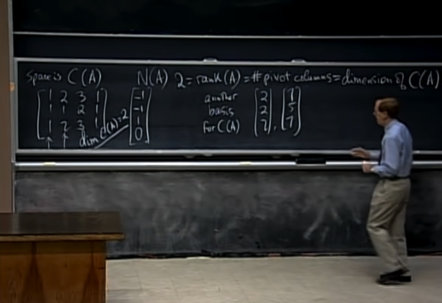</kbd>

> [!NOTE]
> Gs: Hãy cho tôi một basis khác: Thầy lấy [2 2 2] và [1 5 7]  là
> hai vector trong column space (vì đều bằng linear combination
> của các cols) và hai vector này independence.
>
> Thế thì nhận định quan trọng là:
>
> **Nếu ta biết dimension của Column space C(A) là 2**,  thì miễn
> là **2 vector bất kì trong columns space mà INDEPENDECE**
> nhau thì **sẽ tạo một basis
>
> Có nghĩa là basis của Column space KHÔNG NHẤT THIẾT
> PHẢI LÀ TRONG SỐ CÁC COLUMN. MÀ LÀ BẤT KÌ BỘ 
> VECTOR CÓ ĐỦ VECTOR VÀ ĐỘC LẬP**

 

<kbd>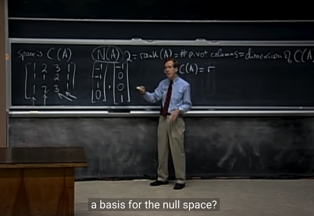</kbd>

> [!NOTE]
> tiếp, gs: Ta đã biết dimension của columns space là rank,
> vậy còn **basis của nullspace**?
>
> Quay lại nullspace, hồi nãy ta đã tìm được một special
> solution bằng cách đưa nhận định rằng matrix A có col1 và
> col2 independence, còn col3 và col4 dependent col1 và
> col2. Nên nếu dùng elimination để đưa A về Reduced
> Echelon Form ta sẽ có col1 và col2 là pivot cols, và col3, và
> col4 là free cols.
>
> Tương đương đối với Ax=0 thì ta có thể chọn free variable
> x3, x4 và thế vào tìm pivot variable x1, x2. Ở đây gs chọn
> x3=1, x4=0, thì có x1=-1, x2=-1. Tạo nên một Special
> solution như đã biết. Và bây giờ, tương tự ta chọn x3=0,
> x4=1 để có x1=-1, x2=0 để thêm một special solution nữa.
>
> Câu hỏi của gs là: Hai vector trong nullspace (again,
> solution của Ax=0 là thuộc nullspace vì nullspace được định
> nghĩa là mọi linear combination, hay subspace tạo bởi mọi
> vector x khiến Ax=0) này có phải là basis của nullspace
> không?
>
> Cũng chính là hỏi, hai vector này **có independence** không
> và chúng **có span the nullspace không?**

 

<kbd>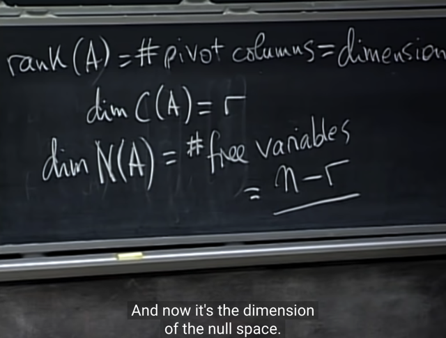</kbd>

> [!NOTE]
> Câu trả lời là: Có. Và kiến thức cuối cùng của bài giảng này
> là:
>
> **SỐ FREE COLUMN CHÍNH LÀ SỐ DIMENSION CỦA
> NULLSPACE**
>
> Và như vậy, với **n** columns, trong đó có **r** pivot, cũng
> là rank, cũng là dimension của columns space.
>
> Thì **số free columns là n - r**. Và đây **chính là dimension
> của nullspace.**

 

