# 11.2 Norm & Condition Number

📊 **Progress:** `13` Notes | `17` Screenshots

---

<kbd>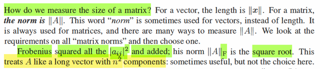</kbd>

> [!NOTE]
> Vẫn cách dẫn chuyện phong cách thầy Strang, thầy đặt vấn đề làm
> sao để đo độ lớn của matrix.
>
> Thì liên hệ với vector, thì ta có norm of vector, ||x||. (và như đã biết
> nó là √xTx, tức √(Σi xi^2).
>
> Thế thì với matrix A shape (m, n), nếu ta coi nó như/ trải nó ra như 
> một vector dài mxn phần tử, thì ta cũng có thể tính norm A như vậy
> và đó chính là Frobenius norm: ||A||_F
>
> Như vậy thì ||A||_F = √(ΣiΣj Aij^2)
>
> Ở đây gs không nói, hoặc chưa nói, nhưng nhờ MIT 18s096 mình đã
> biết, ta có thể có cách thể hiện ||A||_F gọn hơn, hay, compact hơn:
> Dùng trace.
>
> Thế thì, đầu tiên ta lập luận thế này: Ta cần bình phương các phần
> tử của A, cũng có nghĩa là lấy Aij nhân với chính nó, làm vậy với
> mọi ij, rồi cộng lại hết
>
> Vậy thì, nếu xét lần lượt từng cột j=1,2...n, thì ta sẽ thấy rằng chính
> là mình lấy square norm mỗi cột, và cộng lại hết.
>
> ⇨ ||A||_F = √(Σj=1,..n AjTAj)
>
> Rồi, vậy thì nếu ta xét matrix ATA, thì mỗi phần tử jj trên đường chéo
> của nó chính là dot product của hàng j của AT và cột j của A.
> (đây là ta nhìn phép nhân hai matrix theo góc nhìn thứ 3 theo thầy
> Strang)
>
> Từ đó thấy rằng ||A||_F chính là √ tổng các phần tử trên đường chéo
> của ATA. Và chính là √tr(ATA)
>
> Vậy ⇨ ||A||_F = √tr(ATA)
>
> Và tới đây ta có thể đi thêm chút nữa bằng cách nhận diện ATA chính
> là Gram matrix, là cái matrix đối xứng, positive semi definite,
>
> Vì xét quadratic form uATAu = (Au)T(Au) = ||Au||^2 ≥ 0 với mọi u
>
> ⇨ positive semi definite.
>
> Và ATA này luôn có đủ eigenvector độc lập ⇨ luôn tồn tại phép
> phân tách eigendecomposition: ATA = Q Λ QT
>
> Và trong bài svd thì ta cũng biết A = U Σ VT (full svd, U là matrix các
> cột là orthogonal basis của column space + left nullspace, và V là 
> matrix các orthogonal basis của rowspace + nullspace)
>
> ⇨ ATA =  (U Σ VT)T (U Σ VT) = VTT (U Σ)T (U Σ VT)
>
> = V ΣT UT U Σ VT = V ΣTΣ VT và đây chính là eigendecomposition
> của ATA ⇨ V chính là Q, ΣTΣ chính là Λ: eigenvector của ATA chính
> là right singular vector của A, eigenvalue của ATA chính là bình 
> phương của singular value của A
>
>
> QUay lại đây, ta đang có ||A||_F  = √tr(ATA), mà trace ngoài việc là
> tổng các đường chéo thì còn là tổng các eigenvalue.
>
> ⇨ √tr(ATA) = √Σi λ(ATA)_i  và như trên vừa nói, = √ Σi σ^2(A)
>
> (ngoài ra có thể có cách cũng xịn để thấy cái này: tr(ATA)
> = tr(V ΣTΣ VT) (như trên) và đến đây ta dùng cái tính chất "xoay 
> vòng của trace: tr(AB) = tr(BA)
>
> = tr(VTV ΣTΣ) = tr(ΣTΣ) =  √ Σi σ^2(A))

 

<kbd>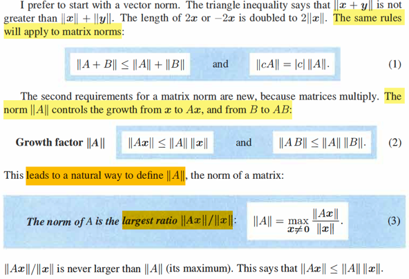</kbd>

> [!NOTE]
> Thế thì, gs cho biết Frobenius norm có khi hữu ích nhưng ở đây
> ta sẽ bàn một norm khác: ||A||
>
> Thì gs lập luận là: ta sẽ muốn norm này cũng thỏa các tính chất
> của vector norm, mà điển hình là bất đẳng thức tam giác:
>
> ||x + y|| ≤ ||x|| + ||y||
>
> và ||cx|| = |c|||x||
>
> như vậy ta phải có norm ||A|| sao cho ta có tính chất:
>
> ||A + B|| ≤ ||A|| + ||B||
>
> và ||cA|| = |c| ||A||
>
> Thế thì ở trên là hai tính chất mà norm matrix phải có, tạm hiểu là
> nó bắt chước norm của vector
>
> Nhưng cái quan trọng là đây, norm A: ||A|| phải được xây dựng để
> mang một ý nghĩa đó là: nó là growth factor lớn nhất khi scale một 
> vector hay matrix.
>
> Là sao, tức là nếu ta gọi c là growth factor khi nhân A cho x: tức là
> sau khi nhân với A, ta có vector Ax, có norm là ||Ax|| thì, gọi c
> là growth factor của việc biến x đang có norm ||x|| thành Ax có norm
> ||Ax||: c||x|| = ||Ax||, hay c = ||Ax|| / ||x||.
>
> Thế thì dĩ nhiên ta hiểu là với x khác nhau thì Ax khác nhau, và 
> growth factor = ||Ax|| / ||x|| cũng sẽ khác nhau, và ta quan tâm
> đến cái lớn nhất có thể (dĩ nhiên là sẽ xảy ra với một vector x cụ
> thể nào đó) 
>
> Thế thì ý chính ở đây là cái c lớn nhất có thể, chính là định nghĩa 
> của ||A||: 
>
> ⇨ ||A|| = max  c = max ||Ax|| / ||x|| miễn là x khác 0
>
> Nên theo định nghĩa này ta có:
>
> ||Ax|| ≤ ||A|| ||x|| (1)  Cái này thì trực tiếp đến từ định nghĩa norm A
>
> và ||AB|| ≤ ||A|| ||B|| Cái này thì là vì sao?
>
> Áp dụng (1) cho AB: ||ABx|| ≤ ||A|| ||Bx||
>
> Áp dụng (1) cho B: ||Bx|| ≤ ||B|| ||x||
>
> ⇨ ||ABx|| ≤ ||A|| ||B|| ||x||
>
> ⇨ ||ABx|| / ||x|| ≤ ||A|| ||B||
>
> Bên trái chính là growth factor của
> ||x|| khi được biến đổi bởi AB, mà theo định nghĩa, nó sẽ đạt max
> là ||AB||. 
>
> Và điều này đúng với mọi x, nên cũng đúng với growth factor lớn
> nhất ||AB||
>
> ⇨ ||AB|| ≤ ||A|| ||B||

 

<kbd>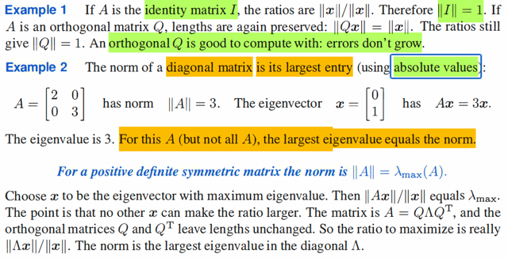</kbd>

> [!NOTE]
> Xét qua ví dụ, I. ||I||, theo định nghĩa là max x ≠ 0 ||Ix|| / ||x||
>
> mà ||Ix|| = ||x|| ⇨ ||Ix|| / ||x|| = 1, bài toán tối ưu này là max x ≠ 0 f(x) =
> 1 là constant vậy thì dĩ nhiên giá trị lớn nhất cũng là 1. ⇨ ||I|| = 1
>
> Xét orthogonal matrix Q (sẵn ôn nhanh, phải là một square matrix có
> các cột orthonormal thì mới gọi là orthogonal matrix nhé, mà các cột
> orthogonal thì chắc chắn đều độc lập ⇨ Q invertible ⇨ Qinv = QT)
>
> Theo định nghĩa ||Q|| = max x ≠ 1 ||Qx|| / ||x||, again Q là matrix đại
> diện cho một phép biến đổi tuyến tính: rotation, nó giữ nguyên norm:
> rất dễ thấy ||Qx||^2 = (Qx)T(Qx) = xTQTQx = xTx = ||x||^2)
>
> Còn tại sao biết orthogonal matrix Q đại diện phép xoay. Thì ta check
> góc của u, v và góc của Qu, Qv:
>
> cosine góc của u, v: uTv/||u||||v||
>
> cosine góc của Qu, Qv: (Qu)TQv/||Qu||||Qv||
>
> = uTQTQv/||u||||v|| = uTv/||u||||v|| ⇨ = cosine góc của u,v ⇨ Q giữ
> nguyên góc giữa hai vector. Và ở trên nó giữ nguyên độ dài vector
> nữa nên dễ thấy nó là (matrix đại diện linear transformation: phép
> xoay)
>
> Vậy quay lại đây, ||Q|| = 1
>
> ====
>
> Rồi, với diagonal matrix Λ (trong sách lấy ví dụ A = [2 0; 0 3]
>
> gs nói trong case này ||A|| cũng chính là eigenvalue lớn nhất
>
> Mình có thể chứng minh luôn nó sẽ áp dụng với mọi matrix vuông:
>
> Đơn giản thôi: norm A theo định nghĩa là max x ≠ 0 ||Ax|| / ||x||, tức là
> ta đi giải bài toán maximization này,
>
> Thế thì, vì cái objective function f(x) = ||Ax|| / ||x|| không âm, ta có thể
> giải bài toán equivalent: maximize x ≠ 0 f(x)^2 = ||Ax||^2 / ||x||^2  =
> xTATAx / xTx
>
> Thế thì xTATAx = xT Q Λ QT x (eigendecomposition gram matrix
> QTQ)
>
> = (QTx)T Λ (QTx) = Σi (QTx)_i^2 λ(ATA)_i ≤ Σi (QTx)_i^2 λ_max(ATA)
>
> = λ_max(ATA) Σi (QTx)_i^2 = λ_max(ATA) ||QTx||^2 = λ_max(ATA)
> ||x||^2
>
> ⇨ xTATAx / xTx ≤ λ_max(ATA) ||x||^2 / ||x||^2 = λ_max(ATA)
>
> ⇨ ||A||^2 chính là eigenvalue lớn nhất của ATA
>
> mà eigenvalue của ATA chính là bình phương singular value của A.
>
> Nên ||A||^2 chính λ(ATA)_max = [σ_max(A)]^2
>
> ⇨ ||A|| CHÍNH LÀ σ_max(A), là singular value lớn nhất.
>
> Điều này đúng với mọi matrix A.
>
> Thế thì liên hệ với Frobenius norm lúc nãy, ||A||_F = √Σi σ(A)_i^2  tức
> là √ của tổng bình phương các singular value. Còn ở đây, ||A|| là cái
> singular  value lớn nhất
>
> ====
>
> Thế thì nếu xét A là symmetric positive definite thì sao?
>
> Thì đặc biệt hơn nữa:
>
> Là A bản thân cũng = Q Λ QT
>
> ⇨ ATA = (Q Λ QT)T Q Λ QT = Q ΛT QT Q Λ QT = Q Λ Λ QT = Q Λ^2
> QT
>
> và đây dĩ nhiên là eigendecomposition của ATA, và kết quả này cho
> thấy gì?
>
> ⇨ eigenvalue của ATA là bình phương eigenvalue của A và vì nó
> cũng là bình phương singular value của A nên với symmetric matrix A
> thì  SINGULAR VALUE σ(A)^2 = EIGENVALUE λ(A)^2
>
> và vì A positive definite, nên mọi λ(A) đều dương ⇨ σ(A) = λ(A) và
> như vậy riêng với positive definite symmetric matrix ta có kết luận:
>
> ||A|| = eigenvalue lớn nhất λ(A)_max cũng là singular value lớn nhất
> σ(A)_max

 

<kbd>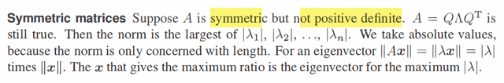</kbd>

> [!NOTE]
> Rồi, nếu A symmetric nhưng ko positive definite, thì dĩ nhiên A vẫn = Q
> Λ QT nhưng eigenvalue không chắc là dương mà có thể âm
>
> Khi đó từ λ(A)^2 = σ(A)^2 ⇔ |λ(A)| = σ(A)

 

<kbd>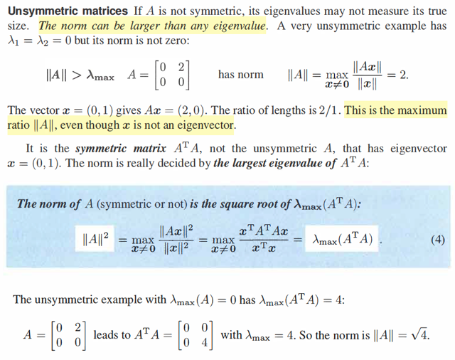</kbd>

> [!NOTE]
> Chỗ này đại ý thì cũng chính là cái vừa nãy mới nói: Đó là với matrix 
> A thì mình đã tự chứng minh để cho thấy rằng, ||A||, theo 
> định nghĩa, là growth factor lớn nhất khi nó được dùng để biến đổi
> một vector ||A|| = max x {||Ax|| / ||x||} chính là giá trị singular value
> lớn nhất của A: σ_max(A). 
>
> Ôn lại tí về các bước chứng minh / lập luận: Đó là ta xét vài toán
> tối ưu: maximize (over x) ||Ax|| / ||x||, rồi vì bình phương của một số
> không âm thì đơn điệu tăng, nên ta có thể maximize ||Ax||^2/||x||^2
> = xTATAx / xTx = xTQ Λ QTx / xTx. Để rồi tử số sẽ ≤ xTx λmax(ATA)
> ⇨ solution của bài toán equivalent này là λmax(ATA). Mà λmax của
> ATA thì lại chính là bình phương σmax(A) ⇨ ta có solution của bài 
> toán gốc, ||A|| chính là σmax(A), tức singular value lớn nhất của A.
>
> Rồi, đó là với A bất kì, còn trường hợp đặc biệt nếu A symmetric, 
> thì trị tuyệt đối của eigenvalue cũng chính là singular value: |λ(A)| = 
> σ(A), chứng minh nhanh rất dễ: A symmetric ⇨ luôn có đủ n eigenvectors
> độc lập ⇨ eigendecomposition: A = Q Λ QT ⇨ ATA = Q ΛTΛ QT cho thấy
> rằng eigenvalue của ATA chính là bình phương eigenvalue của A, 
> mà eigenvalue của ATA thì luôn là bình phương của singular value của A
> ⇨ với A symmetric: λ(A)^2 = σ(A)^2 ⇨ |λ(A)| = σ(A)
>
> ⇨ ||A|| = trị tuyệt đối của eigenvalue lớn nhất.
>
> Và đặc biệt hơn nữa nếu A symmetric và positive definite, thì khi đó mọi
> λ(A) đều dương → ||A|| = λ(A)_max
>
> ====
>
> Vậy thì ở đây chính là gs nói cho case đầu tiên, khi A ko symmetric, nhưng
> nhưng vuông thì vì nó vuông nên nó có eigenvector, và eigenvalue, nhưng
> vì nó ko symmetric nên ko có vụ trị tuyệt đối của eigenvalue bằng singular
> value nên norm của A chỉ bằng σmax(A), chứ ko bằng |λmax(A)|.
>
> Tuy nhiên dù A có symmetric hay không, và có vuông hay không thì ta vẫn
> cứ có quan hệ rằng eigenvalue của ATA = bình phương singular value của 
> A: λ(ATA) = σ(A)^2  ⇨ σ(A) = √λ(ATA) 
>
> Mà norm ||A|| như đã hiểu, nó là σmax(A), nên dù A có đối xứng hay không
> có vuông hay không thì norm ||A|| cứ luôn là √λmax(ATA). Cần để ý λ(ATA)
> thì luôn không âm vì ATA là positive semi definite matrix.
>
> Tóm lại: 
>
> A bất kì: ||A|| = σmax(A) = √λmax(ATA)
>
> A symmetric: ||A|| = σmax(A) = |λmax(A)|
>
> A symmetric pd: ||A|| =  σmax(A) = λmax(A)

 

<kbd>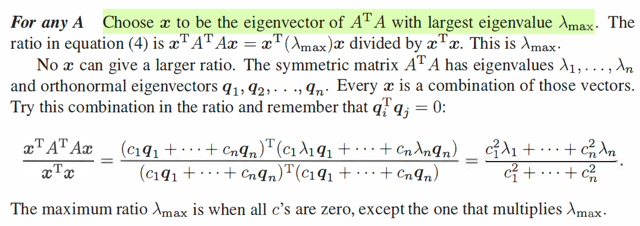</kbd>

> [!NOTE]
> Chỗ này là thầy nói sao đây?
>
> Đại khái cũng như ta vừa làm lúc nãy thôi, chỉ là nhìn theo cách
> hơi khác:
>
> Như đã nói, ATA vì tính symmetric nên luôn tồn tại n eigenvectors
> độc lập, gọi là q1,...qn. Thì ATA phân tách thành Q Λ QT
> Và xét tỉ số ||Ax||^2/||x||^2 (để tìm max của nó), = xTATAx / xTx 
> sẽ = xTQ Λ QTx = yT Λ y = Σ yi^2 λi
>
> Cái này sẽ ≤ Σi yi^2 λmax
>
> Từ đó ||Ax||^2/||x||^2 ≤ Σi yi^2 λmax / xTx = ||y||^2 λmax / ||x||^2
>
> = ||QTx||^2 λmax / ||x||^2 = ||x||^2 λmax / ||x||^2 (Q ko thay đổi ||x||)
>
> = λmax
>
> ⇨ ||Ax|| / ||x|| ≤ √λmax(ATA)
>
> Nhưng ở đây, như đã nói ta nhìn hơi khác chút xíu khi xét xTATAx / xTx: 
>
> Thì ta nhìn xTATAx = xTQ Λ QTx
>
> và chỗ mà ta nhìn khác chút chính là lấy QTx chính là Qinv x, theo
> kiến thức đã học về linear transformation, thì đây chính là hành động
> chuyển vector x, đang có tọa độ trong basis e's, sang tọa độ trong basis
> q's. 
>
> (ôn nhanh, change basis từ tọa độ basis v's sang tọa độ basis u's là UinvV
> ⇨ change basis từ tọa độ basis e's → tọa độ basis q's là Qinv I = Qinv)
>
> Và quả thật, QTx chính là linear combination các q's: c1q1 + c2q2 + ..cnqn
>
> ⇨ xTQ Λ QTx = (c1q1 + ..cnqn)T Λ (c1q1 + ..cnqn)
>
> = (c1λ1q1T  + ..λncnqnT) (c1q1 + ..cnqn)
>
> = λ1 c1^2 q1Tq1 + ..+ λn cn^2 qnTqn
>
> = λ1 c1^2 + ..+ λn cn^2
>
> (qiTqi = 1, qiTqj = 0)
>
> Và λ1 c1^2 + ..+ λn cn^2 ≤ λmax c1^2 + ...λmax cn^2 = λmax Σi ci^2
>
> Và dấu bằng xảy ra khi nào? 
>
> Dĩ nhiên là dễ thấy khi mọi ci đều = 0, trừ c ứng với λmax (gọi là cmax) 
> = 1 
>
> Giả sử λmax = λ1, tức là dấu bằng xảy ra khi c1=1, c2=0,..cn=0
>
> Thế thì lúc này ta có gì?
>
> Ta sẽ có vector x chính là q1, là eigenvector ứng với λmax = λ1
>
> (mà việc khi đó x = 1*q1 + 0*q1 + ...0*qn, thì đây chính là vector (1,0,..0)
> trong tọa độ basis q's, mà dĩ nhiên trong tọa độ basis q's thì vector
> (1, 0,...0) chính là q1)

 

<kbd>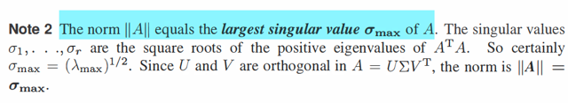</kbd>

<kbd></kbd>

<kbd>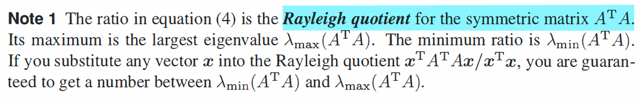</kbd>

> [!NOTE]
> Đại khái cái tỉ số xTATAx / xTx được gọi là Rayleigh quotient của ATA
> và nó sẽ luôn nằm trong khoảng từ λmin(ATA) và λmax(ATA)
>
> Còn note 2 thì biết rồi, xuất phát từ việc ta đã hiểu λ(ATA) chính là bình
> phương của σ(A) nên ||A|| = √λmax(ATA) = σmax(A)

 

<kbd>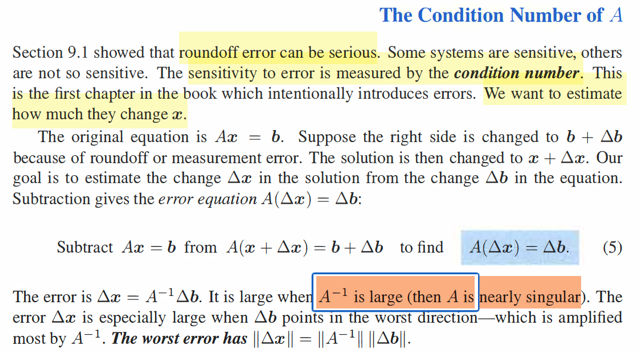</kbd>

> [!NOTE]
> Đây là section nói về condition number, là cái thứ mà gặp hoài trong các
> lớp sách về optimization, cũng là lí do mà mình phải dừng cuốn
> numerical optimization để mà đọc lại cuốn này
>
> Gs nhắc đến "roundoff error" - lỗi làm tròn số, và ông nói rằng,  một số
> hệ thống rất nhạy cảm, với sai số. Và mức độ nhạy cảm được đo bởi
> condition number
>
> Thế thì xét equation Ax = b. Giả sử vế phải vì sai số hay bị làm tròn số
> mà biến thành b + Δb, thì khi đó, solution từ x sẽ biến thành x + Δx Dễ
> thấy ta sẽ có A Δx = Δb
>
> Và nếu A invertible, để solution ban đầu là x = Ainvb sẽ chuyển thành x
> + Δx = x + Ainv Δb
>
> Cái chính là xét quan hệ Δx = Ainv Δb để thấy rằng khi mà b bị thay đổi
> chút xíu, thì nó sẽ được khuếch đại lên bởi A như thế nào - ý là nó kéo
> theo x bị thay đổi thế nào.
>
> Dừng lại chút để làm rõ, nên hiểu thế này, giả sử ban đầu với b  ta đã có
> solution của equation là x. Mọi chuyện đang rất đẹp. Đột nhiên b bị thay
> đổi thành b +Δb, thì dù Δb có thể rất nhỏ thôi, kiểu như một hiện tường
> làm tròn nào đó xảy ra, hay sai sót trong đo lường xảy ra. Nhưng Δx =
> Ainv Δb có thể sẽ rất lớn khiến solution mới x + Δx KHÁC XA solution cũ
> là x, mà ví dụ như solution x đang ngon (cho nhiệm vụ nào đó, ví dụ
> như tham số của một mô hình dự đoán  chẵng hạn), tự nhiên b thay đổi
> tí xíu, thì x + Δx trở nên rất khác, rất sai so với solution ngon là x ban
> đầu, vì bản chất b chỉ là thay đổi có tí tẹo, ví dụ như giá bất động sản,
> nhưng vì một sai sót nhỏ, khiến đánh label sai một vài ngôi nhà chẳng
> hạn) thì tham số của mô hình bây giờ là x + Δx rất khác, rất xa x, error =
> Δx lớn, khiến model ko còn tốt nữa.
>
> Thế thì, có thể thấy Ainv sẽ khuếch đại vấn đề, để khiến Δb nhỏ tạo ra
> Δx lớn.
>
> Thế thì, phần trước mình đã học về norm của A: là cái growth factor lớn
> nhất khi transform vector x: max x ||Ax|| / ||x||
>
> Vậy thì ở đây, ta cũng đang có một phép transform: Δb biến thành Δx
> bởi Ainv: Δx = AinvΔb
>
> Thì như vậy, cái trường hợp tệ nhất, khi cho từ Δb tạo ra Δx lớn nhất,
> chính là khi Δb trùng với cái hướng mà khiến growth factor này lớn nhất,
> (như đã biết, chính là khi nó trùng với eigenvector của eigenvalue lớn
> nhất của AinvTAinv), để rồi cái growth factor lớn nhất đó, chính là
> √λmax(AinvTAinv), cũng là σmax(Ainv), tức là norm của Ainv: ||Ainv||
>
> Đây chính là the worse error mà gs nhắc đến, ||Δx|| = [max growth
> factor] ||b||
>
> = ||Ainv|| ||b||
>
> Thế thì, tại sao ông nói khi A mà càng gần trở nên singular thì error Δx
> sẽ càng lớn?
>
> Là vì, A, đang giả sử A invertible, tức là square, và mọi eigenvalue đều
> dương.
>
> Ainv Δb = (S Λ Sinv)inv Δb
>
> = S (S Λ)inv = S Λinv Sinv Δb
>
> thì ta có gì?
>
> Sinv Δb chính là chuyển tọa độ vector Δb từ basis e's sang basis s'
> (eigenvectors)
>
> Λ Sinv Δb sẽ thực hiện linear transformation: stretch các tọa độ trong
> basis s's bởi các factor là diagonal entries của Λinv, chính là nghịch đảo
> của các eigenvalues: 1/λ
>
> Cuối cùng S Λ Sinv Δb chuyển kết quả biến đổi, đang trong basis s's về
> lại basis e's
>
> Thế thì có thể thấy, nếu như λ (eigenvalue của A) MÀ CÀNG NHỎ THÌ
> 1/λ SẼ CÀNG LỚN KHIẾN BƯỚC STRETCHING SẼ CÀNG LỚN.
>
> ⇨ Tạo ra Δx có norm càng lớn.
>
> Và λ mà càng nhỏ, ví dụ như số dương rất nhỏ, thì chính là matrix A trở
> nên gần singular (khi có eigenvalue = 0). vì khi eigenvalue nào đó rất
> nhỏ ≈ 0 thì với eigenvector tương ứng với nó Ax = λx ≈ 0 ⇨ x sẽ là
> nullspace của A ⇨ matrix suy biến (singular)

 

<kbd>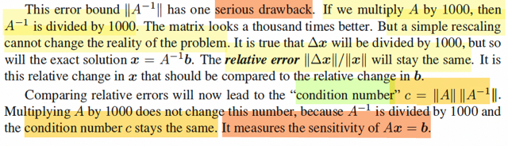</kbd>

> [!NOTE]
> Rồi, đại khái là gs gọi ||Ainv|| là error bound. Dừng lại để nghĩ về cái
> này một chút. Error bound, tức ám chỉ là chặn (trên) của error, tức là
> muốn nói đây sẽ là cái quyết định error có thể lớn đến đâu. Thế thì vì
> sao nhỉ? À là vì ôn lại một tí, vừa rồi câu chuyện bắt đầu từ việc ta đề
> cập đến việc giải hệ Ax = b, x là solution, rồi b vì lí do nào đó như sai
> số đo đạc, hoặc một yếu tố nhiễu nào đó khiến nó thay đổi thành b +
> Δb, Δb hiểu như sai số (error) của b. Khi đó, solution sẽ thay đổi trở
> thành x + Δx,  sẽ là solution của A(x + Δx) = b + Δb.
>
> Thế thì như vậy ta sẽ có liên hệ giữa error của solution và error của b:
> A Δx = Δb ⇨ Δx = Ainv Δb
>
> Để rồi độ lớn (norm) của Δx sẽ bị chi phối bởi Ainv, Δb dù có rất nhỏ,
> nhưng Ainv Δb sẽ có norm có thể rất lớn.
>
> Và trường hợp tệ nhất, là khi Δb trùng với eigenvector của AinvTAinv
> khi đó, growth factor ||Ainv Δb|| / ||Δb|| sẽ là lớn nhất, bằng eigenvalue
> lớn nhất √λmax(AinvTAinv), cũng là singular value lớn nhất của Ainv
> σmax(Ainv), đây chính là định nghĩa của norm Ainv: ||Ainv||
>
> ⇨ Tức Δx có norm lớn nhất có thể chính là ||Ainv|| ||Δb||
>
> Do đó mới nói ||Ainv|| là error bound.
>
> Nhưng khi xem xét error bound này, ta có thể có ý tưởng là:
>
> vì AAinv = I, nên nếu ta scale A lên 1000 lần, thì Ainv sẽ phải nhỏ 
> đi 1000 lần. Như vậy, error Δx sẽ nhỏ đi 1000 lần, chẳng phải sẽ giải
> quyết được vấn đề hay sao.
>
> Nhưng không, vấn đề là, khi đó với A lớn lên 1000 lần thì x tức true
> solution cũng sẽ nhỏ xuống 1000 lần. Và tỉ lệ tương đối ||Δx|| / ||x||
> tức là relative error vẫn y nguyên.
>
> Và từ đó ta có một con số, gọi là condition number: ||A|| ||Ainv||, là 
> con số không đổi, gắn với matrix A, chỉ dấu cho tính nhạy cảm của
> Ax = b.

 

<kbd>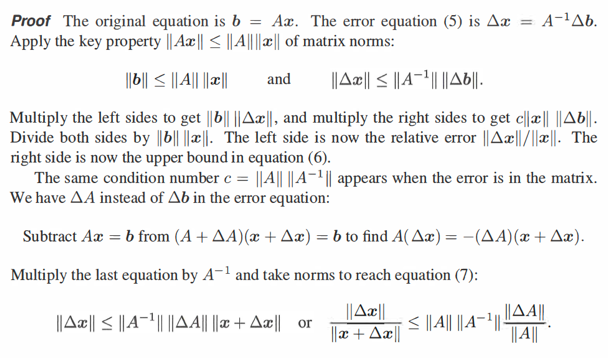</kbd>

<kbd></kbd>

<kbd>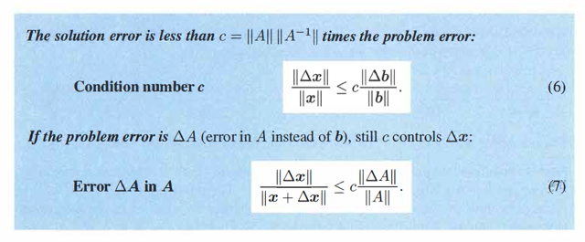</kbd>

> [!NOTE]
> Với định nghĩa của condition number thì ta có theorem:
>
> rằng relative error ||Δx|| / ||x|| có upper bound là c nhân với problem error.
> Problem error ở đây là error do b: Δb, hoặc error do A: ΔA
>
> ||Ax|| ≤ ||A||||x|| ⇔ ||b|| ≤ ||A||||x||
>
> ||Δx|| ≤ ||Ainv|| ||Δb||
>
> Nhân vế theo vế:
>
> ||b|| ||Δx|| ≤ ||A|| ||x|| ||Ainv|| ||Δb||
>
> ⇔ ||b|| ||Δx|| ≤ ||A|| ||Ainv|| ||x|| ||Δb||
>
> ⇔ ||b|| ||Δx|| ≤ c ||x|| ||Δb||
>
> Chia hai vế cho ||b|| ||x||
>
> ⇔ **||Δx|| / ||x|| ≤ c ||Δb|| / ||b||**
>
> ====
>
> (A + ΔA)(x + Δx) = b
>
> ⇔ Ax + ΔAx + AΔx + ΔAΔx = b
>
> ⇔ ΔAx + AΔx + ΔAΔx = 0
>
> ⇔ AΔx + ΔA(x + Δx) = 0
>
> ⇔ AΔx = -ΔA(x + Δx)
>
> Nhân hai vế cho Ainv
>
> ⇔ AinvAΔx = -AinvΔA(x + Δx)
>
> ⇔ Δx = -AinvΔA(x + Δx)
>
> ⇔ ||Δx|| = ||AinvΔA(x + Δx)|| ≤ ||Ainv||||ΔA(x + Δx)|| ≤ ||Ainv|| ||ΔA|| ||x + Δx||
>
> ⇨ ||Δx|| / ||x + Δx|| ≤ ||Ainv|| ||A|| ||ΔA|| / ||A|| = c ||ΔA|| / ||A||
>
> ⇔ **||Δx|| / ||x + Δx|| ≤ c ||ΔA|| / ||A||**

 

<kbd>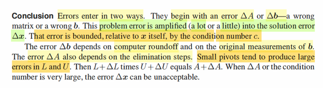</kbd>

> [!NOTE]
> đoạn này gs nói về Δb và ΔA. Δb thì nói rồi, xuất phát do sai sót
> trong đo lường khiến b biến thành b + Δb.
>
> Còn sai sót từ A, thì có thể đến từ elimination
>
> Gs nhắc đến elimination với matrix L, U. Ôn lại chút xíu chỗ này:
>
> Quá trình elimination thì biết rồi, đó là quá trình biến đổi A bởi
> các elimination matrix Ej, để kết quả ta có EA = U ⇔ A = LU
>
> trong đó Ej là các matrix khi nhân với matrix A (sau khi bị biến đổi
> bởi Ej-1) sẽ linearly combine các row của A, hoặc permute row của 
> A) Tại đây mình nhớ lại luôn một góc nhìn khi nhân E với A chính là
> row i của EA chính là linear combination của các row của A với bộ
> hệ số là row i của E)
>
> Và tổng hợp hết quá trình đó coi như là matrix E: biến A thành dạng
> row echelon form: U

 

<kbd>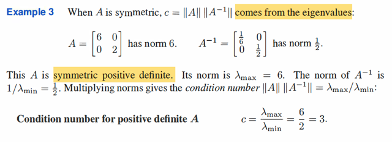</kbd>

> [!NOTE]
> tới đây ta đã hiểu cái này, khi lúc nãy đã thực hiện lại việc lập luận của norm A
> với các A khác nhau. Review lại không thừa:
>
> theo định nghĩa norm A là cái growth factor lớn nhất khi biến đổi vector x bất
> kì, khi A nhân x khác nhau, thì kết quả biến đổi khiến norm ||Ax|| lớn hơn ||x||
> nhiều ít khác nhau. Và có cái bị biến đổi (norm) nhiều nhất sẽ chính là ||A|| bị
> biến với factor lớn nhất xảy ra khi x trùng với eigenvector của ATA, và giá trị
> của growth factor max đó, là √λmax(ATA), cũng là σmax(A), và được định
> nghĩa cho ||A||.
>
> Thì với A bình thường, hình chữ nhật, thì như trên, nó là σmax(A),
> √λmax(ATA)
>
> Với A đối xứng, (thì dĩ nhiên vuông) thì có cái đặc biệt là eigenvalue λ(A) sẽ
> bằng với singular value σ(A) về trị tuyệt đối: |λ(A)| = σ(A) (singular value thì
> luôn ko âm rồi, nhưng eigenvalue có thể âm)
>
> Và nếu nó positive definite nữa thì λ(A) luôn dương ⇨ λ(A) = σ(A)
>
> Thành ra mới nói với symmetric positive definite A, thì condition number c =
> ||A|| ||Ainv|| = λmax(A) λmax(Ainv)
>
> mà λ(Ainv) = 1/λ(A), nên λmax(Ainv) = 1/λmin(A), vì mẫu càng nhỏ thì nghịch
> đảo mới lớn nhất được.
>
> Và từ đó ta hiểu rằng với symmetric positive definite A thì c = λmax(A) /
> λmin(A) là như vậy.
>
> Còn nếu chỉ là A bình thường, thì cứ theo định nghĩa c = ||A||||Ainv||
>
> = σmax(A) σmax(Ainv) = √λmax(ATA) √λmax(AinvTAinv)
>
> = σmax(A) / σmin(A) = √λmax(ATA) / √λmin(ATA)
>
> (Làm rõ thêm vì sao σmax(Ainv) = 1 / σmin(A)
>
> full svd của A: A = U Σ VT 
>
> ⇨ Ainv = (U Σ VT)inv = VTinv (U Σ)inv =  VTinv Σinv Uinv
>
> Và vì U, V là orthogonal matrix UT = Uinv, VT = Vinv, ⇨ VTinv = Vinvinv = V
>
> = V Σinv UT
>
> Kết quả này cho thấy σ(Ainv) = 1/σ(A). Nên σmax(Ainv) = 1 / σmin(A)
>
> Từ đó (với matrix thường A) thì c còn bằng σmax(A) / σmin(A)  
>
> mà σ(A) = √λ(ATA) ⇨ σmax/min(A) = √λmax/min(ATA))
>
> CÓ NGHĨA LÀ NẾU KO HỌC HÀNH ĐÀNG HOÀNG, MÃI MÃI CHẢ HIỂU tại
> sao
>
> có khi thì ||A|| = σmax(A), lúc thì λmax(ATA) (1), lúc thì lλmax(A)| (2) lúc thì
> λmax(A) (3).
>
> rồi condition number c, thì có khi là λmax(A) / λmin(A), khi thì ||A||||Ainv||, khi
> thì σmax(A)

 

<kbd>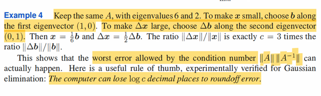</kbd>

> [!NOTE]
> Rồi, thế thì như đã nói, A trong ví dụ này symmetric positive definite
> nên ||A|| = σmax(A) = √λmax(ATA), mà cũng là λmax(A) nốt.
>
> Nhưng ta còn nhớ thêm một điều nữa. với matrix thường, thì x sẽ
> bị biến norm nhiều nhất khi nó trùng với eigenvector ứng với λmax 
> của ATA, để nó bị biến đổi thành Ax có norm ||Ax|| = ||A||||x|| = 
> σmax(A) ||x|| = √λmax(ATA) ||x||.
>
> Và khi matrix là symmetric: thì eigenvector của A cũng là eigenvector
> của ATA nốt:
>
> Vì ATA, với A symmetric A = Q Λ QT: 
>
> ⇨ ATA = (Q Λ QT)T(Q Λ QT) = Q Λ QT Q Λ QT = Q ΛΛ QT
>
> Kết quả này chính là eigendecomposition của ATA:
>
>  đủ cho thấy rằng eigenvalue của ATA = bình phương
> eigenvalue của A λ(A) = bình phương σ(A). Và eigenvector của A
> và của ATA là một.
>
> Như vậy với A symmetric ≻ 0 thì bằng cách chọn b trùng với eigenvector
> ứng với λmin của nó, thì mức độ thay đổi norm sẽ nhỏ nhất
>
> Và ngược lại chọn trùng với eigenvector ứng với eigenvalue lớn
> nhất của nó thì mức độ thay đổi norm sẽ lớn nhất
>
> Nếu A chỉ symmetric, thì ta vẫn có điều này, chỉ là ta sẽ nói thêm
> cụm từ trị tuyệt đối vào eigenvalue thôi:
>
> b trùng với eigenvector ứng với λ(A) có trị tuyệt đối lớn nhất / nhỏ nhất sẽ 
> growth lớn nhất / nhỏ nhất về norm

 

