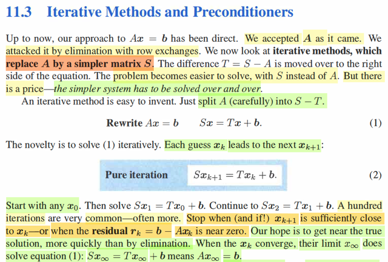
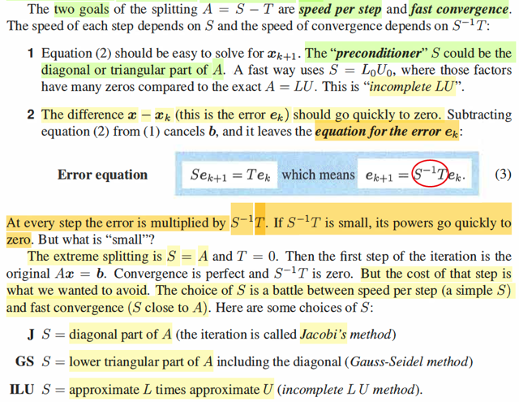
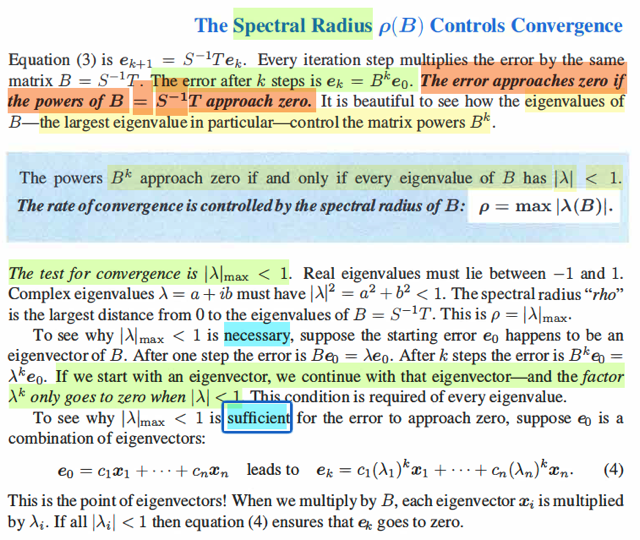
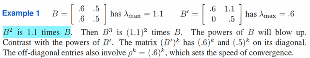
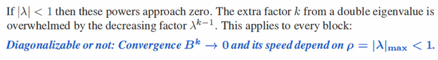
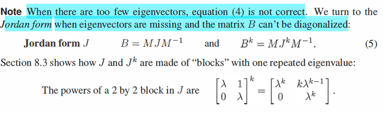

# 11.3 Iterative Method & Preconditioner

📊 **Progress:** `4` Notes | `7` Screenshots

---

<kbd></kbd>

> [!NOTE]
> đây là bài sẽ giúp mình hiểu hơn khi quay lại Numerical Optimization
> đại khái là, trước giờ khi nói về việc giải Ax = b, thì cách tiếp cận là
> trực tiếp, mình dùng trực tiếp thằng matrix A, nếu có làm gì (thay đổi
> A thì chỉ là eliminate nó với Gaussian elimination).
>
> Còn bây giờ, ta sẽ tiếp cận việc giải Ax = b theo cách gián tiếp: Đại 
> khái ý tưởng là ta thay A bởi matrix S khác đơn giản hơn. Khi đó
> giữa A và S sẽ có khác biệt: T = A - S Và Ax = b sẽ thay bằng Sx = Tx + b
>
> Thế thì, hiểu thế này, nếu như bằng cách nào đó ta có thể tuần tự
> giải các hệ Sxk+1 = Txk + b. Ví dụ như đầu tiên giải Sx1 = Tx0 + b, giải
> ra x1, rồi giải Sx2 = Tx1 + b, giải ra x2... sao cho dần dần khoảng cách
> giữa Axk với b trở nên nhỏ đến mức nào đó gần bằng 0. Thì khi đó ta
> đã giải  được hệ Ax = b với solution xk.
>
> Hoặc là khi xk+1 rất gần với xk, thì cũng là lúc ta giải xong vì khi đó
> Sxk+1 - Txj = b ≈ Sxk - Txk = b ⇔ (S - T)xk = b tức là Axk = b
>
> Ý tưởng là như vậy, và nó dựa trên gỉa định rằng việc tách A thành S - T
> sẽ khiến ta có matrix S rất dễ giải (simpler hơn A) nhưng đổi lại, ta phải
> giải đi giải lại các hệ Sxk+1 = Txk + b như nói trên. 
>
> Và có thể nhận ra cái này chính là nền tảng của các phương pháp quasi
> Newton method, mà trong Numerical Optimization, mình đã biết sơ
> qua rằng, thay vì dùng Hessian matrix H, khiến việc tính toán (ví dụ tính 
> inverse) tốn kém, thì người ta sẽ dùng một matrix B đơn giản hơn, nhưng
> xấp xỉ Hessian, để rồi thông qua cách tiếp cận iterative thì dần dần ta
> cũng giải được nghiệm xấp xỉ. Có thể nó liên quan / dựa trên nền tảng 
> của cái này

 

<kbd></kbd>

> [!NOTE]
> Thế thì có hai mục tiêu mà ta muốn đặt được khi tách A = S - T đó là  sự
> đơn giản của S giúp việc giải Sxk+1 = Txk + b ở mỗi step càng nhanh
> càng tốt, và bên cạnh đó là việc lặp đi lặp lại sẽ diễn ra nhanh hay lâu thì
> mới convergence, tức đạt được trạng thái xk+1 ≈ xk
>
> Nói về mục tiêu đầu tiên - giải Sxk+1 = Txk + b nhanh, đơn giản thì ta có
> thể có nhiều cách chọn S, ví dụ như chọn S = L0U0, gọi à incomplete LU
> (chưa rõ lắm gs sẽ nói sau), nhưng đại khái là S giúp giải equation system
> này nhanh. Để mỗi iteration rất nhanh.
>
> Còn tiêu chí thứ hai để nhanh converge, thì để dễ thấy ta sẽ biến đổi chút
> xíu để có cái equation of error:
>
> Đại khái là true solution sẽ là x, thỏa Ax = b ⇔ Sx = Tx + b, và tại step k+1 
> ta giải Sxk+1 = Txk + b. Trừ vế theo vế ta có: S(x - xk+1) = T(x - xk). 
> Thì mình sẽ hiểu rằng so với x thì xk+1 khai khác một khoảng x - xk+1,
> đó là sai số của xk+1, ek+1, còn x - xk, tương tự, là sai số của xk: ek
>
> Và ta có Sek+1 = Tek, ⇨ ek+1 = SinvT ek cho biết mức giảm của error
> từ ek sẽ nhanh chậm thế nào. (ví dụ như SinvT = 0.5 thì có nghĩa là sau
> iteration này error giảm một nửa)
>
> Vậy thì ta sẽ thấy nếu như chọn S = A (tức là giải Ax = b theo góc nhìn
> iterative) thì ek+1 = Ainv.0 ek = 0 và điều này cho ý nghĩa rằng, nếu mà
> dùng S chính là A thì ta chỉ cần có đúng 1 bước iteration để ra ngay 
> xk (vì sau một bước là error giảm về 0 liền)
>
> Nhưng dĩ nhiên là khi đó việc giải cái bước 1 này sẽ khó khăn y như 
> giải hệ Ax = b một cách trực tiếp khi việc tính Ainv rất tốn kém.
>
> Và ta muốn tránh chuyện đó nên mới tiếp cận theo kiểu iterative method
> nói nãy giờ.
>
> Do đó, việc chọn S chính là làm sao: S đơn giản để giải Sxk+1 = Txk + b
> nhanh và để error giảm nhanh
>
> Thì gs cho một số lựa chọn như J, GS, ILU sẽ hiểu hơn sau

 

<kbd></kbd>

> [!NOTE]
> Đại khái là phần này bàn tới việc, làm sao biết rằng sự hội tụ sẽ
> xảy ra, và đó cũng là hỏi làm sao biết rằng error ek sẽ converge
> về 0 (thì khi đó xk+1 sẽ ngày càng ~ xk (ý nói khoảng cách giữa
> hai thằng sau - trước sẽ ngày càng nhỏ, để rồi xk sẽ ngày càng
> ≈ x tức xk sẽ dần dần trở thành chính là true solution x của Ax = b
>
> Vậy thì, như vừa rồi đã thấy ek+1 = SinvT ek, đặt B là SinvT, người
> ta gọi nó là iteration matrix.
>
> Thế thì ta có e1 = Be0, e2 = Be1 = B^2e0, ....ek = B^ke0.
>
> Chú ý ej là vector, ko phải scalar.
>
> Rồi thế thì gỉa sử e0 vô tình là một trong các eigenvector của B
> với eigenvalue tương ứng là λ:
>
> ⇨ Be0 = λe0 ⇨ ek = λ^k e0
>
> Như vậy nếu như eigenvalue nhỏ hơn 1 thì dĩ nhiên ek sẽ nhỏ
> dần dần về 0.
>
> Và với các eigenvector khác cũng vậy.
>
> Nên nếu e0 vô tình là eigenvector thì yêu cầu là phải eigenvalue max
> phải < 1 thì mới convergence
>
> Còn nếu e0 không phải eigenvector, thì vì với việc giả định rằng B 
> có đủ eigenvector độc lập ⇨ e0 = linear combination của chúng:
> e0 = Σi ciui = Sc
>
> ⇨ B^ke0 = (S Λ Sinv)^k e0 = (S Λ Sinv)(S Λ Sinv)...(S Λ Sinv) e0
>
> = S Λ^k Sinv e0
>
> = S Λ^k Sinv S c
>
> = S diag(λ1^k, ..λn^k) c 
>
> = S (c1λ1^k, ..cn λn^k)T 
>
> = c1 λ1^k u1 + c2 λ2^k u2 + ...+ cn λn^k un
>
> Hay như trong sách dùng x1,..xn thay vì u1,...un là eigenvector của 
> B thì ek = Σ ci λi^k xi
>
> và chỉ khi mọi λi đều nhỏ hơn 1 thì ci λi^k mới → 0 và ek là tổng của
> chúng mới → 0
>
> Do đó mình hiểu được vì sao điều kiện cần và đủ cho việc convergence
> là max |λ(B)| < 1
>
> Và cái này nó gọi là spectral radius của B.
>
> CHÚ Ý max |λ(B)| nó khác |λmax(B)|. Vì λmax(B) có thể là cái cái lớn
> nhất trong 3 cái âm, nhưng lấy trị tuyệt đối thì ra cái nhỏ nhất. Mà đặt
> điều kiện nó nhỏ hơn 1 thì chưa chắc mấy thằng kia nhỏ hơn 1. Nên
> phải là lấy trị tuyệt đối hết, rồi lấy thằng to nhất, và yêu cầu nó nhỏ
> hơn 1 thì mới đảm bảo mọi đứa đều < 1

 

<kbd></kbd>

> [!NOTE]
> Tại sao B^2 = 1.1 B tức λmax B
>
> Là bởi ta đang có B là một rank 1 matrix, luôn có thể được thể hiện
> bởi uvT
>
> Matrix này có hai eigenvalue có tổng bằng .6 + .5 = 1.1. mà đây
> là matrix rank 1, tức là singular ⇨ λ1 = 0, ⇨ λ2 = 1.1, chính là λmax
>
> B^2 = (uvT)uvT = uvTuvT = u(vTu)vT = (vTu) uvT (vì vTu là scalar
> đưa đi đâu tùy ý) và = (vTu) B
>
> Xét Tr(B) = tr(uvT) 
>
> = tr(vTu) nhờ tính chất đổi chỗ của trace: tr(AB) = tr(BA)
>
> = vTu (vì vTu là scalar, nên trace cũng chỉ là nó)
>
> Vậy B^2 = tr(B) B = (λ1 + λ2) B = λ2 B = λmax B
>
> Rồi nếu xét x1 là eigenvector: Bx2 = λ2x2 ⇔ uvTx2 = λ2x2 
> mà vTx2 là scalar, thì ta có (vTx2)u = λ2x2. Điều này cho thấy
> u chính là (trùng hướng với) eigenvector x2, ứng λ2 là λmax
>
> còn Bx1 = λ1x1 = 0, do λ1 = 0 ⇨ x1 là nullspace vector.
>
> Hơn nữa ta cũng dẫn tới uvTx1 = 0 ⇨ u(vTx1) = 0 ⇨ vTx1 = 0 (do
> u khác 0) ⇨ v vuông góc với x1 và cũng phán ánh thứ mà ta đã 
> biết rowspace vuông góc nullspace (orthogonal complement)
>
> ====
>
> Còn B' thì sao?
>
> trace = 1.1,matric này rank 2 (thấy số 0 ở cột 1, ko thể nhân với 
> bao nhiêu để thành 5 và ngược lại 5 nhân 0 mới thành 0 nhưng 
> 1.1 nhân 0 không thể thành 6 ⇨ hai cột linear independent)
>
> Vậy hai eigenvalue dương, có tổng 1.1
>
> Còn tích của chúng là det, dễ thấy là .6*.5, ta có thể giải bài toán
> cấp hai để tìm λ1, λ2:
>
> Còn không thì giải từ characteristic equation:
>
> (B - λI)x = 0
>
> ⇨ det (B' - λI) = 0 ⇔ det [.6 - λ1, 1.1; 0, .5 - λ2] = 0
>
> ⇔ (0.6 - λ1)(0.5 - λ2) = 0 ⇨ λ1 = 0.6, λ2 = 0.5 
>
> Vậy tại sao B'^k có 0.6^k và 0.5^k trên đường chéo của nó?
>
> QUAY LẠI SAU

 

<kbd></kbd>

<kbd></kbd>

<kbd></kbd>

 

