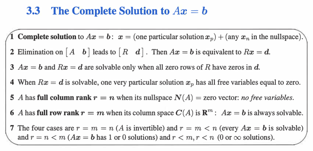
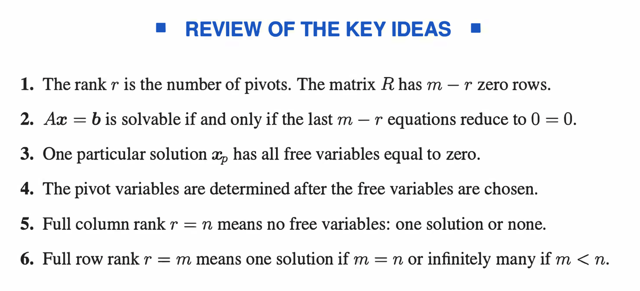

# 3.3 THE COMPLETE SOLUTION TO Ax=b

📊 **Progress:** `2` Notes | `2` Screenshots

---

<kbd></kbd>

> [!NOTE]
> Tại sao 1: Là vì x_n thuộc nullspace tức Ax_n = 0.
>
> Thế thì nếu Ax_p = b thì tương đương Ax_p + Ax_n = b + 0 = b tức A(x_p + x_n) =
> b. Từ đó có nghĩa là x_p + x_n CŨNG là solution  của Ax = b
>
> Ở đây chú ý rằng x_p + x_n CŨNG LÀ SOLUTION CHỨ KHÔNG PHẢI x_n LÀ
> SOLUTION nhé. Do đó nếu có tồn tại x_p, thì cộng nó với x_n nào cũng sẽ là
> solution của  Ax = b, còn nếu không tồn tại x_p thì  dù có x_n thì Ax = b cũng vẫn vô
> nghiệm
>
> ====
>
> Tại sao 2: Là bởi vì quá trình elimination biến A thành R, và có thể diễn tả
> elimination bằng matrix E. Ta có EA = R.
>
> Thế thì Ax = b <=> EAx = Eb (nhân hai vế cho E)
>
> <=> Rx = d (d = Eb). Vậy x là solution của Ax = b sẽ cũng là solution của Rx = d
> (Thế thôi)
>
> ====
>
> Tại sao 3: Đơn giản là vì khi elimination biến A thành R, nó đã chỉ giữ lại các
> independent row, xắp nó nằm trên, những dependent row trở thành zero và được
> xắp nằm dưới. Hơn nữa, các independent row cũng hình thành nên một Identity
> matrix ở trên (R là Reduced Echelon Form, mọi pivot thành 1, và mọi non-pivot
> thành 0 hết)
>
> Do đó, muốn Ax=b có solution thì vì ý 2, Rx=d phải có solution. Muốn vậy các
> component tương ứng (m-r component  ở cuối) cũng phải bằng không, chứ nếu
> chúng bằng 0 đương nhiên hệ phương trình sẽ vô nghiệm
>
> ====
>
> Tại sao 4: Vì khi đã elimination Ax = b thành Rx = d, thật ta có thể gán giá trị  bao
> nhiêu cũng được cho các free variable, backsub vào để tìm pivot var. Nhưng để đơn
> giản nhất thì ta cho mọi free variable bằng 0, thì giá trị của pivot var sẽ TỰ NHIÊN
> ĐƯỢC PHÁT LỘ Ở d , BỞI VÌ CÁC PIVOT COLS LÀ CỘT ZERO VỚI 1 TẠI PIVOT
> CẢ RỒI. Nên PIVOT VARIABLE ỨNG VỚI PIVOT Ở HÀNG NÀO SẼ CÓ GIÁ TRỊ
> BẰNG PHẦN TỬ TƯƠNG ỨNG Ở HÀNG ĐÓ TRÊN d

> [!NOTE]
> Tại sao 5: Đơn giản vì full column rank tức mọi cols đều là pivot cols, thì đương
> nhiên không có free cols nào. Mà mỗi free cols ứng với một special solution,  nên
> không có free cols nào tức không có special solution nào. Điều này có nghĩa không
> có vector nào trong basis của nullspace. Vậy nullspace chỉ chứ zero.
>
> NHƯNG GIẢI THÍCH NHƯ VẬY MANG CÓ THỂ KHÔNG THUYẾT PHỤC BẰNG:
> Vì mọi cols đều là pivot cols, nên CHÚNG INDEPENDENT NHAU, vì về bản chất
> các vị trí pivot đã thể hiện điều đó, đối ứng với pivot của cols này, là 0 của cols kia,
> nên không thể scale hay combine các cols đó để tạo cols này được. Mà như vậy
> **bộ hệ số duy nhất khiến combination của chúng bằng 0 (x của nullspace)** **chỉ
> có thể là 0 (*)**. -> đó chính là kết luận nullspace chỉ có zero.
>
> (*) Ta có thể dễ dàng chứng minh ý này bằng **PHẢN CHỨNG** : Giả sử có một bộ
> coeff (đều khác 0) khiến linear  combination các cols (independent nhau) mà vẫn
> cho ra 0 thì ta sẽ suy ra ngay bằng cách **chuyển vế đổi dấu** để cho ra kết quả là
> **một cols nào đó sẽ là linear  combination của các cols còn lại**, mà điều này**ngược với điều kiện ban đầu**
> ====
>
> Tại sao 6: Vì khi mọi row là pivot, đương nhiên cũng cùng số đó cols là pivot cols.
> Mà cols space là subspace của R^m, trong khi lại có đủ m pivot cols, vậy pivots 
> cols span cả không gian R^m. Rồi, đương nhiên b cũng là R^m vector, thành ra nó
> bằng bao nhiêu, hay nó nằm đâu trong không gian R^m thì cũng là nằm trong cols
> space. Do đó luôn luôn có solution.
>
> Nói thêm, còn lại số lượng thì phải xét nullspace. Nếu nullspace khác zero thì
> sẽ là vô số solution, còn ngược lại thì sẽ là chỉ có một solution duy nhất.
>
> ====
>
> Giải thích 7: 
>
> Case thứ nhất: invertible matrix A, thì Ax = b luôn có 1 solution duy nhất. Dễ hiểu đó
> chính là x = A.inb, đây chính là solution phát lộ khi Elimination biến A thành I (R trong
> case này chính là I)
>
> Case thứ hai: r = m < n thì đây là full row rank nói trên, ta có các pivot cols, span
> toàn bộ R^m nên b bằng bao nhiêu thì cũng nằm trong cols space. Bên cạnh đó,
> m < n nên tồn tại free cols, dẫn tới luôn có thể tìm ra bộ coeffs khác 0 khiến giúp 
> linear combination các cols để thành 0 => tức là Ax = 0 có solution khác 0. Mà điều
> này cũng đồng nghĩa là có vô số solution của Ax = 0, vì bất cứ khi nào ta scale
> solution lên ta cũng có một solution khác của Ax = 0.
>
> Hoặc có thể giải thích kiểu khác đó là vì có free cols nên sẽ có special solution của 
> Ax = 0, tức nullspace khác zero, hay có nhiều solution của Ax = 0.
>
> Từ đó dẫn tới, khi kết hợp x_particular và vô số x_null thì ta có vô số solution của 
> Ax = b.

 

<kbd></kbd>

 

