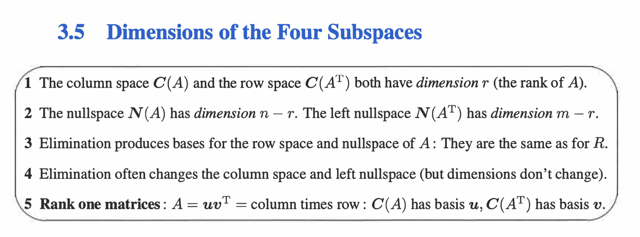

# 3.5 Dimensions Of 4 Subspaces

📊 **Progress:** `1` Notes | `1` Screenshots

---

<kbd></kbd>

 

## Đại khái là phần này gs dẫn dắt đi tìm 4 subspace của R - Reduced Row Echelon Form của matrix A. với

> [!NOTE]
> Đại khái là phần này gs dẫn dắt đi tìm 4 subspace của R - Reduced Row Echelon Form của matrix A. với
> một ví dụ R như sau:
>
> [**1** 3 5 **0** 7
>
> **0** 0 0 **1** 2
>
> 0 0 0 0 0]
>
> Matrix này có 2 pivot -> rank = 2
>
> i) **Row Space C(R.T)**: Basis sẽ chính là 2 pivot row tuy nhiên đáng chú ý là phải hiểu rộng hơn vì sao
> chúng lại tạo thành basis của row space: Đó là vì, việc chứa hai pivot, khiến **HÌNH THÀNH NÊN MỘT
> IDENTITY MATRIX** - và từ đó row 2 sẽ **không thể nào  depend row 1** vì \\_**SỐ 0 TẠI R14 KHÔNG
> THỂ NHÂN VỚI CÁI GÌ ĐỂ CHO RA SỐ 1 TẠI R24**\\_ được. Và ngược lại row 1 không thể depend row
> 2 vì số 0 tại R21 không thể nhân với cái gì để cho ra R11 được. Do đó, nguyên nhân sâu xa của việc tại
> sao các pivot row  lại tạo nên basis của row space là bởi chúng **TẠO NÊN MỘT SET CÁC
> INDEPENDENT ROW**.
>
> Và **RIÊNG ĐỐI VỚI R**, thì chúng là các vector khác 0, (vì ở trạng thái R, ngoài pivot row ra, các row
> khác **BẰNG 0 CẢ RỒI**) NÊN CÁC PIVOT ROW NÀY **SPAN ROW SPACE  CỦA R**. Vậy theo định
> nghĩa, một set các independent vector mà span một space thì chúng  chính là basis.
>
> ii) **Column Space của R C(R)**: Basis chính là 2 pivot cols. Và cũng tương tự như trên, CẦN HIỂU
> NGUYÊN NHÂN GỐC RỄ là bởi vì CÁC PIVOTS COLS SẼ **TẠO NÊN CÁC IDENTITY MATRIX NÊN
> CHÚNG INDEPENDENT.**Thế thì với cols space, thì các free cols không bằng 0, **NHƯNG CHÚNG
> DEPEND CÁC PIVOT COLS,**thành ra các pivots cols sẽ là các independent vectors trong các
> columns****->  Nó chính là basis của cols space.
>
> iii) **Null Space of R N(R)**: Như trong bài đã học rằng, nếu đã xác định các free cols / variables thì ta sẽ
> set 1 lần lượt cho mỗi free variable (trong mỗi lần như vậy, set 0 cho những free variable còn lại) rồi thế
> vào giải tìm ra các pivot variables, thì ta sẽ có các SPECIAL SOLUTIONS VÀ CHÚNG SẼ TẠO NÊN
> MỘT BASIS CỦA NULLSPACE. Thế thì PHẢI HIỂU **TẠI SAO CÁC SPECIAL SOLUTION LẠI LÀM
> THÀNH MỘT BASIS CỦA NULLSPACE?**Đó là bởi vì, bằng cách set 1 cho free variable và 0 cho những thằng còn lại để tạo một special solution
> **TA ĐÃ AGAIN TẠO RA TRẠNG THÁI CÁC IDENTITY MATRIX NHƯ NÓI Ở TRÊN KHIẾN CHO TA CÓ
> CÁC SPECIAL SOLUTION SẼ INDEPENDENT NHAU.**iv) **Null Space of R.T hay Left Null Space**: Cái này DÙ CÓ THỂ LẬP LUẬN GIỐNG VỚI
> NULL-SPACE  CỦA R. NHƯNG ĐẶC BIỆT HƠN khi xét R.Ty = 0, thì cơ bản ta CÓ TRẠNG THÁI LÀ
> CÁC FREE  COLS  ĐỀU BẰNG 0 HẾT RỒI.
>
> Do đó, đương nhiên cũng có bao nhiêu free cols thì có bấy nhiêu special solution (và cũng bấy nhiêu
> vector  trong basis), tuy nhiên ĐẶC BIỆT Ở CHỖ, VÌ CÁC PIVOT COLS INDEPENDENT NHAU MÀ CÁC
> FREE COLS  BẰNG 0, NÊN **CÁC PIVOT VARIABLE PHẢI BẰNG 0 HẾT**

> [!NOTE]
> THE 4 SUBSPACE OF R:

 

