# 6.2 Diagonalizing A Matrix

📊 **Progress:** `18` Notes | `26` Screenshots

---

<kbd>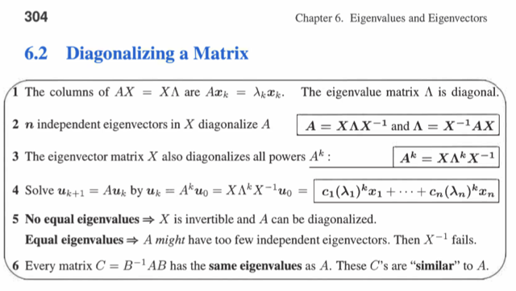</kbd>

 

<kbd>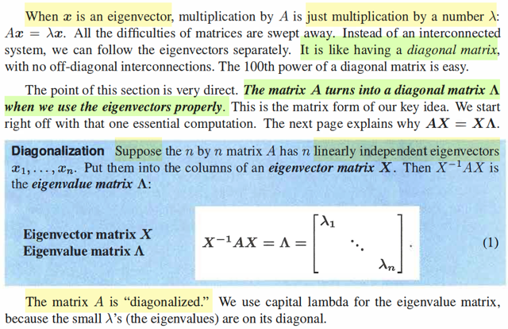</kbd>

> [!NOTE]
> Mấy ý này mình đã hiểu / biết từ các bài giảng rồi. Đại khái là  gs cho
> rằng khi x là eigenvector của A thì chuyện nhân với matrix A trở nên rất
> đơn giản, vì khi đó Ax = λx, tức là x chỉ bị scale bởi scalar là eigenvalue
> tương ứng. Và điều này thì cũng giống nhân x với một diagonal matrix
> vậy (có thể hiểu cái này, là vì khi nhân với một diagonal matrix, kết quả
> sẽ là các phần tử của vector x sẽ được nhân với phần tử trên đường
> chéo, có thể dễ dàng hiểu được khi  nhìn nhận nhân matrix với vector
> theo góc nhìn thứ 1)
>
> Một ý nữa là power 100th của diagonal matrix thì cũng dễ luôn. Là sao
> nhỉ? Xét Λ^100. với Λ là một diagonal matrix. Thì trước hết  xét Λ^2 =
> ΛΛ. Theo góc nhìn nhân matrix với matrix theo kiểu thứ 2 (theo thứ tự
> list bởi thầy Strang) ta thấy cột 1 của Λ^2 = linear combination các cột
> của Λ (trước) dùng hệ số là cột 1 của Λ (sau) Mà cột 1 của Λ chỉ  có 1 số
> khác 0 ⇨ kết quả là scale cái cột 1 của Λ (trước) bởi component trên
> cột 1 của nó, thì đương nhiên là chính là bình phương lên.Tương tự
> vậy, cột 2 của Λ^2 cũng là diagonal entries bình phương lên,... Vậy ΛΛ =
> Λ^2. Và ΛΛΛ = Λ^3....Nên Λ^100 chỉ là diagonal matrix mà mỗi phần tử
> đường chéo mũ 100 lên
>
> Thế thì ông nói matrix A nxn, nếu ta giả sử / cho rằng nó có n eigenvector
> độc lập, thì bằng cách sắp chúng thành cột của matrix X, ta sẽ có:
>
> Xinv A X = Λ là diagonal các eigenvalues của A.
>
> Và ta gọi là A bị diagonalized. Chéo hóa.
>
> Có thể nhờ trong bài giảng hoặc ở đâu đó mà mình hiểu cái này như sau:
>
> Gốc rễ chỉ là từ định nghĩa của eigenvector - eigenvector.
>
> Ax = λx ⇨ Với n eigenvector / eigenvalue ta có:
>
> Ax1 = λ1x1, ...Axn = λnxn
>
> Thế thì, nếu ta đặt các x1, x2....xn vào các cột của X, thì AX là gì?
>
> Theo góc nhìn thứ 2 khi nhân matrix với matrix:
>
> Cột 1 của AX sẽ là linear combination các cột của A bởi cột 1 của X,
> mà nó cũng chính là Ax1, và cái này, thì bằng λ1x1
>
> Tương tự, cột 2 của AX, chính là λ2x2. Tương tự vậy
>
>
> Vậy AX là matrix là matrix có các cột lần lượng là λ1x1, ...λnxn
>
> Rồi, để ý λ1,..λn là các scalar - số vô hướng.
>
> Nên như đã nói, việc scale các cột của X bởi các số λ1,...λn chính là
> nhân X với matrix diag(λ1,...λn)
>
> ⇨ AX chính là XΛ: AX = XΛ 
>
> Rồi. Nếu như x1,...xn độc lập. Thì, dĩ nhiên X fullrank, invertible
>
> ⇨ Nhân hai vế cho Xinv ta có: Xinv A X = Λ

 

<kbd>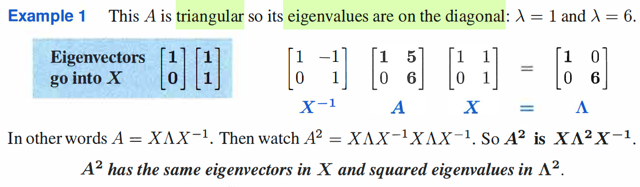</kbd>

> [!NOTE]
> Gs cho ví dụ này. A là triangular matrix, ta biết eigenvalue nó nằm trên
> đường chéo (đây là tính chất phải nhớ thôi) ⇨ eigenvalue chính là 1, 6
> A có hai eigenvalue dương (điều này đồng nghĩa A nonsingular, det
> khác 0) Và ông cho ta thấy quả thật Xinv A X là diagonal matrix.
>
> Từ đó A^2 = X Λ Xinv X Λ Xinv = X Λ^2 Xinv
>
> Kết quả này chính là eigendecomposition của matrix A^2 → A^2 có chung
> eigenvector với A và eigenvalue thì bình phương lên

 

<kbd>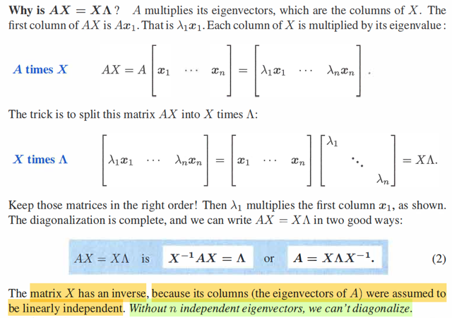</kbd>

> [!NOTE]
> phần này chính là gs giải thích ở đâu ra có AX = XΛ, mình vừa nói lại
> hồi nãy rồi.
>
> Và qua đó cũng thấy rằng: AX = X Λ thì lúc nào cũng có.
>
> Nhưng chỉ khi X invertible, đồng nghĩ n eigenvector độc lập thì ta
> mới có A = X Λ Xinv hay Xinv A X = Λ. Khi đó mới gọi là A diagonalizable
> (tạm hiểu chéo hóa, tức là có thể biến A về dạng của một diagonal matrix)

 

<kbd>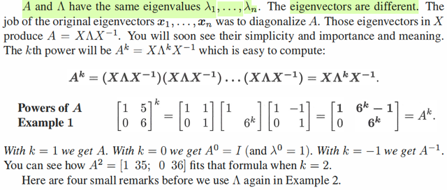</kbd>

> [!NOTE]
> Cái câu A và Λ có chung eigenvalue coi chừng đánh giá thấp.
>
> Rõ ràng ta hiểu rằng khi xây dựng AX = XΛ từ Axi = λixi thì dĩ nhiên mình
> nói Λ chính là chứa các eigenvalue của A trên đường chéo. Nhưng,
> eigenvalue CỦA NÓ có phải cũng là eigenvalue của A ko?
>
> À phải, là vì, với triangular matrix thì eigenvalue nó nằm trên đường chéo
> luôn.
>
> Vậy Λ, với A có chung eigenvalue. Nhưng eigenvector của chúng khác
> nhau.
>
> ở đây gs ko nói gì thêm nhưng nhưng thử nghĩ xem eigenvector của Λ là
> gì?
>
> ⇨ Λ là diagonal matrix, khi nhân với vector nào thì như đã biết, cũng đều là
> scale các phần tử của nó. Vậy nếu Λe1 thì chính là Λ11 e1, Λe2 chính là
> Λ22e2,...với e1,e2 là các standard basis.
>
> Vậy có thể thấy eigenvector của diagonal matrix Λ chính là các standard
> basis
>
> Mà cũng có thể thấy eigenvector của Λ chính là ei theo cách khác:
>
> Λ chính là I Λ Iinv (vì Iinv = I) Vậy thì tương tự như A = X Λ Xinv thì  Λ = I Λ
> Iinv cho thấy các cột của I chính là eigenvector của Λ
>
> Và chỗ này ta có thể nói thêm để kết nối với kiến thức của linear
> transformation:
>
> Trong đó mình biết rằng Khi ta có V là matrix (các cột là) basis v's và W là
> matrix basis w's thì change of basis matrix từ tọa độ trong basis v's sang
> tọa độ trong basis w's sẽ là: WinvV.
>
> Thế thì, với A, khi nó bằng X Λ Xinv thì nhân Ax chính là X Λ Xinv x sẽ thì
> Xinvx chính là Xinv I x = (XinvI)x ⇨ change tọa độ của x đang trong basis e'
> s sang tọa độ basis x's (eigen vector của A) Sau đó Λ Xinv x sẽ thực hiện
> việc biến đổi tuyến tính: kéo giãn tọa độ của input vector (nhưng mà đang
> trong basis x's) Và cuối cùng là X Λ Xinv x sẽ chuyển ngược lại kết quả về
> basis e's.
>
> Và liên hệ với cái này, tại đây mình hiểu thêm là: Như vậy nếu ta nhân Λ
> với x: Thì nếu theo mô tuýp trên thì chính là I Λ Iinv x: Cũng chuyển tọa độ
> của input vector x từ basis e's sang ...eigenbasis của Λ mà nó cũng là e's.
> Sau đó stretching bởi Λ
>
> Và như vậy ta lại nhận ra quả thật bản chất của viêc nhân với diagonal
> matrix chính là kéo giãn nó bởi các eigenvalue theo các trục của
> eigenvector của nó. Nhưng mà eigenvector của nó lại cũng chính là các e's.
> Nên thành ra nhân Λx chính là kéo giãn các tọa độ của x bởi các
> eigenvalue.

 

<kbd>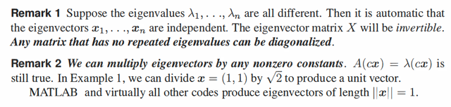</kbd>

> [!NOTE]
> Nếu mọi eigenvalue đều khác nhau thì tự động mọi eigenvectors
> đều độc lập. Cái này sẽ chứng minh ở sau
>
> Và nếu ta scale eigenvector bởi c thì A(cx) = c(Ax) = cλx = λ(cx)
> cho thấy cx vẫn là eigenvector. Cái này chính là: nói về eigenvector
> là là nói về hướng (phương) chứ ko nói về độ lớn cụ thể. Ý là, ta có
> n eigenvector độc lập tức là ta có n phương độc lập

 

<kbd>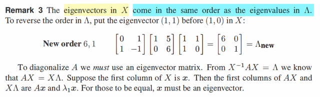</kbd>

> [!NOTE]
> Ý này là sao (remark 3) ?
>
> Ta bắt đầu với cái đã hiểu rồi AX = XΛ hay Xinv A X = Λ 
>
> Thì ở đây ý nói, nếu đổi chỗ, đổi thứ tự các cột của X, thì các eigenvalue
> của A (như đã biết, nằm trên đường chéo của Λ) cũng đổi thứ tự.
>
> Chứng minh như sau:
>
> Đơn giản là từ Xinv A X = Λ  ⇔  AX = XΛ 
>
> Và cái này đồng nghĩa cột j của AX = cột j của XΛ 
>
> Mà cột j của AX, dĩ nhiên là Axj, vì theo góc nhìn 2's nhân matrix với matrix
> thì cột j của AX là linear combination các cột của A bởi bộ hệ số là cái cột j
> của X, tức xj Mà điều này cũng chính là nhân A với vector Axj. 
>
> Còn cột j của XΛ dĩ nhiên là λjxj, vì cũng theo như trên, ta sẽ linearly combine
> các cột của X bởi cột j của Λ, mà cột j của Λ chỉ có phần tử thứ j, chính là λj
> khác 0 ⇨ kết quả chính là bốc ra cột j của X và scale bởi λj 
>
> Vậy Axj phải bằng λjxj. Cho thấy xj phải là eigenvector gắn với λj
>
> Do đó nếu đổi thứ tự của các cột của X, thì để equation vẫn đúng, thì vị trí
> các eigenvalue cũng phải đổi theo.

 

<kbd>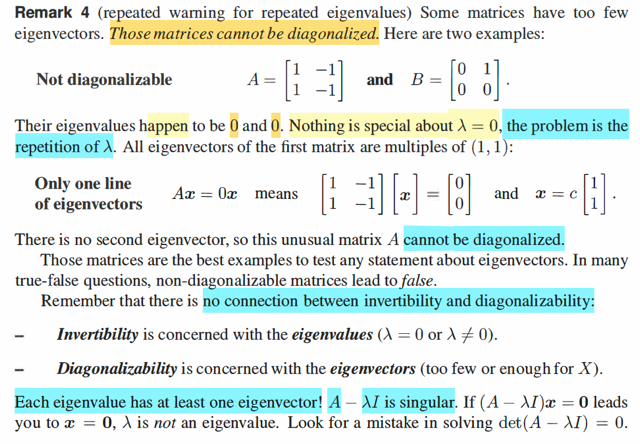</kbd>

> [!NOTE]
> remark 4, gs nhắc lại ko phải matrix nxn nào cũng có thể chéo hóa, vì
> chúng ko đủ n eigenvector độc lập.
>
> Ví dụ matrix A và B này
>
> A có eigenvalue là 0, 0. Thử xem vì  sao?
>
> A rõ ràng là rank 1, ⇨ singular ⇨ Ít nhất một eigenvalue = 0, dễ thấy vì,
> chắc chắn N(A) khác {0}, và Axnull = 0 cũng là  Axnull = 0 xnull cho thấy
> xnull chính là eigenvector với λ = 0.
>
> Còn λ kia? Ta thử lần từ trace và det, trace = λ1 + λ2 = 1 - 1 = 0. Mà λ1 =
> 0 ⇨ λ2 cũng bằng 0. Vậy đúng là cả hai đều bằng 0.
>
> Vậy là sao: nếu x1 x2 là hai eigenvector tương ứng. Thì Ax1 = 0, Ax2 = 0
> Cho thấy x1, x2 đều nằm trong nullspace N(A).
>
> Tuy nhiên, đây là matrix rank 1,  có 1 cột tự do, Ax = 0 chỉ có 1 nghiệm
> ứng với 1 cột tự do. Hay, nhìn cách khác, rowspace là subspace của R^2,
> dim C(AT) = 1, ⇨ dim N(A) = 1. Tức là chỉ có 1 basis của nullspace: ⇨ ko
> thể có x1,x2 độc lập cùng nằm trong nullspace ⇨ x1,x2 phụ thuộc (trùng
> nhau)
>
> Và nullspace vector (tức x1,x2) dễ thấy là (1, 1) là vì 1 cột + 1 cột 2 = 0 ⇨
> x1, x2 đều là scaled version của (1,1).
>
> Còn B?
>
> B rank mấy? Coi nào, nó có hai cột. Một cột bằng 0, 1 cột khác 0. Có phải
> rank 1? Xét thử C(A): linear combination mọi cột, mình cho là có thể span
> một 1D subspace ⇨ dim C(A) = 1, matrix rank 1
>
> Xét thử nullspace, theo theorem, dim N(A) phải bằng 1.
>
> Dễ thấy mọi vector (α, 0) đều linearly combine hai cột thành 0. ⇨ nó tạo
> nullspace vector là α * (1, 0)
>
> Rồi, vì singular nên λ1 = 0, trace cũng 0 ⇨ λ2 = 0 nốt. Again, hai
> eigenvector đều trùng nhau, là vector α * [1, 0]T
>
> ====
>
> Rồi, gs nhấn mạnh. Tính invertible hay ko ko liên quan gì tính
> diagonalizable hay không. Vì invertible hay ko là do có eigenvalue nào
> bằng 0 ko. Còn diagonalizable thì do có bị trùng ko. Nên kể cả có λ = 0
> nhưng chỉ một thằng bằng 0 thì vẫn ok.
>
> Ngay sau đây gs sẽ chứng minh chỉ khi không trùng λ thì mới có đủ n
> eigen vector độc lập.
>
> ====
>
> Cuối cùng: Gs nói mỗi eigenvalue phải có ít nhất 1 eigenvector. Và A - λI
> singular, nên nếu giải (A - λI)x = 0 mà ra x = 0 thì có gì sai sai rồi.
>
> Là sao? Ta biết nếu x, λ là eigen vector / value của A  thì Ax = λx
>
> ⇔ (A - λI)x = 0 và điều này đồng nghĩa x, eigenvector của A, chính là
> nullspace vector của A - λI. Do đó dĩ nhiên kết luận ngay matrix này
> singular. Và vì vậy det = 0 và dẫn tới cái phương trình điều kiện giúp giải
> tìm λ: Characteristic equation det (A - λI) = 0
>
> Nên gs mới nói giải cái này mà ra λ  và thế vô tìm x ra x = 0 thì chắc chắc
> đã làm sai, vì x nhất định phải khác 0.

 

<kbd>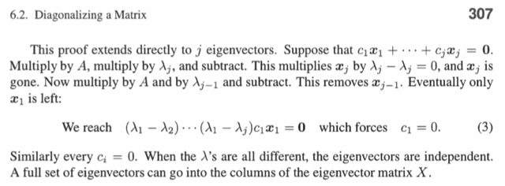</kbd>

<kbd></kbd>

<kbd>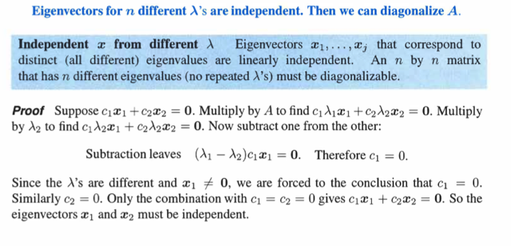</kbd>

> [!NOTE]
> Phần chứng minh nếu A có distinct eigenvalues thì các
> eigenvector của A độc lập
>
> Lập luận chính là, lấy ví dụ matrix có 2 eigenvalues  λ1, λ2
> khác nhau, tương ứng là hai eigenvector x1,x2. Ta chứng
> minh x1,x2 độc lập.
>
> Thế thì theo định nghĩa về linearly independence, x1,x2 được
> coi là độc lập nếu cách duy nhất để linearly combine chúng
> để tạo thành zero vector đó là các coefficients đều bằng 0.
> Vậy xét linear combination của x1, x2 với hệ số c1, c2: c1x1
> + c2x2 = 0 (1) ta sẽ chứng minh c1 = c2 = 0.
>
> Nhân hai vế cho λ1, (1) <=> λ1(c1x1 + c2x2) = 0 <=> λ1c1x1
> + λ1c2x2)  (2)
>
> Nhân hai vế cho A (1) <=> A(c1x1 + c2x2) = 0 <=> Ac1x1 +
> Ac2x2 = 0
>
> <=> λ1c1x1 + λ2c2x2 = 0 (3)
>
> trừ (2) cho (3) ta có λ1c2x2 - λ2c2x2 = 0 <=> λ1c2x2 =
> λ2c2x2
>
> Mà λ1 khác λ2 và x1 , x2 khác 0 nên suy ra c2 = 0.
>
> Lập luận tương tự ta cũng có thể suy ra c1 = 0.
>
> => Cách duy nhất để linearly combine chúng để tạo thành
> zero vector đó là các coefficients đều bằng 0
>
> Khái quát hóa lên với n vector cũng vậy

> [!NOTE]
> Chứng minh nếu A có distinct eigenvalues thì các
> eigenvector của A độc lập

 

<kbd>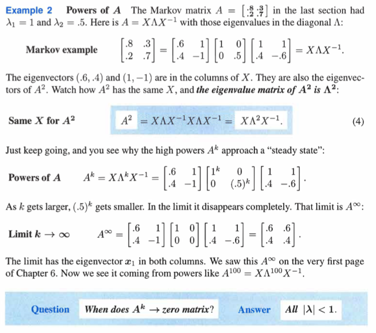</kbd>

> [!NOTE]
> Ví dụ 2 ở đây nói về Markov matrix cũng hay (Markov matrix sẽ học
> ở bài sau, đại khái là nó có tổng các cột đều bằng 1 và các giá trị
> đều không âm)
>
> Ở đây muốn ghi chút về việc tại sao có thể thấy ngay nó có một
> eigenvalue = 1:
>
> Là vì, khi tổng các cột đều bằng 1, tức cộng mọi hàng  ta sẽ được 1
> hàng = [1, 1...]. Đồng nghĩa nếu A-1*I, tức trừ 1 đi ở mỗi cột, ta sẽ
> có matrix A-1*I có tổng các hàng tạo thành zero row. Và đó là biểu
> hiện của INDEPENDENCE ROW -> matrix A - 1*I singular. Vậy 1 là
> con số khiến A-1*I singular => 1 là solution của characteristic
> equation, chính là eigenvalue của A
>
> Và khi biết một cái bằng 1, dựa vào trace là tổng đường chéo cũng
> là tổng hai eigenvalues, ta suy ra cái kia = .8+. 7 - 1 = **0.5**===
>
> Khúc sau ví dụ cho thấy một điều đã dự đoán eigenvector của A
> cũng là của A^k:
>
> Rất dễ, ví dụ với k = 2. AA = X Λ Xinv X LBD Xinv = X Λ^2 Xinv
> và đây là pattern cho thấy kết luận trên
>
> Một điểm nữa cũng rất hay là:
>
> A^k với k → inf thì như ta biết, các λ(A^k) = [λ(A)]^k nên nếu
> λ < 1 thì λ(A^k) → 0.
>
> Và trong ví dụ này, A khởi đầu là matrix hạng 2 với λ đều dương.
>
> Nhưng A^k có λ2 → 0. Nó dần trở thành rank 1 matrix!
>
> Quả thật, A^inf = 0.6 0.6; 0.4 0.4 là rank 1
>
> ===
>
> Vậy khi nào A^k → 0. rõ ràng nó phải là matrix rank 0, tức mọi 
> eigenvalue đều bằng 0. Xảy ra khi |λ(A)| < 1

 

<kbd>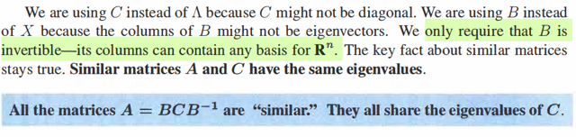</kbd>

<kbd>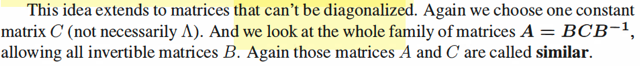</kbd>

<kbd></kbd>

<kbd></kbd>

<kbd>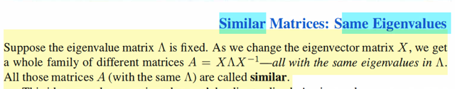</kbd>

> [!NOTE]
> rồi, phần này ta gặp lại similar matrix: Theorem nói rằng, xét matrix C (
> diagonal hay ko thì tùy) và B là invertible matrix bất kì thì BCBinv
> luôn có cùng eigenvalues với C, gọi là similar với C
>
> Thế thì. Sau khi học về linear transformation, mình đã hiểu hơn về
> cái này.
>
> Hóa ra là, BCBinv similar với C thì cái ý nghĩa của nó chính là nó cùng
> đại diện một biến đổi tuyến tính với C
>
> Xét B C Binv x. thì Binv x chính là chuyển tọa độ của x từ basis e's
> sang basis b's. Vì sao? Vì ta đã biết, khi muốn chuyển tọa độ input
> vector từ input basis v's sang output basis w's thì change of basis
> matrix là Winv V (1), nên chuyển từ basis e's sang basis b's chính là BinvI
> = Binv.
>
> Nên Binv x là tọa độ của nó trong basis b's. Tiếp. Nó sẽ được linear
> transform bởi C, và kết quả sẽ được chuyển từ tọa độ basis b's sang
> tọa độ basis e's bởi B.
>
> Do đó, B C Binv chỉ là cùng một linear transformation với C, chỉ là
> "làm" trong basis b's mà thôi.
>
> (1) Là vì: Nguyên tắc xây dựng linear transformation matrix:
>
> Lấy basis của input. ví dụ v's.
>
> Biến đổi nó T(vi)
>
> Thể hiện nó trong tọa độ của output basis: w's Bỏ lên cột của matrix. Là
> xong.

 

<kbd>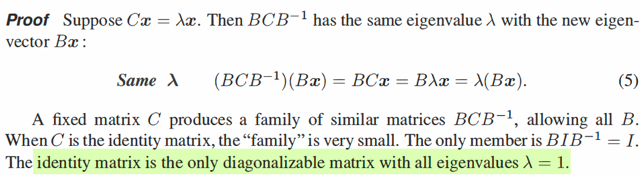</kbd>

> [!NOTE]
> Để chứng minh rất đơn giản:
>
> Xét x, λ là eigenvector eigenvalue của C thì Cx = λx
>
> Thì với B invertible bất kì, xét B C Binv Bx
>
> = B C x = B λ x = λ B x
>
> Như vậy (BCBinv) Bx = λ Bx đủ cho thấy λ cũng là eigenvalue 
> của BCBinv, và Bx cũng là eigenvector của BCBinv
>
> Như vậy với B invertible bất kì thì B C Binv tạo ra cả một family các matrix
> có chung eigenvalue với C, mà eigenvector là Bx.
>
> Và như đã biết, đây cũng là gia đình các matrix đại diện cho cùng một
> linear transformation với C. Chỉ là, C thực hiện nó trong basis e's. Còn
> BCBinv thực hiện nó trong basis b's (input vector x đang có tọa độ trong
> basis e's, thì Binv x chuyển thành tọa độ trong basis b's. Và sau đó C Binvx
> sẽ thực hiện phép biến đổi tuyến tính, để rồi BCBinv x chuyển kết quả biến
> đổi về lại basis e's)
>
> Ví dụ tao xét Cx và BCBinvx. thì x đều là tọa độ trong basis e's cả. 
> Rồi qua Cx nó biến đổi tuyến tính được kết quả vẫn trong basis e's. 
> Còn Trong BCBinvx, thì Binvx đổi tọa độ thành basis b's. rồi CBinvx biến 
> đổi tuyến tính, ra kết quả trong basis b's. Rồi BCBinvx chuyển kết quả 
> biến đổi từ basis b's thành basis e's lại.
>
> Tóm lại C éo biết gì, cứ đưa nó tọa độ (bất kể basis nào) thì nó biến đổi 
> theo basis đó thôi
>
> ====
>
> Thế thì một điểm quan trọng: Nếu C là I, thì thì với mọi B invertible thì
> BIBinv = I. Có nghĩa, là chỉ có duy nhất một thành viên là chính nó.
>
> VÀ NÓ CŨNG LÀ **TRƯỜNG HỢP DUY NHẤT CÓ EIGENVALUE LẶP
> LẠI MÀ VẪN CHÉO HÓA ĐƯỢC.**

 

<kbd>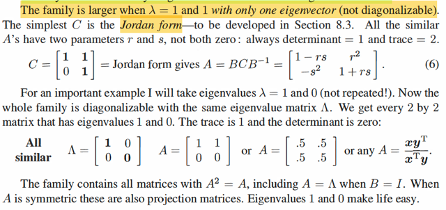</kbd>

> [!NOTE]
> CHƯA HIỂU LẮM,
> QUAY LẠI SAU

 

<kbd>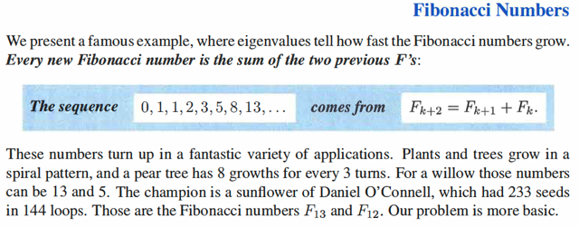</kbd>

> [!NOTE]
> QUAY LẠI SAU

 

<kbd>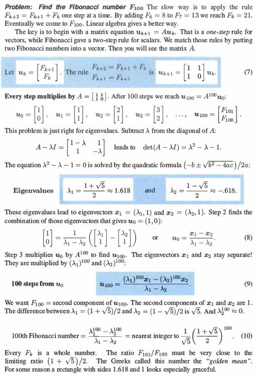</kbd>

> [!NOTE]
> QUAY LẠI SAU

 

<kbd>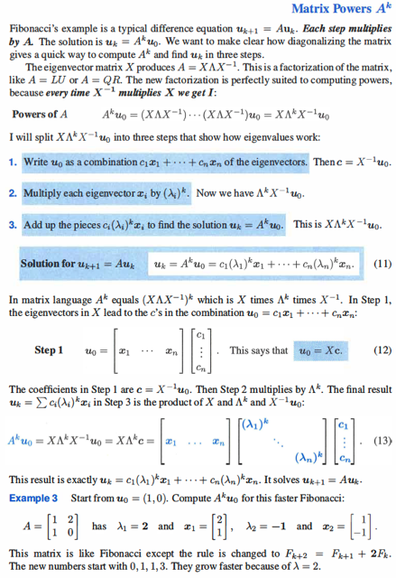</kbd>

> [!NOTE]
> QUAY LẠI SAU

 

<kbd>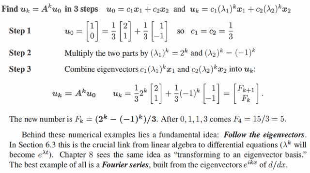</kbd>

> [!NOTE]
> QUAY LẠI SAU

 

<kbd>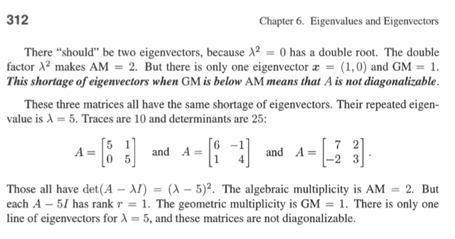</kbd>

<kbd></kbd>

<kbd>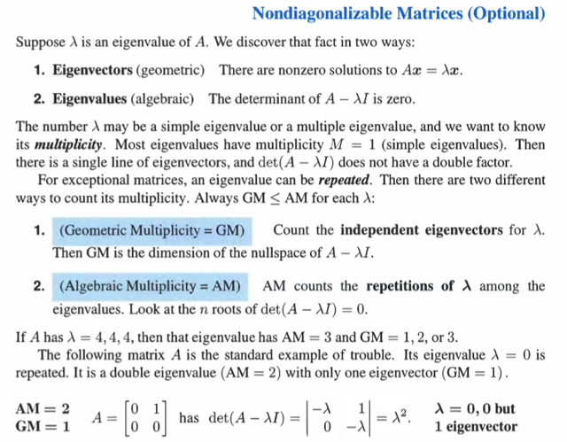</kbd>

> [!NOTE]
> Trong sách gs có nói rõ hơn một ý trong bài giảng liên quan đến
> việc một matrix có eigenvalue lặp lại (repeat eigenvalues) có thể
> bị thiếu eigenvector độc lập
>
> Đại khái là, ông cho rằng ta có thể đếm / xác định eigenvalue
> thông qua hai cách:
>
> 1) Theo định nghĩa, eigenvector là vector không bị thay đổi
> phương mà chỉ bị scale khi nhân với matrix: Ax = lambdax khi đó
> scale factor đó chính là eigenvalue.
>
> Thế thì, gs gọi đây là con đường hình học (geometric route) vì
> việc xác định số vector thỏa mãn tính chất này liên quan đến hình
> học.
>
> 2) Cách thứ hai, như đã biết, đó là từ Ax = λx <=> (A-λI)x=0 dẫn
> đến để tìm x, λ ta sẽ cần matrix A-λI singular để khi đó nullspace
> của nó chứa non-zero vector khiến thỏa (A-λI)x=0 thì cũng là thỏa
> mãn Ax = λx. Nói cách khác, nonzero vector trong nullspace của
> A-λI chính là eigenvector của A. Và để A-λI singular, ta sẽ đặt
> equation det (A-λI) = 0, đây  là characteristic equation.
>
> Gs gọi đây là con đường đại số (algebraic route) để tìm e.values
>
> Vấn đề là, một số matrix, khi giải det (A-λI) = 0 ta ra 2 solution
> giống nhau, thì tuy algebraic cho biết NÊN CÓ NHIỀU eigenvector
> độc lập nhưng khi thế vào tìm nullspace (A-λI) thì lại thấy
> dimension bằng 1, tức là chỉ có 1 eigenvector độc lập.
>
> Các matrix ví dụ ở đây đều là vậy.
>
> Và đây gọi là các DEFECTIVE MATRIX. Và chúng không thể 
> DIAGONALIZABLE

 

