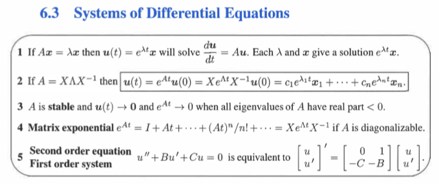
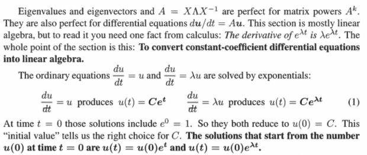
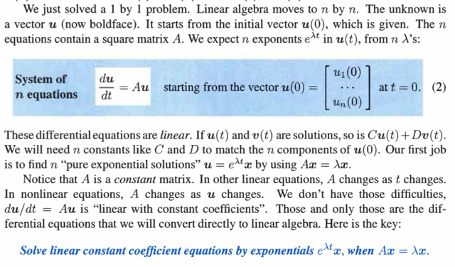
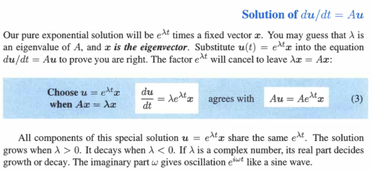
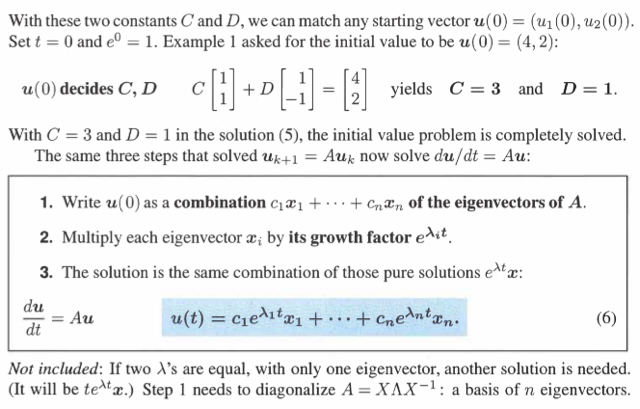
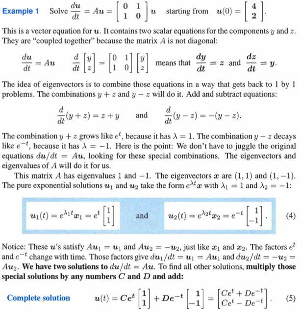

# 6.3 System Of Differential Equations

📊 **Progress:** `5` Notes | `7` Screenshots

---

<kbd></kbd>

 

<kbd></kbd>

> [!NOTE]
> Đại khái là phần này giúp ta hiểu rõ hơn trong bài giảng.
> Vấn đề mà ta muốn giải quyết đó là dùng đại số tuyến tính
> để giải bài toán **HỆ PHƯƠNG TRÌNH VI PHÂN**.
>
> Thế thì đầu tiên gs nói về PHƯƠNG TRÌNH VI PHÂN mà
> ông gọi là " ordinary equation" du/dt = u và du/dt = λ*u Gs
> cho rằng có thể giải nghiệm của chúng bằng cách
> exponential:
>
> du/dt = u <=> du/u = dt.
>
> Tích phân hai vế (có thể sau 1801 quay lại nói rõ hơn cơ sở
> nào để làm vậy) ta có:
>
> ∫(1/u)du = ∫dt <=> ln|u| + C1 = t + C2 (C1, C2 là constant)
>
> Gọi C3 = C2 - C1 ta có: ln|u| = t + C3 (1)
>
> Ở trên sở dĩ tích phân của ∫(1/u)du = ln|u| là bởi:
>
> Nếu u > 0, ln|u| = ln(u), khi đó ln'(u) = 1/u
>
> Nếu u < 0, ln|u| = ln(-u), khi đó d ln(-u) / du  = d ln(-u) / d (-u)
> * d(-u) / du = (1/-u) * -1 = 1/u
>
> Vậy (d/du) ln|u| = 1/u => ∫(1/u)du = ln|u|
>
> Quay lại (1), exponential hai vế ta có: e^ln|u| = e^(t+C3)
>
> <=> |u| = e^t*e^C3
>
> => Đặt C = +/- C3, ta có u = (+/-) C3*e^t <=> **u = C*e^t hay
> u(t) = C*e^t**Hoàn toàn tương tự, ta cũng dễ dàng hiểu **du/dt = λu =>
> u(t) = C*e^λt** ====
>
> Vậy làm sao để biết C là gì, thì ta sẽ dựa vào u(0), tức khi t
> = 0, để có: C*e^(λ*0) = u(0) <=> C*e^0 = u(0) <=> **C = u(0)
> từ đó ta đã giải được du/dt = u hoặc du/dt = λt**

> [!NOTE]
> 18.01 Quay lại đây

 

<kbd></kbd>

> [!NOTE]
> Sau đó ta mới extend bài toán giải phương trình vi
> phân thành giải hệ phương trình vi phân.
>
> Tức là bây giờ không chỉ có du/dt = u hay du/dt = λu
> mà sẽ là ví dụ như
>
> du1/dt = -u1 + 2u2;
>
> du2/dt = u1 - 2u2
>
> Thế thì khi đó, cái cần tìm đương nhiên là u1, u2, hay
> vector **u**(t) = [u1(t), u2(t)]T và hệ hai phương trình
> trên có thể được thể hiện ở dạng matrix: du/dt = Au với
> matrix A là [-1 2; 1 -2]. Lí do là vì theo row-viewpoint khi
> nhân A và vector u, thì component 1 sẽ là dot product
> của A's row1 và vector u: -1*u1 + 2*u2, dễ thấy chính là
> du1/dt. Và component 2 sẽ là dot product của A's row 2
> và u: 1*u1 -2*u2.
>
> =====
>
> Thế thì tiếp theo, nếu **u** và **v** là solution tức là
> d**w**/dt = A**w** (1) và d**v**/dt = A**v** (2), thì nhân
> hai vế của (1) cho C và của (2) cho D sau đó cộng vế
> theo vế ta có
>
> C*dw/dt + D*dv/dt = C*Aw + D*Av <=> d(Cw)/dt +
> d(Dv)/dt = A(Cw + Dv)
>
> <=> d(Cw+Dv)/dt = A(Cw+Dv).
>
> Điều này cho thấy Cw + Dv cũng là solution của du/dt =
> Au.

> [!NOTE]
> Vậy hiểu vầy, với phương trình vi phân, như**du/dt = λu** ta giải ra **u = e^λt**, nên khi
> **mở rộng ra hệ phương trình vi phân du/dt = Au** mình **đoán nghiệm cũng có dạng
> e^(gì đó)*t**, với "gì đó" là thứ không biết, gọi tạm là **λ**, để có **e^λt**. λ ở đây chỉ đang
> ám chỉ đến một constant nào đó.
>
> Thế rồi nếu chỉ có e^λt không thì **nó chỉ là scalar (vì t là scalar)**, trong khi đó đối với
> du/dt = Au, ta cần solution **là vector** Do đó, **cho nó nhân với vector x**, (x cũng chưa
> biết, chỉ biết là vector có n phần tử), từ đó ta **cho rằng nghiệm của du/dt = Au** sẽ có
> dạng là u(t) = (**e^λt)x.**
>
> Thế rồi, **thế vào phương trình du/dt = Au** thì mới thấy rằng**nó trở thành Ax = λx.**
> Nhờ vậy mình mới **nhận định rằng**, à, thế thì **miễn là x, λ thỏa mãn Ax = λx** thì **x,
> và λ sẽ tạo ra một u(t) = (e^λt)x thỏa phương trình du/dt = Au.**
>
> Từ đó mở ra cách tìm nghiệm của du/dt = Au chỉ việc **tìm x, λ thỏa Ax = λx** là được. Mà
> đó**đương nhiên cho thấy x, và λ cần tìm chính là eigenvalue và eigenvector của A**.
>
> Bên cạnh đó, **vì lý thuyết của ODA**, nói rằng, **vì u là vector trong không gian n**
> **chiều**, nên **không gian nghiệm sẽ có n vector độc lập**, giống như R^n cần n vector
> trong basis vậy, nên **ta cho rằng sẽ có n bộ (λ, x**) và điều này **nếu ta có A là matrix có
> đủ n eigenvector độc lậ**p thì **hoàn toàn khớp** rằng **mỗi cặp eigenvector / eigenvalue
> sẽ ứng với một basis vector của solution space.**
>
> Và điều này cũng có nghĩa là ta kì vọng sẽ tìm được n nghiệm **u_i(t) = (e^λ_i*t)*x_i** (i=1,
> 2..n) để tạo nghiệm tổng quát (general solution):
>
> **u(t) = ∑ i=1,2..n ki*ui = ∑ i ki*(e^λ_i*t)x_i**
>
> Đây là ý của gs khi nói ông **kì vọng có n exponent e^λt trong u(t), ứng với n**λ_i mà
> trong tình huống thuận lợi, ta sẽ có n eigenvalues của A.
>
> Và tại sao lại nói nghiệm tổng quát có dạng linear combination của các un thì bởi ta **có
> thể thấy linear combination của tụi nó** tức là **k1u1 + k2u2 + ...knun** **cũng là solution**
> luôn.
>
> (cái này thì có thể dễ chứng minh:
>
> d(k1u1 + k2u2 + knun)/dt = d(k1u1)/dt + d(k2u2)/dt  + ...d(knun)/dt
>
> = k1*du1/dt + k2*du2/dt + ...kn*dun/dt
>
> = k1Au1 + k2Au2 + ...knAun
>
> = A(k1u1 + k2u2 + ..knun), đến đây giúp chứng minh k1u1 + k2u2 + ...knun cũng là
> solution của du/dt = Au).
>
> Nên từ đó **kết luận nghiệm tổng quát** (hay toàn bộ nghiệm) sẽ là **k1u1 + k2u2 + ...
> knun**
>
> Nếu có điều kiện ban đầu rằng **u(0) = [a1, a2, ...an]** thì mình sẽ **giải ra bộ k1, k2 ..kn.**

 

<kbd></kbd>

> [!NOTE]
> Tới đây thì dễ hiểu rồi, như đã phân tích, việc đoán (e^λt)x
> là solution của du/dt = Au cho thấy rằng λ, x chính là
> eigenvalue và eigenvector của A
>
> Hoặc, có thể lập luận ngược lại một chút, rằng giả sử x, và
> lambda là eigenvector và eigenvalue của A thì thế (e^λt)x
> vào phương trình du/dt = Au xem thử thì thấy nó đúng là
> một solution. Mỗi eigenvalue, eigenvector sẽ tạo một "
> specific" hay special solution, và như đã nói linear
> combination của chúng sẽ tạo general solution.
>
> Ý cuối khi nói mọi components của special solution đều
> share chung lambda thì đương nhiên rồi vì (e^λt) là scalar,
> khi nhân với x là vector có n component, thì các component
> đều nhân với e^λt
>
> Để rồi khi λ dương thì e^λt sẽ lớn dần khiến các component
> của (e^λt)x cũng lớn dần tạo ra trạng thái Blow-up
>
> Còn khi λ âm thì e^λt sẽ nhỏ dần về 0 do tính chất hàm e^x
> sẽ -> 0 khi x -> -infinity như đã nói, từ đó khiến các
> component của (e^λt)x cũng sẽ nhỏ dần về 0 tạo ra trạng
> thái Stability
>
> Và như đã biết trong bài, vì eigenvalue có thể mang giá trị
> phức nên trạng thái Stability này cũng xảy ra nếu phần thực
> của complex eigenvalue có giá trị âm
>
> Cuối cùng là để có trạng thái Steady, tức u(t) converge về
> giá trị cố định, thì ta cần ít nhất một eigenvalue bằng 0, còn
> lại thì âm.Nói chung phần này trong bài giảng đả hiểu rồi

 

<kbd></kbd>

<kbd></kbd>

<kbd></kbd>

 

