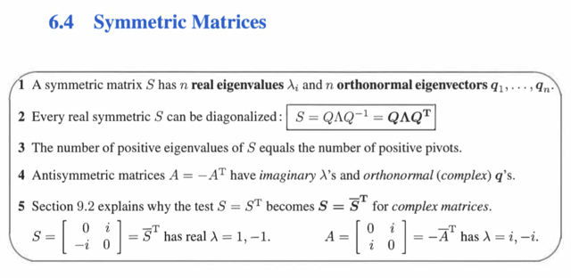
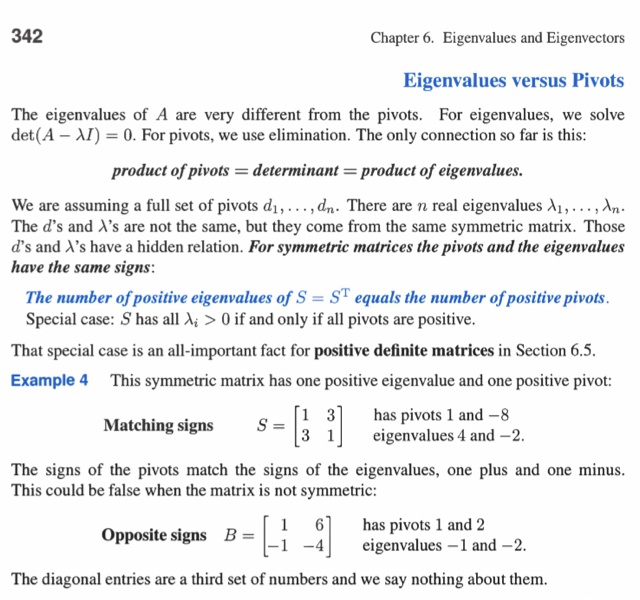
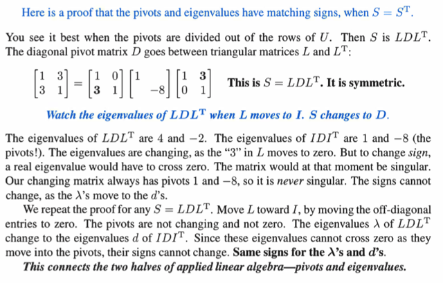
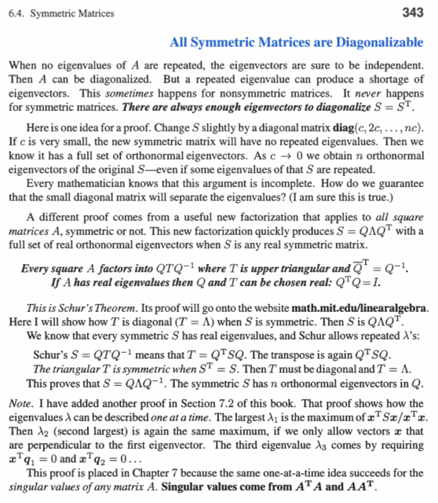

# 6.4 Symmetric Matrices

📊 **Progress:** `4` Notes | `4` Screenshots

---

<kbd></kbd>

 

<kbd></kbd>

> [!NOTE]
> Một phần đáng chú ý trong sách là gs chứng minh số
> positive eigenvalues của symmetric matrix sẽ bằng số
> positive pivots

 

<kbd></kbd>

> [!NOTE]
> Hiểu đại khái như sau:
>
> Giả sử A invertible tức det A khác 0, ta sẽ chứng minh eigenvalues của nó đồng dấu với
> pivots của U
>
> Bước 1: Đại khái là, ta sẽ cho phân tách A thành LU(LT), đây là phép phân tách biểu
> diễn quá trình elimination biến A thành U: EA = U
>
> Chỉ khác là, ta có thể tiếp tục khử các phần tử ngoài đường chéo nhưng ở phía trên để
> đưa U về D (diagonal matrix chỉ còn các pivot, chưa phải là R - reduced row echelon
> form vì ở R ta còn phải biến các pivot thành 1). Và vì A symmetric nên việc khử các
> phần tử này sẽ dùng chính matrix E, nhưng thể hiện bởi U(ET) = D
>
> EA = U <=> A = LU (L=Einv, matrix giúp đảo ngược elimination biến U trở lại A)
>
> U(ET) = D <=> U = D(LT)
>
> Và cả quá trình sẽ thể hiện bởi EA(ET) = D; A = LD(LT)
>
> Bước 2: Đại khái là, cho A là một kết quả cụ thể của f(t) = L(t)D[(L(t))T] tức là, với các
> phần tử ngoài đường chéo khác nhau, ta sẽ có thể xây dựng matrix A = f(t) khác nhau.
>
> Và ta sẽ cho L(t) tiến dần về I, có nghĩa là cho các phần tử ngoài đường chéo của nó
> tiến dần về 0. Khi đó, dĩ nhiên f(t) sẽ dần trở thành ID(IT) = D và đương nhiên
> eigenvalues của A = f(t) cũng sẽ có eigenvalues thay đổi dần về eigenvalues của D.
>
> Mà, điểm mấu chốt là, trong quá trình L(t) -> I thì A(t) = L(t)D[(L(t))T] nên det của chúng
> bằng nhau. Mà det của L(t)D[(L(t))T] thì không phụ thuộc L(t), mà chỉ phụ thuộc D, và vì
> các components của D khác 0 (*) nên suy ra trong quá trình biến đổi, det(A) phải luôn
> bằng det (D) và khác 0.
>
> Vậy các eigenvalues của A khi biến dần về eigenvalues của D (khi L(t) -> I) thì nó không
> được đổi dấu, vì nếu đổi dấu, đồng nghĩa tồn  tại một thời điểm nào đó nó băng qua 0,
> khiến det A = 0.
>
> Vậy, khi L(t) -> I, eigenvalues sẽ -> eigenvalues của D, và do với D, các eigenvalues
> chính là pivot, do đó tổng hợp 2 ý:
>
> 1) dấu của eigenvalues của A không đổi khi A -> D
>
> 2) eigenvalues của A dần trở thành eigenvalues của D, và chính là pivot của D
>
> Nên từ (1) và (2) kết luận DẤU CỦA EIGENVALUES CỦA A CHÍNH LÀ BẰNG DẤU CỦA
> PIVOTS CỦA D
>
> (*) Nếu A singular, ta sẽ cần mở rộng chứng minh để xét trường hợp này.

> [!NOTE]
> CHỨNG MINH VỚI SYMMETRIC MATRIX, SỐ
> POSITIVE E.VALUES = SỐ POSITIVE PIVOT

 

<kbd></kbd>

> [!NOTE]
> CHỨNG MINH SYMMETRIC LUÔN CÓ ĐỦ
> EIGENVECTOR ĐỘC LẬP: CHƯA HIỂU

 

