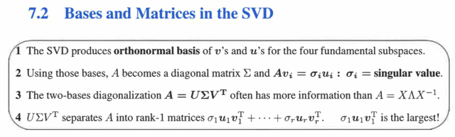
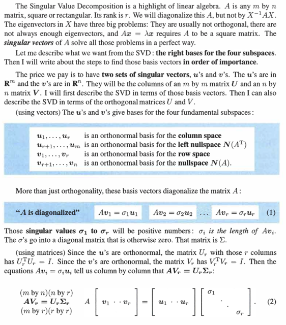
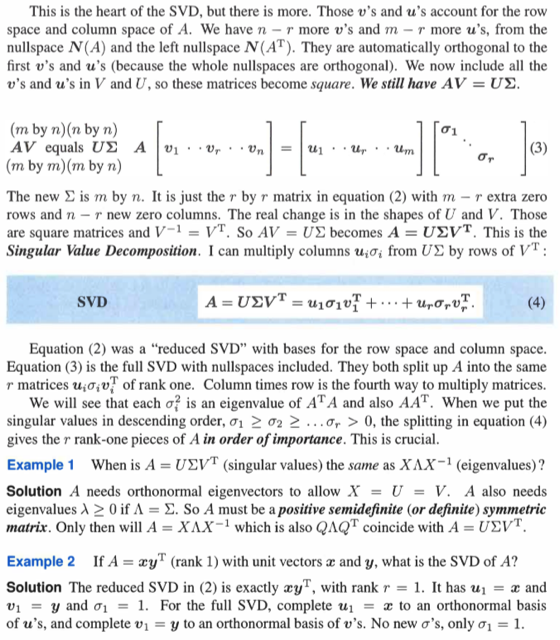
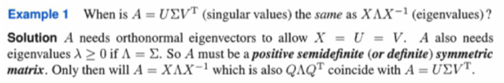
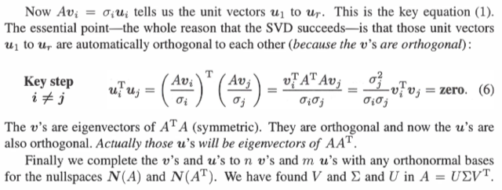
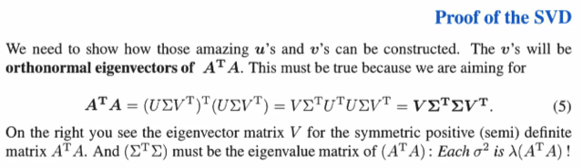

# 7.2 Basis And Matrices In Svd

📊 **Progress:** `3` Notes | `7` Screenshots

---

<kbd></kbd>

 

<kbd></kbd>

> [!NOTE]
> Có thể tóm tắt đại ý (mà điều này gs nói trong bài giảng) là ta
> bắt đầu với lập luận rằng muốn tìm hai set basis vectors {v1,.
> ..vr} của rowspace và columns space {u1,...ur} Và connect
> chúng với nhau: Avi = σiui với σi là stretching factors. (ta đã
> biết dim C(A) = dim C(AT) = rank r)
>
> Từ đó đặt chúng làm các cột của Vr và Ur thì ta có:
>
> AVr = UrΣ (Σ là diagonal matrix chứa các stretching factors)
>
> hai matrix ở hai vế sẽ có có các cột là Av1 và u1σ1,  Av2 và
> u2σ2...
>
> Nhưng bên cạnh đó, ta còn muốn ORTHOGONAL BASIS
>
> Tức v1,..vr là orthogonal basis của rowspace và u1..ur là
> orthogonal basis của columns space

 

<kbd></kbd>

> [!NOTE]
> Ngoài ta ta còn chuẩn bị luôn vr+1...vn là orthogonal basis của
> nullspace và ur+1...um là orthogonal basis của left nullspace.
>
> Để rồi khi tạo matrix U chứa các basis của C(A) và N(AT), matrix V
> chứa các basis của C(AT) và N(A) thì ta có AV = UΣ
>
> *Tại các basis của N(AT) cũng orthogonal với các basis của C(A) và
> ngược lại: Thì bởi hai subspace này **orthogonal complement. Nên
> gs viết trong sách là chúng TỰ ĐỘNG vuông góc nhau.**Tương tự
> với vr+1...vn (basis của nullspace N(A)) cũng tự động vuông góc
> với v1...vr (basis của rowspace**)**
>
> Thế thì chú ý là **Vr không phải orthogonal matrix**, vì chúng c**hỉ
> có r vector** Rn r<n (tuy các cột là orthonormal nhưng không Vr
> square nên không phải orthogonal matrix) nhưng bây giờ V là
> orthogonal matrix.
>
> Và vì orthogonal nên VTV = I, cũng là Vinv = V (dĩ nhiên với n ortho
> gonal columns, tức độc lập thì V full-rank)
>
> Điều này cũng xảy ra với U.
>
> Từ đó, bắt đầu với AV = UΣ (nói thêm Σ có thêm các hàng và các
> cột zero) thì nhân hai vế cho VT ta có **A = UΣVT
>
> Đây chính là SVD, mà bản chất nói đây là decomposition là vì
> UΣVT, có thể viết thành tổng các rank1 matrix Σi uiσiviT do đó cũng
> chính là có thể tách A thành tổng các rank 1 matrix
>
> Và gs cho rằng, điều này thể hiện ý quan trọng rằng: ta có thể tách
> A thành tổng của các rank 1 matrix trong đó chúng SẮP XẾP THEO
> ĐỘ LỚN CỦA σ, thể hiện mức quan trọng trong đóng góp của mỗi
> rank 1 matrix vào A ban đầu**

 

<kbd></kbd>

> [!NOTE]
> Đáng chú ý ở Example 1: Gs đặt vấn đề, khi A như thế nào thì
> Diagonalization sẽ chính là SVD Decomposition. Ta sẽ lập luận rằng, với
> SVD ta muốn có A = UΣVT trong đó U, V là matrix chứa các columns là
> các orthogonal basis của Rm và Rn.
>
> Trong khi diagonalization sẽ tách A = SΛSinv với S là matrix các cột là các
> eigenvectors.
>
> Vậy thì S phải = U, = VT. Điều này xảy ra nếu dĩ nhiên m = n, tức A vuông.
> Thêm nữa các eigenvectors phải vuông góc (vì các cột của U, V vuông
> góc) và như vậy thì SΛSinv trở thành QΛQT (vì với các cột vuông góc thì
> Sinv = ST, ta dùng Q để thay cho S)
>
> Và lúc này A sẽ symmetric. Vì AT = (QΛQT)T = QΛQT = A
>
> Bên cạnh đó, các singular value thì không âm, vậy đặt ra yêu cầu nữa là
> eigenvalues không âm. Mà một matrix đối xứng có eigenvalues không âm
> thì nhất định là POSITIVE SEMI DEFINITE

 

<kbd></kbd>

<kbd></kbd>

<kbd></kbd>

 

