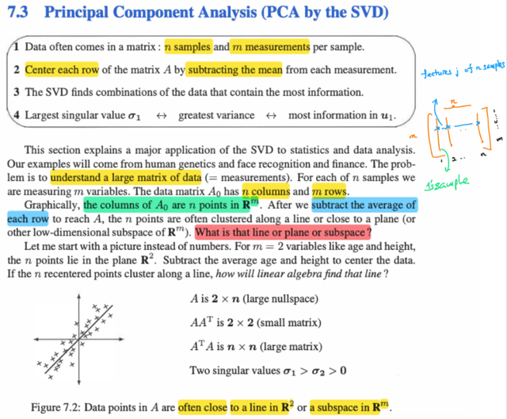
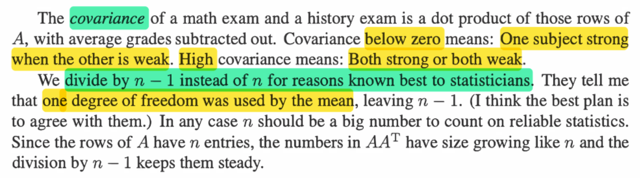
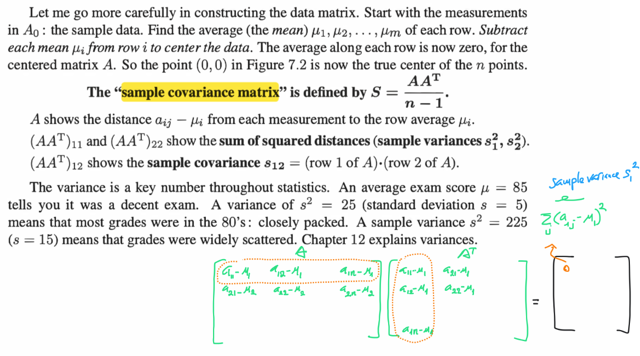
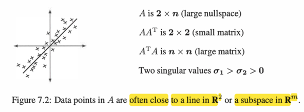
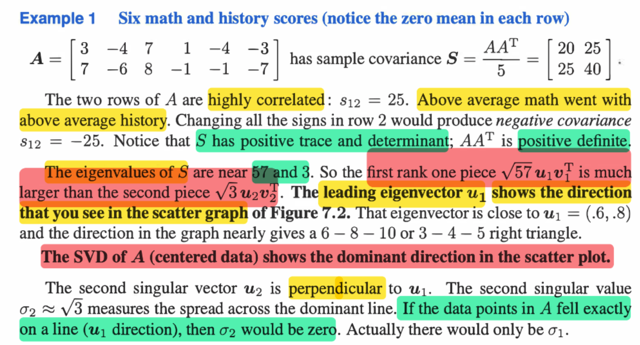
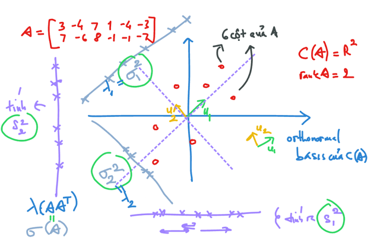
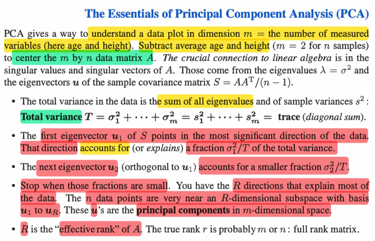

# 7.3 Pca By Svd

📊 **Progress:** `8` Notes | `10` Screenshots

---

<kbd></kbd>

> [!NOTE]
> đại khái là gs nói rằng một trong những ứng dụng lớn của SVD
> chính là trong statistic và data analysis.
>
> Trong đó thông thường ta sẽ có một dataset, thể hiện dưới dạng
> một matrix lớn, có n cột, mỗi cột là vector chứa m attribute /
> feature của một sample. Nên matrix A có m hàng, n cột mà cột
> thứ i là vector chứa features của sample thứ i. Còn xét một hàng,
> ví dụ hàng thứ j, nó sẽ chứ n giá trị của feature thứ j (có m
> feature)
>
> Lấy ví dụ như một dataset về bất động sản chẳng hạn, thì cột
> thứ 5 sẽ là vector chứa đặc điểm của căn nhà thứ 5 trong
> dataset. Nó có ví dụ m = 10 đặc điểm như [bề dài, bề rộng, số
> tầng...] Còn xét hàng thứ 2, thì nó sẽ chứ n giá trị bề rộng của tất
> cả n ngôi nhà trong  dataset
>
> Vậy thì việc ở đây giáo sư nói rằng ta sẽ trừ mean của mỗi hàng,
> không có gì xa lạ, nó cũng giống như khi ta standardize data
> trong machine learning (trong các class machine learning, mình
> thường thấy data matrix X được thể hiện theo kiểu mỗi hàng là
> một sample và mỗi cột là một feature. Nên ta sẽ - mean của mỗi
> cột và chia cho standard deviation của mỗi cột. Thì ở đây là trừ
> mean của mỗi hàng.
>
> Nói thêm về vụ standardizing này. Nhờ Stat110, mình biết rằng,
> với random variable X có mean μ, variance σ^2, thì Z = (X - μ) / σ
> sẽ là random variable có mean = 0, variance = 1
>
> Chứng minh rất dễ thôi:  EZ = E[(X - μ) / σ] = (1/σ) (EX - Eμ)
>
> = (1/σ)(μ - μ) = 0 (dùng linearity)
>
> VarZ = Var[(X - μ) / σ] = Var(X) / σ^2 = σ^2 / σ^2 = 1 (dùng tính
> chất của variance: Var(X + c) = Var(X), Var(Xc) = c^2Var(X)
>
> Thế thì một vector chứa các feature, (như một hàng ở đây) giống
> như một vector chứa các observed data của một random
> sample. Với mean của vector chính là sample mean, bằng cách
> trừ sample mean, ta đưa random sample về zero mean.
>
> Nói chung sẽ cần đợi đến khi finish cuốn Statistical Inference mới
> hiểu rõ hơn
>
> ====
>
> Quay lại đây, gs nói rằng NẾU CÓ THỂ VẼ RA, ta sẽ thấy n data
> point này (mỗi cột của matrix, là một vector trong R^m) sẽ tập
> trung quanh một subspace có dimension thấp hơn R^m) Ví dụ
> như m = 2, thì khi vẽ tụi nó trong không gian 2D có thể tụi nó
> sẽ cluster quanh một line (subspace 1D của R^2)
>
> CÂU HỎI LÀ LÀM SAO TÌM ĐƯỢC CÁI SUBSPACE NÀY

 

<kbd></kbd>

<kbd></kbd>

<kbd></kbd>

> [!NOTE]
> Đầu tiên xem AT là matrix gì: Nó là các cột của A chuyển
> thành  các hàng. Các cột của A là các "sample" vector, còn
> hàng i của A là feature i vector. AAT thì component AAT_ii sẽ
> là dot product của hàng A_i và cột AT_i ⇨ chính là feature
> vector thứ i dot product với chính nó:
>
> [feature i]T[feature i] = ||[feature i]||^2
>
> = Σj=1:n feature i_j^2
>
> Tức là nó sẽ là tổng bình phương của các feature i của mọi
> data sample
>
> Dĩ nhiên đây là giá trị đã standardized, tức là
>
> Nên đây chính là Σj=1:n [x(j)_i - μ_i]^2
>
> trong đó x(j))i là sample vector của sample j, lấy phần tử thứ
> i, tức feature thứ i
>
> còn μ_i là sample mean của feature vector i, tức là mean của
> hàng i.
>
> cho j=1:n tức là loop qua các phần tử thứ i của các cột trong
> matrix A, tức là lần lượt với từng sample vector (cột của A) ta
> lấy giá trị của feature i ra
>
> thế thì đã học trong các lớp về statistic, khi ta có các  random
> sample X1, X2...Xn. Thì Σi (Xi - μ)^2 / n với μ là sample
> mean, chính là bias formula sample variance
>
> Nên AAT_ii = Σj=1:n [x(j)_i - μ_i]^2 sẽ chính là si^2, sample
> variance của feature thứ i
>
> Còn AAT_ii' sẽ là hàng i của A dot product với hàng i' của  AT
> ⇨ [feature vector i] T [feature vector i']
>
> = Σj=1:n [x(j)_i - μ_i][x(j)_i' - μ_i']
>
> đây là sample covariance của feature thứ i và feature thứ i'
> công thức của covariance: Cov(X,Y) = E[(X - EX)(Y - EY)]
>
> ⇨ sample covariance: Σ (Xi - μX)(Yi - μY)
>
> (lưu ý công thức đầy đủ sẽ có chia thêm n-1, nên ta sẽ chia
> AAT cho n-1. Vì sao là n-1 thay vì n (số sample) gs Strang nói
> vui là cứ nghe theo mấy ông statistician, rằng 1 bậc tự do đã
> bị mất khi ta tính sample mean. Qua lớp thầy Ấn độ thì mình
> cũng đã biết lí do là để có unbias estimator, trong STAT111
> Casella nhất định sẽ hiểu rõ hơn

> [!NOTE]
> Đó là hiểu tại sao gs nói (AAT)11 và (AAT)22 là sample
> variances s1^2, s2^2
>
> và (AAT)12 cho biết sample covariance s12
>
> Đoạn tiếp theo gs nói về tầm quan trọng của variance
> trong statistic thì rõ rồi. Với mean μ = 85 mà variance nhỏ
> tức là điểm số của các sinh viên ko bị phân tán nhiều, đều
> quanh mức 80-90 (closed pack) Ngược lại thì sẽ phân tán
> nhiều (scattered)
>
> Còn covariance, nó sẽ cho thấy sự tương quan giữa 2
> feature theo STAT111 đã học về ý nghĩa của covariance
> Cov(X,Y) với công thức Cov(X,Y) = E[(X - EX)(Y - EY)] thì
> nếu nó mang giá trị dương thì có nghĩa là X, Y có xu
> hướng cùng lớn (lớn hơn mean)  hoặc cùng bé (bé hơn
> mean) và ngược lại nếu nó có dấu âm thì X,Y sẽ có xư
> hướng ngược nhau một thằng lớn một thằng sẽ bé Đó là
> về Covariance, dấu của nó cho ta biết như vậy. Nhưng độ
> lớn của nó thì tùy ý, ko ý nghĩa lắm, nên mới có thêm cái
> gọi là Correlation Cor(X,Y) = Cov(X,Y) / σXσY luôn có giá
> trị trong khoảng [-1,1] để nếu ≈ +- 1 tức X,Y tương quan
> rất mạnh, và cụ thể hơn là tương quan tuýến tính, theo
> cách nói của gs Casella thì là nếu có thể plot được thì  sẽ
> có thể thấy giá trị của X,Y tụ lại trên một đường thằng /
> plane
>
> Còn khi không thấy có xu hướng tụ lại mặt phẳng, đường
> thẳng này, thì đó là biểu hiển của Cor(X,Y) ≈ 0

 

<kbd></kbd>

<kbd></kbd>

<kbd></kbd>

> [!NOTE]
> Rất nhiều điều hay trong cái ví dụ này. gs cho matrix A mxn = 2x6 như
> này, và tính giùm ta sample covariance matrix AAT/5 (n-1 = 6-1 = 5)
>
> Đầu tiên có thể nhận xét S đối xứng (symmetric), không lạ gì vì S12 =
> S21 do là kết qủa đều là dot product của hàng 1 và hàng 2 của A. S12
> ra cao, gs nhận định rằng điều này cho thấy điểm số môn toán, và lịch
> sử (A là  kết quả thi hai môn Toán Sử của 6 sinh viên) tương quan
> nhau
>
> S có trace dương và det dương. Rõ ràng, tổng đường chéo (trace) =
> 20 + 40 = 60 > 0, det thì = 20*40 - 25*25 =175 > 0 nên từ đó suy ra hai
> eigenvalues đều dương (vì trace và  det là tổng và tích hai
> eigenvalues). Từ đó theo những cách để xác định tính positive definite
> thì có thể kết luận S positive definite. (Các cách khác là quadratic form,
> hay check các det của các submatric, ở đây 20 > 0 và det > 0 cũng
> giúp kết luận S ≻ 0)
>
> Không khó để tìm eigenvalue, đã có tổng λ1 + λ2 = 60, tích λ1λ2 = 175
> ⇨ λ1 = ?. giải bằng định lý Viet ta sẽ có λ1 (của S)= **57** λ2 (của S) =
> **3**
>
> Với hai giá trị đó thì theo giáo sư ma trận rank 1 √57 u1v1T lớn hơn
> nhiều ma trận rank 1 √3u2v2T.
>
> Là sao nhỉ?
>
> Ta biết SVD của A thể hiện bởi AVr = Ur Σr có bản chất là tìm hai bộ
> orthogonal basis của rowspace và columns space map với nhau bởi A
>
> Thì nhân hai vế cho VrT ta có A = Ur Σr VrT
>
> (vì VrTVr = Ir do các cột của Vr là orthonormal basis của rowspace
>
> lúc này sẽ thể hiện rằng A sẽ được tách thành tổng các rank 1 matrix:
>
> = u1 σ1 v1T + u2 σ2 v2T
>
> = σ1u1v1T + σ2u2v2T
>
> Tiếp để xem σ1 σ2 là gì ta sẽ làm như sau
>
> ⇨ AAT = (Ur Σr VrT)(Ur Σr VrT)T = Ur Σr VrT Vr ΣrT UrT
>
> = Ur (ΣrΣrT) UrT
>
> Như vậy viết lại AAT = Ur (ΣrΣrT) UrT, đây là dạng A = Q Λ QT, tức
> diagonalization, tức là eigendecomposition của một symmetric matrix.
>
> Từ đó kết luận eigenvalue của AAT λ(AAT) chính là bình phương
> singular value của A σ^2: λ(AAT)_i = σ(A)_i^2
>
> Và eigenvector của AAT chính là left singular vector của A (cột của U)
> (1)
>
> Ta đã có hai eigenvector của S = AAT/5 là ≈ 57, và 3 Và thầy Strang
> gọi u1,u2 là eigenvector, dĩ nhiên là của S (A làm gì có eigenvector)
>
> (ở đây gs tạm bỏ qua việc thật ra S= AAT/5, nên ông lấy luôn 57 và 3 là
> eigenvalue của AAT, dẫn đến √57 và √3 là singular value σ1, 2 của A ta
> tạm chấp nhận vậy)
>
> Như trên (1) mới nói xong, u1, u2 là left singular của A, tức các cột của
> U cũng là basis của column space. Và v1, v2 là các cột của V, là right
> singular vector, cũng là basis của  rowspace
>
> Với σ1 là singular value của A, như lập luận trên ta biết nó là căn bậc
> hai của eigenvalue của AAT ⇨ σ1 = √57. Tương tự σ2 = √3
>
> Do đó giải thích được tại sao gs ghi là first rank one piece là √57u1v1T
> và second rank one piece là √3u2v2T
>
> ====
>
> Sẵn tiện nói luôn một ý khá thú vị: nếu A (ko phải ATA, hay AAT)
> symmetric thì khi đó A có diagonalization A = Q Λ QT, do đó khi svd =
> Ur Σr VrT ta sẽ thấy hai cái này chính là 1, tức Q cũng là Ur, và QT
> chính là Vr Tuy nhiên vì eigenvalue có thể âm, còn singular value phải
> dương nên quan hệ chính xác giữa Λ và SIGMAr là Σr = | Λ |
>
> Nên nếu A positive definite khiến mọi eigenvalue đều > 0 ⇨  Σr = Λ
> khi đó diagonalization cũng chính là svd

 

<kbd></kbd>

<kbd></kbd>

<kbd></kbd>

> [!NOTE]
> Trong screenshot này là những điểm cốt lõi của PCA Đầu tiên, gs
> nhắc đến khái niệm PHƯƠNG SAI TOÀN PHẦN, total variances, ta
> hiểu variance ở đây là SAMPLE variance Như trong những note
> trước đã biết, đường chéo S_ii (S = AAT/(m-1) chính là sample
> variance của feature i, nên tổng đường chéo (của là trace) của S
> sẽ là tổng sample variance, tạm dịch là phương sai toàn phần, hay
> **toàn bộ variance** của dataset
>
> T = s1^2 + ...sm^2   (m features, có m sample variances)
>
> mà tổng đường chéo của S, là trace, cũng là tổng eigenvalues λi
> của S, mà như nãy đã nói, λ(AAT) = σ(A)^2 (eigenvalues của AAT
> chính là singular value của A bình phương)
>
> ⇨ T = s1^2 + ...sm^2 = σ1^2 + σ2^2 + ..σm^2
>
> Nhưng s1^2 không bằng σ1^2 nhé, chỉ là tổng của chúng bằng
> nhau.
>
> ví dụ trong matrix A 2x6 s1^2 là sample variance của feature 1
> (điểm toán) và s2^2 là sample variance của feature 2 (điểm sử).
> Vậy thì có thể hiểu nếu vẽ trong hệ trục x1x2 với x1 thể hiện điểm
> toán, x2 thể hiện điểm sử thì:
>
> s1^2 chính là độ phân tán theo trục x1, và s2^2 thể hiện độ phân
> tán theo trục x2.
>
> Và tổng hai giá trị này là Total Variance = T
>
> Và trực giác cho thấy tổng phương sai là không đổi, có nghĩa là khi
> ta xoay trục x1, x2 thì phương sai mỗi trục sẽ thay đổi nhưng tổng
> thì không. Để khi x1 trùng u1 thì phương sai theo x1 sẽ đạt max, và
> phương sai theo x2 đạt min.
>
> Linear algebra có thể giúp chứng minh điều này
>
> Thế thì, như vậy ý trên trùng với ý của gs Strang khi ông  cho biết
> eigenvector u1 sẽ chỉ về phương có nhiều ý nghĩa  nhất của data
>
> Mình hiẻu: Nó sẽ chỉ về phương có phương sai lớn nếu ta xét
> variance trên trục đó (giống như chiếu data lên trục đó)
>
> và nó sẽ đóng góp một khoảng = σ1^2/T vào total variance T
> (again, không phải là s1^2/T nhé, vì s1^2/T là variance trên trục x1
> ban đầu)
>
> Tiếp theo, cái u2 sẽ có phương có sample variance lớn thứ hai (khi
> chiếu data lên trục này). Và nó sẽ giải thích cho một  phần đóng
> góp trong T có độ lớn = σ2^2/T
>
> Gs nói ta sẽ dừng khi phần đóng góp này nhỏ, ý là, ám chỉ đến việc
> ta sẽ chỉ xét nhưng vector u - principal component mà mức đóng
> góp σ^2/T còn đáng kể, nếu nhỏ quá thì bỏ qua
>
> Để rồi ta sẽ lấy R cái (u1, ...uR) có đóng góp σ1^2/T... σR^2/T trong
> tổng số các vector u.
>
> Có bao nhiêu vector u, hay, có bao nhiêu σ:
>
> Dễ thấy đó là m, ứng với m features.
>
> Cũng có thể trả lời theo cách khác: Trong A = Ur Σr Vr, các cột của
> Ur là orthonormal basis của C(A), vậy số lượng của nó chính là số
> cột độc lập, cũng là số hàng độc lập của A, cũng là rank của A.
>
> Vậy thì đây (A) là bộ dataset, có m hàng, n cột. Mỗi cột là một data
> sample vector, mỗi hàng (ví dụ i) là một feature vector chứa feature
> thứ i của n sample. Thế thì nếu m < n thì rank nhiều nhất là m (khi
> m hàng đều độc lập) Ví dụ như ở ví dụ trên khi A có shape 2x6 (có
> 2 feature: toán, sử) và 6 samples là 6 student , ta có thể expect
> rank A nhiều nhất chỉ là m = 2.
>
> Điều này đồng nghĩa tuy column có tới 6, nhưng nhiều nhất chỉ có
> 2 column độc lập, nên Ur chỉ có 2 cột, A chỉ có 2 left singular vector.
> AAT chỉ có 2 eigenvector.
>
> (Việc có 6 cột nhưng chắc chắc chỉ có không quá 2 cột độc lập quả
> thât khó tin, nhưng đó là sự thật, kể cả có 1 tỷ cột thì cũng vậy)
>
> Vậy ở đây, trong ví dụ với matrix A là matrix 2x6 mỗi sample vector,
> tức là mỗi cột của A sẽ là R^2 vector. Để rồi ta có thể vẽ nó trong
> 2D space. Còn u1, u2. Như đã nói sẽ là basis orthogonal của C(A),
> Giả sử rank của A là max, = 2, thì như vậy ta có hai vector u1, u2
> vuông góc, và theo gs, nó sẽ chỉ hai phương ứng với hai hướng có
> variance lớn nhất.
>
> Nhưng nếu như trong ví dụ này mà data point nó có xư hướng hợp
> lại quanh một đường thẳng. Thì sao?
>
> Thì, điều này có nghĩa là, đóng góp của u2 nhỏ, tức σ2^2/T ko
> đáng kể, khi đó ta chỉ "lấy u1". Và lúc này R = 1, gọi là effective
> rank của A.
>
> Dứoi góc nhìn của statistic, nhớ lại xem, σ^2^2/T nhỏ, tức là s2^2/T
> nhỏ chính là sample variance của feature thứ 2 nhỏ và điều này
> cũng sẽ liên quan đến correlation giữa hai feature sẽ gần +/- 1

> [!NOTE]
> Vậy thì, ta có thể chứng minh u1 là phương mà khi data chiếu lên đó
> sẽ giúp ta có sample variance lớn nhất không?
>
> Thật ra rất đơn giản, chỉ cần dựa trên sự thật là σi^2(A) chính là
> λi(AAT), và ui chính là eigenvector của AAT
>
> Do đó chỉ cần chứng minh rằng sample variance theo phương d sẽ
> đạt max khi d trùng eigenvector của AAT
>
> Làm sao để tính sample variance theo phương d?
>
> Mình biết cái vụ project vector b lên a: Lập luận sẽ là:
>
> p = ax. aTe = 0 ⇔ aT(b - ax) = 0 ⇔ aTb = aTax ⇨ x = aTb/aTa ⇨ p =
> aaTb/aTa. Nếu a là unit vector ⇨ p = aaTb, tức là chiếu vector b lên
> unit vector a ta sẽ có aaTb
>
> Vậy nếu chiếu A1 (cột 1 của A) lên d, ta sẽ có ddTA1
>
> tương tự chiếu Ai lên d ta sẽ có ddTAi, dĩ nhiên tọa độ của nó trên
> trục d sẽ là dTAi
>
> Và từ đó ta sẽ tính variance trên trục d, các tọa độ này sẽ vẫn zero
> mean. Vì Σi dTAi = Σi AiTd chính là tính ATd để ra vector mà phần tử
> thứ i là hàng i của AT (cũng là cột i của A, tức Ai), sau đó tính tổng
> các phần tử (dot product với **1**) ⇨ = (ATd)T**1 hoặc 1T(ATd) cũng
> được.**Mà 1TATd có quyền tính 1TAT trước, nhân với d sau
>
> 1TAT sẽ là gì là row vecot [1,1,..1] nhân với matrix AT theo góc nhìn
> nhân row với matrix đã học trong 1806 thì nó sẽ là linear
> combination các row của AT với  coefficient là các component của
> row vector, nen ở đây kết quả sẽ là tổng các hàng của AT, cũng là
> tổng các cột của A. Sẽ tạo một vector mà mỗi phần tử là tổng 1 hàng
> của A. Sẽ là 0, vì A đã được zero mean rồi ⇨ 1TATd = **0T**d = 0
>
> Nên unbias sample variance theo trục d là: [1/(n-1)] Σi (dTAi)^2
>
> = [1/(n-1)] Σi (dTAi)(AiTd)
>
> = [1/(n-1)] Σi dTAiAiTd
>
> = [1/(n-1)] dT (Σi AiAiTd)
>
> = [1/(n-1)] dT (Σi AiAiT) d
>
> Xét Σi AiAiT, đây chính là gì? Chính là tổng tất cả các matrix rank 1
> tạo bởi các cột của A: AiAiT, theo góc nhìn thứ 4 khi  nhân matrix với
> matrix: Nói rằng khi nhân AB thì chính là tổng các rank một matrix
> tạo bởi cột i của A và hàng i của B (Dĩ nhiên shape phải đúng)
>
> Do đó ta biết Σi AiAiT CHÍNH LÀ AAT
>
> Vậy sample variance theo trục d là: [1/(n-1)] dTAATd
>
> = dT [AAT / (n-1)] d
>
> AAT / (n-1) chính là Sample covariance matrix
>
> ⇨dT [AAT / (n-1)] d =  dTSd
>
> ⇨ Sample variance theo phương d (kí hiệu là Var(d)) = dTSd
>
> Nhiệm vụ bây giờ là giải bài toán tối ưu:
>
> maximize d  dTSd subject to dTd = 1

> [!NOTE]
> maximize d  dTSd subject to dTd = 1
>
> Tới đây dùng diagonalization đối với S, là symmetric matrix:
>
> f(d) = dTSd = dTQΛQTd 
>
> với Q là orthogonal matrix, các cột là orthogonal eigenvector
> (dĩ nhiên đến đây ta biết nó cũng chính là các left singular
> vector của A)
>
> Còn Λ, là diagonal matrix có các entries là eigenvalue của S,
> (tương tự, tới đây ta cũng biết nó chính là bình phương singular
> value của A)
>
> Đặt y = QTd, ta có dTQΛQTd = yTΛy 
>
> = Σi yi λi yi = Σi λi yi^2
>
> Gọi λmax là eigenvalue lớn nhất
>
> Dĩ nhiên Σi λi yi^2 ≤ Σi λmax yi^2
>
> ⇔ Σi λi yi^2 ≤ λmax Σi yi^2
>
> ⇔ Σi λi yi^2 ≤ λmax ||y||^2 = λmax yTy = λmax * 1 
>
> Đơn giản vì QT là orthogonal matrix, nên linear transformation QT
> là phép xoay không làm thay đổi norm vector, ⇨ ||y|| = ||QTd|| = ||d|| = 1
> Hoặc có thể thấy theo cách khác ||y||^2 = yTy = (QTd)T(QTd) = dTQQTd
> = dTd = 1 (QQT = I)
>
> Vậy ta có Σi λi yi^2 ≤ λmax Tức là f(d) ≤ λmax
>
> Do đó f(d), tức Var(d) đạt max là bằng λmax. Điều này xảy ra khi các 
> component của y ứng với các λ khác đều = 0, chỉ có có component
> ứng với λmax = 1. (ví dụ như λmax = λ1 thì y = [1, 0, ..0]
>
> Mà y = QTd, component thứ i của y chính là dot product của hàng thứ i
> của Q và d. Nên để component ứng với λmax của = 1 thì d PHẢI TRÙNG
> VỚI HÀNG CỦA QT ỨNG VỚI λmax. Nói cách khác, d phải trùng với
> eigenvector ứng với λmax. (dĩ nhiên khi đó dot product của d với các
> cột khác của Q cũng bằng 0, vì Q là orthogonal matrix)
>
> Có lẽ có cách lập luận khác hay hơn. 
>
> Nhưng ta đã chứng minh xong, Var(d) sẽ LỚN NHẤT KHI d TRÙNG
> EIGENVECTOR ỨNG VỚI λ(S)max CỦA S
>
> CŨNG LÀ SINGULAR VECTOR ỨNG VỚI SINGULAR LỚN NHẤT
> σ(A)max
>
> ====
>
> Ta sẽ có thể cần phải chứng minh là khi d ứng với EIGENVECTOR ỨNG
> VỚI λ(S) lớn thứ nhì, thì Variance của data khi chiếu trên đó cũng lớn
> thứ nhì.

> [!NOTE]
> Rồi tới giờ vẫn chỉ là chứng minh là eigenvector ứng với λmax của sample
> variance matrix S (= singular vector ứng với σmax của A) sẽ là phương mà
> khi chiếu lên đó, sample variance sẽ đặt max. Rồi cái úng với λ "max nhì"
> thì sample variance sẽ max nhì
>
> Vậy thì sao nữa.
>
> Thì đại khái là với m vector singular: u1, u2, ...um, xếp theo σ1, σ2..từ lớn
> đến nhỏ.
>
> Thì ta sẽ PROJECT Ai LÊN SUBSPACE {u1, u2,..ur}
>
> Project Ai lên u1: u1u1TAi
>
> Project Ai lên u2: u2u2TAi
>
> Project Ai lên uR: uRuRTAi
>
> với ui là các basis vector tọa độ của Ai trong hệ trục u1,...uR là:
>
> [u1TAi, u2TAi,...uRTAi]
>
> và chính là = UrTAi
>
> Hay A' = UrTA
>
> Khi đó từ dataset gốc có shape m,n tức feature vector có m feature
>
> Thì A' sẽ có shape R,n 
>
> Với R < m thì ta thu gọn số feature, nhưng giữ lại phần lớn variance

 

