# 7.4 Geometry Of Svd

📊 **Progress:** `24` Notes | `20` Screenshots

---

<kbd>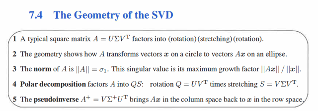</kbd>

 

<kbd>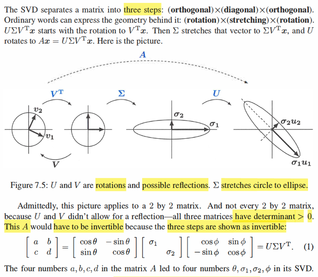</kbd>

> [!NOTE]
> giáo sư nói SVD sẽ phân tách một matrix thành 3 bước mà đại khái
> ta hiểu là nó sẽ cho thấy việc biến đổi bởi matrix A sẽ có bản chất là
> chuỗi 3 biến đổi: rotate bởi VT, kéo giãn bởi Σ và rotate trở lại bởi U
>
> Hiểu thế nào?
>
> Vì sao VTx lại là rotate? Bởi ta nhớ V và U là orthogonal matrix tạo
> bởi orthonormal basis của row space và  column space. Mà với
> orthogonal matrix Q, thì Qx là phép xoay, khi học trong bài về
> orthogonal matrix đã thấy. Nó không làm thay đổi độ dài vector x:
> ||Qx||^2 = (Qx)T(Qx) = xTQTQx = xTx = ||x||^2
>
> Và nó cũng ko làm thay đổi góc giữa hai vector u, v:
>
> cos θ(u,v) = uTv / ||u||||v||
>
> cos θ(Qu, Qv) = (Qu)T(Qv) / ||Qu|| ||Qv|| = uTQTQv / ||u|| ||v||
>
> = uTv / ||u||||v|| = cos θ(u,v).
>
> Do đó cho thấy nó là phép xoay.
>
> ====
>
> Còn nhân với diagonal matrix Σ, Ta biết Σx sẽ có kết qủa là component 
> x_j của x được scale bởi σ_j. Nên hiểu đại khái đó là phép kéo giãn.
>
> Đoạn dưới đại ý là hình ảnh này chỉ minh họa cho một case mà trong
> đó U, VT chỉ là phép xoay chứ có thể nó là phép reflection nữa. Cũng
> như vậy, ở đây A invertible (vì hai stretch factor đều dương), nhưng 
> thực tế cũng có thể không (nếu stretch factor = 0, thì ta sẽ có matrix 
> suy biến)

> [!NOTE]
> CÂU HỎI TỒN ĐỌNG?
>
> Cái vụ xoay v1,v2 thẳng lại bởi VT là sao?
>
> Giờ thì dễ hiểu rồi:
>
> Là vì VT = Vinv. V giúp xoay thì VT xoay ngược lại.
>
> Thế thì nói xoay "v1, v2 thẳng lại" thì nhờ hiểu theo linear transformation nó
> là vầy:
>
> Ax = U Σ VT x thì đầu tiên VT x = chính là Vinv x chính là chuyển vector
> đang trong tọa độ basis e's thành tọa độ basis v's.
>
> Vì như đã biết change of basis matrix từ hệ tọa độ basis v's sang tọa độ
> basis u's: UinvV, nên ở đây chuyển từ basis e's (I) → basis v's (V) chính là
> nhân với VinvI = Vinv (cũng là VT)
>
> Rồi, Σ VTx sẽ kéo giãn VTx (trong basis b's) theo các stretching factor σi
>
> Vậy thì có thể hiểu: Nếu thực hiện hai bước này với mọi điểm trong đường
> tròng đơn vị thì chúng sẽ trải qua: 1) chuyển về tọa độ basis v's. Đây chính
> là việc xoay cái hệ trục tọa độ về trùng với hai vector v1,v2 chứ gì nữa.
>
> Sau đó nó mới kéo giãn tất cả tọa độ (đang theo basis v's) bởi σ1, σ2. Để
> rồi cái hình tròn nó sẽ bị kéo thành hình ellips theo trục v1.v2.
>
> Và cuối cùng là, U Σ VT x, nó sẽ chuyển tọa độ của vector Σ VT x đang
> trong basis v's về lại tọa độ trọng basis u's. Và cơ bản chỉ là phép biến đổi
> tọa độ, ko có thay đổi gì hết, thì chỉ là xoay hệ trục về lại thẳng trục với với
> basis u1, u2.

 

<kbd>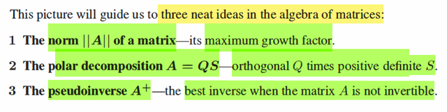</kbd>

> [!NOTE]
> đại khái khái là phần này sẽ bàn về norm của matrix: ||A|| ta sẽ thấy
> nó là growth factor  /stretching factor lớn nhất.
>
> Rồi polar decomposition. và pseud inverse A^+

 

<kbd>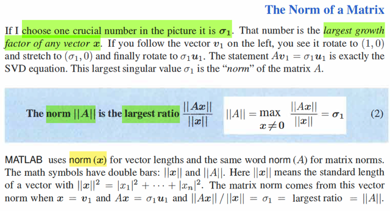</kbd>

> [!NOTE]
> Ở đây mình chính thức được học định nghiã của matrix norm:
>
> ||A||: Đó là con số stretch factor lớn nhất, khi A biến đổi x: ||A|| =
> max x ≠ 0 ||Ax|| / ||x||
>
> (trong các lớp ee364, hay cuốn numerical optim, mình đã từng
> ghi chú rằng với A là matrix đối xứng, thì cái này chính là eigen
> value lớn nhất. Tí nữa chắc sẽ có nói)
>
> Còn norm của vector thì biết rồi ||x|| = √ Σ xi^2

 

<kbd>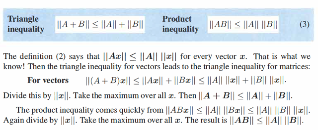</kbd>

> [!NOTE]
> đây là lần chính thức được học triangle inequality với matrix norm.
>
> ||A + B|| ≤ ||A|| + ||B||.
>
> Giáo sư nói thật ra nó xuất phát từ triangle inequality với vector mà
> thôi: ||u + v|| ≤ ||u|| + ||v||
>
> Cụ thể là ||Ax + Bx|| (đây là như ||u + v||) sẽ ≤ ||Ax|| + ||Bx||
>
> ⇔ ||(A + B)x|| ≤ ||Ax|| + ||Bx||
>
> chia hai vế cho ||x||, ko âm nên ko đổi chiều:
>
> ||(A + B)x|| / ||x|| ≤ ||Ax|| / ||x|| + ||Bx|| / ||x||
>
> vế trái thì ≤ ||A|| + ||B|| vì ||Ax|| / ||x|| ≤ ||A|| và ||Bx|| / ||x|| ≤ ||B|| do
> định nghĩa của norm A, B
>
> ⇨ ||(A + B)x|| / ||x|| ≤ ||A|| + ||B||
>
> cái này đúng với mọi x nên cũng đúng với x* khiến vế trái max
>
> và khi đó ta có ||A + B|| ≤ ||A|| + ||B||
>
> ====
>
>
> Còn cái product inequality:
>
> ||AB|| ≤ ||A|| ||B||
>
> Ta xét ||ABx||, nó sẽ ≤ ||A|| ||Bx||
>
> Vì định nghĩa của norm matrix A: ||A|| = max u ≠ 0 ||Au|| / ||u||
> nên với u = Bx ta cũng có inequality này: ||ABx|| / ||Bx|| ≤ ||A||
> ⇨ ||ABx|| ≤ ||A|| ||Bx||
>
> Tiếp ||Bx|| / ||x|| ≤ ||B|| do định nghĩa của norm ||B||
>
> → ||Bx|| ≤ ||B|| ||x||
>
> ⇨ ||ABx|| ≤ ||A|| ||B|| ||x||
>
> Chia hai vế cho ||x||:
>
> ||ABx|| / ||x|| ≤ ||A|| ||B||
>
> điều này đúng với mọi x nên x khiến vế trái max cũng đúng.
>
> ⇨ max x ||AB|| / ||x|| ≤ ||A|| ||B||
>
> ⇔ ||AB|| ≤ ||A||||B||

 

<kbd>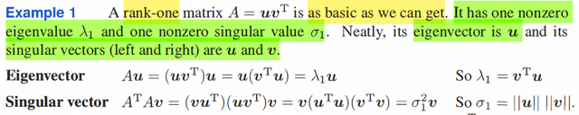</kbd>

> [!NOTE]
> Tại sao uvT rank 1? Vì nó chỉ có 1 cột / hàng độc lập: Tất cả các cột đều
> là  scaled của u (linear combination của u). Và tất cả các hàng đều là
> scaled của v. Scaled u bởi component của v và scale v bởi component
> của u.
>
> Tại sao gs nói nó có 1 eigenvalue λ1 khác 0? Đầu tiên, vì sao lại có eigen
> value, thì bởi nó là square matrix, uvT là square: Số cột = số component
> của v, số hàng là số component của u. Nên ở đây phải thầm hiểu u, v có
> cùng size. Rank 1 matrix uvT ko yêu cầu u, v phải cùng size. Đây là outer
> product, u, v khác size vẫn nhân nhau được.
>
> Vậy với matrix vuông rank 1 uvT thì tại sao biết eigenvalue λ1 khác 0?
>
> Thì dòng sau chính là câu trả lời, vì (uvT)u = u(vTu), mà vTu chính là dot
> product của u và v, là scalar, nên ta đang có chính là Au = λu với λ = uTv,
> điều này cho thấy 1) eigenvalue chính là uTv và u chính là eigenvector.
>
> Có điều như vậy λ1 khác 0 khi uTv khác 0, khi u v không vuông góc nhau.
> Và như vậy ta phải hiểu thêm gs đang giả thiết u, v ko vuông góc nhau
> nữa thì mới có vụ λ1 khác 0.
>
> ====
>
> Tiếp, ông nói eigenvector của nó là u thì đồng ý rồi. Và singular vector left
> right là u, v. Là sao.
>
> Là vì A = uvT, thì u là gì, và v là gì. u rõ ràng là basis của columnspace
> C(A) và v là basis của rowspace C(AT). Và C(A) và C(AT) đều là dim = 1
>
> Mà SVD ta đã học, có bản chất là. Ta muốn tìm một orthogonal basis của
> row space {vi} và columnn space {ui} sao cho chúng map nhau bởi A:
>
> Avi = σi ui. Đặt thành các columns của V, và U ta có AV = UΣ
>
> Và vì như đã nói {vi} orthonormal nên VTV = VVT = I, nhân hai vế cho VT
> ta có:
>
> Lưu ý U, V chưa chắc orthogonal, chỉ là các cột của chúng orthonormal
> thôi
>
> A = U Σ VT
>
> Vậy thì ở đây, uvT, thì giả sử ||u||, ||v|| = 1
>
> thì ta thấy chính là U Σ VT, với U chỉ có 1 cột là u, và v chỉ có một cột  là v.
> Và σ = 1
>
> bởi vậy u là left singular vector và v là right singular vector đúng rồi. Và ta
> cũng thấy singular value = 1
>
> Nhưng nếu ko có unit vector, thì ta phải scale nó để trở thành orthonormal
> basis Khi đ1o uvT = u/||u|| (||u||||v||) vT/||v||
>
> Thì u/||u|| và v/||v|| sẽ là left  và right singular vector. Và σ = ||u||||v||
>
> Điều này thể hiện qua việc ông ghi ATAv = ... = v(uTu)(vTv) 
>
> Dòng đó chính là cho thấy v là eigenvector của ATA, với eigenvalue tương
> ứng là (uTu)(vTv).
>
> Mà ta đã học rằng, eigenvector của ATA chính là right singular vector
> của A, và eigenvalue của ATA chính là bình phương singular value của A.
>
> Vậy nên ở đây xác nhận điều mình suy luận ở trên, singular value của A
> sẽ là √(uTu)(vTv) = √||u||^2||v||^2 = ||u||||v||

 

<kbd>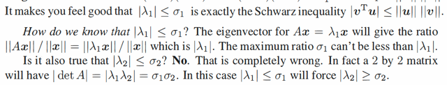</kbd>

> [!NOTE]
> đoạn này đại ý là ở đây ta đã hiểu / thấy eigenvalue của A = uvT là uTv,
> và cũng đã thấy singular value của nó là ||u||||v||. Thế thì, bất đẳng thức
> Cauchy, cho ta |uTv| ≤ ||u||||v|| (xuất phát |cos(u,v)| ≤ 1 ⇔ |uTv/||u||||v||| ≤
> 1 ⇔ |uTv| / ||u||||v|| thôi)
>
> Như vậy ta có |λ1| ≤ σ1.
>
> Điều này giúp ta nghiệm lại thì thấy nó đúng, bởi lẽ , σ1, chính là
> stretching factor lớn nhất (ở đây chỉ có 1 cái, nên dĩ nhiên nó cũng là
> cái lớn nhất) Mà |λ1| là cũng là một stretching factor, cụ thể thì nó biến
> eigenvector u thành λ1u. Nên dĩ nhiên nó phải luôn không vượt quá
> stretching factor lớn nhất là σ1 rồi.
>
> Nhưng gs lưu ý, nếu matrix có λ1, λ2 và σ1, σ2 thì ko chắc là |λ2| luôn 
> ≤ σ2 đâu nhé. ta chỉ có thể kết luận với σ1 là cái lớn nhất thôi
>
> Và ông lấy ví dụ matrix 2x2, nó sẽ có det A = λ1λ2 Và |det A| cũng bằng
> σ1σ2 ⇨ |λ1λ2| = σ1σ2 ⇨ |λ2| > σ1
>
> Chỗ này tại sao |det A| = σ1σ2? (det A = λ1 λ2 thì biết rồi)
>
> À là vì A = U Σ VT, det A = det(U Σ VT)
>
> theo tính chất det ta đã học: |AB| = |A||B|
>
> → |U Σ VT| = |U| |Σ| |VT|
>
> Xét det U, VT: Chúng là các orthogonal matrix: Q, có tính chất QTQ = I
>
> ⇨ |QTQ| = |I| = 1 ⇔ |QTQ| = 1 ⇔ |QT||Q| = 1 
>
> ⇔ |Q|^2 = 1 (det Q và QT giống nhau)
>
> ⇔ |Q| = +/- 1
>
> Vậy, nếu đang lấy trị tuyệt đối thì ta có |detQ| = 1
>
> Do đó |detU|, |detVT| đều = 1
>
> Còn |det Σ| dĩ nhiên là |σ1 σ2| = σ1 σ2 vì hai số này ko âm
>
> ⇨ |det A| = |det U| |det Σ| |det VT| = 1 x σ1σ2 x 1 = σ1σ2

 

<kbd>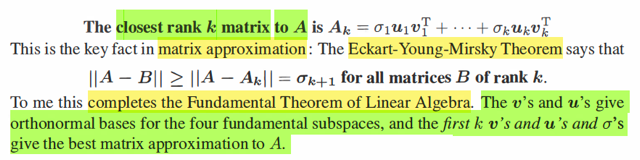</kbd>

> [!NOTE]
> hiểu vậy đúng chưa:
> đoạn này hay vãi chưởng. Đại khái gs nói rằng, nếu như ta chỉ xét
> k singular value lớn nhất (tức là, khi phân tách A = U Σ VT, và sắp
> xếp các singular value từ lớn tới nhỏ), rồi tạo Ak là matrix từ k 
> singular vector u1,...uk ứng với k singular value lớn nhất. σ1,...σk
>
> Thì khi đó, ta sẽ có cái matrix rank k tốt nhất xấp xỉ cho A.
>
> Để rồi nếu xét B là một matrix rank k bất kì, thì sai số của nó
> trong việc xấp xỉ A (||A - B||) sẽ luôn lớn hơn sai số của Ak trong việc
> xấp xỉ A. ||A - B|| ≥ ||A - Ak||
>
> Và, norm của sai số ||A - Ak|| chính là σk+1, là vì.
>
> Theo định nghĩa norm của A là stretching factor lớn nhất của A. 
> Mà A - Ak, tức là ta đã bỏ đi matrix rank k, matrix này chính là có các
> singular value còn lại σk+1,...σ
>
> mà trong đó lớn nhất chính là σk+1.
>
> ====
>
> Câu hỏi là? Tại sao E = A - Ak lại có các stretching factor σk+1,...và
> đến σ mấy?
>
> Thì giả sử A là matrix (m, n) ⇨ có n cột. gỉa sử rank r
>
> Thế thì SVD có bản chất như đã nói, là tìm hai bộ basis của column
> space và row space sao cho chúng  map nhau bởi A. Aui = σivi 
>
> Nên cơ bản là ta sẽ có r cái như vậy, vì r (rank) là số vector của
> basis của C(A), C(AT)
>
> Để rồi gom {ui} {vi} thành U và V, kí hiệu đúng ra là Ur, Vr
> Thì các quan hệ trên thể hiện bởi A Vr = Ur Σr
>
> Và vì VrVrT = I, nên nhân hai vế cho VrT ta có
>
> Và tách A = Ur Σr Vr, và bản chất cái này chính là Σ σiuiviT
> và như vậy ta thấy nó là tổng r cái rank 1 matrix.
>
> Và Như vậy, nếu mình form Ak bởi k singular component lớn nhất,
> thì Ak chính là Σi=1:k σiuiviT
>
>
> Do đó dĩ nhiên E = A - Ak sẽ = Σi=k+1:r σiuiviT
>
> Và như vậy, ta có thể thấy ngay norm của E, là σ (của E) lớn nhất,
> chính là σk+1

 

<kbd>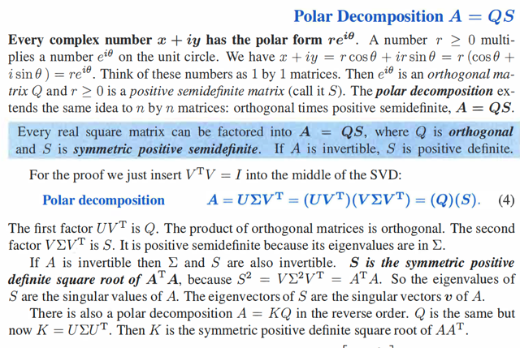</kbd>

> [!NOTE]
> QUAY LẠI SAU

 

<kbd>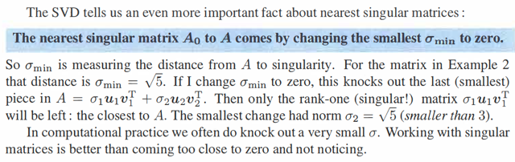</kbd>

<kbd></kbd>

<kbd>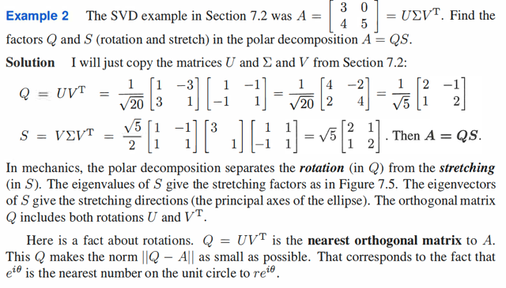</kbd>

> [!NOTE]
> QUAY LẠI SAU

 

<kbd>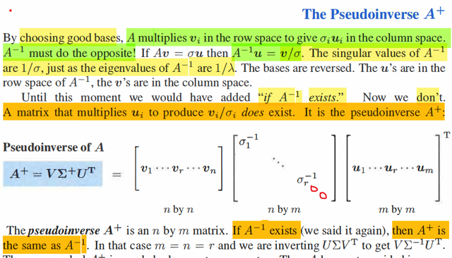</kbd>

> [!NOTE]
> Vậy thì đại khái là, như đã biết, SVD có bản chất là ta muốn tìm 2 bộ
> orthogonal basis của rowspace và columns space sao cho Avi = σiui xuất phát
> từ thực tế là một non-zero vector trong rowspace sẽ luôn được map với một
> non-zero vector trong column space.(nonzero vector trong nullspace thì map
> về 0)
>
> Thế thì, nếu A invertible, thì Ainv sẽ đảo ngược quá trình này: Ainvui = vi/σi
> Thể hiện theo matrix: AV = ΣU thì V = Ainv Σ U
>
> Nếu A invertible, thì rowspace chính là R^n, nullspace chỉ là {0} nên mọi
> non-zero vector trong R^m (cũng là R^n. vì m = n = r)  đều được map với
> non-zero vector trong column space, lúc này cũng là R^n = R^m. Hay cũng
> chính là column space hay rowspac cũng là một.
>
> Nhưng nếu A singular, thì Ainv ko tồn tại, nên ko thể dùng được
>
> nhưng sẽ vẫn có thể map vector ui ngược lại thành vector vi. Và đó là matrix
> có tên là pseudo inverse, kí hiệu A^+, có dạng:
>
> [v1,..vn] diag[1/σ1...1/σr, 0,...0] [u1,...um]T, A^+ = V Σ^+ UT
>
> Với V, U là orthogonal matrix chứa basis của Rn và Rm. Còn Σ^+ thì là diagonal
> matrix có r entries đầu tiên là khác 0
>
> Khi Ainv tồn tại thì nó chính là A^+.
>
> Để thấy điều này thì Ainv = (U Σ VT)inv = VTinv (U Σ)inv = VTT Σinv Uinv
>
> = V Σinv UT chính là cái trên, V Σ^+ UT (trong bước trên thì VTT = V, Uinv = U
> là do U, V orthogonal, QT = Qinv)
>
> Còn lí do gì A^+ ở trên có thể map ngược lại ui với vi đơn giản là vì:
>
> A^+ U = V Σ^+ UT U = V Σ^+ I  = V Σ^+
>
> Và đó chính là A^+ ui = vi / σi đó thôi.

 

<kbd>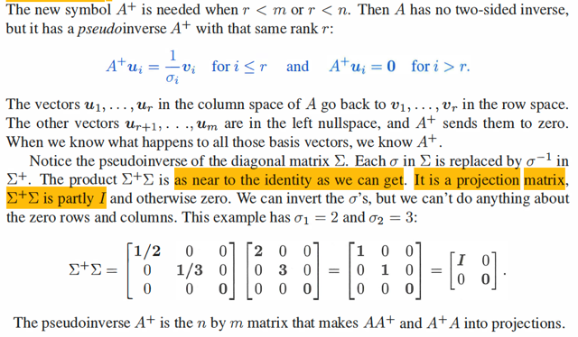</kbd>

> [!NOTE]
> Thế thì, A^+ có rank r. Vì sao?
>
> Giải thích đại khái là vì r vector độc lập u1,...ur sẽ được map với r vector
> độc lập v1...vr nên ko có chiều không gian nào bị suy biến cả → rank = r.
>
> Còn Σ^+, nó sẽ là cái mà khi nhân với Σ, cho ra matrix gần với Identity
> matrix nhất có thể.
>
> Tại sao Σ^+Σ  lại là projection matrix?
>
> Ôn lại lập luận về projection matrix trong bài giảng của gs Strange. Trong
> đó ông nói về project b lên C(A): e = b - p = b - Ax^ sẽ vuông góc với C(A)
> ⇨ vuông góc với mọi columns của A ⇨ ATe = 0, hoặc cũng là, e chính là
> trong nullspace của A ⇨ ATe = 0 ⇔ AT(b - Ax^) = 0 ⇔ ATb = ATAx^
> ⇔ x^ = (ATA)invATb. ⇨ projection của b lên C(A): Ax^ = A(ATA)invATb
> ⇨ Projection matrix P =  A(ATA)invAT
>
> Thế thì nếu b đã nằm trong C(A) (nên b sẽ là linear combination của A's
> column: b = Ax) thì projection của b lên C(A) là chính nó:
>
> Pb = PAx = A(ATA)invATAx = Ax = b
>
> Và một tính chất quan trọng của projection matrix là PP = P. Chiếu nhiều
> lần vẫn là một lần. Thử xem đúng với P ở trên ko:
>
> PP = A(ATA)invATA(ATA)invAT = A(ATA)invAT = P. Đúng là vậy.
>
> Quay lại đây, thật ra đơn giản Σ^+Σ là projection matrix vì:
>
> Σ^+ΣΣ^+Σ = Σ^+Σ
>
> Và Σ^+Σ có dạng: [e1 e2 ..er 0 0 ..0], nên nó sẽ matrix chiếu lên subspace
> span bởi e1,...er.

 

<kbd>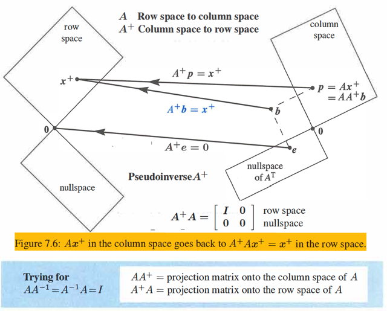</kbd>

> [!NOTE]
> hình ảnh này là sao: 
>
> Như đã biết A, sẽ là matrix biến non-zero vector trong rowspace của
> A tới non-zero vector trong column space của A.
>
> Và map vector trong nullspace của A thành 0.
>
> Nên một non-zero vector trong R^m sẽ được tách làm hai phần, một
> cái trong C(AT), được map về C(A). Một cái trong nullspace, map về 
> 0
>
> Thì A^+ là matrix làm ngược lại. Nó biến vector khác 0 trong column
> space về vector khác 0 trong rowspace. Và vector khác 0 trong left
> nullspace về 0
>
> **Tại sao AA^+ là projection matrix onto C(A)?**
>
> Vì AA^+x sẽ nằm trong C(A), và AA^+xAA^+x = AA^+x, nên nó là
> projection matrix, với đích đến là C(A), nên nó là projection matrix
> lên C(A) chứ gì nữa.
>
> Còn A^+A, cũng là projection matrix. Đích đến là C(A^+x), chính là
> C(V), ⇨ chính là rowspace của A,
>
> Có thể nhìn kĩ hơn để thấy: Gỉa sử ta xét r**educed SVD**
>
> AA^+ = (U Σ VT) (V Σ+ UT) = U Σ VT V Σ+ UT 
>
> = U  Σ I Σ+ UT
>
> = U Σ Σ+ UT = UUT
>
> Đây chính là U(UTU)_invUT là Projection onto C(U) matrix. Mà C(U)
> chính là C(A). do U là matrix tạo bởi các basis của C(A)
>
> Tương tự:
>
> A^+ A = (V Σ+ UT) (U Σ VT)
>
> =  V Σ+ Σ VT = VVT cũng chính là V(VTV)invVT, là Projection onto C(V)
> matrix. Mà C(V) chính là rowspace của A
>
> Nếu xét **full SVD** thì lập luận cũng tương tự:
>
> **QUAY LẠI SAU**

> [!NOTE]
> QUAY LẠI SAU

 

<kbd>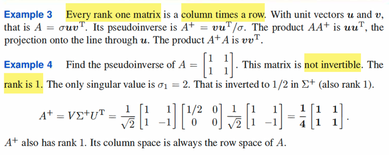</kbd>

> [!NOTE]
> Example 3, gs cho rằng mọi rank 1 matrix đều là 1 column x 1 row.
> Vì sao / thế là thế nào nhỉ? ⇨ phải rồi, chỉ có thể là 1 columns x 1 row
> thì mới có thể ra rank 1 matrix. Vì rank 1 matrix là matrix có 1 cột / hàng
> độc lập. Vậy thì mọi hàng / cột đều là linear combination của một hàng /
> cột nào đó. Nên nó sẽ phải có dạng [α1**u** α2**u**...αn**u**] ⇨ = **u**T**v**với v 
> = [α1, α1,....αn]
>
> Gs nó tiếp nếu u, v đều là unit vector thì A = σ**uv**T. Là sao?

> [!NOTE]
> QUAY LẠI SAU

> [!NOTE]
> QUAY LẠI SAU

 

<kbd>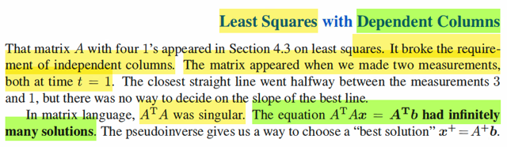</kbd>

> [!NOTE]
> Khi A không full column rank, ví dụ như trong bài toán thực tế, có hai 
> feature giống nhau.
>
> Khi đó ATA singular. Vì sao? Vì khi đó tồn tại nonzero vector trong
> nullspace của A, và nó cũng là nonzero vector trong nullspace của ATA
> vì hai cái này cũng nullspace. Ax = 0 ⇨ ATAx = 0. Do đó ATA singular.
>
> Và normal equation ATAx = ATb có vô số nghiệm. Vì sao?
>
> Đầu tiên, sao biết nó có nghiệm? Để trả lời thì xét ATb, xem nó có nằm
> trong C(ATA) không: ATb nằm ở đâu → nó là linear combination của
> các column của AT, cũng là row của A ⇨ ATb nằm trong rowspace của
> A: C(AT). Còn column space của ATA? 
>
> Ta đã biết ATA có chung nullspace với A. Giả sử A không full column
> rank, có rank r < n (số cột) ⇨ nullspace có dim = n - r. ⇨ dim của 
> nullspace của ATA cũng là n - r. Mà ATA có shape là nxn, ⇨ rank ATA
> là r ⇨ dim của C(ATA) = r. Vậy là columns của ATA span r-D subspace 
> ⇨ C(ATA) = rowspace của A. ⇨ ATb chắc chắn nằm trong C(ATA) nên
> phương trình chắc chắn có nghiệm.
>
>
> Chỉ khi nào column của A khiến ATu = 0, tức là column của A là left
> nullspace vector của A. Mà column của A thì nằm trong C(A), thì làm sao
> mà là left nullspace vector được, vì column space với left nullspace
> orthogonal complement. Nên nếu u là column của A thì ATu chắc chắc
> khác 0. Có thể giải thích đơn giản hơn là AT sẽ luôn map một vector khác
> 0 trong rowspace của nó, tức là column space của A thành vector khác
> 0 trong column space của nó, tức là rowspace của A. Thành ra ATu với
> u là một cột của A thì ATu phải khác 0. Và do đó, các cột của ATA đều 
> là các linear combination của các cột của AT, và ko có cột nào bằng 0.
> Nên C(AT) = C(ATA)
>
> Tóm lại là ý muốn làm rõ: 
>
> 1) Các cột của ATA, chỉ là linear combination các cột của AT.
>
> Nên C(ATA) phải là subspace của C(AT)
>
> 2) Trong các linear combination đó, không có cái nào thành 0, nên 
> dimension của C(ATA) cũng bằng dimension của C(AT)
>
> Do đó C(ATA) phải chính là C(AT)
>
> Như vậy (ATb) luôn nằm trong C(ATA) ⇨ luôn có nghiệm
>
> ====
>
> Thế thì vì sao nó có vô số nghiệm? Thì cái này đơn giản là vì đã nói,
> tồn tại nonzero vector trong nullspace của A cũng là của ATA ⇨ sẽ có
> vô số nghiệm có dạng x_complete = x_particular + x_null

 

<kbd>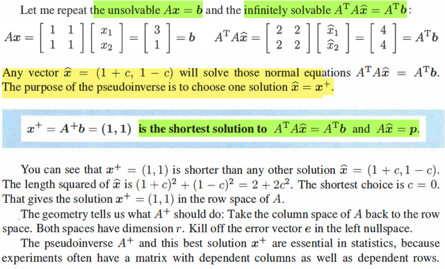</kbd>

> [!NOTE]
> đại khái là thế này, vừa rồi là mình giải thích vì sao ATAx = ATb có vô số
> nghiệm khi A ko full column rank.
>
> Nhưng vì sao lại nói đến chuyện này.
>
> Xuất phát là từ gốc rễ là ta muốn giải Ax = b kìa. Nhưng vì b ko nằm trong
> C(A) nên hệ này vô nghiệm.
>
> Thế thì từ đó ta mới đi tìm nghiệm least square, là nghiệm xấp xỉ tốt nhất
> Mà về hình học, việc tìm nghiệm của Ax = b là ta muốn tìm x khiến linearly
> combine A's columns thành ra b. Nhưng không làm được vậy vì b ko thuộc
> C(A). Nên ta sẽ tìm liner combination của A để ra điểm nằm trong C(A)
> mà gần nhất với b. Đó chính là hình chiếu của b lên C(A). Hay nói cách
> khác, ta sẽ giải Ax^ = p với p là hình chiếu của b lên C(A). Và cái này
> thì chắc chắn có nghiệm. Và nó chính là nghiệm của normal equation: 
> ATAx^ = ATb
>
> Có điều. Nếu như A full column rank, thì ATA invertible ⇨ x^ = (ATA)invATb
> ta có nghiệm duy nhất.
>
> Nhưng ở đây. ATA ko full rank, như đã nói, normal equation có vô số nghiệm
>
> Mà về hình học, thì ta có vô số cách linear combine các cột của A để ra b, 
> chứ hình chiếu của b lên C(A) vẫn chỉ có một thôi.
>
> Thế thì ở đây thầy Strang nói rằng, cái pseudo inverse A^+. sẽ giúp ta tìm
> ra cái bộ coefficient giúp combine A's column ra p, sao cho norm của nó là
> nhỏ nhất. 
>
> x+ = A^+ b
>
> Có vô số nghiệm, x+ = A^+ b lại là least norm solution
>
> Vì sao lại như vậy?
>
> Đơn giản thôi, như đã nói normal equation sẽ có vô số nghiệm có dạng
> x_complete = x_particular + x_null
>
> mà về bản chất, có thể tách ra thành x_rowspace + x_nullspace
>
> Để rồi norm của nó là ||x_complete||^2 = ||x_rowspace + x_nullspace||^2 sẽ 
> = ||x_rowspace||^2 + ||x_null||^2
>
> Thế thì như vậy solution có norm nhỏ nhất chính là x_rowspace khi x_null = 0
> Nói cách khác ta muốn loại bỏ x_null đi.
>
> Vậy thì vì sao A^+ b chính là x_rowspace:
>
> Là vì, b nằm trong R^m, có thể tách thành hai phần: b_row nằm trong 
> column space của A và b_leftnull nằm trong left nullspace của A.
>
> Và A^+ thì như đã thấy sẽ map left nullspace vector của A về 0, và map 
> column space vector của A về lại rowspace vector.
>
> ⇨ A^+ b là nằm trong rowspace của A.
>
> Và nó chính cũng là solution của ATAx = ATb vì
>
> ATA A^+b = (U Σ VT)T(U Σ VT)(V Σ+ UT) b = V ΣT UT U Σ VTV Σ+ UT b
>
> = V ΣT I Σ I Σ+ UT b
>
> = V **ΣT ΣΣ+** UT b
>
> CHÚ Ý CHỖ NÀY: ΣT ΣΣ+ = ΣT
>
> = V ΣT UT b
>
> = (U Σ VT)T b
>
> = ATb
>
> Và thế là: A^+ b, như đã chứng minh, 1) chính là nằm trong rowspace 
> mà A^+ b cũng là solution ⇨ DO ĐÓ, NÓ CHÍNH LÀ NGHIỆM CÓ NORM
> NHỎ NHẤT

> [!NOTE]
> Tóm lại cách hiểu quan trọng có 3 CASE:
>
> 1) Ax = b VÔ NGHIỆM, ATAx^ = ATb CÓ NGHIỆM LEAST SQUARE DUY NHẤT
>
> Xảy ra khi A full column rank, chỉ có 1 cách linear combine cột của A để cho
> ra hình chiếu p của b lên C(A), và x^ = ATAinvAT b = A^+ b. Lúc này A^+ chính là left
> inverse
>
> 2) Ax = b VÔ NGHIỆM, ATAx^ = ATb CÓ VÔ SỐ NGHIỆM LEAST SQUARE  
>
> Xảy ra khi A ko full rank, có vô số cách linear combine column của A để
> cho ra hình chiếu của b lên C(A)
>
> Và khi này, thì A^+ b LÀ NGHIỆM LEAST SQUARE (trong vô số nghiệm leastsquare)
> VÀ LÀ CÁI CÓ NORM NHỎ NHẤT - LEAST NORM.
>
> Hay ta gọi là least norm of least square
>
> 3) Ax = b CÓ VÔ SỐ NGHIỆM. Lúc này ko cần xét đến least square làm gì nữa, vì
> least square là chỉ khi nào ta cần tìm nghiệm xấp xỉ tốt nhất thôi
>
> Thì cái này xảy ra khi A mập lùn, và b nằm trong C(A). Lúc này, A^+b LÀ CÁI CÓ
> NORM NHỎ NHẤT TRONG VÔ SỐ NGHIỆM.
>
> **CÓ NGHĨA LÀ, A^+b, SẼ LUÔN LẤY RA CÁI CÓ NORM NHỎ NHẤT TRONG 
> VÔ SỐ CÁI LEAST SQUARE SOLUTION HOẶC TRUE SOLUTION NẾU NHƯ
> RƠI VÀO CASE CÓ VÔ SỐ NGHIỆM.**

> [!NOTE]
> Tại sao khi Ax = b có vô số nghiệm thì A^+ b cũng cho ra nghiệm least norm 
>
> Thì đơn giản là vì A^+ b nó nằm trong rowspace. Và khi Ax = b có nghiệm thì
> A^+ b cũng là nghiệm, nên nó
> sẽ là cái phần nằm trong rowspace của x_complete, nên nó sẽ nhỏ nhất.
>
> Cụ thể hơn ta đã thấy với normal equation thì A^+ b cũng thỏa normal equation
> chính xác hơn thì A^+ b luôn thỏa normal equation. Và normal equation thì
> luôn có ít nhất một nghiệm. Nên A^+b luôn chắc chắn là nghiệm.
>
> Chẳng qua là, nếu normal equation:
>
> - Có vô số nghiệm thì A^+b là nghiệm nhỏ nhất
>
> - Có một nghiệm thì nó cũng là cái nhỏ nhất mà thì cũng là cái đó luôn
>
> - Còn nếu b thuộc C(A) thì nghiệm least square trở thành nghiệm bình thường
> và A^+ b lại cho ra nghiệm bình thường nhỏ nhất
>
> Còn với Ax = b Thì vì ta đã biết AA^+ là projection onto C(A). Nên nếu b 
> thuộc C(A) thì AA^+ b cũng là chính nó. Tức AA^+ b = b ⇨ A^+b là nghiệm.
> Và again, nó nằm trong C(A) nên nó là nghiệm nhỏ nhất nếu như có vô số
> nghiệm, còn nếu như chỉ có một nghiệm thì nó chính là cái này.
>
> A A^+ b = (U Σ VT) (V Σ+ UT) b = U Σ Σ+ UT b = P_ontoC(U) b
>
> (nguyên cái cục này U Σ Σ+ UT = chính là UUT, là projection onto C(U), mà C(U)
> cũng là C(A)
>
> Vì sao UUT là projection onto C(U) matrix?
>
> Vì với matrix A, thì projection onto C(A) có dạng: P_ontoC(A) = A(ATA)invAT
>
> ⇨ với matrix U thì P_ontoC(U) = U(UTU)invUT = UIUT = UUT do U orthogonal
> → UTU = I )
>
> Như vậy, nếu Ax = b có nghiệm, tức b ∈ C(A) thì dĩ nhiên AA^+b = P_ontoC(A) b
> = b ⇨ A^+b thỏa Ax = b ⇨ A^+b là nghiệm, và again, nó nằm trong rowspace
> nên là nghiệm nhỏ nhất
>
> Còn khi Ax = b vô nghiệm tức b ko thuộc C(A) ⇨ AA^+b = P_ontoC(A) b nó chỉ 
> bằng p, là hình chiếu của b lên C(A) chứ ko phải b, ⇨ A^+b ko phải nghiệm.
> Nhưng again, ta thấy A^+b là cái thỏa Ax^ = p ⇨ A^+b là least square solution
>
> **Túm lại: Nói ngắn gọn:
>
> AA^+ là P_ontoC(A) nên:
>
> Nếu b**∈**C(A) ⇨ AA^+b = b ⇨ A^+b là nghiệm thông thường
>
> Nếu b ko**∈**C(A) ⇨ AA^+b = p ⇨ A^+b là nghiệm least square 
>
> Và dù trong trường hợp nào đi nữa thì vì bản chất A^+ b đều nằm trong rowspace
> nên nó luôn là cái có norm nhỏ nhất (khi có vô số nghiệm thường hoặc vô số
> nghiệm least square)**

 

<kbd>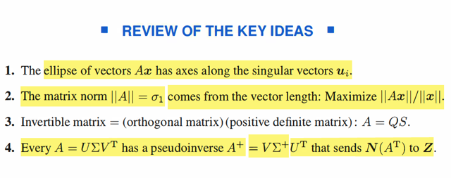</kbd>

> [!NOTE]
> Tóm lại 
>
> ý cuối: A^+ map vector trong left nullspace về 0 ⇨ map vector trong R^n
> (tách làm 2: trong column space và trong left nullspace về nằm trong 
> rowspace)

 

<kbd>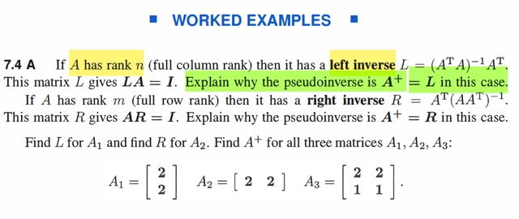</kbd>

> [!NOTE]
> Nếu A full column rank, tại sao A^+ lại chính là left inverse (ATA)invAT?
>
> Thì bởi đã nói, AA^+ chính là Proj_ontoC(A) matrix
>
> Thì nếu ATA invertible thì A(ATA)invAT chính là Projection onto C(A) matrix
> vì sao, vì A(ATA_inv)ATb = hình chiếu của b trên C(A). Để thấy điều
> này ta sẽ chỉ ra p = A(ATA_inv)ATb sẽ thỏa: e = b - p vuông góc với C(A):
>
> ATe = AT(b - A(ATA_inv)ATb) = ATb - ATA(ATA_inv)ATb = ATb - ATb = 0
>
> ⇨ e vuông góc với C(A)
>
> Vậy AA^+ = A(ATA)invAT ⇨ A^+ = (ATA)invAT là left inverse
>
> ====
>
> Nếu A full row rank thì tại sao A^+ cũng chính là right inverse AT(AAT)inv?

> [!NOTE]
> QUAY LẠI SAU

 

