# 8.1 Idea Of A Linear Transformation

📊 **Progress:** `18` Notes | `20` Screenshots

---

<kbd>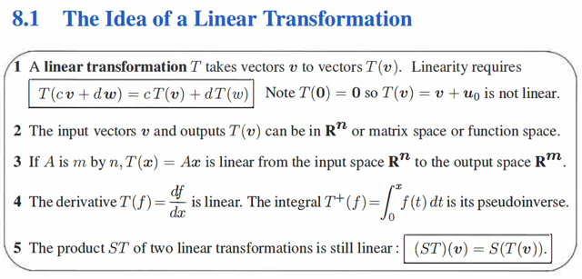</kbd>

 

<kbd>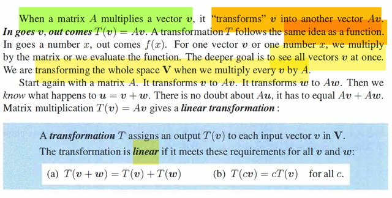</kbd>

> [!NOTE]
> Đại khái là, giáo sư bắt đầu với sự thật ai cũng thấy, khi A nhân với 
> vector v, nó cho ra một vector khác: Av. (vì Av có bản chất là linear combine
> các cột của A bởi các hệ số là component của v)
>
> Thế thì ông cho rằng, ta nên nhìn thấy rằng, A làm việc y như một function:
> nhận vào vector v, cho ra vector Av.
>
> Và ta gọi function đó, là T(v): T(v) = Av, nó là một transformation, biến đổi
> input v, để trở thành output T(v) = Av
>
> Thế thì, ta mới nhìn tiếp vào tính chất của T(v).
>
> Nếu có thêm vector w, thì A sẽ biến nó thành vector Aw.
>
> Và nếu xét u = v + w, thì A sẽ biến nó thành Au = A(v + w) = Av + Aw
>
> Như vậy T(u + w) = T(u) + T(w)
>
> Và xét u = αv thì A sẽ biến nó thành A αv = αAv. 
>
> Có nghĩa là T(αv) = αT(v).
>
> Và với hai tính chất này cho thấy T(v) là một LINEAR TRANSFORMATION
>
> LÍ DO LÀ VÌ, ĐỊNH NGHĨA CỦA LINEAR TRANSFORMATION NÓI RẰNG:
>
> Nếu T(αu + βv) = αT(u) + βT(v) thì nó là linear transformation.
>
> NHƯ VẬY, TA KẾT LUẬN VIỆC LẤY MATRIX A NHÂN CHO v, Av SẼ ĐẠI
> DIỆN / CÓ BẢN CHẤT LÀ MỘT LINEAR TRANSFORMATION

 

<kbd>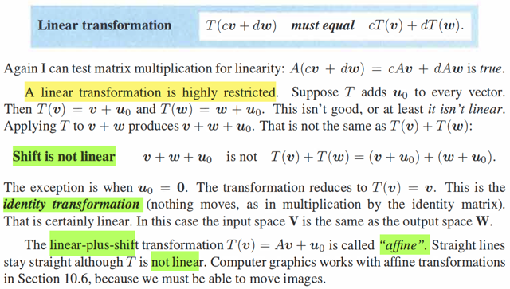</kbd>

> [!NOTE]
> theo định nghĩa của linear transformation thì phép biến đổi
> CHUYỂN DỊCH (SHIFT) hay AFFINE ko phải là linear transformation

 

<kbd>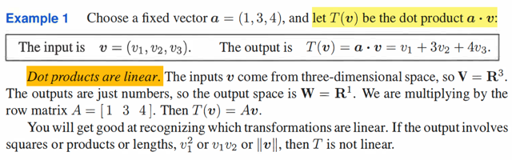</kbd>

> [!NOTE]
> Dot product của một vector a với vector v: T(v) = aTv 
> là một linear transformation. (vì nó thỏa điều kiện trên)

 

<kbd>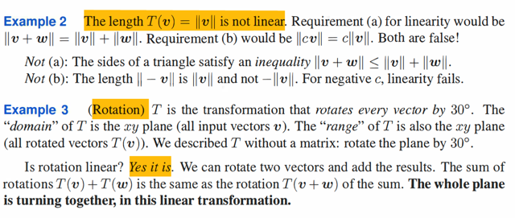</kbd>

> [!NOTE]
> Phép "lấy norm" ko phải là linear transformation.
>
> Còn phép xoay thì có.
>
> Mấy cái này trong bài giảng đã nói

 

<kbd>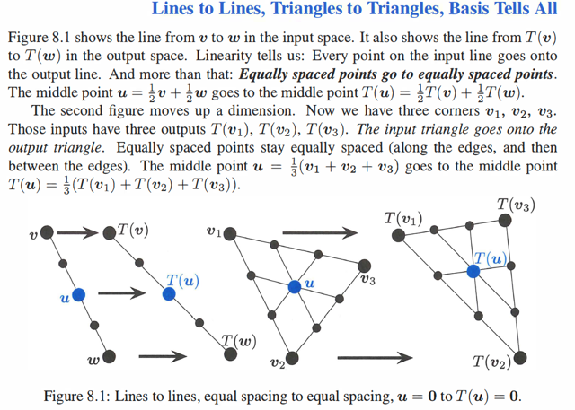</kbd>

 

<kbd>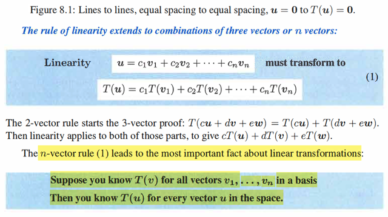</kbd>

> [!NOTE]
> ý này đại khái là: Xuất phát từ tính chất T(c1v1 + c2v2) = 
> c1T(v1) + c2T(v2)
>
> Nên T(c1v1 + ...cnvn) = c1T(v1) + ...cnT(vn).
>
> Điều đó có nghĩa là: Nếu ta biết kết quả (transformation) của T(v1)...
> T(vn), thì ta sẽ biết kết qủa transformation của mọi linear combination
> của v1.....vn.
>
> Và nếu như v1,....vn là basis, thì tất nhiên ta đã biết nó có thể tạo 
> mọi vector trong subspace. ⇨ ta sẽ có thể biết kết quả transformation
> của mọi vector trong subspace

 

<kbd>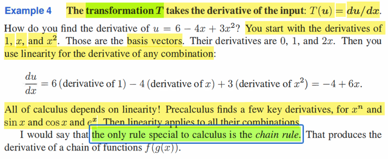</kbd>

> [!NOTE]
> gs nói qua một ví dụ: Xét một transformation T, làm cái việc sau đây: lấy
> đạo hàm theo input. T(u) = d/dx u.
>
> Vậy thì đây cũng là linear transformation.
>
> ví dụ u = 6 - 4x + 3x^2
>
> Thì ta xem u là vector, được tạo thành bởi linear combination của  v1 = 1,
> v2 = x, v3 = x^2. Mà cụ thể ở đây là 6v1 - 4v2 + 3v3.
>
> Thế thì, ta theo nguyên lí trên, chỉ cần ta biết kết quả của linear
> transformation của các basis vector. tức T(v1), T(v2), T(v3) thì ta sẽ biết
> được linear  transformation của mọi linear combination của chúng.
>
> Vậy thì: T(v1) = d/dx 1 = 0. T(v2) = d/dx x = 1. T(v3) = d/dx x^2 = 2x
>
> Vậy T(u) = T(6 - 4x + 3x^2) = u = 6T(v1) - 4T(v2) + 3T(v3)
>
> = 6*0 - 4*1 + 3*2x = -4 + 6x
>
>
> Từ đó gs nói rằng mọi vấn đề của calculus đều dựa trên linearity. Chỉ
> có một cái đặc biệt là chain - rule

 

<kbd>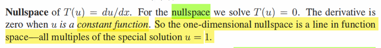</kbd>

> [!NOTE]
> Đặt vấn đề nullspace của T(u) = du/dx.
>
> Là sao nhỉ? 
>
> Bình thường mình quen với nullspace của A, columnspace của A.
> Trong đó C(A) là linear combination của mọi A's columns. Và N(A) là
> vector mà là solution của Ax = 0. Và cũng là vector mà component 
> của nó sẽ linearly combine các A's column thành ra 0. Nó sẽ vuông
> góc với rowspace của A, nên vuông góc với mọi row của A.
>
> Thế thì bây giờ nói về nullspace của T(u) = du/dx là sao?
>
> Thì mình hiểu như vầy, đã nói Au có bản chất, có thể được nhìn nhận
> dưới dạng linear transformation: T(u) = Au, input vector output vector
> khác. Nên với linear transformation T(u) = Au, thì nullspace vector 
> u của nó là vector thỏa Au = 0, thì cũng là thỏa T(u) = 0.
>
> Vậy thì với transformation T(u) = du/dx cũng vậy, nullspace vector
> sẽ là u sao cho T(u) = 0, tức du/dx = 0
>
> Mà như vậy thì chỉ có thể là u là constant và mọi constant đều thỏa.
>
> Do đó, nullspace là mọi vector u có dạng constant * 1 với constant
> bất kì.
>
> Có nghĩa là trong 3 basis của vector space v1,v2,v3 thì v1 chính là 
> basis của nullspace.

 

<kbd>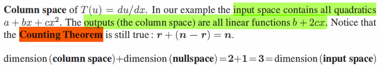</kbd>

> [!NOTE]
> Câu hỏi tiếp theo là column space là cái gì?
>
> Đầu tiên một điểm cần hiểu, ở đây ta đang xét vector space có basis là
> v1 = 1, v2 = x, v3 = x^3
>
> Thì mọi linear combination của chúng sẽ tạo subspace là tập mọi quadratic
> có dạng a + bx + cx^2.
>
> Thế thì, với transformation T(u) = Au, thì column space như đã nói sẽ là
> mọi linear combination của các A's column.
>
> Vậy thì columnspace của transformation T(u) = du/dx, với u là một trong
> các linear combination của basis v1,v2,v3, sẽ luôn có dạng là là b + cx
> ⇨ columns space là tập các linear function b + cx
>
> Vậy thì dim của column space là 2 và giáo sư nói counting theorem vẫn
> đúng: dim column space + dim nullspace = dim input space
>
> 2 + 1 = 3
>
> Chỗ này là sao. Với transformation T(u) = Au. Mình đã biết dim C(A)
>  = dim C(AT) = rank A. Và ta có các quan hệ: Các cặp: column space và 
> left nullspace, cũng như rowspace và nullspace orthogonal complement.
>
> dim C(A) + dim N(AT) = R^m
>
> dim C(AT) + dim N(A) = R^n
>
> Tất nhiên xét input space Au, thì input space là R^n (x là vector thuộc R^n)
>
> Nên ta quan tâm dim C(AT) + dim N(A) = R^n
>
> và như đã nói vì dim C(A) = dim C(AT) ⇨ ta có dim C(A) + dim N(A) = R^n
> là dim input space.
>
> Nên ở đây chính là quan hệ đó. Chứ ko phải nullspace và column space
> orthogonal complement đâu nhé.

 

<kbd>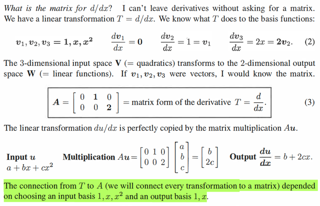</kbd>

> [!NOTE]
> Đại khái là, câu hỏi là matrix đại diện cho transformation T(u) = du/dx là
> gì? Là sao nhỉ? Tạm hiểu là vì ta đã thấy rằng T(u) = du/dx cũng là linear
> transformation, nên nó cũng có thể thể hiện bởi dạng T(u) = Au với matrix
> A nào đó. Vậy thì câu hỏi là A là gì.
>
> Đầu tiên nhắc lại ba vector basis của input space: v1,v2,v3 = 1, x, x^2 Từ
> ba vector này, ta có mọi vector trong input space: mọi linear combine của
> chúng: a*1 + b*x + c*x^2
>
> Và ta đã có kết quả transformation của ba basis vector này:
>
> T(v1) = 0, T(v2) = 1, T(v3) = 2x
>
> Thì theo nguyên lí, ta có thể có kết quả tranformation của mọi linear
> combine bởi chúng.
>
> Thế thì đại khái là gs sẽ nói về nguyên tắc xây dựng A ở phần sau, nhưng
> trong bài giảng thì mình đã được biết, đó là. Ta sẽ xác định basis của
> output space. Để rồi thể hiện kết quả transform của các input space basis
> bởi linear combination của các output basis. Và lấy các hệ số để vào
> thành các column của A. Khi đó ta sẽ có matrix A
>
> Thế thì output space là gì:
>
> Theo nguyên lí trên với mọi u có dạng av1 + bv2 + cv3, tức a + bx + cx^2
> thì T(u) = aT(v1) + bT(v2) + cT(v3) = a*0 + b*1 + c*2x = b + 2cx. Và với
> mọi a,b,c ta có mọi vector trong input space thì tương ứng ta có mọi
> linear transformation của chúng, tạo thành output space là tập mọi linear
> function b + 2cx
>
> Tại sao input space lại có dimension = 3? Hay, tại sao tập mọi quadratic
> function a + bx + cx^2 lại có số dimension = 3?
>
> ⇨ Tại vì nó được tạo thành bởi 3 basis vector: 1, x, x^2: ta ko thể tạo ra
> x^2 từ linear combination của 1 và x, cũng như ko thể tạo ra x từ 1, x^2.
> Nên với 3 basis vector thì input space có dimension = 3.
>
> Với bối cảnh quen thuộc, T(u) = Au, ví dụ như A = là matrix 3x2. Thì thông
> thường mình nghĩ theo kiểu à, vì A là shape 3x2 nên u có 2 component ⇨
> input space là R^2, dim = 2. Nhưng phải hiểu thế này, đáng ra phải hiểu
> ngược lại, là u là vector trong R^2 input space nên A phải có shape là
> mx2. Và với việc u có 2 component, thì input space có hai basis:
>
> Giống như u = 6*1 -4*x + 3x^2 = 6v1 - 4v2 + 3v3 thì ví dụ như u = [1,2] thì
> thật ra đang nói nó chính là u = 1v1 + 2v2 với v1 = [1,0] , v2 = [0,1]
>
> Có nghĩa là ghi u = 6*1 -4*x + 3x^2, thì đang thể hệ ở dạng u là linear
> combination các basis vector, nó sẽ tương ứng với u = 1v1 + 2v2  và thể
> hiện u = [1,2] ở case sau là đang nói về TỌA ĐỘ CỦA NÓ, trong input
> space. Và như vậy trong case đầu thì tọa độ của u = [6, -4, 3]
>
> Tóm lại, ví dụ như gặp bối cảnh thông thường, xét u = [3,4,5] thì ta phải
> ngầm hiểu đây là nói về tọa độ của nó trong không gian R^3. mà cụ thể
> thì u = 3e1 + 4e2 + 5e3, e1 e2 e3 là ba basis của input space.
>
> Tương tự, nếu như  output Au = [5,10] thì phải hiểu nó là 5e1 + 10e2 ⇨
> output space có dimension = 2
>
> Nên ở đây ta có Au = b + 2cx thì nó chính là b*1 + 2c*x ⇨
> dimension output space là 2 với hai basis là u1 = 1, u2 = x
>
> Thế thì mới nói qua transformation matrix represent cái này:
>
> Ta sẽ học trong bài, nó sẽ có 3 cột, mỗi cột sẽ là hệ số linear combination
> các output basis giúp tại ra kết quả từ việc transform input basis.
>
> input space basis thứ nhất là: 1. T(1) = d/dx (1) = 0. Và 0 thì = 0*1 + 0*x
> ⇨ cột thứ nhất: [0, 0]
>
> input space basis thứ hai là: x. T(x) = d/dx x = 1 và nó chính là 1*1 + 0*x
> ⇨ cột thứ hai là [1, 0]
>
> input space basis thứ ba là: x^2. T(x^2) = d/dx x^2 = 2x = 0*1 + 2*x
> ⇨ cột thứ ba là [0, 2]
>
> ⇨ A represent T(v) = dv/dx  chính là [0, 1, 0; 0 0 2]
>
> Và với A này, thì đại khái Au sẽ cho ta tọa độ của Au trong output space
>
> Ví dụ u có tọa độ (6, -4, 3) dĩ nhiên đây là tọa độ, và nó đồng nghĩa 
> với việc u = 6v1 -4v2 + 3v3 = 6*1 -4*x + 3x^2
>
> thì ta đã biết T(u) = -4 + 6x do ta dựa trên giải tính mà tính ra 
>
> Nhưng bây giờ có matrix đại diện cho T(u) rồi. Thì ta cũng giống như là
> có một cách khác để cũng ra kết quả này.
>
> Cụ thể chính là Au sẽ cho ta tọa độ của cái kết quả sau khi transform
> u: tọa độ của T(u) trong output space. Và dĩ nhiên ta dự đoán / kì vọng
> nó phải là (-4, 3) vì kết quả giải tích cho ta biết T(u) = -4 + 6x, mà cái
> này chính là -4*1 + 6*x = -4*u1 + 6u2 với u1 = 1, u2 = x là hai basis
> của output space
>
> Ta xác nhận điều này: Au = a1u1 + a2u2 + a3u3 (ai là cột i của A, ui là 
> scalar component thứ i của u)
>
> = [0, 0]T * 6 + [1 0]T * (-4) + [0, 2]T * 3
>
> = [-4, 0] + [0, 6] = [-4, 6] xác nhận điều trên.
>
> Như vậy matrix linear transformation A nó giúp ta tính coefficients của
> linear combination các output space basis mà tạo ra T(u)

 

<kbd>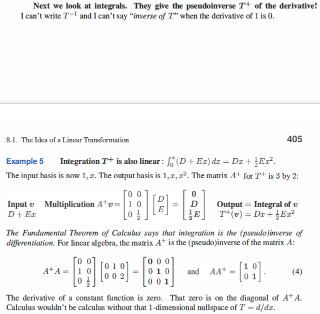</kbd>

> [!NOTE]
> QUAY LẠI SAU

 

<kbd>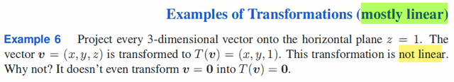</kbd>

> [!NOTE]
> Phép chiếu 3-D vector lên mặt phẳng z = 1 thì vector (x, y, z) trở
> thành (x, y, 1)
>
> Và đây ko phải linear transformation.
>
> Là sao nhỉ?
>
> Thì gs nói rằng nó ko phải linear transformation là vì T(0) không bằng 0
>
> T(0) = T(0e1 + 0e2 + 0e3) phải = 0T(e1) + 0T(e2) + 0T(e3) =0  nếu muốn
> là một linear transformation

 

<kbd>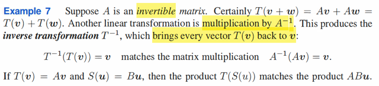</kbd>

> [!NOTE]
> Xét A là invertible matrix. Một linear transformation gs cho biết, đó
> là T(u) = Ainv u
>
> Dĩ nhiên là vì nó vẫn thỏa T(αu + βv) = Ainv (αu + βv) = α Ainv u 
> + β Ainv v = α T(u) + β T(v)
>
> Có điều ta nói thêm rằng cái linear transformation này nó sẽ đảo
> ngược quá trình transformation bởi T(v) = Av
>
> Thật vậy nếu gọi T'(v) = Ainv v, T(v) = Av thì:
>
> T'(T(v)) = Ainv Av = v. Kết quả của T(v), tức Av, đã bị reverse thành
> v

 

<kbd>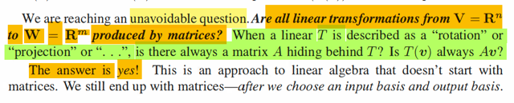</kbd>

> [!NOTE]
> Và rất tự nhiên ta dẫn đến một câu hỏi: À thế thì có phải là MỌI 
> LINEAR TRANSFORMATION từ V (vector space) R^n TỚI W 
> (vector space) R^m ĐỀU CÓ THỂ ĐẠI DIỆN BỞI MỘT MATRIX
> A NÀO ĐÓ HAY KHÔNG.
>
> Hay nói cách khác, phép xoay (rotation, mà ta xác nhận là linear
> transformation) có một matrix A nào đó đứng sau ko.
>
> Và câu trả lời là CÓ

 

<kbd>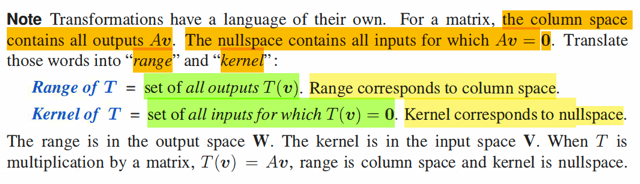</kbd>

> [!NOTE]
> rất hay, ở đây mình học khái niệm range và kernel của T(v)
>
> Rất đơn giản thôi, ta biết Av nằm trong C(A), C(A) chứa mọi kết quả 
> của T(v) = Av. Thì người ta gọi mọi output của T(v) là range of T(v).
> Dĩ nhiên đó là nói chung với T(v), tức transformation nói chung. Còn
> khi linear transformation T(v) = Av thì range của T(v) dĩ nhiên chính
> là C(A).
>
> Tương tự. Ta biết nullspace của A chính là tập mọi v khiến Av = 0.
> Thì với T, người ta gọi tập con của input space mà khiến T(v) = 0
> là kernel của T. Dĩ nhiện khi T(v) = Av thì kernel của T chính là N(A)

 

<kbd>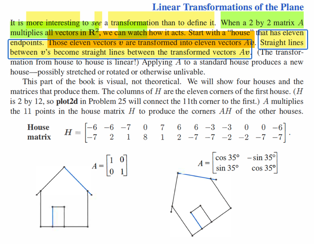</kbd>

> [!NOTE]
> Ok, đại khái là gs cho rằng bằng cách quan sát kết qủa của
> transformation bởi matrix A 2x2 đối với mọi vector trong R^2. Xét cái
> hình ngôi nhà, tạo bởi 7 điểm (vector). Chúng sẽ được transform
> bởi T(v) = Av thành 7 vector trong output space.
>
> Đường thẳng nối 2 điểm sẽ trở thành đường thẳng nối hai điểm ví
> dụ v1, v2 sẽ trở thành đường thẳng nối T(v1), T(v2). Vì sao?
>
> Vì tập mọi điểm của đường thẳng đi qua v1, v2 chính là gì: affine
> combination của v1,v2: {u: u = αv1 + (1 - α)v2} (nếu α phải nằm
> trong [0,1] thì ta sẽ có convex combination, và tập này sẽ line
> segment, tức đoạn thẳng giữa v1, v2)
>
> Thế thì, khi transform bởi T(v) = Av, các điểm này sẽ trở thành:
>
> {w: w = Au, u = αv1 + (1 - α)v2} = {w: w = A(αv1 + (1 - α)v2)}
>
> = {w: w = A(αv1 + (1 - α)v2)}
>
> = {w: w = αAv1 + (1 - α)Av2}
>
> = {w: w = αT(v1) + (1 - α)T(v2)} và đây chính là tập mọi điểm  trên
> đường thẳng đi qua T(v1), T(v2)
>
> Gs cho hai linear transformation, đại diện bởi hai matrix A, một cái
> là phép "giữ nguyên": A = [1, 0; 0, 1] là identity matrix, biến đổi 
> bởi nó, chỉ ra chính nó.
>
> Ta thấy cột 1 của A là [1, 0], mà ta đã hiểu rằng đây chính là tọa độ
> của kết quả biến đổi của basis thứ nhất: e1, trong hệ basis cũng là
> e1, e2. Nói cách khác, nếu xét input và output space đều dùng basis
> là e1, e2. Thì T(e1) = Ae1 = 1e1 + 0e2 = e1.
>
> Và T(e2) = 0e1 + 1e2 = e2
>
> Như vậy vì T(e1) = e1, và T(e2) = e2
>
> Nên dĩ nhiên là với mọi u = αe1 + βe2 (tức linear combination của
> input space basis) sẽ trở thành T(u) = αT(e1) + βT(e2)
> và theo kết qủa trên, nó là αe1 + βe2 và cái này cũng chính là u,
> là chính nó.
>
> À, như vậy mình hiểu sâu hơn: SỞ DĨ LINEAR TRANSFORMATION
> BỞI A = I LÀ PHÉP TRANSFORMATION RA CHÍNH NÓ. LÀ VÌ,
> NÓ TRANSFORM CÁC BASIS THÀNH CHÍNH NÓ. (nếu xét input 
> space và output space xài chung basis là standard basis)

> [!NOTE]
> Còn xét qua transformation thứ 2: Phép xoay.
>
> Ta sẽ thấy rằng, vì sao mọi điểm u sẽ bị xoay bởi T(v) = Av:
>
> Để check phép xoay ta sẽ check: bảo toàn góc, và bảo toàn norm.
>
> Check norm trước: Check norm của vector u trước và sau khi biến đổi bởi T(v)
>
> u = (u1, u2) như đã biết, có bản chất mang ý nghĩa là  u = u1e1 + u2e2
>
> Hãy xem T làm gì với e1, e2:
>
> T(e1) = Ae1 = [cos 35, sin 35] * 1 + [-sin 35, cos 35] * 0
>
> = [cos 35, sin 35]
>
> cos θ (e1, T(e1)) = e1TT(e1) / ||e1|| ||T(e1||
>
> = (cos 35 * 1 + sin 35 * 0) / 1 * 1 = cos 35
>
> ⇨ θ = 35 độ
>
> T(e2) = Ae2 = [-sin 35, cos 35] * 0 + [-sin 35, cos 35] * 1
>
> = [-sin 35, cos 35]
>
> Tất nhiên T(e1) = cos 35 e1 + sin 35 e2
>
> và T(e2) = -sin 35 e1 + cos 35 e2
>
> norm của hai cái này dễ thấy đều bằng 1.
>
> Ta sẽ phân tích ||T(u)|| = ||u|| từ góc nhìn nguyên nhân là T(e1) và T(e2):
>
> u = u1e1 + u2e2.
>
> theo **công thức tam giác** thì **||u||^2 = ||u1e1||^2 + ||u2e2||^2 + 2||u1e1|| ||u2e2|| cos(e1,
> e2)**
>
> = u1^2||e1||^2 + u2^2||e2||^2 + u1u2 ||e1|| ||e2|| cos(e1,e2)
>
> Và T(u) = u1T(e1) + u2T(e2)
>
> thì ||T(u)||^2 = ||u1T(e1)||^2 + ||u2T(e2)||^2 + ||u1T(e1)|| ||u2T(e2)|| cos(T(e1),T(e2))
>
> = u1^2||T(e1)||^2 + u2^2||T(e2)||^2 + u1u2 ||T(e1)|| ||T(e2)|| cos(T(e1),T(e2))
>
> Mà T(e1) có cùng norm với e1, T(e2) có cùngnorm với e2 và
>
> góc giữa T(e1) và T(e2) cũng bằng góc giữa e1, e2.
>
> nên = ||T(u)||^2 = u1^2||e1||^2 + u2^2||e2||^2 + u1u2 ||e1|| ||e2|| cos(e1),e2)
>
> và cái này chính là ||u||^2
>
> Do đó với mọi u = u1e1 + u2e2 thì norm T(u) vẫn bằng norm u
>
> Góc giữa u và T(u):
>
> góc giữa u và T(u)
>
> cos θ(u, T(u)) = uT(T(u)) / ||u|| ||T(u)||
>
> = [u1(cos 35 u1 - sin 35 u2) + u2(sin 35 u1 + cos 35 u2)]
>
> / ||u||*√[(cos 35 u1 - sin 35 u2)^2 + (sin 35 u1 + cos 35 u2)^2]
>
> = [cos 35 u1^2 + cos 35 u2^2]
>
> / ||u|| √[(cos 35^2 u1^2 + sin 35^2 u2^2 + sin 35^2 u1^2 + cos 35^2 u2^2]
>
> = [cos 35 (u1^2 + u2^2)]
>
> / ||u|| √[(cos 35^2 + sin 35^2) u1^2 + (sin 35^2 + cos 35^2) u2^2]
>
> = [cos 35 (u1^2 + u2^2)^2] / ||u|| √(u1^2 + u2^2)
>
> = cos 35 ||u||^2] / ||u||^2
>
> = cos 35
>
> ⇨ góc giữa u và T(u) vẫn là 35 độ và norm T(u) vẫn bằng norm u

 

<kbd>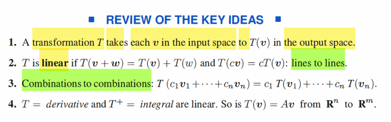</kbd>

 

<kbd>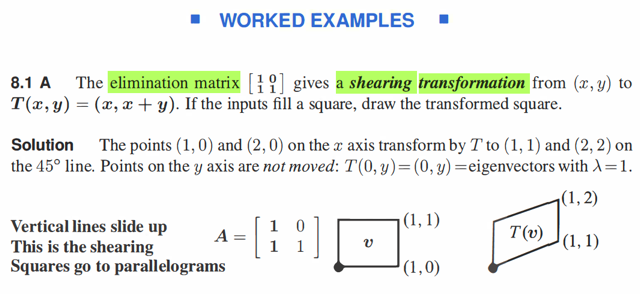</kbd>

> [!NOTE]
> Trước tiên, trước khi đi vào ví dụ, mình tự hỏi tại sao [1 0; 1 1] gs
> gọi là elimination matrix?
>
> Nhớ lại, elimination matrix là gì. À thì nó gắn với Gaussian elimination.
> Trong đó ta biến đổi A thành row echelon form: U và quá trình này
> thật ra là một chuỗi các phép biến đổi bởi các matrix E: Ví dụ En...E2E1A
>
> và gom chung lại là EA
>
> Thế thì, ta đã biết, góc nhìn quan trọng khi nhân E với A là: row i của EA
> chính là linear combination các row của A, với coefficient là các components
> của row i của E.
>
> Do đó, EA's row 1, chính là 1 * A's row 1 + 0 * A's row 2. Và đây cơ bản
> chính là nói rằng: giữ nguyên row 1 của A (trong quá trình elimination), vì đã
> dạng ok.
>
> Còn EA's row 2, chính là 1 * A's row1 + 1 * A's row 2. Và đây cơ bản chính
> là nói rằng, thay hằng 2 của A bằng hàng 1 của A cộng cho hàng 2 của A

 

<kbd>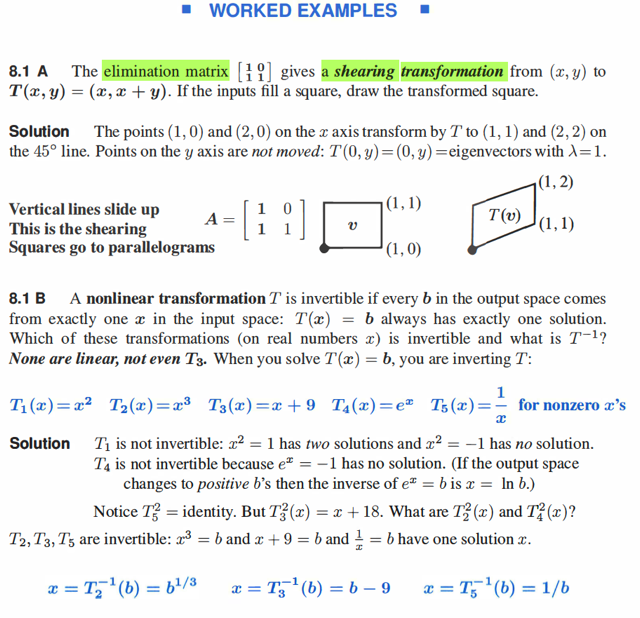</kbd>

> [!NOTE]
> QUAY LẠI SAU

 

