# 8.2 The Matrix Of Linear Transformation

📊 **Progress:** `21` Notes | `26` Screenshots

---

<kbd>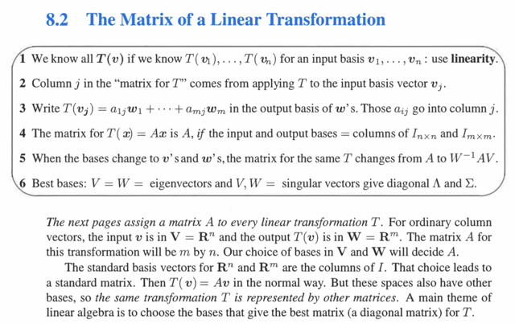</kbd>

> [!NOTE]
> Ở đây có một điểm tuy đơn giản mà đến giờ mới  hiểu. Và cụ thể được gs nói ở
> đây: Như ta biết trong bài giảng rằng khi tạo một matrix A thực hiện việc linear
> transform T(v). Thì ta sẽ transform các input basis, thể hiện tọa độ của nó theo 
> output basis và để kết qủa "vào" các cột của A: [T(v1) T(v2) ... T(vn)]
>
> Để rồi từ đó mọi vector v = (c1,c2..cn) = c1v1+c2v2+... cnvn, khi được nhân với A,
> thì sẽ có Av = [T(v1) T(v2) ... T(vn)][c1, c2...cn] = c1T(v1) + .. cnT(vn)
>
> tức là từ vector c1v1+c2v2+...cnvn trở thành T(v) = c1T(v1) + .. cnT(vn)
>
> Hoàn toàn khớp với quy tắc của linear transformation:
>
> T(Σ civi) = Σ ci T(vi)
>
> Vậy thì ý mà "giờ mới hiểu" ở đây, đó là khi input basis và output basis là các
> standard basis của Rn và Rm, tức là các cột của các Identity matrix nxn và mxm.
> Thì matrix A đại diện / thực hiện một linear transformation về cơ bản chính là đã có
> các cột là kết quả của việc transform các basis của input space V rồi T(v1), T(v2)...
>
> Ví dụ lấy một linear transform: Xoay một góc 90 độ trong R2, tức là input  space V
> và output space W đều là R2: Thì thật ra ta sẽ làm như vậy (để có matrix A giúp làm
> cái linear transformation trên):
>
> Lấy standard basis v1: (1,0), thì kết quả khi xoay nó trong output basis (cũng là u1
> = v1 = (1,0) và u2 = v2 = (0,1)) là gì?
>
> => Dễ thấy trong R2 khi xoay vector (1,0) một góc 90 độ thì ta có (0,1). Và đây
> cũng là tọa độ của nó trong output basis, vì output basis cũng là v1, v2. Vậy T(v1) =
> (0,1)
>
> Tiếp, lấy standard basis v2: (0,1) thì tương tự, T(v2) sẽ là (-1,0)
>
> Và ta đặt hai vector này làm thành 2 cột của A: A = [T(v1) T(v2)]
>
> Thế thì khi đó, việc xoay một vector v = (c1, c2) chính là:
>
> i) v = (c1, c2) tức là v = c1v1 + c2v2, là linear combination của v1, v2 với hệ số c1,
> c2
>
> ii) thì T(v) sẽ phải là linear combination của T(v1) và T(v2) với cùng bộ hệ số c1, c2.
>
> iii) Và với việc A có hai cột là T(v1), T(v2) thì Av = [T(v1) T(v2)] (c1,c2) cho ra
> c1T(v1) + c2T(v2) là hoàn toàn "đúng" (ý nói cách xây dựng A làm matrix cho linear
> transformation là đúng)
>
> Vậy thì, nhìn A là matrix [0 -1; 1 0] thì cột 1 của nó (0,1) chính là T(v1) theo cách
> nhìn ở trên, đó là "lôi v1 = (1,0) ra, xoay nó 90 độ thì được vector (0,1). Nhưng, dĩ
> nhiên nó cũng là Av1, vì v1 = (1,0) khi nhân với A sẽ chỉ lấy cột 1 của A: [cột 1 cột
> 2](1 0) = 1*cột 1 + 0*cột 2 = cột 1 Và tương tự v2 = (0,1) thì cũng chính là Av2, vì v2
> = (0,1) khi nhân với A sẽ chỉ lấy cột 2 của A: [cột 1 cột 2](0 1) = 0*cột 1 + 1*cột 2 =
> cột 2
>
> Tóm lại: Tuy đơn giản nhưng ta hiểu rằng việc matrix A = [0 -1; 1 0] giúp xoay
> không gian 90 độ là tại sao (là tại vì hai cột của nó chính là kết quả của việc xoay
> hai basis vector T(v1) T(v2). Nên khi nhân A với vector v bất kì, thì với v nào, thì nó
> cũng là một linear combination của v1, v2 với bộ hệ số c1, c2 (c1v1 + c2v2), để rồi
> khi nhân v=(c1, c2) với A, dựa vào bản chất phép nhân Av là linear combination của
> các cột của A với hệ số c1, c2. Thì  ta có kết quả Av là c1*cột 1 + c2*cột 2 =
> c1*T(v1) + c2*T(v2) hoàn toàn đúng quy luật của linear transformation để có thể tin
> rằng Av chính là xoay v  một góc 90 độ
>
> Do đó trong phần đầu gs nói khi KHÔNG NÓI GÌ, TỨC LÀ TA ĐANG MẶC ĐỊNH
> NÓI RẰNG TA ĐANG DÙNG STANDARD BASIS. Thì một linear transformation
> sẽ được thể hiện bởi matrix A m,n và đây là STANDARD MATRIX. VÀ T(v) = Av 
> IN NORMAL WAY ý là bản chất mỗi cột của A đã là một T(vi) - transform basis vi
> và thể hiện bởi basis u1,...un rồi.
>
> Nhưng khi ta chọn basis khác, thì cũng phép xoay 90 độ đó, nhưng matrix A sẽ khác
> và có nhưng basis khiến matrix A trở thành đặc biệt hơn, ví dụ diagonal. (diagonal
> thì tốt, thì ít tốn kém, đại khái vậy)

 

<kbd>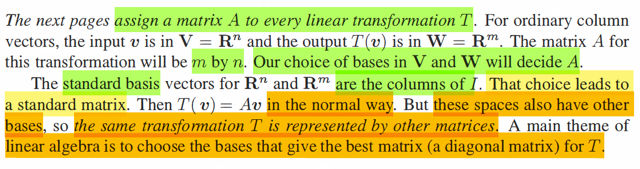</kbd>

> [!NOTE]
> đại khái là, phần trước ta đã đi đến một điểm, đó là trả lời câu hỏi rằng
> liệu có phải là mọi linear transformation từ R^m → R^n đều có thể đại
> diện bởi / đứng đằng sau là một matrix A nào đó không. Thì câu trả lời
> gs cho rằng: Đúng là như vậy.
>
> Và dù ở đây gs chưa nói đến cách làm (tìm matrix A), nhưng trong bài 
> giảng mình đã biết. Đó là ta sẽ chuẩn bị hai bộ basis vector của input
> space và output space. Để rồi, ta sẽ "Transform basis vector ui của 
> input space, để có T(ui), rồi thể hiện nó dưới dạng linear combination
> của các output space basis vj. Và đặt các coefficient làm cột i của matrix
> A.
>
> Khi đó, ta sẽ có matrix A giúp tạo ra vector coefficients của mọi T(u).
>
> Thế thì vấn đề là, như ta đã biết, mỗi vector space không phải chỉ có
> một basis. Mà nó có thể có vô số basis. (vì chỉ cần thỏa: 1) có đủ số
> vector và 2) các vector độc lập).
>
> Như vậy, cùng là một phép linear transformation T(v), nhưng với các cách
> chọn basis khác nhau, ta sẽ có các matrix đại diện cho nó khác nhau.
>
> Cần nhấn mạnh lại lần nữa, cùng một phép biến đổi tuyến tính T(v) nào
> đó, ví dụ như R^m → R^n với m = n, xoay góc 90 độ chẳng hạn thì có thể
> biểu diễn, đại diện bởi nhiều matrix A khác nhau, tùy theo việc ta chọn
> basis là gì.
>
> Thế thì, ý quan trọng cần hiểu ở đây là: Khi ta nhắc đến một phép nhân
> matrix thông thường, ví dụ với matrix  A = [0, 1; 1, 0] thì nó chính là đang
> ngầm hiểu ra dùng standard basis cho input space và output space.
>
> Nhưng như đã nói, cùng một phép biến đổi tuyến tính, ta có thể có matrix
> khác, nếu chọn basis khác. Có nghĩa là hoàn toàn có thể có matrix B khác
> với A những cũng thực hiện cùng một biến đổi

 

<kbd>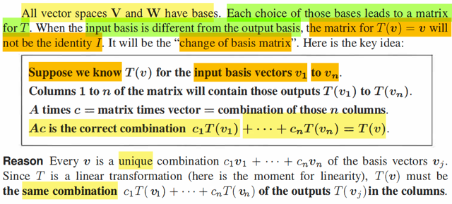</kbd>

> [!NOTE]
> đây chính là cái vừa nói hồi nãy. Nếu ta chọn basis khác cho input và
> output space V và W thì khi đó phép biến đổi T(v) = v ko còn đơn giản
> là identity matrix nữa.
>
> Và cách làm thì mình đã nói hồi nãy rồi: Mỗi cột của matrix A sẽ là tọa
> độ trong output space của kết quả biến đổi đối với một basis vector
> của input space và dĩ nhiên tọa độ thì có nghĩa là hệ số của linear
> combination các output space basis giúp tạo ra kết  quả biến đổi đó
>
> Ở đây gs giải thích tại sao lại làm vậy (khi xây dựng matrix) thì ta đã
> hiểu rồi:
>
> Đó là vì, nếu như các cột của matrix biến đổi được xây dựng như vậy
> tức là cột j của A là vector tọa độ của T(vj) trong output space với basis
> là u1,...um thì có nghĩa là T(vj) = a1j u1 + a2j u2 + ...amj um
>
> Thì khi biến đổi u, với u là (u1,...un) mà ta ngầm hiểu rằng đó là nói về
> tọa độ của nó, còn bản chất u = u1v1 + u2v2 + ...unvn
>
> thì T(w) = Aw = linear combination các cột của A:
>
> = Aw = w1 A's col1 + w2 A's col2 + ..
>
> = w1 T(v1) + w2 T(v2) + ...
>
> = w1 (a11u1 + a21u2 + ..am1um) + w2 (a12u1 + a22u2 + ..am2um) + ...
>
> = (w1 a11 + w2 a12 + ...) u1 + (w1a21 + w2a22 + ...) u2 + ...
>
> = [w1 T(v1)_1 + w2 T(v2)_1 + ...] u1 + [w1 T(v2)_1 + w2 T(v2)_2 + ..]u2 +..
>
> ⇨ coordinate của T(w) trong output space basis u1,u2 là:
>
> [w1 T(v1)_1 + w2 T(v2)_1 + ..., w1 T(v2)_1 + w2 T(v2)_2 + .., ...]
>
> Thế thì, ta mới nhớ rằng:
>
> nếu là một phép biến đổi tuyến tính, thì T(w) với w = w1v1 + w2v2 + ..
> sẽ phải cho ra T(w) = w1T(v1) + w2T(v2) + ...
>
> Vậy thì kết quả trên chính là như vậy

 

<kbd>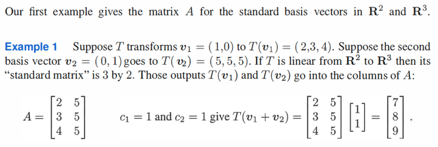</kbd>

> [!NOTE]
> đây cho một ví dụ về standard matrix đại diện của một phép biến
> đổi tuyến tính.
>
> Thì phải hiểu thế này, một khi mà ta đã xác định được kết quả của
> phép biến đổi tuyến tính ĐỐI VỚI CÁC BASIS VECTOR, thì coi 
> như TA ĐÃ XONG, ĐÃ BIẾT / SẼ BIẾT KẾT QUẢ CỦA PHÉP BIẾN
> ĐỔI TUYẾN TÍNH VỚI VECTOR BẤT KÌ TRONG INPUT SPACE.
>
> Do đó ở đây ta thấy người ta định ra / mô tả một phép biến đổi biến tính 
> BỞI KẾT QUẢ KHI BIẾN ĐỔI CÁC BASIS.
>
> Bên cạnh đó, lại phải nhấn mạnh  / nhắc lại rằng, khi ta ko nói gì về
> basis của input / output space, thì ngầm hiểu đang dùng standard basis.
> Và matrix (đại diện cho phép biến đổi tuyến tính) xây dựng từ đó, gọi 
> là standard matrix.
>
> Thế thì ở đây, phép biến đổi tuyến tính được mô tả như sau:
>
> v1 = (1,0), tức standard basis thứ nhất biến thành T(v1) = [2,3,4]
> v2 = (0,1), tức standard basis thứ hai, biến thành T(v2) =  [5,5,5]
>
> Dừng lại một chút:
>
> Thì ở đây phải hiểu là:
>
> T(v1) = 2u1 + 3u2 + 4u3 và T(v2) = 5u1 + 5u2 + 5u3. 
>
> Tức là thể hiện kết quả biến đổi v1, v2 bởi linear combination của các
> output basis, mà ở đây output basis là các standard basis của R^3.
>
> Mà vì đang dùng standard basis (R^2, và R^3) nên phép biến đổi này
> mới đại diện bởi matrix A = [2 5; 3 5; 4 5]. Chứ nếu ta dùng basis khác,
> thì ta sẽ có matrix khác, vẫn đại diện cho phép biến đổi này thôi.

 

<kbd>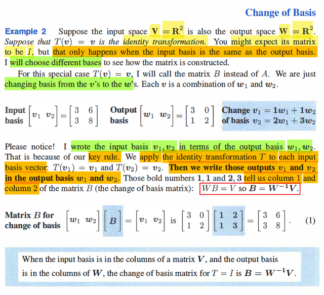</kbd>

> [!NOTE]
> Đại khái giả sử ta có input space V = R^2 và output space W cũng là
> R^2. Và dùng identity transformation. Thì gs nói ta có thể đang kì vọng
> rằng matrix (đại diện cho linear transformation) này là Identity. Nhưng
> thật ra sai, VÌ NÓ SẼ CHỈ ĐÚNG NẾU TA CHỌN HAI BỘ BASIS
> GIỐNG NHAU.
>
> Để khái quát, ta gọi v1,v2 và w1,w2 là basis của input và output space.
>
> Như quy tắc xây dựng matrix đại diện cho linear transformation đã biết,
> ta sẽ: lấy kết quả biến đổi của basis vector thứ j của input space, và thể
> hiện nó dưới dạng linear combination các output space basis, thì cột j
> của matrix chính là các coefficient của linear combination này.
>
> Vậy thì vì đang xét identity transformation T(v) = v. Nên cơ bản việc ta
> cần làm chỉ là, thể hiện v1, v2 bởi linear combination của w1, w2 và lấy
> các bộ coefficient đặt vào cột của matrix.
>
> Gọi matrix là B, thì khi đó ta có:
>
> v1 = linear combination các u1, u2 với coefficient là cột 1 của B.
>
> Đây chính là gì? ⇨ v1 = [u1, u2][cột 1 của b] vì theo góc nhìn nhân
> matrix với vector đã học trong class này (1806), thì matrix [u1, u2] (hai
> cột là u1, u2) nhân với vector "cột 1 của B" thì kết quả chính là linear
> combination của u1,u2 với coefficient là các component của cột 1 của
> B.
>
> Tương tự, v2 = [u1,u2][cột 2 của B]
>
> Và thể hiện cùng lúc hai điều trên chính là: [v1, v2] = [u1, u2][cột 1, cột
> 2]
>
> Đây chính là V = WB
>
> Và từ đó ta có B = WinvV (W dĩ nhiên là invertible vì các cột của nó là
> basis của R^2)
>
> Và tại đây có thể dừng lại để thấy, nếu chọn cùng một basis cho input
> và output space,  tức W = V, thì khi đó B = WinvV = VinvV = I, có nghĩa
> là, chỉ khi đó thì MATRIX ĐẠI DIỆN CHO IDENTITY
> TRANSFORMATION MỚI LÀ IDENTITY MATRIX.
>
> Một điểm lưu ý nữa, ko cần basis phải là standard basis, như trong ví
> dụ này, v1,v2 và w1,w2 ko phải là standard basis). Do đó, B KO PHẢI
> LÀ STANDARD MATRIX
>
> Và khi W khác V ta gọi B (ĐỐI VỐI IDENTITY TRANSFORMATION) là 
> CHANGE OF BASIS MATRIX

 

<kbd>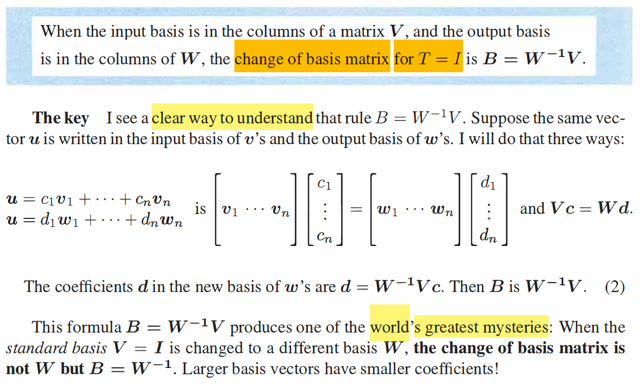</kbd>

> [!NOTE]
> Cần phải nhắc lại, là KHI TA CÓ V, W LÀ MATRIX MÀ COLUMNS LÀ
> BASIS CỦA INPUT VÀ OUTPUT SPACE. Thì B = WinvV là CHANGE OF
> BASIS MATRIX CHO PHÉP BIẾN ĐỔI IDENTITY.
>
> Chỗ này rất dễ hiểu thiếu: Ta đang nói về phép biến đổi identity, tức là T(v)
> = v. Thì phép biến đổi này, cũng có thể được đại diện bởi nhiều matrix
> khác nhau khi ta chọn các bộ basis khác nhau cho input và output space
> (mà trong trường hợp này đang xét identity transformation thì vốn là cùng
> một thứ). Để rồi với các bộ input / output basis khác nhau thì nếu chúng
> giống nhau, thì ta sẽ đều có Identity matrix. Nhưng nếu chúng khác nhau,
> thì ta sẽ có các change of basis matrix.
>
> ====
>
> Còn trong đoạn này thì gs giải thích công thức B = Winv V theo cách khác:
>
> Là giả sử xét vector u.
>
> u = Σci vi = Σ di wi ⇔ V[c1,c2...]T= W[d1,..d2]T ⇔Vc = Wd
>
> ⇨  d, tức tọa độ của nó output space với basis mới sẽ là d = WinvVc
>
> ⇨ B = WinvV
>
> =====
>
> Và với kết luận này thì ta thấy rất rõ ràng là nếu ta ĐANG CÓ input space
> basis (V) là standard basis (mà khi đó V chính là I) THÌ, KHI TA CHỌN
> CHUYỂN SANG BASIS MỚI LÀ W..
>
> (có nghĩa là, đồng nghĩa với việc, là ta DÙNG PHÉP BIẾN ĐỔI IDENTITY,
> VỚI INPUT BASIS LÀ STANDARD BASIS, VÀ OUTPUT SPACE BASIS
> LÀ MỘT BỘ BASIS KHÁC STANDARD)
>
> ... thì khi đó, cái CHANGE OF BASIS matrix B sẽ là: WinvV = WinvI = Winv
>
> Và gs nói bí ẩn lớn nhất ý là ông nhấn mạnh rằng: À, đang dùng standard
> basis mà muốn chuyển sang dùng một bộ basis mới, thì ko phải là dùng
> matrix W đâu, mà thật ra là dùng Winv
>
> MÀ NHƯ VẬY THÌ CÓ MỘT NHẬN XÉT:
>
> Nếu basis mà ta muốn xài (output) mà càng to (nôm na là các cột của W)
> càng to, thì Winv sẽ nhỏ lại, và tức là B = Winv sẽ nhỏ lại, mà B là thứ
> mà ta dùng để tính tọa độ của cùng 1 thứ trong hệ basis mới (vì T(u))
> nên dẫn tới là tọa độ sẽ nhỏ đi.
>
> Nếu chưa hiểu thì nôm na thế này:
>
> u trong standard basis = u1e1 + u2e2, và cũng là nó (bởi identity transform)
> trong basis mới: c1w1 + c2w2
>
> Vậy thì nếu w1, w2 to lên thì c1, c2 phải nhỏ xuống, vì bản chất u vẫn chỉ
> là u

 

<kbd>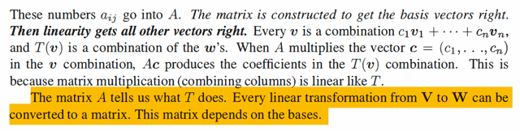</kbd>

<kbd></kbd>

<kbd>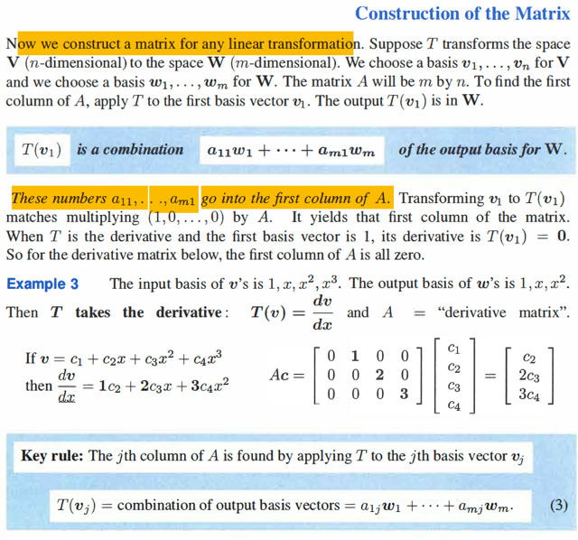</kbd>

> [!NOTE]
> Phần này đã hiểu rồi

 

<kbd>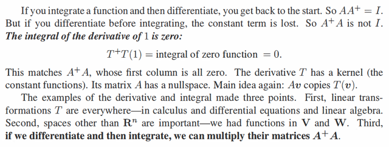</kbd>

<kbd></kbd>

<kbd>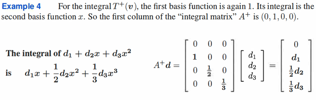</kbd>

> [!NOTE]
> QUAY LẠI SAU

 

<kbd>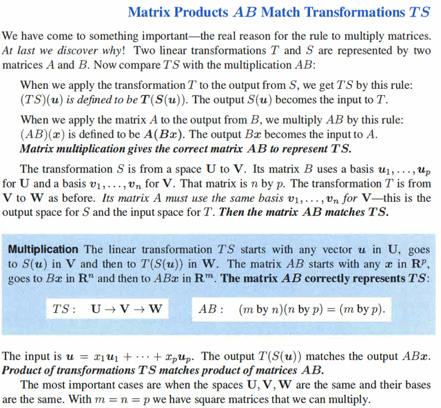</kbd>

> [!NOTE]
> phần này đại ý chỉ là gs chỉ ra rằng việc matrix A đại diện một linear 
> transformation quả thật phù hợp với quy luật là khi hợp các linear
> transformation với nhau T(.) (đại diện bởi A) và S(.) dại diện bởi B 
> thì TS(v) = T(S(v)) nó đúng là có thể đại diện bởi AB

 

<kbd>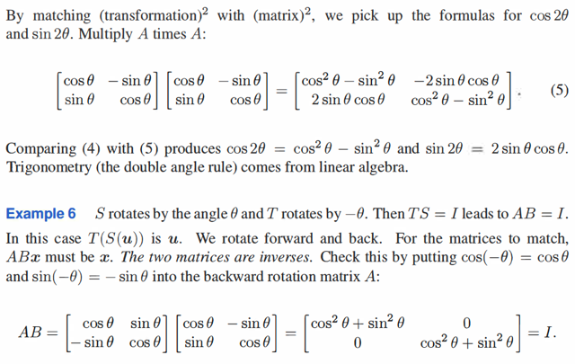</kbd>

<kbd></kbd>

<kbd>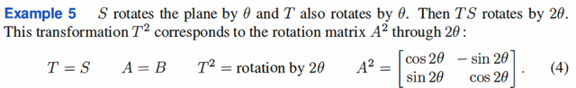</kbd>

> [!NOTE]
> ví dụ này rất hay,minh họa cho cái vừa nói. Đại khái xét T và S đều là
> phép xoay bởi góc θ (đã biết rotation là một linear transformation). Và dĩ
> nhiên chúng đều được đại diện bởi A
>
> Khỏi cần nhìn vào sách, tự tạo ra A thử coi:
>
> Nhắc lại quy luật, biến đổi các input basis, thể hiện kết quả đó bởi các
> output basis, thì coefficient chính là côt của A. Ở đây, là phép xoay, tức là
> input space và output space là một - R^2. Và ko nói gì, nên ta sẽ dùng
> standard basis e1, e2
>
> Thể hiện T(e1) = T([1, 0]) bởi basis (in/out put) e1,e2:
>
> Thì T(e1) xoay góc θ  so với e1, thì tọa độ của nó (trong R^2) là: [cos(θ),
> sin(θ)] cũng chính là cos(θ) e1 + sin(θ) e2 (again, e1, e2 là basis của
> input và output space) ⇨ cột 1 của A: [cos(θ), sin(θ)]
>
> T(e2) = T([0, 1]) thì nó xoay góc θ so với e2 thì tọa độ của nó trong R^2
> (cũng là output space) là: [-sin(θ), cos(θ)], cũng là -sin (θ) e1 + cos(θ) e2
> ⇨ cột 2 của A: [- sin θ, cos θ]
>
> Vậy là ta có A.
>
> Rồi. Thế thì, quay lại đây,cái chính là ví dụ này minh họa rằng: TS(v) =
> T(S(v)) = AAv = (A^2)v
>
> Và thử tính matrix A^2 = AA mà xem, ta sẽ thấy nó đúng là [cos 2θ -sin
> 2θ; sin2θ cos 2θ] và rõ ràng đây là matrix xoay góc 2θ.
>
> Và tương tự là xoay θ rồi xoay - θ, thì AAinv chính là I

 

<kbd>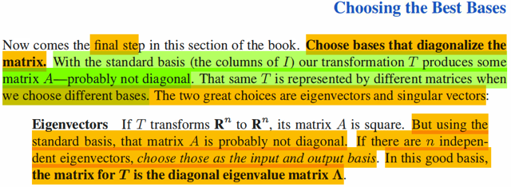</kbd>

> [!NOTE]
> rồi, qua phần này quan trọng đây.
>
> Nhắc lại lần nữa, với một phép biến đổi tuyến tính (kể cả cái đặc biệt
> là không làm gì (identity transformation) cũng sẽ có thể được biểu diễn
> bởi các matrix khác nhau, nếu như ta thay đổi input và output basis.
>
> Vậy thì giả sử xét phép biến đổi tuyến tính R^n → R^n thì đại ý là, có
> những cách chọn basis của input space R^n, output space R^n khiến
> cho matrix A có cấu trúc dễ thương hơn cách chọn khác.
>
> Và dễ thương ở đây là khi nó có cấu trúc đơn giản, ví dụ như diagonal
> matrix. và khi ta dùng nó trong các bài toán khác, thì sẽ rất lợi ích
> Cái vụ này thì trong các lớp về tối ưu mình đã thấy rồi.
>
> Vậy thì ý chính ở đây là, gs cho rằng nếu ta có đủ n eigenvector độc
> lập thì việc dùng chúng là basis, hoặc dùng singular vector sẽ tốt hơn
> là dùng các standard basis
>
> ====
>
> Bàn thêm: đầu tiên, phải để ý là ta đang xét linear transformation thuộc
> loại R^n → R^n, thì khi đó dù là matrix nào (do basis được chọn là gì)
> thì nó cũng là square matrix. Khi đó, ta sẽ có thể bàn đến eigenvector.

 

<kbd>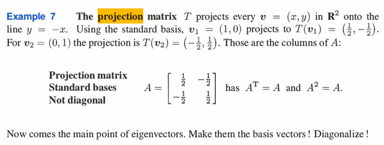</kbd>

> [!NOTE]
> Rồi, ví dụ với projection matrix T - project mọi vector v trong R^2 lên 
> đường thẳng y = -x.
>
> Thử xây dựng matrix đại diện với standard basis (cho cả input và output)
>
> Thể hiện kết quả biến basis thứ nhất T(e1) với output basis (e1, e2):
>
> Khi project e1 lên y = -x, thì nó thành vector (1/2, 1/2), cũng chính là
> khi thể hiện bởi linear combination các output basis (cũng là e1,e2) sẽ là:
>
> T(e1) = (1/2) e1 + (1/2) e2 ⇨ cột 1 của A là [1/2, -1/2]
>
> Thể hiện kết qủa biến đổi của basis thứ hai T(e2) với output basis:
>
> Khi project e2 lên y = -x, thì nó thành vector (-1/2, 1/2), cũng chính là
> khi thể hiện bởi linear combination các output basis:
>
> T(e2) = (-1/2)e1 + (-1/2)e2 => cột 2 của A là [-1/2, 1/2]
>
> Vậy là ta có matrix A
>
> Và ta thấy A là matrix đối xứng. AT = A, và A^2 = A, cho thấy đúng là
> A là projection matrix.
>
> ====
>
> Bàn thêm chút xíu: mọi vector trong R^2, sau khi linear transform bởi A
> trở thành nằm trên đường thẳng y = -x, mình dự đoán A là matrix singular.
> Rõ ràng là như vậy, đường thằng này chính là C(A), và A chỉ có một cột
> độc lập: là vector (1/2, -1/2) ⇨ rank 1, matrix suy biến.

 

<kbd>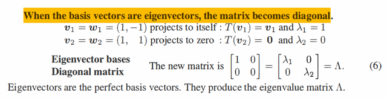</kbd>

> [!NOTE]
> Rồi, bây giờ, CŨNG VẪN LÀ PHÉP BIẾN ĐỔI TUYẾN TÍNH  ĐÓ, 
> CHIẾU LÊN y = -x NHƯNG TA CHỌN INPUT VÀ OUTPUT BASIS
> LÀ EIGENVECTORS.
>
> Vậy thì đầu tiên xem thử eigenvector là gì cái đã. MÀ KHOAN,
> sao mà biết eigenvector là gì? KHI MÀ CHƯA BIẾT MATRIX LÀ GÌ?
>
> Vì bình thường ta sẽ dựa vào characteristic equation để mà tìm 
> eigenvalue và eigenvector Ax = λx. Còn giờ chưa biết matrix là gì
> mà?
>
> À thì ta sẽ cứ dùng tính chất của eigenvector:  Ax = λx thôi.
>
> Có nghĩa là, nếu v1, v2 đang chọn là eigenvector của matrix A sắp
> xây dựng, thì ta sẽ có Av1 = λ1v1, Av2 = λ2v2
>
> Rồi, thế thì như thường lệ:
>
> Biến đổi v1, và thể hiện nó dưới dạng linear combination của output
> basis (ở đây là w1,w2 cũng là eigenvector, v1,v2 luôn, nhưng dùng
> tên khác cho dễ phân biệt thôi)
>
> v1, tức basis thứ nhất của input space, sau khi chiếu lên đường thẳng
> y = -x, thành ra tọa độ gì? ta ko biết, vì đâu có biết v1 là gì đâu.
>
> Nhưng ta nói ko biết tọa độ là gì là bởi đang nói về toạ độ với output
> basis là standard basis. Còn đây, mình đang dùng output basis cũng
> là eigenvector luôn mà.
>
> Và thì như vậy, ta có sau khi biến đổi basis thứ nhất của input space:
> v1,  ta có T(v1), mà như đã biết, nó là Av1 = λv1, và thể hiện cái này theo
> dạng linear combination của output basis w1,w2 thì nó là: Av1 = λv1 + 0v2
> = λw1 + 0w2 (v1=w1, v2 =w2)
>
> ⇨ tọa độ cảu T(v1) trong output space với basis w1,w2 là  [λ, 0]
>
> ⇨ cột 1 của A là [λ1, 0]!
>
> ====
>
> Tiếp, biến đổi v2, và thể hiện nó dưới dạng linear combination của output
> basis: T(v2) = Av2 = λ2v2 = 0*v1 + λ2v2 = 0*w1 + λ2*w2 
>
> ⇨ Cột 2 của A là [0, λ2]
>
> Vậy A là [λ1, 0; 0 λ2] quả thật là diagonal matrix!

 

<kbd>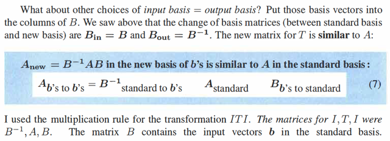</kbd>

> [!NOTE]
> vừa rồi ta đã thấy matrix đại diện cho linear transformation - project
> R^2 vector lên đường thẳng y = -x. Như đã nói, tùy vào cách chọn
> input và output basis mà ta sẽ có các matrix khác nhau.
>
> Để rồi cái đầu tiên mà ta có, là cái matrix A = [1/2 -1/2; -1/2 1/2]
> chính là cái matrix standard, vì nó là cái có được khi ta dùng
> standard basis cho input và output basis.
>
> Còn khi ta dùng eigenvector làm basis, thì cái ta có là matrix Λ, là
> một diagonal matrix (mà tí nữa ta sẽ chứng minh lại một cách tổng
> quát chứ ko chỉ là trong case cụ thể này)
>
> Thế thì ở đây gs đặt vấn đề là nếu dùng các basis cho cả input, và
> output space khác (nhưng là bộ khác, ko phải standard basis, ko
> phải eigenvector) thì sao?
>
> Thì gs nói rằng: Cách làm sẽ là: đặt các basis đó, thành  cột của B.
>
> Và lập luận sẽ là vầy:
>
> Một vector xnew nào đó trong input space nhưng ĐANG Ở HỆ TỌA
> ĐỘ BASIS MỚI (ta ghi là b's, ý là, tọa độ của xnew đang là
> coefficient của linear combination các basis b's (không phải e's -
> standard basis hay u's - eigenvector) sẽ CÓ THỂ ĐƯỢC CHUYỂN
> VỀ LẠI TỌA ĐỘ CỦA STANDARD BASIS, rồi sau đó, được BIẾN
> ĐỔI TUYẾN TÍNH BỞI MATRIX STANDARD A,  và cuối cùng,
> CHUYỂN KẾT QUẢ (BIẾN ĐỔI TUYẾN TÍNH) VỀ LẠI TỌA ĐỘ
> CỦA BASIS b's.
>
> Thế thì, câu hỏi là, xnew, có tọa độ trong hệ basis b's (mà mình biết
> tọa độ đơn giản là coefficient của linear combination thôi) thì muốn
> chuyển về tọa độ trong hệ standard basis thì chuyển làm sao.
>
> THÌ TỚI ĐÂY TA MỚI XÀI LẠI CÁI CÓ ĐƯỢC LÚC NÃY: CHANGE
> OF BASIS MATRIX.
>
> Ôn lại tí, lúc nãy, ta đã xét một IDENTITY TRANSFORMATION, T(v)
> = v. Và đặt câu hỏi là, nếu chọn input space basis là V = [v1,...vn] và
> output space basis là W = [w1,..wn] thì cái matrix đại diện cho linear
> transformation đó là gì?
>
> Thì cứ theo nguyên tắc: biến đổi input basis, thể hiện kết quả đó bởi
> linear combination các output basis, thì coefficients chính là một cột
> của matrix. Như vậy thì
>
> Thế thì, T(v1) = v1, và thể hiện bởi basis w's = [w1 w2 ...wn] [cột 1]
> tương tự T(v2) = v2 = [w1 w2...wn] [cột 2] ...
>
> ..T(vn) = vn = [w1 w2 ..wn] [cột n]
>
> ⇨ V = WB
>
> Và B = WinvV chính là change of basis matrix, giúp khi nhân với u
> là tọa độ của vector trong basis V, sẽ cho ra tọa độ vector trong
> basis W
>
> Thế thì, gỉa sử nếu ta đang có tọa độ x trong standard basis và
> muốn chuyển sang tọa độ của nó trong basis W thì sao?
>
> ⇨ à thì lúc này V chính là I, vì v's chính là e's
>
> ⇨ change of basis matrix B sẽ chính là Winv. Nhân B với x sẽ có
> tọa độ của nó trong basis w's
>
> Và dĩ nhiên là ngược lại, nếu x đang trong basis w's muốn chuyển
> ngược về lại tọa độ trong basis standard, thì change of basis matrix
> lúc này sẽ là: VinvW
>
> À, tới đây, có thể quay lại câu hỏi trên: Ta đang muốn chuyển tọa độ
> từ basis b's, về tọa độ trong basis standard (để sau đó ta dùng A để
> transform). Thì ta sẽ nhân với change of basis matrix, với basis
> input là b's (đặt thành matrix B) và basis output là e's (đặt thành
> matrix I) và change of basis matrix sẽ là: IinvB = B
>
> À như vậy, B nhân với xnew, sẽ chuyển nó về tọa độ trong standard
> basis e's
>
> Và như đã nói, ta sẽ transform nó bởi standard matrix A: Để có
> ABxnew  nhưng lúc này, đang là tọa độ trong basis standard e's
>
> Ta sẽ cần chuyển ngược lại thành tọa độ trong basis b's: Again, chỉ
> việc nhân với change of basis matrix: Và lần này basis input là b's
> (làm thành B), basis output là e's (làm thành I) ⇨ Change of basis
> matrix là: BinvI = Binv
>
> Như vậy, phép biến đổi tuyến tính (CHIẾU LÊN y = -x) trong hệ tọa
> độ basis b's sẽ là đại diện bởi matrix BinvAB
>
> ====
>
> Vậy những điều cần nhớ:
>
> một vector cụ thể nào đó là một thứ cố định, nhưng tọa độ của nó
> trong basis này nó khác, trong basis kia nó khác.
>
> Và để đổi tọa độ của x từ đang theo basis v's sang basis w thì
> ta dùng change of basis matrix WinvV
>
> Và khi đổi từ tọa độ của x từ basis b's sang standard basis e's thì 
> change of basis matrix sẽ là IinvB = B.

 

<kbd>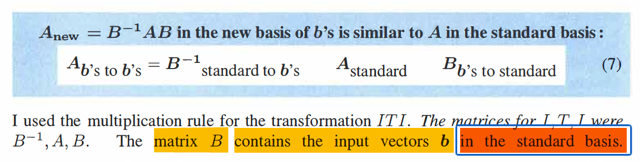</kbd>

> [!NOTE]
> À thì ra là vậy: ta đặt các basis b's thành cột của B. Và dĩ nhiên, đó chính
> là tọa độ của b's trong standard basis. Để rồi B sẽ chính là matrix đại diện
> cho phép biến đổi identity từ một vector có tọa độ trong basis b's sang
> tọa độ trong basis standard. Nên nhân B với x là tọa độ của vector trong
> basis b's thì ta sẽ có tọa độ của nó trong basis e's.
>
> Ngược lại, nhân Binv với một vector đang có tọa độ trong basis e's thì sẽ 
> có tọa độ trong basis b's

> [!NOTE]
> Vậy thì mình thử lập luận lại, tại sao khi chọn basis là eigenvector thì  ta sẽ có
> matrix đại diện cho linear transformation là matrix diagonal?
>
> Đầu tiên, điều vừa mới học được rằng, khi ta thực hiện phép biến đổi tuyến
> tính đối với vector xnew mà tọa độ của nó đang thể hiện theo basis b's, thì về
> cơ bản ta làm như sau:
>
> 1) Chuyển nó về tọa độ trong standard basis: Mà việc này thì ta đã biết muốn
> chuyển tọa độ trong basis V sang tọa độ trong basis W thì nhân bởi matrix
> WinvV, nên để chuyển tọa độ xnew trong basis b's sang tọa độ của basis e's
> thì nhân bằng matrix IinvB = B ⇨ Bxnew sẽ là tọa độ trong standard basis
>
> 2) Thực hiện biến đổi. và với A là standard matrix đại diện cho phép biến đổi,
> thì ta chỉ việc nhân A với nó: ABxnew, là KẾT QUẢ CỦA PHÉP BIẾN ĐỔI
> xnew TRONG HỆV TỌA ĐỘ STANDARD BASIS
>
> 3) Chuyển tọa độ của kết quả biến đổi từ trong standard basis về lại basis b's.
> Và cái này thì cũng không cần lập luận chi cho phức tạp, đó là chỉ việc nhân
> với Binv thôi (vì B giúp chuyển từ basis b's → basis e's thì Binv làm ngược lại
> chuyện đó)
>
> NHƯ VẬY, MATRIX ĐẠI DIỆN CHO PHÉP BIẾN ĐỔI TUYẾN TÍNH, KHI
> CHỌN BASIS INPUT VÀ OUTPUT LÀ b's CHÍNH LÀ BinvAB
>
> Thế thì khi b's là eigenvectors thì sao  BinvAB sẽ là  diagonal matrix,  ta sẽ
> xem thử có phải vậy ko:
>
> Chú ý, cột của B, tức các b's như vừa nói dĩ nhiên là tọa độ của basis b trong
> standard basis. Mà lí do tại sao thì vừa rồi đã ghi rồi
>
> Rồi, bây giờ b's là CÁC EIGENVECTOR CỦA A: CHÚ Ý, CỦA A NHÉ, TỨC
> LÀ CỦA STANDARD MATRIX, LÀ MATRIX BIẾN ĐỔI KHI BASIS LÀ
> STANDARD BASIS (chứ nếu ko của A thì là của ai)
>
> Vậy thì xét AB trước: Theo một trong các góc nhìn khi nhân matrix trong lớp
> này thì góc nhìn quan trọng là: cột j của AB là linear combination của  các cột
> của A với hệ số là các component của cột j của B
>
> Như vậy, cột j của AB là Abj, mà bj là eigenvector của A, ứng với eigenvalue
> λj nên Abj = λjbj
>
> Tương tự với các cột khác, giúp ta thấy là các cột của AB chính là λ1b1 λ2b2.
> ..
>
> Và vì λ1, λ2 là các scalar. nên có thể thể hiện matrix AB bởi: B diag(λ1, λ2...)
>
> = B Λ
>
> CHÚ Ý LÀ B phải đứng trước nhé, vì như vậy kết quả mới là [λ1b1 λ2b2...]
>
> Và bước cuối là nhân với Binv: Binv AB = Binv B Λ = Λ ⇨ MATRIX BIẾN ĐỔI
> TUYẾN TÍNH KHI BASIS IN/OUT CHỌN EIGENVECTOR CHÍNH LÀ Λ  LÀ
> MỘT DIAGONAL MATRIX

 

<kbd>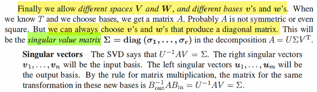</kbd>

> [!NOTE]
> thế thì nãy giờ là ta xét trường hợp của các phép biến đổi tuyến tính
> mà input space = output space. Còn bây giờ là xét những cái mà input
> space khác output space.
>
> Dĩ nhiên khi đó input basis và output basis sẽ khác số lượng.
>
> Và dẫn đến matrix linear transformation không vuông. Là sao nhỉ?
>
> À là vì như đã biết, matrix đại diện cho linear transformation sẽ được
> xây dựng bằng cách: Biến đổi basis của input, và lấy tọa độ của nó
> trong basis output (tức là lấy bộ coefficient của linear combination các
> basis output) đặt vào cột của matrix.
>
> Thế thì, giả sử phép biến đổi tuyến tính là từ R^n → R^m. Thì có n
> input basis. Với mỗi cái ta làm như trên để có một cột của A, thì A có n
> cột. Còn mỗi cột, là tọa độ của kết quả biến đổi trong basis output mà
> output basis có m vector ⇨ tọa độ có m phần tử ⇨ A có m hàng. Nên
> A là matrix m x n
>
> ====
>
> Thế thì, ở đây gs nói, dù A (phải hiểu ý là nói về matrix đại diện cho
> phép biến đổi tuyến tính, chứ ko chỉ nói về matrix standard (khi basis là
> standard basis) không vuông, nhưng ta vẫn có thể chọn basis sao cho
> matrix này nó có cấu trúc đơn giản. Như diagonal giống như khi chọn
> basis là eigenvector trong trường hợp biến đổi R^n → R^n vậy.
>
> Thế thì vì sao lại như vậy?
>
> À đơn giản thôi:
>
> Trước khi nói, ta lại nói về case R^n → R^n với basis là eigenvector.
>
> Thì bây giờ xét standard matrix A của phép biến đổi tuyến tính. Như đã
> biết, A vuông, và giả sử có đủ eigenvector độc lập (thì khi đó mới  có
> thể dùng là basis) thì ta có eigen-decomposition: A = S Λ Sinv
>
> Thế thì có thể thấy ngay quan hệ Sinv A S = Λ để rồi xét Sinv A S thì
> Sinv A S x chính là 1) chuyển tọa độ x trong eigen bases sang
> standard basis → 2) biến đổi tuyến tính bởi standard matrix → 3)
> chuyển tọa độ về lại trong eigen basis. ⇨ Và thấy ngay matrix Λ -
> diagonal matrix  là matrix biến đổi khi dùng eigen basis.
>
> ====
>
> Vậy thì quay lại đây với matrix thường (ko cần vuông), ta luôn có một
> phép phân tách: singular value decomposition.
>
> A = U Σ VT
>
> U, V là matrix m x m, n x n, các cột là orthogonal basis của columns
> space
> + left nullspace và row space + nullspace của A.
>
> Thế thì xét quan hệ A = U Σ VT, nó tương đương:
>
> AV = U Σ ⇔ UT A V = Σ
>
> như vậy nếu basis của input và  output basis là v's và u's như trên thì
> thì giả sử có x là vector có tọa độ trong basis v's, thì Ur T A Vr x sẽ làm
> 3 bước:
>
> V x chuyển tọa độ từ basis v's sang standard basis
>
> A V x thực hiện biến đổi tuyến tính.
>
> UT A Vr x cũng là U_inv A Vr x chuyển tọa độ của kết quả biến đổi sang
> basis u's.
>
> Và matrix thực hiện việc biến đổi với input basis v's output basis u's
> chính là Σ, MỘT DIAGONAL MATRIX

 

<kbd>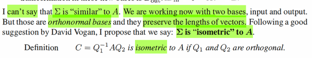</kbd>

> [!NOTE]
> gs nói trong trường hợp này thì ko thể nói Σ "similar" A, (vì theo định 
> nghĩa, similar là khi tồn tại B khiến Σ = Binv A B, còn ở đây thì ko phải)
>
> Nhưng ta có tên gọi khác cho case này: ISOMETRIC to A, mà định
> nghĩa là nếu C = Q1inv A Q2 với Q1, Q2 là orthogonal matrix thì C được
> gọi là Isometric với A
>
> Nhớ lại tính chất của orthogonal matrix: nó ko thay đổi norm: ||Qu|| = ||u||
> (rất dễ thấy ||Qu||^2 = (Qu)T(Qu) = uQTQu = uTu = ||u||^2)
>
> Thì ở đây U, V đều là orthogonal matrix như đã biết vì U chứa orthogonal
> basis của column space + left nullspace, và V chứa orthogonal basis
> của row space và nullspace

 

<kbd>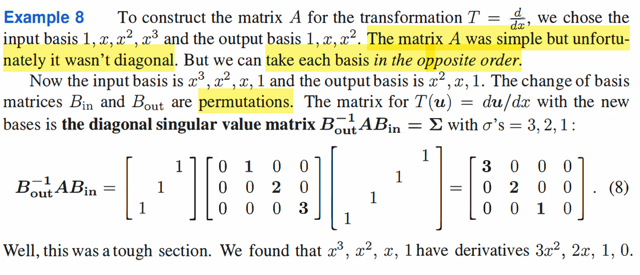</kbd>

> [!NOTE]
> Rồi, quay lại ví dụ này, trong đó mình xét phép biến đổi tuyến tính 
> T(v) = dv/dx
>
> (chuyện chứng minh đây là linear transformation thì đã làm rồi)
> và ta đã biết cách xây dựng matrix  A đại diện cho nó.
>
> input basis là 1, x, x^2, x^3. output basis là 1, x, x^2
>
> Xây dựng A:  thể hiện kết quả biến đổi của các input basis bởi
> linear combination các output basis.lấy hệ số (cũng là tọa độ
> trong output basis) bỏ vào cột của A:
>
> T(1) = d/dx 1 = 0, 0 = 0*1 + 0*x + 0*x^2 ⇨ cột 1 của A: [0, 0, 0]
>
> T(x) = d/dx x = 1, 1 = 1*1 + 0*x + 0*x^2 ⇨ cột 2 của A: [1, 0, 0]
>
> T(x^2) = d/dx x^2 = 2x, 2x = 0*1 + 2*x + 0*x^2 ⇨ cột 3 của A: [0, 2, 0]
>
> T(x^3) = d/dx x^3 = 3x^2, 3x^2 = 0*1 + 0*x + 3*x^2 ⇨ cột 4 của A: [0, 0, 3]
>
> Và ta có standard matrix A như vậy.
>
> Nhưng gs cho rằng tuy nó cũng đơn giản nhưng nó ko phải diagonal
>
> Thế thì bằng cách đổi thứ tự các basis, ta có thể có diagonal matrix
>
> Mà đổi thứ tự là sao? Tức là thay vì dùng basis 1,x,x^2,x^3 thì ta dùng
> basis . Khi đó matrix biến đổi sẽ thành diagonal
>
> Nhưng muốn đổi như vậy thì ở trên là nói bằng lời. Còn theo toán học
> phải hiểu thế này:
>
> Đó là, với x là vector đang trong tọa độ với basis x^3,x^2,x,1. 
> Khi đó matrix biến đổi sẽ thành diagonal
>
> Nhưng muốn đổi như vậy thì ở trên là nói bằng lời. Còn theo toán học
> phải hiểu thế này:
>
> Đó là, với x là vector đang trong tọa độ với basis x^3, x^2, x, 1 
>
> Ta sẽ chuyển nó sang tọa độ trong basis chuẩn: 1, x, x^2, x^3
>
> Vậy xem thử change of basis matrix là gì, cách làm như quy luật thôi:
> "Thể hiện kết quả biến đổi của input basis theo linear combination của
> các output basis, hay nói ngắn gọn là, biến đổi input basis, và lấy tọa
> độ của nó trong output basis, đặt vào làm cột của matrix". Và ở đây, như
> đã biết, ta sẽ xét phép biến đổi identity T(v) = v.
>
> T(x^3) = x^3, thể hiện trong output basis: x^3 = 0*1 + 0*x + 0*x^2 + 1*x^3
> ⇨ cột 3: [0, 0, 0, 1]
>
> T(x^2) = x^2, thể hiện trong output basis: x^2 = 0*1 + 0*x + 1*x^2 + 0*x^3 
> ⇨ cột 2: [0, 0, 1, 0]
>
> T(x) = x, thể hiện trong output basis: x = 0*1 + 1*x + 0*x^2 + 0*x^3 
> ⇨ cột 1 của change of basis matrix B: [0, 1, 0, 0]
>
> T(1) = 1, thể hiện trong output basis: 1 = 1*1 + 0*x + 0*x^2 + 0*x^3
> ⇨ cột 1 của change of basis matrix B: [1, 0, 0, 0]
>
> ⇨ Change of basis matrix từ basis x^3, x^2, x, 1  → basis 1, x, x^2, x^3: 
> [0 0 0 1; 0 0 1 0; 0 1 0 0; 1 0 0 0] như sách
>
> Và ta nhận ra đây là PERMUTATION MATRIX.
>
> Vì khi nhân cái này cho A, PA, nó sẽ đổi chỗ các hàng của A. 
>
> Vậy thì thử nghĩ xem tại sao nó lại là permutation matrix:
>
> À thì ra là vì, ví dụ như mình có x là vector có tọa độ đang trong basis
> x^3, x^2, x, 1 . ví dụ như x = (a3,a2,a1,a0) thì tức là ta có x 
> = a3*x^3 +a2*x^2 + a1*x + a0*1
>
> Nhưng mình muốn đổi tọa độ nó thành (a0, a1, a2, a3) thì dễ thấy
> một cách đơn giản là: ta muốn B[a3,a2,a1,a0]T = [a0, a1, a2, a3] thì
> rõ ràng B sẽ là matrix đổi hàng
>
> Có nghĩa là ta hiểu tại sao lại xuất hiện cái permutation matrix là vậy
>
> ====
>
> Rồi, thế thì sau khi chuyển sang basis (1,x,x^2,x^3) bởi B, thì ta lại
> thực hiện bước biến đổi bởi A. A vẫn là standard matrix, đại diện việc
> biến đổi trong basis chuẩn (1,x,x^2,x^3)
>
> Sau đó, ta sẽ chuyển về lại basis x^2, x, 1 bởi [0 0 1; 0 1 0; 1 0 0]

 

<kbd>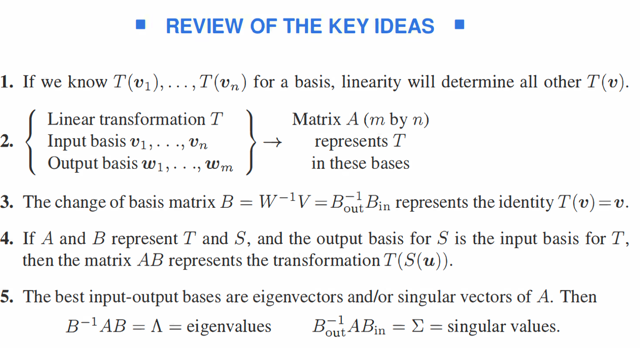</kbd>

> [!NOTE]
> Tự lẩm nhẩm lại cho nhớ vì cái này CỰC KÌ QUAN TRỌNG.
>
> 1) Quy tắc xây dựng matrix biến đổi tuyến tính: Biến đổi input basis
> và thể hiện kết quả bởi linear combination của output basis, tức lấy
> tọa độ của kết quả trong hệ output basis, bỏ vào cột của A.
>
> 2) Thế thì khi biến đổi identity: Input basis là b's, output basis là
> e's: Thì theo quy tắc trên: Thể hiện kết quả biến đổi của input basis 
> (cũng chính là input basis, vì đang xét biến đổi identity) theo standard
> basis. Và vốn sẵn tọa độ của input basis b's đã đang là theo standard
> basis rồi ⇨ bỏ nó làm cột của matrix, ta có matrix B, chính là change
> of basis từ b's → e's.
>
> Có nghĩa là, với các basis b's thì tạo matrix B với các cột là b's thì 
> ta có ngay change of basis matrix từ b's → e's. TỪ đó nhân B với
> x là tọa độ trong basis b's ta sẽ có tọa độ trong basis e's
>
> Và dĩ nhiên chuyển từ e's → b's thì dùng Binv.
>
> Tóm lại: b's → e's : Dùng B
>
> e's → b's: Dùng Binv
>
> Và một điểm lí thú nhận ra chỗ này: B, có các cột là b's. vốn là tọa độ
> của các basis này trong standard basis. Vậy thì theo quy tắc trên, chuyển
> nó thành tọa độ trong basis b's thì bằng cách nhân với Binv: BinvB = I
> À, chính là phải vậy, TỌA ĐỘ CỦA CÁC BASIS b's TRONG BASIS b's
> dĩ nhiên phải y như các e's ([1,0...0], [0, 1...0],...)
>
> 3) Còn change of basis matrix từ basis v's sang basis w's?
>
> Thì thật ra với cách hiểu 2) thì nó trở thành rất đơn giản:
>
> Từ v's → w's chứ gì? Ta hãy làm hai bước:
>
> Từ v's → e's: Dùng matrix V.
>
> Và từ e's → w's: Dùng Winv
>
> Vậy từ v's → w's: Chính là WinvV
>
> 4) Vậy thì matrix biến đổi tuyến tính A thông thường, chính là dùng input
> và output basis đều là e's, và nó gọi là standard matrix.
>
> Nhưng nếu dùng input basis b's và output basis b's?
>
> Thì ta lại làm hai bước:
>
> 1) Chuyển tọa độ x đang trong basis b's sang e's: Bx
>
> 2) Biến đổi tuyến tính trong standard basis: dùng A: ABx
>
> 3) Chuyển kết quả, đang trong standard basis về lại basis b's: Dùng Binv:
>
> ⇨ matrix linear transformation với input và output basis b's: BinvAB
>
> VÀ TỚI ĐÂY MÌNH NHẬN RA MỘT ĐIỂM QUAN TRỌNG:
>
> THEO ĐỊNH NGHĨA NÓI C SIMILAR VỚI A LÀ KHI TỒN TẠI B SAO CHO:
> C = BinvAB THẾ THÌ ĐIỀU NÀY CÓ NGHĨA LÀ C VÀ A CÙNG ĐẠI DIỆN
> CHO CÙNG MỘT LINEAR TRANSFORMATION
>
> 5) Chính là bàn về nếu A symmetric, A = Q Λ QT
>
> thì khi đó Ax sẽ là gì? → Q Λ QTx
>
> QTx (cũng là Qinvx): chuyển tọa độ của x, đang trong basis e's sang basis
> q's, chính là các eigenvector.
>
> Λ QTx: Thực hiện biến đổi tuyến tính: Cụ thể là kéo giãn theo các phương
> của eigenvector q, với stretching factor tương ứng là eigenvalue ứng
>
> và Q Λ QTx, đưa kết quả đang trong basis q's về lại basis e's.
>
> Và hình ảnh của cái này chính là: Xoay hệ trục đang từ hệ e's sang hệ trục
> q's. Sau đó kéo dãn không gian theo các phương trục q, và xoay ngược 
> lại về hệ trục cũ.

 

<kbd>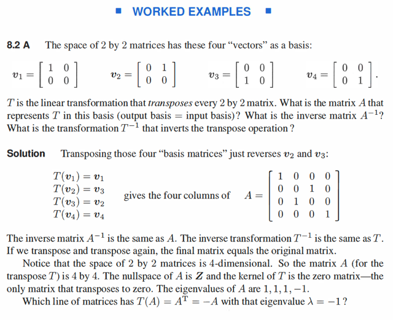</kbd>

> [!NOTE]
> QUAY LẠI SAU

 

