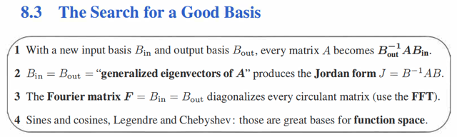
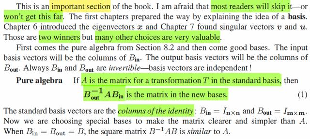
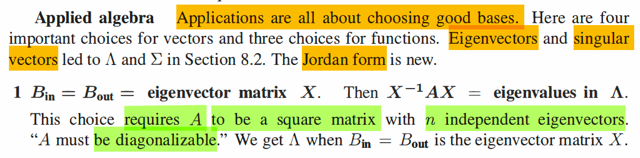
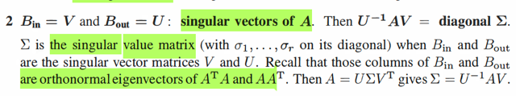

# 8.3 In Search Of Good Basis

📊 **Progress:** `3` Notes | `4` Screenshots

---

<kbd></kbd>

 

<kbd></kbd>

> [!NOTE]
> đại ý là review lại tiếp nối phần trước: Ta biết,nếu gọi A là matrix biến đổi
> tuyến  tính (khi dùng) standard basis thì Bout_inv A Bin là matrix biến đổi
> với basis input là b_in's, và basis output là b_out's
>
> Và khi B_in = B_out = B thì ta có C = **Binv A B** là **matrix biến đổi có cùng
> một phép biến đổi với A**, chỉ là trong **basis b's**
>
> Và người ta gọi là **BinvAB** là **similar với A**
>
> Có nghĩa là: Nếu A là matrix biến đổi trong standard basis thì bất kì
> Bout_inv A Bin nào đều cùng là matrix biến đổi tuyến tính, và Bout_inv A
> Bin (với Bin, Bout khả nghịch, thì gọi là **matrix tương đương** (**equivalent**)
> nhưng với basis input là bin's và basis output là bout's. Nhưng chỉ khi Bin
> = Bout thì mới là Binv A B là **similar** (**đồng dạng**) với A

 

<kbd></kbd>

> [!NOTE]
> gs cho rằng ứng dụng của cái này đều xoay quanh việc chọn good
> basis
>
> Thế thì với vector ta đã biết hai trong ba loại good basis đó là
> eigenvector và singular vectors.
>
> Thế vì với eigenvector, dĩ nhiên yêu cầu phải là matrix A phải vuông
> và có đủ n eigenvector độc lập. Khi đó chính là nó được gọi là
> diagonalizable
>
> Ôn lại cái này chút xíu. Ta đã biết về eigenvalue λ và eigenvector v:
>
> Av = λv
>
> Nếu đặt các eigenvector vi của A thành matrix V và các eigenvalue
> thành diagonal matrix Λ, ta có: AV = VΛ
>
> Thế thì khi có đủ V eigenvector độc lập, thì V sẽ là full rank matrix
> → AV = VΛ  ⇔ A = V Λ Vinv hay Vin A V = Λ
>
> Và cái này Vinv A V = Λ cho thấy gì?
>
> Cho thấy rằng, matrix Λ và A là similar matrix, cùng đại diện cho
> một phép biến đổi tuyến tính. Với Λ là matrix biến đổi trong hệ tọa
> độ basis v's, còn dĩ nhiên A là matrix biến đổi trong hệ tọa độ chuẩn
>
> Mà góc nhìn mà ta đã học sẽ là với x là vector có tọa độ trong basis
> v's thì:
>
> Vx sẽ có tọa độ trong basis e's, A V x sẽ tạo ra kết quả biến đổi
> trong basis e's. Và cuối cùng Vinv A V x sẽ chuyển ngược kết quả
> ra lại tọa độ trong basis v's
>
> Thế thì, tại sao phải cần có đủ n eigenvector? Đơn giản là vì nếu
> không có đủ n eigenvector, thì sẽ không thể có Vinv, và không thể
> có Λ = V A Vinv
>
> Và cách hiểu sâu hơn là khi có đủ n eigenvector độc lập thì v's mới
> tạo thành một basis của input space R^n từ đó V mới có thể đóng
> vai change of basis matrix từ hệ tọa độ basis v's sang hệ tọa độ 
> basis e's

 

<kbd></kbd>

> [!NOTE]
> good basis thứ hai thì ko đòi hỏi A phải vuông. Đó là dựa trên svd
> decomposition, V là orthogonal matrix của các orthogonal basis của
> C(AT) và orthogonal basis của N(A), dĩ nhiên hợp lại sẽ tạo basis của
> R^n. U là orthogonal matrix của các orthogonal basis  của C(A) và
> N(AT), hợp lại tạo basis của R^m.
>
> Và phép phân tách svd cho ta A = U Σ VT hay UT A V = Σ  cho ta một
> diagonal matrix Σ cũng đại diện cùng một linear transformation với A
> Nhưng không phải similar, mà là equivalent.
>
> Cụ thể với x là vector có tọa độ theo basis u's, V x sẽ là tọa độ của nó
> trong basis e's. Sau đó A (Vx) sẽ thực hiện biến đổi tuyến tính (dĩ nhiên
> kết quả vẫn là tọa độ trong basis e's) Cuối cùng UT A (Vx) cũng là Uinv
> A (Vx) sẽ là tọa độ của kết quả biến đổi trong basis u's.
>
> Như vậy trong case này Bin là V và Bout là U
>
> Và ta cũng đã biết left singular vector V là eigenvector của ATA và
> right singular vector matrix U là eigenvector của AAT
>
> Ôn lại chỗ này:
>
> Ta biết dù A có ko square thì ATA luôn square.
>
> Thế thì, ta với svd, ta muốn tìm một bộ orthogonal basis của rowspace
> và columns space được map với nhau qua A: Av = σu, hay với r basis
> của rowspace, ta có matrix V (n,r) và r basis của column space ta có
> matrix U (m,r) ⇨ thể hiện ở dạng matrix AV = UΣ ⇔ A = UΣVT 
>
> Chỗ này ta hiểu là, U, V chỉ chứa các basis của C(A) và C(AT), có nghĩa
> là V không chắc đã invertible. Nhưng vì các cột là orthogonal basis
> nên VVT = I: Shape: (nxr) (rxn) = I_n
>
> Nhưng để tìm vi, và uj thì phải tìm thế nào? 
>
> Câu trả lời là nhờ các matrix vuông ATA và AAT.
>
> ATA = (U Σ VT)T(U Σ VT) = V (U Σ)T U Σ VT = V ΣT UT U Σ VT
>
> = V ΣT Im Σ VT = V ΣTΣ VT
>
> ⇨ Kết quả này cho thấy đây chính là phép eigendecomposition của
> ATA với V là matrix các eigenvector và diagonal matrix các eigenvalue
> là ΣTΣ 
>
> Như vậy, eigenvector của ATA chính là right singular vector của A
>
> eigenvalue của ATA chính là bình phương của singular value của A
>
> AAT = (U Σ VT)(U Σ VT)T = (U Σ VT)V (U Σ)T = U Σ VTV ΣT UT
>
> = U ΣΣT UT ⇨ Đây chính là eigenvalue decomposition của AAT
>
> ⇨ eigenvector của của AAT cũng chính là left singular vector của A
>
> Và eigenvalue của AAT cũng là bình phương singular value của A

 

