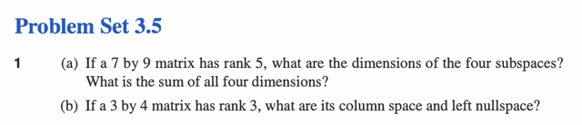
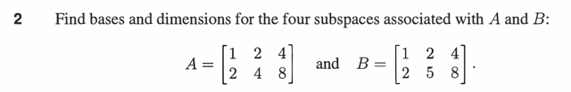
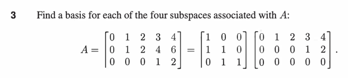

# Ps 3.5

📊 **Progress:** `0` Notes | `6` Screenshots

---

## 1. a) matrix 7x9 có rank = 5

> [!NOTE]
> 1. a) matrix 7x9 có rank = 5 
>
> i) Dimensions of 4 subspace? 
>
> ii) Tổng của các dimensions?
>
> *Lập luận: 
>
> i) Vì matrix có rank = 5: Việc có **rank = 5 suy ra matrix có 5 pivot cols cũng như
> 5 pivot rows** (cũng là số hàng hay cột độc lập trong rowspace và cols space)
> hay, cũng chính là số vector trong basis của cols space và rows space. Và đương
> nhiên ta sẽ có **dimension của cols space và rowspace đều bằng 5**.
>
> ii) Ta sẽ xét**nullspace of matrix**, thế thì matrix có **9 cols**, trong đó có **5 independent
> cols** như đã nói, **suy ra có 4 dependent cols**. Xét equation Ax=0 thì **4 dependent
> cols này ứng với 4 free variable**. Và như đã biết với 4 free variable, **lần lượt ta cho 
> mỗi cái bằng 1, và những thằng còn lại bằng 0**, sau đó thế vào (**backsubstitution**)
> để giải các pivot variable thì ta sẽ được các **SPECIAL SOLUTION**. Và CHÚNG
> SẼ TẠO NÊN **MỘT BASIS CỦA NULLSPACE**. Vậy nên số free cols/variable sẽ là số
> vector trong basis của nullspace, hay là dimension của nullspace. Vậy dim N(A) = 
> 9-5 = 4.
>
> iii) Xét nullspace của A.T hay còn gọi là**left nullspace**. Thì tương tự, số independent
> cols của A.T chính là số independent row của A (mà ta đã xác định là 5), nên A.T sẽ
> có 7-5=2 dependent cols. Và đây cũng sẽ ứng với **2 free cols/variable của A.Ty=0**
> Vậy ta cũng sẽ có 2 vector trong basis của nullspace of A.T -> dim N(A.T) = **2**.
>
> iv) Tổng dimension của cả 4 matrix là: r + r + m-r +n-r =**m+n** = **16**

<kbd></kbd>

<kbd></kbd>

 

### 1b) matrix 3x4, rank 3. Cols space và left nullspace là gì?

> [!NOTE]
> 1b) matrix 3x4, rank 3. Cols space và left nullspace là gì?
>
> *Lập luận như sau:
>
> i) cols space: matrix có rank = 3, nên nó có 3 pivot. Thế thì matrix có 4 cols, mà có 3
> pivot cols ->cũng là 3 vector trong basis của cols space -> Dimension của cols space
> là 3.
>
> ii) left nullspace: dim của left nullspace: A có 3 pivot tức có 3 pivot row, cũng là 3
> independent row. Nên A.T sẽ có 3 independent cols trong 3 cols. Vậy A.T không có
> free cols nào. Điều này dẫn đến không có vector nào trong basis của nullspace of A.T
> thành ra nullspace của A.T CHỈ CHỨ ZERO, dim của left nullspace là 0.

 

#### 2. Tìm bases và dim của 4 subspace của A, B:  *Xét A, dễ thấy cols 2,3 đều dependent col 1, suy ra chỉ có 1 pivot. Và cho phép kết luận chỉ có 1 vector trong basis của cols space và rows space nên dimension của cols space và rows space đều bằng 1.  Xét N(A), trong 3 cols chỉ có 1 linear dependent, nên 2 dependent cols của A sẽ ứng với 2 free cols / variable. Do đó có 2 special solutions -> 2 vector trong basis của nullspace of A -> dim N(A) = 2.  và tương tự, trong 2 row của A thì có 1 row là dependent - nó cũng sẽ ứng với  dependent cols của A.T vậy basis của N(A.T) có 1 vector -> dim N(A.T) = 1.   *Xét B: Dễ thấy hai row của B đều independent. Vậy có 2 pivot -> 2 pivot cols cũng như 2 pivot row. Vậy cả cols space và row space đều có dim = 2.  Thế thì xét N(B), vì B có 2 independent cols trong 3 cols nên có 1 dependent cols ứng với 1 free cols/variable. Vậy Bx=0 sẽ có 1 special solution -> basis của N(B) có 1 vector -> dim N(B) = 1.  Còn xét N(B.T), trong 2 row của B thì independent cả hai nên cả hai cols của B.T  đều independent -> không có free cols / variable -> B.Ty =0 không có special solutions -> basis của N(B.T) không có vector nào -> dim N(B.T) = 0

<kbd></kbd>

<kbd></kbd>

 

#### *Lập luận:  Xét matrix A = BC như đề bài, thì ta xem xét B trước: Thế thì ta có thể xem xét B.T: và thấy ngay nó có dạng Row Echelon, với 3 pivot. Vậy thì matrix B.T là **square** matrix **3x3** và có **3** pivot nên nó là matrix **full rank.**Và vì B.T fullrank nên có thể **suy ra B cũng full rank** (vì cols space của B.T là row space của B, row space của B.T là cols space của B).  Và một**full rank** matrix thì sẽ có tính chất **invertible**(điều này là bởi, dạng Reduced Row Echelon của nó sẽ là Identity matrix, nên ta có thể biểu diễn kết qủa của việc thực hiện elimination là nhân E matrix cho B cho ra I: EB = I, suy ra E chính là B.inv)  Thế thì, ta có thể xét nullspace của A trước, xét equation Ax = 0, cũng là BCx = 0. Nhân hai vế cho B_inv ta sẽ có Cx = 0.  Từ đây suy ra: x khiến Ax=0 cũng chính là x khiến Cx=0, nên NULLSPACE CỦA C CŨNG CHÍNH LÀ NULLSPACE CỦA A, ta sẽ đi tìm N(C) trước:  Dễ thấy với C, col 2, col 4 là pivot cols - ứng với pivot variables, col 1,3,5 là free  cols - ứng với free variables. Ta sẽ lần lượt set 1 cho các free variable (2 thằng còn lại bằng 0) và back-subtitute để tìm pivot variables. Làm vậy ta sẽ có 3 special solution như sau:  { (0 -2 1 0 0) (0 2 0 -2 1) (1 0 0 0 0) } và đây là basis của N(C) cũng là basis của N(A)

<kbd></kbd>

<kbd></kbd>

 

