# Lec 10: Expected Value

📊 **Progress:** `44` Notes | `46` Screenshots

---

## Tóm Tắt:

> [!NOTE]
> TÓM TẮT:
>
> - Chứng minh tính linearity của expectation
>
> - Negative binomial: Số failure cho đến khi có r success
>
> (Mở rộng của Geomegtric (số failure cho đến khi có success đầu) 
>
> - P(X=n) = (n+r-1 choose n) * p^r * q^n
>
> - E(X) = rq/p
>
> - Cần để ý xem quy ước là start at 0 hay 1 đối với Negative Binomial
>
> - Bài toán Putnam tính expect value của X = số chữ số là local maxima 
> trong n chữ số
>
> - St. Peterburg Paradox

 

<kbd>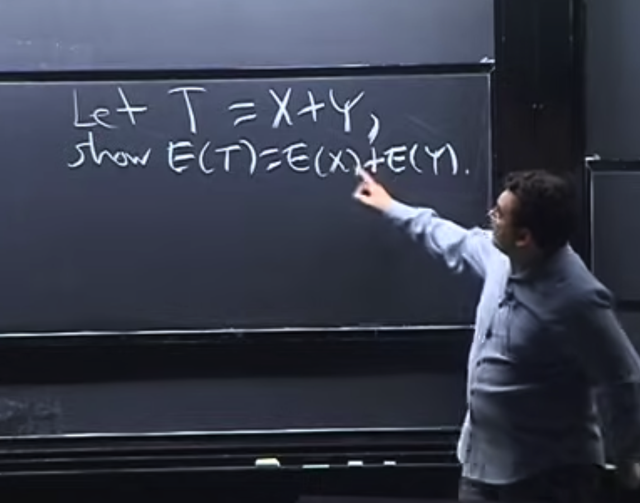</kbd>

> [!NOTE]
> Tiếp tục thảo luận về **expected value**. Gs sẽ chứng minh **Linearity
> properties**.
>
> Đầu tiên ông cho rằng **bất cứ khi nào expected value tồn tại** thì ta sẽ có
> **linearity** nói vậy là bởi vì **không phải lúc nào expected value cũng tồn tại** ví
> dụ như khi có **tình trạng diverge** gì đó.
>
> Và ở đây ta cũng **chỉ làm với discrete variable**, sau này sẽ làm nhiều hơn với
> **continuous variable**

> [!NOTE]
> CHỨNG MINH TÍNH LINEARITY
> CỦA EXPECTED VALUE

 

<kbd>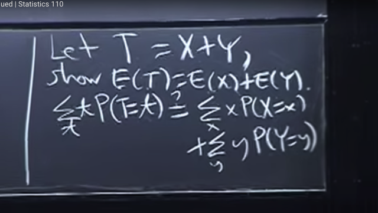</kbd>

> [!NOTE]
> **Dùng định nghĩa expected value** ta phải chứng minh dấu bằng này xảy ra
> Đó là cho T = X + Y thì E(T) = E(X) + E(Y)
>
> Ta có thể **làm với vế trái** và **cho thấy** **nó bằng vế phải** hoặc ngược lại. Ở
> đây ta sẽ làm với vế trái

 

<kbd>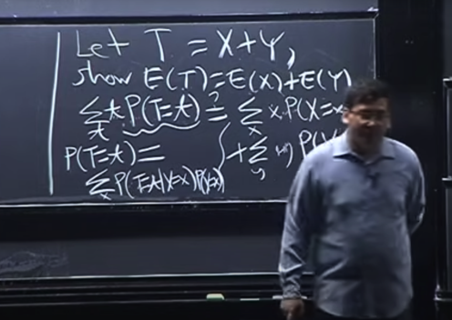</kbd>

> [!NOTE]
> Dùng cách tiếp cận hữu ích hay làm đó là **wishful thinking**,
> ta " ước rằng / **giả sử** rằng **biết X**", để rồi có thể "
> **condition on X**"
>
> Khi đó theo **LOTP** - **law of total probability**, mà ta có thể
> lập luận: Đầu tiên nhắc lại về **ý nghĩa của event X=x1** đó là
> là **subset của sample space** **chứa mọi possible outcome
> được map với label / real number x1: 
>
> X=x1 = {s**∈**S: X(s) = x1}**
>
> Nếu X có các possible value là x1,x2...xn thì các event X=x1,
> X=x2... sẽ **hợp lại để tạo thành toàn bộ sample space** (của X) 
>
> Do đó union của intersection của (T=t) với mọi event này sẽ tạo
> thành 
>
> (T=t) = (T=t, X=x1) U (T=t, X=x2) U ....(T=t, X=xn)
>
> Dẫn tới P(T=t) = P((T=t, X=x1) U (T=t, X=x2) U ....(T=t, X=xn))
>
> Có thể giải thích lại chặt chẽ hơn:
>
> (T=t) = {s ∈ S: T(s) = t}
>
> (T=t) ⊂ S ⇨ (T=t) ∩ S = (T=t)
>
> ⇔ (T=t) = (T=t) ∩ {s ∈ S: X(s) = x1 or x2, ..}
>
> ⇔ (T=t) = (T=t) ∩ [∪ ∀ xi {s ∈ S: X*(s) = xi}]
>
> ⇔ (T=t) = (T=t) ∩ [∪ ∀ xi (X=xi)] 
>
> ⇔ (T=t) = ∪ ∀ xi [(T=t) ∩ (X=xi)] 
>
> ⇨ P(T=t) = P((T=t, X=x1) U (T=t, X=x2) U ....(T=t, X=xn))
>
> Và đây là **union** của các**disjoint events** nên theo **Axiom 2:**
>
> P((T=t, X=x1) U (T=t, X=x2) U ....(T=t, X=xn)) = **P(T=t, X=x1)
> + P(T=t, X=x2)** + ....
>
> Và sử dụng **conditional probability theorem**:
>
> = **P(T=t|X=x1) * P(X=x1) + P(T=t|X=x2) * P(X=x2) + ....**
>
> = **Σx P(T=t|X=x) * P(X=x)**
>
> Vậy **P(T=t) = Σx P(T=t|X=x) * P(X=x)**

 

<kbd>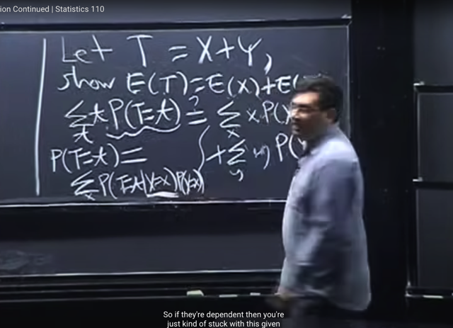</kbd>

🔗 **Related:** [TÓM TẮT:  - Tiếp tục Binomial distribution: 3 cách hiểu về rv ~ Bin(n, p)  - Định nghĩa về i.i.d  - CDF  - PMF cho Discrete random variables  - 2 tính chất để function là một valid PMF  - Binomial theorem  - Chứng minh X ~ Bin(n, p) và Y ~ Bin(m, p) thì (X+Y) ~ Bin(n+m, p)  Theo 3 cách  - Tìm PMF của X = số con xì khi sampling 5 lá từ bộ bài  - Khi sampling không hoàn lại thì X không phải là Binomial mà là HyperGeometric](tóm_tắt_tiếp_tục_binomial_distribution_3_cách_hiểu_về_rv_binn_p_định_nghĩa_về_iid_cdf_pmf_cho_discre.md#node-205)

> [!NOTE]
> Vì T = X+Y nên các event T=t; X+Y=t; Y=t-X là cùng một event
>
> T=t = X+Y=t = Y=t-X
>
> do đó T=t|X=x = X+Y=t|X=x = Y=t-X|X=x
>
> => P(T=t|X=x) = P**(**X+Y=t|X=x) = P(Y=t-X|X=x) = P(Y=t-x|X=x)
>
> Thì**vì X, Y INDEPENDENT** thì ta có thể làm giống như bữa trước, đó là đơn
> giản hóa **P(Y=t-x|X=x) = P(Y=t-x)**
>
> Bởi vì việc **X bằng bao nhiêu** kh**ông giúp cung cấp thêm thông tin Y bằng
> bao nhiêu**, hay khi liên hệ / diễn đạt independent random variable với
> independent event thì ta có thể nói **event X=x có xảy ra** **không** **không
> cung cấp thông tin gì về việc event Y=t-x có xảy ra không** - hay, hai event
> X=x và Y=y là hai event độc lập.
>
> Nhưng **ở đây ta không có X, Y độc lập**

 

<kbd>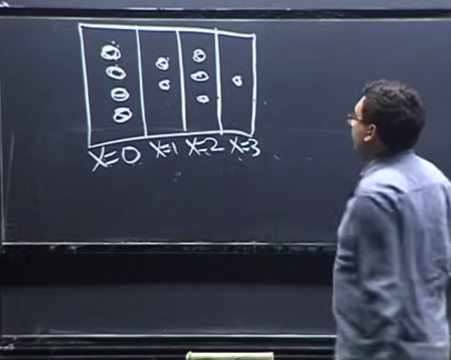</kbd>

> [!NOTE]
> Ta sẽ **phải dùng cách tiếp cận khác**.
>
> Gs vẽ lại mô hình pebble world, **giả sử  rằng X có 4 possible values 0,1,2,
> 3**. Và gs cũng nhắc lại rằng **RANDOM VARIABLE THỰC CHẤT LÀ MỘT
> FUNCTION**, **MAP** giữa **MỘT POSSIBLE OUTCOME** trong **SAMPLE
> SPACE (là một hòn sỏi trong đây)** với **MỘT NUMBER R**.
>
> Nên **trước khi thực hiện experiment** thì ta **chưa biết giá trị cụ thể của X**
> vì ta chưa biết outcome là cái nào trong đám possible outcome.
>
> Nhưng sau khi thực hiện experiment, thì ta có một hòn sỏi / outcome thì ta 
> và function X sẽ cho ra giá trị x nào đó, ví dụ x1, thì khi đó **random variable
> có giá trị x1**, hay **event X=x1 xảy ra**

 

<kbd>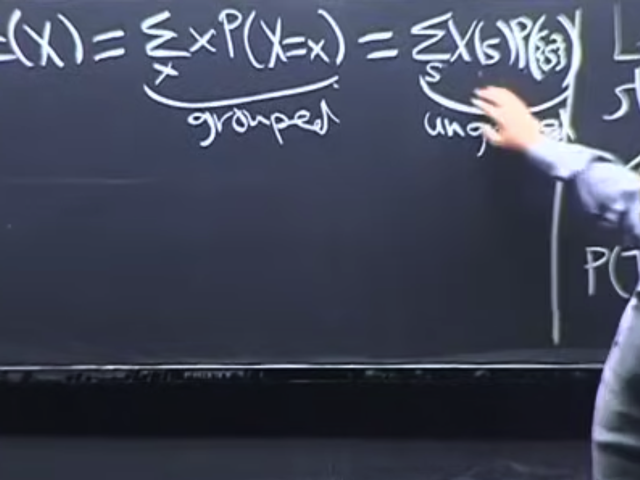</kbd>

🔗 **Related:** [-TÓM TẮT:   Z^(số lẻ), ta luôn có E(Z^(số lẻ) = 0, gọi là ODD MOMENT  - Symmetry còn giúp ta kết luận (nếu Z ~ N(0,1) thì -Z cũng là một N(0,1)  - X = μ + σZ sẽ ~ N(μ, σ^2)  - Sẽ tốt hơn nếu ta hiểu Standard Normal Z ~ N(0,1) trước, sau đó hiểu rằng khi scale và shift Z với σ và μ khác nhau thì ta sẽ có bất kì một Normal distribution N(μ, σ^2) nào  - PROPERTIES CỦA VAR(X):  + Var(X + c) = Var(X)  + Var(cX) = c^2*Var(X)  + Var(X) luôn không âm, và nó chỉ bằng 0 nếu X là constant  + Variance KHÔNG CÓ TÍNH LINEARITY:  + Var(X+Y) không bằng Var(X) + Var(Y) TRỪ KHI X, Y INDEPENDENT  X không i.i.d với chính nó X, mà nó EXTREMELY DEPENDENT với chính nó. Do đó bất cứ khi nào ta ÁP DỤNG CÔNG  THỨC NÀO ĐÓ MÀ CẦN CÁC RANDOM VARIABLE CÓ X1, X2 CÓ  TÍNH I.I.D VÀO X VÀ CHÍNH NÓ THÌ ĐỀU LÀ SAI  - CHỨNG MINH VAR X N(μ, σ) = σ^2  - Z = (X - μ) / σ và gs cho biết nó được gọi là STANDARDIZATION (chuẩn hóa)  Giúp từ NORMAL X ~ N(μ, σ) ta có STANDARD NORMAL Z ~ N(0,1)  - Xây dựng PDF của N(μ, σ^2) từ N(0, 1):  fX(x) = 1/(σ√2π) * [e^(-((x-μ)/σ)^2/2)]  - Nếu X ~ N(μ, σ^2) thì -X ~ N(-μ, σ^2  - Nếu X1 ~ N(μ1, σ1^2), X2 ~ N(μ2, σ2^2) và X1, X2 independent thì:  X1 + X2 ~ N(μ1 + μ2, σ1^2 + σ2^2)  X1 - X2 ~ N(μ1 - μ2, σ1^2 + σ2^2)  - 68-95-99.7 rule  - Chứng minh 0^k / k! + 1^k / k! + 2^k / k! + .... = e^k  ⇨ Tổng k=0,1...infinity λ^k/k! = e^λ  - Tìm variance của Poisson (λ) để chứng minh nó có MEAN VÀ VARIANCE ĐỀU LÀ λ  - Khi standardize, ví dụ đơn vị là km, thì (x - μ) / σ sẽ  (km - km) / km = km / km = 1 TỨC Ý NÓI LÀ KHÔNG CÒN CARE ĐƠN VỊ LÀ GÌ NỮA  - X~Bin(n,p), Var(X) = npq (q = 1-p)  - Chứng minh LOTIS](_tóm_tắt_zsố_lẻ_ta_luôn_có_ezsố_lẻ_0_gọi_là_odd_moment_symmetry_còn_giúp_ta_kết_luận_nếu_z_n01_thì_z.md#node-455)

> [!NOTE]
> **Theo định nghĩa expected value** ta có **E(x)** = **Sum x [x*P(X=x)].**
>
> Thì cái này biết rồi, mang ý nghĩa là **weighted sum của các possible value**
> của **X**, **với** weight là **xác suất của việc X có giá trị đó**
>
> Thế thì nó cũng chính là, hoặc có thể **được thể hiện theo cách khác** là:  **Sum s [X(s) * P({s}]**
>
> với ý nghĩa là **weighted sum** của các **X(possible outcome s)** với weight là
> **xác suất của possible outcome s đó P({s})**
>
> X(possible outcome s) có ý nghĩa là giá trị real mà **(random variable) function
> X map từ possible outcome s tới.** Và hai cách thể hiện trên là như nhau,
> chẳng quan một cái ở **dạng group**, một cái **không group**Nói E(x) = Sum x [x*P(X=x)] ở dạng group là vì trong hình vẽ thì X=1 sẽ là
> subset chứa 2 possible outcome, giả sử gọi là s1,s2 Vậy thì P(X=1) sẽ bằng
> tổng của  P({s1}) và P({s2}). Tất nhiên cả s1, s2 đều được map với label = 1 hay
> **X(s1) = X(s2) = 1**. Và thực ra**1*P(X=1)** chính là **X(s1)*P({s1}) + X(s2)*P({s2})**

 

<kbd>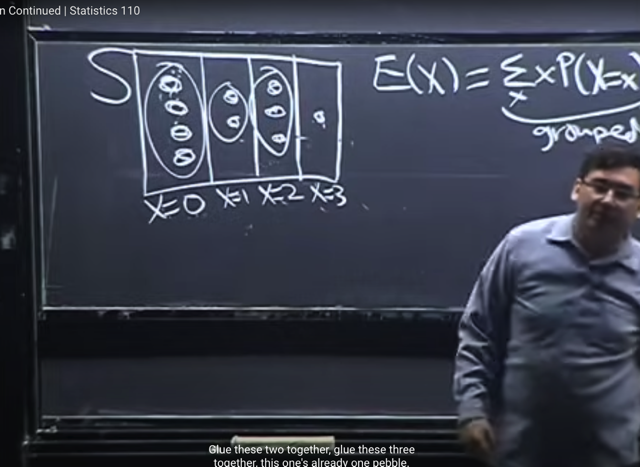</kbd>

> [!NOTE]
> Với **ungroup**: thì ta tính **average** khối lượng các viên sỏi (mỗi viên có
> khối lượng P({s} tức xác suất xảy ra của possible outcome đó)
>
> Còn với group thì hình ảnh y như ta **gom 4 viên trong group 1 thành 1 viên
> sỏi lớn (super pebble)**, có **mass bằng tổng mass 4 viên nhỏ** và tính
> average của 4 viên này
>
> ====
>
> Sau khi đọc Casella mình có thể nói thêm chỗ này như vầy:
>
> X=x vốn là event trong sample space gốc = {s ∈ S: X(s) = x}
>
> ⇨ P(X=x) = P({s ∈ S: X(s) = x}) 
> và theo định nghĩa của probability function P thì nó =:
>
> = Σ{s ∈ S: X(s) = x} P({s})
>
> ⇨ Σx xP(X=x) = Σx x Σ{s ∈ S: X(s) = x} P({s})
>
> Đưa cái x vào trong cái Σs:
>
> = Σx Σ{s ∈ S: X(s) = x} x P({s})
>
> Và dùng thực tế X(s) = x, để thay x = X(s):
>
> = Σx Σ{s ∈ S: X(s) = x} X(s) P({s})
>
> Vậy thì ở đây chạy qua mọi x, và với mỗi x thì chạy qua mọi s với X(s) = x
>
> thì cũng giống như chạy qua mọi s. Hay nói cách khác:
>
> Union x {s ∈ S: X(s) = x} = {s ∈ S} = {S}
>
> Vì sao vì với mọi possible value x của X thì {s ∈ S: X(s) = x} tạo nên một partition
> của S. 
>
> Vậy Σx Σ{s ∈ S: X(s) = x} X(s) P({s}) = **Σ{s**∈**S} X(s) P({s}) Đây chính là cách
> thể hiện khác của EX mà gs Blizstein đang dạy ta.
>
> Việc đọc Casella giúp mình hiểu hơn chỗ này**

 

<kbd>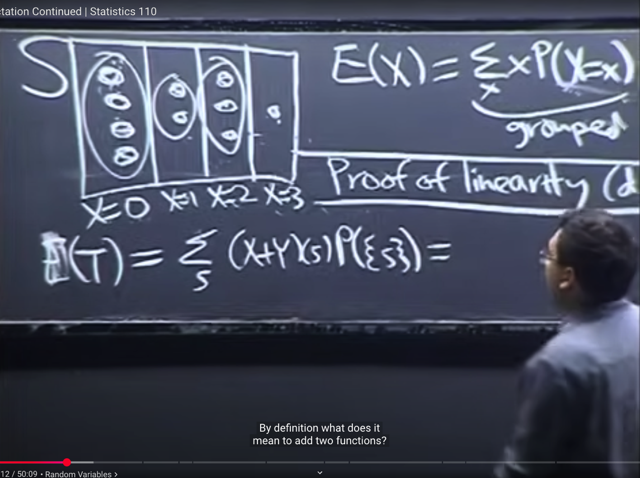</kbd>

> [!NOTE]
> Và dựa vào đó ta sẽ dùng nó, tức cách hiểu / thể hiện thứ hai rằng  **E(X) =
> Tổng s [X(s) * P({s})]** để **chứng minh linearity**.
>
> Thế thì theo định nghĩa expected value, E(T) = Tổng t [t * P(T=t)]**áp dụng cách nhìn thứ 2 như trên**, ta sẽ **thay** bằng
>
> E(T) = Tổng s [T(s) * P({s})]
>
> Và vì T = X + Y nên **T(s) = (X+Y)(s)**
>
> (Nhớ là random variable bản chất là function. Nên ghi (X+Y)(s) có nghĩa là
> function (X+Y) apply lên s. Trong đó function T = X+Y là một **FUNCTION
> MỚI** tạo bởi **TỔNG CỦA HAI FUNCTION X và Y**Thế rồi ta mới **DÙNG TÍNH CHẤT POINT-WISE ADDITION CỦA
> FUNCTION hiểu nôm na là định nghĩa của việc cộng hai hàm số (f+g)(x) = f(x)
> + g(x)**. Hay từ 1806 gs Strang cũng đã nói function có tính chất linear, thể
> hiện bởi**[c*f+d*g](x) =c*f(x)**+ d*g(x). Nhưng có thể
>
> Nên **(X+Y)(s) = X(s) + Y(s)**

 

<kbd>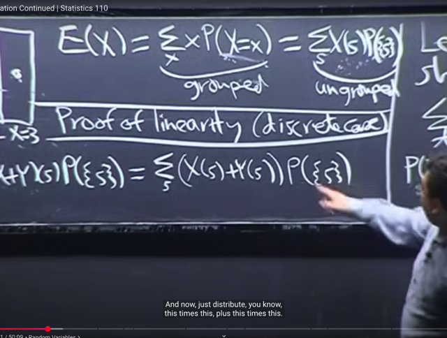</kbd>

> [!NOTE]
> Từ đó E(T) = Tổng s [T(s) * P({s})] = **Tổng s {[X(s) + Y(s)] * P({s})}** và dùng
> **distribution law** (nhân phân phối vào) để có:
>
> **E(T)** = **Tổng s [X(s) * P({s})** + **Tổng s [Y(s) * P({s})**

 

<kbd>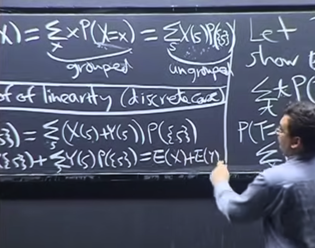</kbd>

> [!NOTE]
> Và như cách thể hiện Expected value thứ hai vừa nãy mới nói thì: 
>
> **Tổng s [X(s) * P({s}) chính là E(X)**, **Tổng s [Y(s) * P({s}) chính là E(Y)**
>
> Vậy ta đã chứng minh xong **T =X+Y thì E(T) = E(X) + E(Y)**

> [!NOTE]
> Viết lại cho gọn: CHứng minh E(X+Y) = E(X) + E(Y)
>
> Đặt T = X+Y;
>
> E(X+Y) = E(T) = Σ∀t tP(T=t)
>
> Nhưng cũng có thể tính bằng: **Σ {s**∈**S} T(s)*P({s})**
>
> Chứng minh P(T=t) = P({s ∈ S: T(s) = t} = Σ {s ∈ S: T(s) = t} P({s})
>
> ⇨ t*P(T=t) = t*[Σ {s ∈ S: T(s) = t} P({s})] 
>
> = [Σ {s ∈ S: T(s) = t} t*P({s})] | t ko phụ thuộc s nên đưa vô tổng
>
> = [Σ {s ∈ S: T(s) = t} T(s)*P({s})]
>
> ⇨ Σ ∀t tP(T=t) = Σ ∀t [Σ {s ∈ S: T(s) = t} T(s)*P({s})]
>
> = **Σ {s**∈**S} T(s)*P({s})**
>
> (T=t) = (X+Y=t) là event : {s ∈ S: (X+Y)(s) = t} | định nghĩa của event
>
> = {s ∈ S: X(s) + Y(s) = t} | Do bản chất X, Y là function, T = X + Y cũng
> vậy, và function T(s) = X(s) + Y(s) là do tính chất point-wise addition.
>
> ⇨ E(X+Y) = Σ {s ∈ S} [X(s) + Y(s)]*P({s})
>
> = Σ {s ∈ S} [X(s)P({s}) + Y(s)P({s})]
>
> = Σ {s ∈ S} [X(s)P({s})] + Σ {s ∈ S} [Y(s)P({s})]
>
> Và đây chính là E(X) + E(Y)

 

<kbd>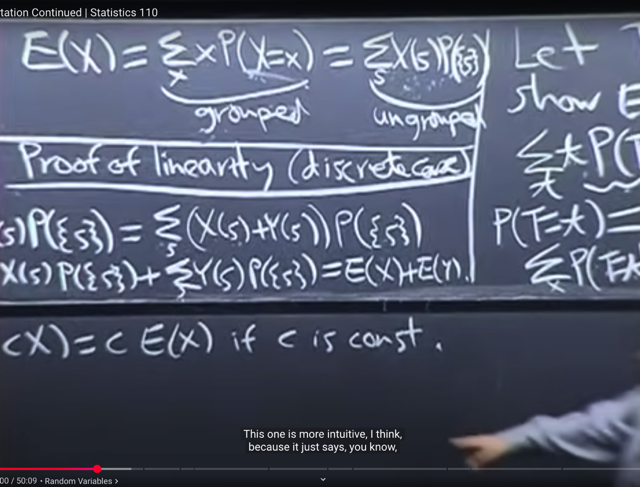</kbd>

> [!NOTE]
> Và ta còn **ý thứ 2 của linearity** đó là **E(c*X) = c*E(X)** và có thể chứng
> minh dễ dàng như sau:
>
> E(X) = Tổng x [x * P(X=x)] = Tổng s [X(s) * P({s})]
>
> Nhân hai vế cho c: c * Tổng x [x * P(X=x)] = c * Tổng s [X(s) * P({s})]
>
> Vế phải, đưa c vào trong: c * Tổng s [X(s) * P({s})] = Tổng s [c * X(s) * P({s})]
>
> Thế thì Tổng s [c * X(s) * P({s})] THEO CÁCH THỂ HIỆN THỨ 2 CỦA 
> EXPECTED VALUE THÌ NÓ CHÍNH LÀ E(c*X). Vì sao:
>
> Vì hồi nãy ta đã cho thấy E(X) = Tổng x [x * P(X=x) ] thực chất cũng là
> = Tổng s [X(s) * P({s})]
>
> Vậy điều này có nghĩa là, **nếu ta có Tổng s [F(s) * P({s})] thì đó chính là E(F)**
>
> Và trong trường hợp này **F chính là c*X** vậy nên 
>
> **Tổng s [c * X(s) * P({s})]  CHÍNH LÀ E(c*X)**
>
> Còn **vế trái** c * Tổng x [x * P(X=x)] **đương nhiên là c*E(X)**
>
> Vậy **c*E(X) = E(c*X)**

 

<kbd>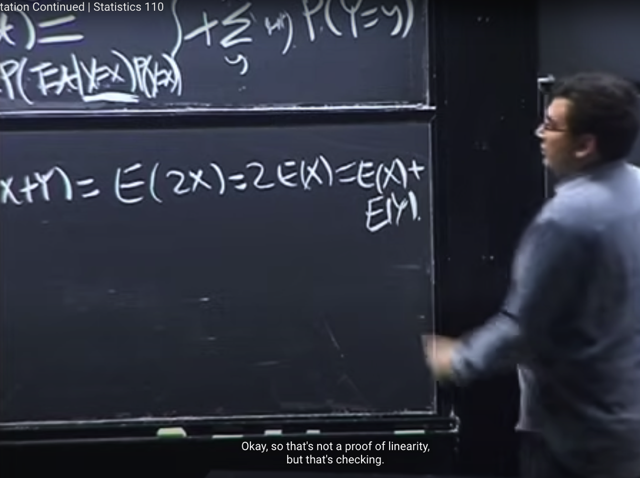</kbd>

> [!NOTE]
> Và đại khái là gs cho rằng điều này giúp **check lại rằng khi X, Y là depend
> nhau** và **depend trong extreme case** chính là **bằng y chang nhau**, tức X=Y
>
> Thì ta có E(X+Y) = E(2X) = 2E(X) = E(2Y) = 2E(Y) = E(X) + E(Y)

 

<kbd></kbd>

> [!NOTE]
> Tiếp, gs nói đại khái là ta **sẽ học khoảng 13 đến 14 distribution quan trọng**
> trong class này. Và nó quan trọng là bởi **story behind chúng**
>
> Đối với **discrete** ta sẽ làm quen thêm **2 distribution** quan trọng nữa.
> Sau đó sẽ là các **continuous case.**
>
> Ta sẽ làm quen **NEGATIVE BINOMIAL**. Gs nói nó **vừa không negative** **vừa
> không phải binomial**, mà chỉ là người ta đặt tên nó vậy thôi

 

<kbd></kbd>

> [!NOTE]
> Story của Negative Binomial là nó là **mở rộng của Geometric Geom(p)** đó là
> ta quan tâm **SỐ FAILURE khi cứ thực hiện các Bern(p) trials cho đến khi có r
> success** (với Geometric là số fail đến khi có success đầu tiên)

> [!NOTE]
> NEGATIVE BINOMIAL

> [!NOTE]
> Để tìm (xây dựng công thức) của PMF tức P(X=n)
>
> Như đã nói, X~Negative Binomial (r, p) tức là X là số failure khi thực hiện các **i.i.d Bern(p) 
> trials** **cho đến khi** có được **r success**.
>
> Thì gs lấy một ví dụ cụ thể với r = 5, và **giả sử có chuỗi kết quả của các trials** như này. 
>
> **1000100100001001**
>
> Thì ở đây, ta đạt 5 success sau khi có n=11 failure.
>
> Vậy ta **thử tính P(X=n)** trong trường hợp này và khái quát nó lên:
>
> Vậy lập luận là: **Điểm mấu chốt** ta cần nhận định là **số 1 đứng cuối**, tức**là LẦN SUCCESS
> THỨ R LUÔN ĐỨNG CUỐI MỌI CHUỖI TRIAL**. Vì nếu không thì một là chưa đạt r success, 
> hai là đạt rồi  mà con tiếp tục trial là không đúng.
>
> Thế thì **nhận định quan trọng** thứ 2, **CÁC HOÁN VỊ CỦA CÁC KẾT QUẢ TRƯỚC ĐÓ
> KHÔNG QUAN TRỌNG**, vì ta **chỉ quan tâm rằng có đủ r success**
>
> Từ đó gs cho rằng ta có thể **đi ngay đến P(X=n)** như sau:
>
> Event **(X=n)** là **INTERSECTION** của **r event success**, và **n event failure** Và **các event này 
> INDEPENDENT**vì đây là các Bern(p) trial độc lập **(i.i.d)**
>
> Nên theo **định nghĩa của independent events**: P[X=n] nói bằng lời sẽ là **tích của r P[success]**
> và **n P[failure]**, với **P(success) = p**, **P(failure) = 1-p**
>
> Vậy là bằng **p^r * q^n**

> [!NOTE]
> Tuy nhiên như nhận định thứ hai rằng khi nói về event (X=n), ta **không quan tâm** đến**cách sắp xếp cụ thể của chuỗi kết quả trước đó** bao gồm **n failure** và **r-1 success**
> (cộng cái success cuối nữa là r)
>
> Hay nói cách khác, event (X=n) sẽ **BAO GỒM NHIỀU CÁCH SẮP XẾP CỦA CHUỖI
> n FAILURE, r-1 SUCCESS** 
>
> Ví dụ với r = 2, n = 3 tức "có 3 failure cho tới khi có 2 success" thì 10001 và 00011 là 
> 2 event khác nhau CHỨA TRONG X=3
>
> Tuy nhiên ta **KHÔNG PHÂN BIỆT CÁC SUCCESS VÀ FAILURE.**Do đó 10001 chỉ được tính là 1 cách sắp xếp chứ không phải coi các số 0, số 1 là khác 
> nhau để rồi tính 10\/0\_0\/\_**1,** **1**\/0\/\_0\_01, ...****thành ra 5! cách.****
>
> Và số cách sắp xếp này được tính như sau:
>
> Nó là bài toán **đếm số cách sắp xếp của r-1 banh đỏ và n banh trắng**. Thì ta có thể
>
> 1)**Coi mọi banh là khác nhau**, ta có **(n+r-1)!** hoán vị.
>
> 2) A**djust việc ta không phân biệt banh đỏ** với nhau: **Chia bớt cho (r-1)!**
>
> 3) **Adjust việc ta không phân biệt banh trắng** với nhau: **Chia bớt cho n!**
>
> Kết qủa là **(n+r-1)! /[(r-1)!n!]**
>
> Nhưng cũng có thể lập luận **cách khác**: Ta sẽ**chọn n vị trí cho banh trắng** trước
> trong tổng cộng n+r-1 vị trí: Ta có **(n+r-1 choose n)**, sau đó các banh đỏ **chỉ việc
> vào các vị trí còn lại (có 1 cách)**=> Theo step rule: Có (n+r-1 choose n)*1 cách
>
> Hoặc ta cũng có thể chọn r-1 vị trí cho banh trắng trước: (n+r-1 choose r-1)
> và cho banh đỏ vào các vị trí còn lại.
>
> Và ta đã biết**(n+r-1 choose n)** cũng **chính là bằng (n+r-1 choose r-1)**
>
> Bên cạnh đó kết quả (n+r-1 choose n) theo công thức nó sẽ là (n+r-1)!/n!*[n+r-1-n]!
> = (n+r-1)!/n!(r-1)! cho thấy cách làm theo 2 cách đều như nhau
>
> ===
>
> Như vậy, **event (X=n) là UNION CỦA (n+r-1 choose n) EVENT** (mỗi event **đều kết thúc
> bởi success thứ r**, còn lại thì **khác nhau ở các cách sắp xếp** của **n failure** và**r-1 success**
> trước đó). 
>
> Và **P của mỗi event như đã tính là p^r * q^n** ( mọi cái đều bằng cái này vì mỗi
> cái, **tuy khác các sắp xếp** nhưng **đều là chuỗi của n failure, r-1 success**)
>
> Và, (n+r-1 choose n) event này **DISJOINT**. nên cho phép ta **dùng AXIOM 2**:
>
> Để cuối cùng P(X=n) = Tổng cộng (có (n+r-1 choose n) cái) mỗi cái có xác suất p^r * q^n
>
> = **(n+r-1 choose n) * p^r * q^n**

 

<kbd>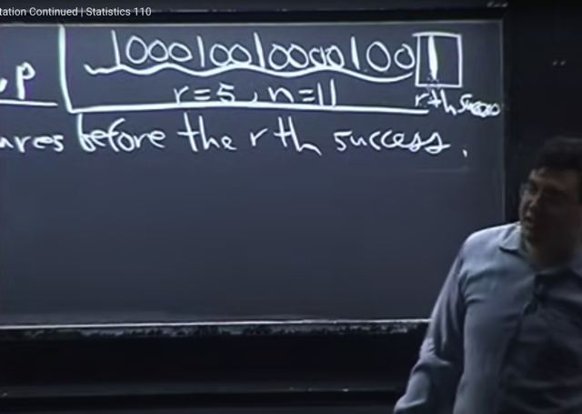</kbd>

 

<kbd>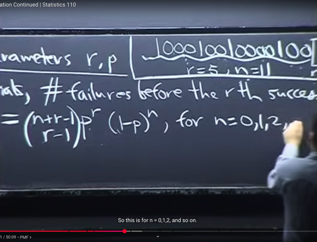</kbd>

> [!NOTE]
> Kết qủa là P(X=n) = **(n+r-1 choose n) p^r * q^n**

> [!NOTE]
> PMF CỦA NEGATIVE BINOMIAL

 

<kbd>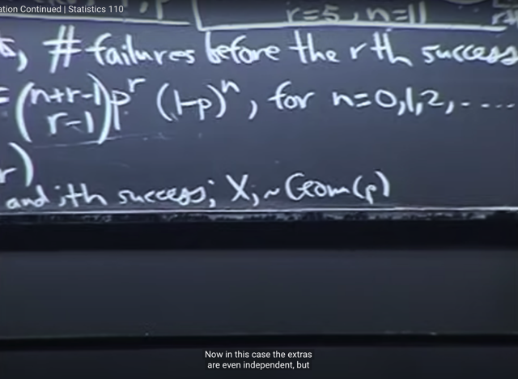</kbd>

<kbd></kbd>

<kbd>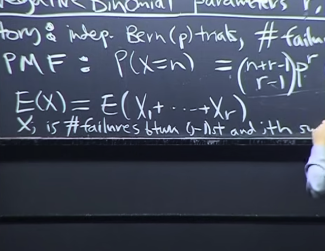</kbd>

🔗 **Related:** [TÓM TẮT:  Tiếp tục về CDF: Định nghĩa của CDF  Bước nhảy của CDFD là giá trị PMF tại đó  Tính chất của CDF: 1) Non decreasing, 2) right continuous và   3) F(x) -> 0 khi x -> -infinity, F(x) -> 1 khi x -> -infinity  - Định nghĩa Independent random variables theo independent event:  X, Y độc lập khi  + Continuous rv: P(X≤x, Y≤y) = P(X≤x) * P(Y≤y) với mọi x, y   + Discrete rv: P(X=x,Y=y) = P(X=x)*P(Y=y)  - Expected value: Là con số tóm tắt distribution của r.v  - Hai cách tính average  - E(X) = Σx x*P(X=x)  - X ~ Bern(p) thì E(X) = p  - FUNDAMENTAL BRIDGE: E(X) = P(A), X là indicator rv mang giá trị = 1 khi event A xảy ra và 0 khi ngược lại  - X ~ Bin(n, p):  E(X) = ∑ k=0,1..n [ k * (n choose k)*p^k*q^(n-k)] = ..= np  - TÍNH LINEARITY CỦA AVERAGE  - Tính lại E(X) của Bin(n, p) nhanh hơn bằng linearity, fundamental bridge và E(X) của Bern(p)  - TÍnh E(X) của Hypergeometric Dù các trial không độc lập nhưng dùng Symmetry, linearity, fundamental bridge vẫn tính được  - X ~ Geom(p): P(X=k) = q^k*p  - E(X) = p Σ k=0:infinity [k * q^k]](tóm_tắt_tiếp_tục_về_cdf_định_nghĩa_của_cdf_bước_nhảy_của_cdfd_là_giá_trị_pmf_tại_đó_tính_chất_của_cd.md#node-262)

> [!NOTE]
> Tiếp ta sẽ tính **E(X)**. Thì đầu tiên gs nói rằng hãy **xét simple case**, khi r = 1: tức
> là X là số lần fail trước khi có 1 success. Thì khi đó, đây chính là **GEOMETRIC**, mà
> khi nãy ta đã biết **E(X) = q/p**
>
> Xong, hãy nghĩ đến r = 2. Thì gs nói rằng với **r = 2**, thì ta **đếm số failure trước khi
> có success đầu**, sau đó **lại tiếp tục đếm số failure trước khi có success thứ 2**.
> Như vậy, có thể thấy nó **giống như ta "làm" 2 chuỗi r = 1 vậy**.
>
> Với cách nghĩ đó thì **số failure trước khi có r success** (tức là story của X), **chính là
> tổng của:**
>
> [**X1: số failure trước khi có success 1**] + [**X2: số failure sau khi có success 1 và
> trước khi có success 2**] + ....
>
> Hay khái quát **Xj là số failure ở GIỮA lần success thứ (j-1) và lần success thứ j**
>
> Nên có thể viết **E(X) = E(X1 + X2 + ....Xr)**

 

<kbd>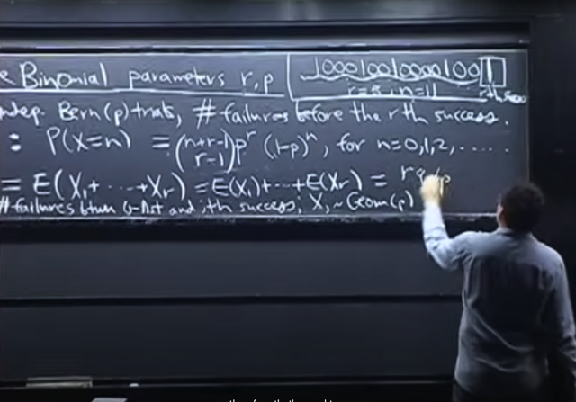</kbd>

> [!NOTE]
> Và theo **linearity** cho phép ta = **E(X1) + E(X2) + ...E(Xr)**.
>
> Và rồi, mỗi Xj với ý nghĩa vừa nói là **số failure SAU KHI success lần j-1 và
> trước khi success lần j** thì ta **có thể hiểu nó** cũng **Y NHƯ LÀ**:
>
> "**SỐ FAILURE TRƯỚC KHI CÓ SUCCESS ĐẦU TIÊN"**
>
> ý là sau khi **success lần thứ j-1 thì lại reset lại, để chờ đến success lần thứ j**,
> thì số failure ở trong khoảng này cũng có story**y như số failure từ success
> thứ 0 đến success thứ 1** mà cái này thì cũng đồng nghĩa với "**số failure cho
> đến khi success lần đầu**" và đây chính là story của **Geometric**
>
> Do đó **Xj** **CHÍNH LÀ GEOMETRIC random variable**: **Xj ~ Geometric(p). Và
> như vừa nhắc lại E(X) của Geom(p) là q/p**
>
> Do đó với j nào thì E(Xj) = q/p. Và ta có X1, X2, ...Xr là r cái.
>
> Vậy E(X) = q/p + q/p + ..(r cái) = **r*q/p**

> [!NOTE]
> E(X) CỦA NEGATIVE BINOMIAL = rq/p

 

<kbd>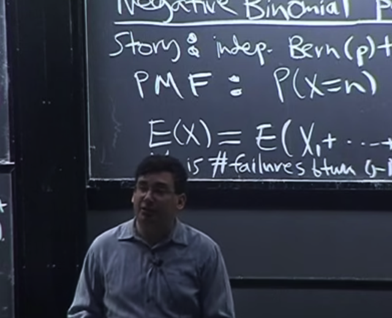</kbd>

> [!NOTE]
> rồi, ông nói một số sách như của **Ross** (cuốn A First course of Probability)
> dùng cách **"start at" 1** tức là **có tính vào event success**.
>
> Ta biết X~ Geometry p có nghĩa là X là **số failure cho đến khi có một success
> đầu tiên** trong chuỗi các **Bern (p)** trials. Thế thì nếu nói "**có tính the
> success**" thì có nghĩa là **ví dụ như có 9 failure trước khi có success đầu
> tiên, vậy 9+1 là 10**.
>
> Do đó X có thể có các giá trị là **1,2**...Với **1 tức là ngay lần đầu tiên đã
> success** nên có 0 failure + 1 success = 1
>
> Còn nếu theo convention "không tính success" thì **nếu ngay lần đầu tiên đã
> success thì X = 0** failure = 0.
>
> Nói chung ý nghĩa khi **nói "X start at 0 hay at 1"** là vậy. Nếu **không tính
> success** thì X có thể start at 0, hay nói cách khác **có thể có giá trị = 0**.
> Còn nếu **có tính success** thì X c**hỉ có thể có giá trị nhỏ nhất là 1**.
>
> Tương tự với Negative Binomial cũng vậy. **Nếu không tính success thì X có
> thể có giá trị 0**. Còn nếu **có tính success** thì X **chỉ có thể có giá trị nhỏ
> nhất là r**. Vì đó là khi **r trial đầu tiên đều success và không có failure nào**.
> Nên khi đó **"X start at r**" là vậy
>
> gs nhắc ta phải cẩn thận kiểm tra lại quy ước đang dùng là gì vì nếu không sẽ
> mắc sai lầm khi dùng công thức ở một convention khác

> [!NOTE]
> CẦN CẨN TRONG XEM QUY ƯỚC
> LÀ "START AT 0 HAY 1"

 

<kbd>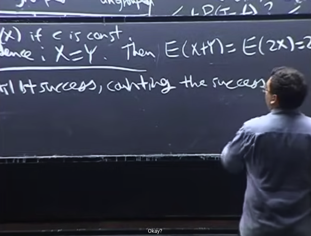</kbd>

<kbd></kbd>

<kbd>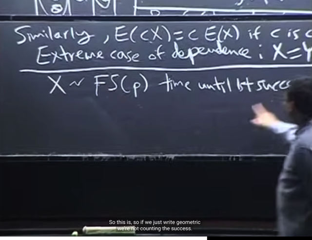</kbd>

> [!NOTE]
> Gs: Rất dễ để **convert giữa hai kiểu convention** này. Nên gs lấy bài toán này: X ~ FS(p) có nghĩa là, cũng thực
> hiện các **Bern(p) trials**, **cho đến khi có 1st success** (giống Geometric)
>
> Nhưng **thay vì đếm SỐ FAILURE (như Geometric)** trước khi có 1st success, ở đây ta đếm **TỔNG** **SỐ LẦN
> TRIAL** trước khi có 1st success, và điều này **bao hàm ý nghĩa là ta CÓ TÍNH LẦN SUCCESS** vào. Ví dụ 9 lần
> failure trước khi có success với lần success nữa là 10

 

<kbd>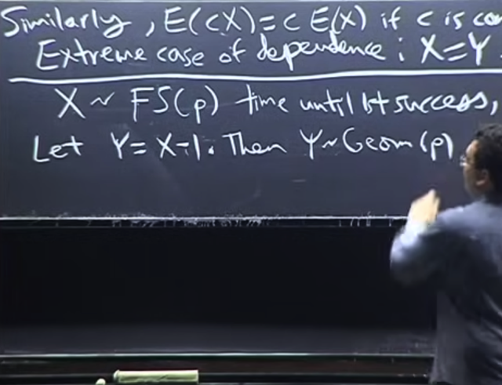</kbd>

> [!NOTE]
> Thế thì rất đơn giản là ta **chỉ việc đặt Y = X-1**, để **"không tính
> success"** thì **ngay lập tức ta có Y là một Geometric (p)** random
> variable

 

<kbd>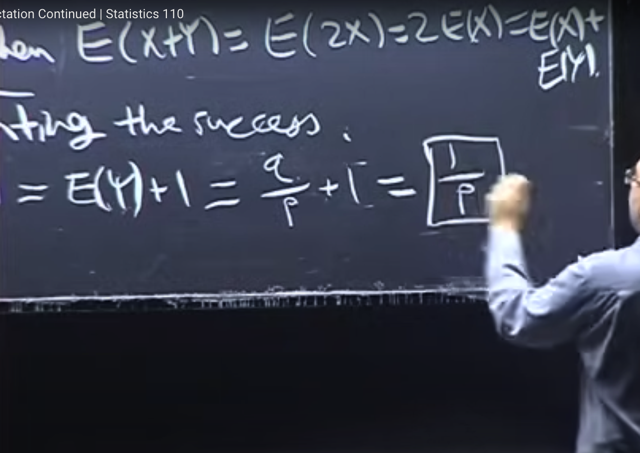</kbd>

> [!NOTE]
> Và khi đó tính PMF hay gì cũng rất dễ. 
>
> Ví dụ tính **E(X) = sẽ bằng E(Y) + 1** (vì X = Y + 1 theo linearity E(X) = E(Y+1) 
> = E(Y) + 1 và với Y ~ Geometric(p) thì E(Y) = q/p = (1-p)/p
>
> Thế vào ta có E(X) = (1-p)/p + 1 = 1/p - 1 + 1 = **1/p**
>
> Và gs nói kết quả này, **nếu suy nghĩ sâu hơn ta sẽ thấy rất có lý**. Ví dụ như ta
> có Bernoulli trial có x**ác suất success p = 1/10**. Thì rất logic khi ta nói **trung
> bình sẽ cần 10 lần trial để có một lần success**. 10 lần ở đây chính là 1/p =
> 1/(1/10) = 10 và E(X) ở đây cho thấy nó **chính là mang ý nghĩa như vậy**

 

<kbd>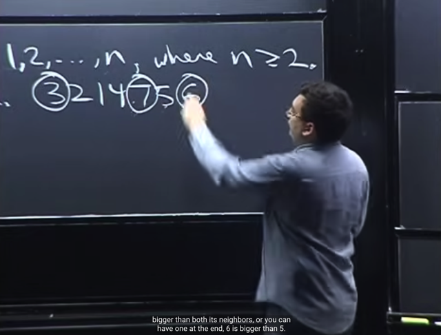</kbd>

<kbd></kbd>

<kbd>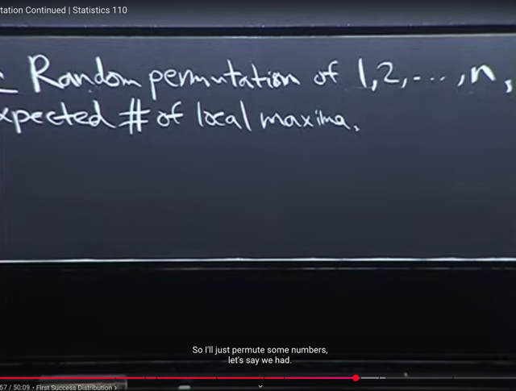</kbd>

> [!NOTE]
> Tiếp ta sẽ biết vể **Putnam problem**. Cho **n integer**, **n lớn hơn 1**. Và xét trong **tất cả các permutation của các
> integer này**. Câu hỏi là **Expected value** của **Số local maxima.**
>
> Trong đó**local maxima** là số mà **lớn hơn neighbor của nó**,. ví dụ trong hoán vị cụ thể này (n=7, có 7! hoán vị
> như đã biết) thì có **3 local maxima là 3 (>2), 7 (>4,5) và 6 (>5)**

> [!NOTE]
> Putnam problem

 

<kbd>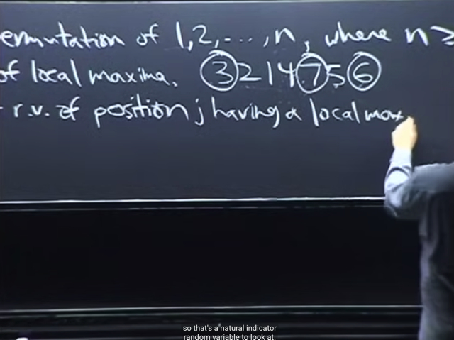</kbd>

<kbd></kbd>

<kbd>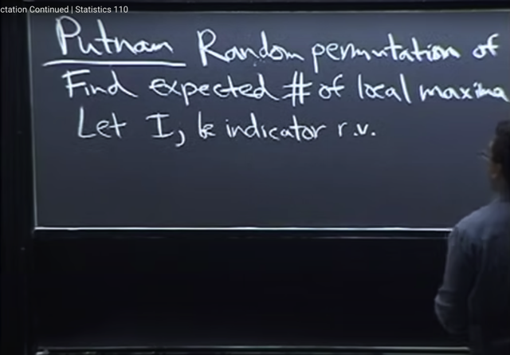</kbd>

> [!NOTE]
> Đầu tiên, ta sẽ define **I_j là indicator random variable** của event [**position thứ j là một local maxima**] (như đã
> biết indicator random variable là cái sẽ mang giá trị = 1 nếu event xảy ra, ngược lại thì là 0)

 

<kbd>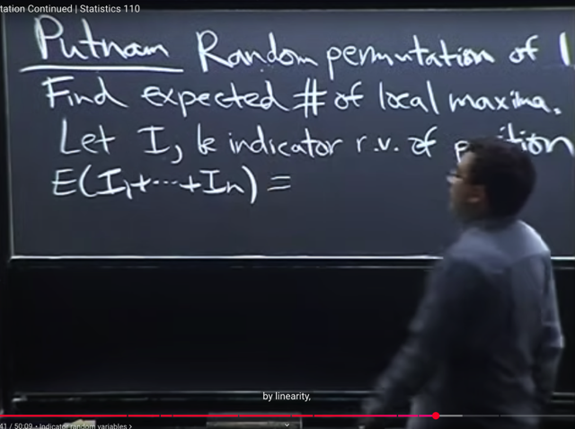</kbd>

> [!NOTE]
> Và khi định nghĩa như vậy thì đương nhiên **TỔNG CỦA I_j** với mọi j **CHÍNH LÀ
> SỐ LOCAL MAXIMA.**
>
> Do đó cho phép ta tính **E(tổng số local maxima)** = **E(I_1 + I_2 + ...I_n)**

 

<kbd>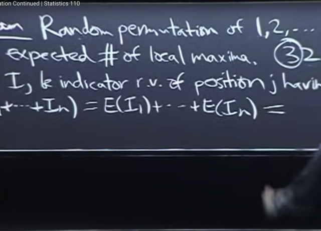</kbd>

> [!NOTE]
> Và theo **linearity** ta có
> = **Tổng j=1:n E(I_j)**

 

<kbd>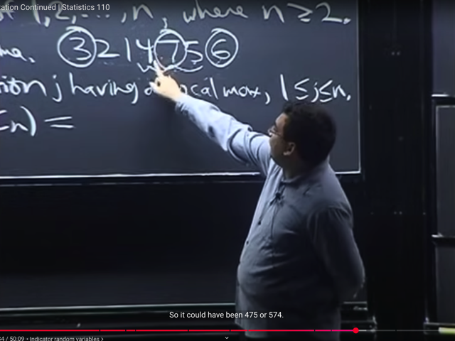</kbd>

> [!NOTE]
> Tiếp, ta xét 3 số này (..475..), là một trường hợp l**ocal maxima không  nằm ở
> biên** thì ta sẽ **có 2 cách nghĩ**:
>
> i) 3 số này tạo nên **3! hoán vị** khác nhau. Trong đó **có 2 cách sắp xếp
> khiến số 7 đứng giữa để tạo ra local maxima** đó là 475 và 574. Do đó  **xác
> suất có local maxima là 2/3! = 1/3 (naive definition)**
>
> ii) Cách nghĩ này hay hơn:
>
> Trong 3 số này, **số lớn nhất là 7 có 3 vị trí có thể đứng**, trong đó **chỉ có 1 vị
> trí khiến ta có một local maxima**. Nên**xác suất có** **local maxima là 1/3**
>
> Ông cũng nói thêm **nhiều người mắc sai lầm** khi tính ra xác suất là **1/4**
> khi lập luận **xác suất** [**số đứng giữa lớn hơn số bên trái] là 1/2**, **xác suất
> [số đứng giữa lớn hơn số bên phải] là 1/2** nên xác suất số đứng giữa lớn
> hơn cả hai số bên hông nó là 1/2 * 1/2 = 1/4.
>
> Gs chỉ ra cách **lập luận này sai** là vì, **hai event này không độc lập** (Vì
> **việc số  đứng giữa lớn hơn số bên trái**, **có thể cung cấp thông tin cho biết
> khả năng nó  lớn hơn số bên phải**) nên không thể tính xác suất số giữa lớn
> nhất bằng cách **nhân** chúng lại (**theo định nghĩa của independent event**)
> được.
>
> Tóm lại lập luận trên để cho thấy với **một số không ở biên,** thì xác suất [**nó
> là một local maxima**] (tức là nó lớn hơn 2 số 2 bên) sẽ là **1/3.**Và dựa vào**fundamental bridge, E(X) = P(A**) (ý nghĩa:**expected value
> của indicator random variable gắn với event bằng xác suất xảy ra của event)**nên ta có **E(Xj) = 1/3** với Xj là indicator random variable gắn với event số thứ
> j là local maxima.

 

<kbd>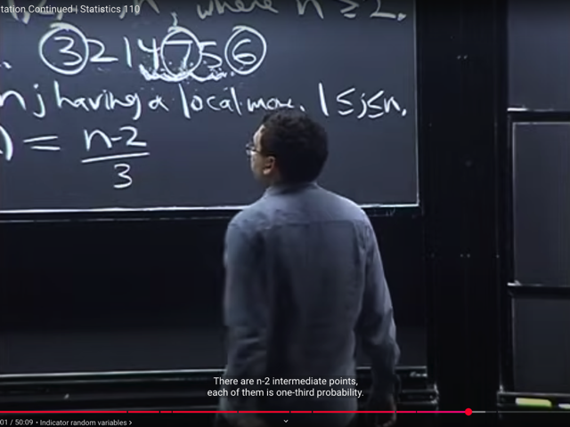</kbd>

> [!NOTE]
> Và v**ới n số ta có n-2 số không ở biên**, ứng với n-2 indicator random
> variable,
>
> và expected value của chúng đều bằng 1/3 như vừa tính xong
>
> => "phần đóng góp" của các expected value của các indicator random
> variable ứng với các  số không ở biên sẽ là" **1/3 + 1/3 + ..(n-2) cái.. + 1/3
> = (n-2)/3**

 

<kbd>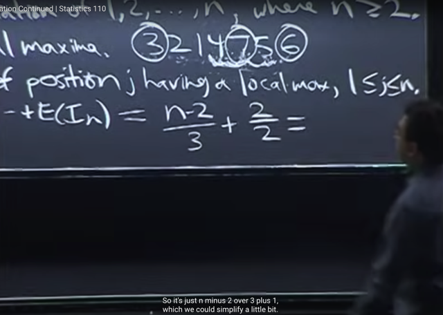</kbd>

> [!NOTE]
> Tiếp, **xét 2 số ở biên**. Thì xác suất nó là một local maxima sẽ là **1/2** vì
> nó **chỉ có thể lớn hơn hoặc bé hơn số bên cạnh nó** (nhớ là đề bài cho n số
> integer lớn dần từ 1,2,,,,n, nên không có số nào bằng nhau)
>
> Do đó Expected value của hai indicator random variable ứng với hai số
> biên là 1/2 => phần đóng góp của hai số ở biên vào tổng các E(Ij) là 1/2 + 1/2 = 2/2
>
> Vậy **E(I_1 + I_2 +...I_n) = (n-2)/3 + 2/2 = (n+1)/3**

 

<kbd>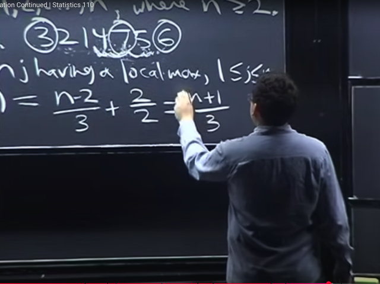</kbd>

> [!NOTE]
> Tóm lại Putnam problem:
>
> Cho n con số nguyên, bảo tính E(X) với X là số local maxima.
>
> Vậy thì đặt I_j là indicator random variable gán với event con số thứ j là  một local
> maxima (tức là nó lớn hơn 2 con số bên hông nếu nó là số không ở biên, và lớn
> hơn con số bên hông nếu nó là số ở biên)
>
> ⇨ X (tổng số local maxima) = Σi Xi
>
> ⇨ EX = E(Σi Xi) = Σi EXi (linearity) = Σi P(Ai)
>
> = P(A1) + P(An) + Σi=2:n-1 P(Ai)
>
> Xét con số ở biên thì xác suất nó lớn hơn số bên cạnh là 1/2
>
> ⇨ P(A1) = 1/2, P(An) = 1/2
>
> Xét con số không ở biên thì xác suất nó lớn hơn hai con số kế bên: Xét số aj-1 aj
> aj+1 P(Aj) = P(aj > aj-1 ∩ aj > aj+1)
>
> Và người ta thường sai khi tính = P(aj > aj-1)P(aj > aj+1) để rồi cho rằng = 1/2 * 1/2
> (LÀ SAI) là vì hai event này ko độc lập. Lí do là nếu event này xảy ra thì nó sẽ khiến
> event kia có xác suất cao hơn.
>
> Câu trả lời phải là P(aj > aj-1 ∩ aj > aj+1) = P(aj là số lớn nhất trong 3 số) và với 3
> số thì xác suất một số là lớn nhất = 1/3 ⇨ P(Aj) = 1/3
>
> Đáp án: EX = 2 * (1/2) + (n-2) * 1/3

 

<kbd></kbd>

> [!NOTE]
> Ta có thể **check với n = 2**, thì với 2 số rõ ràng sẽ phải có 1 số lớn hơn và
> cũng **chỉ có 1 số lớn** hơn nên ta **có 1 local maxima** phù hợp với Expected
> value theo công thức này là (2+1)/3 = 1
>
> Ý chính là với các công cụ như **linearity**,**fundamental bridge**, **indicator**
> random variable ta có thể **giải được bài toán KHÓ cỡ này** (chú ý đây là bài
> toán khó nhất trong một kì thi **Putnam** vốn là **kì thi toán rất khó)**

 

<kbd></kbd>

 

<kbd>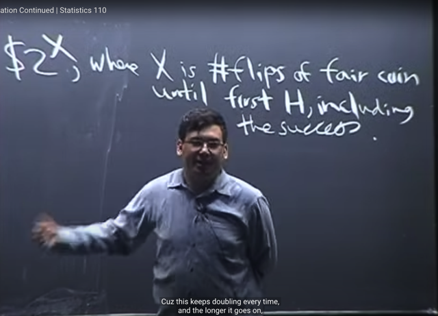</kbd>

> [!NOTE]
> Bài toán nổi tiếng tiếp theo là St. Petersburg Paradox: Ta sẽ**flip the coin cho
> đến khi ra mặt Head.**
>
> Và luật chơi là **gọi X số lần flip coin cho đến khi ra mặt Head** thì **số tiền
> thưởng là 2^X**. Và có nghĩa là **X là số lần fail + lần success cuối.**
>
> Như vậy nếu **tung lần đầu ra ngay Head** thì ta có **2^1 = 2 đô**, tung lần
> thứ 2 mới ra Head thì ta có 2^2 = 4 đô....
>
> Và câu hỏi là: ta nên **TRẢ BAO NHIÊU TIỀN ĐỂ CHƠI TRÒ NÀY**

> [!NOTE]
> St. Petersburg Paradox

 

<kbd>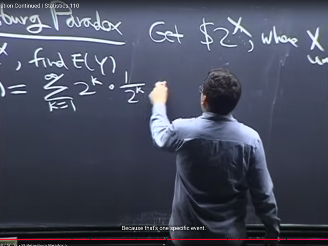</kbd>

> [!NOTE]
> Và để giải bài toán này, ta sẽ đi **tìm E(Y)**, **Y = 2^X** mang ý nghĩa là **giá trị tiền
> thưởng kì vọng**/**trung bình** mà ta có thể có khi chơi game này.
>
> Theo **định nghĩa expected value** đã biết ta sẽ tính **weight sum các possible 
> value của Y với** weight là **xác suất nó mang giá trị đó.**
>
> Với X có các possible value đương nhiên là 1,2,3...infinity (vì nó là số lần tung xu
> cho đến khi ra head, thì có thể là 1, 2, ...inf lần) thì possible value của y là 2^1, 2^2
> ...
>
> Tổng k=1:infinity [**2^k** * **P(Y=2^k)**] 
>
> (Khi ôn lại thì có thể thấy đây chính là LOTUS)
>
> Thì event Y= 2^k sẽ tương đương event X=k (vì Y = 2^X), và nó chính là event 
> [**fail (ra Tail) k-1 lần và lần cuối ra Head**]
>
> Thì **xác suất của event [fail (ra Tail) k-1 lần và lần cuối ra Head]**có thể tính như
> sau:
>
> Cách 1: Ta có event trên là **intersection của k event độc lập**, bao gòm k-1 event
> ra Tail, mỗi cái có xác suất 1/2. Và 1 event ra Head, có xác suất 1/2.
>
> Nên theo định nghĩa của independent events: P([fail (ra Tail) k-1 lần và lần cuối ra
> Head]) = tích xác suất k event này = (1/2)*(1/2)...*(1/2) = **1/2^k**
>
> ====
>
> Cách 2: Nhưng cũng có thể****cách khác
>
> - **Sample space** khi t**ung đồng xu k lầ**n: Mỗi lần có 2 possible outcome. **k lần ta có
> 2^k possible outcome**.
>
> - **Event space**: **chỉ có 1 possible outcome thuộc event space**: là **cái outcome cụ
> thể rằng k-1 tail, kết thúc với 1 lần head**.
>
> Vậy theo **naive definition** P(fail (ra Tail) k-1 lần và lần cuối ra Head]) = **1/2^k**

 

<kbd>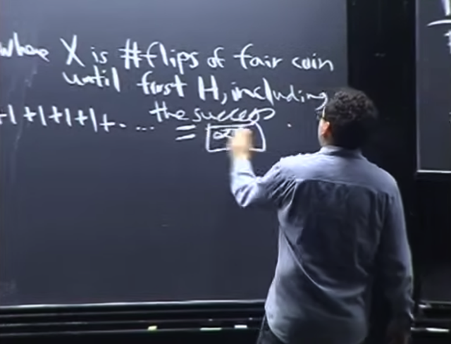</kbd>

<kbd></kbd>

<kbd>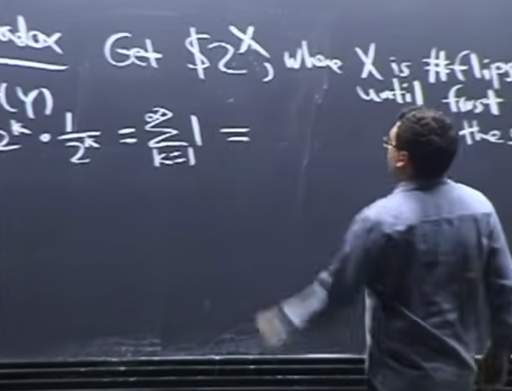</kbd>

> [!NOTE]
> Và như vậy ta có E(Y) = Tổng k=1:infinity [2^k * 1/(2^k)] = Tổng k=1:infinity [1] = 1+1+....1
> (có vô cùng lớn số 1) = **inifinity**

 

<kbd>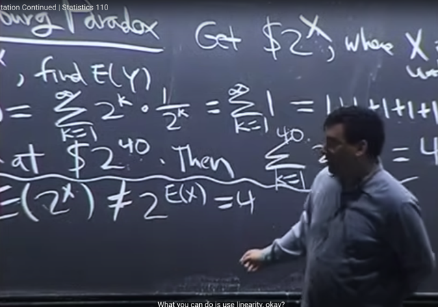</kbd>

> [!NOTE]
> Cuối cùng gs nhắc ta rằng **TA KHÔNG ĐƯỢC MOVE E AROUND**
> kiểu như cho rằng **E(2^X) = 2^(E(X)** (là sai)
>
> Vì ví dụ như ở đây khi làm vậy 2^(E(X) sẽ chỉ có = 2^(1/p) = 2^(1/0.5) =
> 2^2 = 4 TRONG KHI KẾT QUẢ ĐÚNG LÀ INFINITY như đã thấy
>
> Ta **chỉ được dùng LINEARITY thôi**

 

