# Lec 11: Poisson Distribution

📊 **Progress:** `37` Notes | `47` Screenshots

---

## Tóm Tắt:

> [!NOTE]
> TÓM TẮT:
>
> Poisson distribution X ~Pois(λ)
>
> PMF P(X=k) = e^-λ λ^k / k! k = 0,1,2....
>
> - Chứng minh PMF valid: không âm và Σk P(X=k) = 1
>
> - E(X) = λ
>
> - Story của Poison: Số success trial khi có rất nhiều trial với xác suất
> success nhỏ
>
> - Poison paradigm: Có nhiều event Ai, xác suất xảy ra mỗi event nhỏ
> π ⇨ Có thể approx số event xảy ra (success) bởi Pois distribution
>
> - Poison paradigm cho phép các event có thể weak independent
>
> E[#số event xảy ra] = λ = Σ π
>
> - KHI n LỚN VÀ p NHỎ LẠI (ĐỂ GẦN TRỞ VỀ POISSON PARADIGM)
> thì BINOMIAL (n, p) SẼ CONVERGE VỀ POISSON
>
> Chứng minh khi n LỚN ĐẾN VÔ CÙNG và p NGÀY CÀNG NHỎ thì
> BINOMIAL sẽ CONVERGE về POISSON.
>
> - Trở lại Bài toán Birthday tính xác suất có ít nhất 1 bộ 3 người trùng
> ngày sinh: Vì số bộ 3 người là lớn, và xác suất 1 bộ 3 người trùng ngày
> sinh xảy ra là nhỏ, nên số bộ 3 trùng ngày sinh có thể approx bởi poison
> r.v Từ đó ta tính E(X) để có λ. Và từ đó tính P(có ít nhất 1 bộ trùng ngày
> sinh) =  P(X!=0) = 1 - P(X=0)

 

<kbd></kbd>

> [!NOTE]
> Đầu tiên gs cho biết ra nhiều người lẫn lộn giữa **RANDOM VARIABLE** và
> **DISTRIBUTION** CỦA NÓ (tức PMF) . Ông gọi nó là **Sympathetic magic.**

 

<kbd></kbd>

> [!NOTE]
> Đại khái là mấy bài trước ta đã thảo luận một số ví dụ liên quan đến **SUM
> CÁC RANDOM VARIABLE** như ta đã chứng minh**tổng của hai Binomial
> random variable X, Y** (có cùng p)**cũng là một Binomial random variable**
>
> Và ta sẽ còn làm nhiều thêm các ví dụ khác
>
> Tuy nhiên ta chưa bao giờ nói gì đến viêc **SUM CÁC PMF**

 

<kbd></kbd>

> [!NOTE]
> Và dễ thấy **không có lí do gì để tổng của chúng vẫn tuân theo tính chất xác
> suất như <= 1**. Và hơn nữa **nó là hai function theo hai biến x, y khác nhau**.

 

<kbd></kbd>

> [!NOTE]
> Nói chung là ta **không nên lẫn lộn** giữa **Random Variable** và **Distribution**
> (PMF). Gs cho biết sự lẫn lộn này giống như lẫn lộn giữa map và territory
> vậy

 

<kbd></kbd>

<kbd></kbd>

<kbd></kbd>

> [!NOTE]
> Hoặc ta có thể coi **random variable như căn nhà** còn **distribution như bản thiết kế**
> căn nhà. **Ta không thể ở trong bản thiết kế** của căn nhà.
>
> Và vì vậy ta **có thể có nhiều căn nhà với cùng một design**. GIống như ta có thể có
> **NHIỀU RANDOM VARIABLE** CÓ CÙNG **MỘT DISTRIBUTION**. Ví dụ như trong
> Binomial ta có n i.i.d indicator random variable đều có distribution Bern(p)

 

<kbd></kbd>

🔗 **Related:** [TÓM TẮT:  Poisson distribution X ~Pois(λ)  PMF P(X=k) = e^-λ λ^k / k! k = 0,1,2....  - Chứng minh PMF valid: không âm và Σk P(X=k) = 1  - E(X) = λ  - Story của Poison: Số success trial khi có rất nhiều trial với xác suất success nhỏ  - Poison paradigm: Có nhiều event Ai, xác suất xảy ra mỗi event nhỏ π ⇨ Có thể approx số event xảy ra (success) bởi Pois distribution  - Poison paradigm cho phép các event có thể weak independent  E[#số event xảy ra] = λ = Σ π  - KHI n LỚN VÀ p NHỎ LẠI (ĐỂ GẦN TRỞ VỀ POISSON PARADIGM) thì BINOMIAL (n, p) SẼ CONVERGE VỀ POISSON  Chứng minh khi n LỚN ĐẾN VÔ CÙNG và p NGÀY CÀNG NHỎ thì BINOMIAL sẽ CONVERGE về POISSON.  - Trở lại Bài toán Birthday tính xác suất có ít nhất 1 bộ 3 người trùng ngày sinh: Vì số bộ 3 người là lớn, và xác suất 1 bộ 3 người trùng ngày sinh xảy ra là nhỏ, nên số bộ 3 trùng ngày sinh có thể approx bởi poison r.v Từ đó ta tính E(X) để có λ. Và từ đó tính P(có ít nhất 1 bộ trùng ngày sinh) =  P(X!=0) = 1 - P(X=0)](tóm_tắt_poisson_distribution_x_poisλ_pmf_pxk_e_λ_λk_k_k_012_chứng_minh_pmf_valid_không_âm_và_σk_pxk_.md#node-327)

> [!NOTE]
> Mình sẽ gặp lại **Poisson** distribution - gs cho là discrete distribution **quan
> trọng nhất** (nói gặp lại là bởi mình đã gặp ở chapter 4 của **Introduction
> to Statistical Learning** về **Poisson Regression** - là mô hình regression
> phù hợp cho dataset có tính chất là **variance của Y không fixed**, vốn là yêu
> cầu (assumption) của linear regression)
>
> PMF của nó là như vầy: 
>
> P(X=k) = **e^-λ λ^k / k!** với k = {0,1,2...}
>
> Trong đó λ là tham số, mang gía trị **thực** **dương** bất kì, gọi là  **"rate" 
> parameters**

> [!NOTE]
> POISSON DISTRIBUTION

 

<kbd>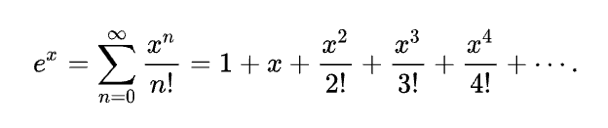</kbd>

<kbd></kbd>

<kbd>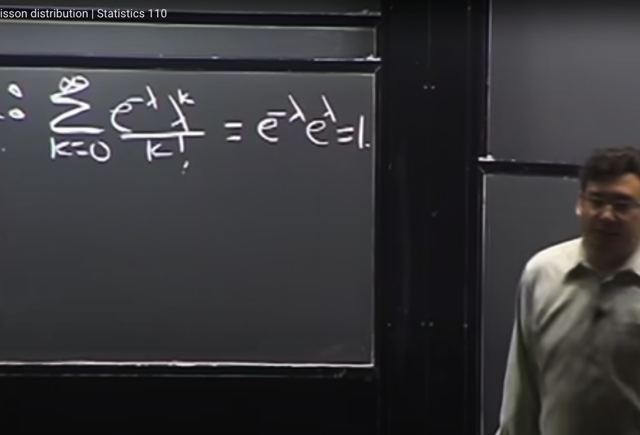</kbd>

> [!NOTE]
> Như thường lệ, ta sẽ **check tính valid của nó** (xem nó có **không âm** không,
> và có **tổng PMF với mọi k bằng 1 không**)
>
> Điều kiện **PMF không âm** dễ thấy vì **e^-λ** và **λ**đều **không âm**,  
>
> ∑ k: [e^(-λ) * λ^k] / k!  
>
> Đưa e^(-λ) không phụ thuộc k ra ngoài:
>
> = e^(-λ) ∑ k=0:inf λ^k / k!
>
> Thế thì **∑ k=0:inf λ^k / k!** là **Taylor series của e^λ (*), nên nó = e^λ**
>
> Do đó, e^(-λ) **∑ k=0:inf của [e^(-λ) * λ^k] / k!** = e^(-λ) * **e^λ** = e^0 = **1**
>
> ====
>
> Nhớ lại công thức Taylor expansion hàm f(x) tại a
>
> f(x) = ∑ n=0:inf [đạo hàm cấp n của f(x) evaluated tại a] * [x-a]^n / n!
>
> Áp dụng với hàm f(x) = e^x và expand tại a = 0. Ta có đạo hàm cấp n của e^x
> = e^x với mọi n.
>
> e^x = ∑ n=0:inf e^(0) * (x-0)^n / n! = ∑ n=0:inf 1 * x^n / n!
>
> =>**e^x = ∑ n=0:inf x^n/n!**, do đó**e^λ = ∑ n=0:inf λ^n/n!**

 

<kbd></kbd>

> [!NOTE]
> Ta kí hiệu một **Poisson** random variable X
> như vầy: **X ~ Pois (λ)**

 

<kbd>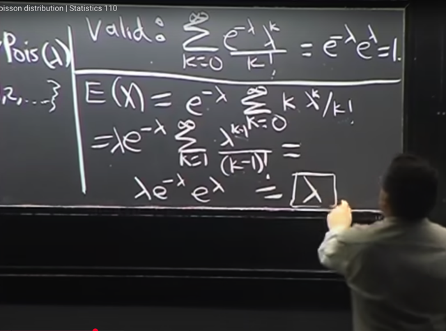</kbd>

> [!NOTE]
> Tiếp theo ta**tính E(X)**. Như định nghĩa là **weighted sum các possible value**, k, 
> với **xác suất tương ứng P(X=k)**
>
> E(X) = Σk=0:inf [k * P(X=k)] = **Σk=0:inf [k * e^(-λ) * λ^k / k!]**
>
> đưa e^(-λ) ra ngoài vì không dính đến k: 
>
> = e^(-λ) * Σk=0:inf [k * λ^k / k!] 
>
> vì **k = 0 thì hạng tử cũng bằng 0** nên có thể **cho k từ 1**
>
> = e^(-λ) * Σk=1:inf [k * λ^k / k!] 
>
> = e^(-λ) * Σk=1:inf [λ^k / (k-1)!]
>
> **Lấy bớt 1 λ** ra ngoài
>
> = e^(-λ) * λ * Σk=1:inf [**λ^(k-1) / (k-1)!**] 
>
> Thì E(X) = **Σk=0:inf [λ^(k-1) / (k-1)!]** , ta có thể **đặt n = k-1** để có:
>
> **EX = e^(-λ) * λ * Σn=0:inf [λ^n / n!]** thì cái tổng **lại chính là Taylor 
> series của e^λ**
>
> Nên kết quả là e^(-λ) * λ * e^λ =**λ**Đây cũng là kiến thức mà ta đã biết từ I.S.L, **Expected value của Poisson
> random variable là λ**

> [!NOTE]
> E(X) CỦA POISSON: X ~ Pois (λ); E(X) = λ

 

<kbd></kbd>

> [!NOTE]
> đại khái là gs nói về **ứng dụng** nơi mà**Poisson distribution thường được 
> dùng**. 
>
> General setting là khi mà ta **CẦN ĐẾM SỐ SUCCESS TỪ MỘT SỐ LƯỢNG 
> LỚN CÁC TRIAL, MÀ MỖI TRIAL** **CÓ XÁC SUẤT SUCCESS NHỎ**
>
> ("success" gs lưu ý là một cách nói, có thể mang nhiều ý nghĩa trong từng
> bài toán cụ thể)

> [!NOTE]
> Story của Poison: CẦN ĐẾM SỐ SUCCESS TỪ MỘT SỐ LƯỢNG 
> LỚN CÁC TRIAL, MÀ MỖI TRIAL CÓ XÁC SUẤT SUCCESS NHỎ

 

<kbd></kbd>

> [!NOTE]
> Một số ví dụ, gs lưu ý rằng **các ví dụ này có thể không chính xác là
> Poisson** vì còn phải xem xét sau.
>
> Nhưng ý tưởng là, những ví dụ này đều có kiểu kiểu tính chất là có **nhiều
> trials** và trong đó **mỗi trials có xác suất success thấp**. Do đó t**uy
> distribution của chúng có thể không chính xác là Poisson** nhưng Poisson
> sẽ**luôn là lựa chọn hàng đầu để approximate chúng.**
>
> Ví dụ số emails nhận được trong một giờ: có **nhiều người có thể gửi  email
> cho mình** (việc này giống như có nhiều trial) nhưng trong một giờ cụ thể
> nào đó thì **xác suất một người gửi mail cho mình (xác suất trial success)
> thấp**
>
> Hay **có nhiều chỗ trên cái bánh** quy (nhiều trial) nhưng **xác suất chỗ đó có
> chocolate thấp** (xác suất trial success)
>
> Hay **có nhiều ngày trong năm** (nhiều trial) nhưng **xác suất một ngày có động
> đất thấp**

 

<kbd></kbd>

<kbd></kbd>

<kbd></kbd>

> [!NOTE]
> Và ta gọi đó là mô hình **Poisson Poisson paradigm**. Có **SỐ LƯỢNG LỚN N EVENTS A_j** với
> **XÁC SUẤT EVENT p_j XẢY RA NHỎ** (điều này cũng giống như có số lớn trial, xác suất success
> của mỗi trial nhỏ)

> [!NOTE]
> POISON PARADIGM: Có SỐ LƯỢNG LỚN N EVENTS A_j với
> XÁC SUẤT EVENT XẢY RA p_j NHỎ

 

<kbd>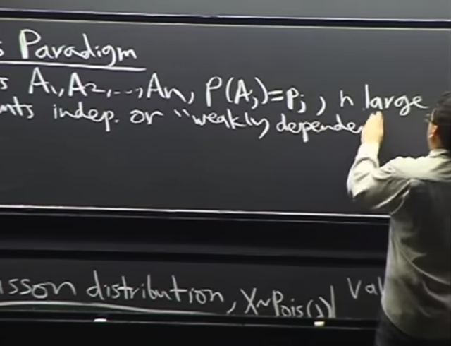</kbd>

> [!NOTE]
> Tiếp, Poisson Paradigm **cho phép các event không cần phải
> INDEPENDEN**T, MÀ CÓ THỂ **WEAK DEPENDENCE**
>
> Khái niệm **WEAKLY DEPENDENCE**. Independence là khi **một event A1
> xảy ra** **KHÔNG CHO TA CHÚT THÔNG TIN NÀO** **về việc event A2 xảy
> ra hay không**.
>
> Nhưng **WEAKLY DEPENDENCE**, có thể hiểu kiểu như **nếu A1, A2 xảy
> ra** nó **CÓ  THỂ CHO TA MỘT ÍT THÔNG TIN** về **khả năng A3 xảy ra**

 

<kbd>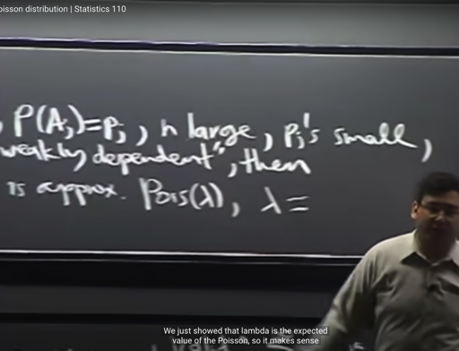</kbd>

<kbd></kbd>

<kbd></kbd>

<kbd></kbd>

<kbd>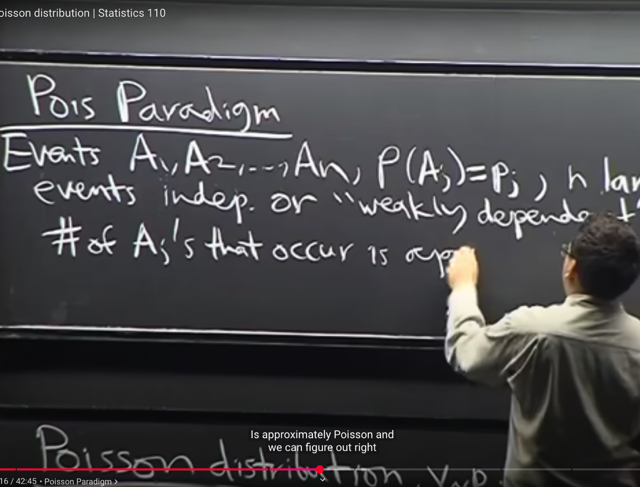</kbd>

🔗 **Related:** [TÓM TẮT:  Poisson distribution X ~Pois(λ)  PMF P(X=k) = e^-λ λ^k / k! k = 0,1,2....  - Chứng minh PMF valid: không âm và Σk P(X=k) = 1  - E(X) = λ  - Story của Poison: Số success trial khi có rất nhiều trial với xác suất success nhỏ  - Poison paradigm: Có nhiều event Ai, xác suất xảy ra mỗi event nhỏ π ⇨ Có thể approx số event xảy ra (success) bởi Pois distribution  - Poison paradigm cho phép các event có thể weak independent  E[#số event xảy ra] = λ = Σ π  - KHI n LỚN VÀ p NHỎ LẠI (ĐỂ GẦN TRỞ VỀ POISSON PARADIGM) thì BINOMIAL (n, p) SẼ CONVERGE VỀ POISSON  Chứng minh khi n LỚN ĐẾN VÔ CÙNG và p NGÀY CÀNG NHỎ thì BINOMIAL sẽ CONVERGE về POISSON.  - Trở lại Bài toán Birthday tính xác suất có ít nhất 1 bộ 3 người trùng ngày sinh: Vì số bộ 3 người là lớn, và xác suất 1 bộ 3 người trùng ngày sinh xảy ra là nhỏ, nên số bộ 3 trùng ngày sinh có thể approx bởi poison r.v Từ đó ta tính E(X) để có λ. Và từ đó tính P(có ít nhất 1 bộ trùng ngày sinh) =  P(X!=0) = 1 - P(X=0)](tóm_tắt_poisson_distribution_x_poisλ_pmf_pxk_e_λ_λk_k_k_012_chứng_minh_pmf_valid_không_âm_và_σk_pxk_.md#node-335)

> [!NOTE]
> Thế thì**KHI MỘT SETTING MÀ CÓ CÁC ĐẶC ĐIỂM PHÙ HỢP NHƯ VỪA RỒI** ta **SẼ CÓ THỂ TUYÊN BỐ 
> (CLAIM)** **RẰNG:** 
>
> **#Số event Aj xuất hiện (tương đương số trial success)** sẽ có thể **COI NHƯ, XẤP XỈ NHƯ** một **Poisson (λ)** 
> r**andom variable**, hay nói cách khác nó sẽ tuân theo **Poisson distribution**
>
> **ĐỂ TỪ ĐÓ CÓ THỂ DÙNG PMF CỦA POISSON ĐỂ XẤP XỈ PMF CỦA NÓ**
>
> Và ta**đã chứng minh** **Expected value** của Poisson random variable là **λ**.
>
> Nên bây giờ khi ta nói **#số event Aj xuất hiện** sẽ xấp xỉ là một**Poisson random variable** thì **sẽ make sense
> nếu ta cho rằng expected value của #số event Aj xuất hiện chính là bằng λ**
>
> **E[#Số event Aj xuất hiện] = λ**
>
> Nhưng bên cạnh đó,
>
> #**Số event Aj xuất hiện = Tổng các indicator random variables (gắn với mỗi event)**
>
> = **X1 + X2...+Xn**
>
> Nên **E[#Số event Aj xuất hiện] = E[X1 + X2...+Xn]**
>
> Theo **linearity**
>
> = E(X1) + E(X2) + ..E(Xn)
>
> Và dùng **fundamental bridge E(X) = P(A)**với ý nghĩa là expected value của indicator random X variable
> bằng xác suất xảy ra của event A mà X đại diện / gắn với
>
> = P(A1) + P(A2) + ...P(An)
>
> = p1 + p2 + ..pn
>
> Vậy từ (1) và (2) ta có **λ = p1 + p2 + ..pn**

 

<kbd>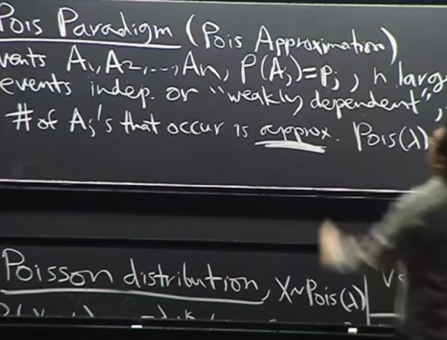</kbd>

> [!NOTE]
> Và đây nên nhớ là **Poisson approximation** (Poisson paradigm) nơi **ta xấp
> xỉ một giá trị với Poisson distribution** dù **distribution thật sự** có thể **không
> phải Poisson** như hồi nãy nói

 

<kbd></kbd>

> [!NOTE]
> Và **một trường hợp đặc biệt** mà ta đã làm việc nhiều bữa giờ là **khi các
> event** **INDEPENDENT**, và các event **đều có XÁC SUẤT XẢY RA p_j 
> BẰNG NHAU VÀ BẰNG p**
>
> Thì **đó chính là BINOMIAL (n, p)** (như ta đã biết là **distribution của số
> success** khi thực hiện **n trial Bern(p) đôc lập**)
>
> Và ta sẽ chứng minh **KHI n LỚN VÀ** **p NHỎ LẠI (ĐỂ GẦN TRỞ VỀ
> POISSON PARADIGM) thì BINOMIAL SẼ CONVERGE VỀ POISSON**

> [!NOTE]
> KHI n LỚN VÀ p NHỎ LẠI (ĐỂ GẦN TRỞ VỀ POISSON PARADIGM)
> thì BINOMIAL (n, p) SẼ CONVERGE VỀ POISSON

 

<kbd></kbd>

🔗 **Related:** [TÓM TẮT:  Poisson distribution X ~Pois(λ)  PMF P(X=k) = e^-λ λ^k / k! k = 0,1,2....  - Chứng minh PMF valid: không âm và Σk P(X=k) = 1  - E(X) = λ  - Story của Poison: Số success trial khi có rất nhiều trial với xác suất success nhỏ  - Poison paradigm: Có nhiều event Ai, xác suất xảy ra mỗi event nhỏ π ⇨ Có thể approx số event xảy ra (success) bởi Pois distribution  - Poison paradigm cho phép các event có thể weak independent  E[#số event xảy ra] = λ = Σ π  - KHI n LỚN VÀ p NHỎ LẠI (ĐỂ GẦN TRỞ VỀ POISSON PARADIGM) thì BINOMIAL (n, p) SẼ CONVERGE VỀ POISSON  Chứng minh khi n LỚN ĐẾN VÔ CÙNG và p NGÀY CÀNG NHỎ thì BINOMIAL sẽ CONVERGE về POISSON.  - Trở lại Bài toán Birthday tính xác suất có ít nhất 1 bộ 3 người trùng ngày sinh: Vì số bộ 3 người là lớn, và xác suất 1 bộ 3 người trùng ngày sinh xảy ra là nhỏ, nên số bộ 3 trùng ngày sinh có thể approx bởi poison r.v Từ đó ta tính E(X) để có λ. Và từ đó tính P(có ít nhất 1 bộ trùng ngày sinh) =  P(X!=0) = 1 - P(X=0)](tóm_tắt_poisson_distribution_x_poisλ_pmf_pxk_e_λ_λk_k_k_012_chứng_minh_pmf_valid_không_âm_và_σk_pxk_.md#node-329)

> [!NOTE]
> Và đại khái là **Poisson khái quát hơn** khi có thể cover case mà **xác suất
> xuất hiện của mỗi even**t / hay x**ác suất success của mỗi trial** **KHÁC NHAU**
> Cũng như **cho phép các event** **SLIGHTLY DEPENDENT
>
> (Còn Binomial (n,p) yêu cầu bối cảnh phải là các i.i.d Bern(p) trials)**

 

<kbd></kbd>

<kbd></kbd>

<kbd></kbd>

🔗 **Related:** [TÓM TẮT:  Tiếp tục về CDF: Định nghĩa của CDF  Bước nhảy của CDFD là giá trị PMF tại đó  Tính chất của CDF: 1) Non decreasing, 2) right continuous và   3) F(x) -> 0 khi x -> -infinity, F(x) -> 1 khi x -> -infinity  - Định nghĩa Independent random variables theo independent event:  X, Y độc lập khi  + Continuous rv: P(X≤x, Y≤y) = P(X≤x) * P(Y≤y) với mọi x, y   + Discrete rv: P(X=x,Y=y) = P(X=x)*P(Y=y)  - Expected value: Là con số tóm tắt distribution của r.v  - Hai cách tính average  - E(X) = Σx x*P(X=x)  - X ~ Bern(p) thì E(X) = p  - FUNDAMENTAL BRIDGE: E(X) = P(A), X là indicator rv mang giá trị = 1 khi event A xảy ra và 0 khi ngược lại  - X ~ Bin(n, p):  E(X) = ∑ k=0,1..n [ k * (n choose k)*p^k*q^(n-k)] = ..= np  - TÍNH LINEARITY CỦA AVERAGE  - Tính lại E(X) của Bin(n, p) nhanh hơn bằng linearity, fundamental bridge và E(X) của Bern(p)  - TÍnh E(X) của Hypergeometric Dù các trial không độc lập nhưng dùng Symmetry, linearity, fundamental bridge vẫn tính được  - X ~ Geom(p): P(X=k) = q^k*p  - E(X) = p Σ k=0:infinity [k * q^k]](tóm_tắt_tiếp_tục_về_cdf_định_nghĩa_của_cdf_bước_nhảy_của_cdfd_là_giá_trị_pmf_tại_đó_tính_chất_của_cd.md#node-250)

> [!NOTE]
> đại khái là ta sẽ **chứng minh rằng** **khi n LỚN ĐẾN VÔ CÙNG** và**p NGÀY CÀNG NHỎ** thì **BINOMIAL sẽ CONVERGE về POISSON**. 
>
> Như ta đã biết **expected value của Bin (n, p)** (random variable) là **np** (*) 
>
> Và lúc nãy ta đã chứng minh **expected value của Poisson là λ**. (**)
>
> Ta sẽ **có thể cho: λ = np <=> p = λ/n**(chỗ này ta hiểu là ý chính là nêu điều kiện là, khi ta cho n->inf và p->0 thì **phải giữ np
> fixed, bằng con số nào đó, gọi tạm là λ**. Khi đó, ta sẽ chứng minh PMF sẽ converge về dạng PMF của Poisson, mà tham số
> sẽ là np, tức λ, **chứ nếu không giữ np fixed, thì PMF cũng sẽ không converge được**. Trong sách gs có nói, việc chứng minh như
> ở đây cũng sẽ đúng nếu np không fixed mà sao đó để converge về một constant. Nói tóm lại, không phải là "chưa chứng minh xong
> đã cho rằng np = λ, mà là, ta đặt điều kiện np fixed, và từ đó chứng minh rằng khi lấy limit của Bin(n,p) PMF nó sẽ converge về dạng 
> Poisson PMF, mà trong đó parameter chính là np) 
>
>
> (*) Có thể review nhanh / chứng minh nhanh lại bằng story như sau: Khi X ~ Bin(n, p) story của X là số trial success trong n i.i.d
> Bern(p) trials. Vậy thì X = X1 + X2 + ...Xn (tổng của n indicator random variable gắn với mỗi trial / event A_j là event [trial j success])
> khi đó EX = E(X1 + X2 + ..Xn). Theo **LINEARITY**, nó sẽ bằng EX1 + EX2 + ..EXn. Và dùng **FUNDAMENTAL BRIDGE**, EXj = P(Aj) và
> đều bằng p (do n trial là Bern(p)). Vậy **EX = n*p**(*) review nhanh: fX(k) = e^-λ λ^k / k!. Σk=0:inf fX(k) = Σk=0:inf e^-λ λ^k / k! = e^-λ Σk=0:inf λ^k / k! = e^-λ Σk=0:inf λ^k / k!
> = e^-λ e^λ = 1

> [!NOTE]
> CHỨNG MINH n LỚN ĐẾN VÔ CÙNG và p NGÀY CÀNG NHỎ thì BINOMIAL sẽ CONVERGE về
> POISSON.

 

<kbd></kbd>

> [!NOTE]
> Cụ thể là ta sẽ xem**PMF của Binomial** như đã biết
>
> **P(X=k) = (n choose k) p^k (1-p)^(n-k)**,
>
> sẽ **trở thành như thế nào** khi **p->0**(ứng với việc xác suất
> success của các trial trở nên nhỏ)
>
> Và **n-> infinity** (ứng với việc số trial trở nên lớn). **k giữ cố định**

 

<kbd></kbd>

> [!NOTE]
> Rồi, ta sẽ dùng **đại số** để **triển khai ra** một chút trước khi**tính limit của nó**.
>
> **(n choose k)** theo ý nghĩa hoặc theo công thức ta nhớ nó là **số cách chọn set
> k item từ n item không care thứ tự**. Để rồi nó là **n*(n-1)...*(n-k+1)/k!**
>
> Thế p = λ/n vào ta có
>
> n*(n-1)...(n-k+1)/k! * (λ/n)^k (1-λ/n)^(n-k)
>
> Viết thành:
>
> n*(n-1)...(n-k+1)/**k!** * (**λ^k**/n^k) * (1-λ/n)**^n** * (1-λ/n)**^(-k)**
>
> Tiếp ta mới **tách những cái không dính đến (n, p) ra**:
>
> [**λ^k**/ **k!**] * [n*(n-1)...(n-k+1) / n^k] * (1-λ/n)^n * (1-λ/n) ^(-k)
>
> Thế thì xét  [n*(n-1)...(n-k+1) / n^k]:
>
> [n*(n-1)...(n-k+1) / n^k] = (n / n) * [(n-1) / n] * [(n-2) / n] * ... * [(n-k+1) / n]
>
> và mỗi tỉ số này đều tiến tới 1 khi n -> infinity

 

<kbd>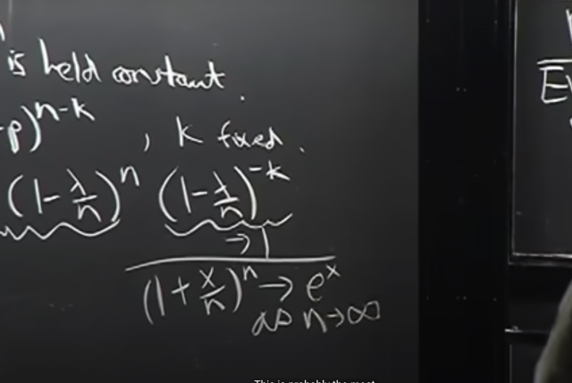</kbd>

> [!NOTE]
> Xét (1-λ/n) ^(-k):
>
> [1 - λ/n]^(-k) sẽ tiến tới 1 vì khi n -> inf thì λ/n -> 0, nên (1 - λ/n)^(-k) sẽ tiến 
> tới (1-0)^(-k) = 1
>
>
> Sau đó gs ghi chú cho ta **một công thứ**c mà ông cho là **quan trọng nhất của 
> limit** là: 
>
> **(1 + x/n)^n sẽ tiến về e^x khi n -> infinity**
>
> Do đó **áp dụng cái này** ta sẽ có **(1- λ/n)^n** sẽ tiến tới**e^(-λ)**

 

<kbd>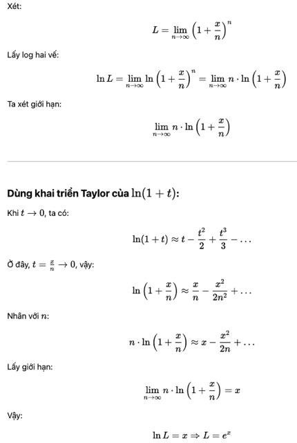</kbd>

> [!NOTE]
> Phần chứng minh lim n->inf (1+x/n)^n = e^x của
> ChatGPT

 

<kbd>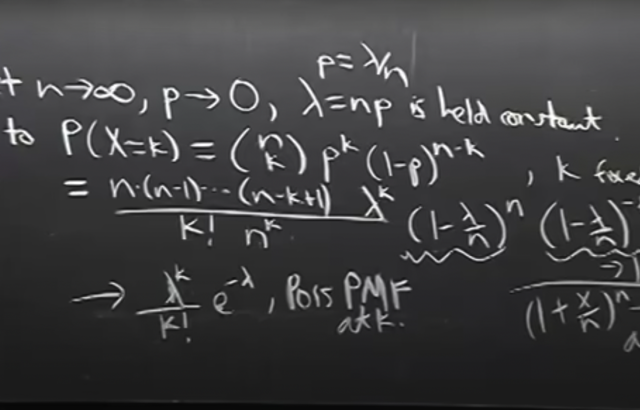</kbd>

🔗 **Related:** [TÓM TẮT:  Poisson distribution X ~Pois(λ)  PMF P(X=k) = e^-λ λ^k / k! k = 0,1,2....  - Chứng minh PMF valid: không âm và Σk P(X=k) = 1  - E(X) = λ  - Story của Poison: Số success trial khi có rất nhiều trial với xác suất success nhỏ  - Poison paradigm: Có nhiều event Ai, xác suất xảy ra mỗi event nhỏ π ⇨ Có thể approx số event xảy ra (success) bởi Pois distribution  - Poison paradigm cho phép các event có thể weak independent  E[#số event xảy ra] = λ = Σ π  - KHI n LỚN VÀ p NHỎ LẠI (ĐỂ GẦN TRỞ VỀ POISSON PARADIGM) thì BINOMIAL (n, p) SẼ CONVERGE VỀ POISSON  Chứng minh khi n LỚN ĐẾN VÔ CÙNG và p NGÀY CÀNG NHỎ thì BINOMIAL sẽ CONVERGE về POISSON.  - Trở lại Bài toán Birthday tính xác suất có ít nhất 1 bộ 3 người trùng ngày sinh: Vì số bộ 3 người là lớn, và xác suất 1 bộ 3 người trùng ngày sinh xảy ra là nhỏ, nên số bộ 3 trùng ngày sinh có thể approx bởi poison r.v Từ đó ta tính E(X) để có λ. Và từ đó tính P(có ít nhất 1 bộ trùng ngày sinh) =  P(X!=0) = 1 - P(X=0)](tóm_tắt_poisson_distribution_x_poisλ_pmf_pxk_e_λ_λk_k_k_012_chứng_minh_pmf_valid_không_âm_và_σk_pxk_.md#node-310)

> [!NOTE]
> Như vậy tất cả, tức P(X=k) sẽ tiến tới **[λ^k / k!] * e^(-λ) hay e^-λ * λ^k / k!**chính là **PMF của Poisson (λ) P(X=k)**Như vậy ta đã chứng minh khi **số lượng trial lớn** với **xác suất success của
> trial nhỏ dần** thì Binomial (n, p) converge về Poisson (λ) (λ = np)

 

<kbd></kbd>

> [!NOTE]
> Tiếp, gs lấy ví dụ ưa thích để giúp ta có thể hiểu hơn về **quan hệ giữa
> Binomial và Poisson**. Là gỉa sử ta **có một tấm bạt** như này, và **cho mưa
> rơi vào đó**, ta muốn **đánh giá xem lượng mưa rơi vào** đó **nhiều hay ít** ra
> sao.
>
> Thì giả sử ta **chia nó thành lưới vô số ô nhỏ**, khi đó có thể thấy **khi ô càng
> nhỏ** thì **xác suất có một hạt mưa rơi trúng sẽ càng nhỏ**. Nhưng bên cạnh
> đó**số ô sẽ nhiều lên**. Đây là b**ối cảnh quen thuộc của Poisson (Poisson
> paradigm: số trial nhiều, nhưng xác suất success của mỗi trial nhỏ)**.
>
> Nên ta có thể **dùng Poisson paradigm để approximate**. Để trong setting mà
> như đã nói có rất nhiều event / trial nhưng xác suất event xảy ra / trial success
> rất nhỏ, ta có thể **xấp xỉ số event xảy ra hay số trial success** (số ô nhỏ bị mưa
> rơi trúng) **theo Poisson distribution.**
>
> Và ta đã biết **Expected value** của Poisson random variable **chính là** **lambda**,
> nên gs nói rằng lambda sẽ cho biết / **giúp đo mức độ mưa lớn hay nhỏ**

 

<kbd></kbd>

🔗 **Related:** [TÓM TẮT:  Poisson distribution X ~Pois(λ)  PMF P(X=k) = e^-λ λ^k / k! k = 0,1,2....  - Chứng minh PMF valid: không âm và Σk P(X=k) = 1  - E(X) = λ  - Story của Poison: Số success trial khi có rất nhiều trial với xác suất success nhỏ  - Poison paradigm: Có nhiều event Ai, xác suất xảy ra mỗi event nhỏ π ⇨ Có thể approx số event xảy ra (success) bởi Pois distribution  - Poison paradigm cho phép các event có thể weak independent  E[#số event xảy ra] = λ = Σ π  - KHI n LỚN VÀ p NHỎ LẠI (ĐỂ GẦN TRỞ VỀ POISSON PARADIGM) thì BINOMIAL (n, p) SẼ CONVERGE VỀ POISSON  Chứng minh khi n LỚN ĐẾN VÔ CÙNG và p NGÀY CÀNG NHỎ thì BINOMIAL sẽ CONVERGE về POISSON.  - Trở lại Bài toán Birthday tính xác suất có ít nhất 1 bộ 3 người trùng ngày sinh: Vì số bộ 3 người là lớn, và xác suất 1 bộ 3 người trùng ngày sinh xảy ra là nhỏ, nên số bộ 3 trùng ngày sinh có thể approx bởi poison r.v Từ đó ta tính E(X) để có λ. Và từ đó tính P(có ít nhất 1 bộ trùng ngày sinh) =  P(X!=0) = 1 - P(X=0)](tóm_tắt_poisson_distribution_x_poisλ_pmf_pxk_e_λ_λk_k_k_012_chứng_minh_pmf_valid_không_âm_và_σk_pxk_.md#node-321)

> [!NOTE]
> Đại khái là, gs cho rằng **nếu ta assume các event** [hạt mưa rơi trúng một ô
> nào đó] **độc lập (independent)**, với **xác suất giống nhau (identical)**, thì ta
> có thể dùng **Binomial**.
>
> Tuy nhiên ở đây ta **không chắc lắm** là các event ô nào đó có mưa rơi trúng
> có độc lập với nhau không.
>
> Hơn nữa, **Binomial đòi hỏi** xác suất success đều là **theo Bern(p)** tức là
> **một là có mưa rơi trúng hai là không**. Mà trong tình huốnng này, **có thể một
> ô có nhiều hạt mưa rơi trúng**, thành ra xác suất trial success / event xảy ra
> cũng không hoàn toàn theo Bern(p).
>
> Do đó bối cảnh bài toán này cũng không hoàn toàn sát với yêu cầu của
> Binomial
>
> Do đó gs nói **sẽ phù hợp với Poisson hơn**, vì Poisson **không đòi hỏi các
> event independent**, và cũng **không đòi hỏi xác suất của các event đều như
> nhau** như ta đã nhận định lúc nãy

 

<kbd>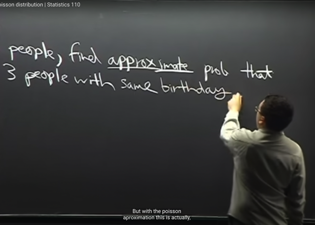</kbd>

> [!NOTE]
> Ta **trở lại bài toán Birthday**, câu hỏi là tính **xấp xỉ** xác suất của **việc có
> 3 người trùng sinh nhật trong n người**.
>
> Gs cho biết nếu ta **tìm cách tiếp cận như khi làm bài toán Birthday với 2
> ngườ**i (ý là tìm xác suất có 2 người trùng ngày sinh nhật) thì **sẽ thấy rất
> khó**. Nhưng với Poisson distribution thì ta sẽ dễ hơn

 

<kbd></kbd>

<kbd></kbd>

<kbd></kbd>

> [!NOTE]
> Đại khái là giống như bài toán Birthday trước t**a thấy chỉ với 23 người là xác suất trùng ngày sinh xảy ra đã hơn
> 50%**. ý gs nói**tuy ta thấy 23 người là không nhiều** như thật ra**23 người tạo nên (23 choose 2) cặp**, là **tương đối
> nhiều**, giúp ta có thể "**hiểu hiểu**" được t**ại sao 23 người lại đủ để xác suất trùng ngày sinh hơn 50%**
>
> Thì **đây cũng vậy**, ta **thật ra không cần n** lớn, mà **ta quan tâm đến n sao cho (N CHOOSE 3) ĐỦ LỚN**, là **số bộ 3
> người.**
>
> Và mỗi bộ 3 đó, hay đúng hơn là **EVENT [3 NGƯỜI ĐÓ TRÙNG NGÀY SINH**], như thường lệ, ta **sẽ gắn với một
> INDICATOR RANDOM VARIABLE** **I_ijk** với (**i < j < k)** **đơn giản là để tránh các tripple lặp lại** (ví dụ có 3 người thì
> chỉ có 1 triple: 123, 4 người thì có 123,124,134
>
> Tức là I_ijk là indicator random variable của A_ijk - event người i, người j, người k trùng ngày sinh (ôn lại về indicator
> random variable thì đương nhiên ý nghĩa của nó là I_ijk sẽ có 2 possible value là 1, 0 với xác suất I_ijk = 1 là P(A_ijk)
> Để rồi tí nữa ta sẽ dùng công cụ Fundamental Bridge: E(I_ijk) = P(A_ijk)

 

<kbd></kbd>

<kbd></kbd>

<kbd>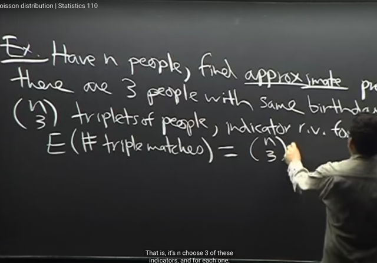</kbd>

> [!NOTE]
> Thế thì dựa vào các công cụ **linearity**, **indicator** **r.v**, **fundamental** **bridge** ta có **E(#Số triple có matched birthday)** sẽ là:
>
> Như cách định nghĩa về **#số success trial** X có theo định nghĩa là **tổng của các indicator random variable X1 + X2 +..**
>
> Nên **#Số triple matched** = **Tổng mọi indicator random variable I_ijk**
>
> Nên **E(#Số tripple matched)** = **E(Tổng mọi indicator random variable I_ijk )**
>
> Theo **linearity** = **Tổng (mọi I_ijk) E(I_ijk) (1)**
>
> Và theo **fundamental bridge**, **E(I_ijk) = P([tripple match ijk xảy ra])**
>
> Vậy thì xét bộ 3 người (i,j,k), ta sẽ tính xác suất họ trùng sinh nhật, tức P(A_ijk) theo **naive definition**
>
> **Sample space**: **Chọn ngày sinh cho 3 người** thì có **365^3 possible outcomes**
>
> **Event space**: Đếm các possible outcome thuộc event space [trùng ngày sinh]: 
>
> theo 3 bước: chọn ngày sinh cho ông thứ nhất: 365, chọn ngày sinh cho ông thứ 2: 1 (vì phải trùng với ông thứ 1), chọn ngày 
> sinh cho ông thứ 3: 1. Vậy theo step rule có **365 possible outcome thuộc event space**.
>
> Vậy **P[triple i,j,k match]  (hay P(A_ijk) là 365/365^3 = 1/365^2**
>
> Vì mọi triple đều tương tự như vậy nên P của chúng đều là 1/365^2
>
> Vậy (1) = Tổng (mọi I_ijk) E(I_ijk) = Tổng (mọi I_ijk) P([tripple match ijk xảy ra]) = **Tổng (mọi I_ijk) [1/365^2]**
>
> Và có **(n choose 3)** triples nên kết quả **E(#Số tripple matched)** sẽ là**(n choose 3) [1/365^2]
>
> THẾ THÌ BƯỚC NÀY, NÃY ĐẾN GIỜ, TA HIỂU LÀ, TA ĐÃ DÙNG CÁC CÔNG CỤ NHƯ LINEARITY, FUNDAMENTAL
> BRIDGE ĐỂ TÍNH EXPECTED VALUE CỦA #Số triple có matched birthday. CHƯA NÓI GÌ ĐẾN CÁI MÀ TA CẦN TÍNH
> LÀ XÁC SUẤT CÓ ÍT NHẤT MỘT TRIPLE MATCHED CẢ**

 

<kbd>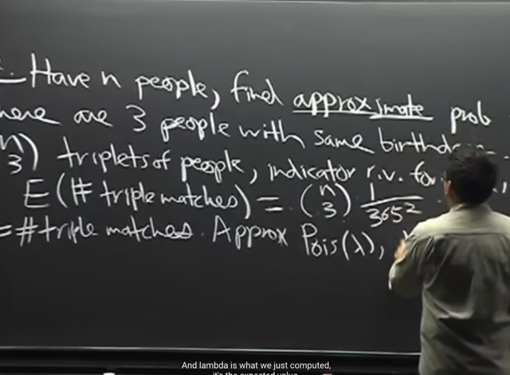</kbd>

> [!NOTE]
> Gs cho rằng X (#Số triple matched) **không thể chính xác là một Poisson**
> random variables vì số triple matched sẽ không thể lớn hơn số triple
>
> Trong khi đó Poisson random variable không bị ràng buộc bởi upper bound
> nào (vì sao nhỉ? Có thể là vì theo định nghĩa của Poisson r.v thì nó không có
> giới hạn trên nào cả)
>
> Nhưng ta **claim** rằng X có thể **approximately** là một Poisson r.v Pois
> (lambda).
>
> Và vì với Poisson rv thì expected value của nó chính là lambda như đã chứng
> minh (theo link). Vậy **E[#Số triple matched] = lambda**.
>
> Thế mà EX tức E[#Số triple matched], ta đã dùng các công cụ **linearity**,
> **fundamental bridge** để tính **expected value ra** (n choose k) [1/365^2]
>
> Từ đó cho phép ta có **lambda = (n choose k) [1/365^2]**

 

<kbd>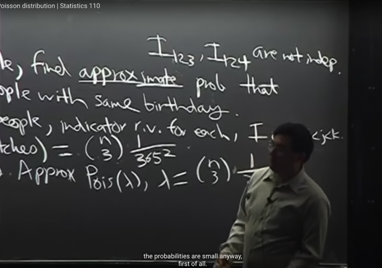</kbd>

> [!NOTE]
> Thế thì gs **lập luận** là**tại sao ta có thể cho rằng có thể xấp xỉ X là một
> Poisson random variable**.
>
> Là bởi **bối cảnh này**, ta **CÓ RẤT NHIỀU EVENTS (các triples, tức là ta có
> rất nhiều bộ ba người)**, và **XÁC SUẤT ĐỂ MỘT EVENT XẢY RA** (bộ 3
> người trùng sinh nhật matched) **RẤT** **THẤP**

 

<kbd>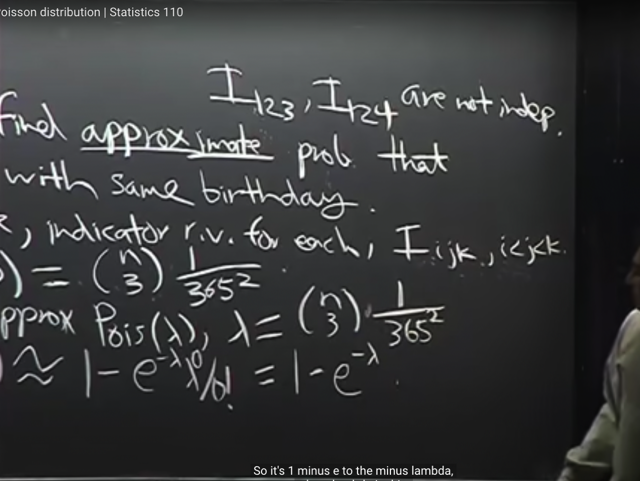</kbd>

🔗 **Related:** [TÓM TẮT:  Poisson distribution X ~Pois(λ)  PMF P(X=k) = e^-λ λ^k / k! k = 0,1,2....  - Chứng minh PMF valid: không âm và Σk P(X=k) = 1  - E(X) = λ  - Story của Poison: Số success trial khi có rất nhiều trial với xác suất success nhỏ  - Poison paradigm: Có nhiều event Ai, xác suất xảy ra mỗi event nhỏ π ⇨ Có thể approx số event xảy ra (success) bởi Pois distribution  - Poison paradigm cho phép các event có thể weak independent  E[#số event xảy ra] = λ = Σ π  - KHI n LỚN VÀ p NHỎ LẠI (ĐỂ GẦN TRỞ VỀ POISSON PARADIGM) thì BINOMIAL (n, p) SẼ CONVERGE VỀ POISSON  Chứng minh khi n LỚN ĐẾN VÔ CÙNG và p NGÀY CÀNG NHỎ thì BINOMIAL sẽ CONVERGE về POISSON.  - Trở lại Bài toán Birthday tính xác suất có ít nhất 1 bộ 3 người trùng ngày sinh: Vì số bộ 3 người là lớn, và xác suất 1 bộ 3 người trùng ngày sinh xảy ra là nhỏ, nên số bộ 3 trùng ngày sinh có thể approx bởi poison r.v Từ đó ta tính E(X) để có λ. Và từ đó tính P(có ít nhất 1 bộ trùng ngày sinh) =  P(X!=0) = 1 - P(X=0)](tóm_tắt_poisson_distribution_x_poisλ_pmf_pxk_e_λ_λk_k_k_012_chứng_minh_pmf_valid_không_âm_và_σk_pxk_.md#node-318)

> [!NOTE]
> Sau đó gs lập luận ta có thể coi các event **WEAK DEPENDENT**
>
> Lập luận **MỤC ĐÍCH LÀ ĐỂ CHO THẤY BỐI CẢNH NÀY, X (#SỐ TRIPLE MATCH)
> CÓ THỂ HỢP LỆ  ĐỂ CÓ THỂ APPROXIMATE VỚI POISSON**.
>
> Do đó, PMF của X TỨC P(X=K) **CÓ THỂ APPROX BẰNG PMF CỦA POISSON**random variable
>
> Nên **cho phép ta có thể dùng P(X=k) = P(#Số triple matched = k) = e^-λ * λ^k / k!**
> Từ đó cái ta cần tính là xác suất có **ÍT NHẤT một triple matched**:
>
> Và để tính P của event này, ta sẽ dùng complement của nó, để từ đó :
>
> **P([ÍT NHẤT một triple matched])** = 1 - **P([KHÔNG CÓ triple matched nào])**
>
> Và P([KHÔNG CÓ triple matched nào]) chính là P(X=0) = e^-λ * λ^0 / 0! = e^-λ * 1 / 1
> = **e^-λ**
>
> Vậy P([ÍT NHẤT một triple matched]) = 1 - P(X=0) = 1 - e^-λ * λ^0 / 0! =**1 - e^λ**

 

