# Lec 12: Discrete Vs Continuous, The Uniform

📊 **Progress:** `51` Notes | `55` Screenshots

---

<a id="node-337"></a>
## Tóm Tắt:

> [!NOTE]
> TÓM TẮT:
>
> Khác biệt đầu tiên giữa discrete và continuous là. sự xuất hiện của
> PDF thay vì PMF
>
> Với continuous `P(X=x)` `=` 0
>
> Do PMF `P(X=x)` USELESS, nên ta cần PDF
>
> Qua continuous case, PDF. Ta không có xác suất mà là MẬT ĐỘ XÁC SUẤT.
> PROBABILITY PER SOMETHING.
>
> PDF của X nếu P(a≤X≤b) `=` `∫a:b` f(x)dx
>
> Nếu a `=` b, thì theo định nghĩa trên, `P(X=a)` sẽ là integrate từ a đến a f(x)dx
> có ý nghĩa là DIỆN TÍCH BÊN DƯỚI ĐƯỜNG F(X) TỪ a TỚI a, ĐƯƠNG
> NHIÊN LÀ BẰNG 0 (hoặc tính cái tích phân này cũng sẽ phải ra 0)
>
> 2 điều kiện để PMF valid: f(x) luôn không âm và `∫` từ `-infinity` đến `+` infinity f(x)dx 
> phải bằng 1
>
> f(x0) HOÀN TOÀN CÓ THỂ LỚN HƠN 1
>
> ...Chưa tóm tắt xong

<br>

<a id="node-338"></a>

<p align="center"><kbd></kbd></p>

> [!NOTE]
> Đại khái là gs cho rằng conceptually **discrete** **distribution** c**ó vẻ dễ
> hơn** continuous nhưng **thực ra ta sẽ thấy continuous sẽ không khó
> hơn mấy**

<br>

<a id="node-339"></a>

<p align="center"><kbd>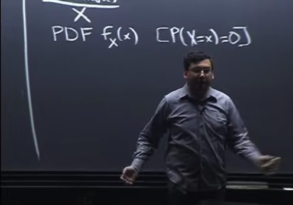</kbd></p>

<p align="center"><kbd></kbd></p>

<p align="center"><kbd>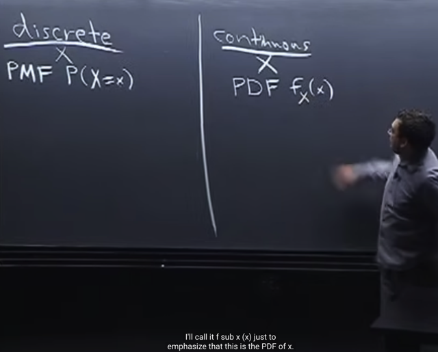</kbd></p>

> [!NOTE]
> **Khác biệt**đầu tiên giữa discrete và continuous là. sự xuất hiện của **PDF**
> thay vì PMF
>
> Gs nói đại khái là vì với continuous r.v, có **có thể có mọi giá trị**, ví dụ trong
> khoảng từ 0 tới 1. Thế thì vì có **VÔ SỐ REAL NUMBER TỪ 0 TỚI 1**. Nên
> **xác suất X mang giá trị cụ thể nào cũng là bằng 0: `P(X=x)` `=` 0 
>
> Do PMF `P(X=x)` USELESS, nên ta cần PDF**

<br>

<a id="node-340"></a>

<p align="center"><kbd>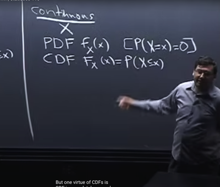</kbd></p>

<p align="center"><kbd></kbd></p>

<p align="center"><kbd>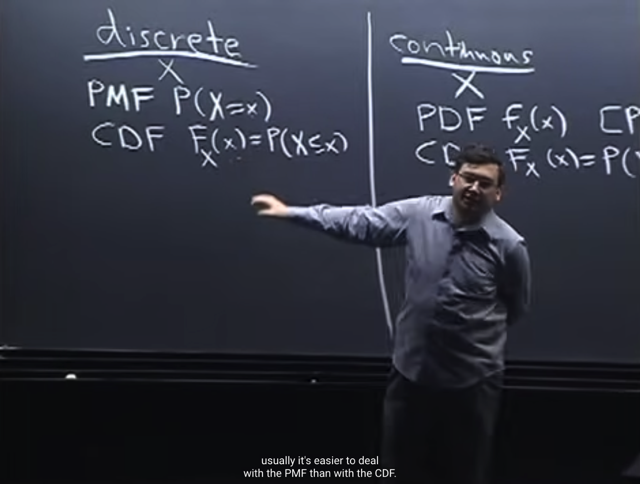</kbd></p>

> [!NOTE]
> Continuous **cũng có CDF** giống như discrete. Ta nhớ nó là
> function **F(x) `=` P(X<=x)**

<br>

<a id="node-341"></a>

<p align="center"><kbd>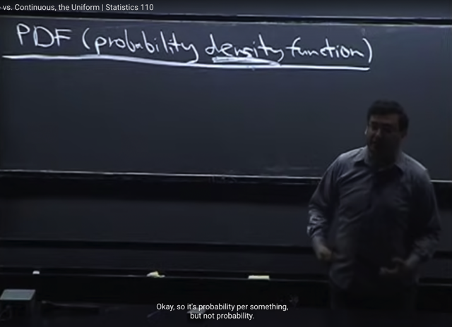</kbd></p>

> [!NOTE]
> Ta sẽ làm quen qua **PDF**. Gs cho rằng **ý chính cần hiểu** là chữ
> **DENSITY** (**Mật độ**). Và đây là **khác biệt quan trọng** với PMF, trong
> PMF, **Mass** mang ý nghĩa là**xác suất**, giống như trong pebble world,
> **tổng khối lượng các viên sỏi bằng 1**, và **KHỐI LƯỢNG mỗi viên sỏi
> (possible outcome) là XÁC SUẤT XẢY RA của possible outcome** đó
>
> Nhưng qua continuous case, PDF. Ta không có xác suất mà là **MẬT ĐỘ
> XÁC SUẤT**. Như mình cũng đã hiểu, ở đây gs nói **hãy nghĩ nó như
> PROBABILITY PER SOMETHING**.
>
> Tức là giống như**mật độ** cần **nhân với diện tích**, hay **thể tích** để ra
> khối lượng (mass)

<br>

<a id="node-342"></a>

<p align="center"><kbd>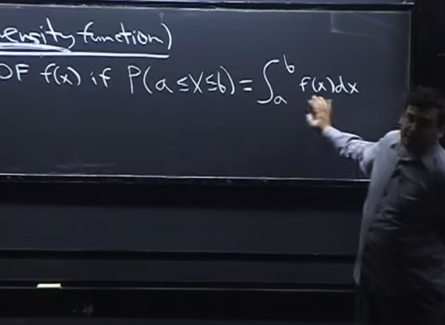</kbd></p>

> [!NOTE]
> định nghĩa là random variable X có **PDF là f(x) là: 
>
> PDF của X** nếu **P(a<=X<=b) `=` integrate a:b f(x)dx**

> [!NOTE]
> ĐỊNH NGHĨA PDF

<br>

<a id="node-343"></a>

<p align="center"><kbd>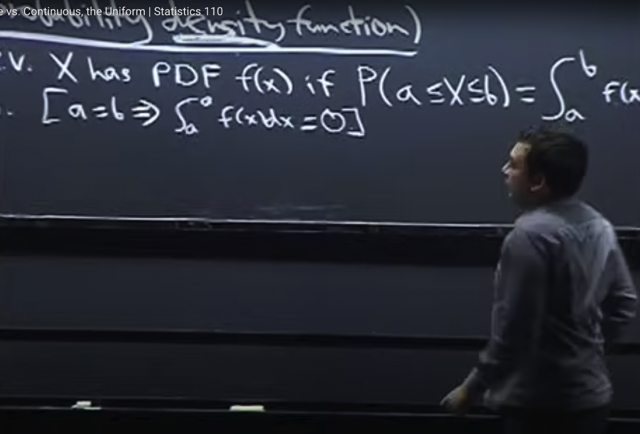</kbd></p>

> [!NOTE]
> Thế thì **nếu a `=` b**, thì **theo định nghĩa trên**, **P(X=a)** sẽ là integrate từ
> a đến a f(x)dx có ý nghĩa là DIỆN TÍCH BÊN DƯỚI ĐƯỜNG F(X) TỪ a TỚI
> a, **ĐƯƠNG NHIÊN LÀ BẰNG 0** (hoặc tính cái tích phân này cũng sẽ phải ra 0)
>
> Đây là kết qủa đồng thuận với nhận định rằng PMF của continuous r, v
> `P(X=x)` `=` 0 với mọi x hồi nãy

<br>

<a id="node-344"></a>

<p align="center"><kbd>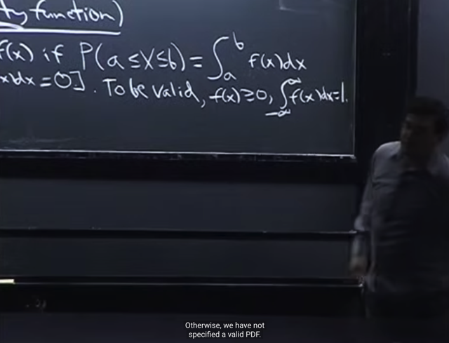</kbd></p>

> [!NOTE]
> Và **tương đương với PMF,** có 2**điều kiện để PMF valid** là mà ta đã biết
>
> 1) không âm và 2) Tổng `P(X=x)` với mọi x bằng 1.
>
> Thì đây cũng vậy, điều kiện của PDF valid là: 
>
> 1) **f(x) luôn không âm** và 
>
> 2) i**ntegrate từ `-infinity` đến `+` infinity f(x)dx phải bằng 1**

<br>

<a id="node-345"></a>

<p align="center"><kbd>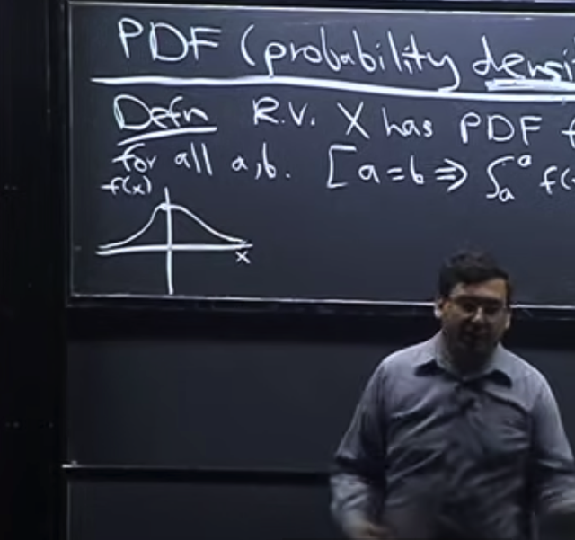</kbd></p>

> [!NOTE]
> gs lấy ví dụ của **một PDF nổi tiếng** mà ta sẽ học ở bài sau là **bell-shape**
> này.
>
> Ý chính là ta sẽ có **DIỆN TÍCH CỦA CÁI HÌNH CHUÔNG này là bằng 1**. Và
> chỗ **đỉnh hình chuông là nơi có MẬT ĐỘ XÁC SUẤT CAO NHẤT**

<br>

<a id="node-346"></a>

<p align="center"><kbd>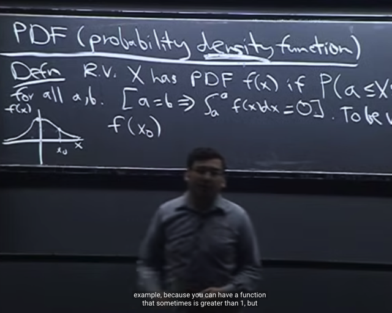</kbd></p>

> [!NOTE]
> Nhưng giá trị tại x0 của nó tức **f(x0)** **HOÀN TOÀN CÓ THỂ LỚN HƠN 1**.
>
> NÊN NÓ **KHÔNG PHẢI LÀ PROBABILITY** NHƯ ĐÃ NÓI, MÀ LÀ **MẬT ĐỘ
> XÁC SUẤT**, để rồi ta **CẦN INTEGRATE, MỚI RA XÁC SUẤT**

<br>

<a id="node-347"></a>

<p align="center"><kbd>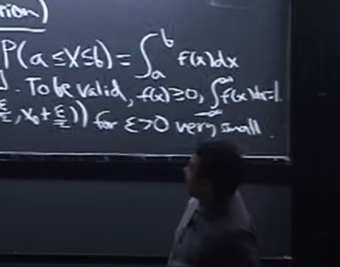</kbd></p>

<p align="center"><kbd></kbd></p>

<p align="center"><kbd>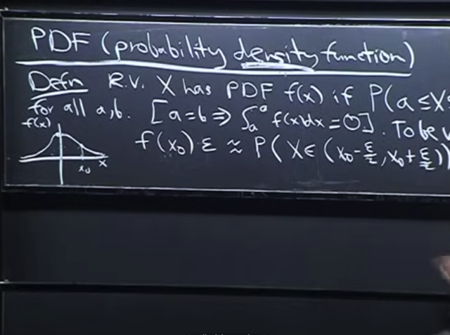</kbd></p>

> [!NOTE]
> Như nãy, đã nói ta **có thể coi PDF** như **XÁC SUẤT PER SOMETHING**, ví dụ như **XÁC SUẤT PER
> LENGTH**. Nên ví dụ như ta có **eps là khoảng (length) rất nhỏ**, thì **f(x0) * eps** có thể coi như là **xác
> suất X có giá trị trong khoảng rất nhỏ từ `x0-eps/2` đến x0+eps/2**

<br>

<a id="node-348"></a>

<p align="center"><kbd>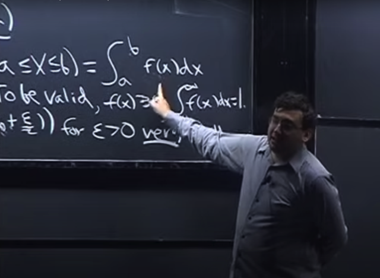</kbd></p>

> [!NOTE]
> Và nếu dùng công thức integrate ta cũng sẽ có kết quả tương tự. Đó là vì với
> **epsilon** **RẤT RẤT NHỎ**, thì **trong khoảng thay đổi rất nhỏ của x**, f(x) **không
> thay đổi mấy**, coi như hằng số.
>
> Và integrate **constant từ a `(=-eps/2)` đến b (=eps/2)** đơn giản là bằng **constant
> `(=f(x0))` nhân với độ dài `(a-b)`
>
> `=` f(x0) * eps**

<br>

<a id="node-349"></a>

<p align="center"><kbd>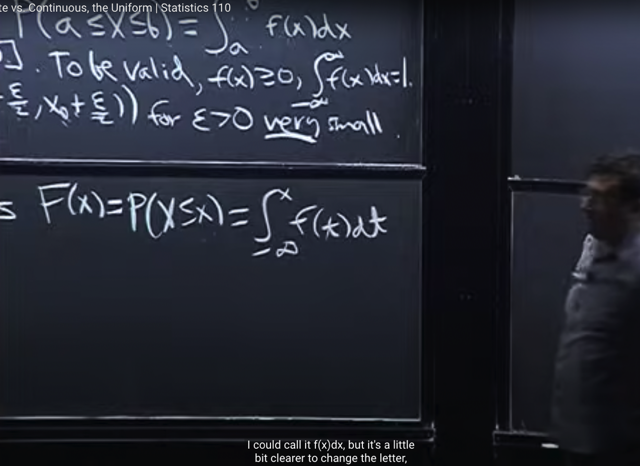</kbd></p>

<p align="center"><kbd></kbd></p>

<p align="center"><kbd>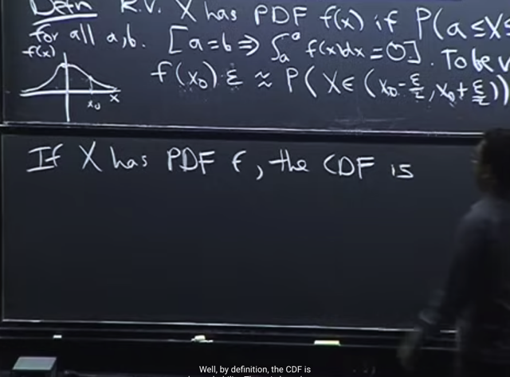</kbd></p>

🔗 **Related:** [TÓM TẮT:  - TÍNH UNIVERSALITY CỦA UNIFORM PART 2:  Nếu X ~ F thì F(X) ~ U(0,1)  -  Cách hiểu đúng về F(X) với F(x) = 1 - e^-x phải là bỏ X vào x ở đây để có F(X) = 1 - e^-X  - Áp dụng vào có thể dùng F(X) để xem thử nó có tuân theo Uniform hay không, nếu không thì có thể có gì đó không đúng  - Áp dụng khác là giúp ta simulating các observed data ~ F, bằng cách sampling từ U(0,1) và bỏ vào function Finv  - Tính chất symmetry của Uniform. Đó là, nếu U ~ Uniform (0,1) thì 1-U cũng ~ Uniform (0,1)  - ĐỊNH NGHĨA CỦA INDEPENDENT R.VS DỰA TRÊN CDF  P(X1 ≤ x1, X2 ≤ x2, ... Xn ≤ xn) = P(X1 ≤ x1)*P(X2 ≤ x2)*..... P(Xn ≤ xn) thì Xj  sẽ independent VỚI MỌI x1, x2,...xn  - Với discrete random variable thì cũng tương tự, nhưng ta sẽ làm với PMF:  Các X1, X2...Xn sẽ gọi là independent nếu:  JOINT PMF P(X1=x1, X2=x2...Xn=xn) = P(X1=x1)*P(X2=x2)*...P(Xn=xn) (tích các PMF)  - Ví dụ để cho thấy tại sao pair-wise independent không đủ để kết luận independent.   Cho X1, X2 là ~ Bern(0.5) và i.i.d và X3 = X1+X2. Xét từng cặp thì biết thằng này không giúp biết thằng kia ⇨ pair-wise independent nhưng xét bộ 3 thì biết X1, X2 biết ngay X3 ⇨ Nếu chỉ dựa vào pair-wise indepedent thì không đủ kết luật cả đám independent  - Standard Normal distribution:  Thường dùng chữ Z để kí hiệu cho Normal distribution r.v  Gs cho rằng ta chỉ cần biết là f(z) có công thức này c*e^(-z^2/2),  - Chứng minh NORMALIZING CONSTANT là c = 1/√2π  - pdf: (1/√2π) e^-z^2/2  - CHỨNG MINH X ~ N(0,1) EX = 0 DỰA VÀO SYMMETRY  - CHỨNG MINH X ~ N(0,1) VarX = 1  - Φ(z) = tích phân từ -infinity tới x của [e^(-t^2/2)dt]](tóm_tắt_tính_universality_của_uniform_part_2_nếu_x_f_thì_fx_u01_cách_hiểu_đúng_về_fx_với_fx_1_e_x_ph.md#node-414)

> [!NOTE]
> Thế thì ta sẽ xét CDF: Theo định nghĩa nó là xác suất X `<=` x **P(X<=x)**.
>
> Và vì PDF f(x) **cho ta cách tính xác suất X NẰM TRONG MỘT KHOẢNG BAO NHIÊU ĐÓ** bằng cách **integrate
> PDF function f(x) TRÊN KHOẢNG ĐÓ**,
>
> Cho nên **để có P(X<=x)** ta chỉ cần **integrate hàm mật độ xác suất PDF trên KHOẢNG NHỎ HƠN x**,
> đó chính là từ**trừ vô cùng tới x:**
>
> **CDF: `P(X<=x)` `=` TÍCH PHÂN TỪ `-infinity` TỚI x f(t)dt  (f hay f(x) là PDF của X)**
>
> Ở đây gs nói **t** chỉ là ta dùng một biến khác `/` tên biến khác (gọi là dummy variable) để không lẫn lộn với x, có thể dùng u,v,a,b gì đó không 
> quan trọng
>
> Đó là cách ta**chuyển từ PDF sang CDF**

<br>

<a id="node-350"></a>

<p align="center"><kbd>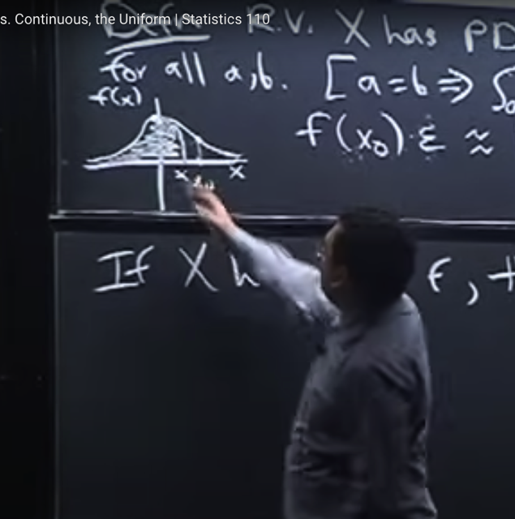</kbd></p>

> [!NOTE]
> Và ý nghĩa chính là ta **tính diện tích của hình bên
> dưới đồ thị của f(x) từ `-infi` : x**

<br>

<a id="node-351"></a>

<p align="center"><kbd>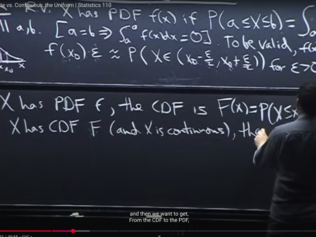</kbd></p>

> [!NOTE]
> Tiếp ta sẽ học cách **chuyển ngược lại từ CDF F sang PDF f**

> [!NOTE]
> QUAN HỆ GIỮA CDF VÀ PDF

<br>

<a id="node-352"></a>

<p align="center"><kbd>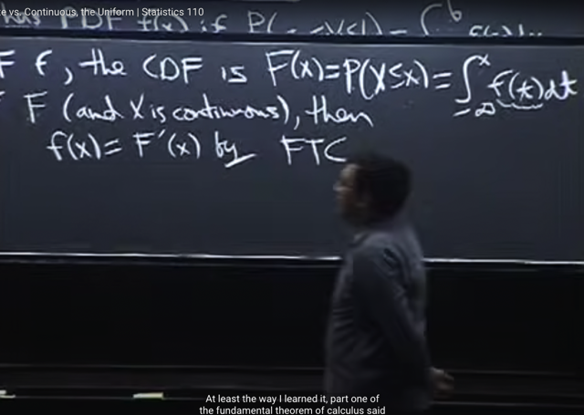</kbd></p>

> [!NOTE]
> Thì gs cho rằng đơn giản là**f(x) chính là derivative của F(x)**: f(x) `=` F'(x). 
>
> Điều này dựa trên **FUNDAMENTAL THEORY OF CALCULUS**

<br>

<a id="node-353"></a>

<p align="center"><kbd>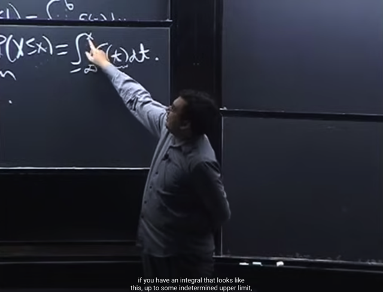</kbd></p>

🔗 **Related:** [LEC 20: MULTINOMIAL AND CAUCHY](untitled.md#node-673)

> [!NOTE]
> `\/Gs` nói là FTC có 2 phần, phần 1 đại ý là nếu ta có F(x) là integral giống
> như thế này tức**F(x) `=` tích phân (integral) từ a tới x của f(t)dt** thì 
> F(x) gọi là nguyên hàm `(anti-derivative)` của f(x) `\/`
>
> `\/"Thì` **phần 1** của Fundamental Theorem of Calculus sẽ cho ta biết 
> là **khi lấy derivative của F(x) w.r.t x ta sẽ có lại function f(x)"**\/⇨ Soi sáng bởi 1801, mình có thể xác nhận chỗ này, nhưng theo 1801 thì
> nó là FTC2:
>
> ```text
> Nếu G(x) = ∫a:x f(t)dt thì d/dx G(x) = f(x), đồng nghĩa nói G là nguyên
> ```
> hàm `/` `anti-derivative` của f
>
> Thế mà, theo định nghĩa thì, với X là continuous random
> ```text
> variable P(X ∈ A) = ∫A f(t)dt  ⇨ F(x) = P(X ≤ x)  sẽ tính bằng ∫-inf:x f_(t)dt.
> ```
> ```text
> Vậy F(x) = ∫-inf:x f(t)dt nên theo FTC2 thì d/dx F(x) chính là f(x).
> ```

<br>

<a id="node-354"></a>

<p align="center"><kbd>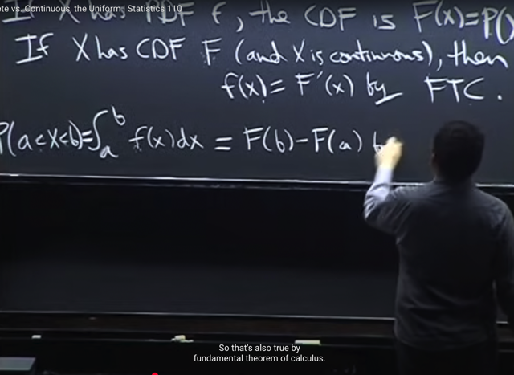</kbd></p>

> [!NOTE]
> `\/"Và` **phần thứ hai** của FTC cho biết rằng **tích phân trên đoạn [a, b] của
> hàm f(x)**sẽ **có thể tính thông qua nguyên hàm của f(x) tức F(x)**:
>
> **=> Tích phân từ a đến b f(x)dx `=` F(b) `-` F(a)**
>
> Do đó dựa vào **phần 2 của FTC** ta có thể tính **xác suất x thuộc [a, b]:
>
> P(a<x<b) theo định nghĩa `=` tích phân từ a đến b của f(x)dx
>
> thì cái này có thể tính BẰNG CÁCH DÙNG CDF `=` F(b) `-` F(a)**
>
> *Gs nói ta nói **khoảng hay đoạn đều được** vì với continuous random
> variables thì `P(X=x)` `=` 0. Tức là**nói P(a<x<b) hay `P(a<=x<=b)` đều được\/**⇨ Soi sáng bởi 1801 Xác nhận lại: Theo 1801 thì đây là FTC1: nếu F' `=` f
> thì `∫a:b` f(x)dx `=` F(b) `-` F(a). Từ đó từ việc ta đã có đạo hàm của CDF là PDF
> F'(x) `=` f(x). Nên vận dụng FTC1 ta có thể tính xác suất X rơi vào vùng a:b
> `∫a:b` f(x)dx thông qua dùng CDF: F(b) `-` F(a)

<br>

<a id="node-355"></a>

<p align="center"><kbd>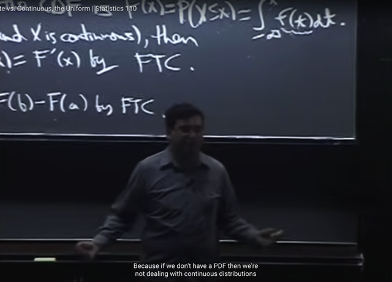</kbd></p>

> [!NOTE]
> Gs nói thêm là**trong class này** khi ta nói **continuous random variable**  thì
> có nghĩa là ta sẽ **assume CDF luôn differentiable** (để **có thể tìm derivative**
> của nó (F'(x)) cho ra PDF f(x))

<br>

<a id="node-356"></a>

<p align="center"><kbd>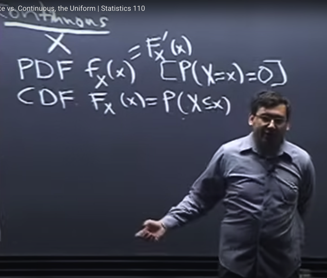</kbd></p>

> [!NOTE]
> gs: Khi nói ta **khi cần tìm distribution trong cả hai trường hợp discrete và
> continuous** thì ta **có thể dùng PMF hay CDF** đối với discrete và t**ìm
> PDF hoặc CDF** đối với continuous **đều được (ý nói, cả `PMF/PDF` hay CDF
> đều có thể giúp kết luận distribution của r.v là gì)**

<br>

<a id="node-357"></a>

<p align="center"><kbd>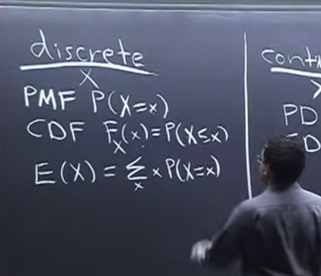</kbd></p>

> [!NOTE]
> tiếp tục so sánh, thì với **discrete** khi tính **Expected value E(X)** ta đã biết sẽ
> là **weighted sum các possible value x**, với **weight** bằng **xác suất random
> variable mang possible value đó P(X=x)**.
>
> ```text
> E(X) = Σx [x*P(X=x)]
> ```

<br>

<a id="node-358"></a>

<p align="center"><kbd>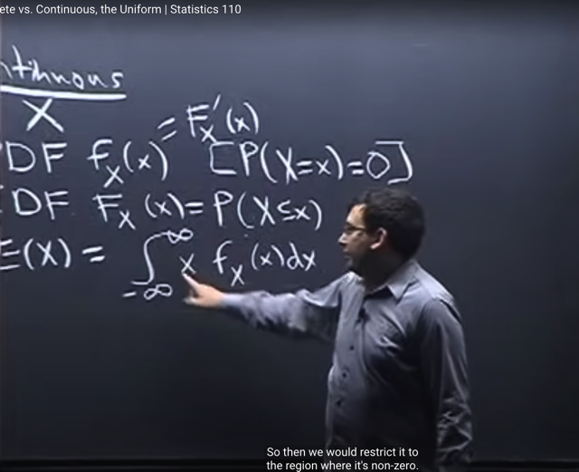</kbd></p>

> [!NOTE]
> Thế thì với **continuous** random variable thì **cách làm tương đương**
> sẽ là lấy t**ích phân (integral) từ `-infinity` đến infinity của x * f(x)dx**
>
> Gs nói khi ta **deal với một số function** mà**possible value chỉ trong một 
> khoảng nào đó** ví dụ như **[0, 1]** thì đại ý là khi đó**ngoài đoạn này 
> ta chỉ đơn giản là tích phân có giá trị bằng 0**.
>
> Ý nói công thức chung, khái quát rằng ta **tích phân từ `-infi` đến `+infi` vẫn
> bao quát được, sử dụng được**

<br>

<a id="node-359"></a>

<p align="center"><kbd>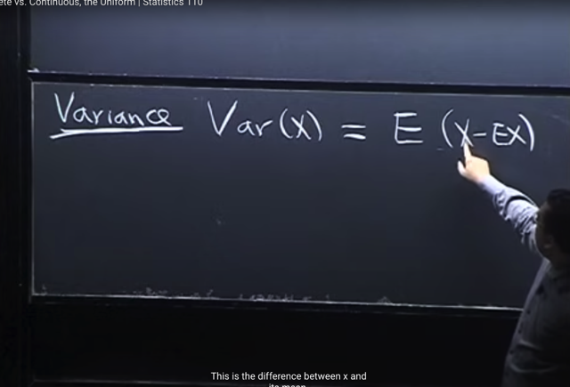</kbd></p>

> [!NOTE]
> Ta qua khái niệm **VARIANCE**.
>
> Gs cho biết, Variance sẽ đo **mức độ spreading phân tán** của distribution với
> ý nghĩa là **MỘT CÁCH TRUNG BÌNH THÌ X CÁCH XA MEAN `E(X)` CỦA
> DISTRIBUTION CỠ NÀO.**
>
> Do đó công thức nó sẽ là expected value `/` average của **difference giữa giá trị
> của random variable X với mean** (EX, hoặc `E(X),` gs có nói ta có thể không
> cần dấu ngoặc): X `-` EX
>
> **Var (X) `=` E(X-E(X))**
>
> Thế thì vấn đề là gs nói nếu dùng công thức này để tính variance thì sẽ V**Ô DỤNG**. 
> Vì theo **linearity**:
>
> ```text
> E(X-EX) = EX - E(EX) mà EX là mean, là constant, nên E(EX) cũng bằng EX.
> ```
> ```text
> Dẫn đén E(X-EX) = EX-EX bằng 0.
> ```
>
> Và **nó bằng 0** là bởi **kiểu như các giá trị của X đối xứng qua mean**, nên **dù độ
> phân tán của distribution như thế nào** thì **chúng cancel nhau nên nó sẽ ra 0**

> [!NOTE]
> VARIANCE

<br>

<a id="node-360"></a>

<p align="center"><kbd>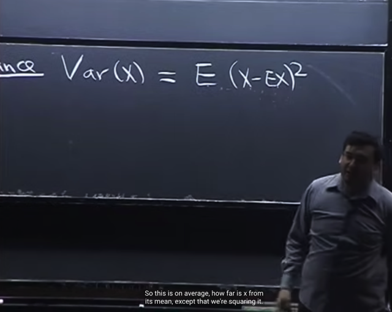</kbd></p>

> [!NOTE]
> Thế thì, gs nói ta c**ó thể deal với vấn đề** này bằng cách dùng **GIÁ TRỊ
> TUYỆT ĐỐI**. Nhằm **khiến kiểu như khoảng cách từ X tới mean không âm**
> để nó **không triệt tiêu nhau**.
>
> Tuy nhiên **làm việc với absolute value rất phiền**, vì function dạng chữ V của
> nó tạo ra **một điểm NON-DIFFERENTIABLE**
>
> Thành ra **cách làm phổ biến** là người ta **BÌNH PHƯƠNG:
>
> `Var(X)` `=` E[(X-EX)^2]**

> [!NOTE]
> ```text
> Var(X) = E[(X-EX)^2]
> ```

<br>

<a id="node-361"></a>

<p align="center"><kbd>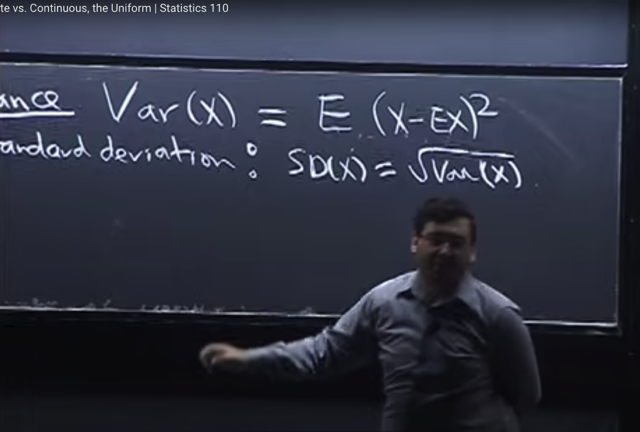</kbd></p>

> [!NOTE]
> Thế thì điều này lại **phát sinh một phiền phức**, là nó **khiến unit bị thay đổi**.
> Ví dụ **X có unit là miles**, thì **variance** thành ra có **unit** là **miles^2**.
>
> Do đó người ta mới **đặt thêm** **STANDARD DEVIATION** là **sqrt(Variance)** để
> mà s**cale "độ phân tán" về lại cùng unit với X**

<br>

<a id="node-362"></a>

<p align="center"><kbd>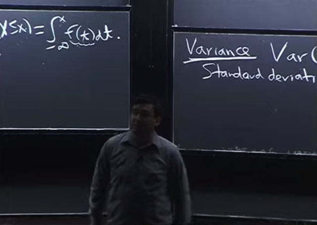</kbd></p>

> [!NOTE]
> Và ông nói thực ra **khi làm việc** ta sẽ t**huận tiện hơn** khi **làm với variance**,
> chẳng qua là **khi cần giá trị nào đó có cùng unit** cho mục đích **interpretable**
> **thì dùng standard deviation**

<br>

<a id="node-363"></a>

<p align="center"><kbd>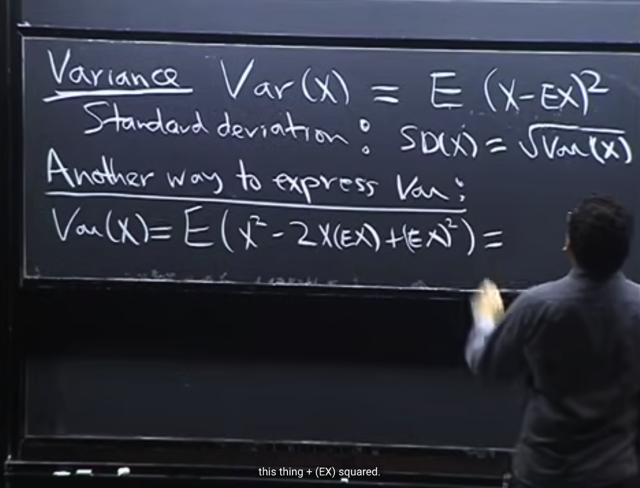</kbd></p>

> [!NOTE]
> Môt**cách thể hiện khác**, ta sẽ triển khai**(X-EX)^2**:
>
> **X^2 `-` 2X(EX) `+` (EX)^2**

<br>

<a id="node-364"></a>

<p align="center"><kbd>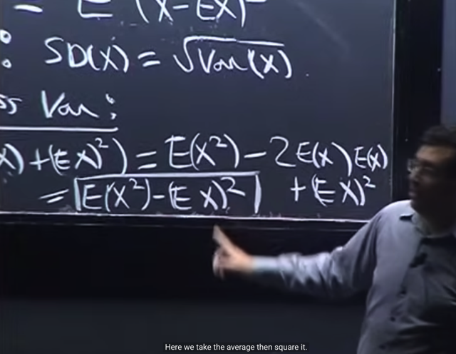</kbd></p>

> [!NOTE]
> Tiếp, dùng **linearity**, `E(X^2` `-` 2X(EX) `+` (EX)^2) `=` EX^2) `-` `E[2X(EX)]` `+` `E[(EX)^2]`
>
> thì hạng tử thứ nhất là `E(X^2)`
>
> Hạng tử thứ 2 là `-` `E(2XEX)` ta sẽ đưa constant là 2EX (nhớ là EX là mean, là
> ```text
> constant) ra để có -2EXE(X) = -2EXEX = -2(EX)^2
> ```
>
> Hạng tử thứ 3 là `E[(EX)^2]` thì cũng là (EX)^2 vì EX là constant, (EX)^2 cũng
> là constant.
>
> Vậy kết quả là `E(X^2)` `-` 2[(EX)^2] `+` (EX)^2 =**E(X^2) `-` (EX)^2
>
> (chú ý nó không phải là giống nhau để trừ nhau thành 0 nhé, khác vị trí
> parenthesis)**

> [!NOTE]
> ```text
> CÔNG THỨC KHÁC VARIANCE: Var(X) = E(X^2) - (EX)^2
> ```

<br>

<a id="node-365"></a>

<p align="center"><kbd>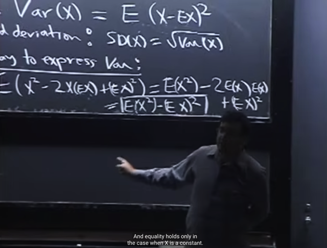</kbd></p>

> [!NOTE]
> Gs nói **kết quả này** làm ta **liên tưởng đến câu hỏi** mà có thể đã gặp là
> **[trung bình của bình phương]** có giống với **[bình phương của trung bình]**
> hay không.
>
> Thì kết quả này cho ta thấy **Trung bình của bình phương, tức E[X^2]** luôn lớn
> hơn hoặc bằng **Bình phương của trung bình (EX)^2, l**ớn hơn là vì `Var(X)`
> không âm****Và d**ấu bằng xảy ra** khi và chỉ khi **X `=` EX**, tức là **X là CONSTANT.**

<br>

<a id="node-366"></a>

<p align="center"><kbd>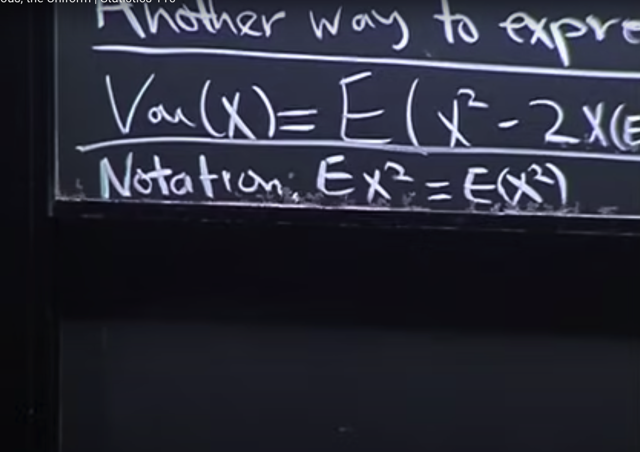</kbd></p>

> [!NOTE]
> Cuối cùng gs cho biết thêm một notation: khi viết **EX^2**
> thì **quy ước nó là E(X^2).**Còn bình phương của EX thì ghi là (EX)^2

<br>

<a id="node-367"></a>

<p align="center"><kbd>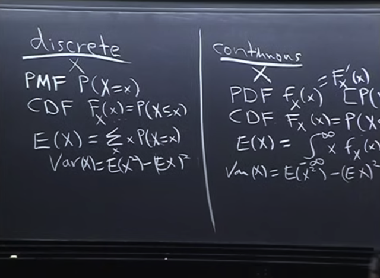</kbd></p>

> [!NOTE]
> Và ta add t**hêm varianc**e vào **bảng so sánh giữa discrete và continuous**
> Cả hai bên **đều như nhau**

<br>

<a id="node-368"></a>

<p align="center"><kbd>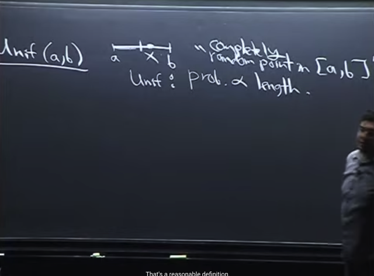</kbd></p>

> [!NOTE]
> Ta sẽ thảo luận qua **ví dụ đầu tiên của Continuous distribution**: **Uniform**
> distribution.
>
> Thế thì đại khái gs nói là, ta **cần tìm cách diễn đạt yếu tố uniform**, tức là **xác
> suất của các possible value luôn bằng nhau** với Uniform distribution. Tuy
> nhiên, **sẽ không ích lợi gì khi nói `P(X=x)` đều bằng nhau với mọi x** vì như đã
> nói với continuous random variable thì **mọi `P(X=x)` đều bằng 0**.
>
> Do đó**cách thể hiện của ý tưởng xác suất bằng nhau** đó là:
>
> Giả sử **chia khoảng (a, b) ra hai phần bằng nhau** thì **xác suất X thuộc đoạn
> nào cũng bằng nhau**. Và khái quát lên, thì đó là **xác suất thuộc một đoạn sẽ
> TỈ LỆ THUẬN VỚI CHIỀU DÀI ĐOẠN**

> [!NOTE]
> UNIFORM DISTRIBUTION

<br>

<a id="node-369"></a>

<p align="center"><kbd>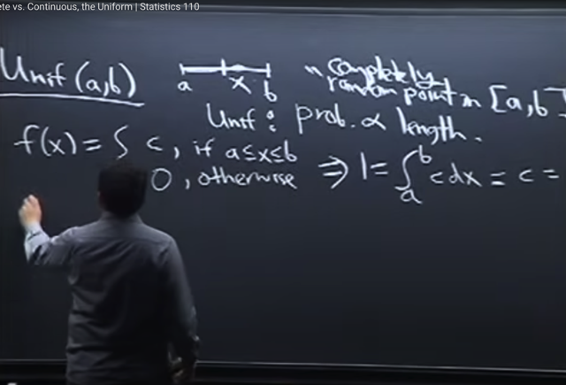</kbd></p>

🔗 **Related:** [LEC 17: MOMENT GENERATING FUNCTIONS](untitled.md#node-554)

> [!NOTE]
> Như thường lệ ta sẽ **define PDF** (và **derive CDF** hoặc **ngược lại**).
>
> Với **Uniform (a, b)**, thì **PDF f(x) `=` c** **nếu x trong đoạn [a,b]** và **bằng 0 nếu
> ngược lại.**
>
> Thì từ **yêu cầu để PDF valid** đối với **continuous** distribution như đã nói đó
> là **tích phân từ `-infinity` đến infinity của f(x)dx phải bằng 1**.
>
> Thì **tích phân từ `-infinity` đến infinity của f(x)dx** ở đây sẽ bằng **tích phân từ
> a đến b của f(x)dx** (vì **tích phân ngoài đoạn a,b đều bằng 0 rồi**)
>
> Do đó ta có: 
> **[tích phân từ a `->` b của c*dx]** **= 1** `<=>` cb `-` ca `=1.` Cái này là vì theo
> part 2 của FTC:
>
> [tích phân từ a `->` b của c*dx] là tích phân xác định từ a, đến b của hàm l(x)
> `=` c (hàm hằng)
>
> Sẽ bằng **nguyên hàm của hàm l(x)** tại b **trừ** nguyên hàm của hàm l(x) lại a:
>
> (nguyên hàm của hàm l(x) `=` c dễ thấy sẽ là hàm k(x) `=` c*x)
>
> Vậy nó sẽ bằng c*b `-` c*a
>
> Quay lại đây, từ đó: `c(b-a)` `=` 1 `=>` **c `=` 1/(b-a)**

<br>

<a id="node-370"></a>

<p align="center"><kbd>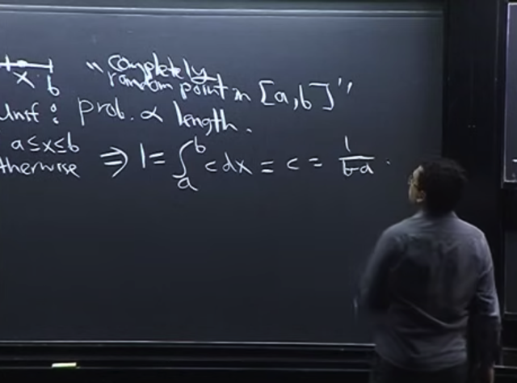</kbd></p>

<br>

<a id="node-371"></a>

<p align="center"><kbd>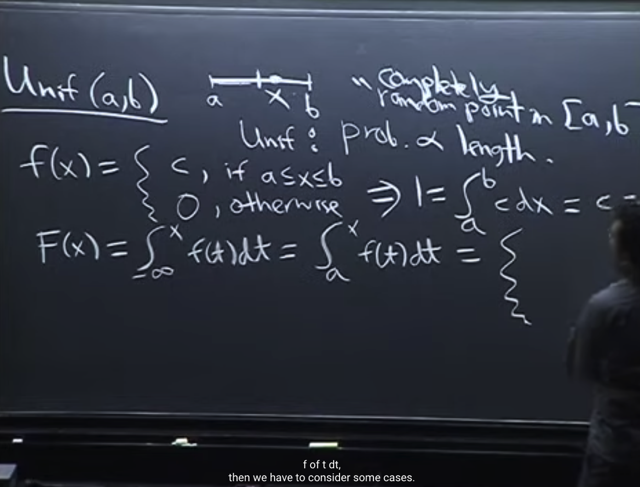</kbd></p>

🔗 **Related:** [TÓM TẮT:  - TÍNH UNIVERSALITY CỦA UNIFORM PART 2:  Nếu X ~ F thì F(X) ~ U(0,1)  -  Cách hiểu đúng về F(X) với F(x) = 1 - e^-x phải là bỏ X vào x ở đây để có F(X) = 1 - e^-X  - Áp dụng vào có thể dùng F(X) để xem thử nó có tuân theo Uniform hay không, nếu không thì có thể có gì đó không đúng  - Áp dụng khác là giúp ta simulating các observed data ~ F, bằng cách sampling từ U(0,1) và bỏ vào function Finv  - Tính chất symmetry của Uniform. Đó là, nếu U ~ Uniform (0,1) thì 1-U cũng ~ Uniform (0,1)  - ĐỊNH NGHĨA CỦA INDEPENDENT R.VS DỰA TRÊN CDF  P(X1 ≤ x1, X2 ≤ x2, ... Xn ≤ xn) = P(X1 ≤ x1)*P(X2 ≤ x2)*..... P(Xn ≤ xn) thì Xj  sẽ independent VỚI MỌI x1, x2,...xn  - Với discrete random variable thì cũng tương tự, nhưng ta sẽ làm với PMF:  Các X1, X2...Xn sẽ gọi là independent nếu:  JOINT PMF P(X1=x1, X2=x2...Xn=xn) = P(X1=x1)*P(X2=x2)*...P(Xn=xn) (tích các PMF)  - Ví dụ để cho thấy tại sao pair-wise independent không đủ để kết luận independent.   Cho X1, X2 là ~ Bern(0.5) và i.i.d và X3 = X1+X2. Xét từng cặp thì biết thằng này không giúp biết thằng kia ⇨ pair-wise independent nhưng xét bộ 3 thì biết X1, X2 biết ngay X3 ⇨ Nếu chỉ dựa vào pair-wise indepedent thì không đủ kết luật cả đám independent  - Standard Normal distribution:  Thường dùng chữ Z để kí hiệu cho Normal distribution r.v  Gs cho rằng ta chỉ cần biết là f(z) có công thức này c*e^(-z^2/2),  - Chứng minh NORMALIZING CONSTANT là c = 1/√2π  - pdf: (1/√2π) e^-z^2/2  - CHỨNG MINH X ~ N(0,1) EX = 0 DỰA VÀO SYMMETRY  - CHỨNG MINH X ~ N(0,1) VarX = 1  - Φ(z) = tích phân từ -infinity tới x của [e^(-t^2/2)dt]](tóm_tắt_tính_universality_của_uniform_part_2_nếu_x_f_thì_fx_u01_cách_hiểu_đúng_về_fx_với_fx_1_e_x_ph.md#node-414)

> [!NOTE]
> Tiếp, để có CDF như đã biết, ta sẽ **tích phân từ `-infinity` đến x của PDF f(x)**
>
> F(x) `=` tích phân từ `-infinity` đến x của f(t)dt, again, dùng t để khỏi lẫn lộn với
> cận x, chứ không có gì, dùng f(x)dx `/` f(u)du cũng được **MIỄN LÀ HIỂU HÀM
> f LÀ PDF CỦA X**
>
> Thế thì tương tự ta **chỉ cần tích phân từ a đến x**(vì tích phân ngoài đoạn a,b
> đều bằng 0 rồi)

<br>

<a id="node-372"></a>

<p align="center"><kbd>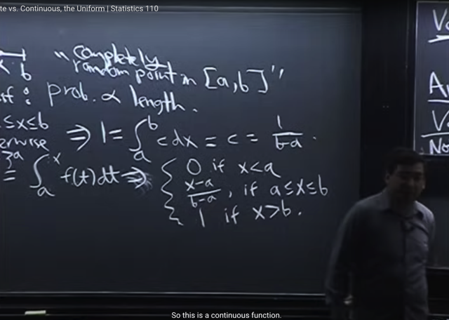</kbd></p>

> [!NOTE]
> và từ đây F(x) sẽ **chia ra 3 trường hợp**: 
>
> 1) Nếu **x<a, thì F(x) `=` 0**(vì theo định nghĩa Uniform PDF f(x) bằng 0 khi x<a hoặc x>b)
>
> 2) Nếu **x>b thì F(x) `=` 1**vì khi đó `∫a:x` f(x) `=` `∫a:b` f(x) `=` `∫-inf:inf` f(x) `=` 1
>
> 3) Nếu **x trong [a, b]** thì F(x) `=` tích phân từ a đến x f(x)dx, tính ra `c(x-a)` với c lúc nãy
> đã tính ra là `1/(b-a)` nên kết quả là**(x-a)/(b-a)**
>
> Và**F(x) có thể thấy là là hàm tuyến tính đối với x**( `=` `x/(b-a)` `-` `a/(b-a)` )

<br>

<a id="node-373"></a>

<p align="center"><kbd>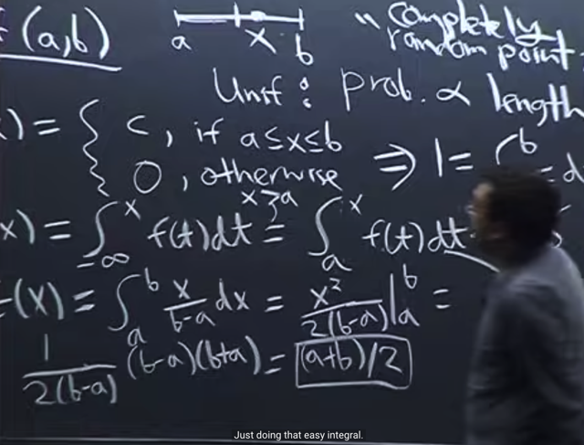</kbd></p>

> [!NOTE]
> Tiếp ta sẽ tính **expected value E(X)**: như đã biết, đối với **continuous**
> random variables thì expected value là **tích phân từ `-infinity` đến infinity của
> x*f(x)*dx** `=` x*c*dx `=` `x*(1/b-a)*dx`
>
> ```text
> = ∫a:b [x*(1/b-a)*dx]
> ```
>
> Theo **Part 1 của FTC**, nó sẽ bằng **k(b) `-` k(a)** với k là **nguyên hàm
> (anti-derivative)**  của `x/(b-a)` dễ thấy chính là `x^2/[2(b-a)]`
>
> Và kết quả là **(b+a)/2**. Hoàn toàn **dễ hiểu (ý là thấy kết quả này hợp lý)** khi
> đây là uniform(a, b) tức **x sẽ có giá trị từ a đến b với xác suất bằng nhau**,
> đương nhiên ta dễ đoán là **mean của random variable phải là (b+a)/2**

> [!NOTE]
> ```text
> E(X) CỦA UNIFORM (a,b) = (a+b)/2
> ```

<br>

<a id="node-374"></a>

<p align="center"><kbd>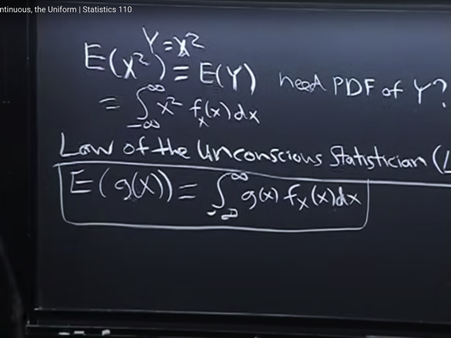</kbd></p>

🔗 **Related:** [-TÓM TẮT:   Z^(số lẻ), ta luôn có E(Z^(số lẻ) = 0, gọi là ODD MOMENT  - Symmetry còn giúp ta kết luận (nếu Z ~ N(0,1) thì -Z cũng là một N(0,1)  - X = μ + σZ sẽ ~ N(μ, σ^2)  - Sẽ tốt hơn nếu ta hiểu Standard Normal Z ~ N(0,1) trước, sau đó hiểu rằng khi scale và shift Z với σ và μ khác nhau thì ta sẽ có bất kì một Normal distribution N(μ, σ^2) nào  - PROPERTIES CỦA VAR(X):  + Var(X + c) = Var(X)  + Var(cX) = c^2*Var(X)  + Var(X) luôn không âm, và nó chỉ bằng 0 nếu X là constant  + Variance KHÔNG CÓ TÍNH LINEARITY:  + Var(X+Y) không bằng Var(X) + Var(Y) TRỪ KHI X, Y INDEPENDENT  X không i.i.d với chính nó X, mà nó EXTREMELY DEPENDENT với chính nó. Do đó bất cứ khi nào ta ÁP DỤNG CÔNG  THỨC NÀO ĐÓ MÀ CẦN CÁC RANDOM VARIABLE CÓ X1, X2 CÓ  TÍNH I.I.D VÀO X VÀ CHÍNH NÓ THÌ ĐỀU LÀ SAI  - CHỨNG MINH VAR X N(μ, σ) = σ^2  - Z = (X - μ) / σ và gs cho biết nó được gọi là STANDARDIZATION (chuẩn hóa)  Giúp từ NORMAL X ~ N(μ, σ) ta có STANDARD NORMAL Z ~ N(0,1)  - Xây dựng PDF của N(μ, σ^2) từ N(0, 1):  fX(x) = 1/(σ√2π) * [e^(-((x-μ)/σ)^2/2)]  - Nếu X ~ N(μ, σ^2) thì -X ~ N(-μ, σ^2  - Nếu X1 ~ N(μ1, σ1^2), X2 ~ N(μ2, σ2^2) và X1, X2 independent thì:  X1 + X2 ~ N(μ1 + μ2, σ1^2 + σ2^2)  X1 - X2 ~ N(μ1 - μ2, σ1^2 + σ2^2)  - 68-95-99.7 rule  - Chứng minh 0^k / k! + 1^k / k! + 2^k / k! + .... = e^k  ⇨ Tổng k=0,1...infinity λ^k/k! = e^λ  - Tìm variance của Poisson (λ) để chứng minh nó có MEAN VÀ VARIANCE ĐỀU LÀ λ  - Khi standardize, ví dụ đơn vị là km, thì (x - μ) / σ sẽ  (km - km) / km = km / km = 1 TỨC Ý NÓI LÀ KHÔNG CÒN CARE ĐƠN VỊ LÀ GÌ NỮA  - X~Bin(n,p), Var(X) = npq (q = 1-p)  - Chứng minh LOTIS](_tóm_tắt_zsố_lẻ_ta_luôn_có_ezsố_lẻ_0_gọi_là_odd_moment_symmetry_còn_giúp_ta_kết_luận_nếu_z_n01_thì_z.md#node-440)

> [!NOTE]
> Tiếp theo ta sẽ tính **variance**. Thế thì **theo công thức thứ 2**, variance `=`
> **Var(X) `=` `E(X^2)` `-` (EX)^2**
>
> Vậy ta đã có EX, **cần thêm E(X^2)**. Thế thì nếu **đặt Y `=` X^2** thì **E(X^2) `=`
> E(Y)**.
>
> Và **để có E(Y)** **TA PHẢI CÓ PDF CỦA Y** (gọi là **f_Y(y)**) thì khi đó ta **mới có
> thể tính E(Y)** `=` **tích phân `-infinity:infinity` của y *f(y)dy**.
>
> **Có điều ta không có f_Y(y).**
>
> Nên một cách **LÀM BIẾNG `/` VÔ Ý THỨC (UNCONSCIOUS)**, ta **có thể cứ dùng 
> lại cái `f_X(x)` tức là PDF của X**:
>
> tích phân từ **-infinity: infinity x f_X(x)dx**, nhưng**THAY x (đứng trước `f_X(x))` 
> bằng x^2:**
>
> **tích phân từ `-infinity:` infinity x^2 f_X(x)dx**
>
> Có nghĩa là**thay vì dùng `f_Y(y),` ta vẫn dùng f_X(x)**
>
> Và hóa ra làm vậy vẫn đúng: Và đó chính là **LAW OF UNCONSCIOUS
> STATISTICIANS** (**LOTUS**)
>
> Công thức khái quát là:
>
> `E(g(x))` `=` tích phân từ `-infinity` tới infinity**g(x) f(x) dx trong đó f(x), hay fX(x) là
> pdf của X**
>
> (có nghĩa là từ `E(X)` `=` tích phân từ `-infinity` tới infinity **x f(x) dx**, thì **để tính `E(g(x))`
> ta chỉ việc thay x bằng g(x))**

> [!NOTE]
> **LOTUS `-` LAW OF UNCONSCIOUS
> STATISTICIAN**

<br>

<a id="node-375"></a>

<p align="center"><kbd>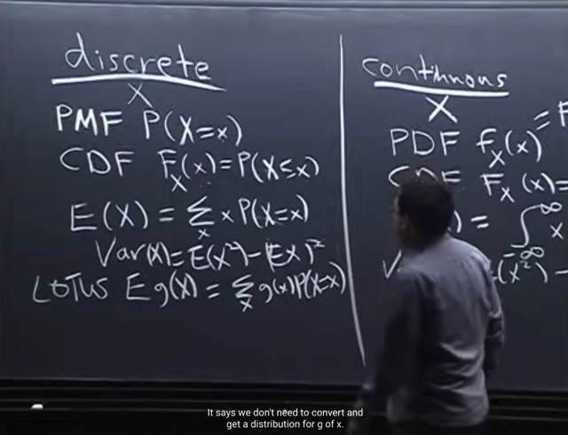</kbd></p>

> [!NOTE]
> Và gs cho biết ta sẽ **quay lại chứng minh LOTUS sau**. Với **discrete** cũng vậy
>
> **LOTUS cho phép tính E(g(X))** `=` Tổng mọi possible value của X: **g(X) P(X=x)**
>
> tức là thay x bằng g(X), còn thì vẫn dùng PMF của X, thay vì phải đi tìm PMF 
> của g(X)

<br>

<a id="node-376"></a>

<p align="center"><kbd>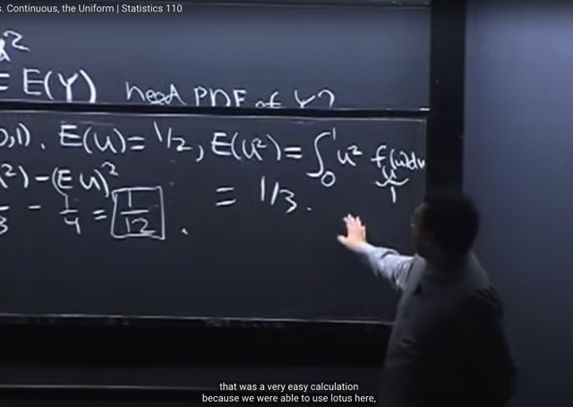</kbd></p>

<p align="center"><kbd></kbd></p>

<p align="center"><kbd>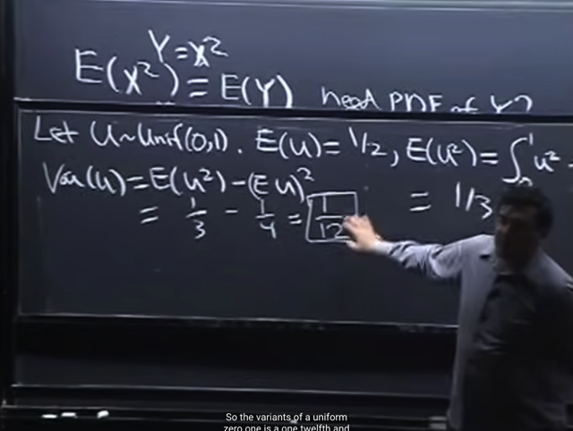</kbd></p>

> [!NOTE]
> Ví dụ **U~Uniform(0,1)** tức **a=0,b=1**
>
> **E(U) `=` (b+a)/2** như vừa chứng minh, **= 1/2**
>
> **E(U^2)** nhờ áp dụng LOTUS, `=` **tích phân từ 0 tới 1 u^2 f(u)du**
>
> với **f(u) là PDF của Unif(a, b) `=` constant c `=` 1/(b-a)** như hồi nãy đã chứng minh, nên với `b=1,` `a=0,` f(u) `=` **1**
>
> Vậy `E(U^2)` `=` tích phân từ 0 tới 1 u^2 * **1** * du `=` [nguyên hàm của u^2](b) `-` [nguyên hàm của u^2](a)
>
> **Nguyên hàm của u^2 là `=` u^3/3** (vì derivative của `d/du` `u^3/3` `=` u^2)
>
> Vậy `E(U^2)` `=` **b^3/3 `-` `a^3/3` `=` 1/3**
>
> Vậy **Var(E) `=` `E(U^2)` `-` (EU)^2** `=` `1/3` `-` `1/4` `=` **1/12**

<br>

<a id="node-377"></a>

<p align="center"><kbd>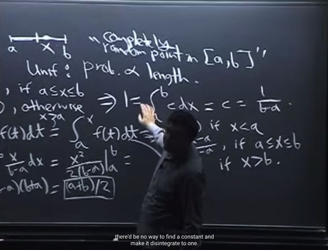</kbd></p>

> [!NOTE]
> Gs nói đại khái là **Uniform distribution rất đơn giản** như vậy, chỉ có
> điều ta **không thể có uniform trên toàn trục số thực** vì sẽ **không thể
> normalize để tổng bằng 1 được**

<br>

<a id="node-378"></a>

<p align="center"><kbd>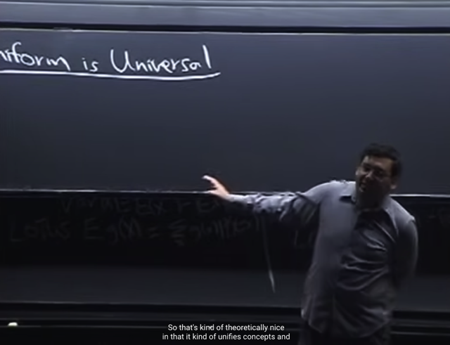</kbd></p>

> [!NOTE]
> Đại khái gs nói là **Uniform** nó **CÓ TÍNH PHỔ QUÁT (UNIVERSAL)**, với ý
> nghĩa là từ một uniform distribution, ta **có thể convert thành mọi dạng
> distribution bất kì**

<br>

<a id="node-379"></a>

<p align="center"><kbd>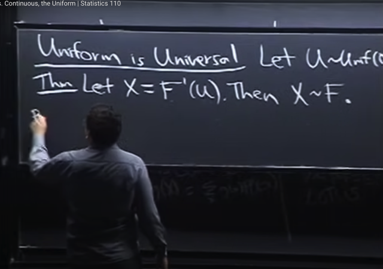</kbd></p>

> [!NOTE]
> Để **minh họa cho tính chất** này gs lấy ví dụ ta có **U ~ Uniform (0,1)** và
> một hàm **F là CDF của một random variable MÀ TA CHƯA BIẾT (chưa  biết
> distribution  của nó)**.
>
> (Ông nói **thường thì ta có một random variable**, sau đó**tìm CDF của nó**,
> còn **đây ngược lại**, ta có một function F trước)
>
> Thế thì ông **giả định** thêm hàm F có tính chất**liên tục phía phải (right
> continuous)** và**chỉ tăng** (strictly increasing), không có các **flat region**
> (các tính chất này để F có thể valid để làm một CDF)
>
> Thì tính Universal của Uniform cho ta biết rằng:
>
> **Nếu đặt X là `F_inv(U)` thì X sẽ là random variable tuân theo distribution  quy
> định bởi `/` có CDF là F.**Gs ghi **X ~ F**. Chính là vậy `-` random variable t**uân theo distribution quy
> định bởi `/` có CDF là F**.
>
> Có nghĩa là, nói một cách ngắn gọn đó là, nếu ta**có một hàm F** mà ta đang
> quan tâm, và ta biết **nó là CDF của một random variable nào đó** mà ta chưa
> biết. Thì
>
> **CHỈ CẦN TÌM** **F_inv** rồi**GẮN VÀO** **Uniform (0,1) r.v U** vào để có**F_inv(U)** thì 
> ta sẽ**có một r.v X TUÂN THEO DISTRIBUTION CÓ CDF LÀ F.**

> [!NOTE]
> TÍNH UNIVERSAL CỦA UNIFORM PART 1:
>
> Nếu có F (là một valid CDF, nhưng chưa có random variable) 
>
> Thì nếu U~Unif(0,1) thì X `=` `F_inv(U)` chính là r.v tuân theo distribution
> của CDF là F: X ~ F

<br>

<a id="node-380"></a>

<p align="center"><kbd>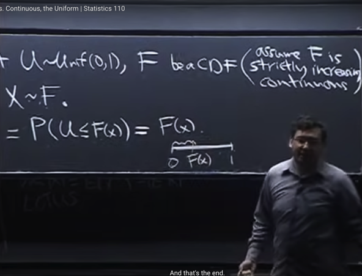</kbd></p>

<p align="center"><kbd></kbd></p>

<p align="center"><kbd>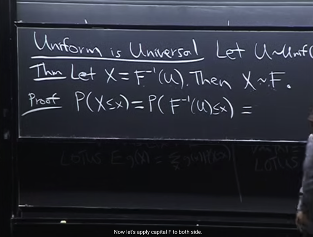</kbd></p>

> [!NOTE]
> Để **chứng minh** đại khái là gs cho rằng **không có gì ghê gớm**, ta chỉ cần **bắt đầu với định nghĩa của CDF**:
>
> Đó là vì **CDF của random variable X** là hàm số quy định **P(X<=x)**, nên **để chứng minh F là CDF của X** `=` `F_inv(U)` thì ta sẽ 
> **chứng minh `P(X<=x)` bằng F(x)**
>
> Thế thì bắt đầu với **P(X<=x)**, **thay X bằng F_inv(U)**. Ta có **P(F_inv(U) `<=` x)**
>
> Đến đây vì **đã assume** F là **STRICTLY INCREASING**, nên **nếu a < b thì F(a) < F(b)** 
>
> Thành ra từ **F_inv(U) `<=` x,** apply hàm F ta sẽ vẫn GIỮ NGUYÊN DẤU <:
>
> Apply hàm F(x) vế trái `(F_inv(U)),` ta được **F(F_inv(U))**
>
> Apply hàm F(x) vào vế phải (x) ta có **F(x)** 
>
> Vậy**từ `F_inv(U)` `<=` x ta có `/` tương đương `F(F_inv(U))` `<=` F(x). Và do đó đương nhiên xác suất của hai event này bằng nhau: 
>
> `P{F_inv(U)` `<=` x)} `=` `P{F(F_inv(U))` `<=` F(x)}**
>
> Chỗ này nói thêm có thể đại khái hiểu vì hai event a<b và F(a) < F(b) tương đương (gs nói chúng là CÙNG 1 EVENT) nên 
> Xác suất của chúng bằng nhau. 
>
> Mà **F[F_inv(U)] `=` U**, giống như apply hàm `1/2` xong lại nhân 2 vậy
>
> Nên P{**F(F_inv(U))** `<=` F(x)} **= P{U `<=` F(x)}**
>
> Vậy **P{F_inv(U) `<=` x)} `=` P(U `<=` F(x))**
>
> Đến đây lập luận như sau (để chứng minh P(U `<=` F(x)) chính là F(x) thì khi đó ta sẽ **chứng minh xong `F_inv(U)` sẽ có CDF là F(x)**
>
> Ta có **F(x) là hàm CDF** của random variable nào đó như đã nói, **nên nó là xác suất**, **có giá trị nằm trong đoạn [0,1]**
>
> Còn **U, là Uniform (a,b) random variable**, thì như nãy đã nói, **xác suất nó mang giá trị nằm trong đoạn nào đó**, ví dụ [a,n] thuộc [a,b]
> sẽ **tỉ lệ thuận với chiều dài đoạn đó** **so với length [a-b]**. Vậy thì với Uniform (0,1) tổng chiều dài `a-b` là 1, nên **XÁC SUẤT U NẰM TRONG
> ĐOẠN [0, z] CHÍNH LÀ CHIỀU DÀI ĐOẠN NÀY `=` z** (vì khi đoạn ab dài `=` 1, thì với chiều đoạn an nằm trong đó sẽ chính là
> tỉ lệ `an/ab)` Do đó U ~ Unif(0, 1) thì P(U ≤ z) `=` z, và tương tự **P(U ≤ F(x)) `=` F(x)**
>
> VÀ CHIỀU DÀI ĐOẠN [0, F(x)] VÀ ĐƯƠNG NHIÊN CHÍNH LÀ F(x)
>
> CÓ NGHĨA LÀ VỚI U ~ UNIFORM(0,1), THÌ `P(U<=F(x))` CHÍNH LÀ BẰNG F(x)
>
> Vậy **P(F_inv(U) `<=` x) `=` F(x)** và từ đây ta đã **chứng minh xong rằng `F_inv(U)` LÀ MỘT R.V CÓ CDF LÀ F**

<br>

