# Lec 13: Normal Distribution

📊 **Progress:** `44` Notes | `51` Screenshots

---

<a id="node-382"></a>
## Tóm Tắt:

> [!NOTE]
> TÓM TẮT:
>
> `-` TÍNH UNIVERSALITY CỦA UNIFORM PART 2:
>
> Nếu X ~ F thì F(X) ~ U(0,1)
>
> ```text
> -  Cách hiểu đúng về F(X) với F(x) = 1 - e^-x phải là bỏ X vào x ở đây để
> ```
> có F(X) `=` 1 `-` `e^-X`
>
> `-` Áp dụng vào có thể dùng F(X) để xem thử nó có tuân theo Uniform hay
> không, nếu không thì có thể có gì đó không đúng
>
> `-` Áp dụng khác là giúp ta simulating các observed data ~ F, bằng cách
> sampling từ U(0,1) và bỏ vào function Finv
>
> `-` Tính chất symmetry của Uniform. Đó là, nếu U ~ Uniform
> (0,1) thì `1-U` cũng ~ Uniform (0,1)
>
> `-` ĐỊNH NGHĨA CỦA INDEPENDENT R.VS DỰA TRÊN CDF
>
> P(X1 ≤ x1, X2 ≤ x2, ... Xn ≤ xn) `=` P(X1 ≤ x1)*P(X2 ≤ x2)*..... P(Xn ≤ xn) thì Xj 
> sẽ independent VỚI MỌI x1, x2,...xn
>
> `-` Với discrete random variable thì cũng tương tự, nhưng ta sẽ làm với PMF:
>
> Các X1, X2...Xn sẽ gọi là independent nếu:
>
> ```text
> JOINT PMF P(X1=x1, X2=x2...Xn=xn) = P(X1=x1)*P(X2=x2)*...P(Xn=xn) (tích các
> ```
> PMF)
>
> `-` Ví dụ để cho thấy tại sao `pair-wise` independent không đủ để kết luận independent. 
>
> Cho X1, X2 là ~ Bern(0.5) và i.i.d và X3 `=` `X1+X2.` Xét từng cặp thì biết thằng
> này không giúp biết thằng kia ⇨ `pair-wise` independent nhưng xét bộ 3 thì biết
> X1, X2 biết ngay X3 ⇨ Nếu chỉ dựa vào `pair-wise` indepedent thì không đủ kết
> luật cả đám independent
>
> `-` Standard Normal distribution:
>
> Thường dùng chữ Z để kí hiệu cho Normal distribution r.v
>
> Gs cho rằng ta chỉ cần biết là f(z) có công thức này `c*e^(-z^2/2),`
>
> ```text
> - Chứng minh NORMALIZING CONSTANT là c = 1/√2π
> ```
>
> ```text
> - pdf: (1/√2π) e^-z^2/2
> ```
>
> `-` CHỨNG MINH X ~ N(0,1) EX `=` 0 DỰA VÀO SYMMETRY
>
> `-` CHỨNG MINH X ~ N(0,1) VarX `=` 1
>
> ```text
> - Φ(z) = tích phân từ -infinity tới x của [e^(-t^2/2)dt]
> ```

<br>

<a id="node-383"></a>

<p align="center"><kbd>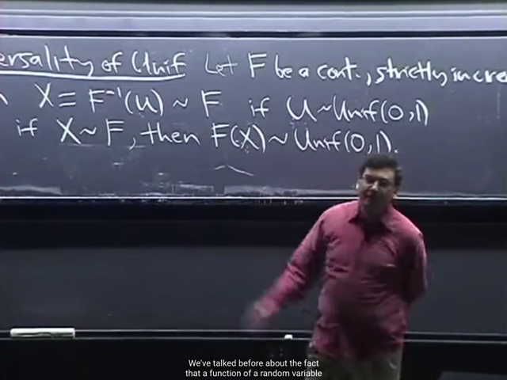</kbd></p>

> [!NOTE]
> Tếp nối bài trước, bữa trước ta đã biết **tính chất Universality của Uniform**
> distribution. Theo đó**nếu ta có một CDF function F** (bất cứ function nào
> **continuous**, **non-decreasing** (luôn tăng, hoặc đi ngang chứ không giảm) và
> **có giá trị từ 0 đến 1 khi input từ `-inf` đến inf**).
>
> Gs nói rằng ta **assume** F **strictly increasing** là để cho **dễ** thôi, chứ CDF
> **đương nhiên có thể có flat region.**
>
> Khi đó, nếu tìm **F_inverse** và **apply nó vào một Uniform (0,1) random
> variable** thì ta **sẽ có một random variable X tuân theo distribution có CDF là
> F**.
>
> Viết ngắn gọn là nếu **U ~ Unif(0,1), thì `F_inv(U)` ~ F**
>
> Thế thì nay gs cho biết: **ngược lại**, **nếu ta có X ~ F**. Thì**U `=` F(X) sẽ là
> random variable tuân theo Uniform (0,1)**
>
> Ở đây, X là random variable tuân theo CDF là F. Và gs cho rằng **ta có thể
> thấy lạ khi bỏ nó vào chính hàm F để có F(X)**.
>
> Nhưng điều này **hoàn toàn hợp lệ**. Vì **X LÀ RANDOM VARIABLE**, KHI
> APPLY **F LÊN NÓ ĐỂ CÓ U `=` F(X) THÌ U CŨNG LÀ MỘT RANDOM
> VARIABLE**.
>
> Và **theorem** này **cho ta khẳng định** rằng **U sẽ ~ Uniform (0, 1)**

> [!NOTE]
> TÍNH UNIVERSALITY CỦA UNIFORM PART 2:
>
> Nếu **X ~ F thì F(X) ~ U(0,1)**

<br>

<a id="node-384"></a>

<p align="center"><kbd>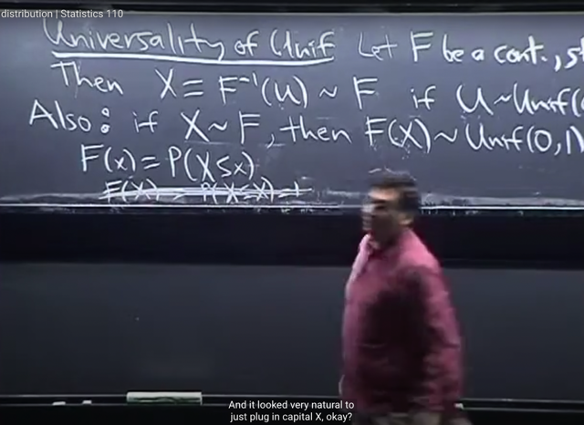</kbd></p>

> [!NOTE]
> Thế thì **chỗ này** ta **cần giải nghĩa F(X)** cho đúng. Sẽ là **SAI** nếu interpret như vầy:
>
> CDF F(x) theo định nghĩa là `P(X<=x),` thì khi gắn X vào để có F(X) nó sẽ bằng
> `P(X<=X).` Mà **X<=X là event luôn xảy ra** nên `P(X<=X)` `=` 1 vậy **F(X) `=` 1**.
> Nhắc lại: Đây là cách hiểu **SAI** về F(X).

<br>

<a id="node-385"></a>

<p align="center"><kbd>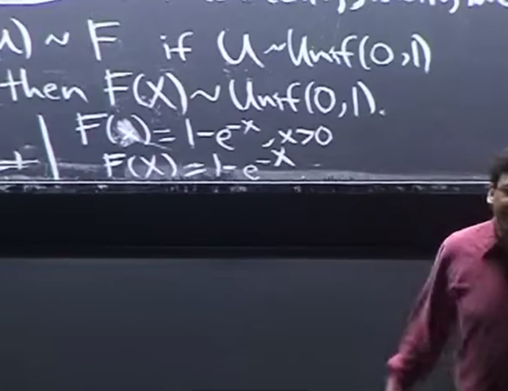</kbd></p>

> [!NOTE]
> Thế thì cách **HIỂU ĐÚNG về F(X)** (tức **apply function F vào random variable
> X**, nó **khác với khi ta ghi F(x) thì chỉ là nói về bản thân hàm F**, lúc này x là dummy
> variable, có thể ghi F(t), F(u) đều được miễn là đang hiểu nó là hàm CDF của r.v X) 
>
> Đó là **ví dụ ta có function F(x) `=` 1 `-` e^-x** với x > 0, đây là một CDF quan trọng sẽ 
> học sau.
>
> Vậy cách **hiểu đúng về F(X)** phải là **bỏ X vào x ở đây để có F(X) `=` 1 `-` e^-X**
>
> Có nghĩa là ta phải **thể hiện F(x) ở dạng "làm gì đó lên x" và thay X vào x**. Chứ
> **không phải là thay X vào x trong P(X<=x)**.
>
> Hiểu nôm na, cái việc **F(x) `=` `P(X<=x)` là ý nghĩa của CDF**, nhưng **apply F lên X**
> thì phải **thay X vào công thức của hàm F** chứ không phải thay X vào x trong
> `P(X<=x)`

> [!NOTE]
> Cách HIỂU ĐÚNG về F(X)

<br>

<a id="node-386"></a>

<p align="center"><kbd>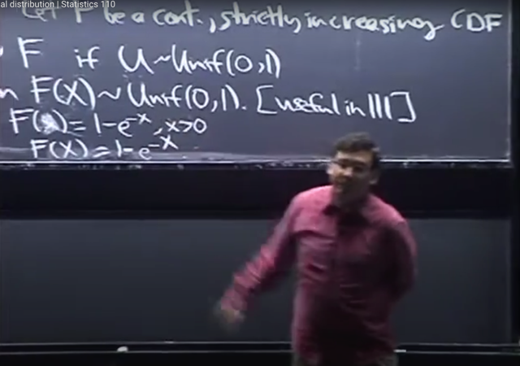</kbd></p>

> [!NOTE]
> Đại khái là gs nói cái này **rất hữu ích**, ví dụ khi ta học qua lớp **Statistic
> 111** **Statistical Inference**. Nôm na là **có khi ta có một random variable
> phức tạp** X (ý là, một random variable có công thức phức tạp), và ta **có thể
> dùng F(X)** để **xem thử nó có tuân theo Uniform hay không**, **nếu không
> thì có thể có gì đó không đúng**

<br>

<a id="node-387"></a>

<p align="center"><kbd>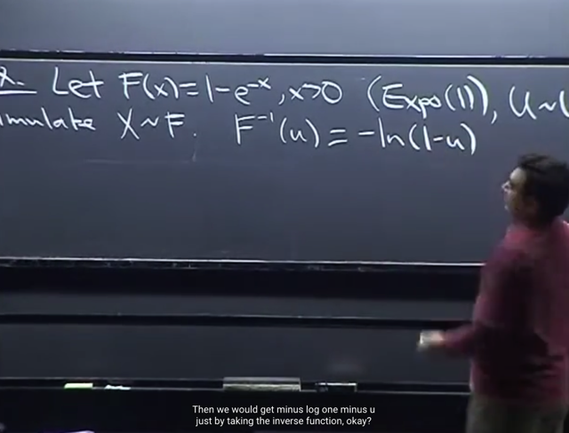</kbd></p>

<p align="center"><kbd>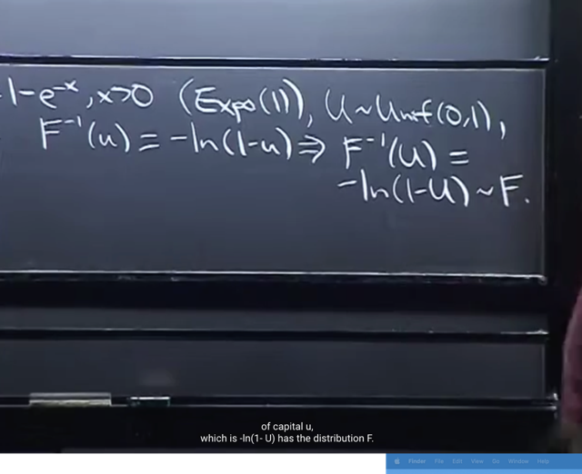</kbd></p>

<p align="center"><kbd></kbd></p>

<p align="center"><kbd></kbd></p>

<p align="center"><kbd>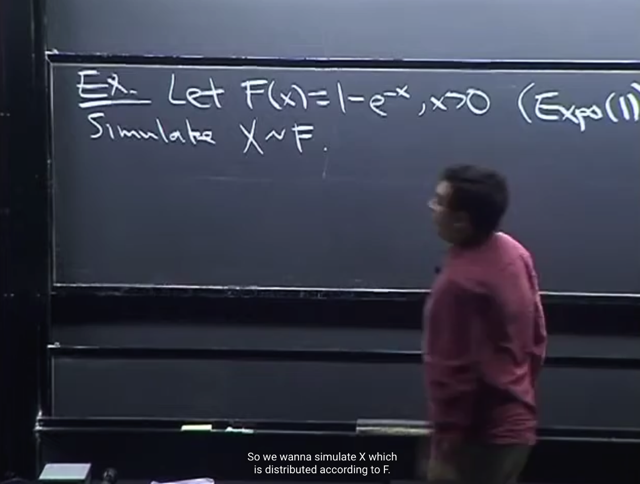</kbd></p>

> [!NOTE]
> Gs quay lại nói rằng cái **Universality theorem** cũng **rất hữu ích**. Ví dụ như ta **có một CDF F(x)** như vầy F(x) `=` **1 `-` e^-x**(nó là một distribution quan trọng mà ta sẽ học sau `-` **Exponential (1)**). Và **ta muốn simulate (kiểu như sampling)**
> **các random variable X thuộc distribution có CDF là F**.
>
> Thế thì **Universality theorem cho ta cách làm đơn giản**. Đầu tiên ta sẽ **tìm F_inv**. Đơn giản là **cho y `=` F(x) `=` 1-e^x**
> và **giải ra x `=` G(y)** thì khi đó **G(y) chính là F_inv**.
>
> ```text
> Ở đây ta giải: y = 1 - e^x <=>  e^x = 1-y <=> (lấy ln base e hai vế) ln e^-x = ln(1-y) <=> -x = ln(1-y)
> ```
>
> `<=>` x `=` `-` `ln(1-y)` `=>` `F_inv` là**-ln(1-y)**
> Từ đó **sampling một random variable Uniform (0,1)** và gắn vào ta sẽ có **X `=` `-` ln(1-U)** thì ta **sẽ có một random 
> variable ~ F.**
>
> Và **việc sampling từ Uniform (0,1) thì máy tính làm rất dễ**. Nên nhờ Universal theorem mà ta có thể**dễ dàng
> simulating các random variable từ một CDF F(x)** bất kì (**miễn là tìm được F_inv**)

<br>

<a id="node-388"></a>

<p align="center"><kbd>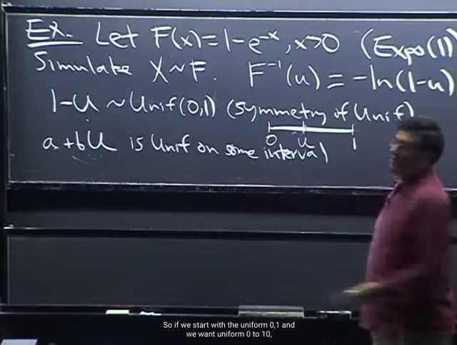</kbd></p>

> [!NOTE]
> tiếp gs nói về **tính chất symmetry của Uniform**. Đó là, **nếu U ~ Uniform
> (0,1)** thì **1-U cũng ~ Uniform (0,1)**

> [!NOTE]
> Tính chất symmetry của Uniform. Đó là, nếu U ~ Uniform
> (0,1) thì `1-U` cũng ~ Uniform (0,1)

<br>

<a id="node-389"></a>

<p align="center"><kbd>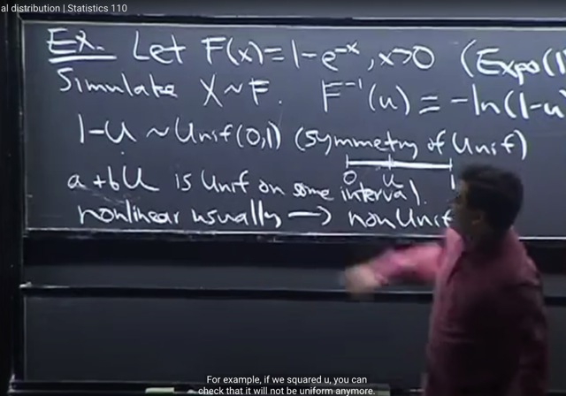</kbd></p>

> [!NOTE]
> và **a `+` bU** **cũng là Uniform** với**interval nào đó**.
>
> Tuy nhiên **lưu ý**, **a `+` bU là linear transformatio**n nên **nó vẫn là Uniform**,
> nhưng **nếu apply một `non-linearity` lên U** thì ta sẽ **không còn là Uniform** nữa.
>
> Ví dụ **U^2 không còn là Uniform**

> [!NOTE]
> a `+` bU cũng là Uniform
> với interval nào đó.

<br>

<a id="node-390"></a>

<p align="center"><kbd>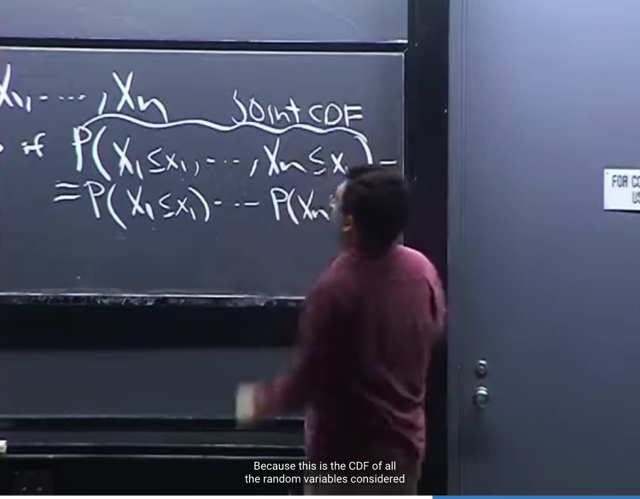</kbd></p>

<p align="center"><kbd></kbd></p>

<p align="center"><kbd>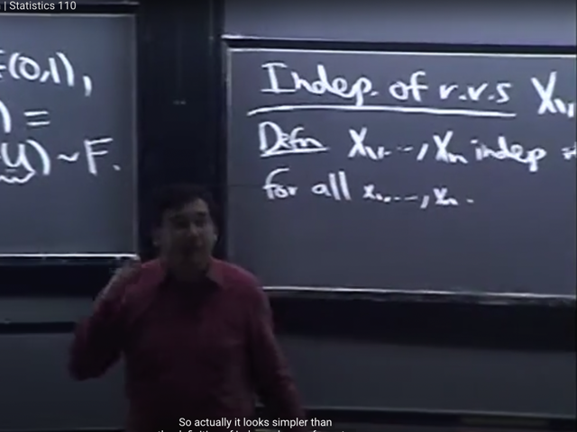</kbd></p>

> [!NOTE]
> Ở đây gs quay lại **chính thức nói về** khái niệm **INDEPENDENT RANDOM VARIABLES**:
>
> Những bài trước, ta đã được **biết sơ** về định nghĩa của independent r.v, khi đó gs nói rằng ta có thể **gắn nó với định nghĩa independent events**. 
> Và bữa trước là trong bối cảnh ta làm việc với các discrete r.v, nên sử dụng PMF. Để rồi **X,Y independent nếu các event `X=x` và `Y=y` independent**,  
> và cái này thì **chiếu theo định nghĩa của independent events** sẽ có nghĩa là **P(X=x, `Y=y)` `=` P(X=x)*P(Y=x)** mang ý nghĩa là Joint PMF `=` tích các PMF 
> tương ứng với xác suất của joint event bằng tích xác suất từng event)
>
> Thế thì ở đây ta cũng có thể có định nghĩa independent r.v nhưng dùng **CDF** trong bối cảnh ta đang xét **continuous** r.v
>
> Đó là nếu các random variable X1, X2...Xn có tính chất **P(X1 ≤ x1, X2 ≤ x2, ... Xn ≤ xn) `=` P(X1 ≤ x1)*P(X2 ≤ x2)*..... P(Xn ≤ xn) thì Xj sẽ independent**
> **VỚI MỌI x1, x2,...xn** 
>
> Thì ở đây **(X1 ≤ x1, X2 ≤ x2, ... Xn ≤ xn)** gọi là **JOINT CDF**,  [X1 ≤ x1, X2 ≤ x2, ... Xn ≤ xn] là **JOINT EVENT** (intersection của n event)
> như đã biết
>
> Như vậy các r.v **INDEPENDENT** nếu như**Joint CDF** `=` **tích các CDF**
>
> Thế thì gs chú ý là, cái này khi **so với định nghĩa của independent event** ta thấy nó **CÓ VẺ ĐƠN GIẢN HƠN**. Vì ta nhớ ví dụ với**3 events A, B, C**
> được gọi là **Independent** nếu thỏa các điều kiện sau:
>
> ```text
> P(A,B,C) = P(A)*P(B)*P(C) ; P(A,B) = P(A)*P(B) ; P(B,C) = P(B)*P(C), P(A,C) = P(A)*P(C)
> ```
>
> Tương tự với 4 event, A,B,C,D thì phải có thêm các equation P(B,C,D) `=` P(B)*P(C)*P(D)...
>
> Tuy nhiên thật ra ở đây ta **chú ý đến vế "for all x1, x2....xn"** tức là **mọi possible value của X1, X2...Xn**

> [!NOTE]
> ĐỊNH NGHĨA CỦA INDEPENDENT R.VS DỰA TRÊN CDF
>
> P(X1 ≤ x1, X2 ≤ x2, ... Xn ≤ xn) `=` P(X1 ≤ x1)*P(X2 ≤ x2)*..... P(Xn ≤ xn) thì Xj sẽ independent
> VỚI MỌI x1, x2,...xn

<br>

<a id="node-391"></a>

<p align="center"><kbd>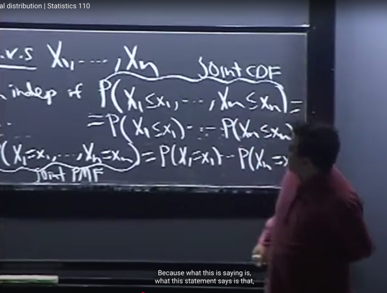</kbd></p>

🔗 **Related:** [TÓM TẮT:  - Tính MGF M(t) của Expo(1) = 1/(1-t) t < 1  - Khi đã có MGF, như bài trước ta đã biết các lí do mà MGF quan trọng trong đó có reason #1 đó là ta chỉ cần tính đạo hàm cấp n của nó sẽ cho ta n'th moment.  - Dù ta có thể tính đạo hàm nhiều lần để có 1st, 2nd moment nhưng có cách hay hơn. Bằng cách nhận ra 1/(1-t) liên quan đến Geometric series  a + ar + ar^2 = Tổng k=0:infinity a*r^k với |r| < 1 sẽ converge về a/[1-r]  Nên 1/1-t chính là Tổng n=0:infinity t^n với |t| < 1  Thế thì theo gs, từ đây cho phép ta KHỎI CẦN TÍNH ĐẠO HÀM CẤP N ĐỂ CÓ MOMENT THỨ N LÀM GÌ CHO MỆT, mà chỉ cần ĐỌC NÓ RA THÔI  Cụ thể là ta đã biết ở bài trước rằng, n'th moment = đạo hàm cấp n của M(t) (là coefficient của (t^n / n!) khi expand M(t) theo Taylor series tại 0)  Do đó, bằng cách tạo ra (t^n / n!) thì BẤT CỨ CÁI GÌ GẮN VỚI NÓ CHÍNH LÀ COEFFICIENT, VÀ CHÍNH LÀ N'TH MOMENT  Do đó ta sẽ nhân thêm n! và chia n! để có (t^n / n!). Như vậy cái lòi ra làm coefficient của t^n/n! ở đây là n! CHÍNH LÀ N'TH MOMENT.  Từ đó cho phép ta ĐỌC LUÔN RẰNG: 1ST MOMENT (EX) LÀ 1!, 2ND MOMENT E(X^2) LÀ 2!  N'TH MOMENT CỦA EXPO(1) E(X^n) = n!  -  đây là tính chất RẤT MẠNH CỦA MGF. Vì ví dụ như khi tính n'th moment (E[X^n]) thì nếu dùng LOTUS, ta phải TÍNH TÍCH PHÂN (INTEGRAL) VÀ CÓ THỂ GẶP NHỮNG TÍCH PHÂN RẤT PHỨC TẠP.  Trong khi đó, nếu ta có MGF, để có nth moment, ta CHỈ CẦN TÍNH DERIVATIVE MÀ DERIVATIVE THÌ THƯỜNG DỄ HƠN LÀ TÍNH TÍCH PHÂN  -Từ n'th moment của Expo(1) ta dễ dàng có n'th moment của Y ~ Expo(λ): E[Y^n] = n! / λ^n  - N'TH MOMENT CỦA N(0,1) VỚI N LẺ ĐỀU BẰNG 0  - MGF CỦA POIS(λ) = e^[λ(e^t-1)]  - Nếu Y ~ Pois(µ) và X~Pois(λ) và biết X, Y INDEPENDENT thì X+Y ~ Pois(λ+µ)](tóm_tắt_tính_mgf_mt_của_expo1_11_t_t_1_khi_đã_có_mgf_như_bài_trước_ta_đã_biết_các_lí_do_mà_mgf_quan_trọng_trong_đó_có_reason_1_đó_là_ta_chỉ_cần_tính_đạo_hàm_cấp_n_của_nó_sẽ_cho_ta_nth_moment_dù_ta_có_thể_tính_đạo_hàm_nhiều_lần_để_có_1st_2nd_moment_nhưng_có_cách_hay_hơn_bằng_cách_nhận_ra_11_t_liên_quan_đến_geometric_series_a_ar_ar2_tổng_k0infinity_ark_với_r_1_sẽ_converge_về_a1_r_nên_11_t_chính_là_tổng_n0infinity_tn_với_t_1_thế_thì_theo_gs_từ_đây_cho_phép_ta_khỏi_cần_tính_đạo_hàm_cấp_n_để_có_moment_thứ_n_làm_gì_cho_mệt_mà_chỉ_cần_đọc_nó_ra_thôi_cụ_thể_là_ta_đã_biết_ở_bài_trước_rằng_nth_moment_đạo_hàm_cấp_n_của_mt_là_coefficient_của_tn_n_khi_expand_mt_theo_taylor_series_tại_0_do_đó_bằng_cách_tạo_ra_tn_n_thì_bất_cứ_cái_gì_gắn_với_nó_chính_là_coefficient_và_chính_là_nth_moment_do_đó_ta_sẽ_nhân_thêm_n_và_chia_n_để_có_tn_n_như_vậy_cái_lòi_ra_làm_coefficient_của_tnn_ở_đây_là_n_chính_là_nth_moment_từ_đó_cho_phép_ta_đọc_luôn_rằng_1st_moment_ex_là_1_2nd_moment_ex2_là_2_nth_moment_của_expo1_exn_n_đây_là_tính_chất_rất_mạnh_của_mgf_vì_ví_dụ_như_khi_tính_nth_moment_exn_thì_nếu_dùng_lotus_ta_phải_tính_tích_phân_integral_và_có_thể_gặp_những_tích_phân_rất_phức_tạp_trong_khi_đó_nếu_ta_có_mgf_để_có_nth_moment_ta_chỉ_cần_tính_derivative_mà_derivative_thì_thường_dễ_hơn_là_tính_tích_phân_từ_nth_moment_của_expo1_ta_dễ_dàng_có_nth_moment_của_y_expoλ_eyn_n_λn_nth_moment_của_n01_với_n_lẻ_đều_bằng_0_mgf_của_poisλ_eλet_1_nếu_y_poisµ_và_xpoisλ_và_biết_x_y_independent_thì_xy_poisλµ.md#node-588)

> [!NOTE]
> Với **discrete** random variable thì cũng tương tự, nhưng ta sẽ làm với **PMF**:
>
> Các X1, X2...Xn sẽ gọi là independent nếu:
>
> **JOINT PMF** `P(X1=x1,` `X2=x2...Xn=xn)` `=` `P(X1=x1)*P(X2=x2)*...P(Xn=xn)` (tích các
> PMF)

<br>

<a id="node-392"></a>

<p align="center"><kbd>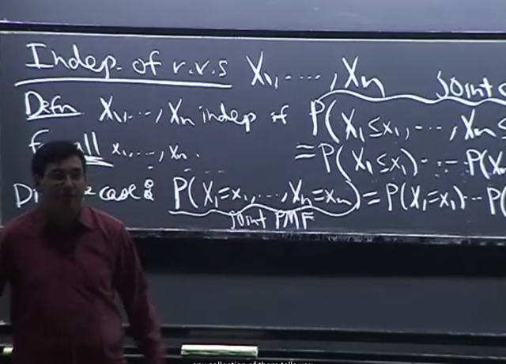</kbd></p>

> [!NOTE]
> Và gs cho biết **định nghĩa về Independent r.v như vậy** có nghĩa là v**iệc
> biết gía trị của một subset nào các random variables** cũng **không giúp ích
> gì cho ta biết giá trị của các random variable còn lại** (mà ta chưa biết)

<br>

<a id="node-393"></a>

<p align="center"><kbd>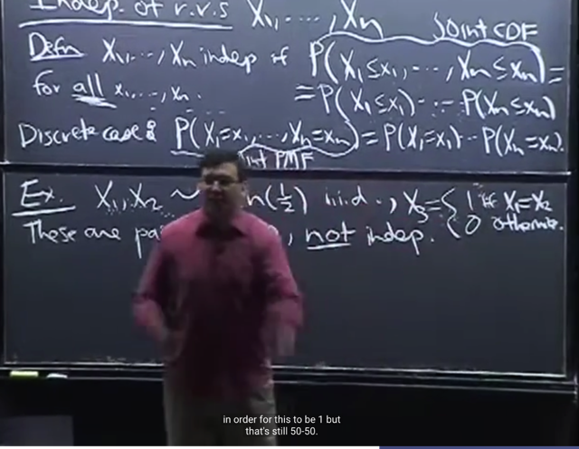</kbd></p>

> [!NOTE]
> Gs cho **ví dụ** để cho thấy tại sao **pair-wise independent không đủ** để
> **kết luận independent**. 
>
> Cho **X1, X2 là ~ Bern(0.5) và i.i.d** và **X3 `=` X1+X2** 
>
> Thế thì chúng **pair-wise independent**, vì việc **biết X1, hoặc X2 riêng lẻ** **không
> cho thông tin gì về X3.**
>
> Nhưng **xét thành nhóm cả ba** thì **rõ ràng việc biết X1, X2 sẽ cho rất rõ
> giá trị của X3.**Do đó v**iệc independent từng cặp `(pair-wise)` không
> đủ để kết luận cả nhóm X1,X2,X3 independent**

<br>

<a id="node-394"></a>

<p align="center"><kbd>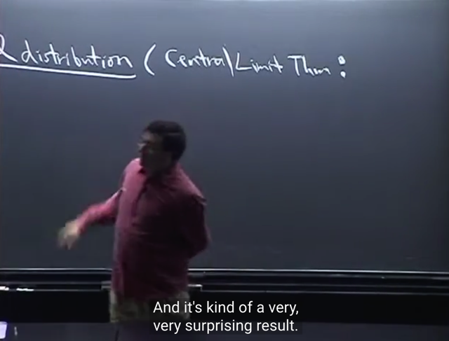</kbd></p>

> [!NOTE]
> Ta học qua **Normal distribution**, có tên khác là **Gaussian** distribution.
>
> Tiếng Việt là **PHÂN PHỐI CHUẨN**
>
> mà theo gs là **distribution quan trọng nhất** trong statistic. Và sở dĩ nó 
> quan trọng như vậy là bởi liên quan đến **Central Limit Theorem**

> [!NOTE]
> NORMAL DISTRIBUTION `-` PHÂN PHỐI CHUẨN

<br>

<a id="node-395"></a>

<p align="center"><kbd>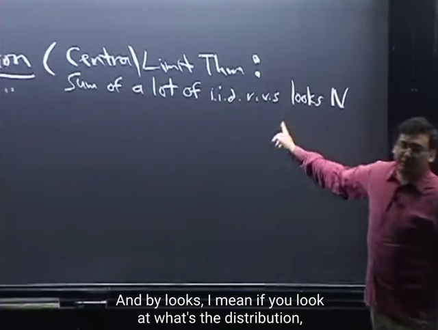</kbd></p>

> [!NOTE]
> Đại khái là gs nói sơ về **Central Limit Theorem**, nói rằng **tổng
> của các i.i.d random variables** sẽ **tuân theo Normal distribution**

<br>

<a id="node-396"></a>

<p align="center"><kbd>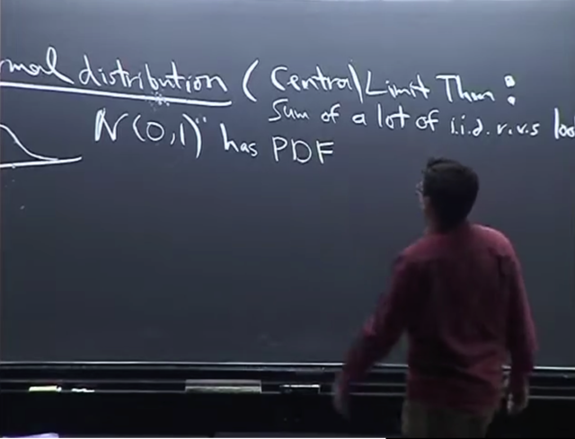</kbd></p>

> [!NOTE]
> Ta sẽ**xét Normal N(0,1)** gọi là s**tandard normal distribution** có **mean**
> bằng **0** và **variance** **1** (Ta sẽ chứng minh điều này sau)

<br>

<a id="node-397"></a>

<p align="center"><kbd>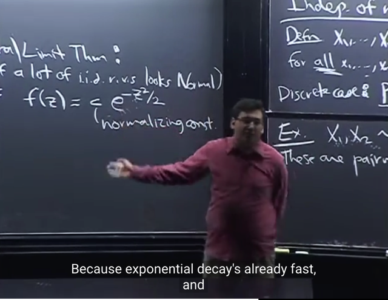</kbd></p>

> [!NOTE]
> Đại khái là, người ta **thường dùng chữ Z** để kí hiệu cho **Normal
> distribution r.v**
>
> Gs cho rằng ta **chỉ cần biết** là f(z) có công thức này **c*****e^(-z^2/2),**
>
> Với **e^-z^2/2** xuất phát từ triển khai Taylor gì đó
>
> Và **constant c** đóng vai trò giúp **normalizing để tổng area bằng 1**.
>
> Và ta sẽ nhận xét rằng nó có tính **SYMMETRY**, khi **z âm hay dương** đều
> ra **kết quả giống nhau**. Và khi **z tiến về `-infinity` và +infinity** thì **f(z) tiến
> về 0 rất nhanh.**

> [!NOTE]
> Z ~ N(0,1) f(z) có công thức
> này `c*e^(-z^2/2),`

<br>

<a id="node-398"></a>

<p align="center"><kbd>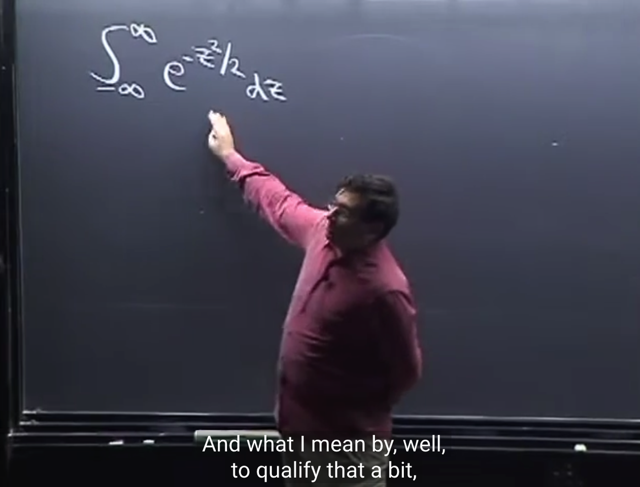</kbd></p>

> [!NOTE]
> Đại khái là **ta sẽ đi tìm constant c**, thì đầu tiên ta sẽ**tìm [tích phân từ
> `-infinity` tới infinity của f(z)dz]**. Thì chính nó, đúng hơn là **1 chia cái này
> chính là c** vì **c là constant giúp normalize để area bằng 1**, mà **area
> chính là cái [tích phân từ `-infinity` tới infinity của f(z)dz]** (ví dụ area `=` 2 thì c
> ```text
> = 1/2 để normalize area  = 2/2 = 1)
> ```
>
> Thế thì gs nói **nếu ta thử tính cái tích phân này** (để rồi lấy 1 chia cái đó để
> có c) thì **sẽ không làm được**. Dù có tiếp cận theo cách nào như tìm
> nguyên hàm F(z) của f(z) để áp dụng Fundamental Theorem of Calculus part
> 2 rằng tích phân từ a đến b của f(x)dx bằng F(b) `-` F(a) cũng sẽ không được.
>
> Thậm chí **có một định lý** gì đó **đã chứng minh không thể** tính tích phân
> không xác định của f(z) `=` `e^(-z^2/2)` (chính là cái ta đang muốn làm) ở dạng
> **closed-form.**

> [!NOTE]
> Không thể tính tích phân không xác định của f(z) `=`
> `e^(-z^2/2)` ở dạng `closed-form.`

<br>

<a id="node-399"></a>

<p align="center"><kbd></kbd></p>

> [!NOTE]
> Gs nói tuy vậy ta**vẫn có thể dùng Taylor series**. Nên **khi nói ko thể làm
> được** thì  **ý** **là** không thể làm được ở dạng **closed-form thôi
>
> (Hiểu đại khái `closed-form` có nghĩa là ta có thể viết ra kết quả ở dạng
> một công thức hữu hạn, dùng các phép toán cơ bản và function quen 
> thuộc)**

<br>

<a id="node-400"></a>

<p align="center"><kbd>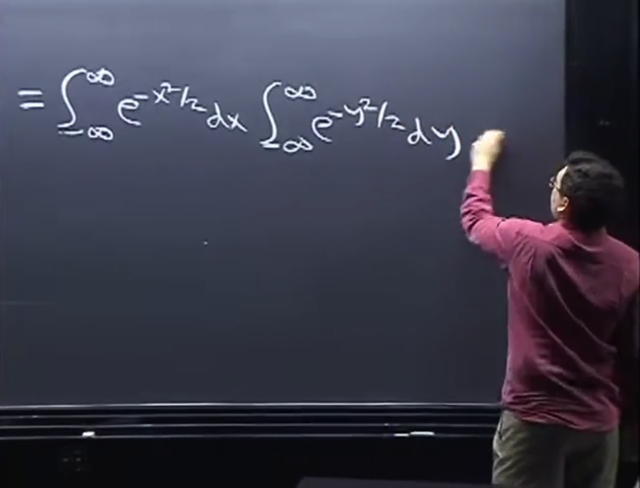</kbd></p>

<p align="center"><kbd></kbd></p>

<p align="center"><kbd>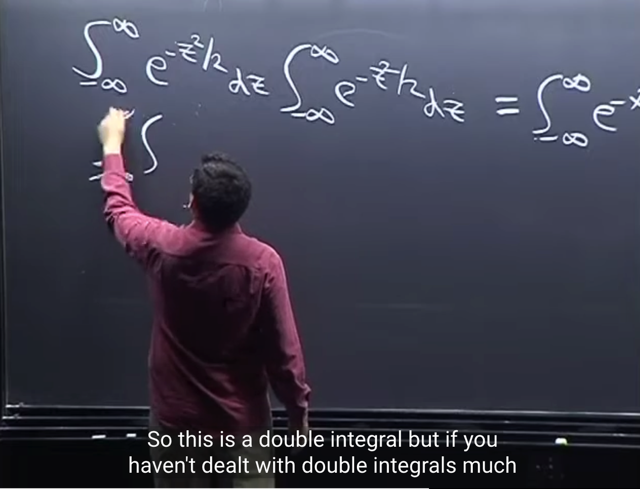</kbd></p>

> [!NOTE]
> Đại khái là**tuy rằng không thể tìm được anti-derivative**, nhưng **vẫn có cách tìm tích phân** của bài toán này **không cần anti-derivative**
> (ý là không cần dựa vào FTC part 2)
>
> Gs cho biết **có một cách** vừa **stupid** vừa **brilliant** mà **không phải lúc nào cũng work** nhưng **work trong trường hợp này**. Đó là ta viết
> thêm (**NHÂN THÊM**) **một cái tích phân (mà ta không tính được) nữa.**
>
> Và vì **z** ở đây chỉ là**dummy variable**, tức là một kí hiệu,**có thể dùng chữ gì** cũng được, nên ta sẽ **thay cái đầu bằng x**, **cái sau bằng y**

<br>

<a id="node-401"></a>

<p align="center"><kbd>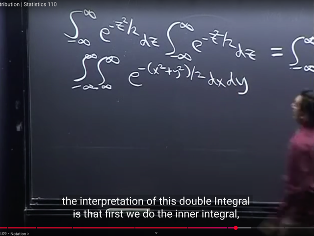</kbd></p>

> [!NOTE]
> Thì nó **trở thành tích phân kép** như vầy.
>
> **∫-inf:inf `∫-inf:inf` `e^-(x^2+y^2)/2` dxdy**
>
> **Gs nói không có gì khác biệt** với cái trên [tích phân f(x)dx]*[tích phân f(y)dy] cả,
> vì đơn giản là:
>
> **Khi tính tích phân kép** này, **ta sẽ làm (tích tích phân) với x trước**, khi đó **giữ
> y là constant**. Và và **vì giữ y làm constant** nên **hòan toàn có thể đưa nó ra
> đằng trước** để trở thành dạng [tích phân f(y)dy]*[tích phân f(x)dx] như trên
>
> (Đây là kiến thức đã học trong bài về double integral của MIT 18.02)
>
> Tóm lại, ý nói hai cái trên thật ra là như nhau và không có gì phức tạp khi làm vậy

<br>

<a id="node-402"></a>

<p align="center"><kbd>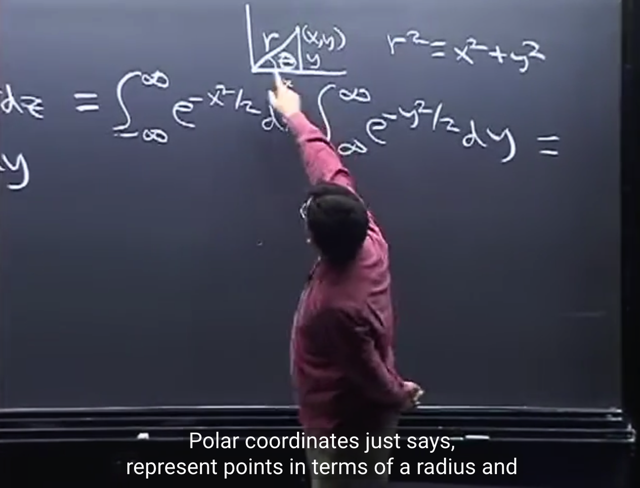</kbd></p>

> [!NOTE]
> Thế thì gs nói là **dù vậy thì việc chuyển thành bài toán tính tích phân kép**
> cũng **có vẻ chẳng dễ hơn** **là mấy**.
>
> Nhưng gs cho rằng **điểm mấu chốt là x^2 `+` y^2**, ông nói **bất cứ khi nào ta
> thấy cái này** thì ta **nên liên tưởng đến định lý Pytagore**. (Pythagoras
> theorem).
>
> Và từ đó **gợi ý rằng** mình nên **chuyển sang POLAR COORDINATE** `-` biểu
> diễn một điểm bằng bán kính r và góc `θ` thay vì x, y (CARTESIAN)

<br>

<a id="node-403"></a>

<p align="center"><kbd>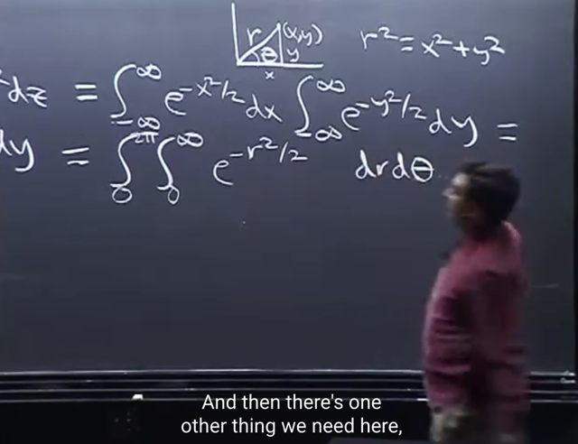</kbd></p>

> [!NOTE]
> Và từ đó, ta **chuyển bài toán thành tích phân này**:
>
> ∫**0:2π `∫0:inf` `e^(-r^2/2)` dr dθ**Soi sáng bởi 18.02 giúp ta hiểu thêm**tại sao bound inner integral (r) là
> 0:infinity**
>
> Trong bài 17 của 18.02 ta làm một ví dụ **tính tích phân kép trên area** là một
> **hình tròn** (**paraboloid** **z `=` 1 `-` x^2 `-` y^2** cắt mặt phẳng **xy** tại **đường
> tròn** bán **kính 1**, xuất phát từ bài toán tính thể tích của vùng nằm trong giới
> hạn bởi paraboloid và mặt xy),****khi đó vì giới hạn trong area như vậy nên
> bound của inner integral r (mang ý nghĩa là khi giữ `θ` fixed thì r có range từ đâu
> tới đâu) được nhiên sẽ là từ 0 đến 1. Còn ở đây, tích phân gốc có bound của x,
> y đều là `-infinity` đến infinity tức **vùng đang tính tích phân là toàn bộ mặt
> phẳng**, do đó khi chuyển qua polar coordinate thì **bound của r sẽ là từ 0 đến
> infinity.**
>
> Còn đương nhiên bound của `θ` cũng từ 0 `->` `2π` để cover mọi hướng rồi.

<br>

<a id="node-404"></a>

<p align="center"><kbd>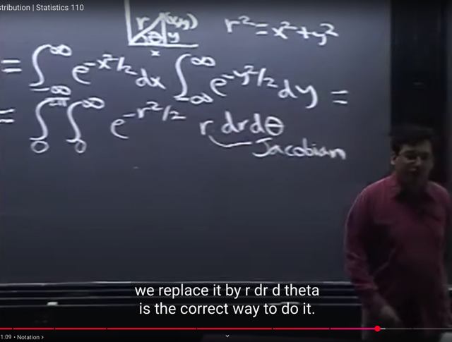</kbd></p>

> [!NOTE]
> Gs nói rằng **kết quả nó sẽ cần thêm yếu tố Jacobian nữa**. (Cái này rõ ràng là
> mình sẽ cần đến bài **Polar Coordinate** của 1802 mới hiểu, hiểu sơ thì nó là **det
> của Jacobian matrix**, sẽ ra là **r**)
>
> Gs đề nghị xem lại math review handout. Và yếu tố Jacobian ở đây là r.
>
> `====`
>
> Sau khi đã học xong 18.02 (lecture 17,18) có thể hiểu tại sao khi chuyển tích phân
> từ x, y sang u, v thì ta cần một scaling factor để liên hệ giữa dA `(=dxdy)` trong x, y
> coordinate với dA' trong u, v cooridnate.
>
> Thì trong 18.02 ta đã chứng minh để hiểu rằng scaling factor này chính là
> determinant của Jacobian matrix (matrix of partial derivative). Do đó khi chuyển từ
> x,y sang polar coordinate. J sẽ là:
>
> ```text
> x = r*cos(θ), y = r*sin(θ). Nên J = [x_r, x_θ; y_r, y_θ]
> ```
>
> `(x_r` là kí hiệu trong 18.02 cho partial derivative của x đối với r)
>
> ```text
> = [cos(θ), r*(-sin(θ)) ; sin(θ), r*cos(θ)]
> ```
>
> Và det J `=` `cos(θ)*r*cos(θ)` `-` `r*sin(θ)*sin(θ)` `=` `r(sin^2(θ)` `+` `cos^2(θ))` `=` **r
>
> Và r dương nên |det J| `=` r. Vậy scaling factor là r nên phải dùng r*dr*dθ**(nói thêm trong đó mình cũng biết ở bối cảnh đởi bíen tích phân thì người ta gọi
> **det của matrix Jacobian** là **Jacobian** luôn)

<br>

<a id="node-405"></a>

<p align="center"><kbd>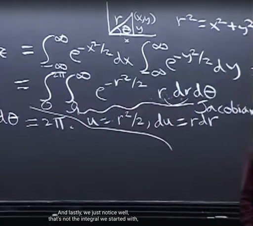</kbd></p>

<p align="center"><kbd></kbd></p>

<p align="center"><kbd>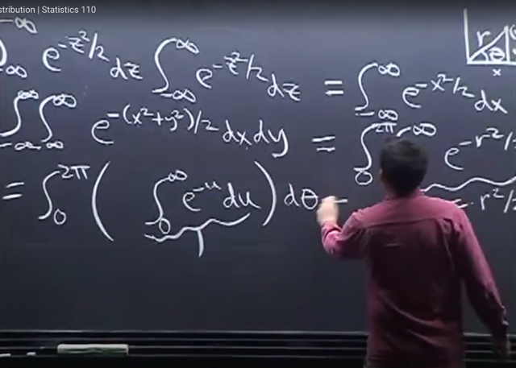</kbd></p>

> [!NOTE]
> Và bài toán bây giờ đã trở nên dễ hơn. Ta sẽ**tính tích phân với r trước**, đặt **u `=` r^2/2** thì **du `=` rdr**
>
> Từ đó, nó trở thành **tích phân từ 0 đến infinity `e^-u` du**, và dùng **FTC part 2**, nó sẽ bằng 
> [nguyên hàm của `e^-u](infinity)` `-` [nguyên hàm của `e^-u](0)`  
>
> (nguyên hàm của `e^-u` là **-e^(-u)**, vì d `[-e^(-u)]` `/` du `=` `-e^(-u)*(-1)` `=` `e^(-u)`
>
> `=` `-e^-infinity` `-(-e^0)` `=` 0 `-` `(-1)` `=` **1**
>
> Tiếp, tính tích phân từ 0 đến 2*pi **1***d_theta `=` [nguyên hàm của 1] | từ 0 đến 2pi
>
> (nguyên hàm của 1 theo y) là y, vì `dy/dy` `=` 1
>
> `=` x | 0:2pi `=` 2pi `-` 0 `=` **2pi**

<br>

<a id="node-406"></a>

<p align="center"><kbd>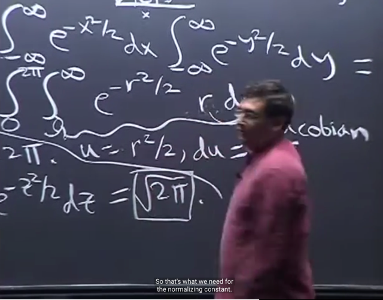</kbd></p>

> [!NOTE]
> Cuối cùng ta **phải nhớ** là**ta đang tính BÌNH PHƯƠNG** của**tích phân từ
> `-infinity` tới infinity `e^(-x^2/2)` dx**
>
> Do đó, kết quả sẽ là **căn bậc 2 của 2π**Và đây chính là**NORMALIZING CONSTANT**

> [!NOTE]
> NORMALIZING CONSTANT là `√2π`

<br>

<a id="node-407"></a>

<p align="center"><kbd>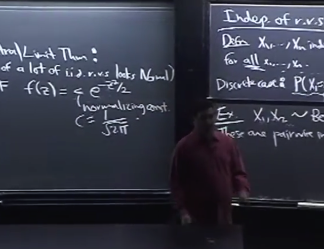</kbd></p>

🔗 **Related:** [TÓM TẮT:  - TÍNH UNIVERSALITY CỦA UNIFORM PART 2:  Nếu X ~ F thì F(X) ~ U(0,1)  -  Cách hiểu đúng về F(X) với F(x) = 1 - e^-x phải là bỏ X vào x ở đây để có F(X) = 1 - e^-X  - Áp dụng vào có thể dùng F(X) để xem thử nó có tuân theo Uniform hay không, nếu không thì có thể có gì đó không đúng  - Áp dụng khác là giúp ta simulating các observed data ~ F, bằng cách sampling từ U(0,1) và bỏ vào function Finv  - Tính chất symmetry của Uniform. Đó là, nếu U ~ Uniform (0,1) thì 1-U cũng ~ Uniform (0,1)  - ĐỊNH NGHĨA CỦA INDEPENDENT R.VS DỰA TRÊN CDF  P(X1 ≤ x1, X2 ≤ x2, ... Xn ≤ xn) = P(X1 ≤ x1)*P(X2 ≤ x2)*..... P(Xn ≤ xn) thì Xj  sẽ independent VỚI MỌI x1, x2,...xn  - Với discrete random variable thì cũng tương tự, nhưng ta sẽ làm với PMF:  Các X1, X2...Xn sẽ gọi là independent nếu:  JOINT PMF P(X1=x1, X2=x2...Xn=xn) = P(X1=x1)*P(X2=x2)*...P(Xn=xn) (tích các PMF)  - Ví dụ để cho thấy tại sao pair-wise independent không đủ để kết luận independent.   Cho X1, X2 là ~ Bern(0.5) và i.i.d và X3 = X1+X2. Xét từng cặp thì biết thằng này không giúp biết thằng kia ⇨ pair-wise independent nhưng xét bộ 3 thì biết X1, X2 biết ngay X3 ⇨ Nếu chỉ dựa vào pair-wise indepedent thì không đủ kết luật cả đám independent  - Standard Normal distribution:  Thường dùng chữ Z để kí hiệu cho Normal distribution r.v  Gs cho rằng ta chỉ cần biết là f(z) có công thức này c*e^(-z^2/2),  - Chứng minh NORMALIZING CONSTANT là c = 1/√2π  - pdf: (1/√2π) e^-z^2/2  - CHỨNG MINH X ~ N(0,1) EX = 0 DỰA VÀO SYMMETRY  - CHỨNG MINH X ~ N(0,1) VarX = 1  - Φ(z) = tích phân từ -infinity tới x của [e^(-t^2/2)dt]](tóm_tắt_tính_universality_của_uniform_part_2_nếu_x_f_thì_fx_u01_cách_hiểu_đúng_về_fx_với_fx_1_e_x_phải_là_bỏ_x_vào_x_ở_đây_để_có_fx_1_e_x_áp_dụng_vào_có_thể_dùng_fx_để_xem_thử_nó_có_tuân_theo_uniform_hay_không_nếu_không_thì_có_thể_có_gì_đó_không_đúng_áp_dụng_khác_là_giúp_ta_simulating_các_observed_data_f_bằng_cách_sampling_từ_u01_và_bỏ_vào_function_finv_tính_chất_symmetry_của_uniform_đó_là_nếu_u_uniform_01_thì_1_u_cũng_uniform_01_định_nghĩa_của_independent_rvs_dựa_trên_cdf_px1_x1_x2_x2_xn_xn_px1_x1px2_x2_pxn_xn_thì_xj_sẽ_independent_với_mọi_x1_x2xn_với_discrete_random_variable_thì_cũng_tương_tự_nhưng_ta_sẽ_làm_với_pmf_các_x1_x2xn_sẽ_gọi_là_independent_nếu_joint_pmf_px1x1_x2x2xnxn_px1x1px2x2pxnxn_tích_các_pmf_ví_dụ_để_cho_thấy_tại_sao_pair_wise_independent_không_đủ_để_kết_luận_independent_cho_x1_x2_là_bern05_và_iid_và_x3_x1x2_xét_từng_cặp_thì_biết_thằng_này_không_giúp_biết_thằng_kia_pair_wise_independent_nhưng_xét_bộ_3_thì_biết_x1_x2_biết_ngay_x3_nếu_chỉ_dựa_vào_pair_wise_indepedent_thì_không_đủ_kết_luật_cả_đám_independent_standard_normal_distribution_thường_dùng_chữ_z_để_kí_hiệu_cho_normal_distribution_rv_gs_cho_rằng_ta_chỉ_cần_biết_là_fz_có_công_thức_này_ce_z22_chứng_minh_normalizing_constant_là_c_12π_pdf_12π_e_z22_chứng_minh_x_n01_ex_0_dựa_vào_symmetry_chứng_minh_x_n01_varx_1_φz_tích_phân_từ_infinity_tới_x_của_e_t22dt.md#node-413)

> [!NOTE]
> Và như vậy, ta đã tìm ra c. Để PDF của Normal N(0,1) là:
>
> **(1/√2π) e^-z^2/2**
>
> Gs nói **nhờ vậy** mà **khi nhìn vào công thức** của **Normal distribution**
> ta có thể **hiểu chữ pi là từ đâu ra**:
>
> Nó chính là **xuất hiện khi ta chuyển từ Cartesian coordinates sang Polar
> coordinates**

<br>

<a id="node-408"></a>

<p align="center"><kbd>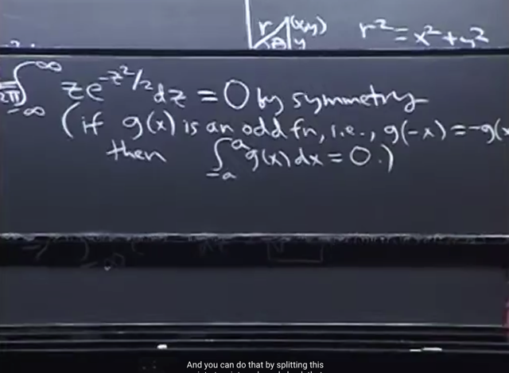</kbd></p>

<p align="center"><kbd>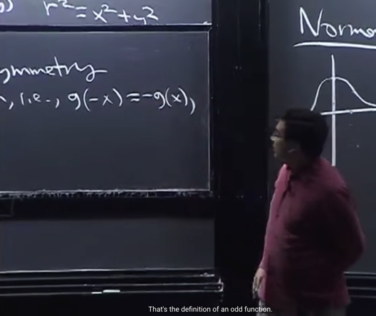</kbd></p>

<p align="center"><kbd>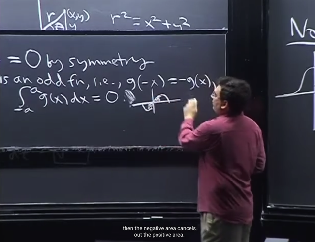</kbd></p>

<p align="center"><kbd></kbd></p>

<p align="center"><kbd></kbd></p>

<p align="center"><kbd></kbd></p>

<p align="center"><kbd>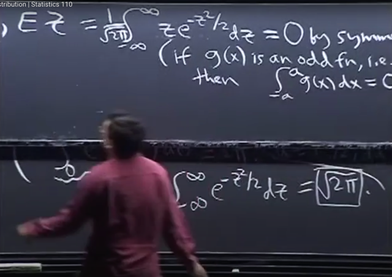</kbd></p>

🔗 **Related:** [TÓM TẮT:  - Tính MGF M(t) của Expo(1) = 1/(1-t) t < 1  - Khi đã có MGF, như bài trước ta đã biết các lí do mà MGF quan trọng trong đó có reason #1 đó là ta chỉ cần tính đạo hàm cấp n của nó sẽ cho ta n'th moment.  - Dù ta có thể tính đạo hàm nhiều lần để có 1st, 2nd moment nhưng có cách hay hơn. Bằng cách nhận ra 1/(1-t) liên quan đến Geometric series  a + ar + ar^2 = Tổng k=0:infinity a*r^k với |r| < 1 sẽ converge về a/[1-r]  Nên 1/1-t chính là Tổng n=0:infinity t^n với |t| < 1  Thế thì theo gs, từ đây cho phép ta KHỎI CẦN TÍNH ĐẠO HÀM CẤP N ĐỂ CÓ MOMENT THỨ N LÀM GÌ CHO MỆT, mà chỉ cần ĐỌC NÓ RA THÔI  Cụ thể là ta đã biết ở bài trước rằng, n'th moment = đạo hàm cấp n của M(t) (là coefficient của (t^n / n!) khi expand M(t) theo Taylor series tại 0)  Do đó, bằng cách tạo ra (t^n / n!) thì BẤT CỨ CÁI GÌ GẮN VỚI NÓ CHÍNH LÀ COEFFICIENT, VÀ CHÍNH LÀ N'TH MOMENT  Do đó ta sẽ nhân thêm n! và chia n! để có (t^n / n!). Như vậy cái lòi ra làm coefficient của t^n/n! ở đây là n! CHÍNH LÀ N'TH MOMENT.  Từ đó cho phép ta ĐỌC LUÔN RẰNG: 1ST MOMENT (EX) LÀ 1!, 2ND MOMENT E(X^2) LÀ 2!  N'TH MOMENT CỦA EXPO(1) E(X^n) = n!  -  đây là tính chất RẤT MẠNH CỦA MGF. Vì ví dụ như khi tính n'th moment (E[X^n]) thì nếu dùng LOTUS, ta phải TÍNH TÍCH PHÂN (INTEGRAL) VÀ CÓ THỂ GẶP NHỮNG TÍCH PHÂN RẤT PHỨC TẠP.  Trong khi đó, nếu ta có MGF, để có nth moment, ta CHỈ CẦN TÍNH DERIVATIVE MÀ DERIVATIVE THÌ THƯỜNG DỄ HƠN LÀ TÍNH TÍCH PHÂN  -Từ n'th moment của Expo(1) ta dễ dàng có n'th moment của Y ~ Expo(λ): E[Y^n] = n! / λ^n  - N'TH MOMENT CỦA N(0,1) VỚI N LẺ ĐỀU BẰNG 0  - MGF CỦA POIS(λ) = e^[λ(e^t-1)]  - Nếu Y ~ Pois(µ) và X~Pois(λ) và biết X, Y INDEPENDENT thì X+Y ~ Pois(λ+µ)](tóm_tắt_tính_mgf_mt_của_expo1_11_t_t_1_khi_đã_có_mgf_như_bài_trước_ta_đã_biết_các_lí_do_mà_mgf_quan_trọng_trong_đó_có_reason_1_đó_là_ta_chỉ_cần_tính_đạo_hàm_cấp_n_của_nó_sẽ_cho_ta_nth_moment_dù_ta_có_thể_tính_đạo_hàm_nhiều_lần_để_có_1st_2nd_moment_nhưng_có_cách_hay_hơn_bằng_cách_nhận_ra_11_t_liên_quan_đến_geometric_series_a_ar_ar2_tổng_k0infinity_ark_với_r_1_sẽ_converge_về_a1_r_nên_11_t_chính_là_tổng_n0infinity_tn_với_t_1_thế_thì_theo_gs_từ_đây_cho_phép_ta_khỏi_cần_tính_đạo_hàm_cấp_n_để_có_moment_thứ_n_làm_gì_cho_mệt_mà_chỉ_cần_đọc_nó_ra_thôi_cụ_thể_là_ta_đã_biết_ở_bài_trước_rằng_nth_moment_đạo_hàm_cấp_n_của_mt_là_coefficient_của_tn_n_khi_expand_mt_theo_taylor_series_tại_0_do_đó_bằng_cách_tạo_ra_tn_n_thì_bất_cứ_cái_gì_gắn_với_nó_chính_là_coefficient_và_chính_là_nth_moment_do_đó_ta_sẽ_nhân_thêm_n_và_chia_n_để_có_tn_n_như_vậy_cái_lòi_ra_làm_coefficient_của_tnn_ở_đây_là_n_chính_là_nth_moment_từ_đó_cho_phép_ta_đọc_luôn_rằng_1st_moment_ex_là_1_2nd_moment_ex2_là_2_nth_moment_của_expo1_exn_n_đây_là_tính_chất_rất_mạnh_của_mgf_vì_ví_dụ_như_khi_tính_nth_moment_exn_thì_nếu_dùng_lotus_ta_phải_tính_tích_phân_integral_và_có_thể_gặp_những_tích_phân_rất_phức_tạp_trong_khi_đó_nếu_ta_có_mgf_để_có_nth_moment_ta_chỉ_cần_tính_derivative_mà_derivative_thì_thường_dễ_hơn_là_tính_tích_phân_từ_nth_moment_của_expo1_ta_dễ_dàng_có_nth_moment_của_y_expoλ_eyn_n_λn_nth_moment_của_n01_với_n_lẻ_đều_bằng_0_mgf_của_poisλ_eλet_1_nếu_y_poisµ_và_xpoisλ_và_biết_x_y_independent_thì_xy_poisλµ.md#node-576)

> [!NOTE]
> Tiếp theo ta sẽ chứng minh **mean (tức là average, expected value) N(0,1) là 0**. Theo định nghĩa, với continuous random
> variables **E(X) bằng tích phân từ `-infinity` tới infinity của x*f(x)dx**
>
> Vậy ở đây, là **tích phân `-inf:inf` z * f(z)dz**với**f(z) `=` `[1/√(2π)]` * e^(-z^2/2)**
>
> Thế thì cái này **đơn giản là bằng 0**, **khỏi cần tính toán**. Là bởi tính chất **SYMMETRY** trong đó nói rằng: Nếu g(x) là
> một **HÀM LẺ** (odd even) tức **g(-x) `=` -g(x)** thì**tích phân từ `-a` đến a g(x)dx bằng 0**
>
> Và gs nói ta có thể **dựa vào định lý này** hoặc **tự chứng minh lại** bằng cách**tính tích phân thành 2 phần  sẽ thấy
> chúng cancel nhau**

> [!NOTE]
> CHỨNG MINH X ~ N(0,1) EX `=` 0
> DỰA VÀO SYMMETRY

<br>

<a id="node-409"></a>

<p align="center"><kbd>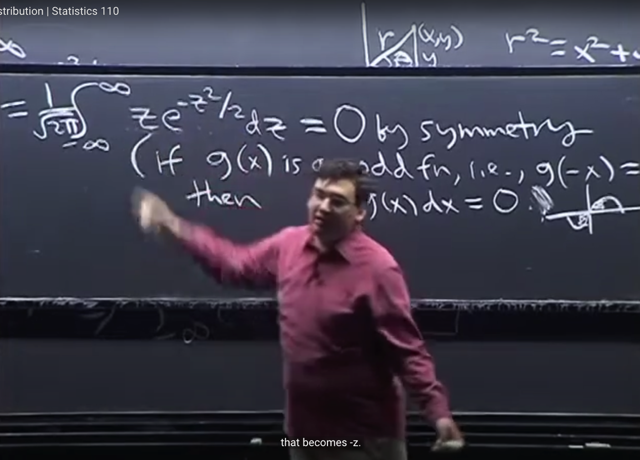</kbd></p>

> [!NOTE]
> Do đó `E(X)` `=` 0

<br>

<a id="node-410"></a>

<p align="center"><kbd>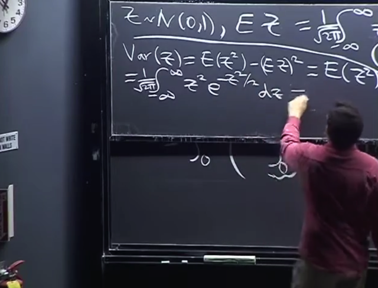</kbd></p>

> [!NOTE]
> Tiếp theo ta tính **Variance**. Như đã biết nó là **average của sự phân tán**: **E[(Z-EZ)^2]**
> và khi triển khai ra ta có công thức thứ hai: **E(Z^2) `-` (EZ)^2**
>
> Thử triển khai lại như sau: `E[(Z-EZ)^2]` `=` `E[Z^2-2ZEZ` `+` (EZ)^2]. Theo **linearity**
> ```text
> = E[Z^2] - E[2ZEZ] + E[(EZ)^2]
> ```
>
> ```text
> E[2ZEZ] = 2EZ * E[Z] (ở đây vì 2 và EZ - mean của r.v là constant, nên đưa ra ngoài)
> ```
> thành ra nó là 2(EZ)^2
>
> `E[(EZ)^2]` cũng là (EZ)^2 vì (**EZ)^2 là constant**
>
> ```text
> Vậy ta có E(Z^2) - 2(EZ)^2 + (EZ)^2 = E(Z^2) - (EZ)^2
> ```
>
> `===` 
>
> Thế thì ta sẽ**cần tính E(Z^2)**. Nhờ **Law Of Unconscious Statistician (LOTUS)** mà ta 
> có thể **không cần phải tìm PDF của Z^2**, và **chỉ việc dùng ngay PDF của Z**
>
> Nên `E(Z^2)` `=` tích phân từ `-infinity` đến infinity **z^2** f(z) dz với f(z) đã biết (có thể đưa 
> constant `1/√(2π)` ra ngoài)

<br>

<a id="node-411"></a>

<p align="center"><kbd>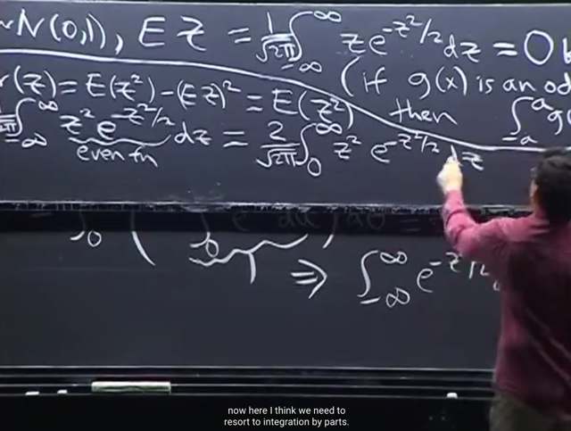</kbd></p>

> [!NOTE]
> Thế thì, **z^2*e^(-z^2/2)** cũng là **EVEN** FUNCTION (HÀM CHẴN, f(x) `=` `f(-x))`
>
> Đó đó ta có thể c**ho tích phân này `(-inf:inf)` bằng 2 lần tích phân từ 0 đến
> infinity**. Mục đích để**bớt phải làm việc với negative part.**

<br>

<a id="node-412"></a>

<p align="center"><kbd>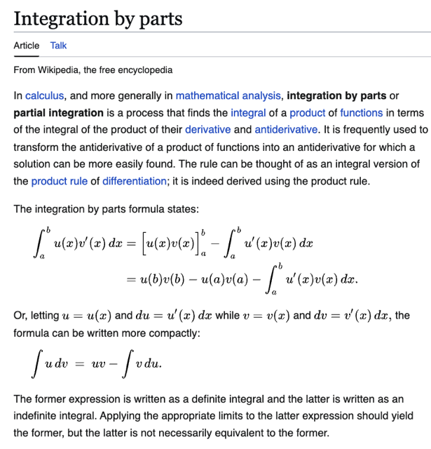</kbd></p>

> [!NOTE]
> Thế thì chi tiết có thể sẽ được **nói đến kĩ hơn trong 18.01** nhưng theo đây
> ta có thể hiểu là **partial integration** cho phép tính **tích phân từ a đến b của
> u(x)v'(x)dx `=` [u(x)v(x)] | `a->b` `-` tích phân từ a đến b của u'(x)v(x)dx**

<br>

<a id="node-413"></a>

<p align="center"><kbd>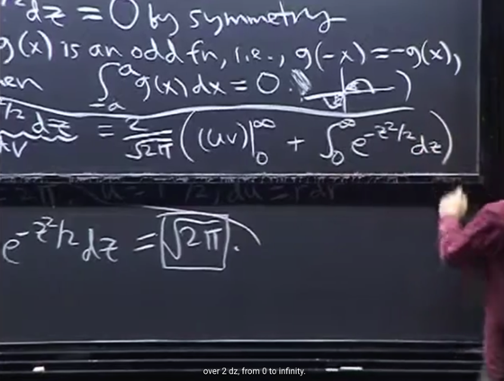</kbd></p>

<p align="center"><kbd></kbd></p>

<p align="center"><kbd>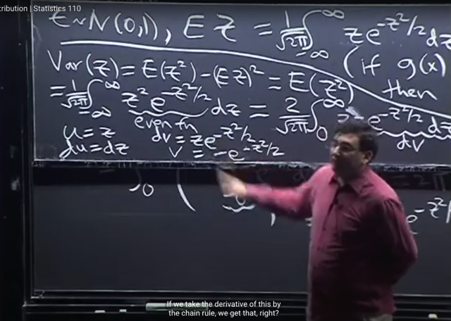</kbd></p>

🔗 **Related:** [TÓM TẮT:  - TÍNH UNIVERSALITY CỦA UNIFORM PART 2:  Nếu X ~ F thì F(X) ~ U(0,1)  -  Cách hiểu đúng về F(X) với F(x) = 1 - e^-x phải là bỏ X vào x ở đây để có F(X) = 1 - e^-X  - Áp dụng vào có thể dùng F(X) để xem thử nó có tuân theo Uniform hay không, nếu không thì có thể có gì đó không đúng  - Áp dụng khác là giúp ta simulating các observed data ~ F, bằng cách sampling từ U(0,1) và bỏ vào function Finv  - Tính chất symmetry của Uniform. Đó là, nếu U ~ Uniform (0,1) thì 1-U cũng ~ Uniform (0,1)  - ĐỊNH NGHĨA CỦA INDEPENDENT R.VS DỰA TRÊN CDF  P(X1 ≤ x1, X2 ≤ x2, ... Xn ≤ xn) = P(X1 ≤ x1)*P(X2 ≤ x2)*..... P(Xn ≤ xn) thì Xj  sẽ independent VỚI MỌI x1, x2,...xn  - Với discrete random variable thì cũng tương tự, nhưng ta sẽ làm với PMF:  Các X1, X2...Xn sẽ gọi là independent nếu:  JOINT PMF P(X1=x1, X2=x2...Xn=xn) = P(X1=x1)*P(X2=x2)*...P(Xn=xn) (tích các PMF)  - Ví dụ để cho thấy tại sao pair-wise independent không đủ để kết luận independent.   Cho X1, X2 là ~ Bern(0.5) và i.i.d và X3 = X1+X2. Xét từng cặp thì biết thằng này không giúp biết thằng kia ⇨ pair-wise independent nhưng xét bộ 3 thì biết X1, X2 biết ngay X3 ⇨ Nếu chỉ dựa vào pair-wise indepedent thì không đủ kết luật cả đám independent  - Standard Normal distribution:  Thường dùng chữ Z để kí hiệu cho Normal distribution r.v  Gs cho rằng ta chỉ cần biết là f(z) có công thức này c*e^(-z^2/2),  - Chứng minh NORMALIZING CONSTANT là c = 1/√2π  - pdf: (1/√2π) e^-z^2/2  - CHỨNG MINH X ~ N(0,1) EX = 0 DỰA VÀO SYMMETRY  - CHỨNG MINH X ~ N(0,1) VarX = 1  - Φ(z) = tích phân từ -infinity tới x của [e^(-t^2/2)dt]](tóm_tắt_tính_universality_của_uniform_part_2_nếu_x_f_thì_fx_u01_cách_hiểu_đúng_về_fx_với_fx_1_e_x_phải_là_bỏ_x_vào_x_ở_đây_để_có_fx_1_e_x_áp_dụng_vào_có_thể_dùng_fx_để_xem_thử_nó_có_tuân_theo_uniform_hay_không_nếu_không_thì_có_thể_có_gì_đó_không_đúng_áp_dụng_khác_là_giúp_ta_simulating_các_observed_data_f_bằng_cách_sampling_từ_u01_và_bỏ_vào_function_finv_tính_chất_symmetry_của_uniform_đó_là_nếu_u_uniform_01_thì_1_u_cũng_uniform_01_định_nghĩa_của_independent_rvs_dựa_trên_cdf_px1_x1_x2_x2_xn_xn_px1_x1px2_x2_pxn_xn_thì_xj_sẽ_independent_với_mọi_x1_x2xn_với_discrete_random_variable_thì_cũng_tương_tự_nhưng_ta_sẽ_làm_với_pmf_các_x1_x2xn_sẽ_gọi_là_independent_nếu_joint_pmf_px1x1_x2x2xnxn_px1x1px2x2pxnxn_tích_các_pmf_ví_dụ_để_cho_thấy_tại_sao_pair_wise_independent_không_đủ_để_kết_luận_independent_cho_x1_x2_là_bern05_và_iid_và_x3_x1x2_xét_từng_cặp_thì_biết_thằng_này_không_giúp_biết_thằng_kia_pair_wise_independent_nhưng_xét_bộ_3_thì_biết_x1_x2_biết_ngay_x3_nếu_chỉ_dựa_vào_pair_wise_indepedent_thì_không_đủ_kết_luật_cả_đám_independent_standard_normal_distribution_thường_dùng_chữ_z_để_kí_hiệu_cho_normal_distribution_rv_gs_cho_rằng_ta_chỉ_cần_biết_là_fz_có_công_thức_này_ce_z22_chứng_minh_normalizing_constant_là_c_12π_pdf_12π_e_z22_chứng_minh_x_n01_ex_0_dựa_vào_symmetry_chứng_minh_x_n01_varx_1_φz_tích_phân_từ_infinity_tới_x_của_e_t22dt.md#node-407)

> [!NOTE]
> Đến đây ta phải dùng **tích phân từng phần** "**integration by part**" để tính.
>
> Ta có ở đây, cần tích tích phân z**^2e^(-z^2/2)dz** thì ta sẽ tách thành **z * z*e^(-z^2/2)dz**
>
> Và từ đó đặt **u `=` z**, **dv `=` z*e^(-z^2/2)** `=>` `z*e^(-z^2/2)dz` `=` v'(z)dz 
>
> Vì khi đó cái ta cần tính trở thành tích phân (*) của **u(z) v'(z)dz**
>
> Và ý nghĩa của việc tách z^2 ra là để ta có v'(z) như vậy, **giúp ta có thể tìm đươc v**:
>
> **v(z) `=` -e^(-z^2/2)**. Có thể **check lại** bằng cách lấy **derivative của v** sẽ dễ thấy cho ra: 
>
> ```text
> dv/dz = d[-e^(-z^2/2)] / dz = - [d[e^(-z^2/2)] / d(-z^2/2)] * d(-z^2/2) / dz = - [e^(-z^2/2)] * [-2z/2]
> ```
>
> `=` `-` `[e^(-z^2/2)]` * `(-z)` `=` **z*e^(-z^2/2)**
>
> `====`
>
> Vậy từ đó ta có thể áp dùng Integration by part vừa nói:
>
> ```text
> (2/√2pi) * tích phân u(z)v'(z)dz = [u(z)v(z)] | 0->infinity - tích phân từ 0-infinity u'(z)v(z)dz
> ```
>
> ```text
> = (2/√2pi) * [u(z)v(z)] | 0->infinity - tích phân từ 0-infinity u'(z)v(z)dz
> ```
>
> i) **[u(z)v(z)] | 0->infinity** `=` **u(infinity)*v(infinity) `-` u(0)v(0)** `=` infinity * `-e^infinity^2/2` `-` 0 * `-e^0^2/2`
>
> `=` infinity * 0 `-` 0*1 `=` **0**ii) `-` tích phân từ `0-infinity` [u'(z)v(z)dz] `=` `-` tích phân từ `0-infinity` [**1*** `-e^(-z^2/2)` dz] (vì u `=` z `=>` u'(z) `=` **1**)
>
> Đưa dấu `-` của e ra ngoài để cùng với dấu `-` có sẵn trỏ thành `+`
>
> `=` `+` **tích phân từ `0-infinity` `e^(-z^2/2)` dz**
>
> Và nó **chính là `1/2` của cái mà ta vừa tính hồi nãy**(ra sqrt(2*pi))
>
> Vậy kết quả là `(2/√2pi)` * ( 0 `+` √2*pi `/` 2) `=` **1
>
> Vậy là ta đã chứng minh xong Variance của Z ~ Norm(0,1) `=` 1**

> [!NOTE]
> CHỨNG MINH X ~ N(0,1) VarX `=` 1

<br>

<a id="node-414"></a>

<p align="center"><kbd>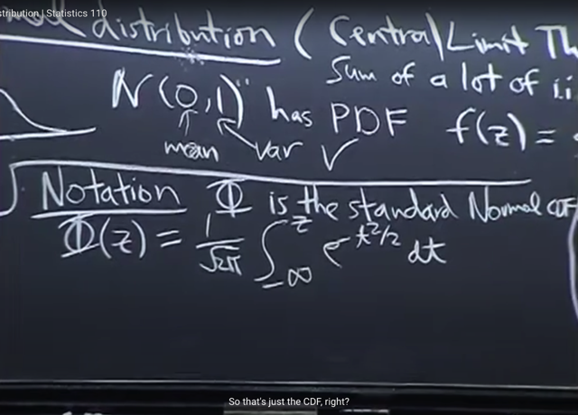</kbd></p>

🔗 **Related:** [TÓM TẮT:  Khác biệt đầu tiên giữa discrete và continuous là. sự xuất hiện của PDF thay vì PMF  Với continuous P(X=x) = 0  Do PMF P(X=x) USELESS, nên ta cần PDF  Qua continuous case, PDF. Ta không có xác suất mà là MẬT ĐỘ XÁC SUẤT. PROBABILITY PER SOMETHING.  PDF của X nếu P(a≤X≤b) = ∫a:b f(x)dx  Nếu a = b, thì theo định nghĩa trên, P(X=a) sẽ là integrate từ a đến a f(x)dx có ý nghĩa là DIỆN TÍCH BÊN DƯỚI ĐƯỜNG F(X) TỪ a TỚI a, ĐƯƠNG NHIÊN LÀ BẰNG 0 (hoặc tính cái tích phân này cũng sẽ phải ra 0)  2 điều kiện để PMF valid: f(x) luôn không âm và ∫ từ -infinity đến + infinity f(x)dx  phải bằng 1  f(x0) HOÀN TOÀN CÓ THỂ LỚN HƠN 1  ...Chưa tóm tắt xong](tóm_tắt_khác_biệt_đầu_tiên_giữa_discrete_và_continuous_là_sự_xuất_hiện_của_pdf_thay_vì_pmf_với_continuous_pxx_0_do_pmf_pxx_useless_nên_ta_cần_pdf_qua_continuous_case_pdf_ta_không_có_xác_suất_mà_là_mật_độ_xác_suất_probability_per_something_pdf_của_x_nếu_paxb_ab_fxdx_nếu_a_b_thì_theo_định_nghĩa_trên_pxa_sẽ_là_integrate_từ_a_đến_a_fxdx_có_ý_nghĩa_là_diện_tích_bên_dưới_đường_fx_từ_a_tới_a_đương_nhiên_là_bằng_0_hoặc_tính_cái_tích_phân_này_cũng_sẽ_phải_ra_0_2_điều_kiện_để_pmf_valid_fx_luôn_không_âm_và_từ_infinity_đến_infinity_fxdx_phải_bằng_1_fx0_hoàn_toàn_có_thể_lớn_hơn_1_chưa_tóm_tắt_xong.md#node-371)

🔗 **Related:** [TÓM TẮT:  Khác biệt đầu tiên giữa discrete và continuous là. sự xuất hiện của PDF thay vì PMF  Với continuous P(X=x) = 0  Do PMF P(X=x) USELESS, nên ta cần PDF  Qua continuous case, PDF. Ta không có xác suất mà là MẬT ĐỘ XÁC SUẤT. PROBABILITY PER SOMETHING.  PDF của X nếu P(a≤X≤b) = ∫a:b f(x)dx  Nếu a = b, thì theo định nghĩa trên, P(X=a) sẽ là integrate từ a đến a f(x)dx có ý nghĩa là DIỆN TÍCH BÊN DƯỚI ĐƯỜNG F(X) TỪ a TỚI a, ĐƯƠNG NHIÊN LÀ BẰNG 0 (hoặc tính cái tích phân này cũng sẽ phải ra 0)  2 điều kiện để PMF valid: f(x) luôn không âm và ∫ từ -infinity đến + infinity f(x)dx  phải bằng 1  f(x0) HOÀN TOÀN CÓ THỂ LỚN HƠN 1  ...Chưa tóm tắt xong](tóm_tắt_khác_biệt_đầu_tiên_giữa_discrete_và_continuous_là_sự_xuất_hiện_của_pdf_thay_vì_pmf_với_continuous_pxx_0_do_pmf_pxx_useless_nên_ta_cần_pdf_qua_continuous_case_pdf_ta_không_có_xác_suất_mà_là_mật_độ_xác_suất_probability_per_something_pdf_của_x_nếu_paxb_ab_fxdx_nếu_a_b_thì_theo_định_nghĩa_trên_pxa_sẽ_là_integrate_từ_a_đến_a_fxdx_có_ý_nghĩa_là_diện_tích_bên_dưới_đường_fx_từ_a_tới_a_đương_nhiên_là_bằng_0_hoặc_tính_cái_tích_phân_này_cũng_sẽ_phải_ra_0_2_điều_kiện_để_pmf_valid_fx_luôn_không_âm_và_từ_infinity_đến_infinity_fxdx_phải_bằng_1_fx0_hoàn_toàn_có_thể_lớn_hơn_1_chưa_tóm_tắt_xong.md#node-349)

🔗 **Related:** [LEC 20: MULTINOMIAL AND CAUCHY](untitled.md#node-671)

> [!NOTE]
> Mấy phút cuối gs nói về **một số notation**: Φ (capital fi) là kí hiệu để chỉ CDF của
> **Standard normal (Normal(0,1))**
>
> Như đã biết CDF của continuous random variable là**tích phân từ `-infinity` tới
> x của PDF**. Nên ở đây:
>
> ```text
> Φ(z) = tích phân từ -infinity tới x của [e^(-t^2/2)dt]
> ```
>
> ```text
> = (1/√2*pi) * tích phân từ -infinity tới x của [e^(-t^2/2)dt]
> ```
>
> (again t chỉ là dummy name, để tránh trùng với x, nhưng không quan trọng)

<br>

<a id="node-415"></a>

<p align="center"><kbd>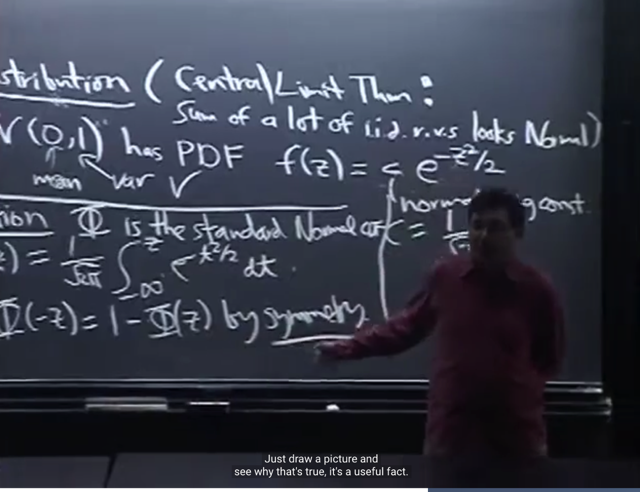</kbd></p>

> [!NOTE]
> Cuối cùng là một tính chất của Φ: `Φ(-z)` `=` 1 `-` Φ(z) được rút ra
> từ tính **symmetry**. Gs nói tự tìm hiểu hoặc bài sau sẽ quay lại

<br>

