# Lec 14: Location, Scale, Lotus

📊 **Progress:** `58` Notes | `53` Screenshots

---

<a id="node-417"></a>
## `-tóm` Tắt:

> [!NOTE]
> `-TÓM` TẮT:
>
>  Z^(số lẻ), ta luôn có `E(Z^(số` lẻ) `=` 0, gọi là ODD MOMENT
>
> `-` Symmetry còn giúp ta kết luận (nếu Z ~ N(0,1) thì `-Z` cũng là một N(0,1)
>
> ```text
> - X = μ + σZ sẽ ~ N(μ, σ^2)
> ```
>
> `-` Sẽ tốt hơn nếu ta hiểu Standard Normal Z ~ N(0,1) trước, sau đó hiểu rằng khi scale
> ```text
> và shift Z với σ và μ khác nhau thì ta sẽ có bất kì một Normal distribution N(μ, σ^2) nào
> ```
>
> `-` PROPERTIES CỦA VAR(X):
>
> ```text
> + Var(X + c) = Var(X)
> ```
>
> ```text
> + Var(cX) = c^2*Var(X)
> ```
>
> `+` `Var(X)` luôn không âm, và nó chỉ bằng 0 nếu X là constant
>
> `+` Variance KHÔNG CÓ TÍNH LINEARITY:
>
> ```text
> + Var(X+Y) không bằng Var(X) + Var(Y) TRỪ KHI X, Y INDEPENDENT
> ```
>
> X không i.i.d với chính nó X, mà nó EXTREMELY DEPENDENT với chính nó. Do đó bất
> cứ khi nào ta ÁP DỤNG CÔNG  THỨC NÀO ĐÓ MÀ CẦN CÁC RANDOM VARIABLE
> CÓ X1, X2 CÓ  TÍNH I.I.D VÀO X VÀ CHÍNH NÓ THÌ ĐỀU LÀ SAI
>
> ```text
> - CHỨNG MINH VAR X N(μ, σ) = σ^2
> ```
>
> ```text
> - Z = (X - μ) / σ và gs cho biết nó được gọi là STANDARDIZATION (chuẩn hóa)
> ```
>
> Giúp từ NORMAL X ~ `N(μ,` `σ)` ta có STANDARD NORMAL Z ~ N(0,1)
>
> `-` Xây dựng PDF của `N(μ,` `σ^2)` từ N(0, 1):
>
> ```text
> fX(x) = 1/(σ√2π) * [e^(-((x-μ)/σ)^2/2)]
> ```
>
> ```text
> - Nếu X ~ N(μ, σ^2) thì -X ~ N(-μ, σ^2
> ```
>
> ```text
> - Nếu X1 ~ N(μ1, σ1^2), X2 ~ N(μ2, σ2^2) và X1, X2 independent thì:
> ```
>
> ```text
> X1 + X2 ~ N(μ1 + μ2, σ1^2 + σ2^2)
> ```
>
> ```text
> X1 - X2 ~ N(μ1 - μ2, σ1^2 + σ2^2)
> ```
>
> `-` `68-95-99.7` rule
>
> ```text
> - Chứng minh 0^k / k! + 1^k / k! + 2^k / k! + .... = e^k
> ```
>
> ⇨ Tổng `k=0,1...infinity` `λ^k/k!` `=` e^λ
>
> `-` Tìm variance của Poisson (λ) để chứng minh nó có MEAN VÀ VARIANCE ĐỀU LÀ λ
>
> ```text
> - Khi standardize, ví dụ đơn vị là km, thì (x - μ) / σ sẽ  (km - km) / km = km / km = 1
> ```
> TỨC Ý NÓI LÀ KHÔNG CÒN CARE ĐƠN VỊ LÀ GÌ NỮA
>
> ```text
> - X~Bin(n,p), Var(X) = npq (q = 1-p)
> ```
>
> `-` Chứng minh LOTIS

<br>

<a id="node-418"></a>

<p align="center"><kbd>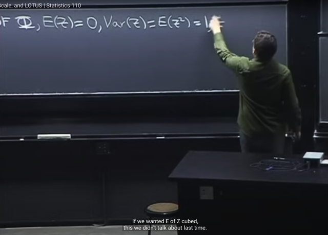</kbd></p>

<p align="center"><kbd>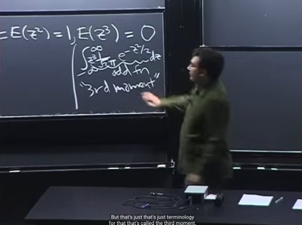</kbd></p>

<p align="center"><kbd></kbd></p>

<p align="center"><kbd></kbd></p>

<p align="center"><kbd>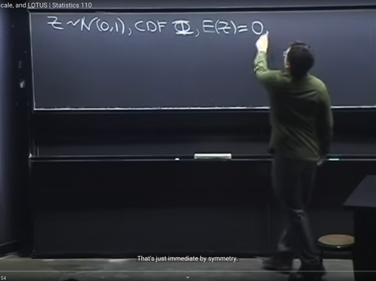</kbd></p>

> [!NOTE]
> Gs nhắc lại bài trước ta đã làm quen với **Standard Normal (0,1)**, đã biết **CDF** của nó, kí hiệu là **Φ**, đã chứng minh
> **mean của nó `E(Z)` là 0**, và **variance `Var(Z)` `=` 1**
>
> Khi chứng minh `E(Z)` `=` 0, như đã biết sẽ là [**tích phân từ `-inf:inf` của z * f(z)dz]**,
>
> (cũng chính là mang ý nghĩa**weighted sum các các possible values** weighted bởi **xác suất nó mang giá trị đó**) trong đó
> **f(z) là  PDF** của Z)
>
> Thì ta đã lập luận rằng: z * f(z) `=` **z * e^(-z^2/2)**là **odd** function, nên**tích phân từ `-a:a` của odd function luôn bằng 0**. Do
> đó dễ dàng **suy ra `E(Z)` `=` 0**.
>
> ```text
> Và ta khi tìm Var(Z) cũng đã thấy nó chính là bằng E(Z^2) = 1, vì theo công thức nó là E(Z^2) - (EZ)^2  mà EZ = 0 rồi
> ```
>
> `====`
>
> Hơn nữa, ta cũng**dễ dàng chứng minh `E(Z^3)` `=` bằng 0** nhờ sử dụng **LOTUS** (theorem cho phép ta tính `E(Z^3)` chỉ việc
> **dùng PDF của Z** mà k**hông cần phải tìm PDF của Z^3**:
>
> Thế thì để tính `E(Z^3),` theo lý ta sẽ phải tìm PDF của X^3. Nhưng LOTUS cho phép chỉ việc thay z^3 vào x trong công thức trên
> thì vẫn có thể valid trong việc tính `E(Z^3)`
>
> Vậy **E(Z^3) `=` tích phân từ `-inf:inf` z^3 f(z)*dz**. Và tương tự, như khi tính `E(Z),` **z^3 f(z) là odd function**, nên tích phân từ `-a`
> đến a của nó sẽ bằng 0 nhờ tính **SYMMETRY**
>
> Tương tự với **Z^(số lẻ), ta luôn có `E(Z^(số` lẻ) `=` 0**, gọi là **ODD MOMENT**
>
> Và gs nói ta sẽ biết thêm sau, rằng **E(Z) gọi là FIRST MOMENT**, **E(Z^2) LÀ SECOND MOMENT**,..

<br>

<a id="node-419"></a>

<p align="center"><kbd>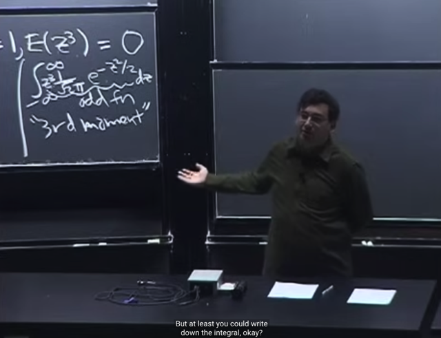</kbd></p>

> [!NOTE]
> Đại khái là còn với **EVEN MOMENT** ví dụ **E(Z^4)**, thì như lúc ta tìm
> **E(Z^2) đã thấy rằng không dễ** để tính
>
> Nhưng **ít nhất là ta có thể dùng LOTUS** để viết ra công thức (thế z^4 vào
> z trong biểu thức tính `E(Z)`

<br>

<a id="node-420"></a>

<p align="center"><kbd>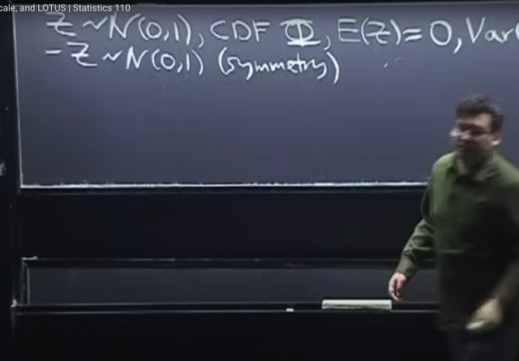</kbd></p>

🔗 **Related:** [LEC 20: MULTINOMIAL AND CAUCHY](untitled.md#node-649)

> [!NOTE]
> Và tính **Symmetry** còn giúp ta kết luận**(nếu Z ~ N(0,1)** thì **-Z cũng là một N(0,1)**
> random variable
>
> Đơn giản vì **Normal (0,1) đối xứng qua 0**, nên đương nhiên nếu ta **đổi dấu
> của Z, thì distribution nó vẫn y chang**. Gs cho rằng **nếu thử tìm PDF** của 
> `-Z` ta cũng **sẽ thấy nó y như của Z**

> [!NOTE]
> Symmetry còn giúp ta kết luận (nếu Z ~
> N(0,1) thì `-Z` cũng là một N(0,1)

<br>

<a id="node-421"></a>

<p align="center"><kbd>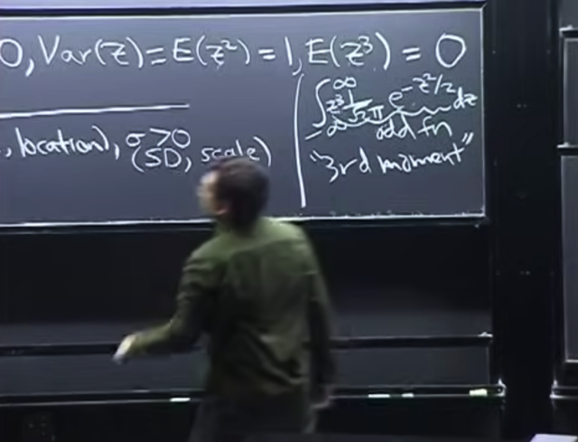</kbd></p>

<p align="center"><kbd></kbd></p>

<p align="center"><kbd>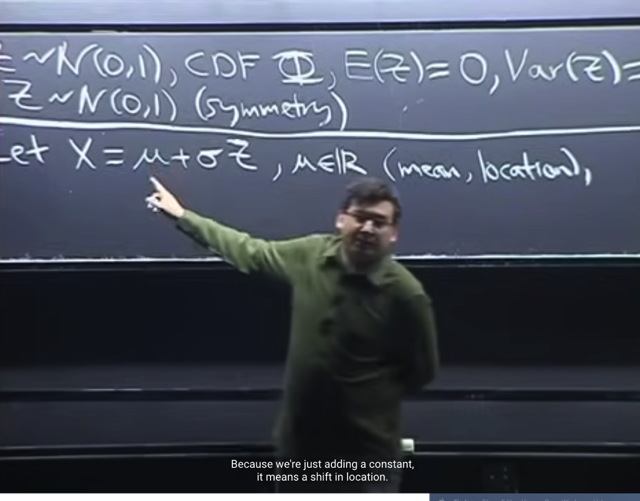</kbd></p>

> [!NOTE]
> Thế thì ta sẽ qua **general Normal distribution** (**không còn mean 0 variance 1 nữa**). Đó là nếu ta có random
> variable **X `=` `μ` `+` σZ**, mang ý nghĩa là ta **scale Z bởi σ** `(σ` **dương**) và sau đó **shift bởi μ** thì khi đó **X sẽ
> tuân theo `N(μ,` σ^2)**

> [!NOTE]
> Scale Z bởi `σ` `(σ` dương) và sau đó shift bởi `μ` thì khi
> đó X sẽ tuân theo `N(μ,` `σ^2)`

<br>

<a id="node-422"></a>

<p align="center"><kbd>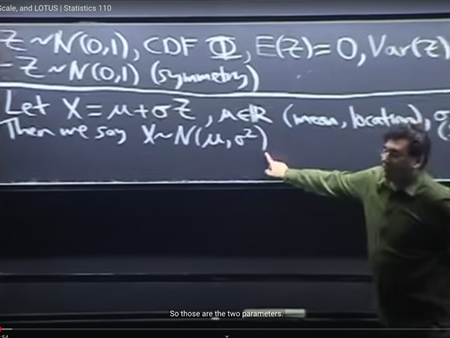</kbd></p>

> [!NOTE]
> Thế thì **μ** là **mean**, hay **average** như đã biết, nhưng còn có tên, ý nghĩa
> là **location**.
>
> Còn **σ** (là standard deviation) như đã biết khi học về **variance**, là **sqrt
> của variance** (nhằm đưa [**độ phân tán**, đo bởi variance, vốn được bình
> phương lên] **về lại scale của random variable.**

<br>

<a id="node-423"></a>

<p align="center"><kbd>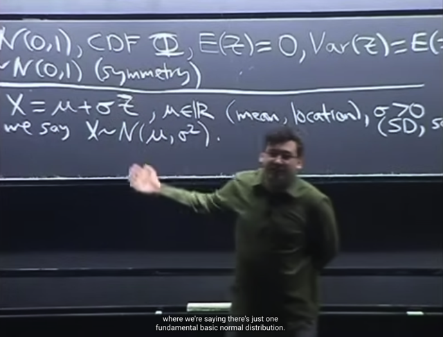</kbd></p>

🔗 **Related:** [LEC 17: MOMENT GENERATING FUNCTIONS](untitled.md#node-542)

> [!NOTE]
> Thế thì gs cho rằng **một số sách** khi nói về Normal distribution ngay **lập
> tức đưa ra công thức của X ~ `N(μ,` σ^2)**
>
> Nhưng ông cho rằng **sẽ tốt hơn nếu ta hiểu Standard Normal** **Z ~ N(0,1)**
> trước, sau đó hiểu rằng khi **scale và shift Z với `σ` và `μ` khác nhau** thì
> ta sẽ có **bất kì một Normal distribution `N(μ,` σ^2)** nào

<br>

<a id="node-424"></a>

<p align="center"><kbd>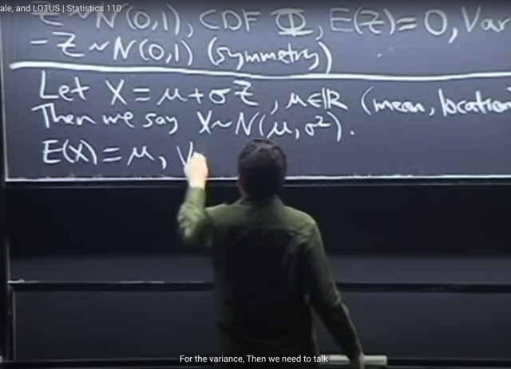</kbd></p>

> [!NOTE]
> Thế thì ta sẽ đi **check mean và variance**của nó.
>
> Mean: Thì để tính **E(X) `=` `E(μ` `+` σZ)** ta dùng **linearity** để có:
>
> **E(X) `=` `E(μ)` `+` E(σZ)** và **ngay lập tức có kết quả là μ**.
>
> Vì `E(σZ)` `=` `σE(Z)` `=` `σ0` `=` 0 (**EZ `=` 0** như đã chứng minh ở bài trước)
>
> ```text
> Và E(μ) = μ (do μ là constant)
> ```

<br>

<a id="node-425"></a>

<p align="center"><kbd>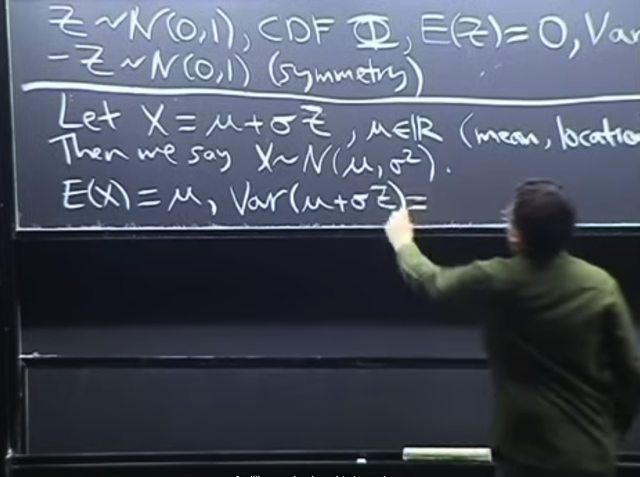</kbd></p>

> [!NOTE]
> Còn **Variance** thì ta sẽ **quay lại sau** khi học
> thêm **một số tính chất của variance**

<br>

<a id="node-426"></a>

<p align="center"><kbd>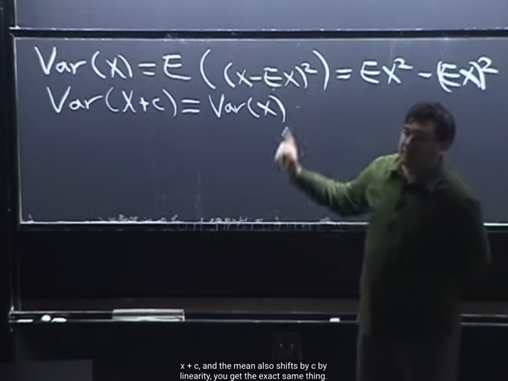</kbd></p>

🔗 **Related:** [TÓM TẮT:  - Tiếp tục Expo(λ): PDF CỦA EXPO(λ): f(x) = λ e^(-λx) x > 0  - Check tính valid của PDF của Expo  - CDF CỦA EXPO(λ) : F_X(x) = 1 - e^(-λx)  - X ~ Expo(λ) thì  Y = λX thì Y sẽ ~ Expo(1)  - Chứng minh rằng X ~ Expo(λ) thì  Y = λX thì Y sẽ ~ Expo(1)  - EX OF EXPO(1) = 1  - VARIANCE OF EXPO(1) = 1  - X~EXPO(λ) thì Y= λX sẽ ~EXPO(1)   EY = 1 ⇨ E(X) = E(Y/λ) = 1/λ EY = 1/λ  VARIANCE OF EXPO(λ) = 1/λ^2  Var(Y) = 1 ⇨ Var(X) = Var(Y/λ) = (1/λ^2) Var(Y) = (1/λ^2)  Memoryless thể hiện bởi equation: P(X ≥ s+t | X ≥ s) = P(X ≥ t)  chứng minh nếu X ~ Expo(λ) thì nó sẽ thỏa mãn Memoryless equation   P(X ≥ s), thì cái này gọi là Survivor function  Survivor function với X~Expo(λ): P(X ≥ s) = e^(-λs)  -Nhờ tính chất Memoryless nên nếu X~Expo(λ) E(X|X > a) = a + 1 / λ](tóm_tắt_tiếp_tục_expoλ_pdf_của_expoλ_fx_λ_e_λx_x_0_check_tính_valid_của_pdf_của_expo_cdf_của_expoλ_f_xx_1_e_λx_x_expoλ_thì_y_λx_thì_y_sẽ_expo1_chứng_minh_rằng_x_expoλ_thì_y_λx_thì_y_sẽ_expo1_ex_of_expo1_1_variance_of_expo1_1_xexpoλ_thì_y_λx_sẽ_expo1_ey_1_ex_eyλ_1λ_ey_1λ_variance_of_expoλ_1λ2_vary_1_varx_varyλ_1λ2_vary_1λ2_memoryless_thể_hiện_bởi_equation_px_st_x_s_px_t_chứng_minh_nếu_x_expoλ_thì_nó_sẽ_thỏa_mãn_memoryless_equation_px_s_thì_cái_này_gọi_là_survivor_function_survivor_function_với_xexpoλ_px_s_e_λs_nhờ_tính_chất_memoryless_nên_nếu_xexpoλ_exx_a_a_1_λ.md#node-501)

> [!NOTE]
> Như đã biết bữa trước, **Variance** có thể được thể hiện bởi**2 "công thức"** `/`
> cách:
>
> i) Average của [**bình phương distance** giữa **X** và **mean X**]: **Var(X) `=` E[(X-EX)^2],** 
> mà cái vụ **bình phương** là bởi nếu không bình phương thì **E(X-EX)** sẽ bằng 0 do:
>
> ```text
> E(X-EX) = EX - E(EX)  = EX - EX  = 0 (E(EX) = EX vì EX là constant)
> ```
>
> Mang ý nghĩa nôm na là **các giá trị của X phân tán hai bên mean** thì khi tính 
> **distant** chúng sẽ**triệt tiêu nhau**
>
> ii) Nếu **triển khai thêm** ra thì ta sẽ có **Var(X) `=` `E(X^2)` `-` (EX)^2**
>
> `===`
>
> Tiếp, gs cho rằng, cũng sẽ dễ hiểu rằng, khi ta **ADD CONSTANT c VÀO X**, thì **ĐỘ
> BIẾN ĐỘNG CỦA NÓ KHÔNG ĐỔI**, nó **chỉ bị SHIFT LOCATION thôi**. Nên
>
> **Var(X+c) `=` Var(X)**
>
> Ta cũng có thể **chứng minh:**Var(X+c): `=` `E[(X+c)^2]` `-` `[E(X+c)]^2`
>
> ```text
> = E(X^2 +2Xc +c^2) - E(X+c)E(X+c)
> ```
>
> ```text
> = E(X^2) + E(2Xc) + E(c^2) - (EX + Ec)(EX + Ec) (linearity)
> ```
>
> ```text
> = E(X^2) + 2c(EX) + c^2 - [(EX)^2 + 2EcEX + (Ec)^2]
> ```
>
> ```text
> = E(X^2) + 2c(EX) + c^2 - (EX)^2 - 2EcEX - (Ec)^2
> ```
>
> ```text
> = E(X^2) + 2c(EX) + c^2 - (EX)^2 - 2cEX - c^2 | thay Ec = c
> ```
>
> `=` `E(X^2)` `-` (EX)^2 `=` **Var(X)**

> [!NOTE]
> ```text
> PROPERTIES CỦA VAR(X): Var(X + c) = Var(X)
> ```

<br>

<a id="node-427"></a>

<p align="center"><kbd>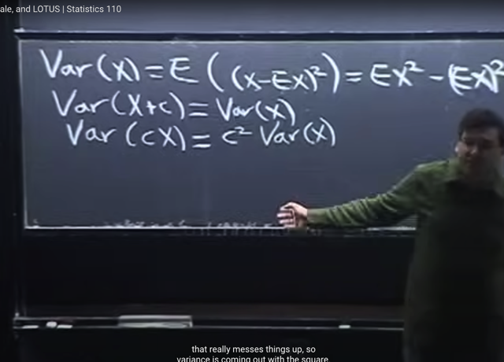</kbd></p>

> [!NOTE]
> Properties tiếp theo là **Var(cX) `=` c^2*Var(X)**
>
> Dễ dàng chứng minh (ta sẽ dùng cách thể hiện 1 của EX):
>
> ```text
> Var(cX) = E((cX-EcX)^2) = E(c^2X^2 - 2cXEcX + (EcX)^2)
> ```
>
> ```text
> = E(c^2X^2) + E(-2cXE(cX)) + E[(E(cX))^2)] (Linearity)
> ```
>
> ```text
> = c^2E(X^2) + E(-2c^2XEX) + E[c^2(EX)^2]
> ```
>
> `=` c^2E(X^2) `-` 2c^2E(XEX) `+` c^2E[(EX)^2]
>
> `=` c^2E(X^2) `-` 2c^2(EX)^2 `+` c^2(EX)^2 
>
> ```text
> Ở các bước trên sử dụng E[(EX)^2] = E(EX) = EX vì EX là constant
> ```
>
> `=` c^2E(X^2) `-` c^2(EX)^2 `=` `c^2[E(X^2)` `-` (EX)^2] `=` **c^2*Var(X)**

> [!NOTE]
> PROPERTIES CỦA VAR(X): `Var(cX)` `=` `c^2*Var(X)`

<br>

<a id="node-428"></a>

<p align="center"><kbd>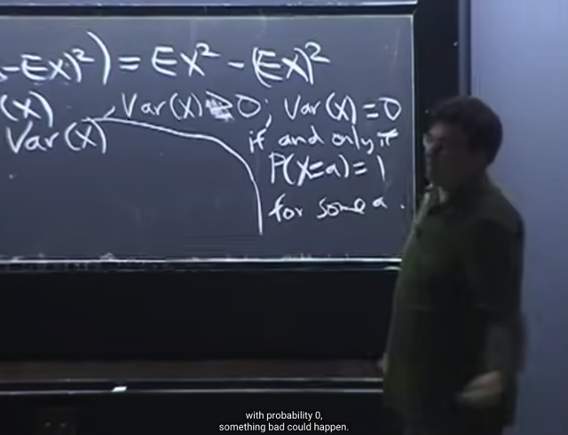</kbd></p>

> [!NOTE]
> Và cho biết **nhiều người hay quên bình phương c** lên, và một tip để nhớ đó
> là **Var KHÔNG ÂM**, nên **nếu ta không bình phương**, thì với **c âm thì ta sẽ có
> var âm**, điều này không đúng
>
> Do đó gs nói một**điều tối thiểu cần kiểm tra** khi ta **derive công thức Var** đó
> là **xem nó có thể âm không**.
>
> Gs nói thêm `Var(X)` luôn không âm, và **nó chỉ bằng 0 nếu X là constant**:
> biểu diễn bởi **P(X=a) `=` 1** mang ý nghĩa giá trị của **X CHẮC CHẮN bằng a.**Thử chứng minh: Nếu X `=` constant c, thì EX `=` c `<=>` (EX)^2 `=` c^2; 
> EX^2 `=` `E(c^2)` `=` c^2. Nên áp dụng công thức 2 của variance (hay công thức 1
> ```text
> cũng ra vậy thôi): EX^2 - (EX)^2 = c^2 - c^2 = 0
> ```

> [!NOTE]
> PROPERTIES CỦA VAR(X): `Var(X)` luôn không âm, và nó
> chỉ bằng 0 nếu X là constant

<br>

<a id="node-429"></a>

<p align="center"><kbd>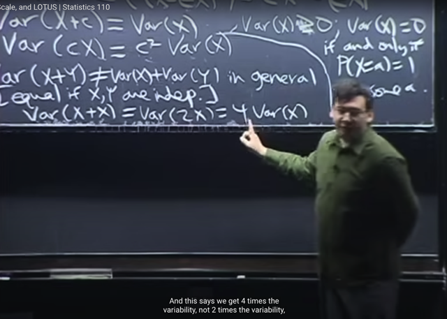</kbd></p>

> [!NOTE]
> Tiếp theo, Variance**KHÔNG CÓ TÍNH LINEARITY**, nên **Var(X+Y) không bằng
> `Var(X)` `+` Var(Y)** **TRỪ KHI X, Y INDEPENDENT** (gs nói ta sẽ quay lại cái này sau)
>
> Có thể nhanh chóng thấy tính chất linearity không áp dụng đối với var bằng việc
> **xét `Var(X` `+` X)** của **2 EXTREMELY DEPENDENT** r.v đó là X VÀ chính nó X
> (X với X là cực kì dependent chứ gì nữa vì khi biết giá trị của X thì ta sẽ chắc biết
> giá trị của ..X)
>
> `Var(X+X)` `=` `Var(2X)` `=` `(2^2)Var(X)` `=` **4Var(X)** (theo property **Var(cX) `=` c^2Var(X))**
>
> Trong khi nếu **linearity áp dụng** thì phải là `Var(X+X)` `=` `Var(X)` `+` `Var(X)` `=` **2Var(X)**

> [!NOTE]
> Variance KHÔNG CÓ TÍNH LINEARITY: 
>
> ```text
> Var(X+Y) không bằng Var(X) + Var(Y) TRỪ KHI X, Y INDEPENDENT
> ```

<br>

<a id="node-430"></a>

<p align="center"><kbd>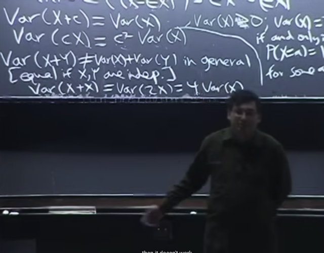</kbd></p>

> [!NOTE]
> Gs nhấn mạnh rằng, **X không i.i.d với chính nó X**, mà nó **EXTREMELY**
> **DEPENDENT** với chính nó. Do đó bất cứ khi nào ta **ÁP DỤNG CÔNG 
> THỨC NÀO ĐÓ MÀ CẦN CÁC RANDOM VARIABLE CÓ X1, X2 CÓ 
> TÍNH I.I.D VÀO X VÀ CHÍNH NÓ THÌ ĐỀU LÀ SAI**

<br>

<a id="node-431"></a>

<p align="center"><kbd>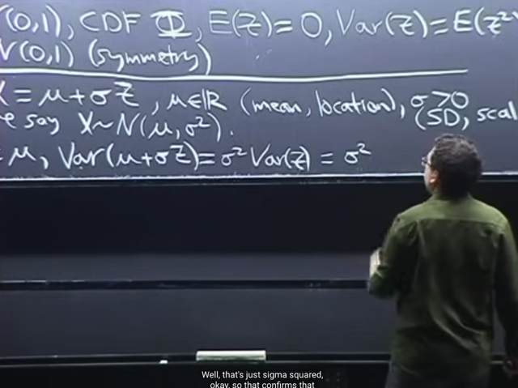</kbd></p>

> [!NOTE]
> Với các tính chất đó, ta quay lại đây ta tính variance của `X~N(μ,` `σ)` 
>
> **Var(μ `+` σZ)** `=` **Var(σZ)** (vì tính chất `Var(X+c)` `=` `Var(X))`
>
> `=` `σ^2` * `Var(Z)` `=` `σ^2` * 1 `=` **σ^2**
>
> Như vậy là đã chứng minh **variance của X là σ^2**

> [!NOTE]
> ```text
> CHỨNG MINH VAR X N(μ, σ) = σ^2
> ```

<br>

<a id="node-432"></a>

<p align="center"><kbd>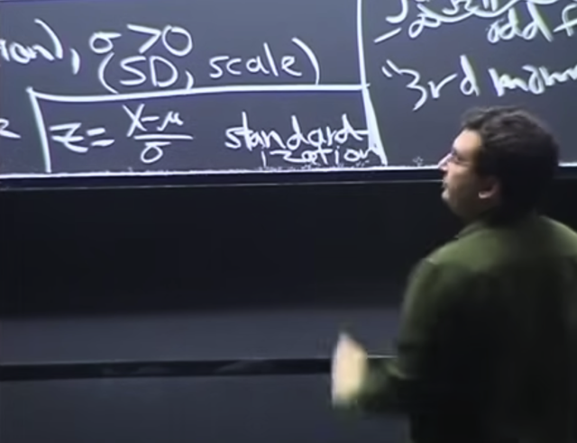</kbd></p>

> [!NOTE]
> Ngược lại **khi có X** ta có thể **ngược lại chuyển thành Z**:**Z `=` (X `-` `μ)` `/` σ**và gs cho biết nó được gọi là **STANDARDIZATION (chuẩn hóa)**
>
> Giúp từ **NORMAL X ~ `N(μ,` σ)** ta có **STANDARD NORMAL Z ~ N(0,1)**
>
> Suy nghĩ thêm môt chút: Đây là l**ần chính thức** được **học về** **standardization**
> một cái mà gặp nhiều lần trong các lớp machine learning, nó là bước
> preprocessing dữ liệu thông dụng nhất để đưa feature value nếu có distribution
> normal (**chuẩn**) thì sẽ về **standard normal (phân phối chuẩn tắc)
>
> Nhưng theo GPT thì, dù dữ liệu ban đầu không có phân phối chuẩn (normal)
> thì standardization vẫn giúp đưa nó về mean 0 và variance 1, nhưng không
> phải là chuẩn tắc (standard normal)**

<br>

<a id="node-433"></a>

<p align="center"><kbd>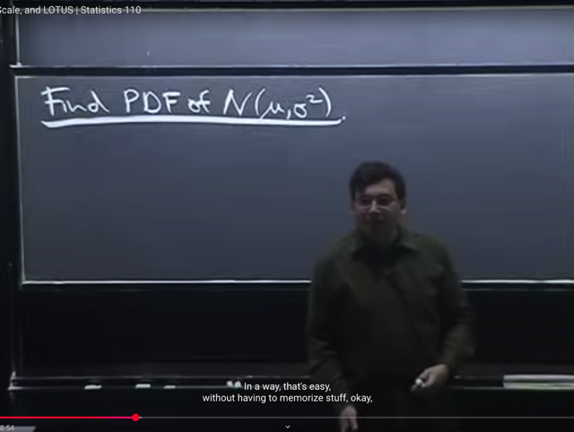</kbd></p>

> [!NOTE]
> Tiếp theo ta sẽ đi **xây dựng PDF của `N(μ,` σ^2)**.
>
> Gs cho rằng ta sẽ tìm cách để **giả sử ta nhớ PDF của standard normal
> N(0,1)** (chuẩn tắc) thì ta **có thể derive PDF của general normal `N(μ,` σ^2)** 
> mà không cần phải nhớ

<br>

<a id="node-434"></a>

<p align="center"><kbd>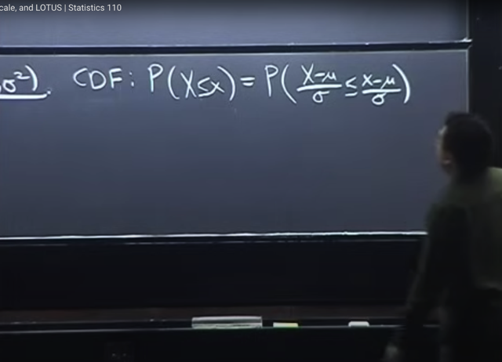</kbd></p>

> [!NOTE]
> Thế thì ta sẽ **bắt đầu với CDF F(x)**, như đã biết, ý nghĩa của nó là **P(X `<=`
> x)**. Thì như vừa biết về một **trick** hữu ích là **standardization**, nên ta sẽ
> **standardize** nó.
>
> Có thể hiểu chỗ này là **vì `σ` dương**, nên **event X<=x** sẽ tương đương `/`
> chính là event **(X-μ `)/σ` < (x-μ)/σ** (vì `σ` dương nên chia `σ` không làm đổi dấu,
> ```text
> thành ra nếu event X<=x xảy ra thì (X-μ)/σ ≤ (x-μ)/σ  cũng xảy ra.(*)
> ```
>
> Chỗ này có thể nói một cách chặt chẽ hơn:
>
> X ≤ x như đã biết, chỉ một event trong original sample space: {s ∈ S: X(s) ≤ x}
>
>
> ```text
> Thế thì X(s) ≤ x ⇔ [X(s) - μ] / σ ≤ (x - μ) / σ
> ```
>
> ```text
> ⇨ {s ∈ S: X(s) ≤ x} = {s ∈ S: [X(s) - μ] / σ ≤ (x - μ) / σ} và đó là event
> ```
> ```text
> (X - μ) / σ < (x - μ) / σ
> ```
>
> Cho phép ta viết:
>
> **P(X ≤ x) `=` P[(X `-` `μ)` `/` `σ)` ≤ P[(x `-` `μ)` `/` σ]**

<br>

<a id="node-435"></a>

<p align="center"><kbd>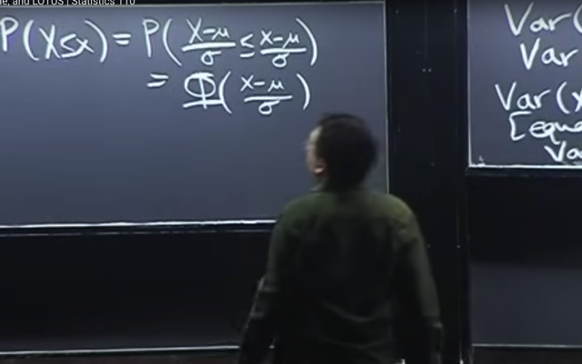</kbd></p>

> [!NOTE]
> Và vì **Z `=` (X `-` `μ)` `/` σ** bây giờ là một random variable tuân theo
> **STANDARD NORMAL (CHUẨN TẮC) Z~N(0, 1)** nên như đã biết bữa
> trước ta kí hiệu hàm capital fi Φ để chỉ **CDF của standard normal**
>
> Vậy nên ở đây **P(Z ≤ (x-μ)/σ)** thì **chính là Φ((x-μ)/σ)**

<br>

<a id="node-436"></a>

<p align="center"><kbd>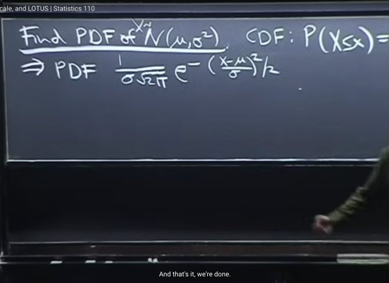</kbd></p>

> [!NOTE]
> Tiếp, ta đã **biết để có PDF từ CDF**, ta chỉ việc lấy **derivative của CDF**.
>
> Ôn lại, điều này là bởi theo định nghĩa CDF là**tích phân từ `-infinity` tới x của
> f(t)dt**với**f(t) là PDF**. Thế thì, theo Fundamental Theorem of Calculus (FTC),
> part 1 cho biết nếu **F(x) `=` tích phân từ `-infinity` tới x của f(t)dt** thì **F(x) là
> nguyên hàm `(anti-derivative)` của f(x)** và:**f(x) `=` F'(x)**
>
> Do đó CDF là nguyên hàm của PDF, nên **để có PDF** ta sẽ **tính derivative của
> CDF** miễn là hàm mật độ xác suất**tồn tại và có nghĩa**.
>
> ```text
> Vậy ta sẽ tìm derivative của Φ[(x - μ) / σ]
> ```
>
> ```text
> Ta đặt u(x) = (x - μ) / σ => thì Φ trở thành hàm theo u: Φ(u), theo chain rule:
> ```
>
> ```text
> d Φ(u) / dx = d/du Φ(u) . d/dx (x)
> ```
>
> Xét `d/dx` u(x) trước: Dễ thấy u `=` `(x-μ)` `/σ`  thì **du/dx `=` 1/σ**
>
> Còn `d/du` Φ(u): Thì vì **u là random variable theo Standard Normal u~N(0,1)** nên  
> **d/du Φ(u) chính là derivative của Φ(u)** đối với u thì nó **CHÍNH LÀ PDF CỦA
> STANDARD NORMAL DISTRIBUTION**
>
> Nên **d/du Φ(u) `=` `(1/√2π)` [e^(-u^2/2)]**
>
> **Thay u `=` (x `-` `μ)` `/` σ**vào ta có
>
> PDF của **N(μ, `σ^2)` `=` `(1/σ)` `(1/√2π)` * `[e^(-((x-μ)/σ)^2/2)]`
>
> `=` `1/(σ√2π)` * [e^(-((x-μ)/σ)^2/2)]**

> [!NOTE]
> PDF CỦA `N(μ,` `σ^2):`
>
> ```text
> fX(x) = 1/(σ√2π) * [e^(-((x-μ)/σ)^2/2)]
> ```

<br>

<a id="node-437"></a>

<p align="center"><kbd>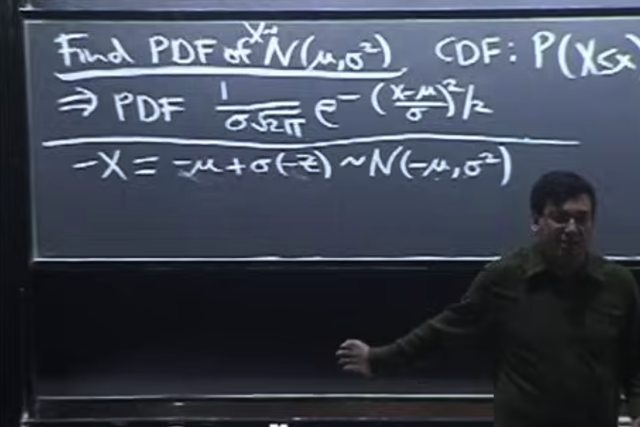</kbd></p>

> [!NOTE]
> Tiếp theo, **xét -X** mà như bữa trước, gs nói ta **có thể tự chứng minh để
> thấy `-Z` cũng ~ N(0, 1)** (i)
>
> Thì ta có thể lập luận về distribution của `-X` từ định nghĩa **X `=` `μ` `+` σZ**
>
> Ta có **-X `=` `-μ` `-` σZ**
>
> ```text
> ⇔ -X = -μ + σ(-Z) (ii)
> ```
>
> Điều này theo định nghĩa tương tự như khi nói **nếu ta có X `=` `μ` `+` σZ**
> **với Z là standard normal r.v** thì cho phép **suy ra X ~ `N(μ,` σ^2)**
>
> Thì ở đây trong (ii), -**Z cũng là một standard normal** r.v như đã nói ở (i) cho
> nên gíup ta **có thể kết luận `-X` sẽ là r.v ~ `N(-μ,` σ^2)**Và gs nói kết quả này rất hợp lý, khi ta đổi dấu của X thì ta có normal distrib
> với tâm đổi dấu, còn variance thì rõ ràng phải giữ nguyên****

> [!NOTE]
> ```text
> Nếu X ~ N(μ, σ^2) thì -X ~ N(-μ, σ^2
> ```

<br>

<a id="node-438"></a>

<p align="center"><kbd>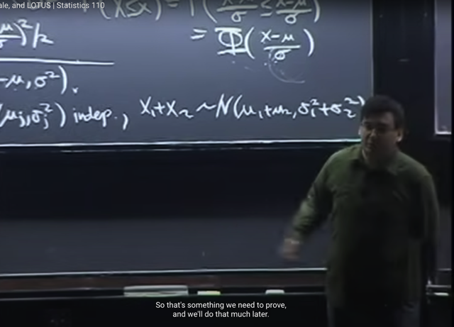</kbd></p>

<p align="center"><kbd>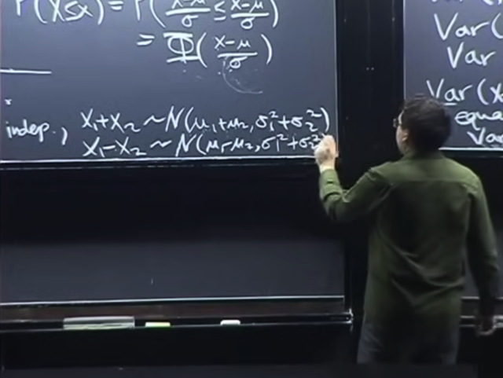</kbd></p>

<p align="center"><kbd></kbd></p>

<p align="center"><kbd></kbd></p>

<p align="center"><kbd>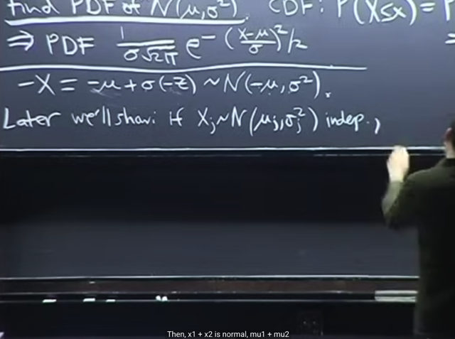</kbd></p>

> [!NOTE]
> Tiếp, gs nói đại khái là sau này ta sẽ chứng minh điều sau đây sau, giờ ta chỉ biết rằng, nếu ta có các **independent random variables**
> **X_j ~ `N(μ_j,` sigma_j^2)**
>
> Thì **X1 `+` X2** sẽ **~ N(mu1 `+` mu2, sigma1^2 `+` sigma2^2)** trong đó ta được phép **cộng mean** là do như đã biết **mean có tính linearity**
> (Đã nói, sẽ chứng minh sau)
>
> Còn **variance** thì như đã nói **nếu có INDEPENDENT r.v** **THÌ CÓ THỂ CỘNG VAR**
>
> Tuy nhiên **X1-X2** thì sao, chúng sẽ **~ N** có mean **mu1-mu2** NHƯNG **VAR** THÌ VẪN LÀ**SIGMA1^2 `+` SIGMA2^2**
>
> Gs nói **RẤT HAY SAI** khi lấy**sigma1^2 `-` sigma2^2**.
>
> Và ta phải hiểu **tại sao nó sai** như sau: Việc **lấy hai cái trừ nhau** khiến **variance CÓ THỂ ÂM** `->` **SAI**
>
> Hơn nữa, ta nên hiểu **X1 `-` X2** chính là **X1 `+` (-X2)**, mà ta đã biết **-X2 sẽ tuân theo `N(-mu2,` sigma2)** tức **Var(-X2) vẫn là sigma2^2**
>
> Do đó **Var(X1 `-` X2)** vẫn phải là **Var(X1) `+` Var(X2)** `=` sigma1^2  `+` sigma2^2

> [!NOTE]
> Nếu X1 ~ `N(μ1,` `σ1^2),` X2 ~ `N(μ2,` `σ2^2)` và X1, X2 **independent** thì:
>
> ```text
> X1 + X2 ~ N(μ1 + μ2, σ1^2 + σ2^2)
> ```
>
> ```text
> X1 - X2 ~ N(μ1 - μ2, σ1^2 + σ2^2)
> ```

<br>

<a id="node-439"></a>

<p align="center"><kbd>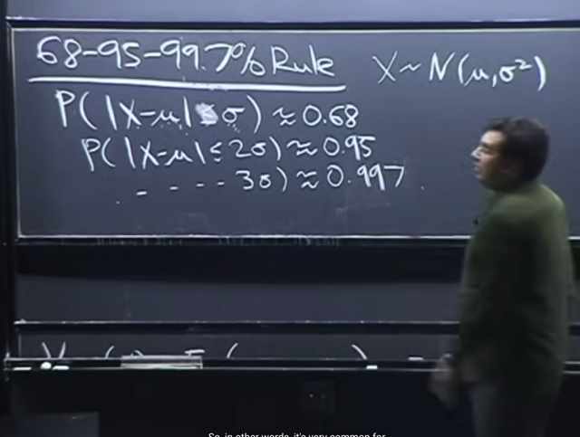</kbd></p>

> [!NOTE]
> Tiếp gs nói qua một **rule** mà ông cho là có cái tên **khá stupid**nhưng **rất hữu ích**
> đó là **68-95-99.7 rule**
>
> Thì rule này đại khái là nói lên **một số giá trị của CDF**
>
> **P(|X-mu| `<=` 1*sigma)**: Xác suất khoảng cách từ **X tới mean** nhỏ hơn **1*sigma là 0.68**
>
> `P(|X-mu|` `<=` 2*sigma): Xác suất khoảng cách từ X tới mean nhỏ hơn 2*sigma là 0.95
>
> `P(|X-mu|` `<=` 3*sigma): Xác suất khoảng cách từ X tới mean nhỏ hơn 3*sigma là 0.997

> [!NOTE]
> `68-95-99.7` rule

<br>

<a id="node-440"></a>

<p align="center"><kbd>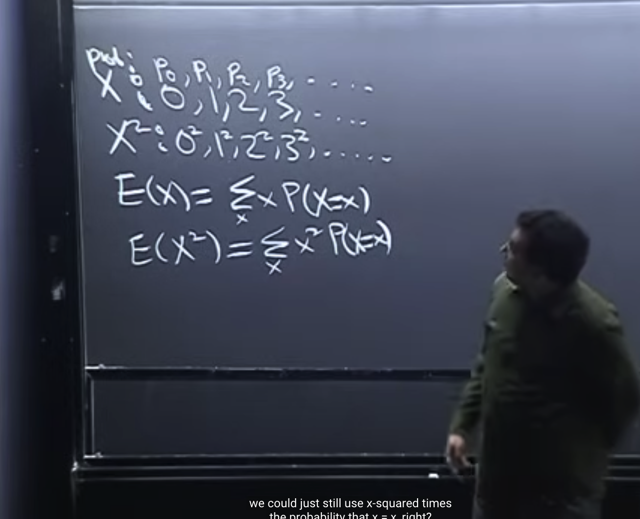</kbd></p>

🔗 **Related:** [TÓM TẮT:  Khác biệt đầu tiên giữa discrete và continuous là. sự xuất hiện của PDF thay vì PMF  Với continuous P(X=x) = 0  Do PMF P(X=x) USELESS, nên ta cần PDF  Qua continuous case, PDF. Ta không có xác suất mà là MẬT ĐỘ XÁC SUẤT. PROBABILITY PER SOMETHING.  PDF của X nếu P(a≤X≤b) = ∫a:b f(x)dx  Nếu a = b, thì theo định nghĩa trên, P(X=a) sẽ là integrate từ a đến a f(x)dx có ý nghĩa là DIỆN TÍCH BÊN DƯỚI ĐƯỜNG F(X) TỪ a TỚI a, ĐƯƠNG NHIÊN LÀ BẰNG 0 (hoặc tính cái tích phân này cũng sẽ phải ra 0)  2 điều kiện để PMF valid: f(x) luôn không âm và ∫ từ -infinity đến + infinity f(x)dx  phải bằng 1  f(x0) HOÀN TOÀN CÓ THỂ LỚN HƠN 1  ...Chưa tóm tắt xong](tóm_tắt_khác_biệt_đầu_tiên_giữa_discrete_và_continuous_là_sự_xuất_hiện_của_pdf_thay_vì_pmf_với_continuous_pxx_0_do_pmf_pxx_useless_nên_ta_cần_pdf_qua_continuous_case_pdf_ta_không_có_xác_suất_mà_là_mật_độ_xác_suất_probability_per_something_pdf_của_x_nếu_paxb_ab_fxdx_nếu_a_b_thì_theo_định_nghĩa_trên_pxa_sẽ_là_integrate_từ_a_đến_a_fxdx_có_ý_nghĩa_là_diện_tích_bên_dưới_đường_fx_từ_a_tới_a_đương_nhiên_là_bằng_0_hoặc_tính_cái_tích_phân_này_cũng_sẽ_phải_ra_0_2_điều_kiện_để_pmf_valid_fx_luôn_không_âm_và_từ_infinity_đến_infinity_fxdx_phải_bằng_1_fx0_hoàn_toàn_có_thể_lớn_hơn_1_chưa_tóm_tắt_xong.md#node-374)

> [!NOTE]
> Đó là hoàn thành **những gì về Normal distribution**. Ta sẽ thảo luận thêm về **LOTUS**
> để hiểu **tại sao nó lại work.**
>
> Đầu tiên mình nhớ lại **LOTUS**, đó là khi ta cần **tính E(X^2)**. Theo lí thuyết, `E(X)` là
> **weighted** **sum** của **mọi possible valued** của random variable X, weight bởi **xác suất
> mang giá trị đó** của nó, tức là với discrete r.v thì là PMF **P(X=x)** còn **với continuous** 
> r.v thì cách làm tương đương là lấy tích phân từ**-infinity tới infinity của xf(x)dx. f(x) 
> chính là PDF**.
>
> Thế thì, như vậy **để tính E(X^2)** hay khái quát là tính **E(g(X))**, thì **đáng lẽ** ta sẽ phải
> tìm **PDF**, hay **PMF của g(X**), sau đó mới tính như trên.
>
> Nhưng **LOTUS** cho phép ta **chỉ việc thay g(x) vào x**, để  với discrete r.v thì `E(X^2)` `=`
> **Tổng mọi x: g(x)*P(X=x)** hay với continuous thì là tích phân từ **-infinity tới infinity
> của g(x)f(x)dx**.
>
> `====`
>
> Thế thì gs lấy ví dụ giúp ta **"HIỂU HIỂU"** **TẠI SAO LOTUS LẠI CHO PHÉP LÀM VẬY**
>
> Cho rằng X có các **possible values là 0, 1, 2, 3**.. với các **PMF P0, P1,**.... Tức **P0 là P(X=0),**
> **P1 là P(X=1)**...
>
> Thì tương ứng **X2 sẽ có các possible values** là 0^2,1^2, 2^2, 3^3, ....
>
> Thế thì `E(X)` như đã nói, sẽ là **Tổng mọi x: x*P(X=x)**
>
> Tương tự `E(X^2)` cũng sẽ là 
>
> **i)** **Tổng mọi possible value của X^2**, với trọng số là
>
> **ii) Xác suất mà X^2 mang giá trị possible value đó**:
>
> Thế thì**Tổng mọi possible value của X^2**, có thể ghi là như vầy: 
>
> **Tổng mọi x: x^2** **(1)**
>
> Còn **xác suất mà X^2 mang possible value, mà các possible value của X^2
> chính là x^2 với `x=0:` 0^2, `x=1:` 1^2, `x=2:` 2^2...**, `P(X^2=x^2).`
>
> Thì có thể nhìn thấy trong bảng, khi gs ghi như vậy ý đồ để ta thấy rằng, ví dụ `x=3`
> đi thì **P(X^2=3^2) CHÍNH LÀ BẰNG P(X=3)**, có nghĩa là 
>
> **P(X^2=x^2) CŨNG BẰNG P(X=x)** **(2)**
> Thành ra ta **CÓ THỂ TÍNH `E(X^2),` KẾT HỢP (1) VÀ (2):**
>
> **E(X^2) `=` Tổng mọi x: x^2 * P(X=x)**

> [!NOTE]
> GIẢI THÍCH TẠI SAO LOTUS WORK (CHƯA PHẢI CHỨNG MINH
> LOTUS MÀ NẰM CUỐI BÀI NÀY)

<br>

<a id="node-441"></a>

<p align="center"><kbd>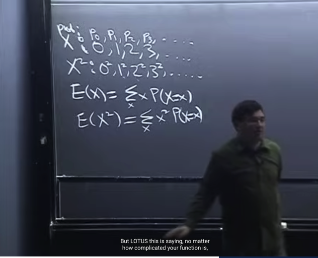</kbd></p>

> [!NOTE]
> Nhưng **cái vi diệu của LOTUS** đó là, **ngay cả khi function không map 1-1**
> như ở đây **MỘT** giá trị xủa X map với **MỘT** giá trị tương ứng X^2.
>
> Giả sử X có thể có các possible value là `-3,` `-2,` `-1,` 0, 1, 2...
>
> khi đó c**ả `-2` và 2 của X đều map với một possible value của X^2 là 4**.
>
> Nhưng **NGAY CẢ KHI NHƯ VẬY,** **LOTUS VẪN WORK!!!.**Nhờ Casella ta có thể giải thích theo toán học như sau:
>
> ```text
> E(g(X)) = EY = Σy yP(Y=y) cần chứng minh = Σx g(x)P(X=x)
> ```
>
> `{Y=y}` `=` `{g(X)=y}` 
>
> `=` {s ∈ S: X(s) `=` x, g(x) `=` y} 
>
> ⇨ `P(Y=y)` `=` `P{g(X)=y}` 
>
> `=` P{x ∈ RX: `g(X(s))=y}` 
>
> ```text
> =Σx P(X=x, g(x)=y)
> ```
>
> ```text
> = Σ{x, g(x) = y} P(X=x)
> ```
>
> ```text
> ⇨ EY = Σy yP(Y=y) = Σy y Σ {x: g(x) = y} P(X=x)
> ```
>
> ```text
> = Σy y Σ{x: g(x) = y} P(X = x)
> ```
>
> ```text
> = Σy Σx {x: g(x) = y} y P(X = x)
> ```
>
> ```text
> = Σy Σ{x: g(x) = y} g(x) P(X = x)
> ```
>
> **= `Σy` `Σ{x:` g(x) `=` y} g(x) P(X `=` x)**= **Σx g(x) P(X `=` x)**

<br>

<a id="node-442"></a>

<p align="center"><kbd>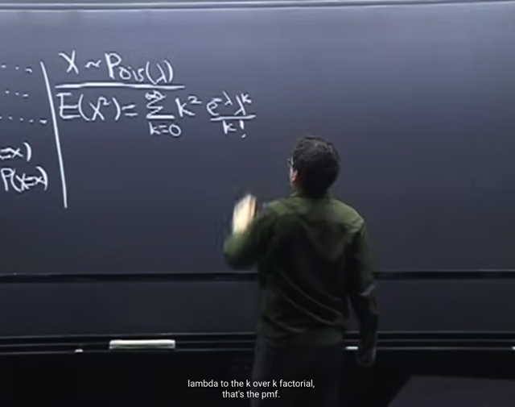</kbd></p>

> [!NOTE]
> Tiếp ta **quay lại Poisson**, vì bữa trước ta **chỉ mới tìm mean của Poisson**.
> bây giờ ta sẽ tìm **variance**.
>
> Để tính variance ta sẽ cần tính `E(X^2)` trước rồi dùng công thức thứ 2 của
> ```text
> Var(X) = E(X^2) - (EX)^2
> ```
>
> Áp dụng **LOTUS**, ta có:
>
> `E(X^2)` `=` `Σ{mọi` possible value k của X} k^2 fX(k)
>
> ```text
> = Σk=0,1,2.. infinity k^2 P(X=k)
> ```
>
> `=` `Σk=0,1,2..` infinity **k^2** * `(e^-λ` * λ^k `/` k!)
>
> Trong đó như đã biết **e^-λ * λ^k `/` k!** chính là **PMF** của Poisson (**λ**)

<br>

<a id="node-443"></a>

<p align="center"><kbd>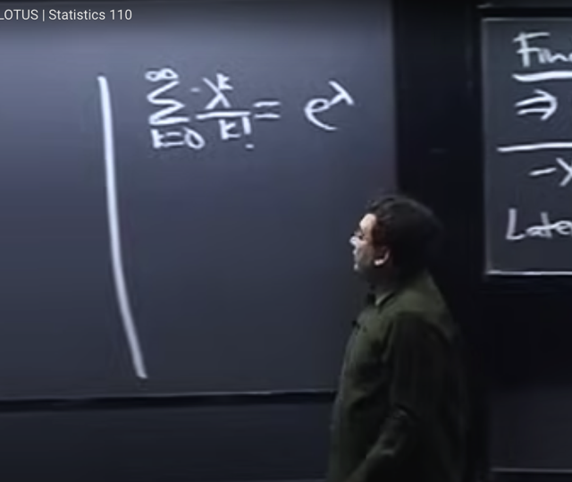</kbd></p>

> [!NOTE]
> Thế thì để tính tiếp, gs đề nghị ta nhớ lại, dùng kiến thức này đó là **Taylor
> series của e^x**:
>
> Để từ đó có công thức này, **Σ của dãy số** **λ^k/k! converge về e^λ**.
>
> ```text
> Tức 0^k / k! + 1^k / k! + 2^k / k! + .... = e^k
> ```
>
> Ôn lại **Taylor series expand tại x0** mình đã biết:
>
> f(x) `=` **Σn=0,1... [đạo hàm cấp n của f](x0) * `(x-x0)^n` `/` n!**
>
> Với f(x) `=` e^x, thì **[đạo hàm cấp n của e^x] đều bằng e^x** 
>
> ```text
> ⇨ e^x = e^(x0) (x-x0)^0 / 0! + e^(x0) (x-x0)^1 / 1! + e^(x0) (x-x0)^2 / 2! + ...
> ```
>
> Và x0 `=` 0 thì ta có nên [đạo hàm cấp n của e^x][0] đều bằng e^0 `=` 1
>
> ```text
> e^x = e^(0) * x^0 / 0! + e^(0) * x^1/ 1! + e^(0) * x^2 / 2! + ....
> ```
>
> `<=>` e^x `=` `x^0/0!` `+` `x^1/1!` `+...` `x^n/n!` `=` **Σk=0,1,2..inf** **x^k/k!**
>
> Thế thì: từ đó, e^λ `=` `λ^0/0!` `+` `λ^1/1!` `+` `....λ^n/n!` `=` **Tổng `λ=0,1..inf` λ^k/k!**
>
> **Vậy Tổng `k=0,1...infinity` `λ^k/k!` `=` e^λ**

> [!NOTE]
> ```text
> Chứng minh 0^k / k! + 1^k / k! + 2^k / k! + .... = e^k
> ```
>
> ⇨ Tổng `k=0,1...infinity` `λ^k/k!` `=` e^λ

<br>

<a id="node-444"></a>

<p align="center"><kbd>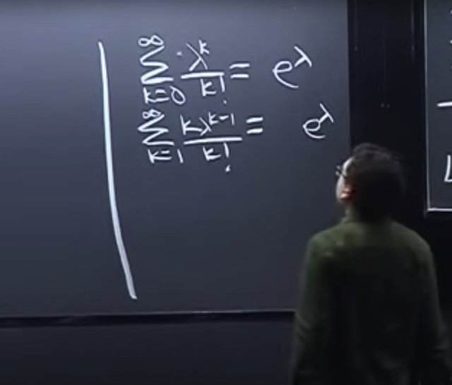</kbd></p>

> [!NOTE]
> Thế thì **để nó lòi ra k** gs cho rằng ta sẽ**lấy derivative hai vế**:
>
> ```text
> (Ý là, nhớ rằng ta đang muốn tính E(X^2) = Σk=0,1,2.. infinity k^2 * (e^-λ * λ^k / k!)
> ```
>
> Và ta đang có:**e^λ `=` `Σk=0,1,2..` infinity λ^k `/` k!**và như vậy ta muốn xuất hiện
> thẹn k^2)
>
> ```text
> e^λ = Σk=0,1,2.. infinity λ^k / k!
> ```
>
> Đạo hàm vế trái:****vẫn là****e^λ: `d/dλ` e^λ `=` e^λ.****
> Và vế phải: dễ thấy nó sẽ là **Σk=0,1...[ k * `λ^(k-1)` `/` k! ]**
>
> ```text
> d/dλ { Σk=0,1...[ λ^k / k! ] } = Σk=0,1... d/dλ [ λ^k / k! ]
> ```
>
> ```text
> = Σk=0,1... d/dλ [ λ^k / k! ] = Σk=0,1...[k λ^(k-1) ] / k!]
> ```
>
> Và vì với **k=0 thì hạng tử có k*(..) cũng thành 0** nên vế trái**có thể cho `/` thay 
> bằng `/` bằng với  k từ 1**
>
> ```text
> ..⇔ e^λ = Σk=1... d/dλ [ λ^k / k! ] = Σk=0,1...[k λ^(k-1) ] / k!]
> ```
>
> Thế thì ta **đã có k** nhưng ta **cần k^2**, nhưng **nếu lấy đạo hàm lần nữa** thì bên
> trái ta sẽ có **k*(k-1)** , chứ không phải **k^2** như ta cần. 
>
> Do đó giải pháp sẽ là **nhân hai vế cho λ,** gọi là **REPLENISH** (bổ sung) λ:
>
> ```text
> ⇔ λe^λ = λΣk=0,1...[k λ^(k-1) ] / k!]
> ```
>
> ⇔ **λe^λ `=` `Σk=0,1...[k` λ^k ] `/` k!]**

<br>

<a id="node-445"></a>

<p align="center"><kbd>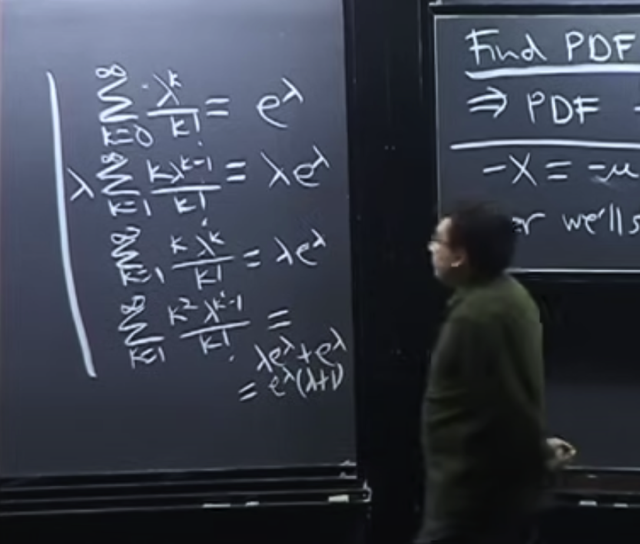</kbd></p>

> [!NOTE]
> Tiếp tục **lấy đạo hàm hai vế**, bên phải ta sẽ có `Σ` **k^2** **λ^(k-1) `/` k!**
>
> ```text
> d/dλ[λe^λ] = d/dλ [ Σk=0,1...[k λ^k ] / k! ]
> ```
>
> Bên phải, lúc này ta **cần tính derivative** của **λ*e^λ**
>
> Thì giống như ta cần tìm derivative của x*e^x, ta cần dùng product rule, đã
> học qua bên **18096**
>
> **d(uv) `=` udv `+` vdu, hay (uv)' `=` u'v `+` uv'**
>
> Vậy d(x*e^x) `=` dx * e^x `+` x * d(e^x) từ đó d (x*e^x) `/` dx (tức là derivative) sẽ
> bằng 1 * e^x `+` x*e^x (vì derivative của x `=` 1 và derivative của e^x `=` e^x)
>
> Vây derivative của **x*e^x `=` e^x `+` x*e^x.**
>
> Tương tự derivative của λ*e^λ `=` e^λ `+` λ*e^λ 
>
> `=` **e^λ (1+λ)**Vế phải: `d/dλ` [ `Σk=0,1...[k` λ^k ] `/` k! ] `=` `Σk=1...[k^2` `λ^k-1` ] `/` k! ****Vậy ta có****e^λ `(1+λ)` `=` `Σ` k^2 `λ^(k-1)` `/` k! ****Chú ý ta sẽ cần λ^k, nên replenish (bổ sung) λ lần nữa bằng
> cách nhân hai vế cho λ, ta có**λ e^λ `(1+λ)` `=` `Σ` k^2 λ^k `/` k!**

<br>

<a id="node-446"></a>

<p align="center"><kbd>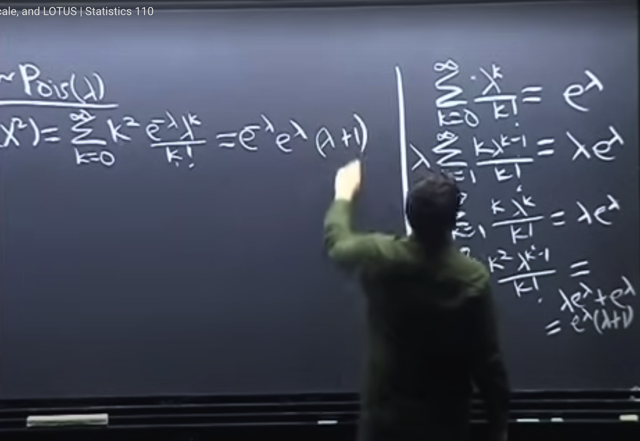</kbd></p>

> [!NOTE]
> Từ đó, áp dùng vào cái `E(X^2)` ta đang cần tính 
>
> ```text
> E(X^2) = Σk=0,1.. [k^2 e^(-λ) λ^k / k!]
> ```
>
> sắp xếp lại bỏ `e^(-λ)` ra ngoài
>
> `=` `e^(-λ)` * **Σk=0,1... [k^2 * λ^k `/` k!]**Thì ta thế **Σk=0,1... [k^2 * λ^k `/` k!]**  =**e^λ*λ*(λ+1)** vào
>
> Để có: **E(X^2) `=` `e^(-λ)*e^λ*λ*(λ+1)` `=` λ^2+λ**

<br>

<a id="node-447"></a>

<p align="center"><kbd>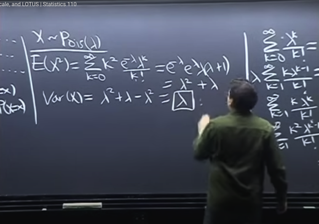</kbd></p>

🔗 **Related:** [TÓM TẮT:  - Tính MGF M(t) của Expo(1) = 1/(1-t) t < 1  - Khi đã có MGF, như bài trước ta đã biết các lí do mà MGF quan trọng trong đó có reason #1 đó là ta chỉ cần tính đạo hàm cấp n của nó sẽ cho ta n'th moment.  - Dù ta có thể tính đạo hàm nhiều lần để có 1st, 2nd moment nhưng có cách hay hơn. Bằng cách nhận ra 1/(1-t) liên quan đến Geometric series  a + ar + ar^2 = Tổng k=0:infinity a*r^k với |r| < 1 sẽ converge về a/[1-r]  Nên 1/1-t chính là Tổng n=0:infinity t^n với |t| < 1  Thế thì theo gs, từ đây cho phép ta KHỎI CẦN TÍNH ĐẠO HÀM CẤP N ĐỂ CÓ MOMENT THỨ N LÀM GÌ CHO MỆT, mà chỉ cần ĐỌC NÓ RA THÔI  Cụ thể là ta đã biết ở bài trước rằng, n'th moment = đạo hàm cấp n của M(t) (là coefficient của (t^n / n!) khi expand M(t) theo Taylor series tại 0)  Do đó, bằng cách tạo ra (t^n / n!) thì BẤT CỨ CÁI GÌ GẮN VỚI NÓ CHÍNH LÀ COEFFICIENT, VÀ CHÍNH LÀ N'TH MOMENT  Do đó ta sẽ nhân thêm n! và chia n! để có (t^n / n!). Như vậy cái lòi ra làm coefficient của t^n/n! ở đây là n! CHÍNH LÀ N'TH MOMENT.  Từ đó cho phép ta ĐỌC LUÔN RẰNG: 1ST MOMENT (EX) LÀ 1!, 2ND MOMENT E(X^2) LÀ 2!  N'TH MOMENT CỦA EXPO(1) E(X^n) = n!  -  đây là tính chất RẤT MẠNH CỦA MGF. Vì ví dụ như khi tính n'th moment (E[X^n]) thì nếu dùng LOTUS, ta phải TÍNH TÍCH PHÂN (INTEGRAL) VÀ CÓ THỂ GẶP NHỮNG TÍCH PHÂN RẤT PHỨC TẠP.  Trong khi đó, nếu ta có MGF, để có nth moment, ta CHỈ CẦN TÍNH DERIVATIVE MÀ DERIVATIVE THÌ THƯỜNG DỄ HƠN LÀ TÍNH TÍCH PHÂN  -Từ n'th moment của Expo(1) ta dễ dàng có n'th moment của Y ~ Expo(λ): E[Y^n] = n! / λ^n  - N'TH MOMENT CỦA N(0,1) VỚI N LẺ ĐỀU BẰNG 0  - MGF CỦA POIS(λ) = e^[λ(e^t-1)]  - Nếu Y ~ Pois(µ) và X~Pois(λ) và biết X, Y INDEPENDENT thì X+Y ~ Pois(λ+µ)](tóm_tắt_tính_mgf_mt_của_expo1_11_t_t_1_khi_đã_có_mgf_như_bài_trước_ta_đã_biết_các_lí_do_mà_mgf_quan_trọng_trong_đó_có_reason_1_đó_là_ta_chỉ_cần_tính_đạo_hàm_cấp_n_của_nó_sẽ_cho_ta_nth_moment_dù_ta_có_thể_tính_đạo_hàm_nhiều_lần_để_có_1st_2nd_moment_nhưng_có_cách_hay_hơn_bằng_cách_nhận_ra_11_t_liên_quan_đến_geometric_series_a_ar_ar2_tổng_k0infinity_ark_với_r_1_sẽ_converge_về_a1_r_nên_11_t_chính_là_tổng_n0infinity_tn_với_t_1_thế_thì_theo_gs_từ_đây_cho_phép_ta_khỏi_cần_tính_đạo_hàm_cấp_n_để_có_moment_thứ_n_làm_gì_cho_mệt_mà_chỉ_cần_đọc_nó_ra_thôi_cụ_thể_là_ta_đã_biết_ở_bài_trước_rằng_nth_moment_đạo_hàm_cấp_n_của_mt_là_coefficient_của_tn_n_khi_expand_mt_theo_taylor_series_tại_0_do_đó_bằng_cách_tạo_ra_tn_n_thì_bất_cứ_cái_gì_gắn_với_nó_chính_là_coefficient_và_chính_là_nth_moment_do_đó_ta_sẽ_nhân_thêm_n_và_chia_n_để_có_tn_n_như_vậy_cái_lòi_ra_làm_coefficient_của_tnn_ở_đây_là_n_chính_là_nth_moment_từ_đó_cho_phép_ta_đọc_luôn_rằng_1st_moment_ex_là_1_2nd_moment_ex2_là_2_nth_moment_của_expo1_exn_n_đây_là_tính_chất_rất_mạnh_của_mgf_vì_ví_dụ_như_khi_tính_nth_moment_exn_thì_nếu_dùng_lotus_ta_phải_tính_tích_phân_integral_và_có_thể_gặp_những_tích_phân_rất_phức_tạp_trong_khi_đó_nếu_ta_có_mgf_để_có_nth_moment_ta_chỉ_cần_tính_derivative_mà_derivative_thì_thường_dễ_hơn_là_tính_tích_phân_từ_nth_moment_của_expo1_ta_dễ_dàng_có_nth_moment_của_y_expoλ_eyn_n_λn_nth_moment_của_n01_với_n_lẻ_đều_bằng_0_mgf_của_poisλ_eλet_1_nếu_y_poisµ_và_xpoisλ_và_biết_x_y_independent_thì_xy_poisλµ.md#node-581)

> [!NOTE]
> ```text
> Và như vậy ta có Var(X) = E(X^2) - (EX)^2, và bữa trước đã chứng minh E(X) của
> ```
> Pois(λ) chính là bằng λ nên:
>
> `Var(X)` `=`  λ^2 `+` λ `-` λ^2 `=` **λ
>
> Như vậy ta thấy Poisson (λ) có MEAN VÀ VARIANCE ĐỀU LÀ λ**

> [!NOTE]
> VỚI **POISSON** THÌ **VARIANCE** CŨNG **BẰNG** **MEAN**
>
> `Var(X)` của Pois(λ) `=` λ,
>
> Và EX cũng `=` λ
>
> Liên hệ với Introduction of Statistical Learning, có nói, với những dataset 
> có target value có tính chất là **mean càng lớn** thì v**ariance cũng càng lớn**,
> thì sử dùng P**oisson Regression** sẽ phù hợp hơn.

<br>

<a id="node-448"></a>

<p align="center"><kbd>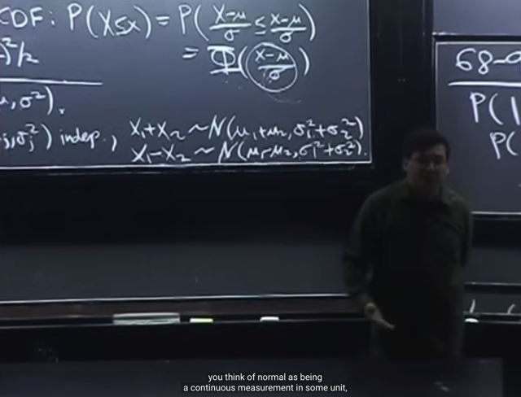</kbd></p>

> [!NOTE]
> Tiếp, đại khái là gs nói về **một ưu điểm của standardization** đó là ta có thể
> **hiểu X**, là **giá trị đo đạc được của một yếu tố nào đó** thì nó **sẽ gắn với
> một đơn vị nào đó**.
>
> Thế thì khi **standardize**, ví dụ đơn vị là km, thì (x `-` `μ)` `/` `σ` sẽ  (km `-` km) `/`
> km `=` km `/` km `=` **1** **TỨC Ý NÓI LÀ KHÔNG CÒN CARE ĐƠN VỊ LÀ GÌ NỮA**
>
> TỪ ĐÓ TA **KHÔNG PHẢI LO LẮNG LÀ RANDOM VARIABLE ĐƯỢC ĐO
> BẰNG ĐƠN VỊ GÌ**
>
> Suy nghĩ một chút, thì có thể liên hệ ưu điểm này với việc**preprocessing data**
> trong Machine Learning. Mình cũng đã từng nghe mr Andrew Ng nói về vai trò
> này của standardization giúp **khắc phục vấn đề các feature khác nhau có đơn
> vị đo khác nhau dẫn đến scale của chúng khác nhau**

<br>

<a id="node-449"></a>

<p align="center"><kbd>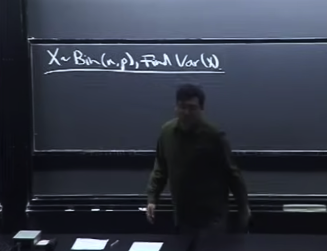</kbd></p>

> [!NOTE]
> Tiếp, ta sẽ **quay lại Binomial Bin(n, p)** để tìm công thức **Variance** của nó.
>
> Thì gs cho rằng **có 3 cách**. Cách dễ nhất thì chưa làm được vì chưa học
> tới kiến thức cần thiết. **Cách mất công nhất là dùng LOTUS**, và tính `E(X^2)`
> như ta vừa mới làm với Pois(lambda)

<br>

<a id="node-450"></a>

<p align="center"><kbd>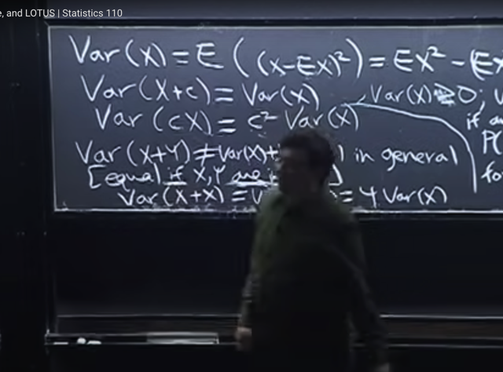</kbd></p>

> [!NOTE]
> Thế thì theo gs**cách thứ 3** ta có thể làm được bây giờ đó là **áp dụng tính
> chất của variance** đã học lúc nãy đó là **nếu các r.v INDEPENDENT**, thì
> **Var(X+Y) `=` `Var(X)` `+` Var(Y)**
>
> Gs nói thêm ta tạm dùng chứ ta sẽ quay lại **chứng minh tính chất này sau**
> (lúc nãy chỉ mới chứng minh hai cái trên `Var(X+c)` và `Var(cX))`

<br>

<a id="node-451"></a>

<p align="center"><kbd>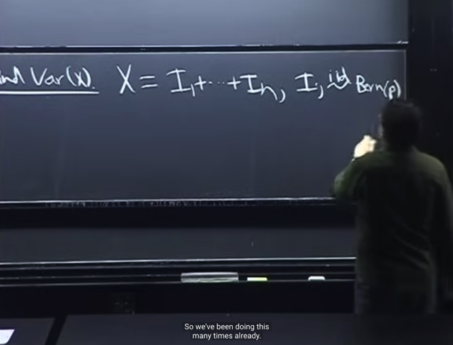</kbd></p>

> [!NOTE]
> Thế thì như cách làm quen thuộc, ta có thể **biểu diễn Binomial (n, p) random
> variable X** theo dạng **∑ của n INDICATOR RANDOM VARIABLE I_j**
>
> Và như đã biết, **indicator** random variable là random variable có giá trị bằng
> **1** nếu **event Aj occur** `/` hoặc **trial** **success** (mà xác suất occur hay
> trial success  bằng p, tức **P(Aj) `=` p**, xác suất fail là `1-p.` Cũng là ý nghĩa của
> việc nói **I_j ~ Bern(p)**)
>
> Các random variable này **i.i.d**: **Independent**, **Identical** (tức cùng theo
> Bern(p))

<br>

<a id="node-452"></a>

<p align="center"><kbd>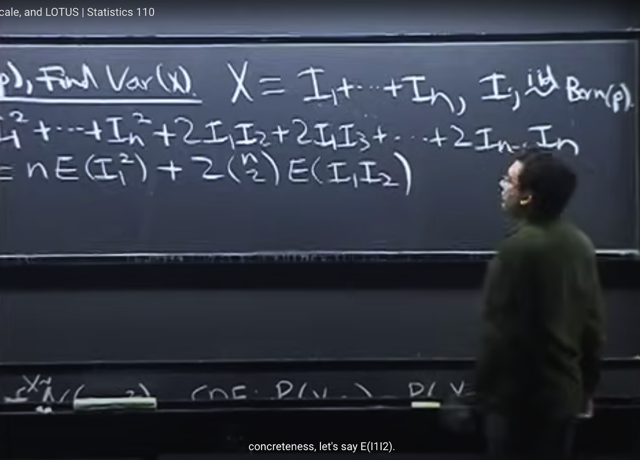</kbd></p>

<p align="center"><kbd></kbd></p>

<p align="center"><kbd>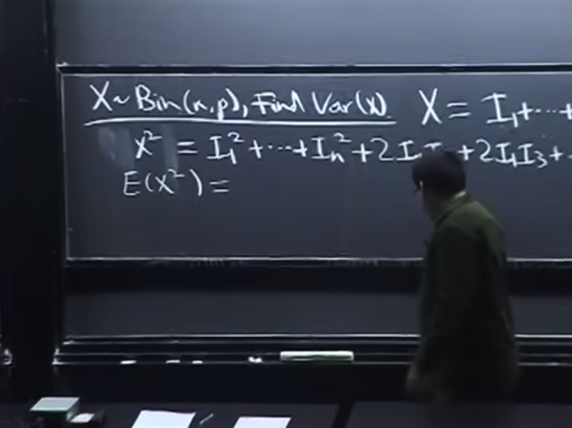</kbd></p>

🔗 **Related:** [TÓM TẮT:  Tiếp tục về CDF: Định nghĩa của CDF  Bước nhảy của CDFD là giá trị PMF tại đó  Tính chất của CDF: 1) Non decreasing, 2) right continuous và   3) F(x) -> 0 khi x -> -infinity, F(x) -> 1 khi x -> -infinity  - Định nghĩa Independent random variables theo independent event:  X, Y độc lập khi  + Continuous rv: P(X≤x, Y≤y) = P(X≤x) * P(Y≤y) với mọi x, y   + Discrete rv: P(X=x,Y=y) = P(X=x)*P(Y=y)  - Expected value: Là con số tóm tắt distribution của r.v  - Hai cách tính average  - E(X) = Σx x*P(X=x)  - X ~ Bern(p) thì E(X) = p  - FUNDAMENTAL BRIDGE: E(X) = P(A), X là indicator rv mang giá trị = 1 khi event A xảy ra và 0 khi ngược lại  - X ~ Bin(n, p):  E(X) = ∑ k=0,1..n [ k * (n choose k)*p^k*q^(n-k)] = ..= np  - TÍNH LINEARITY CỦA AVERAGE  - Tính lại E(X) của Bin(n, p) nhanh hơn bằng linearity, fundamental bridge và E(X) của Bern(p)  - TÍnh E(X) của Hypergeometric Dù các trial không độc lập nhưng dùng Symmetry, linearity, fundamental bridge vẫn tính được  - X ~ Geom(p): P(X=k) = q^k*p  - E(X) = p Σ k=0:infinity [k * q^k]](tóm_tắt_tiếp_tục_về_cdf_định_nghĩa_của_cdf_bước_nhảy_của_cdfd_là_giá_trị_pmf_tại_đó_tính_chất_của_cdf_1_non_decreasing_2_right_continuous_và_3_fx_0_khi_x_infinity_fx_1_khi_x_infinity_định_nghĩa_independent_random_variables_theo_independent_event_x_y_độc_lập_khi_continuous_rv_pxx_yy_pxx_pyy_với_mọi_x_y_discrete_rv_pxxyy_pxxpyy_expected_value_là_con_số_tóm_tắt_distribution_của_rv_hai_cách_tính_average_ex_σx_xpxx_x_bernp_thì_ex_p_fundamental_bridge_ex_pa_x_là_indicator_rv_mang_giá_trị_1_khi_event_a_xảy_ra_và_0_khi_ngược_lại_x_binn_p_ex_k01n_k_n_choose_kpkqn_k_np_tính_linearity_của_average_tính_lại_ex_của_binn_p_nhanh_hơn_bằng_linearity_fundamental_bridge_và_ex_của_bernp_tính_ex_của_hypergeometric_dù_các_trial_không_độc_lập_nhưng_dùng_symmetry_linearity_fundamental_bridge_vẫn_tính_được_x_geomp_pxk_qkp_ex_p_σ_k0infinity_k_qk.md#node-254)

> [!NOTE]
> Thế thì ta sẽ **tính E(X^2)** trước, và nó sẽ là **I1^2 `+` I2^2 +** ...và các cross term **2I1I2 `+` 2I1I3**....
>
> (Xuất phát từ **Newton Binomial**, không có gì phức tạp, mà như ta đã học `(a+b)^2` `=` `a2+b^2+2ab`
>
> Từ đó ta sẽ tính **E(X^2) `=` `E(I1^2` `+` I2^2 `+` `...+` 2I1I2 `+` 2I1I3...)**
>
> theo **linearity** `=` `E(I1^2)` `+` `E(I2^2)` `+` `....E(2I1I2)` `+` 2E(2I1I3) `+` ...
>
> Lập luận như bữa trước **dựa vào tính symmetry**: các indicator random variable có tính đối xứng, 
> nên **expected value của chúng như nhau**. Do đó **E(I1^2) `=` `E(I2^2)` `=` ..E(In^2)**
>
> Nên `E(I1^2)` `+` `E(I2^2)` `+` `...E(In^2)` `=` **n E(I1^2)** (chọn I mấy cũng được)
>
> Tương tự như vậy **E(2I1I2) `=` E(2I1I3)**  .... và ta có **(n choose 2)**cái cross term như vậy
> nên `E(2I1I2)` `+` `E(2I1I3)` `+` `....=` **(n choose 2) 2*E(I1I2)**
>
> Vậy **E(X^2) `=` n `E(I1^2)` `+` (n choose 2) 2*E(I1I2)**

<br>

<a id="node-453"></a>

<p align="center"><kbd>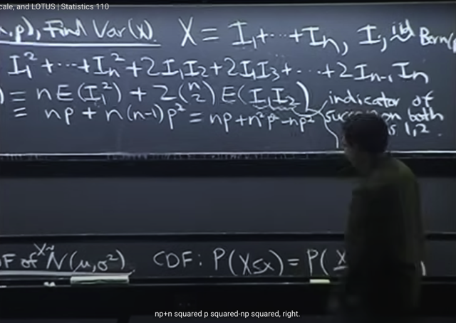</kbd></p>

> [!NOTE]
> Thế thì xét **E(I1^2)**, ta sẽ lập luận rằng, vì I1 là **INDICATOR** RANDOM
> VARIABLE, nó **chỉ có 2 possible value là 1 hoặc 0**.
>
> Vậy thì **I1^2 cũng chỉ có 2 possible value là 1 hoặc 0**.
>
> Và vì **I1^2 `=` 1 chỉ khi I1 `=` 1** và **I1^2 `=` 0  chỉ xảy ra khi I1 `=` 0**, nên **P(I1^2
> `=` 1)** **CHÍNH LÀ CŨNG BẰNG P(I1 `=` 1)** và **CHÍNH LÀ p** vì **I1 ~ Bern(p)**,
> và ngược lại.
>
> Vậy **P(I1^2=0) `=` `P(I1=0)` `=` 1-p**
>
> Tiếp, **E(I1^2) theo định nghĩa** là **weighted sum của mọi possible value** của
> **I1^2**, weight bởi **xác suất nó mang giá trị đó**.
>
> Thì như vừa nói, p**ossible value của I1^2 là 0 hoặc 1** và xác suất của tương
> ứng là **p và 1-p**. Nên dễ thấy **E(I1^2) cũng chính là bằng E(I1)**, và ta đã biết 
> expected value của Bern(p): `1*p+0*(1-p)` `=` p
>
> (mà cũng có thể dùng LOTUS, vì đã học LOTUS: `E(I1^2)` 
>
> ```text
> = 1^2 * P(I = 1) + 0^2 * P(I = 0) = 1*p + 0*(1-p) = p)
> ```
>
>
> Vậy n * `E(I1^2)` `=` **np**
>
> `====`
>
> Tiếp **xét I1I2**, thì gs cho biết **TÍCH CỦA 2 INDICATOR RANDOM VARIABLES
> LÀ MỘT INDICATOR RANDOM VARIABLES**, có giá trị **bằng 1 chỉ khi cả hai 
> đều bằng 1**. Và việc I1I2 `=` 1 mang ý nghĩa là **cả hai trial đều success**.
>
> Thế thì ta có thể lập luận rằng, vì đã nói đấy là các **i.i.d** Ij nên hai trial `/` event
> `(I1=1,` và `I2=1)` này **độc lập**
>
> Do đó theo **định nghĩa independent event** thì **P(I1=1, `I2=1)` `=` P(I1=1)*P(I2=1)** 
> `=` p*p `=` **p^2**(phải tự hiểu là `E(I1I2)` cũng được tính theo định nghĩa là `Σx` `x*P(I1I2=x)`
> ```text
> = 1*P(I1I2=1) + 0*P(I1I2=0) = 1*P(I1I2=1) = 1*p^2 = p^2 (ta khỏi cần quan
> ```
> tâm `P(I1I2=0)` là bao nhiêu)****Cuối cùng là 2*(n choose 2) triển khai ra sẽ là `2*n!/(n-2)!2!` `=` n! `/` `(n-2)!` `=` **n(n-1)
>
> Vậy `E(X^2)` `=` np `+` `n(n-1)p^2` `=` np `+` n2p2 `-` np^2**

<br>

<a id="node-454"></a>

<p align="center"><kbd>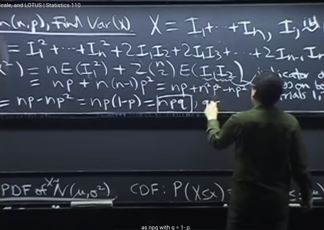</kbd></p>

🔗 **Related:** [LEC 21: COVARIANCE & CORRELATION](untitled.md#node-700)

> [!NOTE]
> ```text
> Vậy ráp vào, Var(X) = E(X^2) - (EX)^2 =  np + n2p2 - np^2 - (np)^2 (vì ta đã
> ```
> chứng minh EX của Bin (n,p) `=` np
>
> `=>` `=` **np(1-p) `=` npq với q `=` 1-p**

> [!NOTE]
> ```text
> X~Bin(n,p), Var(X) = npq (q = 1-p)
> ```

<br>

<a id="node-455"></a>

<p align="center"><kbd>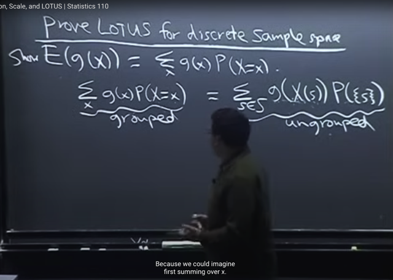</kbd></p>

🔗 **Related:** [TÓM TẮT:  - Chứng minh tính linearity của expectation  - Negative binomial: Số failure cho đến khi có r success  (Mở rộng của Geomegtric (số failure cho đến khi có success đầu)   - P(X=n) = (n+r-1 choose n) * p^r * q^n  - E(X) = rq/p  - Cần để ý xem quy ước là start at 0 hay 1 đối với Negative Binomial  - Bài toán Putnam tính expect value của X = số chữ số là local maxima  trong n chữ số  - St. Peterburg Paradox](tóm_tắt_chứng_minh_tính_linearity_của_expectation_negative_binomial_số_failure_cho_đến_khi_có_r_success_mở_rộng_của_geomegtric_số_failure_cho_đến_khi_có_success_đầu_pxn_nr_1_choose_n_pr_qn_ex_rqp_cần_để_ý_xem_quy_ước_là_start_at_0_hay_1_đối_với_negative_binomial_bài_toán_putnam_tính_expect_value_của_x_số_chữ_số_là_local_maxima_trong_n_chữ_số_st_peterburg_paradox.md#node-272)

> [!NOTE]
> Những phút cuối ta sẽ đi **chứng minh LOTUS**, gs sẽ **chỉ làm với discrete**
> sample space, với continuous thì cũng tương tự
>
> Như đã biết LOTUS cho rằng ta có thể **chỉ việc dùng PDF `/` PMF của X** **thay vì
> phải tìm PDF `/` PMF của g(X)** khi tính **E(g(X))**:
>
> **E(g(X)) `=` Sum x g(x) * `P(X=x)` (i)**
>
> (với continuous, thì là tích phân từ `-infinity` tới infinity  của g(x) * f(x)dx
>
> `====`
>
> Thế thì để chứng minh LOTUS, đầu tiên ta sẽ **dùng cách biểu diễn `E(g(X))` theo
> 2 CÁCH** mà bữa trước ta đã dùng khi biểu diễn `E(X):`
>
> Cách 1: `E(X)` `=` Tổng [mọi possible value x] x * `P(X=x)`
>
> Cách 2: `E(X)` `=` Tổng [mọi possible outcome s trong Sample space ] X(s) * P({s})
>
> Cách 1 mang ý nghĩa giống như ta group các viên sỏi lại theo số của nó, để
> thành một viên sỏi lớn (chính là một event `X=x_j,` bởi vì trong sample space có
> thể có nhiều possible value được map với label `x_j` thông qua function X() `/` random
> variable X có bản chất là một function map một possible outcome s với một label
> là possible value `x_j)` có khối lượng lớn còn cách 2 thì ta không group****Thế thì tương tự ta có thể **BIỂU DIỄN `E(g(X))` theo 2 CÁCH group và ungroup**: **Group**: **E(g(X)) `=` Sum {mọi possible value t của g(X)}: g(x) * P(g(X) `=` t)**(again, nhớ rằng X là r.v thì apply một function g() lên nó, g(X) thì cũng là một r.v)****thì với cách thể hiện này, ta **phải tìm PMF của g(X) (tức là P(g(X) `=` t)
>
> nhưng LOTUS thì cho rằng ta có thể dùng luôn PMF của X: `P(X=x)` để rồi
>
> `E(g(X))` `=` Sum {x}: g(X) * `P(X=x)`
>
> Ungroup**: **E(g(X)) `=` Sum {s trong sample space S}: g(X(s)) P({s})
>
> Chú ý là trong cách biểu diễn này, P({s}) là xác suất xuất hiện của possible
> outcome s, nó không phải là PMF của X hay g(X) gì cả**
>
> thì trong cách biểu diễn này, ta không group các viên sỏi thành super pebble
> nên P({s}} là khối lượng của từng viên sỏi đó.
>
> X(s) là gì, thì ta nhớ định nghĩa của random variable là một **FUNCTION**
> **map** **possible outcome s** với**real number**
>
> Thì **P(X=x) thể hiện việc group** là bởi có thể **có nhiều viên sỏi {s} có nhãn X(s)
> là x**, nên `P(X=x)` sẽ giống như gom khối lượng của mọi viên sỏi s có nhãn X(s)
> `=` x. Còn P({s}) thì chỉ là khối lượng của viên sỏi s

> [!NOTE]
> CHỨNG MINH LOTUS

<br>

<a id="node-456"></a>

<p align="center"><kbd>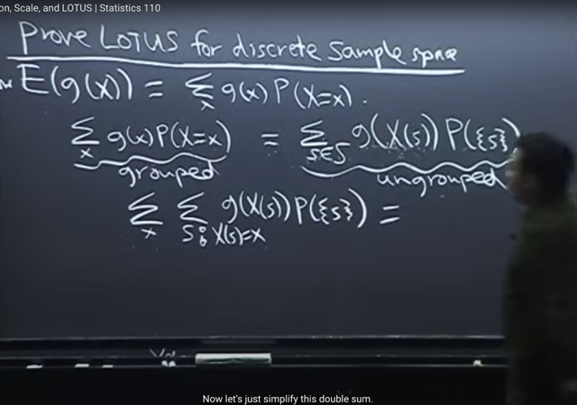</kbd></p>

> [!NOTE]
> VÀ TA SẼ CHỨNG MINH **VẾ TRÁI**((E(g(X)) `=` Sum {x}: g(X) * P(X=x)))**BẰNG VẾ PHẢI**(Sum {s}: g(X(s)) P({s}))****
> Ta sẽ tiếp tục **triển khai vế phải**, theo lối là ta sẽ **dùng double sum**, với ý
> nghĩa là, cách thể hiện bên phải, như đã nói, đang là cùng một kết quả với bên
> trái nhưng theo lối **KHÔNG GROUP** các pebbles. Nên nhớ, vế trái là cái mà ta
> đang chứng minh rằng nó sẽ là công thức valid của `E(g(X)).` 
>
> Thế thì với double sum vế trái tức là ta đang định **GROUP LẠI**, vì việc cộng 
> g(X(s))*P({s}) với **mọi s** hoàn toàn có thể **tương đương** việc ta **cộng các 
> g(X(s))*P({s}) của các s mà `X(s)=x` trước**, và **sau đó mới cộng các group lại**.
>
> Ví dụ x có 2 possible value: x1, x2. Trong sample space có s1, s2 mang label
> x1, tức là X(s1), X(s2) `=` x1. Và s3, s4 mang label x2: X(s3) `=` X(s4) `=` x2
>
> Thì Tổng s g(X(s))P({s}) sẽ là:
>
> g(X(s1))*P({s1}) `+` g(X(s2))*P({s2}) `+` g(X(s3))*P({s3}) `+` g(X(s4))*P({s4})
>
> thì nó cũng bằng:
>
> ```text
> = Sum s: X(s)=x1 g(X(s))*P({s}) + Sum s: X(s)=x2 g(X(s))*P({s})
> ```
>
> `=` **Sum x Sum s: `X(s)=x` g(X(s))*P({s})**

<br>

<a id="node-457"></a>

<p align="center"><kbd>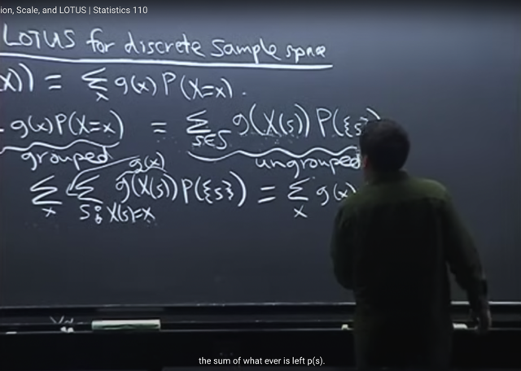</kbd></p>

> [!NOTE]
> Thế thì, một **điểm mấu chốt** ở đây đó là trong
>
> Sum x Sum [s: `X(s)=x]` g(X(s))*P({s})
>
> thì **bởi X(s) `=` x nên g(X(s)) `=` g(x)**
>
> nên Sum x Sum [s: `X(s)=x]` **g(X(s))***P({s}) `=` Sum x Sum [s: `X(s)=x]` **g(x)***P({s}) 
>
> Mà **g(x) thì không phụ thuộc s, nên ta sẽ đưa g(x) ra ngoài**: 
>
> `=` Sum x **g(x)** Sum [s: `X(s)=x]` P({s})

<br>

<a id="node-458"></a>

<p align="center"><kbd>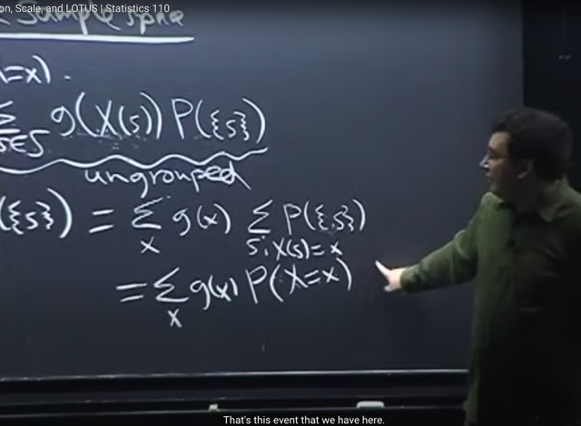</kbd></p>

> [!NOTE]
> Tiếp theo, trong Sum x g(x) **Sum [s: `X(s)=x]` P({s})** ta sẽ thấy
>
> **Sum [s: `X(s)=x]` P({s})** **diễn dịch ra** thì nó là **tổng mọi P({s}) với s sao cho
> X(s) `=` x,**cũng là tổng mọi P({s}) sao cho **s thuộc event** (vốn có ý nghĩa là
> **subspace** của sample space) **(X=x)**
>
> Thế thì để cho dễ thấy ta tiếp tục ví dụ bên kia (x có possible value: x1, x2.
> Trong sample space có s1, s2 mang mác x1, tức là X(s1) `=` X(s2) `=` x1. Và
> s3, s4 mang  mác x2: X(s3) `=` X(s4) `=` x2)
>
> Thì, ví dụ xét x `=` x1, thì Sum [s: `X(s)=x1]` P({s}) có nghĩa là P({s1}) `+` P({s2})
>
> Mà s1, s2 chính là hai possible outcomes **THUỘC EVENT SPACE** `X=x1`
> hay nói cách khác: 
>
> **(X=x1) `=` `(s=s1)` U (s=s2)** `=>` `P(X=x1)` `=` `P[(s=s1)` U `(s=s2)]`
>
> Và `(s=s1)` U `(s=s2)` là **union** của **2 disjoint event** nên theo **Axiom 2**: 
>
> **P(X=x1) `=` `P(s=s1)` `+` P(s=s2)**
>
> Và **khái quá**t ra **P(X=x) `=` Tổng P({s}) sao cho X(s) `=` x**
>
> Và như vậy **Sum [s: `X(s)=x]` P({s}) CHÍNH LÀ P(X=x)**Vậy: Sum x g(x) **Sum [s: `X(s)=x]` P({s})** chính là****Sum x g(x) **P(X=x)**Nên vế phải chính là vế trái

> [!NOTE]
> ```text
> Chứng minh EY = Eg(X) = Σx xP(X=x)
> ```
>
> (Viết gọn lại và theo Casella)
>
> Theo định nghĩa EY `=` `Σy` `yP(Y=y)`
>
> ```text
> (Y=y) = (g(X)=y) = {s ∈ S: g(X(s)) = y}
> ```
>
> ⇨ `P(Y=y)` `=` P({s ∈ S: g(X(s)) `=` y}) 
>
> `=` `Σ` {s ∈ S: g(X(s)) `=` y} P({s}) (định nghĩa hàm P)
>
>  `⇨Σy` `yP(Y=y)` 
>
> ```text
> = Σy y*Σ_{s ∈ S: g(X(s)) = y} P({s})
> ```
>
> ```text
> = Σy Σ_{s ∈ S: g(X(s)) = y} y*P({s})  | Đưa y vô Σs
> ```
>
> ```text
> = Σy Σ_{s ∈ S: g(X(s)) = y} g(X(s))*P({s})  | Thay y = g(X(s))
> ```
>
> ```text
> = Σy Σ_{s ∈ S: g(X(s)) = y} g(X(s))*P({s})
> ```
>
> Điểm quan trọng: 
>
> ```text
> {s ∈ S: g(X(s)} = y} = U_{x: g(x) = y} {s ∈ S: X(s) = x}
> ```
>
>
> ```text
> ⇨... = Σy Σx {x: g(x) = y} Σs {s ∈ S: X(s) = x} g(X(s)) P({s})
> ```
>
> ```text
> Tiếp: Do Σy Σx {x: g(x) = y} = Σx
> ```
>
> ```text
> ...= Σx Σs {s ∈ S: X(s) = x} g(X(s)) P({s})
> ```
>
> ```text
> = Σx Σs {s ∈ S: X(s) = x} g(x) P({s})
> ```
>
> ```text
> = Σx g(x) Σs {s ∈ S: X(s) = x} P({s})
> ```
>
> `=` **Σx g(x) P(X `=` x)**

<br>

