# Lec 15: Midterm Review

📊 **Progress:** `34` Notes | `35` Screenshots

---

<a id="node-460"></a>
## `-tóm` Tắt:

> [!NOTE]
> `-TÓM` TẮT:
>
>  Bài toán Toy Collector:  Tìm expected value của số lần đi ăn để có đủ n loại
>
> ```text
> - EX = n(1 + 1/2 + 1/3 + ...1/n) ≈ ln(n) + γ
> ```
>
> `-` CHỨNG MINH PART 2 CỦA UNIVERSALITY
>
> ```text
> - Cho X, Y, Z là các i.i.d positive random variable. Bài toán là tìm E(X / (X + Y +
> ```
> Z)). Nhờ symmetry tính ra rất dễ `=` `1/3`
>
> `-` Gặp lại LOTUS `-` Law of The Unconscious Statistician với bài toán cho X `=` U^2
> với U~Unif(0,1), Y `=` e^x tìm `E(Y),` câu hỏi yêu cầu đáp án ở dạng  tích phân
>
> `-` Để tìm PDF ta sẽ tìm CDF trước, lấy derivative của CDF là có PDF.
>
> Và để tìm CDF ta sẽ dùng định nghĩa của nó để mà xây dựng lên
>
> `-` X ~ Binomial (n, p), cần tìm distribution của `n-X:` `n-X` là một Bin(n, q) theo 2 cách
>
> `-Xây` dụng PDF của Exp(λ): T (Thời gian chờ đến khi có email đầu tiên) là một
> ```text
> Expo(λ) r.v: f(t) = (1-e^(-λ*t))' =  λ*e^(-λt)
> ```

<br>

<a id="node-461"></a>

<p align="center"><kbd>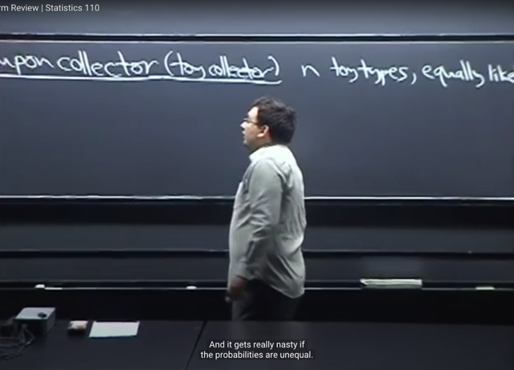</kbd></p>

> [!NOTE]
> Ta sẽ gặp bài toán **Coupon collector** hay Toy collector mà gs nói câu
> chuyện giống như ta đi ăn Supper meal của Mc Donal sẽ **được tặng một
> món đồ chơi**và ta muốn **collect đủ n loại**, **equally likely** `-` tức xác suất
> ta được loại nào trong n loại đều giống nhau

<br>

<a id="node-462"></a>

<p align="center"><kbd>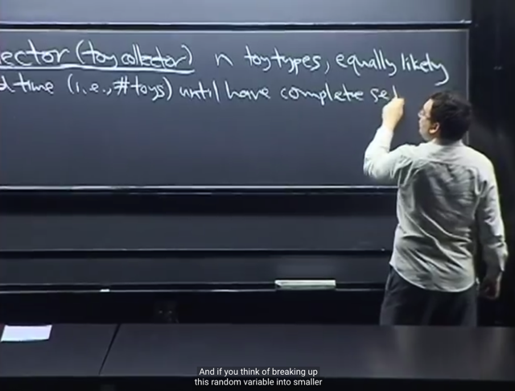</kbd></p>

> [!NOTE]
> Và ta sẽ **cần tính expected** số lần đi ăn Supper meal để **có đủ set n
> loại**, nhớ là mỗi lần đều được tặng một món, nhưng không biết món gì.
> Nên cũng**có thể gọi là ta cần tìm expected value của số lần đi ăn để có
> đủ n loại**

<br>

<a id="node-463"></a>

<p align="center"><kbd>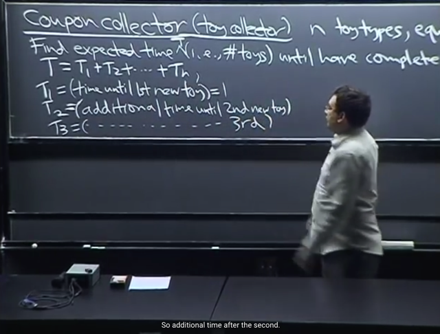</kbd></p>

> [!NOTE]
> Thế thì nếu gọi **T là số lần đi ăn** hay **số món đồ chơi được tặng** **để có đủ
> set n lọai**. Thì theo gs ta để cho dễ sẽ **break nó thành tổng các random
> variable nhỏ hơn T1 `+` T2 ....Tn**
>
> Trong đó **T1 là số lần đi ăn** `/` số đồ chơi được tặng **ĐỂ CÓ MÓN ĐỒ CHƠI
> MỚI ĐẦU TIÊN**. Đương nhiên dễ thấy **T1 `=` 1**, là vì **ngay lần đầu tiên đi ăn
> và được tặng thì món đó chính là món đồ chơi mới đầu tiên**
>
> **T2** là số lần đi ăn `/` số đồ chơi được tặng **THÊM SAU ĐÓ CHO ĐẾN KHI
> ĐƯỢC MÓN ĐỒ CHƠI MỚI THỨ 2**. Tức là tính lần thứ 2 trở đi cho đến khi
> có món khác món thứ nhất.
>
> T3 tương tự như vậy, là số lần đi ăn `/` số đồ chơi được tặng **SAU KHI ĐÃ 
> CÓ MÓN THỨ 2 CHO ĐẾN KHI CÓ ĐƯỢC MÓN ĐỒ CHƠI THỨ 3**.
>
> Cho nên dễ hiểu là T sẽ là **T1 `+` T2 `+` ...Tn**

<br>

<a id="node-464"></a>

<p align="center"><kbd>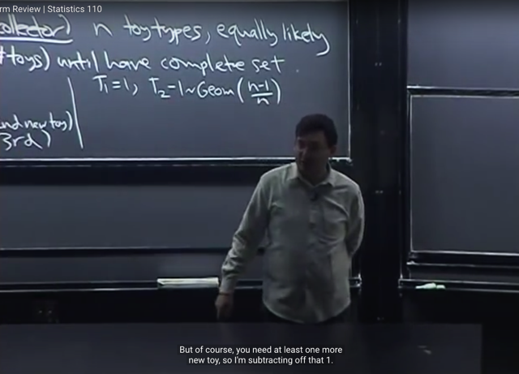</kbd></p>

🔗 **Related:** [TÓM TẮT:  Tiếp tục về CDF: Định nghĩa của CDF  Bước nhảy của CDFD là giá trị PMF tại đó  Tính chất của CDF: 1) Non decreasing, 2) right continuous và   3) F(x) -> 0 khi x -> -infinity, F(x) -> 1 khi x -> -infinity  - Định nghĩa Independent random variables theo independent event:  X, Y độc lập khi  + Continuous rv: P(X≤x, Y≤y) = P(X≤x) * P(Y≤y) với mọi x, y   + Discrete rv: P(X=x,Y=y) = P(X=x)*P(Y=y)  - Expected value: Là con số tóm tắt distribution của r.v  - Hai cách tính average  - E(X) = Σx x*P(X=x)  - X ~ Bern(p) thì E(X) = p  - FUNDAMENTAL BRIDGE: E(X) = P(A), X là indicator rv mang giá trị = 1 khi event A xảy ra và 0 khi ngược lại  - X ~ Bin(n, p):  E(X) = ∑ k=0,1..n [ k * (n choose k)*p^k*q^(n-k)] = ..= np  - TÍNH LINEARITY CỦA AVERAGE  - Tính lại E(X) của Bin(n, p) nhanh hơn bằng linearity, fundamental bridge và E(X) của Bern(p)  - TÍnh E(X) của Hypergeometric Dù các trial không độc lập nhưng dùng Symmetry, linearity, fundamental bridge vẫn tính được  - X ~ Geom(p): P(X=k) = q^k*p  - E(X) = p Σ k=0:infinity [k * q^k]](tóm_tắt_tiếp_tục_về_cdf_định_nghĩa_của_cdf_bước_nhảy_của_cdfd_là_giá_trị_pmf_tại_đó_tính_chất_của_cd.md#node-257)

> [!NOTE]
> Thế thì T1 luôn bằng 1 thì đã hiểu rồi. Còn T2 ta lập luận như sau:
>
> T2 là #**số lần fail cho đến khi success**. Với **fail** là ám chỉ sự kiện được tặng
> **món đồ chơi không mới**, và **success** là ám chỉ sự kiện được tặng **món mới**,
> chưa có. Như vậy có thể thấy **T2** phù hợp cho một distribution đã học là
> **Geometry (p)**.
>
> Bữa trước ta đã biết **X ~ Geometry(p)** thì X có thể coi như**#Số lần trial fail cho
> đến khi trial success**, với trials có tính **i.i.d** và ~ **Bern(p)**. Và theo **convention
> trong** class này thì **X KHÔNG TÍNH LẦN SUCCESS** (ví dụ ngay lần đầu tiên trial
> mà success, thì X `=` 0, nên gọi là X **start from 0**, nhưng một số sách start from 1 thì
> có nghĩa là có tính lần success)
>
> Thế thì có thể thấy trong bối cảnh này, mỗi lần đi ăn để được tặng thêm một món đồ
> chơi thì đều **chỉ có 2 possible outcome**: đồ chơi có rồi (fail) và đồ chơi mới
> (success) trong đó, trong **phạm vi T2**, tức là chưa có món đồ chơi mới thứ 2, thì
> mỗi lần trong T2, **xác suất thành công** dễ thấy theo **naive definition** là (**n-1)/n**
>
> `(n-1` là event space, số possible outcome là đồ chơi mà ta chưa có, vì đã có món đầu
> tiên nên sẽ có `n-1` món chưa có. Còn n là sample space `-` tổng số possible outcome.
>
> Một điểm phải lưu ý là, đây không phải là bốc đồ chơi từ trong cái lọ. Mà là mỗi lần đi
> ăn thì được tặng. Và khi được tặng thì khả năng được tặng món nào cũng như nhau.
>
> Nên xét event space trong bối cảnh T2 thì mỗi lần đi ăn cho đến khi chưa được món
> mới thì vẫn luôn có `n-1` món trong event space, trên tổng số n món trong sample
> space. Cụ thể hơn, giả sử lần thứ 1001 mới được tặng món mới (món thứ 2, đồng
> nghĩa từ lần thứ 1 đến thứ 1000 đều được tặng cùng một loại) thì từ lần thứ 2 đến lần
> thứ 1000, xác suất được tặng món mới đều là `(n-1)/n`
>
> Do đó, **mọi trial đều độc lập** (independent), **identical** (cùng Bern(p)) và cùng ~
> Bern(p) với **p `=` (n-1)/n**
>
> Do đó **T2 là Geometric (p)** random variable. Có điều, đương nhiên vì ta cần phải
> **include lần success vào** vì định nghĩa của T2 là số lần đi ăn `/` được tặng đồ chơi
> cho đến khi có đồ chơi mới thứ 2 (chứ không phải số lần đi ăn mà nhưng chưa được
> tặng món mới cho đến khi có món thứ 2, khi đó chỉ tính những lần fail).
>
> Nên T2 **đáng lí** phải t**heo convention là start từ 1**. Có điều, gs nói rằng **ở class
> này** ta dùng convention là Geometric (p) **start từ 0**, nên ta sẽ nói **(T2-1) ~
> Geometric (p)**
>
> Để ví dụ như lần đầu (sau khi kết thúc T1) mà có ngay món đồ chơi mới thứ 2. Thì
> khi đó **T2 `-` 1 `=` 0 `=>` T2 `=` 1**

<br>

<a id="node-465"></a>

<p align="center"><kbd>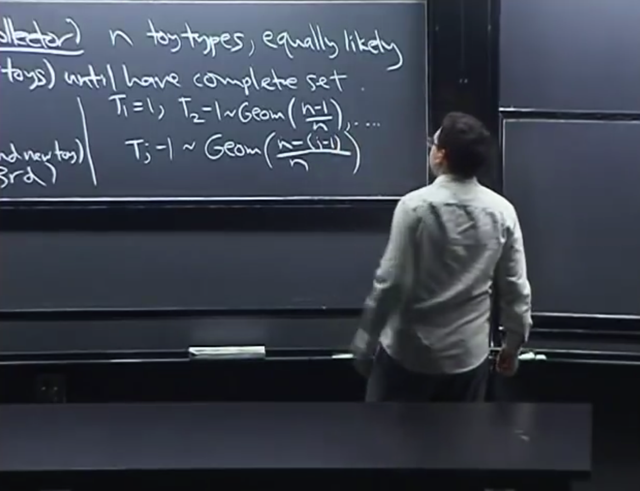</kbd></p>

> [!NOTE]
> Tương tự như vậy ta có thể thấy **T3-1** cũng là r.v ~ **Geometric((n-2)/n)**, 
>
> **T4-1 ~ Geometric((n-3)/n)**
>
> Hay **Tj-1 ~ Geometric ((n-(j-1))/n)**

<br>

<a id="node-466"></a>

<p align="center"><kbd>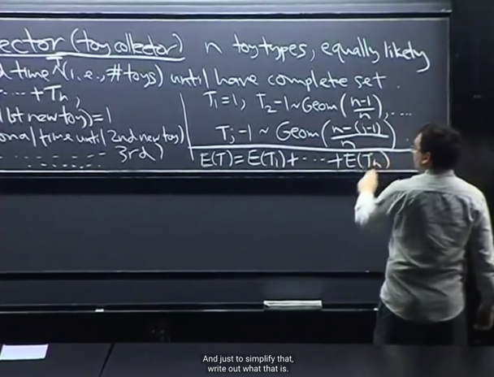</kbd></p>

> [!NOTE]
> Tiếp theo dựa vào **Linearity** của expected value ta có **E(T) `=` `E(T1)` `+`
> `E(T2)` `+` ...E(Tn)**
>
> Gs nói trong bài toán này các **Tj dễ thấy là independent**, vì **số lần được
> tặng đồ chơi đến khi có món mới thứ 2** **không liên quan gì** đến **số lần
> cho đến khi có món mới thứ 3, hay thứ 4 cả**.
>
> Tuy nhiên gs nhắc ta nhớ **tính linearity không cần yêu cầu các r.v
> Independent**, nên **ngay cả khi dependent, ta vần dùng được**

<br>

<a id="node-467"></a>

<p align="center"><kbd>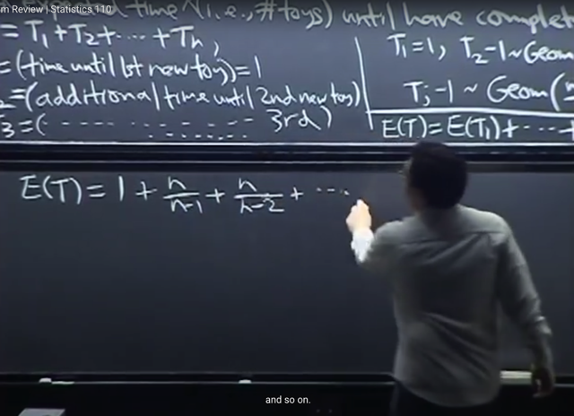</kbd></p>

🔗 **Related:** [TÓM TẮT:  Tiếp tục về CDF: Định nghĩa của CDF  Bước nhảy của CDFD là giá trị PMF tại đó  Tính chất của CDF: 1) Non decreasing, 2) right continuous và   3) F(x) -> 0 khi x -> -infinity, F(x) -> 1 khi x -> -infinity  - Định nghĩa Independent random variables theo independent event:  X, Y độc lập khi  + Continuous rv: P(X≤x, Y≤y) = P(X≤x) * P(Y≤y) với mọi x, y   + Discrete rv: P(X=x,Y=y) = P(X=x)*P(Y=y)  - Expected value: Là con số tóm tắt distribution của r.v  - Hai cách tính average  - E(X) = Σx x*P(X=x)  - X ~ Bern(p) thì E(X) = p  - FUNDAMENTAL BRIDGE: E(X) = P(A), X là indicator rv mang giá trị = 1 khi event A xảy ra và 0 khi ngược lại  - X ~ Bin(n, p):  E(X) = ∑ k=0,1..n [ k * (n choose k)*p^k*q^(n-k)] = ..= np  - TÍNH LINEARITY CỦA AVERAGE  - Tính lại E(X) của Bin(n, p) nhanh hơn bằng linearity, fundamental bridge và E(X) của Bern(p)  - TÍnh E(X) của Hypergeometric Dù các trial không độc lập nhưng dùng Symmetry, linearity, fundamental bridge vẫn tính được  - X ~ Geom(p): P(X=k) = q^k*p  - E(X) = p Σ k=0:infinity [k * q^k]](tóm_tắt_tiếp_tục_về_cdf_định_nghĩa_của_cdf_bước_nhảy_của_cdfd_là_giá_trị_pmf_tại_đó_tính_chất_của_cd.md#node-263)

> [!NOTE]
> Thế thì **bài trước ta đã chứng EX của Geom(p) là q/p**. 
>
> `E(T2-1)` `=` `q/p` `=` [1 `-` `(n-1)/n]` `/` `[(n-1)/n]` `=` **1/(n-1)**
>
> ```text
> ⇔ E(T2) - 1 = 1/(n-1)
> ```
>
> `=>` `E(T2)` `=` 1 `+` `1/(n-1)` `=` **n/(n-1)**Tương tự 
>
> ```text
> E(T3) = n/(n-2)....
> ```

<br>

<a id="node-468"></a>

<p align="center"><kbd>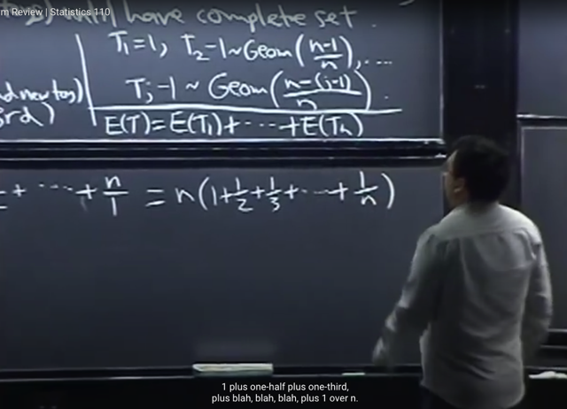</kbd></p>

> [!NOTE]
> và term cuối:
>
> ```text
> n/(n-(n-1)) = n/1
> ```
>
> Và lấy n ra làm thừa số chung ta có **E(X) `=` n*(1+1/2+1/3+....1/n)**

<br>

<a id="node-469"></a>

<p align="center"><kbd>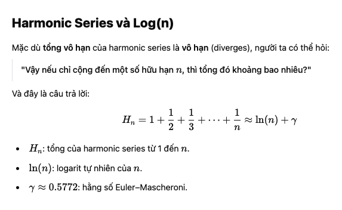</kbd></p>

<p align="center"><kbd></kbd></p>

<p align="center"><kbd>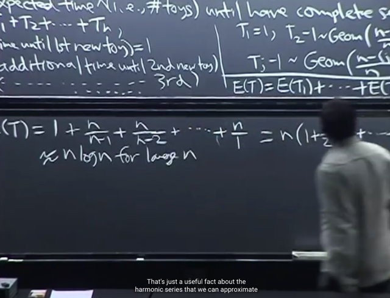</kbd></p>

> [!NOTE]
> Và đó là exact result. Nếu cần ta có thể có **approx result**≈ **log n** với n
> lớn.
>
> Đây là **harmonic serie**s (chuỗi điều hòa) có thể xấp xỉ **log n** với n lớn
>
> (log ở đây là base e `-` natural logarithm)

> [!NOTE]
> X: số lần đi ăn để collect đủ n món toy: 
>
> ```text
> EX = n(1 + 1/2 + 1/3 + ...1/n) ≈ ln(n) + γ
> ```

<br>

<a id="node-470"></a>

<p align="center"><kbd>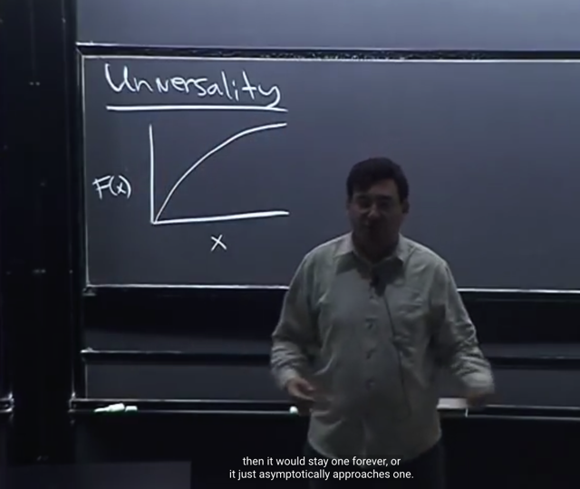</kbd></p>

> [!NOTE]
> Tiếp, ta sẽ thảo luận thêm về **Universality** (đại khái là theorem cho phép **tìm
> random variable "của" `/` tuân theo một CDF cho trước**.
>
> Thế thì đầu tiên gs nói CDF F(x) như đã biết là function**right continuous**(ý nói
> liên tục về phía phải, gs đã từng nói khái niệm này cũng như 18.01 lec 2 đã
> học, đó là khi lim `x->x0+` f(x) `=` f(x0)), **increasing** để khi x từ **-infinity tới infinity**
> thì **F(x) từ 0 đến 1**.
>
> increasing tức là nó không giảm, nhưng có thể có đoạn đi ngang (flat region),
> nên đúng có thể gọi là `non-decreasing`
>
> Tuy nhiên gs nói thêm với **Universality**, ta sẽ **assume** CDF **STRICTLY**
> **INCREASING (chỉ có tăng, không có đi ngang)**
>
> Và ông cho rằng **nếu nó tiệm cận 1** thì **cũng được** không nhất thiết phải **đạt 1**

<br>

<a id="node-471"></a>

<p align="center"><kbd>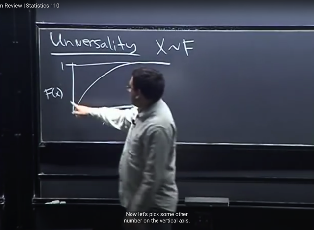</kbd></p>

> [!NOTE]
> Thế thì bữa trước ta đã biết về **Universality** có **2 phần**.
>
> Phần 1: đó là, nếu ta có hàm **CDF F(x)** và **U ~ Uniform (0,1)** thì bằng
> cách **apply `F_inv` lên r.v U** ta sẽ có một r.v mới **X `=` F_inv(U)** thì **X sẽ ~
> F** (tức X sẽ là random variable tuân theo distribution có CDF là F)
>
> Phần 2: của Universality cho phép làm **ngược lại**, rằng nếu ta có**X ~ F**
> thì bằng cách **apply F lên X** ta sẽ có một random variable mới tuân theo
> **Uniform (0,1)**. Tức **U `=` F(X) sẽ ~ Uniform (0,1).**
>
> Ở đây ta sẽ **giải thích tại sao (phần 2) lại vậy**

<br>

<a id="node-472"></a>

<p align="center"><kbd>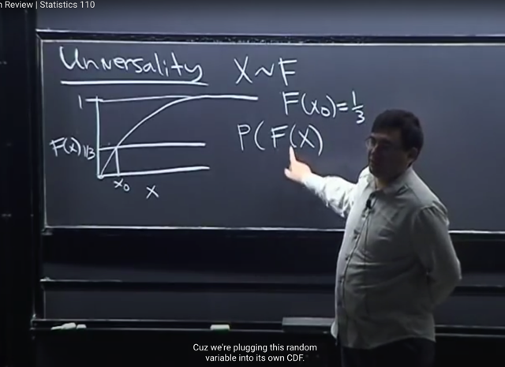</kbd></p>

> [!NOTE]
> Thế thì gs cho rằng cái này sẽ **dễ hiểu hơn** nếu ta **chọn các concrete value**.
>
> Ví dụ **chọn x0** ở đây với **F(x0) `=` 1/3**, nhưng **có thể chọn bao nhiêu cũng được**.
> Và mục đích chính là ta muốn **tính thử xem P(F(X) ≤ 1/3)** bằng bao nhiêu.
>
> Bởi lẽ nếu Universality nói rằng với X ~ F thì F(X) ~ Uniform(0,1) thì ta cần xem
> xét CDF của nó, tức CDF của F(X), cũng chính là P(F(X) ≤ t)

> [!NOTE]
> CHỨNG MINH PART 2 CỦA UNIVERSALITY

<br>

<a id="node-473"></a>

<p align="center"><kbd>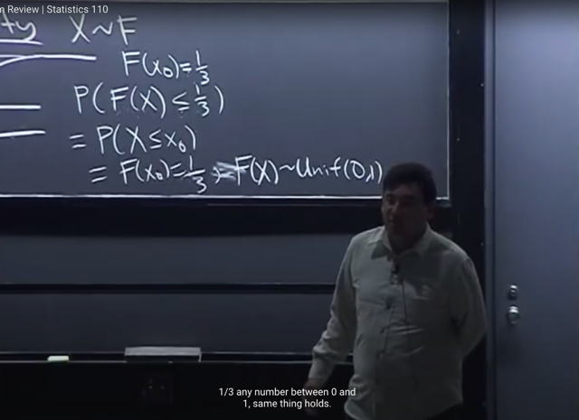</kbd></p>

> [!NOTE]
> Thế thì, nhìn vào biểu đồ có thể thấy **F(X) ≤ 1/3** sẽ **tương đương** với việc
> **X ≤ x0** hay nói các khác hai event: event [F(X) ≤ `1/3]` và event [X ≤ x0]  LÀ
> **CÙNG MỘT EVENT**
>
> Nên **P(F(X) ≤ `1/3)` `=` P(X ≤ x0) (**hai event là một thì đương nhiên xác suất
> chúng bằng nhau)
>
> Giải thích chặt chẽ hơn: X ≤ x0 ⇔ F(X) ≤ F(x0) ta có điều này là vì F là
> monotonic strictly increasing function. Mà X ≤ x0 có thể hiểu là {s ∈ S: X(s) ≤
> x0} là subset các possible outcome strong original sample space. và X ≤ x0 ⇔
> F(X) ≤ F(x0) sẽ dẫn đến {s ∈ S: X(s) ≤ x0} `=` {s ∈ S: F(X(s)) ≤ F(x0)} và cái này
> chính là event  F(X) ≤ x0. Nên hiểu rằng đây là hai event giống nhau nên apply
> probability function lên cũng phải bằng nhau P(F(X) ≤ F(x0)) `=` P(X ≤ x0) vì bản
> chất định nghĩa của P đều là probability của cùng một set các p.o: P({s ∈ S:
> X(s) ≤ x0})  `=` P({s ∈ S: F(X(s)) ≤ F(x0)})
>
> Mà **P(X ≤ x0)** đương nhiên chính là **giá trị của CDF** của X tại x0: **F(x0)**
>
> Và ta đã biết khi chọn x0 là **F(x0) `=` 1/3**
>
> Như vậy dẫn đến kết luận **P(F(X) ≤ `1/3)` `=` 1/3**. Và một lập luận quan trọng
> đó là vì **1/3 chỉ là một con số concrete** chứ **chọn bao nhiêu cũng được, có
> nghĩa là nếu chọn con số m bất kì từ 0 đến 1, thì điều trên vẫn đúng: P(F(X) ≤
> m) `=` m**
>
> Thì đây chính là điều giúp ta **kết luận F(X) ~ Uniform (0,1)** bởi vì ta đã biết
> với **Uniform (0,1)**, Xác suất X rơi vào vùng nào từ 0 đến m, chính là P(x ≤
> m), sẽ  chính là bằng m.

<br>

<a id="node-474"></a>

<p align="center"><kbd>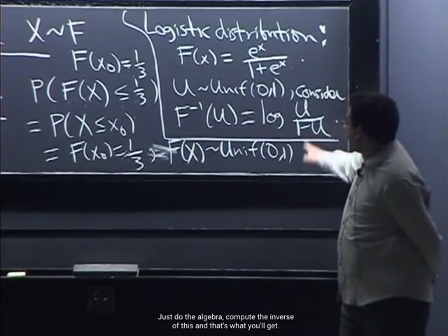</kbd></p>

> [!NOTE]
> Gs nói thêm một chút về **ứng dụng của Universality part 1**, mà như ta vừa nói
> giúp **tạo random variable**của **một CDF biết trước**. 
>
> Thì ví dụ ta có **CDF** của **Logistic** distribution là **F(x) `=` e^x `/` (1 `+` e^x)**, và ta muốn
> **simulating**, tức **generate** các random variable của distribution này.
>
> Ta sẽ tìm **F_inv** bằng cách cho**e^x `/` (1 `+` e^x) `=` u** và giải ra hàm **x `=` G(u)** thì
> khi đó **G chính là F_inv**
>
> Giải ra ta sẽ có**F_inv(u) `=` log u/(1-u)**
>
> Lúc này ta chỉ việc sampling `/` simulating các random variable U~ Uniform (0,1)
> thì **X `=` `F_inv(U)` chính là r.v ~ F**

<br>

<a id="node-475"></a>

<p align="center"><kbd>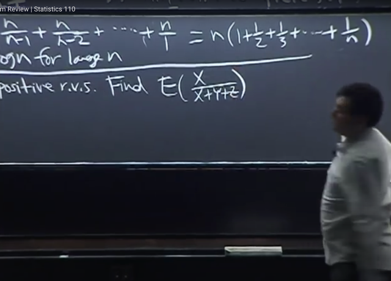</kbd></p>

<p align="center"><kbd></kbd></p>

<p align="center"><kbd>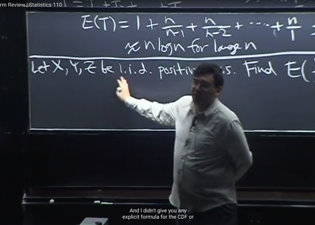</kbd></p>

> [!NOTE]
> Ta qua ví dụ này, cho **X, Y, Z** là các i.i.d **positive** random variable. Bài toán là tìm
> **E(X `/` (X `+` Y `+` Z))**

<br>

<a id="node-476"></a>

<p align="center"><kbd>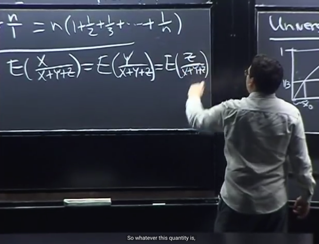</kbd></p>

> [!NOTE]
> Thế thì bài toán này, ta**không biết gì về CDF, PDF của các r.v**. Thứ **duy
> nhất** ta biết là chúng **dương** (để ta khỏi phải lo về việc chia cho 0) và
> chúng**i.i.d**
>
> Thế thì nhờ tính **symmetry**: tức là **các r.v có tính đối xứng**, nên
> **E[X/(X+Y+Z)]** cũng phải bằng **E[Y/(X+Y+Z)]** và bằng luôn **E[Z/(X+Y+Z)]**Do symmetry: `E[X/(X+Y+Z)]` `=` `E[Y/(X+Y+Z)]` `=` `E[Z/(X+Y+Z)]`

<br>

<a id="node-477"></a>

<p align="center"><kbd>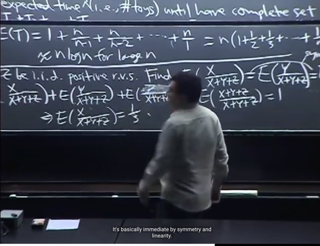</kbd></p>

> [!NOTE]
> Thế thì ta sẽ **nghĩ đến việc cộng chúng lại**, và sau đó **nhờ** **Linearity**:
>
> **E(X/tổng XYZ) `+`  `E(Y/tổng` XYZ) `+` `E(Z/tổng` XYZ)** 
>
> **= `E(X/tổngXYZ` `+` `Y/tổng` XYZ `+` `Z/tổng` XYZ) (by linearity)**
> `=` **E(1) `=` 1**
>
> Suy ra `E(X/tổng` XYZ) `=` `E(Y/tổng` XYZ) `=` `E(Z/tổng` XYZ)  `=` **1/3**

<br>

<a id="node-478"></a>

<p align="center"><kbd>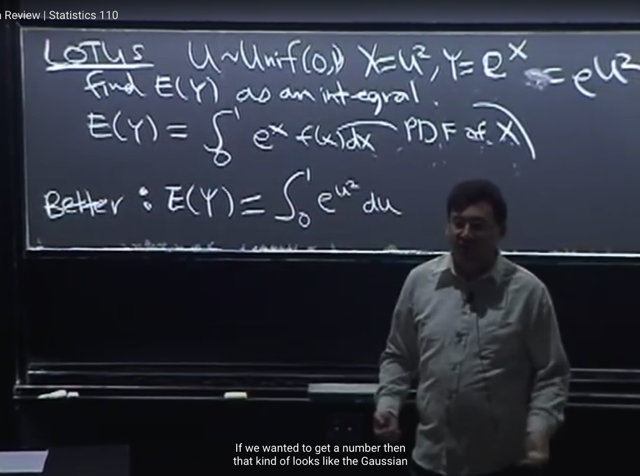</kbd></p>

> [!NOTE]
> tiếp theo ta sẽ **gặp lại LOTUS** `-` Law of The Unconscious Statistician với bài
> toán cho X `=` U^2 với U~Unif(0,1), Y `=` e^x tìm **E(Y)**, câu hỏi yêu cầu **đáp án ở dạng 
> tích phân**
>
> Thì ôn lại một chút, ta đã biết **LOTUS**, cho phép tính **E(G(x))** mà **chỉ dùng PDF,
> PMF của X**. Theo định nghĩa `E(X),` nó là weighted sum của các possible
> value x của X và weight quy định bởi xác suất `P(X=x).`
>
> Nên với discrete r.v thì `E(X)` `=` Tổng mọi possible values x của X: **x*****P(X=x)** với `P(X=x)` 
> là PMF
>
> Còn với continuous r.v thì  `E(X)` `=` **Tích phân từ `-infinity` tới infinity của x*f(x)dx** 
> với f(x) là PDF
>
> Thế thì **LOTUS** cho phép **tính E(g(X))** **chỉ cần thay x bởi g(x)** trong các công
> thức trên
>
> Vậy thì gs nói, ta có thể làm như vầy: với Y `=` G(x) `=` e^x
>
> Theo LOTUS: **E(Y) `=` tích phân từ `-infinity` tới infinity của e^x f(x)dx**
>
> Thì vì X `=` U^2 với U ~ Uniform (0,1) nên có giá trị nằm trong [0,1] nên **X cũng chỉ có 
> giá trị từ 0 đến 1**
>
> Nên **E(Y) `=` `∫0:1` e^x f(x)dx**
>
> Thì nếu làm vầy ta **cần phải tìm f(x)** `-` PDF của X.
>
> Thì **cũng có thể làm được** nhưng ta **có cách nhanh hơn**
> `====`
>
> Cách làm gọn hơn là **coi Y là là hàm theo U**. Y `=` e^X `=` **e^(U^2)**
>
> Nên theo LOTUS: **E(Y) `=` `∫-infinity:infinity` e^(u^2) f(u)du**
>
> `=` **∫0:1 e^(u^2) f(u)du** | **vì U cũng có giá trị trong đoạn [0,1]**
>
> Với f(u) là PDF của U, thì **U~Unif(a, b)**, ta biết bữa trước ta đã biết PDF của nó 
> là **c `=` 1/(b-a)** `=>` **PDF của Unif(0, 1) là f(u) `=` `1/(1-0)` `=` 1**
>
> Vậy `E(Y)` `=` **∫0:1 e^(u^2) f(u)du** `=` **∫0:1** **e^(u^2)*1*du**(Và chỉ yêu cầu đáp án ở dạng tích phân nên vầy là xong) 
>
> Chú ý tên biến u trong tích phân chỉ là dummy name, có thể thay bằng w, t, a gì 
> cũng dc

<br>

<a id="node-479"></a>

<p align="center"><kbd>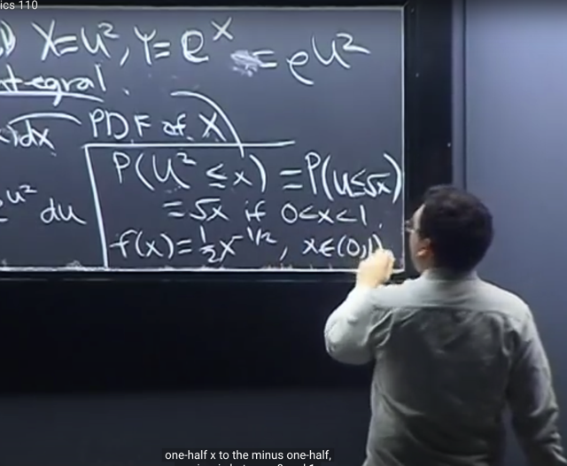</kbd></p>

> [!NOTE]
> Gs giải luôn **nếu làm theo cách 1**, ta cũng có thể **tìm PDF của X**:
>
> Ta sẽ bắt đầu với **CDF của X**, theo định nghĩa nó là **P(X ≤ x).** 
>
> Thay X `=` U^2 ta có **P(U^2 ≤ x)**
>
> Thế thì **vì U thuộc [0, 1]** nên **U không âm** nên 
>
> U^2 ≤ x ⇔ U ≤ √x
>
> Ta có thể lập luận rằng **hai event (U^2 ≤ c) và (U ≤ √x) là một** nên
> **P(U^2 ≤ x) `=` P(U ≤ √x)**
>
> Tiếp, với **U ~ Unif(0,1)** nên **P(U ≤ √x)** `=` **√x** **nếu 0 < x < 1** (để 0 < √x < 1) 
>
> Còn **nếu x > 1** thì **P(U ≤ x) `=` 1** và **x < 0** thì **P(U ≤ x) `=` 0)**
>
> Từ CDF, F(x), ta **lấy derivative** ta **sẽ có PDF f(x)**:
>
> `=>` f(x) `=` derivative của √x `=` **[x^(-1/2)]/2**
>
> Từ đó ta có thể thế vào cái tích phân: 
>
> `E(Y)` `=` `∫0:1` e^x f(x)dx

<br>

<a id="node-480"></a>

<p align="center"><kbd>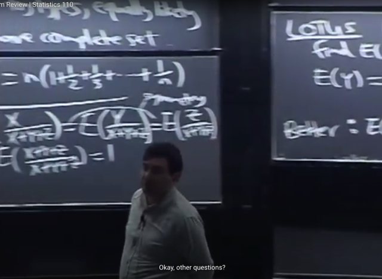</kbd></p>

> [!NOTE]
> gs: Để **tìm PDF** ta sẽ **tìm CDF trước**, **lấy derivative của CDF là có PDF**.
>
> Và **để tìm CDF** ta sẽ **dùng định nghĩa của nó** để mà **xây dựng lên**

<br>

<a id="node-481"></a>

<p align="center"><kbd>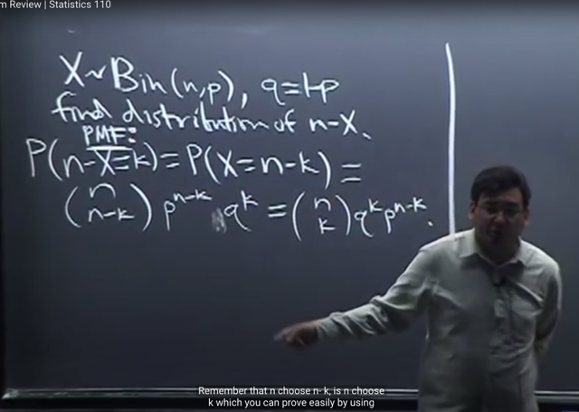</kbd></p>

🔗 **Related:** [-TÓM TẮT:   Bài toán Gambler's Ruin  - Random variable  - Bern(p) random variable  - Bin(n, p) random variable  - Định nghĩa của Distribution  - Công thức của PMF Bin (n, p)](_tóm_tắt_bài_toán_gamblers_ruin_random_variable_bernp_random_variable_binn_p_random_variable_định_ng.md#node-185)

🔗 **Related:** [LEC 2: STORY PROOFS, AXIOMS OF PROBABILITY](untitled.md#node-35)

> [!NOTE]
> Qua ví dụ này, cho **X ~ Binomial (n, p),** **cần tìm distribution** của **n-X**
>
> Thế thì vì đây là **discrete** r.v nên ta **có thể tìm CDF** hoặc **PMF**.
>
> Và như đã nói, **với discrete thì sẽ dễ hơn nếu ta làm việc với PMF**
> (còn continuous thì ta làm việc với CDF và lấy derivative để có PDF)
>
> Vậy thì **theo định nghĩa,** PMF của r.v X **là function theo k** mang ý 
> nghĩa nghĩa **P(X=k)**.
>
> Nên ở đây ta**cần tìm PMF của r,v là n-X**, nên ta cần tìm **P(n-X=k)**
>
> Thế thì vì **n-X `=` k** ⇔ **X `=` n-k**, nên **hai event này là một**, nên:
>
> **P(n-X=k) `=` P(X=n-k)**
>
> Tới đây ta có X ~ Bin(n, p) nên PMF của nó ta đã biết bữa trước:
>
> `P(X=k)` `=` **(n choose k) p^k `q(n-k)`
>
> ```text
> nên P(X=n-k) = (n choose n-k) p^(n-k) q(n-(n-k))
> ```
>
> `=` (n choose k) q^k `p(n-k)`
>
> `P(n-X=k)` `=` (n choose k) q^k p(n-k)**ở đây ta dùng một tính chất là **(n choose k) `=` (n choose n-k)** mà có thể story
> proof nhanh chóng là: Chọn cách chọn set k item từ n item không care thứ tự
> thì cũng là cách chọn set `(n-k)` các item còn lại.
>
> Và PMF này cho thấy `n-X` là một Bin(n, q)

<br>

<a id="node-482"></a>

<p align="center"><kbd>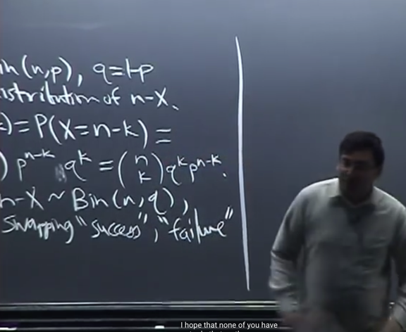</kbd></p>

<p align="center"><kbd></kbd></p>

<p align="center"><kbd>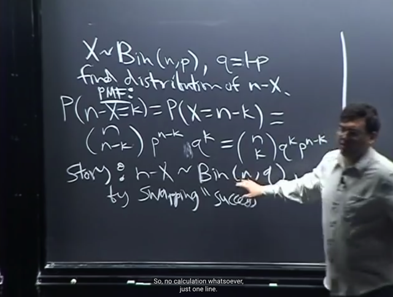</kbd></p>

> [!NOTE]
> Nhưng **thậm chí còn có thể làm nhanh hơn nữa** bằng cách **lập luận theo Story** (Story
> proof).
>
> Đó là như ta đã biết**theo định nghĩa của X~Bin(n, p)** có nghĩa là **X là số lần trial success**
> khi thực hiện **n i.i.d Bern(p) trials**.
>
> Vậy thì đương nhiên (**n-X) chính là số lần fail trong n Bern(p) trials**. Vậy nếu ta **đổi lại, gọi
> success thành fail, gọi fail thành success** thì **n-X chính là số lần success trong n Bern(q)
> trial**, bởi vì Bern(p) quy định xác suất success là p, xác suất fail là q thì khi đổi lại, gọi fail là
> success thì xác suất success là q
>
> Từ đó cho thể kết luận ngay **n-X ~ Bin(n, q)** mà khỏi **phải nói thêm gì** về PMF hay CDF vì nó
> đã cho biết `n-X` có distribution gì rồi. Còn khi**không có tên cụ thể thì mới phải tìm PMF/CDF**

<br>

<a id="node-483"></a>

<p align="center"><kbd>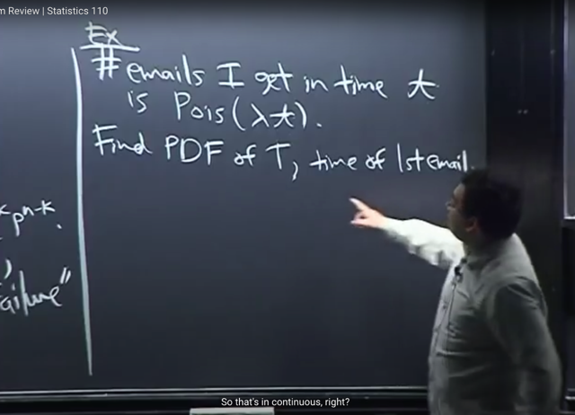</kbd></p>

🔗 **Related:** [LEC 24: GAMMA DISTRIBUTION & POISSON](untitled.md#node-754)

> [!NOTE]
> Ví dụ tiếp theo ta sẽ **gặp lại Poisson**. Cho biết **số email nhận được trong
> khoảng thời gian t** là một **random variable** ~ **Pois(λt)**Gs nói (**số email nhận được trong khoảng thời gian t**) dễ hiểu là một
> random variable vì ta không biết ví dụ trong 1 giờ thì nhận được bao nhiêu
> email, vì có lúc nhận nhiều có lúc nhận ít. Và đề bài cho biết r.v này ~
> Poisson(λt)
>
> Với **Poisson (λ)** ta **đã chứng minh rằng mean và variance của nó đều là
> λ**. Vậy ở đây**mean và variance của r.v #Số email** nhận được trong
> khoảng  thời gian t đều là **λt**
>
> Câu hỏi là **tìm PDF của T** `-` là**thời gian (chờ đợi cho đến khi) nhận được
> email đầu tiên**
>
> Gs lưu ý ta **#Số email** **nhận được trong thời gian t** là một **discrete**random  variable
>
> Nhưng **T là continuous r.v**. Nên đây là **bài toán connect giữa discrete và
> continuous**

> [!NOTE]
> Cho số email nhận được trong khoảng thời gian t là một Pois(λt) r.v Tìm
> PDF của T `=` thời gian chờ cho đến khi nhận được email đầu tiên

<br>

<a id="node-484"></a>

<p align="center"><kbd>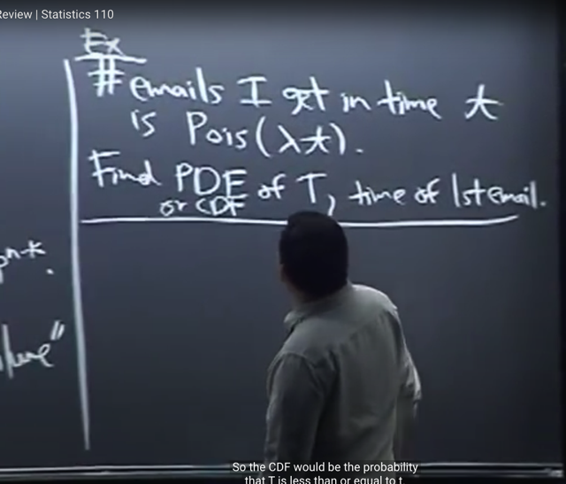</kbd></p>

> [!NOTE]
> Thế thì như**đã biết với continuous**, ta sẽ làm **theo cách tiếp cận hay làm**
> là **xây dựng CDF** sau đó**take derivative để có PDF**: `dF_X(t)/dt` `=` `f_X(t)`
> với `F_X(t)` `=` P(X ≤ t)
>
> Và **để xây dựng CDF**, ta sẽ **đi từ định nghĩa** của nó.
>
> Trong bài toán này, CDF của T là **P(T ≤ t)** mang ý nghĩa là **xác suất**của
> việc **[thời gian chờ nhận được email đầu tiên]** **≤ t**

<br>

<a id="node-485"></a>

<p align="center"><kbd>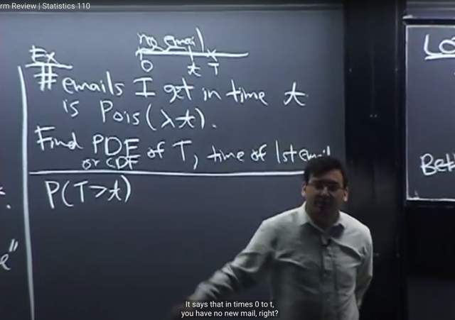</kbd></p>

> [!NOTE]
> Tiếp theo gs, đại khái là ta nên nhớ **khi làm việc, cần linh hoạt sử dụng
> complement**, vì **nhiều lúc** tính xác suất c**ủa complement của event dễ hơn**.
>
> Thì đây cũng vậy, ta sẽ **dùng COMPLEMENT của event (T ≤ t)** là**(T > t)** thì nếu
> tính được P(T > t) thì ta sẽ có **P(T ≤ t) `=` 1 `-` P(T > t)**
>
> Thế thì, event **(T > t)** mang ý nghĩa là, **[thời gian để nhận email đầu tiên] > t**, 
> đồng nghĩa với event trong **[khoảng thời từ 0 đến t thì không có email nào]
>
> Vậy T > t `=` [khoảng thời từ 0 đến t thì không có email nào]**⇨ **P(T > t) `=` P([khoảng thời từ 0 đến t thì không có email nào])**

<br>

<a id="node-486"></a>

<p align="center"><kbd>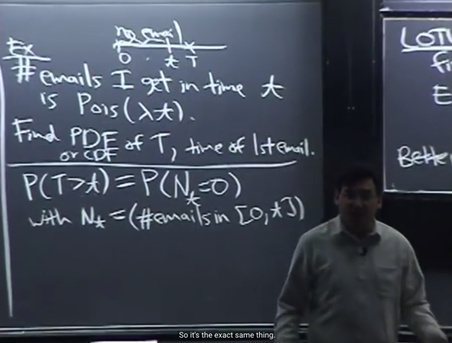</kbd></p>

> [!NOTE]
> Thế thì nếu gọi **Nt** là **số email nhận được trước khoảng thời gian t** (tức
> từ 0 đến t) thì event [t**rong khoảng thời gian từ 0 đến t không có email nào**]
> chính là, **tương đương** với event **[Nt `=` 0]**
>
> vậy **P(T > t) `=` P([khoảng thời từ 0 đến t thì không có email nào]) `=` P(Nt `=` 0)**

> [!NOTE]
> P(T > t) `=` P(Nt `=` 0)

<br>

<a id="node-487"></a>

<p align="center"><kbd>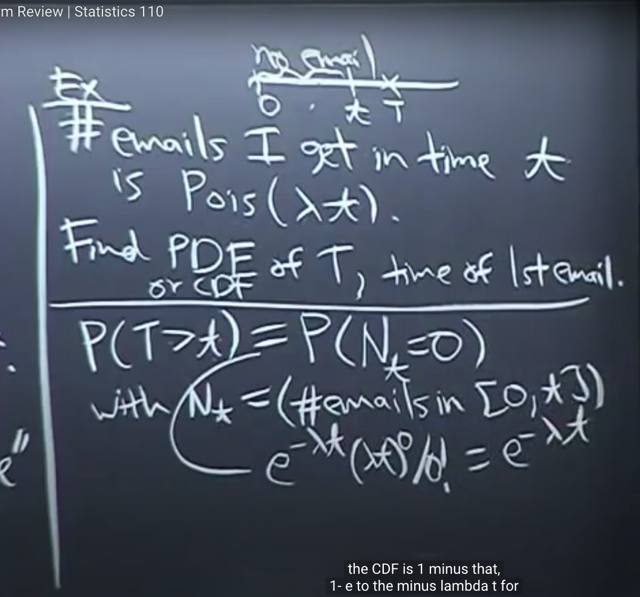</kbd></p>

> [!NOTE]
> Thế thì vì đầu bài cho biết **#số email nhận trong khỏang thời gian t** là
> Poisson (λt)
>
> Và vì ta kí hiệu **Nt** là **#số email nhận trong khỏang thời gian t**
>
> Nên **Nt ~ Pois(λt)**
> Với X~ Pois(λ) bài trước ta đã biết PMF của nó:
>
> `P(X=k)` `=` **e^(-λ) * λ^k * k!**Nên nay ta có **Nt ~ Pois(λt) `=>` P(Nt `=` 0) `=` `e^(-λt)` * (λt)^0 `/` 0!
>
> ```text
> = e^(-λt) * 1 / 1 = e^(-λt)
> ```
>
> Vậy `P(Nt=0)` `=` e^(-λt)**

<br>

<a id="node-488"></a>

<p align="center"><kbd>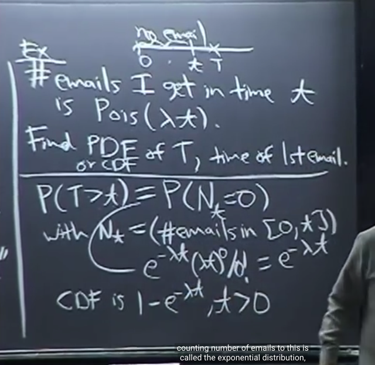</kbd></p>

> [!NOTE]
> Nên ta có CDF là
>
> P(T ≤ t) `=` 1 `-` **P(T > t)** `=` 1 `-` **P(Nt `=` 0)** `=` **1 `-` e^(-λt)**
>
> Và đó **chính là CDF**, theo định nghĩa P(T ≤ t)
>
> L**ấy derivative của nó, dùng chain rule, dễ** thấy ta có PDF: 
>
> f(t) `=` `(1-e^(-λ*t))'` `=`  **λ*e^(-λt)**
>
> Và gs nói đây chính là PDF của **Expo(λ)**, hay nói cách khác **T 
> chính là r.v ~ Exponential distributio**n mà ta sẽ học trong
> bài kế tiếp

> [!NOTE]
> ```text
> f(t) = (1-e^(-λ*t))' =  λ*e^(-λt)
> ```
>
> `=>` T (Thời gian chờ đến khi có email đầu tiên) là một
> Expo(λ) r.v

<br>

<a id="node-489"></a>

<p align="center"><kbd>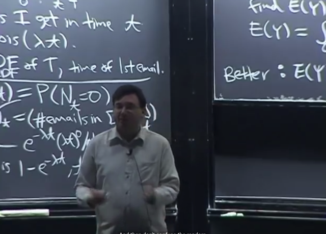</kbd></p>

> [!NOTE]
> Cuối cùng gs **dặn dò** rằng ta nên **phân biệt rõ** giữa **distribution** và **random
> variable**.
>
> **distribution** giống như **bản thiết kế của căn nhà**, quy định **giá trị xác suất**một
> **random variable mang một possible value** nào đó
>
> và từ**bản thiết kế có thể xây nhiều căn nhà**, tức là có **nhiều random variable
> tuân theo design đó.**

<br>

