# Lec 16: Exponential Distribution

📊 **Progress:** `31` Notes | `31` Screenshots

---

<a id="node-491"></a>
## Tóm Tắt:

> [!NOTE]
> TÓM TẮT:
>
> `-` Tiếp tục Expo(λ): PDF CỦA EXPO(λ): f(x) `=` λ `e^(-λx)` x > 0
>
> `-` Check tính valid của PDF của Expo
>
> ```text
> - CDF CỦA EXPO(λ) : F_X(x) = 1 - e^(-λx)
> ```
>
> `-` X ~ Expo(λ) thì  Y `=` λX thì Y sẽ ~ Expo(1)
>
> `-` Chứng minh rằng X ~ Expo(λ) thì  Y `=` λX thì Y sẽ ~ Expo(1)
>
> `-` EX OF EXPO(1) `=` 1
>
> `-` VARIANCE OF EXPO(1) `=` 1
>
> `-` X~EXPO(λ) thì `Y=` λX sẽ ~EXPO(1) 
>
> ```text
> EY = 1 ⇨ E(X) = E(Y/λ) = 1/λ EY = 1/λ
> ```
>
> VARIANCE OF EXPO(λ) `=` `1/λ^2`
>
> ```text
> Var(Y) = 1 ⇨ Var(X) = Var(Y/λ) = (1/λ^2) Var(Y) = (1/λ^2)
> ```
>
> Memoryless thể hiện bởi equation: P(X ≥ `s+t` | X ≥ s) `=` P(X ≥ t)
>
> chứng minh nếu X ~ Expo(λ) thì nó sẽ thỏa mãn Memoryless equation
>
>  P(X ≥ s), thì cái này gọi là Survivor function
>
> Survivor function với X~Expo(λ): P(X ≥ s) `=` `e^(-λs)`
>
> ```text
> -Nhờ tính chất Memoryless nên nếu X~Expo(λ) E(X|X > a) = a + 1 / λ
> ```

<br>

<a id="node-492"></a>

<p align="center"><kbd>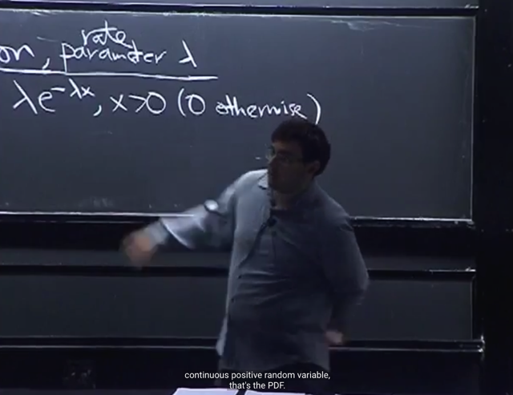</kbd></p>

<p align="center"><kbd></kbd></p>

<p align="center"><kbd>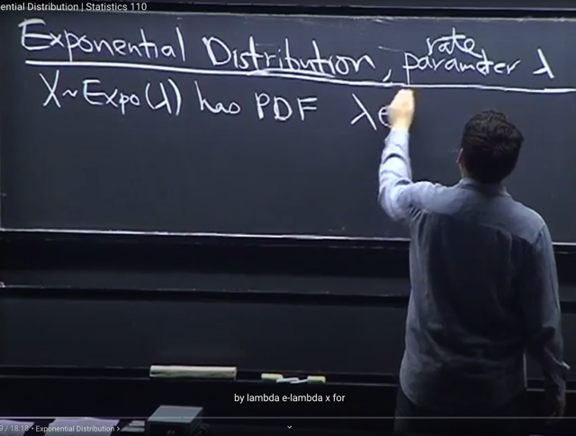</kbd></p>

🔗 **Related:** [TÓM TẮT:  - Tính MGF M(t) của Expo(1) = 1/(1-t) t < 1  - Khi đã có MGF, như bài trước ta đã biết các lí do mà MGF quan trọng trong đó có reason #1 đó là ta chỉ cần tính đạo hàm cấp n của nó sẽ cho ta n'th moment.  - Dù ta có thể tính đạo hàm nhiều lần để có 1st, 2nd moment nhưng có cách hay hơn. Bằng cách nhận ra 1/(1-t) liên quan đến Geometric series  a + ar + ar^2 = Tổng k=0:infinity a*r^k với |r| < 1 sẽ converge về a/[1-r]  Nên 1/1-t chính là Tổng n=0:infinity t^n với |t| < 1  Thế thì theo gs, từ đây cho phép ta KHỎI CẦN TÍNH ĐẠO HÀM CẤP N ĐỂ CÓ MOMENT THỨ N LÀM GÌ CHO MỆT, mà chỉ cần ĐỌC NÓ RA THÔI  Cụ thể là ta đã biết ở bài trước rằng, n'th moment = đạo hàm cấp n của M(t) (là coefficient của (t^n / n!) khi expand M(t) theo Taylor series tại 0)  Do đó, bằng cách tạo ra (t^n / n!) thì BẤT CỨ CÁI GÌ GẮN VỚI NÓ CHÍNH LÀ COEFFICIENT, VÀ CHÍNH LÀ N'TH MOMENT  Do đó ta sẽ nhân thêm n! và chia n! để có (t^n / n!). Như vậy cái lòi ra làm coefficient của t^n/n! ở đây là n! CHÍNH LÀ N'TH MOMENT.  Từ đó cho phép ta ĐỌC LUÔN RẰNG: 1ST MOMENT (EX) LÀ 1!, 2ND MOMENT E(X^2) LÀ 2!  N'TH MOMENT CỦA EXPO(1) E(X^n) = n!  -  đây là tính chất RẤT MẠNH CỦA MGF. Vì ví dụ như khi tính n'th moment (E[X^n]) thì nếu dùng LOTUS, ta phải TÍNH TÍCH PHÂN (INTEGRAL) VÀ CÓ THỂ GẶP NHỮNG TÍCH PHÂN RẤT PHỨC TẠP.  Trong khi đó, nếu ta có MGF, để có nth moment, ta CHỈ CẦN TÍNH DERIVATIVE MÀ DERIVATIVE THÌ THƯỜNG DỄ HƠN LÀ TÍNH TÍCH PHÂN  -Từ n'th moment của Expo(1) ta dễ dàng có n'th moment của Y ~ Expo(λ): E[Y^n] = n! / λ^n  - N'TH MOMENT CỦA N(0,1) VỚI N LẺ ĐỀU BẰNG 0  - MGF CỦA POIS(λ) = e^[λ(e^t-1)]  - Nếu Y ~ Pois(µ) và X~Pois(λ) và biết X, Y INDEPENDENT thì X+Y ~ Pois(λ+µ)](tóm_tắt_tính_mgf_mt_của_expo1_11_t_t_1_khi_đã_có_mgf_như_bài_trước_ta_đã_biết_các_lí_do_mà_mgf_quan_.md#node-566)

> [!NOTE]
> Bài này ta sẽ làm quen thêm **một trong những distribution quan trọng nhất** nữa là **Exponential**
> **distribution**. Nó có một parameters là **λ**, mang ý nghĩa là rate.
>
> PDF của nó là f(x) `=` **λ e^(-λx)** với **x dương**, còn **nếu x ≤ 0 thì f(x) `=` 0**
>
> Đương nhiên **λ phải dương** vì
>
> i) Nếu λ âm pdf sẽ âm, vi phạm yêu cầu PDF không âm.
>
> ii) Còn λ `=` 0 thì PDF `=` 0, vi phạm yêu cầu tích phân toàn miền pdf  `=` 1

> [!NOTE]
> Một trong những distribution quan trọng nhất nữa là Exponential
> distribution. Nó có một parameters là λ, mang ý nghĩa là rate.
>
> PDF của nó là f(x) `=` λ `e^(-λx)` với x dương, còn nếu x ≤ 0 thì f(x) `=` 0

<br>

<a id="node-493"></a>

<p align="center"><kbd>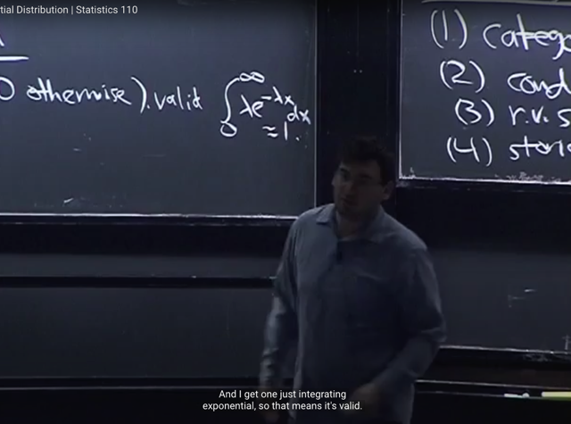</kbd></p>

> [!NOTE]
> Đầu tiên là ta có thể **check tính valid của PDF** này. Còn nhớ yêu cầu cho một
> PDF valid là **không âm** và **tích phân từ `-infinity` đến infinity f(x)dx** **phải bằng 1**
>
> Thì với trường hợp này, f(x) bằng 0 khi x ≤ 0 nên 
>
> tích phân từ **-infinity đến infinity f(x)dx** `=` tích phân từ **0 đến inf f(x)dx** `=` 
>
> `∫0:inf` `λe^(-λx)dx` (1)
>
> Theo **FTC part 1** tích phân trên bằng **g(infinity) `-` g(0)** với g là **nguyên hàm** 
> `(anti-derivative)` của f(x) `=` λ `e^(-λx)`
>
> Cho **g(x) `=` -e^(-λx)** kiểm tra xem nó có phải là nguyên hàm của f(x) không
>
> lấy derivative `dg(x)/dx,` dựa vào chain rule 
>
> ```text
> = - [d e^(-λx) / d (-λx)] * [d (-λx) / dx]
> ```
>
> `=` `-` `[e^(-λx)]` * `(-λ)` `=` **λ*e^(-λ*x)** `=` **f(x)**
>
> Vậy g(x) `=` **-e^(-λx)** là **nguyên hàm của f(x)** nên
>
> Vậy (1) `=` `-e^(-λ*infinity)` `-` `[-e^(-λ*0)]` `=` `-` 0 `+` e^0 `=` **1**

<br>

<a id="node-494"></a>

<p align="center"><kbd>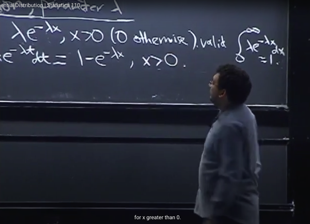</kbd></p>

<p align="center"><kbd></kbd></p>

<p align="center"><kbd></kbd></p>

> [!NOTE]
> Tiếp ta sẽ tìm CDF, ta đã biết khi**tích phân `-infinity` đến x của f(t)dt** thì ta sẽ có CDF F(x)
>
> Vậy, **vì f(x) `=` 0 khi x `<=` 0** nên tích phân trên **chỉ cần tính từ 0 đến x**
>
> Thử tính **tích phân từ 0 đến x: `∫0:x` λe^(-λt)dt**
>
> Tương tự như vừa rồi, **áp dụng FTC part 1** tích phân này sẽ bằng 
>
> g(x) `-` g(0) với g(x) là nguyên hàm của f(x) `=` **-e^(-λx)**
>
> ```text
> => g(x) - g(0) = -e^(-λx) - [-e^(-λ0)]
> ```
>
> `=` `-e^(-λx)` `-` `[-e^(0)]` `=` `=` `-e^(-λx)` `+` 1  `=` **1 `-` e^(-λx)**

> [!NOTE]
> ```text
> CDF CỦA EXPO(λ) : F_X(x) = 1 - e^(-λx)
> ```

<br>

<a id="node-495"></a>

<p align="center"><kbd>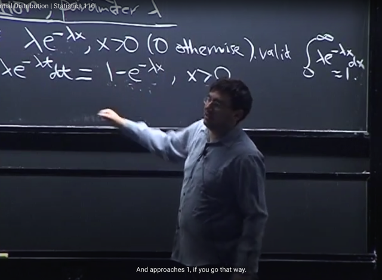</kbd></p>

🔗 **Related:** [TÓM TẮT:  Tiếp tục về CDF: Định nghĩa của CDF  Bước nhảy của CDFD là giá trị PMF tại đó  Tính chất của CDF: 1) Non decreasing, 2) right continuous và   3) F(x) -> 0 khi x -> -infinity, F(x) -> 1 khi x -> -infinity  - Định nghĩa Independent random variables theo independent event:  X, Y độc lập khi  + Continuous rv: P(X≤x, Y≤y) = P(X≤x) * P(Y≤y) với mọi x, y   + Discrete rv: P(X=x,Y=y) = P(X=x)*P(Y=y)  - Expected value: Là con số tóm tắt distribution của r.v  - Hai cách tính average  - E(X) = Σx x*P(X=x)  - X ~ Bern(p) thì E(X) = p  - FUNDAMENTAL BRIDGE: E(X) = P(A), X là indicator rv mang giá trị = 1 khi event A xảy ra và 0 khi ngược lại  - X ~ Bin(n, p):  E(X) = ∑ k=0,1..n [ k * (n choose k)*p^k*q^(n-k)] = ..= np  - TÍNH LINEARITY CỦA AVERAGE  - Tính lại E(X) của Bin(n, p) nhanh hơn bằng linearity, fundamental bridge và E(X) của Bern(p)  - TÍnh E(X) của Hypergeometric Dù các trial không độc lập nhưng dùng Symmetry, linearity, fundamental bridge vẫn tính được  - X ~ Geom(p): P(X=k) = q^k*p  - E(X) = p Σ k=0:infinity [k * q^k]](tóm_tắt_tiếp_tục_về_cdf_định_nghĩa_của_cdf_bước_nhảy_của_cdfd_là_giá_trị_pmf_tại_đó_tính_chất_của_cd.md#node-229)

> [!NOTE]
> gs: Tiếp, ta có thể **check các điều kiện của CDF** như**lim của nó khi `x->` infinity** =**1**
>
> và **lim của nó khi `x->` -infinity** (hoặc 0) `=` **0**
>
> lim `x->` infinity (1 `-` `e^(-λx))` `=` 1 `-` `e^(-λ*infinity)` `=` `1-0` `=` **1**
>
> lim `x->` 0 (1 `-` `e^(-λx))` `=`  1 `-` `e^(-λ*0)` `=` `1-1` `=` **0**

<br>

<a id="node-496"></a>

<p align="center"><kbd>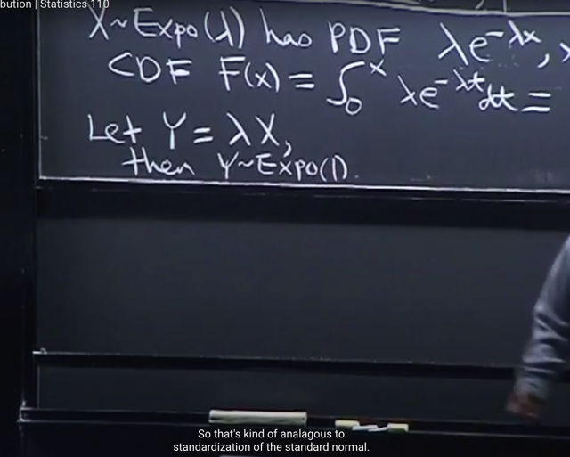</kbd></p>

🔗 **Related:** [TÓM TẮT:  - Tính MGF M(t) của Expo(1) = 1/(1-t) t < 1  - Khi đã có MGF, như bài trước ta đã biết các lí do mà MGF quan trọng trong đó có reason #1 đó là ta chỉ cần tính đạo hàm cấp n của nó sẽ cho ta n'th moment.  - Dù ta có thể tính đạo hàm nhiều lần để có 1st, 2nd moment nhưng có cách hay hơn. Bằng cách nhận ra 1/(1-t) liên quan đến Geometric series  a + ar + ar^2 = Tổng k=0:infinity a*r^k với |r| < 1 sẽ converge về a/[1-r]  Nên 1/1-t chính là Tổng n=0:infinity t^n với |t| < 1  Thế thì theo gs, từ đây cho phép ta KHỎI CẦN TÍNH ĐẠO HÀM CẤP N ĐỂ CÓ MOMENT THỨ N LÀM GÌ CHO MỆT, mà chỉ cần ĐỌC NÓ RA THÔI  Cụ thể là ta đã biết ở bài trước rằng, n'th moment = đạo hàm cấp n của M(t) (là coefficient của (t^n / n!) khi expand M(t) theo Taylor series tại 0)  Do đó, bằng cách tạo ra (t^n / n!) thì BẤT CỨ CÁI GÌ GẮN VỚI NÓ CHÍNH LÀ COEFFICIENT, VÀ CHÍNH LÀ N'TH MOMENT  Do đó ta sẽ nhân thêm n! và chia n! để có (t^n / n!). Như vậy cái lòi ra làm coefficient của t^n/n! ở đây là n! CHÍNH LÀ N'TH MOMENT.  Từ đó cho phép ta ĐỌC LUÔN RẰNG: 1ST MOMENT (EX) LÀ 1!, 2ND MOMENT E(X^2) LÀ 2!  N'TH MOMENT CỦA EXPO(1) E(X^n) = n!  -  đây là tính chất RẤT MẠNH CỦA MGF. Vì ví dụ như khi tính n'th moment (E[X^n]) thì nếu dùng LOTUS, ta phải TÍNH TÍCH PHÂN (INTEGRAL) VÀ CÓ THỂ GẶP NHỮNG TÍCH PHÂN RẤT PHỨC TẠP.  Trong khi đó, nếu ta có MGF, để có nth moment, ta CHỈ CẦN TÍNH DERIVATIVE MÀ DERIVATIVE THÌ THƯỜNG DỄ HƠN LÀ TÍNH TÍCH PHÂN  -Từ n'th moment của Expo(1) ta dễ dàng có n'th moment của Y ~ Expo(λ): E[Y^n] = n! / λ^n  - N'TH MOMENT CỦA N(0,1) VỚI N LẺ ĐỀU BẰNG 0  - MGF CỦA POIS(λ) = e^[λ(e^t-1)]  - Nếu Y ~ Pois(µ) và X~Pois(λ) và biết X, Y INDEPENDENT thì X+Y ~ Pois(λ+µ)](tóm_tắt_tính_mgf_mt_của_expo1_11_t_t_1_khi_đã_có_mgf_như_bài_trước_ta_đã_biết_các_lí_do_mà_mgf_quan_.md#node-563)

> [!NOTE]
> Gs nói về việc tương tự như trong**Normal distribution**, ta có thể
> **standardization** để **đưa X ~ `N(μ,` σ)** về **Z ~ N(0, 1)** bằng cách 
> ```text
> đặt Z = (X - μ) / σ
> ```
>
> Thì với X ~ Expo(λ) ta **cũng có thể làm tương tự** vậy
>
> Đó là nếu set**Y `=` λ*X** thì **Y sẽ ~ Expo(1)**

> [!NOTE]
> X ~ Expo(λ) thì  Y `=` λX thì Y sẽ ~ Expo(1)

<br>

<a id="node-497"></a>

<p align="center"><kbd>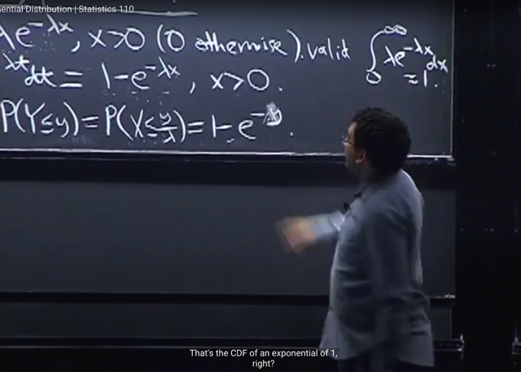</kbd></p>

🔗 **Related:** [TÓM TẮT:  - Tính MGF M(t) của Expo(1) = 1/(1-t) t < 1  - Khi đã có MGF, như bài trước ta đã biết các lí do mà MGF quan trọng trong đó có reason #1 đó là ta chỉ cần tính đạo hàm cấp n của nó sẽ cho ta n'th moment.  - Dù ta có thể tính đạo hàm nhiều lần để có 1st, 2nd moment nhưng có cách hay hơn. Bằng cách nhận ra 1/(1-t) liên quan đến Geometric series  a + ar + ar^2 = Tổng k=0:infinity a*r^k với |r| < 1 sẽ converge về a/[1-r]  Nên 1/1-t chính là Tổng n=0:infinity t^n với |t| < 1  Thế thì theo gs, từ đây cho phép ta KHỎI CẦN TÍNH ĐẠO HÀM CẤP N ĐỂ CÓ MOMENT THỨ N LÀM GÌ CHO MỆT, mà chỉ cần ĐỌC NÓ RA THÔI  Cụ thể là ta đã biết ở bài trước rằng, n'th moment = đạo hàm cấp n của M(t) (là coefficient của (t^n / n!) khi expand M(t) theo Taylor series tại 0)  Do đó, bằng cách tạo ra (t^n / n!) thì BẤT CỨ CÁI GÌ GẮN VỚI NÓ CHÍNH LÀ COEFFICIENT, VÀ CHÍNH LÀ N'TH MOMENT  Do đó ta sẽ nhân thêm n! và chia n! để có (t^n / n!). Như vậy cái lòi ra làm coefficient của t^n/n! ở đây là n! CHÍNH LÀ N'TH MOMENT.  Từ đó cho phép ta ĐỌC LUÔN RẰNG: 1ST MOMENT (EX) LÀ 1!, 2ND MOMENT E(X^2) LÀ 2!  N'TH MOMENT CỦA EXPO(1) E(X^n) = n!  -  đây là tính chất RẤT MẠNH CỦA MGF. Vì ví dụ như khi tính n'th moment (E[X^n]) thì nếu dùng LOTUS, ta phải TÍNH TÍCH PHÂN (INTEGRAL) VÀ CÓ THỂ GẶP NHỮNG TÍCH PHÂN RẤT PHỨC TẠP.  Trong khi đó, nếu ta có MGF, để có nth moment, ta CHỈ CẦN TÍNH DERIVATIVE MÀ DERIVATIVE THÌ THƯỜNG DỄ HƠN LÀ TÍNH TÍCH PHÂN  -Từ n'th moment của Expo(1) ta dễ dàng có n'th moment của Y ~ Expo(λ): E[Y^n] = n! / λ^n  - N'TH MOMENT CỦA N(0,1) VỚI N LẺ ĐỀU BẰNG 0  - MGF CỦA POIS(λ) = e^[λ(e^t-1)]  - Nếu Y ~ Pois(µ) và X~Pois(λ) và biết X, Y INDEPENDENT thì X+Y ~ Pois(λ+µ)](tóm_tắt_tính_mgf_mt_của_expo1_11_t_t_1_khi_đã_có_mgf_như_bài_trước_ta_đã_biết_các_lí_do_mà_mgf_quan_.md#node-563)

> [!NOTE]
> Ta sẽ **chứng minh rằng Y ~ Expo(1)**:
>
> Đầu tiên, n**hư thường lệ**, ta đã nghe gs nó ở các bài trước là khi muốn
> tìm distribution của  một discrete r.v ta sẽ thường tìm PMF (CDF cũng được
> nhưng ý là thường tìm PMF dễ hơn) còn với continuous r.v ta sẽ xây dựng
> CDF từ định nghĩa và có CDF thì take derivative để có PDF.
>
> Do đó, ta sẽ**bắt đầu từ CDF,** với định nghĩa của nó:
>
> **P(Y ≤ y)**
>
> Thế thì **xét event Y ≤ y**. Thay **Y `=` λX** ta có Y ≤ y ⇔ λX ≤ y ⇔ X ≤ `y/λ`
>
> nên **P(Y ≤ y) `=` P(X ≤ y/λ)**  (các event bằng nhau, nên xác suất bằng nhau)
>
> (X ≤ `y/λ` là subset của original sample space, `=` {s ∈ S: X(s) ≤ `y/λ}.`  Thế thì, 
> ```text
> Y = λX ⇨ {s ∈ S: X(s) ≤ y/λ} =  {s ∈ S: λX(s) ≤ y/} =  {s ∈ S: Y(s) ≤ y} và đây
> ```
> chính là event Y ≤ y)
>
> Và vì **X~Expo(λ)**, nên theo ý nghĩa của **CDF của X** chính là **P(X ≤ x).**Và ta có **P(X ≤ x) `=` 1 `-` e^(-λx)**vậy P(X ≤ `y/λ)` `=` 1 `-` `e^(-λy/λ)`
>
> `=>` P(Y ≤ y) `=` 1 `-` `e^(-λy/λ)` `=` **1 `-` e^(-y)**
>
> `=` 1 `-` `e^-y` chính là 1 `-` e^-**1**y và**đây chính là CDF của Expo(1)
>
> Từ đó, dựa trên việc CDF có thể dùng để chứng minh distribution
> thì có thể coi như chứng minh xong Y ~ Expo(1)**(vì ta đã chứng minh CDF của X~Expo(λ) là 1 `-` `e^(-λ*x)` nên CDF của
> X~Expo(1) là 1 `-` `e^(-1*x)`

> [!NOTE]
> Chứng minh rằng Y ~ Expo(1)

<br>

<a id="node-498"></a>

<p align="center"><kbd>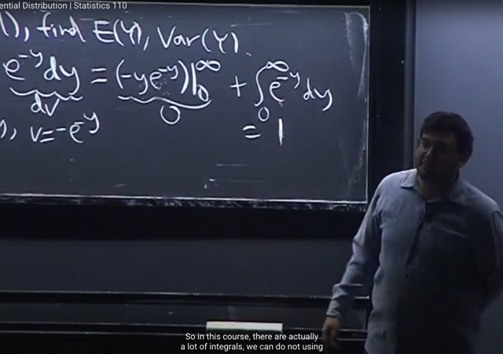</kbd></p>

<p align="center"><kbd></kbd></p>

<p align="center"><kbd>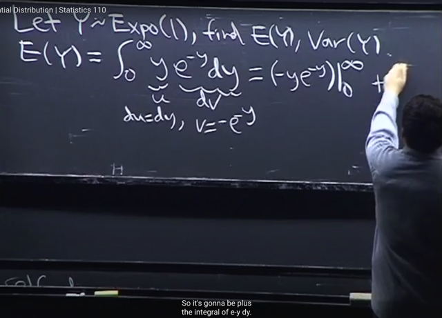</kbd></p>

> [!NOTE]
> Ta sẽ đi tính **mean** và **variance** của Y. Theo định nghĩa **expected** value của **continuous** random variable, 
>
> EY `=` **∫**-infinity: infinity **y * f(y)dy** `=` `∫-infinity` : infinity **y * e^(-y)**dy
>
> (y~Expo(1) nên PDF `f_Y(y)` `=` `e^(-y))`
>
> Ta sẽ dùng **Integration by Part,** đặt **u(y) `=` y**, **dv `=` e^(-y)dy**(bước này chính là dựa trên **định nghĩa của nguyên hàm**, nói rằng khi ta có **f'(x) `=` g(x)** thì f(x) `=` ∫**g(x**)dx 
>
> Ở đây **dv `=` e^(-y)dy**chính là đồng nghĩa **v'(y) `=` g(y)** **(=e^-y)** nên**v(y)** `=` **∫g(y)dy** `=` **∫e^(-y)dy**. 
>
> Và kết quả này sẽ là **-e^(-y)**. Nhắc lại đây chỉ cần dùng định nghĩa của nguyên hàm hay còn gọi là tích
> ```text
> phân không xác đinh (infinite integral) đó là: Nếu dF(x)/dx = f(x) ⇨ F(x) = ∫f(x)dx
> ```
>
> ```text
> dv = e^(-y)dy ⇨  v = -e^(-y) (chỉ cần giải thích đơn giản là vì d/dy v = d/dy -e^-y = e^-y nên theo định nghĩa
> ```
> nguyên hàm ta có v `=` `-e^y)`
>
> Từ đó t**heorem tích phân từng phần (again, sẽ học chính thức trong 1801)** cho phép tính tích phân trên 
>
> `=` u(y)v(y) | 0:infinity `+` tích phân từ 0 đến infinity u'(y)v(y)dy
>
> ```text
> = y * -e^(-y) | 0:infinity - tích phân từ 0 đến infinity 1*-e^(-y)dy
> ```
>
> ```text
> = y * -e^(-y) | 0:infinity + tích phân từ 0 đến infinity e^(-y)dy
> ```
>
> ```text
> i)  y * -e^(-y) | 0:infinity = [infinity * -e^(-infinity)] - [0 * -e^(-0)] = 0
> ```
>
> ii) tích phân từ 0 đến infinity `1*-e^(-y)dy` `=` 1 có thể giải thích theo hai cách:
>
> ```text
> 1) Dùng FTC Part 2, ta có thể dễ dàng tính ra tích phân này = -e^(-y) | 0:infinity (với -e^(-y) là nguyên
> ```
> ```text
> hàm của -e^(-y))  = -e^-infinity - (- e^0) = 0 + 1 = 1
> ```
>
> 2) Lập luận hay hơn nữa đó là **e^(-y) CHÍNH LÀ PDF CỦA EXPO(1), NÊN: 
>
> tích phân từ 0 đến infinity `e^(-y)dy` ĐƯƠNG NHIÊN PHẢI BẰNG 1 VÌ ĐÂY LÀ ĐIỀU KIỆN BẮT BUỘC
> CỦA MỘT VALID PDF**

> [!NOTE]
> Quay lại nói thêm về Integration
> by part sau 1801

> [!NOTE]
> EX OF EXPO(1) `=` 1

<br>

<a id="node-499"></a>

<p align="center"><kbd>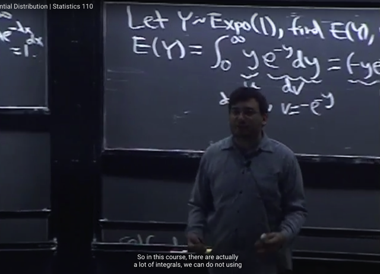</kbd></p>

> [!NOTE]
> Và gs cho rằng trong class này ta sẽ dùng**rất nhiều integral** và một kĩ năng
> nên có là **nhận diện được PDF** của**các distribution quen thuộc** thì ta **có thể
> đi đến các kết quả như vầy** mà k**hông cần phải tính tích phân**

<br>

<a id="node-500"></a>

<p align="center"><kbd>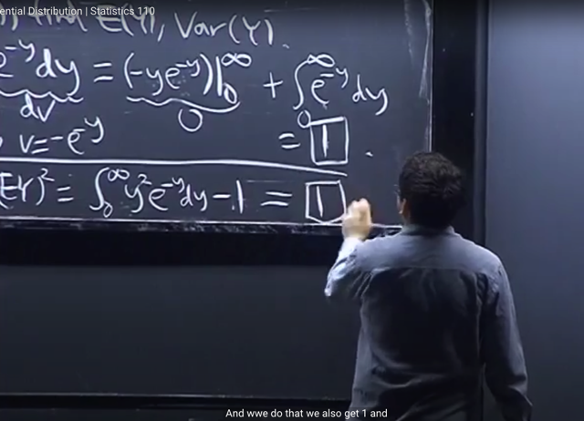</kbd></p>

> [!NOTE]
> Tiếp theo là **Var(Y)**như đã biết, theo công thức (dạng thứ 2): **E(Y^2) `-` (EY)^2**
>
> Dựa vào **LOTUS** tính `E(Y^2)` `=` tích phân từ `-infinity` tới infinity **y^2** * **e^(-y)dy** (1)
>
> Và (EY)^2 `=` 1^2 =**1**
>
> Thế thì gs nói để tính tích phân trên ta **lại dùng Integration by Part**sẽ tính ra 1
>
> Ta thử tính (1):
>
> ```text
> Đặt u = y^2 , dv = e^(-y)dy => v = -e^(-y)
> ```
>
> Theo integration by part, (1) `=` uv|a:b `-` tích phân a:b uv'dy
>
> ```text
> = y^2*[ -e^(-y)] | 0:infinity - tích phân 0:infinity 2y(-e^(-y))dy
> ```
>
> *Xét vế đầu: `y^2*[-e^(-y)]` | 0:inf, để tính cái này, ta sẽ**tìm limit** của nó ở **infinity** (tức
> là `y->infinity,` **trừ đi limit** của nó **ở 0** `(y->0).`
>
> lim `y^2*[-e^(-y)]` khi `y->inf,` thì **khi `y->inf,` y^2 cũng đi tới infinity**. Còn `-e^-y` `->` **-e^-inf `->` 0**
> Nhưng **-e^-inf sẽ đi đến 0 nhanh hơn là y^2 đi đến infinity**. Do đó **tích của chúng sẽ
> đi đến 0**.
>
> ```text
> lim y^2*[-e^(-y)] khi y->0 sẽ bằng 0^2*(-e^0) = 0*-1 = 0
> ```
>
> ```text
> Nên y^2*[ -e^(-y)] | 0:infinity = 0 - 0 = 0
> ```
>
> `====`
>
> (vậy tiếp tục)
>
> ```text
> = 0 - tích phân 0:infinity 2y(-e^(-y))dy = 0 - tích phân 0:infinity 2y(-e^(-y))dy
> ```
>
> Xét: tích phân 0:infinity `2y(-e^(-y))dy,` **dùng Integration by Part lần nữa**:
>
> ```text
> Đặt u = 2y => u' = 2, dv = -e^(-y)dy => v = e^(-y)
> ```
>
> ```text
> tích phân 0:infinity 2y(-e^(-y))dy = 2ye^(-y)|0:infinity - tích phân 0:infinity của 2*e^(-y)dy
> ```
>
> *Xét `2y*e^(-y)|0:infinity,` nó bằng 0, tương tự như khi xét `y^2*[-e^(-y)]` | 0:inf. Đại khái
> cũng là **khi y->inf** thì **e^-y `->` `e^-inf` `=` 0** **nhanh hơn** là **y->inf**, nên **tích đó sẽ `->` 0**. Còn
> khi `y->0` thì limit của tích này bằng 0 rồi.
>
> ```text
> = 0 - tích phân 0:infinity của 2 e^(-y)dy = tích phân 0:infinity của 2*e^(-y)dy
> ```
>
> Dùng FTC part 2, nguyên hàm của `2*e^(-y)` là `-2e^(-y):`
>
> tích phân này sẽ bằng: `-2e^(-y)` | 0:infinity `=` 0 `-` `-2e^(-0)` `=` 0 `-` `(-` 2) `=` **2
>
> Vậy `E(Y^2)` `-` (EY)^2 `=` 2 `-` 1 `=` 1**

> [!NOTE]
> VARIANCE OF EXPO(1) `=` 1

<br>

<a id="node-501"></a>

<p align="center"><kbd>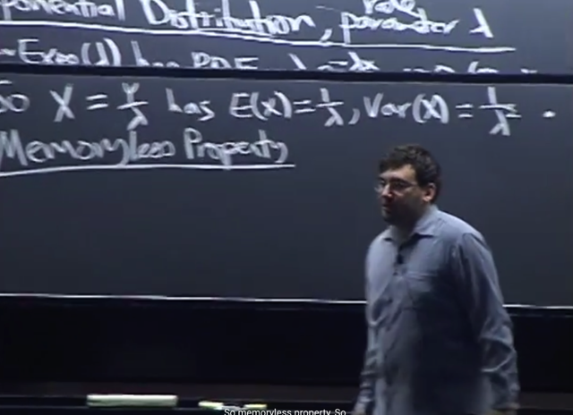</kbd></p>

🔗 **Related:** [TÓM TẮT:  - Tính MGF M(t) của Expo(1) = 1/(1-t) t < 1  - Khi đã có MGF, như bài trước ta đã biết các lí do mà MGF quan trọng trong đó có reason #1 đó là ta chỉ cần tính đạo hàm cấp n của nó sẽ cho ta n'th moment.  - Dù ta có thể tính đạo hàm nhiều lần để có 1st, 2nd moment nhưng có cách hay hơn. Bằng cách nhận ra 1/(1-t) liên quan đến Geometric series  a + ar + ar^2 = Tổng k=0:infinity a*r^k với |r| < 1 sẽ converge về a/[1-r]  Nên 1/1-t chính là Tổng n=0:infinity t^n với |t| < 1  Thế thì theo gs, từ đây cho phép ta KHỎI CẦN TÍNH ĐẠO HÀM CẤP N ĐỂ CÓ MOMENT THỨ N LÀM GÌ CHO MỆT, mà chỉ cần ĐỌC NÓ RA THÔI  Cụ thể là ta đã biết ở bài trước rằng, n'th moment = đạo hàm cấp n của M(t) (là coefficient của (t^n / n!) khi expand M(t) theo Taylor series tại 0)  Do đó, bằng cách tạo ra (t^n / n!) thì BẤT CỨ CÁI GÌ GẮN VỚI NÓ CHÍNH LÀ COEFFICIENT, VÀ CHÍNH LÀ N'TH MOMENT  Do đó ta sẽ nhân thêm n! và chia n! để có (t^n / n!). Như vậy cái lòi ra làm coefficient của t^n/n! ở đây là n! CHÍNH LÀ N'TH MOMENT.  Từ đó cho phép ta ĐỌC LUÔN RẰNG: 1ST MOMENT (EX) LÀ 1!, 2ND MOMENT E(X^2) LÀ 2!  N'TH MOMENT CỦA EXPO(1) E(X^n) = n!  -  đây là tính chất RẤT MẠNH CỦA MGF. Vì ví dụ như khi tính n'th moment (E[X^n]) thì nếu dùng LOTUS, ta phải TÍNH TÍCH PHÂN (INTEGRAL) VÀ CÓ THỂ GẶP NHỮNG TÍCH PHÂN RẤT PHỨC TẠP.  Trong khi đó, nếu ta có MGF, để có nth moment, ta CHỈ CẦN TÍNH DERIVATIVE MÀ DERIVATIVE THÌ THƯỜNG DỄ HƠN LÀ TÍNH TÍCH PHÂN  -Từ n'th moment của Expo(1) ta dễ dàng có n'th moment của Y ~ Expo(λ): E[Y^n] = n! / λ^n  - N'TH MOMENT CỦA N(0,1) VỚI N LẺ ĐỀU BẰNG 0  - MGF CỦA POIS(λ) = e^[λ(e^t-1)]  - Nếu Y ~ Pois(µ) và X~Pois(λ) và biết X, Y INDEPENDENT thì X+Y ~ Pois(λ+µ)](tóm_tắt_tính_mgf_mt_của_expo1_11_t_t_1_khi_đã_có_mgf_như_bài_trước_ta_đã_biết_các_lí_do_mà_mgf_quan_.md#node-573)

🔗 **Related:** [-TÓM TẮT:   Z^(số lẻ), ta luôn có E(Z^(số lẻ) = 0, gọi là ODD MOMENT  - Symmetry còn giúp ta kết luận (nếu Z ~ N(0,1) thì -Z cũng là một N(0,1)  - X = μ + σZ sẽ ~ N(μ, σ^2)  - Sẽ tốt hơn nếu ta hiểu Standard Normal Z ~ N(0,1) trước, sau đó hiểu rằng khi scale và shift Z với σ và μ khác nhau thì ta sẽ có bất kì một Normal distribution N(μ, σ^2) nào  - PROPERTIES CỦA VAR(X):  + Var(X + c) = Var(X)  + Var(cX) = c^2*Var(X)  + Var(X) luôn không âm, và nó chỉ bằng 0 nếu X là constant  + Variance KHÔNG CÓ TÍNH LINEARITY:  + Var(X+Y) không bằng Var(X) + Var(Y) TRỪ KHI X, Y INDEPENDENT  X không i.i.d với chính nó X, mà nó EXTREMELY DEPENDENT với chính nó. Do đó bất cứ khi nào ta ÁP DỤNG CÔNG  THỨC NÀO ĐÓ MÀ CẦN CÁC RANDOM VARIABLE CÓ X1, X2 CÓ  TÍNH I.I.D VÀO X VÀ CHÍNH NÓ THÌ ĐỀU LÀ SAI  - CHỨNG MINH VAR X N(μ, σ) = σ^2  - Z = (X - μ) / σ và gs cho biết nó được gọi là STANDARDIZATION (chuẩn hóa)  Giúp từ NORMAL X ~ N(μ, σ) ta có STANDARD NORMAL Z ~ N(0,1)  - Xây dựng PDF của N(μ, σ^2) từ N(0, 1):  fX(x) = 1/(σ√2π) * [e^(-((x-μ)/σ)^2/2)]  - Nếu X ~ N(μ, σ^2) thì -X ~ N(-μ, σ^2  - Nếu X1 ~ N(μ1, σ1^2), X2 ~ N(μ2, σ2^2) và X1, X2 independent thì:  X1 + X2 ~ N(μ1 + μ2, σ1^2 + σ2^2)  X1 - X2 ~ N(μ1 - μ2, σ1^2 + σ2^2)  - 68-95-99.7 rule  - Chứng minh 0^k / k! + 1^k / k! + 2^k / k! + .... = e^k  ⇨ Tổng k=0,1...infinity λ^k/k! = e^λ  - Tìm variance của Poisson (λ) để chứng minh nó có MEAN VÀ VARIANCE ĐỀU LÀ λ  - Khi standardize, ví dụ đơn vị là km, thì (x - μ) / σ sẽ  (km - km) / km = km / km = 1 TỨC Ý NÓI LÀ KHÔNG CÒN CARE ĐƠN VỊ LÀ GÌ NỮA  - X~Bin(n,p), Var(X) = npq (q = 1-p)  - Chứng minh LOTIS](_tóm_tắt_zsố_lẻ_ta_luôn_có_ezsố_lẻ_0_gọi_là_odd_moment_symmetry_còn_giúp_ta_kết_luận_nếu_z_n01_thì_z.md#node-426)

> [!NOTE]
> Vậy là ta đã tính xong **mean** và **variance** của **Expo(1)** ta có thể tính mean và
> variance của general **Expo(λ)**
>
> ```text
> Y = λ*X => X = Y/λ
> ```
>
> EX `=` `E(Y/λ)` `=` `E(Y*(1/λ)).` Theo tính **linearity** **EcX `=` cEX** mà ta đã
> biết nên**E(Y*(1/λ)) `=` `(EY)/λ` `=` 1/λ**Var(X) `=` `Var(Y/λ)` `=` `Var(Y*(1/λ)).`
>
> Bữa trước ta đã chứng minh trong phần **tính chất của Variance**: **Var(cX) `=`
> c^2Var(X)**
>
> Vậy `Var(X)` `=` `Var(Y*(1/λ))` `=` `Var(Y)` `/` λ^2 `=` **1/λ^2**

> [!NOTE]
> X~EXPO(λ) thì `Y=` λX sẽ ~EXPO(1) 
>
> ```text
> EY = 1 => E(X) = E(Y/λ) = 1/λ EY = 1/λ
> ```
>
> VARIANCE OF EXPO(λ) `=` `1/λ^2`
>
> ```text
> Var(Y) = 1 => Var(X) = Var(Y/λ) = (1/λ^2) Var(Y) = (1/λ^2)
> ```

<br>

<a id="node-502"></a>

<p align="center"><kbd></kbd></p>

> [!NOTE]
> Tiếp theo gs nói về một ví dụ để cho thấy **sự quan trọn**g của **Exponential**
> distribution.
>
> Đầu tiên thí nghiệm là, ta sẽ tính **thời gian chờ một cú điện thoại** (tức là đây là
> random variable mà ta quan tâm)
>
> Thế thì, như đã biết **Geometric** distribution **Geom(p)** đó là **một chuỗi các Bern(p)**
> **trials** và ta quan tâm **số trial fail cho đến khi có một trial success**. Thì cái này là
> **discrete**, còn trong bài toán ta đang nói có thể coi như phiên bản **continuous**
>
> Gs nói: "nó giống như ta cứ **reset lại thời gian chờ mỗi một khắc trôi** qua vậy"
>
> Thì đó chính là khái niệm **Memoryless Property**

> [!NOTE]
> Memoryless Property

<br>

<a id="node-503"></a>

<p align="center"><kbd>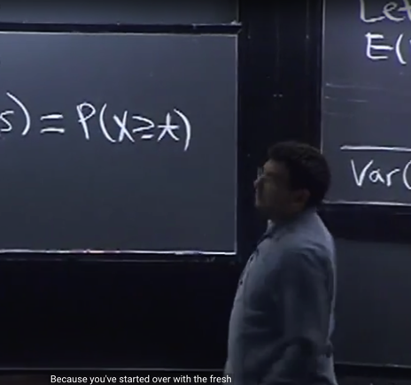</kbd></p>

<p align="center"><kbd></kbd></p>

<p align="center"><kbd>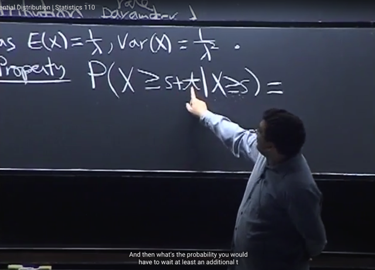</kbd></p>

> [!NOTE]
> Và tính chất **Memoryless** nay được thể hiện bởi **equation**:
>
> **P(X ≥ `s+t` | X ≥ s) `=` P(X ≥ t)**
>
> Vế trái mang ý nghĩa là: dựa trên việc [**ta đã chờ s rồi],** tức là [**thời gian chờ X (mà chưa có cuộc gọi
> tới) đã lớn hơn s] thể hiện bởi** **(X ≥ s)**, thì xác suất [**ta phải chờ s+t**] tức là [**thời gian chờ sẽ
> lớn hơn s+t**]: (X ≥ `s+t)`
>
> **P(X ≥ `s+t` | X ≥ s)**
>
> Vế phải có ý nghĩa là, ta sẽ **reset lại thời gian chờ**, thì xác suất [**phải chờ thêm t**] sẽ là:
>
> **P(X ≥ t)**Để hai vế bằng nhau sẽ có ý nghĩa là:
>
> Bên phải là (xác suất của việc) đã chờ s phút, chờ thêm t phút **P(X ≥ `s+t` | X ≥ s)** thì**cũng giống như
> (dấu =)** việc reset thời gian lại, coi như bắt đầu chờ lại từ đầu thêm t phút **P(X ≥ t)**

> [!NOTE]
> Memoryless thể hiện bởi equation: P(X ≥ `s+t` | X ≥ s) `=` P(X ≥ t)
>
> Đã chờ 10 tiếng, thì chờ 11 tiếng cũng như chờ 1 tiếng

<br>

<a id="node-504"></a>

<p align="center"><kbd>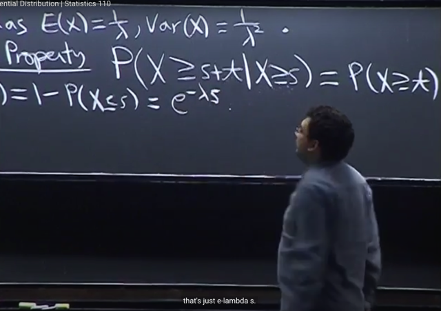</kbd></p>

<p align="center"><kbd></kbd></p>

<p align="center"><kbd>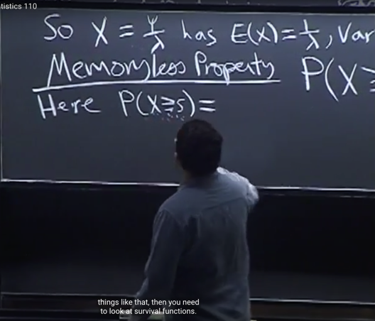</kbd></p>

🔗 **Related:** [LEC 17: MOMENT GENERATING FUNCTIONS](untitled.md#node-518)

> [!NOTE]
> Vậy thì ta sẽ**chứng minh** nếu **X ~ Expo(λ)** thì nó sẽ **thỏa mãn equation** này, tức là ta muốn
> **chứng minh Exponential distribution** có tính chất **Memoryless**
>
> Đầu tiên ta xét**P(X ≥ s)**, thì cái này gọi là **Survivor function**, vì ví dụ như cho X là thời gian còn
> sống cho đến khi chết, thì ý nghĩa của nó sẽ là **xác suất "sống qua khoảng thời gian s"**
>
> Vậy thì ta có thể thể hiện P(X ≥ s) theo complement:**P(X ≥ s) `=` 1 `-` P(X ≤ s)** và****đương nhiên ta
> biết **P(X ≤ s) chính là CDF**.
>
> *Gs lưu ý có **dấu bằng hay không không quan trọng lắm** vì đây là**continuous random variable**.
>
> Thế thì đang nói X là Expo(λ) rv thì CDF của Expo(λ) ta đã chứng minh bằng P(X ≤ x) `=` **1 `-` e^(-λx)**
>
> ```text
> Nên P(X ≤ s) = F(s) = 1 - e^(-λs)
> ```
>
> `=>` P(X ≥ s) `=` 1 `-` P(X ≤ s) `=` 1 `-` [1 `-` `e^(-λs)]` `=` 1 `-` 1 `-` ( `-` `e^(-λs))` `=` **e^(-λs)**
> Vậy ta có công thức của **Survivor function với X~Expo(λ): P(X ≥ s) `=` e^(-λs)**

> [!NOTE]
> chứng minh nếu X ~ Expo(λ) thì nó sẽ thỏa mãn Memoryless equation
>
>  P(X ≥ s), thì cái này gọi là Survivor function
>
> Survivor function với X~Expo(λ): P(X ≥ s) `=` `e^(-λs)`

<br>

<a id="node-505"></a>

<p align="center"><kbd>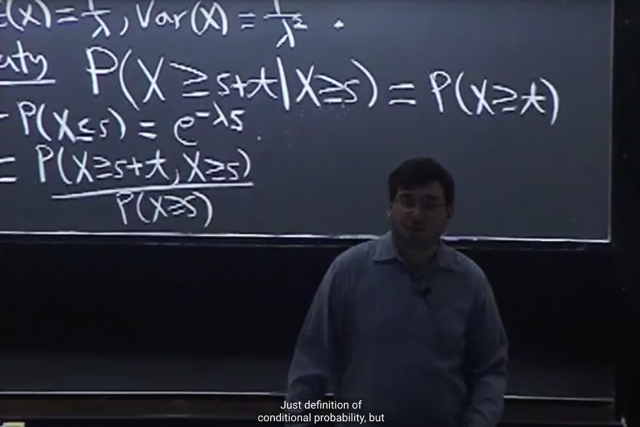</kbd></p>

<p align="center"><kbd></kbd></p>

<p align="center"><kbd>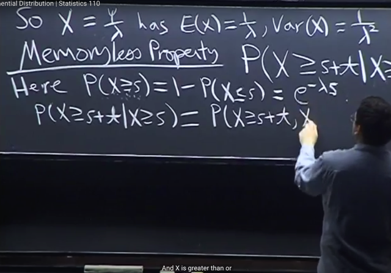</kbd></p>

🔗 **Related:** [TÓM TẮT:  - Tiếp tục Matching problem  - Định nghĩa về hai event độc lập  - Bài toán Newton-Peps  - Định nghĩa của conditional probability và cách hiểu về nó  - Các định lý liên quan](tóm_tắt_tiếp_tục_matching_problem_định_nghĩa_về_hai_event_độc_lập_bài_toán_newton_peps_định_nghĩa_củ.md#node-84)

> [!NOTE]
> Bắt đầu chứng minh tính memoryless của Expo(λ): P(X ≥ `s+t` | X ≥ s) `=` P(X ≥ t) ****Đầu tiên dựa vào**ĐỊNH NGHĨA CỦA CONDITIONAL PROBABILITY P(A|B) `=` P(A ∩ B) `/` P(B)** để có: 
>
> **P(X ≥ `s+t` | X ≥ s)** `=` P(X ≥ `s+t,` X ≥ s) `/` P(X ≥ s)

> [!NOTE]
> CHỨNG MINH EXPO(λ) CÓ TÍNH CHẤT MEMORYLESS: 
>
> P(X ≥ `s+t` | X ≥ s) `=` P(X ≥ t)

<br>

<a id="node-506"></a>

<p align="center"><kbd>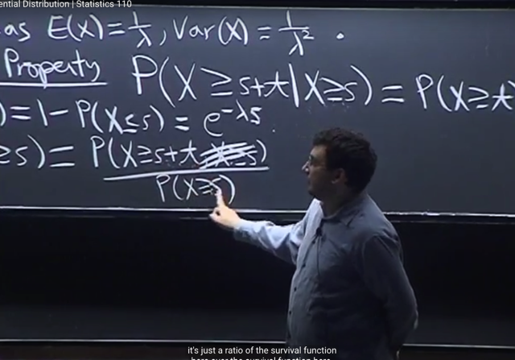</kbd></p>

> [!NOTE]
> Thế thì xét joint (intersection) event (X ≥ `s+t,` X ≥ s) thì gs cho là **(X ≥ s) là
> dư**, vì với **s, t đều dương** thì **event (X ≥ `s+t)` đã bao hàm (X ≥ s)**.
>
> **Ý nghĩa của event** ta nhớ nó là **subset của sample space**, vậy thì ở đây
> **mọi possible outcome của (X ≥ s+t)** **đều nằm trong subset (X ≥ s),** đơn
> giản vì một possible outcome {s} mà đã có label lớn hơn `s+t` (và do đó nằm
> trong X ≥ `s+t)` sẽ đương nhiên cũng lớn hơn s (để rồi sẽ nằm trong (X ≥ s).
>
> Nên nếu gọi A là `event/subset` X ≥ `s+t` và B là event X ≥ s, thì mọi s ∈ A sẽ đều
> ∈ B. Hay A là tập con của B. Từ đó suy ra (A ∩ B) `=` A: Chứng minh nhanh:
>
> Chiều đi: s ∈ A, mà vì A là tập con của B, dẫn tới theo định nghĩa s cũng thuộc
> B vậy s ∈ A, s ∈ B `=>` s ∈ (A,B).
>
> Chiều về: s ∈ (A,B) thì s ∈ A (và s ∈ B) theo định nghĩa intersection
>
> Vậy chứng minh xong A là tập con B thì A `=` (A,B).
>
> Vậy i**ntersection của hai subset** này **chính là (X ≥ s+t)**:
>
> (X ≥ `s+t,` X ≥ s) `=` (X ≥ `s+t)`
>
> Do đó **P(X ≥ `s+t` | X ≥ s) `=` P(X ≥ s+t)**

<br>

<a id="node-507"></a>

<p align="center"><kbd>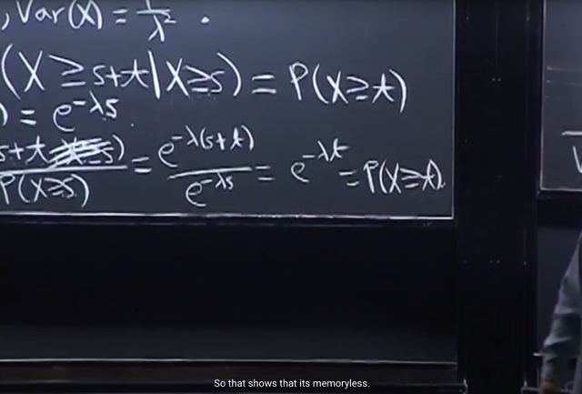</kbd></p>

> [!NOTE]
> Như vậy **P(X ≥ s) `=` P(X ≥ `s+t)` `/` P(X ≥ s)** 
>
> (Áp dụng **P(X ≥ s) `=` e^(-λs)** mà ta đã chứng minh lúc nãy)
>
> ```text
> = e^(-λ(s+t)) / e^(-λs)
> ```
>
> ```text
> = e^(-λs) * e^(-λt) / e^(-λs)
> ```
>
> `=` **e^(-λt) và đây chính là P(X ≥ t)**Vậy**P(X ≥ `s+t` | X ≥ s) `=` P(X ≥ t)
>
> Vậy ta đã chứng minh với X ~ Expo(λ): P(X ≥ `s+t` | X ≥ s) `=` P(X ≥ t)
> `=>` Expo(λ) có tính chất memoryless**Và gs nói thêm, tính chất Memoryless **CHỈ CÓ Ở Exponential distribution**, và ta
> sẽ **chứng minh điều này sau**

<br>

<a id="node-508"></a>

<p align="center"><kbd>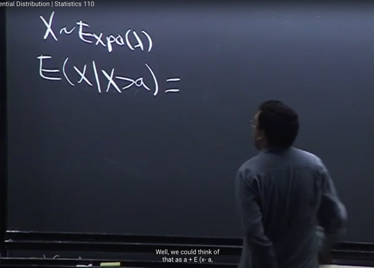</kbd></p>

> [!NOTE]
> Thế thì gs nói qua **một HỆ QUẢ QUAN TRỌNG** của **Memorylessness**.
> Cho X ~ Expo(λ)
>
> Thì ta sẽ thử tính **E(X | X > a)**.
>
> Gs nói đây là lần đầu ta gặp **CONDITIONAL EXPECTATION** nhưng nó
> cũng tương tự thôi chỉ là ta sẽ **thay các probability bằng conditional
> probability** hết 
>
> (Những bài sau ta sẽ biết, nhưng đại khái là:
>
> EX thì ta biết theo định nghĩa nó là weighted sum các possible values
> của X, với weight là xác suất của possible values, ví dụ với pmf:
>
> EX `=` `Σx` `x*P(X=x)`
>
> ```text
> Thế thì E(X|A) sẽ là Σx x*P(X=x|A) và P(X=x|A) gọi là conditional pmf.)
> ```
>
> ```text
> Với pdf: EX = ∫-inf:inf x*f_X(t)dt. Thì E(X|A) = ∫-inf:inf x*f_X|A(t|A)dt với f_X|A(t|A)
> ```
> là conditional pdf)
>
>
> Và đại khái ý nghĩa của **E(X | X > a)** là, d**ựa trên việc X > a** thì **expected
> value của X là bao nhiêu.**

<br>

<a id="node-509"></a>

<p align="center"><kbd>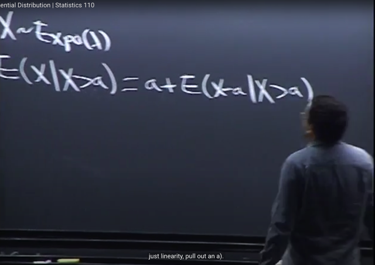</kbd></p>

> [!NOTE]
> Thì cái này có thể dùng **linearity** để tách a ra (gs đã nói conditional expectation
> có các tính chất y như expectation, chẳng qua chỉ thay mọi probability bằng
> conditional probability, nên các tính chất như **linearity** đều vẫn áp dụng: 
>
> ```text
> E(X | X > a) = E(X - a + a | X>a)
> ```
>
> ```text
> = E(X - a | X > a) + E(a | X>a)
> ```
>
> `=` **E(X `-` a | X > a) `+` a**

<br>

<a id="node-510"></a>

<p align="center"><kbd>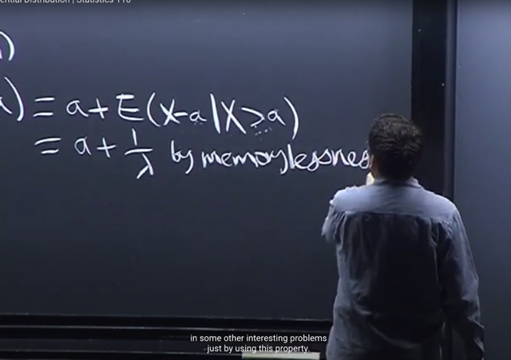</kbd></p>

> [!NOTE]
> Thế thì nhìn vào (**X `-` a | X > a)** thì ta thấy ý nghĩa là **khi X đã lớn hơn a** thì
> **X `-` a** sẽ là một fresh **Expo(λ)** rv vì ý nghĩa là sau khi chờ a, reset lại thể
> hiện qua `X-a,` thì `X-a` | X>a dĩ nhiên lại là một Expo(λ)
>
> Nên Expected value này là **1/λ** theo công thức `E(X)` của X ~ Expo(λ)
>
> ```text
> Vậy E(X|X > a) = a + 1 / λ
> ```
>
> Ta sẽ hiểu thêm về conditional expectation ở những bài sau

<br>

