# Lec 17: Moment Generating Functions

📊 **Progress:** `62` Notes | `71` Screenshots

---

<kbd></kbd>

> [!NOTE]
> đại khái là đầu tiên gs nhắc lại rằng ta đã học về **Exponential** distribution ở
> bài trước, thì với ý nghĩa là **thời gian continuous chờ đợi một event xảy ra**
> thì nó **rất giống với Geometric**. Và có thể coi **Geometric** là **discrete** version
> của **Exponential**(Ta nhớ Geom(p) là số lần trial fail cho đến khi có success đầu tiên)

> [!NOTE]
> TÓM TẮT:
>
> - Ta đã học về Exponential distribution ở bài trước, thì với ý nghĩa là thời
> gian continuous chờ đợi một event xảy ra thì nó rất giống với Geometric.
> Và có thể coi Geometric là discrete version của Exponential
>
> - Tuy chưa học tới bài Conditional expectation nhưng kì thực ta đã có thể
> tính Conditional expectation rồi vì gs nói chỉ việc thay probability bằng
> conditional probability là xong, còn các tính chất khác của expectation thì y
> chang
>
> - Có một sai lầm đang tồn tại khi tính Life expectancy E(T|T>20) > E(T)
>
> - Chứng minh Exponential LÀ CONTINUOUS DISTRIBUTION DUY
> NHẤT CÓ TÍNH CHẤT NÀY.
>
> - Moment Generating Function M(t) = E(e^tX)
>
> - E[e^(tX)]  ta có thể dùng Taylor expansion:
>
> Taylor expansion ta có E(e^tX) = E(Σn=0:infinity t^n * X^n / n!)
>
> Giả sử có thể swap Σ và E được (vì đây là tổng của vô hạn hạng tử nên
> cần một số giả định mới cho phép làm vậy) thì
>
> ⇨ M(t) = E(e^tx) 
>
> = Tổng n=0:infinity [đạo hàm cấp n của M(t)]
>
> = Tổng n=0:infinity E(x^n) * t^n / n!
>
> Mà Taylor expand M(t) tại x0 = 0 ta có:
>
> M(t) = Σn=0:inf [đạo hàm cấp n của M evaluate tại x0] t^n / n!
>
> Vậy: 
>
> Σn=0:inf [đạo hàm cấp n của M evaluate tại x0] t^n / n! = Σn=0:infinity (t^n / n!) E(X^n)
>
> Từ đó [đạo hàm cấp n của M evaluate tại x0] = E(X^n)
>
> - N'TH MOMENT E(X^n) CHÍNH LÀ ĐẠO HÀM CẤP N CỦA M(t) TẠI 0
>
> - Lí do thứ hai MGF quan trọng là bởi nó xác định một distribution như đã
> nói (giống như CDF, PDF). Nên nếu hai random variable có cùng MGF
> thì nó có cùng distribution. Gs nói cái này rất khó chứng minh nên ta sẽ
> tạm chấp nhận ở đây
>
> - THEOREM: NẾU X, Y ĐỘC LẬP THÌ M_(X+Y)(t) = M_X(t)*M_Y(t)
>
> - MGF của Bern(p) = p*e^t + q
>
> - MGF của Binomial (n, p) = (p*e^t+q)^n
>
> - Với MGF của Bin(n,p), ta có thể check lại các mean và
> variance của Bin(n,p)
>
> - MGF CỦA N(0,1) M(t) = e^t^2/2
>
> - LAPLACE RULE OF SUCCESSION

 

<kbd></kbd>

> [!NOTE]
> tiếp đại khái là gs nói ra**tuy chưa học tới** bài **Conditional expectation**
> nhưng kì thực ta **đã có thể tính Conditional expectation** rồi vì gs nói
> **chỉ việc thay probability bằng conditional probability là xong**, còn các
> tính chất khác của expectation thì y chang

 

<kbd>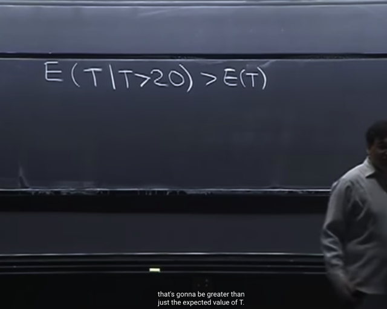</kbd>

> [!NOTE]
> đại khái là, gs cho rằng **có một sai lầm** đang tồn tại khi người ta nghiên cứu
> tính toán **Life expectancy** của con người. Cụ thể là học đang cho rằng ví dụ
> như tuổi thọ trung bình là 80 năm thì nó áp dụng với cả những người đang ở
> tuổi 50, 60. Nhưng thực tế thì với **một người càng cao tuổi thì ta sẽ expect họ
> sống càng lâu hay, tuổi thọ kì vọng của học càng cao**. Thể hiện qua bất đẳng
> thức (inquality)
>
> **E(T|T>20) > E(T)** mang ý nghĩa là nếu T đã lớn hơn 20 thì Expected value
> (conditional expectation) của T sẽ lớn hơn expected value của T mà không có
> thông tin gì thêm (unconditional expectation)
>
> Thế thì cái inequality trên **chỉ không đúng nếu như MỌI NGƯỜI ĐỀU CÓ
> CÙNG MỘT LIFESPAN (cùng một tuổi thọ)**bởi khi đó việc biết T > 20 không
> giúp ích gì cho việc biết T, nhưng chừng nào mà c**òn có sự khác nhau giữa
> tuổi thọ của con người**thì chừng đó cái nhận định trên còn đúng

 

<kbd>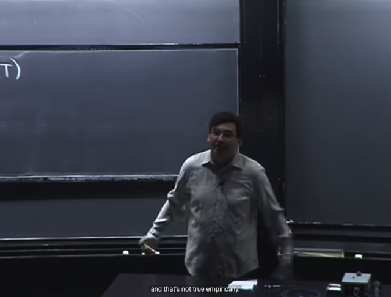</kbd>

> [!NOTE]
> Tuy đó là**good news** (ý nói có thể kì vọng tuổi thọ càng cao nếu độ tuổi hiện
> tại càng cao) nhưng **bad news** là tuổi thọ của con người **KHÔNG CÓ TÍNH
> MEMORYLESS**
>
> Bởi vì **nếu có tính Memoryless**, thì sẽ giống như,**sau một năm ta lại
> refresh từ đầu** (gs dùng từ **good as new**, ý nói là sau khi **qua một năm thì
> lại reset lại để lại tốt như mới, mới sinh ra**). Nhưng rõ ràng không được vậy,
> vì con người sẽ già đi, sức khỏe yếu đi.
>
> Tuy nhiên **một số lĩnh vực khác, bài toán khác** thì có tính chất
> **Memoryless** này

 

<kbd>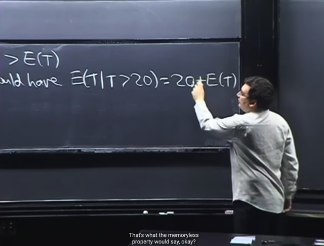</kbd>

> [!NOTE]
> Thế thì nếu **giả sử có Memoryless property** (nhưng thực tế tuổi thọ con người
> không có) thì việc **reset sau mỗi năm** để good as new vừa nói sẽ phản ánh
> bởi bất phương trình này:
>
> **E(T|T > 20) = 20 + E(T)**
>
> Có thể giải thích là E(T|T>20) = E(T-20+20|T>20) = E(T-20|T>20) + E(20|T>20)
> (linearity) = E(T-20|T>20) + 20, và vì có tính chất memoryless nên sau khi T>20,
> việc -20 mang ý nghĩa reset lại, nên T-20|T>20 sẽ cùng distribution với T, nên
> E(T-20|T>20) = E(T)
>
> Thế thì vì ta đã nói tuổi thọ con người**không có tính memoryless**, nên **20 + E(T)**
> như upper bound / giới hạn trên và **E(T)** là **giới hạn dưới lower bound**

 

<kbd>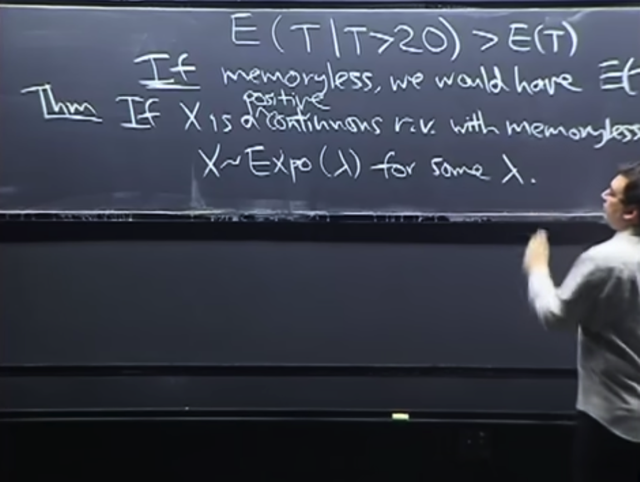</kbd>

<kbd></kbd>

<kbd>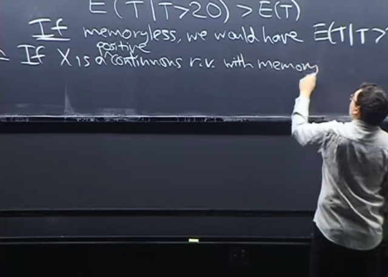</kbd>

> [!NOTE]
> Bữa trước ta **đã chứng minh** rằng **Exponential distribution** có tính chất
> **Memoryless**, nay ta sẽ chứng minh một điều đã nói bữa trước là, Exponential
> LÀ **CONTINUOUS DISTRIBUTION DUY NHẤT** CÓ **TÍNH CHẤT NÀY**.
>
> Hay nói cách khác**nếu continuous positive random variable X có tính
> memoryless** (gs lưu ý tính chất memoryless là nói về distribution, nên phải
> hiểu ý là distribution của r.v X có tính memoryless) **thì X phải là ~
> Expo(λ)**với λ nào đó

> [!NOTE]
> Chứng minh Exponential LÀ CONTINUOUS DISTRIBUTION DUY
> NHẤT CÓ TÍNH CHẤT NÀY.

 

<kbd>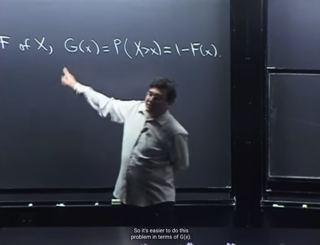</kbd>

🔗 **Related:** [TÓM TẮT:  - Tiếp tục Expo(λ): PDF CỦA EXPO(λ): f(x) = λ e^(-λx) x > 0  - Check tính valid của PDF của Expo  - CDF CỦA EXPO(λ) : F_X(x) = 1 - e^(-λx)  - X ~ Expo(λ) thì  Y = λX thì Y sẽ ~ Expo(1)  - Chứng minh rằng X ~ Expo(λ) thì  Y = λX thì Y sẽ ~ Expo(1)  - EX OF EXPO(1) = 1  - VARIANCE OF EXPO(1) = 1  - X~EXPO(λ) thì Y= λX sẽ ~EXPO(1)   EY = 1 ⇨ E(X) = E(Y/λ) = 1/λ EY = 1/λ  VARIANCE OF EXPO(λ) = 1/λ^2  Var(Y) = 1 ⇨ Var(X) = Var(Y/λ) = (1/λ^2) Var(Y) = (1/λ^2)  Memoryless thể hiện bởi equation: P(X ≥ s+t | X ≥ s) = P(X ≥ t)  chứng minh nếu X ~ Expo(λ) thì nó sẽ thỏa mãn Memoryless equation   P(X ≥ s), thì cái này gọi là Survivor function  Survivor function với X~Expo(λ): P(X ≥ s) = e^(-λs)  -Nhờ tính chất Memoryless nên nếu X~Expo(λ) E(X|X > a) = a + 1 / λ](tóm_tắt_tiếp_tục_expoλ_pdf_của_expoλ_fx_λ_e_λx_x_0_check_tính_valid_của_pdf_của_expo_cdf_của_expoλ_f.md#node-504)

> [!NOTE]
> Thế thì đại khái là khi chứng minh cái này, ta**làm hơi khác** so với các bài
> toán chứng minh trước ở chỗ, **ở đây ta phải solve ra function**, **thay vì
> random variable** (ý là ta cần chứng minh CDF của X, hay PDF của X là
> Exponential CDF / PDF)
>
> Nên **gọi F là CDF của X**, thì để cho dễ ta sẽ **đặt và dùng G = 1 - F** mang
> ý nghĩa là **P(X > x)**. Lí do dùng G dễ hơn là bởi giống như ta đã thấy ở bài
> trước, đối diện với bài toán kiểu như **survivor** như này thì dùng P(X > x) dễ
> hơn (G với ý nghĩa P(X > x) như bài trước đã biết, gọi là survivor function)

 

<kbd>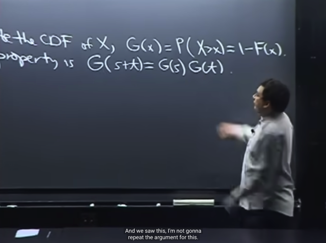</kbd>

> [!NOTE]
> Thế thì như đã nói bài toán này ta sẽ chứng minh rằng nếu **distribution của X CÓ
> TÍNH CHẤT MEMORYLESS** thì **nó là ~ Exponential**.
>
> Thế thì **memoryless**, như bài trước ta đã biết, sẽ thể hiện qua:
>
> **P(X ≥ s+t | X ≥ s) = P(X ≥ t)**
>
> Và cái này tương đương **P(X ≥ s+t, X ≥ s) / P(X ≥ s) = P(X ≥ t)** (dùng **định nghĩa**
> của **conditional probability** P(A|B) = P(A,B) / P(B))
>
> ⇔ **P(X ≥ s+t, X ≥ s) = P(X ≥ t) * P(X ≥ s)**(1)
>
> Và **như đã nói bữa trước** (**X ≥ s+t, X ≥ s)** (intersection của 2 event) với s, t
> dương thì nó **cũng chính là (X ≥ s+t) vì (X ≥ s+t)**⊂**(X ≥ s)**
>
> Và như vậy (1) ⇔**P(X ≥ s+t) = P(X ≥ t) * P(X ≥ s)**
>
> và với việc đã đặt **G(x) = P(X > x)** thì equation trên chính là**G(s+t) = G(s) * G(t)**
>
> Cần **nhắc lại**là với **continuous** r.v thì việc **có dấu bằng hay không** (>=, hay >)
> đều không quan trọng, như nhau

 

<kbd>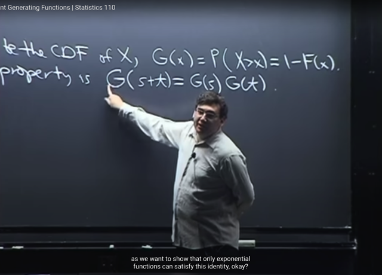</kbd>

> [!NOTE]
> Rồi, như đã nói, bài toán này ta k**hông solve for s, t** mà **solve for G**. Để
> chứng minh chỉ có X ~ Exponential thì mới có G thỏa equation này

 

<kbd>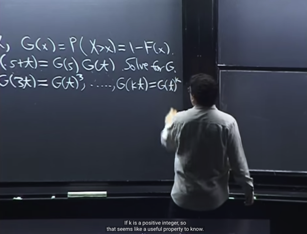</kbd>

<kbd></kbd>

<kbd>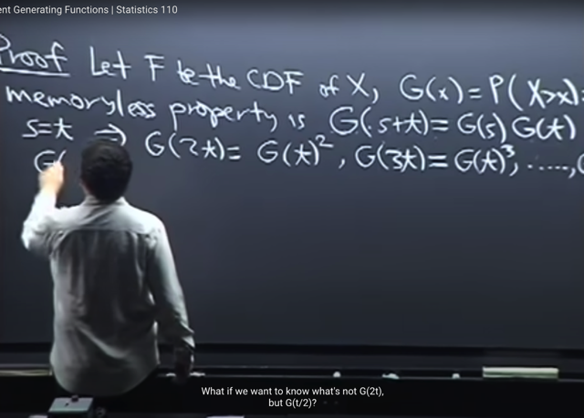</kbd>

> [!NOTE]
> Vậy thì **kiểu như** ta sẽ **ngày càng** khám phá để **biết nhiều hơn về G** vậy. Thì đầu tiên ta có thể **cho s=t** để
> **coi khi đó G hành xử thế nào**.
>
> Khi **s=t** ta có G(s+t) (= **G(2t))** = G(t)*G(t) = **G(t)^2**
>
> cho **s=2t** ta có G(s+t) = **G(3t)** = G(2t)*G(t) = G(t)^2G(t) = **G(t)^3**
>
> Tương tự như vậy ta có thể thấy **G(kt)** = **G(t)^k**

 

<kbd>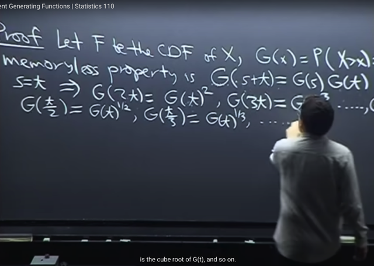</kbd>

> [!NOTE]
> Tiếp, ta**thử xem G(t/2)** bằng gì. Thì bằng cách cho s và t của equation
> gốc (G(s+t) = G(s)*G(t)) đều bằng**t/2** ta có:
>
> **G(s+t) = G(t/2+t/2)** = G(s)G(t) = **G(t/2)G(t/2)**
>
> ⇔ G(t) = G(t/2)^2, lấy căn bậc 2 hai vế
>
> ⇔ G(t)^(1/2) = G(t/2)****⇔ **G(t/2)** = **G(t)^(1/2)**  ****
>
> Tương tự ta cũng sẽ có thể thấy **G(t/3)** = **G(t)^(1/3)**
>
> Và **G(t/k) = G(t)^(1/k)**

 

<kbd>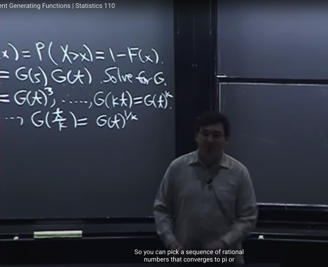</kbd>

> [!NOTE]
> Hai cái trên **G(kt)** là nhân t với một số **nguyên** và **G(t/k)** là nhân t với
> một**phân số của số nguyên.
>
> Tất cả đều có chung kết quả là G(mt) = G(t)^m**
>
> Tiếp theo ta sẽ thử xét G(**(m/n)***t). Thì áp dụng
>
> G(kt) = G(t)^k và G(t/k) = G(t)^(1/k) ta sẽ có
>
> G((m/n)*t) = G(m*t / n)
>
> = G(m*t)^(1/n) (áp dụng G(t/k) = G(t)^(1/k))
>
> = [G(t)^m]^(1/n) (áp dụng G(kt) = G(t)^k)
>
> = **G(t)^(m/n)** (áp dụng (a^m)^n = a^(m*n))
>
> Thì như vậy ta đã có case apply G lên [t nhân với một **rational** number (số
> hữu tỉ) m/n]
>
> G((m/n)t) = G(t)^(m/n)

 

<kbd>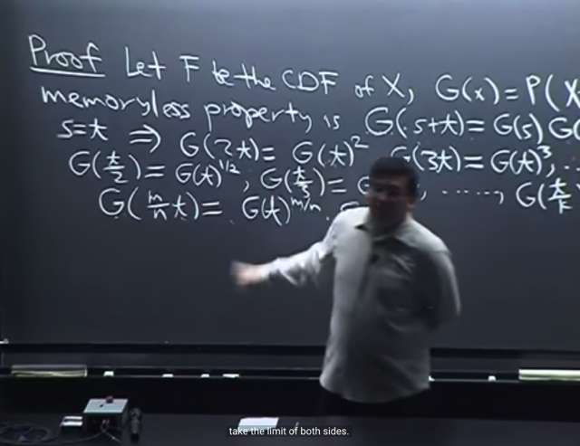</kbd>

> [!NOTE]
> tiếp, đại khái là gs nói rằng ta có thể **coi số thực như
> limit của các rational numbers**

 

<kbd>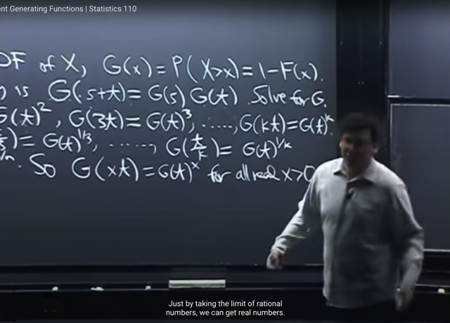</kbd>

> [!NOTE]
> và đại khái là ta **có thể kết luận rằng** **G(xt) =
> G(t)^x** với mọi **số** **thực** **x > 0**

 

<kbd>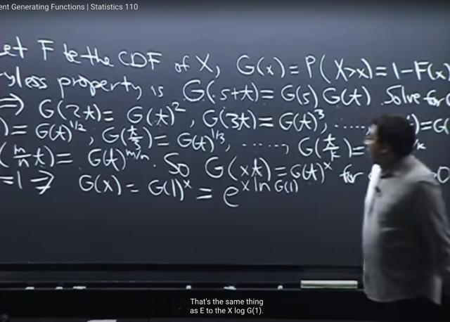</kbd>

> [!NOTE]
> Vậy thì **G(xt) = G(t)^x đúng với mọi x, t**. Nên **chọn t = 1** ta có:
>
> **G(x) = G(1)^x**
>
> Và ta có thể t**hể hiện G(1)^x** theo **lũy thừa của e** bằng cách
> áp dụng:
>
> **a = e^ln (a)** ⇨ **G(1)^x** = **e^ln [G(1)^x]**
>
> Và **ln (b^n)** = **n*ln (b)** ⇨ **ln [G(1)^x]**= **x * ln G(1)**
>
> ⇨ G(1)^x = e^ln [G(1)^x] = **e^[x ln G(1)]**

 

<kbd>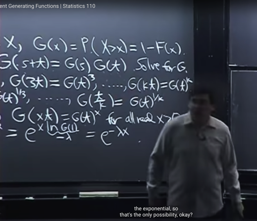</kbd>

<kbd></kbd>

<kbd></kbd>

> [!NOTE]
> Vậy thì ta đang có G(x) = e^[x * ln G(1)]
>
> Thế thì với **G(1)** là con số **mang giá trị xác suất** (theo định nghĩa hàm G, nó là **P(X >
> x)** nên nó c**ó giá trị từ 0 đến 1**
>
> Nên khi tính ln G(1), tức lấy **log base e (ln()) của con số từ 0 đến 1** thì ta có  số **âm**, và
> ta có thể **đặt nó là -λ** với λ là giá trị dương của số đó, tức là ta đặt **ln G(1) = -λ**
>
> MIT 1801 nói về câu chuyện của hàm log (cơ số e): Đại khái là bắt đầu bởi phương trình vi
> phân y' = 1/x. Thế thì, FTC2 cho ta biết rằng ∫a:x f(t)dt sẽ là một hàm G(x) sao cho G'(x) = f(x)
>
> Do đó ∫a:x dt/t chính là hàm y = G(x), với y' = G'(x) = 1/x. ⇨ y = ∫a:x dt/t.
>
> Và chọn a = 1, đặt ∫1:x dt/t là hàm log(x) Từ đó log(1) = ∫1:1dt/t = 0.
>
> Như vậy G(1)^x = e^[x * ln G(1)] = e^(-λx)
>
> Nên ta có **G(x) = e^-λx** và đây **chính là 1 - CDF của Exponential distribution
>
> Vậy là ta đã chứng minh xong F chính là CDF của Exponential distribution.
>
> Cho thấy chỉ có Exponential mới có Memoryless property**

> [!NOTE]
> CHỨNG MINH NẾU X CÓ TÍNH CHẤT
> MEMORYLESS THÌ X PHẢI ~ EXPONENTIAL

 

<kbd>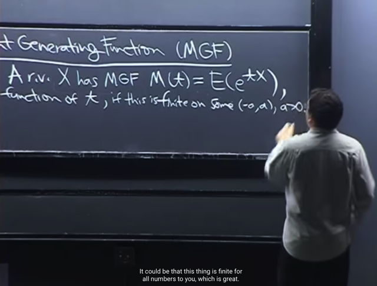</kbd>

🔗 **Related:** [TÓM TẮT:  - Tính MGF M(t) của Expo(1) = 1/(1-t) t < 1  - Khi đã có MGF, như bài trước ta đã biết các lí do mà MGF quan trọng trong đó có reason #1 đó là ta chỉ cần tính đạo hàm cấp n của nó sẽ cho ta n'th moment.  - Dù ta có thể tính đạo hàm nhiều lần để có 1st, 2nd moment nhưng có cách hay hơn. Bằng cách nhận ra 1/(1-t) liên quan đến Geometric series  a + ar + ar^2 = Tổng k=0:infinity a*r^k với |r| < 1 sẽ converge về a/[1-r]  Nên 1/1-t chính là Tổng n=0:infinity t^n với |t| < 1  Thế thì theo gs, từ đây cho phép ta KHỎI CẦN TÍNH ĐẠO HÀM CẤP N ĐỂ CÓ MOMENT THỨ N LÀM GÌ CHO MỆT, mà chỉ cần ĐỌC NÓ RA THÔI  Cụ thể là ta đã biết ở bài trước rằng, n'th moment = đạo hàm cấp n của M(t) (là coefficient của (t^n / n!) khi expand M(t) theo Taylor series tại 0)  Do đó, bằng cách tạo ra (t^n / n!) thì BẤT CỨ CÁI GÌ GẮN VỚI NÓ CHÍNH LÀ COEFFICIENT, VÀ CHÍNH LÀ N'TH MOMENT  Do đó ta sẽ nhân thêm n! và chia n! để có (t^n / n!). Như vậy cái lòi ra làm coefficient của t^n/n! ở đây là n! CHÍNH LÀ N'TH MOMENT.  Từ đó cho phép ta ĐỌC LUÔN RẰNG: 1ST MOMENT (EX) LÀ 1!, 2ND MOMENT E(X^2) LÀ 2!  N'TH MOMENT CỦA EXPO(1) E(X^n) = n!  -  đây là tính chất RẤT MẠNH CỦA MGF. Vì ví dụ như khi tính n'th moment (E[X^n]) thì nếu dùng LOTUS, ta phải TÍNH TÍCH PHÂN (INTEGRAL) VÀ CÓ THỂ GẶP NHỮNG TÍCH PHÂN RẤT PHỨC TẠP.  Trong khi đó, nếu ta có MGF, để có nth moment, ta CHỈ CẦN TÍNH DERIVATIVE MÀ DERIVATIVE THÌ THƯỜNG DỄ HƠN LÀ TÍNH TÍCH PHÂN  -Từ n'th moment của Expo(1) ta dễ dàng có n'th moment của Y ~ Expo(λ): E[Y^n] = n! / λ^n  - N'TH MOMENT CỦA N(0,1) VỚI N LẺ ĐỀU BẰNG 0  - MGF CỦA POIS(λ) = e^[λ(e^t-1)]  - Nếu Y ~ Pois(µ) và X~Pois(λ) và biết X, Y INDEPENDENT thì X+Y ~ Pois(λ+µ)](tóm_tắt_tính_mgf_mt_của_expo1_11_t_t_1_khi_đã_có_mgf_như_bài_trước_ta_đã_biết_các_lí_do_mà_mgf_quan_.md#node-567)

> [!NOTE]
> Tiếp theo ta sẽ học về **MGF**, nó chỉ là một **function** **mô tả distribution**
> tương tự như PDF và CDF
>
> Và được định nghĩa như sau:
>
> Random variable X sẽ có **MGF** **M(t) = E(e^tX)**
>
> (Chú ý M(t) đây là function theo t)
>
> Và gs cho biết **MGF** **chỉ hữu ích** nếu **M(t)** (finite) **hữu hạn** trên
> **một khoảng nào đó quanh 0**: **(-a,a)** với **a>0**

> [!NOTE]
> Moment Generating Function M(t) = E(e^tX)

 

<kbd>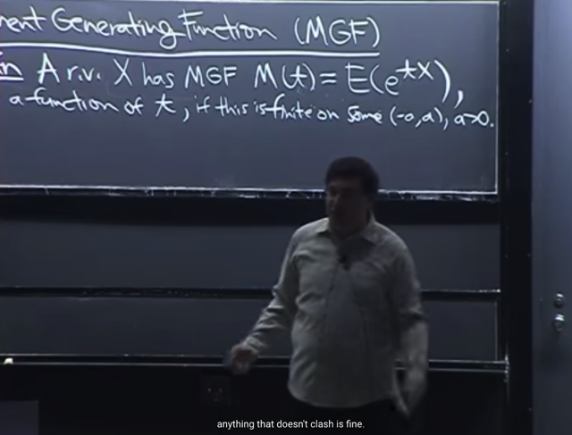</kbd>

> [!NOTE]
> Gs nói t chỉ là **dummy** **variable, chọn cái tên nào cũng được** miễn là nó
> **đừng clash** với các notation khác
>
> Và như **đã nói trước đây** nếu ta **apply một function lên một random variable**
> thì ta**được một random variable**.
>
> Do đó ở đây **e^tX** là ta **apply function e^tX**lên random variable **X**, và từ
> đó ta **có một random variable**. Đó đó ta **có thể lấy expected value (mean)**
> của random variable mới này. Ý nói, **việc thiết lập function trên là hợp lệ**
>
> Thế thì khi apply function vào random variable X ta có f(X) = e^tX **cũng là
> random variable** nên đương nhiên **có thể hợp lệ để tính expected value**.
>
> Nên function theo t **M(t)** này mang ý nghĩa là, **định nghĩa ra một function
> f(x) = e^tx** để rồi **apply nó lên random variable X:**e^tX để có **một random
> variable mới**, và lấy **expected value của random variable này**

 

<kbd>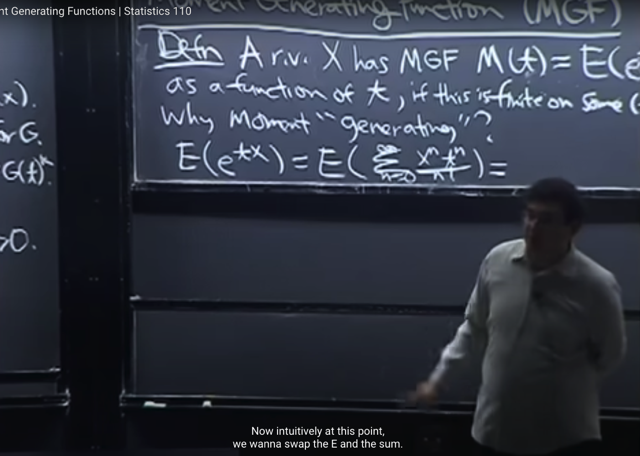</kbd>

> [!NOTE]
> Tiếp theo gs nói về việc tại sao nó lại gọi là **Moment** "**generating**"
>
> Đầu tiên để ý **e^(tX)**  ta có thể dùng **Taylor expansion**:
>
> Nhớ lại Taylor expansion cho phép ta **expand function f(x)** tại x0
>
> f(x) = Σn n=0:infinity [đạo hàm cấp n của f](x0) * (x-x0)^n / n!
>
> Với f(x) = e^(tx):**đạo hàm cấp n** của f(x) dễ thấy là **t^n*e^(tx)**
>
> expand tại x0 = 0 ta có f(x) = Tổng n=0:infinity [t^*e^tx](0) * (x-0)^n / n!
>
> = Tổng n=0:infinity [t^n * e^(t*0)] * x^n / n!
>
> = Tổng n=0:infinity [t^n] * x^n / n!
>
> = **Tổng n=0:infinity t^n * x^n / n!
>
> Nên E(e^tX) = E(Σn=0:infinity t^n * X^n / n!)**cơ bản là ta đang chứng minh rằng hàm E(e^tx) = E(∑ t^n * x^n / n!) thì khi
> apply vào X để có r.v mới rồi lấy expected value của nó, tức E[e^tX] thì cũng
> là apply (∑ t^n * x^n / n!) vào X để có (∑ t^n * X^n / n!) rồi lấy expected value
> thôi: E(∑ t^n * X^n / n!)

> [!NOTE]
> E[e^(tX)]  ta có thể dùng Taylor expansion:
>
> Taylor expansion ta có E(e^tX) = E(Σn=0:infinity t^n * X^n / n!)

 

<kbd>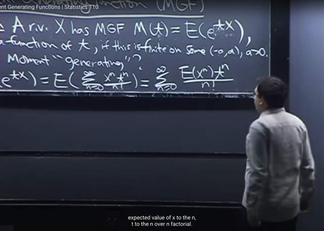</kbd>

> [!NOTE]
> Tiếp gs cho rằng giả sử / giả định rằng ta c**ó thể đổi chỗ của E và Sum** thì
> ta sẽ có như vầy, **Sum của các expected value của từng hạng tử**.
>
> Chú ý là trong các hạng tử thì **chỉ có X^n là random variable**, nên bỏ **t^n/n!**
> **ra ngoài** E nhờ E(cX) = c(EX) (linearity)
>
> Vậy ta có M(t) = E(e^tX) = Σn=0:infinity (t^n / n!) E(X^n)
>
> Taylor expand M(t) tại x0 = 0 ta có:
>
> M(t) = Σn=0:inf [đạo hàm cấp n của M evaluate tại x0] t^n / n!
>
> Vậy: 
>
> Σn=0:inf [đạo hàm cấp n của M evaluate tại x0] t^n / n! = Σn=0:infinity (t^n / n!) E(X^n)
>
> Từ đó [đạo hàm cấp n của M evaluate tại x0] = E(X^n)

 

<kbd>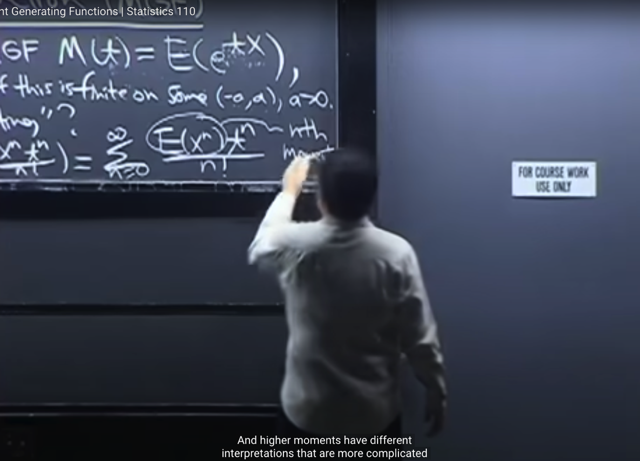</kbd>

> [!NOTE]
> Thì **E(X^n)** gọi là **MOMENT THỨ n**. Ta đã biết **E(X) tức moment thứ nhất**
> chính là **mean**, và **E(X^2)** tuy không phải là **variance** (trừ khi EX = 0)
> nhưng nó sẽ**giúp ta tính variance** (Var(X) = E(X^2) - (EX)^2)
>
> Thì **các moment cao hơn** sẽ **hữu ích trong các trường hợp khác**

 

<kbd>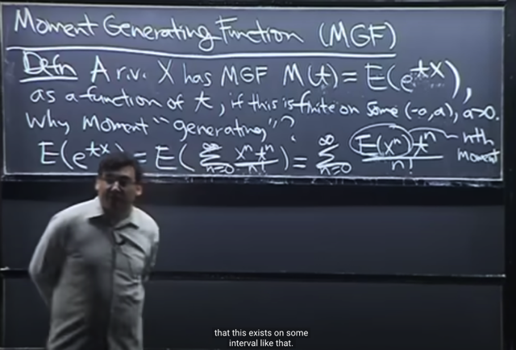</kbd>

> [!NOTE]
> Gs nói đại khái là **mục đích của việc swap** là để **E(X^n) nằm trong Taylor
> series**.
>
> Còn **tại sao phải assume việc "có thể được phép swap giữa E và Sum"**. Là
> bởi đây là**sum của vô số hạng tử**. Nếu là **sum của hữu hạn hạng tử** thì
> **Linearity** **ngay lập tức** **cho phép Expect của sum là sum của Expect.**
>
> Nhưng vì đây là **infinite sum** nên **cần thêm một số biện minh** mà ta **ko học ở
> class này**. Nhưng **đại khái là có thể swap được** dựa trên **một số giả định ban
> đầu** rằng **function finite on some (-a, a) với a>0 ở trên**. Ta có thể xem nó như
> **infinite version của linearity**
>
> Và đó là **MOMENT GENERATING FUNCTION**. Chỉ vậy thôi

 

<kbd>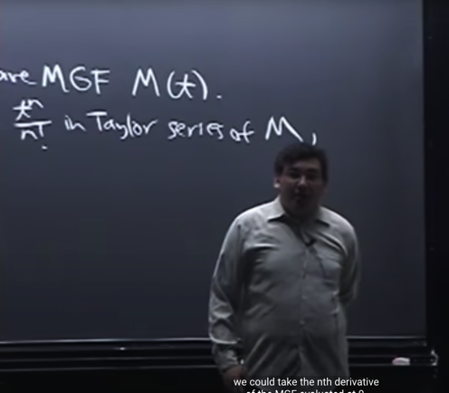</kbd>

<kbd></kbd>

<kbd>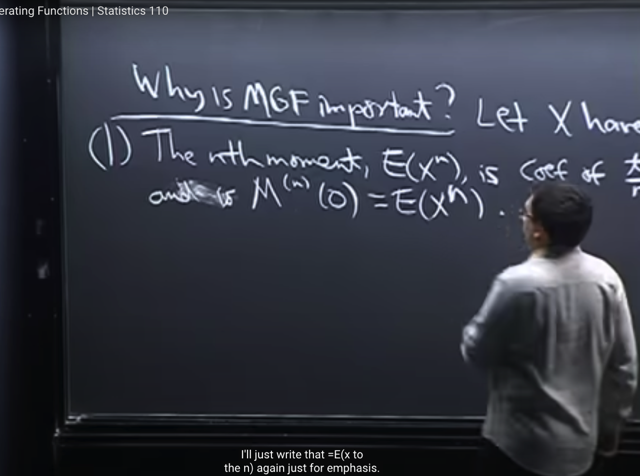</kbd>

🔗 **Related:** [TÓM TẮT:  - Tính MGF M(t) của Expo(1) = 1/(1-t) t < 1  - Khi đã có MGF, như bài trước ta đã biết các lí do mà MGF quan trọng trong đó có reason #1 đó là ta chỉ cần tính đạo hàm cấp n của nó sẽ cho ta n'th moment.  - Dù ta có thể tính đạo hàm nhiều lần để có 1st, 2nd moment nhưng có cách hay hơn. Bằng cách nhận ra 1/(1-t) liên quan đến Geometric series  a + ar + ar^2 = Tổng k=0:infinity a*r^k với |r| < 1 sẽ converge về a/[1-r]  Nên 1/1-t chính là Tổng n=0:infinity t^n với |t| < 1  Thế thì theo gs, từ đây cho phép ta KHỎI CẦN TÍNH ĐẠO HÀM CẤP N ĐỂ CÓ MOMENT THỨ N LÀM GÌ CHO MỆT, mà chỉ cần ĐỌC NÓ RA THÔI  Cụ thể là ta đã biết ở bài trước rằng, n'th moment = đạo hàm cấp n của M(t) (là coefficient của (t^n / n!) khi expand M(t) theo Taylor series tại 0)  Do đó, bằng cách tạo ra (t^n / n!) thì BẤT CỨ CÁI GÌ GẮN VỚI NÓ CHÍNH LÀ COEFFICIENT, VÀ CHÍNH LÀ N'TH MOMENT  Do đó ta sẽ nhân thêm n! và chia n! để có (t^n / n!). Như vậy cái lòi ra làm coefficient của t^n/n! ở đây là n! CHÍNH LÀ N'TH MOMENT.  Từ đó cho phép ta ĐỌC LUÔN RẰNG: 1ST MOMENT (EX) LÀ 1!, 2ND MOMENT E(X^2) LÀ 2!  N'TH MOMENT CỦA EXPO(1) E(X^n) = n!  -  đây là tính chất RẤT MẠNH CỦA MGF. Vì ví dụ như khi tính n'th moment (E[X^n]) thì nếu dùng LOTUS, ta phải TÍNH TÍCH PHÂN (INTEGRAL) VÀ CÓ THỂ GẶP NHỮNG TÍCH PHÂN RẤT PHỨC TẠP.  Trong khi đó, nếu ta có MGF, để có nth moment, ta CHỈ CẦN TÍNH DERIVATIVE MÀ DERIVATIVE THÌ THƯỜNG DỄ HƠN LÀ TÍNH TÍCH PHÂN  -Từ n'th moment của Expo(1) ta dễ dàng có n'th moment của Y ~ Expo(λ): E[Y^n] = n! / λ^n  - N'TH MOMENT CỦA N(0,1) VỚI N LẺ ĐỀU BẰNG 0  - MGF CỦA POIS(λ) = e^[λ(e^t-1)]  - Nếu Y ~ Pois(µ) và X~Pois(λ) và biết X, Y INDEPENDENT thì X+Y ~ Pois(λ+µ)](tóm_tắt_tính_mgf_mt_của_expo1_11_t_t_1_khi_đã_có_mgf_như_bài_trước_ta_đã_biết_các_lí_do_mà_mgf_quan_.md#node-571)

> [!NOTE]
> Tiếp gs nói qua **tại sao MGF lại quan trọn**g. 
>
> Giả sử X có **MGF là M(t)**
>
> Thì **lí do đầu tiên** về sự quan trọng của MGF, là có thể thấy E(X^n) là **hệ số của t^n/n! trong Taylor series của M**.
> Và như đã thấy nó **chính là đạo hàm cấp n của M tính tại x0=0**
>
> Việc nói nó là **hệ số của t^n/n! trong Taylor series** **của M(t)** là hoàn toàn có thể hiểu được, vì ở slide trước
> ta vừa thấy gs triển khai M(t) = E(e^tx) = Tổng n=0:infinity **E(x^n) * t^n / n!
>
> Như vậy Tổng n=0:inf E(X^n) * t^n / n! chính là Taylor expansion của M(t), và trong các hạng tử của tổng này
> thì E(x^n) là coefficient của t^n / n! chứ gì nữa**Hơn nữa theo công thức Taylor series, như ta vừa ôn lại: f(x) = ∑ n=0:infinity [đạo hàm cấp n của f](x0) * (x-x0)^n / n!
>
> với**x0 = 0 (tức expand tại 0)** thì **f(x) = ∑ n=0:infinity [đạo hàm cấp n của f](0) * x^n / n!**
>
> Thì [**đạo hàm cấp n của f](0)** tức là ta tìm**function đạo hàm cấp n của f(x)**và **tính giá trị của nó tại 0**
>
> Thế thì từ đó có thể thấy trong Taylor expansion của M(t), **E(X^n) chính là giá trị của hàm số đạo hàm cấp n của M(t)** 
> tính tại 0 : **M^(n)(0) = E(X^n)
>
> Do đó để có n'th moment E(X^n) ta chỉ cần tính đạo hàm cấp n của M(t) và evaluate tại 0**

> [!NOTE]
> N'TH MOMENT E(X^n) CHÍNH LÀ ĐẠO HÀM CẤP N CỦA M(t) TẠI 0

 

<kbd>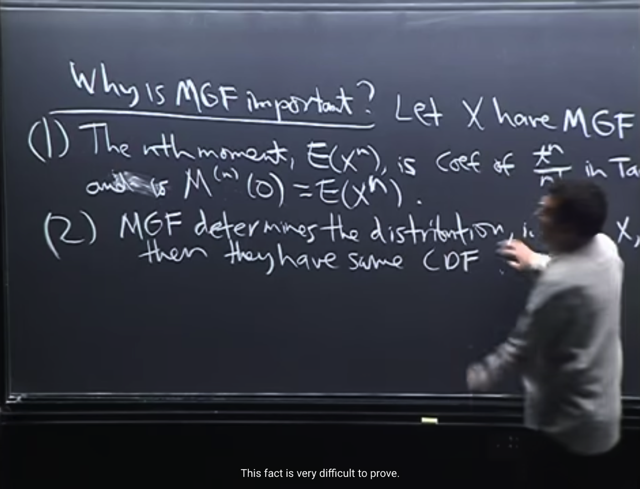</kbd>

> [!NOTE]
> **Lí do thứ hai** MGF quan trọng là bởi nó **xác định một distribution** như đã
> nói (giống như **CDF**, **PDF**). Nên **nếu hai random variable có cùng MGF**
> thì **nó có cùng distribution**. Gs nói cái này **rất khó chứng minh** nên ta sẽ**tạm chấp nhận ở đây**

> [!NOTE]
> Lí do thứ hai MGF quan trọng là bởi nó xác định một distribution như đã
> nói (giống như CDF, PDF). Nên nếu hai random variable có cùng MGF
> thì nó có cùng distribution. Gs nói cái này rất khó chứng minh nên ta sẽ
> tạm chấp nhận ở đây

 

<kbd>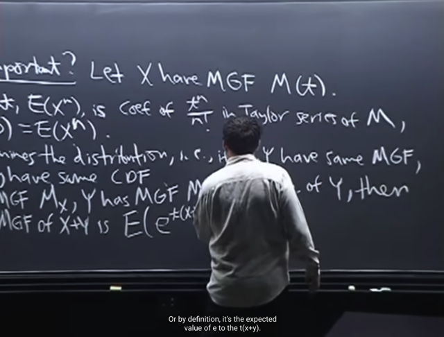</kbd>

<kbd>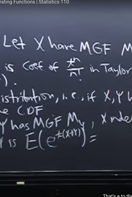</kbd>

<kbd>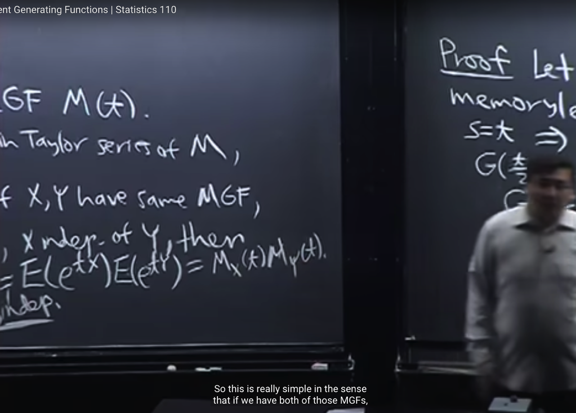</kbd>

<kbd></kbd>

<kbd></kbd>

<kbd></kbd>

<kbd>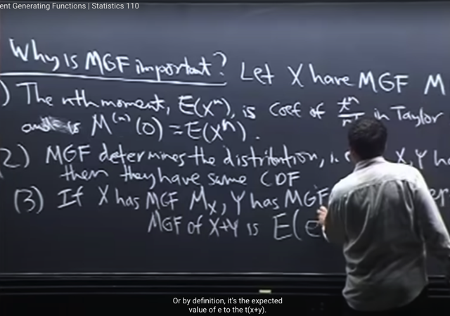</kbd>

🔗 **Related:** [TÓM TẮT:  - Tính MGF M(t) của Expo(1) = 1/(1-t) t < 1  - Khi đã có MGF, như bài trước ta đã biết các lí do mà MGF quan trọng trong đó có reason #1 đó là ta chỉ cần tính đạo hàm cấp n của nó sẽ cho ta n'th moment.  - Dù ta có thể tính đạo hàm nhiều lần để có 1st, 2nd moment nhưng có cách hay hơn. Bằng cách nhận ra 1/(1-t) liên quan đến Geometric series  a + ar + ar^2 = Tổng k=0:infinity a*r^k với |r| < 1 sẽ converge về a/[1-r]  Nên 1/1-t chính là Tổng n=0:infinity t^n với |t| < 1  Thế thì theo gs, từ đây cho phép ta KHỎI CẦN TÍNH ĐẠO HÀM CẤP N ĐỂ CÓ MOMENT THỨ N LÀM GÌ CHO MỆT, mà chỉ cần ĐỌC NÓ RA THÔI  Cụ thể là ta đã biết ở bài trước rằng, n'th moment = đạo hàm cấp n của M(t) (là coefficient của (t^n / n!) khi expand M(t) theo Taylor series tại 0)  Do đó, bằng cách tạo ra (t^n / n!) thì BẤT CỨ CÁI GÌ GẮN VỚI NÓ CHÍNH LÀ COEFFICIENT, VÀ CHÍNH LÀ N'TH MOMENT  Do đó ta sẽ nhân thêm n! và chia n! để có (t^n / n!). Như vậy cái lòi ra làm coefficient của t^n/n! ở đây là n! CHÍNH LÀ N'TH MOMENT.  Từ đó cho phép ta ĐỌC LUÔN RẰNG: 1ST MOMENT (EX) LÀ 1!, 2ND MOMENT E(X^2) LÀ 2!  N'TH MOMENT CỦA EXPO(1) E(X^n) = n!  -  đây là tính chất RẤT MẠNH CỦA MGF. Vì ví dụ như khi tính n'th moment (E[X^n]) thì nếu dùng LOTUS, ta phải TÍNH TÍCH PHÂN (INTEGRAL) VÀ CÓ THỂ GẶP NHỮNG TÍCH PHÂN RẤT PHỨC TẠP.  Trong khi đó, nếu ta có MGF, để có nth moment, ta CHỈ CẦN TÍNH DERIVATIVE MÀ DERIVATIVE THÌ THƯỜNG DỄ HƠN LÀ TÍNH TÍCH PHÂN  -Từ n'th moment của Expo(1) ta dễ dàng có n'th moment của Y ~ Expo(λ): E[Y^n] = n! / λ^n  - N'TH MOMENT CỦA N(0,1) VỚI N LẺ ĐỀU BẰNG 0  - MGF CỦA POIS(λ) = e^[λ(e^t-1)]  - Nếu Y ~ Pois(µ) và X~Pois(λ) và biết X, Y INDEPENDENT thì X+Y ~ Pois(λ+µ)](tóm_tắt_tính_mgf_mt_của_expo1_11_t_t_1_khi_đã_có_mgf_như_bài_trước_ta_đã_biết_các_lí_do_mà_mgf_quan_.md#node-585)

🔗 **Related:** [LEC 19: JOINT, CONDITIONAL AND MARGINAL DISTRIBUTION](untitled.md#node-625)

🔗 **Related:** [LEC 20: MULTINOMIAL AND CAUCHY](untitled.md#node-648)

🔗 **Related:** [LEC 29: LAW OF LARGE NUMBERS & LAW OF CENTRAL LIMIT](untitled.md#node-898)

> [!NOTE]
> **Lí do thứ 3**, là nó giúp **dễ dàng hơn** khi làm việc với **tổng của các independent random variable (gọi là
> convolution, sẽ học sau)**. 
>
> Theorem đó là (ta sẽ chứng minh sau): nếu **X có MGF M_X(t)**, **Y có MGF M_Y(t)** và X, Y **independent** thì 
> **e^tX và e^tY** **cũng independent** => **E(e^tX * e^tY) = E(e^tX) * E^(e^tY)**
>
> (kiến thức **E(X*Y) = E(X)*E(Y)** nếu **X, Y độc lập**, kiến thức này gs sẽ nói lại và chứng minh ở **lecture 19**)
>
> **MGF của X+Y** sẽ là **E(e^t(X+Y))** = **E(e^tX)* E(e^tY)** và nó **chính là M_X(t)*M_Y(t)
>
> Tức là MGF của tổng hai independent variable là bằng tích của MGF của mỗi cái**

> [!NOTE]
> THEOREM: NẾU X, Y ĐỘC LẬP THÌ **M_(X+Y)(t) = M_X(t)*M_Y(t)**

 

<kbd>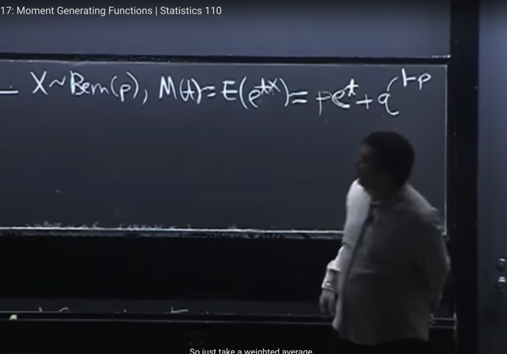</kbd>

> [!NOTE]
> Ta làm ví dụ**tìm MGF** của **Bern(p)** random variable.
>
> Thì **theo công thức MGF** vừa biết, MGF của X có công thức là **M(t) = E(e^tX)**
>
> để tìm **E(X)** của **discrete** random variable, ta sẽ tính **weighted** **sum** các **possible 
> value của X**, weight bởi **P(X=x)**. Thế thì**e^tX** dễ thấy sẽ **chỉ có 2 possible values**
> là **e^t** với xác suất xảy ra là **p** (chính là khi X=1, với xác suất xảy ra là p vì 
> X~Bern(p)) và **e^0 = 1** với xác suất xảy ra là **q = 1-p** (tương ứng với khi X = 0)
>
> Vậy nên **E(e^tx) = pe^1t + qe^0t = p*e^t + q**

> [!NOTE]
> MGF của Bern(p) = p*e^t + q

 

<kbd>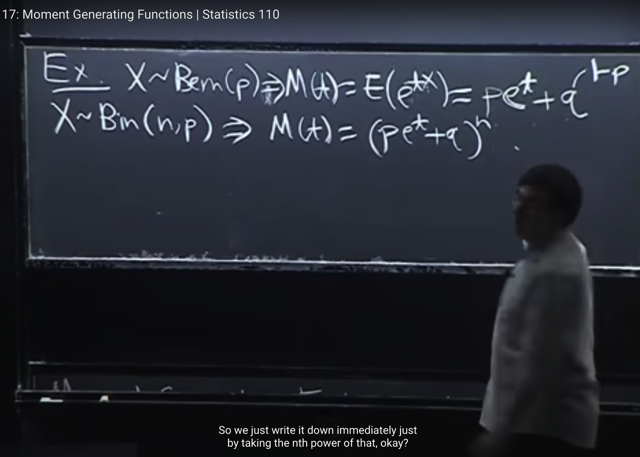</kbd>

🔗 **Related:** [LEC 22: TRANSFORMATIONS & CONVOLUTION](untitled.md#node-726)

> [!NOTE]
> Từ đó, ta có thể**tìm MGF** của **Bin(n, p)** r.v luôn.
>
> Gs nói để tính **E(e^tX)** với **X~Bin(n, p)** thì thay vì **phải** **dùng**
> **LOTUS** (tức là như đã biết, LOTUS cho phép khi tính E(g(X)), thay vì phải
> tìm PMF, PDF của g(X), ta  có thể chỉ cần dùng PMF, PDF của X)
>
> Ta có thể **dùng một cách tiệm cận khác** dựa trên sự thật **Binomial (n, p)
> random variable X** có thể được **hiểu theo cách thứ 2** mà ta biết bữa trước
> là**tổng của n indicator random variables Bern(p) X_j**.
>
> Và theo định nghĩa của Binomial, n trial / event này**i.i.d** tức là **independent**,
> **identical** (cùng ~**Bern(p)**).
>
> Do đó dựa trên theorem mà ta vừa học về MGF rằng nếu X, Y độc lập thì
> M_(X+Y)(t) = M_X(t) * M_Y(t) tức là MGF của tổng X+Y bằng MGF của X
> nhân MGF của Y. 
>
> Vậy ở đây **MGF của tổng n random variable X_j** này sẽ là **TÍCH của n MGF 
> của từng cái**.
>
> Và **MGF của mỗi X_j** đều là MGF của một Bern(p) r.v, như ta vừa tính, sẽ là
> **pe^t+q**
>
> Vậy MGF của tổng n Bern(p) X_j là **(pe^t+q)^n
>
> Vậy MGF của Binomial (n, p) = (p*e^t+q)^n**

> [!NOTE]
> MGF của Binomial (n, p) = (p*e^t+q)^n

 

<kbd>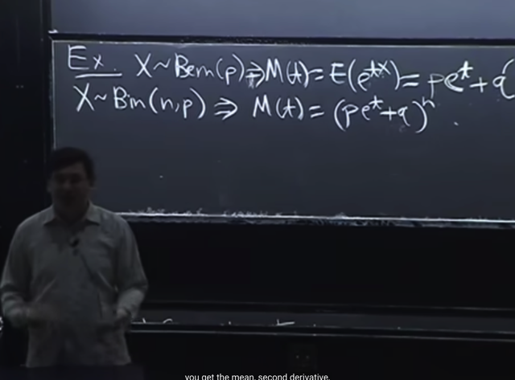</kbd>

> [!NOTE]
> Gs nói rằng với**MGF của Bin(n,p)**, ta có thể **check lại các mean và
> variance** của Bin(n,p)
>
> Theo **điểm số 1** trong các lí do MGF quan trọng, ta đã biết**đạo hàm cấp n
> của M(t)** **evaluate tại t=0,** là coefficient của **t^n/n! trong khi expand M(t)
> theo Taylor series** và**nó chính là n'th moment của X**, tức **E(X^n)**
>
> Nên theo đó **đạo hàm cấp 1 của M(t)** sẽ là 1st moment của X, **chính là EX**.
> Và ta đã biết từ bữa trước **EX của Bin(n, p) là np**. Vậy thì ta **kiểm tra lại**
> rằng liệu đạo hàm cấp 1 của M(t) và evaluate tại t=0 có phải là **np** không.
>
> Với M(t) = pe^t+q, thì để tìm dM/dt, dựa vào chain-rule, ta có:
>
> dM/dt = d(pe^t+q)^n / d(e^t+q) * d(pe^t +q) / dt = **n * (p*e^t+q)^(n-1) * p * e^t**
>
> = np * (p*e^t+q)^(n-1) * e^t 
>
> Thế thì tại t = 0, M'(0) = n * (p*e^0+q)^(n-1) * p * e^0 = n*(p*1+q)^(n-1) * p * 1
>
> = n*(p+1-p)^(n-1) * p = **n*1^(n-1)*p = np
>
> Vậy 1st derivative của M(t) tại 0 đúng là EX**====****Check 2nd derivative M(t) tại 0 xem có phải là E(X^2) để Var(X) = npq không:
>
> Thế thì M''(t) dĩ nhiên là ta sẽ tính (d/dt) của M'(t) = (d/dt) np * (p*e^t+q)^(n-1) * e^t 
> = **np** * (d/dt) (p*e^t+q)^(n-1) * e^t
>
> Để tính cái (d/dt) (p*e^t+q)^(n-1) * e^t, cần dùng product rule: (uv)' = u'v + uv' 
>
> u' = (d/dt) (p*e^t+q)^(n-1) = d (p*e^t+q)^(n-1) / d (p*e^t+q) * d (p*e^t+q) / dt
>
> = (n-1)*(p*e^t+q)^(n-2) * p*e^t, evaluate tại 0, u'(0) = (n-1)*(p*1+q)^(n-2)*p*1 = (n-1)*1*p 
> = **(n-1)*****p**
>
> v' = (d/dt) e^t = e^t, tại 0, v'(0) = e^0 = **1**
>
> u(0) = (p*e^0+q)^(n-1) = (p+q)^n-1 = **1**
>
> v(0) = e^0 = **1**
>
> Vậy (uv)'(0) = u'(0)v(0) + u(0)v'(0) = (n-1)*p*1 + 1*1 = (n-1)*p + 1 
>
> => M''(t) = np((n-1)*p + 1) = np^2(n-1) + np
>
> Var(X) = E(X^2) - (EX)^2 = np^2(n-1) + np - n^2p^2 =  n^2p^2 - np^2 + np - n^2p^2 = 
>
> = -np^2 + np = np(-p+1) = **npq 
>
> Vậy  2nd derivative M(t) đúng là E(X^2)**

 

<kbd>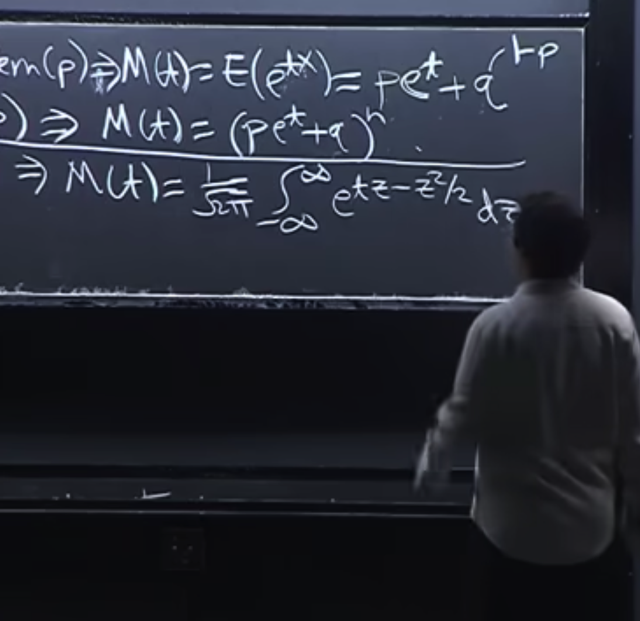</kbd>

<kbd></kbd>

<kbd>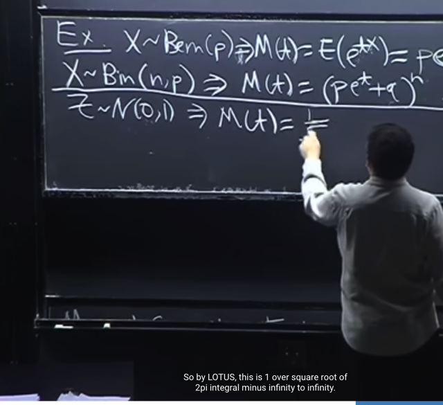</kbd>

> [!NOTE]
> tiếp ta sẽ làm qua **MGF** của **Normal** random variable. Thế thì gs nói rằng ta **sẽ làm với
> standard normal N(0,1)** trước thì sau đó ta có thể **làm với mọi normal (μ, σ)** thông
> qua **X = μ + σZ**
>
> Thế thì như đã biết **PDF của N(0,1)** là
>
> **f(z) = [1/√(2π)] e^(-z^2/2)**
>
> **E(Z) = ∫-infinity tới infinity zf(z)dz** (expected value là weighted sum các possible values,
> với weight là xác suất, với continuous r.v thì nó là dạng tích phân -inf:inf xf(x)dx)
>
> = ∫-infinity:infinity z (1/√(2π)) e^(-z^2/2) dz
>
> = (1/√(2π)) ∫-infinity:infinity z e^(-z^2/2) dz (đưa constant ra ngoài)
>
> Thì dùng LOTUS 
>
> E(e^(tz)) = (1/√(2π)) ∫-infinity:infinity **e^(tz)** * e^(-z^2/2) dz
>
> = **(1/√(2π)) ∫-infinity:infinity e^(tz-z^2/2) dz**

 

<kbd>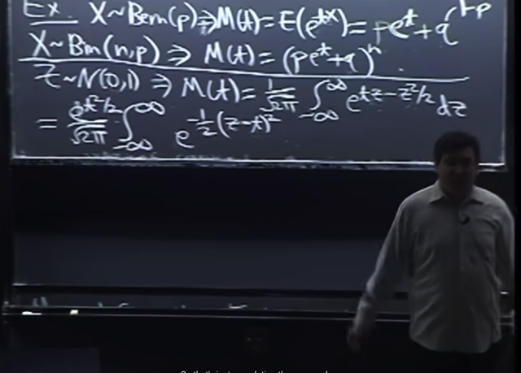</kbd>

> [!NOTE]
> Tiếp, để tính cái tích phân này, gs nói **nếu mà không có cái linear term**
> **tz** để chỉ có **-z^2/2** thì ta **sẽ dễ làm hơn** với tích phân của e^-z^2/2 vì nó
> giống như ta đã từng làm trước đây
>
> Còn bây giờ với cái linear term tz, thì ta sẽ nghĩ đến việc**completing the
> square**, ý nói **đưa tz-z^2/2 về dạng sum of square**, cụ thể là như sau:
>
> tz - z^2/2 = -(1/2)(z^2 - 2tz) =  -(1/2)(z^2 - 2tz + t^2 - t^2) 
>
> = -(1/2)(z^2 - 2tz + t^2) + t^2/2 = -(1/2)(z-t)^2 + t^2/2
>
> nên e^[tz - z^2/2] = e^[-(1/2)(z-t)^2 - t^2/2] = **e^[-(1/2)(z-t)^2**] * **e^[t^2/2]**
>
> và vì **e^[t^2/2] không dính đến z** nên đưa ra ngoài dấu tích phân
>
> nên còn lại e^(t^2/2)/√2π ∫e^[-(1/2)(z-t)^2] dz
>
> viết lại e^(t^2/2)/√2π **∫e^[-(z-t)^2/2] dz**để xem xét cái**∫e^[-(z-t)^2/2] dz**

 

<kbd>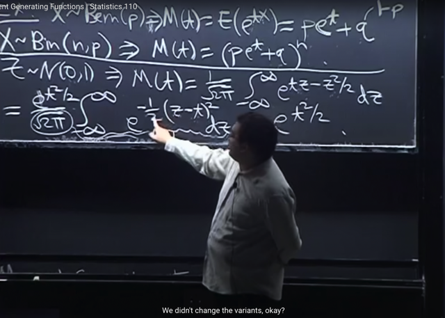</kbd>

🔗 **Related:** [-TÓM TẮT:   Z^(số lẻ), ta luôn có E(Z^(số lẻ) = 0, gọi là ODD MOMENT  - Symmetry còn giúp ta kết luận (nếu Z ~ N(0,1) thì -Z cũng là một N(0,1)  - X = μ + σZ sẽ ~ N(μ, σ^2)  - Sẽ tốt hơn nếu ta hiểu Standard Normal Z ~ N(0,1) trước, sau đó hiểu rằng khi scale và shift Z với σ và μ khác nhau thì ta sẽ có bất kì một Normal distribution N(μ, σ^2) nào  - PROPERTIES CỦA VAR(X):  + Var(X + c) = Var(X)  + Var(cX) = c^2*Var(X)  + Var(X) luôn không âm, và nó chỉ bằng 0 nếu X là constant  + Variance KHÔNG CÓ TÍNH LINEARITY:  + Var(X+Y) không bằng Var(X) + Var(Y) TRỪ KHI X, Y INDEPENDENT  X không i.i.d với chính nó X, mà nó EXTREMELY DEPENDENT với chính nó. Do đó bất cứ khi nào ta ÁP DỤNG CÔNG  THỨC NÀO ĐÓ MÀ CẦN CÁC RANDOM VARIABLE CÓ X1, X2 CÓ  TÍNH I.I.D VÀO X VÀ CHÍNH NÓ THÌ ĐỀU LÀ SAI  - CHỨNG MINH VAR X N(μ, σ) = σ^2  - Z = (X - μ) / σ và gs cho biết nó được gọi là STANDARDIZATION (chuẩn hóa)  Giúp từ NORMAL X ~ N(μ, σ) ta có STANDARD NORMAL Z ~ N(0,1)  - Xây dựng PDF của N(μ, σ^2) từ N(0, 1):  fX(x) = 1/(σ√2π) * [e^(-((x-μ)/σ)^2/2)]  - Nếu X ~ N(μ, σ^2) thì -X ~ N(-μ, σ^2  - Nếu X1 ~ N(μ1, σ1^2), X2 ~ N(μ2, σ2^2) và X1, X2 independent thì:  X1 + X2 ~ N(μ1 + μ2, σ1^2 + σ2^2)  X1 - X2 ~ N(μ1 - μ2, σ1^2 + σ2^2)  - 68-95-99.7 rule  - Chứng minh 0^k / k! + 1^k / k! + 2^k / k! + .... = e^k  ⇨ Tổng k=0,1...infinity λ^k/k! = e^λ  - Tìm variance của Poisson (λ) để chứng minh nó có MEAN VÀ VARIANCE ĐỀU LÀ λ  - Khi standardize, ví dụ đơn vị là km, thì (x - μ) / σ sẽ  (km - km) / km = km / km = 1 TỨC Ý NÓI LÀ KHÔNG CÒN CARE ĐƠN VỊ LÀ GÌ NỮA  - X~Bin(n,p), Var(X) = npq (q = 1-p)  - Chứng minh LOTIS](_tóm_tắt_zsố_lẻ_ta_luôn_có_ezsố_lẻ_0_gọi_là_odd_moment_symmetry_còn_giúp_ta_kết_luận_nếu_z_n01_thì_z.md#node-423)

🔗 **Related:** [TÓM TẮT:  - Tính MGF M(t) của Expo(1) = 1/(1-t) t < 1  - Khi đã có MGF, như bài trước ta đã biết các lí do mà MGF quan trọng trong đó có reason #1 đó là ta chỉ cần tính đạo hàm cấp n của nó sẽ cho ta n'th moment.  - Dù ta có thể tính đạo hàm nhiều lần để có 1st, 2nd moment nhưng có cách hay hơn. Bằng cách nhận ra 1/(1-t) liên quan đến Geometric series  a + ar + ar^2 = Tổng k=0:infinity a*r^k với |r| < 1 sẽ converge về a/[1-r]  Nên 1/1-t chính là Tổng n=0:infinity t^n với |t| < 1  Thế thì theo gs, từ đây cho phép ta KHỎI CẦN TÍNH ĐẠO HÀM CẤP N ĐỂ CÓ MOMENT THỨ N LÀM GÌ CHO MỆT, mà chỉ cần ĐỌC NÓ RA THÔI  Cụ thể là ta đã biết ở bài trước rằng, n'th moment = đạo hàm cấp n của M(t) (là coefficient của (t^n / n!) khi expand M(t) theo Taylor series tại 0)  Do đó, bằng cách tạo ra (t^n / n!) thì BẤT CỨ CÁI GÌ GẮN VỚI NÓ CHÍNH LÀ COEFFICIENT, VÀ CHÍNH LÀ N'TH MOMENT  Do đó ta sẽ nhân thêm n! và chia n! để có (t^n / n!). Như vậy cái lòi ra làm coefficient của t^n/n! ở đây là n! CHÍNH LÀ N'TH MOMENT.  Từ đó cho phép ta ĐỌC LUÔN RẰNG: 1ST MOMENT (EX) LÀ 1!, 2ND MOMENT E(X^2) LÀ 2!  N'TH MOMENT CỦA EXPO(1) E(X^n) = n!  -  đây là tính chất RẤT MẠNH CỦA MGF. Vì ví dụ như khi tính n'th moment (E[X^n]) thì nếu dùng LOTUS, ta phải TÍNH TÍCH PHÂN (INTEGRAL) VÀ CÓ THỂ GẶP NHỮNG TÍCH PHÂN RẤT PHỨC TẠP.  Trong khi đó, nếu ta có MGF, để có nth moment, ta CHỈ CẦN TÍNH DERIVATIVE MÀ DERIVATIVE THÌ THƯỜNG DỄ HƠN LÀ TÍNH TÍCH PHÂN  -Từ n'th moment của Expo(1) ta dễ dàng có n'th moment của Y ~ Expo(λ): E[Y^n] = n! / λ^n  - N'TH MOMENT CỦA N(0,1) VỚI N LẺ ĐỀU BẰNG 0  - MGF CỦA POIS(λ) = e^[λ(e^t-1)]  - Nếu Y ~ Pois(µ) và X~Pois(λ) và biết X, Y INDEPENDENT thì X+Y ~ Pois(λ+µ)](tóm_tắt_tính_mgf_mt_của_expo1_11_t_t_1_khi_đã_có_mgf_như_bài_trước_ta_đã_biết_các_lí_do_mà_mgf_quan_.md#node-575)

🔗 **Related:** [LEC 20: MULTINOMIAL AND CAUCHY](untitled.md#node-648)

> [!NOTE]
> Và ta sẽ nhận xét
>
> Ta đã biết **1/√(2π) e^-z^2/2 là PDF của N(0,1**)
>
> Nhớ lại khi đặt X = μ + σZ, thì ta có r.v X ~ N(μ, σ^2) 
>
> vậy X = Z - t = -t + 1*Z thì  X ~ N(-t, 1)
>
> Thế thì 1/√(2π) e^[(-(z-t)^2/2] là PDF của N(-t,1) **Và (1/√(2π) ∫ từ -infinity: infinity e^[(-(z-t)^2/2] dz
>
> đương nhiên phải bằng 1 vì đây là yêu cầu valid của pdf**Và từ đó toàn bộ tích phân cần tính (nhớ là ta đang tính MGF của Standard
> Normal) trở thành**e^t^2/2**

> [!NOTE]
> MGF CỦA N(0,1) M(t) = e^t^2/2

 

<kbd></kbd>

> [!NOTE]
> Ta sẽ thảo luận qua bài toán nổi tiếng gọi là
> **Laplace Rule of Succession:**

> [!NOTE]
> LAPLACE RULE OF SUCCESSION

 

<kbd></kbd>

> [!NOTE]
> Gọi**X1, X2....là chuỗi các i.i.d Bern (p**) random variables mà **mỗi r.v Xj** sẽ
> **map** với **event** "**Ngày thứ j mặt trời CÓ mọc**"
>
> Xác suất event mặt trời mọc vào ngày thứ n+1, dựa trên việc mặt trời đã mọc
> n ngày trước đó.
>
> (Ôn lại một chút ta đã biết **indicator** random variable **X** là cách ta **map**
> một **event A**, để **X sẽ = 1 nếu A xảy ra** và **X = 0 nếu A không xảy ra**. Ở
> đây **A_j**  chính là event**[ngày j mặt trời có mọc]** với xác suất xảy ra là
> **p**, xác suất  không xảy ra là 1-p, đây chính là ý nghĩa của việc nói các **Xj ~
> Bern(p)**

 

<kbd>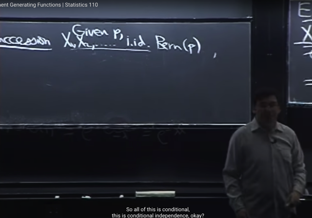</kbd>

> [!NOTE]
> Thế thì đại khái là ta cũng đã biết **bối cảnh có chuỗi các Bern (p) trials**
> như này từ các **Binomial(n, p)**(khi sampling có hoàn lại, nên mỗi event
> đều độc lập, và có xác suất thành công như nhau), **Hyper-Geometric(p)**
> (khi sampling không hoàn lại, nên các event không độc lập, và có xác suất
> thành công khác nhau)
>
> Có điều, bài toán của Laplace đặt ra là ta **KHÔNG BIẾT p**.
>
> Và do đó, **X1, X2...chỉ i.i.d** **NẾU NHƯ / CONDITIONED ON [TA BIẾT
> p]**, do đó đây là trường hợp của cái gọi là **CONDITIONAL INDEPENDENCE**

 

<kbd></kbd>

<kbd></kbd>

<kbd></kbd>

> [!NOTE]
> Thế thì với việc **p** unknown, có **2 cách tiếp cận khác nhau** của trường phải **Bayesian**
> và **Frequentist**
>
> **Bayesian** sẽ **đối xử với p** như **random variable** và **dùng distribution của nó** để **thể hiện
> sự không chắc chắn về giá trị của nó**. Và kiểu như **ban đầu ta sẽ có một prior belief**
> về distribution (sự không chắc về giá trị) của nó, sau đó **dựa trên data collected** được,
> ta mới **dùng Bayes rule để update** sự không chắc chắn này

 

<kbd>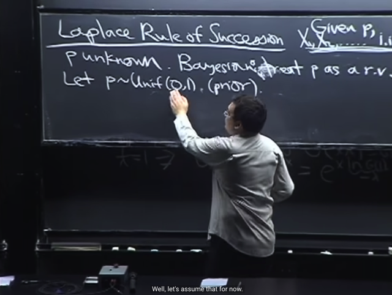</kbd>

> [!NOTE]
> Thế thì **Laplace** dùng **Uniform (0,1)** để thể hiện **prior distribution của p**, như
> vừa nói mang ý nghĩa là**phản ánh niềm tin ban đầu** về **sự không chắc chắc
> của giá trị p**. 
>
> Và gs nói **nhiều tranh luận** nổ ra xoay quanh việc **tại sao dùng
> Unif(0, 1)**, nhưng Laplace cho rằng nó phản ánh trạng thái ban đầu rằng TA
> H**OÀN TOÀN KHÔNG BIẾT GÌ VỀ GIÁ TRỊ CỦA P**
>
> Liên hệ một chút trong Deep Learning của Yoshua Bengio, ta cũng đã từng
> thấy qua việc dùng **Uniform** hoặc **Normal** để làm Prior

 

<kbd>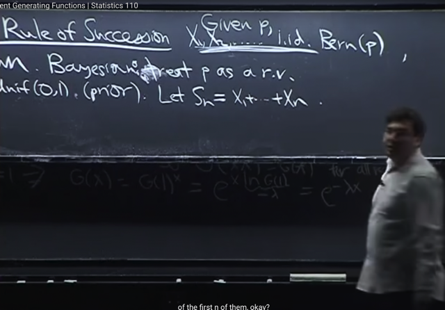</kbd>

> [!NOTE]
> Gọi **Sn** là**tổng của n indicator
> random variable đầu tiên X1 + X2 + ...Xn**

 

<kbd>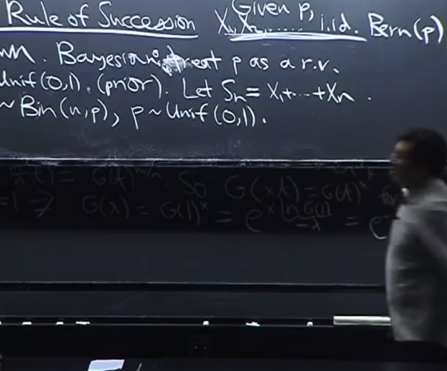</kbd>

<kbd></kbd>

<kbd></kbd>

> [!NOTE]
> Thế thì, như nãy ta đã nói, **chỉ khi nào** **dựa trên (conditioned on) việc biết p**, thì các Xj
> **mới có tính i.i.d**, vì i.i.d có nghĩa là **IDENTICAL**, tức có **cùng distribution**. Và chỉ khi đó, ta mới
> có các Xj i.i.d và cùng ~ Bern(p). Do đó,**lúc bấy giờ Sn như đã biết sẽ là Binomial (n,p)** r.v
>
> Do đó mới nói **Sn | p ~ Bin (n,p)**, với **p ~ Uniform (0, 1)** với ý nghĩa vừa nói, đó là **conditioned
> on việc biết giá trị của p**, vốn là / được tin rằng **p ~ một Uniform (0,1)** thì **Sn sẽ là ~ Bin(n,p)**

 

<kbd>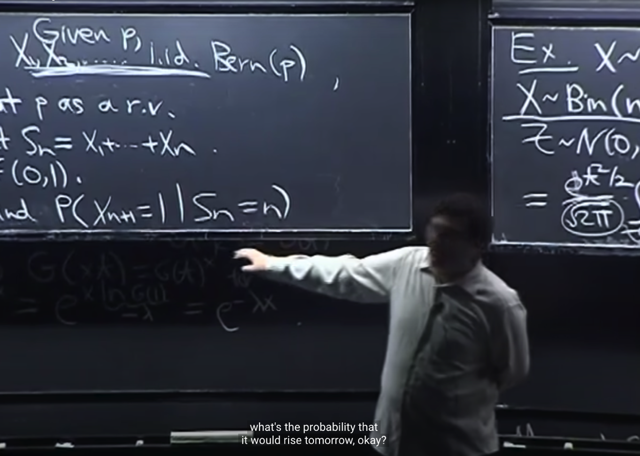</kbd>

<kbd></kbd>

<kbd>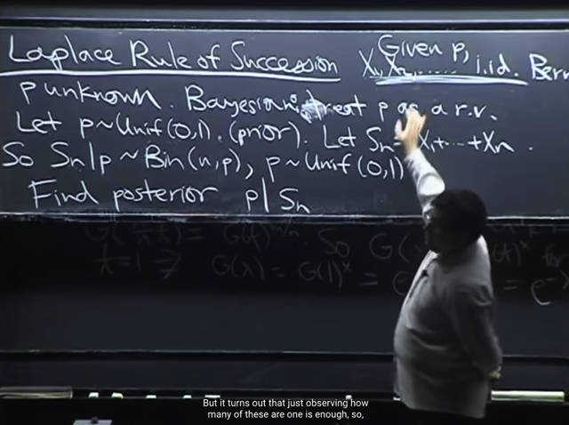</kbd>

> [!NOTE]
> Và nhiệm vụ bây giờ là tìm **posterior (p | Sn)** hay **p | {X1, X2...Xn}** cũng được với ý nghĩa là, **sau khi collecting data**
> tức là**thu được kết quả các giá trị của Xj**từ thử nghiệm thì ta sẽ **cập nhật lại niềm tin** về sự không chắc **về gía trị
> của p (tức là distribution của p)** như thế nào
>
> Nhắc lại, nãy giờ ta hay nói về "**sự không chắc chắn về giá trị của p**" chính là **nói về distribution của p**, vì theo Bayesian
> **distribution** chính là **cách ta thể hiện sự không chắc về gía trị của một random variable**
>
> Và sau đó ta **cần tìm thứ mà bài toán này của Laplace đặt ra**: Xác suất **mặt trời mọc vào ngày thứ n+1**, **dựa trên việc
> mặt trời đã mọc n ngày trước đó**.
>
> **P(Xn+1 = 1 | Sn = n)**, ở đây **Sn = n** chính là thể hiện event "mặt trời đã mọc n ngày trước đó" vì nó đồng nghĩa X1=X2..=Xn=1)

 

<kbd>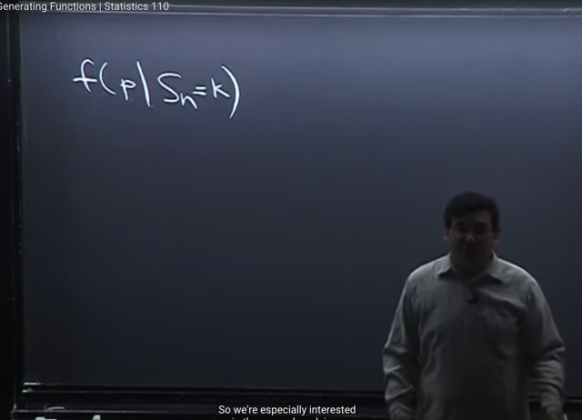</kbd>

> [!NOTE]
> đại khái là ta sẽ **đi tìm posterior distribution của p, tức là của p | Sn.** 
>
> do **p là continuous** nên ta sẽ **tìm PDF** của nó
>
> Thế thì cụ thể ta sẽ **tìm PDF của p | Sn**, gọi là **CONDITIONAL PDF** : **f(p|Sn=k)**
>
> gs nhắc lại **p** là continuous rv, mà **trước khi có data (giá trị của Sn)**, ta tin rằng 
> nó là **r.v ~ Uniform (0,1)**
>
> Nói về k, gs nói **nếu k = n**, thì có nghĩa là **mọi ngày 1,2..n mặt trời đều mọc**, và 
> đương nhiên ta quan tâm đến sự thật (event) này để dựa vào đó ta **tính P(Xn+1 = 1 | Sn=n).**
>
> Nhưng **để khái quát  hơn** ta cho rằng **mặt trời mọc k ngày trong n ngày**. Nên **Sn = k**

> [!NOTE]
> CONDITIONAL PDF

 

<kbd>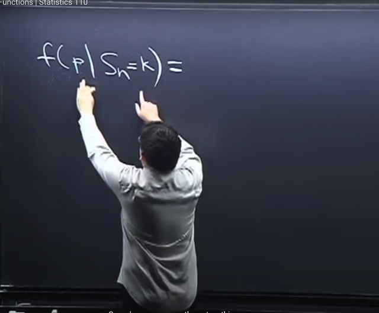</kbd>

> [!NOTE]
> tiếp, gs lót đường trước bằng cách nói rằng, hiện giờ **cái ta đang có
> f(p|Sn=k)** là **PDF** **chứ không phải là xác suất**.
>
> Nhưng ta **có thể hiểu nôm na nó là xác suất**, hay chính xác hơn thì đương
> nhiên là khi **nhân nó với một khoảng giá trị rất nhỏ** của p **thì ta có xác
> suất** (nói chung ý là ta **hiểu nôm na nó tương đương xác suất để mà áp
> dụng Bayes rule**)

 

<kbd>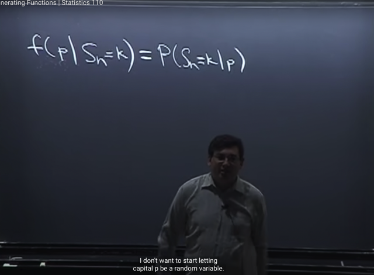</kbd>

> [!NOTE]
> Từ đó ta **áp dụng Bayes rule**, tới đây (chú ý là chưa xong), gs dừng lại
> để chú ý rằng: bình thường ta sẽ **dùng chữ viết hoa** ví dụ **X** để chỉ
> **random variable**, và chữ **viết thường x**, để chỉ **possible value** của nó.
> tức là một giá trị đã biết của p (gs gọi là known constant)
>
> Còn ở đây ta gặp tình huống hơi khó khi **p là random variable**, và ta
> **không muốn viết thành P**. Do đó **phải hiểu trong P(Sn=k | p) thì p là value
> của p** nhưng ví dụ như nói expected value của p chẳng hạn thì sẽ là
> **E(p)** thì khi đó **p ám chỉ random variable p**

 

<kbd>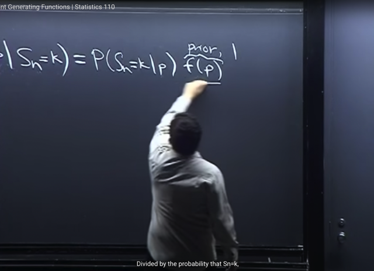</kbd>

🔗 **Related:** [TÓM TẮT:  Khác biệt đầu tiên giữa discrete và continuous là. sự xuất hiện của PDF thay vì PMF  Với continuous P(X=x) = 0  Do PMF P(X=x) USELESS, nên ta cần PDF  Qua continuous case, PDF. Ta không có xác suất mà là MẬT ĐỘ XÁC SUẤT. PROBABILITY PER SOMETHING.  PDF của X nếu P(a≤X≤b) = ∫a:b f(x)dx  Nếu a = b, thì theo định nghĩa trên, P(X=a) sẽ là integrate từ a đến a f(x)dx có ý nghĩa là DIỆN TÍCH BÊN DƯỚI ĐƯỜNG F(X) TỪ a TỚI a, ĐƯƠNG NHIÊN LÀ BẰNG 0 (hoặc tính cái tích phân này cũng sẽ phải ra 0)  2 điều kiện để PMF valid: f(x) luôn không âm và ∫ từ -infinity đến + infinity f(x)dx  phải bằng 1  f(x0) HOÀN TOÀN CÓ THỂ LỚN HƠN 1  ...Chưa tóm tắt xong](tóm_tắt_khác_biệt_đầu_tiên_giữa_discrete_và_continuous_là_sự_xuất_hiện_của_pdf_thay_vì_pmf_với_conti.md#node-369)

> [!NOTE]
> Tiếp, **P(Sn=k | p)** sẽ **nhân với f(p)** - chính là prior, và vì ta **chọn prior là
> Unif(0,1)** nên **f(p) = 1**
>
> (Nhớ lại khi học ở bài **Unif(a, b)** thì ta đã biết **yêu cầu để PDF valid** sẽ
> khiến **tích phân từ a đến b f(x)dx = 1**, và f**(x) = constant c** khi x trong đoạn
> [a, b] và 0 nếu x ngoài [a,b]. Từ đó ta tính ra **c** = 1/(b-a). Do đó **với Unif(0,
> 1)**, **f(x) = 1/(1-0) =** **1** khi x trong đoạn [0,1]

 

<kbd>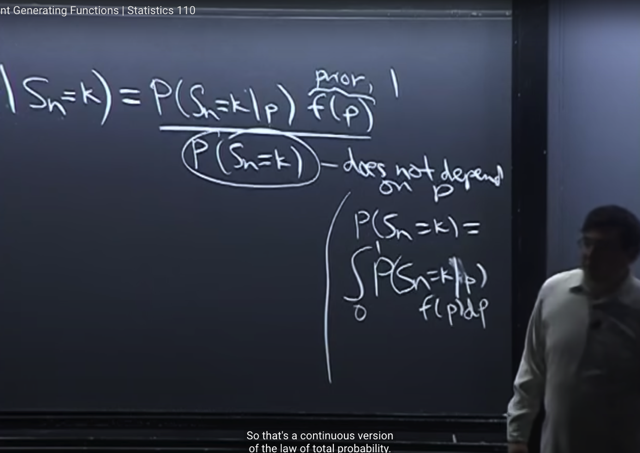</kbd>

> [!NOTE]
> Tiếp ta **chia cho P(Sn=k)**
>
> Gs cho biết **cái này không depend on p**, điều này là rõ ràng. 
>
> Và ông nói ta **chưa chính thức học** về LOTP, **Law of Total Probability** **ĐỐI VỚI**
> **CONTINUOUS** case nhưng nó **cũng tương tự với LOTP đối với discrete
> case.**
>
> Ôn lại một chút về **LOTP** với discrete case:
>
> Thì giả sử **p** có các possible value **p1, p2**...Ta sẽ lập luận như sau:
>
> (Sn=k) ⊂ Ω (sample space) ⇨ (Sn=k) ∩ Ω = (Sn=k)
>
> ⇔ (Sn=k) = (Sn=k) ∩ (p=p1 U p=p2 ...U p=pn)
>
> ⇔ (Sn=k) = [(Sn=k) ∩ (p=p1)] U [(Sn=k) ∩ (p=p2)] U ...U (Sn=k) ∩ (p=pn)]
>
> **⇔ (Sn=k) = (Sn = k, p = p1) U (Sn = k, p = p2) U ....**
>
> => P(Sn=k) = P[(Sn = k, p = p1) U (Sn = k, p = p2) U ....]
>
> các **event** (Sn = k, p = p1), (Sn = k, p = p2)...là **disjoint**
>
> nên **theo Axiom 2**: 
>
> P[(Sn = k, p = p1) U (Sn = k, p = p2)] = P(Sn = k, p = p1) + P(Sn = k, p = p2) + ....
>
> sẽ bằng **∑ pj: P(Sn=k, p=pj)**
>
> Vậy **P(Sn=k) = ∑ pj: P(Sn=k, p=pj)**
>
> Mà theo **conditional probability theorem**:**P(Sn=k, p=pj) = P(Sn=k|p=pj) * P(p=pj)**
>
> nên **P(Sn=k) = ∑ pj: P(Sn=k|p=pj) * P(p=pj)**
> Nếu p là **continuous random variable**, **P(Sn=k)** sẽ có **dạng tương đương** là:
>
> **P(Sn=k) = ∫-inf:inf P(Sn=k|p)f(p)dp = ∫0:1 P(Sn=k|p)f(p)dp**trong đó tích phân từ 0 tới 1 là vì p ~ Uniform (0,1) nên chỉ có giá trị từ 0 đến 1

 

<kbd>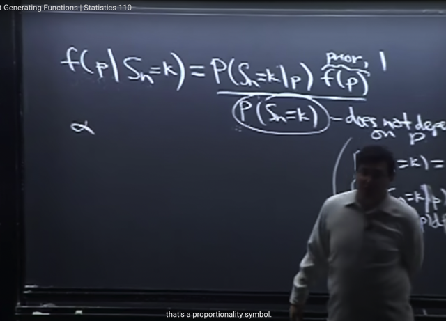</kbd>

> [!NOTE]
> Và tới đây ta thấy**phương trình trên thể hiện Bayes rule** mà ta đã biết, vốn dĩ
> chỉ là các **định lí hệ quả** của định nghĩa **conditional probability**:
>
> **P(A|B)P(B) = P(B|A)P(A)**
>
> Áp dụng ở đây f(p|Sn=k) * P(Sn=k) = P(Sn=k|p) * f(p)
>
> Nhắc lại ở đây ta**"coi như" PDF là xác suất** với điều kiện là ta hiểu khi **"nhân
> nó với 1 khoảng thay đổi rất nhỏ của biến" thì ta sẽ có xác suất**.
>
> Để ý hai vế đều là **[xác suất] * [mật độ xác suất].**

 

<kbd>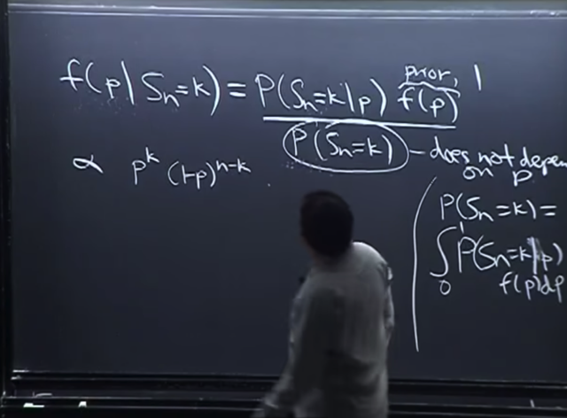</kbd>

🔗 **Related:** [-TÓM TẮT:   Bài toán Gambler's Ruin  - Random variable  - Bern(p) random variable  - Bin(n, p) random variable  - Định nghĩa của Distribution  - Công thức của PMF Bin (n, p)](_tóm_tắt_bài_toán_gamblers_ruin_random_variable_bernp_random_variable_binn_p_random_variable_định_ng.md#node-184)

> [!NOTE]
> Tới đây, ta sẽ lập luận thế này, dựa trên **sự thật là denominator ko phụ thuộc p**
> nên ta sẽ dùng khái niệm **TỈ LỆ THUẬN / PROPORTIONA**L
>
> để "nói" rằng, **cái f(p | Sn=k) ở trên sẽ tỉ lệ thuận với tử số** (bỏ qua mẫu số).
>
> Và trong tử số, xét cái **P(Sn=k|p)**: Như đã nói **DỰA TRÊN / CONDITIONED
> ON p** (tức là khi biết giá trị cụ thể của p) thì **Sn LÀ BINOMIAL (n, p)** random variable.
>
> Thế thì ta đã biết PMF của X~Bin(n,p): P(X=k) = **(n choose k) p^k q(n-k)** nên 
>
> P(Sn=k|p) = **(n choose k) p^k q^(n-k)**  =  (n choose k) p^k (1-p)^(n-k) 
>
> Tiếp**(n choose k) cũng không phụ thuộc p**, nên tiếp tục với việc đang dùng 
> tỉ lệ thuận ta có 
>
> f(p | Sn=k) ở trên sẽ tỉ lệ thuận **p^k (1-p)^(n-k)**

 

<kbd>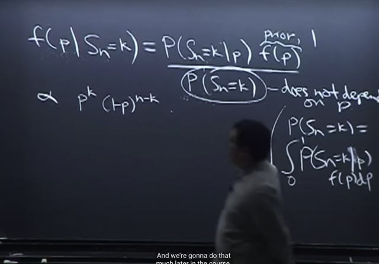</kbd>

> [!NOTE]
> Và để **có lại cái phần hằng số c**, để chuyển dấu **tỉ lệ thuận** thành dấu
> **bằng**, ta **sẽ phải tính tích phân để cho cái này bằng 1** (đương nhiên là
> vì đã nói f(p|Sn=k) là PDF) (và gs nói ta sẽ làm sau)

 

<kbd>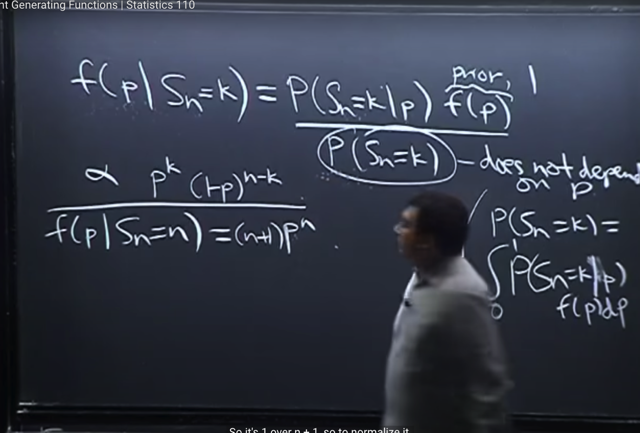</kbd>

> [!NOTE]
> Thế thì gs nói ta sẽ **tìm** **constant c**, giúp**chuyển dấu tỉ lệ thuận về dấu bằng**)
> sau ý là cho bài toán khái quát Sn=k
>
> Còn vì ở đây, ta **đang quan tâm k = n**, thì khi đó **f(p | Sn=n) tỉ lệ thuận với
> p^n * (1-p)^(n-n)** = **p^n**. Thì ta c**ó thể làm việc trên** dễ hơn tức là ta sẽ giải
> tìm c bằng cách cho:
>
> **∫0:1 c * p^n dp = 1**
>
> <=> c * {[nguyên hàm của p^n](1) - [nguyên hàm của p^n](0)} = 1
>
> nguyên hàm của p^n = [p^(n+1)]/(n+1)
>
> [nguyên hàm của p^n](1) = [1^(n+1)]/(n+1) = 1/(n+1)
>
> [nguyên hàm của p^n](0) = [0^(n+1)]/(n+1) = 0/(n+1)
>
> <=> c * [ 1/(n+1) - 0 ] = 1 <=> c / (n+1) =1 <=> c = **n+1
>
> Vậy f(p|Sn=n) = (n+1)*p^n**

 

<kbd>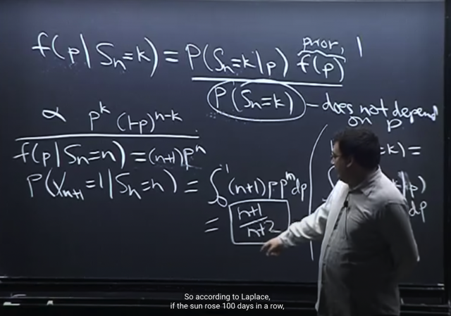</kbd>

> [!NOTE]
> Cuối cùng ta tính **P(Xn+1 = 1 | Sn = n)** thì gs cho rằng ta hãy **hiểu nó theo cách
> dùng fundamental bridge** để hiểu nó là **expected value của một indicator
> random variable**có **xác suất success quy định bởi f(p| Sn=n)**
>
> nhớ lại kiến thức về **fundamental bridge**, nó cho một connect giữa event A và
> indicator random variable gắn với nó X. Trong đó X = 1 khi A xảy ra và bằng 0
> khi A không xảy ra. Connection là : **P(A) = E(X)**
>
> Vậy **A** ở đây là event [**ngày thứ n+1 có măt trời mọc**], và **indicator** **random**
> **variable** là **Xn+1**.
>
> Do đó **P(Xn+1=1 | Sn=n) chính là P(A|Sn=n)** 
>
> Và theo fundamental bridge ta có **P(A|Sn=n) = E(Xn+1|Sn=n)**
>
> Thế thì gs cho rằng ta có thể coi Xn+1|Sn=n**như là một indicator random variable 
> Bern(p) với p là random variable có posterior distribution là f(p|Sn=n)  
>
> (***) Chỗ này gs nói "we just think of it this way ..." có nghĩa là sao
> nhưng tạm thời có thể hiểu vầy**Xj là indicator r.v Bern(p), gắn với event Aj. Fundamental bridge cho ta:
> P(Aj) = E(Xj) = p*1 + q*0**Nhưng p ở đây là random variable tuân theo distribution có pdf là f(p|Sn=k) 
> vừa xây dựng**Nên để dùng p **ta có thể dùng mean (expected value) của nó** 
>
> E(p) = ∫ 0 tới 1 p f(p|Sn=n) dp
> **Nên P(Xn+1=1| Sn=n) = E[p]*1 + (1-E[p])*0 = E[p]
>
> = ∫ 0 tới 1 p f(p|Sn=n) dp
>
> = ∫ 0 đến 1 (n+1)*p*p^n*dp = (n+1) / (n+2)**

 

