# Lec 18: MGF Continued

📊 **Progress:** `53` Notes | `56` Screenshots

---

<a id="node-562"></a>
## Tóm Tắt:

> [!NOTE]
> TÓM TẮT:
>
> ```text
> - Tính MGF M(t) của Expo(1) = 1/(1-t) t < 1
> ```
>
> `-` Khi đã có MGF, như bài trước ta đã biết các lí do mà MGF quan trọng
> trong đó có reason #1 đó là ta chỉ cần tính đạo hàm cấp n của nó sẽ cho
> ta n'th moment.
>
> `-` Dù ta có thể tính đạo hàm nhiều lần để có 1st, 2nd moment nhưng có
> cách hay hơn. Bằng cách nhận ra `1/(1-t)` liên quan đến Geometric series
>
> ```text
> a + ar + ar^2 = Tổng k=0:infinity a*r^k với |r| < 1 sẽ converge về a/[1-r]
> ```
>
> Nên `1/1-t` chính là Tổng `n=0:infinity` t^n với |t| < 1
>
> Thế thì theo gs, từ đây cho phép ta KHỎI CẦN TÍNH ĐẠO HÀM CẤP N
> ĐỂ CÓ MOMENT THỨ N LÀM GÌ CHO MỆT, mà chỉ cần ĐỌC NÓ RA
> THÔI
>
> Cụ thể là ta đã biết ở bài trước rằng, n'th moment `=` đạo hàm cấp n của
> M(t) (là coefficient của (t^n `/` n!) khi expand M(t) theo Taylor series tại 0)
>
> Do đó, bằng cách tạo ra (t^n `/` n!) thì BẤT CỨ CÁI GÌ GẮN VỚI NÓ
> CHÍNH LÀ COEFFICIENT, VÀ CHÍNH LÀ N'TH MOMENT
>
> Do đó ta sẽ nhân thêm n! và chia n! để có (t^n `/` n!). Như vậy cái lòi ra làm
> coefficient của `t^n/n!` ở đây là n! CHÍNH LÀ N'TH MOMENT.
>
> Từ đó cho phép ta ĐỌC LUÔN RẰNG: 1ST MOMENT (EX) LÀ 1!, 2ND
> MOMENT `E(X^2)` LÀ 2!
>
> N'TH MOMENT CỦA EXPO(1) `E(X^n)` `=` n!
>
> `-`  đây là tính chất RẤT MẠNH CỦA MGF. Vì ví dụ như khi tính n'th
> moment `(E[X^n])` thì nếu dùng LOTUS, ta phải TÍNH TÍCH PHÂN
> (INTEGRAL) VÀ CÓ THỂ GẶP NHỮNG TÍCH PHÂN RẤT PHỨC TẠP.
>
> Trong khi đó, nếu ta có MGF, để có nth moment, ta CHỈ CẦN TÍNH
> DERIVATIVE MÀ DERIVATIVE THÌ THƯỜNG DỄ HƠN LÀ TÍNH TÍCH
> PHÂN
>
> `-Từ` n'th moment của Expo(1) ta dễ dàng có n'th moment của Y ~ Expo(λ):
> `E[Y^n]` `=` n! `/` λ^n
>
> `-` N'TH MOMENT CỦA N(0,1) VỚI N LẺ ĐỀU BẰNG 0
>
> `-` MGF CỦA POIS(λ) `=` `e^[λ(e^t-1)]`
>
> `-` Nếu Y ~ Pois(µ) và X~Pois(λ) và biết X, Y INDEPENDENT thì `X+Y` ~
> `Pois(λ+µ)`

<br>

<a id="node-563"></a>

<p align="center"><kbd>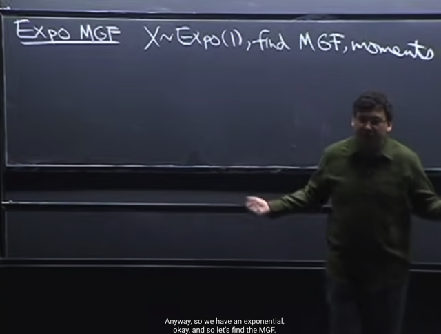</kbd></p>

🔗 **Related:** [TÓM TẮT:  - Tiếp tục Expo(λ): PDF CỦA EXPO(λ): f(x) = λ e^(-λx) x > 0  - Check tính valid của PDF của Expo  - CDF CỦA EXPO(λ) : F_X(x) = 1 - e^(-λx)  - X ~ Expo(λ) thì  Y = λX thì Y sẽ ~ Expo(1)  - Chứng minh rằng X ~ Expo(λ) thì  Y = λX thì Y sẽ ~ Expo(1)  - EX OF EXPO(1) = 1  - VARIANCE OF EXPO(1) = 1  - X~EXPO(λ) thì Y= λX sẽ ~EXPO(1)   EY = 1 ⇨ E(X) = E(Y/λ) = 1/λ EY = 1/λ  VARIANCE OF EXPO(λ) = 1/λ^2  Var(Y) = 1 ⇨ Var(X) = Var(Y/λ) = (1/λ^2) Var(Y) = (1/λ^2)  Memoryless thể hiện bởi equation: P(X ≥ s+t | X ≥ s) = P(X ≥ t)  chứng minh nếu X ~ Expo(λ) thì nó sẽ thỏa mãn Memoryless equation   P(X ≥ s), thì cái này gọi là Survivor function  Survivor function với X~Expo(λ): P(X ≥ s) = e^(-λs)  -Nhờ tính chất Memoryless nên nếu X~Expo(λ) E(X|X > a) = a + 1 / λ](tóm_tắt_tiếp_tục_expoλ_pdf_của_expoλ_fx_λ_e_λx_x_0_check_tính_valid_của_pdf_của_expo_cdf_của_expoλ_f.md#node-496)

🔗 **Related:** [TÓM TẮT:  - Tiếp tục Expo(λ): PDF CỦA EXPO(λ): f(x) = λ e^(-λx) x > 0  - Check tính valid của PDF của Expo  - CDF CỦA EXPO(λ) : F_X(x) = 1 - e^(-λx)  - X ~ Expo(λ) thì  Y = λX thì Y sẽ ~ Expo(1)  - Chứng minh rằng X ~ Expo(λ) thì  Y = λX thì Y sẽ ~ Expo(1)  - EX OF EXPO(1) = 1  - VARIANCE OF EXPO(1) = 1  - X~EXPO(λ) thì Y= λX sẽ ~EXPO(1)   EY = 1 ⇨ E(X) = E(Y/λ) = 1/λ EY = 1/λ  VARIANCE OF EXPO(λ) = 1/λ^2  Var(Y) = 1 ⇨ Var(X) = Var(Y/λ) = (1/λ^2) Var(Y) = (1/λ^2)  Memoryless thể hiện bởi equation: P(X ≥ s+t | X ≥ s) = P(X ≥ t)  chứng minh nếu X ~ Expo(λ) thì nó sẽ thỏa mãn Memoryless equation   P(X ≥ s), thì cái này gọi là Survivor function  Survivor function với X~Expo(λ): P(X ≥ s) = e^(-λs)  -Nhờ tính chất Memoryless nên nếu X~Expo(λ) E(X|X > a) = a + 1 / λ](tóm_tắt_tiếp_tục_expoλ_pdf_của_expoλ_fx_λ_e_λx_x_0_check_tính_valid_của_pdf_của_expo_cdf_của_expoλ_f.md#node-497)

> [!NOTE]
> Bài này ta sẽ **tiếp tục thảo luận về MGF**, cụ thể là tiếp tục đi qua **MGF**
> của **các distribution quan trọng,** đầu tiên là **Exponential**.
>
> Thế thì như đã nói ở bài giảng về **Exponential**, nếu **X ~ Expo(λ)** thì chỉ
> bằng cách nhân X cho λ: **Y `=` λX** thì **Y sẽ ~ Expo(1)** (link hồng)
>
> Nên ta **sẽ làm việc với X ~ Expo(1)** để cho đơn giản (λ `=` 1) và khi muốn
> làm việc với Expo(λ) thì chỉ việc thay bằng X `=` `X/λ`
>
> và ta sẽ **đi tìm MGF** và **moments** của nó.
>
> gs nói sơ rằng chữ **moments**, có xuất xứ từ **vật lý** (Physic) và sự thật
> có **rất nhiều điểm tương đồng giữa variance** (trong **statistic**) với
> **moment of inertia** (mô men quán tính)

<br>

<a id="node-564"></a>

<p align="center"><kbd>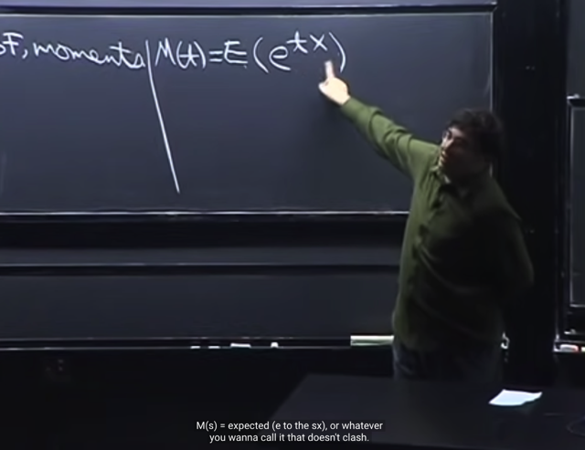</kbd></p>

> [!NOTE]
> Như đã biết **MGF** của r.v **X**, **M(t)** theo định nghĩa chỉ là **expected
> value của e^tX**: `E(e^tX)`
>
> Gs nói lại một điều đã nói bữa trước, đó là t chỉ là **dummy** **variable**, ta**có thể dùng s, w gì cũng được**. Cái ý quan trọng cần nhấn mạnh đó là **X
> là random variable** nên **apply một function f(x) vào nó** f(X) này là tên hay
> dùng để chỉ function chứ không nói gì tới pdf đâu nhé) thì**ta sẽ có một
> random variable.**Và function f(x) đó ở đây có công thức là e^tX. Chú ý, luôn phải viết hoa
> chữ X, vì X ám chỉ random variable X. Và ý nghĩa của MGF M(t) của r.v X là,
> nó là hàm số được tính bằng cách i) **apply hàm e^tx lên X**, để có **e^tX**,
> và như đã biết, đây là **một r.v mới**, từ đó ta sẽ ii) Tính mean của nó:
> `E(e^tX).`
>
> Nhớ rằng  khi **apply function vào random variable X** ta có f(X) `=` e^tX
> **cũng là random variable** nên đương nhiên **có thể hợp lệ để tính
> expected value**.
>
> Nên function theo t, M(t) này mang ý nghĩa là, **định nghĩa ra một function
> f(x) `=` e^tx** để rồi **apply nó lên random variable X** để có một random
> variable mới, và **lấy expected value của random variable này**

<br>

<a id="node-565"></a>

<p align="center"><kbd>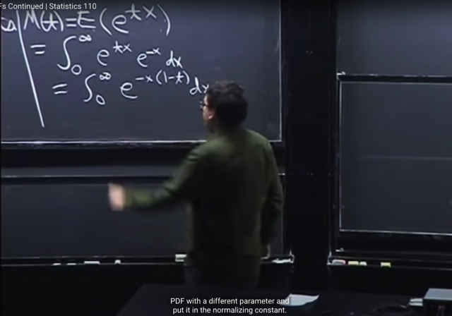</kbd></p>

> [!NOTE]
> Thế thì để tính **EX** với X là **continuous** random variable, ta sẽ theo công thức
> đã biết đó là **weighted sum các possible value của**X với**weight là xác suất
> mang giá trị đó**. Với continuous r.v thì nó có dạng:
>
> `∫-infinity:infinity` **x f(x)dx** (1) với f(x) là PDF 
>
> Với Expo(λ) thì PDF là fX(x) `=` `λe^-λx` với x ∈ [0, inf) 
>
> ⇨ **X ~ Expo(1)** thì **f(x) `=` e^-x** nếu**x > 0** và **bằng 0 nếu x `<=` 0** nên tích phân 
> từ `-infinity` tới infinity **chỉ còn**là từ **0-infinity**
>
> nên (1) `=∫0:infinity` **x * `e^(-x)` dx**
>
> Nhưng giờ ta cần tính **E(g(X)) `=` E[e^tX]** nên theo **LOTUS** cho phép**dùng ngay 
> PDF của X** thay vì phải tìm PDF của g(X)
>
> `=` tích phân từ 0 đến infinity của **g(x) * `e^(-x)` dx**
>
> `=` tích phân từ 0 đến infinity của **e^(tx) * `e^(-x)` dx**= tích phân từ 0 đến infinity của **e^(tx `-` x)** dx
> ****= tích phân từ 0 đến infinity của **e^[x(t `-` 1)]** dx
> **= tích phân từ 0 đến infinity của `e^[-x(1` `-` t)] dx**

<br>

<a id="node-566"></a>

<p align="center"><kbd>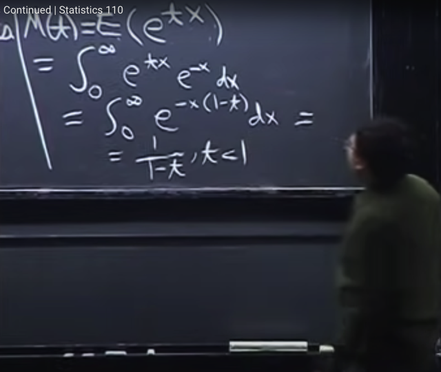</kbd></p>

🔗 **Related:** [TÓM TẮT:  - Tiếp tục Expo(λ): PDF CỦA EXPO(λ): f(x) = λ e^(-λx) x > 0  - Check tính valid của PDF của Expo  - CDF CỦA EXPO(λ) : F_X(x) = 1 - e^(-λx)  - X ~ Expo(λ) thì  Y = λX thì Y sẽ ~ Expo(1)  - Chứng minh rằng X ~ Expo(λ) thì  Y = λX thì Y sẽ ~ Expo(1)  - EX OF EXPO(1) = 1  - VARIANCE OF EXPO(1) = 1  - X~EXPO(λ) thì Y= λX sẽ ~EXPO(1)   EY = 1 ⇨ E(X) = E(Y/λ) = 1/λ EY = 1/λ  VARIANCE OF EXPO(λ) = 1/λ^2  Var(Y) = 1 ⇨ Var(X) = Var(Y/λ) = (1/λ^2) Var(Y) = (1/λ^2)  Memoryless thể hiện bởi equation: P(X ≥ s+t | X ≥ s) = P(X ≥ t)  chứng minh nếu X ~ Expo(λ) thì nó sẽ thỏa mãn Memoryless equation   P(X ≥ s), thì cái này gọi là Survivor function  Survivor function với X~Expo(λ): P(X ≥ s) = e^(-λs)  -Nhờ tính chất Memoryless nên nếu X~Expo(λ) E(X|X > a) = a + 1 / λ](tóm_tắt_tiếp_tục_expoλ_pdf_của_expoλ_fx_λ_e_λx_x_0_check_tính_valid_của_pdf_của_expo_cdf_của_expoλ_f.md#node-492)

🔗 **Related:** [LEC 24: GAMMA DISTRIBUTION & POISSON](untitled.md#node-760)

> [!NOTE]
> thế thì tích phân này **gs cho rằng cũng dễ giải**, nhưng có thể khỏi cần giải mà
> chỉ cần nhận định **nếu nhân (1-t)** vào `e^[-x(1-t)]`
>
> Thì nếu t < 1 để **(1 `-` t) > 0** ta sẽ có **(1-t) e^[-x(1-t)]** chính là **PDF của
> Expo(1-t)** (tức là Expo(λ) với **λ `=` `1-t` dương**
>
> (Xem lại định nghĩa bài trước ta đã biết PDF của Expo(λ) là `λe^(-λx),` và PDF của
> Expo(1) dễ thấy sẽ là `e^-x` như đã nói hồi nãy)
>
> nên**nhân và chia bớt cho (1-t),**tích phân từ 0 đến infinity của `e^[-x(1-t)]` dx sẽ
> là
>
> **(1/1-t)** * ∫0:inf(**1-t) `e^[-x(1-t)]` dx**
>
> và tích phân này **đương nhiên là bằng 1** vì nó là tích phân `-inf:inf` của PDF
> của `Expo(1-t)` theo tính chất, **để valid thì nó phải bằng 1**.
>
> Vậy cái tích phân mình cần tính là **1/(1-t) với điều kiện t<1**

> [!NOTE]
> ```text
> - Tính MGF M(t) của Expo(1) = 1/(1-t) t < 1
> ```

<br>

<a id="node-567"></a>

<p align="center"><kbd>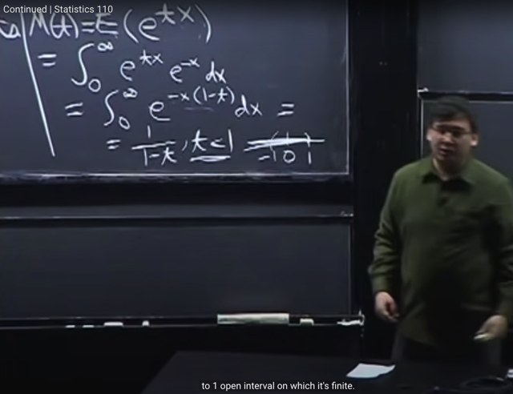</kbd></p>

🔗 **Related:** [LEC 17: MOMENT GENERATING FUNCTIONS](untitled.md#node-528)

> [!NOTE]
> Thế thì, nếu **t > 1** ta **sẽ có vấn đề** khi **tích phân này sẽ blow up** (chỗ này chưa
> hiểu lắm) nhưng gs nói, điều này không sao, vì theo bài trước ta đã nghe gs
> nói **đại khái là (để MGF hữu ích)** **chỉ cần** nó finite trong một khoảng **(-a, a) a>0
> nào đó quanh 0.**
>
> Thì trong trường hợp này, khoảng đó là **(-infinity, 1)** hoặc ta có thể nói rằng trong 
> (**-1, 1)**. (có nghĩa là yêu cầu t<1 cho phép function finite trong khoảng `(-1,` 1) nên
> thỏa yêu cầu về tính valid của MGF

<br>

<a id="node-568"></a>

<p align="center"><kbd>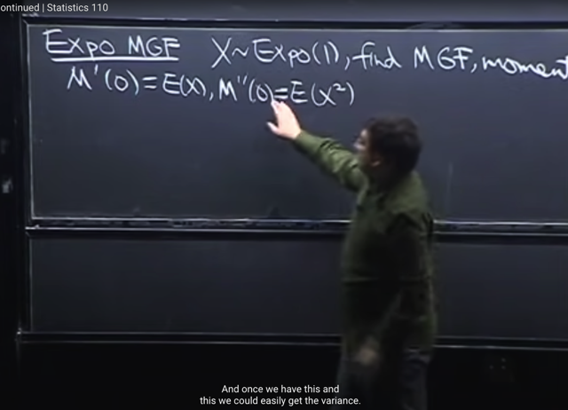</kbd></p>

> [!NOTE]
> Rồi thế thì **khi đã có MGF**, như bài trước ta đã biết **các lí do mà MGF
> quan trọng** trong đó có reason #1 đó là ta c**hỉ cần tính đạo hàm cấp n**
> của nó **sẽ cho ta n'th moment.**
>
> Và **1st moment là EX**, nên bằng cách lấy đạo hàm cấp 1 của M(t) `=` `1/(1-t)`
> ta sẽ có EX chính là mean.
>
> và bằng cách lấy**đạo hàm cấp 2**, ta sẽ có **2nd moment** chính là **E(X^2)**
> ```text
> và từ đó giúp ta tính Var(X) = E(X^2) - (EX)^2
> ```
>
> Và ta có thể làm như vậy để check với các kết quả đã tính EX, `Var(X)` bữa
> trước.

<br>

<a id="node-569"></a>

<p align="center"><kbd>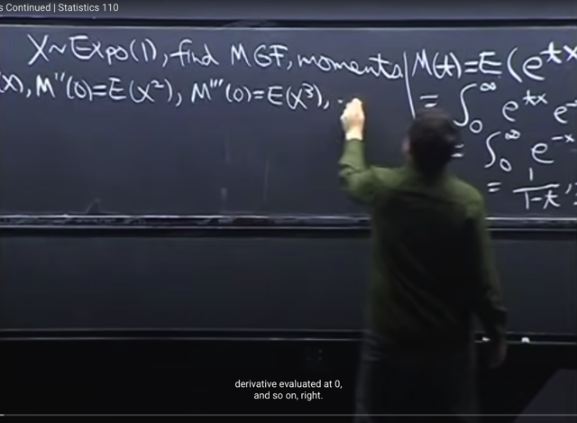</kbd></p>

> [!NOTE]
> tương tự như vậy ta có thể
> tính 3nd, 4th moment ...

<br>

<a id="node-570"></a>

<p align="center"><kbd>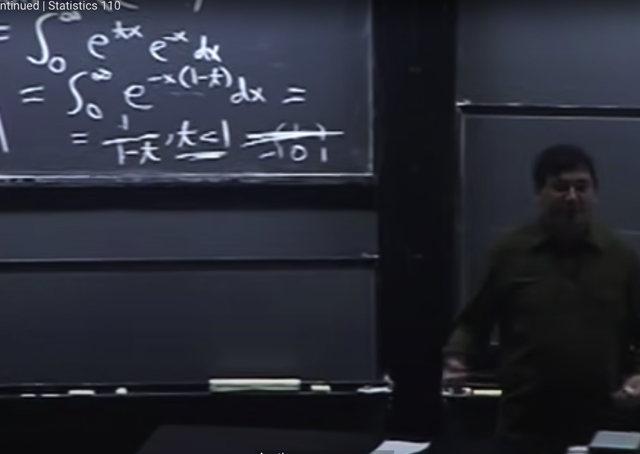</kbd></p>

🔗 **Related:** [TÓM TẮT:  Tiếp tục về CDF: Định nghĩa của CDF  Bước nhảy của CDFD là giá trị PMF tại đó  Tính chất của CDF: 1) Non decreasing, 2) right continuous và   3) F(x) -> 0 khi x -> -infinity, F(x) -> 1 khi x -> -infinity  - Định nghĩa Independent random variables theo independent event:  X, Y độc lập khi  + Continuous rv: P(X≤x, Y≤y) = P(X≤x) * P(Y≤y) với mọi x, y   + Discrete rv: P(X=x,Y=y) = P(X=x)*P(Y=y)  - Expected value: Là con số tóm tắt distribution của r.v  - Hai cách tính average  - E(X) = Σx x*P(X=x)  - X ~ Bern(p) thì E(X) = p  - FUNDAMENTAL BRIDGE: E(X) = P(A), X là indicator rv mang giá trị = 1 khi event A xảy ra và 0 khi ngược lại  - X ~ Bin(n, p):  E(X) = ∑ k=0,1..n [ k * (n choose k)*p^k*q^(n-k)] = ..= np  - TÍNH LINEARITY CỦA AVERAGE  - Tính lại E(X) của Bin(n, p) nhanh hơn bằng linearity, fundamental bridge và E(X) của Bern(p)  - TÍnh E(X) của Hypergeometric Dù các trial không độc lập nhưng dùng Symmetry, linearity, fundamental bridge vẫn tính được  - X ~ Geom(p): P(X=k) = q^k*p  - E(X) = p Σ k=0:infinity [k * q^k]](tóm_tắt_tiếp_tục_về_cdf_định_nghĩa_của_cdf_bước_nhảy_của_cdfd_là_giá_trị_pmf_tại_đó_tính_chất_của_cd.md#node-259)

> [!NOTE]
> Gs nói dù ta có thể**tính đạo hàm nhiều lần để có 1st, 2nd** moment nhưng **có**
> **cách hay hơn**. Bằng cách **nhận ra 1/(1-t)** liên quan đến **Geometric** series
>
> gs: **Bất cứ khi nào ta thấy 1 chia cho 1 trừ cái gì đó thì ta nên luôn nghĩ đến
> Geometric series**.
>
> Và ta có thể **dùng nó theo 2 hướng**:
>
> 1) là **có một Geometric series result**, ta sẽ **expand** nó thành **Geometric
> series** hoặc
>
> 2) ngược lại **có Geometric series** ta sẽ **collapse** nó thành dạng **Geometric
> series result**

<br>

<a id="node-571"></a>

<p align="center"><kbd>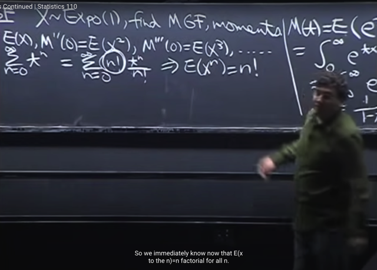</kbd></p>

<p align="center"><kbd>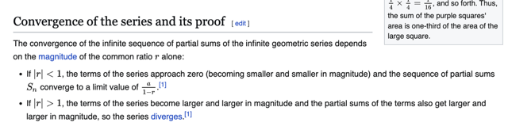</kbd></p>

<p align="center"><kbd>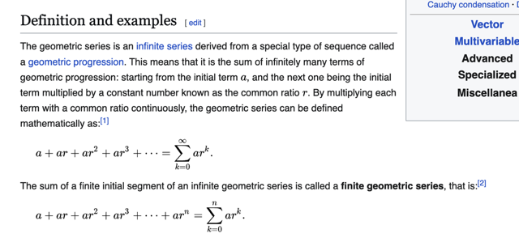</kbd></p>

<p align="center"><kbd></kbd></p>

<p align="center"><kbd></kbd></p>

<p align="center"><kbd></kbd></p>

<p align="center"><kbd>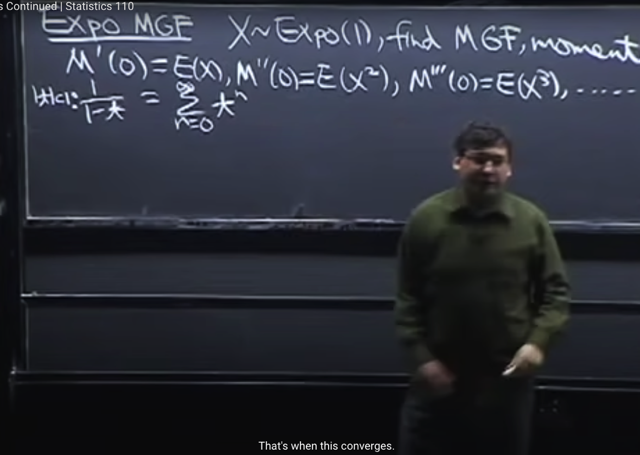</kbd></p>

🔗 **Related:** [LEC 17: MOMENT GENERATING FUNCTIONS](untitled.md#node-534)

> [!NOTE]
> Thế thì lý thuyết của Geometric series cho ta biết
>
> ```text
> a + ar + ar^2 = Tổng k=0:infinity a*r^k với |r| < 1 sẽ converge về a/[1-r]
> ```
>
> Nên `1/1-t` chính là **Tổng `n=0:infinity` t^n** với |t| < 1
>
> Thế thì theo gs, từ đây cho phép ta **KHỎI CẦN TÍNH ĐẠO HÀM CẤP N ĐỂ CÓ MOMENT THỨ
> N LÀM GÌ CHO MỆT**, mà chỉ cần **ĐỌC NÓ RA THÔI**
>
> Cụ thể là ta đã biết ở bài trước rằng, **n'th moment** =**đạo hàm cấp n của M(t)** (là **coefficient
> của (t^n `/` n!) khi expand M(t) theo Taylor series tại 0)
>
> Do đó, bằng cách tạo ra (t^n `/` n!) thì BẤT CỨ CÁI GÌ GẮN VỚI NÓ CHÍNH LÀ COEFFICIENT, VÀ
> CHÍNH LÀ N'TH MOMENT**Do đó ta sẽ**nhân thêm n!** và**chia n!** để có (t^n `/` n!). Như vậy cái **lòi ra làm coefficient của
> t^n/n!** ở đây là**n! CHÍNH LÀ N'TH MOMENT.**
>
> Từ đó cho phép ta **ĐỌC LUÔN RẰNG: 1ST MOMENT (EX) LÀ 1!, 2ND MOMENT `E(X^2)` LÀ 2!**

<br>

<a id="node-572"></a>

<p align="center"><kbd>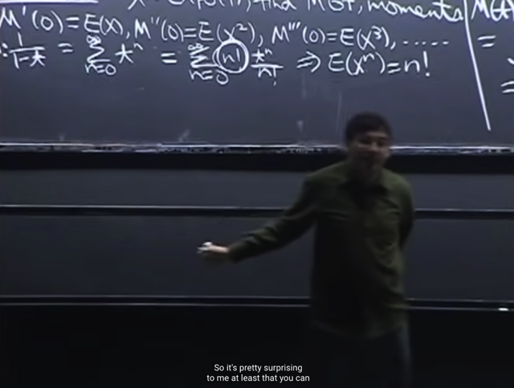</kbd></p>

> [!NOTE]
> Gs cho biết đây là **tính chất RẤT MẠNH CỦA MGF**. Vì ví dụ như khi **tính n'th
> moment (E[X^n])** thì nếu dùng **LOTUS**, ta phải **TÍNH TÍCH PHÂN (INTEGRAL)**
> VÀ **CÓ THỂ GẶP NHỮNG TÍCH PHÂN RẤT PHỨC TẠP.**
>
> Trong khi đó, nếu ta có MGF, để có nth moment, ta CHỈ CẦN TÍNH DERIVATIVE
> MÀ **DERIVATIVE THÌ THƯỜNG DỄ HƠN LÀ TÍNH TÍCH PHÂN**

> [!NOTE]
> N'TH MOMENT CỦA EXPO(1) `E(X^n)` `=` n!

<br>

<a id="node-573"></a>

<p align="center"><kbd>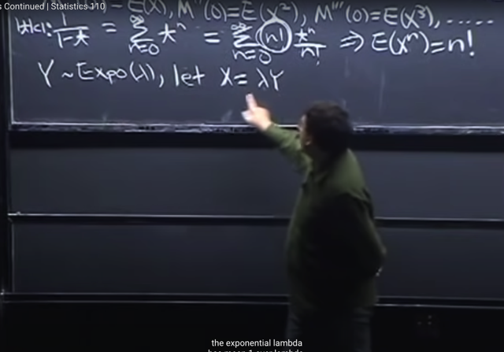</kbd></p>

🔗 **Related:** [TÓM TẮT:  - Tiếp tục Expo(λ): PDF CỦA EXPO(λ): f(x) = λ e^(-λx) x > 0  - Check tính valid của PDF của Expo  - CDF CỦA EXPO(λ) : F_X(x) = 1 - e^(-λx)  - X ~ Expo(λ) thì  Y = λX thì Y sẽ ~ Expo(1)  - Chứng minh rằng X ~ Expo(λ) thì  Y = λX thì Y sẽ ~ Expo(1)  - EX OF EXPO(1) = 1  - VARIANCE OF EXPO(1) = 1  - X~EXPO(λ) thì Y= λX sẽ ~EXPO(1)   EY = 1 ⇨ E(X) = E(Y/λ) = 1/λ EY = 1/λ  VARIANCE OF EXPO(λ) = 1/λ^2  Var(Y) = 1 ⇨ Var(X) = Var(Y/λ) = (1/λ^2) Var(Y) = (1/λ^2)  Memoryless thể hiện bởi equation: P(X ≥ s+t | X ≥ s) = P(X ≥ t)  chứng minh nếu X ~ Expo(λ) thì nó sẽ thỏa mãn Memoryless equation   P(X ≥ s), thì cái này gọi là Survivor function  Survivor function với X~Expo(λ): P(X ≥ s) = e^(-λs)  -Nhờ tính chất Memoryless nên nếu X~Expo(λ) E(X|X > a) = a + 1 / λ](tóm_tắt_tiếp_tục_expoλ_pdf_của_expoλ_fx_λ_e_λx_x_0_check_tính_valid_của_pdf_của_expo_cdf_của_expoλ_f.md#node-501)

> [!NOTE]
> Tiếp theo ta sẽ thảo luận vấn đề này với khái quát của **Exponential**: Expo(λ)
>
> Thế thì cho Y ~ Expo(λ). Thì X `=` λY thì X sẽ ~ Expo(1). Ông nói bí quyết để
> nhớ là **hãy nhớ Expo(λ) có mean `=` 1/λ**.
>
> Nên nếu Y ~ Expo(λ) thì mean Y tức EY `=` `1/λ,` thì để có random variable có
> mean `=` 1 thì ta phải nhân với λ. Nên X `=` λ*Y sẽ là ~ Expo(1)

<br>

<a id="node-574"></a>

<p align="center"><kbd>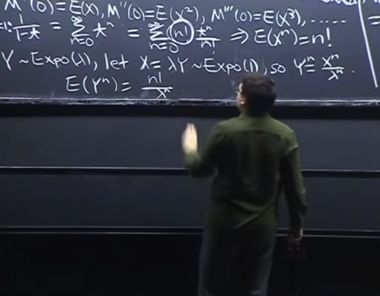</kbd></p>

> [!NOTE]
> ```text
> Từ đó X = λY <=> Y = X/λ
> ```
>
> nên dẫn đến Y^n `=` X^n `/` λ^n
>
> ```text
> Do đó E[Y^n] = E[X^n / λ^n]
> ```
>
> theo **linearity** bỏ 1 `/` λ^n ra ngoài
>
> ```text
> E[Y^n] = E[X^n] / λ^n
> ```
>
> **E[Y^n] `=` n! `/` λ^n**Như vậy là ta đã có **n'th moment của Y ~ Expo(λ)**

> [!NOTE]
> N'TH MOMENT CỦA
> EXPO(λ) `E(Y^n)` `=` `n!/λ^n`

<br>

<a id="node-575"></a>

<p align="center"><kbd>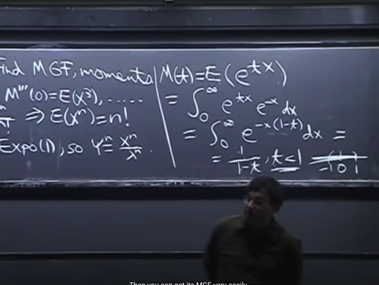</kbd></p>

🔗 **Related:** [LEC 17: MOMENT GENERATING FUNCTIONS](untitled.md#node-542)

> [!NOTE]
> Tương tự như vậy bữa trước ta đã **tìm MGF của standard normal Z ~ N(0,1)** thì
> bằng cách đặt **X `=` `μ` `+` σZ** thì ta **có thể tính MGF của mọi normal `N(μ,` `σ^2)` r.v**

<br>

<a id="node-576"></a>

<p align="center"><kbd>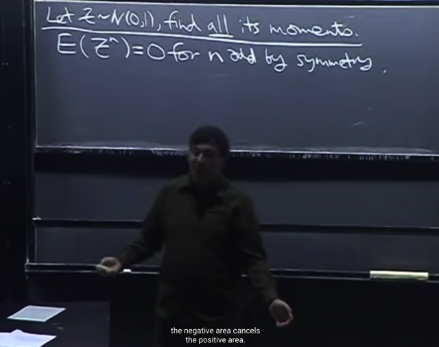</kbd></p>

🔗 **Related:** [TÓM TẮT:  - TÍNH UNIVERSALITY CỦA UNIFORM PART 2:  Nếu X ~ F thì F(X) ~ U(0,1)  -  Cách hiểu đúng về F(X) với F(x) = 1 - e^-x phải là bỏ X vào x ở đây để có F(X) = 1 - e^-X  - Áp dụng vào có thể dùng F(X) để xem thử nó có tuân theo Uniform hay không, nếu không thì có thể có gì đó không đúng  - Áp dụng khác là giúp ta simulating các observed data ~ F, bằng cách sampling từ U(0,1) và bỏ vào function Finv  - Tính chất symmetry của Uniform. Đó là, nếu U ~ Uniform (0,1) thì 1-U cũng ~ Uniform (0,1)  - ĐỊNH NGHĨA CỦA INDEPENDENT R.VS DỰA TRÊN CDF  P(X1 ≤ x1, X2 ≤ x2, ... Xn ≤ xn) = P(X1 ≤ x1)*P(X2 ≤ x2)*..... P(Xn ≤ xn) thì Xj  sẽ independent VỚI MỌI x1, x2,...xn  - Với discrete random variable thì cũng tương tự, nhưng ta sẽ làm với PMF:  Các X1, X2...Xn sẽ gọi là independent nếu:  JOINT PMF P(X1=x1, X2=x2...Xn=xn) = P(X1=x1)*P(X2=x2)*...P(Xn=xn) (tích các PMF)  - Ví dụ để cho thấy tại sao pair-wise independent không đủ để kết luận independent.   Cho X1, X2 là ~ Bern(0.5) và i.i.d và X3 = X1+X2. Xét từng cặp thì biết thằng này không giúp biết thằng kia ⇨ pair-wise independent nhưng xét bộ 3 thì biết X1, X2 biết ngay X3 ⇨ Nếu chỉ dựa vào pair-wise indepedent thì không đủ kết luật cả đám independent  - Standard Normal distribution:  Thường dùng chữ Z để kí hiệu cho Normal distribution r.v  Gs cho rằng ta chỉ cần biết là f(z) có công thức này c*e^(-z^2/2),  - Chứng minh NORMALIZING CONSTANT là c = 1/√2π  - pdf: (1/√2π) e^-z^2/2  - CHỨNG MINH X ~ N(0,1) EX = 0 DỰA VÀO SYMMETRY  - CHỨNG MINH X ~ N(0,1) VarX = 1  - Φ(z) = tích phân từ -infinity tới x của [e^(-t^2/2)dt]](tóm_tắt_tính_universality_của_uniform_part_2_nếu_x_f_thì_fx_u01_cách_hiểu_đúng_về_fx_với_fx_1_e_x_ph.md#node-408)

🔗 **Related:** [LEC 21: COVARIANCE & CORRELATION](untitled.md#node-694)

> [!NOTE]
> Tiếp ta sẽ thảo luận **moment của N(0,1)**
>
> Thế thì vì **mean là 0** và **variance là 1** nên ta đã biết **1st moment EX `=` 0, 
> và 2nd moment EX^2 `=` `Var(X)` `+` (EX)^2 `=` 1 `+` 0 `=` 1**
>
> Và bữa trước ta đã dùng **symmetry** ta cũng đã nhận định rằng**n'th moment
> với n lẻ sẽ bằng 0**. Bởi vì dùng **LOTUS**, khi tính n'th moment sẽ là 
>
> `E[X^n]` `=` tích phân `-inf:inf` **z^n** **f(z)**dz với f(z) `=` `e^(-z^2/2)/√(2π)`
>
> Để rồi ta nhận định rằng: 
>
> i) **(-z)^n** `=` **-z^n** với n lẻ nên 
>
> ii) **f(-z) `=` f(z)** 
>
> g(z) `=` z^n * f(z) là hàm lẻ, vì **g(-z)** `=` `(-z)^n` `f(-z)` `=` `-z^n` f(z) `=` **- g(z) 
>
> Và khi g(z) `=` `-` g(z) ta kết luận g(z) là hàm lẻ (odd function)
>
> và dùng tích chất symmetry, tích phân từ `-a` đến a của g(z)dz luôn bằng 0
>
> Kết luận N'TH MOMENT CỦA N(0,1) VỚI N LẺ ĐỀU BẰNG 0**

> [!NOTE]
> N'TH MOMENT CỦA N(0,1)
>
> VỚI N LẺ ĐỀU BẰNG 0

<br>

<a id="node-577"></a>

<p align="center"><kbd>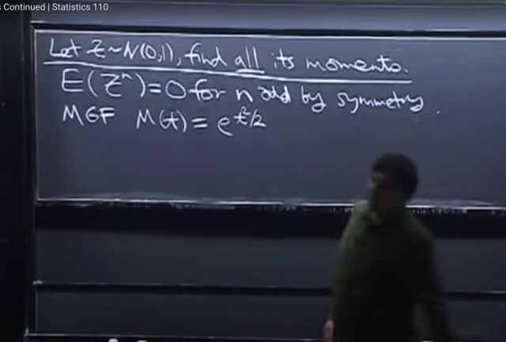</kbd></p>

> [!NOTE]
> Thế thì để **tính n'th moment** với n **chẵn**, gs cho rằng ta sẽ phải **đối
> mặt với nhiều bài toán tích phân phức tạp**
>
> **Do đó ta sẽ dùng MGF**. Như bài trước đã chứng minh **MGF của Z ~ N(0,
> 1) là M(t) `=` e^(t^2/2)**
>
> Thế thì gs nói thêm, bằng các công cụ như **chain rule**, **product rule**, ...
> thì ta **luôn có thể tính derivative**. Trong khi **có những bài toán tích phân
> không thể giải được**. Do đó việc **tính derivative luôn dễ hơn là tích phân**
>
> Thế thì gs nói nếu ta **lấy đạo hàm lần đầu**, **t sẽ nhảy xuống**:
>
> `(d/dt)` `e^t^2/2` `=` (**t**^2/2)*e^(**t**^2/2 `-` 1)
>
> Sau đó để lấy **đạo hàm lần 2** ta sẽ**phải dùng product rule ((uv)' `=` u'v `+` uv')** 
> vì khi đó nó có dạng u(t)*v(t). 
>
> Và tiếp tục lấy đạo hàm lần 3 thì sẽ **ngày càng tedious** để làm,
> **DÙ LÀ VẪN LÀM ĐƯỢC**

<br>

<a id="node-578"></a>

<p align="center"><kbd>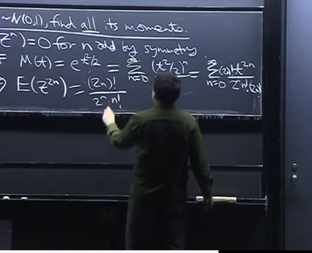</kbd></p>

> [!NOTE]
> Thế thì **một cách dễ hơn** đó là gs **dùng Taylor expansion của e^x**
>
> Ta có **e^x** theo **Taylor expansion** `=` Tổng n=0:infinity**x^n `/` n!**
>
> Vì Taylor series **hội tụ ở mọi x**, nên có thể ngay lập tức **thay x `=` t^2/2** vào
> (Đây là kiến thức mà 1801 sẽ bổ sung)
>
> ```text
> => e^(t^2/2) = Tổng n=0:infinity (t^2/2)^n / n! = Tổng n=0:infinity t^(2n) / 2^n / n!
> ```
>
> `=` Tổng `n=0:infinity` t^(2n) `/` (2^n * n!)
>
> Thế thì như ví dụ trước, ta sẽ **cần các hạng tử có dạng:** [**coefficent_n**] * **t^n**/ **n!**
> hay ở đây, sẽ là **coefficient_2n** ***t^(2n)** `/` **(2n)!** 
>
> Thì để có (2n)! chỉ việc nhân thêm (2n)! và chia bớt (2n)!:
>
> Thì hạng tử trở thành (2n)! * t^(2n) `/` (2^n * n!) `/` (2n)!
>
> `=` **[ (2n)! `/` (2^n * n!) ]** * t^(2n) `/` (2n)!
>
> Khi đó **những thứ gắn với t^(2n) `/` (2n)!** , tức là [ (2n)! `/` (2^n * n!) ] chính là 
> **coefficient của (2n)'th moment**  `-` tức moment thứ 2n (là **moment chẵn**)
>
> Vậy (2n)'th moment, hay `E(z^2n)` `=` **(2n)! `/` (2^n * n!)**

> [!NOTE]
> Cần kiến thức về convergence của series từ 18.01 nhưng hiểu đại khái là
> **với bất kì giá trị nào của x** thì tổng của chuỗi `x^n/n!` sẽ converge `=` e^x

<br>

<a id="node-579"></a>

<p align="center"><kbd>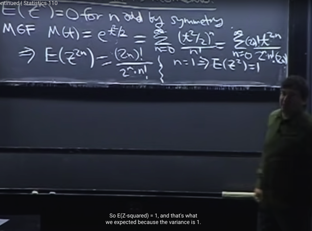</kbd></p>

> [!NOTE]
> Kiểm tra lại với n `=` 1, xem nó có ra `E(X^2)` `=` 1 không. THật vậy
> `(2*1)!/(2^1*1!)` `=` 1 
>
> Kết quả trên là đúng vì với X~N(0,1) `Var(X)` `=` 1, theo công thức variance
> ```text
> thứ 2: Var(X) = EX^2 - (EX)^2 = EX^2 (vì EX = 0), => EX^2 = 1
> ```

<br>

<a id="node-580"></a>

<p align="center"><kbd>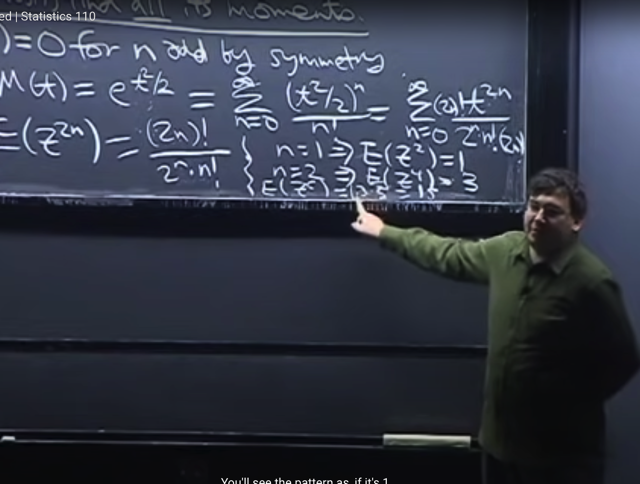</kbd></p>

> [!NOTE]
> Và với `n=2` (**4'th moment**) và `n=3` (**6'th moment**) thì sẽ lần lượt là 3, 15.  Và gs
> nói ta hãy để ý pattern sẽ là 3 `=` **1*3**, 15 `=` **1*3*5**
>
> Nên có thể dự đoán `n=4` (**8'th moment**) là**1*3*5*7**, **10'th moment** `=` **1*3*5*7*9**
>
> Và gs nói nếu ta đã làm một**strategic practice** liên quan đến bài toán **đếm số
> cách chia một nhóm thành các nhóm nhỏ** thì ta sẽ thấy nó có **kết quả y như
> thế này**.
>
> Ông nói nó có một **phân tích sâu để giải thích cho chuyện này** nhưng gs
> không nói ở đây

<br>

<a id="node-581"></a>

<p align="center"><kbd></kbd></p>

🔗 **Related:** [-TÓM TẮT:   Z^(số lẻ), ta luôn có E(Z^(số lẻ) = 0, gọi là ODD MOMENT  - Symmetry còn giúp ta kết luận (nếu Z ~ N(0,1) thì -Z cũng là một N(0,1)  - X = μ + σZ sẽ ~ N(μ, σ^2)  - Sẽ tốt hơn nếu ta hiểu Standard Normal Z ~ N(0,1) trước, sau đó hiểu rằng khi scale và shift Z với σ và μ khác nhau thì ta sẽ có bất kì một Normal distribution N(μ, σ^2) nào  - PROPERTIES CỦA VAR(X):  + Var(X + c) = Var(X)  + Var(cX) = c^2*Var(X)  + Var(X) luôn không âm, và nó chỉ bằng 0 nếu X là constant  + Variance KHÔNG CÓ TÍNH LINEARITY:  + Var(X+Y) không bằng Var(X) + Var(Y) TRỪ KHI X, Y INDEPENDENT  X không i.i.d với chính nó X, mà nó EXTREMELY DEPENDENT với chính nó. Do đó bất cứ khi nào ta ÁP DỤNG CÔNG  THỨC NÀO ĐÓ MÀ CẦN CÁC RANDOM VARIABLE CÓ X1, X2 CÓ  TÍNH I.I.D VÀO X VÀ CHÍNH NÓ THÌ ĐỀU LÀ SAI  - CHỨNG MINH VAR X N(μ, σ) = σ^2  - Z = (X - μ) / σ và gs cho biết nó được gọi là STANDARDIZATION (chuẩn hóa)  Giúp từ NORMAL X ~ N(μ, σ) ta có STANDARD NORMAL Z ~ N(0,1)  - Xây dựng PDF của N(μ, σ^2) từ N(0, 1):  fX(x) = 1/(σ√2π) * [e^(-((x-μ)/σ)^2/2)]  - Nếu X ~ N(μ, σ^2) thì -X ~ N(-μ, σ^2  - Nếu X1 ~ N(μ1, σ1^2), X2 ~ N(μ2, σ2^2) và X1, X2 independent thì:  X1 + X2 ~ N(μ1 + μ2, σ1^2 + σ2^2)  X1 - X2 ~ N(μ1 - μ2, σ1^2 + σ2^2)  - 68-95-99.7 rule  - Chứng minh 0^k / k! + 1^k / k! + 2^k / k! + .... = e^k  ⇨ Tổng k=0,1...infinity λ^k/k! = e^λ  - Tìm variance của Poisson (λ) để chứng minh nó có MEAN VÀ VARIANCE ĐỀU LÀ λ  - Khi standardize, ví dụ đơn vị là km, thì (x - μ) / σ sẽ  (km - km) / km = km / km = 1 TỨC Ý NÓI LÀ KHÔNG CÒN CARE ĐƠN VỊ LÀ GÌ NỮA  - X~Bin(n,p), Var(X) = npq (q = 1-p)  - Chứng minh LOTIS](_tóm_tắt_zsố_lẻ_ta_luôn_có_ezsố_lẻ_0_gọi_là_odd_moment_symmetry_còn_giúp_ta_kết_luận_nếu_z_n01_thì_z.md#node-447)

> [!NOTE]
> Thế thì ông nói là bài trước ta đã biết **3 lí do tại sao MGF lại quan trọng**  và
> qua các ví dụ vừa rồi  ta có thể hiểu tại sao nó gọi là **MOMENT**
> **GENERATING** **FUNCTION** đơn giản vì nó **giúp generate mọi moment**
>
> Thì tiếp theo ta sẽ thảo luận **MGF của Poisson**, mà như ta đã biết
> **Pois(lambda)** r.v có **mean** và **variance** đều là **lambda**

<br>

<a id="node-582"></a>

<p align="center"><kbd>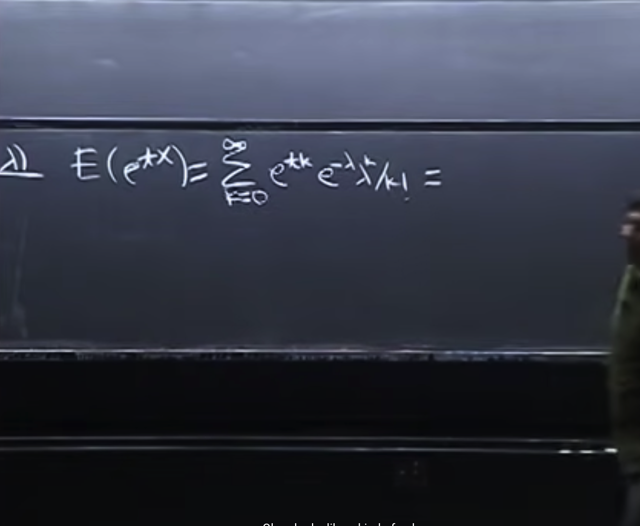</kbd></p>

> [!NOTE]
> thế thì như đã quen thuộc, **xây dựng M(t)** chỉ là xây dựng **E(e^(tX))**
>
> review một chút, để tính EX, ta tính weighted sum mọi possible value
> x của X, weight bởi PMF (đối với discrete r.v):
>
> **EX `=` ∑ x: x*P(X=x)**, với continuous rv, EX sẽ có dạng tương đương là:
>
> **∫ `-inf:inf` x f(x)dx (f là PDF)**
>
> Thế thì nếu chiếu theo đó để tính `E(g(X)),` g(X) là function g apply lên
> r.v X, nên cũng là một rv) thì ta sẽ cầm `PMF/PDF` của g(X), tức là:
>
> `E(g(X))` `=` ∑ mọi possible value g của g(X): `g*P(g(X)=g)`
>
> nhưng **LOTUS** cho phép chỉ cần dùng lại `PMF/PDF` của X:
>
> `E(g(X))` `=` ∑ mọi possible value x của X: **g(x)***P(X=x)
>
> Vậy áp dụng ở đây:
>
> `E(e^tx)`  `=` ∑ {mọi possible value x của X} **e^tx** * **P(X=x)**
>
> `P(X=x)` là PMG của Poisson `=` **e^-λ * λ^k `/` k!**
>
> với poisson, ta đã biết X chỉ c**ó các possible value dương 0, 1, 2...**
>
> **E (e^tX) `=` ∑ k=0:infinity** **e^(tk) * `e^-λ` * λ^k `/` k!**

<br>

<a id="node-583"></a>

<p align="center"><kbd>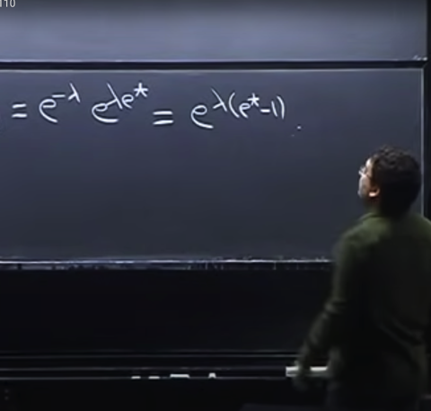</kbd></p>

<p align="center"><kbd></kbd></p>

<p align="center"><kbd>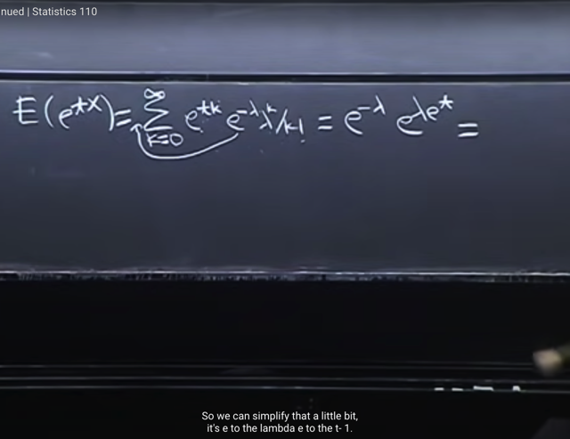</kbd></p>

> [!NOTE]
> Thế thì, b**ỏ `e^-λ` ra ngoài vì nó không dính tới k**
>
> Thì còn lại e^(tk) * λ^k `/` k! `=` (e^t)^k) * λ^k `/` k! `=` **[(e^t)*λ]^k** **/ k!** 
>
> thì gs nói **chỉ cần ta quen thuộc với dạng của Taylor series của e^x** 
> thì ngay lập tức ta thấy rằng cái này chính là:
>
> Tổng [(e^t)*λ]^k `/` k! có dạng của **Tổng `k=0:infinity` x^k/k!** chính là **Taylor 
> series của e^x** với **x `=` (e^t) * λ** 
>
> Vậy Tổng [e^t * λ]^k `/` k! `=` **e^(e^t * λ)**
>
> Do đó **E[e^tx] `=` `e^(-λ)` e^(λ * e^t) `=` e^[λ(e^t-1)]**

> [!NOTE]
> MGF CỦA POIS(λ) `=` `e^[λ(e^t-1)]`

<br>

<a id="node-584"></a>

<p align="center"><kbd>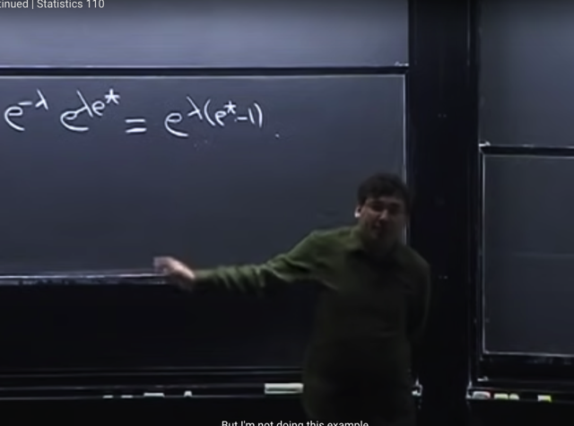</kbd></p>

> [!NOTE]
> Gs nói thêm cái này **valid** với **mọi t** vì **Taylor** **series** của **e^x converge
> everywhere** (again tức là với mọi x thì Tổng `n=0:infinity` x^n `/` n! đều
> converge về e^x).
>
> Và ta có thể**lấy đạo hàm cấp n của M(t)** để có n'th moment, hoặc **expand** 
> (Taylor expansion) nó ra để có các **coefficient của t^n/n!** để có **n'th moment.**
>
> Nhưng gs muốn dành thời gian để nói về cái khác

<br>

<a id="node-585"></a>

<p align="center"><kbd>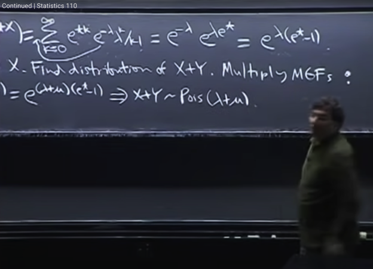</kbd></p>

<p align="center"><kbd></kbd></p>

<p align="center"><kbd>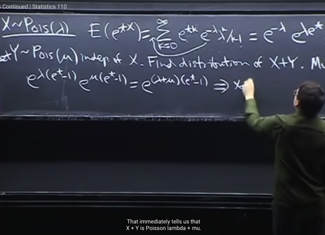</kbd></p>

🔗 **Related:** [LEC 17: MOMENT GENERATING FUNCTIONS](untitled.md#node-536)

> [!NOTE]
> Đại khái là nếu ta có thêm **Y ~ Pois(µ)** bên cạnh **X ~ Pois(λ)**và biết **X, Y độc lập**. Câu hỏi là **tìm
> distribution của X+Y**. Gs nói việc **cộng hai random variable** gọi là **CONVOLUTION**, và có thể trở nên rất
> khó khăn.
>
> Nhưng bài trước ta đã biết, nếu **X, Y INDEPENDENT** thì ta có một **theorem** (chưa chứng minh) rằng:
>
> **M_X+Y(t) `=` `M_X(t)` * M_Y(t)** (tức là MGF của `X+Y` sẽ là tích của MGF của mỗi r.v X,Y)
>
> Do đó ta có: `M_(X+Y)(t)` `=` e^[**λ**(e^t-1)] * e^[**µ**(e^t-1)] `=` **e^[(λ+µ)(e^t-1)]**

<br>

<a id="node-586"></a>

<p align="center"><kbd>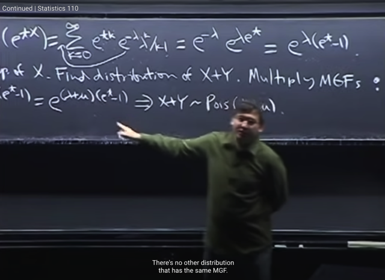</kbd></p>

🔗 **Related:** [LEC 26 CONDITIONAL EXPECTATION](untitled.md#node-824)

> [!NOTE]
> Và gs cho biết **có một theorem** cho phép rằng **nếu có điều này**, thì ta có thể
> kết luận **X+Y là ~ Pois(λ+µ)**
>
> Gs nói thêm đại khái là đây cũng là **một tính chất hay ho của Poisson**, vì
> **tổng hai Poisson vẫn là Poisson**. Không phải distribution nào cũng có tính
> chất đó

> [!NOTE]
> Nếu Y ~ Pois(µ) và X~Pois(λ) và biết X, Y
> INDEPENDENT thì `X+Y` ~ `Pois(λ+µ)`

<br>

<a id="node-587"></a>

<p align="center"><kbd>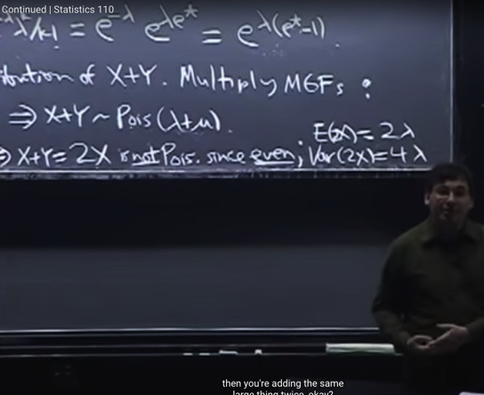</kbd></p>

<p align="center"><kbd></kbd></p>

<p align="center"><kbd>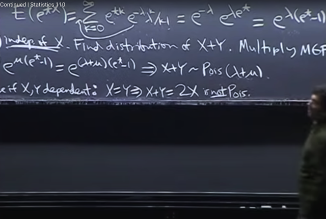</kbd></p>

> [!NOTE]
> gs nhấn mạnh điều kiện cho phép cái này là X, Y phải **INDEPENDENT**. ông lấy một ví dụ của
> X, và Y **dependent**, mà ở cấp độ cao nhất chính là X `=` Y
>
> Khi đó, **X `+` Y `=` 2X**. **Đây không phải là Poisso**n r.v
>
> Lí do đơn giản đó là **2X chỉ mang giá trị chẵn** trong khi đó **Poisson có thể có mọi giá trị
> dương**. Hoặc có thể dễ thấy `E(2X)` `=` 2EX `=` **2λ** còn `Var(2X)` `=` 4Var(X) `=` **4λ** Điều này càng
> chứng minh 2X không phải Poisson vì ta biết **Poisson r.v có EX `=` Var(X)**
>
> Do đó qua ví dụ này để thấy cái việc **tổng hai Poisson X, Y ra một Poisson r.v `X+Y` chỉ đúng
> nếu X,Y INDEPENDENT.**

<br>

<a id="node-588"></a>

<p align="center"><kbd></kbd></p>

🔗 **Related:** [TÓM TẮT:  - TÍNH UNIVERSALITY CỦA UNIFORM PART 2:  Nếu X ~ F thì F(X) ~ U(0,1)  -  Cách hiểu đúng về F(X) với F(x) = 1 - e^-x phải là bỏ X vào x ở đây để có F(X) = 1 - e^-X  - Áp dụng vào có thể dùng F(X) để xem thử nó có tuân theo Uniform hay không, nếu không thì có thể có gì đó không đúng  - Áp dụng khác là giúp ta simulating các observed data ~ F, bằng cách sampling từ U(0,1) và bỏ vào function Finv  - Tính chất symmetry của Uniform. Đó là, nếu U ~ Uniform (0,1) thì 1-U cũng ~ Uniform (0,1)  - ĐỊNH NGHĨA CỦA INDEPENDENT R.VS DỰA TRÊN CDF  P(X1 ≤ x1, X2 ≤ x2, ... Xn ≤ xn) = P(X1 ≤ x1)*P(X2 ≤ x2)*..... P(Xn ≤ xn) thì Xj  sẽ independent VỚI MỌI x1, x2,...xn  - Với discrete random variable thì cũng tương tự, nhưng ta sẽ làm với PMF:  Các X1, X2...Xn sẽ gọi là independent nếu:  JOINT PMF P(X1=x1, X2=x2...Xn=xn) = P(X1=x1)*P(X2=x2)*...P(Xn=xn) (tích các PMF)  - Ví dụ để cho thấy tại sao pair-wise independent không đủ để kết luận independent.   Cho X1, X2 là ~ Bern(0.5) và i.i.d và X3 = X1+X2. Xét từng cặp thì biết thằng này không giúp biết thằng kia ⇨ pair-wise independent nhưng xét bộ 3 thì biết X1, X2 biết ngay X3 ⇨ Nếu chỉ dựa vào pair-wise indepedent thì không đủ kết luật cả đám independent  - Standard Normal distribution:  Thường dùng chữ Z để kí hiệu cho Normal distribution r.v  Gs cho rằng ta chỉ cần biết là f(z) có công thức này c*e^(-z^2/2),  - Chứng minh NORMALIZING CONSTANT là c = 1/√2π  - pdf: (1/√2π) e^-z^2/2  - CHỨNG MINH X ~ N(0,1) EX = 0 DỰA VÀO SYMMETRY  - CHỨNG MINH X ~ N(0,1) VarX = 1  - Φ(z) = tích phân từ -infinity tới x của [e^(-t^2/2)dt]](tóm_tắt_tính_universality_của_uniform_part_2_nếu_x_f_thì_fx_u01_cách_hiểu_đúng_về_fx_với_fx_1_e_x_ph.md#node-391)

> [!NOTE]
> Ta sẽ qua một chủ đề lớn tiếp theo, là **JOINT** **DISTRIBUTION**. 
>
> gs cho biết ta **đã biết qua chút ít** về joint distribution, là distribution của
> nhiều random variable. Và biết sơ rằng nếu các r.v **INDEPENDENT**, thì
> joint distribution của việc **NHÂN** PDF, CDF, PMF của các r.v

> [!NOTE]
> JOINT DISTRIBUTION

<br>

<a id="node-589"></a>

<p align="center"><kbd></kbd></p>

> [!NOTE]
> đại khái là ta sẽ cố gắng **hiểu thật rõ** một bài toán đơn giản nhất trước,
> đó là có **2 Bernoulli r.v X, Y** (có thể **independent** hoặc **không**)
>
> Thì ta có 4 ô, để điền 4 giá trị xác suất. Ví dụ như ô đầu bên trên là 
> `P(X=0,` `Y=0)` là xác suất cả hai rv X, Y đều bằng 0.
>
> Ô thứ 2 bên trên là `P(X=0,` `Y=1).` Tương tự như vậy.
>
> Thế thì gs nói ta **miễn là điền vào 4 con số ko âm** và**tổng bằng 1** thì
> đó là một **valid joint distribution**

<br>

<a id="node-590"></a>

<p align="center"><kbd>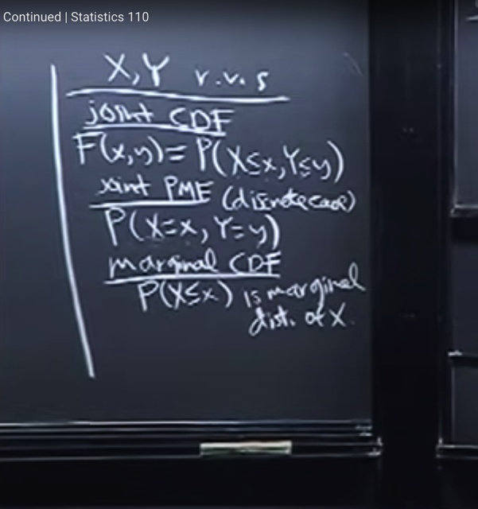</kbd></p>

> [!NOTE]
> Ở đây gs định nghĩa:
>
> `-` **JOINT** **CDF**: Với hai r.v X, Y. Joint CDF là **F(x,y) `=` `P(X<=x,` Y<=y)**
>
> `-` **JOINT** **PMF** (discrete) là **P(X=x, Y=y)**
>
> Và như đã nói, nếu X, Y independent thì ta có thể tách 
> **F(x,y) `=` `P(X<=x,` Y<=y)** ra thành **P(X<=x) * P(Y<=y)**
>
> **P(X=x, `Y=y)` `=` `P(X=x)` * P(Y=y)**
>
> **MARGINAL CDF**: Và **P(X<=x)** gọi là **marginal** **CDF of X** cũng như **P(Y<=y)**gọi là **marginal CDF of Y.**
>
> Nên nếu X, Y independent ta có thể nói **JOINT CDF BẰNG TÍCH
> MARGINAL CDF**

<br>

<a id="node-591"></a>

<p align="center"><kbd>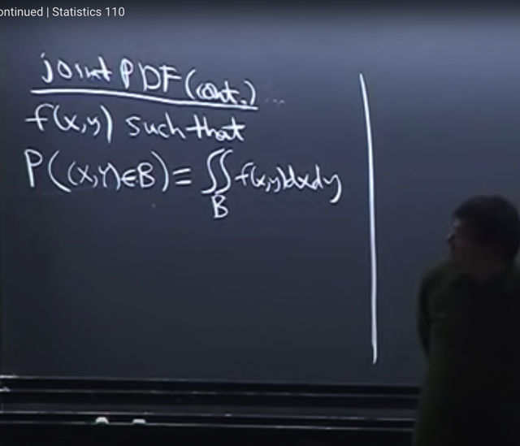</kbd></p>

> [!NOTE]
> Với **continuous** r.v thì ta có **JOINT** PDF: **f(x,y)** mang ý nghĩa là:
>
> **P((x,y) thuộc B)** `=` **∫∫B f(x,y)dxdy**
>
> gs nói đây là lần đầu tiên ta thấy **tích phân kép** ở class này, nhưng
> ông cho biết phần lớn ta**chỉ cần coi như lấy 2 lần tích phân** mỗi lần**theo một biến vậy**

> [!NOTE]
> Với CONNTINUOS r.v thì ta có JOINT PDF: f(x,y) mang ý nghĩa là:
>
> P((x,y) thuộc B) `=` `∫∫B` f(x,y)dxdy

<br>

<a id="node-592"></a>

<p align="center"><kbd>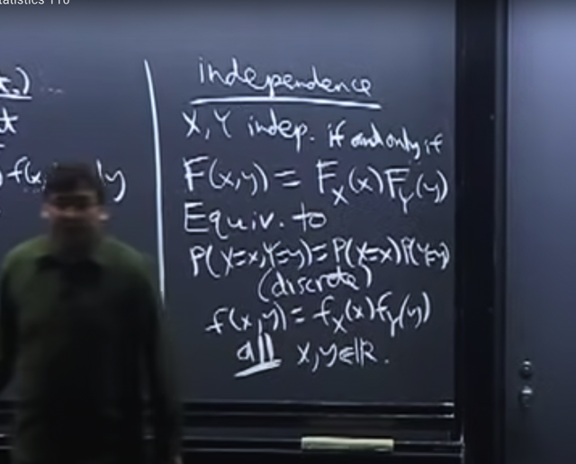</kbd></p>

🔗 **Related:** [LEC 19: JOINT, CONDITIONAL AND MARGINAL DISTRIBUTION](untitled.md#node-615)

> [!NOTE]
> Và ta again có thêm **một định nghĩa nữa về independence**: Đó là hai r.v X, Y
> gọi là **independence** khi và chỉ khi **F_XY(x, y) `=` `F_X(x)` * F_Y(y)**
>
> Có nghĩa là :
>
> **Joint CDF `=` tích các Marginal CDF**
> tương tự như vậy với PMF và PDF
>
> **Joint PMF `=` tích các Marginal PMF 
>
> Joint PDF `=` tích các Marginal PDF**

> [!NOTE]
> X, Y INDEPENDENT KHI VÀ CHỈ KHI JOINT CDF,
> PMF, PDF `=` TÍCH CÁC MARGINAL CDF, PMF, PDF

<br>

<a id="node-593"></a>

<p align="center"><kbd>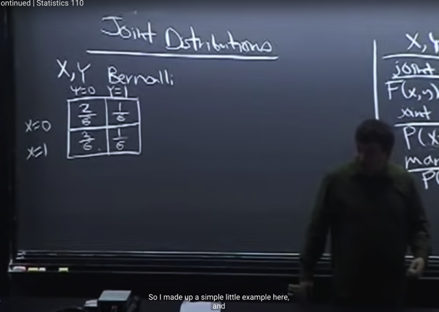</kbd></p>

> [!NOTE]
> thế thì quay lại đây, gs cho rằng ta có thể điền các con số này vào
> bảng như vầy, đều không âm và tổng bằng 1. 
>
> Câu hỏi đặt ra là: X, Y CÓ INDEPENDENT KHÔNGZ?

<br>

<a id="node-594"></a>

<p align="center"><kbd>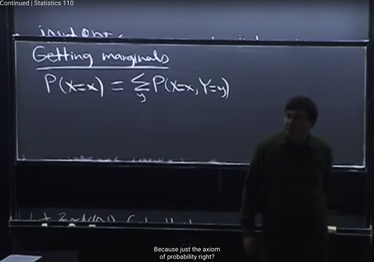</kbd></p>

> [!NOTE]
> Thế thì để trả lời câu hỏi rằng X, Y có Independent không, dựa trên định nghĩa về
> independent random variable với Joint & margin distribution cho biết rằng X,Y sẽ
> independent khi và chỉ khi joint `CDF/PMF` của chúng bằng tích của marginal
> `CDF/PMF`
>
> Thành ra, trong trường hợp này ta sẽ đ**i tính Marginal PMF** của từng cái.
>
> **Marginal PMF của X**, theo định nghĩa, là **P(X=x)** ta sẽ lập luận như sau:
>
> **(X=x)** `=` ∪ {mọi possible value y của Y} `(X=x,` `Y=y)` đây là dựa vào set theory:
>
> ```text
> (X=x) ⊂ S ⇨ (X=x) ∩ S = (X=x) ⇔ (X=x) = (X=x) ∩ (∪ {mọi possible value y của Y} Y=y))
> ```
>
> ```text
> ⇔ X=x = ∪ {mọi possible value y của Y} (X=x ∩ Y=y)
> ```
>
> Do đó**P(X=x) `=` P[**∪**{mọi possible value y của Y} `(X=x` ∩ Y=y)]**
>
> Và với các possible value khác nhau thì các **event `(X=x,` `Y=y)` disjoint** do đó
> theo **Axiom 2**:
>
> P[∪ {mọi possible value y của Y} `(X=x` ∩ `Y=y)]` 
>
> `=` **Σ {mọi possible value y của Y} `P(X=x,` Y=y)**
>
> Vậy **P(X=x) `=` `Σ` {mọi possible value y của Y} `P(X=x,` `Y=y)`
>
> Chú ý phải hiểu rằng MARGINAL PMF CỦA X `=` `P(X=x)` được tính bằng  cách
> sum mọi giá trị khả dĩ của Y của JOINT PMF**

> [!NOTE]
> ```text
> P(X=x) = ∑ y P(X=x, Y=y)
> ```

<br>

<a id="node-595"></a>

<p align="center"><kbd>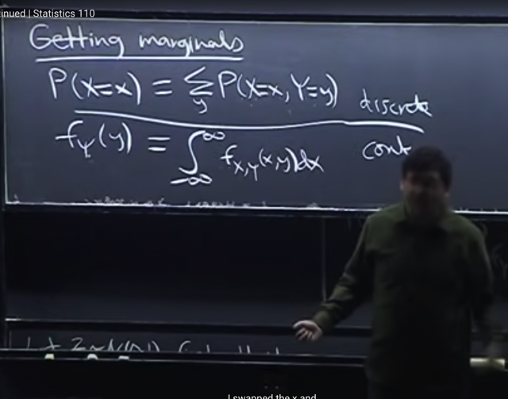</kbd></p>

> [!NOTE]
> Gs cho biết chính vì ta s**um lại mọi possible value của Y** gọi là
> **MARGINALIZING** nên nó có cái tên marginal
>
> Với nếu là continuous, thì ví dụ **marginal pdf của Y** sẽ là như vầy
>
> tích phân từ **-infinity đến infinity fxy(x,y)dx** ; và cũng chính là động tác**sum
> mọi possible value của X với JOINT PDF fxy(x,y)**

<br>

<a id="node-596"></a>

<p align="center"><kbd>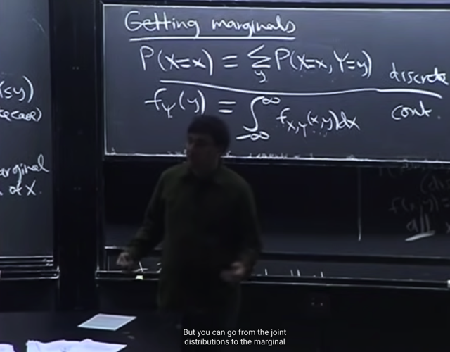</kbd></p>

> [!NOTE]
> đại khái là ta thấy rằng ta đi từ **Joint distribution** đến **Marginal distribution**.
> Nhưng **không thể đi theo hướng ngược lại**. Đó là đi từ marginal distribution
> tới joint distribution. Bởi lẽ **nếu ta chỉ có marginal distribution của X P(X=x)**
> thì ta **không biết gì về Y** để mà tính ra **joint distribution `P(X=x,` y=y)**

<br>

<a id="node-597"></a>

<p align="center"><kbd>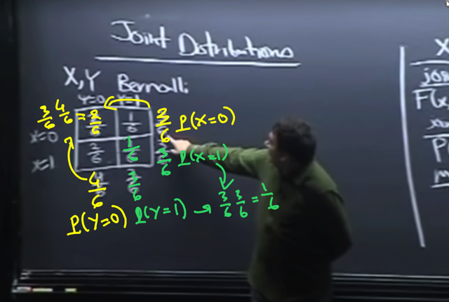</kbd></p>

<p align="center"><kbd></kbd></p>

<p align="center"><kbd></kbd></p>

> [!NOTE]
> Áp dụng vào đây ta tính **marginal PMF**:
>
> i) của X:
>
> ```text
> P(X=0) = Tổng y=0,1 P(X=0, Y=y) = 2/6 + 1/6 = 3/6
> ```
>
> ```text
> P(X=1) = Tổng y=0,1 P(X=1, Y=y) = 2/6 + 1/6 = 3/6
> ```
>
> ii) của Y:
>
> ```text
> P(Y=0) = Tổng x=0,1 P(X=x, Y=0) = 2/6 + 2/6 = 4/6
> ```
>
> ```text
> P(Y=1) = Tổng x=0,1 P(X=x, Y=1) = 1/6 + 1/6 = 2/6
> ```
>
> Có thể thấy khi ta làm vậy, các giá trị của marginal PMF được ghi ở bên lề
> (**MARGIN**) chính vì vậy nó có tên là **MARGINAL**

<br>

<a id="node-598"></a>

<p align="center"><kbd>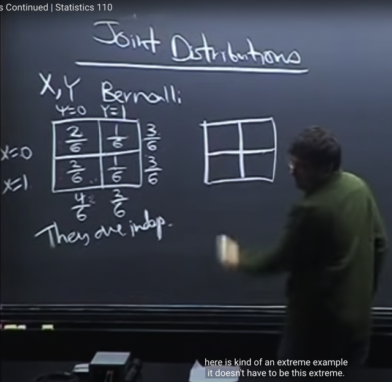</kbd></p>

> [!NOTE]
> Và khi thử **nhân marginal PMF của X và Y** ta sẽ thấy nó **bằng** **joint** **PMF**:
>
> ```text
> P(X=0) * P(Y=0) = 3/6 * 4/6 = 12/36 = 1/3 đúng bằng  P(X=0, Y=0) = 2/6
> ```
>
> ```text
> P(X=1) * P(Y=1) = 3/6 * 2/6 = 6/36 = 1/6 đúng bằng P(X=1, Y=1) = 1/6
> ```
>
> Do đó dựa trên định nghĩa về independent r.v có thể **kết luận X,Y independent**

<br>

<a id="node-599"></a>

<p align="center"><kbd>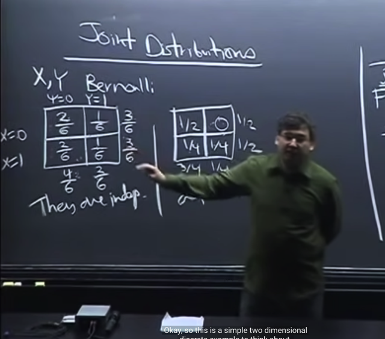</kbd></p>

> [!NOTE]
> trong ví dụ thứ 2, thì ta sẽ thấy hai r. v X,Y không
> independent.

<br>

<a id="node-600"></a>

<p align="center"><kbd>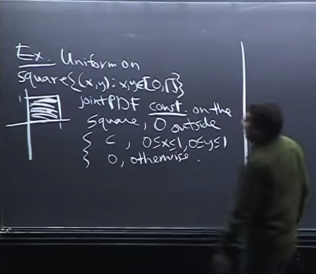</kbd></p>

> [!NOTE]
> Ví dụ này đại khái là, ta có một trường hợp, mà một cặp gía trị x, y của hai r.v
> X, Y mà lọt trong hình vuông này, tức là nếu 0 ≤ x, y ≤ 1 thì **xác suất
> của các event `(X=x,` `Y=y)` tức `P(X=x,` `Y=y)` `=` constant c**Và với x,y nằm ngoài hình vuông này, tức x<0 hoặc >1 và y<0 hoặc >1 thì
> `P(X=x,` `Y=y)` `=` 0

<br>

<a id="node-601"></a>

<p align="center"><kbd>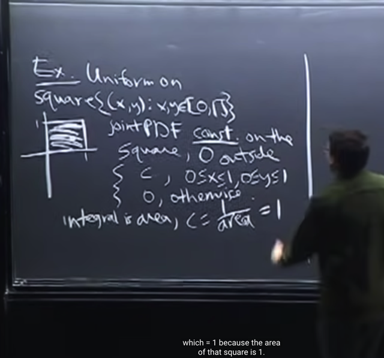</kbd></p>

> [!NOTE]
> Thế thì tương tự như với **X~Unif(0,1)**:
>
> tích phân từ 0 đến 1 của f(x)dx  `=` tích phân từ 0 đến 1 của c*dx
>
> (vì định nghĩa của Unif(0,1) là PDF f(x) `=` c khi x thuộc [0, 1], f(x) `=` 0 otherwise)
>
> ```text
> = c*[x]|0:1 = c*(1-0) = c
> ```
>
> Và **để pdf valid**, **tích phân này phải bằng 1** từ đó `=>` **c `=` 1**
>
> Thì ở đây,
>
> tích phân của **joint pdf** trong đoạn**vùng (area square unit này)** cũng phải
> bằng 1.
>
> Xét tích phân kép trong vùng A (unit square) của f(x,y)dxdy
>
> ```text
> = ∫∫A f(x,y)dxdy = ∫∫A c*dxdy = c*∫∫A dxdy = c*{diện tích của vùng A} = c*1
> ```
>
> tích phân kép trong vùng A (unit square) của dxdy theo **1802** ta đã biết, nó
> **chính là diện tích của vùng A**, và đây là **unit square** nên**area `=` 1**
> `=` **c*{diện tích của vùng A} `=` c*1**
>
> Vậy để **valid** thì như đã nói **∫∫A f(x,y)dxdy phải bằng 1** =>**c `=` 1**

<br>

<a id="node-602"></a>

<p align="center"><kbd>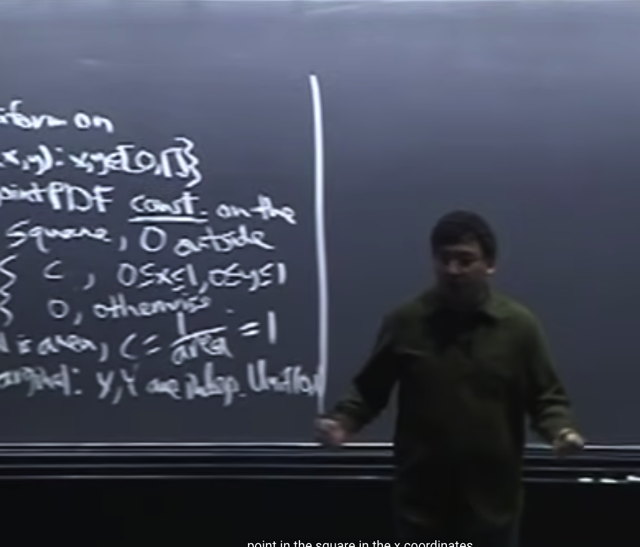</kbd></p>

> [!NOTE]
> Và dễ hiểu là **Marginal** distribution của X, Y: `P(X=x),` và `P(Y=y)` cũng **đều là
> Uniform(0,1)**. Và **X, Y independent**

<br>

<a id="node-603"></a>

<p align="center"><kbd>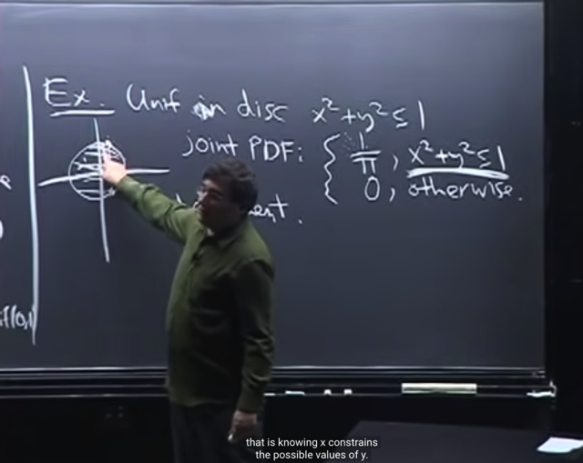</kbd></p>

> [!NOTE]
> một ví dụ khác, đó là **Uniform** trong cái dĩa (hình tròn) **x^2 `+` y^2 `<=` 1** này
> ```text
> again, điều này mang ý nghĩa đó là nếu x^2+y^2<=1 thì xác suất (X=x,Y=y) là như
> ```
> nhau.
>
> Nên diễn dịch điều này dưới dạng PDF:
>
> ```text
> Thì f(x,y) = 1/π nếu x^2+y^2<=1 và f(x,y) = 0 nếu x^2+y^2>1
> ```
>
> ```text
> 1/π là ở đâu ra, đó là ta cũng lập luận rằng nếu x^2+y^2<=1 thì xác suất (X=x,
> ```
> `Y=y)` là như nhau và bằng constant c. Thì đưa vào **điều kiện pdf valid** ta sẽ có
> tích phân trong toàn mặt phẳng của f(x,y)dxdy phải bằng 1:
>
> `∫∫f(x,y)dxdy` `=` 1
>
> và vì **f(x,y) bằng 0** với**x,y ở ngoài hình tròn** nên tích phân trên **trở thành**
> tích phân trong toàn vùng bao bởi đường tròn trên của f(x,y)dxdy phải bằng 1
>
> `<=>` `∫∫A` f(x,y)dxdy `=` 1 (A là vùng bao quanh bởi circle unit)
>
> ```text
> <=> ∫∫A c*dxdy = 1 <=> c ∫∫A dxdy = 1 <=> c {Diện tích của A} (*) = c*π*r^2 = cπ = 1
> ```
>
> `<=>` c `=` **1/π
>
> (*) Again, sau khi học MIT 18.02 thì đã hiểu tại sao `∫∫A` dxdy là diện tích của A**

<br>

<a id="node-604"></a>

<p align="center"><kbd>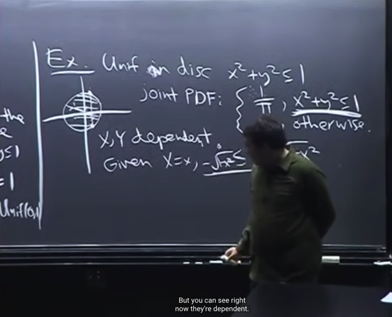</kbd></p>

> [!NOTE]
> gs nhắc nhở rằng, trong trường hợp này **X,Y DEPENDENT**. vì dễ thấy rằng,
> **không như trong hình vuông** hồi nãy, với **một giá trị nào đó của X**, thì **Y vẫn
> tự do có mọi giá trị trong khoảng 0,1.**
>
> Còn ở đây nếu **X `=` 1**, thì **Y sẽ chỉ có thể bằng 0**, còn nếu **X `=` 0** thì **Y có thể 
> mang các giá trị khác nhau từ 0 đến 1**. Điều này cho thấy rõ **X, Y dependent
> nhau**
>
> còn gs ghi ở đây ý là `X=x,` thì Y phải rằng buộc trong khoảng `[-sqrt(x^2)` và sqrt(x^2)]

<br>

