# Lec 19: Joint, Conditional And Marginal Distribution

📊 **Progress:** `46` Notes | `43` Screenshots

---
<a id="node-606"></a>

<p align="center"><kbd>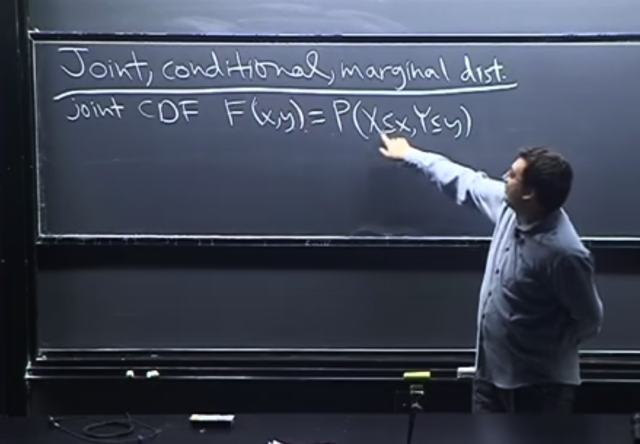</kbd></p>

> [!NOTE]
> Đầu tiên gs nhắc lại về **Joint** CDF: **F(x,y) `=` `P(X<=x,` Y<=y)** và ta cần 
> hiểu là **nếu có vài triệu random variable** thì **định nghĩa cũng tương tự**

<br>

<a id="node-607"></a>

<p align="center"><kbd>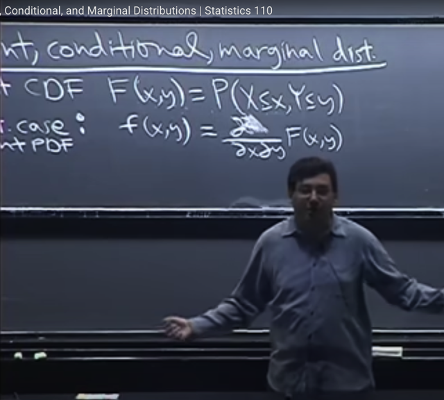</kbd></p>

> [!NOTE]
> Thế thì tương tự như khi với một random variable X, ta đã biết **derivative**
> của **CDF là PDF** (*) Thì ở đây với **joint CDF**, khi lấy **derivative của Joint
> CDF F(x,y) w.r.t x và y** ta sẽ có **Joint PDF f(x,y)**
>
> Chỗ này review chút xíu trên cơ sở mới ôn lại FTC1,2: FTC2 nói rằng: nếu G(x)
> ```text
> = ∫a:x f(t)dt thì d/dx G(x) = f(x). Thế mà, theo định nghĩa thì, với X là continuous
> ```
> ```text
> random variable P(X ∈ A) = ∫A f(t)dt  ⇨ F(x) = P(X ≤ x)  sẽ tính bằng ∫-inf:x
> ```
> ```text
> f_(t)dt. Vậy F(x) = ∫-inf:x f(t)dt nên theo FTC2 thì d/dx F(x) chính là f(x).
> ```
>
> ```text
> Rồi, lại nói về FTC1 rằng: nếu F' = f thì ∫a:b f(x)dx = F(b) - F(a). Từ đó từ
> ```
> việc ta đã có đạo hàm của CDF là PDF F'(x) `=` f(x). Nên vận dụng FTC1 ta
> có thể tính xác suất X rơi vào vùng a:b `∫a:b` f(x)dx thông qua dùng CDF: F(b) `-` F(a)
>
> (kí hiệu là **partial derivative ∂^2 F(x, y) `/` ∂x∂y**, và ông cho biết cái này đơn
> giản chỉ là lần **lượt lấy derivative của F w.r.t x và coi y như constant**, sau đó
> **lấy derivative của F w.r.t y, coi x như constant**hoặc ngược lại)
>
> Nói một chút về kí hiệu partial, trong 18.01, ta đã học rằng kí hiệu `d/dx` nên
> hiểu là một operator, nên `(d/dx)` f(x) mang ý nghĩa là apply linear operator
> `(d/dx)` lên function f(x), để được một function mới kí hiệu là f'(x). Rồi, nếu apply
> ```text
> (d/dx) lần nữa lên (d/dx) f(x), thì sẽ kí hiệu là (d/dx) (d/dx) f(x) = (d/dx)^2 f(x) =
> ```
> ```text
> (d^2/(dx)^2) f(x)  = (d^2/dx^2) f(x). từ đó ta sẽ thấy (d^2/dx^2) là ý operator lấy
> ```
> đạo hàm cấp 2 đối với x
>
> Từ đó với bivariate f(x,y) thì ta có notion `(∂/∂x)` f(x,y) là take partial derivative
> của f đối với x (khi đó đương nhiên coi y là constant), và `(∂^2/∂x∂y)` f(x,y) chính
> là apply `(∂/∂y)` lên `(∂/∂x)` f(x,y), với ý nghĩa là lấy đạo hàm đối với x (coi y là
> constant) xong, tiếp tục lấy đạo hàm đối với y (lúc này thì coi x là constant)

> [!NOTE]
> JOINT PDF của X,Y `=` đạo hàm của JOINT CDF theo X, và Y: 
>
> ```text
> f_X,Y(x,y) = (∂/∂x∂y) F_X,Y(x,y)
> ```

<br>

<a id="node-608"></a>

<p align="center"><kbd>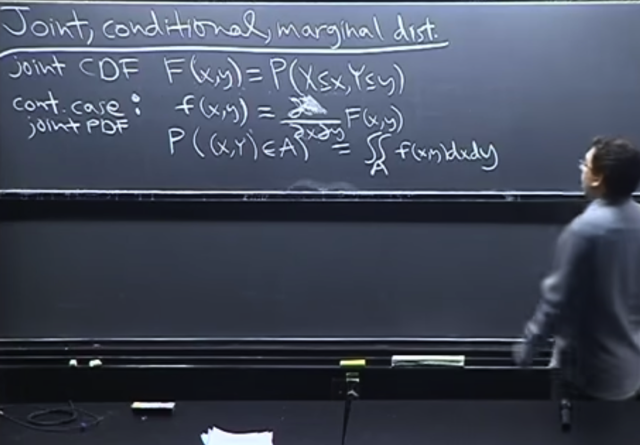</kbd></p>

🔗 **Related:** [LEC 20: MULTINOMIAL AND CAUCHY](untitled.md#node-669)

> [!NOTE]
> Và tương tự như khi **tích phân trên đoạn [a, b] của f(x)dx** sẽ cho **xác suất
> X** mang giá trị **thuộc đoạn [a, b]** thì ở đây:
>
> khi **∫∫ trên area A f(x,y)dxdy** thì ta sẽ cho ta **xác suất {X, Y có gía trị thuộc
> vùng A}**
>
> Và gs nói **tích phân kép** cũng chỉ là, ta t**ích phân với x trước**, **coi y như
> constant** và sau đó**tích phân với y, coi x như constant**

<br>

<a id="node-609"></a>

<p align="center"><kbd></kbd></p>

> [!NOTE]
> đại khái là cái mà ta có thể phải lo lắng khi gặp double integral đó là phải
> x**ác định đúng cái limit của nó**.
>
> Ví dụ như cái hình **A1** (gọi là **blob**, một **vết**, vùng có hình dạng bất
> thường) thì để x**ác định phạm vi cho integral sẽ rất khó**. Nhưng gs nói ta
> sẽ **không gặp**, hoặc **ko quan tâm** tới nhưng bài toán mà **tích phân
> phức tạp** như này.
>
> Thay vào đó ta sẽ care tới bài toán tích phân trên vùng **hình chữ nhật A2** như
> thế này. Khi đó rất **dễ xác định phạm vi của x, y** và bài toán tích phân kép cơ
> bản **trở thành hai lần tích phân đơn.**

<br>

<a id="node-610"></a>

<p align="center"><kbd></kbd></p>

> [!NOTE]
> Và gs nhắc lại về **marginal PDF** of X, f(x) là:
>
> **f_X(x) `=` `∫-inf:inf` f_XY(x,y)dy**
>
> Tức là **sum**, (hay gọi là marginalize) của **joint pdf**trên **toàn bộ các possible
> value của Y** thì ta sẽ có marginal pdf của X.
>
> và ông nói khi ta làm vậy (tức là khi tích phân `/` marginalize over y) ta **coi x
> như constant**, kết quả là một **function không còn phụ thuộc y nữa**, đương
> nhiên đó marginal pdf của x: f(x) không phụ thuộc y
>
> Ngược lại khi **marginalize joint pdf trên mọi possible value của X** thì ta có
> **marginal pdf của y
>
> `f_Y(y)` `=` `∫-inf:inf` f_XY(x,y)dx**

<br>

<a id="node-611"></a>

<p align="center"><kbd></kbd></p>

> [!NOTE]
> Tiếp gs cho biết nếu ta **double integral** cái này (tức cái joint pdf f(x,y)) thì 
> ta **sẽ có 1**. Và có thể hiểu theo hai cách:
>
> i) là giống như ta **tích phân kép trên vùng `/` miền A**với **A là toàn bộ mặt 
> phẳng**. thì khi đó **đương nhiên ta phải được 1**.
>
> ii) ta có thể **coi việc tích phân kép** như trên giống như ta **tích phân từ 
> `-infinity:infinity` over y** đối với **marginal pdf of X** 
>
> Thì việc **kết quả phải ra 1** là vì**đây là điều kiện để pdf f(x) valid** mà ta đã biết
>
> `===`
>
> Ngoài ra ông nói thêm, ta **cứ bắt đầu tích phân với miền từ -infinity:infinity**
> nhưng sau đó **tùy bài toán cụ thể mà ta có thể giới hạn lại**, ví dụ như **nếu
> xác định miền nào đó mà ở ngoài xác suất bằng không** thì ta sẽ thay giới hạn
> tích phân từ `-infinity:infinity` bằng miền này.

<br>

<a id="node-612"></a>

<p align="center"><kbd>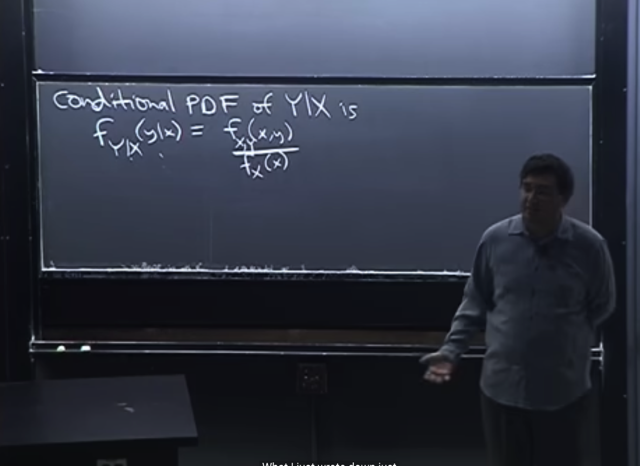</kbd></p>

> [!NOTE]
> Tiếp theo ta sẽ làm quen với khái niệm **CONDITIONAL PDF of Y|X**:
>
> **f_Y|X(y|x)  `=` `f_XY(x,y)` `/` f_X(x)**
>
> Trong đó **f_Y|X (y|x)** là kí hiệu để chỉ**conditional pdf**, với notation **Y|X** là để
> chỉ rõ đây là **pdf của Y dựa trên X** mà **đôi khi có thể bỏ đi** nếu **bối cảnh là
> rõ ràng, để chỉ còn f(y|x)**
>
> **f_XY(x,y)** như đã biết, là **Joint PDF**.
>
>  **f_X(x)** là **Marginal PDF of X.**

> [!NOTE]
> ```text
> CONDITIONAL PDF of Y|X: f_Y|X (y|x) = f_XY(x,y) / f_X(x)
> ```
>
> Conditional PDF của Y|X, `f_Y|X` (x,y) `=` Joint PDF `f_XY(x,y)` 
> chia Marginal PDF of X `f_X(x)`

<br>

<a id="node-613"></a>

<p align="center"><kbd>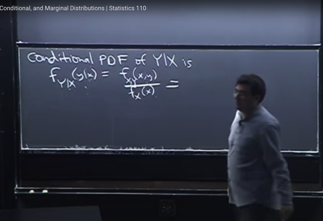</kbd></p>

🔗 **Related:** [TÓM TẮT:  - Tiếp tục Matching problem  - Định nghĩa về hai event độc lập  - Bài toán Newton-Peps  - Định nghĩa của conditional probability và cách hiểu về nó  - Các định lý liên quan](tóm_tắt_tiếp_tục_matching_problem_định_nghĩa_về_hai_event_độc_lập_bài_toán_newton_peps_định_nghĩa_của_conditional_probability_và_cách_hiểu_về_nó_các_định_lý_liên_quan.md#node-85)

> [!NOTE]
> Ta thấy nó có dạng **giống giống** với định nghĩa của **Conditional**
> **Probability** mà ta đã biết, khi đó liên quan đến **xác suất của các event**:
>
> **P(A|B) `=` P(A,B) `/` P(B)**
>
> Vậy thì gs cho rằng , với cái này ta có các PDF, tức là như **đã biết**, **không
> phải xác suất**. Nhưng ta có thể **coi** **như xác suất** với ý nghĩa ví
> dụ như **f(y|x)** là **xác suất Y mang giá trị trong một vùng rất nhỏ quanh y**
> **DỰA TRÊN VIỆC** biết **X mang giá trị trong một vùng rất nhỏ quanh x.**

<br>

<a id="node-614"></a>

<p align="center"><kbd>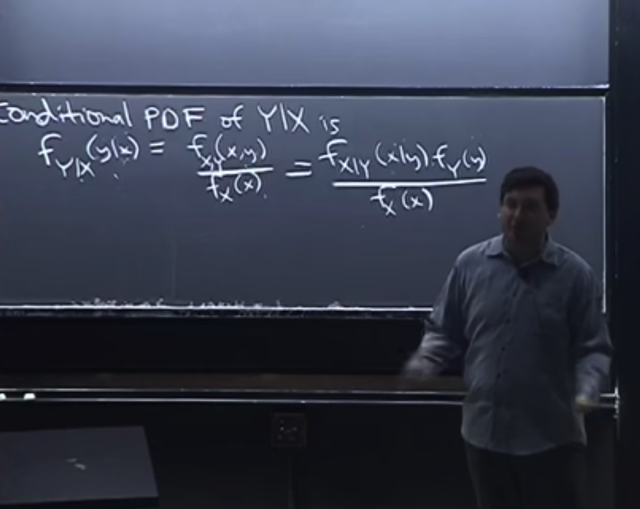</kbd></p>

> [!NOTE]
> và tương tự, ta cũng c**ó Bayes rule đối với PDF**. Hoàn toàn tương tự
> Bayes rule của discrete case như đã biết (ý là ta đã học về Bayes rule, là
> theorem **dựa trên định nghĩa của conditional probability** (of event).
>
> P(A|B)*P(B) `=` P(B|A)*P(A)
>
> Thì từ đó ta có thể áp dụng với PMF của discrete variable:
>
> **P(X=x|Y=y)*P(Y=y) `=` P(Y=y|X=x)*P(X=x)** vì `X=x,` `Y=y` cũng là các event
>
> Và áp dụng cho PDF của continous r.v:
>
> **f_X|Y(x|y) * `f_Y(y)` `=` `f_Y|X(y|x)` * f_X(x)**

<br>

<a id="node-615"></a>

<p align="center"><kbd>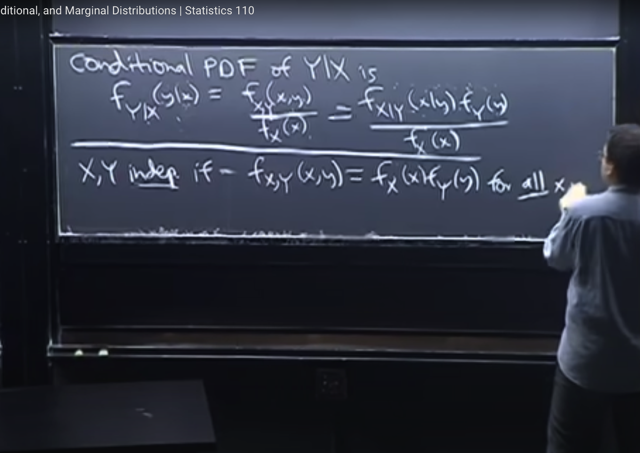</kbd></p>

🔗 **Related:** [TÓM TẮT:  - Tính MGF M(t) của Expo(1) = 1/(1-t) t < 1  - Khi đã có MGF, như bài trước ta đã biết các lí do mà MGF quan trọng trong đó có reason #1 đó là ta chỉ cần tính đạo hàm cấp n của nó sẽ cho ta n'th moment.  - Dù ta có thể tính đạo hàm nhiều lần để có 1st, 2nd moment nhưng có cách hay hơn. Bằng cách nhận ra 1/(1-t) liên quan đến Geometric series  a + ar + ar^2 = Tổng k=0:infinity a*r^k với |r| < 1 sẽ converge về a/[1-r]  Nên 1/1-t chính là Tổng n=0:infinity t^n với |t| < 1  Thế thì theo gs, từ đây cho phép ta KHỎI CẦN TÍNH ĐẠO HÀM CẤP N ĐỂ CÓ MOMENT THỨ N LÀM GÌ CHO MỆT, mà chỉ cần ĐỌC NÓ RA THÔI  Cụ thể là ta đã biết ở bài trước rằng, n'th moment = đạo hàm cấp n của M(t) (là coefficient của (t^n / n!) khi expand M(t) theo Taylor series tại 0)  Do đó, bằng cách tạo ra (t^n / n!) thì BẤT CỨ CÁI GÌ GẮN VỚI NÓ CHÍNH LÀ COEFFICIENT, VÀ CHÍNH LÀ N'TH MOMENT  Do đó ta sẽ nhân thêm n! và chia n! để có (t^n / n!). Như vậy cái lòi ra làm coefficient của t^n/n! ở đây là n! CHÍNH LÀ N'TH MOMENT.  Từ đó cho phép ta ĐỌC LUÔN RẰNG: 1ST MOMENT (EX) LÀ 1!, 2ND MOMENT E(X^2) LÀ 2!  N'TH MOMENT CỦA EXPO(1) E(X^n) = n!  -  đây là tính chất RẤT MẠNH CỦA MGF. Vì ví dụ như khi tính n'th moment (E[X^n]) thì nếu dùng LOTUS, ta phải TÍNH TÍCH PHÂN (INTEGRAL) VÀ CÓ THỂ GẶP NHỮNG TÍCH PHÂN RẤT PHỨC TẠP.  Trong khi đó, nếu ta có MGF, để có nth moment, ta CHỈ CẦN TÍNH DERIVATIVE MÀ DERIVATIVE THÌ THƯỜNG DỄ HƠN LÀ TÍNH TÍCH PHÂN  -Từ n'th moment của Expo(1) ta dễ dàng có n'th moment của Y ~ Expo(λ): E[Y^n] = n! / λ^n  - N'TH MOMENT CỦA N(0,1) VỚI N LẺ ĐỀU BẰNG 0  - MGF CỦA POIS(λ) = e^[λ(e^t-1)]  - Nếu Y ~ Pois(µ) và X~Pois(λ) và biết X, Y INDEPENDENT thì X+Y ~ Pois(λ+µ)](tóm_tắt_tính_mgf_mt_của_expo1_11_t_t_1_khi_đã_có_mgf_như_bài_trước_ta_đã_biết_các_lí_do_mà_mgf_quan_trọng_trong_đó_có_reason_1_đó_là_ta_chỉ_cần_tính_đạo_hàm_cấp_n_của_nó_sẽ_cho_ta_nth_moment_dù_ta_có_thể_tính_đạo_hàm_nhiều_lần_để_có_1st_2nd_moment_nhưng_có_cách_hay_hơn_bằng_cách_nhận_ra_11_t_liên_quan_đến_geometric_series_a_ar_ar2_tổng_k0infinity_ark_với_r_1_sẽ_converge_về_a1_r_nên_11_t_chính_là_tổng_n0infinity_tn_với_t_1_thế_thì_theo_gs_từ_đây_cho_phép_ta_khỏi_cần_tính_đạo_hàm_cấp_n_để_có_moment_thứ_n_làm_gì_cho_mệt_mà_chỉ_cần_đọc_nó_ra_thôi_cụ_thể_là_ta_đã_biết_ở_bài_trước_rằng_nth_moment_đạo_hàm_cấp_n_của_mt_là_coefficient_của_tn_n_khi_expand_mt_theo_taylor_series_tại_0_do_đó_bằng_cách_tạo_ra_tn_n_thì_bất_cứ_cái_gì_gắn_với_nó_chính_là_coefficient_và_chính_là_nth_moment_do_đó_ta_sẽ_nhân_thêm_n_và_chia_n_để_có_tn_n_như_vậy_cái_lòi_ra_làm_coefficient_của_tnn_ở_đây_là_n_chính_là_nth_moment_từ_đó_cho_phép_ta_đọc_luôn_rằng_1st_moment_ex_là_1_2nd_moment_ex2_là_2_nth_moment_của_expo1_exn_n_đây_là_tính_chất_rất_mạnh_của_mgf_vì_ví_dụ_như_khi_tính_nth_moment_exn_thì_nếu_dùng_lotus_ta_phải_tính_tích_phân_integral_và_có_thể_gặp_những_tích_phân_rất_phức_tạp_trong_khi_đó_nếu_ta_có_mgf_để_có_nth_moment_ta_chỉ_cần_tính_derivative_mà_derivative_thì_thường_dễ_hơn_là_tính_tích_phân_từ_nth_moment_của_expo1_ta_dễ_dàng_có_nth_moment_của_y_expoλ_eyn_n_λn_nth_moment_của_n01_với_n_lẻ_đều_bằng_0_mgf_của_poisλ_eλet_1_nếu_y_poisµ_và_xpoisλ_và_biết_x_y_independent_thì_xy_poisλµ.md#node-592)

> [!NOTE]
> và gs nhắc lại**định nghĩa** về **independent** **variable** bữa trước đã nói
> (theo link) trong đó ta sẽ có **X, Y là independent** nếu **joint pdf bằng tích
> của từng marginal pdf với mọi x, y**

> [!NOTE]
> ```text
> X,Y INDEPENDENT IF f_X,Y(x,y) = f_X(x)*f_Y(y)
> ```
> (JOINT PDF `=` TÍCH MARGINAL PDF với mọi x, y)

<br>

<a id="node-616"></a>

<p align="center"><kbd></kbd></p>

> [!NOTE]
> thế thì gs quay lại ví dụ bữa trước còn dang dở về **Uniform**. Bối cảnh là,
> ta có **uniform trong hình tròn này**. Có nghĩa là với **mọi cặp giá trị x, y sao cho
> x^2+y^2<=1** thì xác suất của việc [**X,Y rơi vào dùng vô cùng nhỏ qua x,y đó]** là 
> như nhau (đây là PDF, không thể nói xác suất `X=x,` `Y=y` như PMF được, vì 
> xác suất này bằng 0 đối với continuous r.v.s)
>
> Và như ta đã biết về **X ~ Uniform(a, b)** thì xác suất X mang giá trị trong một
> đoạn **[a, m]** nào đó trên **[a, b]** sẽ **TỈ LỆ THUẬN VỚI ĐỘ DÀI [a, m]**
>
> Thì với **Joint pdf cũng vậy**. Với Uniform thì xác suất [**X, Y rơi vào một vùng nào
> đó]** trên hình tròn **SẼ TỈ LỆ THUẬN VỚI DIỆN TÍCH CỦA VÙNG ĐÓ.**

<br>

<a id="node-617"></a>

<p align="center"><kbd>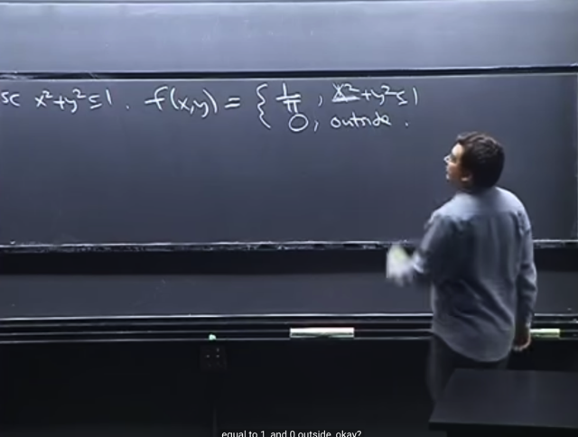</kbd></p>

> [!NOTE]
> Như bữa trước ta **đã chứng minh** **f(x,y)** sẽ bằng **1/π** khi **x^2+y^2<=1** và
> **f(x, y) `=` 0** nếu x, y ở ngoài
>
> Nhớ lại ta chứng minh bằng cách tích phân kép của joint PDF trên toàn 
> mặt phẳng phải ra 1. Và bound tích phân thu hẹp lại thành vùng hình
> tròn này vì f(x,y) `=` 0 với x,y nằm ngoài đường tròn (và bằng constant c
> nếu x,y nằm trong)
>
> Tức là `∫∫R` f(x,y)dxdy `=` 1. Mà f(x,y) ở bài toán này là bằng constant c 
> nên đưa c ra ngoài ta có `c*∫∫Rdxdy,` và `∫∫Rdxdy` theo định nghĩa (như ta học
> ```text
> ở 1802) chính là diện tích vùng R = π*r^2 = π
> ```
>
> Vậy từ đó suy ra `cπ=1` `=>` **c `=` 1/π**

<br>

<a id="node-618"></a>

<p align="center"><kbd></kbd></p>

> [!NOTE]
> Thế thì ta sẽ tính **marginal pdf**, như đã biết, để có **marginal pdf of x: f_X(x)**
> ta sẽ **marginalize over y**tức là **lấy tích phân từ `-infinity:infinity` của của joint
> pdf f(x,y)dy**
>
> Có điều, như đã nói ở bài trước, ta sẽ **tùy vào pdf, ở đâu nó bằng 0, ở đâu nó
> khác 0** để mà **thu hẹp phạm vi tích phân**
>
> Thế thì cái mà ta cần chú ý là **xác định limit của tích phân cho đúng**.
>
> Thế thì trong bài toán này, **constraint** để f(x,y) `=` `1/π` là x,y phải thỏa
> **x^2+y^2<=1** tương đương **y phải nằm trong `[-sqrt(1-x^2),` sqrt(1-x^2]**
>
> do đó khi **tích phân `-infinity:infinity` f(x,y)dy** trở thành
>
> **tích phân trong `[-sqrt(1-x^2),` `sqrt(1-x^2)]` của f(x,y)dy** (vì ngoài đoạn này, thì
> f(x,y) bằng 0 rồi nên khỏi cần tính)

<br>

<a id="node-619"></a>

<p align="center"><kbd></kbd></p>

<p align="center"><kbd></kbd></p>

<p align="center"><kbd>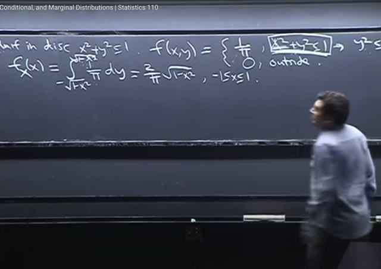</kbd></p>

> [!NOTE]
> Và tích phân này thì cũng dễ,**tích phân của constant** bằng **constant *
> length**  hoặc dùng FTC Part 2 nó là [nguyên hàm của `1/π]` | `-sqrt(1-x^2)` :
> `sqrt(1-x^2)`
>
> ```text
> = 1/π [sqrt(1-x^2) -(-sqrt(1-x^2))]
> ```
>
> `=` **2/π * sqrt(1-x^2)** (với miền xác định là x trong đoạn `[-1,1])`
>
> ```text
> Tương tự ta cũng sẽ có marginal pdf của Y f_Y(y) = = 2/π * sqrt(1-y^2) để
> ```
> thấy nó cũng không phải Uniform vì nó sẽ khác nhau với y khác nhau
>
> ```text
> Cũng lớn nhất tại y = 0 và nhỏ nhất (=0) tại +/- 1 khớp với thực tế tại vùng
> ```
> (vô cùng nhỏ) quanh 0 thì có thể có rất  nhiều điểm rơi vào cùng này trải
> dài từ x `=` `-1` tới x `=` 1.
>
> Còn tai y `=` `-1,` hay y `=` 1, thì có rất ít không gian

> [!NOTE]
> Và ta có thể nhận thấy rằng, **marginal pdf f_X(x)** **không phải là
> uniform**, vì **khi x khác nhau thì `f_X(x)` khác nhau** do biên khác nhau
>
> với **x `=` 0 thì f(x) lớn nhất** (bởi khi đó biên của tích phân là `-1` tới 1) và gs
> nói ta **có thể  thấy sự hợp lí** của điều này vì **rõ ràng quanh mốc `x=0` thì
> có thể có nhiều  điểm nhất, trải dài từ `y=-1` tới y=1**
>
> Còn khi **x `=` 1 (biên tích phân sẽ từ 0 đến 0) ta sẽ có `f_X(x)` `=` 0**, thì
> quanh mốc này có r**ất ít không gian cho cho các điểm xuất hiện**

<br>

<a id="node-620"></a>

<p align="center"><kbd></kbd></p>

> [!NOTE]
> Thế thì, ta sẽ tính **CONDITIONAL PDF f_Y|X(y|x)**:
>
> như vừa mới biết, ta sẽ **lấy JOINT PDF f_X,Y(x,y)** **CHIA** cho **MARGINAL
> PDF f_X(x)**
>
> `=` **(1/π) `/` `[1/π` * `sqrt(1-x^2)]` `=` 1 `/` sqrt(1-x^2)**
>
> (xác định trong y thuộc `[-√(1-x^2),` `√(1-x^2),` vì y nằm ngoài range này thì
> `f_X(x)` `=` 0]

<br>

<a id="node-621"></a>

<p align="center"><kbd>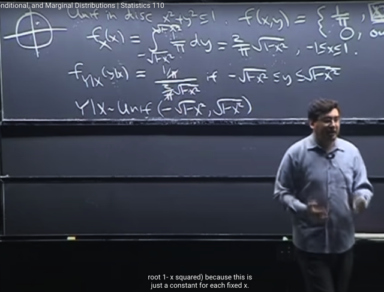</kbd></p>

> [!NOTE]
> Thế thì, nhìn vào kết quả:
>
> ```text
> f_Y|X(y|x) = 1 / [2*sqrt(1-x^2)]
> ```
>
> ta sẽ có thể hiểu là **DỰA TRÊN VIỆC BIẾT GIÁ TRỊ CỤ THỂ  x CỦA
> X** thì **Y sẽ là một random variable tuân theo Uniform `[-sqrt(1-x^2),`
> sqrt(1-x^2)],**vì với giá trị cụ thể của x, `f_Y|X(y|x)` là function **KHÔNG
> PHỤ THUỘC y, NÓI ĐÚNG HƠN LÀ CONSTANT**
>
> Và kí hiệu của điều này là **Y|X ~ Uniform `[-sqrt(1-x^2),` sqrt(1-x^2)]**

<br>

<a id="node-622"></a>

<p align="center"><kbd></kbd></p>

<br>

<a id="node-623"></a>

<p align="center"><kbd>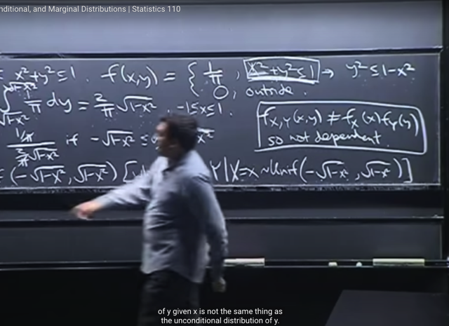</kbd></p>

> [!NOTE]
> Và từ đó ta có thể**nhận định X,Y dependent**, vì có thể thấy **TÍCH CỦA
> MARGINAL PDF KHÔNG BẰNG JOINT PDF**
>
> ```text
> [2*sqrt(1-x^2)/π] * [2*sqrt(1-y^2)/π] không bằng 1/π
> ```
>
> Hoặc là ta có thể rút ra cùng kết luận này bởi :
>
> **marginal** **pdf của Y** `f_Y(y)` =**2*sqrt(1-y^2) `/` π** 
>
> **KHÔNG BẰNG** **conditional** **pdf của Y|X** tức `f_Y|X(y|x)` **= 1/sqrt(1-x^2)**)

<br>

<a id="node-624"></a>

<p align="center"><kbd>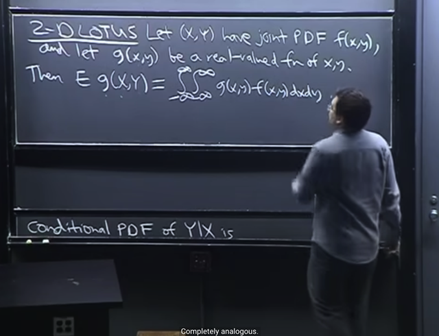</kbd></p>

> [!NOTE]
> Tiếp, gs nói về **một cái hoàn toàn tương tự với LOTUS** mà ta đã biết.
>
> Trong LOTUS thì ta nhớ nó **cho phép ta tính expected value của g(x)**
> mà **không  cần phải tính pdf của g(x)** mà **chỉ cần dùng pdf của X tức
> f(x)**
>
> **E(g(x))** `=` tích phân từ -**infinity** tới **infinity** của **g(x)f(x)dx**
>
> Thế thì tương tự, nếu ta có **Joint pdf `f_X,Y(x,` y)** thì **LOTUS** cho phép ta tính
> **expected value của g(X,Y) (*)** 
>
> (*): Again, X,Y là r.v thì g(X,Y) ví dụ như `X^2+sin(Y),` tức là apply hàm g(x,y)
> lên X, Y thì ta cũng sẽ CÓ **MỘT** **RANDOM** **VARIABLE**, để rồi có quyền tìm
> expected value của nó 
>
> Vậy ta có thể tính như sau gọi là **2D LOTUS**
>
> **E(g(X,Y)) `=` `∫-infinity:infinity` `∫` từ `-infinity:infinity` g(x,y)*f(x,y)dxdy
>
> f(x,y) là Joint PDF f_X,Y(x,y)**

> [!NOTE]
> ```text
> 2D LOTUS E(g(X,Y)) = ∫-infinity:infinity ∫ từ -infinity:infinity g(x,y)*f(x,y)dxdy
> ```

<br>

<a id="node-625"></a>

<p align="center"><kbd></kbd></p>

🔗 **Related:** [LEC 17: MOMENT GENERATING FUNCTIONS](untitled.md#node-536)

🔗 **Related:** [LEC 21: COVARIANCE & CORRELATION](untitled.md#node-681)

> [!NOTE]
> Tiếp theo gs nói đến **một kiến thức** mà ta **đã dùng** nhưng **chưa chứng
> minh** ở bài trước, khi ta nói nếu**X,Y independent thì `E(e^t(X+Y))` `=`
> E(e^tX)*E(e^tY)**
>
> (vì **X,Y independent nên e^tX và e^tY cũng independent**, và khi đó theorem
> mà ta sẽ chứng minh ở đây đó là X,Y độc lập thì `E(XY)` `=` EX*EY) cho phép ta
> tính expected value của tích của chúng bằng tích của expected value)
>
> Thì nay ta sẽ **chứng minh theorem** **nếu X,Y independent thì `E[XY]` `=`
> EX*EY**

> [!NOTE]
> CHỨNG MINH THEOREM: X,Y INDEPENDENT thì
> `E[XY]` `=` EX*EY NHỜ 2D LOTUS

<br>

<a id="node-626"></a>

<p align="center"><kbd>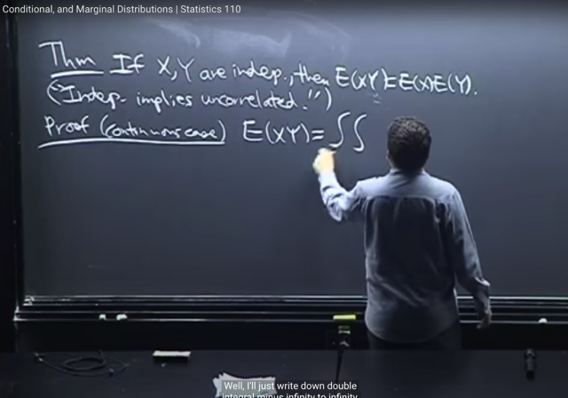</kbd></p>

🔗 **Related:** [LEC 21: COVARIANCE & CORRELATION](untitled.md#node-693)

> [!NOTE]
> gs cho biết ta sẽ **quay lại dùng cái này** khi qua bài nói về
> **CORRELATION** giữa hai r.v
>
> Và sự thật rằng nếu hai random variable **INDEPENDENCE** THÌ HÀM Ý
> CHÚNG CŨNG **UNCORRELATED**Ta sẽ chứng minh theorem này với continuous case, với discrete cũng
> tương tự

<br>

<a id="node-627"></a>

<p align="center"><kbd>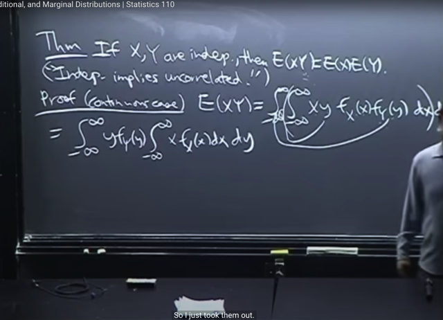</kbd></p>

> [!NOTE]
> Thế thì ta sẽ đơn giản là **nhờ 2D LOTUS** như vừa mới nói. `E(XY)` cơ bản
> chính là ta tính **E của g(X, Y) với g(x,y) `=` x*y**
>
> Do đó LOTUS cho phép ta tính `E(g(X,` Y)) mà không cần tìm PDF của g(X,Y) mà
> chỉ cần dùng Joint PDF của X,Y: `f_X,Y(x,y)`
>
> **E(XY) `=` `∫-inf:inf` `∫-inf:inf` x*y f_X,Y(x,y)dxdy**
>
> Thế mà do ta đang xét **X,Y INDEPENDEN**T, nên như lúc nãy ta đã biết
> **JOINT PDF BẰNG TÍCH CỦA MARGINAL PDF: `f_X,Y(x,y)` `=` f_X(x)*f_Y(y)**
>
> Từ đó ta có `E(XY)` `=` `∫-inf:inf` `∫-inf:inf` **x*y f_X(x)f_Y(y)**dxdy
>
> `====`
>
> Tiếp, khi tính tích phân kép , như gs đã từng nói, ta chỉ việc**tính tích phân của x
> (hoặc y trước) coi y là constant.**
>
> Và **vì coi y là constant** nên ta có thể đưa **y, `f_Y(y)` ra ngoài dấu (inner) tích
> phân** để ta có:
>
> `∫-inf:inf` **y*f_Y(y)** [ `∫-inf:inf` `x*f_X(x)dxdy` ]

<br>

<a id="node-628"></a>

<p align="center"><kbd>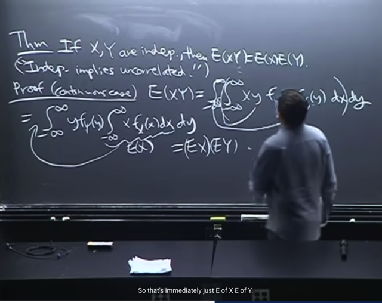</kbd></p>

🔗 **Related:** [LEC 29: LAW OF LARGE NUMBERS & LAW OF CENTRAL LIMIT](untitled.md#node-898)

> [!NOTE]
> Và ∫**-inf:inf x*f_X(x)dx** chính là **EX** và đương nhiên nó là một **CON SỐ**. 
>
> Thì khi thành ra ta có **∫-inf:inf `y*f_Y(y)` [EX] dy**
> Và đến lượt tính outer integral `-` tính tích phân của yf(y)dy, ta sẽ**đưa constant 
> EX này ra ngoài**. 
>
> Và tích phân của y: **∫-inf:inf y*f_Y(y)dy** thì lại **chính là EY** 
>
> Kết quả ta có **EX*EY**, 
>
> Vậy là đã chứng minh xong nếu **X,Y independent thì `E(XY)` `=` EX*EY**
>
> Gs cho rằng với LOTUS, ta đã dễ dàng chứng minh được theorem này

<br>

<a id="node-629"></a>

<p align="center"><kbd>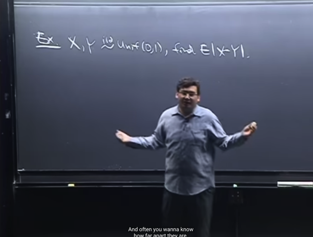</kbd></p>

> [!NOTE]
> Tiếp ta sẽ qua một bài toán nữa mà **LOTUS tỏ ra rất hữu ích** đó là cho
> **X,Y i.i.d ~ Uniform (0,1)**. Câu hỏi là tìm **expected value của |X-Y|**

<br>

<a id="node-630"></a>

<p align="center"><kbd></kbd></p>

> [!NOTE]
> Thế thì, nhờ LOTUS, **E(|X-Y|)** sẽ là:
>
> **E(|X-Y|) =**∫-inf:inf `∫-inf:inf` **|x-y|** f(x,y)dxdy
>
> (trong tình huống ko có gì lầm lẫn thì có thể khỏi cần ghi `f_X,Y(x,y)`
> mà chỉ ghi f(x,y) vì hiển nhiên hiểu đây là Joint PDF của X, Y)
>
> Vì **X ~ Uniform(0,1)** nên PDF (cũng là Marginal PDF) **f_X(x)**
> bằng 1 khi x thuộc [0,1].  và bằng 0 khi x không thuộc [0, 1]
>
> (Theo định nghĩa Unif(a,b) f(x) `=` c trên đoạn [a, b], dễ dàng dựa vào
> ```text
> điều kiện valid  của PDF,  để ∫-inf:inf f(x)dx = 1 = ∫a:b c*dx = 1 => c = 1
> ```
> `/` `(b-a),` nên với Unif(0,1) thì c  `=` 1)
>
> tương tự y cũng vậy
>
> Và vì**X, Y independent** (do đề cho X,Y **i.i.d**) nên ta có **Joint pdf**của chúng bằng TÍCH **marginal** pdf:
>
> Vậy f(x,y) `=` 1*1 `=` 1 khi x, y trên đoạn [0,1].
>
> Còn ở ngoài đoạn [0,1] thì pdf `=` 0
>
> Do đó**E(|X-Y|) `=` `∫0:1∫0:1` `|x-y|` dxdy**

<br>

<a id="node-631"></a>

<p align="center"><kbd>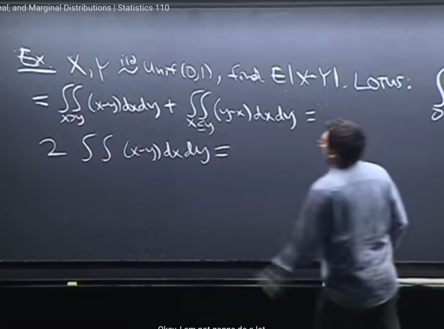</kbd></p>

> [!NOTE]
> Tiếp theo, để**tính tích phân** này, ta sẽ **chia nó làm hai phần**, một phần trong
> miền mà **x<y** và một phần trong miền mà **x>y**
>
> Tích phân **trong miền x>y** của `|x-y|dxdy` sẽ là t**ích phân của (x-y)dxdy**
>
> Tích phân **trong miền x<y** của `|x-y|dxdy` sẽ là **tích phân của (y-x)dxdy**
>
> Thế thì vì **X,Y i.i.d** và **symmetrical** nên tích phân trên miền (x>y) của `(x-y)dxdy` 
> **hoàn toàn bằng** với tích phân trên miền (x<y) của `(y-x)dxdy`
>
> Nên ta **chỉ cần tính một** cái tích phân kép trên miền x>y của `(x-y)dxdy`

<br>

<a id="node-632"></a>

<p align="center"><kbd>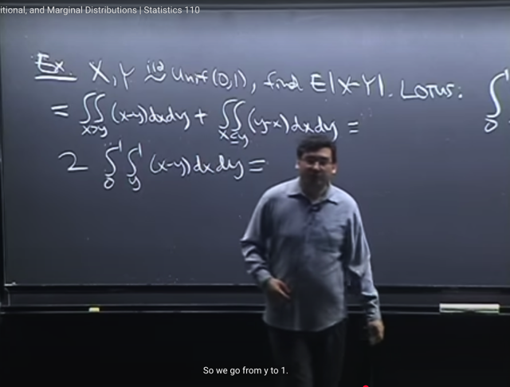</kbd></p>

> [!NOTE]
> Đại khái là, như **đã từng nói**, **tích phân kép không khó**, **cái khó** là cần
> phải cẩn thận **xác định limit** của tích phân.
>
> Thì khi ta **ghi dxdy** thì **tích phân ở ngoài**(outer integral) là đối **với y**, và
> vì **Y ~ Unif(0,1)** nên **limit của tích phân là từ 0 đến 1**.
>
> Gs nói **tích phân ở ngoài** **phải là number**.
>
> còn tích phân ở trong tức là over x, thì **có thể phụ thuộc y**, thì ta **đang xét
> miền x > y**, nên limit của tích phân sẽ là từ **y đến 1** (vì X cũng ~ Unif(0,1) và
> xét x > y)

<br>

<a id="node-633"></a>

<p align="center"><kbd>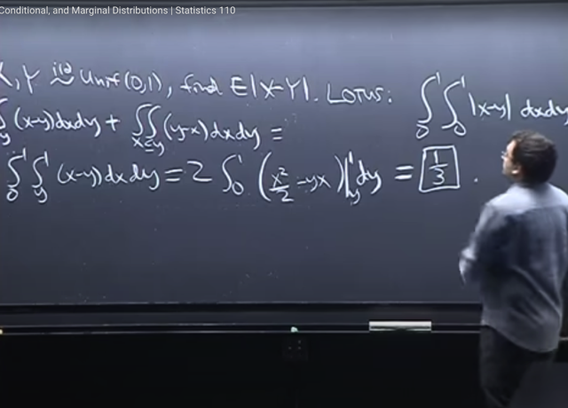</kbd></p>

> [!NOTE]
> Rồi, như đã biết, ta **cứ việc tính tính phân ở trong**, over x trước, **coi y như
> constant**. theo **FTC part 2**, sẽ bằng **[nguyên hàm của x-y**] | **0:y**
>
> `=` `(x^2/2` `-` xy) | y:1
>
> `=` `(1^2/2` `-` 1*y) `-` `(y^2/2` `-` y^2) `=` **1/2 `-` y `-` `(-` y^2/2)**= `1/2` `-` y `+` `y^2/2` `=` **1/2 `-` y `+` y^2/2**Tiếp theo ta chỉ còn cần phải tính tích phân của `(1/2` `-` y `+` `y^2/2)dy` trên đoạn
> [0,1]
>
> ```text
> = [nguyên hàm của (1/2 - y + y^2/2)] 0:1
> ```
>
> ```text
> = (1/2y - y^2/2  + y^3/6) | 0:1
> ```
>
> ```text
> = (1/2 - 1/2  + 1/6) - (0 - 0  + 0) = 1/6
> ```
>
> Nhân với số 2 ở trước, kết quả là **2/6** `=` **1/3**Vậy**expected value** của khoảng cách **(hiệu) giữa hai Uniform(0,1)
> random variables là 1/3**

<br>

<a id="node-634"></a>

<p align="center"><kbd></kbd></p>

> [!NOTE]
> Thế thì gs **một cách hài hước**, lấy ví dụ ta **chọn hai điểm ngẫu nhiên** trên
> đoạn **[0,1]** thì **trung bình khoảng cách của chúng sẽ là 1/3**
>
> Kết quả này có thể **giúp ta dẫn đến bài toán khác**:
>
> Bằng cách đặt **max(X,Y) là M**, **min(X,Y) là L**.
>
> Thì **|X-Y| chính là bằng M-L**(cái này dễ hiểu, vì `|X-Y|` là dù cái nào lớn hơn thì
> cũng lấy cái đó trừ cái kia, thì Max `-` Min cũng vậy),
>
> ```text
> Và E(|X-Y|) = E(M-L) = EM - EL (nhờ linearity) = 1/3 như đã tính ra
> ```
>
> Rồi, **M+L** dễ hiểu **chính là X+Y** (lấy thằng lớn trong hai thằng cộng thằng bé
> trong hai thằng thì chính là hai cái đó cộng nhau).
>
> Nên **E(M+L) `=` E(X+Y)** và theo linearity nó bằng **EX `+` EY**.
>
> Và vì **X, Y đều là Unif(0,1)** nên **EX `=` EY `=` 1/2** (bài trước ta đã chứng minh
> EX của  X ~ Unif(a, b) là **(a+b)/2**
>
> Như vậy, EM `+` EL `=` **EX `+` EY `=` 1**
>
> Từ đó giải ra **EM `=` 2/3** và **EL `=` 1/3** mang ý nghĩa là **khi chọn random hai
> điểm trên đoạn 0,1** thì **trung bình,** **điểm lớn sẽ quanh mốc 2/3** và **điểm có
> gía trị nhỏ sẽ quanh mốc 1/3**

<br>

<a id="node-635"></a>

<p align="center"><kbd>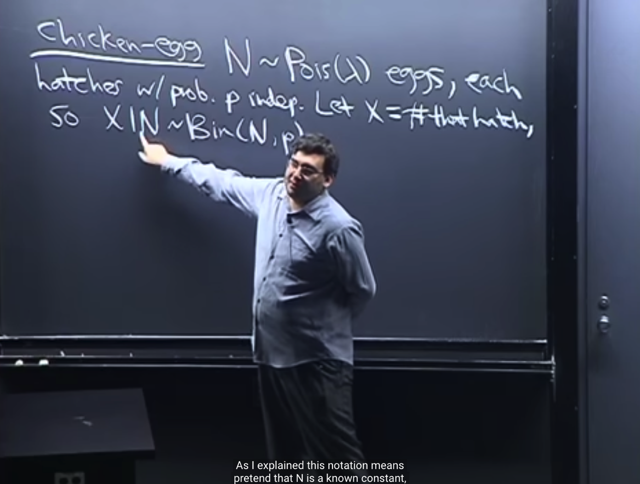</kbd></p>

> [!NOTE]
> Ta qua bài toán `Chicken-Egg:` Cho**N là số trứng gà đẻ**, là một **r.v** ~ **Poisson**
> (**lambda**). Xác suất một quả **trứng nở** là **p**, và các quả trứng **độc lập** (**i.i.d**) có
> nghĩa là coi như ta có N Bern(p) i.i.d trials
>
> Gọi **X là số trứng nở**, thì **X|N ~ Bin(N, p)** với ý nghĩa là, **nếu biết N** (tức là một
> giá trị cụ thể của N, mà như nói ở trên, vốn là một r.v ~ Pois(lambda), thì **X là
> một random variable ~ Binomial (N, p) như ta đã quen thuộc**

> [!NOTE]
> BÀI TOÁN CHICKEN EGG

<br>

<a id="node-636"></a>

<p align="center"><kbd>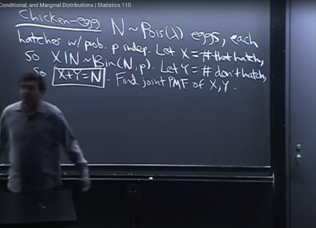</kbd></p>

> [!NOTE]
> Tiếp, **gọi Y là số trứng không nở**. Nên ta có **X+Y `=` N**. Câu hỏi là,**tìm
> Joint PMF của X, Y**

<br>

<a id="node-637"></a>

<p align="center"><kbd>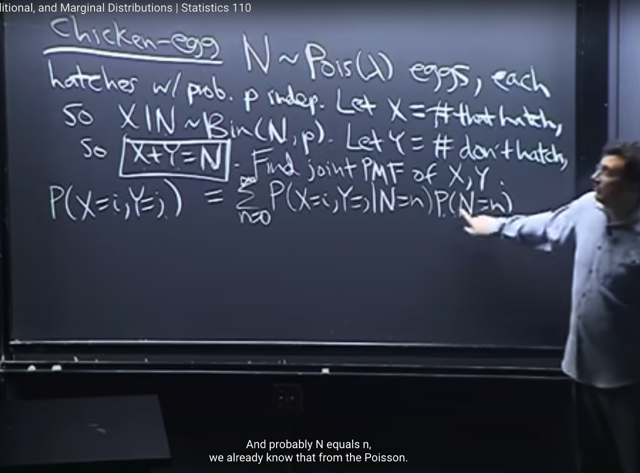</kbd></p>

> [!NOTE]
> Đầu tiên, như đã biết về **Joint PMF**, nó là **P(X=x, Y=y)** và ở đây gs dùng **i,
> j** để nhớ rằng các **possible value của X, Y** (số trứng nở và không nở) là
> **integer**.
>
> Thế thì theo gs, khi **đối mặt với một vấn đề mà ta không biết hướng giải quyết**,
> thì có thể dùng **cách tiếp cận wishful thinking** mà ta đã từng dùng ở các bài
> trước đó là "**ước gì `/` dựa trên những gì mà ta ước là mình đã biết**".
>
> Thì ở đây, ta **ước mình đã biết tổng số trứng N**. Từ đó ta sẽ **cho rằng đã biết
> số trứng N** và **conditioned trên thông tin này**.
>
> Vậy thì ta sẽ dùng **Law of Total Probability**, mà bản chất là lập luận như sau:
>
> event **(X=i, Y=j)** chính là **Union** của các **DISJOINT** event**(X=i, `Y=j,` N=n)** với 
> n `=` 0,1. ..infinity 
>
> ```text
> (X=i, Y=j) = (X=i, Y=j) ∩ S (do (X=i, Y=j) ⊂ S)
> ```
>
> ```text
> = (X=i, Y=j) ∩ (N=0 U N=1 U...) ( Do S = (N=0 U N=1 U...))
> ```
>
> ```text
> = (X=i, Y=j, N=0) U (X=i, Y=j, N=1) U ...U (X=i, Y=j, N=n) | distributive law
> ```
>
> Do đó **P(X=i, Y=j)** `=` **P(Union của các DISJOINT event `(X=i,` `Y=j,` N=n)** với n `=` 0,1..
> . infinity))
>
> Theo **Axiom 2**, Xác suất của Union của các Disjoint event bằng tổng Xác suất cuả
> từng event, do đó:
>
> **P(Union của các DISJOINT event `(X=i,` `Y=j,` `N=n)` với n `=` 0,1...infinity))
>
> `=` Tổng `n=0,1...infinity` `P(X=i,` `Y=j,` N=n)**
>
> Theo **conditional probability theorem**: P(A,B) `=` P(A|B)*P(B)
>
> ```text
> Tổng n=0,1...infinity P(X=i, Y=j, N=n) = Tổng n=0,1...infinity P(X=i, Y=j | N=n) *
> ```
> `P(N=n)`
>
> Như vậy **P(X=i, `Y=j)` `=` Tổng `n=0,1...infinity` `P(X=i,` `Y=j` | `N=n)` * P(N=n)**

<br>

<a id="node-638"></a>

<p align="center"><kbd>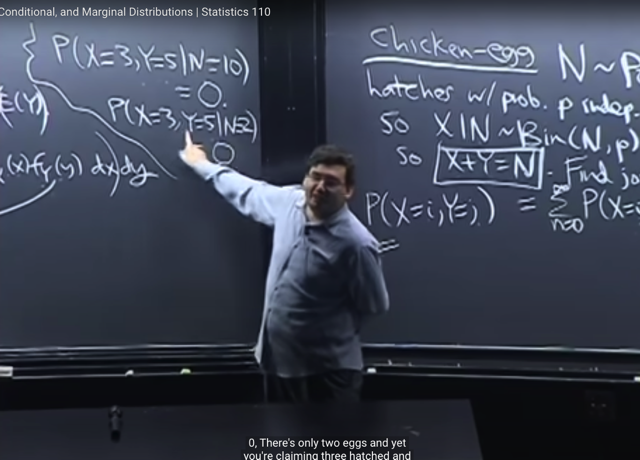</kbd></p>

> [!NOTE]
> Thế thì ta gặp phải việc tính **INFINITE SUM**, sum của một tổng có vô hạn
> phần tử. Thì gs gợi ý rằng, trong những lúc như vậy, **cảm thấy bí**, thì nên
> **cho một số giá trị cụ thể** để từ đó ta**đánh giá tình hình**.
>
> Ví dụ **P(X=3, `Y=5,` N=10)** có thể thấy rõ **xác suất này bằng 0**, vì **có 10
> quả trứng** mà lại **chỉ có 3 cái nở, 5 cái không nở**, bị **mất 2 cái**, là điều
> không thể xảy ra trong bối cảnh này.
>
> Tương tự như vậy **P(X=3, `Y=5,` `N=2)` cũng bằng 0**.

<br>

<a id="node-639"></a>

<p align="center"><kbd>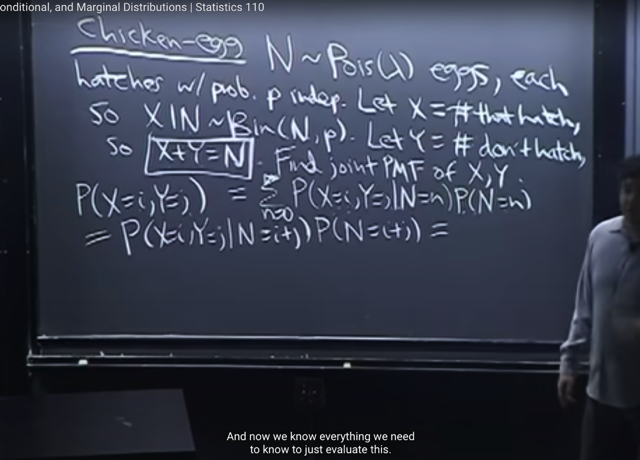</kbd></p>

> [!NOTE]
> Do đó, tổng vô hạn hạng tử này **thực ra chỉ có 1 hạng tử thôi**, mọi các
> khác bằng 0. Và cái đó chính là **P(X=i, `Y=j` | N `=` `i+j)` * P(N=i+j)**

<br>

<a id="node-640"></a>

<p align="center"><kbd>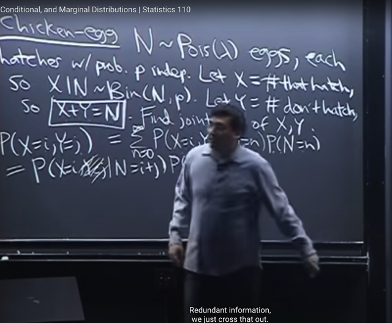</kbd></p>

> [!NOTE]
> Tiếp, ta **nhận định thêm** rằng, nếu **đã biết N `=` i+j**, thì **X=i** **đã** **đủ cho
> ta biết Y=j**. Do đó **Y=j là redundant.**
>
> Và ý hai event**(X=i, `Y=j` | N=i+j)** và **(X=i | N=i+j)** là **một**, hoặc nói cách
> ```text
> khác, event (X=i | N=i+j) cũng chính là event (X=i, Y=j | N=i+j)
> ```
>
> Nếu chưa hài lòng thì giải thích theo original sample space:
>
> ```text
> Về bản chất (X=i, Y=j | N=i+j) là event {s ∈ S: X(s) = i, Y(s) = j} với việc
> ```
> đã xảy ra event {s ∈ S: X(s) `+` Y(s) `=` `i+j}` 
>
> ```text
> Vậy thì vì đã biết X(s) + Y(s) = i+j ⇔ X(s) = i + j - Y(s) (1) Xét s là một p.o trong
> ```
> {s ∈ S: Y(s) `=` j} thì dĩ nhiên ta có Y(s) `=` j, dùng (1) ta suy ra X(s) `=` i. điều này
> chứng tỏ s đó cũng nằm trong {s ∈ S: X(s) `=` i}. Từ đó suy ra {s ∈ S: Y(s) `=` j } 
> ```text
> ⊂ {s ∈ S: X(s) = i } và suy ra {s ∈ S: Y(s) = j } ∩ {s ∈ S: X(s) = i } = {s ∈ S: X(s) = i }
> ```
> ⇔ **{s**∈**S: X(s) `=` i , Y(s) `=` j} `=` {s**∈**S: X(s) `=` i }**
>
> ```text
> Và có nghĩa là  (X=i, Y=j | N=i+j) = (X=i | N=i+j)
> ```
>
> Và ta có thể thay**P(X=i, `Y=j` | `N=i+j)` `=` `P(X=i` | N=i+j)**

<br>

<a id="node-641"></a>

<p align="center"><kbd>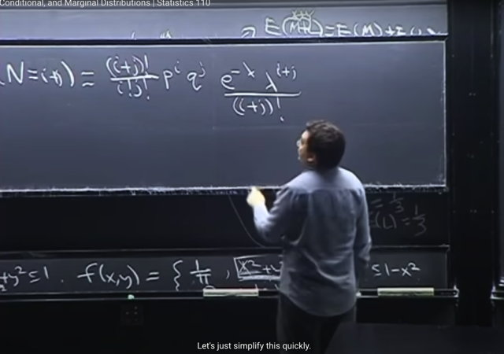</kbd></p>

<p align="center"><kbd></kbd></p>

<p align="center"><kbd>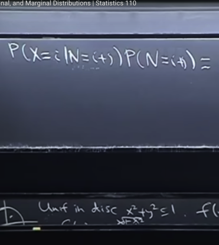</kbd></p>

> [!NOTE]
> Tiếp, như đã nói, **với việc biết giá trị cụ thể n `(=` i+j)** **của N**, thì **X** với ý nghĩa là số**trial success** trong
> tổng số **N i.i.d Bern(p)** trials là một random variable ~ **Binomial (N, p)**
>
> Nhớ lại **với X~ Bin(n, p)** thì PMF của nó **P(X=k)** `=` **(n choose k) p^k q^(n-k)**
>
> ```text
> nên P(X=i | N=n) = (n choose i) p^i q^(n-i) = (i+k choose i) p^i q^j
> ```
>
> Và (n choose k) thì có công thức là n! `/` `[k!(n-k)!]` 
>
> ⇨ `(i+k` choose i) `=`  **(i+j)! `/` (i!j!)**
>
> `=>` **P(X=i | N=n)** `=` (n choose i) p^i `q^(n-i)` `=` **(i+j)! `/` (i!j!) p^i q^j**
>
> `===`
>
> Còn **N** như đã nói, là một **Pois(λ)**, nên PMF của Poison là **P(N=k)** `=` **e^(-λ) λ^k `/` k!**
>
> `=` **e^(-λ) `λ^(i+j)` `/` (i+j)!**

<br>

<a id="node-642"></a>

<p align="center"><kbd>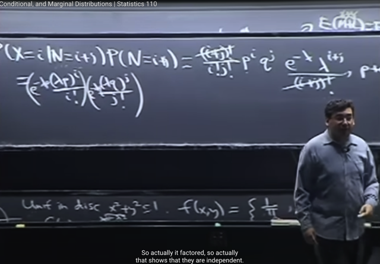</kbd></p>

> [!NOTE]
> ta sẽ không khó để rút gọn để đưa nó về **g(i) * h(j)**:
>
> ```text
> (i+j)! / (i!j!) p^i q^j * e^(-λ) λ^(i+j) / (i+j)!
> ```
>
> ```text
> = \~(i+j)!\~ / (i!j!) * p^i * q^j * e^(-λ) * λ^(i+j) / \~(i+j)!
> ```
>
> ```text
> \~= p^i * q^j / (i!j!)  * e^(-λ) * λ^(i+j)
> ```
>
> ```text
> = p^i * q^j / (i!j!)  * e^[-λ(p+q)] * λ^(i+j)    vì p+q = 1
> ```
>
> ```text
> = p^i * q^j / (i!j!)  * e^(-λp) * e^(-λq) * λ^(i+j)
> ```
>
> ```text
> = [ p^i * e^(-λp) * λ^i / i! ] * [q^j * e^(-λq) * λ^j / j! ]
> ```
> ****= [ `e^(-λp)` * (λp)^i `/` i! ] * [ `e^(-λq)` * (λq)^j `/` j! ]
>
> Kết luận **P(X=i, Y=j)** bằng tích của **[ `e^(-λp)` * (λp)^i `/` i! ] và [ `e^(-λq)` * (λq)^j `/` j! ]**

<br>

<a id="node-643"></a>

<p align="center"><kbd>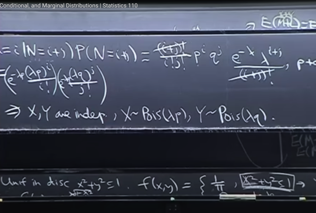</kbd></p>

> [!NOTE]
> Và từ đó ta thấy:
>
> 1) J**oint PMF của X, Y** là **tích của hai PMF function RIÊNG BIỆT của
> chúng**: một cái t**heo i**, một cái **theo j** và
>
> 2) Hai PMF function này LẠI CÓ DẠNG của **Pois(λp)** và **Pois(λq)**
>
> Nên **theo định nghĩa về INDEPENDENT RANDOM VARIABLE** theo Joint
> PMF và Marginal PMF. Ta **có thể kết luận:
>
> X, Y Independent**. Với **X ~ Pois(λp)** và **Y ~ Pois(λq)**

<br>

<a id="node-644"></a>

<p align="center"><kbd>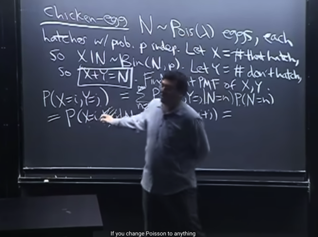</kbd></p>

> [!NOTE]
> Cuối cùng gs cho biết đây là**tính chất đặc biệt của Poisson**.
>
> Ý là, ban đầu việc **X+Y `=` N**, khiến ta đưa ra **nhận định ban đầu là X, Y
> DEPENDENT**, vì **X `=` N `-` Y** hoặc ngược lại, giá trị của cái này giúp xác định
> giá trị cái kia
>
> Tuy nhiên **kết quả lại cho thấy chúng INDEPENDENT.**
>
> Vậy thì, đây là **đặc điểm đặc biệt của Poisson**, mà nếu ta thay distribution của N
> bằng một distribution khác Poisson thì sẽ không có kết quả này

> [!NOTE]
> TÍNH CHẤT ĐẶC BIỆT
> CỦA POISSON

<br>

