# Lec 1: Probability & Counting

📊 **Progress:** `17` Notes | `17` Screenshots

---

<kbd>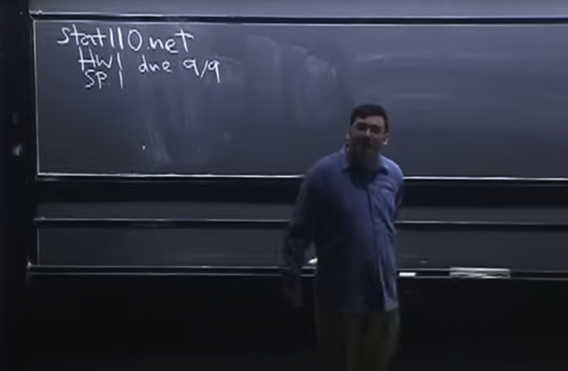</kbd>

> [!NOTE]
> Lời khuyên đầu tiên: làm càng nhiều
> bài tập càng tốt

 

<kbd>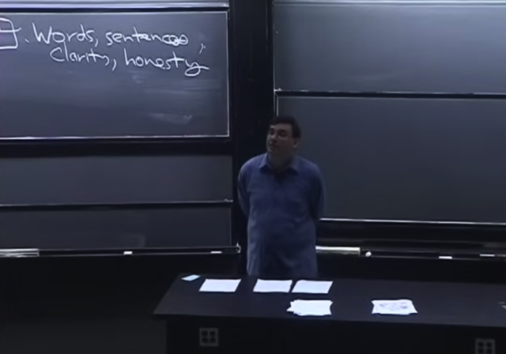</kbd>

> [!NOTE]
> Thứ hai: Khi làm bài tập, nên giải thích
> ra quá trình cho ra solution.

 

<kbd>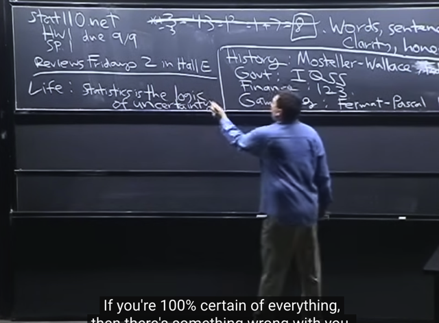</kbd>

> [!NOTE]
> Gs nói qua một chút về các ứng
> dụng của Probability.

 

<kbd>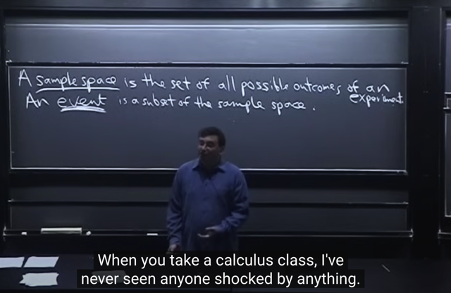</kbd>

> [!NOTE]
> Đầu tiên khái niệm "**Sample space**": là tập hợp **mọi possible outcome** của một
> **experiment**.
>
> Đại khái là thầy nói bạn học xong lớp này thì**có thể giải những vấn đề mà
> cách đây 300 năm người ta phải đi hỏi Issac Newton**. thậm chí Newton còn
> sai. Và môn này chứa đầy những thứ có tính chất "**counterintuitive**" `=` phản 
> trực giác.

 

<kbd>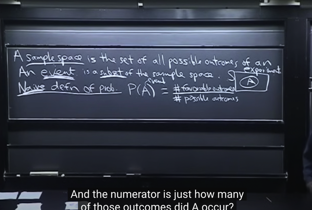</kbd>

> [!NOTE]
> một **"very naive" definition** of probability: **Xác suất xảy ra event A** là **tỉ
> số** giữa **[số possible outcome thuộc event A]** trên [**số possible
> outcome]**.
>
> Nên hiểu là [số possible outcome thuộc A] nhân xác xuất xảy ra của một
> outcome mà vì các outcome để equally likely nên giá trị này bằng 1 `/` tổng số
> possible outcome

 

<kbd>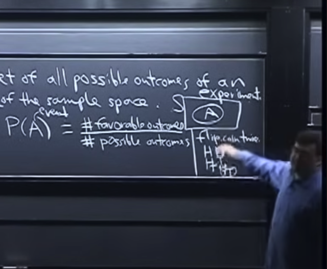</kbd>

> [!NOTE]
> ví dụ tung 2 đồng xu, xác suất xảy ra `Tail-Tail` là `1/4,` vì tung 2 đồng xu thì
> có **tổng cộng 4 khả năng (possible outcome)**trong đó**chỉ có 1 outcome
> thuộc event "Tail-Tail"**

 

<kbd>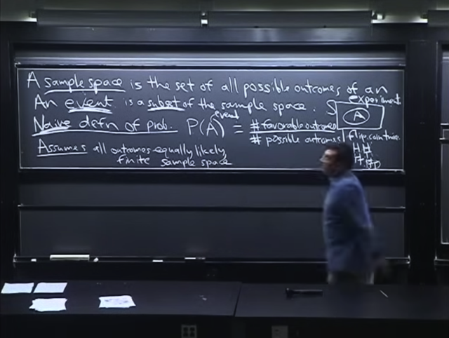</kbd>

> [!NOTE]
> Gs nói về **giả định cần có** là mọi outcome phải **đều có khả năng xảy ra
> như nhau** (**equally likely**)
>
> Ví dụ như đồng xu phải là **fair** coin, tức không có vụ dễ ra mặt ngửa hơn
> hay mặt úp hơn.
>
> Và thứ hai là **không gian sample space phải hữu hạn**, đơn giản là vì nếu
> nó vô hạn thì viêc tính **xác suất với mẫu vô hạn sẽ không còn ý nghĩa**

 

<kbd>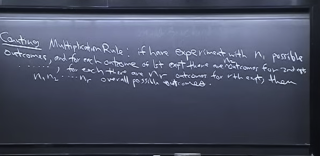</kbd>

> [!NOTE]
> Đầu tiên ta phải biết **cách đếm** (số possible outcome) như đã biết **có
> 2 quy tắc chính**.
>
> Quy tắc Nhân: Khi thử nghiệm đầu tiên có n1 possible outcome, và dù nó
> là gì thì thử nghiệm thứ 2 có cũng luôn n2 khả năng, cứ thế, miễn là**kết
> quả của thử nghiệm trước không ảnh hưởng đến số possible outcome
> của thử nghiệm sau** thì ta sẽ có thể tính tổng số tất cả possible outcome
> là **n1*n2.. ..**

 

<kbd>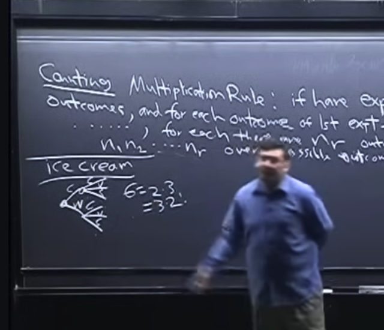</kbd>

> [!NOTE]
> Ví dụ bước 1 chọn 1 trong 2 loại cone (cái ốc quế đựng kem) và bước 2
> chọn 1 trong 3 loại kem.
>
> Thì dù chọn cone gì thì vẫn được chọn 3 loại kem. Nên số possible outcome
> là 2.3 `=` 6.
>
> Và hoàn toàn có thể chọn kem trước, vì dù có chọn kem gì thì cũng luôn có 2
> loại cone để chọn `->` 3.2 `=` 6

 

<kbd>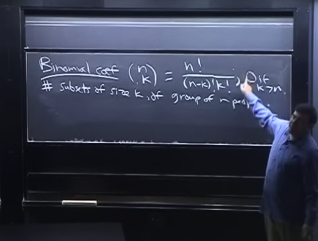</kbd>

> [!NOTE]
> Trước khi nói tiếp một ví dụ, gs ôn lại về **Binomial coefficient**:
>
> kí hiệu **(n choose k)** , có công thức là **n!/[(n-k)!k!]**
>
> Thì đây là
>
> **SỐ CÁCH LẤY RA MỘT SET CÓ K CÁI, TỪ MỘT BỘ CÓ N CÁI, KHÔNG
> QUAN TÂM THỨ TỰ (*)**
>
> Và nếu k > n thì quy ước kết quả là 0.

 

<kbd>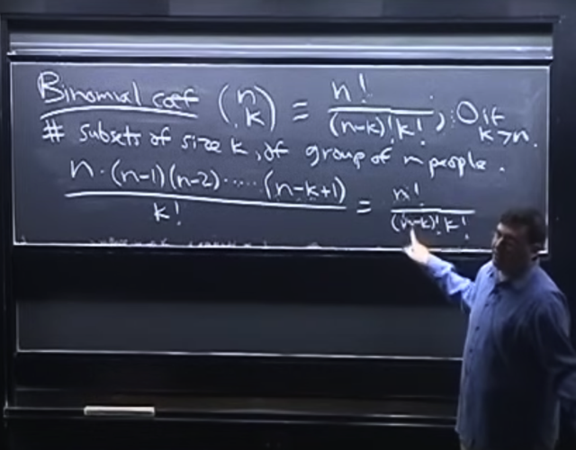</kbd>

> [!NOTE]
> ở đâu có công thức này thì cũng dễ chứng minh từ Product Rule ở trên:
>
> Có n người, để chọn k người, thì **người đầu tiên ta có n cách chọn**,
> người **thứ 2 có `n-1` cách chọn**,...**người thứ k ta có n-k+1** cách chọn.
>
> **Và chọn người thứ nhất thì dù có là ai thì người thứ hai ta vẫn có `n-1`
> cách chọn**, và các người sau cũng vậy. Nên theo Product rule ta có
> **n*(n-1)..(n-k+1)** cách chọn.
>
> Và**n*(n-1)..(n-k+1)** chính là =**n! `/` (n-k)!**
>
> Tuy nhiên, theo cách chọn trên ta **đã tính các bộ k người có quan tâm đến
> thứ tự** ví dụ như các kết qủa sẽ có cả **ABC, BAC, CAB**...
>
> Nhưng ở đây **mình không quan tâm thứ tự** cho nên **ta sẽ chia cho k!** là**số lần
> trùng lặp**. Ví dụ**với 3 người A,B,C** thì **nếu quan tâm thứ tự sẽ có 3.2.1 `=` 3!**
> **bộ** nhưng **nếu không quan tâm thứ tự thì chỉ cần 1.**
>
> Vậy nếu mình có **n*(n-1)..(n-k+1)** bộ **k người có quan tâm thứ tự** thì để
> tính số **bộ k người không quan tâm thứ tự thì ta chia đi cho k!**
>
> Vậy công thức là **n! `/` [ `(n-k)!` k! ]**Cách lập luận khác như sau: Từ set có n cái khác nhau, thì có n! hoán vị.
> Vậy để lấy một set có k cái trong n cái khác nhau không care thứ tự
> ta sẽ chia quá trình lấy ra làm 2 bước:
>
> Bước 1: Lấy một hoán vị của n cái: Có n! cách chọn
>
> Bước 2: Chọn k item đầu tiên: Có 1 cách chọn.
>
> Vậy thì theo product rule ta có n!*1 `=` n! cách chọn.
>
> Bước 3 là adjusting overcounting: Trong k! cách chọn trên ta đã đếm luôn,
> hay có quan tâm đến thứ tự của k object trong set Nhưng vì ta không care 
> thứ tự của set k object, nên ta sẽ chia bớt cho k! là số hoán vị của k object.
>
> Đồng thời ta cũng không care thứ tự của các object không được chọn
> nên ta cũng sẽ chia `(n-k)!` 
>
> Vậy kết quả là **n!/[ `k!(n-k)!` ]**

 

<kbd>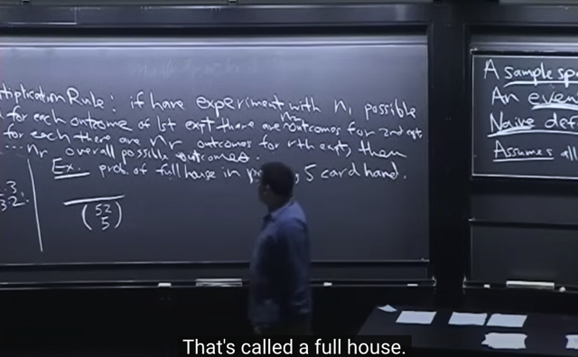</kbd>

> [!NOTE]
> rồi, quay lại đây, gs cho biết khái niệm **Full House** là khi ta **có 3 lá bài
> này và 2 lá bài kia**(ví dụ 3 lá 7 và 2 lá 5)****- là một Full House
>
> Và ta cho rằng `/` giả định bộ bài **được shuffle hoàn toàn**, để **xác suất
> chọn ra bất cứ lá bài nào trong đây đều như nhau**. Từ đó các **bộ 5 lá
> Full House đều có thể xuất hiện với xác suất như nhau (equally likely
> outcome, là giả định cần thiết để có thể dùng naive definition để tính xác
> suất)**

 

<kbd>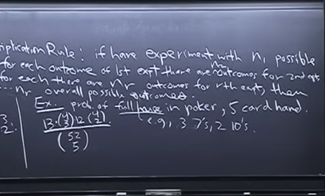</kbd>

> [!NOTE]
> Thế thì tính toán như sau, tính xác suất của chọn bộ `full-house`
>
> Như đã nói, full house là **3 lá loại này** và **2 lá có loại kia**.
>
> Vậy đầu tiên, để tính tổng số lượng của mọi possible outcome, hay kích thước của
> **SAMPLE SPACE**: ta sẽ **ĐẾM** xem có bao nhiêu cách để **chọn ra 5 lá từ bộ 52 lá**.
> Chính là**số cách chọn 5 item từ 52 item khác nhau không care thứ tự** **(52 choose 5)**
>
> ⇨ Vì các possible outcome là equally likely nên xác suất xảy ra một outcome là 
>
> p `=` **1/(52 choose 5)**
>
> Bây giờ ta **ĐẾM** **số bộ full house có thể xảy ra**, tức là **số outcome thuộc** **EVENT
> SPACE**.
>
> Khi đó nhân cho xác suất của một outcome để có được xác suất xảy ra Full House theo
> naive definition of probability
>
> Vậy để **đếm số full house `-` tức là số set 5 lá mà có 3 lá này và 2 lá kia**, ta có thể triển khai
> việc đếm theo các step sau, trong đó **LỰA CHỌN CỦA STEP TRƯỚC KHÔNG THAY ĐỔI
> SỐ LỰA CHỌN CỦA STEP SAU
>
> `+` Step 1:** Chọn "số điểm" của bộ 3 lá, ta có 13 cách chọn.
>
> `+` **Step 2: Với mỗi "số điểm", ta đều có 4 lá. Và ta cần**chọn 3 lá trong 4 lá khác nhau
> không care thứ tự. Dễ thấy đây chính là ta có **(4 choose 3)** cách chọn.
>
> `+` **Step 3:** Tiếp, ta chọn "số điểm" của bộ 2 lá, vì nó phải khác "số điểm" của bộ 3 lá, nên ta
> có 12 cách chọn, nhưng vẫn tuân theo step rule vì dù lá trước, chọn ra lá gì thì lá này ta vẫn
> có **12** cách chọn.
>
> `+` **Step 4:** Và với số điểm bao nhiêu chọn được trong step 3 thì vẫn có 4 lá, và ta cần chọn
> 2 trong 4 lá khác nhau không care thứ tự, ta có**(4 choose 2)** cách chọn.
>
> Cuối cùng, vì kết quả của bước nào trong 4 bước thì cũng sẽ không thay đổi số possible
> outcome của bước tiếp theo,**thỏa điều kiện của quy tắc nhân** trong xác suất, ta sẽ có số
> full house là **nhân hết lại: 13*(4 choose 3)*12*(4 choose 2)**
>
> Chia cho mẫu số là số bộ 5 lá có thể xảy ra, ta được xác suất xuất hiện full house:
>
> Đáp án: **13*(4 choose 3)*12*(4 choose 2) `/` (52 choose 5)**

 

<kbd>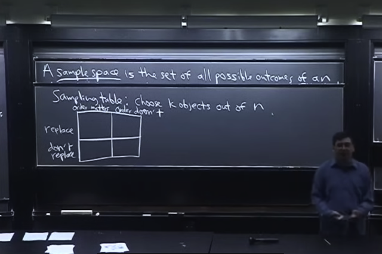</kbd>

> [!NOTE]
> Tiếp theo gs bàn về việc đếm **số cách chọn set có k item từ set có n item**nhưng với các trường hợp khác nhau: **Có quan tâm thứ tự** của k item hay không
> và việc lấy mẫu (sampling) được thực hiện theo c**ách có hoàn lại hay không**(replacement)****
> Gs nhắc lại khái niệm **sampling** **with** and **without** replacement. Cái này đã
> được học từ MLSpec ở bài Ensemble model `-` Bagging
>
> Replacement là "bốc ra từ trong population" xong thì "bỏ vô lại" tức là cho
> phép có thể bốc trúng lại lần nữa cái đó.
>
> Còn ngược lại là no replacement.
>
> Ngoài ra ta cũng chia hai trường hợp là **có quan tâm đến order** hoặc **không
> quan tâm order**

 

<kbd>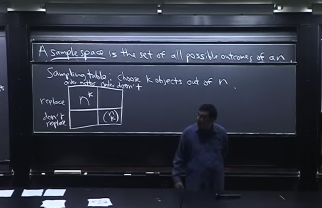</kbd>

🔗 **Related:** [LEC 2: STORY PROOFS, AXIOMS OF PROBABILITY](untitled.md#node-26)

> [!NOTE]
> **Case 2**: Sampling **KHÔNG replacement** và **KHÔNG quan tâm thứ tự**.
>
> Thế thì trong n cái lấy k cái không quan tâm thứ tự chính là định nghĩa cả **binomial
> coeff**: Trong n cái, lấy ra k cái, không quan tâm thứ tự. Và trong định nghĩa này thì
> đã lấy là lấy ra luôn, tức là no replacement. Vậy ở góc này số lượng chính là:
>
> **(n choose k)**
>
> `====`
>
> **Case 3**:****Sampling**KHÔNG replacement" `+` CÓ quan tâm order**: Case này
> không replacement nên giống case trên nhưng vì có quan tâm thứ tự nên ta sẽ nhân
> thêm số  permutation của k item k!
>
> **(n choose k)*k! `=` `n!/[(n-k)!k!]*k!` `=` `n!/(n-k)!` `=` n*(n-1)..(n-k+1)**====**Case 1**: Sampling **CÓ** replacement và **CÓ** quan tâm đến thứ tự:
>
> Có nghĩa là ĐẾM số possible outcome khi chọn k item từ n item khác nhau, trong đó
> ta có care thứ tự của các item và thực hiện sampling theo lối có replacement (hoàn
> lại)
>
> Vậy thì vì có replacement nên ví dụ lấy cái đầu tiên ra, có n possible outcome, thì bỏ
> vào lại, để khi lấy cái thứ hai, ta vẫn có thể có n possible outcome, ngược lại với 'no
> replacement' là khi sau khi lấy cái thứ nhất, t sẽ bỏ ra khỏi túi luôn, để rồi khi chọn cái
> thứ hai, nó chỉ còn có `n-1` possible outcome.
>
> Vậy để tính, cũng lập luận: lấy cái thứ nhất, có n possible outcome. lấy cái thứ hai,
> cũng có n possible outcome... Lấy cái thứ k, cũng có n possible outcome. Và vì kết
> quả của lần trước đó chả ảnh hưởng gì đến số possible outcome của lần chọn sau,
> nên theo quy tắc nhân ta có n*n..(k lần)..*n `=` n^k possible outcome.
>
> Kết quả là **n^k**Có thể hiểu trong case này, tại sao lại là có quan tâm thứ tự. Là bởi ở đây, ví dụ có
> `n=4` trái banh đỏ, xanh, vàng, tím và k `=` 3 thì trong cách sampling này ta có [xanh,
> đỏ, vàng] và  cũng có (đếm) kết quả là [xanh, vàng, đỏ]. Tức là ta coi hai kết quả là
> hai kết quả khác nhau. Còn nếu ta không care thứ tự, thì ta phải coi chúng là một.
>
> Và có thể thấy với việc có hoàn lại (sampling with replacement) thì trong các possible
> outcome sẽ có các outcome là [đỏ, đỏ, đỏ] hay [vàng, vàng, vàng]

 

<kbd>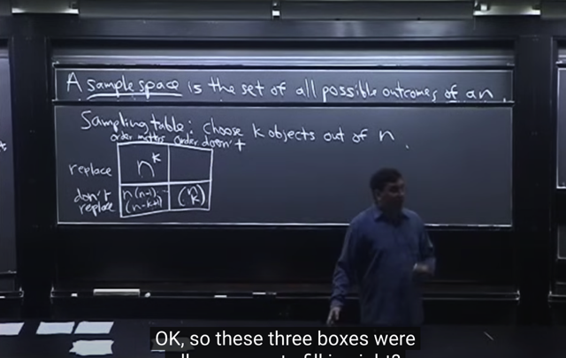</kbd>

> [!NOTE]
> Đúng, 3 ô này gs cho rằng ta có thể tính ra ngay lập tức khi
> đã biết **Multiplication Rule.**

 

<kbd>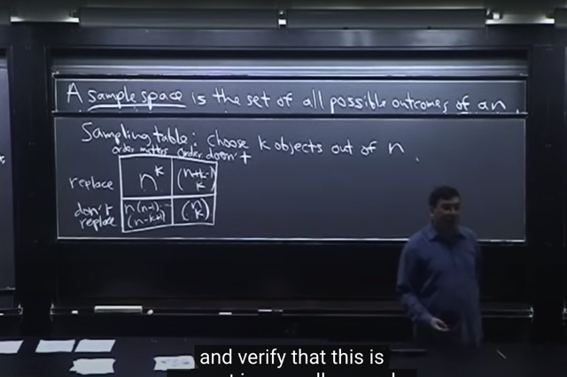</kbd>

> [!NOTE]
> Với "Replacement" `+` "Không quan tâm order"
>
> \~lần 1 có n possible outcome lần 2 vẫn có n possible outcome (vì
> replacement) ... lần k có n possible outcome.
>
> `->` Theo quy tắc nhân ta có n^k possible outcome.
>
> Và vì không quan tâm order, ta phải chia đi tổng số lần "giống nhau" ví
> dụ ABC, CBA, ..CAB thì 6 cái này giống nhau, chỉ tính 1 `->` chia cho 6.
>
> vậy ở đây tròn n^k sẽ có k! bộ giống nhau `->` kết quả là `n^k/k!`
>
> \~**Sai, gs nói thật ra để tính case này rất khó chứ không phải dễ.
> bài sau sẽ nói case này**

 

