# Lec 20: Multinomial And Cauchy

📊 **Progress:** `37` Notes | `55` Screenshots

---
<a id="node-646"></a>

<p align="center"><kbd></kbd></p>

> [!NOTE]
> Bài này ta sẽ tiếp tục một ví dụ tương tự như bữa trước, là **tính expected
> value** của **distance** giữa hai random variable **Z1, Z2 ~ N(1, 0): E|Z1-Z2|**
>
> Thế thì gs cho biết ta **có thể dùng 2D LOTUS** mà bài trước đã nói, giúp tính
> `E(g(x,y))` bằng tích phân kép **∫-inf:inf `∫-inf:inf` g(x,y) f(x,y)dxdy**
> với **f(x,y) là JOINT PDF của X, Y**
>
> Và vì ta có điều kiện **hai r.v X, Y Independent**, nên **Joint PDF f(x,y)** có thể
> được tính bởi **tích của hai marginal PDF fX(x) và fY(y)**.
>
> Nói vậy để thấy **đó là một hướng để giải** bài toán này. Tuy nhiên gs cho rằng
> có cách tốt hơn. 
>
> Đó là dựa trên một nhận định mà ta chưa chứng minh, đó là **TỔNG CỦA HAI 
> NORMAL R.V LÀ MỘT NORMAL**

> [!NOTE]
> TỔNG CỦA 2 NORMAL R.V LÀ MỘT NORMAL: 
>
> ```text
> X ~ N(μ1, σ1^2), Y ~ N(μ2, σ2^2) thì X+Y ~ N(μ1+μ2, σ1^2 + σ2^2)
> ```

<br>

<a id="node-647"></a>

<p align="center"><kbd>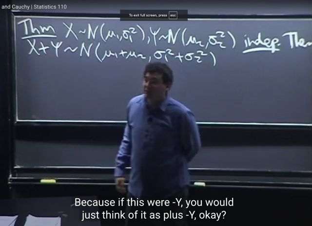</kbd></p>

> [!NOTE]
> Cụ thể theorem đó là: Cho **X, Y là hai r.v Normal distribution**:  
>
> **X ~ `N(μ1,` σ1^2)**, **Y ~ `N(μ2,` σ2^2)**
>
> Và**X, Y  independent** thì **Tổng `X+Y` cũng sẽ là r.v ~ Normal distribution**
> với mean là **tổng mean**, và variance là **tổng variance**:
>
> **X+Y ~ `N(μ1+μ2,` `σ1^2` `+` σ2^2)**
>
> Để rồi nếu là đang quan tâm difference `X-Y,` thì ta cũng sẽ coi như là tổng
> của hai r.v `X+(-Y)` với **-Y** cũng là **Normal rv với mean `-μ2,` variance
> σ2^2**

<br>

<a id="node-648"></a>

<p align="center"><kbd>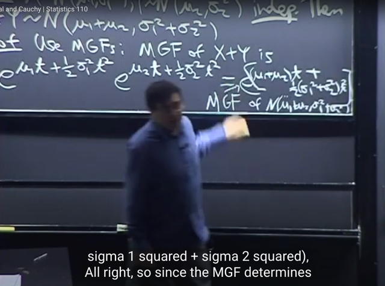</kbd></p>

🔗 **Related:** [LEC 17: MOMENT GENERATING FUNCTIONS](untitled.md#node-536)

🔗 **Related:** [LEC 17: MOMENT GENERATING FUNCTIONS](untitled.md#node-542)

> [!NOTE]
> Thế thì để **chứng minh theorem này**, trong bối cảnh ta **đã biết về một Theorem về
> MGF** của **independent** random variable X,Y đó là**MGF của (X+Y)** sẽ bằng **tích
> MGF của chúng (chú ý là ta vẫn chưa chứng minh theorem này)**:
>
> ```text
> E[e^t(X+Y)] = E(e^tX) * E(e^tY)
> ```
>
> Bữa trước ta đã chứng minh **MGF của N(0,1)** là **e^t^2/2**, thì gs cho rằng ta cũng
> sẽ **dễ dàng chứng minh MGF** của **N(μ, σ^2)** là **e^[μt `+` `(σ^2)(t^2)/2]`
>
> Ta sẽ chứng minh như sau.**Ta có MGF của Z (Z ~ N(0,1) là M(t), theo định nghĩa sẽ là `E(e^tZ)` và ta đã chứng
> minh  là đối với Z thì M(t) `=` **e^t^2/2**.
>
> Thế thì như ta đã biết nếu **X `=` `μ` `+` σZ** thì **X ~ `N(μ,` σ^2)**Vậy MGF của nó là:
>
> `E[e^tX]` `=` `E[e^(t(μ+σZ))]` `=` E[e^(tμ+tσZ)]****= `E[e^(tμ)` * `e^(tσZ)]` ****Vì `e^(tμ)` là **constant**, vì nó **không phụ thuộc Z** nên áp dụng **Linearity** EcX `=` cEX**= `e^(tμ)` * `E[e^(tσZ)]`  (i)
>
> Xét E[e^(tσZ)]** thì có thể thấy nó là**E[e^(tσ)Z] và nó chính là `M_Z(tσ),` với M_Z(t)**
> đã biết **= `E(e^tZ)` `=` e^t^2/2** `=>E[e^(tσZ)]` `=` `e^(σt)^2/2`
>
> Vậy (i) `=` `e^(tμ)` * `e^(σt)^2/2` =**e^[μt `+` (σt)^2/2]**
>
> ⇨ **MGF của X ~ `N(μ,` `σ^2):` M_X(t)** `=` **e^(μt `+` (1/2)(σ^2)*(t^2))**
>
> `======`
>
> Còn bây giờ **áp dụng Theorem** trên:
>
> ```text
> Tích của MGF của X, Y: M_(X+Y)(t) = M_X(t) * M_Y(t)
> ```
>
> ```text
> = e^[μ1t + σ1^2t^2/2] * e^[μ2t + σ2^2t^2/2]
> ```
>
> ```text
> = e^[μ1t + σ1^2t^2/2 + μ2t + σ2^2t^2/2]
> ```
>
> ```text
> = e^[μ1t + μ2t  + σ1^2t^2/2 + σ2^2t^2/2]
> ```
>
> `=` e^[(**μ1 `+` μ2**)t  `+` (**σ1^2 `+` σ2^2**)t^2/2]
>
> Và vế phải, **có dạng e^(μt+σ^2*t^2/2)** với `μ` `=` `μ1` `+` `μ2;` `σ^2` `=` `σ1^2` `+` `σ2^2`  cho ta kết
> luận rằng:
>
> **X+Y cũng là ~ Normal distribution** với mean là `μ` `=` `μ1` `+` `μ2`    và variance `σ^2` `=` `σ1^2`
> `+` `σ2^2.`
>
> Bởi vì như đã biết, MGF cũng có **công dụng tương tự PDF, CDF đó là giúp xác định
> distribution.**

<br>

<a id="node-649"></a>

<p align="center"><kbd>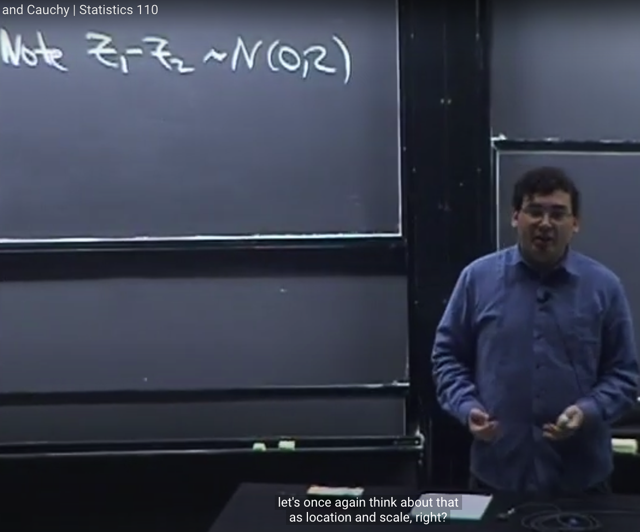</kbd></p>

🔗 **Related:** [-TÓM TẮT:   Z^(số lẻ), ta luôn có E(Z^(số lẻ) = 0, gọi là ODD MOMENT  - Symmetry còn giúp ta kết luận (nếu Z ~ N(0,1) thì -Z cũng là một N(0,1)  - X = μ + σZ sẽ ~ N(μ, σ^2)  - Sẽ tốt hơn nếu ta hiểu Standard Normal Z ~ N(0,1) trước, sau đó hiểu rằng khi scale và shift Z với σ và μ khác nhau thì ta sẽ có bất kì một Normal distribution N(μ, σ^2) nào  - PROPERTIES CỦA VAR(X):  + Var(X + c) = Var(X)  + Var(cX) = c^2*Var(X)  + Var(X) luôn không âm, và nó chỉ bằng 0 nếu X là constant  + Variance KHÔNG CÓ TÍNH LINEARITY:  + Var(X+Y) không bằng Var(X) + Var(Y) TRỪ KHI X, Y INDEPENDENT  X không i.i.d với chính nó X, mà nó EXTREMELY DEPENDENT với chính nó. Do đó bất cứ khi nào ta ÁP DỤNG CÔNG  THỨC NÀO ĐÓ MÀ CẦN CÁC RANDOM VARIABLE CÓ X1, X2 CÓ  TÍNH I.I.D VÀO X VÀ CHÍNH NÓ THÌ ĐỀU LÀ SAI  - CHỨNG MINH VAR X N(μ, σ) = σ^2  - Z = (X - μ) / σ và gs cho biết nó được gọi là STANDARDIZATION (chuẩn hóa)  Giúp từ NORMAL X ~ N(μ, σ) ta có STANDARD NORMAL Z ~ N(0,1)  - Xây dựng PDF của N(μ, σ^2) từ N(0, 1):  fX(x) = 1/(σ√2π) * [e^(-((x-μ)/σ)^2/2)]  - Nếu X ~ N(μ, σ^2) thì -X ~ N(-μ, σ^2  - Nếu X1 ~ N(μ1, σ1^2), X2 ~ N(μ2, σ2^2) và X1, X2 independent thì:  X1 + X2 ~ N(μ1 + μ2, σ1^2 + σ2^2)  X1 - X2 ~ N(μ1 - μ2, σ1^2 + σ2^2)  - 68-95-99.7 rule  - Chứng minh 0^k / k! + 1^k / k! + 2^k / k! + .... = e^k  ⇨ Tổng k=0,1...infinity λ^k/k! = e^λ  - Tìm variance của Poisson (λ) để chứng minh nó có MEAN VÀ VARIANCE ĐỀU LÀ λ  - Khi standardize, ví dụ đơn vị là km, thì (x - μ) / σ sẽ  (km - km) / km = km / km = 1 TỨC Ý NÓI LÀ KHÔNG CÒN CARE ĐƠN VỊ LÀ GÌ NỮA  - X~Bin(n,p), Var(X) = npq (q = 1-p)  - Chứng minh LOTIS](_tóm_tắt_zsố_lẻ_ta_luôn_có_ezsố_lẻ_0_gọi_là_odd_moment_symmetry_còn_giúp_ta_kết_luận_nếu_z_n01_thì_z_cũng_là_một_n01_x_μ_σz_sẽ_nμ_σ2_sẽ_tốt_hơn_nếu_ta_hiểu_standard_normal_z_n01_trước_sau_đó_hiểu_rằng_khi_scale_và_shift_z_với_σ_và_μ_khác_nhau_thì_ta_sẽ_có_bất_kì_một_normal_distribution_nμ_σ2_nào_properties_của_varx_varx_c_varx_varcx_c2varx_varx_luôn_không_âm_và_nó_chỉ_bằng_0_nếu_x_là_constant_variance_không_có_tính_linearity_varxy_không_bằng_varx_vary_trừ_khi_x_y_independent_x_không_iid_với_chính_nó_x_mà_nó_extremely_dependent_với_chính_nó_do_đó_bất_cứ_khi_nào_ta_áp_dụng_công_thức_nào_đó_mà_cần_các_random_variable_có_x1_x2_có_tính_iid_vào_x_và_chính_nó_thì_đều_là_sai_chứng_minh_var_x_nμ_σ_σ2_z_x_μ_σ_và_gs_cho_biết_nó_được_gọi_là_standardization_chuẩn_hóa_giúp_từ_normal_x_nμ_σ_ta_có_standard_normal_z_n01_xây_dựng_pdf_của_nμ_σ2_từ_n0_1_fxx_1σ2π_e_x_μσ22_nếu_x_nμ_σ2_thì_x_n_μ_σ2_nếu_x1_nμ1_σ12_x2_nμ2_σ22_và_x1_x2_independent_thì_x1_x2_nμ1_μ2_σ12_σ22_x1_x2_nμ1_μ2_σ12_σ22_68_95_997_rule_chứng_minh_0k_k_1k_k_2k_k_ek_tổng_k01infinity_λkk_eλ_tìm_variance_của_poisson_λ_để_chứng_minh_nó_có_mean_và_variance_đều_là_λ_khi_standardize_ví_dụ_đơn_vị_là_km_thì_x_μ_σ_sẽ_km_km_km_km_km_1_tức_ý_nói_là_không_còn_care_đơn_vị_là_gì_nữa_xbinnp_varx_npq_q_1_p_chứng_minh_lotis.md#node-420)

> [!NOTE]
> Thế thì quay lại bài toán này (tính **E(|Z1-Z2|**).
>
> Thì đầu tiên ta sẽ lập luận rằng**Z1 `-` Z2** `=` Z1 `+` `(-Z2)` là **tổng của 2
> Standard Normal** r.v.s: **Z1 ~ N(0,1)** và **-Z2 cũng ~ N(0,1)**
>
> (Bữa trước, theo link màu cam, đã chứng minh nếu Z ~ N(0,1) thì `-Z`
> cũng ~ N(0,1))
>
> Do đó **Z1-Z2 cũng là Normal** với **mean là tổng mean `=` 0**, và variance
> bằng **tổng variance `=` 1 `+` 1 `=` 2**

<br>

<a id="node-650"></a>

<p align="center"><kbd>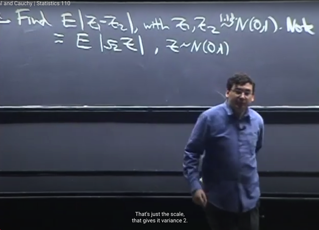</kbd></p>

> [!NOTE]
> Vậy, vì **Z1-Z2 ~ N(0, 2)** nên việc**tính E|Z1-Z2|** cũng **SẼ GIỐNG NHƯ
> TÍNH MEAN CỦA MỘT |N(0, 2)| rv**
>
> ```text
> Tức là nếu đặt U = Z1 - Z2 thì E|Z1 - Z2| = E|U|
> ```
>
> với U ~ N(0, 2)
>
> Mà ta đã biết X `=` `μ` `+` `σZ` sẽ ~ `N(μ,` `σ^2)` nên X `=` (0 `+` √2Z) `=` √2Z sẽ **~ N(0, 2)** 
>
> Nên U `=` `Z1-Z2` có cùng distribution của với X `=` √2Z
>
> ```text
> Vậy nên E|Z1-Z2| = E|U| = E|X| = E(√2Z)
> ```

<br>

<a id="node-651"></a>

<p align="center"><kbd>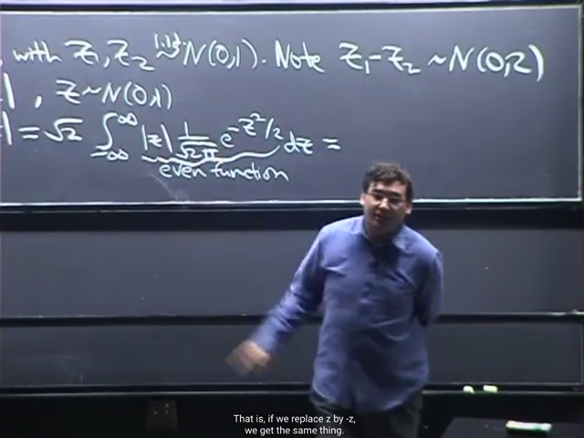</kbd></p>

<p align="center"><kbd></kbd></p>

<p align="center"><kbd>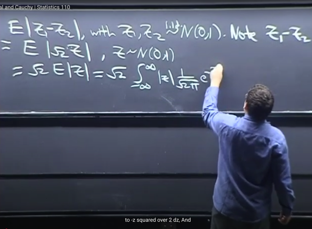</kbd></p>

> [!NOTE]
> Thế thì do **Linearity**, ta đưa √2 ra ngoài để chỉ còn **E|Z|**. Và đến đây **chỉ việc dùng LOTUS**: 
>
> Again, LOTUS cho phép tính **E(g(X))** bằng cách**dùng ngay `PDF/PMF` của X** thay vì phải tìm 
> `PDF/PMF` của g(X)
>
> ```text
> Nên ở đây E(Z) theo định nghĩa = ∫-inf:inf z f(z)dx với f(z) là pdf của N(0,1) = (1/√2π)
> ```
> `e^(-z^2/2)`
>
> Thì theo LOTUS:
>
> `E|Z|` `=` `∫-inf:inf` **|z|** f(z)dz `=` **∫-inf:inf |z| `(1/√2π)` * `e^(-z^2/2)` dz**

<br>

<a id="node-652"></a>

<p align="center"><kbd>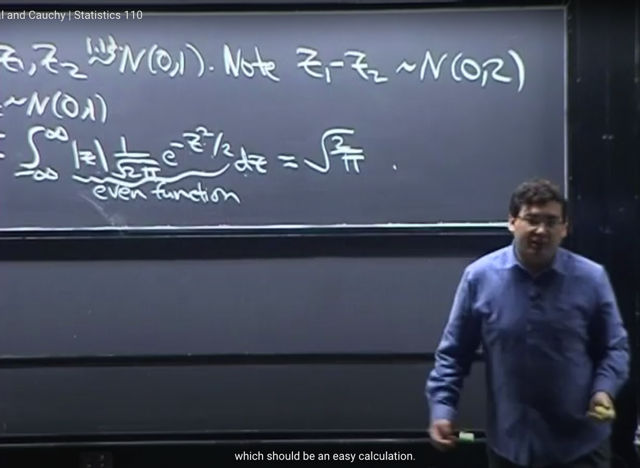</kbd></p>

> [!NOTE]
> Tiếp, để tính tích phân này, đầu tiên ta nhận xét hàm số trong tích phân là 
> hàm **chẵn `(g(-x)` `=` g(x))**, nên**tích phân từ `-inf:inf` trở thành 2* tích phân 
> từ 0:inf**, và khi đó **có thể bỏ dấu trị tuyệt đối**
>
> **2 * `∫` 0:inf  z * `(1/√2π)` * `e^(-z^2/2)` dz**
>
> `=` **2 * (1/√2π)*** `∫` 0:inf z * `e^(-z^2/2)` dz (i)
>
> Tới đây ta mới dụng một kĩ thuật trong tích phân gọi **U-SUBSTITUTION**:
> (Đã học trong MIT 18.01)
>
> ```text
> Đặt u = -z^2/2 ⇨ du = -zdz ⇔ zdz = -du
> ```
>
> ```text
> z = 0 ⇨ u = 0; z -> infinity ⇨ u -> -infinity
> ```
>
> Xét `∫` 0:inf z * `e^(-z^2/2)` dz
>
> `=` `∫` `0:-inf` e^u zdz
>
> `=` **- `∫0:-inf` e^u du** 
>
> Theo **Fundamental Theorem of Calculus Part 2**
>
> `=` `-` [nguyên hàm của e^u] | `0:-infinity` `=` `-` `[e^(-infinity)` `-` e^0] `=` `-` [0 `-` 1] `=` **1**Vậy tích phân cần tính có kết quả là 2* `(1/√2π)` * 1 `=` 2* `(1/√2π)` `=` `2/√2π)` `=` **√(2/π)**

<br>

<a id="node-653"></a>

<p align="center"><kbd>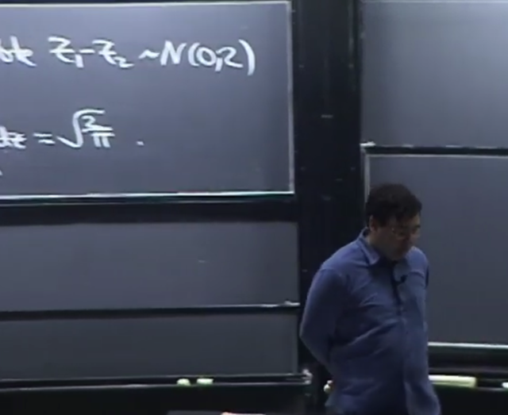</kbd></p>

> [!NOTE]
> Gs cho rằng đây là một ví dụ nữa cho thấy ta **không nhất thiết lúc nào cũng
> phải dùng 2D LOTUS** khi gặp function 2 variable

<br>

<a id="node-654"></a>

<p align="center"><kbd>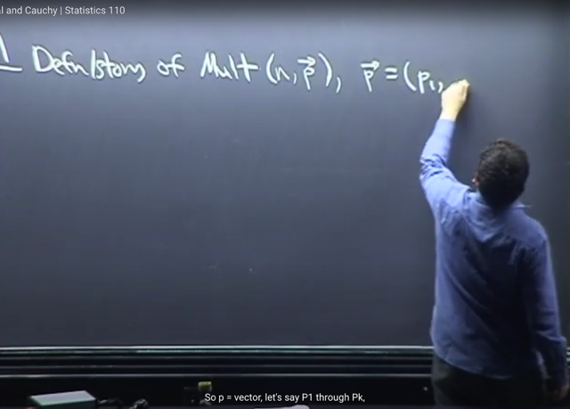</kbd></p>

<p align="center"><kbd>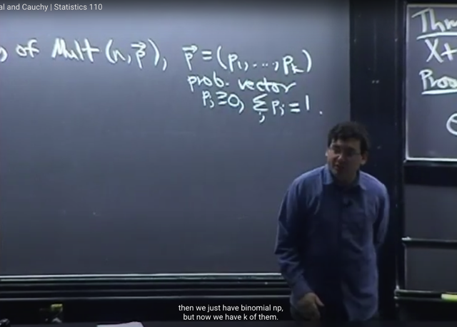</kbd></p>

<p align="center"><kbd></kbd></p>

<p align="center"><kbd></kbd></p>

<p align="center"><kbd></kbd></p>

> [!NOTE]
> Tiếp theo ta sẽ qua một trong hai **Multi-variate distribution** quan trọng là **Multinomial** (cái kia là **Multi-normal**).
>
> Thế thì Kí hiệu là **Mult(n, p)** giống như**Binomial (n, p)** có điều **p** bây giờ là **VECTOR** **các xác suất pj, j=1,2...k**
>
> Và vì vậy pj thỏa hai điều kiện: 1) **Không âm** và 2) **Tổng pj bằng 1**

> [!NOTE]
> Multinomial distribution

<br>

<a id="node-655"></a>

<p align="center"><kbd>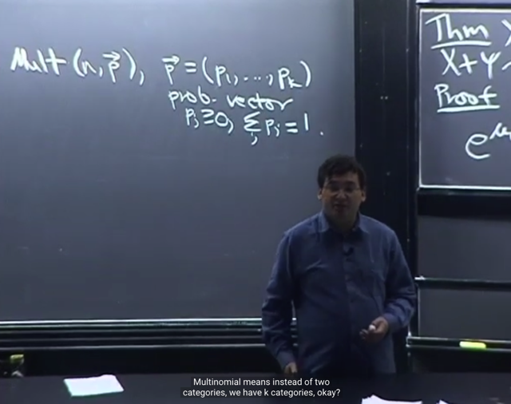</kbd></p>

> [!NOTE]
> thế thì **Mult(n,p) là sự mở rộng của Bin(n, p)**. Trong Binomial, ta nhớ bối
> cảnh là **n Bern(p) i.i.d trials** và **X là số trial success**. Thì như vậy mỗi
> trial  chỉ có 2 possible outcome là **success** hoặc **failure**, tức là 2 categories.
>
> Thì với **Mult(n, p)** các trial sẽ có **k possible values**, với **xác suất tương ứng
> là p1,...pk**

<br>

<a id="node-656"></a>

<p align="center"><kbd>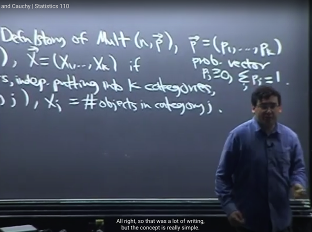</kbd></p>

<p align="center"><kbd></kbd></p>

<p align="center"><kbd>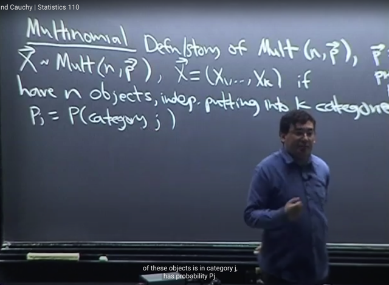</kbd></p>

> [!NOTE]
> Thế thì với **Bin(n, p)** r.v **X chỉ là một NUMBER**, mang giá trị là **số Bern(p) trial success**.
>
> Còn ở đây, khi nhìn nhận một trial **có thể cho k possible outcomes**, ta có thể **thay** chuỗi n
> **trial** bằng n **object** cần phân loại thành k loại.
>
> Thì khi đó **X1** là **số object thuộc loại 1**, **Xk là số object thuộc loại k**.
>
> Để rồi X sẽ là **VECTOR**: (X1, X2...Xk)
>
> Và như đã nói **p_j** sẽ là**xác suất trial có outcome là j**, hay xác suất object thuộc loại j

<br>

<a id="node-657"></a>

<p align="center"><kbd>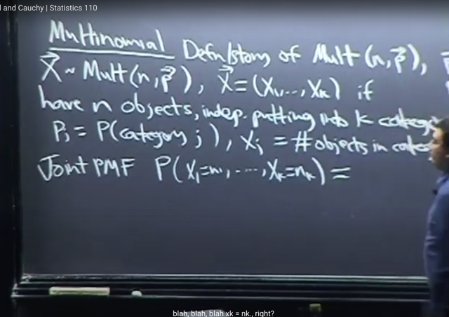</kbd></p>

> [!NOTE]
> Và từ đó ta có **JOINT DISTRIBUTION** (**JOINT PMF**):
> **P(X1=n1, `X2=n2,` ... Xk=nk)**

<br>

<a id="node-658"></a>

<p align="center"><kbd>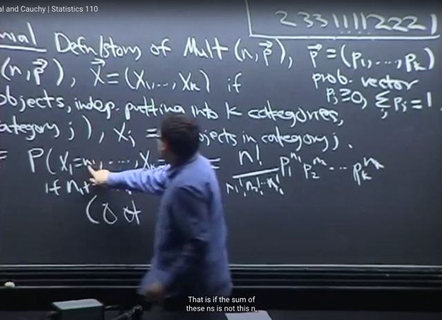</kbd></p>

> [!NOTE]
> Ta sẽ lập luận như sau, gs đề nghị ta **hình dung** **chuỗi số** **23311112221** là **kết quả của n
> trials `/` objects với n `=` 11**
>
> Thì đây là **n independent events**, theo **định nghĩa của independent events:**
>
> **P của chuỗi kết quả cụ thể** như trên `=` P(intersection của các events) `=` **tích của P mỗi events:**Nói rõ hơn: Chuỗi kết qủa cụ thể của 11 trial (chú ý bây giờ không còn là Bern (p) trial đâu nhé
> vì mỗi trial có tới k possible outcomes) 23311112221 sẽ là intersection của
>
> (1st trial ra 2, x,x,x....x) ∩ (x, 2nd trial ra 3, x,...x) ∩ (x, x, 3rd trial ra 3) ∩ ...
>
> Trong đó (1st trial ra 2, x, x, x....x) là event: {s ∈ S: "1st trial `=` 2"} thể hiện set mọi possible
> outcome khi thực hiện 11 trials sao cho lần thứ nhất đều ra 2. Đây là ta đang cố diễn đạt event
> này trong original sample space.
>
> Dĩ nhiên (1st trial ra 2, x, x, x....x) có thể thể hiện bởi event (1st trial ra 2) vốn dĩ là một event
> trong sample space chỉ có k possible outcome. Nhưng hai event này matching `1-1` với nhau, vì
> khi lần thứ nhất ra 2 thì đồng nghĩa event (1st trial ra 2, x, x, x....x) xảy ra và ngược lại.
>
> Do đó ta được phép tính P(1st trial ra 2, x, x, x....x) `=` P(1st trial ra 2) và nó bằng p2 (trial có k
> possible outcome với xác suất là p1, p2...pk)
>
> Tương tự (x, 2nd trial ra 3, x,...x) `=` p3 ****Rồi, P("23311112221") `=` P[(1st trial ra 2, x,....x) ∩ (x,
> 2nd trial ra 3, x,...x) ∩ (x, x, 3rd trial ra 3) ∩ ...]
>
> `=` P(1st trial ra 2, x,....x) * P(x, 2nd trial ra 3, x,...x) * P(x, x, 3rd trial ra 3) ∩ .. | Do các event đều
> độc lập do đề nói các trial là độc lập.
>
> `=` P(1st trial ra 2)*P(2nd trial ra 3)*.....*P(n'st trial ra 1) `=` p2*p3*...p1
>
> Thế rồi, **trong n events đó**, có:
>
> **n1 `(=5)` events**outcome****là**loại 1** với xác suất xảy ra là**p1**.
>
> **n2 `(=4)` events** outcome là l**oại 2** với xác suất xảy ra là **p2**....
>
> Vậy tích n của P các events `=` [**p1*p1..(n1=5 lần)**] * [**p2*p2*..(n2=4 lần)**] ...
>
> `=` **p1^n1 * p2^n2 *...pk^nk**
>
> Event `(X1=n1(=5),` `X2=n2(=3),..Xk=nk)` **không chỉ có một chuỗi cụ thể** như trên mà có thể có
> **chuỗi khác** với cùng các con số nhưng s**ắp xếp thứ tự khác nhưng đều có `n1=5` lần ra loại 1**(tức là trong chuỗi có 5 số 1), và đều có `n2=3` lần ra loại 2 (tức là có 4 con số 2)..
>
> ```text
> Ví dụ 12121211332 là một outcome như vậy cũng thuộc event (X1=n1(=5), X2=n2(=3),..Xk=nk)
> ```
>
> Do đó event `(X1=n1,...Xk=nk)` là**Union** của các **Disjoint event**, mà mỗi event là một cách
> sắp xếp khác nhau của các kết quả.
>
> Vậy ta cần ĐẾM **SỐ CÁCH SẮP XẾP** này, hay, số disjoint event nói trên
>
> Thế thì đầu tiên là ta sẽ **nhân cho số hoán vị** khi coi mọi object là khác nhau: n!
>
> Nhưng vì có n1 object 1, n2 object 2...và ta **không quan tâm thứ tự của các object cùng loại**,
> nên ta sẽ adjust bằng cách **chia bớt cho n1!, n2!...**
>
> Như vậy event `(X1=n1,` `..Xk=nk)` là Union của **n!/ (n1!n2!...)** Disjoint events
>
> Theo **axiom 2**:
>
> **P(X1=n1, `..Xk=nk)` `=` Tổng của `n!/` (n1!n2!...) xác suất của mỗi event,**
>
> mà chúng **đều có giá trị là p1^n1 * p2^n2 *... pk^nk** (vì như đã nói chúng chỉ khác cách  sắp
> xếp của các kết quả
>
> Do đó kết qủa là **P(X1=n1, ..Xk=nk)**=  [**p1^n1 * p2^n2 *...pk^nk] `*n!/` (n1!n2!...)**Với điều kiện là **n1+n2..nk `=` N**, nếu không thì `P(X1=n1,` `..Xk=nk)` `=` 0 vì không thể có khả
> năng nào mà `n1+n2..nk` khác****N

> [!NOTE]
> ```text
> MULT(N, p) JOINT PMF: P(X1=n1, ..Xk=nk) =  [p1^n1 * p2^n2 *...pk^nk] *n!/ (n1!n2!...)
> ```
> ```text
> (n1+n2+...= N). p = (p1, p2, ...pn)
> ```

<br>

<a id="node-659"></a>

<p align="center"><kbd>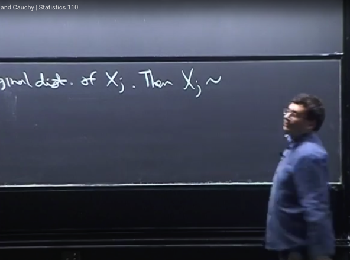</kbd></p>

<p align="center"><kbd></kbd></p>

<p align="center"><kbd>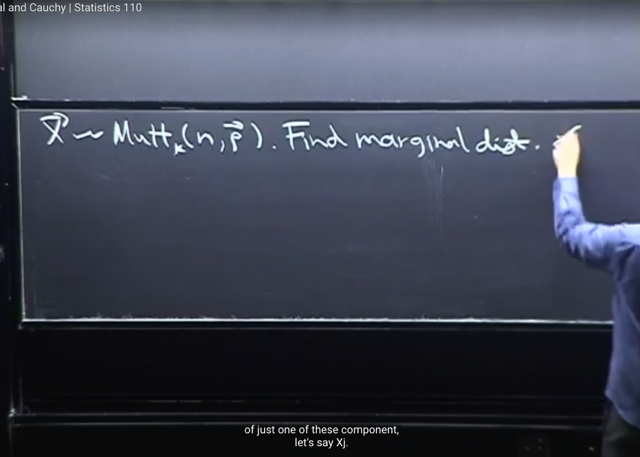</kbd></p>

> [!NOTE]
> Tiếp sau khi có công thức **Joint PMF**. Ta sẽ thử tìm **Marginal PMF**
>
> Thế thì nếu **X ~ Mult k (n, p), (k là chỉ có k class),** **Marginal distribution of Xj sẽ là gì** gs yêu cầu thử suy nghĩ
>
> Thử trả lời: **Xj**, như định nghĩa, là số trial có kết quả, hay **object thuộc loại j trong n trials `/` objects**.
>
> Do đó, khi xét distribution của Xj, tức là ta đang chỉ quan tâm đến câu hỏi trong n trials, tổng số trials có kết quả là
> loại j  là bao nhiêu
>
> Vậy điều này tương đương, trong n trials, ta chỉ quan tâm mỗi trial outcome **có phải là loại j hay không**.
>
> Từ đó có thể xem như ta có n trial mà mỗi trial có hai possible value là success với **xác suất success** là **p_j**
> và failure với xác suất là 1 `-` `p_j.` Có nghĩa là các trial **Bern(p_j)**. Vậy **Xj ~ Binomial (n, p_j)**

> [!NOTE]
> MARGINAL DISTRIBUTION Xj SẼ LÀ BIN(N, `p_j)`

<br>

<a id="node-660"></a>

<p align="center"><kbd>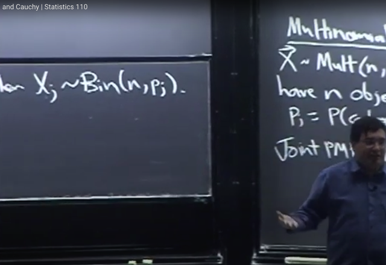</kbd></p>

> [!NOTE]
> Gs: Correct. Lập luận đó cũng là story proof

<br>

<a id="node-661"></a>

<p align="center"><kbd>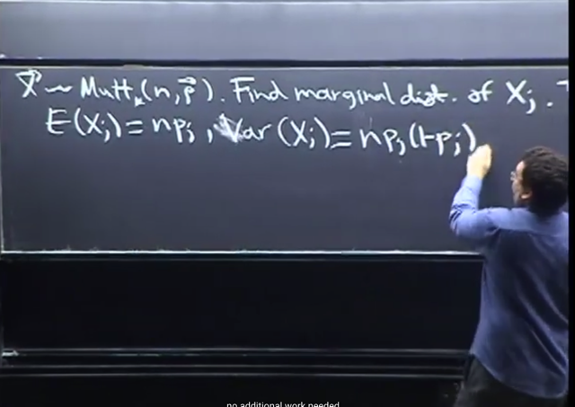</kbd></p>

> [!NOTE]
> Và từ đó ta cũng **có ngay E(Xj)** là **n*p_j** và **Var(Xj)**= **n*p_j*(1-p_j)** mà ta
> đã chứng minh ở Bin(n, p)

<br>

<a id="node-662"></a>

<p align="center"><kbd>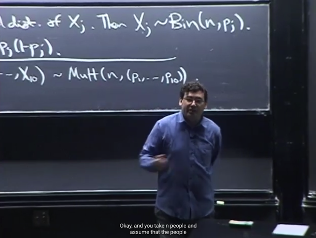</kbd></p>

<br>

<a id="node-663"></a>

<p align="center"><kbd>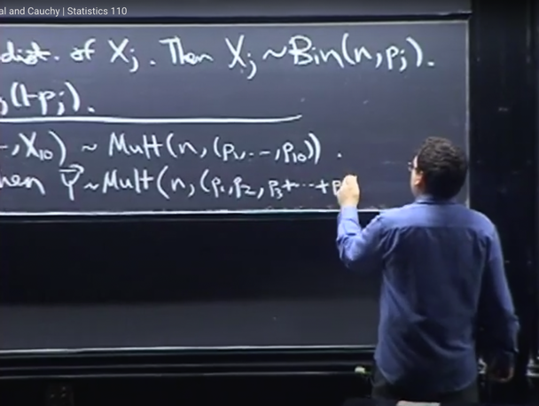</kbd></p>

<p align="center"><kbd></kbd></p>

<p align="center"><kbd>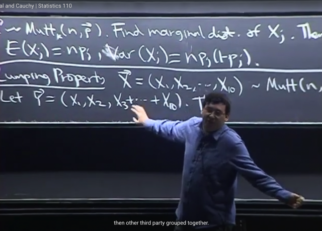</kbd></p>

> [!NOTE]
> Tiếp theo gs nói về một **Property** khác của **Multinomial**, gs lấy ví dụ **một đất nước** có **10 đảng phái**và ta có **n người dân**, mỗi
> người **THUỘC DUY NHẤT VÀ ĐỀU THUỘC MỘT ĐẢNG**
>
> Khi đó ta có **X `=` (X1, X2...X10)** ~ **Mult (n, (p1,p2...p10))**. Thế thì bây giờ câu chuyện đặt ra là **giả sử có 2 đảng lớn**
> là **1, 2**. Và ta muốn**gom các đảng còn lại làm một đảng thứ 3**. Tức **Y `=` (X1, X2, X3+X4+...X10)**
>
> Thì câu hỏi là **Y sẽ có distribution như thế nào**.
>
> Thì đơn giản là: Ta vẫn c**ùng một câu chuyện**, chỉ khác là bây giờ **có 3 loại**. Và **xác suất một object thuộc loại 3
> sẽ là tổng xác suất p3+p4...p10**. Còn hai loại kia thì vẫn vậy.
>
> Nên Y `=` [X1, X2, `X3+X4..X10]` ~ **Mult(n, [p1, p2, p3+p4+...p10])**
>
> Gs nói thêm điều kiện phải là mỗi object chỉ thuộc về một category duy nhất

> [!NOTE]
> ```text
> X = (X1, X2...X10) ~ Mult (n, (p1,p2...p10)) thì Y = (X1, X2, X3+X4+...X10) sẽ
> ```
> có distribution ra sao

<br>

<a id="node-664"></a>

<p align="center"><kbd>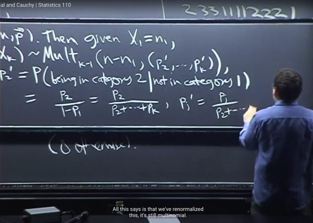</kbd></p>

<p align="center"><kbd></kbd></p>

<p align="center"><kbd>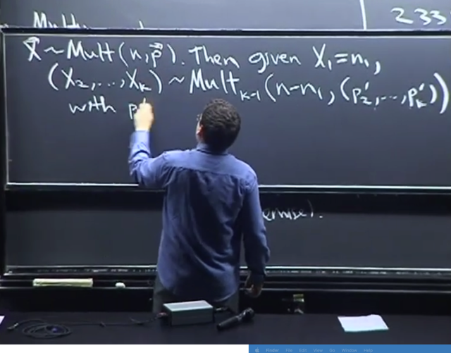</kbd></p>

> [!NOTE]
> Tiếp theo là một ví dụ nữa về **property** của **Multinomial distribution.**
>
> Đó là cho **X ~ `Mult_k` (n, p)** Đương nhiên với multinomial ta **tự hiểu X là vector** có **k
> component** **[X1, X2...Xk]** và **p** cũng là vector **[p1, p2...pk]** mang giá trị ví dụ **p_j** là **xác
> suất của việc object `/` trial thuộc loại j tương ứng**. Để **Xj sẽ là số `object/trial` thuộc loại j trong n
> objects**
>
> Bài toán đặt ra là, **biết X1=n1**. Ta cần**tìm distribution của (X2, ...Xk)**.
>
> Thế thì gs cho rằng ta sẽ thấy là vì**bản chất bài toán không thay đổi**, nên  **(X2,...Xk) vẫn là r. v
> (vector) ~ Multinomial**, có điều, **tham số của nó sẽ khác**.
>
> Đó là nó sẽ là **n-n1 thay vì n**, điều này dễ hiểu, vì "coi như" **chỉ còn `n-n1` trials `/` objects** Và
> **xác suất cũng thay đổi**, vì sẽ là **SAI** nếu ta để **p `=` [p2, ...pk]** vì tổng của chúng **KHÔNG
> CÒN BẰNG 1**. Do đó ta **phải tính lại**, gọi là [**p'2, p'3...p'k**]
>
> Thế thì, ví dụ xét **p'2**, ta sẽ lập luận như sau:
>
> **p'2** sẽ là **xác suất một object không phải loại 1**, **thuộc loại 2**. Hay nói cách khác, là **xác
> suất một object là loại 2** nếu, **dựa trên** việc **nó không phải là loại 1**.
>
> **p'2 `=` P(thuộc loại 2 | không phải loại 1)**
>
> Thì theo **định nghĩa** **conditional probability**, ta sẽ có
>
> **P(thuộc loại 2 | không phải loại 1)** =**P(thuộc loại 2, không thuộc loại 1) `/` P(không thuộc loại 1)**
>
> i) **P(thuộc loại 2, không thuộc loại 1)** thì là **intersection** của**hai sự kiện** nhưng **[thuộc loại
> 2**] thì **đồng** **nghĩa** [**không thuộc loại 1**] rồi 
>
> (tức là một possible outcome mà thuộc event `/subset` [loại 2] cũng đương nhiên thuộc 
> `event/subset` [không phải loại 1]), nên **intersection** của hai sự kiện này `=` **event "thuộc loại 2"**
>
> Hay: (thuộc loại 2) ⊂ (không thuộc loại 1) 
>
> ⇨ **(thuộc loại 2, không thuộc loại 1) `=` (thuộc loại 2)**
>
> để từ đó **P(thuộc loại 2, không thuộc loại 1) `=` P(thuộc loại 2)**
>
> ii) **P(không thuộc loại 1)** `=` **1-p1** `=` **p2 `+` p3 `+` ...pk**
>
> Do đó **p'2 `=` p2 `/` (p2 `+` p3 `+` ...pk)** và tương tự p'3, p'4 cũng vậy vì các loại khác có vai trò như nhau
> (symmetry)
>
> Vậy (X2, X2..Xk) sẽ ~ **Mult `k-1` `(n-n1,` `p=(p'2,` p'3, ...p'k))**
>
> Và đó chính là **RENORMALIZING.**Gs nói thêm qua ví dụ trên ta thấy chỉ cần dựa vào lập luận
> để suy ra distribution mà không cần tính toán

<br>

<a id="node-665"></a>

<p align="center"><kbd>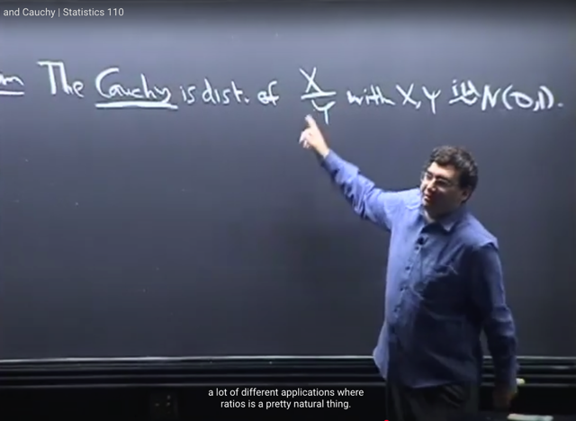</kbd></p>

<p align="center"><kbd></kbd></p>

<p align="center"><kbd></kbd></p>

> [!NOTE]
> Bài toán tiếp theo, ta sẽ biết về **Cauchy** **distribution**.
>
> Cho **X, Y ~ N(0,1)**, **i.i.d** thì distribution của **T `=` X/Y** gọi là **Cauchy** distribution ta sẽ **đi tìm PDF** của nó
>
> Đầu tiên gs nói cái Cauchy distribution này nó **không có mean**, khi ta **tính `E(T)` thì nó sẽ blow up**, không tính
> đươc. Và do `Var(T)` `=` `E[(T` `-` ET)^2] hay ET^2 `-` (ET)^2, nên không có mean thì **cũng không có variance.**

> [!NOTE]
> CAUCHY DISTRIBUTION

<br>

<a id="node-666"></a>

<p align="center"><kbd>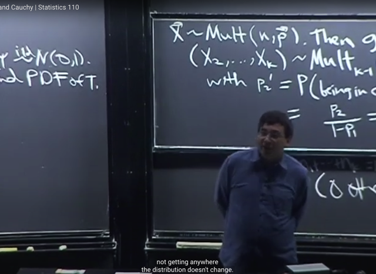</kbd></p>

> [!NOTE]
> gs nói tính chất **không có mean, không variance** cũng chưa phải là điểm
> khiến Cauchy được gọi là **EVIL** DISTRIBUTION (vì **cũng có những cái
> khác** có tính chất này).
>
> Mà sự thật là khi ta học qua **Định luật số lớn (Law of Large Number)** thì ta
> sẽ biết rằng, nếu**tính trung bình của một số lượng lớn các i.i.d r.v** thì  nó
> sẽ **dần dần gần với mean**. (tất nhiên qua bài đó mới hiểu)
>
> Nhưng ở đây gs nói **Cauchy nó không tuân theo định luật** này. Mà ví von
> như khi ta **thu thập thêm càng nhiều dữ liệu** thì **thường** nó sẽ **cho ta
> có thể kết luận** về thông tin gì đó.
>
> Nhưng **với Cauchy thì không**, dù có average nhiều Cauchy r.v thì nó vẫn là
> Cauchy (Chưa hiểu lắm nhưng gs chỉ nói sơ)

<br>

<a id="node-667"></a>

<p align="center"><kbd>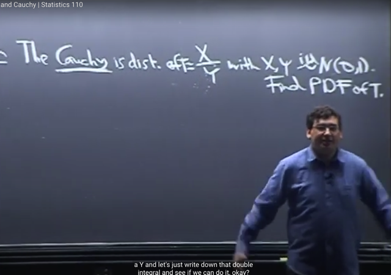</kbd></p>

🔗 **Related:** [LEC 20: MULTINOMIAL AND CAUCHY](untitled.md#node-677)

> [!NOTE]
> Thế thì để **tìm PDF**, gs cho rằng ta**hoàn toàn có thể dùng LOTP `-`
> Law Of Total Probability** và **conditioned on Y**, để tính.
>
> Nhưng ông sẽ **dùng cách tiếp cận khác**, tính **CDF**, và như đã
> biết khi có CDF, lấy **derivative** sẽ cho ta **PDF**

<br>

<a id="node-668"></a>

<p align="center"><kbd>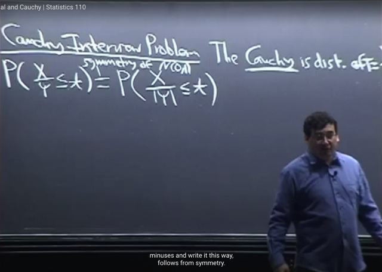</kbd></p>

> [!NOTE]
> Đầu tiên gs dựa trên **tính chất Symmetry của N(0,1)** mà ta đã chứng minh
> rằng với **Z~N(0,1)** thì **(-Z) cũng ~ N(0,1)**, gs lập luận rằng vì vai trò của X,
> Y như nhau (symmetry) và tính symmetry của N(0,1) nên
>
> **KHÚC NÀY CHƯA HIỂU**
>
> `P(X/Y` ≤ t) `=` `P(X/|Y|` ≤ t)

<br>

<a id="node-669"></a>

<p align="center"><kbd>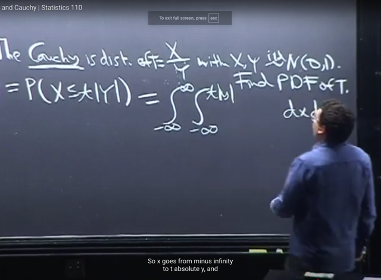</kbd></p>

<p align="center"><kbd></kbd></p>

<p align="center"><kbd>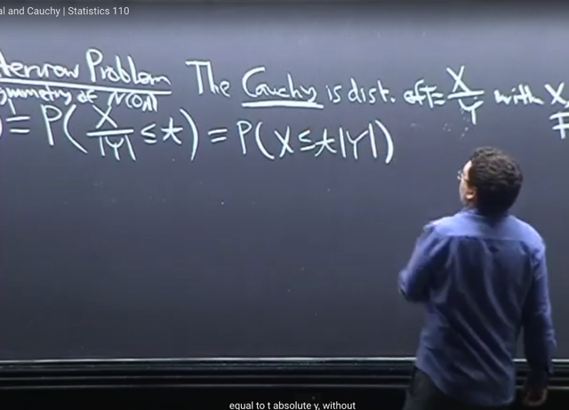</kbd></p>

🔗 **Related:** [LEC 19: JOINT, CONDITIONAL AND MARGINAL DISTRIBUTION](untitled.md#node-608)

> [!NOTE]
> Từ đó cho phép ta đưa **X/|Y| ≤ t** ⇔**X ≤ t|Y|**(again, hiểu đây cùng là một event)
>
> Và ta sẽ tính **P(X ≤ t|Y|)**
>
> Thế thì ta cần nhớ rằng, **PDF** của Joint Distribution định nghĩa rằng:
>
> **P((X, Y) thuộc vùng A) `=` tích phân kép trên A f(x,y)dxdy**
>
> Và `X/Y` ≤ t mà ta đã chứng minh nó tương đương X ≤ t|Y| chính là xác định một vùng A như vậy:
> Hay nói cách khác P(X ≤ t|Y|) là P(X,Y thuộc vùng A sao cho X ≤ t|Y|)
>
> Nên **P(X ≤ t|Y|)** có thể được tính `=` **∫∫A f_X,Y(x,y)dxdy**
>
> Thế thì như gs đã nói nhiều lần, cái chính, **cái khó là xác định limit của tích phân kép** này. Như
> ví dụ trước gs cũng đã dạy rằng tích phân dxdy hay dydx gì cũng được nhưng nếu dxdy, (tức "làm"
> với x trước, thì cái tích phân ở ngoài là "của" y, và limit của tích phân ở ngoài luôn phải là number,
> còn cái tích phân ở trong là "của" x, làm trước, thì limit có thể phụ thuộc y.
>
> Do đó, ta xác định limit của tích phân ở ngoài là **-inf:inf** và limit của tích phân của x là **-inf : t|y|**
> vì đang xét vùng A là vùng mà X ≤ t|Y|

<br>

<a id="node-670"></a>

<p align="center"><kbd>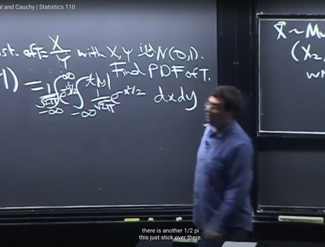</kbd></p>

> [!NOTE]
> Tiếp theo f(x,y) như đã biết, là JOINT PDF của X,Y. Mà vì **đã nói X,Y i.i.d**
> tức là Independent. Do đó, dựa vào định nghĩa của Independent r.v.s về
> **JOINT** và **MARGINAL** **distribution** cho ta biết **JOINT PDF `f_X,Y(x,` y)** bằng 
> **TÍCH** của **MARGINAL PDF**f_X(x) và `f_Y(y)`
>
> ```text
> f_XY(x, y) = f_X(x)*f_Y(y)
> ```
>
> Chú ý ghi `f_X(x)` là ý chỉ marginal PDF của X, cũng chính là PDF của X.
> (marginal PDF  của X chỉ là ám chỉ việc tính PDF của X bằng cách
> marginalizing Joint PDF mà thôi)
>
> Mà với **Z ~ N(0,1)** ta biết PDF của nó **f(z) `=` `(1/√2π)` * e^(-z^2/2)**
>
> Nên Marginal PDF của X, Y tức là PDF của X, Y ~ N(0,1) ta có công thức là:
>
> `f_X(x)` `=` **(1/√2π) * e^(-x^2/2)**  và `f_Y(x)` `=` **(1/√2π) * e^(-y^2/2)**
>
> Đưa vào tích phân sẽ là:
>
> **∫-inf:inf `∫-inf:t|y|` `(1/√2π)` * `e^(-x^2/2)` * `(1/√2π)` * `e^(-y^2/2)` dxdy**
>
> Thì khi tính tích phân của x, ta coi y như constant, nên những gì không dính
> đến x,  và những term liên quan đến y có thể đưa ra ngoài tích phân
>
> **(1/√2π) `∫-inf:inf`  `e^(-y^2/2)` `∫` `-inf:t|y|`  `(1/√2π)` * `e^(-x^2/2)` * dxdy**

<br>

<a id="node-671"></a>

<p align="center"><kbd>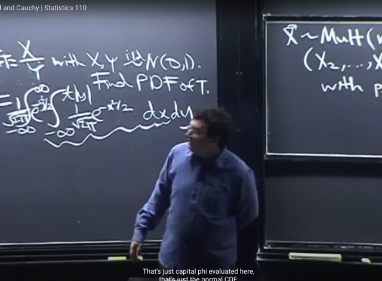</kbd></p>

🔗 **Related:** [TÓM TẮT:  - TÍNH UNIVERSALITY CỦA UNIFORM PART 2:  Nếu X ~ F thì F(X) ~ U(0,1)  -  Cách hiểu đúng về F(X) với F(x) = 1 - e^-x phải là bỏ X vào x ở đây để có F(X) = 1 - e^-X  - Áp dụng vào có thể dùng F(X) để xem thử nó có tuân theo Uniform hay không, nếu không thì có thể có gì đó không đúng  - Áp dụng khác là giúp ta simulating các observed data ~ F, bằng cách sampling từ U(0,1) và bỏ vào function Finv  - Tính chất symmetry của Uniform. Đó là, nếu U ~ Uniform (0,1) thì 1-U cũng ~ Uniform (0,1)  - ĐỊNH NGHĨA CỦA INDEPENDENT R.VS DỰA TRÊN CDF  P(X1 ≤ x1, X2 ≤ x2, ... Xn ≤ xn) = P(X1 ≤ x1)*P(X2 ≤ x2)*..... P(Xn ≤ xn) thì Xj  sẽ independent VỚI MỌI x1, x2,...xn  - Với discrete random variable thì cũng tương tự, nhưng ta sẽ làm với PMF:  Các X1, X2...Xn sẽ gọi là independent nếu:  JOINT PMF P(X1=x1, X2=x2...Xn=xn) = P(X1=x1)*P(X2=x2)*...P(Xn=xn) (tích các PMF)  - Ví dụ để cho thấy tại sao pair-wise independent không đủ để kết luận independent.   Cho X1, X2 là ~ Bern(0.5) và i.i.d và X3 = X1+X2. Xét từng cặp thì biết thằng này không giúp biết thằng kia ⇨ pair-wise independent nhưng xét bộ 3 thì biết X1, X2 biết ngay X3 ⇨ Nếu chỉ dựa vào pair-wise indepedent thì không đủ kết luật cả đám independent  - Standard Normal distribution:  Thường dùng chữ Z để kí hiệu cho Normal distribution r.v  Gs cho rằng ta chỉ cần biết là f(z) có công thức này c*e^(-z^2/2),  - Chứng minh NORMALIZING CONSTANT là c = 1/√2π  - pdf: (1/√2π) e^-z^2/2  - CHỨNG MINH X ~ N(0,1) EX = 0 DỰA VÀO SYMMETRY  - CHỨNG MINH X ~ N(0,1) VarX = 1  - Φ(z) = tích phân từ -infinity tới x của [e^(-t^2/2)dt]](tóm_tắt_tính_universality_của_uniform_part_2_nếu_x_f_thì_fx_u01_cách_hiểu_đúng_về_fx_với_fx_1_e_x_phải_là_bỏ_x_vào_x_ở_đây_để_có_fx_1_e_x_áp_dụng_vào_có_thể_dùng_fx_để_xem_thử_nó_có_tuân_theo_uniform_hay_không_nếu_không_thì_có_thể_có_gì_đó_không_đúng_áp_dụng_khác_là_giúp_ta_simulating_các_observed_data_f_bằng_cách_sampling_từ_u01_và_bỏ_vào_function_finv_tính_chất_symmetry_của_uniform_đó_là_nếu_u_uniform_01_thì_1_u_cũng_uniform_01_định_nghĩa_của_independent_rvs_dựa_trên_cdf_px1_x1_x2_x2_xn_xn_px1_x1px2_x2_pxn_xn_thì_xj_sẽ_independent_với_mọi_x1_x2xn_với_discrete_random_variable_thì_cũng_tương_tự_nhưng_ta_sẽ_làm_với_pmf_các_x1_x2xn_sẽ_gọi_là_independent_nếu_joint_pmf_px1x1_x2x2xnxn_px1x1px2x2pxnxn_tích_các_pmf_ví_dụ_để_cho_thấy_tại_sao_pair_wise_independent_không_đủ_để_kết_luận_independent_cho_x1_x2_là_bern05_và_iid_và_x3_x1x2_xét_từng_cặp_thì_biết_thằng_này_không_giúp_biết_thằng_kia_pair_wise_independent_nhưng_xét_bộ_3_thì_biết_x1_x2_biết_ngay_x3_nếu_chỉ_dựa_vào_pair_wise_indepedent_thì_không_đủ_kết_luật_cả_đám_independent_standard_normal_distribution_thường_dùng_chữ_z_để_kí_hiệu_cho_normal_distribution_rv_gs_cho_rằng_ta_chỉ_cần_biết_là_fz_có_công_thức_này_ce_z22_chứng_minh_normalizing_constant_là_c_12π_pdf_12π_e_z22_chứng_minh_x_n01_ex_0_dựa_vào_symmetry_chứng_minh_x_n01_varx_1_φz_tích_phân_từ_infinity_tới_x_của_e_t22dt.md#node-414)

🔗 **Related:** [LEC 20: MULTINOMIAL AND CAUCHY](untitled.md#node-678)

> [!NOTE]
> Thế thì, xét cái inner integral đối với x:
>
> ```text
> ∫ -inf:t|y|  (1/√2π) * e^(-x^2/2) * dx
> ```
>
> gs nhắc lại rằng, ta đã từng nói là **không thể tính được tích phân** này ở dạng
> **closed form** (search "không thể  tính" )
>
> Nhưng sau đó ta đã biết **có thể tính được bằng cách khác** khá rắc rối. Hơn
> nữa, ta cũng đã biết đây chính là **Φ(t|y|)** `-` ý nghĩa là hàm Φ là **CDF** của
> **Standard Normal N(0,1)**, evaluated tại t|y| (theo link màu cam)

<br>

<a id="node-672"></a>

<p align="center"><kbd>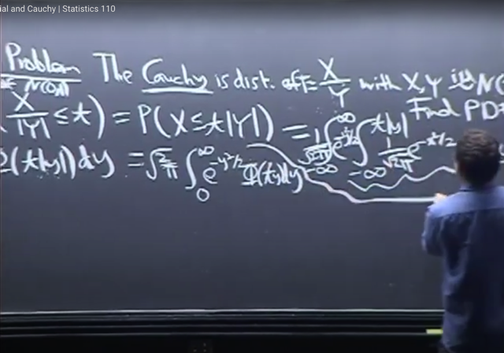</kbd></p>

<p align="center"><kbd></kbd></p>

<p align="center"><kbd>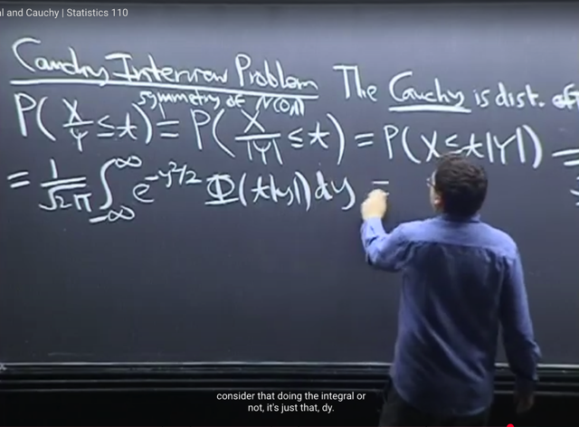</kbd></p>

> [!NOTE]
> Thế thì, thay cái tích phân của x bằng **Φ(t|y|)**. 
>
> `(1/√2π)` `∫-inf:inf`  `e^(-y^2/2)` **[**∫ **-inf:t|y|  `(1/√2π)` * `e^(-x^2/2)` * dx ]**dy 
>
> `=` `(1/√2π)` `∫-inf:inf`  `e^(-y^2/2)` **Φ(t|y|)** dy (1)
>
> Ta sẽ nhận định tiếp rằng function trong dấu tích phân y tức:
>
> **e^(-y^2/2) Φ(t|y|)**,
>
> Bây giờ là **hàm chẵn** (vì nó có dạng g(y^2, |y|) nên `g(-a)` `=` g(a) thành ra ta sẽ **thay tích phân -inf:inf**
> bằng **2 * tích phân từ 0:inf** và **bỏ dấu trị tuyệt đối của y**
>
> Để rồi ở ngoài là 2 nhân với `1/√(2π)` `=` **√(2/π)
>
> (1) `=` `(2/√2π)` `∫0:inf`  `e^(-y^2/2)` Φ(ty) dy**

<br>

<a id="node-673"></a>

<p align="center"><kbd>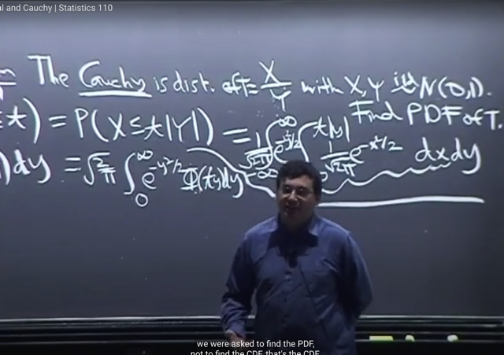</kbd></p>

🔗 **Related:** [TÓM TẮT:  Khác biệt đầu tiên giữa discrete và continuous là. sự xuất hiện của PDF thay vì PMF  Với continuous P(X=x) = 0  Do PMF P(X=x) USELESS, nên ta cần PDF  Qua continuous case, PDF. Ta không có xác suất mà là MẬT ĐỘ XÁC SUẤT. PROBABILITY PER SOMETHING.  PDF của X nếu P(a≤X≤b) = ∫a:b f(x)dx  Nếu a = b, thì theo định nghĩa trên, P(X=a) sẽ là integrate từ a đến a f(x)dx có ý nghĩa là DIỆN TÍCH BÊN DƯỚI ĐƯỜNG F(X) TỪ a TỚI a, ĐƯƠNG NHIÊN LÀ BẰNG 0 (hoặc tính cái tích phân này cũng sẽ phải ra 0)  2 điều kiện để PMF valid: f(x) luôn không âm và ∫ từ -infinity đến + infinity f(x)dx  phải bằng 1  f(x0) HOÀN TOÀN CÓ THỂ LỚN HƠN 1  ...Chưa tóm tắt xong](tóm_tắt_khác_biệt_đầu_tiên_giữa_discrete_và_continuous_là_sự_xuất_hiện_của_pdf_thay_vì_pmf_với_continuous_pxx_0_do_pmf_pxx_useless_nên_ta_cần_pdf_qua_continuous_case_pdf_ta_không_có_xác_suất_mà_là_mật_độ_xác_suất_probability_per_something_pdf_của_x_nếu_paxb_ab_fxdx_nếu_a_b_thì_theo_định_nghĩa_trên_pxa_sẽ_là_integrate_từ_a_đến_a_fxdx_có_ý_nghĩa_là_diện_tích_bên_dưới_đường_fx_từ_a_tới_a_đương_nhiên_là_bằng_0_hoặc_tính_cái_tích_phân_này_cũng_sẽ_phải_ra_0_2_điều_kiện_để_pmf_valid_fx_luôn_không_âm_và_từ_infinity_đến_infinity_fxdx_phải_bằng_1_fx0_hoàn_toàn_có_thể_lớn_hơn_1_chưa_tóm_tắt_xong.md#node-353)

> [!NOTE]
> Tiếp theo đại khái là, ta bị kẹt ở chỗ không biết tính tiếp theo như thế nào.
>
> Nhưng có một sự thật là **ta thực ra đang tìm PDF của Cauchy r.v V `=` X/Y,**
> chẳng qua là đang dùng cách tiếp cận là**tìm CDF của U trước**, rồi**take
> derivative  để có PDF**.
>
> Do đó gs cho rằng ta sẽ đi **lấy derivative của cái tích phân mà ta chưa làm
> xong này.**====****Ôn lại kiến thức Calculus, bài trước theo link ta đã biết **FTC** đã cho biết:
>
> ```text
> Nếu F(x = ∫-a:x f(t)dt thì d/dx F(x) = f(x).
> ```
>
> Vậy thì, bây giờ mới nói qua quan hệ của CDF và PDF. Giả sử r.v X có pdf là
> f(x). Thì định nghĩa của **CDF của r.v X** là F(t) `=` P(X ≤ t) cũng là `P(-inf` < X ≤ t)
>
> Và theo định nghĩa ta có: `P(-inf` < X ≤ t) và với continuous rv với pdf f(x) thì
> dựa trên định nghĩa này thì xác suất của event X ∈ `(-inf,` t] sẽ là tích phân
> trên đoạn này của pdf: `∫-inf:t` f(t)dt. 
>
> ```text
> Vậy ta có (chỉ là dựa định nghĩa của pdf): P(X ≤ t) = P(-inf < X ≤ t) = ∫-inf:t f(x)dx
> ```
>
> ```text
> Mà P(X ≤ t) theo định nghĩa của CDF, = F(t), nên ta có F(t) = ∫-inf:t f(x)dx
> ```
>
> Tới đây ta mới dựa trên FTC 2 để suy ra F'(t) `=` f(t)
>
> `====`
>
> Quay lại bài toán này, ta đang có xây dựng CDF **F_V(t)** của Cauchy r.v V `=`
> `X/Y`  thì bây giờ đ**ương nhiên ta cũng lấy đạo hàm theo t** để có PDF của V
> **f_V(t): F'(t) `=` f(t) chỉ là ta đang đang có F(t) ở dạng tích phân**

<br>

<a id="node-674"></a>

<p align="center"><kbd>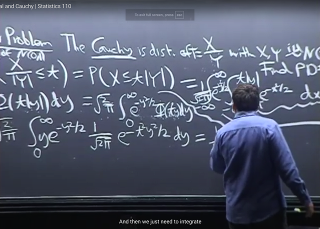</kbd></p>

<p align="center"><kbd></kbd></p>

<p align="center"><kbd>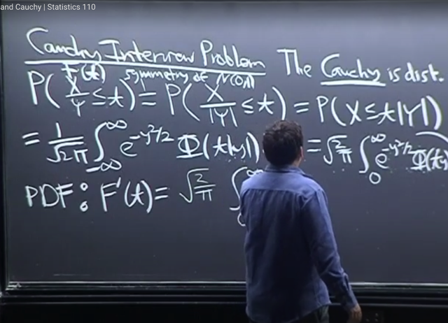</kbd></p>

🔗 **Related:** [LEC 22: TRANSFORMATIONS & CONVOLUTION](untitled.md#node-731)

> [!NOTE]
> Thế thì cái nãy giờ ta đang làm, như đã nói là Joint PDF **P((x,y) thuộc A)** với **A area mà `X<=t|Y|` và bản chất** là 
> ```text
> đó là CDF của V=X/Y, và là hàm theo t: F(t) = P(X/Y<=t)
> ```
>
> Vậy thì khi l**ấy derivative đối với t** này, mà function đang có dạng của một cái tích phân. Thì gs cho biết **có
> một Theorem nói rằng nếu cái hàm số trong tích phân `well-behave,` thì theorem cho phép "đạo hàm của tích
> phân `=` tích phân của đạo hàm"** (đại khái là vậy, cái này cũng tương tự như đạo hàm của tổng bằng tổng
> đạo hàm vậy vì bản chất tích phân là tổng)
>
> Nên thành ra để ta sẽ tính **đạo hàm THEO t** của **[ `√(2/π)` `∫` 0:inf `e^-y^2/2` Φ(ty) dy]**
>
> Ta sẽ chuyển thành **√(2/π) `∫` 0:inf của [đạo hàm theo t của `e^-y^2/2` Φ(ty)] dy** (**1)**
>
> Xét [**đạo hàm theo t của `e^-y^2/2` Φ(ty)**]:
>
> thì tính đạo hàm theo t thì **e^-y^2/2 là hằng số, đưa ra ngoài đạo hàm**. **(2)** 
>
> F'(t) `=` `√(2/π)` `∫` 0:inf `e^-y^2/2` [**đạo hàm theo t của Φ(ty)**] dy
>
> Còn**đạo hàm theo t của Φ(ty)** tính như sau:
>
> Theo chain rule: `dΦ(ty)/dt` `=` d Φ(ty) `/` d(ty) * d(ty) `/` dt `=` **d Φ(ty) `/` d(ty) * y** **(3)**
> Và **d Φ(ty) `/` d(ty) thì là g**ì? 
>
> ```text
> Đã biết Φ(x) là CDF của Standard Normal X ~N(0,1), = P(X ≤ x) và ta có Φ'(x) / dx = f(x) ⇨ d Φ(ty) / d(ty)
> ```
> `=` f(ty) với f là PDF của Standard Normal, `=` `1/(√2π)` `e^-(ty)^2/2` **= `1/(√2π)` `e^-t^2y^2/2` (4)
>
> Vậy từ (1) (2) (3) (4) ta có: 
>
> F'(t) `=` `√(2/π)` Tích phân 0:inf của `{e^-y^2/2` * y * `[1/(√2π)` `e^-t^2y^2/2]` } dy**

<br>

<a id="node-675"></a>

<p align="center"><kbd>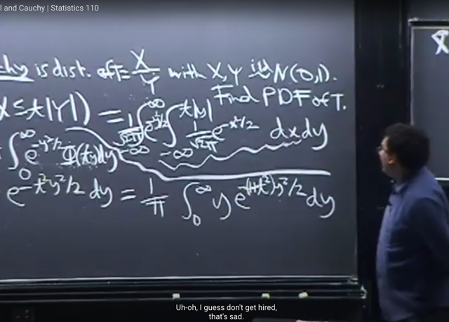</kbd></p>

> [!NOTE]
> ```text
> F'(t) = √(2/π) Tích phân 0:inf của {e^-y^2/2 * y * [1/(√2pi) e^-t^2y^2/2] } dy
> ```
>
> Rút gọn ta có
>
> ```text
> i) √(2/π) * 1/(√2π) = 1/π
> ```
>
> ```text
> ii) e^(-y^2/2) * e^(-t^2y^2/2) = e^[-(1+t^2)y^2/2
> ```
>
> Nên F'(t) `=`
>
> **(1/π) Tích phân 0:inf của {y * `e^[-(1+t^2)y^2/2}` dy**
> `===`
>
> Tới đây thì ta có một tích phân **CÓ THỂ giải được**, bởi để ý thấy `"y^2/2"` và y ở
> dưới chính là gợi ý cho ta dùng **U-SUBSTITUTION (1801 sẽ học)**
>
> ```text
> Đặt u = -(1+t^2)y^2/2 => du = -(1+t^2)2y/2 = -(1+t^2)ydy
> ```
>
> ```text
> <=> ydy = -[1/(1+t^2)]du
> ```
>
> ```text
> Tính lại biên: y=0 => u=0, y -> infinity => u-> -infinity
> ```
>
> Tích phân trên trở thành 
>
> `(1/π)` Tích phân `0:-inf` của e^udu
>
> ```text
> = (1/π) * -[1/(1+t^2)] * Tích phân 0:-inf của e^udu
> ```
>
> ```text
> = -1 / [π*(1+t^2)] * [nguyên hàm của e^u (= e^u)] | 0: -inf
> ```
>
> ```text
> = -1 / [π*(1+t^2)] * [e^(-inf) - e^0]
> ```
>
> ```text
> = -1 / [π*(1+t^2)] * [0-1]
> ```
>
> ```text
> = -1 / [π*(1+t^2)] * (-1)
> ```
> **= 1 `/` [π*(1+t^2)]**

<br>

<a id="node-676"></a>

<p align="center"><kbd>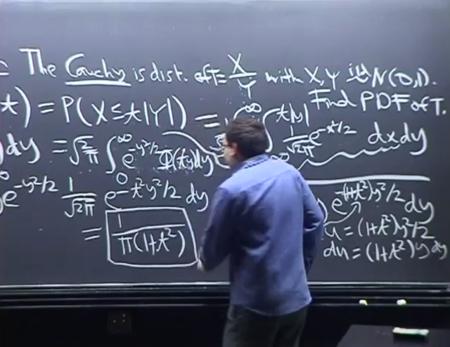</kbd></p>

<br>

<a id="node-677"></a>

<p align="center"><kbd></kbd></p>

🔗 **Related:** [LEC 20: MULTINOMIAL AND CAUCHY](untitled.md#node-667)

> [!NOTE]
> vài phút cuối gs nói về **cách làm thứ 2** áp dụng **Law of Total Probability** mà gs cho rằng
> cũng có thể dùng hồi nãy
>
> Với cách tiếp cận **wishful** như đã biết ta **ước rằng, đã biết y**, để mà**conditioned on y**. Thì
> P(X ≤ t|Y|) trở thành 
>
> **tích phân `-inf:inf` P(X ≤ t|Y| | Y=y)**
>
> Tới thời điểm này có thể đã khá quen với lập luận vì sao mà ta có cái này (cũng chính là
> Law of Total Probability), nhưng cứ lập luận lại cho nhớ lâu:
>
> Đó là bởi nếu X, Y discrete thì:
>
> X ≤ t|Y| sẽ `=` [Union của `(X<=t|Y|,` `Y=y)` với mọi possible value y of Y]
>
> Đây là kết quả từ**logic của set theory** rằng event A `=` **union** của **mọi (intersection**
> giữa A và các disjoint part của B):
>
> A `=` (A,B1) U (A,B2)....(A, Bn) với B1, B2, ... là các disjoint event và B1 U B2 ..U Bn `=` B
>
> Do đó P(A) `=` P[(A,B1) U (A,B2)....U (A, Bn)]
>
> Và vì các Bj với `j=1,2..n` disjoint, nên các (A,Bj) với `j=1,2...n` cũng disjoint
>
> Do đó theo **Axiom 2** của probability: P[(A,B1) U (A,B2)....U (A, Bn)] `=` Tổng `j=1,2..` P[(A, Bj)]
>
> ```text
> Do đó P(X<=t|Y|) = P[Union của (X<=t|Y|, Y=y) với mọi possible value y of Y]
> ```
>
> `=` Tổng {mọi possible value của y} `P(X<=t|Y|,` `Y=y)`
>
> Áp dụng thêm **conditional theorem**: `P(X<=t|Y|,` `Y=y)` `=` `P(X<=t|Y|` | `Y=y)` * `P(Y=y)`
>
> Nên**P(X<=t|Y|) `=` Tổng {mọi possible value của y}:  `P(X<=t|Y|` | `Y=y)` * P(Y=y)**
>
> Trong discrete case như đã biết `P(Y=y)` là PMF của y
>
> `====`
>
> Còn với continuous case thì nó sẽ tương đương:
>
> **P(X ≤ t|Y|) `=` tích phân `-inf:inf` P(X ≤ t|Y| | `Y=y)` f_Y(y)dy,**trong đó `f_Y(y)` mà gs ghi là Φ(y) là **PDF của y,** và Y như đã biết là N(0,1)

<br>

<a id="node-678"></a>

<p align="center"><kbd>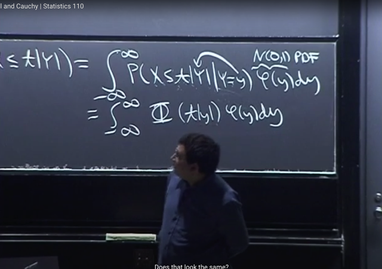</kbd></p>

🔗 **Related:** [LEC 20: MULTINOMIAL AND CAUCHY](untitled.md#node-671)

> [!NOTE]
> Tiếp, vì X ≤ t|Y| dựa trên condition on `Y=y` thì ta có thể**thay thế y vào |Y|**
>
> Hay nói cách khác **event (X ≤ |Y| | Y `=` y)** chính là **event X ≤ ty**
>
> nên P(X ≤ t|Y| | Y `=` y) `=` P(X ≤ ty | `Y=y)`
>
> Và ở đây ta được học một lập luận quan trọng là: **Nếu X,Y independent thì
> khi đã gắn giá trị `Y=y` vào thì X ≤ ty | Y `=` y ta có thể bỏ đi phần condition**
>
> Tức là (X ≤ ty | `Y=y)` `=` (X ≤ ty)
>
> Và khi đó ta có **P(X ≤ ty)**, và vì **X~N(0,1)** nên **P(X ≤ ty) chính là Φ(ty)** và bài
> toán trở thành:
>
> **tích phân `-inf:inf` f Φ(ty) f_Y(y)dy**
>
> giải tiếp tại đây như hồi nãy (theo link xanh)

<br>

