# Lec 21: Covariance & Correlation

📊 **Progress:** `50` Notes | `45` Screenshots

---
<a id="node-680"></a>

<p align="center"><kbd>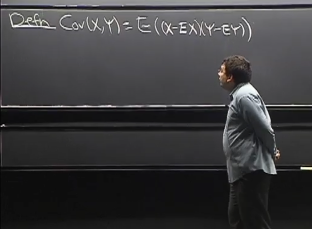</kbd></p>

> [!NOTE]
> Đầu tiên, ta đã biết mean (expected value) của r.v EX, và variance `Var(X)`
> trong đó **mean thì có tính linearity** còn **variance thì không**.
>
> Thì bài này ta sẽ học về **variance** của **2 random variables**
>
> Thế thì định nghĩa của **covariance** của hai r.v X,Y định nghĩa là 
>
> **Cov(X,Y) `=` E[(X-EX)(Y-EY)]**

> [!NOTE]
> ```text
> Cov(X,Y) = E[(X-EX)(Y-EY)]
> ```

<br>

<a id="node-681"></a>

<p align="center"><kbd>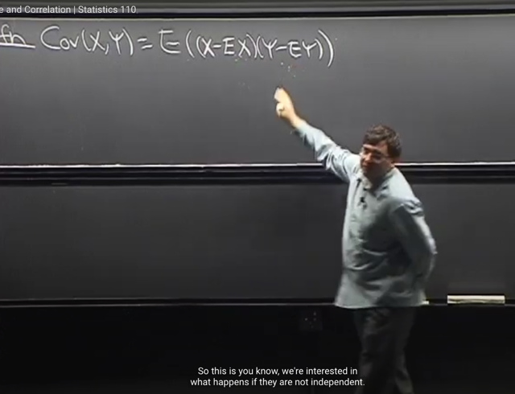</kbd></p>

🔗 **Related:** [LEC 19: JOINT, CONDITIONAL AND MARGINAL DISTRIBUTION](untitled.md#node-625)

> [!NOTE]
> Đại khái là hình dung ta lấy random **i.i.d các cặp giá trị của X, Y**. Tức là **giữa
> các cặp** giá trị thì chúng **INDEPENDENT** nhau. Nhưng trong mỗi cặp giá trị
> của X,Y có thể không independent, mà tuân theo một **joint distribution** nào đó.
>
> Gs nói, ta đã biết **nếu X, và Y independent**, thì bài trước ta đã biết **E(XY) `=`
> EX*EY**và đã chứng minh nhờ 2D LOTUS (theo link tím)
>
> thì ở đây, **nếu X, Y INDEPENDENT**thì **X-EX** và **Y-EY** cũng sẽ
> INDEPENDENT dẫn tới **E[(X-EX)(Y-EY)] cũng sẽ trở thành `E(X-EX)` * `E(Y-EY)`
> ```text
> và cái này bằng 0 do theo linearity: E(X-EX) = EX-EEX = EX-EX = 0 tương tự
> ```
> `E(Y-EY)` `=` 0**Vậy ta có thể kết luận nếu X, Y independent, `Cov(X,Y)` `=` 0, và tí nữa ta sẽ
> chứng minh

> [!NOTE]
> NẾU X, Y INDEPENDENT, THÌ `E(XY)` `=` EX*EY
>
> VÀ `(X-EX)` VÀ `(Y-EY)` CŨNG INDEPENDENT NÊN
>
> **Cov(X,Y) `=` `E[(X-EX)(Y-EY)]` `=` `E(X-EX)*E(Y_EY)` `=` 0**

<br>

<a id="node-682"></a>

<p align="center"><kbd>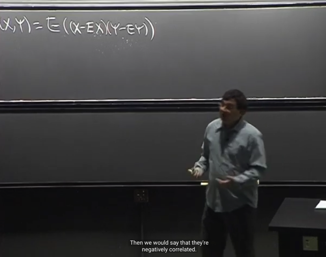</kbd></p>

> [!NOTE]
> đại khái là ta có thể hiểu **intuitively** cái này có ý nghĩa là vầy. Trước hết nhận xét
> nó là **mean của một cái tích** giữa (**X-EX)** và (**Y-EY)**. Thì đương nhiên
> tích của hai cái sẽ **dương** nếu cả hai **cùng âm** hoặc **cùng dương**.
>
> Vậy hình dung khi ta **lấy nhiều cặp giá trị x, y** (các cặp independent nhau như
> đã nói) thì**nếu giá trị của x lớn hơn mean EX** và **đồng thời các giá trị y đi
> kèm cũng có xu hướng lơn hơn mean EY**,
>
> rồi **khi x nhỏ hơn EX** thì **y cũng có xu hướng nhỏ hơn mean của nó EY**.
> Thì khi đó dể hiễu ta sẽ có **tích của `(X-EX)` `(Y-EY)` dương**. Ta gọi đó là
> **POSITIVE CORRELATED**.
>
> Ngược lại nếu khi **x lớn hơn mean EX** mà **y có xu hướng nhỏ hơn mean EY** và
> ngược lài khi x nhỏ hơn mean EX thì y lại có xu hướng lớn hơn mean EY thì ta
> có **NEGATIVE CORRELATED**

> [!NOTE]
> `Cov(X,Y)` > 0: POSITIVE CORRELATED 
>
> `Cov(X,Y)` < 0: NEGATIVE CORRELATED

<br>

<a id="node-683"></a>

<p align="center"><kbd>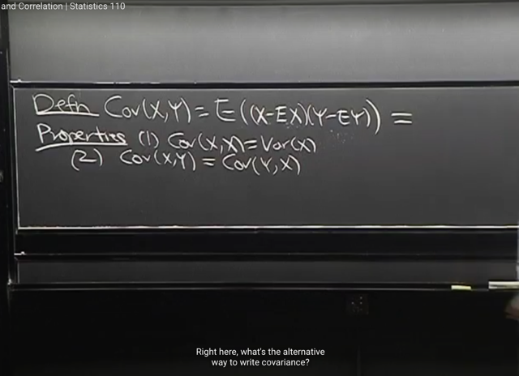</kbd></p>

> [!NOTE]
> Thế thì. Đầu tiên ta đã biết **Var(X) `=` E[(X-EX)^2]**
>
> (Ôn lại tí, đại khái là người ta muốn đo độ spreading `/` phân tán của
> random variable values. Do đó ý tưởng đầu tiên là tính trung bình  của
> khoảng cách giữa rv và mean: `E(X-EX).` Nhưng mà như vậy thì kết quả
> sẽ ra 0, do sự triệt tiêu nhau giữa các giá trị của X ở bên trái và bên
> phải mean.
>
> ```text
> Hoặc cũng có thể thấy thông qua Linearity: E(X-EX) = EX - E(EX) = EX
> ```
> `-` EX `=` 0 (EEX `=` EX do EX là number)
>
> Nên người ta mới bình phương lên: `E[(X-EX)^2]` và đó là **variance**. Khi
> cần một đại lượng đo mức độ spreading nhưng cũng unit thì ta lấy căn
> bậc hai: để có **Standard** **deviation**.)
>
> Do đó gs cho rằng **bằng cách cho Y `=` X**, ta đã chứng minh ngay một
> **theorem**, **property của Covariance** đó là **Cov(X,X) `=` Var(X)**
>
> Đơn giản là: **Cov(X,X)** `=` `E[(X-EX)(X-EX)]` `=` **E[(X-EX)^2] và đây
> chính là công thức của variance của X**
>
> Và property 2, dựa trên tính symmetry: **Cov(X,Y) `=` Cov(Y,X)**

> [!NOTE]
> Property #1: 
>
> `Cov(X,X)` `=` `Var(X)`
>
> `Cov(X,Y)` `=` `Cov(Y,X)`

<br>

<a id="node-684"></a>

<p align="center"><kbd>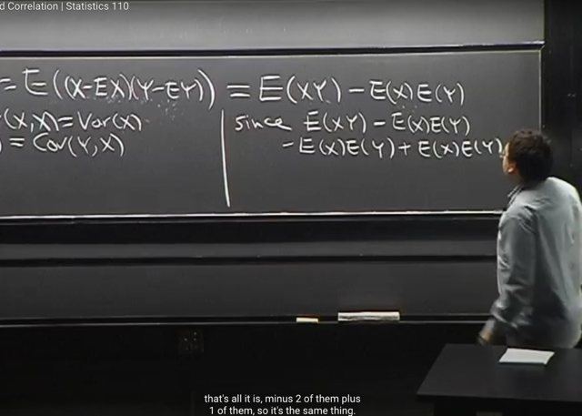</kbd></p>

🔗 **Related:** [LEC 27: CONDITIONAL EXPECTATION GIVEN AN R.V](untitled.md#node-838)

🔗 **Related:** [LEC 28: INEQUALITIES](untitled.md#node-865)

> [!NOTE]
> ```text
> Thế thì tương tự như khi ta thể hiện Var(X) = E[(X-EX)^2] = E(X^2) - (EX)^2
> ```
>
> ```text
> ở đây cũng vậy E[(X-EX)(Y-EY)] = E[XY + EXEY - XEY - (EX)Y]
> ```
>
> ```text
> Theo linearity , = E(XY) + E(EXEY) - E(XEY) - E[EX(Y)]
> ```
>
> `=` `E(XY)` +****\/EXEY\/ `-` EY(EX) `-` `\/EX(EY)` `\/`
>
> `=` `E(XY)` `-` EY(EX)  `=` **E(XY) `-` EXEY**Vậy **Cov(X,Y) `=` `E(XY)` `-` EXEY**Ở các bước trên ta đã dùng EcX `=` cEX: ví dụ `E(XEY)`  vì EY là mean Y
> là constant nên đưa ra ngoài, trong ngoặc còn X: `=` EY(EX)
>
> Và `E(c)` `=` c : `E(EXEY)` `=` EXEY vì EXEY là constant vì EX, EY là constant****Có thể thấy công thức này nếu dùng để tính `Cov(X,X)` mà như property 1
> đã nói, là bằng `Var(X),` thì ở đây ta thấy nó sẽ là **E(X^2) `-` (EX)^2** và đó 
> chính là dạng công thức thứ 2 của `Var(X)`  
> **Ta đã biết nếu X,Y INDEPENDENT thì `E(XY)` `=` EX*EY, khi đó `Cov(X,Y)` sẽ
> bằng EXEY `-` EXEY `=` 0. Và đây cũng là ta đã chứng minh điều này**Và gs cho biết thêm ta thấy công thức `E(XY)` `-` EXEY sẽ gọn hơn nhưng
> công thức gốc cho ta intuition về correlation (như cách giải thích hồi nãy)

> [!NOTE]
> ```text
> Property #2: Cov(X,Y) = E(XY) - EXEY
> ```
>
> Nên nếu X, Y INDEPENDENT thì `E(XY)` `=` EXEY (CÁI NÀY ĐÃ
> CHỨNG MINH BỮA TRƯỚC NHỜ 2D LOTUS)  DẪN TỚI `Cov(X,`
> Y) `=` EXEY `-` EXEY `=` 0

<br>

<a id="node-685"></a>

<p align="center"><kbd>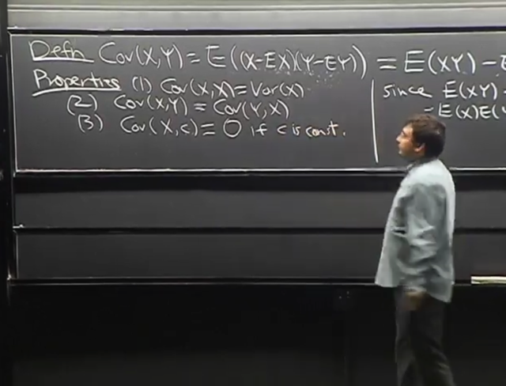</kbd></p>

> [!NOTE]
> Và ta có property 3 là **Cov(X, c) `=` 0** nếu c là **constant**.
>
> Chứng minh đơn giản bằng "công thức 1": nếu Y là constant 
> ```text
> thì EY = Y. Nên Cov(X,Y)  = E[(X-EX)(Y-EY)]  = E[(X-EX)(Y-Y)] = 0
> ```

> [!NOTE]
> Property #3: `Cov(X,` c) `=` 0 nếu c là constant

<br>

<a id="node-686"></a>

<p align="center"><kbd>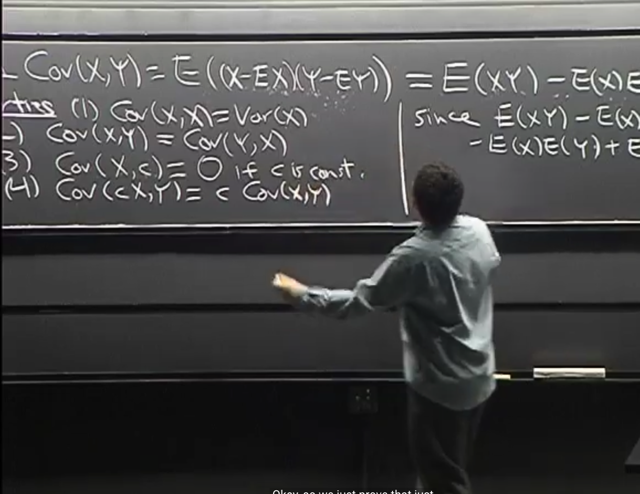</kbd></p>

> [!NOTE]
> Property 4: `Cov(cX,Y)` `=` `c*Cov(X,Y)`
>
> chứng minh rất nhanh chóng bằng cách dùng "công thức 2" 
> ```text
> (Cov(X,Y) = E(XY) - EXEY):
> ```
>
> chỉ dùng linearity đưa c ra ngoài:
>
> ```text
> Cov(cX, Y) = E(cXY) - E(cX)EY = cE(XY) - cEXEY = c[E(XY) - EXEY]
> ```
>
> `=` cCov(X,Y)

> [!NOTE]
> Property 4: `Cov(cX,` Y) `=` `c*Cov(X,Y)`

<br>

<a id="node-687"></a>

<p align="center"><kbd>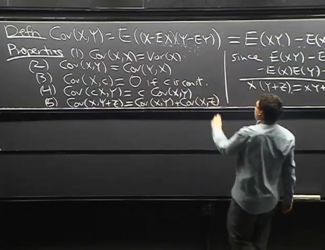</kbd></p>

> [!NOTE]
> ```text
> và property 5: Cov(X, Y+Z) = Cov(X,Y) + Cov(X,Z)
> ```
>
> ```text
> Chứng minh Cov(X, Y+Z) dùng "công thức 2" (Cov(X,Y) = E(XY) - EXEY) và
> ```
> linearity
>
> ```text
> = E[X(Y+Z)] - EXE(Y+Z) = E(XY + XZ) - EX(EY + EZ)
> ```
>
> ```text
> = EXY + EXZ - EXEY - EXEZ = EXY - EXEY + EXZ - EXEZ
> ```
>
> ```text
> = Cov(X,Y) + Cov(X,Z)
> ```

> [!NOTE]
> ```text
> #Property 5: Cov(X, Y+Z) = Cov(X, Y) + Cov(X, Z)
> ```

<br>

<a id="node-688"></a>

<p align="center"><kbd>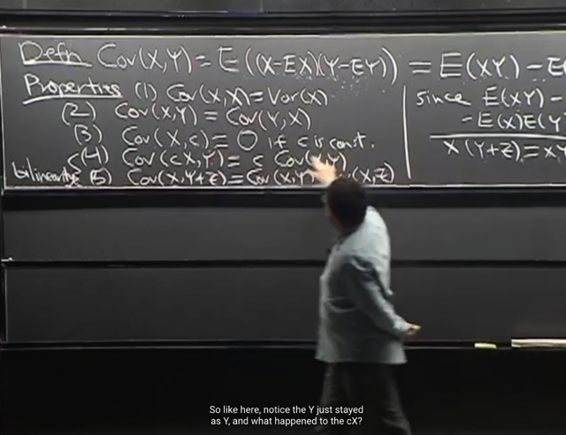</kbd></p>

> [!NOTE]
> Và properties 4,5 gọi là **BILINEARITY**. Có thể hiểu là, nếu ta COI NHƯ **giữ
> nguyên một coordinates**  thì khi **làm việc với các coordinate khác sẽ thấy
> giống linearity**
>
> (cái này làm ta liên tưởng đến một tính chất của định thức ma trận: Tạm gọi là
> row linearity, tức là nếu tách matrix A thành matrix B và C, sao cho row i của
> matrix A `=` row i của matrix B `+` row i của matrix C, các row khác của A,B,C đều
> y nguyên thì khi đó **det A `=` det B `+` det C)**
>
> Ví dụ trong (4), thì coi như **giữ nguyên Y**, chỉ là việc với X thì ta có thể thấy nó
> giống linearity tương tự như **EcX `=` cEX**
>
> Và trong (5) coi như **giữ nguyên X**, chỉ làm việc vói**Y+Z** thì nó có vẻ giống
> linearity ở **E(Y+Z) `=` EY `+` EZ**
>
> Gs nói thêm khi cần ta sẽ **dùng ngay các properties** này mà không cần phải
> dựa trên definition gốc giúp ta không phải tính toán nhiều

<br>

<a id="node-689"></a>

<p align="center"><kbd>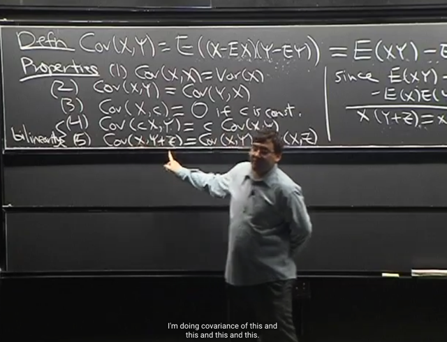</kbd></p>

> [!NOTE]
> Và đại khái là ta có thể thấy tính chất (5) 
>
> ```text
> Cov(X, Y+Z) = Cov(X, Y) + Cov(X, Z)
> ```
>
> giống như tính chất  PHÂN PHỐI (**DISTRIBUTED**)

<br>

<a id="node-690"></a>

<p align="center"><kbd>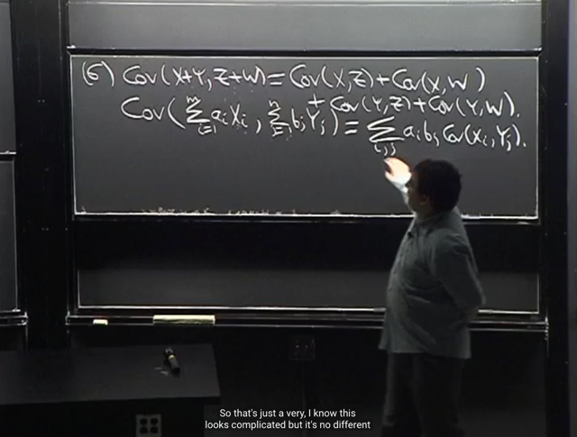</kbd></p>

> [!NOTE]
> Và mở rộng ra ta sẽ có thể có tính chất 6 như này. Và khái quát hơn
> là **Cov của hai linear combination của Xi và Yj**
>
> Tuy có vẻ phức tạp nhưng thực chất c**hỉ là ta áp dụng property 5, và 4
> nhiều lần mà thôi**Thử lấy một ví dụ:
>
> `Cov` (a1X1 `+` a2X2, b1Y1 `+` b2Y2) 
>
> ```text
> = Cov (a1X1 + a2X2, b1Y1) + Cov (a1X1 + a2X2, b2Y2)
> ```
>
> ```text
> = Cov (a1X1, b1Y1) + Cov (a2X2, b1Y1) + Cov (a1X1, b2Y2) + Cov (a2X2, b2Y2)
> ```
>
> ```text
> = a1*Cov (X1, b1Y1) + a2Cov (X2, b1Y1) + a1Cov (X1, b2Y2) + a2Cov (X2, b2Y2)
> ```
>
> **= `a1b1*Cov` (X1, Y1) `+` a2b1Cov (X2, Y1) `+` a1b2Cov (X1, Y2) `+` a2b2Cov (X2, Y2)**

> [!NOTE]
> ```text
> #Property 6: Cov(X+ Y, Z+W) = Cov(X, Z) + Cov(X, W) + Cov(Y, Z) + Cov(Y, W)
> ```

<br>

<a id="node-691"></a>

<p align="center"><kbd>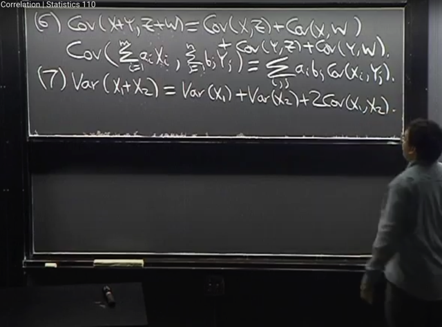</kbd></p>

🔗 **Related:** [LEC 30: CHI-SQUARE, STUDENT-T, MULTI-VARIATE GAUSSIAN](untitled.md#node-933)

> [!NOTE]
> Và **nhờ covariance** ta có thể có công thức của **Variance của tổng hai
> random variables**:
>
> Từ property (1) ta đã có `Cov(X,` X) `=` `Var(X)`
>
> Nên **Var(X1+X2)** chính là `=` **Cov(X1+X2, X1+X2)** .
>
> Tiếp, **property (6)** cho ta biết `Cov(X1+X2,` `X1+X2)` sẽ là tổng của 4 cái:
>
> **Cov(X1, X1) `+` `Cov(X1,` X2) `+` `Cov(X2,` X1) `+` `Cov(X2,` X2)**
>
> =**Var(X1) `+` `Var(X2)` `+` 2Cov(X1,X2)** |  `Cov(X1,X1)` `=` `Var(X1)` again do
> property (1)
>
> Như vậy V**ar(X1+X2) `=` `Var(X1)` `+` `Var(X2)` `+` 2Cov(X1,X2)**
>
> từ đây ta có theorem:
>
> **khi và chỉ khi `Cov(X1,` X2) `=` 0** thì **variance của tổng bằng tổng
> variance**
>
> Và gs cho biết ta đã biết **nếu hai r.v Independent thì Covariance của chúng
> bằng 0 rồi**
>
> ```text
> (lập luận nhanh dùng công thức 2 Cov(X,Y) = E(XY) - EXEY , nếu X,Y
> ```
> ```text
> independent  thì E(XY) = EXEY => Cov(X,Y) = EXEY-EXEY = 0)
> ```
>
> Nhưng **CÓ KHI DEPENDENT** r.v NHƯNG Covariance của chúng C**ŨNG
> BẰNG 0** thì khi đó Variance của tổng bằng tổng variance.

> [!NOTE]
> Dựa vào `Cov(X,X)` `=` `Var(X)` ta có công thức variance của tổng rv
>
> ```text
> Var(X+Y) = Var(X) + Var(Y) + 2Cov(X,Y)
> ```
>
> ```text
> Suy ra: Nếu Cov(X,Y) = 0 thì Var(X+Y) = Var(X) + Var(Y)
> ```
>
> Và việc `Cov(X,Y)` `=` 0 thì:
>
> Nếu X, Y INDEPENDENT THÌ ĐƯƠNG NHIÊN COV(X,Y) `=` 0
>
> NHƯNG VẪN CÓ THỂ DEPENDENT MÀ COV(X,Y) `=` 0

<br>

<a id="node-692"></a>

<p align="center"><kbd>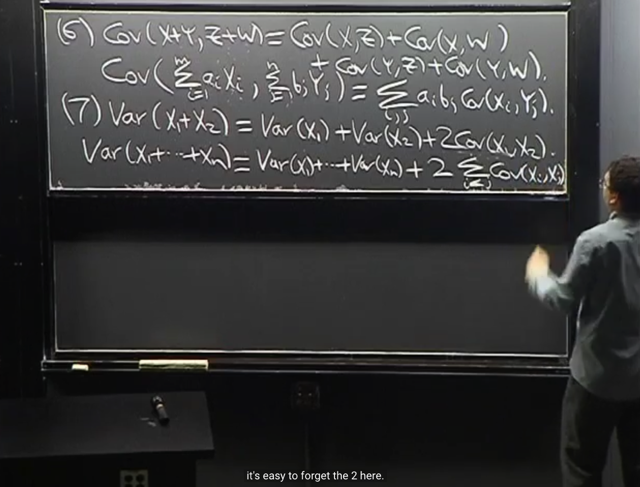</kbd></p>

🔗 **Related:** [LEC 21: COVARIANCE & CORRELATION](untitled.md#node-707)

🔗 **Related:** [LEC 28: INEQUALITIES](untitled.md#node-862)

> [!NOTE]
> Và khái quát hơn **Variance của X1+X2...Xn**
>
> Tương tự như vậy, sẽ là Covariance của sum này với chính nó.
>
> Và theo property (6), Ta cũng sẽ có tổng các Covariance giữa từng cặp.
>
> Trong đó Covariance của Xj với chính nó thì là `Var(Xj),` còn với Xi, Xj với i khác j
> thì ta sẽ có 2 term `Cov(Xi,` Xj), `Cov` (Xj, Xi) 
>
> Do đó kết qủa sẽ là **∑ j `Var(Xj)` `+` 2 ∑ i<j `Cov(Xi,` Xj)**hoặc nếu không muốn gom `Cov(Xi,` Xj), `Cov` (Xj, Xi) thành 2 `Cov(Xi,` Xj)
>
> Thì ghi là **∑j `Var(Xj)` `+` `∑i!=j` `Cov(Xi,` Xj) cũng được**Ví dụ 
>
> ```text
> Var(X1+X2+X3) = Var(X1) + Var(X2) + Var(X3) + Cov(X1,X2) + Cov(X2,X1)
> ```
> ```text
> + Cov(X1,X3) + Cov(X3,X1) + Cov(X2,X3) + Cov(X3,X2)
> ```
>
> ```text
> = Var(X1) + Var(X2) + Var(X3) + 2Cov(X1,X2) + 2Cov(X2,X3) + 2Cov(X1,X3)
> ```

> [!NOTE]
> ```text
> #Property 7: Var(X1+X2...Xn) = ∑ j Var(Xj) + 2 ∑ i<j Cov(Xi, Xj)
> ```

<br>

<a id="node-693"></a>

<p align="center"><kbd></kbd></p>

<p align="center"><kbd></kbd></p>

<p align="center"><kbd>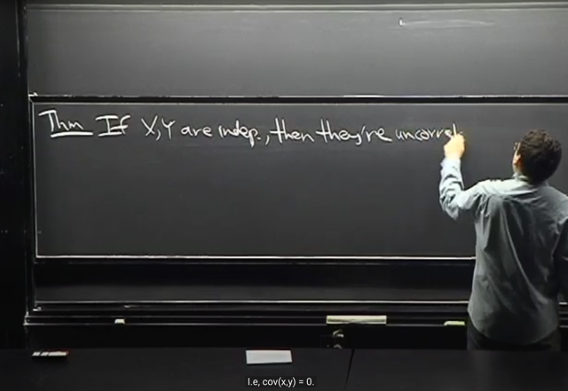</kbd></p>

🔗 **Related:** [LEC 19: JOINT, CONDITIONAL AND MARGINAL DISTRIBUTION](untitled.md#node-626)

> [!NOTE]
> Tới đây ta sẽ biết về theorem liên quan đến khái niệm **UNCORRELATED**: **LÀ COVARIANCE `=` 0**
>
> Theorem: Nếu hai r.v INDEPENDENT, thì UNCORRELATED
>
> Ta đã chứng minh theorem này rồi, vì (bài trước theo link) ta đã chứng minh nếu X,Y independent
> ```text
> thì E(XY) = EXEY. Và vì vậy hôm nay với việc học về Cov(X,Y) thì  E(XY) = EXEY có nghĩa là
> ```
> ```text
> Cov(X,Y) = E(XY) - EXEY = EXEY - EXEY = 0 , thì do đó chúng UNCORRELATED.
> ```

> [!NOTE]
> ĐỊNH NGHĨA: UNCORRELATED LÀ (COVARIANCE `=` 0) 
>
> Theorem: Nếu hai r.v INDEPENDENT, thì UNCORRELATED

<br>

<a id="node-694"></a>

<p align="center"><kbd>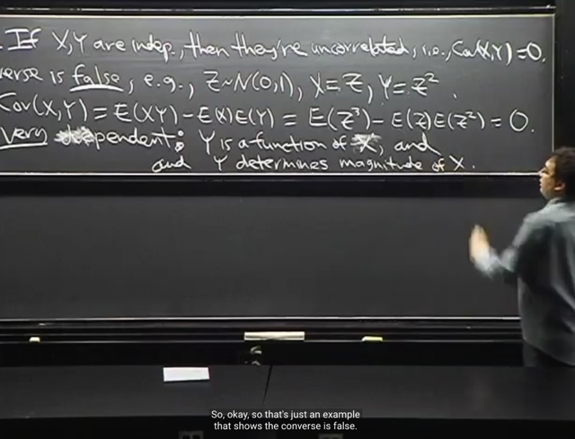</kbd></p>

<p align="center"><kbd></kbd></p>

<p align="center"><kbd>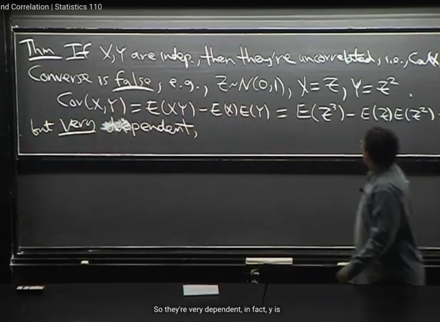</kbd></p>

🔗 **Related:** [TÓM TẮT:  - Tính MGF M(t) của Expo(1) = 1/(1-t) t < 1  - Khi đã có MGF, như bài trước ta đã biết các lí do mà MGF quan trọng trong đó có reason #1 đó là ta chỉ cần tính đạo hàm cấp n của nó sẽ cho ta n'th moment.  - Dù ta có thể tính đạo hàm nhiều lần để có 1st, 2nd moment nhưng có cách hay hơn. Bằng cách nhận ra 1/(1-t) liên quan đến Geometric series  a + ar + ar^2 = Tổng k=0:infinity a*r^k với |r| < 1 sẽ converge về a/[1-r]  Nên 1/1-t chính là Tổng n=0:infinity t^n với |t| < 1  Thế thì theo gs, từ đây cho phép ta KHỎI CẦN TÍNH ĐẠO HÀM CẤP N ĐỂ CÓ MOMENT THỨ N LÀM GÌ CHO MỆT, mà chỉ cần ĐỌC NÓ RA THÔI  Cụ thể là ta đã biết ở bài trước rằng, n'th moment = đạo hàm cấp n của M(t) (là coefficient của (t^n / n!) khi expand M(t) theo Taylor series tại 0)  Do đó, bằng cách tạo ra (t^n / n!) thì BẤT CỨ CÁI GÌ GẮN VỚI NÓ CHÍNH LÀ COEFFICIENT, VÀ CHÍNH LÀ N'TH MOMENT  Do đó ta sẽ nhân thêm n! và chia n! để có (t^n / n!). Như vậy cái lòi ra làm coefficient của t^n/n! ở đây là n! CHÍNH LÀ N'TH MOMENT.  Từ đó cho phép ta ĐỌC LUÔN RẰNG: 1ST MOMENT (EX) LÀ 1!, 2ND MOMENT E(X^2) LÀ 2!  N'TH MOMENT CỦA EXPO(1) E(X^n) = n!  -  đây là tính chất RẤT MẠNH CỦA MGF. Vì ví dụ như khi tính n'th moment (E[X^n]) thì nếu dùng LOTUS, ta phải TÍNH TÍCH PHÂN (INTEGRAL) VÀ CÓ THỂ GẶP NHỮNG TÍCH PHÂN RẤT PHỨC TẠP.  Trong khi đó, nếu ta có MGF, để có nth moment, ta CHỈ CẦN TÍNH DERIVATIVE MÀ DERIVATIVE THÌ THƯỜNG DỄ HƠN LÀ TÍNH TÍCH PHÂN  -Từ n'th moment của Expo(1) ta dễ dàng có n'th moment của Y ~ Expo(λ): E[Y^n] = n! / λ^n  - N'TH MOMENT CỦA N(0,1) VỚI N LẺ ĐỀU BẰNG 0  - MGF CỦA POIS(λ) = e^[λ(e^t-1)]  - Nếu Y ~ Pois(µ) và X~Pois(λ) và biết X, Y INDEPENDENT thì X+Y ~ Pois(λ+µ)](tóm_tắt_tính_mgf_mt_của_expo1_11_t_t_1_khi_đã_có_mgf_như_bài_trước_ta_đã_biết_các_lí_do_mà_mgf_quan_.md#node-576)

> [!NOTE]
> Tuy nhiên **NGƯỢC LẠI THÌ KHÔNG ĐÚNG**; tức là nếu X,Y UNCORRELATED,
> (covariance `=` 0) thì **CHƯA CHẮC CHÚNG INDEPENDENT**
>
> Ta mới lấy ví dụ như vầy, cho**Z~N(0,1**) và **X `=` Z**, **Y `=` Z^2**.
>
> ```text
> Cov(X,Y) = E(XY) - EXEY = E(Z*Z^2) - (EZ)*(EZ^2) = E(Z^3) - (EZ)*EZ^2
> ```
>
> `=` 0 `-` 0*1 `=` 0
>
> Do **EZ** `=` 0, và **E(Z^3)** như đã biết, là **3nd moment**, là một n'th moment với
> **n lẻ**. Mà bài trước ta đã chứng minh **với Normal N(0,1 thì n'th moment với n lẻ
> đều bằng 0**Vậy nó**UNCORRELATED,**nhưng rõ ràng chúng**KHÔNG HỀ INDEPENDENT,**Vì**biết X là biết Y** còn **biết Y thì ít nhất biết độ lớn (trị tuyệt đối của X)**

> [!NOTE]
> INDEPENDENT `=>` COVARIANCE `=` 0 `/` UNCORRELATED
>
> COVARIANCE `=` 0 `/` UNCORRELATED CHƯA CHẮC INDEPENDENT

<br>

<a id="node-695"></a>

<p align="center"><kbd>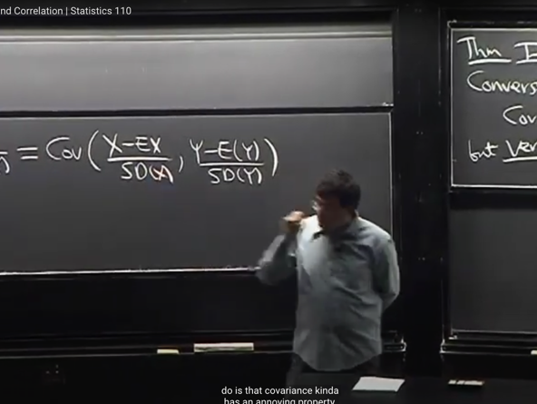</kbd></p>

<p align="center"><kbd></kbd></p>

<p align="center"><kbd>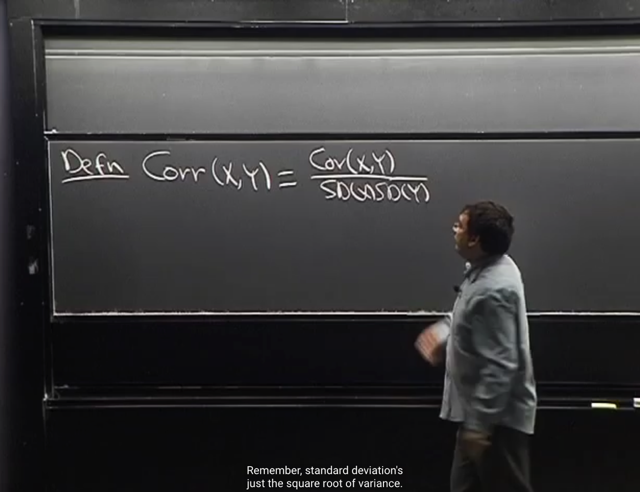</kbd></p>

🔗 **Related:** [LEC 28: INEQUALITIES](untitled.md#node-867)

> [!NOTE]
> Ta qua định nghĩa chính thức về **CORRELATION**: 
>
> **Corr(X,Y)** `=` **Cov(X,Y)** /**[SD(X) * SD(Y)]**
> SD(X) là standard deviation của X, như đã biết, `=` sqrt `Var(X)`
>
> Thế thì đại khái là gs cho biết nó có thể thể hiện bằng công thức khác, đó là: 
>
> i) **Standardize X và Y**
>
> ii) **Tính Covariance của chúng**.
>
> ```text
> = Cov[(X - EX)/SD(X), (Y_EY)/SD(Y)]
> ```
>
> Ta đã biết khái niệm **Standardizing** ở bài Normal distribution, đó là nếu ta có **X ~ `N(μ,` σ^2)**
> thì bằng cách **standardizing Z `=` (X `-` `μ)` `/` σ** thì **Z sẽ là N(0,1)**
>
> Thì lúc đó gs cũng có nói, v**ới distribution khác không phải normal** thì **vẫn có thể áp dụng standardizing**
> nên ở đây chính là như vậy

> [!NOTE]
> Định nghĩa chính thức về CORRELATION: 
>
> Corr(X,Y) `=` `Cov(X,Y)` `/` [SD(X) * SD(Y)]

<br>

<a id="node-696"></a>

<p align="center"><kbd>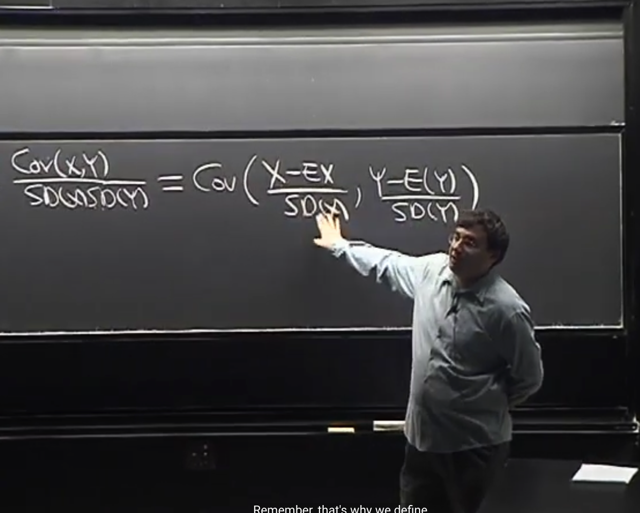</kbd></p>

> [!NOTE]
> đại khái là gs nhắc lại điều mà ông đã từng nói về vai trò giúp "**kiểu như là bỏ
> qua `/khử` đi vấn đề đơn vị đo**" vì với việc **chia cho std** khi standardization,
> giống như `(cm-cm)/cm` thì cái **còn lại không còn quan tâm đơn vị đo** là gì nữa
>
> Ông gọi đó là **DIMENSIONLESS QUANTITY**, ý nghĩa nôm na là như trên, không
> còn care `/` phụ thuộc unit nữa
>
> Ta có thể chứng minh hai công thức như nhau
>
> Đầu tiên chứng minh trước: khi**add constant vào r.v** **không làm thay đổi Cov**:
>
> **Cov(X+c, Y+d)** `=` `E[(X+c)(Y+d)]`  `-` `E(X+c)E(Y+d)` 
>
> ```text
> = E[XY + cY + dX + cd] - (EX + c)(EY + d)
> ```
>
> ```text
> = E(XY) + cEY + dEX + cd - EXEY - cd - cEY - dEX
> ```
>
> `=` `E(XY)` `-` EXEY `=` **Cov(X,Y)**
>
> Do đó**Cov(X-EX)/SD(X), (Y-EY)/SD(Y)]**
>
> ```text
> = (1/SD(X)) Cov(X-EX), (Y-EY)/SD(Y)]  | theo property (4) Cov(cX,Y) = cCov(X,Y)
> ```
>
> ```text
> tiếp lần nữa = (1/SD(X) * 1/SD(Y)) Cov[(X-EX), (Y-EY)]
> ```
>
> Và vì EX, EY chỉ là constant: 
>
> ```text
> (1/SD(X) * 1/SD(Y)) Cov[(X-EX), (Y-EY)]  = (1/SD(X) * 1/SD(Y)) Cov(X, Y)
> ```

> [!NOTE]
> ADD CONSTANT KO LÀM THAY ĐỔI COV: 
>
> ```text
> Cov(X+c, Y+d) = Cov(X, Y)
> ```

<br>

<a id="node-697"></a>

<p align="center"><kbd>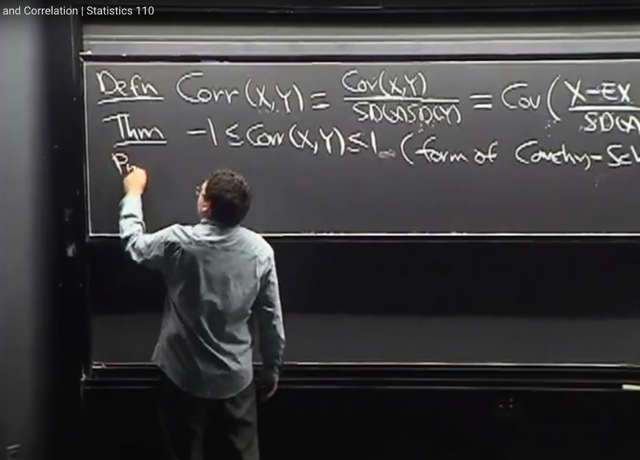</kbd></p>

<p align="center"><kbd>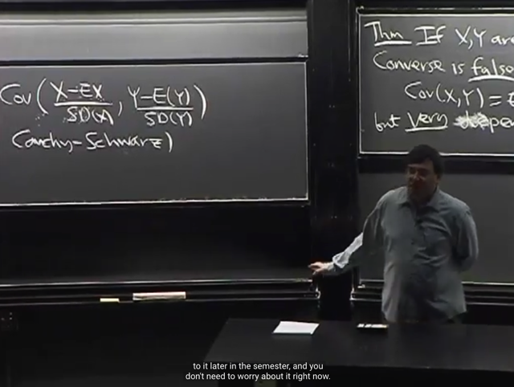</kbd></p>

<p align="center"><kbd></kbd></p>

<p align="center"><kbd></kbd></p>

<p align="center"><kbd>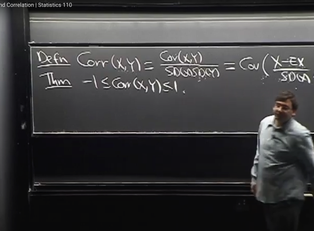</kbd></p>

> [!NOTE]
> Tiếp theo ta đến một **Thereom** rằng **Cov(X, Y)** **chỉ có giá trị trong range [-1:1]**. 
>
> Gs cho biết đây là một dạng của **Bất đẳng thức Cauchy-Schwarz**. Một bất đẳng thức nổi tiếng trong
> toán học

> [!NOTE]
> ```text
> -1 <= Cov(X, Y) <= 1
> ```

<br>

<a id="node-698"></a>

<p align="center"><kbd>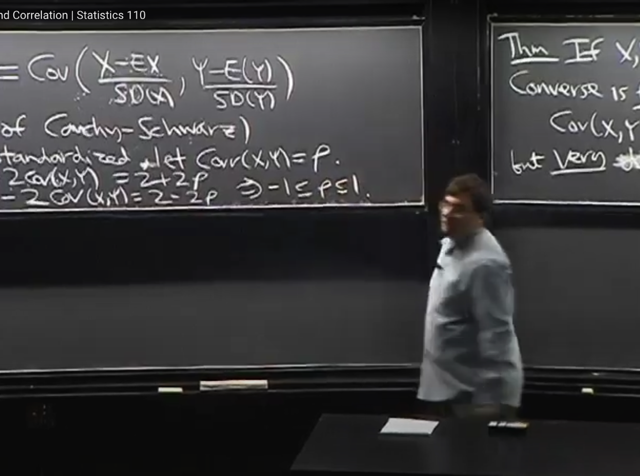</kbd></p>

<p align="center"><kbd></kbd></p>

<p align="center"><kbd>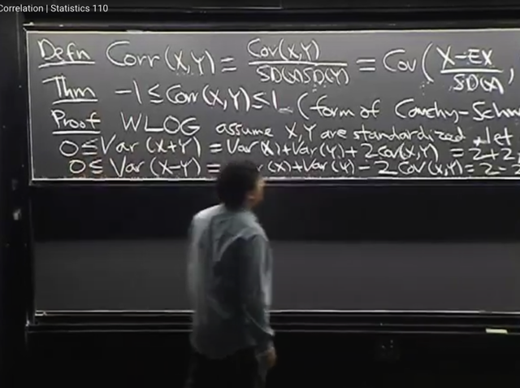</kbd></p>

> [!NOTE]
> Để chứng minh đầu tiên, **ko làm mất tính khái quát** (**WLOG** `-` viết tắt của **Without loss of Generality**) 
> ta **giả sử X,Y đã được standardized**.
>
> Gọi **Corr(X,Y) `=` ρ** như các statistician hay dùng.
>
> Theo property (7), **Var(X+Y)** `=` `Var(X)` `+` `Var(Y)` `+` 2Cov(X,Y) `=` 1 `+` 1 `+` 2ρ `=` **2 `+` 2ρ**. 
>
> ```text
> Var(X) = Var(Y) = 1 do đã standardize, nên variance = 1 như đã biết (again, không nhất thiết phải là
> ```
> Normal mới có variance và mới được standardized)
>
> Vì đã standardized thì variance bằng 1, tức standard deviation cũng
> bằng 1:
>
> ```text
> Corr(X,Y) = Cov(X,Y) / [SD(X)*SD(Y)] = Cov(X,Y) / (1*1) = Cov(X,Y)
> ```
>
> `=>` 2Cov(X,Y) thì `=` 2Corr(X,Y) `=` 2ρ
>
> Tiếp, vì**variance không âm** nên ta có **2 `+` 2ρ `>=` 0** (1)
>
> `====`
>
> Tương tự ta xét **Var(X-Y)**, gs nhắc là **nên xem nó như X `+` (-Y)** 
>
> Thì **Var(X+(-Y)) `=` `Var(X)` `+` `Var(-Y)` `+` 2Cov(X,-Y)** 
>
> Mà **Var(-Y) `=` Var(Y)** | Ôn lại:**Var(cX) `=` c^2Var(X)** `=>` `Var(-Y)` `=` `(-1)^2Var(Y)` `=` `Var(Y)`
>
> Còn **Cov(X, -Y)** `=` `Cov(X,` `-1*Y)` `=` **-1*Cov(X, Y)** theo property (4)
>
> Vậy **Var(X-Y) `=` `Var(X)` `+` `Var(Y)` `-` Cov(X,Y)** =**2 `-` 2ρ**, và ta có **2 `-` 2ρ `>=` 0** (2)
>
> Từ 2 `+` 2ρ `>=` 0, 2 `-` 2ρ `>=` 0 suy ra **-1 `<=` ρ `<=` 1 hay `-1` `<=` Corr(X,Y) `<=` 1**

<br>

<a id="node-699"></a>

<p align="center"><kbd>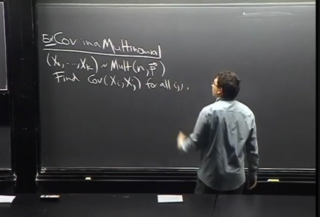</kbd></p>

> [!NOTE]
> Thế thì ta sẽ quay lại **Multinomial** để áp dụng những thứ vừa học về
> **covariance**.
>
> Ta nhớ **Multinomial** có **X là vector (X1, X2...Xk)** mang ý nghĩa là **số object
> thuộc loại 1, 2...k** trong **n trial/object** và vector p `=` **(p1, p2...pk)** sẽ định nghĩa
> **xác suất mà object thuộc loại 1, 2....k**
>
> Thế thì trong bối cảnh này, ta sẽ tính **covariance giữa Xi, Xj,** **Cov(Xi, Xj)**

<br>

<a id="node-700"></a>

<p align="center"><kbd>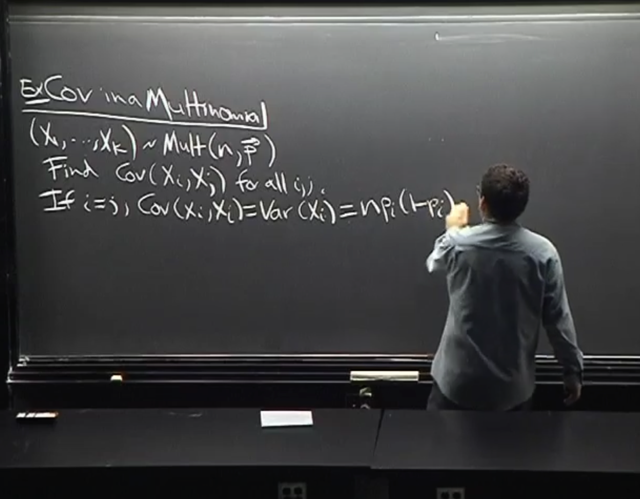</kbd></p>

🔗 **Related:** [-TÓM TẮT:   Z^(số lẻ), ta luôn có E(Z^(số lẻ) = 0, gọi là ODD MOMENT  - Symmetry còn giúp ta kết luận (nếu Z ~ N(0,1) thì -Z cũng là một N(0,1)  - X = μ + σZ sẽ ~ N(μ, σ^2)  - Sẽ tốt hơn nếu ta hiểu Standard Normal Z ~ N(0,1) trước, sau đó hiểu rằng khi scale và shift Z với σ và μ khác nhau thì ta sẽ có bất kì một Normal distribution N(μ, σ^2) nào  - PROPERTIES CỦA VAR(X):  + Var(X + c) = Var(X)  + Var(cX) = c^2*Var(X)  + Var(X) luôn không âm, và nó chỉ bằng 0 nếu X là constant  + Variance KHÔNG CÓ TÍNH LINEARITY:  + Var(X+Y) không bằng Var(X) + Var(Y) TRỪ KHI X, Y INDEPENDENT  X không i.i.d với chính nó X, mà nó EXTREMELY DEPENDENT với chính nó. Do đó bất cứ khi nào ta ÁP DỤNG CÔNG  THỨC NÀO ĐÓ MÀ CẦN CÁC RANDOM VARIABLE CÓ X1, X2 CÓ  TÍNH I.I.D VÀO X VÀ CHÍNH NÓ THÌ ĐỀU LÀ SAI  - CHỨNG MINH VAR X N(μ, σ) = σ^2  - Z = (X - μ) / σ và gs cho biết nó được gọi là STANDARDIZATION (chuẩn hóa)  Giúp từ NORMAL X ~ N(μ, σ) ta có STANDARD NORMAL Z ~ N(0,1)  - Xây dựng PDF của N(μ, σ^2) từ N(0, 1):  fX(x) = 1/(σ√2π) * [e^(-((x-μ)/σ)^2/2)]  - Nếu X ~ N(μ, σ^2) thì -X ~ N(-μ, σ^2  - Nếu X1 ~ N(μ1, σ1^2), X2 ~ N(μ2, σ2^2) và X1, X2 independent thì:  X1 + X2 ~ N(μ1 + μ2, σ1^2 + σ2^2)  X1 - X2 ~ N(μ1 - μ2, σ1^2 + σ2^2)  - 68-95-99.7 rule  - Chứng minh 0^k / k! + 1^k / k! + 2^k / k! + .... = e^k  ⇨ Tổng k=0,1...infinity λ^k/k! = e^λ  - Tìm variance của Poisson (λ) để chứng minh nó có MEAN VÀ VARIANCE ĐỀU LÀ λ  - Khi standardize, ví dụ đơn vị là km, thì (x - μ) / σ sẽ  (km - km) / km = km / km = 1 TỨC Ý NÓI LÀ KHÔNG CÒN CARE ĐƠN VỊ LÀ GÌ NỮA  - X~Bin(n,p), Var(X) = npq (q = 1-p)  - Chứng minh LOTIS](_tóm_tắt_zsố_lẻ_ta_luôn_có_ezsố_lẻ_0_gọi_là_odd_moment_symmetry_còn_giúp_ta_kết_luận_nếu_z_n01_thì_z.md#node-454)

> [!NOTE]
> Đầu tiên xét nếu **i `=` j**, tức là **Cov(Xi, Xi)** như đã biết ở property (1) nó
> chính là **Var(Xi)**.
>
> Chú ý **Xi là scalar random variable**, (X mới là vector) thể hiện **số object 
> thuộc loại i trong n object với xác suất object thuộc loại i là p_i**.
>
> Và bài trước ta đã nhận định rằng Xi chính là **Binomial (n, p_i)** r.v (story
> là, chuyển sang **xem n object như n Bern `(p_i)` trials** với success được
> định nghỉa là **khi object là loại i**, ngược lại là failure thì sẽ thấy**Xi là số
> success**, cho nên **nó là r.v ~ Bin(n, p_i)**
>
> Do đó từ bài trước ta đã biết variance của Binomial của X~Bin(n, p) `=` **np(1-p)**
>
> Nên **Cov(Xi, Xi) `=` `Var(Xi)` `=` np_i(1-p_i)**

> [!NOTE]
> `X=(X1,X2,...Xk)` ~ Multinomial (n, `p=(p1,` p2...pk))
>
> Thì Xi chính là Bin(n, `p_i)` 
>
> ```text
> Nên Cov(Xi, Xi) = Var(Xi) = np_i(1-p_i)
> ```

<br>

<a id="node-701"></a>

<p align="center"><kbd>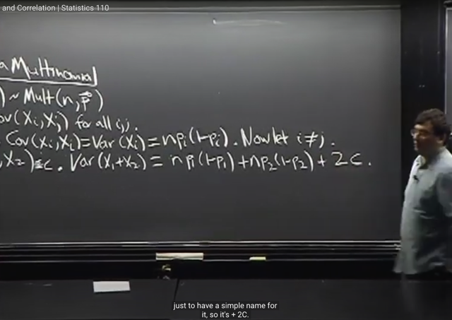</kbd></p>

<p align="center"><kbd></kbd></p>

<p align="center"><kbd>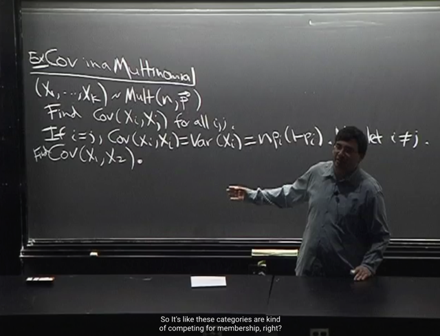</kbd></p>

> [!NOTE]
> Tiếp ta **xét i khác j:** Để cho dễ ta sẽ concrete (**cụ thể hóa**) bằng cách tính
> **Cov(X1, X2)**. Và nó tương tự với mọi cặp Xi, Xj khác
>
> Trước hết ta có thể nhận xét ta **đoán** kết quả sẽ là **ÂM**, tức **NEGATIVE CORRELATED**
> Lí do là vì, **intuitively** với **số object cho trước**, thì khi **số object thuộc loại 1 tăng** thì
> **số object thuộc loại 2 phải giảm**.
>
> Thế thì cách tiếp cận đó là ta dựa vào công thức của `Var(X1+X2)` 
>
>  **Var(X1+X2)** `=` `Var(X1)` `+` `Var(X2)` `+` 2Cov(X1, X2)
>
> `Var(X1)` và `Var(X2)` như đã biết sẽ là **variance** của **Bin(n, p1)** và **Bin(n, p2)**
>
> Gọi `Cov(X1,X2)` `=` c ta có **Var(X1+X2) `=` `np1(1-p1)` `+` `np2(1-p2)` `+` 2c**

<br>

<a id="node-702"></a>

<p align="center"><kbd>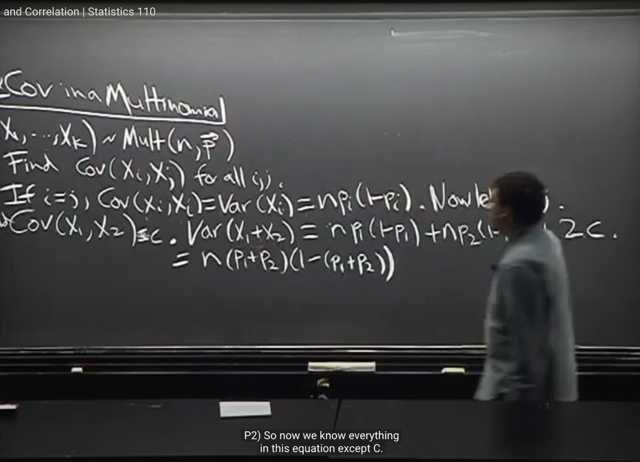</kbd></p>

> [!NOTE]
> Tiếp, để tính **Var(X1+X2)** ta sẽ dùng một **tính chất của Multinomia**l bữa
> trước đã học, gọi là **LUMPING PROPERTY.**
>
> Trong đó ta đã lập luận rằng, **X1+X2** chỉ đơn giản giống như ta **gom loại
> 1 và loại 2 với nhau**, để tổng **số loại trở thành k-1**.
>
> Với **xác suất object thuộc loại (1+2)** là **p1+p2**. 
>
> Và **mọi thứ vẫn như cũ**
> vẫn là **Multinomial** X `=` [(X12), X3, X4....Xk] với p `=` `[(p1+p2),` p3,...pk]
>
> Thì **X1+X2 này sẽ vẫn là Bin(n, p1+p2)** do đó **Var(X1+X2) `=`
> n(p1+p2)(1-p1-p2)**

<br>

<a id="node-703"></a>

<p align="center"><kbd>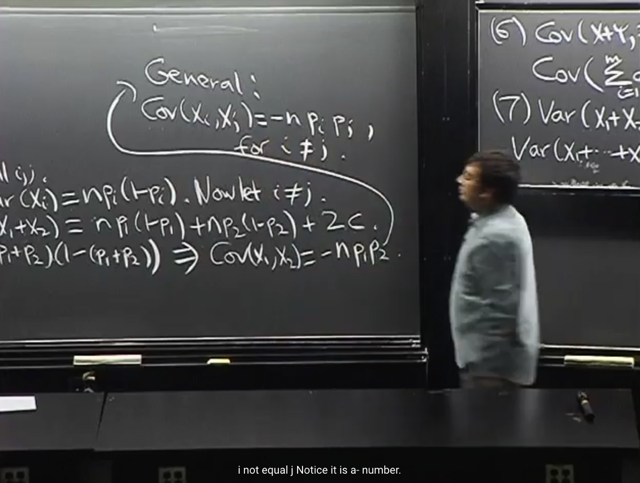</kbd></p>

> [!NOTE]
> và khai triển ra, solve for c ta có **Cov(X1,X2) `=` -np1p2.**
>
> Và khái quát với **Cov(Xi, Xj) `=` -npipj**
>
> và ta thấy **đúng là nó mang giá trị âm** (Negative Correlated)

<br>

<a id="node-704"></a>

<p align="center"><kbd>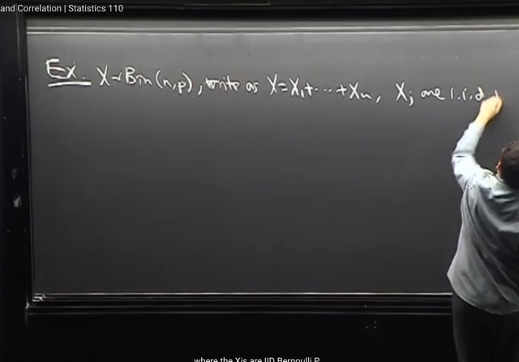</kbd></p>

> [!NOTE]
> Tiếp theo, ta sẽ tính lại **Variance** của **Binomial (n, p)** theo **cách khác
> (ta đã biết kết qủa là npq)**.
>
> Lần trước ta tính dùng công cụ INDICATOR RANDOM VARIABLE
>
> Ta viết lại story của **Bin(n, p)** như đã quen thuộc, X là s**ố i.i.d trial Bern(p)**
> **success**, trong **n trial** có thể được thể hiện bằng **tổng của n indicator
> random variable X1, X2...**Trong đó Xi là indicator random variable gắn với event [trial Aj success]
> và xác suất success là p (đều là p, vì đây là n i.i.d trials).
>
> ```text
> Và ta có E(Xi) = 1*p + 0(1-p) = p = P(Ai), đây gọi là Fundamental Bridge
> ```

> [!NOTE]
> CHỨNG MINH VAR(X) CỦA BIN(n, p) THEO CÁCH DỄ NHẤT

<br>

<a id="node-705"></a>

<p align="center"><kbd>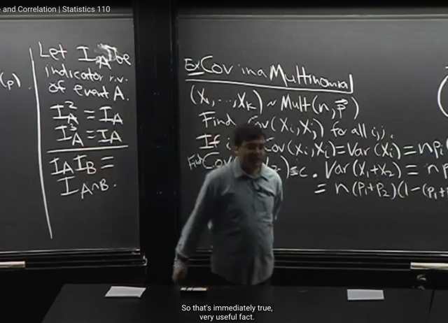</kbd></p>

> [!NOTE]
> Gs ôn lại và nói thêm một chút về **Indicator r.v**.
>
> Gọi **I_A** là indicator r.v**gắn với event A**. Như đã biết, nó sẽ **chỉ có 2 possible
> value** là **1** (khi **A xảy ra**) và **0** (khi A **không xảy ra**)
>
> Thế thì gs lưu ý ta rằng **I_A^2**, hay **I_A^n** thì vẫn là **bằng I_A**. Bởi vì **I_A^n
> cũng chỉ có 2 possible value là 1**, khi `I_A` `=` 1 (khi A xảy ra) và 0, khi `I_A` `=` 0 (khi A
> không xảy ra)
>
> Còn **I_A* I_B** thì nó là `/` bằng **I_(A,B)** `-` là **indicator** r.v gắn với event **(A
> intersect B)** vì nó **CHỈ BẰNG 1 KHI A VÀ B CÙNG XẢY RA** và bằng 0 khi A và B
> không cùng xảy ra.
>
> Gs cho rằng những nhận định hiểu biết như vầy rất hữu ích

<br>

<a id="node-706"></a>

<p align="center"><kbd>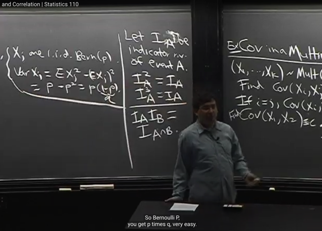</kbd></p>

🔗 **Related:** [LEC 21: COVARIANCE & CORRELATION](untitled.md#node-710)

> [!NOTE]
> Thế thì quay lại đây **Xj** là indicator r.v **Bern(p)**. **Var(Xj)** theo công thức
> ta biết `=` **E(Xj)^2 `-` (EXj)^2**
>
> **E(Xj^2)** như **vừa lập luận**, `=` **E(Xj)**
>
> `=>` **Var(Xj) `=` EXj `-` (EXj)^2**.
>
> Và **mean của Bern(p)** thì đã**chứng minh rồi** có thể chứng minh lại luôn
> là 1*p `+` 0*q `=` p (sum các possible value weight bởi xác suất mang giá trị đó)
>
> Vậy **Var(Xj)** `=` p `-` p^2 `=` `p*(1-p)` `=` **pq**

<br>

<a id="node-707"></a>

<p align="center"><kbd>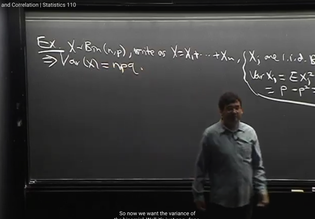</kbd></p>

🔗 **Related:** [LEC 21: COVARIANCE & CORRELATION](untitled.md#node-692)

> [!NOTE]
> Thì vì với Bin(n,p) các trial i.i.d nên các Xj **INDEPENDENT**.
>
> Do đó **Var(X) `=` `Var(X1` `+` X2 +....)**  sẽ bằng **Var(X1) `+` `Var(X2)` `+` ....Var(Xn)** (1)
>
> Theo property (7): 
>
> V**ar(∑ j Xj) `=` ∑ j `Var(Xj)` `+` 2 ∑ i<j Cov(Xi,Xj)**
>
> và đã chứng minh **nếu X,Y độc lập thì `Cov(Xi,Xj)` `=` 0**
>
> Do đó **Var(Tổng j Xj) `=` ∑ j Var(Xj)**
>
> Vậy `Var(X)` `=` pq `+` pq `+` ... `=` **npq**

<br>

<a id="node-708"></a>

<p align="center"><kbd>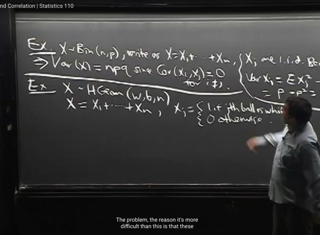</kbd></p>

> [!NOTE]
> Ta quay lại **HyperGeometric** distribution. X ~ **HGeom**(w, b, n) mang
> story là có **lọ** với **w bi trắng**, **b bi đen**. Và ta lấy **lần lượt n lần**.
> Mỗi lần lấy bi ra thì  **không bỏ vào lại** khiến xác suất success thay đổi.
>
> (Điều này khác với Binomial, mà ta xem là n trial Bern(p) i.i.d  giống như
> mỗi lần lấy bi ra xem có phải bi trắng không (giả sử coi success là bi trắng),
> thì bỏ vào lại, để lần sau lấy, xác suất success vẫn không đổi
>
> Còn ở cái này bằng hình ảnh lấy bi ra khỏi lọ, thì sau khi lấy bi ra, sẽ ảnh
> hưởng đến số lượng bi còn lại. Do đó xác suất bốc được bi trắng, bi đen
> không giống nhau sau mỗi trial.
>
> Hay nói cách khác, với **HGeom** KHÔNG CÓ TÍNH CHẤT i.i.d vì chúng không
> những **không independent, mà cũng không identical**

> [!NOTE]
> `Var(X)` của Hypergeometric

<br>

<a id="node-709"></a>

<p align="center"><kbd>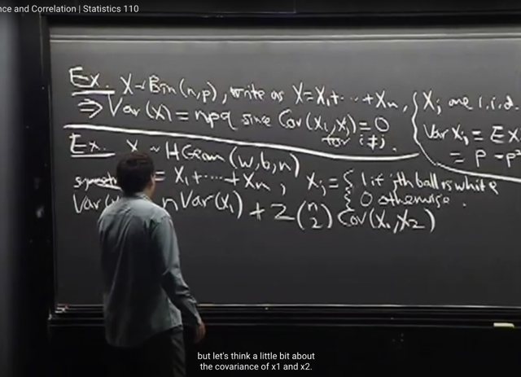</kbd></p>

> [!NOTE]
> **Var(X) `=` `Var(X1` `+` X2 `+` ... Xn)**.
>
> Theo property (7) cho biết rằng. **Var(∑j Xj) `=` ∑j `Var(Xj)` `+` 2 ∑i<j `Cov(Xi,` Xj)**
>
> Thế thì, ta có **n term Var(Xi)** và (**n choose 2) term `Cov(Xi,` Xj)**
>
> Lúc này gs nói thế này. Rất nhiều sinh viên khi làm bài toán này sẽ **cảm thấy bối rối** vì
> **không biết nên tính Xi nào trước**. Ý là, bởi vì ta đã nói, (gỉa sử n `=` 10) **X1, .. X10
> không độc lập** trong bối cảnh bài toán có câu chuyện là " Cái lọ có 10 trái banh với hai
> màu trắng đỏ", Lấy n trái, và mỗi lần lấy từng trái ra khỏi  lọ, để đếm xem có mấy trái
> trắng và lấy thì không hoàn lại (without replacement)
>
> Thế thì, gs đề nghị là ta hãy dựa vào tính **symmetry**:
>
> i) Khi lấy bi ra khỏi lọ, thì không có bi nào quan trọng hơn bi nào.
>
> ii) Không có thứ tự ưu tiên trong việc lấy bi
>
> Hay nói cách khác, **khía cạnh phụ thuộc nhau** trong **Hypergeometric** chỉ thể hiện
> trong **Conditional probability**. Ví dụ `P(X2=1|X1=1)` sẽ khác P(X1). `P(X3|X1=1,X2=1)`
> sẽ khác `P(X2|X1=1).`
>
> Nó sẽ khác với Binomial `P(X2=1|X1=1)` cũng bằng `P(X2=1)`
>
> Và bởi với **independent** r.v thì `P(X2=1|X1=1)` `=` `P(X2=1)` mang ý nghĩa là **việc X1
> bằng bao nhiêu không ảnh hưởng gì đến X2**. Cũng vì vậy mà như ta đã biết với
> independent event thì **joint probability cũng trở thành tích mỗi probability**:
>
> ```text
> P(X2=1, X1=1) = P(X2=1 | X1=1)*P(X1=1) cũng bằng P(X2=1) * P(X1=1)
> ```
>
> `===`
>
> Nhưng đó là với Conditional probability, cụ thể là sự phụ thuộc giữa các trial trong
> Hypergeometric phản ánh vào việc xác suất success của trial này dựa trên việc biết kết
> quả của trial trước sẽ khác nhau ở các trial.
>
> Còn với **UNCONDITIONAL PROBABILITY** thì sự thật là**mọi trial** đều có xác suất
> thành công **NHƯ NHAU**. Và ta dùng **tính symmetry** để chỉ ra `/` biện minh cho điều
> này.
>
> Tương tự như vậy **Var(X7) cũng bằng Var(X1)** Tương tự **Cov(Xi, Xj)** đều như nhau
> hết.
>
> Do đó `Var(X)` trở thành **n `Var(X1)` `+` (n choose k) `Cov(X1,` X2) 
>
> (chọn**Var(X1) và `Cov(X1,X2)` nhưng có thể là X3 và `Cov(X10,X11)` đều được

<br>

<a id="node-710"></a>

<p align="center"><kbd>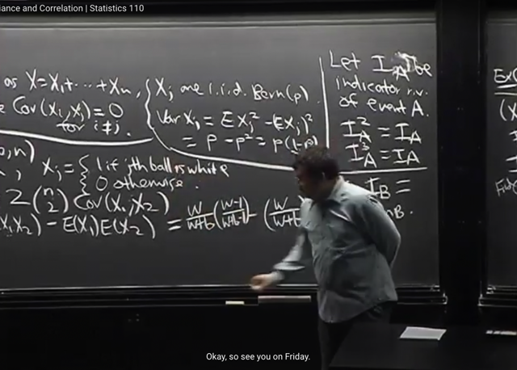</kbd></p>

🔗 **Related:** [TÓM TẮT:  Tiếp tục về CDF: Định nghĩa của CDF  Bước nhảy của CDFD là giá trị PMF tại đó  Tính chất của CDF: 1) Non decreasing, 2) right continuous và   3) F(x) -> 0 khi x -> -infinity, F(x) -> 1 khi x -> -infinity  - Định nghĩa Independent random variables theo independent event:  X, Y độc lập khi  + Continuous rv: P(X≤x, Y≤y) = P(X≤x) * P(Y≤y) với mọi x, y   + Discrete rv: P(X=x,Y=y) = P(X=x)*P(Y=y)  - Expected value: Là con số tóm tắt distribution của r.v  - Hai cách tính average  - E(X) = Σx x*P(X=x)  - X ~ Bern(p) thì E(X) = p  - FUNDAMENTAL BRIDGE: E(X) = P(A), X là indicator rv mang giá trị = 1 khi event A xảy ra và 0 khi ngược lại  - X ~ Bin(n, p):  E(X) = ∑ k=0,1..n [ k * (n choose k)*p^k*q^(n-k)] = ..= np  - TÍNH LINEARITY CỦA AVERAGE  - Tính lại E(X) của Bin(n, p) nhanh hơn bằng linearity, fundamental bridge và E(X) của Bern(p)  - TÍnh E(X) của Hypergeometric Dù các trial không độc lập nhưng dùng Symmetry, linearity, fundamental bridge vẫn tính được  - X ~ Geom(p): P(X=k) = q^k*p  - E(X) = p Σ k=0:infinity [k * q^k]](tóm_tắt_tiếp_tục_về_cdf_định_nghĩa_của_cdf_bước_nhảy_của_cdfd_là_giá_trị_pmf_tại_đó_tính_chất_của_cd.md#node-254)

🔗 **Related:** [LEC 21: COVARIANCE & CORRELATION](untitled.md#node-706)

> [!NOTE]
> `Var(X1)` thì có thể lập luận dùng `Var` của Bern(p) `=` **pq** (hồi nãy đã chứng minh lại)
> với p `=` `w/(w+b)`
>
> ```text
> Ta tính Cov(X1,X2) theo công thức, nó bằng E(X1X2) - E(X1)E(X2)
> ```
>
> ```text
> Với E(X1) = E(X2) do tính symmetry như lập luận ở trên nên Var(Xj) đều  bằng
> ```
> nhau thì, mọi `E(Xj)` cũng đều bằng nhau.
>
> Và `E(Xj)` là expected value của Bern(p) r.v với p là xác suất chọn được bi trắng `=`
> `w/(w+b).` (Vì sao Bern(p), vì đây vẫn là trial có hai possible value là trắng với xác
> ```text
> suất là p = w/(w+b) và đen với xác suất b/(w+b))
> ```
>
> Hoặc lập luận dùng fundamental bridge `E(Xj)` `=` P(Aj) thì `E(X1)` là bằng xác suất
> trial 1 success, hay, xác suất banh 1 bốc được trắng. Dựa vào naive definition
> ```text
> Sample space: w+b, Event space: w => P(A1) = w/(w+p)
> ```
>
> Vậy `E(X1)E(X2)` `=` P(A1)*P(A2) `=` **[w/(w+b)]^2**
>
> `====`
>
> Còn `E(X1X2)` ta sẽ dùng `I_A*I_B` đã nói hồi nãy, rằng nó chính là một indicator
> random variable của event [A ∩ B] có possible value là 1 (khi cả A và B
> cùng xảy ra) và 0 khi ngược lại
>
> Và tiếp tục dùng fundamental bridge: `E(X1X2)` `=` P(A1 ∩ A2). Theo naive definition
>
> i) Sample space: Tổng số cách chọn 2 trái banh 1,2: Step1: Chọn banh 1 có
> ```text
> (w+p)  possible outcome. Step 2: Chọn banh 2 có (w+p-1) => Theo step rule:
> ```
> **(w+p)*(w+p-1)**
>
> ii) Event space (số possible outcome mà banh 1 và 2 đều là trắng): `w*(w-1)` Step
> 1: Chọn banh 1 là trắng: w possible outcome. Step 2 chọn banh 2 là trắng: `w-1`
> possible outcome `=>` Theo step rule: **w*(w-1)
>
> Nên P(A1, A2) `=` `w*(w-1)` `/` [(w+p)*(w+p-1)]**

<br>

