# Lec 22: Transformations & Convolution

📊 **Progress:** `28` Notes | `34` Screenshots

---

<kbd>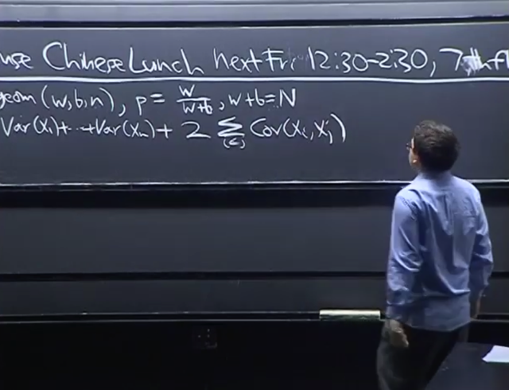</kbd>

<kbd>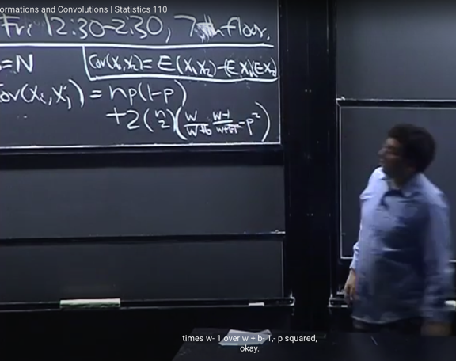</kbd>

<kbd></kbd>

<kbd></kbd>

<kbd>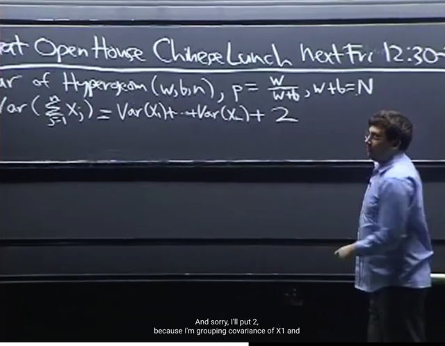</kbd>

> [!NOTE]
> Mở đầu gs review chút xíu và tiếp tục bài toán mà ta đang thảo luận là tính **variance** của **X ~** **Hypergeometric (w, b, n)**
>
> Vắn tắt review lại thì X có **story** là **số bi trắng** khi **bốc n bi** theo cách lấy ra **không hoàn lại** (sampling without replacement)
>
> Đặc điểm không hoàn lại khiến nó khác Binomial (n, p), vì nó khiến xác suất success của mỗi trial không giống nhau. Nếu
> mà CÓ hoàn lại, thì mọi lần bốc đều là Bern (p=w / (w+b)) và các trials sẽ có tính i.i.d). Tuy nhiên, ta nhớ là khi tổng số w+b
> tăng lên lớn hơn đáng kể khiến mỗi lần sampling không ảnh thay đổi mấy xác suất thành công thì khi đó Hypergeometric
> sẽ dần trở nên giống Binomial (Đây là điều mà ở slide sau gs sẽ nói)
>
> Thì như đã quen thuộc ta có thể biểu diễn nó ở dạng **tổng của n indicator random variables Xj** trong đó mỗi **Xj** **gắn với** 
> **event Aj** là lần bốc thứ j có ra bi trắng hay không (Tức **Xj=1 khi Aj occur** và **Xj=0 khi Aj không occur**) 
>
> Vậy thì **Var(X)** là **Var(∑ j Xj)**. Theo property (7), ta biết nó sẽ là: **Var(∑ j Xj)** = **∑ j Var(Xj) + 2*∑ i<j Cov(Xi, Xj)**
>
> Review lại, ta biết theorem rằng nếu các **Xi**, **Xj INDEPENDENT** thì **Cov(Xi, Xj) = 0**(quick review X,Y INDEPENDENT thì X,Y
> sẽ có tính chất E(XY) = EXEY mà ta đã chứng minh bằng 2D LOTUS bữa trước, từ đó Cov(X,Y) theo #Property 2 của Covariance, 
> sẽ = EXY - EXEY = EXEY - EXEY = 0) ..
>
> và dẫn tới **Variance** của **tổng** bằng **tổng** **variance: Var(∑ j Xj) = ∑ j Var(Xj)**
> Nhưng ở đây các event **KHÔNG INDEPENDENT**vì **xác suất success của mỗi event** sẽ **phụ thuộc vào kết quả của event trước**
>
> Tuy nhiên, yếu tố phụ thuộc này chỉ **phản ánh vào conditional probability**. Còn với unconditional probability, như đã phân tích
> ở bài trước, nó sẽ như nhau. Thể hiện bởi **tính symmetry giữa các event.**
>
> Do đó **mọi Xj đều có E(Xj) và Var(Xj) như nhau**. Cũng như **các Cov(Xi, Xj) đều bằng nhau**.
>
> Từ đó ta có Var(X) trở thành **n*Var(X1)** + **2*(n choose 2)*Cov(X1, X2)**
>
> Với Var(X1) thì lập luận là X1 là một Bern(p) r.v với p = w/(w+b). Nên Var(X1) = pq = n*Var(X1) = **npq**Còn Cov(X1X2) thì xem lại lập luận bữa trước (cuối bài 21)

 

<kbd>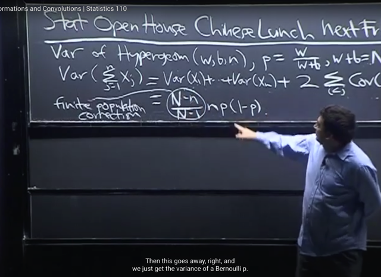</kbd>

🔗 **Related:** [LEC 27: CONDITIONAL EXPECTATION GIVEN AN R.V](untitled.md#node-852)

> [!NOTE]
> Và kết quả sau khi rút gọn các kiểu là **(N-n)/(N-1) npq**. Thế thì cái term **npq** nó 
> **chính là Variance của Binomial(n, p)**.
>
> Và (N-n)/(N-1) (N là w+b, là tổng số ball, n là số lần lấy)
>
> Thì cái này gọi là **FINITE POPULATION CORRECTION**Gs đề nghị ta check thử simple và extreme case để thấy ý nghĩa của nó:
>
> Với n = 1, thì cái này bằng 1. Và hoàn toàn dễ hiểu rằng, nếu chỉ**bốc 1 trái**
> banh thì sẽ k**hông khác gì giữa có hay không hoàn lại** (replacement). Khi đó
> **Hypergeometric giống y như Binomial**
> Với N lớn hớn rất nhiều lần so với n, thì khi đó tỉ lệ sẽ -> 1. Với ý nghĩa hoàn 
> toàn dễ hiểu rằng khi số lượng banh rất lớn so với số lần rút thì sẽ khó mà có việc
> một banh bị bốc hai lần trong Hypergeometric. Nên lúc này **Hgeom cũng gần như
> là giống Binomial**

> [!NOTE]
> **VARIANCE CỦA HYPERGEOMETRIC: (N-n/N-1) npq
>
> FINITE POPULATION CORRECTION = (N-n/N-1)**: KHI BỐC 1 TRÁI HOẶC KHI
> SỐ BANH RẤT NHIỀU THÌ CÓ HOÀN LẠI HAY KHÔNG HOÀN LẠI
> CŨNG GIỐNG NHAU => HYPERGEOMETRIC ~= BINOMIAL

 

<kbd>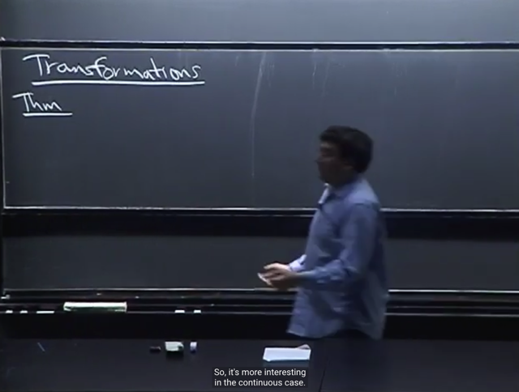</kbd>

> [!NOTE]
> Ta qua chủ đề quan trọng là **TRANSFORMATION**. Gs nói cái này thật ra ta
> đã biết  qua  rồi cụ thể là **LOTUS** giúp ta tính **expected value của g(X)**
> mà **không cần phải tìm PDF / PMF của g(X)** mà chỉ cần **dùng PDF / PMF 
> của X**.
>
> Tuy nhiên **LOTUS** cũng **chỉ giúp tính mean** của g(X) trong khi có thể **ta cần biết
> pdf/pmf** tức là biết **distribution** của g(X).

> [!NOTE]
> TRANSFORMATION: 
>
> Y =g(X) sẽ có PDF f_Y(y) = f_X(x) dx/dy = f_X(g_inv(y)) dx/dy

 

<kbd>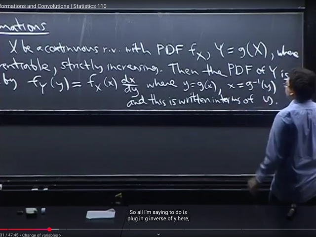</kbd>

<kbd></kbd>

<kbd>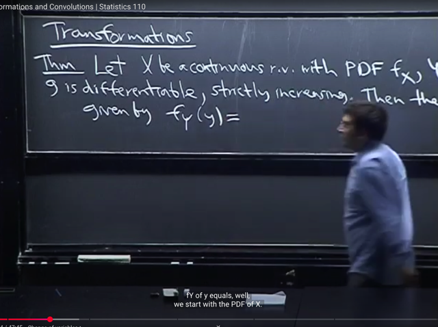</kbd>

> [!NOTE]
> Ok, **theorem** cho vấn đề này nói rằng: Nếu ta có **X** là (xét continuous case, discrete cũng
> tương tự) là r.v với **PDF f_X(x)**. Và ta quan tâm **Y = g(X)** (đương nhiên như đã biết function
> apply on random variable cũng là random variable)
>
> Trong đó **g là hàm** **differentiable** = tức là **khả vi** / có đạo hàm xác định trên mọi giá trị của x, và giả
> định thêm g(x) **strictly increasing**.
>
> Thì khi đó, **PDF của Y** sẽ được xác định là:
>
> **f_Y(y) = f_X(x)dx/dy**.
>
> Vì assumption như trên nên **có thể tìm g_inverse()** của g() để từ **y = g(x)** <=> **x = g_inv(y)**
> (apply g_inv() để đảo ngược lại từ y->x)
>
> Và vì **f_Y(y) là hàm theo y**, nên **f_X(x) dx/dy là hàm theo y**.
>
> Và để làm vậy ta sẽ thế **x = g_inv(y) vào f_X(x)** đ**ể nó trở thành hàm theo y**: f_X(g_inv(y))
>
> Còn **dx/dy** có thể hiểu là **đạo hàm của x đối với y** **cũng là hàm theo y rồi**

 

<kbd>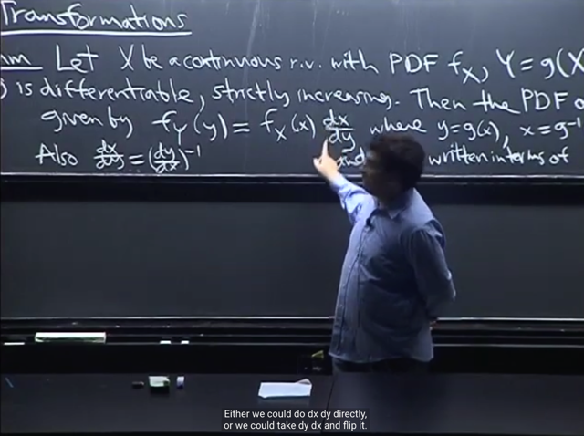</kbd>

> [!NOTE]
> Đại khái là theo chain rule thì **dx/dy = (dy/dx)^-1** . Nên gs cho rằng tùy vào việc
> cái nào dễ hơn thì ta dùng
>
> Ở đây gs nói chain rule tức là:
>
> ta có thể hiểu là **xét hàm** **f(x) = x**. Ta tính derivative của nó w.r.t x (đương nhiên)
> kết quả là 1. d**f/dx = d(x)/dx = 1**. 
>
> Theo chain rule: **df/dx = df/dy dy/dx = d(x)/dy dy/dx**
>
> Vậy d(x)/dy dy/dx = 1 => **dx/dy = 1/ (dy/dx) = (dy/dx)^-1**

 

<kbd>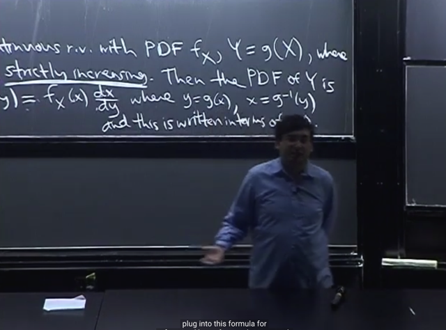</kbd>

> [!NOTE]
> Gs nhắc nhở ta rằng, trước khi áp dụng theorem này, phải đảm bảo g(x) thỏa
> assumption là **differentiable** và **strictly increasing**Ví dụ như Y= X^2 nếu xét cả X có thể âm thì **Y không strictly increasing**
> vì nó là parabola, có lúc giảm. Khi đó **phải dùng cách khác** chứ không áp
> dụng cái này để tìm pdf của Y được

 

<kbd>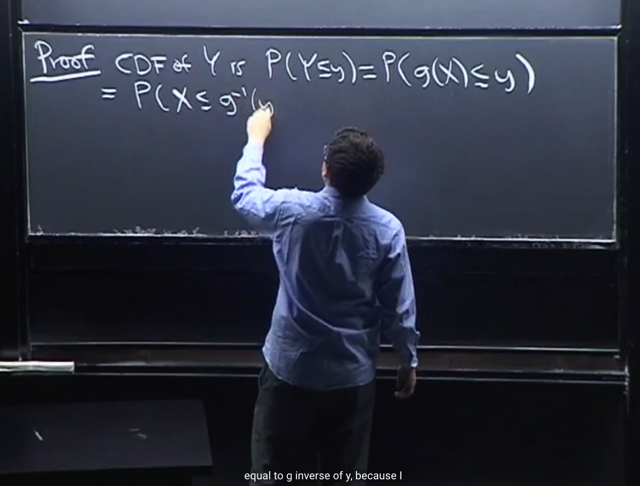</kbd>

> [!NOTE]
> Ta sẽ c**hứng minh theorem** này. Đơn giản là bằng cách **xây dựng CDF**
> để **lấy derivative để có PDF.**
>
> CDF của Y, như đã biết chính là **P(Y ≤ y)** với Y = g(X), thì nó bằng
> **P(g(X) ≤ y)**
>
> Tới đây, **g(X) ≤ y** sẽ tương đương (**apply g_inv()** cho hai vế, dựa trên
> cơ sở là vì g() strictly increasing thì g_inv() **cũng vậy - strictly increasing**.
>
> Ta có thể nghĩ đến việc **dx/dy** =**(dy/dx)^-1** để hiểu rằng nếu **dy/dx = dg(x)/dx**
> luôn **dương** vì g strictly  increasing thì suy ra**dx/dy cũng luôn dương** => hàm
> x(y) = g_inv(y) **cũng strictly increasing**)
>
> Tóm lại **g(X) ≤ y ⇔ g_inv(g(X)) ≤ g_inv(y)**
>
> ⇔ **X ≤ g_inv(y)**
>
> Việc các equation trên tương đương mang ý nghĩa chúng (các event) là một
> nên: **P(g(X) ≤ y) = P(X ≤ g_inv(y))**Nếu chưa thỏa mãn thì giải thích theo Casella:
> ****Với Y = g(X) thì event Y ≤ y ⇔ g(X) ≤ y
>
> Hiểu về event g(X) ≤ y như sau: {s ∈ S: g[X(s)] ≤ y} vì X bản chất chỉ là function
> map possible outcome trong sample space S với range của X: R
>
> Vì g là strictly increasing nên: 
>
> g[X(s)] ≤ y ⇔ g_inv(g[X(s)]) ≤ g_inv(y) ⇔ X(s) ≤ g_inv(y)
>
> Do đó {s ∈ S: g[X(s)] ≤ y} = {s ∈ S: X(s) ≤ g_inv(y)} và vế phải chính là (X ≤ g_inv(y))
>
> ⇨ P{s ∈ S: g[X(s)] ≤ y} = P{s ∈ S: X(s) ≤ g_inv(y)}
>
> Vậy P(Y ≤ y) = P(g(X) ≤ y) có bản chất là P{s ∈ S: g[X(s)] ≤ y} 
>
> sẽ bằng với P{s ∈ S: X(s) ≤ g_inv(y)} = P(X ≤ g_inv(y))
>
> Vậy P(Y ≤ y) = P(X ≤ g_inv(y))
>
> ====
>
> Hoặc giải thích theo Casella dùng sample space của X và Y thay vì sample space gốc:
>
> P(g(X) ≤ y) = PX({x ∈ RX: g(x) ≤ y}) 
>
> mà g(x) ≤ y ⇔ x ≤ ginv(y) ⇨ {x ∈ RX: g(x) ≤ y} = {x ∈ RX: x ≤ ginv(y)} và vế phải chính
> là (X ≤ ginv(y)) ⇨ P(Y ≤ y) = P(g(X) ≤ y) = P(X ≤ ginv(y)).

 

<kbd>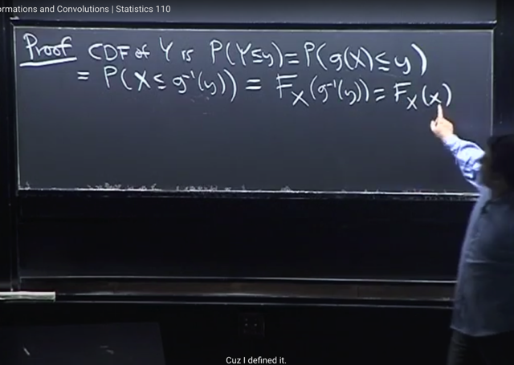</kbd>

> [!NOTE]
> Thế thì ta biết **P(X ≤ x) là CDF của X**, F(x), hay ghi rõ **F_X(x)** để cho
> biết nó là CDF của X.
>
> Nên **P(X ≤ g_inv(y))** chính là **CDF** của X **evaluate tại g_inv(y)**, hay:
>
> **F_X(g_inv(y))**
>
> Và với **x = g_inv(y)** thì **F_X(g_inv(y))** = **F_X(x)**

> [!NOTE]
> CHỨNG MINH THEOREM TRANSFORMATION

 

<kbd>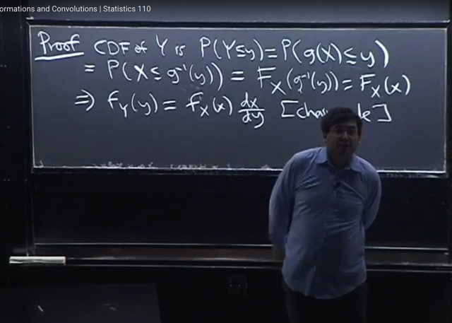</kbd>

> [!NOTE]
> Và tới đây, ta sau khi đã có CDF của Y là **F_X(g_inv(y))** (thể hiện theo biến y) hoặc
> **F_X(x)** (thể hiện theo biến x):
>
> F_Y(y) = F_X(g_inv(y))
>
> Và đương nhiên **để có PDF của Y**, ta phải **lấy đạo hàm theo y**
>
> Hoặc để cho rõ hơn ta có thể dùng F_X(g_inv(y)) luôn
>
> PDF của Y là**đạo hàm của F_X(g_inv(y)) đối với y**: 
>
> **f_Y(y) =** **d/dy F_X(g_inv(y))**
>
> Theo **chain rule** nó sẽ là: d [F_X(g_inv(y))] / d [g_inv(y)] * d [g_inv(y)] / dy
>
> d [g_inv(y)] / dy chính là **dx/dy**
>
> d [F_X(g_inv(y))] / d [g_inv(y)] chính là **dF_X(x) /dx** và nó chính là **PDF của X: f_X(x)**
>
> Nên kết quả là:**f_Y(y) = f_X(x) dx/dy, thể hiện theo y = f_X(ginv(y) dx/dy**
>
> ====
>
> Ôn lại một chút, theo **Fundamental Theorem of Calculus Part 2** quy định rằng: 
>
> Nếu ta có **hàm f** và gọi **F(x) = ∫-inf:x f(t)dt** thì FTC2  nói rằng: 
>
> Thì **F là nguyên hàm của f**, **đạo hàm của F(x) theo x sẽ bằng f(x): F'(x) = f(x)**
>
> Với **CDF**, và **PDF** cũng có **quan hệ tương tự**: cho rằng r.v **X có pdf là f_X**. Thì
> CDF của X, evaluate tại x được định nghĩa là :
>
> **F_X(x) =** **∫-inf:x f_X(t)dt**
>
> Thành ra **F là nguyên hàm của f** và theo FTC ta có **F_X'(x) = f_X(x)**  
>
> Hay để tìm hàm f, tức pdf củaX. Ta sẽ lấy đạo hàm của CDF theo x
>
> Vậy thì như đã lập luận, đến đây ta tìm được hàm **CDF của Y** là: 
>
> F_Y(y) = **F_X(g_inv(y))** 
>
> Thì **để có PDF của Y** **đương nhiên phải lấy đạo hàm của nó theo y**: 
>
> F_Y'(y) = f_Y(y) hay d/dy [ F_Y(y)] = f_Y(y) 
>
> Và dùng chain rule để làm bằng cách đặt**x = g_inv(y)** thì đạo hàm theo y sẽ là tích của
> **[đạo hàm của F_X theo x]** (part1) * **[đạo hàm của x theo y]** (part 2)
>
> Part1: Thế thì **F_X vốn là CDF của x**, nên **lấy đạo hàm theo x** thì nó thì đương nhiên
> ta có  **PDF của X tức f_X(x)**.
>
> Part 2: thì ta có d**x/dy**
>
> Vậy PDF của Y **f_Y(y) = f_X(x) dx/dy**

 

<kbd>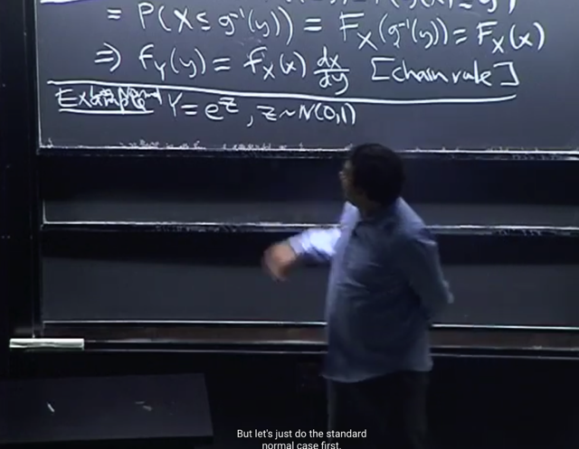</kbd>

> [!NOTE]
> ta sẽ qua một ví dụ. Đó là **log normal**. Với lưu ý **không phải là log của
> (normal r.v)** vì **KHÔNG THỂ LẤY LOG CỦA SỐ ÂM**.
>
> Mà phải hiểu là**sau khi lấy log** của r.v thì **ta được r.v tuân theo normal
> distribution**

> [!NOTE]
> LOG NORMAL

 

<kbd>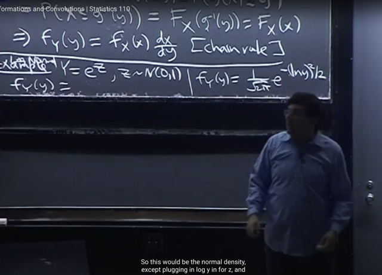</kbd>

> [!NOTE]
> Thế thì đầu tiên ta nhận xét **g(Z) = e^Z** là một function **liên tục** và **strictly**
> **increasing**. Nên ta **được phép dùng** Theorem Transformation
>
> Đó là **f_Y(y) = f_Z(z) dz/dy** có điều như gs đã nói là ta phải thay **z = g_inv(y)** vì
> đang xây dựng**f_Y(y) là hàm theo y.**
>
> Thế thì Y = e^Z thì **Z = ln(Y)**. 
>
> Và **f_Z(z)** là PDF của Z là một **Standard Normal N(0,1)** ta đã biết pdf của nó 
> **f_Z(z) = (1/√2π) e^(-z^2/2)**
>
> Thay z = ln(y) ta có f_Z(g_inv(y)) = **(1/√2π) e^[(-ln(y^2)/2]**

 

<kbd>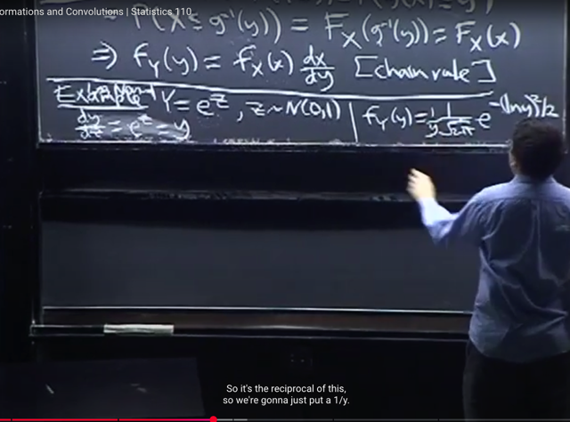</kbd>

> [!NOTE]
> Còn **dz/dy** thì như đã biết ta có thể thay bằng **(dy/dz)^-1**
> và **dùng cái nào dễ thì dùng**.
>
> Dễ thấy tính dy/dz dễ hơn, vì y = e^z thì **dy/dz = e^z = y**
>
> Vậy (dy/dz)^-1  = **1/y
>
> Kết quả f_Y(y) = (1/y)(1/√2π) e^[(-lny^2)/2]  với y>0**

 

<kbd>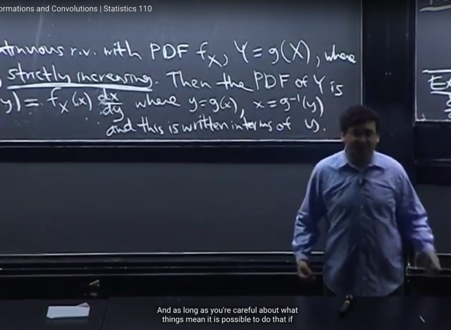</kbd>

> [!NOTE]
> gs nói thêm là **để mà nhớ là phải nhân dx/dy hay dy/dx** thì ta có thể nhớ
>
> **f_Y(y)dy = f_X(x)dx** dù việc **tách dy, dx kiểu này không được phép**
> nhưng **miễn là ta hiểu** là mình đang dùng nó như cách để dễ nhớ là
> được

 

<kbd>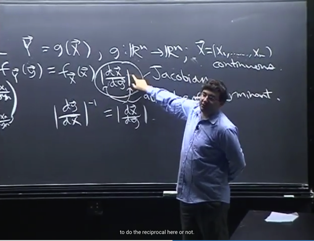</kbd>

<kbd></kbd>

<kbd>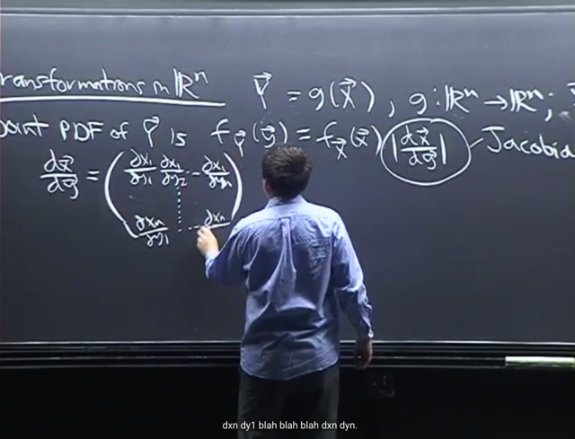</kbd>

🔗 **Related:** [LEC 25: ORDER STATISTIC & CONDITIONAL EXPECTATION](untitled.md#node-774)

> [!NOTE]
> Tiếp theo là ta sẽ đại khái là mở rộng với **n dimensions**. cho vector **Y = g(X)** với **Y, X** là **n-dimensional**
> **vector**.
>
> X**= [X1, ...Xn]** với các **Xj là continuous r.v**. Như đã biết, ta sẽ có **JOINT** distribution của **n random variable**
> **Xj** tức là có **Joint PDF của vector X**.
>
> Thế thì ta cần, **tìm JOINT PDF của vector Y**. Thì hoàn toàn tương tự, **theorem** **transformation** cho phép:
>
> **f_Y(y) = f_X(x) |dx/dy|** với x, y là Rn vector
>
> Ở đây gs lưu ý ta là nếu như hàm g **không strictly decreasing**, thì ta sẽ **lấy giá trị tuyệt đối của
> dx/dy**. Vì khi đó, dy/dx âm, tức dx/dy cũng âm. Và vì ta đang tính PDF nên không thể âm được
>
> Thế thì. Vấn đề là, **với x, y là Rn vector**, **dx/dy chính là Jacobian** - là **matrix của các partial derivative** của
> x đối với y mà như ta đã **biết mỗi hàng là partial derivative** của **một component của x** đối với **mọi
> component của y.**
>
> Và thế thì sẽ **không make sense** khi **tự nhiên lại nhét một cái matrix ở đây**. Nên ở đây, chính là **GÍA TRỊ
> TUYỆT ĐỐI CỦA DETERMINANT** của matrix **J**. Gs nói ta **có một matrix** thì cách để **compress** nó thành
> **một number** là dùng **det**. Có nghĩa là mình phải hiểu có hai dấu **||... ||**, một cái là để nói về **det**, và cái kia là
> dấu **trị tuyệt đối**
>
> Và y như việc ta có thể dùng dx/dy hoặc (dy/dx)^-1 thì ở đây cũng vậy. Ta **cũng có thể lấy matrix Jacobian**
> **dy/dx** là **tính det** và lấy ^-1 (reciprocal)
>
> Nhớ lại 1806 một chút: det(I) = det(AinvA) = det(A)det(Ainv) = 1 => **det(Ainv) = 1/det(A)**

 

<kbd>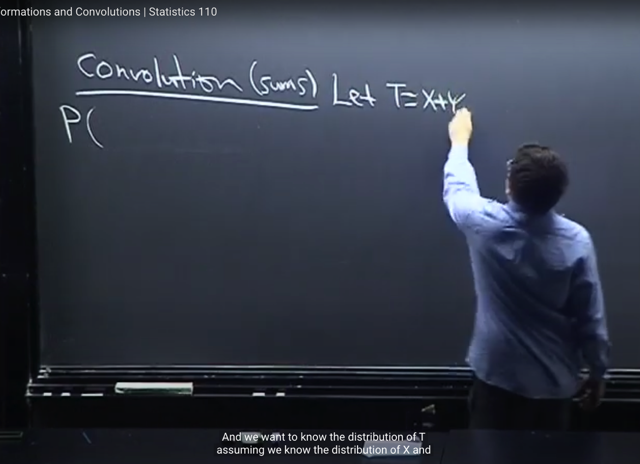</kbd>

🔗 **Related:** [LEC 17: MOMENT GENERATING FUNCTIONS](untitled.md#node-538)

> [!NOTE]
> gs tiếp tục với **Convolution** mà ông cho rằng nó chỉ là một **từ hào nhoáng của
> Sum**. 
>
> Và những bài trước ta đã dùng / **nhờ MGF** để vận dụng một theorem
> của nó là **nếu X, Y independent thì MGF của (X+Y)** bằng **tích của MGF của
> từng cái:** 
>
> **M_(X+Y)(t) = M_X(t) * M_Y(t)** 
>
> để rồi giúp ta**tìm distribution của sum X+Y**
>
> Nhưng **đôi khi ta không thể dùng MGF**, khi đó ta cần một cách tiếp cận khác

> [!NOTE]
> CONVOLUTION: SUM OF
> RANDOM VARIABLES

 

<kbd>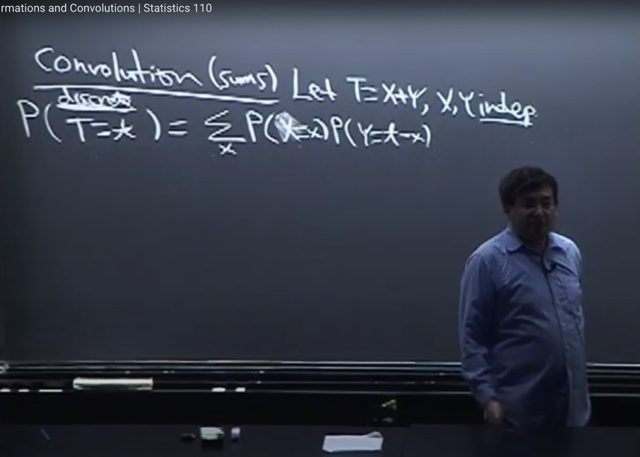</kbd>

> [!NOTE]
> Thế thì **gọi T là X+Y**, X,Y là hai r.v Independent mà ta **đã biết
> distribution**. Xét bài toán này trong **discrete** case.
>
> Thì **PMF của T**: ta lập luận như sau: Có thể coi như, mà thật ra chính là
> dùng **Law of Total Probability** mà bản chất vẫn là từ lập luận sau:
>
> **T = t**tức **X+Y = t.**
>
> Event này là **Union của (X=x, Y=t-x) với mọi x**. Có nghĩa  là với mỗi
> possible value của X, ta có event (X=x, Y=t-x) thì chúng là các **disjoint**
> events và Union của tất cả các event này tạo thành event X+Y = t (again, ta
> đã lập luận này nhiều lần, và điều trên dựa trên cơ sở Set theory)
>
> (T=t) = (X+Y= t) 
>
> (T=t) = {s ∈ S: T(s)=t} = {s ∈ S: X(s) + Y(s) = t} = {s ∈ S: Y(s) = t - X(s)}
>
> Mà {s ∈ S: Y(s) = t - X(s)} ⊂ {s ∈ S}
>
> ⇨ {s ∈ S: Y(s) = t - X(s)} = {s ∈ S: Y(s) = t - X(s)} ∩ {s ∈ S}
>
> = {s ∈ S: Y(s) = t - X(s)} ∩ [∪ mọi x {s ∈ S: X(s) = x}]
>
> = ∪ mọi x [ {s ∈ S: Y(s) = t - X(s)} ∩ {s ∈ S: X(s) = x} ]
>
> = ∪ mọi x [ {s ∈ S: Y(s) = t - X(s), X(s) = x]
>
> = ∪ mọi x (Y = t - X, X = x)
>
> **P(T=t)** = **P(Union của (X=x, Y = t-x)** với mọi x) (vì hai event này là 1)
>
> Vì ta có Union của các Disjoint event nên theo Axiom 2:
>
> = **∑ x P(X=x, Y=t-x)** (theo Axiom 2)
>
> Mà **X và Y independent** nên **(X=x) và (Y=t-x) là các event độc lập** nên theo
> conditional probability theorem:
>
> **P(X=x, Y=t-x) = P(X=x) * P(Y=t-x)**
>
> Vậy **P(T=t) = ∑ x P(X=x) * P(Y=t-x)**

 

<kbd>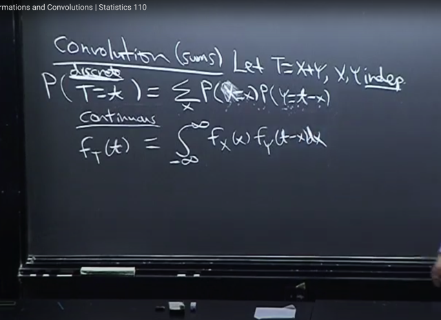</kbd>

> [!NOTE]
> Và đó là ta**đã có PMF của X+Y**
>
> Thế thì **nếu X,Y continuous** ta có thể viết phiên bản continuous tương
> đương của discrete case, để có PDF của T f_T(t)
>
> **f_T(t) = ∫-inf:inf của f_X(x)f_Y(t-x)dx**

 

<kbd>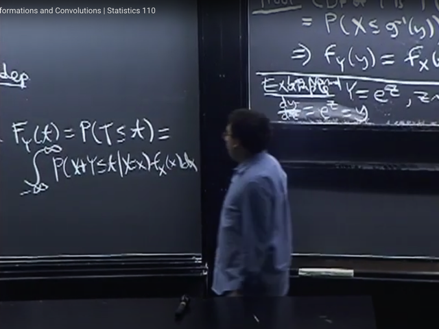</kbd>

> [!NOTE]
> Tuy nhiên đó là ta chỉ ghi ra phiên bản tương đương, chứ **chưa thể coi nó là
> chứng minh cho trường hợp continuous** (với discrete, ta đã chứng minh)
>
> Vậy thì ta sẽ **chứng minh nó như sau**. Cũng **đi từ CDF của t**:
>
> **F_T(t) = P(T<=t)** 
>
> <=> F_T(t) = **P(X+Y<=t)** (trên bảng gs viết sai là F_Y(t) lúc sau có sửa lại)
>
> Ta cũng lập luận từ gốc như vừa rồi: Đầu tiên quay lại **giả sử X,Y discrete**
>
> **(X+Y<=t) = Union của (X+Y<=t, X=x) với mọi possible value x** của X
>
> Và đây là Union của các **Disjoint** event, nên theo **axiom 2** ta cũng có:
>
> **P(X+Y<=t) = ∑ x P(X+Y<=t, X=x)**
>
> Theo conditional probability theorem: P(X+Y<=t, X=x) = P(X+Y<=t | X=x)*P(X=x)
>
> **P(X+Y<=t) = ∑ mọi x P(X+Y<=t | X=x)*P(X=x)**
>
> Thì phiên bản tương đương khi X, Y continuous là:
>
> **P(X+Y<=t)** = **∫-inf:inf P(X+Y<=t | X=x) f_X(x)dx (1)**(Cũng là dùng phiên bản discrete để công nhận / suy ra phiên bản continuous, 
> nhưng ở đây là ta chỉ đang làm với P(X+Y <= t), ý là ta có công thức của nó 
> trong discrete case nên có thể suy ra trong continous case. Còn ở trên, thì 
> không thể dùng discrete case, tức PMF để chứng minh / suy ra PDF được)
>
> Vả lại, ta bắt đầu với P(X+Y<=t) của discrete case là để cho dễ hiểu, hiểu ý nghĩa
> của nó, chứ**THẬT RA LAW OF TOTAL PROBABILITY CHO PHÉP NGAY LẬP
> TỨC TA CÓ THỂ DÙNG (1) như cách mà gs Blizstein đang làm**

 

<kbd>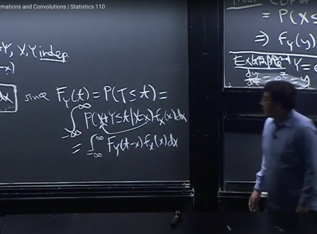</kbd>

> [!NOTE]
> Tiếp theo, ta gặp lại một động tác đã từng gặp trước đây.
>
> Vì **X+Y ≤ t | X=x** có nghĩa là **X+Y ≤ t** dựa trên (conditioned on)**X=x**. 
>
> Nên với **X=x**, ta có thể**thay vào X+Y ≤ t** để có (**x+Y ≤ t | X=x**) 
>
> **P((X+Y ≤ t | X=x) = P(x+Y ≤ t | X=x)**
>
> Giải thích theo sample space gốc là thấy dễ hiểu
>
> (X+Y ≤ t | X = x) đơn giản chỉ là event {s ∈ {s ∈ S: X(s) = x}: X(s) + Y(s) ≤ t} 
> với ý nghĩa là {s ∈ S: X(s) = x} đã xảy ra rồi, nên nó trở thành sample space 
>
> Và {s ∈ {s ∈ S: X(s) = x}: X(s) + Y(s) ≤ t} 
>
> thì dĩ nhiên = {s ∈ {s ∈ S: X(s) = x}: x + Y(s) ≤ t} 
>
> và vế phải chính là (x + Y ≤ t | X = x)
>
> Và vì X, Y **independent** nên gs như đã nói bữa trước cho biết ta có thể bỏ
> phần condition đi luôn 
>
> (Ôn nhanh: vì P(A|B) = P(A,B) / P(B) = P(A)P(B)/P(B) do A, B độc lập, = P(A)
>
> để trở thành **P(x+Y ≤ t)** với ý nghĩa là: 
>
> **nếu chưa biết X** thì **X+Y ≤ t còn phụ thuộc X**, còn **khi đã biết X rồi**, và v**ì Y 
> cũng không phụ thuộc X** nên **x+Y ≤ t không còn phụ thuộc X** nữa
>
> ===
>
> Tóm lại là ta có P(x+Y ≤ t | X=x) = P(x+Y ≤ t)
>
> **= P(Y ≤ t-x)** 
>
> Theo định nghĩa của **CDF** thì **P(Y ≤ t-x)** chính là hàm **CDF của Y evaluate tại t-x**
> tức **F_Y(t-x)**
>
> Đến đây ta sẽ**thay P(X+Y ≤ t | X=x) = F_Y(t-x) vào (1)** ta có: 
>
> **P(X+Y ≤ t) = ∫-inf:inf F_Y(t-x) * f_X(x)dx**

 

<kbd>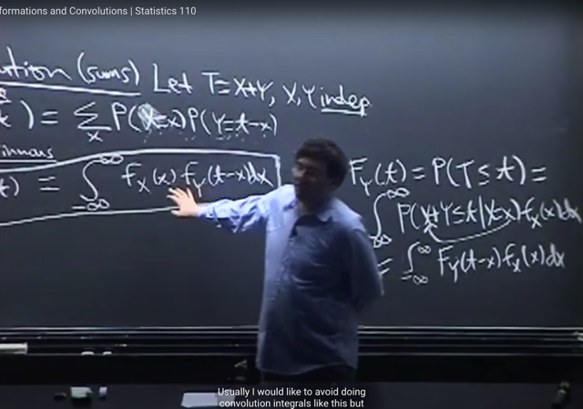</kbd>

🔗 **Related:** [LEC 20: MULTINOMIAL AND CAUCHY](untitled.md#node-674)

> [!NOTE]
> Và đến đây ta sẽ **lấy derivative** của cái này **theo t** để có **PDF của T**.
>
> Thì như đã biết với một số điều kiện một **function well behave** (**continuous**,
> **differentiable**, xem link xanh) thì **đạo hàm của tích phân** có thể **đưa đạo hàm
> vào tích phân**
>
> Khi đó vế trái lấy đạo hàm theo t của F_T(t) ta sẽ có PDF của T: 
>
> d/dt F_T(t) = **f_T(t)** 
>
> Vế phải sẽ là **d/dt  [ tích phân -inf:inf F_Y(t-x) * f_X(x)dx]**
>
> = tích phân -inf:inf { **d/dt [ F_Y(t-x) * f_X(x) ]**} * dx 
>
> Tính **d [ F_Y(t-x) * f_X(x) ] / dt** 
>
> Vì f_X(x) không phụ thuộc y, coi như constant, đưa ra ngoài)
>
> nên = **f_X(x)** * d [ F_Y(t-x) ] / dt
>
> Còn **d [ F_Y(t-x) ] / dt**  = d F_Y(t-x) / d(t-x) * d(t-x) / dt (chain rule)
>
> = f_Y(t-x) * 1 = **f_Y(t-x)**
>
> (Tại sao d F_Y(t-x) / d(t-x) lại là f_Y(t-x)?
>
> Vì theo FTC part 1: cho f là hàm liên tục trên [a, b] thì nếu định nghĩa 
> F(x) = ∫a:x f(t)dt = F(x) với mọi x thuộc [a, b] thì khi đó: 
>
> **F'(x) = f(x)** với mọi x, và cái này tương đương **d F(x) / dx = f(x)** 
>
> Thế thì theo định nghĩa CDF: CDF của r.v Y **F_Y(a)** với ý nghĩa là **P(Y<=a)** 
> sẽ là **∫-inf:a f_Y(t)dt**.
>
> Do đó theo FTC part 1, ta có **d F_Y'(a) / da = f_Y(a)**
>
> chính là **PDF của Y** evaluate tại t-x = **f_Y(t-x))**
>
> Vậy kết quả là **tích phân -inf:inf [ f_X(x) * f_Y(t-x) * dx ]**

 

<kbd>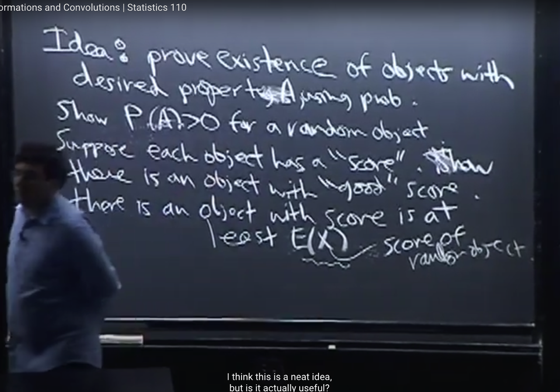</kbd>

> [!NOTE]
> Đại khái bài toán là, **chứng minh sự tồn tại của một object** với tính
> chất mong muốn A.
>
> Thế thì điều này sẽ có nghĩa là **ta cần chứng minh P(A) > 0.**
>
> Cách làm đó là, cho rằng mỗi object có một điểm số đánh giá liệu
> nó có property A không. Thì ta sẽ đánh giá điểm trung bình EX. Nếu
> nó lớn hơn một mức độ nào đó đủ để gọi là có property A thì ta có
> thể suy ra tồn tại ít nhất một object có điểm sế từ EX trở lên,
> từ đó chứng minh xong.

 

<kbd>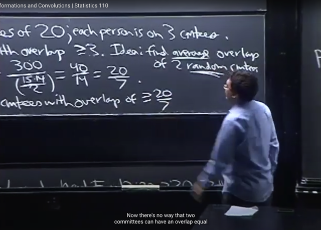</kbd>

<kbd>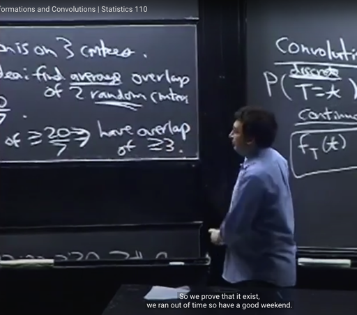</kbd>

<kbd></kbd>

<kbd></kbd>

<kbd>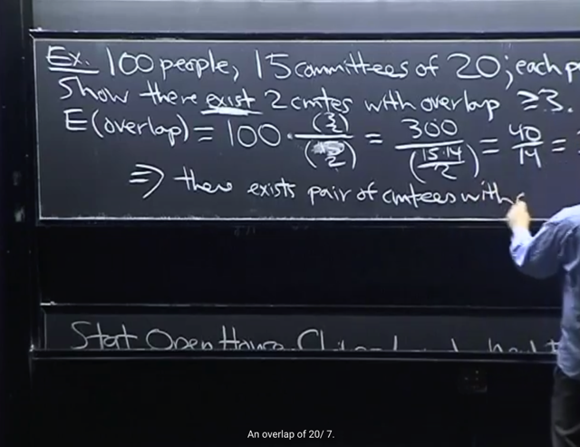</kbd>

> [!NOTE]
> bài toán này sẽ làm ví dụ cho Thoerem vừa rồi: Có 100 người, ta tạo 15 nhóm mỗi nhóm 20 người, (mỗi
> người nằm trong 3 nhóm). Chứng minh tồn tại 2 nhóm trùng nhau 3 người trở lên.

> [!NOTE]
> Chưa hiểu lắm và có vẻ nội dung này có thể không quá quan trọng. Quay lại sau

 

