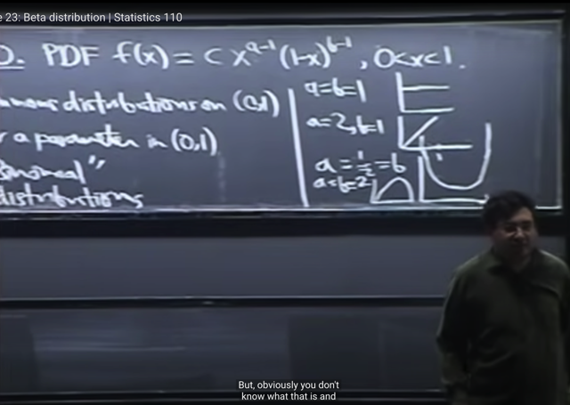
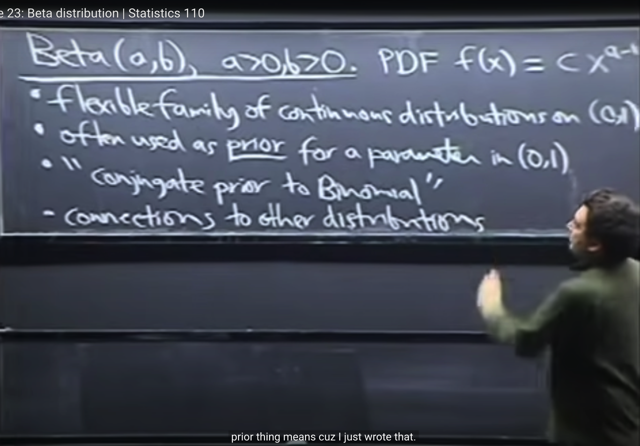
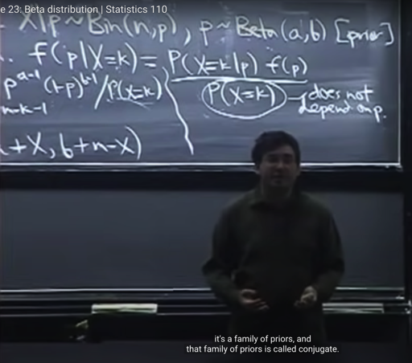
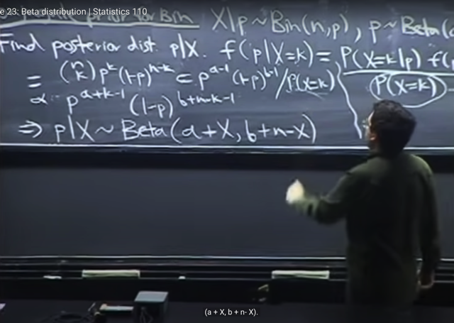
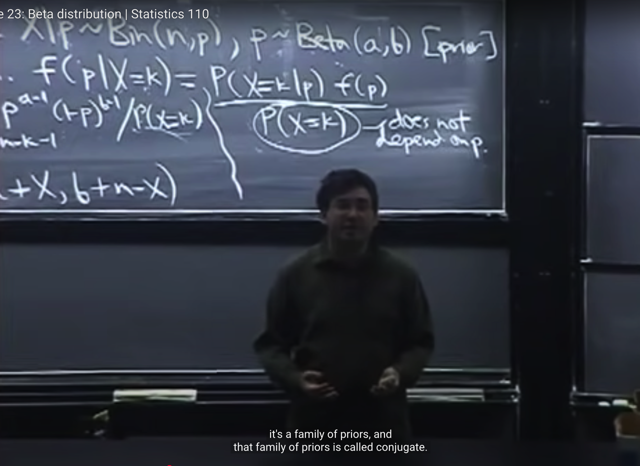
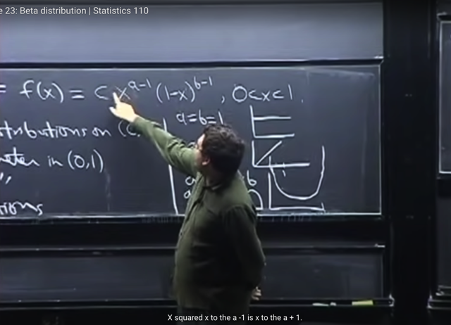
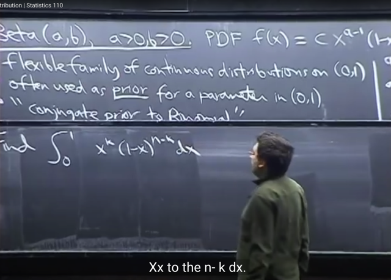
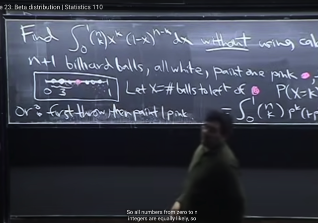

# Lec 23: Beta Distribution

📊 **Progress:** `15` Notes | `16` Screenshots

---

<kbd></kbd>

> [!NOTE]
> Bài này ta sẽ làm quen với **Beta** distribution. Đại khái là ta đã biết
> **Uniform** distrib là**cách duy nhất đến giờ** vừa **continuous** vừa **giới
> hạn trong một đoạn [0,1]**. (những cái khác như **Normal** (-inf:inf), **Expo**
> (0:inf) đều **không bị giới hạn**
>
> Và Beta là một distribution nữa mà giá trị **cũng nằm trong đoạn [0,1]**
> nhưng**ko flat**như Uniform (0,1)
>
> ta hiểu khi gs nói Beta có giá trị trong [0,1] có nghĩa là **chỉ khi X trong đoạn này
> thì hàm pdf mới có giá trị khác 0**, ngoài đoạn này thì hàm pdf = 0

 

<kbd></kbd>

> [!NOTE]
> Beta PDF có công thức như vầy **f(x) = c*x^(a-1)*(1-x)^(b-1).** 
>
> Nó sẽ **tỉ lệ thuận với x^(a-1)** và **(1-x)^(b-1)**. 
>
> Và constant **c** là **normalizing** constant. Có vai trò giúp **tích phân từ -inf:inf 
> f(x) dx = 1**.
>
> Và khi ta lấy tích phân này, nó sẽ là **một function nổi tiếng** trong toán học,
> gọi là **Beta** function
>
> Gs nói thêm cũng như các distribution khác, luôn có **story** của nó. Thì 
> ta sẽ nói về story của Beta sau, và nó có nhiều story

> [!NOTE]
> PDF của Beta: f(x) = c*x^(a-1)*(1-x)^(b-1)

 

<kbd></kbd>

<kbd></kbd>

<kbd></kbd>

> [!NOTE]
> Đại khái là gs nói qua về **một số ưu điểm** của Beta.
>
> Beta với **các giá trị tham số khác nhau** có thể **tạo thành một gia đình** nhiều function khác nhau **linh hoạt**để
> **thể hiện nhiều distribution khác nhau**. Có thể thấy hình ảnh gs minh họa cho thấy điều này.
>
> Ví dụ khi **a=b=1** thì nó **trở thành Uniform**. 
>
> Với **a=2, b=1** thì nó là **tuyến tính theo X**
>
> Chính vì vậy mà nó hay **ĐƯỢC CHỌN LÀ DISTRIBUTION CHO PARAMETER**của distribution.
>
> Ví dụ như khi làm qua **Laplace** problem, trong đó ta cũng gặp **một Bern(p)** với **p** **chưa biết**. Và ta**COI p** **NHƯ**
> **MỘT RANDOM VARIABLE** và dùng **distribution của p** để **thể hiện sự không chắc chắn**.
>
> Thế thì **ban đầu** thì người ta sẽ **chọn một distribution nào đó** để thể hiện **niềm tin ban đầu** nào đó. Thì
> Beta với **tính flexible**nói trên hay được chọn. Sau đó **dùng Bayes rule** để xây dựng /**update distribution**
> của p**dựa trên data**. Đây cũng là lí do cách tiếp cận này gọi là**BAYESIAN STATISTIC**
>
> Ta sẽ biết về khái niệm **CONJUGATE PRIOR TO BINOMIAL**
>
> Cuối cùng là nó có liên hệ với các distrib khác.

> [!NOTE]
> BAYESIAN STATISTIC

 

<kbd></kbd>

<kbd></kbd>

<kbd></kbd>

> [!NOTE]
> đại khái là gs sẽ dùng ví dụ này để ta hiểu tính chất **Conjugate prior for Binomial.**
>
> Cho **r.v X|p ~ Bin(n, p)** mang ý nghĩa như đã từng thấy, là **nếu biết giá trị của p**, thì **X sẽ là
> Bin(n, p) r.v.**
>
> Vậy thì c**họn Beta là prior distribution của p**. Ta sẽ **dựa vào Bayes rules** mà bữa trước trong
> bài toán **Laplace succession,** gs cũng có nói rằng **khi "coi" pdf như xác suất** thì ta **có thể áp**
> dụng **Bayes rules**.
>
> **f(p|X=x)** là **POSTERIOR** **distribution của p**, mang ý nghĩa là **khi đã biết giá trị của X**, **thì đây là
> PDF của p**. (vì p là continuous, nên đương nhiên ta có PDF). Còn như đã nói,**f(p)** là**PRIOR
> PDF** - **distribution của p khi chưa biết giá trị của X**, mà ta **chọn là Beta(a, b)**
>
> Thế thì**theo Bayes rule**: **f(p|X=x)** = **P(X=k|p) * f(p)** / **P(X=k)**
>
> Thì trong đây **P(X=k|p)** gs cho biết là **function phụ thuộc p** (vì p chưa biết) nhưng **P(X=k)** thì
> **đã integrate mọi possible value của p rồi**. Không còn depend on p nữa.
>
> ===
>
> Vậy thì, **P(X=k|p) là PDF của X|p**, mà X|p như đã nói, mang ý nghĩa là khi đã biết p thì X sẽ 
> là một Bin(n, p), tức X|p ~ Bin(n, p). 
>
> Và PMF của một **r.v ~ Bin(n, p)** ta đã biết sẽ là **(n choose k)*p^k*q^(n-k)**
>
> ===
>
> Còn **f(p)** là **prior** distribution của p, **chọn** **dùng** **Beta** có PDF f(p) = **c*p^(a-1)*(1-p)^(b-1)**
>
> ===
>
> Còn **P(X=k)** gs nói tuy ta **có thể dùng Law of Total Probability** để **conditioned on** **mọi possible**
> **value** của p như đã làm nhiều lần. 
>
> Đại khái là, để cho dễ lập luận, ta giả sử p là discrete luôn, khi đó  (X=k) = U {mọi p_i} (X=k, p=p_i) 
> (union mọi p_i là các possible value của p). 
>
> Nên P(X=k) = P[U {mọi p_i} (X=k, p=p_i)]. Tiếp, event bên phải là Union của n **Disjoint** events, áp dụng
> **Axiom** 2: P[U {mọi p_i} (X=k, p=p_i)] = ∑i P(X=k, p=p_i). 
>
> Áp dụng conditional event theorem: P(A,B) = P(A|B)P(B): 
>
> ∑p_i P(X=k, p=p_i) = ∑p_i P(X=k|p=p_i)*P(p=p_i)
>
> Vậy **P(X=k) = ∑p_i P(X=k|p=p_i)*P(p=p_i)**
>
> Từ đâu ta có phiên bản tương đương khi p là continuous r.v: **P(X=k) = ∫0:1 P(X=k|p)f_p(p)dp**(limit chỉ có từ 0 đến 1 vì p có prior distribution là Beta, cũng giống như Uniform, chỉ có pdf khác 0 
> trong đoạn [0, 1] ****===
>
> Nhưng ta có thể làm **cách khác**.
>
> Đó là **chuyển sang dấu tỉ lệ thuận** để rồi có thể **chỉ xét những term phụ thuộc p** (là những chữ
> in đậm ở dưới đây)
>
> f(p|X=k) = P(X=k|p) f(p) / P(X=k) = (n choose k)***p^k*q^(n-k)** * c***p^(a-1)*(1-p)^(b-1)** / P(X=k)
>
> ~  **p^k*q^(n-k)*p^(a-1)*(1-p)^(b-1) = p^k*p^(a-1)*q^(n-k)*q^(b-1)**
>
> Khi đó ta thấy (sau khi gom lại) chỉ còn **p^(a+k-1)*q^(b+n-k-1**) (nhớ là ta luôn gọi q = 1-p)
>
> Thế thì kết quả trên **CÓ DẠNG CỦA MỘT BETA r.v với PDF 
>
> = (normalizing constant c) p^(A-1)(1-p)^(B-1)**với parameters là**A = a+k** = **a+X** (vì X=k, k là một possible value của X) và **B = b+n-k = b+n-X**. 
>
> Còn n**hững term không liên quan đến p** mà ta bỏ đi khi thay dấu bằng bằng dấu tỉ lệ thuận **sẽ** 
> **tham gia vào làm vai trò của normalizing constant c**
>
> ====
>
> Từ đó ta **kết luận** **p|X ~ Beta (A=a+X, B=b+n-X)** mang ý nghĩa: **KHI ĐÃ BIẾT GIÁ TRỊ CỦA X, 
> THÌ p LÀ MỘT BETA r.v ~ Beta (a+X, b+n-X) r.v**
>
> Và đây chính là lí do tại sao gọi là**CONJUGATE PRIOR FOR BINOMIAL**: Có nghĩa
> là **Beta có đặc điểm là:** 
>
> **NẾU DÙNG NÓ LÀM PRIOR (DISTRIBUTION) CHO PARAMETER p** (mà ta chưa biết) **của một
> Binomial (n, p)**thì **sau khi có giá trị của X**, **dùng Bayes rule để update distribution** của p (thể hiện
> qua posterior pdf) thì **POSTERIOR DISTRIBUTION CỦA p CŨNG SẼ VẪN LÀ MỘT BETA 
> DISTRIBUTION**
>
> Gs cho rằng, **dù còn nhiều tranh cãi** về việc chọn Beta làm prior cho params của distribution,
> Nhưng sự thật rõ ràng là **cách làm này rất tiện lợi** khi **trước** và **sau** ta vẫn có **Beta**, chỉ thay
> đổi, hay nói rõ hơn là thông tin có được của X phản ánh vào việc **thay đổi param của Beta**

> [!NOTE]
> CONJUGATE PRIOR
> TO BINOMIAL

 

<kbd></kbd>

> [!NOTE]
> Và kết quả cũng rất **intuitive**, (tại hiểu là dễ hiểu, hợp lí)
>
> Đó là prior của p là Beta(**a, b), hai tham số a, b này** có thể hiểu là **dựa
> vào kinh nghiệm**, dựa vào việc**ta đã làm những thử nghiệm trước đó** (để
> từ đó **có niềm tin nào  đó cho p**, vốn dĩ trong bài toán này là **xác suất
> thành công của Bern trial** trong
>
> Thế thì **sau khi thực hiện n Bern p trial** nữa và có **X success**, **n-X
> failure**. Thì **distribution của p** lúc này được **update** để thành **Beta (a+X,
> b+n-X)** và hai tham số (a+X) và (b+n-X) giống như **phản ánh thêm kết quả
> của thử nghiệm mới rồi vậy**

 

<kbd></kbd>

> [!NOTE]
> Bài sau ta sẽ tính **EX** và **Var(X)** mà gs nói nó cũng **tỏ ra rất dễ thương** ví
> dụ như khi ta tính EX, theo định nghĩa, ta sẽ tích phân -inf:inf x f(x) dx
>
> Và dễ thấy nó sẽ trở thành ∫-inf:inf x*x^(a-1)*(1-x)^(b-1)dx  = ∫ inf:inf
> x^a*(1-x)^(b-1)dx
>
> Và ý chính nhấn mạnh là x^a*(1-x)^(b-1) lại hóa ra là **PDF CỦA MỘT BETA CHỈ
> LÀ VỚI THAM SỐ KHÁC** và thiếu cái **NORMALIZING CONSTANT C** thôi
>
> Và do đó, theo quy tắc, tích phân từ -inf:inf của PDF phải bằng 1, dẫn tới dễ hiểu
> là, **NẾU TA BIẾT CÁCH TÍNH NORMALIZING CONSTANT C** thì sẽ dễ dàng nói
> ngay kết quả EX (giống như EX = A, là tích phân, mà CA = 1 => EX = 1/C)
>
> Tương tự, giả sử muốn tính 2nd moment, E(X^2), thì dùng LOTUS, ta cũng
> tính ∫-inf:inf x^2 * x^(a-1)*(1-x)^(b-1)dx, và function bên trong tích phân cũng trở 
> thành x^(a+1)*(1-x)^(b-1)dx, lại có dạng của PDF của một Beta

 

<kbd></kbd>

> [!NOTE]
> Ok, tiếp theo gs nói rằng ta sẽ **thử tìm normalizing constant,** nhưng ta sẽ
> **không làm với full case**, mà **chỉ xét một case đặc biệt** là khi **a, b là số
> nguyên** (thực tế a, b không cần là số nguyên)
>
> Và ông nói ta sẽ tính**thử tích phân từ 0:1 x^k(1-x)^(n-k)dx** (mà gs cho rằng
> ta sẽ thấy giống giống với PMF của Binomial, nhưng gs ko nói gì thêm) 
> k là integer từ 0 đến n.
>
> **Đại khái**ta hiểu là **nếu tính được tích phân này** thì sẽ**giúp ta tính được tích
> phân của x^(a-1)*(1-x)^(b-1)** từ đó **tính normalizing constant c**. Bởi như đã
> nói c giúp tích phân -inf:inf của pdf bằng 1 nên nếu biết tích phân của pdf thì
> sẽ suy ra c
>
> Thế thì nếu mà làm theo cách thông thường, ta sẽ phải d**ùng Binomial
> Theorem** (định lí nhị thức Newton để t**riển khai ra thành tổng các hạng tử** và
> sau đó **tính tích phân**. Nhưng làm như vậy thì sẽ rất **tedious**

 

<kbd></kbd>

<kbd></kbd>

<kbd></kbd>

> [!NOTE]
> Nhưng cách làm của nhà toán học Bayes là **KHÔNG CẦN DÙNG TÍCH PHÂN** (tích phân mà không dùng tích phân)
>
> Và bài toán này có tên là Bayes's Billiards.
>
> Cách làm đó là, dựa trên một thử nhiệm tưởng tượng rằng ta sẽ có **n viên bi trắng**, **sơn một trái thành hồng**. Và **ném
> chúng vào một Uniform(0,1)** ý là, sắp xếp chúng một cách ngẫu nhiên để **xác suất hoàn toàn bằng nhau (equally likely)**.
>
> Thế thì, nếu **gọi X là số bi trắng ở bên trái bi hồng**. Và ta xét **distribution của X**, tức **PMF** của nó (vì số bi là discrete)
> P(X=k). Ta sẽ lí luận theo **Law of total probability** như đã làm nhiều lần, tức **conditioned on vị trí của bi hồng** như sau:
>
> Như đã hay làm để dễ hiểu, mình **tạm giả sử** **vị trí của bi hồng** mang giá trị **discrete** (mặc dù thực tế nó có giá trị liên
> tục trong đoạn [0,1].
>
> **(X=k) = U {mọi possible value t của p} (X=k, p=t)**. Đây là dựa trên set theory. Và đây là **union** của các **disjoint** event,
> theo **Axiom 2**:
>
> P(X=k) = P [U {mọi possible value t của p} (X=k, p=t)] = **∑ t P(X=k, p=t)**
>
> Dùng **conditional probability theorem**: P(X=k, p=t) = **P(X=k|p=t) P(p=t)**
>
> =>**P(X=k) = ∑ t P(X=k | p=t) P(p=t)** Trong đó **P(p=t) là PMF của p** khi đang **giả định p discrete**.
>
> Bây giờ quay lại p là **continuous**, ta có **dạng tương ứng** của điều trên:
>
> **P(X=k) = ∫-inf:inf P(X=k | p) f(p)dp với f(p) là PDF của p**Thế thì vì như đã nói, vì khi **ném các bi một cách ngẫu nhiên vào đoạn 0,1** ý nghĩa là vị trí của **bi có thể là bất cứ đâu
> với xác suất bằng nhau** hết. Vậy thì đồng nghĩa là**xác suất mà p mang giá trị nào trên đoạn [0, 1] đều bằng nhau**. Thì đây
> chính là định nghĩa của **Uniform(0,1)**, do đó **p ~ Uniform (0,1)**
>
> Ôn lại với Uniform(a, b) tức là xác suất bằng nhau hết trên x thuộc đoạn [a, b] thì định nghĩa là nếu x thuộc đoạn [a, b] thì f(x)
> = c và nếu x ngoài đoạn [a, b] thì f(x) = 0. Và vì điều kiện valid của PDF: **tích phân -inf:inf f(x)dx = 1**, nên ta tính ra **c  =
> 1/(b-a)**.
>
> Vậy với p ~ Uniform(0,1) thì khi p thuộc đoạn [0,1] thì **f(p)=1/(1-0) = 1**và khi p ngoài đoạn [0,1] thì f(p) = 0
>
> Còn với**P(X=k|p)** đây là **PMF của X|p**.
>
> Thế thì, **ý nghĩa của X**, là**số bi trắng nằm bên trái bi hồng**. Có nghĩa là **DỰA TRÊN VỊ TRÍ CỦA BI HỒNG**, THÌ TA
> SẼ**ĐẾM SỐ BI TRẮNG BÊN TRÁI NÓ**, TRONG **TỔNG SỐ BI**.
>
> Điều này **khiến** story của X tương tự như: **dựa trên vị trí cụ thể của bi hồng**, thì **X là SỐ BI SUCCESS trong tổng số N
> bi.** Bởi vì, **một bi có thể nằm bên trái** của bi hồng **hoặc không**, tức là**giống như một Bern trial**.
>
> Và vì vị trí **mỗi bi đều có thể ở bất cứ đâu với xác suất như nhau**, nên với một vị trí của bi hồng thì **các bi kia đều có thể
> nằm bên trái bi hồng với xác suất như nhau**, gọi là p' (để khỏi conflict với p) (vì câu chuyện là sau khi sơn bi hồng thì ném cả
> đám vào đoạn [0,1] hoàn toàn ngẫu nhiên)
>
> Như vậy thì **X, là số bi bên trái bi hồng**, hoàn toàn có thể coi như **số trial success trong n Bern(p) trials**. Và các trial
> cũng**i.i. d** (**independent**, vì vị trí **mỗi viên bi hoàn toàn độc lập** do cách **ném ngẫu nhiên**, **identical** vì **đều có
> xác suất nằm bên trái bi hồng như nhau** = p')
>
> Điều này đủ để kết luận **X ~ Binomial(n, p')**.
>
> Nhưng tiếp theo, ta sẽ thấy **p' chính là p**. Vì **vị trí bi hồng một giá trị trong đoạn [0,1]** tại vị trí = p, mà trong Uniform, **xác
> suất một   r.v mang giá trị nằm trong đoạn [a: n] sẽ tỉ lệ thuận với độ dài an, vậy xác suất bi trắng rơi vào vùng [0:p] (vùng bên
> trái bi hồng**) sẽ bằng **độ dài này và bằng** p.
>
> Vậy **X ~ Binomial(n, p)** => PMF của X ta đã biết sẽ là **P(X=k|p) = (n choose k) p^k (1-p)^(n-k**)
>
> ====
>
> Thế vào ta sẽ thấy **P(X=k)** chính là có **dạng y như tích phân cần tính**.
>
> Bên cạnh đó, thí nghiệm trên hòan toàn có thể được thực hiện theo cách khác, đó là: **Ném ngẫu nhiên n bi trắng vào đoạn
> [0,1]** (again, để vị trí mỗi bi nằm đâu trên đoạn này là hoàn toàn như nhau. Sau đó **chọn một bi ngẫu nhiên và sơn hồng**.
> **Kết quả hoàn toàn giống với cách làm 1**. Do đó, **PMF của X cũng phải bằng kết quả trên**.
>
> Thế thì trong cách làm 2, **vì bi hồng có thể là bất cứ vị trí nào**. Nên lập luận sẽ như sau rất đơn giản: **Vì bi hồng có thể ở
> bất kì vị trí nào**, do đó **số bi ở bên trái nó có thể là 0,1,.....n**.
>
> Đây chính là **sample space**: có **n+1 possible outcome** của "**số bi ở bên trái bi hồng**"
>
> Còn **event space**: **Số bi = k**. Đương nhiên chỉ có 1. Và vì mọi possible outcome đều **equally likely**, nên ta có thể áp
> dụng **Naive** **definition**: **P(X=k) = 1/(n+1)
>
> ====**Vậy Tích phân cần tính = P(X=k) = **∫ -inf:inf (n choose k) p^k (1-p)^(n-k) * 1 * dp = 1/(n+1)**

> [!NOTE]
> BAYES'S BILLIARDS

 

<kbd></kbd>

> [!NOTE]
> Đại khái là gs khách mời nói sơ về Stat123 về xác suất trong tài chính.
>
> Ông cho rằng "**XÁC SUÁT LÀ TRÁI TIM TÂM HỒN CỦA TÀI**CHÍNH"
>
> Ông giới thiệu khái niệm FINANCIAL **DERIVATIVE**, - vốn dĩ không liên
> quan đạo hàm. Mà nó giống như random variable
>
> Ví dụ S_T là giá trị cổ phiếu Google, nó lên xuống nên nó đóng vai trò r.v
>
> g(S_T) giống như indicator r.v thể hiện event S_T lớn hơn 500$ chẳng hạn.
>
> Và từ đó ta có Expected value, và gs nhắc đến để tính cái này ta sẽ dùng
> LOTUS là tích phân của g(s) f(s) ds như đã biết

 

<kbd></kbd>

> [!NOTE]
> Gs nói về một ví dụ bài toán Foreing Exchange: tỉ giá đô là và euro: Đại
> khái là ta muốn đoán tỉ giá này trong năm tới. Thì giả sử ta có hai giá trị là
> e = 1.25$ và e=0.8$ với xác suất lần lượt là 0.5 và 0.5
>
> Thì expected value của euro E(e) = 1.25 * 0.5 + 0.8 * 0.5 = 1.025$
> => $ = 0.756e
>
> (e là euro)
>
> Thì đại khái đây thực chất chính là là một probabilistic model

> [!NOTE]
> Vì dù sao ta cũng ko thể học STAT123 được vì nó
> không public nên khi nào xong hết ta sẽ quay lại đây

 

