# Lec 24: Gamma Distribution & Poisson

📊 **Progress:** `37` Notes | `24` Screenshots

---
<a id="node-746"></a>

<p align="center"><kbd>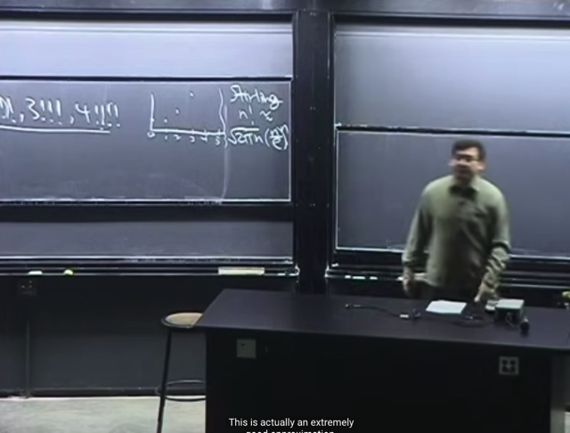</kbd></p>

> [!NOTE]
> Đại khái là gs cho rằng ta nên biết về **công thức Sterling**, trong đó
> nó cho phép tính **xấp xỉ của n! `=` [√(2π*n)](n/e)^n**

<br>

<a id="node-747"></a>

<p align="center"><kbd>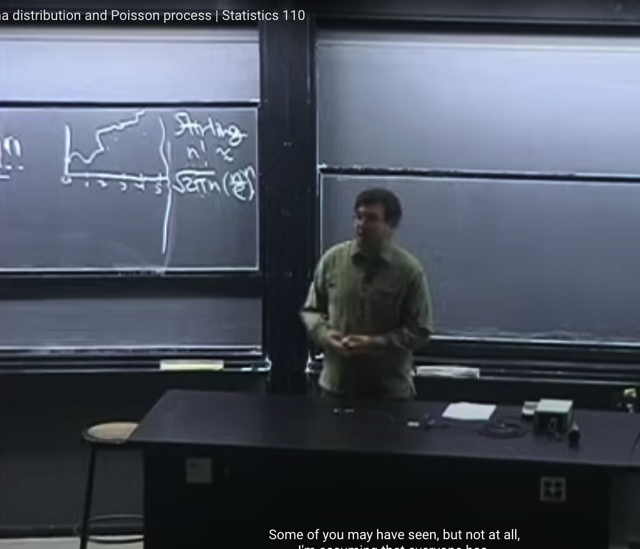</kbd></p>

> [!NOTE]
> Thế thì bài toán đặt ra, là nếu ta phải**tìm một đường**, **nối các điểm rời rạc**,
> mỗi điểm là kết quả của **1!, 2!, 3!...n!**
>
> Đương nhiên ta **có vô số cách để vẽ** đường nối các điểm này.
>
> Thế thì c**ó một cách tiêu chuẩn** để làm điều này, nó gọi là **Gamma function**.
>
> Đại khái là bài trước ta đã biết **Beta** distribution, dù chưa xong và ta còn quay
> lại nhưng nó có **liên hệ gần gũi với Gamma function**.
>
> Gs nói thêm**Gamma là một trong những function nổi tiếng nhất** của toán học

<br>

<a id="node-748"></a>

<p align="center"><kbd>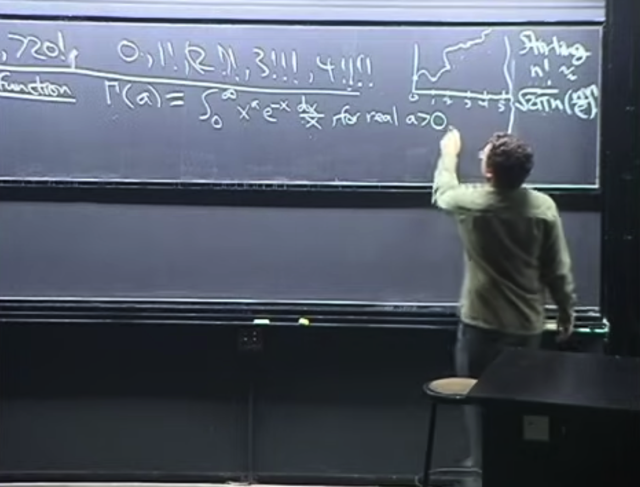</kbd></p>

🔗 **Related:** [LEC 24: GAMMA DISTRIBUTION & POISSON](untitled.md#node-766)

> [!NOTE]
> Thế thì **Gamma function** G(a) có công thức là
>
> G(a) `=` **∫ 0:inf x^a `e^-x` dx `/` x** . Và function này **xác định** với **a là  số
> thực dương.**
>
> *(do trong note mình dùng tạm kí tự G cho nhanh, chứ gs dùng kí tự
> Gamma viết hoa)
>
> Gs cho rằng vì**một số lí do** mà ta sẽ **giữ 1/x** chứ không gom
> **x^a/x `=` x^(a-1)**

<br>

<a id="node-749"></a>

<p align="center"><kbd>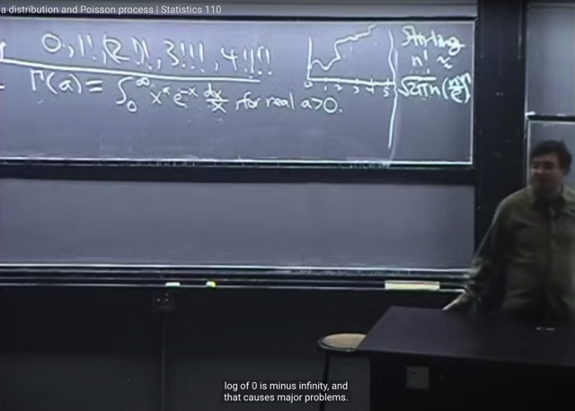</kbd></p>

> [!NOTE]
> Đại khái là gs nói về việc **tại sao a `=` 0** hoặc **âm** thì hàm Gamma này, tức
> integration này **không xác định**. Đại khái là việc này giống như mình **tìm limit
> của một dãy số có vô số hạng tử** (với số hạng tổng quát là x^a * `e^-x` `/` x với
> x `=` vô số giá trị từ 0 đến infinity vậy
>
> Cái này cũng liên quan đến việc **xác định dãy số có hội tụ (converge) hay
> không** tức là, tổng của dãy số có thể được biểu diễn bởi một con số tổng
> quát hay không.
>
> Thì đây cũng vậy, bản chất của tích phân cũng là một tổng. Do đó, có thể
> tích phân không converge. Giống như ở đây nếu như a `<=` 0 thì tích phân sẽ
> không hội tụ.

> [!NOTE]
> Nói chung là khúc này liên quan đến **điều kiện hội tụ của tích phân**. Ta sẽ
> quay lại chỗ này sau khi học 18.01

<br>

<a id="node-750"></a>

<p align="center"><kbd>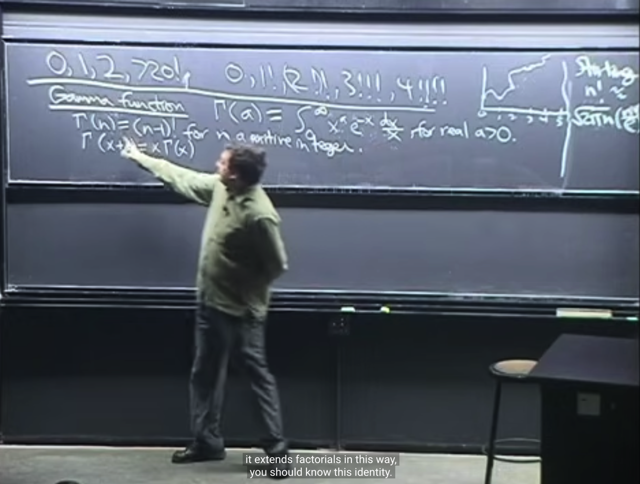</kbd></p>

> [!NOTE]
> thế thì, như đã nói **G(n)** chỉ xấp xỉ **n!** Vì thật ra nó G(n) `=` `(n-1)!`
>
> Và một công thức recursive là `G(x+1)` `=` x*G(x)
>
> Đại khái là gs **nói ta cũng không cần biết nhiều về gamma function** trong
> class này. **Chỉ cần biết công thức của nó như trên** và hai công thức này là
> đủ

<br>

<a id="node-751"></a>

<p align="center"><kbd>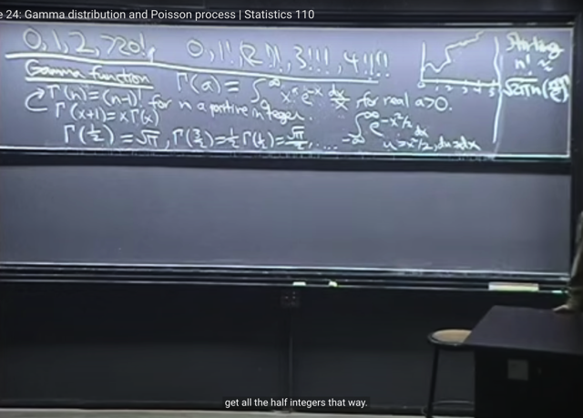</kbd></p>

🔗 **Related:** [LEC 25: ORDER STATISTIC & CONDITIONAL EXPECTATION](untitled.md#node-788)

> [!NOTE]
> Đại khái là có thêm 1 cái nữa ta nên biết là **gamma(1/2) `=` sqrt(π)**. Gs giải
> thích sơ, sở dĩ như vậy là do nó có **liên quan đến Normal distribution**. (nói
> chung ông cũng chỉ nói sơ, không rõ lắm)
>
> Còn Gamma `(3/2)` thì theo Identity trên **Gamma(n+1) `=` nGamma(n)** thì ta có
> ```text
> Gamma (3/2) = Gamma(1/2+1) = 1/2Gamma(1/2)
> ```

<br>

<a id="node-752"></a>

<p align="center"><kbd>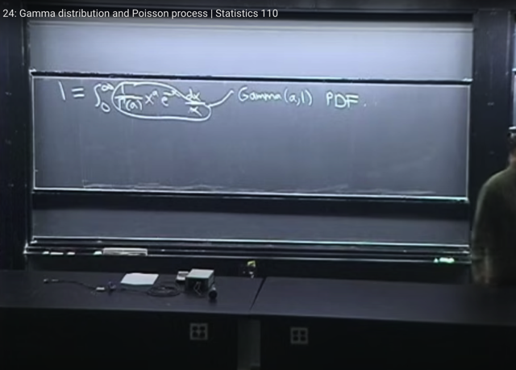</kbd></p>

> [!NOTE]
> Rồi, đại khái là gs nói đó là**tất cả những gì cần biết về Gamma function**. Thế thì
> bây giờ ta sẽ **quay lại nói về gamma distribution**. Câu hỏi là làm sao x**ây dựng
> pdf** của Gamma distribution từ Gamma function.
>
> Câu trả lời đơn giản là, ta sẽ **normalizing Gamma function để cho integrate của
> nó bằng 1** để thỏa mãn điều kiện valid của PDF.
>
> Và ta làm điều đó bằng cách, **chia Gamma function cho chính giá trị của Gamma**
> thì từ đó nó sẽ **lòi ra PDF**
>
> Nói rõ hơn, ta có Gamma function G(a) `=` **∫ 0:inf (x^a `e^-x` `/` x) dx**
>
> Vậy nếu **chia hai vế cho G(a)** ta sẽ có :
>
> ```text
> 1 = [1/G(a)] * ∫ 0:inf (x^a e^-x / x) dx.
> ```
>
> Vì đ**ây là tích phân theo x**, nên `1/G(a)` là constant do đó có thể **đưa G(a) vào tích 
> phân**
>
> ```text
> Để được 1 = ∫ 0:inf [1/G(a)] (x^a * e^-x / x) dx
> ```
>
> Khi đó **[1/G(a)] (x^a * `e^-x` `/` x)** chính là **PDF** của Gamma distribution **Gamma(a, 1)**

> [!NOTE]
> ```text
> X ~Gamma(a,1) PDF f(x) = [1/G(a)] (x^a * e^-x / x)
> ```

<br>

<a id="node-753"></a>

<p align="center"><kbd>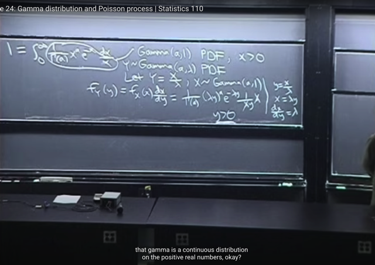</kbd></p>

🔗 **Related:** [LEC 24: GAMMA DISTRIBUTION & POISSON](untitled.md#node-769)

> [!NOTE]
> Đại khái là, gs cho biết **Gamma** rất **closely related** với **Exponential** distribution
> trong đó ta nhớ với Expo distribution, nếu **X ~ Expo(1)** thì Y `=` **X/λ sẽ ~ Expo(λ)**.
>
> Thì ở đây cũng vậy, **nếu ta có X ~ Gamma(a, 1) thì Y `=` X `/` λ  sẽ ~ Gamma(a, λ).**
>
> Cụ thể là, ta đã biết cái vụ **transformation**. Đó là nếu **Y `=` g(X)** thì ta sẽ tìm **g_inv**: 
> X `=` `g_Inv(Y)` thì khi đó PDF của Y sẽ là **f_Y(y) `=` `f_X(x)` dx/dy**
>
> Và ta cũng nhớ là **có thể dùng dx/dy** hoặc **(dy/dx)^-1**, cái nào **dễ thì dùng**.
>
> Thế thì y `=` `x/λ` `<=>` x `=` yλ `=>` **dx/dy `=` λ,**và ở đây ta đã có x `=` `g_inv(y)` `=` yλ
>
> Vậy `f_Y(y)` `=` `f_X(x)` * `dx/dy` `=` `[(1/G(a))` (**x**^a) * (e^-**x**) * (1/**x**)] * λ.
>
> Đương nhiên ta không quên thay **x `=` g_inv(y)** để có **function theo y** vì đây là
> PDF của Y:
>
> `f_Y(y)` `=` `(1/G(a))` (**λy**)^a * e^-(**λy**) (1/**λy**) * λ.
>
> `=` `(1/G(a))` (λy)^a * `e^-(λy)` * (1/**λ**y) * **λ**.
>
> `=` **(1/G(a)) (λy)^a * `e^-(λy)` * (1/y).**Vậy PDF của Y~Gamma(a, λ) là: `f_Y(y)` `=` **(1/G(a)) (λy)^a * `e^-(λy)` * (1/y).**

> [!NOTE]
> Nếu X ~ Expo(1) thì Y `=` `X/λ` sẽ ~ Expo(λ).
>
> Cũng vậy, nếu ta có X ~ Gamma(a, 1) thì Y `=` X `/` λ  sẽ ~ Gamma(a, λ) 
>
> ```text
> PDF của Y~Gamma(a, λ) là: f_Y(y) = (1/G(a)) (λy)^a * e^-(λy) * (1/y).
> ```

<br>

<a id="node-754"></a>

<p align="center"><kbd>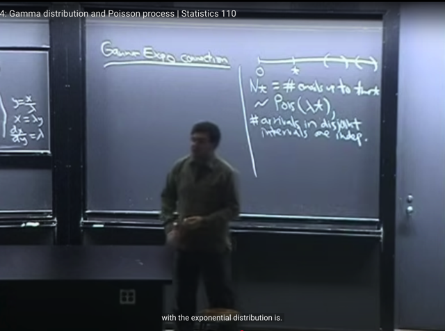</kbd></p>

🔗 **Related:** [-TÓM TẮT:   Bài toán Toy Collector:  Tìm expected value của số lần đi ăn để có đủ n loại  - EX = n(1 + 1/2 + 1/3 + ...1/n) ≈ ln(n) + γ  - CHỨNG MINH PART 2 CỦA UNIVERSALITY  - Cho X, Y, Z là các i.i.d positive random variable. Bài toán là tìm E(X / (X + Y + Z)). Nhờ symmetry tính ra rất dễ = 1/3  - Gặp lại LOTUS - Law of The Unconscious Statistician với bài toán cho X = U^2 với U~Unif(0,1), Y = e^x tìm E(Y), câu hỏi yêu cầu đáp án ở dạng  tích phân  - Để tìm PDF ta sẽ tìm CDF trước, lấy derivative của CDF là có PDF.  Và để tìm CDF ta sẽ dùng định nghĩa của nó để mà xây dựng lên  - X ~ Binomial (n, p), cần tìm distribution của n-X: n-X là một Bin(n, q) theo 2 cách  -Xây dụng PDF của Exp(λ): T (Thời gian chờ đến khi có email đầu tiên) là một Expo(λ) r.v: f(t) = (1-e^(-λ*t))' =  λ*e^(-λt)](_tóm_tắt_bài_toán_toy_collector_tìm_expected_value_của_số_lần_đi_ăn_để_có_đủ_n_loại_ex_n1_12_13_1n_lnn_γ_chứng_minh_part_2_của_universality_cho_x_y_z_là_các_iid_positive_random_variable_bài_toán_là_tìm_ex_x_y_z_nhờ_symmetry_tính_ra_rất_dễ_13_gặp_lại_lotus_law_of_the_unconscious_statistician_với_bài_toán_cho_x_u2_với_uunif01_y_ex_tìm_ey_câu_hỏi_yêu_cầu_đáp_án_ở_dạng_tích_phân_để_tìm_pdf_ta_sẽ_tìm_cdf_trước_lấy_derivative_của_cdf_là_có_pdf_và_để_tìm_cdf_ta_sẽ_dùng_định_nghĩa_của_nó_để_mà_xây_dựng_lên_x_binomial_n_p_cần_tìm_distribution_của_n_x_n_x_là_một_binn_q_theo_2_cách_xây_dụng_pdf_của_expλ_t_thời_gian_chờ_đến_khi_có_email_đầu_tiên_là_một_expoλ_rv_ft_1_e_λt_λe_λt.md#node-483)

> [!NOTE]
> Thì ví dụ hồi nãy thật ra chưa nói rõ **quan hệ giữa Gamma và Expo**
>
> Bây giờ gs mới nói về **quan hệ giữa Gamma và Exponential** distribution. Đầu
> tiên review lại một bài toán mà bữa trước đã làm. Và mà nay ta biết nó gọi là 
> **POISSON** **PROCESS**.
>
> Trong đó ta cho rằng (gỉa định rằng), **số email nhận được** trong **khoảng thời
> gian từ 0 cho đến mốc t**, gọi là **Nt**, là một **Poisson (λt)** r.v. Và yêu cầu **tìm**
> **distribution của T** là **khoảng thời gian cho đến khi nhận email đầu tiên**.
>
> Ngoài ra có thêm một **giả định nữa** đối với **Poisson** **Process** là **số email nhận
> được trong khác khoảng thời gian không chồng lấn** (disjoint) là **độc lập nhau**
> (trong ví dụ bữa trước khi lần đầu tiên nói về Poisson process hình như không
> nói về giả định thứ 2 này)

> [!NOTE]
> POISSON PROCESS

<br>

<a id="node-755"></a>

<p align="center"><kbd>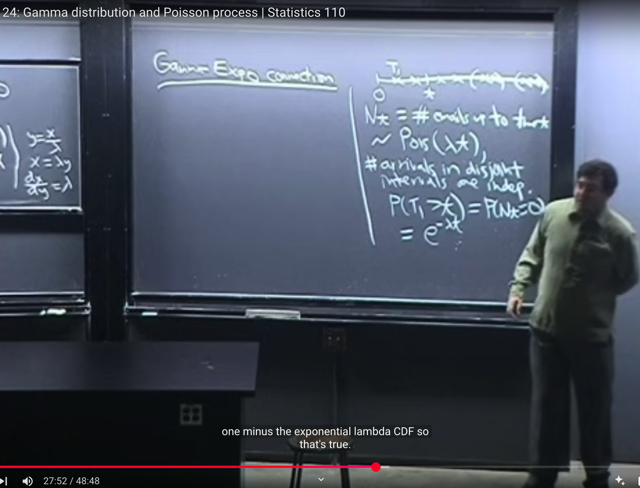</kbd></p>

> [!NOTE]
> Đại khái là trong lần làm bài toán này bữa trước, gs nói ta **đã thấy nó quan hệ với
> Exponential distribution**. Cụ thể là, ta đã chứng minh, rằng gọi T (như vừa nhắc lại, là **độ dài
> của khoảng thời gian trước khi có email đầu tiên**) thì **T chính là ~ Expo(λ)**
>
> Và ta chứng minh bằng cách **xây dựng CDF**, để**lấy derivative** cho ra **PDF**. CDF F(t) chính là
> **P(T<=t)**. Thì trong bài toán này ta t**ìm complement** của nó sẽ dễ hơn: **P(T>t).**
>
> (Again, t, hay u hay x không quan trọng, vì nó chỉ là dummy variable. Cái chính là  hiểu ý
> nghĩa của CDF. ví dụ CDF của X, tức F(t) thì ý nghĩa  là `P(X<=t),` là tích phân từ 0 đến t của
> f(x) dx với f(x) là PDF. Còn gọi là F(x) cũng được, thì phải hiểu nó là `P(X<=x)` và bằng tích
> phân từ `-inf:` x f(x) dx với f(x) là PDF. Nhưng mà như vậy thì dễ lẫn lộn giữa x trong limit tích
> phân và f(x). Thành ra ta nên dùng, cũng như gs hay dùng là F(x) `=` tích phân `-inf` đến x
> f(t)dt Vì trong cái kí hiệu tích phân f(t)dt thì t chỉ là dummy variable, cái chính là hiểu f làm
> hàm PDF của X. Chứ gọi tích phân. ...f(z)dz cũng được không sao cả.)
>
> Quay lại đây, **lí luận mấu chốt** là event [**thời gian cho đến khi nhận email đầu tiên T > t**] 
> cũng chính là `/` **đồng nghĩa** với event [**từ 0 đến t chả có email nào**]
>
> Do đó **(T>t)** `=` **(Nt `=` 0)**. Vì Nt như đã nói, là **số email nhận dc từ 0 đến mốc t, là một Pois(**λt)
>
> (** Cái này gọi là **COUNT-TIME DUALITY**)
>
> Vậy **P(T>t) `=` P(Nt=0)** (hai event là một thì xác suất đương nhiên bằng nhau)
>
> Thế mà ta đã assume **Nt ~ Pois(λt)**, nên ta biết PMF **P(Nt=k) `=` `e^(-λt)` (λt)^k `/` k!**
>
> Vậy P(Nt `=` 0) `=` `e^(-λt)` (λt)^0 `/` 0! `=` **e^(-λt) `=>` P(T>t) `=` e^(-λt)**Vậy CDF của T: **F_T(t)** `=` **P(T<=t)** `=` 1 `-` P(T>t) `=` **1 `-` e^(-λt)**
>
> Và như đã nói nó cũng chính là **∫-inf:t f_T(a)da**  (again, a là dummy variable, ta chỉ
> cần hiểu **f_T là PDF của T**)****Do đó theo FTC Part 1, derivative của F (đương nhiên đối với t) chính là f(t) (PDF của T evaluate
> tại t)
>
> Vậy**lấy đạo hàm** theo t của `F_T:`
>
> ```text
> d/dt F_T(t) = f_T(t)
> ```
>
> ```text
> <=> f_T(t) = d/dt [1 - e^(-λt)] = d/dt [ - e^(-λt)] = - d/dt [e^(-λt)]
> ```
>
> ```text
> = - d/d(-λt) [e^(-λt)] * d/dt (-λt) = - e^(-λt) * -λ = λ*e^(-λt)
> ```
>
> Và **f_T(t) =** **λ*e^(-λt) có dạng của PDF của Expo(λ)
>
> Vậy nên ta kết luận T là Exponential r.v**

> [!NOTE]
> Nếu 
>
> [Nt `=` Số email nhận được trong khoảng thời gian t] là một Pois(λt) 
>
> ta có thể chứng minh 
>
> [T1 `=` Thời gian chờ cho đến khi nhận email thứ 1] là một Expo(λ)

> [!NOTE]
> (**) Ở đây nói thêm, trong bài giảng gs ko nói, nhưng trong sách, cái này được
> gọi là **COUNT-TIME DUALITY**, là sự **KẾT NỐI** GIỮA MỘT **CONTINUOUS** R.V
> VÀ **DISCRETE** R.V.
>
> Khái quát hơn, Tn>t `=` Nt < n với ý nghĩa: 
>
> **[Thời gian chờ email thứ n] > t** 
>
> thì cũng chính là:
> **[Số email nhận được từ đầu đến t] nhỏ hơn n**

<br>

<a id="node-756"></a>

<p align="center"><kbd>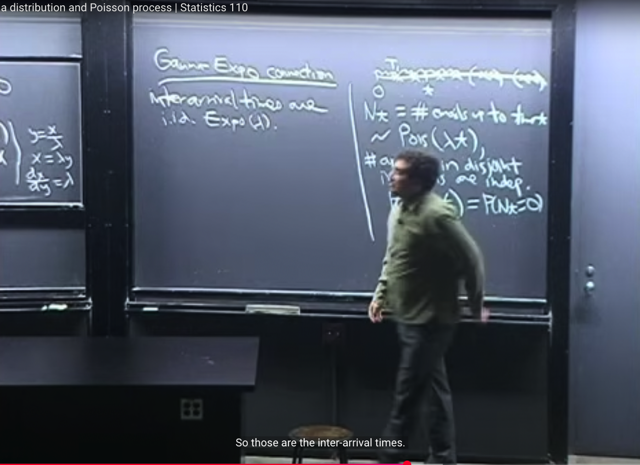</kbd></p>

> [!NOTE]
> Thế thì đại khái là, sau khi **nhận email đầu tiên**, thì khoảng thời gian **từ đó
> đến email thứ 2** dễ thấy **cũng lại là Expo(λ)**, vì giống như reset lại, ta
> vẫn có cùng bài toán. (Đây là tính chất **Memorylessness**)
>
> Do vậy, các [**khoảng thời gian giữa những lần nhận email**] (gọi là **inter-arrival**
> times) là các **i.i.d Expo(λ) random variables**. (i.i.d là vì nó **độc lập nhau**
> và **identical**: cùng là **Expo(λ)**. Gọi chúng là **Xj**.

> [!NOTE]
> [X1 `=` T1 Thời gian chờ cho đến khi nhận email thứ 2] là một Expo(λ)
>
> [X2 `=` `T2-T1:` Thời gian chờ sau khi nhận email thứ 1 cho đến khi nhận email thứ 2]
> là một Expo(λ)
>
> [X3 `=` `T3-T2:` Thời gian chờ sau khi nhận email thứ 2 cho đến khi nhận email thứ 3]
> là một Expo(λ)
>
> ..
>
> X1, X2, X3...là i.i.d Expo(λ)

<br>

<a id="node-757"></a>

<p align="center"><kbd>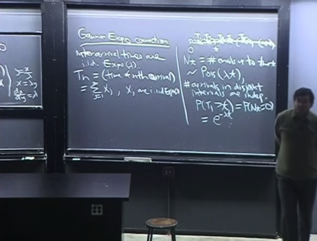</kbd></p>

> [!NOTE]
> Thế thì, tiếp theo, nếu ta quan tâm **Tn**, tức [**khoảng thời gian từ đầu đến
> email thứ n]**. 
>
> Giống như T1 là khoảng thời gian từ đầu cho đến email đầu
> tiên, T2 là thời gian từ đầu đến email thứ 2....) thì dễ thấy T2 `=` X1 `+` X2
> T3 `=` X1 `+` X2 `+` X3,...
>
> **Tn `=` ∑ `j=1:n` Xj**
>
> Xj là các khoảng thời gian giữa các lần nhận email, X1 trùng với T1, 
> như đã nói **Xj i.i.d ~ Expo(λ)**

<br>

<a id="node-758"></a>

<p align="center"><kbd>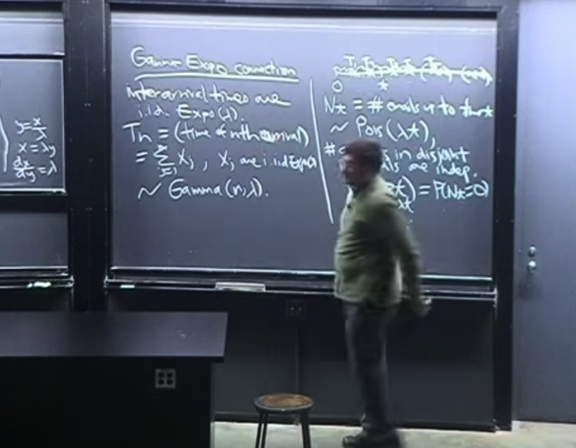</kbd></p>

🔗 **Related:** [LEC 25: ORDER STATISTIC & CONDITIONAL EXPECTATION](untitled.md#node-771)

> [!NOTE]
> Thì khi đó **Tn ~ Gamma(n, λ)**
>
> Và đây là **story quan trọng nhất của Gamma distribution.**
>
> Tất nhiên ta sẽ **chứng minh** điều này ở phần tiếp
>
> Gs cho biết ta đã biết **Geometric** là **số lần fail trước khi success lần đầu**.
> Và với **Negative** **Binomial** là **số lần fail cho đến khi success k lần**. 
>
> Thì có thể coi Negative Binomial là **tổng của nhiều Geometric** (số lần fail trước
> khi success lần đầu, sau đó reset lại ...)
>
> Thế thì **Expo** là **phiên bản (continuous)** tương đương của **Geometric** (discrete)
> thì có thể coi **Gamma là tương đương với Negative Binomial**

> [!NOTE]
> `X1=T1:` thời gian chờ đến khi có email 1
>
> `X2=T2-T1:` thời gian chờ sau khi email 1 đến khi có email 2
>
> ...
>
> X1, X2,...Xn là i.i.d Expo(λ) THÌ: 
>
> Tn `-` thời gian chờ đến khi có email thứ n
>
> `=` X1 `+` X2 `+` ...Xn 
>
> Tn CHÍNH LÀ ~ Gamma(n, λ)

<br>

<a id="node-759"></a>

<p align="center"><kbd>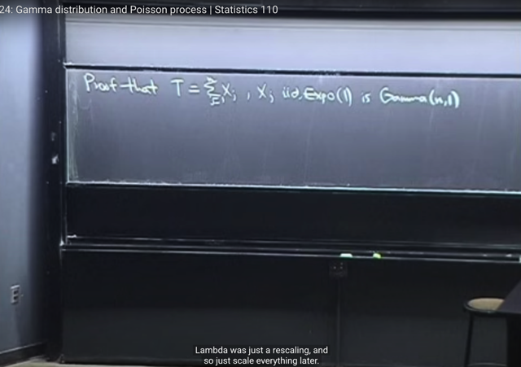</kbd></p>

> [!NOTE]
> Ta sẽ đi chứng minh rằng **tổng của n các i.i.d Expo(1)** r.v Xj là một
> **Gamma(n,1)**
>
> Gs cho rằng khi ta có thể **chứng minh với Expo(1)** thì sẽ **dễ dàng chứng
> minh  với Expo(λ)**
>
> Ta có thể dùng **CONVOLUTION**, tức là **tìm CDF, PDF của TỔNG các r.v**
> như bài trước đã biết để chứng minh T là Gamma.
>
> Tuy nhiên ta **còn có công cụ MGF**, vốn rất phù hợp để làm chuyện đó vì**ở
> đây** ta có các **Xj independent**. Cũng như những bài trước ta đã chứng minh
> MGF của Expo
>
> Thêm nữa ta **chỉ cần làm với Expo(1) cho gọn** vì sau đó **rất dễ dàng mở
> rộng** nó với**Expo(λ)** vì như đã biết Expo(λ) rv chỉ là bằng Expo(1) `/` λ

<br>

<a id="node-760"></a>

<p align="center"><kbd>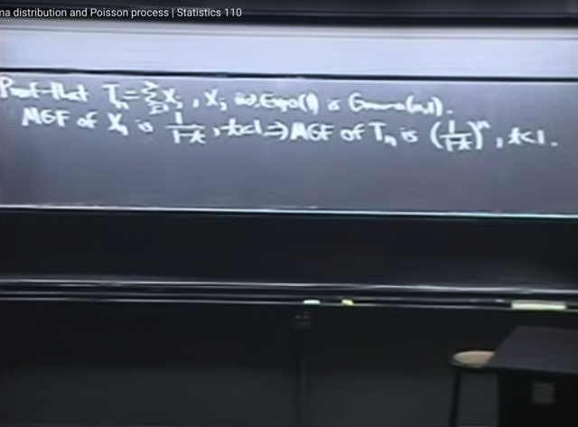</kbd></p>

🔗 **Related:** [TÓM TẮT:  - Tính MGF M(t) của Expo(1) = 1/(1-t) t < 1  - Khi đã có MGF, như bài trước ta đã biết các lí do mà MGF quan trọng trong đó có reason #1 đó là ta chỉ cần tính đạo hàm cấp n của nó sẽ cho ta n'th moment.  - Dù ta có thể tính đạo hàm nhiều lần để có 1st, 2nd moment nhưng có cách hay hơn. Bằng cách nhận ra 1/(1-t) liên quan đến Geometric series  a + ar + ar^2 = Tổng k=0:infinity a*r^k với |r| < 1 sẽ converge về a/[1-r]  Nên 1/1-t chính là Tổng n=0:infinity t^n với |t| < 1  Thế thì theo gs, từ đây cho phép ta KHỎI CẦN TÍNH ĐẠO HÀM CẤP N ĐỂ CÓ MOMENT THỨ N LÀM GÌ CHO MỆT, mà chỉ cần ĐỌC NÓ RA THÔI  Cụ thể là ta đã biết ở bài trước rằng, n'th moment = đạo hàm cấp n của M(t) (là coefficient của (t^n / n!) khi expand M(t) theo Taylor series tại 0)  Do đó, bằng cách tạo ra (t^n / n!) thì BẤT CỨ CÁI GÌ GẮN VỚI NÓ CHÍNH LÀ COEFFICIENT, VÀ CHÍNH LÀ N'TH MOMENT  Do đó ta sẽ nhân thêm n! và chia n! để có (t^n / n!). Như vậy cái lòi ra làm coefficient của t^n/n! ở đây là n! CHÍNH LÀ N'TH MOMENT.  Từ đó cho phép ta ĐỌC LUÔN RẰNG: 1ST MOMENT (EX) LÀ 1!, 2ND MOMENT E(X^2) LÀ 2!  N'TH MOMENT CỦA EXPO(1) E(X^n) = n!  -  đây là tính chất RẤT MẠNH CỦA MGF. Vì ví dụ như khi tính n'th moment (E[X^n]) thì nếu dùng LOTUS, ta phải TÍNH TÍCH PHÂN (INTEGRAL) VÀ CÓ THỂ GẶP NHỮNG TÍCH PHÂN RẤT PHỨC TẠP.  Trong khi đó, nếu ta có MGF, để có nth moment, ta CHỈ CẦN TÍNH DERIVATIVE MÀ DERIVATIVE THÌ THƯỜNG DỄ HƠN LÀ TÍNH TÍCH PHÂN  -Từ n'th moment của Expo(1) ta dễ dàng có n'th moment của Y ~ Expo(λ): E[Y^n] = n! / λ^n  - N'TH MOMENT CỦA N(0,1) VỚI N LẺ ĐỀU BẰNG 0  - MGF CỦA POIS(λ) = e^[λ(e^t-1)]  - Nếu Y ~ Pois(µ) và X~Pois(λ) và biết X, Y INDEPENDENT thì X+Y ~ Pois(λ+µ)](tóm_tắt_tính_mgf_mt_của_expo1_11_t_t_1_khi_đã_có_mgf_như_bài_trước_ta_đã_biết_các_lí_do_mà_mgf_quan_trọng_trong_đó_có_reason_1_đó_là_ta_chỉ_cần_tính_đạo_hàm_cấp_n_của_nó_sẽ_cho_ta_nth_moment_dù_ta_có_thể_tính_đạo_hàm_nhiều_lần_để_có_1st_2nd_moment_nhưng_có_cách_hay_hơn_bằng_cách_nhận_ra_11_t_liên_quan_đến_geometric_series_a_ar_ar2_tổng_k0infinity_ark_với_r_1_sẽ_converge_về_a1_r_nên_11_t_chính_là_tổng_n0infinity_tn_với_t_1_thế_thì_theo_gs_từ_đây_cho_phép_ta_khỏi_cần_tính_đạo_hàm_cấp_n_để_có_moment_thứ_n_làm_gì_cho_mệt_mà_chỉ_cần_đọc_nó_ra_thôi_cụ_thể_là_ta_đã_biết_ở_bài_trước_rằng_nth_moment_đạo_hàm_cấp_n_của_mt_là_coefficient_của_tn_n_khi_expand_mt_theo_taylor_series_tại_0_do_đó_bằng_cách_tạo_ra_tn_n_thì_bất_cứ_cái_gì_gắn_với_nó_chính_là_coefficient_và_chính_là_nth_moment_do_đó_ta_sẽ_nhân_thêm_n_và_chia_n_để_có_tn_n_như_vậy_cái_lòi_ra_làm_coefficient_của_tnn_ở_đây_là_n_chính_là_nth_moment_từ_đó_cho_phép_ta_đọc_luôn_rằng_1st_moment_ex_là_1_2nd_moment_ex2_là_2_nth_moment_của_expo1_exn_n_đây_là_tính_chất_rất_mạnh_của_mgf_vì_ví_dụ_như_khi_tính_nth_moment_exn_thì_nếu_dùng_lotus_ta_phải_tính_tích_phân_integral_và_có_thể_gặp_những_tích_phân_rất_phức_tạp_trong_khi_đó_nếu_ta_có_mgf_để_có_nth_moment_ta_chỉ_cần_tính_derivative_mà_derivative_thì_thường_dễ_hơn_là_tính_tích_phân_từ_nth_moment_của_expo1_ta_dễ_dàng_có_nth_moment_của_y_expoλ_eyn_n_λn_nth_moment_của_n01_với_n_lẻ_đều_bằng_0_mgf_của_poisλ_eλet_1_nếu_y_poisµ_và_xpoisλ_và_biết_x_y_independent_thì_xy_poisλµ.md#node-566)

🔗 **Related:** [LEC 24: GAMMA DISTRIBUTION & POISSON](untitled.md#node-763)

> [!NOTE]
> Thế thì bài trước ta đã chứng minh **MGF** của Expo(1): M(t) `=` **1/(1-t)** (t<1)
>
> Vì các **Xj INDEPENDENT**. Nên **theorem** của MGF cho phép: 
>
> MGF của **TỔNG** của chúng sẽ bằng **TÍCH** các MGF cũa mỗi cái.
>
> Vậy nên MGF của Tn với Tn `=` `X1+X2+...Xn` sẽ là: 
>
> `M_(X1+X2+..Xn)(t)` `=` `M_X1(t)*M_X2(t)*....M_Xn(t)` `=` [**1/(1-t)]^n**  (t<1)

<br>

<a id="node-761"></a>

<p align="center"><kbd>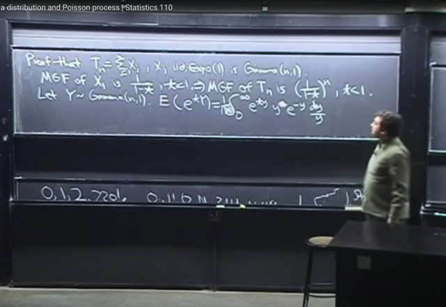</kbd></p>

> [!NOTE]
> Thế thì **để chứng minh Tn ~ Gamma(n,1)** ta phải **chứng minh Gamma(n,1)
> cũng có MGF có công thức này** như vừa rồi.
>
> **Áp dụng định nghĩa của MGF**, như đã biết, là `E[e^tY].` 
>
> (Chỗ này ta lại nhắc lại để nhớ, **Y là r.v**, thì với một giá trị của t thì **e^tY, tức là
> apply hàm f(u) `=` e^tu vào r.v Y,**thì **kết quả cũng là random variable**, nên ta 
> **đương nhiên có thể nói về `/` tính expected value** của nó (e^tY).
>
> Thì expected value đó, với một giá trị của t, chính là giá trị của hàm MGF tại
> t, M(t))
>
> Thế thì, áp dụng **định nghĩa của expected value**, EX là **weighted** **sum** của 
> **mọi possible values** của X, với **weight** là **xác suất X mang possible value** đó.
>
> Thì với **continuous**, nó sẽ là: 
>
> EX `=` `∫-inf:inf` x*f(x)dx, với f(x) là pdf. 
>
> Vậy thì để tính **E(g(X))**, **LOTUS** cho phép ta tính **E(g(X)) =** **∫-inf:inf g(x)f(x)dx**
> (có nghĩa là **không cần phải tìm PDF của g(X)** mà dùng luôn pdf của X)
>
> Vậy nên ta có **E(e^tY)** =**[1/G(n)] `∫0:inf` e^ty * y^n * `e^-y` * `(1/y)` * dy**
>
> (limit tích phân từ**0:inf** thay vì **-inf:inf** là vì **pdf của Y ~ Gamma(n,1)** chỉ khác 0 
> ```text
> từ 0:inf, và bằng 0 với -inf:0, và pdf của Y f(y) = [1/G(n)] y^n e^-y / y
> ```

<br>

<a id="node-762"></a>

<p align="center"><kbd>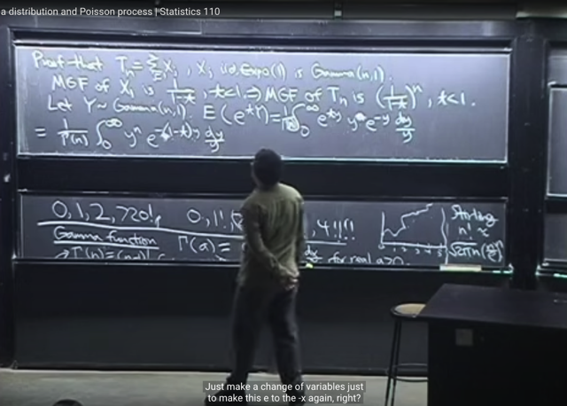</kbd></p>

> [!NOTE]
> Thu gọn lại ta có **[1/G(n)] `∫0:inf` y^n `e^[-(1-t)y]` `(1/y)` dy**
>
> Đến đây gs cho rằng, ở class này thực ra **không quan trọng** rằng ta **giỏi**
> t**ính tích phân bằng** **Integration by Part**, hay **U-substitution** giỏi cỡ
> nào.
>
> Mà cái quan trọng là **Pattern Recognition**, nhận ra các pattern. Ví dụ ở đây,
> có thể thấy **bên trong tích phân lại có dạng của PDF của một  Gamma**
>
> Vì pdf của X~ Gamma(a,1) là **x^a `e^-x` `/` x**

<br>

<a id="node-763"></a>

<p align="center"><kbd>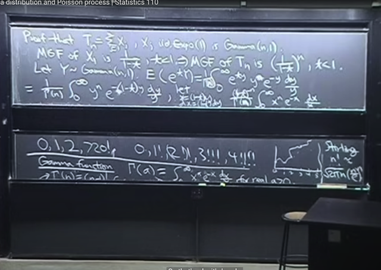</kbd></p>

🔗 **Related:** [LEC 24: GAMMA DISTRIBUTION & POISSON](untitled.md#node-760)

> [!NOTE]
> **Đặt x `=` (1-t)y** `=>`  y `=` `-x/(1-t)` 
>
> `<=>` **y^n** `=` `(-1/(1-t))^n` * x^n =**(1-t)^(-n) * x^n**
>
> Cũng từ x `=` `(1-t)y` , **lấy vi phân hai vế**: **dx `=` (1-t)dy** `=>` **dy `=` dx `/` [(1-t)]**
>
> ```text
> Vậy [1/(G(n))] tích phân 0:inf y^n e^[-(1-t)y] dy / y
> ```
>
> `=` `[1/(G(n))]` tích phân 0:inf **(1-t)^(-n)** * **x^n** * **e^-x** * [dx `/` `(1-t)]` `/` [x `/` `(1-t)]`
>
> i) Xét dx `/` `[(1-t)]` `/` `[x/(1-t)]` `=` **dx `/` x**
>
> nên tiếp tục ở trên 
>
> `=` **[1/(G(n))] tích phân 0:inf `(1-t)^(-n)` * x^n * `e^-x` * dx `/` x]**
>
> Đưa `(1-t)^(-n)` ra ngoài tích phân vì không phụ thuộc x
>
> `=` `[(1-t)^(-n)` `/` (G(n))] tích phân 0:inf  **x^n * `e^-x` * dx `/` x**]
>
> **limit** của tích phân **vẫn là 0:inf** vì x `=` `(1-t)*y` với t < 1 thì `1-t` > 0, nên khi y từ `0->inf` 
> thì x cũng từ `0->inf`
>
> Và **[1 `/` (G(n))] tích phân 0:inf  * x^n * `e^-x` * dx `/` x]** 
>
> **CHÍNH LÀ**
>
> **tích phân `-inf:inf` của pdf của gamma r.v**, thì theo yêu cầu về tính valid của pdf, 
> nó **phải bằng 1**
>
> Vậy ta còn lại **(1-t)^(-n)** hay **[1/ (1-t)]^n**Và y như kết quả MGF của Tn**Và điều này đã chứng minh Tn là ~ Gamma(n,1)**

> [!NOTE]
> CHỨNG MINH Tn CHÍNH
> LÀ ~ Gamma(n, λ)

<br>

<a id="node-764"></a>

<p align="center"><kbd>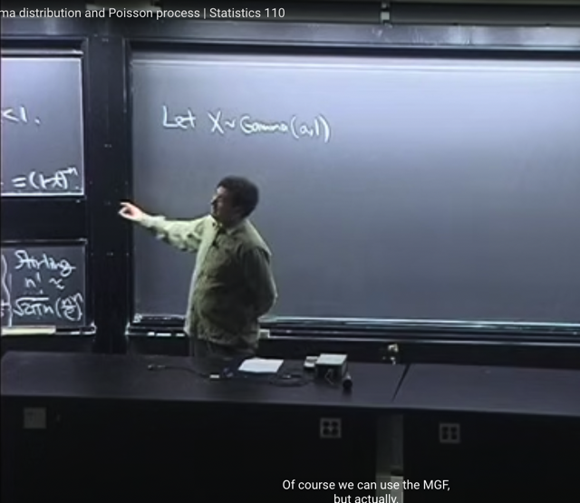</kbd></p>

> [!NOTE]
> gs nói thêm là trong phần chứng minh trên, ta **không có chỗ nào** **assume**
> là **n là integer**. Do đó nó **đúng cả với n real positive number**

<br>

<a id="node-765"></a>

<p align="center"><kbd>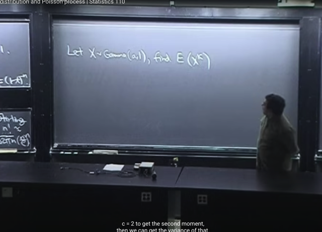</kbd></p>

> [!NOTE]
> Tiếp, ta sẽ tìm **moment**. Gs nói ta tuy có thể dùng **MGF**, nhưng ở đây sẽ **dễ**
> **hơn** nếu dùng trực tiếp **LOTUS**
>
> Cụ thể là ta sẽ tìm **E[X^c]** với **c không nhất thiết là integer**. Nhưng với c `=` 1
> ta biết đó là 1st moment, chính là mean, `c=2,` ta có second moment, `E[X^2]`
> giúp tính variance...

<br>

<a id="node-766"></a>

<p align="center"><kbd>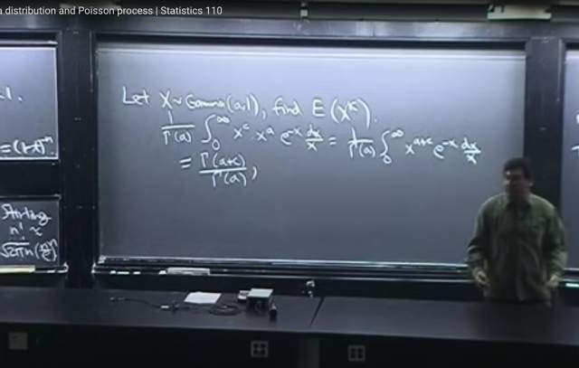</kbd></p>

🔗 **Related:** [LEC 24: GAMMA DISTRIBUTION & POISSON](untitled.md#node-748)

> [!NOTE]
> Thế thì dùng **LOTUS**. ta có `E(X^c)` `=` tích phân 0:inf **x^c** [**pdf của Gamma(a,1)**] dx
>
> `=` (**1/Gamma(a)**) tích phân 0:inf **x^c x^a `e^-x` dx/x**.
>
> **Gom** **x^c và x^a**, .. `=` `(1/Gamma(a))` tích phân 0:inf **x^(c+a) `e^-x` dx `/` x**. (1)
>
> Tới đây ta có thể lập luận rằng **tích phân 0:inf `x^(c+a)` `e^-x` `dx/x` CHÍNH LÀ 
> hàm Gamma() EVALUATE TẠI a+c.**Vì ta biết **hàm Gamma** có công thức: **G(a) `=` tích phân 0:inf x^a `e^-x` dx `/` x**, nên
> ```text
> Gamma(a+c) = tích phân 0:inf x^(a+c) e^-x dx / x
> ```
>
> Và từ đó (1) chính là `=` **Gamma(a+c) `/` Gamma(a)**
>
> ```text
> Hoặc cũng có thể lập luận là (1/Gamma(a)) tích phân 0:inf x^(c+a) e^-x dx/x
> ```
>
> `=` `[Gamma(a+c)/Gamma(a)]` * **[1/Gamma(a+c)]  tích phân 0:inf `x^(c+a)` `e^-x` dx/x**để rồi **phần in đậm** chính là **tích phân từ 0:inf của [PDF của `Gamma(a+c,` 1) r.v]** 
> thì nó **sẽ phải là 1**. để rồi kết quả còn lại cũng là **Gamma(a+c) `/` Gamma(a)
>
> ====**
> Gs nói đó chính là **pattern recognition**, giúp ta **không cần tính tích phân chút
> nào**. Và cũng qua đó ta thấy **nice property của Gamma, và Beta**, mà ta sẽ quay
> lại cũng có đặc điểm này

> [!NOTE]
> c'th moment của Gamma(a,1) 
>
> ```text
> E[x^c] = Gamma(a+c) / Gamma(a)
> ```

<br>

<a id="node-767"></a>

<p align="center"><kbd>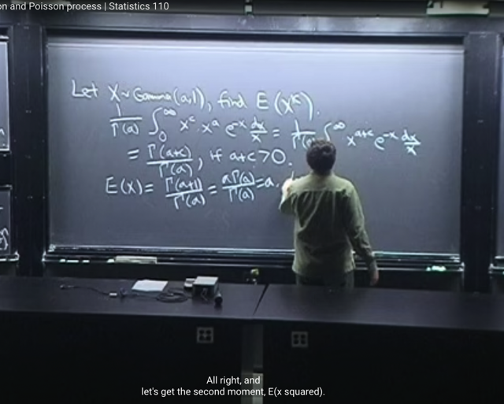</kbd></p>

> [!NOTE]
> Gs lưu ý, **luôn phải ghi điều kiện xác định là `a+c` dương** vì
> **Gamma(a,1) chỉ xác định với a dương**
>
> Từ đó cho phép ta tính **EX (tức `c=1)` `=` `Gamma(a+1)` `/` Gamma(a)**
>
> Mà ta đã biết một **Identity** rằng **Gamma(a+1) `=` a*Gamma(a)**
>
> Nên **EX `=` a**.
>
> GS nói đại khái là, dù a không cần phải là integer như đã nói, nhưng
> ta có thể dùng trường hợp a là integer để nhận xét kết quả trên là
> hợp lí. 
>
> Vì với a integer, X ~ Gamma(a,1) mang story là **tổng** của **a** **Xj ~ Expo(1)**
> r.v i.i.d. 
>
> Mà **E(Tổng các r.v)** theo **linearity** `=` **Tổng các Expect value**
>
> Và expected value của một Expo(1) đã chứng minh là bằng 1. 
> (EX của X ~ Expo(λ) `=` λ) 
>
> Nên với tổng a cái `E(Xj)` `=` a*1 `=` a

> [!NOTE]
> X~Gamma(a,1): EX `=` a

<br>

<a id="node-768"></a>

<p align="center"><kbd>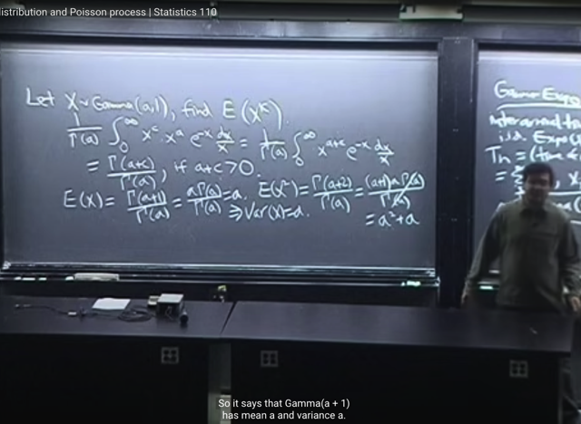</kbd></p>

> [!NOTE]
> Tính second moment `E(X^2).` Tương tự:
>
> ```text
> E(X^2) = G(a+2)/G(a) = G(a+1+1)/G(a) = (a+1)G(a+1)/G(a)
> ```
>
> `=` `a(a+1)G(a)/G(a)` `=` `a(a+1)` `=` **a^2 `+` a**
>
> Từ đó `Var(X)` `=` `E(X^2)` `-` (EX)^2 `=` a^2 `+a` `-` a^2 `=` **a**
>
> Kết quả này ta **thấy giống Poisson** khi **mean** BẰNG **variance** nhưng
> gs cho biết nó **chỉ có khi Gamma(a,1)** tức λ `=` 1

> [!NOTE]
> X~Gamma(a,1): VarX `=` a

<br>

<a id="node-769"></a>

<p align="center"><kbd>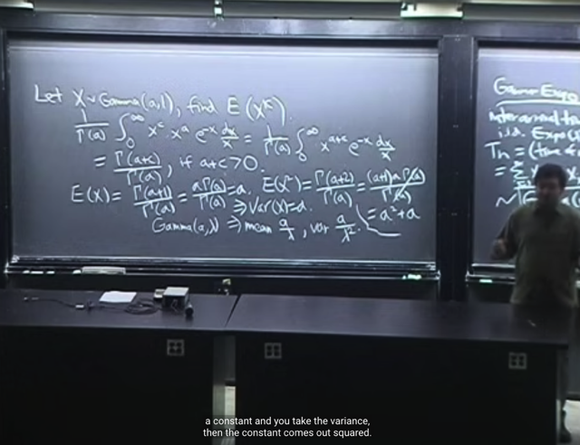</kbd></p>

🔗 **Related:** [LEC 24: GAMMA DISTRIBUTION & POISSON](untitled.md#node-753)

> [!NOTE]
> Và xong xuôi thì ta có thể tính **mean** và **variance** của **Gamma(a, λ)**
>
> Như đã chứng minh (link tím), Gamma(a, λ) r.v chỉ là `=` Gamma(a,1) `/` λ
>
> Nên với Y ~ Gamma(a, λ).**EY `=` `E(X` `/` λ)** `=` EX `/` λ `=` **a `/` λ** theo linearity
>
> Và VarY `=` `Var(X` `/` λ) `=` **VarX `/` λ^2** `=` **a `/` λ^2**
>
> (theo tính chất của variance `Var(cX)` `=` c^2 VarX mà ta đã học)

> [!NOTE]
> ```text
> X~Gamma(a, λ): EX = a / λ VarX = a / λ^2
> ```

<br>

