# Lec 25: Order Statistic & Conditional Expectation

📊 **Progress:** `30` Notes | `35` Screenshots

---

<kbd>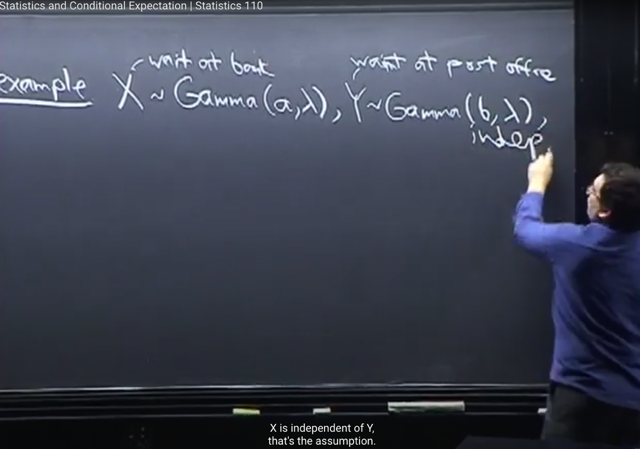</kbd>

🔗 **Related:** [LEC 24: GAMMA DISTRIBUTION & POISSON](untitled.md#node-758)

> [!NOTE]
> Bài này ta sẽ tìm hiểu **sự liên hệ giữa Beta và Gamma**, cũng như tiếp tục
> việc **tìm normalizing constant** của **Beta** mà bữa trước chưa xong
>
> Gs cho một bài toán gọi là**Bank-Post office**:
>
> Với story là ta phải xếp hàng để chờ được phục vụ thì ta gọi thời gian chờ là
> r.v X ~ Gamma(a, lambda). Đại khái là, nếu a integer, thì như bài trước, ta đã
> hiểu X sẽ có thể coi như tổng của a Xj là các Expo(lambda) r.v, i.i.d.
>
> Đại khái nhớ lại cái ví dụ email (gọi là bài toán Poisson procession) mà ta
> quan tâm đến **thời gian chờ đợi cho đến khi nhận email đầu tiên**. Ta **đã
> chứng minh nó là một r.v ~ Expo(λ)**.
>
> Và **sau khi nhận email đầu tiên**, coi như **reset lại** thì **thời gian chờ đến
> khi email thứ hai** cũng là r.v ~ **Expo(λ)**. Cứ thế,**các khoảng thời gian
> giữa những lần nhận email đều là Expo(λ)**. Và quãng**thời gian từ đầu cho
> đến khi nhận email thứ n**, có thể coi là **TỔNG CỦA n r.v Expo(λ)**
>
> Và ta **đã chứng minh ở bài trước** trong Gamma-Expo connection rằng,
> **TỔNG n CÁC Expo(λ) CHÍNH LÀ MỘT Gamma(n, λ) r.v.**
>
> Thì ở đây việc **xếp hàng để đợi phục vụ** cũng giống giống như vậy, **các
> khoảng thời gian giữa những lần được phục vụ** cũng là Expo(λ). Và **thời
> gian chờ đến lượt mình**, ví dụ ở **vị trí thứ a**, sẽ là**tổng các Expo(λ)**, và
> y như trên, **nó sẽ là Gamma(a, λ)**.
>
> Nói chung giải thích như vậy để hiểu tại sao câu chuyện ở đây,**thời gian xếp
> hàng chờ được phục vụ ở bank là một r.v Gamma(a, λ)**
>
> ====
>
> Quay lại bài toán này, **đặt X, và Y là hai Gamma** r.v cho thời gian**chờ ở bank**,
> và **ở post office**. Với X, Y **independent**

> [!NOTE]
> Nhắc lại tổng của n Expo(λ) sẽ là một Gamma(n, λ).
>
> Thời gian chờ đến lượt được phục vụ khi đứng ở vị trí thứ n sẽ là tổng
> n Expo(λ) nên nó sẽ là một Gamma(n, λ)

 

<kbd>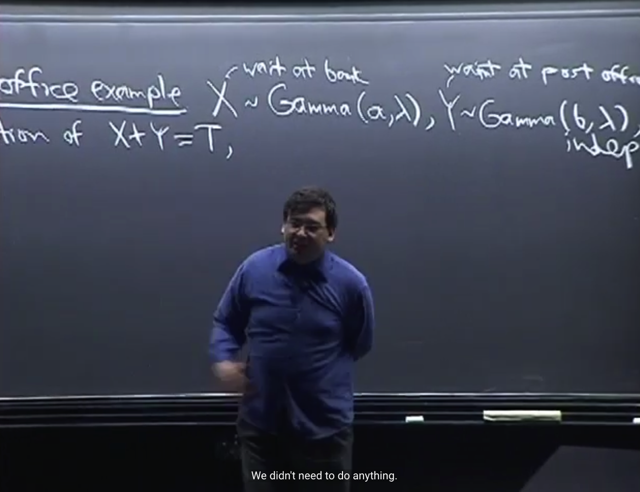</kbd>

🔗 **Related:** [LEC 30: CHI-SQUARE, STUDENT-T, MULTI-VARIATE GAUSSIAN](untitled.md#node-915)

> [!NOTE]
> Câu hỏi là **tìm distribution của X+Y = T**.
>
> Thế thì, nếu **a, b là integer**. Thì ngay lập tức ta có thể **dùng story proof** với lập
> luận rằng, như vừa nói, khi đó có thể **coi X là tổng của a i.i.d Expo(λ)** và
> **Y là tổng của b i.i.d Expo(λ)**.
>
> Nên **T = X+Y** đương nhiên là **tổng của (a+b) i.i.d Expo(λ) r.v**
>
> Vậy thì **ngay lập tức kết luận T sẽ là Gamma(a+b, λ)** (vì như vừa mới
> nói  bài trước ta **đã chứng minh tổng của a i.i.d Expo(λ) là một r.v
> Gamma(a, λ) rồi**
>
> Bên cạnh đó, gs nói **nếu a không phải integer**, ta cũng có thể **dễ dàng dùng
> MGF để chứng minh T là Gamma(a+b, λ)** vì X, Y **independent**. Mà
> **MGF của Gamma thì ta đã chứng minh rồi**

> [!NOTE]
> Bằng story proof chứng minh tổng
> của Gamma(a, λ) và Gamma(b, λ) sẽ
> là một Gamma(a+b, λ)

 

<kbd>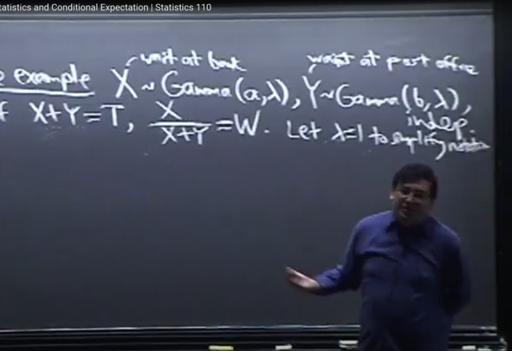</kbd>

> [!NOTE]
> Tuy nhiên bài toán này ta còn **quan tâm** **tỉ lệ giữa thời gian chờ ở nhà**
> **băng** (X) với **tổng thời gian (X+Y)**. Đặt là **W = X / (X+Y)**
>
> Đúng hơn là ta **muốn tìm một Joint PDF của W và T**. Và như ta đã vừa nói,
> ta **đã biết distribution của T**, nó cũng là **marginal pdf của T**.
>
> Nhưng **marginal pdf của W** thì ta **chưa có**.
>
> Thêm nữa, tương tự với những lần trước ta cũng sẽ **làm việc với λ = 1** cho
> tiện,  sau đó **dễ dàng mở rộng cho λ khác 1**

 

<kbd>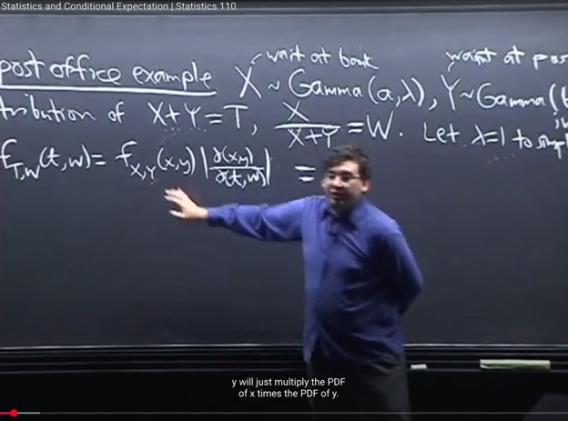</kbd>

<kbd></kbd>

<kbd>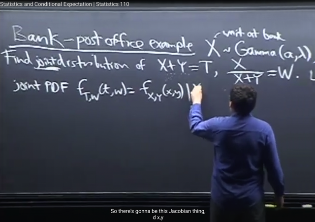</kbd>

🔗 **Related:** [LEC 22: TRANSFORMATIONS & CONVOLUTION](untitled.md#node-725)

> [!NOTE]
> Ta sẽ dựa vào **Transformation** **theorem** để tính **JOINT pdf của T, W**, từ JOINT PDF của X, Y. Như
> bữa trước ta đã học về Transformation theorem cho phép ta tìm PDF của Y = g(X), khi biết PDF
> của X, g_X(x)
>
> **f_Y(y) = f_X(x) dx/dy**
>
> Thế thì **mở rộng qua Rn**. Khi ta có**vector X = [X1,...Xn]**, và **PDF của X** (thì bấy giờ **đương nhiên**
> PDF của X là **JOINT PDF f_Xj(x) của mọi Xj**)
>
> Và ta muốn**tìm PDF của Y = g(X)**. Đương nhiên PDF của Y cũng là **Joint PDF của mọi
> component của Y (mỗi Yj là một random variable)**
>
> Thì ta sẽ có:
>
> **f_Y(y) = f_X(x) |dx/dy|** với |dx/dy| là**TRỊ TUYỆT ĐỐI CỦA DETERMINANT** của **Jacobian** matrix.
>
> ====
>
> Vậy thì ở đây,**áp dụng điều này**, ta sẽ có thể**tính Joint PDF của T, W** (có thể hiểu là ta có vector
> U = [T, W] và vector N = [X,Y] cũng vậy thôi)
>
> **f_T,W(t,w) = f_X,Y(x,y) |∂(x,y)/∂(t,w)|**Đương nhiên ta hiểu **f_T,W(t,w)** là J**OINT PDF của T và W**. 
>
> Giống như **f_[X1,X2....Xn] là PDF của VECTOR X**, DĨ NHIÊN LÀ **JOINT PDF CỦA CÁC X1, X2...Xn**
>
> Về kí hiệu **∂(x,y)/∂(t,w)**, trong 1801 đã học

 

<kbd>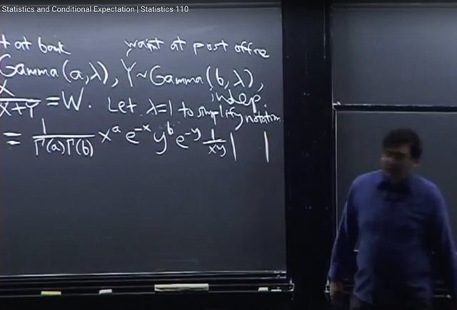</kbd>

> [!NOTE]
> Thế thì, vì**X,Y INDEPENDENT** như đề bài cho phép. Nên ta đã biết ở bài trước, 
> về định nghĩa của **Independent** random variable liên quan đến **Joint và Marginal
> distribution** cho phép:
>
> **Joint PDF** của X,Y bằng **tích của PDF của từng cái**, tức là **tích của các Marginal
> PDF**
>
> Và **X ~ Gamma(a, 1)** =>**f_X(x) = [1/Gamma(a)]** **x^a e^-x / x**
>
> Và **Y ~ Gamma(b, 1)** => **f_Y(y) = [1/Gamma(b)] y^b e^-y / y**
>
> Nên ta có:
>
> **f_W,T(w,t)** = **[1/Gamma(a)1/Gamma(b)]** **x^a e^-x y^b e^-y / xy**  * **|Jacobian|**

 

<kbd>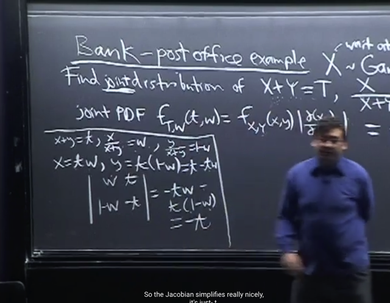</kbd>

> [!NOTE]
> Rồi, ta sẽ tính **det|Jacobian|**. Đầu tiên, như đã biết **J là matrix partial
> derivative của vector [x, y] đối với vector [t, w]**
>
> Thì nó là matrix **[∂x/∂t, ∂x/∂w; ∂y/∂t ∂y/∂w]**
>
> Vậy thì **dễ dàng tính được những partial derivative này** bằng cách đầu tiên là
> **thể hiện x, y là hàm của w, t**. Rồi **lấy đạo hàm từng phần** rất đơn giản.
>
> x = tw => [∂x/∂t, ∂x/∂w] = [w t]
>
> y = t-tw => [∂y/∂t, ∂y/∂w] = [1-w, t]
>
> Cuối cùng ta **tính det** của matrix 2x2 (theo cả 1806 và 1802 đều đã biết nó sẽ
> theo ông thức **ad-bc**), thu gọn ra kết quả |J| = |t|

 

<kbd>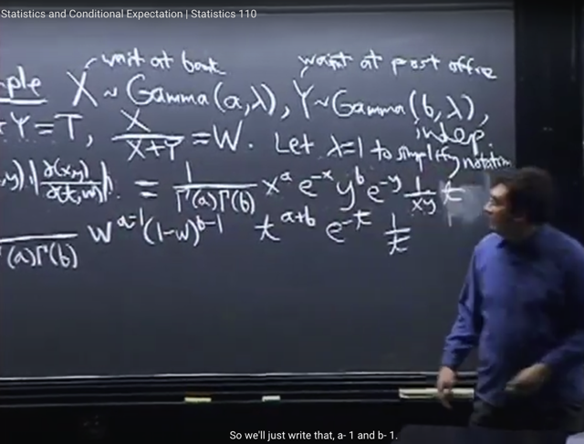</kbd>

> [!NOTE]
> Vì **t dương** (tổng của x, y là hai Gamma r.v luôn dương) nên**|t| = t**
>
> Kế tới như đã biết ta **cần thể hiện x, y là function của w, t** vì đây là **JOINT PDF 
> của w, t**. 
>
> x = tw, y = t-tw = t(1-w)
>
> Thu gọn lại ta có kết quả (cũng dễ hiểu và gs ghi cũng rõ nên khỏi ghi lại)

 

<kbd>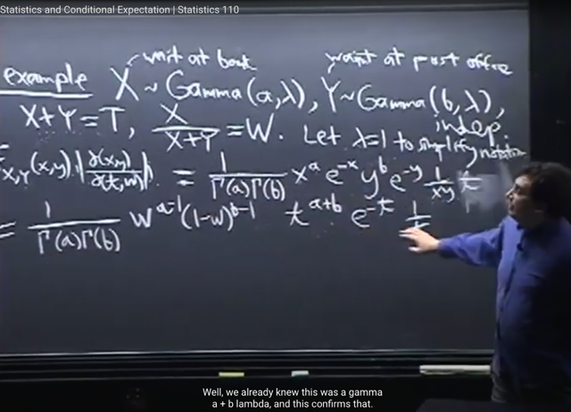</kbd>

> [!NOTE]
> Và khi thu gọn lại, ta có thể thể hiện nó là **TÍCH CỦA HAI FUNCTION THEO t, 
> VÀ THEO w RIÊNG LẺ**
>
> Thật vậy ta có thể thấy rằng có thể tách nó thành tích của hai function theo t và 
> theo w riêng biệt.
>
> Thì theo gs **ĐÂY LÀ TA ĐÃ CÓ THỂ KẾT LUẬN W, T INDEPENDENT**

 

<kbd>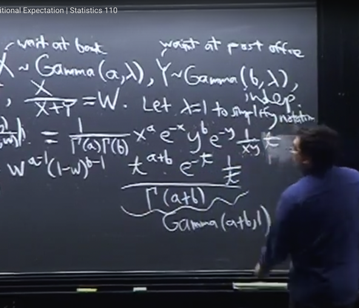</kbd>

<kbd></kbd>

<kbd>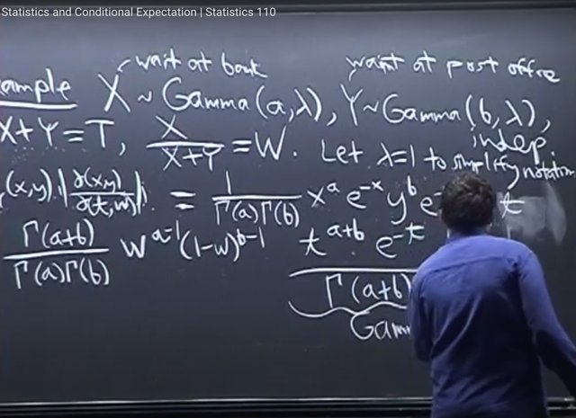</kbd>

> [!NOTE]
> Và cụ thể **distribution của chúng là gì**, thì với **t bằng cách nhân thêm và chia
> đi Gamma(a+b)** thì ta có thể thấy **PDF của T chính là PDF của Gamma(a+b, 1)**Ôn lại PDF của X ~ Gamma(a, 1): f_X(x) = G(a) x^a e^-x 1/x
>
> nên với T ~ Gamma(a+b, 1) thì f_T(t) = G(a+b) t^(a+b) e^-t 1/t

 

<kbd>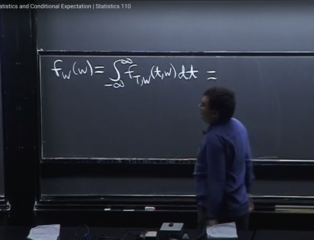</kbd>

> [!NOTE]
> Tiếp ta sẽ tìm **Marginal PDF của W**. Như đã biết, để tìm **marginal PDF** của
> W, ta chỉ việc **integrate Joint PDF over mọi possible value của t**.
>
> Ôn lại một chút, thì điều này xuất phát từ**Law Of Total Probability**
>
> Xét discrete case**Joint PMF P(X=x, Y=y)**. Để có **Marginal PMF** **của X**, ta sẽ
> dùng wishful approach,**conditioned on mọi possible value của Y**:
>
> Xuất phát từ việc **event (X=x)** là **Union của các event (X=x, Y=y) với mọi
> possible values y của Y**: Tức là **(X=x) = Tổng y (X=x, Y=y)**. Điều này xuất phát
> từ Set theory. => **P(X=x) = P[Tổng y (X=x, Y=y)]**
>
> Và đương nhiên các **event (X=x, Y=y) với các y khác nhau** là các **disjoint**
> event Từ đó theo **axiom 2** of proability:
>
> **P[Tổng y (X=x, Y=y)] = Tổng y P(X=x, Y=y)**
>
> Vậy P(X=x) = Tổng y P(X=x, Y=y) Thì **P(X=x) chính là Marginal PMF của X**
> và **P(X=x, Y=y) là Joint PMF**
>
> Phiên bản continuous sẽ tương đương:
>
> **f_X(x) = ∫-inf:inf f_X,Y(x,y) dy**Và kết quả trên cho thấy marginal pdf của X được tính bằng cách integrate
> joint pdf over mọi possible value của y
>
> ===
>
> Thế thì ở đây để có marginal pdf của T, ta sẽ integrate joint pdf của W, T trên
> mọi possible value của t: 
>
> **f_W(w) = tích phân -inf:inf f_T,W(t,w) dt**

 

<kbd>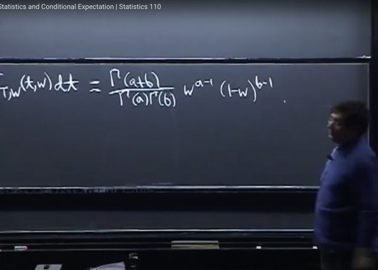</kbd>

> [!NOTE]
> Thế thì, như đã nói, từ nhận xét **Joint pdf của W, T** có thể tách thành **tích của hai 
> function của W, và của T riêng lẻ.**
>
> Nên khi ta **tích phân -inf:inf f_W,T(w,t) dt**
>
> = ∫-inf:inf { **Γ(a+b) / [Γ(a) Γ(b)] w^(a-1) [(1-w)^(b-1)]** *  [1/Γ(a+b)] * t^(a+b) * e^-t 1/t } dt
>
> vì cái **phần chỉ liên quan đến w ko liên quan đến t**, không phụ thuộc t, nên ta có thể 
> **bưng ra ngòai tích phân**
>
> = Γ(a+b) / [Γ(a) Γ(b)] w^(a-1) [(1-w)^(b-1)] * **∫-inf:inf { [1/Γ(a+b)]  * t^(a+b) * e^-t 1/t } dt**Còn lại **∫-inf:inf { [1/Γ(a+b)]  * t^(a+b) * e^-t 1/ t } dt** thì như đã nói **chính là**
> ∫-inf:inf của PDF của Gamma(a+b,1) nên **nó phải bằng 1**
>
> Vậy ta có PDF của W: f_W(w) = **Γ(a+b) / [Γ(a) Γ(b)] w^(a-1) [(1-w)^(b-1)]**

 

<kbd>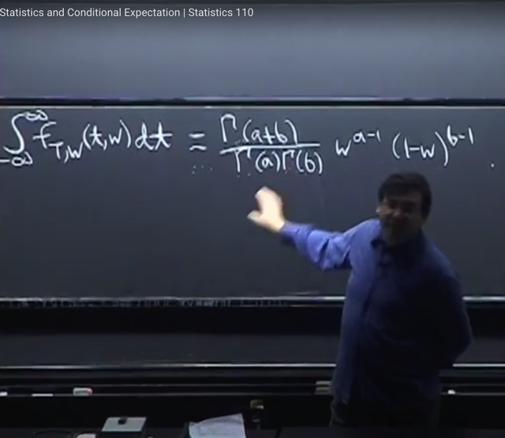</kbd>

> [!NOTE]
> Và **w^(a-1)*(1-w)^(b-1)**chính là **một phần của pdf CỦA BETA (a, b)**
>
> Bữa trước ta đang học dở về **Beta(a,b)** distribution có pdf là: 
>
> **c*x^(a-1)*(1-x)^(b-1)**
>
> Và **c là normalizing constant**, mà bữa trước gs nói ta sẽ tìm hiểu nó sau.
>
> Thì **ở đây**, khi ta đã **chứng minh rằng**:
>
> Γ(a+b)/[Γ(a)Γ(b)] w^(a-1)*(1-w)^(b-1) **là PDF của W**, 
>
> thì điều này **cũng chứng  minh rằng:** 
>
> **Γ(a+b)/[Γ(a) Γ(b)] CHÍNH LÀ CÔNG THỨC CỦA NORMALIZING CONSTANT 
> CỦA Beta(a,b)**
>
> Ở đây là lí do tại sao gs đang dạy về Beta nhưng chuyển sang Gamma, bởi lẽ
> Normalizing constant, cần biết về function gamma

> [!NOTE]
> Γ(a+b)/[Γ(a) Γ(b)] CHÍNH LÀ CÔNG THỨC CỦA NORMALIZING CONSTANT 
> CỦA ΒETA(a,b)

 

<kbd>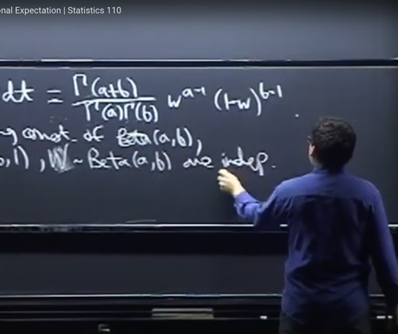</kbd>

<kbd></kbd>

<kbd>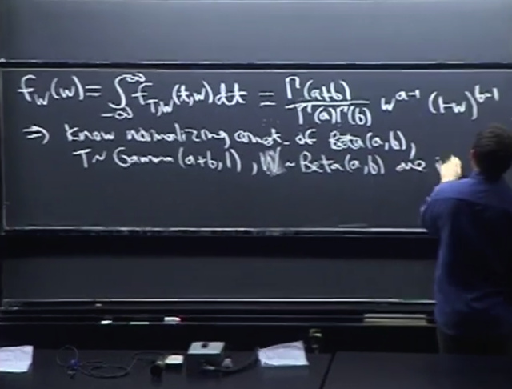</kbd>

> [!NOTE]
> Vậy kết luận ta đã biết **normalizing** **constant** của **Beta(a,b)** là điều mà theo gs
> **nếu ta tìm một cách trực tiếp**, ta sẽ **đối mặt với một tích phân rất khó**.
>
> Ngoài ra như đã nói, ta cũng biết **T là Gamma(a+b,1)** và **W là Beta(a,b)**
>
> Và **W,T độc lập** nhau

 

<kbd>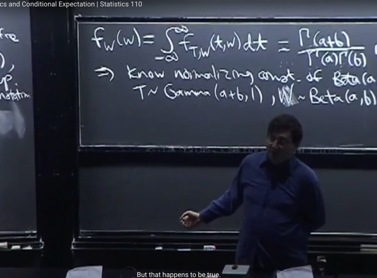</kbd>

> [!NOTE]
> gs nói thêm đây cũng là ví dụ cho thấy sự **liên hệ đặc biệt giữa
> Gamma và Beta**.
>
> Nếu **X,Y không phải là Gamma** thì ta sẽ **không có W,T độc lập**

 

<kbd>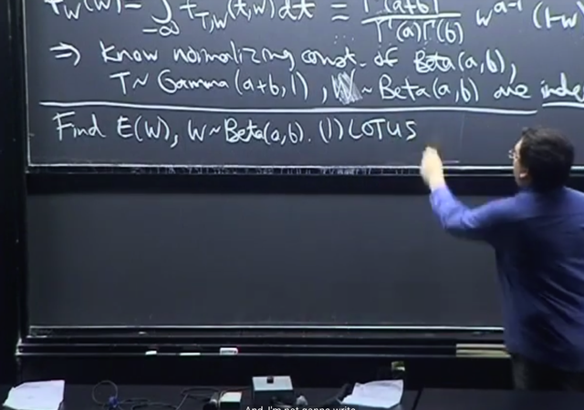</kbd>

> [!NOTE]
> Rồi, tiếp theo gs nói qua, ví dụ khác, đó là ta tính**mean của Beta(a,b)** 
>
> Hoặc tính **n'th moment** của Beta **E(X^n)**. Đại khái gs nói là đương nhiên ta có thể 
> dùng **LOTUS** (với **mean** thì chỉ việc **dùng định nghĩa**)
>
> Vì hiện giờ ta có **đã full pdf của Beta(a, b)**, thì để tính ví dụ E(X^n)  theo **định nghĩa**
> của mean và dùng **LOTUS**, ta sẽ tính :
>
> EX^n = ∫-inf:inf [Γ(a+b)/Γ(a)Γ(b)] **x^n *** x^(a-1) * (1-x)^(b-1) dx
>
> Thế thì, **x^n nhập với x^(a-1)**
>
> = ∫-inf:inf [Γ(a+b)/Γ(a)Γ(b)] * x^(n+a-1) * [(1-x)^(b-1)] dx
>
> thì bên trong **lại có dạng của PDF của Βeta(n+a, b)**
>
> Và vì bây giờ ta đã biết công thức của normalizing constant Βeta(a,b) = Γ(a+b)/Γ(a)Γ(b) 
> **nên normalizing constant**của Beta(a+n, b) là **Γ(a+n+b) / Γ(n+a)Γ(b)** 
>
> Cho nên bằng cách n**hân thêm và chia bớt cho normalizing constant** này, thì ta có:
>
> EX^n = Γ(a+n)Γ(b) / Γ(a+n+b)) * [Γ(a+b)/Γ(a)Γ(b)] 
> ∫-inf:inf [Γ(a+n+b)/Γ(a+n)Γ(b)] * x^(n+a-1) * [(1-x)^(b-1)] dx
>
> Thế thì ∫-inf:inf [Γ(a+n+b)/Γ(a)Γ(b)] * x^(n+a-1) * [(1-x)^(b-1)] dx chính là 
> **∫-inf:inf của pdf của Gamma(n+a, b), do đó nó** sẽ bằng 1. 
>
> Để lại **những gì còn lại chính là của E[X^n]:**
>
> E[X^n] =Γ(a+n)Γ(b) / Γ(a+n+b)) * [Γ(a+b)/Γ(a)Γ(b)] ****Và với n = 1, ta có 1st moment, tức là mean EX:
>
> EX = Γ(a+1) Γ(b) / Γ(a+1+b) *  Γ(a+b) / Γ(a) Γ(b) = **Γ(a+1) * Γ(a+b) / [ Γ(a) Γ(a+b+1)**= a Γ(a) Γ(a+b) / Γ(a) Γ(a+b) (a+b)  | Dùng công thức Γ(a+1) = aΓ(a)
>
> = **a / (a+b)**

 

<kbd>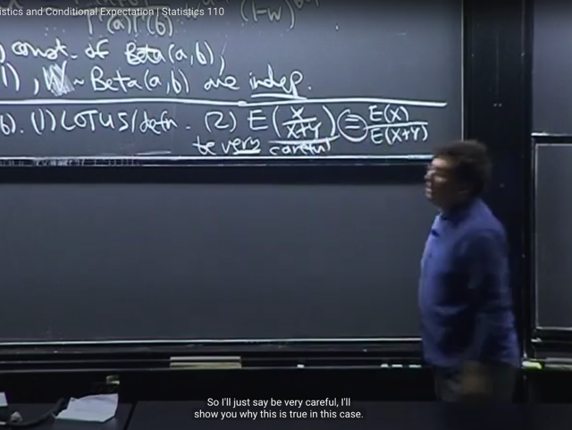</kbd>

> [!NOTE]
> Rồi, chỗ này mới hay nè. Gs nói tuy là ta có thể**tính EX hay EX^n theo LOTUS**
> như vừa rồi. Nhưng, vì bài toán là**tính expected value của một Beta (a,b)**
> random variable. Nên**miễn là ta có một Beta(a,b)** rv thì **luôn có thể dùng nó
> expected value của nó**, làm câu trả lời. 
>
> Không cần biết Beta r.v đó được generate bằng cách nào.
>
> Thì trong câu chuyện vừa rồi, ta có **W, tức X/(X+Y)** (với X ~ Gamma(a, 1) Y là 
> Gamma(b, 1)) **là một Beta(a, b)** như đã chứng minh. 
>
> Thế thì **nếu tính được E[W] tức E[X/(X+W)]** thì ta sẽ có **mean của Beta(a,b)**
> Vậy thì đầu tiên gs viết **E(X/(X+Y)] = EX/E(X+Y)**và lưu ý ta rằng điều này phải rất
> cẩn thận vì **không phải lúc nào cũng đúng.**

 

<kbd>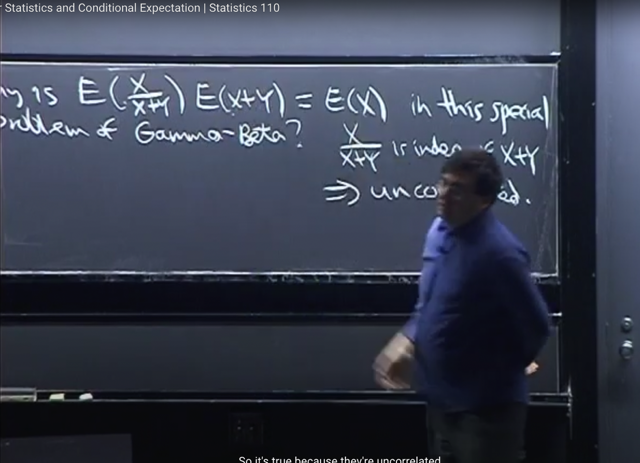</kbd>

> [!NOTE]
> Nhưng trong trường hợp này, vì ta **đã chứng minh W, T independent.**
>
> Mà trong bài trước, ta đã chứng minh rằng **nếu X, Y independent** thì 
> **E(XY) = EX*EY**. Và sau khi học về khái niệm covariance, ta có công thức:
> **Cov(X,Y) = EXY - EXEY**
>
> Review: Cov(X,Y)  = E[(X-EX)(Y-EY)] = E[XY+EXEY-XEY-YEX]
>
> = E(XY)+E(EXEY)-E(XEY)-E(YEX) = E(XY) + EXEY - EYEX - EXEY
>
> = **E(XY) - EXEY**
>
> Vậy thì khi X,Y INDEPENDENT dẫn tới E(XY) = EXEY. 
>
> Thì Cov(X,Y) = E(XY) - EXEY = EXEY - EXEY = 0. Khi đó chúng gọi là 
> **UNCORRELATED**Bởi vậy ta mới có theorem: **INDEPENDENT => UNCORRELATED**
>
> ====
>
> Quay lại đây vậy W,T independent nên **E(WT) = ET*EW**
>
> => **EW = E(WT) / ET** <=> **E(X/(X+Y)) = EX / E(X+Y)
>
> Đó là lí do ta có thể có dấu bằng ở đây**

 

<kbd>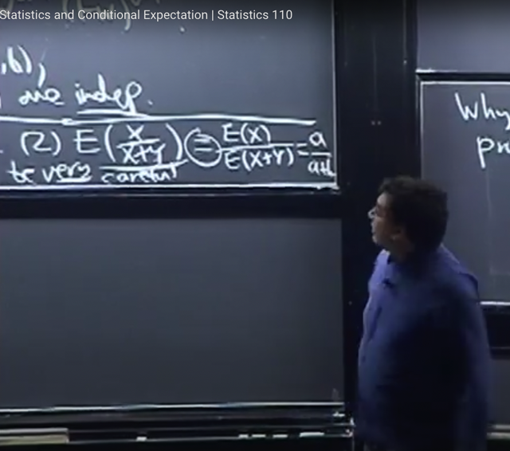</kbd>

🔗 **Related:** [LEC 24: GAMMA DISTRIBUTION & POISSON](untitled.md#node-751)

🔗 **Related:** [LEC 27: CONDITIONAL EXPECTATION GIVEN AN R.V](untitled.md#node-853)

> [!NOTE]
> Và từ đó cho kết quả ngay là **a / a+b**
>
> Vì **X ~ Gamma(a, 1)** mà như đã biết có thể **coi như tổng của a iid Expo(1)** nên:
>
> E(X) = E(Σj=1:a Xj) = Σj=1:a E(Xj) (linearity)
>
> Với Expo thì ta đã chứng minh expectation của Expo(λ) là λ => E(X) = Σ{i=1:a} 1 = a
>
> Tương tự E(X+Y) = a+b. Vậy Kết quả là a/a+b khớp với đáp án tính ra từ EX^n

 

<kbd>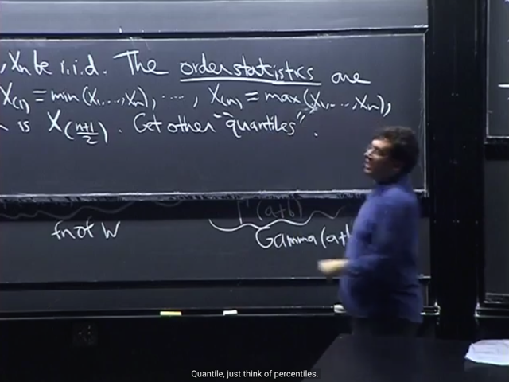</kbd>

<kbd></kbd>

<kbd>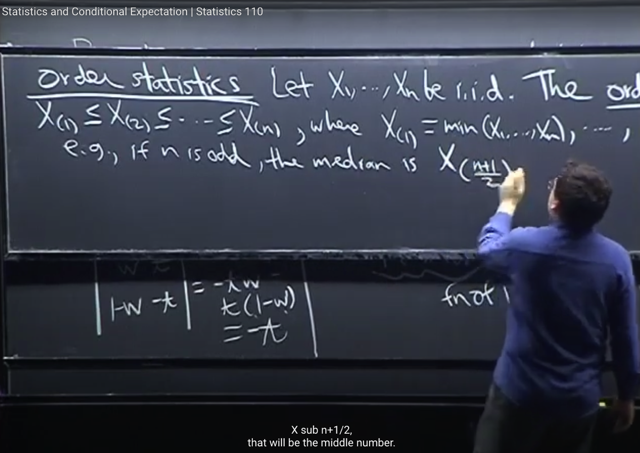</kbd>

> [!NOTE]
> Tiếp ta qua**ORDER STATISTIC**, cụ thể là tìm hiểu **distribution** của **Order statistic**. Đầu tiên gs review một chút về
> khái niệm này
>
> Cho X**1, X2...Xn** iid thì định nghĩa Order statistic có nghĩa là người ta sẽ **xếp thứ tự** giá trị từ **nhỏ nhất X(1) đến
> lớn nhất X(n)**
>
> Để rồi từ đó có các khái niệm như **max**, **min**. Và khái niệm **median**: Nếu **n lẻ**, **median chính là số ở giữa n số**.
> Còn nếu **chẵn** thì là **trung bình của hai số ở giữa**.
>
> Cũng như khái niệm **quantiles**. Ví dụ như một giá trị mà **75% các r.v đều nhỏ hơn** thì gọi là **75% quantiles**
>
> Vậy thì ta sẽ **xem xét distribution của các đại lượng** này. Có điều gs cho rằng, thật ra có**khó khăn** trong việc
> này. Vì dù X1,X2...**iid** nhưng **order statistic thì lại DEPENDENT**. Dễ thấy là, nếu ta **biết min**, có gía trị lớn, thì
> nó cung cấp thông tin cho biết **max sẽ phải lớn hơn**. Đại khái là vậy, do đó chúng dependent.

 

<kbd>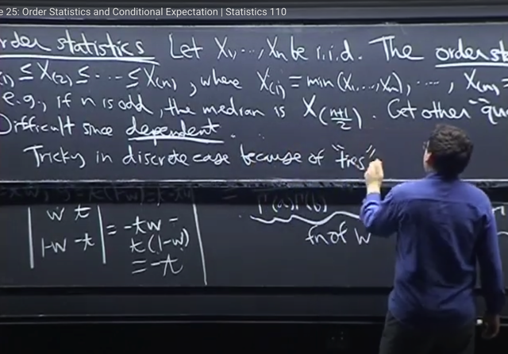</kbd>

> [!NOTE]
> Ngoài ra với **discrete** case còn có vụ **bằng
> nhau (ties)** gây khó khăn thêm

 

<kbd>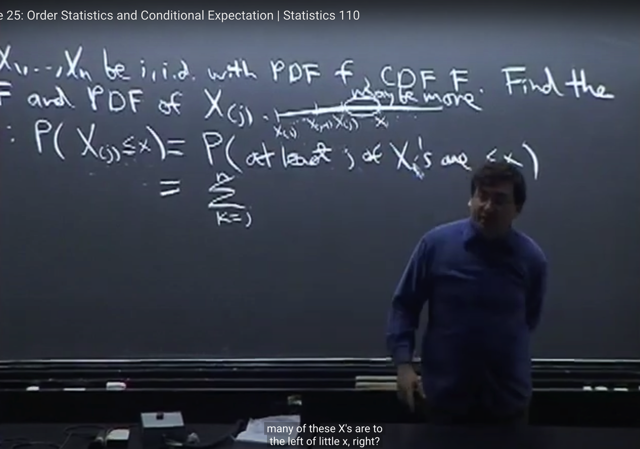</kbd>

> [!NOTE]
> Thế thì ta sẽ đi tìm hiểu **PDF của order statistic** với **continuous** case.
>
> Cho**X1,X2. ...Xn iid**. với PDF **f**và CDF **F**. Yêu cầu **tìm distribution của X(j)**, tức
> là sắp xếp X1,X2... Xn theo thứ tự từ nhỏ đến lớn thì **X(j) là cái đứng thứ j.**
>
> Như thường lệ ta sẽ bắt đầu **tìm CDF**, với ý nghĩa **P(X(j)<=x)**
>
> Để giải bài toán này gs đề nghị ta hãy **vẽ ra**. Để thấy rằng, event **X(j)<=x** có
> nghĩa là mọi **X(1)...X(j-1) X(j)** đều **nằm bên trái x**. **Ở giữa X(j) và x** **có thể có
> thêm X(j+1), X(j+2)**....ta không biết được.
>
> Nhưng **chắc chắn X(1)...X(j) đều nhỏ hơn x**. 
>
> Do đó event **X(j) <= x** đồng nghĩa với event: [**ít nhất có j cái Xi nhỏ hơn x**]
>
> (có nghĩa **không biết cái Xi nào**, nhưng đó **là những cái sau khi xếp thứ tự** trở
> thành **X(1)...X(j)**, như đã nói, **tụi này nằm bên trái x**)
>
> Vậy **P(X(j)<=x)** = **P("ít nhất có j cái Xi nhỏ hơn x")**

 

<kbd>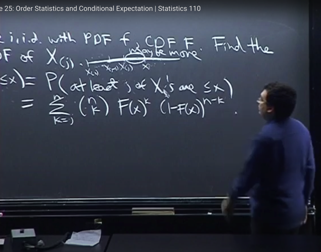</kbd>

> [!NOTE]
> rồi, thế thì nói "**ít nhất có j cái Xi <= x**", thì **số lượng chính xác** (các Xi đứng trước x) có thể có các giá trị là
> **từ** **j trở lên** và**max là n**. Hay nói cách khác, **số lượng chính xác của các Xi đứng trước x** có các **possible
> value** là**j, j+1,....n**
>
> Gọi **số lượng chính xác** này là **k**. Như vừa nói, nó có thể có các **possible value từ j đến n**.
>
> Như vậy có nghĩa là:
>
> "**ít nhất có j cái Xi <= x**" = "**có j cái Xi <= x**" U "**có j+1 cái Xi <=x**" U ...."**có n cái Xi <= x**"
>
> Vậy vì hai event là một nên:
>
> P("ít nhất có j cái Xi <= x") = P("có j cái Xi <= x" U "có j+1 cái Xi <=x" U ...."có n cái Xi <= x")
>
> Và vì đây là **Union** của các **Disjoint** events, nên theo **Axiom 2**:
>
> P("có j cái Xi <= x" U "có j+1 cái Xi <=x" U ...."có n cái Xi <= x")
>
> = P("có j cái Xi <= x") + P("có j+1 cái Xi <=x") + ....P("có n cái Xi <= x")
>
> **P("ít nhất có j cái Xi <= x")**= **Tổng k=j:n P("có k cái Xi <= x") (1)**Tiếp, xét **P("có k cái Xi <= x")**: 
>
> Ta có thể định nghĩa **việc ở bên trái x**, tức **<= x** là **success** còn ngược lại là **failure**. 
> Để rồi event "**có k cái Xi <= x**" tương đương event "**số cái success = k**"
>
> Như vậy ta có thể thấy câu chuyện giống như là, ta có **n i.i.d Bern trial**. Mỗi trial đều có **xác suất success
> là giống nhau** vì **X1,X2...Xn ban đầu i.i.d** nên khi define **success** là event **Xi<=x** thì mọi event Xi<=0 đều có xác
> suất xảy ra như nhau. Gọi xác suất success là p, thì có thể thấy nó như ta có **n Bern(p) trials i.i.d**, và ta
> **đang quan tâm số trial success**, gọi nó là T đi thì ta có thể thấy T là một **Binomial(n, p) r.v.**
>
> Khi đó event ("**có k cái Xi <= x**") tương đương với event (**T=k**). Để rồi  **P("có k cái Xi <= x")** chính là bằng
> **P(T=k)** và như vậy việc **tìm P(T=k)** chính là tìm **PMF của T**. 
>
> Mà PMF của T ~ Bin(n,p), như đã biết có công thức là :
>
> P(T=k) =**(n choose k) * p^k * q^(n-k)** với q = 1-p
>
> Thế thì bây giờ ta **xét p**: p là **xác suất**một **Bern** **trial** **success**, trong câu chuyện trên. Nó chính là **xác suất
> để Xi < x**, đó cũng **chính là CDF function F evaluate tại x**, tức **F(x)** bởi lẽ **đề bài cho** các **i.i.d Xi có CDF là F**, mà
> theo định nghĩa: function với giá trị tại x, **F(x)** mang ý nghĩa nghĩa là **P(Xi<=x)**
>
> Như vậy **p = F(x)**
>
> Từ đó P(T=k) = **(n choose k) [F(x)]^k [1-F(x)]^(n-k)**
>
> Và tiếp nối (1), ta có P**(X(j)<=x) =** **P("ít nhất có j cái Xi <= x") = Tổng k=j:n (n choose k) [F(x)]^k [1-F(x)]^(n-k)**

 

<kbd>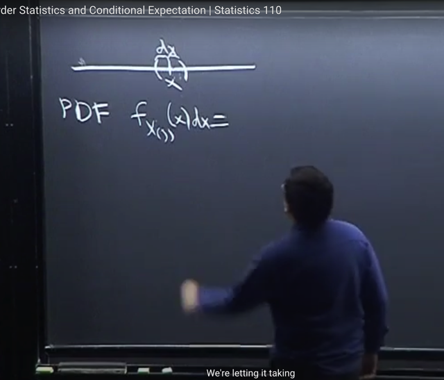</kbd>

> [!NOTE]
> Thế thì, gs nói, sau khi **có CDF**, ta có thể **take derivative** để có **PDF** 
>
> Nhưng ông có **cách làm khác**.
>
> Cho rằng ta cần **tìm PDF tại x**, tức **f(x)**. Hay để cho rõ, đây là **PDF của X(j)**
> ta ghi là **f_X(j)(x)**. 
>
> Thế thì, như đã từng nói, PDF là probabilty **density**, **không phải probability**
> nhưng nếu ta **nhân với một khoảng vô cùng nhỏ dx** thì ta có thể coi đó là
> **xác suất mà X(j) rơi vào vùng dx này.**

 

<kbd>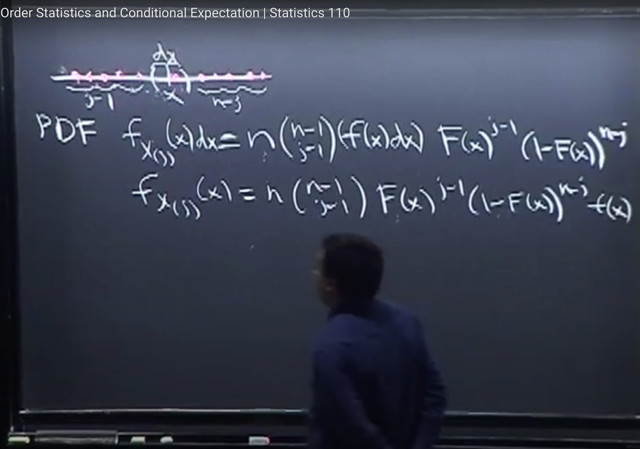</kbd>

> [!NOTE]
> Thế thì event **X(j) rơi vào vùng này** thì có nghĩa là (cùng một event với)
>
> [**Có j-1 Xi nhỏ hơn x**] **VÀ (intersect)** [**một trong số n cái Xi** nằm trong**vùng dx quanh x**]
>
> Và khi nói đến / nói theo kiểu **một trong số**, ta lập tức nghĩ đến **Union**.
>
> Do đó ta sẽ **tìm cách mô tả** ...
>
> event [Có j-1 Xi nhỏ hơn x] VÀ [**một trong số n cái Xi nằm trong vùng dx này**] 
>
> bằng **Union** của các **Disjoint** event, để từ có thể dùng **Axiom 2.**
>
> Thế thì ta thử**đếm số cách** để có một event A
>
> A = [Có j-1 Xi nhỏ hơn x] intersect [một trong số n cái Xi nằm trong vùng này]:
>
> Bước 1: **Chọn một Xi** để đóng vai trò X(j) nằm trong vùng vô cùng nhỏ dx: Có**n possible outcome**.
>
> Bước 2: **Chọn set có j-1 cái Xi** để **cho chúng nằm bên trái Xj**: Có **(n-1 choose j-1)** cách.
>
> Đương nhiên những cái còn lại sẽ cho nằm bên phải. Chỉ có **1 cách**.
>
> Vì kết quả của bước này không ảnh hưởng đến số cách chọn của bước sau nên theo **step**
> **rule**: ta có **n*(n-1 choose j-1)** cách chọn, cũng có nghĩa là ta **có n*(n-1 choose j-1) event A**
>
> Và event A [Có j-1 Xi nhỏ hơn x] intersect [một trong số n cái Xi nằm trong vùng này]
> sẽ là UNION của các event Ak này với k = 1,2...n*(n-1 choose j-1)
>
> Và các event Ak **DISJOINT**
>
> Dùng **Axiom 2** ta có
>
> P([một trong số n cái các Xi nằm trong vùng này]) = Tổng k=1:n*(n-1 choose j-1) P(A_k)
>
> ====
>
> Thế thì, mỗi event A_k đều là **intersect** của các event:  
>
> i) j-1 events [có Xi nhỏ hơn x]. Xác suất mỗi cái là P(X<=x) = F(x) 
>
> ii) một event [một Xi  nằm trong đoạn vô cùng nhỏ dx quanh x], xác suất của nó là f(x)dx
>
> iii) n-j events [có Xi lớn hơn x], Xác suất mỗi cái là P(X>x) = (1-F(x))
>
> Và các events này đều độc lập do các Xi độc lập.
>
> Xác suất của một A_k: P(A_k) = F(x)^(j-1) * (1-F(x))^(n-j) * f(x)dx
>
> Vậy P([một trong số n cái các Xi nằm trong vùng này]) 
>
> = **Tổng k=1:n*(n-1 choose j-1) F(x)^(j-1) * (1-F(x))^(n-j) * f(x)dx**

 

<kbd>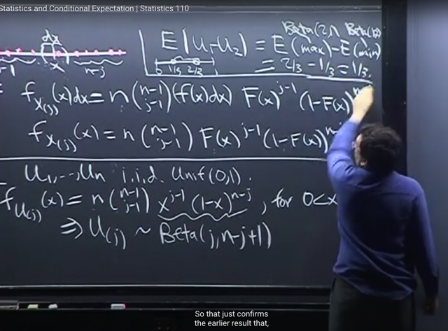</kbd>

> [!NOTE]
> Gs nói đại ý là nếu phải tính joint distribution của order statistic, ta cũng có thể
> giải  bằng cách vẽ ra và phân tích như vừa rồi.
>
> Lướt qua nhanh một ví dụ tìm distribution của **U(j)** với các **U1,...Un** là **i.i.d
> Unif(0,1)**
>
> Áp dụng kết quả vừa rồi với việc vì **X là Uniform(0,1)** r.v nên **f(x) = 1** và **F(x) = x**
> (với uniform, xác suất X<=x tức nằm trong đoạn [0,x] tỉ lệ thuận với chiều dài
> của đoạn [0,x], chính là x). Do đó
>
> **f_U(j)(x)** = **n (n-1 choose j-1)** **x^(j-1)** **(1-x)^(n-j)**
>
> Thế thì gs **chỉ ra** rằng **x^(j-1) (1-x)^(n-j)** chính là dạng của **Beta**. ta nhớ nếu
> X~Beta(a,b) thì PDF của x = **c*x^a-1 (1-x)^b-1**
>
> Nên ở đây U(j) chính là **Beta (j, n-j+1)** và**những cái còn lại ở ngoà**i n*(n choose
> 1) chính là**normalizing constant c**
> Thế thì nhớ lại gs từng nói về bài toán tính **mean** của **|U1-U2|** tức là expected
> value của **khoảng cách giữa hai Uniform**. Trong đó ta đã lập luận nó bằng
> E(max) - E(min) 
>
> Vậy áp dụng kết quả U(j) ~ Beta(j, n-j+1) ở đây, thì max ~ Beta(n,1) = Beta(2,1) 
> và min ~ Beta(1,n) = Beta(1, 2)
>
> Ta đã biết EX của Beta(a,b) là **a/(a+b)**
>
> Từ đó E(max) - E(min) = 2/3 - 1/3 = **1/3**, kết quả này giống kết quả ta giải bữa
> trước

 

<kbd>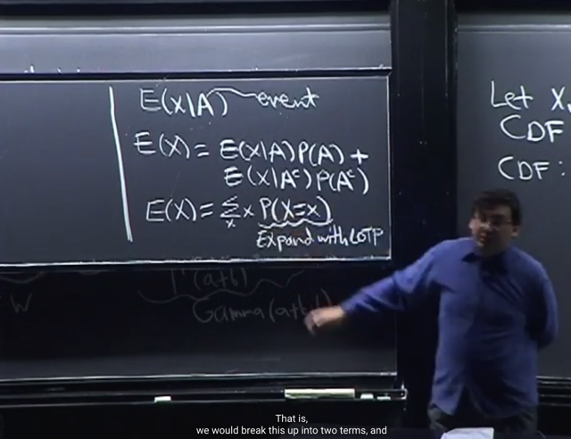</kbd>

> [!NOTE]
> Vài phút cuối nói về **chủ đề lớn** tiếp theo là **Conditional** **Expectation**. Theo gs thì
> cái này nó **khá là intuitively** (đại khái là dễ hiểu) bởi trên cơ sở ta **đã biết về
> conditional probability**.
>
> **E(X|A)** là **mean của X** **given A** và ta chỉ việc thay các probability bằng conditional
> probability.
>
> Nên với discrete case, theo định nghĩa EX = Σx xP(X=x), thì bây giờ ta sẽ có:
>
> E(X|A) = Σx x*P(X=x|A)
>
> Rồi ta có theorem: **E(X)** = **E(X|A)P(A)** + **E(X|A^c)P(A^c)** 
>
> Có thể thấy nó**rất giống Law of Total Probability (LOTP)**
>
> Và để **chứng minh** cái này thì đơn giản là ta sẽ bắt đầu từ định nghĩa của expected
> value EX, là weighted sum của mọi possible value x của X với weight là xác suất
> X mang possible value đó P(X=x)
>
> E(X) = Σx x*P(X=x).
>
> Và với continous: EX = ∫-inf:inf xf(x|A)dx
>
> Và từ đó expand P(X=x) ra bằng cách cho nó conditioned on A
>
> Lập luận như đã quen thuộc với LOTP: 
>
> (X=x) = (X=x, A) U (X=x, A^c) đây là theo set theory nói rằng event B là union của
> hai phần: của B có thuộc A (B,A) và của B không thuộc A (B,A^c).
>
> Nên P(X=x) = P[(X=x, A) U (X=x, A^c)]. Vế phải là xác suất của union các disjoint
> event, nên theo Axiom 2: = P(X=x, A) + P(X=x, A^c)
>
> => P(X=x) = P(X=x, A) + P(X=x, A^c)
>
> Theo conditional probability theorem: P(A,B) = P(A|B)P(B)
>
> P(X=x, A) + P(X=x, A^c) = P(X=x|A)P(A) + P(X=x|A^c)P(A^c)
>
> => EX = Σx x*P(X=x) = **Σx x*[P(X=x|A)P(A) + P(X=x|A^c)P(A^c)]**= Σx x*P(X=x|A)P(A) + Σx x*P(X=x|A^c)P(A^c)
>
> Đưa P(A), P(A^c) ra ngoài vì không phụ thuộc x (đặt thừa số chung)
>
> = P(A) **Σx x*P(X=x|A)** + P(A^c) **Σx x*P(X=x|A^c)**
>
> Mà **Σx x*P(X=x|A)** chính là **E(X|A)**và**Σx x*P(X=x|A^c)**chính là**E(X|A^c)**
>
> Vậy cuối cùng ta có **EX = E(X|A)P(A) + E(X|A^c)P(A^c)**

 

<kbd>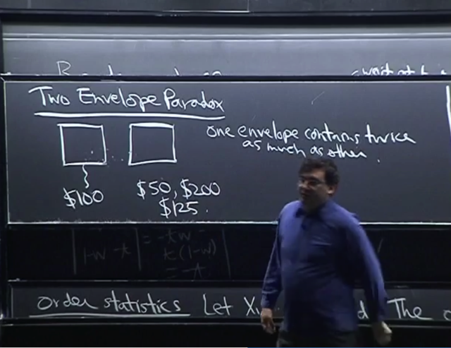</kbd>

> [!NOTE]
> vài phút cuối gs nói về **Envelope** **Paradox**. đại khái là có **hai cái
> bì thư**chứa **tiền** trong đó **một cái gấp đôi cái kia**. câu hỏi là, giả
> sử **mở một cái thấy 100** đô, thì ta **có nên đổi chọn cái kia không**
> (giống như bài toán Monty Hall vậy)
>
> Lập luận đưa ra là, **dựa trên việc cái đầu là 100 đô**, thì **cái sau có
> thể là 50** hoặc **200**. Với**xác suất mỗi possible value đều là 0.5.**
>
> Vậy ta có thể tính **expected value của số tiền trong phong bì** đó là
> **0.5*50+0.5*200**để ra **125**. Từ đó **kì vọng này lớn hơn 100** nên
> ta **luôn nên đổi.**
>
> Bữa sau gs sẽ nói tiếp

 

