# Lec 26 Conditional Expectation

📊 **Progress:** `35` Notes | `36` Screenshots

---
<a id="node-799"></a>

<p align="center"><kbd>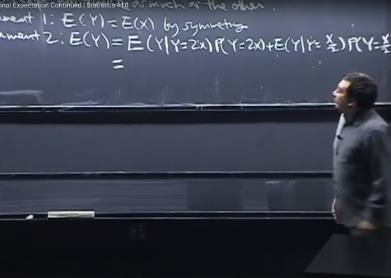</kbd></p>

> [!NOTE]
> đại khái là tiếp tục bài toán **Envelop** Paradox. Thế thì bữa trước ta đã nói,
> khi **tính kì vọng của số tiền** trong **phong bì 2**. Ta tính như sau:
>
> **200*P(phong bì 2 chứa 200)** **+ 50*P(phong bì 2 chứa 50)** `=` **200*0.5 `+` 50*0.5** 
> `=` **125**. Số tiền này lớn hơn 100 (là số tiền trong phong bì 1 đã biết). Do đó
> ta nên đổi qua chọn phong bì 2.
>
> Thế thì khái quát lên, ta gọi **X là số tiền trong phong bì 1**. Thì phong bì 2 sẽ có
> **2 possible value** là **2X** và **X/2** với xác suất xảy ra là **1/2**.
>
> Thế thì có **hai lập luận mâu thuẫn nhau** về giá trị **kì vọng của Y.**
>
> Argument 1 là **vì tính đối xứng**, **E(Y) phải bằng E(X)**.
>
> Argument 2: **E(Y)** ta sẽ dùng **conditional expectation**. Lát nữa ông sẽ nói
> chính thức còn bây giờ đại khái là ta chỉ cần biết nó giống như **Law of Total
> probability trừ việc nó là expectation**.
>
> `E(Y)` `=` **Tổng mọi possible value y của Y: `E(Y` | y)*P(Y=y)**
>
> `=` **E(Y|Y=2X)*P(Y=2X)** `+` **E(Y|Y `=` X/2)*****P(Y=X/2)**

<br>

<a id="node-800"></a>

<p align="center"><kbd>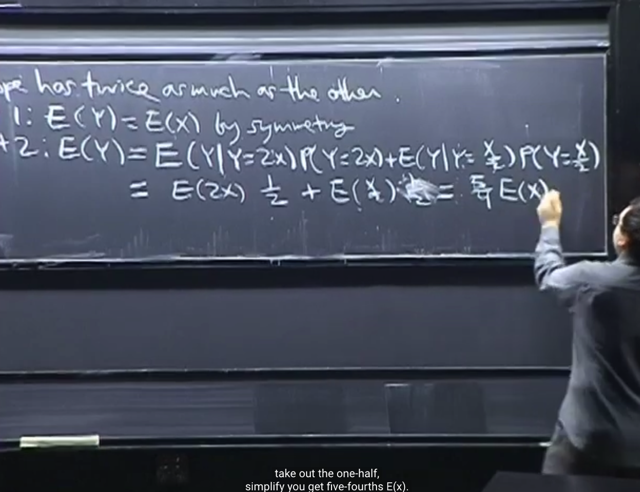</kbd></p>

> [!NOTE]
> Thế thì tính tiếp, với **P(Y=2X)** và **P(Y=X/2)** đều bằng **1/2**
>
> Và **E(Y|Y=2X) `=` E(2X)**, **E(Y|Y=X/2) `=` E(X/2)**   (sử dụng thông tin của condition)
>
> Và từ đó **E(Y) `=` `5/4` E(X)**
>
> Đây chính là sao nó gọi là **Paradox**. Vì hai argument cho ra hai kết quả khác
> nhau của EX

<br>

<a id="node-801"></a>

<p align="center"><kbd>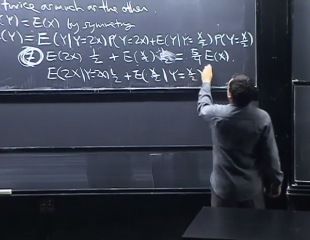</kbd></p>

🔗 **Related:** [LEC 28: INEQUALITIES](untitled.md#node-860)

> [!NOTE]
> Thế thì trong hai argument này **phải có một cái sai**. Và gs cho rằng, cái
> **argument 1 về tính symmetry** **không có lí do gì mà sai**
>
> Do đó argument 2 sai. Và nó sai ở chỗ, k**hi ta dùng thông tin** **condition** thì
> **KHÔNG CÓ NGHĨA LÀ TA CÓ QUYỀN BỎ CONDITION**Và đây chính là **sai lầm phổ biến**. Và gs nói thêm nhiều thảo luận nổ ra về
> bài toán này. Nhưng ta chỉ cần biết là lập luận trên sai ở chỗ này**Ta chỉ có thể bỏ condition sau khi dùng thông tin của nó nếu CHÚNG 
> INDEPENDENT. Có điều trong bài toán này ta không có gì để biện minh
> rằng chúng independent cả. Do đó ta không thể bỏ condition đi được**

> [!NOTE]
> Ta chỉ có thể bỏ condition sau khi dùng thông tin của nó nếu CHÚNG 
> INDEPENDENT (tức 2 event indendent)

<br>

<a id="node-802"></a>

<p align="center"><kbd>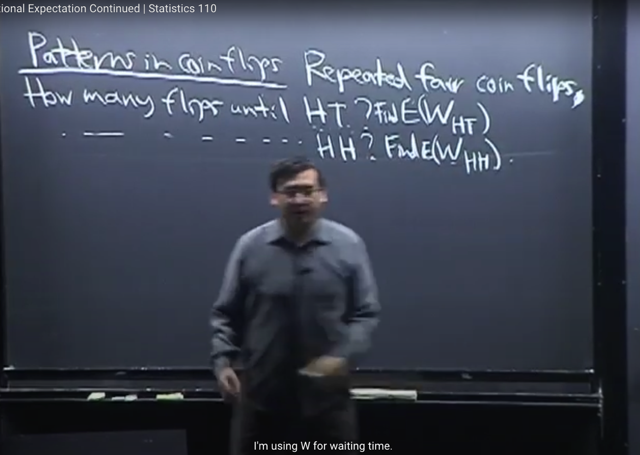</kbd></p>

> [!NOTE]
> Ta qua bài toán này, đại khái là **tung đồng xu nhiều lần**. Và ta sẽ **quan
> tâm** **W_HT** là **số lần tung cho đến khi xuất hiện một event là
> Head-Tail**. Và ta sẽ tính **expected value** của **W_HT**. Tương tự với **W_HH**

<br>

<a id="node-803"></a>

<p align="center"><kbd>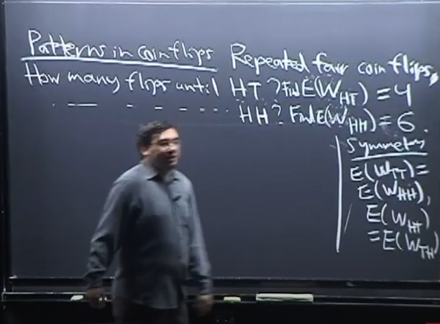</kbd></p>

> [!NOTE]
> Đại khái là **symmetry** cho ta ngay lập tức biết **E(W_TT)** `=` **E(W_HH)**, và
> **E(W_HT)** `=` **E(W_TH)**
>
> Tuy nhiên nó không cho biết **E(W_HT)** có bằng **E(W_HH)** không (gs cho
> biết kết quả sẽ là 4 và 6)

<br>

<a id="node-804"></a>

<p align="center"><kbd>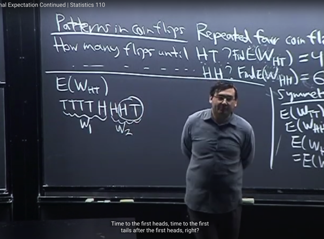</kbd></p>

> [!NOTE]
> Thế thì để**tính E(W_HT)**. Ta có thể hình dung là một chuỗi tung đồng xu có
> kết quả như thế này TTTTHH**HT**.
>
> Để thấy rằng, **số lần tung cho đến khi có kết quả HT** xuất hiện **luôn có thể
> tách** thành **tổng của W1 `=` số lần tung cho đến khi TH xuất** **hiện** và W2 `=`
> **số lần tung** cho đến khi **HT xuất hiện**
>
> Ví dụ chuỗi kết quả là TTT**TH**HH**HT** thì có có W1 `=` 5 và W2 `=` 4 còn nếu
> chuỗi kết quả là HHH**HT** thì W1 `=` 0, W2 `=` 5

<br>

<a id="node-805"></a>

<p align="center"><kbd>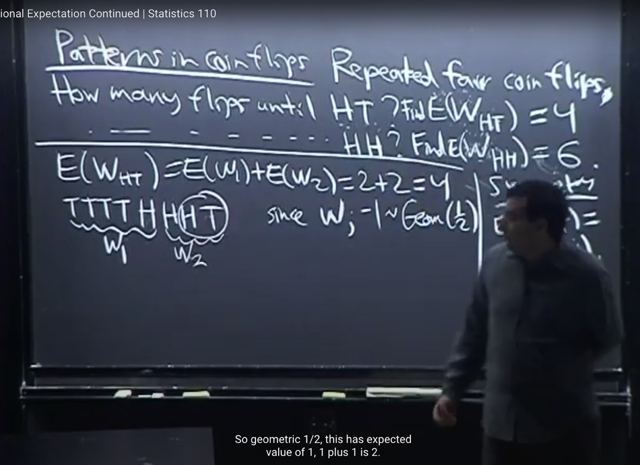</kbd></p>

> [!NOTE]
> Do đó **E(W_HT)** `=` **E(W1 `+` W2)** theo **linearity** ta biết nó `=` **E(W1) `+`
> E(W2)**
>
> Thế rồi, nhớ lại **Geometric** distribution, nếu **X ~ Geom(p)** thì story của X là
> **số lần Bern(p) trial fail** **cho đến khi success**, và theo **convention** ở class
> này sẽ **không tính lần success** vào (tức nếu **ngay lần trial đầu tiên đã
> success** thì X `=` **0**, nên gọi là **start at 0**)
>
> Thế thì, story của **W1** cũng y như vậy, vì story của nó cũng là**số lần T cho
> đến khi H xảy ra**, với mỗi trial cũng là Bern(p) i.i.d. Do đó **W1** cũng là r.v ~
> **Geom(p)**. Nhưng vì W1 **có tính lần success** vào. Cho nên ta sẽ nói **W1-1
> là một Geom(p)** (để nếu lần đầu đã success ngay thì `W1-1` `=` 0 `=>` W1 `=` 1)
>
> Tương tự câu chuyện của **W2** cũng là giống như vậy, chỉ có điều định nghĩa
> **success** là **T xảy ra**. Nhưng cùng story, nên **W2-1 cũng là Geom(p) r.v**
>
> Thế thì bữa trước ta đã chứng minh**expected value** của **Geom(p) là p/q**
>
> ```text
> Vậy E(W1-1) = p/q = 1/2 : 1/2 = 1
> ```
>
> `<=>` `E(W1)` `-` `E(1)` `=` 1 `<=>` `E(W1)` `-` 1 `=` 1 `<=>` **E(W1) `=` 2**Hoàn toàn tương tự thì **E(W2) `=` 2
>
> Vậy `E(W_HT)` `=` `2+2` `=` 4**

<br>

<a id="node-806"></a>

<p align="center"><kbd>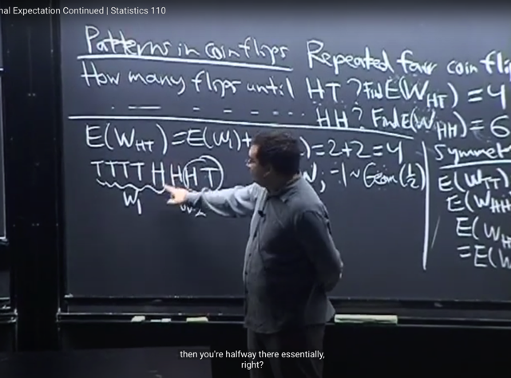</kbd></p>

> [!NOTE]
> Rồi, ta tính qua E(**W_HH**). Ta cũng giả sử có chuỗi kết quả như thế này
> **TTTTHT**.
>
> Thì với `W_HT.` Ta nhận xét là khi chuỗi TTT sau đó H xảy ra (để có chuỗi
> TTTTH) kiểu như ta đã đi một nửa đường, bởi vì sau đó dù chuỗi tiếp theo có
> là HHH, thì ta vẫn đã đi được nửa đường bởi vì chỉ  cần một cái T xảy ra là lập
> tức ta có HT, là xong (vì mục đích là tìm event HT)

<br>

<a id="node-807"></a>

<p align="center"><kbd>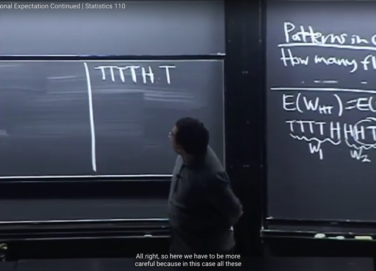</kbd></p>

> [!NOTE]
> Thế còn đối với **W_HH**, thì **khi TH xảy ra**, đến đây **đúng là ta đã đi được nửa
> đường**, nhưng sau đó, **nếu T xảy ra**, tức là TTTTHT thì **mọi chuyện lại reset
> về ban đầu**
>
> Do đó ta **phải dùng Conditional Expectation** trong trường hợp này

<br>

<a id="node-808"></a>

<p align="center"><kbd>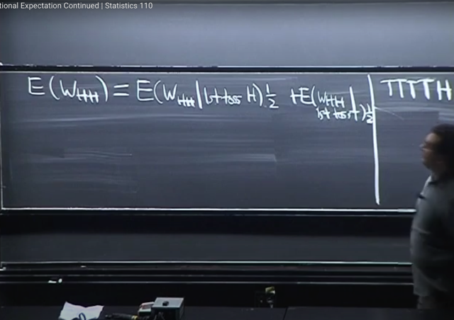</kbd></p>

> [!NOTE]
> Trước tiên ta ôn lại chút về LOTP.
>
> Giả sử X,Y là r.v discrete với possible values của Y là y1,y2
>
> Ta sẽ lập luận từ đầu rằng:
>
> ```text
> (X=x) = (X=x, Y=y1) U (X=x, Y=y2) = U yi={y1,y2) (X=x, Y=yi)
> ```
>
> Điều này dựa vào cơ sở Set theory.
>
> ```text
> Nên P(X=x) = P[(X=x, Y=y1) U (X=x, Y=y2)]
> ```
>
> Thế thì bên trái, là xác suất của Union các Disjoint event, nên Axiom 2 cho
> ```text
> phép: P[(X=x, Y=y1) U (X=x, Y=y2)] = P(X=x, Y=y1) + P(X=x, Y=y2)
> ```
>
> ```text
> Do đó P(X=x) = P(X=x, Y=y1) + P(X=x, Y=y2)
> ```
>
> ```text
> Và dựa vào conditional theorem:  P(X=x, Y=y1) = P(X=x|Y=y1)*P(Y=y1)
> ```
>
> ```text
> và P(X=x, Y=y2) = P(X=x | Y=y2) * P(Y=y2)
> ```
>
> Do đó: 
>
> **P(X=x) `=` `P(X=x` | `Y=y1)*P(Y=y1)` `+` `P(X=x` | `Y=y2)` * `P(Y=y2)`
>
> Đây chính là Law of Total Probability**====
>
> Vậy thì ở đây cũng tương tự như vậy, chỉ khác là ta tính expectation thay 
> vì probability
>
> Có nghĩa giống như đây là **áp dụng LOTP với expectation**. 
>
> ```text
> E(W_HH) = E(W_HH | "1st toss ra H") * P("1st toss ra H")
> ```
> `+` `E(W_HH` | "1st toss ra T") * P("1st toss ra T")
>
> `=` **E(W_HH | "1st toss ra H") * `(1/2)` `+` `E(W_HH` | "1st toss ra T") * (1/2)**

<br>

<a id="node-809"></a>

<p align="center"><kbd>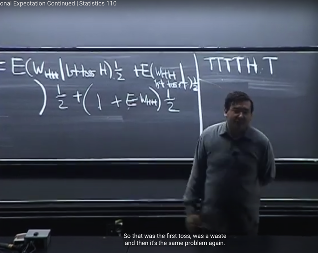</kbd></p>

> [!NOTE]
> Thế thì xét `E(W_HH` | "1st toss ra T"): 
>
> Gs lập luận là, nếu 1st toss ra T, thì coi như ta lãng phí một lần toss, và bài toán
> vẫn y như vậy, vẫn quay lại ban đầu. Do đó: 
>
> **E(W_HH | "1st toss ra T") `=` 1 `+` E(W_HH)**

> [!NOTE]
> Thực sự chưa
> hiểu lắm chỗ này

<br>

<a id="node-810"></a>

<p align="center"><kbd>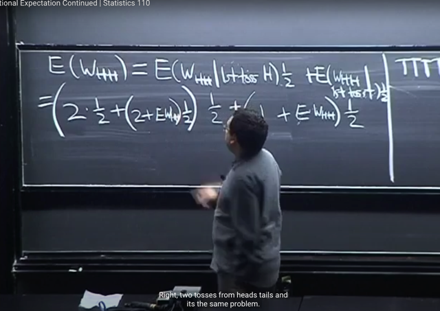</kbd></p>

> [!NOTE]
> Còn `E(W_HH` | 1st toss is H). Thế thì với việc 1st toss là H,
>
> Thì có thể coi nó tiếp tục chia ra là:
>
> `E(W_HH` | 1st toss is H , 2nd toss is H) * P(2nd toss is H | 1st toss is H)
> `+` `E(W_HH` | 1st toss is H , 2nd toss is T) * P(2nd toss is T  | 1st toss is H)
>
> i) `E(W_HH` | 1st toss is H, 2nd toss is H) * P(2nd toss is H | 1st toss is H): 
>
> Nếu lần thứ 2 cũng ra H, là ta đã done, tức là đã có HH xảy ra. 
>
> ```text
> Như vậy E(W_HH | 1st toss is H, 2nd toss is H) = 2, với xác suất xảy ra là 1/2:
> ```
> **2*(1/2)** (vì xác suất cái lần toss thứ 2 ra H là `1/2)`
>
> ii) `E(W_HH` | 1st toss is H | 2nd toss is T) * P(2nd toss is T) Trường hợp thứ
> hai là lần thứ 2 ra T, thì như lập luận lúc nãy, ta lãng phí 2  lần toss và vấn
> đề quay lại ban đầu
>
> nên ở case này **[2+E(W_HH)] * `(1/2)`
>
> Vậy `E(W_HH` | 1st toss is H) `=` `2*(1/2)` `+` `[2+E(W_HH)]` * (1/2)**

<br>

<a id="node-811"></a>

<p align="center"><kbd>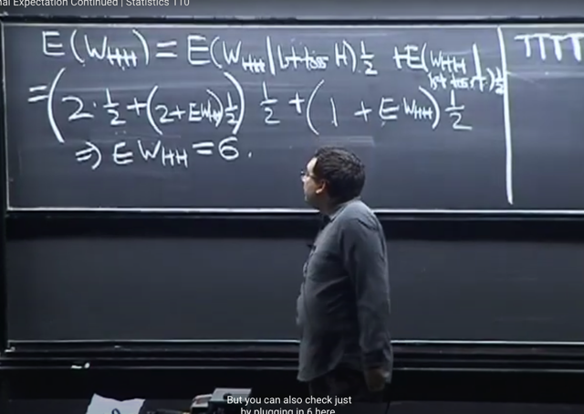</kbd></p>

> [!NOTE]
> Từ đó ta có  giải ra ta có
>
> ```text
> [1 + E(W_HH)] * (1/2) + 2*(1/2) + [2+E(W_HH)] * (1/2) = E(W_HH)
> ```
>
> Giải ra `E(W_HH)` `=` 6

<br>

<a id="node-812"></a>

<p align="center"><kbd>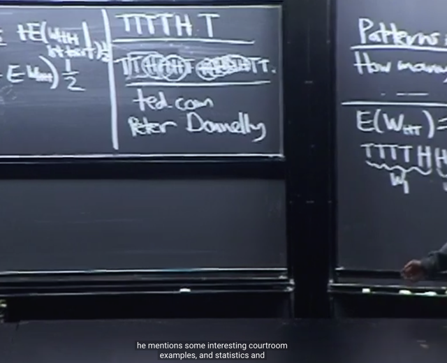</kbd></p>

> [!NOTE]
> gs khuyên nên xem trong ted talk bài nói chuyện của Peter
> Donnelly về statistic trong nghiên cứu Gene

<br>

<a id="node-813"></a>

<p align="center"><kbd>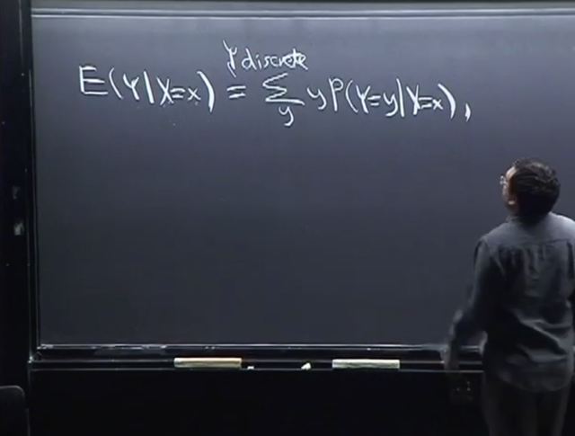</kbd></p>

> [!NOTE]
> Gs nói qua định nghĩa của **CONDITIONAL EXPECTATION**. Như ta đã biết
> **expectation** là **mean**, với **discrete** case thì nó là **weighted sum** các
> **possible** values, với weight là x**ác suất possible value xảy ra**.
>
> **E(Y) `=` `Σ` mọi possible value y: y * P(Y=y)**
>
> Thế thì với conditional expectation **E(Y|X=x)**, mọi chuyện **vẫn giống vậy**, chỉ
> khác là **PMF P(Y=y)** sẽ thay bằng **conditional PMF P(Y=y|X=x)**
>
> **E(Y|X=x)** `=` **Σ mọi possible value y: y * P(Y=y|X=x)**
>
> `P(Y=y|X=x)` là **Conditional PMF
>
> CHÚ Ý `E(Y|X=x)` là expected value của Y CONDITION ON EVENT `X=x`
> Nhớ không `X=x` là một event. Nên `E(Y|X=x)` là một NUMBER. Nhưng nếu
> coi x là dummy variable thì `E(Y|X=x)` cũng có thể hiểu là function g(x)
>
> Để tí nữa ta sẽ thấy `E(Y|X),` là expected value của Y CONDITION ON
> RANDOM VARIABLE X. Và nó sẽ là một function g(u) apply lên một random
> variable X, để có g(X), nên nó là một RANDOM VARIABLE.**

> [!NOTE]
> ĐỊNH NGHĨA CỦA CONDITIONAL EXPECTATION
>
> `E(Y|X=x)` vẫn là weighted sum của mọi possible values của Y,  với weight là
> xác suất Y mang giá trị possible values đó, nhưng bây giờ là conditional
> PMG `P(Y=y|X=x)`
>
> ```text
> E(Y|X=x) = Σ mọi possible value y: y * P(Y=y|X=x)
> ```

<br>

<a id="node-814"></a>

<p align="center"><kbd>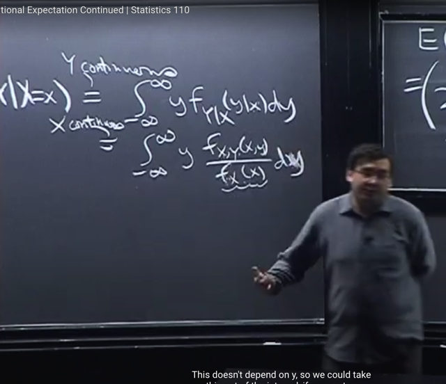</kbd></p>

🔗 **Related:** [LEC 27: CONDITIONAL EXPECTATION GIVEN AN R.V](untitled.md#node-836)

> [!NOTE]
> Với **continuous** case, ta sẽ có dạng tương đương là:
>
> **E(Y|X=x)** `=` `∫-inf:inf` y***f_Y|X(y|x)** dy
>
> Với `f_Y|X(y|x)` là**conditional PDF**. 
>
> Và cái này thì ông nói hoàn tương tự như conditional probability theorem
> ta đã biết quy định P(A|B) `=` P(A,B) `/` P(B)
>
> dẫn đến 
>
> ```text
> P(Y=y|X=x) = P(Y=y,X=x) / P(X=x)
> ```
>
> với `P(Y=y,` `X=x)` gọi là **Joint PMF**, và `P(X=x)`  là **Marginal PMF**
>
> thì với PDF:
>
> **f_Y|X(y) `=` `f_X,Y(x,y)` `/` f_X(x).**
>
> Với **f_X,Y(x,y)** như đã biết là **Joint PDF**, và **f_X(x)** là**Marginal PDF của X**
>
> Do đó **E(Y|X=x) =** **∫-inf:inf y * `f_X,Y(x,` y) `/` `f_X(x)` dy**Và nói thêm vì **f_X(x)** là **density function theo x**, nên khi **tích phân theo y**, ta
> **coi nó như constant**nên có thể **đem bỏ ra ngoài tích phân**

> [!NOTE]
> ```text
> CONTINUOUS CASE: E(Y|X=x) = ∫-inf:inf y*f_Y|X(y|x) dy
> ```

<br>

<a id="node-815"></a>

<p align="center"><kbd>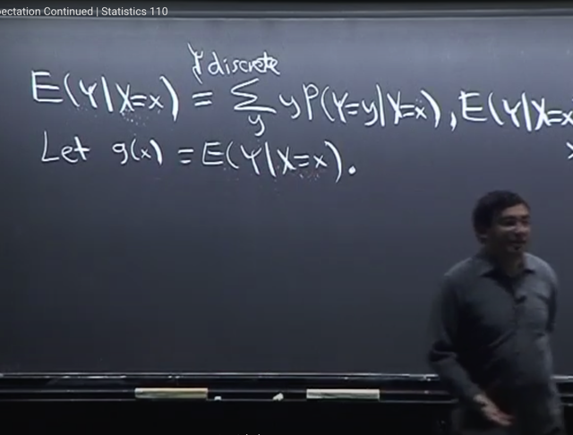</kbd></p>

> [!NOTE]
> Rồi, gs ghi thế này **g(x) `=` E(Y|X=x)** nhằm nhấn mạnh rằng E(Y|X=x)**là
> function theo x, PHỤ THUỘC x.**
>
> Ông nói rằng thấy **rất nhiều lần sai sót** của sinh viên khi tính **E(Y|X=x)**
> **mà lại ra kết quả là function của Y**
>
> Bởi lẽ **ý nghĩa của E(Y|X=x)** là **trung bình mọi giá trị của Y**, khi biết `X=x`
> do đó, nó **không có lí do gì để phụ thuộc Y**. 
>
> **Nếu X,Y independent**, thì **X=x** **không bổ sung gì thông tin** cho việc tính
> mean của Y, khi đó **E(Y|X=x) trở thành E(Y)** và **g(x) không còn phụ thuộc
> x, tức là nó là hằng số.**

<br>

<a id="node-816"></a>

<p align="center"><kbd>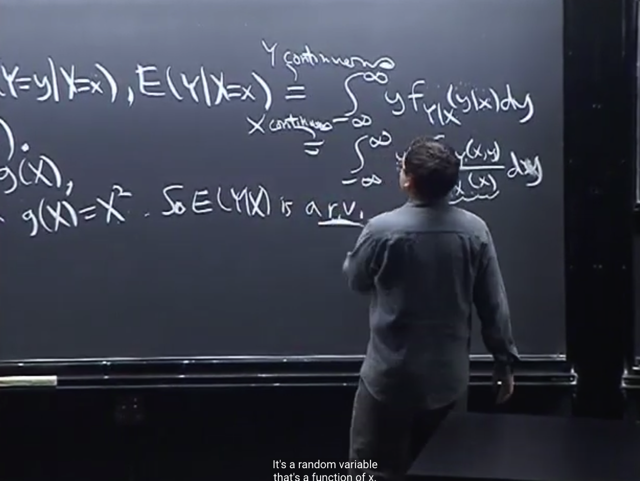</kbd></p>

<p align="center"><kbd>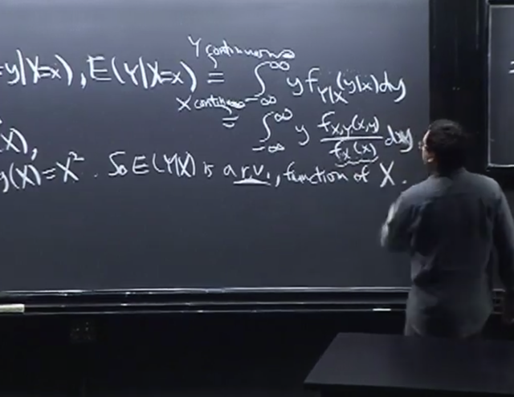</kbd></p>

<p align="center"><kbd></kbd></p>

<p align="center"><kbd></kbd></p>

<p align="center"><kbd>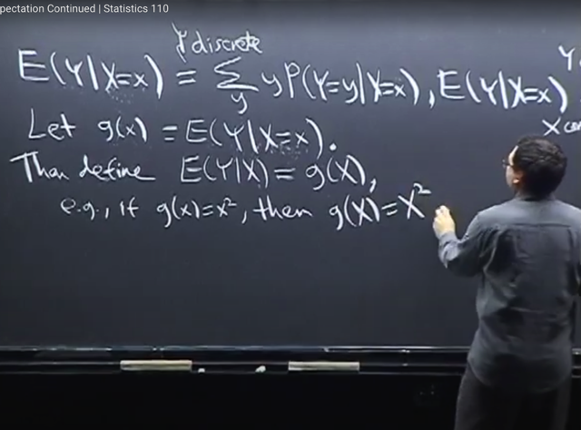</kbd></p>

> [!NOTE]
> Thế thì từ đó cho ta định nghĩa về **EXPECTATION CONDITIONED ON A RANDOM VARIABLE
>
> `E(Y|X)` `=` g(X)**Để hiểu cho đúng về g(X) ta lấy ví dụ g(x) là x^2, thì g(X) ở đây mang ý nghĩa là giống như một function của
> random variable X g(X) `=` X^2 chứ**không phải là thay X vào g(x).**
>
> Để rồi, với các giá trị khác nhau của random variable X, thì `E(Y|X)` sẽ có các giá trị khác nhau, và nó
> giống như với các giá trị khác nhau của X, thì g(X) có các giá trị khác nhau.
>
> Nên như đã biết X là random variable thì apply function g nên nó cũng tạo một random variable g(X)
>
> Vậy **E(Y|X) LÀ MỘT RANDOM VARIABLES, và là một function of X**

> [!NOTE]
> EXPECTATION CONDITIONED ON A **RANDOM VARIABLE**
>
> `E(Y|X)` `=` **g(X)**

<br>

<a id="node-817"></a>

<p align="center"><kbd>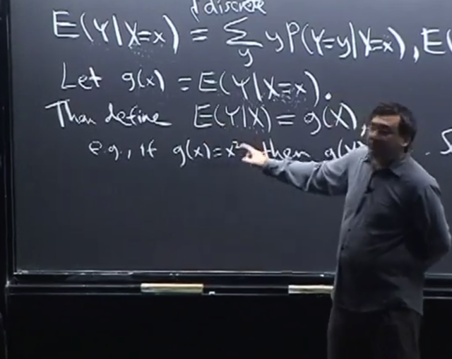</kbd></p>

🔗 **Related:** [LEC 27: CONDITIONAL EXPECTATION GIVEN AN R.V](untitled.md#node-833)

> [!NOTE]
> Và giải thích, kiến giải nôm na cái này **E(Y|X)** (intuitively interpretation) cái
> này đó là: Tuy **X,** như đã biết, là **random variable**, nhưng **giả bộ rằng ta
> biết giá trị của nó**, thì dựa trên đó**expected value của Y là bao nhiêu**
>
> Và gs nói, rằng cách kiến giải `E(Y|X)` cũng không khác lắm với `E(Y|X=x)`
> chẳng qua là trong `E(Y|X)` mang ý nghĩa như vừa nói, nó là **CONDITION
> ON A RANDOM VARIABLE X**, và ta hiểu rằng, **giả bộ biết giá trị của X**
> thì **expected value của Y là bao nhiêu**.
>
> Còn `E(Y|X=x)` là **CONDITIONED ON EVENT X=x**, mang ý nghĩa hầu như
> cũng****tương tự, là**dựa trên event `X=x` xảy ra**, cũng chính là việc biết
> giá trị của r.v X, thì **mean của Y là bao nhiêu**Gs nói thêm chẳng qua `E(Y|X)` nó compact hơn, và nếu có thấy khó hiểu thì
> cứ liên hệ nó với E(Y|X=x)****Và tí nữa ta sẽ thấy, khi **tìm ra g(x), như đã nói ở trên rằng `E(Y|X=x)` là
> function of x thì ta sẽ có `E(Y|X)` là r.v và là function of X g(X)**

<br>

<a id="node-818"></a>

<p align="center"><kbd>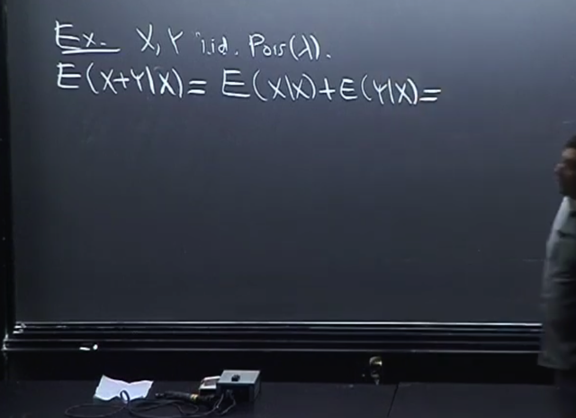</kbd></p>

> [!NOTE]
> Ta qua một ví dụ, cho **X, Y là Pois(λ)** **i.i.d**
>
> Cần tìm **E(X+Y|X)**
>
> Thế thì, đầu tiên ta sẽ biết thêm rằng, **Linearity** vẫn áp dụng bình thường với 
> conditional expectation: 
>
> **E(X+Y|X) `=` `E(X|X)` `+` E(Y|X)**

<br>

<a id="node-819"></a>

<p align="center"><kbd>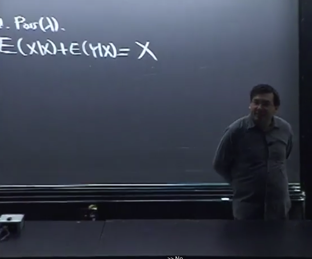</kbd></p>

> [!NOTE]
> Thế thì, **E(X|X) chính là X**. Vì sao? Vì nó mang ý nghĩa là **gỉa bộ ta biết giá trị
> của X**, thì **mean `/` giá trị dự đoán của X là gì?** Thì **chính là X** chứ gì.
>
> Bởi lẽ, **E(X)** mang **ý nghĩa** là tuy **không biết chính xác giá trị của X**, vì nó
> là random variable. Nhưng ta **muốn dự đoán giá trị** của nó, thể hiện qua 
> **expected value, hay trung bình**.
>
> Do đó `E(X|X)` lẽ tự nhiên mang ý nghĩa là cho rằng, **giả dụ biết giá trị của X**
> rồi thì ta **đoán giá trị của X là bao nhiêu**, thì đương nhiên nó **chính là X** cái
> mà ta nói là đã biết giá trị

<br>

<a id="node-820"></a>

<p align="center"><kbd>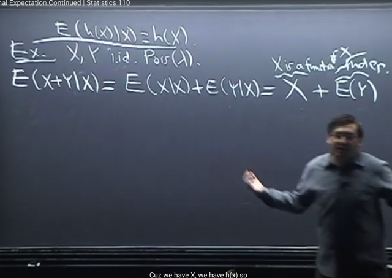</kbd></p>

🔗 **Related:** [LEC 27: CONDITIONAL EXPECTATION GIVEN AN R.V](untitled.md#node-836)

> [!NOTE]
> Hoặc là ta có thể **coi X là function** X `=` **f(X) `=` X**
>
> Và gs cho biết ta **có thể áp dụng `E(h(X)|X)` `=` h(X)**
>
> (cái này gs nói ta sẽ quay lại sau, nhưng mang ý nghĩa cũng rất dễ hiểu và
> hợp lí, đó là `E(h(X)|X)` mang **ý nghĩa là** nếu **biết giá trị của X** thì **dự
> đoán giá trị của h(X) là gì**. Thì đương nhiên là chỉ việc **apply hàm h cho X `-`
> cái mà đã biết giá trị.**
>
> Còn tiếp theo vì X,Y **i.i.d** nên**việc biết giá trị của X** **không giúp gì** cho việc
> **đoán giá trị của Y**. Do đó **E(Y|X) `=` E(Y)**

<br>

<a id="node-821"></a>

<p align="center"><kbd>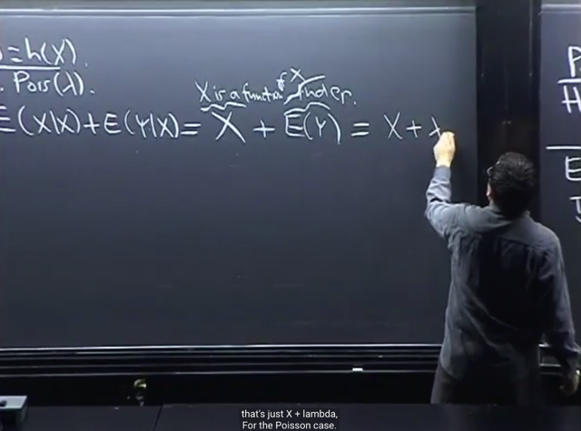</kbd></p>

> [!NOTE]
> Và **E(Y) `=` λ** do Y**~ Pois(λ)**. 
>
> Nói chung là qua ví dụ này ta biết về: 
>
> i) Vẫn có thể **áp dụng linearity** cho **conditional expectation**
>
> ii)  **E(Y|X) `=` E(Y)** nếu **X, Y independent**. 
>
> iii) **E(X|X) `=` X**, hay **E(h(X)|X) `=` h(X)**

<br>

<a id="node-822"></a>

<p align="center"><kbd>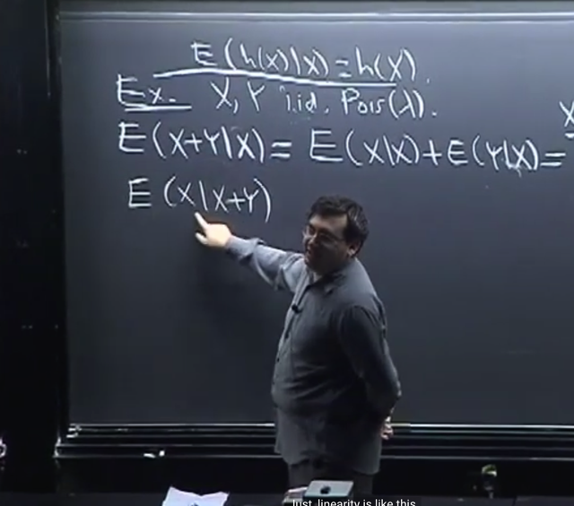</kbd></p>

> [!NOTE]
> Bây giờ ta **thử tính E(X|X+Y)**. Thì gs lưu ý ta **không thể tách thành `E(X|Y)` `+`
> E(X|X)** , đây là **hoàn toàn sai.**

<br>

<a id="node-823"></a>

<p align="center"><kbd>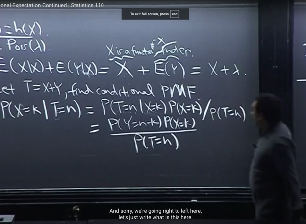</kbd></p>

<p align="center"><kbd></kbd></p>

<p align="center"><kbd>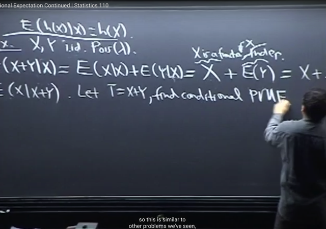</kbd></p>

> [!NOTE]
> Gs nói có **2 cách làm**, cách 1 là ta sẽ **đặt T `=` X+Y**. Và theo định nghĩa của 
> conditional expectation với discrete case. Ta sẽ**tìm conditional PMF P(X=k|T=n)**
>
> Lập luận lại cho nhớ: Ta có **E(X) `=` `Σ` mọi possible value k: x*P(X=k)**
>
> thì áp dụng cho **E(X|T=n) =** **Σ mọi possible value x: x* P(X=k|T=n)**
>
> Áp dụng Bayes rules ta có: **P(X=k|T=n)** `=` **P(T=n|X=k)*P(X=k)/P(T=n)**
>
> i) Xét cái **P(T=n|X=k)**: 
>
> thì vì `T=X+Y` `<=>` `Y=T-X` nên **(T=n|X=k)** `=` `(X+Y=n|X=k)` `=` **(Y=n-X|X=k)**
>
> Vậy **P(T=n|X=k)** `=` **P(Y=n-X|X=k)**. Và ta có thể **dùng thông tin cho bởi condition** để 
>
> `=` **P(Y=n-k|X=k)**. Đến đây, **vì X,Y independent, nên ĐƯỢC PHÉP BỎ ĐI X=k**
>
> `=>` `P(Y=n-k|X=k)` `=` **P(Y=n-k)**
>
> Từ đó `P(X=k|T=n)` `=` **P(Y=n-k)*P(X=k) `/` P(T=n)**

<br>

<a id="node-824"></a>

<p align="center"><kbd>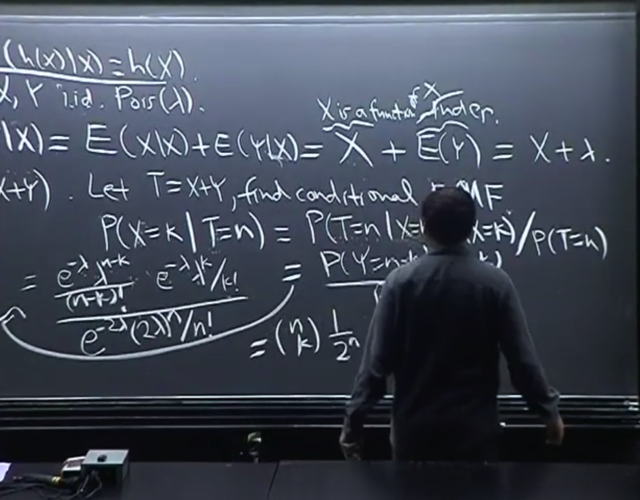</kbd></p>

🔗 **Related:** [TÓM TẮT:  - Tính MGF M(t) của Expo(1) = 1/(1-t) t < 1  - Khi đã có MGF, như bài trước ta đã biết các lí do mà MGF quan trọng trong đó có reason #1 đó là ta chỉ cần tính đạo hàm cấp n của nó sẽ cho ta n'th moment.  - Dù ta có thể tính đạo hàm nhiều lần để có 1st, 2nd moment nhưng có cách hay hơn. Bằng cách nhận ra 1/(1-t) liên quan đến Geometric series  a + ar + ar^2 = Tổng k=0:infinity a*r^k với |r| < 1 sẽ converge về a/[1-r]  Nên 1/1-t chính là Tổng n=0:infinity t^n với |t| < 1  Thế thì theo gs, từ đây cho phép ta KHỎI CẦN TÍNH ĐẠO HÀM CẤP N ĐỂ CÓ MOMENT THỨ N LÀM GÌ CHO MỆT, mà chỉ cần ĐỌC NÓ RA THÔI  Cụ thể là ta đã biết ở bài trước rằng, n'th moment = đạo hàm cấp n của M(t) (là coefficient của (t^n / n!) khi expand M(t) theo Taylor series tại 0)  Do đó, bằng cách tạo ra (t^n / n!) thì BẤT CỨ CÁI GÌ GẮN VỚI NÓ CHÍNH LÀ COEFFICIENT, VÀ CHÍNH LÀ N'TH MOMENT  Do đó ta sẽ nhân thêm n! và chia n! để có (t^n / n!). Như vậy cái lòi ra làm coefficient của t^n/n! ở đây là n! CHÍNH LÀ N'TH MOMENT.  Từ đó cho phép ta ĐỌC LUÔN RẰNG: 1ST MOMENT (EX) LÀ 1!, 2ND MOMENT E(X^2) LÀ 2!  N'TH MOMENT CỦA EXPO(1) E(X^n) = n!  -  đây là tính chất RẤT MẠNH CỦA MGF. Vì ví dụ như khi tính n'th moment (E[X^n]) thì nếu dùng LOTUS, ta phải TÍNH TÍCH PHÂN (INTEGRAL) VÀ CÓ THỂ GẶP NHỮNG TÍCH PHÂN RẤT PHỨC TẠP.  Trong khi đó, nếu ta có MGF, để có nth moment, ta CHỈ CẦN TÍNH DERIVATIVE MÀ DERIVATIVE THÌ THƯỜNG DỄ HƠN LÀ TÍNH TÍCH PHÂN  -Từ n'th moment của Expo(1) ta dễ dàng có n'th moment của Y ~ Expo(λ): E[Y^n] = n! / λ^n  - N'TH MOMENT CỦA N(0,1) VỚI N LẺ ĐỀU BẰNG 0  - MGF CỦA POIS(λ) = e^[λ(e^t-1)]  - Nếu Y ~ Pois(µ) và X~Pois(λ) và biết X, Y INDEPENDENT thì X+Y ~ Pois(λ+µ)](tóm_tắt_tính_mgf_mt_của_expo1_11_t_t_1_khi_đã_có_mgf_như_bài_trước_ta_đã_biết_các_lí_do_mà_mgf_quan_trọng_trong_đó_có_reason_1_đó_là_ta_chỉ_cần_tính_đạo_hàm_cấp_n_của_nó_sẽ_cho_ta_nth_moment_dù_ta_có_thể_tính_đạo_hàm_nhiều_lần_để_có_1st_2nd_moment_nhưng_có_cách_hay_hơn_bằng_cách_nhận_ra_11_t_liên_quan_đến_geometric_series_a_ar_ar2_tổng_k0infinity_ark_với_r_1_sẽ_converge_về_a1_r_nên_11_t_chính_là_tổng_n0infinity_tn_với_t_1_thế_thì_theo_gs_từ_đây_cho_phép_ta_khỏi_cần_tính_đạo_hàm_cấp_n_để_có_moment_thứ_n_làm_gì_cho_mệt_mà_chỉ_cần_đọc_nó_ra_thôi_cụ_thể_là_ta_đã_biết_ở_bài_trước_rằng_nth_moment_đạo_hàm_cấp_n_của_mt_là_coefficient_của_tn_n_khi_expand_mt_theo_taylor_series_tại_0_do_đó_bằng_cách_tạo_ra_tn_n_thì_bất_cứ_cái_gì_gắn_với_nó_chính_là_coefficient_và_chính_là_nth_moment_do_đó_ta_sẽ_nhân_thêm_n_và_chia_n_để_có_tn_n_như_vậy_cái_lòi_ra_làm_coefficient_của_tnn_ở_đây_là_n_chính_là_nth_moment_từ_đó_cho_phép_ta_đọc_luôn_rằng_1st_moment_ex_là_1_2nd_moment_ex2_là_2_nth_moment_của_expo1_exn_n_đây_là_tính_chất_rất_mạnh_của_mgf_vì_ví_dụ_như_khi_tính_nth_moment_exn_thì_nếu_dùng_lotus_ta_phải_tính_tích_phân_integral_và_có_thể_gặp_những_tích_phân_rất_phức_tạp_trong_khi_đó_nếu_ta_có_mgf_để_có_nth_moment_ta_chỉ_cần_tính_derivative_mà_derivative_thì_thường_dễ_hơn_là_tính_tích_phân_từ_nth_moment_của_expo1_ta_dễ_dàng_có_nth_moment_của_y_expoλ_eyn_n_λn_nth_moment_của_n01_với_n_lẻ_đều_bằng_0_mgf_của_poisλ_eλet_1_nếu_y_poisµ_và_xpoisλ_và_biết_x_y_independent_thì_xy_poisλµ.md#node-586)

> [!NOTE]
> Và vì X,Y ~ Pois(λ), nên các **P(Y=n-k)** và **P(X=k)** chỉ việc dùng công thức
> **PMF** của Pois(λ) ráp vô. Đồng thời, vì X,Y là Pois(λ) nên **tổng của
> chúng cũng là Pois(λ+λ)** mà ta đã chứng minh bữa trước (theo link)
>
> Do đó **P(T=n)** cũng chỉ việc áp dụng **PMF của Pois(2λ)**
>
> Kết qủa sau khi thu gọn là **(n choose k) (1/2)^n**
>
> Thì có cũng chính là **(n choose k) `(1/2)^k` (1-1/2)^(n-k)** cho thấy**X|T=n là một Bin(n, `p=1/2)` với ý nghĩa là nếu biết T `=` n thì X sẽ là
> rv ~ Bin(n, p=1/2)**

<br>

<a id="node-825"></a>

<p align="center"><kbd>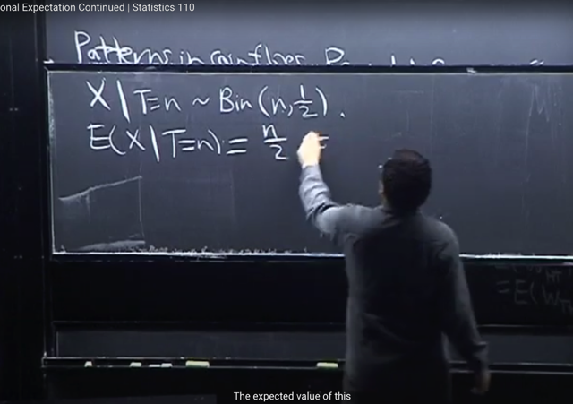</kbd></p>

> [!NOTE]
> Và như vậy **E(X|T=n)** sẽ có thể hiểu là expected value của X khi biết `T=n,` và
> với việc **X|T=n ~ Bin(n, 1/2)** tức là với việc **T=n thì X là Bin(n, `1/2)` r.v**
>
> Nên **expect value của `X|T=n` là expected value của một Bin(n, `1/2)` r.v**
>
> Và ta đã biết với Bin(n,p) thì mean của nó là **np** Vậy `E(X|T=n)` `=` `n*(1/2)` `=` **n/2**

<br>

<a id="node-826"></a>

<p align="center"><kbd>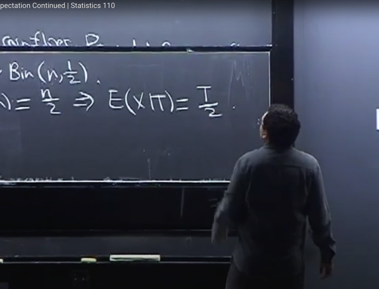</kbd></p>

> [!NOTE]
> Đại khái là **E(X|T=n)** `=` `n/2` là có ý nghĩa là **conditioned on event T=n** như đã nói
> và dĩ nhiên event `T=n` mang ý nghĩa là ..event T mang giá trị cụ thể là n
>
> Thế thì ta có thể **chuyển về dạng conditioned on random variable E(X|T)** 
> chỉ cần **thay T vào n để có `T/2:` `E(X|T)` `=` T/2**
>
> với ý nghĩa là nếu biết giá trị của T, thì best prediction cho X sẽ là `T/2`
>
> Và kết quả này ông cho rằng rất intuitive, vì khi biết tổng của X,Y là ví dụ 100
> thì sẽ hợp lí khi đoán mỗi cái là 50
>
> Và cũng nhận ra lúc này ta có `E(X|T)` là một function apply lên random variable T
> cụ thể function đó là g(u) `=` `u/2.` Và khi apply lên T, g(T) cũng là một random variable

<br>

<a id="node-827"></a>

<p align="center"><kbd>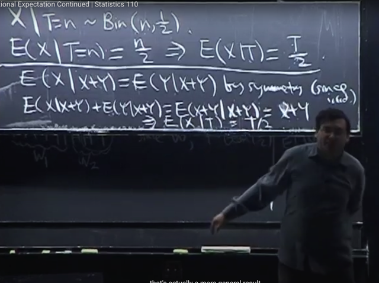</kbd></p>

> [!NOTE]
> gs cho một cách giải khác. Đó là, vì X,Y**i.i.d**, nên theo **Symmetry**:
>
> **E(X|T) `=` E(Y|T)**
>
> ```text
> Mà E(X+Y|T) = E(T|T) = T
> ```
>
> ```text
> Và E(X+Y|T) = E(X|T) + E(Y|T) (linearity)
> ```
>
> ```text
> E(X|T) + E(Y|T) = T, mà E(X|T) = E(Y|T)
> ```
>
> ```text
> Suy ra: E(X|T) = E(Y|T) = T/2
> ```

<br>

<a id="node-828"></a>

<p align="center"><kbd>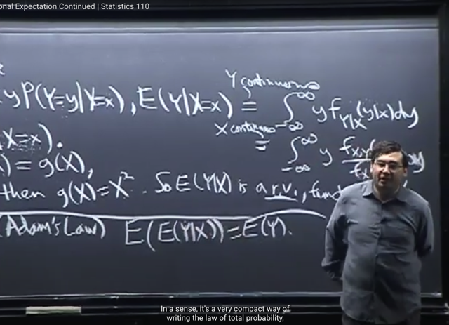</kbd></p>

> [!NOTE]
> Bài tới ta sẽ thảo luận về **Adam's
> Law**: **E[E(Y|X)] `=` E(Y)**

<br>

