# Lec 27: Conditional Expectation Given An R.v

📊 **Progress:** `34` Notes | `46` Screenshots

---
<a id="node-830"></a>

<p align="center"><kbd>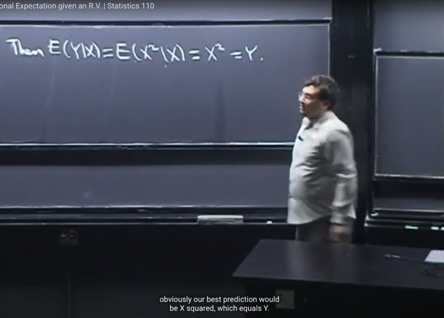</kbd></p>

<p align="center"><kbd></kbd></p>

<p align="center"><kbd>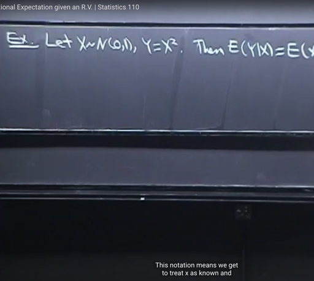</kbd></p>

> [!NOTE]
> Bài này ta sẽ tiếp tục về **conditional expectation**. Đầu tiên gs lấy ví dụ cho **X~N(0,1)** và **Y=X^2**
>
> Thế thì đầu tiên gs cho rằng ta có thể có **E(Y|X)** `=` **E(X^2|X)** `=` **X^2** `=` **Y**
>
> ```text
> Mình nên hiểu thế nào. Bắt đầu với E(Y|X), thì vì Y = X^2, đương nhiên E(Y|X) = E(X^2|X)
> ```
>
> Thế rồi, bữa trước gs có cho biết một cái mà ông nói sẽ quay lại đó là **E[g(X)|X] `=` g(X)**
>
> mang ý nghĩa là **giả dụ biết giá trị của rv X**, thì **dự đoán tốt nhất (best predicition)** giá trị của **g(X)** sẽ
> là bằng bao nhiêu. Thì dĩ nhiên, nếu biết X, thì best prediction cho g(X) `(E[g(X)|X])` chính là dùng giá trị đó để
> tính với hàm g: **g(X).** Nên `E[g(X)|X]` đương nhiên là bằng g(X)
>
> Vậy thì ở đây **E(X^2|X)** mang ý nghĩa là, nếu biết, giả dụ biết giá trị của X thì **best prediction** cho X^2 là
> bao nhiêu. Thì ở đây X^2 cũng giống như f(u) `=` u^2 vậy, nên f(X) là function sẽ bình phương giá trị của
> random variable X. Do đó, dĩ nhiên khi biết giá trị của X, thì ta sẽ có **best prediction** cho X^2 (ý nghĩa
> `E(X^2|X))` chính là **X^2**

<br>

<a id="node-831"></a>

<p align="center"><kbd>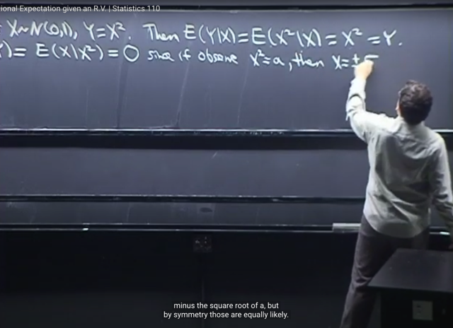</kbd></p>

<p align="center"><kbd></kbd></p>

<p align="center"><kbd></kbd></p>

<p align="center"><kbd></kbd></p>

<p align="center"><kbd>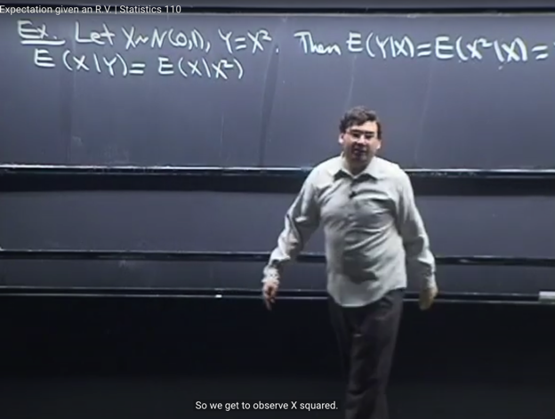</kbd></p>

> [!NOTE]
> Ví dụ tiếp theo để suy ngẫm là **E(X|Y)**?
>
> Thì đáp án là **E(X|Y)** `=` **E(X|X^2)** `=` 0. Mà gs nói rằng, nếu ta tính toán kì vọng này ta sẽ ra bằng 0.
>
> Nhưng intuitively, đó là, `E(X|X^2)` như đã biết sẽ mang ý nghĩa là, giả dụ biết giá trị của X^2, thì best
> prediction cho X là bao nhiêu. Vậy **giả dụ biết X^2**, thì ta có thể **cụ thể cho rằng biết X^2 `=` a** thì khi
> đó **X có thể là `+√a` hoặc -√a**.
>
> Thế mà, vì **X~N(0,1)** nên nó có tính chất **đối xứng qua mean `=` 0**. Do đó, hai possible values này đều
> **equally** **likely**. Cho nên khi ta **average hai giá trị với xác suất bằng nhau** này thì ta **sẽ được 0**.
>
> Nên **nếu tính toán theo định nghĩa** bằng cách `∫-inf:inf` x*conditional pdf, ta **cũng sẽ được 0**

<br>

<a id="node-832"></a>

<p align="center"><kbd>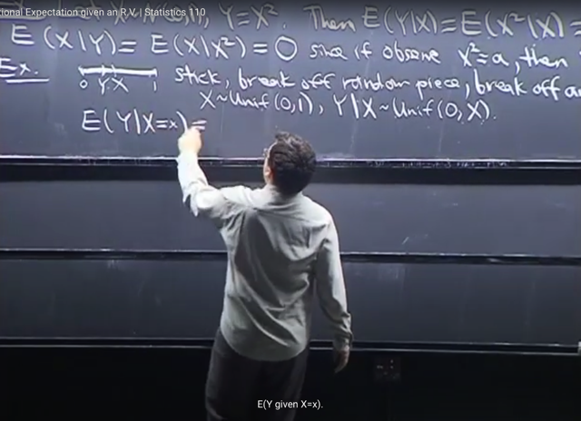</kbd></p>

> [!NOTE]
> Ví dụ tiếp theo, cho hình ảnh như ta có **một đoạn gỗ** tượng trưng cho **đoạn
> [0,1]**.Ta sẽ **bẻ ở một điểm nào đó ngẫu nhiên X**, sau đó **bẻ tiếp lần nữa ở
> đoạn 0-X**
>
> Hình ảnh đó giống như ta có **X~Unif(0,1)** và **Y|X~Unif(0,X)** với ý nghĩa là
> với `/` **giả dụ biết giá trị cụ thể của X**, thì **Y sẽ là random variable ~ Unif(0,X)**

<br>

<a id="node-833"></a>

<p align="center"><kbd>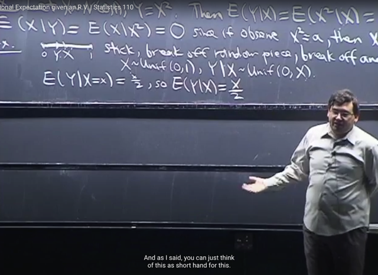</kbd></p>

🔗 **Related:** [LEC 26 CONDITIONAL EXPECTATION](untitled.md#node-817)

> [!NOTE]
> Câu hỏi là tìm **E(Y|X)**.
>
> Lập luận tương tự nãy h, **E(Y|X)** có ý nghĩa là **gỉa dụ biết giá trị của X**, thì 
> **best prediction cho Y là bao nhiêu**.
>
> Thế thì ta có thể **chuyển nó vể dạng conditioned on event**, bằng việc **cho rằng
> biết giá trị của X là x**: tức event **X=x** occur.
>
> Khi đó, ta chuyển thành tìm **E(Y|X=x)**. Thế thì, khi đó, **Y|X=x** là một rv của **Unif(0,x)**
> nên expected value là **x/2** vì ta đã chứng minh **mean của một r.v ~ Unif(a,b)** là
> **(a+b)/2**
>
> Thế thì nhắc lại bữa trước gs nói **E(Y|X=x) là function of x**, gọi là **g(x)**. Để rồi
> **E(Y|X)** là random variable, và **là function of X: g(X)**
>
> Do đó **chuyển về conditioned on r.v E(Y|X)** ta chỉ việc **thay x bằng X**: **E(Y|X) `=` X/2**

<br>

<a id="node-834"></a>

<p align="center"><kbd>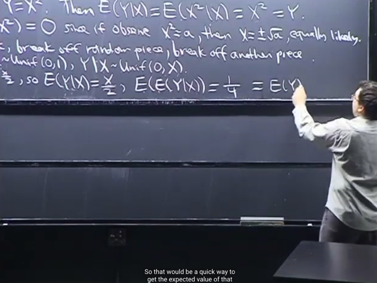</kbd></p>

> [!NOTE]
> Và tiếp theo, vì **E(Y|X)** như vừa nói, **là một random variable**, (cũng là
> function  of X), nên ta**có quyền lấy expected value** của nó **E[E(Y|X)]**.
>
> Để rồi, **E[E(Y|X)]** `=` **E[X/2]** `=` **1/2*E(X)** (**linearity**) `=` `1/2*1/2` `=` **1/4**
>
> Và ông nhắc lại bữa trước ta đã tuyên bố rằng (dù chưa chứng minh) là:
>
> **E[E(Y|X)] `=` E[Y].**
>
> Do đó **E[Y] `=` 1/4**. Để rồi có thể thấy kết quả này**rất intuitive** vì **khi ta bẻ
> thanh gỗ 2 lần** thì**rất hợp lí để expect rằng ta có đoạn bằng 1/4** thanh ban
> đầu

<br>

<a id="node-835"></a>

<p align="center"><kbd></kbd></p>

<p align="center"><kbd></kbd></p>

<p align="center"><kbd>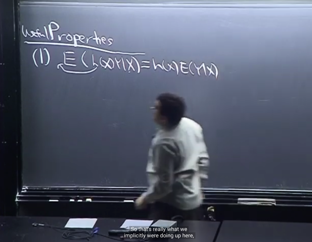</kbd></p>

> [!NOTE]
> Tiếp ta sẽ biết đến các **properties** rất **hữu ích** khi ta làm việc**liên quan đến conditional
> expectation**.
>
> Đầu tiên là **E[h(X)*Y|X]**. Thế thì lập luận là, ta **đã biết** rằng khi **tính E[Y|X]** ta sẽ **giả
> dụ**, **coi như rằng biết giá trị random variable X**. Và khi đó, ta **trả lời câu hỏi** (khi tính
> `E(Y|X)` là **dựa trên việc đã biết giá trị của X** thì **best prediction cho Y là bao nhiêu?**
>
> Thế thì tương tự, **E[h(X)*Y|X]** thì ta cũng coi như đã có giá trị của X, và do đó cũng đã
> biết giá trị h(X), thành ra ta coi nó như constant.
>
> Do đó theo **linearity** (mà ta đã biết linearity hoàn toàn áp dụng bình thường cho
> conditional expectation).
>
> Do đó **E[h(X)*Y|X]** `=` **h(X)*E[Y|X]**
>
> Và ta cũng có thể **coi ví dụ khi nãy**, **E[X^2|X]** chính là tính **E[h(X)*1|X]** với **h(X) `=` X^2**, để
> rồi `E[X^2|X]` `=` **X^2*E[1|X]** `=` **X^2*1** `=` **X^2**
>
> Và đó gọi là '**LẤY RA NHỮNG GÌ ĐÃ BIẾT**'

> [!NOTE]
> `E[h(X)*Y|X]` `=` `h(X)*E[Y|X]` (LẤY RA NHỮNG GÌ ĐÃ BIẾT)

<br>

<a id="node-836"></a>

<p align="center"><kbd>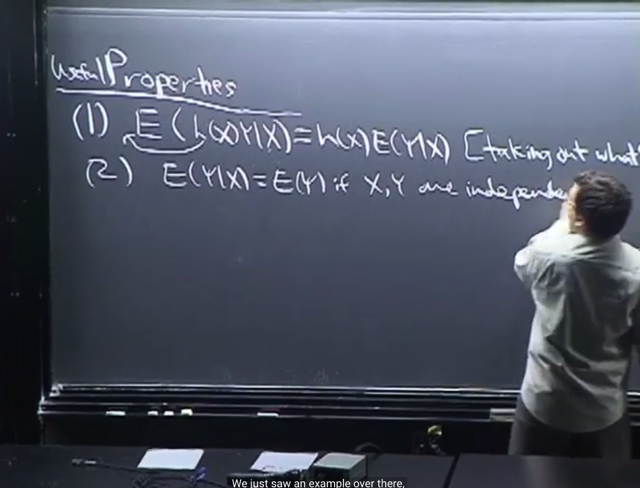</kbd></p>

🔗 **Related:** [LEC 26 CONDITIONAL EXPECTATION](untitled.md#node-820)

🔗 **Related:** [LEC 26 CONDITIONAL EXPECTATION](untitled.md#node-814)

> [!NOTE]
> **Tính chất thứ 2** mà ta cũng đã từng gặp là **E(Y|X) `=` E(Y)** **nếu X, Y
> INDEPENDENT.**
>
> Tính chất này gs nói rằng **chỉ dựa trên trực tiếp từ định nghĩa của
> conditional expectation**, mà trong đó có liên quan đến **conditional**
> **distribution PMF/PDF.**Thế thì từ đó, **dựa trên định nghĩa của independent variable** thì,
> **conditional PMF/PDF** `=` chính là bằng **unconditional PMF/PDF**
>
> (sâu xa hơn nữa thì vì **conditional PMF/PDF** `=` **Joint PMF/PDF**
> **chia** **Marginal PMF/PDF**Thì khi **independent,** **Joint PMF là tích của các Marginal PMF**, dẫn
> đến **kết quả còn lại chỉ là Marginal (Unconditional) PMF/PDF)**Ta có thể ví dụ X, Y là discrete r.v
>
> `E(Y|X)` mang ý nghĩa là giả sử biết giá trị của X (ví dụ `=` x) thì best
> prediction cho Y là bao nhiêu. Nên ta có thể thay nó bằng: `E(Y|X=x)`
> để chuyển nó từ expected value condition on random variable X, là
> một function g(X) thành expected value condition on an event `X=x,`
> là một function g(x), x là dummy variable
>
> Theo định nghĩa là weighted sum mọi possible values yi của Y,
> ```text
> với weight là xác suất Y=yi tương ứng, condition on X=x, tức P(Y=yi|X=x)
> ```
> ```text
> Do đó E(Y|X=x) = Σi yi*P(Y=yi|X=x)
> ```
>
> Theo định nghĩa của conditional event P(A|B) `=` `P(A,B)/P(B):`
>
> ```text
> P(Y=yi|X=x) = P(Y=yi, X=x) / P(X=x) và vì X, Y independent, nên joint
> ```
> ```text
> PMF = tích các marginal PMF => P(Y=yi, X=x) = P(Y=yi)*P(X=x)
> ```
>
> ```text
> =>E(Y|X=x) = Σi yi*P(Y=yi|X=x) = Σi yi [P(Y=yi, X=x) / P(X=x)]
> ```
>
> `=` `Σi` yi `[P(Y=yi)` * `P(X=x)` `/` `P(X=x)]` `=` **Σi yi `P(Y=yi)`
>
> ```text
> Vậy E(Y|X=x) = Σi yi P(Y=yi) nếu X,Y độc lập, mà vế phải chính là EY
> ```
> nên `E(Y|X=x)` `=` EY**

> [!NOTE]
> `E(Y|X)` `=` `E(Y)` nếu X, Y INDEPENDENT.

<br>

<a id="node-837"></a>

<p align="center"><kbd>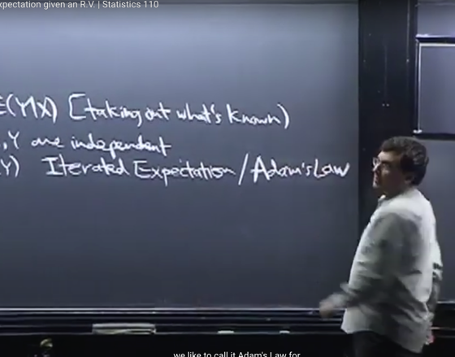</kbd></p>

<p align="center"><kbd></kbd></p>

<p align="center"><kbd>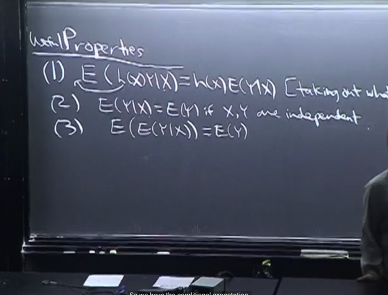</kbd></p>

> [!NOTE]
> Tính chất thứ 3 là **E[E(Y|X)] `=` E[Y]**. Ta sẽ chứng minh nó trong chốc lát. Nhưng ở đây ta hiểu nó
> có vai trò kiểu như **LOTP** **law of total probability**
>
> Bởi vì LOTP cho ta công cụ để**conditioned on một rv khác**, ví dụ condition on **mọi possible values**
> của X, qua đó tính được **unconditioned `PMF/PDF` của Y**
>
> Thì cái này cũng vậy, như ví dụ khi nãy, cho thấy để tính trực tiếp ra `E(Y)` thì sẽ khó. Nhưng
> thông qua việc conditioned on X, để có `E(Y|X)` sau đó tính expected value của cái này, thì ta lại
> có unconditioned `E(Y)`

> [!NOTE]
> ```text
> PROPERTY 3: E[E(Y|X)] = E[Y] (ADAM'S LAW)
> ```

<br>

<a id="node-838"></a>

<p align="center"><kbd>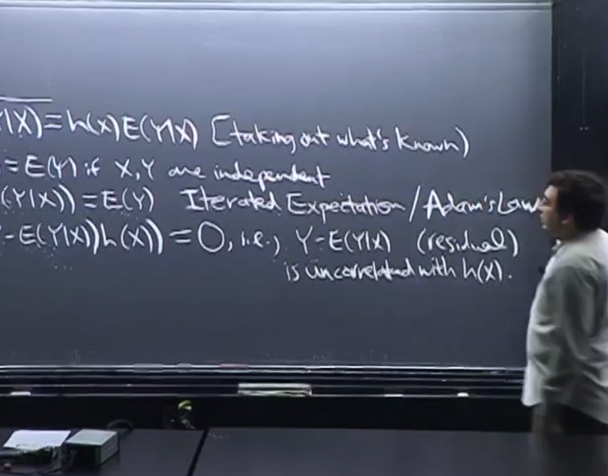</kbd></p>

<p align="center"><kbd>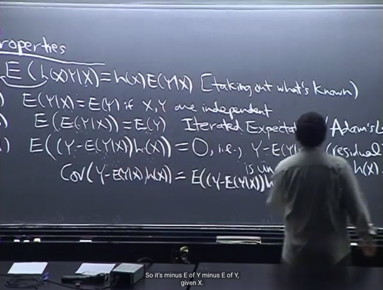</kbd></p>

<p align="center"><kbd>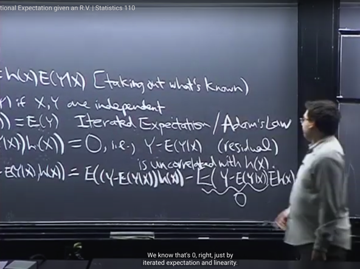</kbd></p>

<p align="center"><kbd></kbd></p>

<p align="center"><kbd></kbd></p>

<p align="center"><kbd></kbd></p>

<p align="center"><kbd>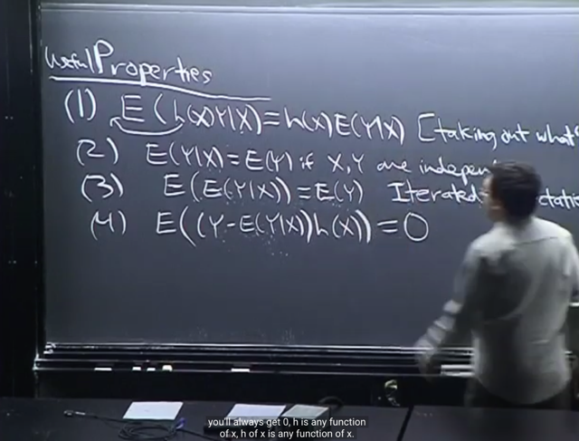</kbd></p>

🔗 **Related:** [LEC 21: COVARIANCE & CORRELATION](untitled.md#node-684)

> [!NOTE]
> Property 4: **E[ `(Y-E[Y|X])` h(X) ] `=` 0**. Với **Y-E[Y|X]** được gọi là **RESIDUAL** trong statistic. Và **h(X)** là
> **function bất kì của X**
>
> Ta hiểu như vầy, **E[Y|X]**, như đã biết mang ý nghĩa là "**cho biết giá trị của X**,  thì **best prediction cho Y** là
> bao nhiêu".
>
> Thế thì, do đó `E(Y|X)` mang ý nghĩa của: **dự đoán của Y, từ X**, y như trong machine learning ta có Y^. thì
> `Y-Y^` `=` **Y-E(Y|X)** giống như **ERROR** vậy.
>
> Vậy thì gs nói Property 4 này dẫn tới: **RESIDUAL SẼ UNCORRELATED VỚI BẤT KÌ FUNCTION H(X) NÀO**
>
> Điều này là vì bài trước ta đã biết **Cov(X,Y) `=` `E(XY)` `-` EXEY.**Nên `Cov(Residual,` h(X)) `=` `E[Residual*h(X)]` `-` `E[Residual]*E[h(X)]`
>
> Thế mà **E[Residual] `=` 0** VÌ `E[Y` `-` `E[Y|X]]` `=` EY `-` `E[E(Y|X)]` `=` EY `-` EY `=` 0
>
> Do đó **Cov[Residual, h(X)] `=` E[Residual*h(X)]**, và theo tính chất 4 ở đây thì **cái này cũng bằng 0 nốt** cho 
> nên **Cov[Residual, h(X)] `=` 0**,  dẫn đến**Residual uncorrelated với function bất kì nào của X**Sơ lược lại: `Cov(Residual,` h(X)) `=` `E(Residual*h(X))` `-` `E(Residual)*E[h(X)]`
>
> ```text
> E(Residual*h(X))  = E([Y-E(Y|X)] * h(X) ) = 0 (property 4)
> ```
>
> ```text
> E(Residual)*E[h(X) = E[Y-E(Y|X)]*Eh(X) = {EY - E[E(Y|X)]}*Eh(X) = (EY - EY)*Eh(X) = 0
> ```

> [!NOTE]
> ```text
> PROPERTY 4: E[ (Y-E[Y|X]) h(X) ] = 0
> ```

<br>

<a id="node-839"></a>

<p align="center"><kbd>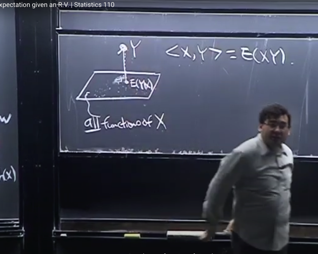</kbd></p>

> [!NOTE]
> Tiếp gs nói về **ý nghĩa hình học** của việc này. Gs nói về **vector space**. Như thầy
> Strang đã nói, vector space có thể là **space** of **function**, miễn là nó thỏa tính chất:
> **cộng hai vector** hay **scale vecto**r vẫn **ra vector trong space**
>
> Thế thì gs mô tả **giả dụ ông có vector space** là **mọi function của X**. Ta hiểu ngay
> vì mọi function của X thỏa mãn tính chất của vector space: cộng hai function của
> X vẫn là function của X, nhân function của X với scalar thì vẫn dc function của X.
>
> Và **mỗi function** có thể được biểu diễn bởi **linear combination của các basis
> function**
> Thế thì gs nói rằng **E(Y|X)** bản chất là **projection của Y lên vector space này**. Vì
> như đã nói nhiều lần **E(Y|X) cũng là function of X**.
>
> Và vì nó là projection, nên vector **Y-E(Y|X)** đương nhiên **perpendicular với vector
> space**. Và do đó nó vuông góc với mọi vector trong vector space, tức là mọi
> function of X.
>
> Gs có nhắc đến khái niệm **INNER PRODUCT <X,Y>**, mà ông cho là nó chỉ là
> **giống như dot product thì nó chính là E(XY)**

<br>

<a id="node-840"></a>

<p align="center"><kbd>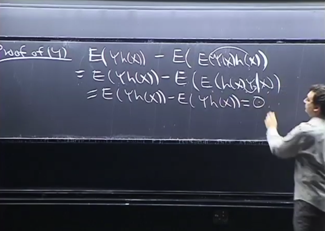</kbd></p>

> [!NOTE]
> Ta sẽ **chứng minh property (4):**
>
> `E[(Y-E[Y|H])h(X)]`
>
> **nhân phân phối** vào `=` `E[Y*h(X)-E[Y|X]*h(X)]`
>
> sau đó theo **linearity** `=`  `E[Y*h(X)]`   `-`  `E(Y|X)*h(X)`
>
> Xét `E{E[Y|X]*h(X)}` trước: Theo nguyên tắc, "**giả `dụ/coi` như biết X**", nên cũng
> biết h(X) cũng nên **coi nó như constant** để **đưa nó ra ngoài** hoặc **đưa
> vào trong E**
>
> Nên E{E[Y|X]***h(X)**} `=` E{E[Y***h(X)**|X]}
>
> Đến đây dùng **Adam's Law** (tính chất 3, ta sẽ chứng minh trong bước tiếp
> theo) nói rằng `E(E(Y|X))` `=` EY
>
> ```text
> nên E{E[Y*h(X)|X]} = E[Y*h(X)].
> ```
>
> ```text
> Vậy E[(Y-E[Y|H])h(X)] = E[Y*h(X)] - E(Y|X)*h(X) =  E[Y*h(X)] - E[Y*h(X)] = 0
> ```

<br>

<a id="node-841"></a>

<p align="center"><kbd>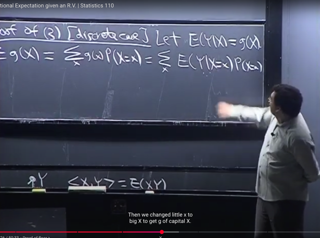</kbd></p>

> [!NOTE]
> Rồi, ta chứng minh property (3) với discrete case
>
> ```text
> Đó là E(E[Y|X)] = E[Y]
> ```
>
> Thế thì như đã biết **E(Y|X) là function của X**, gọi nó là **g(X)**.
>
> Vậy **E(E[Y|X)]** `=` **E[g(X)]**. Áp dụng **LOTUS** và định nghĩa của
> **expectation** ta có
>
> `E[g(X)]` `=` **Σ {các possible value x} [ g(x) * `P(X=x)` ]**.
>
> Chú ý đây đơn thuần là dùng LOTUS với định nghĩa của expectation.  Vì
> LOTUS cho phép ta tính `E[g(X)]` mà  không cần tìm `PMF/PDF` của g(X)
> (again, X là r.v, nên g(X) cũng là random variable) mà chỉ cần thay g(x) vào x
> trong công thức tính EX:
>
> ```text
> EX = Tổng x: x*P(X=x) thì LOTUS cho phép E[g(X)] = Tổng x: g(x)*P(X=x)
> ```
>
> `====`
>
> Vậy ta có **E[g(X)] `=` `Σx` g(x)*P(X=x)**
>
> Bây giờ g(x) là gì?
>
> Thì ta đang có g(X) `=` **E(Y|X)**, với ý nghĩa **nếu biết giá trị của X** thì **best
> prediction cho Y là bao nhiêu**, và nó là một function của X, cũng là một r.v.
> Nếu **thay condition on r.v X bằng condition on event X=x**, ta có **E(Y|X=x)** 
> CHÍNH LÀ **g(x)** là function theo x
>
> `E[g(X)]` `=` `Σx` `g(x)*P(X=x)` `=` **Σx E(Y|X=x)*P(X=x)**

> [!NOTE]
> ```text
> CHỨNG MINH ADAM'S LAW 3: E[E(Y|X)] = E[Y]
> ```

<br>

<a id="node-842"></a>

<p align="center"><kbd>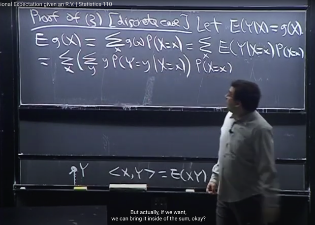</kbd></p>

> [!NOTE]
> Thế thì, tới đây ta sẽ dùng **định nghĩa conditional expectation** để có 
>
> **E(Y|X=x)** `=` **Σy y*P(Y=y|X=x)**
>
> Để rồi **E[g(X)]** `=` **Σx `[Σy` `y*P(Y=y|X=x)]*P(X=x)` ]**

<br>

<a id="node-843"></a>

<p align="center"><kbd>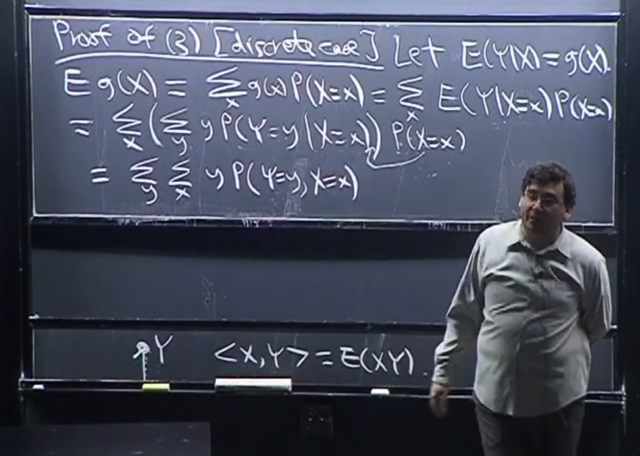</kbd></p>

> [!NOTE]
> Thế thì ta sẽ làm hai động tác
>
> i) ở đây ta có thể **đưa `P(X=x)` vào dấu tổng của y**.
>
> ii) và ta có thể **đổi chỗ hai cái dấu tổng** vì nó chỉ như là ta đổi chỗ các hạng
> tử
>
> ví dụ gọi x1y1z `+` x2y2z `=` tổng x tổng y xyz cũng bằng tổng y tổng x xyz
>
> ```text
> Σx [Σy y*P(Y=y|X=x)]*P(X=x) = Σy [Σx: y*P(Y=y|X=x)*P(X=x)]
> ```
>
> Và **P(Y=y|X=x)*P(X=x)** chính là**P(Y=y, X=x)**
>
> nên ta có `=` **Σy `[Σx` `y*P(Y=y,` X=x)]**

<br>

<a id="node-844"></a>

<p align="center"><kbd>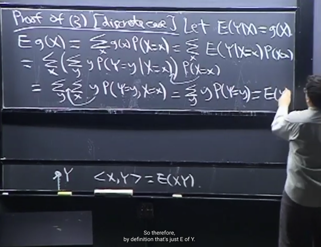</kbd></p>

> [!NOTE]
> Từ đó, bằng cách **đưa tiếp y ra ngoài tổng** **Σy `y*[Σx` `P(Y=y,` X=x)]**
>
> Và `[Σx` `P(Y=y,` `X=x)]` là ta **sum mọi possible value của x trên Joint PMF**
> thì ta có **Marginal PMF của Y**: **P(Y=y)**
>
> Kết quả ta có **Σy y*P(Y=y)** và đây chính là **E(Y)**

<br>

<a id="node-845"></a>

<p align="center"><kbd>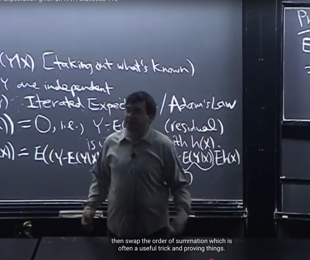</kbd></p>

> [!NOTE]
> gs nói thêm **cái trick** **đổi chỗ giữa sum x** và
> **sum y** là một trick rất hữu ích mà ta hay dùng

<br>

<a id="node-846"></a>

<p align="center"><kbd>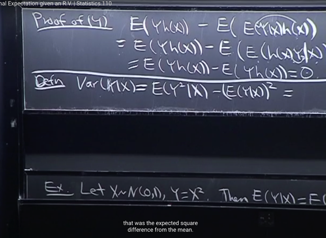</kbd></p>

> [!NOTE]
> Tiếp theo, từ conditional expectation, rất tự nhiên ta sẽ qua định
> nghĩa về **CONDITIONAL** **VARIANCE** **Var(Y|X)**
>
> Như đã biết định nghĩa của `Var(Y),` cụ thể là "dạng thứ 2": 
>
> `Var(Y)` `=` **E(Y^2) `-` (EY)^2**
>
> Thì với conditional expectation, ta có: 
>
> **Var(Y|X) `=` `E(Y^2|X)` `-` (E(Y|X))^2**

> [!NOTE]
> ```text
> Var(Y|X) = E(Y^2|X) - [E(Y|X)]^2
> ```

<br>

<a id="node-847"></a>

<p align="center"><kbd>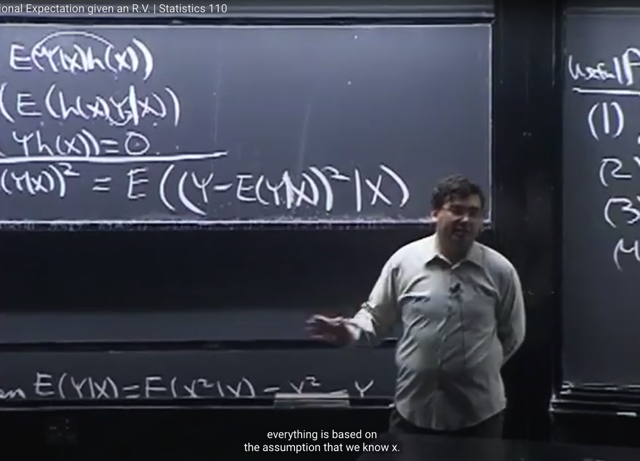</kbd></p>

> [!NOTE]
> Thế thì, dạng gốc công thức của `Var(Y)` là **E[(Y-EY)^2]**
>
> thì tương tự `Var(Y|X)` `=` `E[` (Y `-` `E(Y` **| X**))^2 **| X**]
>
> gs cho biết nếu ta **chỉ ghi như vầy** `E[` `(Y-E(Y|X))^2` ] thì sẽ thấy nó sai
> sai, **mọi thứ phải conditioned on X**

> [!NOTE]
> ```text
> Var(Y|X) = E[ (Y - E(Y | X))^2 | X]
> ```

<br>

<a id="node-848"></a>

<p align="center"><kbd>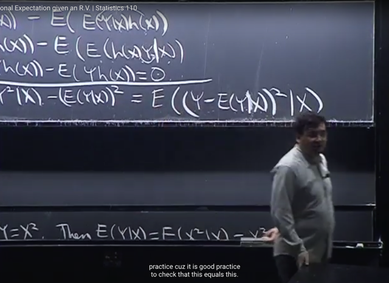</kbd></p>

> [!NOTE]
> đại khái là ghi **conditional** **variance** ở hai dạng tương tự với unconditional
> variance như vậy, ta biết nó đúng nhưng **vẫn cần phải chứng minh** nó.
> Và đó là nội dung trong **strategic practice**

<br>

<a id="node-849"></a>

<p align="center"><kbd>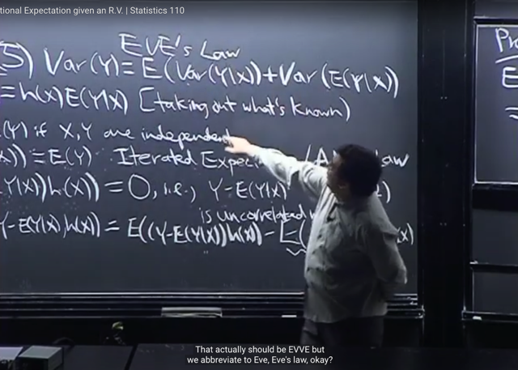</kbd></p>

> [!NOTE]
> Và tính chất thứ 5 là: 
>
> ```text
> Var(Y) = E[Var(Y|X)] + Var[E(Y|X)]
> ```
>
> còn gọi là **EVE'S LAW**

> [!NOTE]
> EVE'S LAW: 
>
> ```text
> Var(Y) = E[Var(Y|X)] + Var[E(Y|X)]
> ```

<br>

<a id="node-850"></a>

<p align="center"><kbd>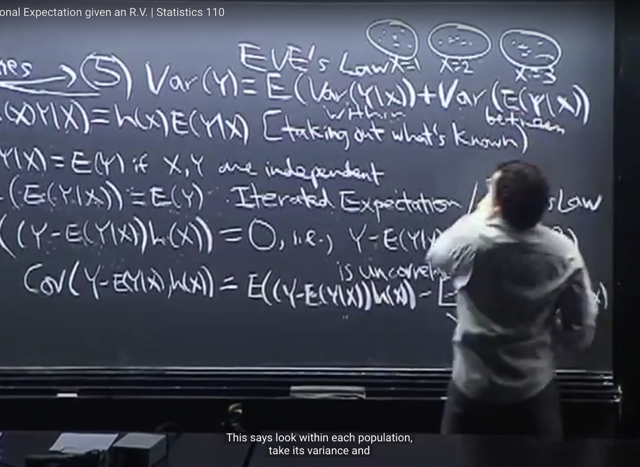</kbd></p>

> [!NOTE]
> Thế thì intuition của cái này có thể hiểu nôm na qua việc ta có một **population**
> người. Và ta quan tâm **mức độ biến động của chiều cao** trong population 
> này.
>
> Giả sử population này**chia làm 3 group**. Thì variation của population
> có thể thấy **gồm 2 loại variation**:
>
> i) **Variation giữa chiều cao những người trong mỗi group**
>
> ii) V**ariation giữa các group với nhau**.
>
> ```text
> Do đó trong công thức của Property này Var(Y) = E[Var(Y|X)] + Var[E(Y|X)]
> ```
>
> Thì hiểu nôm na là **E[Var(Y|X)]** là tính **variance của từng group** và trung bình
> lại 
>
> Còn **Var[E(Y|X)]** thì giống như tính **trung bình của từng group rồi tính variance
> giữa chúng**.
>
> Có nghĩa là công thức này có thể được hiểu bằng ví dụ như vậy

<br>

<a id="node-851"></a>

<p align="center"><kbd>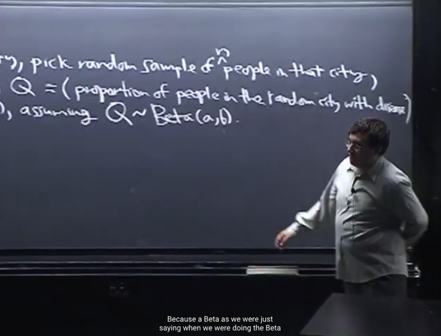</kbd></p>

<p align="center"><kbd></kbd></p>

<p align="center"><kbd>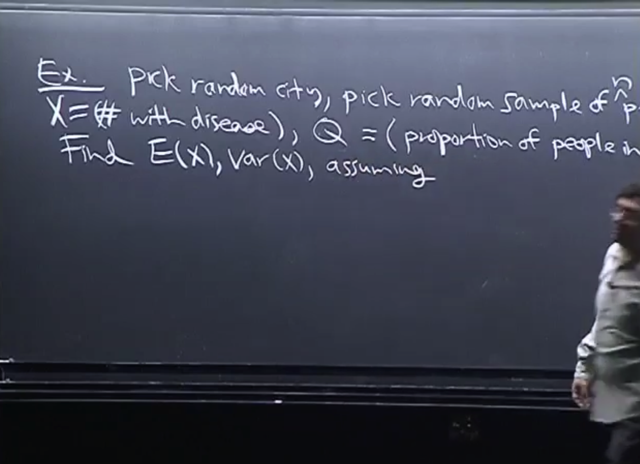</kbd></p>

> [!NOTE]
> Ta qua một ví dụ, chọn một city ngẫu nhiên, và **sampling n người** từ city đó. Ta quan tâm **X là số người
> có bệnh**. Với **Q là tỉ lệ mắc bệnh trong một thành phố ngẫu nhiên.** Ta sẽ cần tìm **EX** và **Var(X).**
>
> Đại khái, ta hiểu bài toán này là, giống như hồi nãy, trong **biến động (variation) của chiều cao** trong
> population đến từ **biến động chiều cao trong từng sub-population** và **giữa các `sub-population` với nhau**. 
> Thì ở đây ta **có các city**, trong **mỗi city cũng có variation** nhưng **giữa các city cũng có variation**.
>
> Thế thì ta sẽ **giả định về distribution của Q** và ta sẽ dùng **Beta(a,b)** vì **tính chất flexible** mà ta đã nói
> **với a,b khác nhau** nó có thể **represent nhiều kiểu distribution khác nhau**, do đó nó là lựa chọn phổ biến
>
> Điều này cũng giống như bữa trước ta cũng có bài toán mà ta**không biết p của Bern(p)** và ta dùng
> **Beta(a,b) làm prior distribution** cho nó để rồi nhờ tính chất **Conjugate prior** **with Binomial** mà **sau khi ta
> tìm posterior distribution** của p thì **nó cũng là Beta với param khác thôi.**

<br>

<a id="node-852"></a>

<p align="center"><kbd>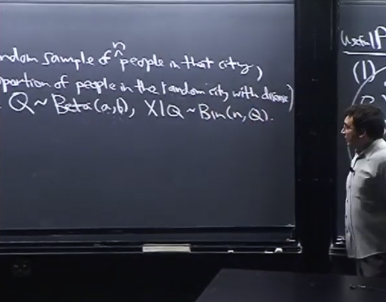</kbd></p>

🔗 **Related:** [LEC 22: TRANSFORMATIONS & CONVOLUTION](untitled.md#node-713)

> [!NOTE]
> Khi đó, **X|Q ~ Binomial(n, Q)** mang ý nghĩa là, **nếu biết giá trị của Q** thì **X
> là một Binomial(n, Q) r.v**
>
> Thêm nữa, gs nói sẽ tốt hơn nếu ta **assume X là Hypergeometric** tức là
> **sampling không hoàn lại**. Tuy nhiên như đã biết, **nếu số lượng nhỏ so với
> số lượng population size** thì sampling **có hoàn lại** (trong Binomial) **cũng
> giống như sampling không hoàn lại** do đó ta **cho rằng X là Binomial.**
>
> Nhắc lại **X là số người bệnh khi test một population trong một city**, thì **kết
> quả test của mỗi người là một Bern trial**.
>
> **Ôn lại** story của hai distribution này để hiểu **tại sao gs nói là sẽ tốt hơn
> nếu dùng Hypergeometric.**
>
> **X~Hgeom (w,b,n)** là **số banh trắng** khi bốc**n trái** từ lọ có **w trắng, b đen**
> kết qủa của mỗi lần bốc có story cũng là các Bern trial. 
>
> Có điều khi **bốc xong thì lấy ra luôn** (**sampling without replacement**)
> nên sau mỗi lần bốc xác suất bốc được banh trắng sẽ thay đổi, và nó sẽ
> phụ thuộc vào kết quả của lần bốc trước đó. Do đó, với sampling without
> replacement thì ta có chuỗi các Bernoulli trial nhưng không có chung param
> p, và các `Bern(π)` rv này không độc lập. Ngược lại nếu sampling with 
> replacement thì sau mỗi trial xác suất thành công của trial tiếp theo vẫn vậy
> do đó ta có các Bern(p) trials độc lập và cùng một tham số p: iid. Khi đó
> tổng số trial thành công sẽ là một Bin(n,p)
>
> Thế thì vì bản chất khi test những người thì khi test xong, coi như bỏ ông
> đó ra ngoài để không test lại nữa. Điều này giống bốc banh bỏ ra ngoài.
> TUy nhiên vì số người trong city quá lớn so với số người được test nên
> có thể coi như sampling without replacement. Vì như ví dụ bữa trước
> (theo link) ta thấy **khi N `=` `w+b` lớn so với n thì Hgeom trở thành gần như
> là Binomial**
> Và cuối cùng, như đã nói, vì ta **assume X là Binomial**, nên d**ùng Beta để
> làm prior distribution của Q** cũng là hợp lí nhờ tính chất **conjugate** **prior** to
> **Binomial của Beta**

<br>

<a id="node-853"></a>

<p align="center"><kbd>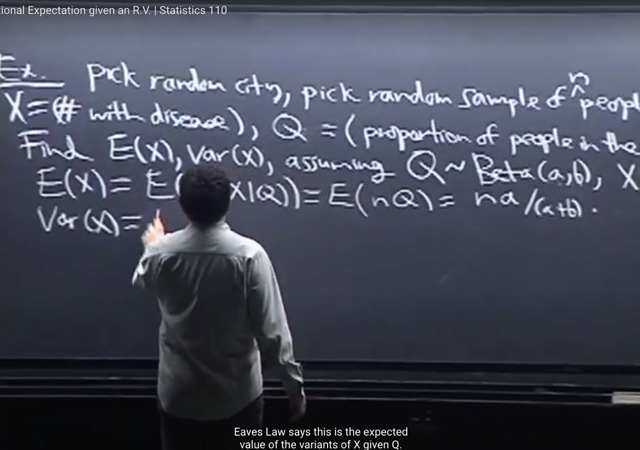</kbd></p>

🔗 **Related:** [LEC 25: ORDER STATISTIC & CONDITIONAL EXPECTATION](untitled.md#node-788)

> [!NOTE]
> Rồi để tính **EX** ta dùng **Adam's Law** (cái property mà tương đương với LOTP):
> **EX `=` `E[E(X|Q)]`
>
> Lập nhanh lại để ôn lại: `E[E(Y|X)]` `=` E[Y]**Câu hỏi đầu tiên có thể đặt ra đó là `E(Y|X)` là gì, hay, mang ý nghĩa gì. Thế thì
> đầu tiên ta có thể nói về expectation EY. Ý nghĩa của nó, chính là trung bình
> của mọi possible values của Y, nhưng mỗi possible value, sẽ đi kèm, gắn kèm
> với một trọng số (weight), được lấy bằng xác suất rv Y mang possible value
> đó. EY `=` `Σy` `y*P(Y=y)` 
>
> ```text
> (xét Y là discrete r.v, với continuous thì ta có EY = ∫-inf:inf y*f_Y(t)dt)
> ```
>
> Thế thì từ đó quay lại `E(Y|X),` ý nghĩa của nó chính là ta cũng average mọi
> possible values của Y với trọng số là xác suất tương ứng. Có điều xác suất này
> sẽ dựa trên một giá trị cụ thể của random variable X:
>
> ```text
> E(Y|X) = Σy y*P(Y=y|X)
> ```
>
> Thế thì có thể nhận thấy đây là một FUNCTION CỦA X, gọi là g(X) và do đó, 
> nó cũng là một **random variable.**
> Như đã đã nói, vì ý nghĩa của `E(Y|X)` là Dựa trên một giá trị cụ thể nào đó của
> random variable X, thì ta tính được expected value của Y. Nên giả sử giá trị
> ```text
> cụ thể đó là x, thì ta có E(Y|X=x) = Σy y*P(Y=y|X=x).
> ```
>
> Vậy thì ta có thể chuyển việc "chưa biết giá trị cụ thể của X là gì", để có hàm
> theo X tức `E(Y|X)` thành "chưa biết giá trị x là gì" để có hàm theo x tức `E(Y|X=x)`
> Hai cái trên về ý nghĩa là như nhau. Và `E(Y|X=x)` chính là g(x) (điều này phù
> hợp logic, vì g(X) là random variable, sẽ mang giá trị cụ thể g(x) khi X mang
> giá trị cụ thể x)
>
> Thế thì bây giờ xét `E[E(Y|X)].` Như đã nói `E(Y|X)` là một random variables, là
> function apply lên rv X: g(X) Nên nó có quyền tính kì vọng. 
>
> ```text
> Thì E[E(Y|X)] = Eg(X) ta áp dụng LOTUS = Σx g(x)*P(X=x)
> ```
>
> ```text
> Thay g(x) = E(Y|X=x) = Σy y*P(Y=y|X=x) ta có:
> ```
>
> ```text
> Σx E(Y|X=x)*P(X=x) = Σx [Σy y*P(Y=y|X=x)]*P(X=x)
> ```
>
> ```text
> = Σx Σy [y*P(Y=y|X=x)*P(X=x)]
> ```
>
> (thay đổi vị trí dấu ngoặc ở đây chính là nhân phân phối `P(X=x)` vào tổng `Σy)`
>
> ```text
> = Σx Σy [y*P(Y=y|X=x)*P(X=x)]
> ```
>
> ```text
> Tới đây conditional probability theorem: P(Y=y|X=x)*P(X=x) = P(Y=y, X=x)
> ```
>
> ```text
> = Σx Σy [y*P(Y=y, X=x)] = Σx Σy y*P(Y=y, X=x)
> ```
>
> Và vì cơ bản là một cái tổng nên ta có thể sắp xếp các hạng tử lại để đổi
> chỗ `Σy` và `Σx` 
>
> ```text
> = Σy Σx y*P(Y=y, X=x) = Σy y*[Σx P(Y=y, X=x)] đưa y ra ngoài tổng Σx
> ```
>
> Xét cái này: `Σx` `P(Y=y,` `X=x)` chính là tổng của Joint PMFX,Y qua mọi possible 
> values của x, thì kết quả nó chính là Marginal PMF của Y: `P(Y=y).` 
>
> ```text
> Vậy kết quả ta có Σy y*[Σx P(Y=y, X=x)] = Σy y*P(Y=y) và chính là EY
> ```
>
> Chứng minh xong.
>
> `====Quay` lại đây:
>
> Và vì assume **X|Q ~ Bin(n, Q)** nên ta đã biết với mean của **Bin(n,p)** r.v là **np**
>
> Vậy **E(X|Q)**= **nQ**, vậy EX `=` **E[E(X|Q)]**(Adam's Law) 
>
> `<=>` EX `=` **E[nQ]** `<=>` EX `=` n**E[Q] (Linearity)**. 
>
> Và Q là ~ Beta(a,b) nên **EQ `=` a/(a+b)** như đã biết bữa trước, Vậy EX `=` **na/(a+b)**

<br>

<a id="node-854"></a>

<p align="center"><kbd>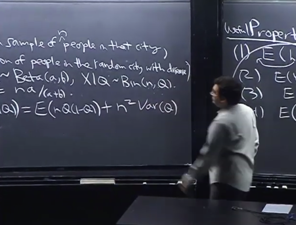</kbd></p>

<p align="center"><kbd></kbd></p>

<p align="center"><kbd>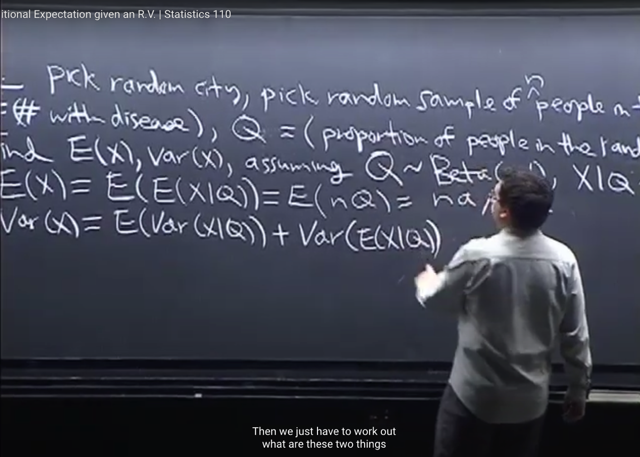</kbd></p>

> [!NOTE]
> Tiếp tục với **Var(X)**, theo **property (5)**, ta có **Var(X) `=` `E[Var(X|Q)]` `+` Var[E(X|Q)]**
>
> Và **Var(X|Q)** thì là **variance của X|Q** như đã biết là**rv ~Bin(n, Q).** 
>
> Bữa trước ta đã biết **variance của Bin(n, p)** là **npq** (q `=` `1-p)`
>
> Vậy term 1 là **nQ(1-Q)**
>
> Còn term 2, vì **E[X,Q] `=` nQ** như vừa nói, nên **Var[E(X|Q)] `=` Var(nQ)** 
>
> theo tính chất của variance, ta bỏ constant ra ngoài nhưng bình phương lên:
>
> `Var(nQ)` =**n^2 VarQ**

<br>

<a id="node-855"></a>

<p align="center"><kbd>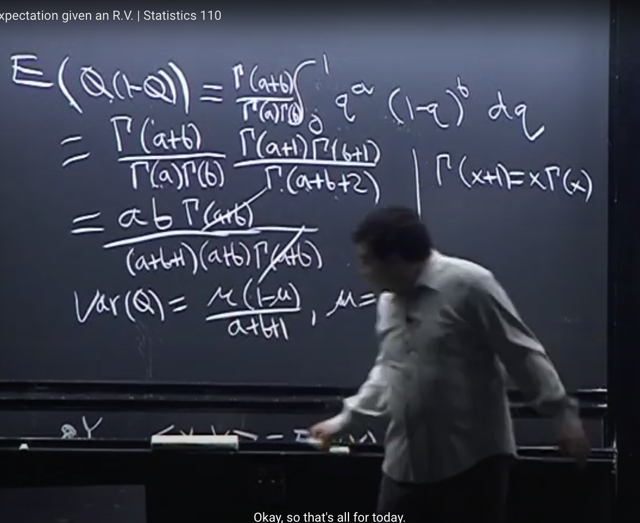</kbd></p>

> [!NOTE]
> Rồi để tính tiếp ta chỉ còn phải tính **E[Q(1-Q)]** (vì n đưa ra ngoài, VarQ thì biết rồi
>
> Thế thì, ta có thể **nhân vô** và **dùng linearity** để tính EQ `-` EQ^2
>
> Nhưng **có thể dùng LOTUS**: coi như đang tính **E[g(Q)]** với **g(Q) `=` Q(1-Q)**
>
> theo đinh nghĩa EQ =**∫-inf:inf q*f_Q(q)dq** với `f_Q(x)` là **PDF của Q**~Βeta(a,b)
>
> `f_Q(q)` `=` **c*q^(a-1)*(1-q)^(b-1)** với c là normalizing constant, như đã biết là
>
> c `=` `[Γ(a+b)/Γ(a)*Γ(b)]`
>
> theo **LOTUS**, để tính **Eg(Q)** ta chỉ việc **thay q bằng g(q) `=` q(1-q)**:
>
> `E[g(Q)]` `=` `∫-inf:inf` [**q(1-q)]***[**c*q^(a-1)*(1-q)^(b-1)**]dx
>
> `=` `∫-inf:inf` c***q^a*****(1-q)^bdq**
>
> Nhân thấy **q^a*(1-q)^b** lại có **dạng của pdf của một `Beta(a+1,` b+1)**
>
> nên ta sẽ nhân thêm và chia bớt cho **c'** là **normalizing constant của `Beta(a+1,` b+1)**
>
> ```text
> c' = Γ(a+1+b+1) / [Γ(a+1)*Γ(b+1)]
> ```
>
> ```text
> = ∫-inf:inf c*(c'/c')*q^a*(1-q)^b*dq
> ```
>
> Từ đó bỏ `c/c'` ra ngoài tích phân, `E[g(Q)]` `=` `(c/c')`  **∫-inf:inf c'*q^a*(1-q)^b*dq**
>
> THì chữ in đậm chính là **tích phân `-inf:inf` một `Beta(a+1,` `b+1)` PDF**, nên nó **phải bằng 1**
>
> ```text
> Vậy E[g(Q)] =  (c/c') =  [Γ(a+b)/Γ(a)*Γ(b)] / [Γ(a+1+b+1) / [Γ(a+1)*Γ(b+1)]]
> ```
>
> Dùng Identity `Γ(a+1)` `=` a*Γ(a)
>
> Ta thu gọn lại thì được `Var(Q)` `=` **μ(1-μ)/(a+b+1)** với mu là `(a+b)/2`

<br>

