# Lec 28: Inequalities

📊 **Progress:** `26` Notes | `23` Screenshots

---

<kbd>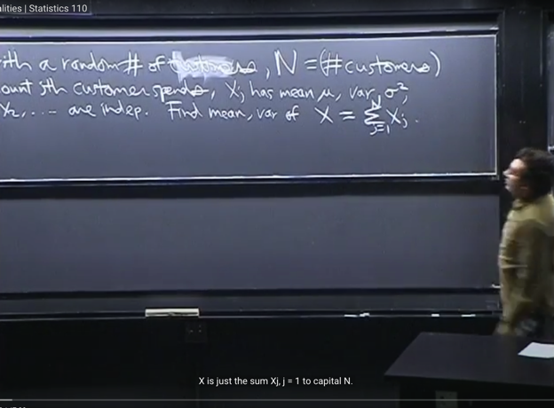</kbd>

<kbd></kbd>

<kbd>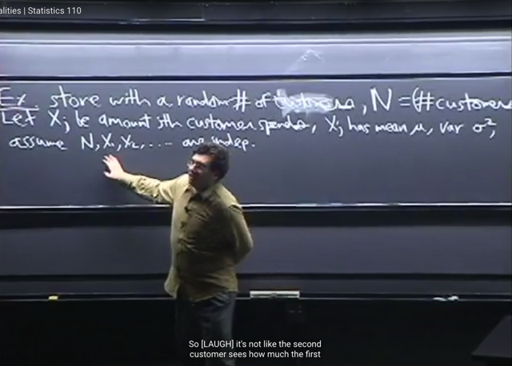</kbd>

> [!NOTE]
> Ta sẽ tiếp tục với **Conditional Expectation** trước khi qua **Statistic Inequalities.**
>
> Gs cho ví dụ, này một cửa hàng với **N là random variables** đại diện cho **số khách hàng**
> đến cửa hàng. Gọi các r.vs **Xj (j=1,2,3,...N)** là **số tiền mà khách hàng thứ j** c**hi tiêu** ở cửa
> hàng. Và **giả định** rằng các **Xj có mean và variance giống nhau (identical)**. 
>
> Và cho rằng các Xj đều **independent** 
>
> Câu hỏi là ta muốn **tìm mean và variance của X** là **tổng doanh thu** của cửa hàng cũng
> chính là **X = Σ j=1,..N Xj**
>
> Vậy thì ta có X là**tổng của N random variables**, nhưng **N lại là một random variable 
> chứ  không fix**

 

<kbd>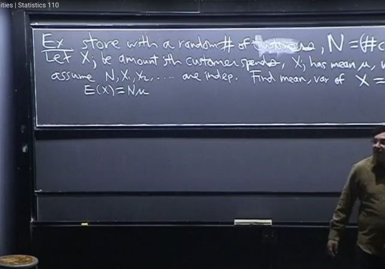</kbd>

> [!NOTE]
> đại khái gs cho rằng, ta có thể n**ghĩ đến việc dùng Linearity** để
> **E(Σj Xj) = Σj E(Xj)** và với Xj có mean μ tức là E(Xj) = μ
> thì kết quả là Nμ
>
> Gs hỏi làm vậy**là sai** và đề nghị ta nghĩ xem **tại sao**ta có thể biết
> nó sai?
>
> Thử trả lời: Là bởi **E(X) phải là number**, còn **Nμ là random
> variable** vì N là r.v

 

<kbd>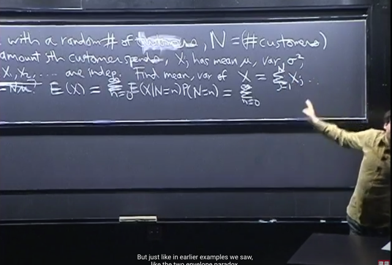</kbd>

> [!NOTE]
> Tiếp tục, dựa vào **LOTP** ta depend on **mọi possible value của N**: 
>
> Ta có **E(X) có thể thấy nó bằng Σn E(X|N=n)*P(N=n)  theo 2 cách**Theo cách 1, dùng Adam's Law EX = E[E(X|N)] ****Xét E(X|N) như đã biết, nó là function của rv N, gọi nó là g(N)
> thì E[E(X|N)] = Eg(N) và dùng LOTUS, ta có:
>
> Eg(N) = **Σn g(n)*P(N=n).** 
>
> g(n) chính là E(X|N=n) (khi N=n thì g(N) = E(X|N=n) = g(n))
>
> => Eg(N) = Σn E(X|N=n)*P(N=n)
> **vậy E[X] theo Adam's law = E[E(X|N)] = Σn E(X|N=n)*P(N=n)**Cách 2 dùng LOTP:
>
> Theo định nghĩa EX = Σx x*P(X=x)
>
> Xét P(X=x): (X=x) = Union {mọi n} (X=x, N=n) (set theory)
>
> => P(X=x) = P[Union {mọi n} (X=x, N=n)]
>
> và đây là union của các disjoint events, theo Axiom 2:
>
> = Σn P(X=x, N=n)
>
> Áp dụng conditional probability theorem: 
> ****= Σn P(X=x|N=n)P(N=n)
>
> Vậy EX = Σx x*P(X=x) = Σx x*[Σn P(X=x|N=n)P(N=n)]
>
> Nhân x vô, và đổi vị trí hai tổng vì bản chất đây là 1 cái tổng bự
>
> = Σx [Σn x*P(X=x|N=n)P(N=n)]****(Ví dụ:****x1P(X=x1|N=n1)P(N=n1) + x1P(X=x1|N=n2)P(N=n2)+
> x2P(X=x2|N=n1)P(N=n1) + x2P(X=x2|N=n2)P(N=n2)****x1P(X=x1|N=n1)P(N=n1) + 2P(X=x2|N=n1)P(N=n1)+ 
> x1P(X=x1|N=n2)P(N=n2) + x2P(X=x2|N=n1)P(N=n2)****= Σn [Σx x*P(X=x|N=n)*P(N=n)]
>
> = Σn [Σx x*P(X=x|N=n)]*P(N=n)
>
> = Σn [E(X|N=n)]*P(N=n)**Kết quả cũng ra = Σn E(X|N=n)*P(N=n)**

 

<kbd>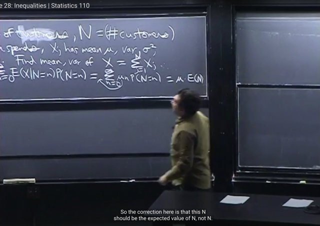</kbd>

🔗 **Related:** [LEC 26 CONDITIONAL EXPECTATION](untitled.md#node-801)

> [!NOTE]
> Tiếp theo, xét **E(X|N=n)** với việc ta nhớ **X = Σj=1:N Xj**
>
> Thế thì, ta đã biết rằng ý nghĩa của **E(X|N=n)** là cho rằng **biết giá trị của
> N=n**, thì **best prediction của X là bao nhiêu**. Thì vì đã biết giá trị của N, mà
> lại có điều kiện **các X1,X2.. Xj INDEPENDENT với N**. Thành thử ra, ta có thể
> **bỏ condition đi.**
>
> Cụ thể xét kĩ một chút thì: 
>
> **E(X|N) = E(Σ j=1:N Xj | N=n)** **= E(X1+X2+...XN | N=n)** 
>
> thế thì giống như trong  bài toán envelop (link xanh) đã nói: Ta chỉ có thể
> **dùng rồi bỏ đi condition** nếu các rv **INDEPENDENT**. 
>
> Do đó, với việc N mang giá
> trị = n  thì **E(X1+X2+...XN | N) = E(X1+X2+...Xn | N=n)** = **E(X1+X2+...Xn)**
>
> Tiếp tục dùng linearity ta có: E(X1) + E(X2) + ...E(Xn) = μ + μ + ...= **nμ**Vậy Σn E(X|N=n)P(N=n) = **Σn nμ*P(N=n)**đưa μ ra ngoài****= μ*Σn: n*P(N=n)**và**  Σn:  n*P(N=n) chính là định nghiã của E(N)
>
> Vậy kết quả là =**μ*E(N)**

 

<kbd>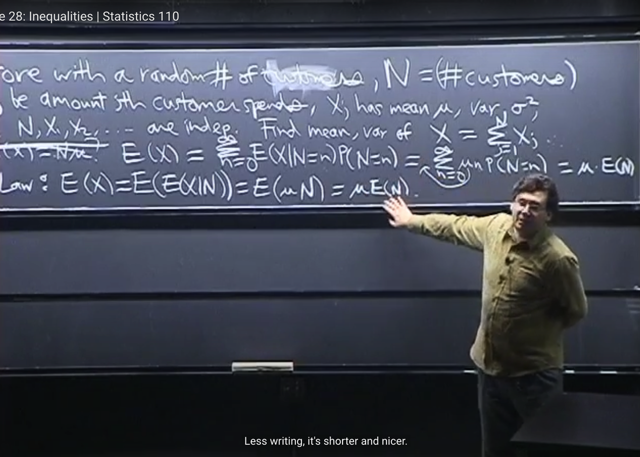</kbd>

> [!NOTE]
> Cách làm thứ 2 gs nói là**Adam's Law**
>
> **E(X) = E[E(X|N)]** thì xét **E(X|N)** ta cũng lập luận như vừa rồi rằng: Nếu biết giá
> trị cụ thể n của N và Xj, N independent thì sử dụng thông tin N thì có thể bỏ
> condition đi:
>
> E(X|N) = E(X1+X2+...XN|N) = E(X1+X2+...XN)
>
> = EX1 + EX2 + ..EXN = μ + μ + ...μ = **μ*N**
>
> Nên E(E(X|N)) = E(μ*N) = **μ*E(N)**
>
> Và như vậy thì cho thấy đúng là E(X|N) là function theo N, là một rv. để rồi khi N=n
> thì E(X|N) = nμ
>
> Thế thì ta thử phân tích tại sao gs nói hai cái này thật ra là một tức là khai triên EX
> bằng cách depend on mọi possible value của N theo LOTP:
>
> E(X) = **Σn: E(X|N=n)*P(N=n)**:
>
> Còn **Adam Law**: cho **EX = E[E(X|N)]**,
>
> Thế thì trong E[E(X|N)], **E(X|N)** là **expectation** **conditioned on random
> variable N** và ta đã nói nhiều lần rằng rằng nó l**à một random variable**, và là
> function theo N: **g(N)**
>
> Thế thì do E(X|N) là g(N) nên E[E(X|N)] = E[g(N)] áp dụng **LOTUS** cho phép tính
> E(g(N)) dùng PMF của N:
>
> = **Σn: g(n)*P(N=n)** (1)
>
> Mà **E(X|N)** là expected value conditioned on r.v N, và là function theo N: g(N)
> như vừa nói. Thế thì ta cũng có thể **chuyển nó thành** expected value conditioned
> on event N=n, tức là **E(X|N=n)** để rồi ta có function theo n: **g(n) = E(X|N=n)**
>
> Vậy tiếp tục (1) = **Σn: E(X|N=n)*P(N=n)**
>
> Vậy tới đây ta có kết quả như (*): **E(X) = Σn: E(X|N=n)*P(N=n)**
>
> *Viết "Σn:" ở đây ý là tổng mọi possible value của n, cũng là n=1,...inf

 

<kbd>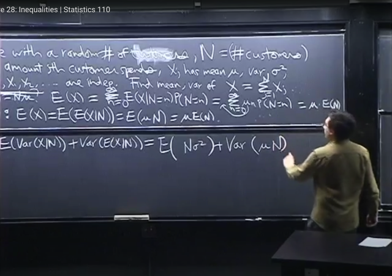</kbd>

<kbd></kbd>

<kbd>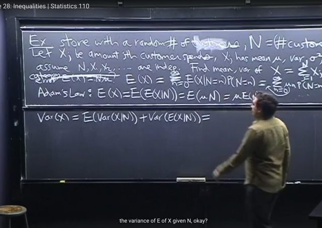</kbd>

🔗 **Related:** [LEC 21: COVARIANCE & CORRELATION](untitled.md#node-692)

> [!NOTE]
> Tiếp theo tính **Var(X)**, áp dụng **Eve's Law**, ta có công thức **Var(X) = E(Var(X|N)) + Var(E(X|N))**
>
> **Var(X|N)** thì tương tự **E(X|N)**, đó là ta hiểu rằng đã có giá trị cụ thể của N, thì với việc Xj independent 
> với N thì ta có thể bỏ N. Var(X|N) = Var(X1+X2+...XN|N) = Var(X1+X2+...XN).
>
> Áp dụng công thức Var(X1+X2+..) = Var(X1) + Var(X2) + ...Var(XN) + 2*Cov(X1, X2) + 2Cov(Xi, Xj)... 
>
> Vì Xj **independent**, nên các c**ovariance term Cov(Xi, Xj) đều bằng 0**.
>
> Vậy Var(X1+X2+...XN) = **Σj Var(Xj)** = **N*σ^2
>
> Var(X) = E(Var(X|N)) + Var(E(X|N))  = E(N*σ^2) + Var(μ*N)**

 

<kbd>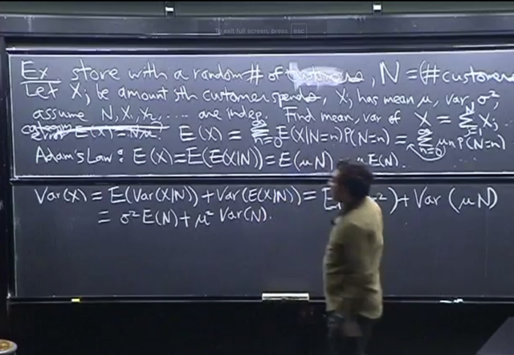</kbd>

> [!NOTE]
> Kết quả là **σ^2 E(N) + μ^2*Var(N)**
>
> Và kết quả E(X) = μ*E(N) gs cho là **khá intuitive** vì nó nói rằng **trung bình
> danh thu bằng trung bình lượng khách** nhân với **trung bình số tiền chi tiêu
> của khách**

 

<kbd></kbd>

> [!NOTE]
> Ta qua **STATISTIC** **INEQUALITIES**
>
> đại khái gs nói là có nhiều lúc ta **dễ nhầm lẫn** giữa **approximation** và
> **inequality**
>
> Ví dụ khi nói**probability trong khoảng 0.39 và 0.36** (tức là **inequality**
> với **upper** và **lower bound**) thì ta có thể đoán nó là 0**.37 /0.38**
> Nhưng **nếu chỉ có upper bound <0.39** thì **không thể đoán
> (approximate) được**.
>
> Gs nói một chút về**ý nghĩa** của cái này. Đại khái là đôi khi ví dụ như
> ta**chứng minh được rằng xác suất (của cái gì đó) < một con số nào
> đó**. Thế thì so với việc approximate xác suất với một giá trị nào đó. Thì
> trường hợp trên tỏ ra có chỗ dựa tốt hơn. Vì khi xấp xỉ, ta phải đối mặt với
> câu hỏi là sự xấp xỉ của ta gần với thực tế tới mức nào. Và đó cũng là câu
> hỏi mà khó trả lời.
>
> Còn với upper bound, ta không phải bị như vậy

 

<kbd>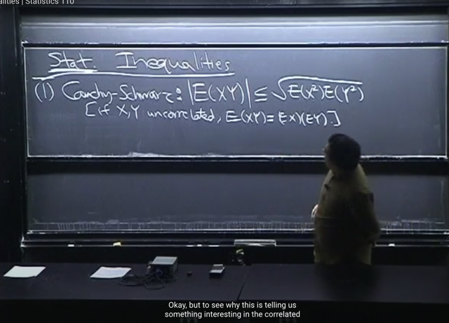</kbd>

🔗 **Related:** [LEC 21: COVARIANCE & CORRELATION](untitled.md#node-684)

> [!NOTE]
> Bất đẳng thức đầu tiên trong 4 cái quan trọng mà ta sẽ biết là **Cauchy-Schwarz**
>
> **|E(XY)| <= √[E(X^2)*E(Y^2)]**.
>
> Và **dấu bằng xảy ra khi X,Y uncorrelated E(XY) = EXEY**
>
> mình hiểu khi uncorrelated tức là Cov(X,Y) = 0, thì theo định nghĩa Cov(X,Y)
>
> Cov(X,Y) = E(XY) - EXEY, nên cov(X,Y) = 0 <=> **E(XY) = EXEY**

> [!NOTE]
> Cauchy-Schwarz Inequality
>
> |E(XY)| <= √[E(X^2)*E(Y^2)]

 

<kbd>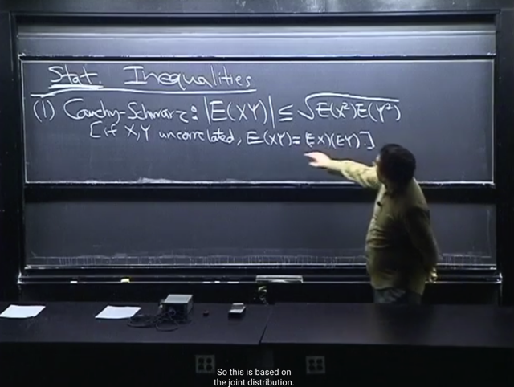</kbd>

> [!NOTE]
> Tiếp gs nói đại khái là, khi l**àm việc với E(XY)**, theo **2D LOTUS**, ta sẽ phải làm
> việc với J**oint distribution**, ...nói chung là **để tính cái E(XY)** này thì **khó** vì nó
> dính đến **Joint distribution**
>
> Còn vế trái thì nó chỉ là **marginal distribution của X^2**, tức là, không phải dính
> đến Joint distribution nên có thể đỡ rắc rối hơn

 

<kbd>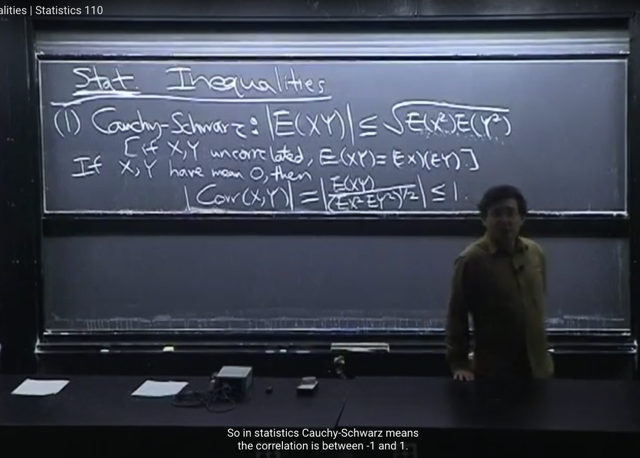</kbd>

🔗 **Related:** [LEC 21: COVARIANCE & CORRELATION](untitled.md#node-695)

> [!NOTE]
> Đại khái không phải là chứng minh bất đẳng thức mà gs nói rằng**nếu ta có
> X,Y mean zero**. Thì theo công thức của **Correlation** của X,Y: 
>
> **Corr(X,Y) = Cov(X,Y) / STD(X)*STD(Y)**
>
> Cov(X,Y) = E(XY) - EX*EY = EXY vì EX, EY bằng 0
>
> STD(X) = √Var(X) = √(EX^2 - (EX)^2) = √[E(X^2)]
>
> STD(Y) = √Var(Y) = √(EY^2 - (EY)^2) = √[E(Y^2)]
>
> STD(X)*STD(Y) = √[E(X^2)*E(Y^2)]
>
> Vậy Corr(X,Y) = EXY / [E(X^2)*E(Y^2)]^1/2
>
> Và vì Correlation chỉ có giá trị trong range [-1,1]
>
> Nên |EXY / [E(X^2)*E(Y^2)]^1/2| <= 1
>
> <=> |EXY| <= [E(X^2)*E(Y^2)]^1/2 đây chính là bất đẳng thức trên
>
> Nên bất đẳng thức Cauchy này trong statistic chính là việc correlation nằm
> trong [-1,1]

 

<kbd>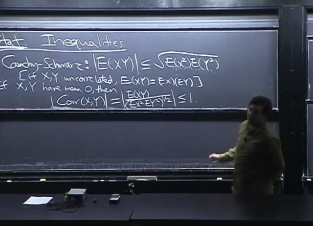</kbd>

> [!NOTE]
> Nói chung, bdt này cho phép ta
> tính một **upper-bound.**

 

<kbd>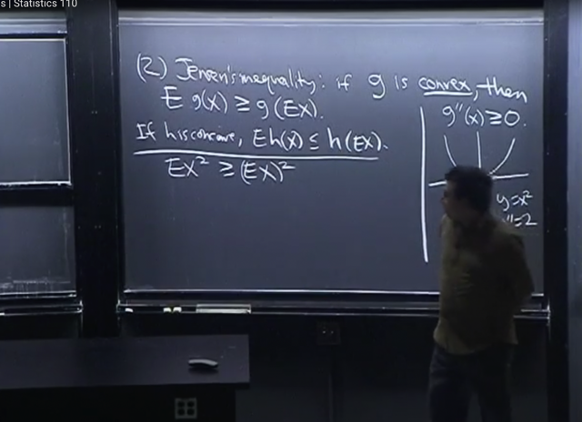</kbd>

> [!NOTE]
> Bất đẳng thức thứ 2 là **Jensen**: Cho biết nếu **h** là **convex** (hàm lồi) thì **E[g(X)]
> >= g[EX]**
>
> Gs nói thêm về **convex**, là khi**đạo hàm cấp 2 g''(x) luôn >= 0**. Còn ngược lại
> thì nó là hàm **concave** (hàm lõm)
>
> Nếu h là hàm concave (hàm lõm) thì dấu ngược lại **E[h(X)] <= h(EX)**
>
> Gs nói một cách để nhớ cái nào lớn hơn cái nào là**dùng sự thật rằng Var(X)
> thì không âm**. Nên **VarX = E(X^2) - (EX)^2 >= 0** <=> **E(X^2) >= (EX)^2**E(X^2) là E[g(X)] với g(x) = x^2  và (EX)^2 chính là g(EX) đó. Và quả thật
> **g(x) = x^2** là hàm lồi vì**đạo hàm cấp 2 bằng 2 > 0**

> [!NOTE]
> JENSEN'S INEQUALITY: Nếu g là
> convex functon, Eg(X) >= g(EX)

 

<kbd>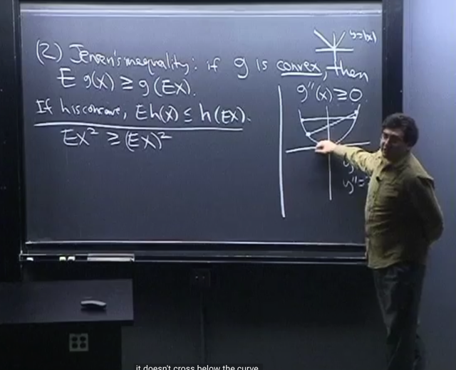</kbd>

> [!NOTE]
> Gs nói thêm **định nghĩa convex function** rộng hơn thay vì chỉ là **đạo hàm
> cấp 2 ko âm**.
>
> Ví dụ như hàm **y = |x|** có đạo hàm **không xác định tại 0**, nhưng t**heo
> định nghĩa rộng nó vẫn là hàm lồi**. Vì định nghĩa đó là khi **nối bất kì hai
> điểm nào trong function** thì **đường thẳng vẫn nằm trên function
>
> Cái này thì ta sẽ rõ hơn rất nhiều với EE364A.**

 

<kbd>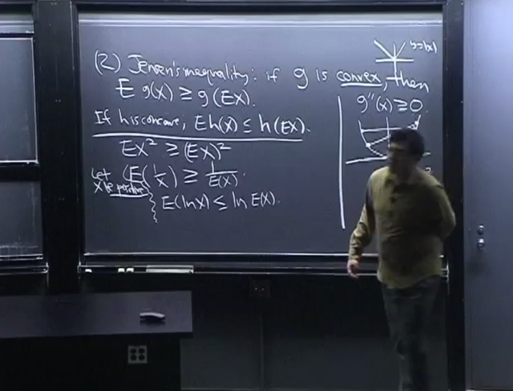</kbd>

> [!NOTE]
> Ta sẽ **qua vài ví dụ**, cho **X dương**. Thì **E(1/X) >= 1/EX**. 
>
> Là vì **g(x)** lúc này là **1/x = x^(-1)**,  có **đạo hàm cấp 2 là 1/x^3**. 
>
> g'(x) = -1/x^2 = -x^(-2) , g''(x) = -(-2)x^-3 = x^-3 = 1/x^3
>
> với **x dương** thì 1/x^3 cũng dương. Do đó g(x) **convex**.
>
> Áp dụng bất đẳng thức trên ta có **E(1/X) >= 1/EX**
>
> Còn với hàm h(x) =**lnX**. Thì đạo hàm cấp 2 của nó là **-1/x^2** sẽ **âm** khi **x dương**
> nên nó là hàm lõm (**concave**). 
>
> Vậy **E(lnX) <= ln(EX)**

> [!NOTE]
> Nếu X>0, áp dụng Jensen's Inequality: 
>
> E(1/X) >= 1/EX
>
> E(lnX) <= ln(EX)

 

<kbd>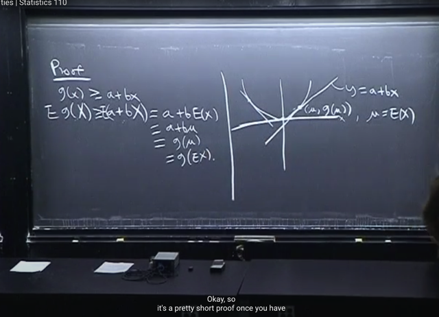</kbd>

> [!NOTE]
> Đại khái gs chứng minh như vầy:
>
> gọi **g** là **convex** function,**theo định nghĩa của convex function** thì với **mọi**
> **tiếp tuyến** a+bx nào của function**tại các x khác nhau** thì ta đều có 
> **g(X) ≥ a+bX** (1)
>
> Cái này sau khi đã học EE364a thì hoàn toàn hiểu được tại sao: Đó là vì đây
> chính là đang nhắc đến First Condition của convex function:
>
> Ta có thể suy ra nó từ Second Order condition của convex function: 
>
> f(x) ≈ f(x0) + ∇f(x0)T(x-x0) + (1/2)(x-x0)T∇^2f(x0)(x-x0)
>
> Với convex function, Hessian tại mọi điểm đều không âm (tức là nonnegative 
> curvature): ∇^2f(x0) ≽ 0 ∀ x
>
> ⇨  (1/2)(x-x0)T∇^2f(x0)(x-x0) ≥ 0 ∀x
>
> ⇨ f(x) ≥ f(x0) + ∇f(x0)T(x-x0) ∀x
>
> từ đó lấy **expected** value hai vế ta có **Eg(X)** >= **E(a+bX)** = **E(a) + E(bX)** = **a + bEX**
>
> với EX = μ (2) thì Eg(X) >= a + bμ = g(μ) = g(EX)

> [!NOTE]
> Chưa hiểu chỗ này (1) (2): Cái này thì qua EE364A thì sẽ rõ

 

<kbd>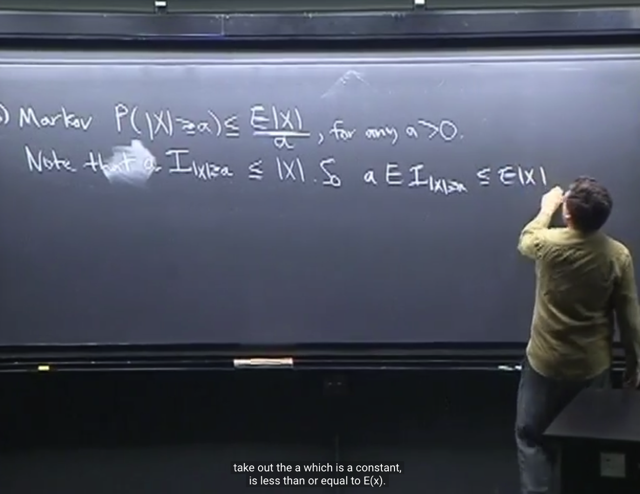</kbd>

> [!NOTE]
> Bất đẳng thức thứ 3 là **Markov**: **P(|X|>=a) <= E|X| / a** với a **dương**.
>
> Chứng minh như sau, ta sẽ dùng **Indicator** rv của event**|X|>=a** để đầu tiên
> nói về một **sự thật** khỏi cần chứng minh:
>
> **a*I_(|X|>=a) <= |X|**
>
> nó đúng là bởi: khi **|X| < a** thì **I = 0**, đương nhiên vế trái là **a*0 = 0** thì <= vế 
> phải là **|X|** là giá trị **không âm**
>
> khi **|X| >= a** thì vế trái = **a*1 = a** và nó đương nhiên **bé hơn vế phải là |X|**
>
> Vậy **a*I_(|X|>=a) <= |X|**. 
>
> Nên lấy **E() hai vế** thì E[a*I_(|X|>=a)] <= E|X|
>
> Theo **Fundamental bridge** **E(I_(|X|>=a)) = P(|X|>=a)**
>
> nên a*E(I_(|X|>=a)) <= E|X| <=> **a*P(|X|>=a) <= E|X|**

> [!NOTE]
> Ở đây có thể hỏi tại sao có thể lấy expectation hai vế.
> Ví dụ tại sao A <= B <=> EA <= EB?

> [!NOTE]
> MARKOV INEQUALITY: P(|X|>=a) <= E|X| / a với a dương.

 

<kbd>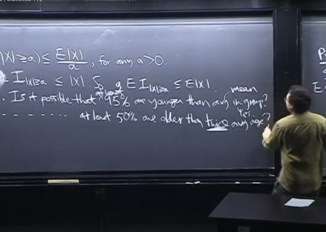</kbd>

> [!NOTE]
> để giúp ta có thể đại khái ý nghĩa của cái này ông đặt hai câu hỏi.
>
> 1) Cho **100** người, liệu **có thể nào** có chuyện có **ít nhất 95% số người**
> trong đó **nhỏ tuổi hơn tuổi trung bình** (mean) của cả đám?
>
> -> **Yes**, vì có thể có **1 người rất già**, kéo tuổi trung bình lên **rất cao** để
> rồi nó khiến **vẫn có thể có tới 95 người nhỏ có tuổi hơn con số này**
>
> 2) Cho **100** người, liệu **có thể nào** có chuyện có **ít nhất 50% số người**
> trong đó **lớn tuổi hơn tuổi 2*trung bình** (mean) của cả đám?
>
> -> **No**, ...Khúc này gs giải thích chưa hiểu lắm
>
> Đại khái là ví dụ gọi μ là average. Thì đương nhiên vì μ = (1/100) Σi=1,..100 Xi
> với Xi là số tuổi từng người, thì tổng số tuổi Σi Xi = 100μ
>
> Thế mà xét việc có 50% tức 50 người có số tuổi lớn hơn 2*mean tức 2μ thì
> tổng số tuổi của họ phải > 50*2μ = 100μ. Mà  tổng số tuổi 100 người chỉ có
> 100μ  thì không thể có chuyện trên xảy ra

 

<kbd>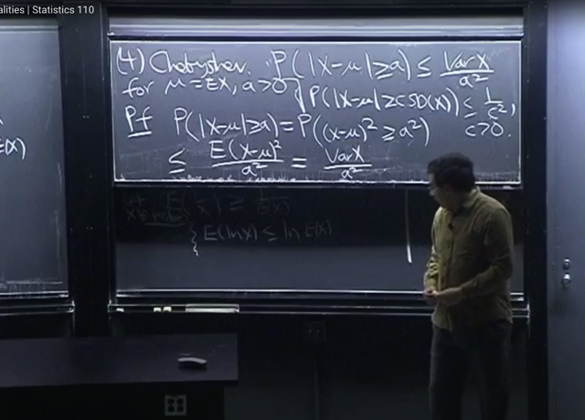</kbd>

> [!NOTE]
> Và bất đẳng thức cuối cùng là **Chebyshev**:
>
> P(**|X-μ|>=a**) <= **VarX/a^2** với μ là **EX**, và **a dương bất kì**
>
> Thì **nếu a = c*SD(X)** thì ta có bất đẳng thức: 
>
> P(|X-μ|>=**cSD(X**) <= VarX/(**c^2*****SD(X)^2**) = VarX/[c^2VarX) = **1/c^2**
>
> <=> **P(|X-μ|>=cSD(X) <= 1/c^2**
> Chứng minh như sau: bắt đầu từ vế trái P(|X-mu|>=a): 
>
> Từ |X-μ|>=a <=> (X-μ)^2 >= a^2 nên 
>
> **P(|X-μ|>=a) = P((X-μ)^2 >= a^2)**Áp dụng **Markov** **inequality** vừa biết đó là **P(|Y| >= b) <= E|Y| / b** với **b > 0**
> nên coi Y = (X-μ)^2 và b = a^2 
>
> ta có P((X-μ)^2 >= a^2) <= E[(X-μ)^2] / a^2 
>
> và E[(X-μ)^2] / a^2 chính là Var(X)/a^2| vì theo định nghĩa **Var(X) = E[(X-EX)^2]**
>
> Vậy P((X-μ)^2 >= a^2) <= Var(X)/a^2
>
> <=> **P(|X-μ|>=a) <= Var(X)/a^2**

> [!NOTE]
> Chebyshev Inequality: P(|X-μ|>=a) <= VarX/a^2 với μ = EX, và a > 0

 

