# Lec 29: Law Of Large Numbers & Law Of Central Limit

📊 **Progress:** `38` Notes | `37` Screenshots

---
<a id="node-877"></a>

<p align="center"><kbd>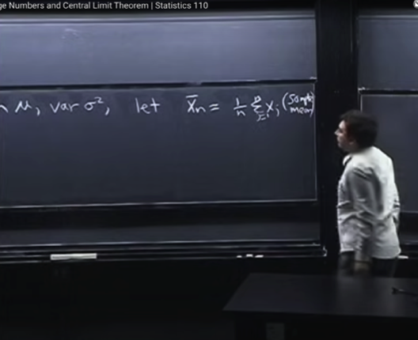</kbd></p>

<p align="center"><kbd></kbd></p>

<p align="center"><kbd>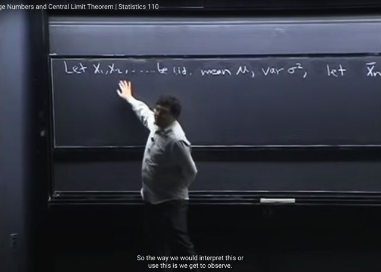</kbd></p>

> [!NOTE]
> Bài này ta sẽ học về **hai** **luật** **quan trọng nhất trong xác suất** theo gs.
>
> Thế thì, cho **n iid random variables** có mean `μ` và variance `σ^2`
>
> Ta sẽ làm quen với khái niệm **X_bar** là **trung bình của n Xj**. Gọi là **SAMPLE
> MEAN**
>
> Câu hỏi ta quan tâm là, Sample mean **sẽ như thế nào** khi **n trở nên càng lớn**

<br>

<a id="node-878"></a>

<p align="center"><kbd>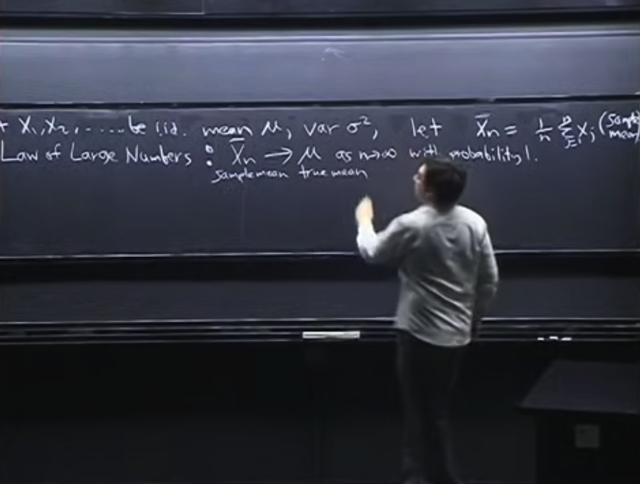</kbd></p>

> [!NOTE]
> Thế thì **LAW OF LARGE NUMBERS** cho biết: Khi **n lớn đến vô cùng**
> thì **SAMPLE MEAN CONVERGE VỀ TRUE MEAN** `(μ)` với **xác suất `=` 1**
>
> Đại khái là `μ,` ta đã biết nó là EX, là**true mean**, và là **constant**. Còn
> **sample mean X_bar** nó là**tổng n các Xj chia cho n**, và do các **Xj là
> random variables** nên **SAMPLE MEAN LÀ MỘT RANDOM VARIABLES**.
>
> Và định lý này cho bết random variable này sẽ **CONVERGE** về **constant
> EX**: **X_bar `->` μ**

> [!NOTE]
> **LAW OF LARGE NUMBERS**
>
> Khi n lớn đến vô cùng thì **SAMPLE MEAN CONVERGE VỀ TRUE
> MEAN** `(μ)` với XÁC SUẤT `=` 1
>
> Hay nói cách khác, khi `n->infinity` thì sample mean chắc chắn bằng true
> mean

<br>

<a id="node-879"></a>

<p align="center"><kbd>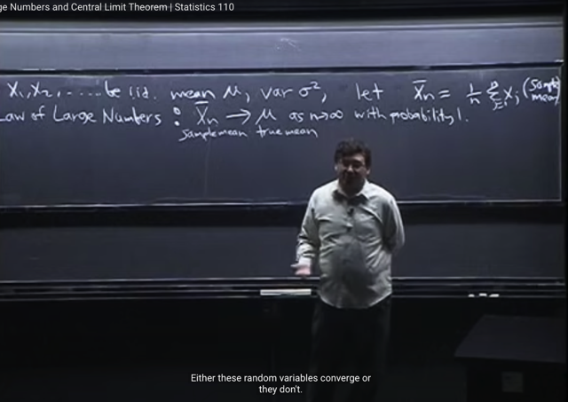</kbd></p>

> [!NOTE]
> Đại khái là, là nên hiểu về chữ **converge** ở đây như thế nào. Vì **sample
> mean** là một **random variable**. Trong khi ta biết về v**iệc convergence của
> dãy số**, hay của **function** (dãy số cũng là kết quả của function define bởi
> số hạng tổng quát với các giá trị của n khác nhau thôi).
>
> Vậy thì, mấu chốt là, ta đ**ã biết random variable bản chất là một function**,
> map các **possible outcome của sample space với một numerical number**.
> Hoặc nói cách khác, vài possible outcome của sample space sẽ được map
> thông qua random variable để thành  các number để tạo một chuỗi số
>
> Nên khi hiểu như vậy, thì sẽ thấy nó liên hệ với khái niệm converge của
> function hoặc chuỗi số.
>
> Và thêm nữa ta sẽ hiểu **X_bar `->` μ**là một **EVENT**: và **xác suất của
> event này, theo luật số lớn là 1 (tuyệt đối, 100%)**

<br>

<a id="node-880"></a>

<p align="center"><kbd>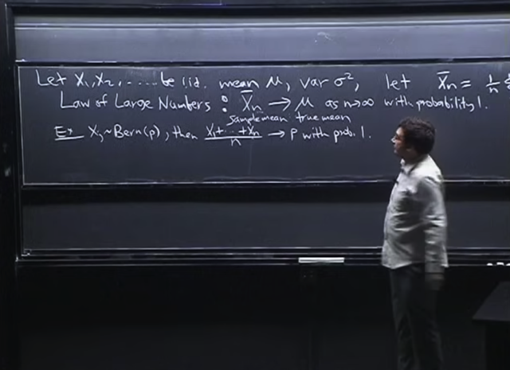</kbd></p>

> [!NOTE]
> Một ví dụ cho **Xj ~ Bern(p)**, thì theo **luật số lớn** ta có **[Σj=1:n Xj] `/` n** sẽ
> **converge về p** với **xác suất 1**
>
> Gs nói đại khái là điều ở trên cơ bản là **rất intuitive**, rất dễ hiểu, khi **giả sử ta
> tung đồng xu (fair coin) 1 triệu lần** thì ta sẽ thấy hợp lý để **tin rằng sẽ có một
> nửa là mặt Head**.
>
> Ngoài ra việc luật số lớn nói rằng **xác suất bằng 1**, cũng cho ta một cái để vịn
> vào, bởi lẽ **khi tung đồng xu mà kết quả ra là một chuỗi HHHHH** ...thì ta
> **sẽ vẫn biết nó sẽ không kéo dài mãi mãi** được

<br>

<a id="node-881"></a>

<p align="center"><kbd>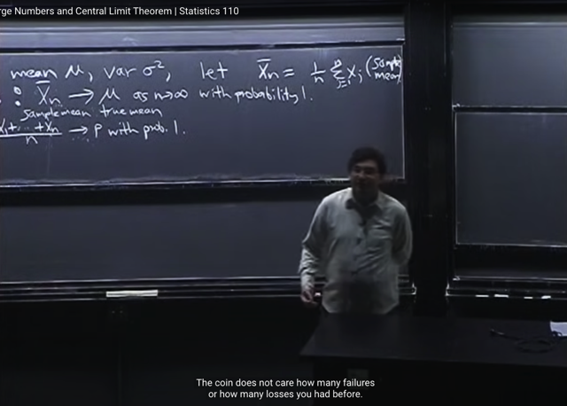</kbd></p>

> [!NOTE]
> đại khái là ta biết về **cách hiểu sai lầm** của**con bạc** khi cho rằng **giả sử đã
> thua 100 lần** (100 lần ra HEAD rồi). Thì họ **nghĩ luật số lớn sẽ khiến lần tới
> khả năng ra TAIL sẽ cao hơn**, nên **cứ chơi thì sẽ thắng lại**
>
> Nhưng điều đó **hoàn toàn sai**. Vì như đã biết ở bài **Gambler Fallacy**, việc **flip
> coin** có tính chất **MEMORYLESS**, **sau mỗi lần trial** thì như **reset lại mới**,
> chứ không có chuyện nó "nhớ về chuỗi HEAD trước đó". Nên **xác suất ở lần
> flip tiếp theo là vẫn y xì 50%**
>
> Và bên cạnh đó ta **phải hiểu luật số lớn nói rằng khi `n->` VÔ CÙNG LỚN** thì
> dù có **HEAD** 1 tỷ lần thì nó vẫn **chả là gì so với vô cùng lớn**

<br>

<a id="node-882"></a>

<p align="center"><kbd>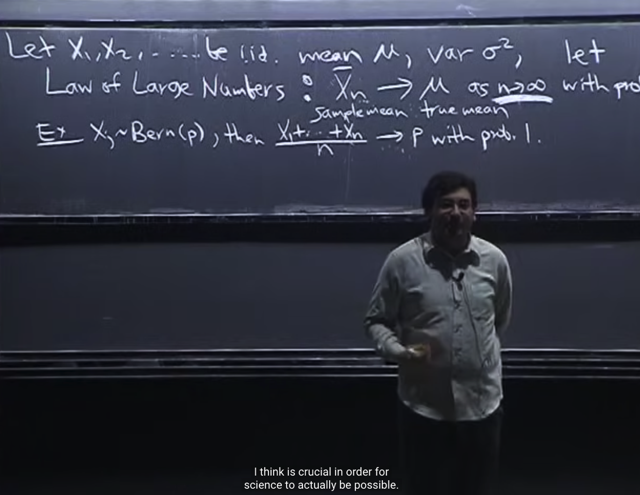</kbd></p>

> [!NOTE]
> gs nói định luật này **rất quan trọng** với thế giới khoa học vì nó mang ý
> nghĩa là, **nếu ta collect càng nhiều dữ liệu** thì ta sẽ **dần tiến đến biết được
> sự thật**
>
> NGoài ra có câu chuyện về **một vận động viên ghét statistic** vì anh cho rằng
> luật này có nghĩa là **dù có tập luyện nhiều mấy đi nữa** thì cuối cùng **anh ta
> vẫn chỉ có performance trung bình**.
>
> Gs nói lập luận trên **quên mất là định luật nói về các i.i.d random variables**
> tức là **có cùng distribution**. Trong khi đó **việc tập luyện của vận động viên
> khiến thay đổi distribution**

<br>

<a id="node-883"></a>

<p align="center"><kbd>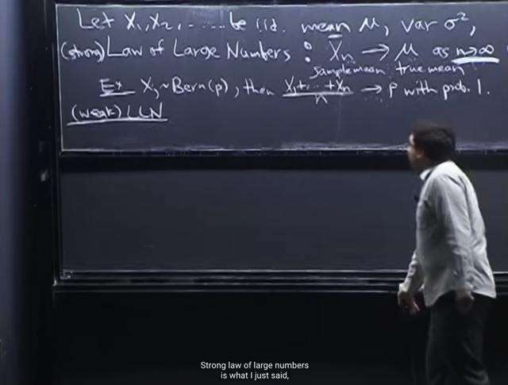</kbd></p>

> [!NOTE]
> Thế thì, gs nói có thể gọi là **có phiên bản STRONG của Luật số lớn**, như
> đã nói, nó tuyên bố random variable **sample mean sẽ converge về True
> mean.** Và event convergence này sẽ **chắc chắn xảy ra (xác suất `=` 1)**

<br>

<a id="node-884"></a>

<p align="center"><kbd>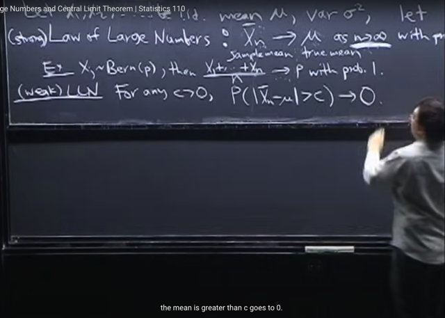</kbd></p>

> [!NOTE]
> Còn một phiên bản gọi là **Weak** của **LLN** nói rằng, **với mọi số dương c** dù
> **nhỏ đến mấy** thì xác suất của việc [t**ồn tại khoảng cách c dương giữa Sample 
> mean và True mean**] sẽ**tiến về 0** (khi **n `->` infinity**)
>
> Và **P(|Sample mean `-` True mean| > c)** `->` 0 gọi là **CONVERGENCE** **IN**
> **PROBABILITY**
>
> Và ý nghĩa của nó có thể hiểu nôm na là: với n lớn đến vô cùng thì sẽ**cực
> kì khó có có chuyện** có sự khác nhau giữa sample mean và true mean
>
> Thì điều này cũng đồng nghĩa là "**khi n lớn đến vô cùng** thì sẽ **xác suất mà 
> sample mean khác true mean rất nhỏ**

<br>

<a id="node-885"></a>

<p align="center"><kbd>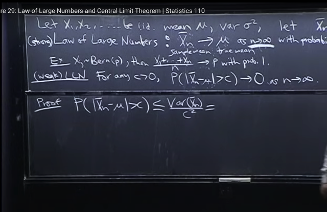</kbd></p>

> [!NOTE]
> Ta sẽ **chứng minh Law of Large Number (weak)**: đại khái là để chứng minh
> gs cho rằng chỉ cần dùng **Chebyshev inequality** mà bài trước đã học.
>
> **Chebyshev** inequality cho biết: 
>
> **P(|X-μ| `>=` a) `<=` Var(X)** `/` a^2 với `μ` `=` EX, a dương bất kì
>
> Do đó áp dụng vào đây với X là `X_bar,` `μ` là `EX_bar:` 
>
> ```text
> P(|X_bar - μ|>c) <= Var(X_bar) / c^2
> ```

<br>

<a id="node-886"></a>

<p align="center"><kbd>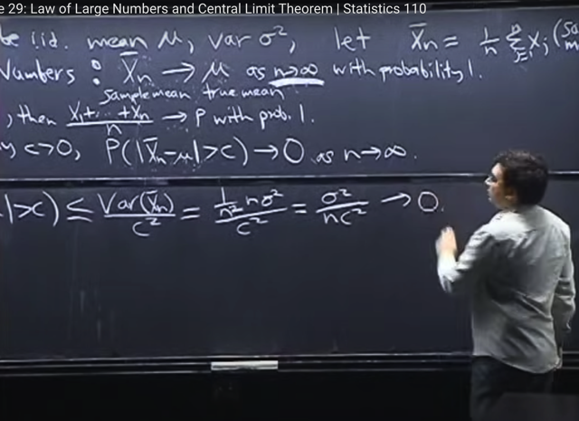</kbd></p>

🔗 **Related:** [LEC 29: LAW OF LARGE NUMBERS & LAW OF CENTRAL LIMIT](untitled.md#node-894)

> [!NOTE]
> Thế thì xét**Var(X_bar)**, đúng hơn là **Xn_bar** để chỉ đây là **sample mean**, của
> **n iid Xj**.
>
> ```text
> => Var(X_bar) = Var [(1/n)*(X1 + X2 + ...Xn)]
> ```
>
> **Đưa constant c ra ngoài** và**bình phương** theo property đã biết của Variance
>
> `=` **(1/n^2) `Var(X1` `+` X2 `+` .... Xn)**
>
> Tiếp, **Var(ΣXj)** `=` **Σj Var(Xj)** `+` **Σi,j Cov(Xi,Xj)** thế mà vì **các Xj iid**
> nên **covariance của chúng bằng không** để rồi variance của tổng các Xj chỉ
> còn bằng tổng variance của các Xj
>
> `=` **(1/n^2) `Σj=1:n` Var(Xj)**
>
> và các Xj đã nói có variance `σ^2.` Vậy
>
> ```text
> (1/n^2) Σj=1:n Var(Xj) = (1/n^2) Σj=1:n σ^2
> ```
>
> `=` `(1/n^2)` `n*σ^2`  `=` **σ^2/n**
>
> Kết qủa là **Var(X_bar)/c^2** `=` **σ^2 `/` nc^2
>
> Và khi `n->` inf thì cái này `->` `σ^2` `/` inf `=` 0**Vậy thì ta đã có có `P(|X_bar` `-` `μ|>c)` `<=` `Var(X_bar)` `/` c^2, **mà khi n lớn vô cùng thì vế phải `->` 0 thì dĩ nhiên `P(|X_bar` `-` `μ|>c)` cũng `->` 0
>
> Đó là chứng minh LLN (weak)**

<br>

<a id="node-887"></a>

<p align="center"><kbd>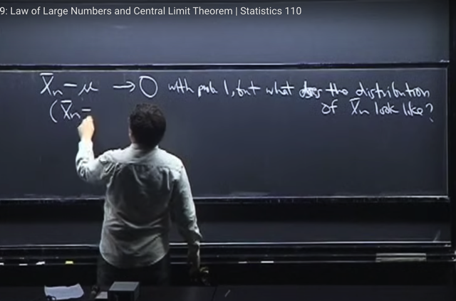</kbd></p>

> [!NOTE]
> Đại khái là, điều này **tuy cho biết khi n lớn đến vô cùng thì `Xn_bar` `-` `μ` `->` 0**
> hay `X_bar_n` `->` `μ` (true mean). 
>
> Nhưng nó **không cho ta biết distribution của Xn_bar**.
>
> Nghĩa là ta **tuy rằng biết `Xn_bar` `->` μ** nhưng không biết nó tiến về mu với 
> tốc độ nào, theo cách thức ra sao.

<br>

<a id="node-888"></a>

<p align="center"><kbd>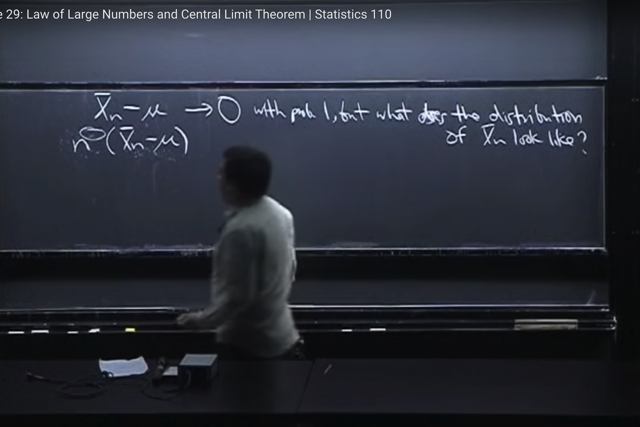</kbd></p>

> [!NOTE]
> Thế thì đại khái là, gs nói rằng để **nghiên cứu về distribution của Xn_bar**.
> Ta sẽ **nhân `(Xn_bar` `-` `μ)` với n^x** (x chưa biết).
>
> Mục đích là, **nếu x lớn hơn một mức nào đó** thì **n^x sẽ `->` inf** nhanh hơn
> **(Xn_bar-mu) đi đến 0**. Tức là **n^x vượt trội**. Dẫn đến **tích của chúng `->` inf**
> (blow up)
>
> Còn ngược lại, nếu **x nhỏ hơn mức nào đó** thì **Xn_bar `-` μ** **dominate**, nó **đi
> tới 0 nhanh hơn n^x đi tới inf.** Dẫn đến **tích của chúng đi tới 0.**
>
> Nói chung là có thể **từ đó ta tìm được distribution của Xn_bar**

<br>

<a id="node-889"></a>

<p align="center"><kbd>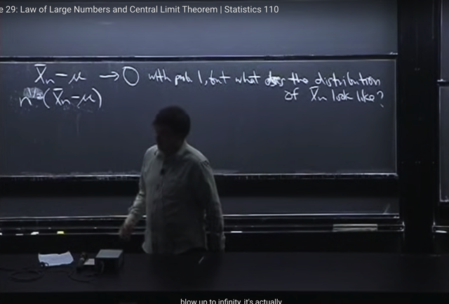</kbd></p>

> [!NOTE]
> Và con số đó là **1/2**. Là con số mà **n^x(Xn_bar `-` μ)** có tính chất là có một
> **nice distribution**, **không bị blow up** hoặc **get killed `(->0)` khi n `->` inf**

<br>

<a id="node-890"></a>

<p align="center"><kbd>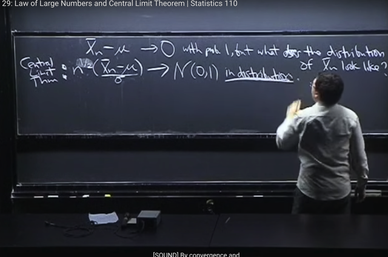</kbd></p>

> [!NOTE]
> Và đây cũng chính là **CENTRAL LIMIT THEOREM**: 
>
> Nó nói nếu chia thêm cho `σ` thì **n^(1/2)*(Xn_bar-μ)/σ** sẽ trở thành 
> **Standard Normal** distribution
>
> Và điều đó có nghĩa là nếu lấy **CDF** của **n^(1/2)*(Xn_bar-μ)/σ** thì
> **CDF này sẽ converge về CDF của N(0,1)**, mà ta còn nhớ nó được kí hiệu
> riêng bằng fi viết hoa (Φ).
>
> ```text
> Suy ngẫm một chút: n^(1/2)*(Xn_bar-μ)/σ là gì, nó là một random variable
> ```
> vì nó là kết quả khi apply một function lên n random variables Xj. (trong
> ```text
> function đó ta tính Xn_bar = (Σj Xj)/n cũng như chia cho σ là true standard
> ```
> deviation (dù chưa biết nhưng có thể gọi nó là unknown constant)
>
> Thế thì CLT nói rằng, khi n lớn vô cùng thì distribution của cái rv này sẽ
> là một Normal (0,1) cho dù Xj có là distribution gì đi chăng nữa

> [!NOTE]
> CENTRAL LIMIT THEOREM:
>
> ```text
> Khi n-> infinity thì n^(1/2)*(Xn_bar-μ)/σ (là một rv)  sẽ converge về / trở
> ```
> thành N(0,1) rv

<br>

<a id="node-891"></a>

<p align="center"><kbd>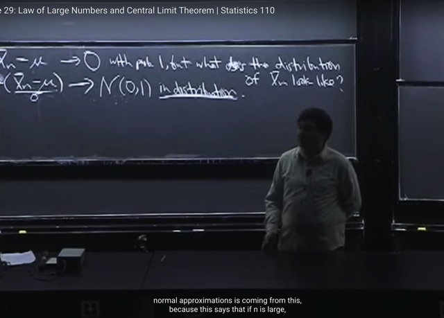</kbd></p>

> [!NOTE]
> Đại khái là, **gs cho rằng** kết quả này **rất đáng kinh ngạc**, vì
> **n^(1/2)(Xn_bar-μ)/σ** có thể là **discrete**, hoặc **continuous** hoặc **hỗn**
> **hợp** giữa cả hai.
>
> Và **distribution** của nó rõ ràng**có thể rất phức tạp**. Trong khi đó **N(0,
> 1)** chỉ **là một distribution cụ thể** **trong nhiều distribution**.
>
> Chính vì định lí này mà **Standard Normal** trở nên **phổ biến**trong
> statistic **được dùng `/` chọn** để **approximation distribution của các đại
> lượng
>
> Vì nó**bởi dc **biện minh bởi định lý Central Limit Theorem** rằng **khi n đủ
> lớn** thì **distribution của sample mean sẽ hội tụ về N(0,1)**

<br>

<a id="node-892"></a>

<p align="center"><kbd>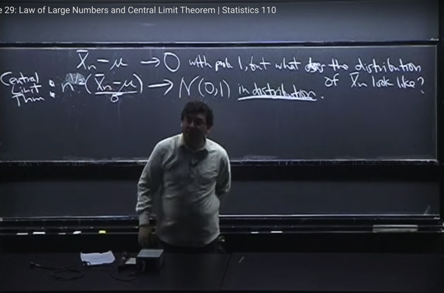</kbd></p>

> [!NOTE]
> Gs cho rằng đại khái là t**rong khía cạnh này**, thì **Central Limit Theorem** tỏ
> ra  **hữu ích hơn so với Law of Large Number** vì thay vì chỉ nói rằng**sample
> mean hội tụ về true mean như LLN** thì **CLT còn cho biết distribution của
> sample mean** giúp ta đại khái là hiểu sự hội tụ đó diễn ra ntn

<br>

<a id="node-893"></a>

<p align="center"><kbd>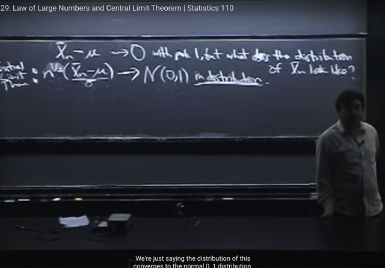</kbd></p>

> [!NOTE]
> Đại khái là, **tuy nhiên** gs lưu ý rằng ta nên hiểu **hai khái niệm convergence
> nói đến ở LLN và và CLT là khác nhau**.
>
> Với **LLN**, nó nói về **point-wise convergence**.
>
> Đại khái ý là, nó nói về sự hội tụ của **MỘT ĐIỂM (sample mean)** về **MỘT
> ĐIỂM (true mean)**.
>
> Còn với CLT, là nói về sự hội tụ của**MỘT DISTRIBUTION** về **MỘT
> DISTRIBUTION**

<br>

<a id="node-894"></a>

<p align="center"><kbd>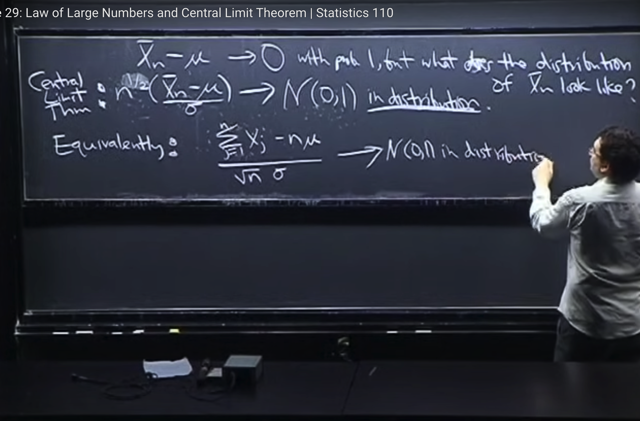</kbd></p>

🔗 **Related:** [LEC 29: LAW OF LARGE NUMBERS & LAW OF CENTRAL LIMIT](untitled.md#node-886)

> [!NOTE]
> Tiếp theo đại khái là việc chứng minh **n^(1/2)(Xn_bar-μ)/σ** **-> N(0,1)** thì
> tương đương với chứng minh **(Σj Xj `-` `nμ)` `/` (√n)*σ** `->` N(0,1)
>
> (vì thực ra hai cái là một: **Nhân tử và mẫu** cho **n^(1/2)** thì ta sẽ có
>
> (**Σj Xj** `-` `nμ)` `/` `(√n)*σ` ****Và cái dạng tương đương này, chính là việc ta quan
> tâm đến **Σj Xj** (gọi là **convolution** như đã biết), tuy nhiên ta sẽ
> **standardize** `Σj` Xj về **mean 0**, và **variance 1** bằng cách **trừ mean (của
> `Σj` Xj)** và **chia cho standard deviation** (của `Σj` Xj)
>
> Thế thì mean của, tức**E(Σj Xj) chính là nμ**:
>
> `E(Σj` Xj) `=` `Σj` `E(Xj)` ) (linearity) `=` `Σj` `μ` (vì EXj `=` `μ` như đề bài cho) `=` **nμ**
>
> Và **standard deviation** của `STD(Σj` Xj) là `√Var(Σj` Xj)
>
> mà variance của `X_bar` vừa rồi mới chứng minh chính là:
>
> ```text
> Var(X_bar) = σ^2/n <=> n^2*Var(X_bar) = n^2 σ^2/n
> ```
>
> ```text
> <=> Var(n*X_bar) = n^2 σ^2/n
> ```
>
> ```text
> <=> Var(Σj Xj) = n*σ^2
> ```
>
> `<=>` **STD(Σj Xj) `=` (√n)*σ**
>
> ```text
> Do đó: (Σj Xj - nμ) / (√n)*σ chính là (Σj Xj - E(Σj Xj)) / STD(Σj Xj) và chính là việc
> ```
> ta STANDARDIZE một random variable U `=` `Σj` Xj
>
> Tóm lại, **đại ý là** **hai dạng** của **CLT** chỉ là một cái ta quan tâm
> **distribution**, cách hành xử của **sample mean**,
>
> và một cái ta diễn giải nó theo cách ta **quan tâm convolution: Tổng Xj**. Và
> **cụ thể hơn** là **trong dạng  thứ hai** thì ta quan tâm đến **Tổng Xj đã được
> standardized**

<br>

<a id="node-895"></a>

<p align="center"><kbd>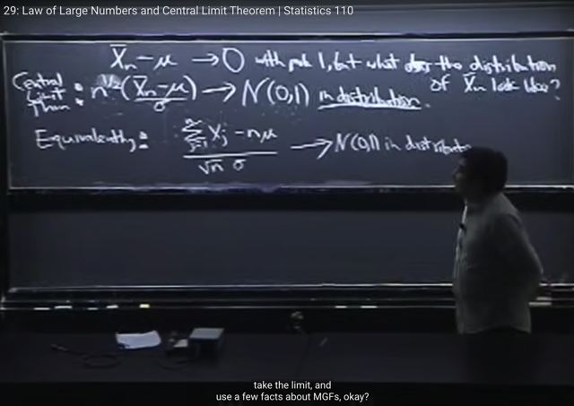</kbd></p>

> [!NOTE]
> Đại khái là **để chứng minh** thì ta sẽ **giả định** rằng **tồn tại MGF**.
>
> Vì như đã biết, **sẽ dễ hơn** khi **dùng MGF để làm việc với convolution,
> tức tổng của iid random variables** nhưng **cũng có cách để mở rộng nó
> ra** **khi MGF không tồn tại** nhưng **ở đây ta sẽ giả định MGF tồn tại.**

<br>

<a id="node-896"></a>

<p align="center"><kbd>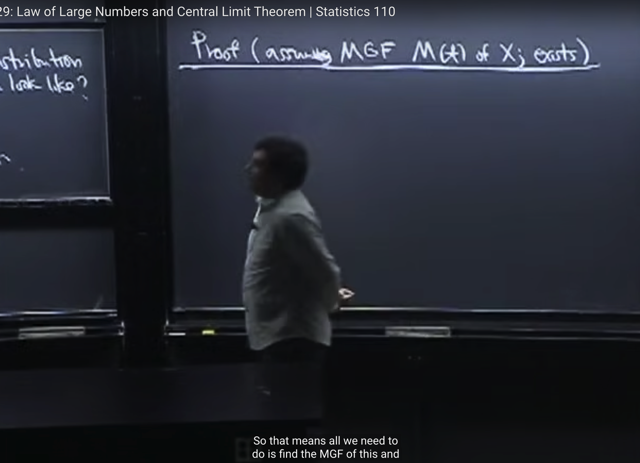</kbd></p>

> [!NOTE]
> Từ đó, cách làm của ta sẽ là, ta **tìm MGF của vế trái**, và chứng minh rằng khi
> **n `->` inf** thì **MGF** này **converge về MGF của N(0,1)**.
>
> Khi đó đồng nghĩa là random variable U `=` **standardized `Σj` Xj** sẽ **converge**
> về **X~N(0,1)**
>
> Gs gọi là **CONVERGE IN DISTRIBUTION**, là cái ta đang chứng minh, là
> **distribution của vế trái sẽ converge về N(0,1)**

<br>

<a id="node-897"></a>

<p align="center"><kbd>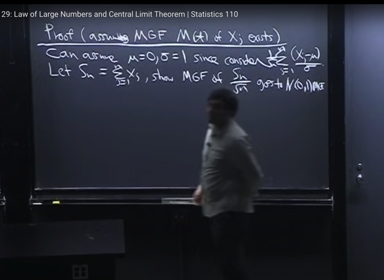</kbd></p>

> [!NOTE]
> Đại khái là, cái **vế phải** (tức là **standardized `Σj` X**j), thật ra **có thể viết ở
> dạng khác** trong đó ta **standardized từng Xj riêng** **trước khi sum** lại và
> **chia cho √n**.
>
> Do đó, có thể coi như, cái ta quan tâm tương đương với **(Σj Yj)/√n**với Yj là
> Xj đã standardized: **Yj `=` (Xj-μ)/σ**
>
> Thật vậy:
>
> ```text
> (Σj Xj - nμ) / [(√n)*σ] = Σj (Xj - μ) / [(√n)*σ]  | ví dụ như X1+X2-2μ = X1-μ+X2-μ
> ```
>
> ```text
> = (1 / √n) * { Σj (Xj - μ) / σ }
> ```
>
> `=` (1 `/` √n) * **Σj Yj**với Yj `=` (Xj `-` `μ)` `/` `σ`
>
> Mà có thể gọi Xj là standardized Xj luôn, khỏi đặt tên Yj chi cho mệt
>
> Gọi **Sn** `=` `Σj` Yi, để rồi bài toán là ta sẽ là: 
>
> **tìm MGF của Sn `/` √n** `=` `Σ` Xj `/√n.` 
>
> Và sau đó **tìm limit của nó**, để thấy nó **converge về M(t) của N(0,1)** là chứng minh xong

<br>

<a id="node-898"></a>

<p align="center"><kbd>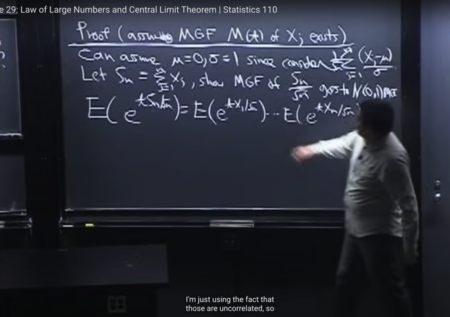</kbd></p>

🔗 **Related:** [LEC 17: MOMENT GENERATING FUNCTIONS](untitled.md#node-536)

🔗 **Related:** [LEC 19: JOINT, CONDITIONAL AND MARGINAL DISTRIBUTION](untitled.md#node-628)

> [!NOTE]
> Thế thì MGF của X: `M_X(t)` theo định nghĩa ta đã biết là **M_X(t) `=` E(e^tX)**
>
> Vậy MGF của `Sn/√n` là **E(e^t * Sn `/` √n)** `=` **E(e^t(X1+X2...Xn) `/` √n)**
>
> Thế thì, vì các **Xj independent** nên MGF **theorem** cho phép **MGF của tổng các
> r.v** bằng  **tích các MGF của mỗi r.v**
>
> **E(e^t(X1+X2...Xn) `/` √n) `=` `E(e^tX1` `/` `√n)*E(e^tX2` `/` `√n)*..*E(e^tXn` `/` √n)**
> (mà xuất phát cũng từ tính chất `E(XY)` `=` EX*EY mà ta đã chứng minh trong link hồng

<br>

<a id="node-899"></a>

<p align="center"><kbd>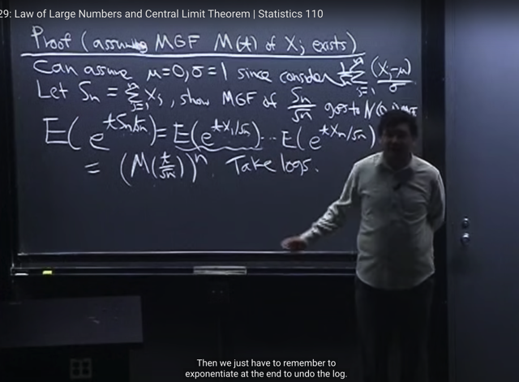</kbd></p>

> [!NOTE]
> Tiếp, vì các **Xj iid** tức là chúng **cùng distribution**, nên các MGF của Xj `/` √n
> này **giống nhau hết**. Nên ta có cái tích này bằng **{ `E[e^tX1/√n]` }^n**
>
> Và rồi **E[e^tX1/√n] thì là M(t) của rv X1/√n** nhưng cũng có thể coi là **MGF
> của X1** nhưng**evaluate tại `t/√n,` tức M_(t/√n)**
>
> Nên kết quả trở thành: 
>
> **{ `E[e^tX1/√n]` }^n `=` [M(t/√n)]^n**
>
> (nhớ là ta đã giả định ở đầu bài rằng MGF M(t) của Xj tồn tại

<br>

<a id="node-900"></a>

<p align="center"><kbd>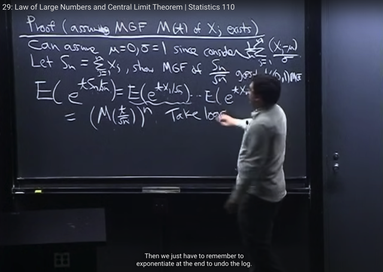</kbd></p>

> [!NOTE]
> Thế thì khi **lấy limit n->inf** của cái này ta sẽ thấy có dạng **1^inf.**
>
> gs nói theo kiến thức Calculus thì khi gặp kiểu như này hay **0^0** thì ta
> có thể phải dùng **Hopital rule** gì đó (sẽ quay lại sau khi finished 1801 1802)
> hoặc dùng Taylor series ...
>
> Và để làm tiếp ta sẽ **lấy logs (Tại sao?)**

> [!NOTE]
> (sẽ quay lại sau khi
> finished 1801 1802)

<br>

<a id="node-901"></a>

<p align="center"><kbd>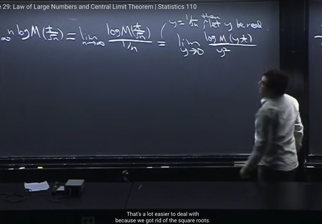</kbd></p>

> [!NOTE]
> rồi, lấy **log** và **tính limit của nó**. **lim `n->inf` log M(t/√n)**
>
> Thế thì ta sẽ **học thêm một kiến thức** về calculus mà chắc sẽ gặp trong 1801
> 1802 là: hiện giờ ta đang có dạng **inf*0**, thì để **chuyển về dạng 0/0**, ta sẽ **thay
> việc nhân** **với n** bằng **chia cho 1/n**
>
> Khi đó, gs nói **tuy là đã giống như có thể dùng Hopital rule** rồi nhưng thực tế còn
> một vấn đề là **n đang là integer** và **không thể làm calculus với integer**. Đồng thời
> vì **hiện tại deal với `1/n` rất annoying** vì đạo hàm của nó là **-1/n^2**. Thành ra ông
> cho rằng ta nên **change variables** bằng cách đặt **y `=` 1/sqrt(n)** và cho **y là real
> number thay vì integer.** (Thảo luận với GPT chỗ này??)
>
> Khi đó ta **tìm limit theo y thay vì n**
>
> Và lim này **đơn giản hơn** khi **tử là log M(yt)** (bỏ đi được cái sqrt) và **mẫu là y^2.**
> Và khi **n `->` inf** thì tương đương **y sẽ `->` 0**

<br>

<a id="node-902"></a>

<p align="center"><kbd>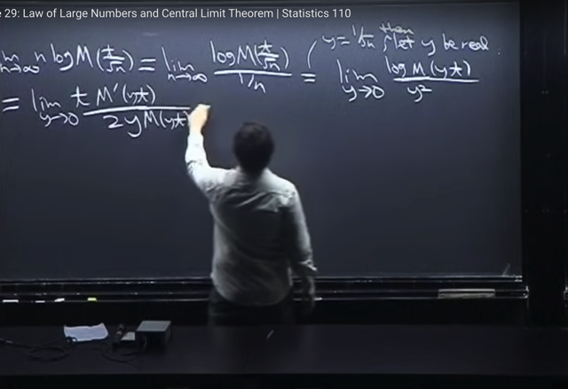</kbd></p>

> [!NOTE]
> Rồi, gs cho rằng ta đã có thể dùng**L'Hospital rule** (again, 1801,1802 sẽ học)
> nhưng ta hiểu là có thể **tính lim tiếp tục** bằng cách **lấy derivative tử và mẫu**.
>
> Đạo hàm của mẫu số theo y đương nhiên là **2y**. Còn của tử số thì dùng**chain
> rule** để tính:
>
> ```text
> = d log M(yt) / d M(yt) * d M(yt) / dyt * d yt / dy = (1/logM(yt)) * M'(yt) * t
> ```
>
> `=` t*M'(yt) `/` log[M(yt)]
>
> nên lim .. `=` **lim `y->0` t*M'(yt) `/` 2ylog[M(yt)]**

<br>

<a id="node-903"></a>

<p align="center"><kbd>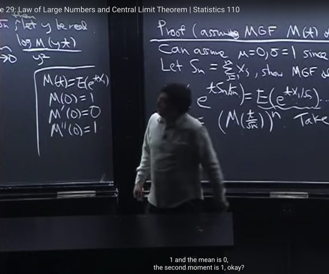</kbd></p>

> [!NOTE]
> Tiếp theo ta review chút xíu: Đại khái là ta đã biết MGF của X là **M(t) `=`
> E[e^tX]**. Thì đương nhiên **M(0) `=` `E[e^0]` `=` `E(1)` `=` 1**
>
> Nhưng quan trọng là, ta biết MGF là Moment Generating Function,
> **đạo hàm cấp n** của nó **chính là n'th moment của X**:
>
> **1st derivative M'(t)**, chính là **1st moment: EX**, chính là **mean**. Và với
> **Xj** thì ta đã nói ở trên đây là "đã standardized" nên **mean `=` 0**
>
> còn **M''(t)** chính là **2nd moment:** **E(X^2)**. Với Xj, như vừa nói, đã standardized
> nên variance `Var(Xj)` `=` `E(Xj^2)` `-` (EXj)^2 `=` 1. Nên **E(Xj^2)** `=` 1 `-` (EXj)^2 `=1` `-` 0 
> `=` **1**.
>
> Vậy M'(0) `=` 0 và M''(0) `=` 1

<br>

<a id="node-904"></a>

<p align="center"><kbd>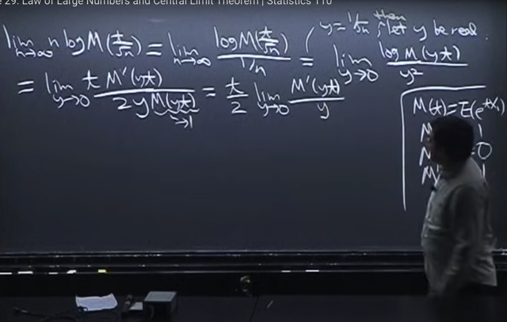</kbd></p>

> [!NOTE]
> Tiếp, vì khi **y `->` 0** thì **tử và mẫu đều `->` 0** 
>
> (vừa nói, M'(0) `=` 0), và 2yM(yt) `->` 2*0*1 `=` 0 nên ta sẽ tiếp tục áp dụng 
> L'Hospital rule
>
> Nhưng trước hết thu gọn một chút **đưa `t/2` ra**, và cho **M(yt) `=` 1** (khi `y->` 0 thì
> M(yt) `->` M(0) `=` 1 như vừa  slide trước đã nói). Nên ở trong ta còn lại M'(yt) `/` y

<br>

<a id="node-905"></a>

<p align="center"><kbd>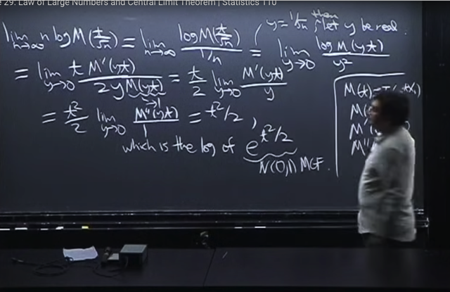</kbd></p>

> [!NOTE]
> Áp dùng LHospital rule lần nữa thì mẫu số chỉ còn 1 (đạo hàm của y w.r.t
> y) tử số dùng chain rule ta có M''(yt) * t đưa t ra thành t^2
>
> Và khi `y->` 0  thì M''(yt) `->` M''(0) `=` 1 như mới nói. Vậy kết quả là:
>
> lim khi `y->0` của **LOG (Sn/sqrt(n))** `=` t^2 `/` 2
>
> mà `t^2/2` chính là LOG của e ^ `(t^2/2)` thì trong đó e ^ `(t^2/2)` **chính là
> MGF của N(0,1)
>
> Như vậy đại khái là ta đã chứng minh rằng log MGF của vế trái
> ```text
> (n^(1/2)*(Xn_bar-μ) / σ, mà ta đã lập luận là MGF của Sn/sqrt(n)) có đặc
> ```
> điểm: limit cuả nó khi `n->inf` converge về log MGF của N(0,1). Từ đó kết
> luận khi `n->inf,` distribution vế trái converge về N(0,1. Như vậy ta đã chứng
> minh xong CLT**

<br>

<a id="node-906"></a>

<p align="center"><kbd>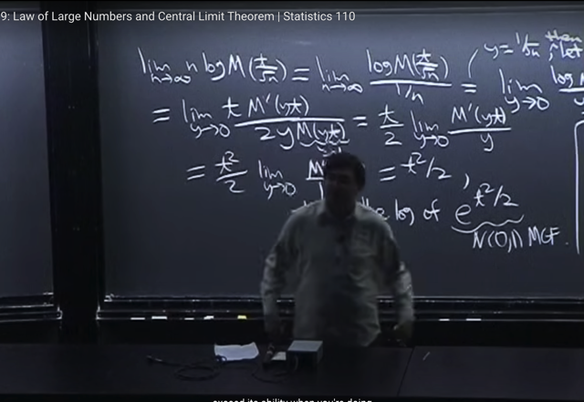</kbd></p>

> [!NOTE]
> đại khái là gs nói ông đã từng nói qua rằng **trong một số điều kiện**
> thì **Binomial (n, p)** có thể **xấp xỉ Normal**.
>
> Nhờ vậy mà ngày xưa, khi máy tính còn hạn chế hoặc chưa có thì nó
> giúp **người ta tính Binomial** bằng cách **dùng Normal** vì **tính giai
> thừa trong Binomial rất khó**. Nói chung là Normal có những đặc điểm
> dễ thương hơn

<br>

<a id="node-907"></a>

<p align="center"><kbd>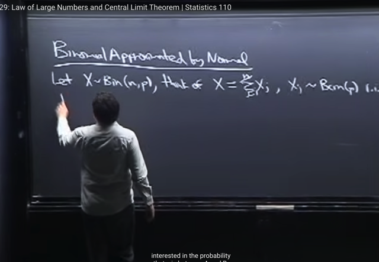</kbd></p>

> [!NOTE]
> ta qua ví dụ **Normal** được dùng để **approximate Binomial**.
>
> Đầu tiên đại khái ta biết **story** của **Binomial (n,p)** là **#số lần success** trong **n
> Bern(p) trials iid**. Và ta cũng biết **có nhiều cách nhìn nhận `/` cách hiểu về X**,
> thì một cách hay dùng là**cho X là tổng của n Indicator random variable Xj ~
> Bern(p)**
>
> Thế thì dễ thấy **những gì mà Bin(n, p) có khá phù hợp với những gì mà CLT
> vừa nói.** Là ta quan tâm đến **tổng của các r.v i.i.d**. Thế thì CLT nói rằng, **khi
> n lớn** `->` inf thì **distribution của X**, sau khi đã được **standardized** sẽ
> **converge `/` trở thành N(0,1)**

<br>

<a id="node-908"></a>

<p align="center"><kbd>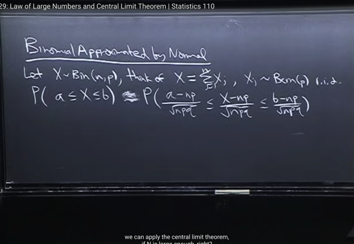</kbd></p>

> [!NOTE]
> Thế thì giả sử ta quan tâm đến việc tính **xác suất của X nằm trong
> đoạn [a, b]**. Khi đó, đại khái là nếu **tính trực tiếp**, ta sẽ dùng **PMF của
> X (Bin(n, p)** là discrete distribution, nên có CDF và PMF) tức **P(X=k)**
> để rồi ta sẽ tính **Σk P(X=k)** với **mọi k nằm trong đoạn [a, b]**. Thì đó
> chính là xác suất cần tìm.
>
> Nhưng như đã nói, **việc tính toán này sẽ tốn kém**. Và có khi ta **chỉ
> muốn uóc lượng** xấp xỉ thôi. Khi đó ta sẽ **dùng normal** để
> approximate. Đầu tiên ta sẽ **standardize**.
>
> việc này vẫn **chưa phải xấp xỉ**, vẫn là **dấu bằng**, tức là **a<=X<=b** thì
> <=>**(a-mean)/std `<=` `(X-mean/std)` `<=` (b-mean/std)**
>
> với **mean** của Bin(n,p) là **np** và **var** của Bin(n,p) là **npq** như đã biết.

<br>

<a id="node-909"></a>

<p align="center"><kbd>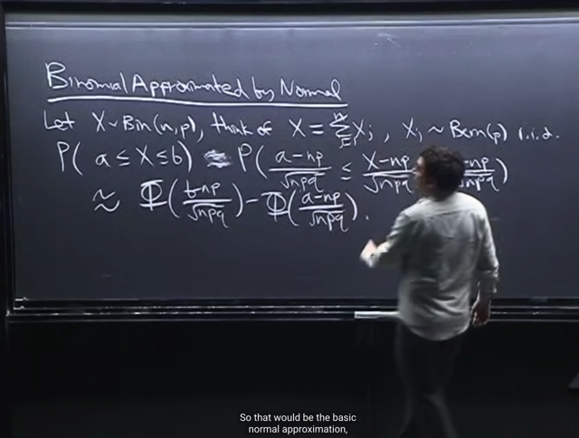</kbd></p>

> [!NOTE]
> Thế thì đại khái là mặc dù **CLT** nói rằng **n `->` inf** nhưng **tùy bài toán /** trường
> hợp cụ thể mà người ta cho rằng **n lớn bao nhiêu là đủ để áp dụng được
> CLT**.
>
> Thế thì khi đó, **(X-np)/√(npq)** mà ta gọi là **X_std** (X standardized) đi sẽ
> được phép cho rằng (bởi CLT) nó là **r.v ~ N(0,1)**. Từ đó **xác suất `X_std` nằm
> trong đoạn `a_std` và b_std** (a, được standardize với công thức trên) sẽ
> chính là **tích phân từ `a_std` đến `b_std` của N(0,1) PDF**.
>
> Và ta nhớ theo **Fundamental Theorem of Calculus 2**, nó chính là nguyên hàm
> của PDF | `a_std:` `b_std,` hay chính là **F(b_std) `-` F(a_std)** với **F là CDF của
> N(0,1)**
>
> Và ta cũng biết **CDF của N(0,1)** đựợc kí hiệu là Φ(x).
>
> Vậy xác suất của **Bin(n,p) X thuộc [a, b] được xấp xỉ là `Φ(b_std)` `-` Φ(a_std)** 
> khi **n lớn**

<br>

<a id="node-910"></a>

<p align="center"><kbd>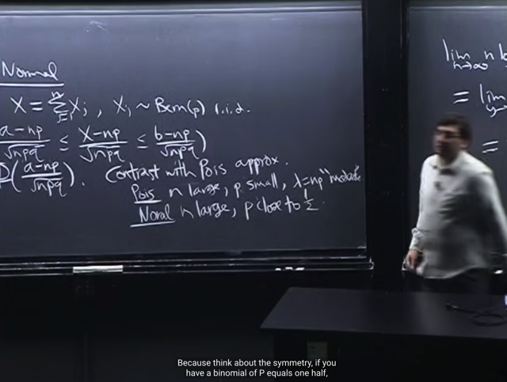</kbd></p>

> [!NOTE]
> Cuối cùng đại khái là. Ta đã từng được biết rằng **trong Bin(n,p)** nếu mà **n trở nên
> lớn** còn **p trở nên rất nhỏ** thì Binomial rv sẽ mang câu chuyện là**số trial
> success** trong bối cảnh có**rất nhiều trial**nhưng **xác suất success rất thấp**.
>
> Điều đó khíến nó trở nên gần với **Poisson**. Hay nói cách khác, khi **n lớn và p
> nhỏ thì Bin(n,p)** có thễ được **approx. bởi Pois(λ=np)**
>
> Còn với việc B**in(n,p) converge về Normal** thì ta hiểu đại khái là:
>
> Như khi **n lớn và p rất nhỏ** thì nó **trở thành Poisson**.
>
> Còn khi **p gần với 1/2** thì **có thể không cần n quá lớn** thì nó cũng **trở nên gần
> với Normal**
>
> Nhưng khi **n vô cùng lớn** thì dù **p có nhỏ mấy** thì nó cũng **trở thành normal
> theo ý nghĩa là cả Poisson cũng trở thành Normal.**

<br>

<a id="node-911"></a>

<p align="center"><kbd>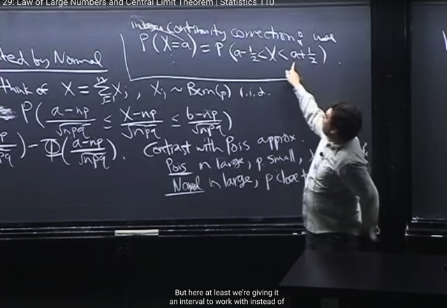</kbd></p>

> [!NOTE]
> Cuối cùng đại khái là một tạm gọi là **một trick** để **khắc phục một vấn đề** khi ta
> **approx. một discrete distribution** bằng một **continuous** **distribution** như khi ta
> **approx. Bin bằng Normal** ở đây.
>
> Bởi ví dụ như khi cần **approx P(X=a)**, (a là integer) thì sẽ vô dụng nếu ta
> approx nó thành 0 (bởi như đã biết với continuous distribution thì xác suất X `=`
> một giá trị cụ thể là bằng 0.
>
> Thế thì khi đó, người ta sẽ approx **P(X=a) `=` P(a-1/2<X<a+1/2)**
>
> bởi **dù sao X cũng là discrete** nên event **X=a cũng the same với event `a-1/2` <
> X < a+1/2**, chẳng qua là **cách thể hiện sau sẽ cho ta một interval**để mà làm
> **việc với PDF của Normal** (dùng nó để approx. Binomial)

<br>

